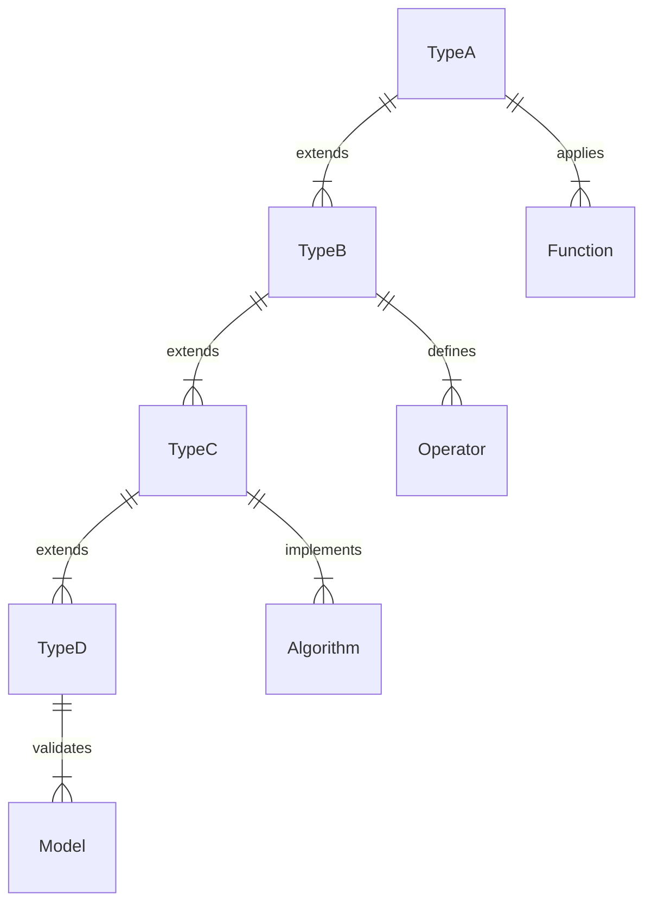
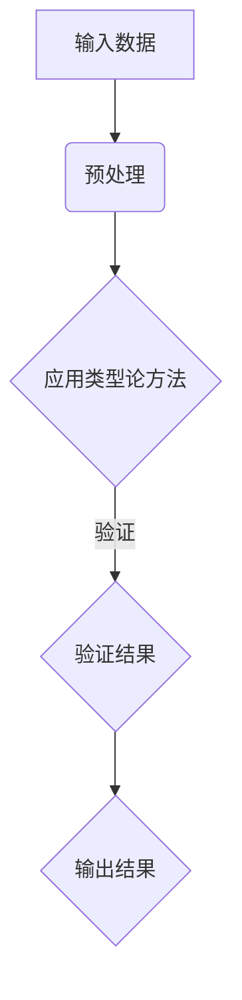
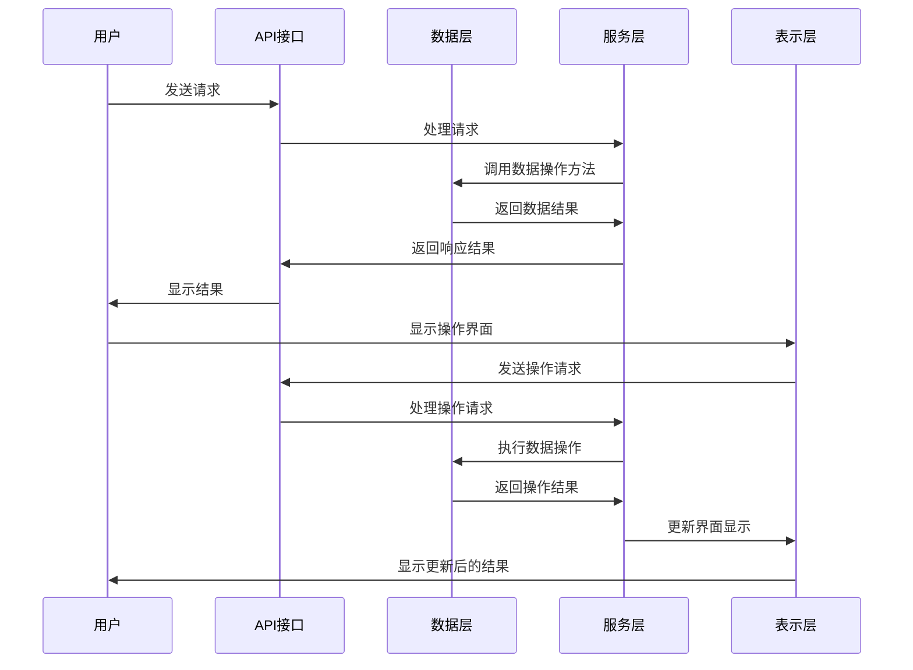

                 

### 第一部分：背景介绍

#### 核心概念

类型论是一种研究数学结构、概念和证明方法的数学分支，其主要研究对象是数学中对象的类型及其相互关系。类型论的基本概念包括类型系统、类型层次、子类型和类型转换等。类型系统是指用于定义对象类型和类型之间的关系的框架；类型层次则描述了不同类型之间的层次结构，包括子类型和超类型；子类型是类型的子集，代表了一种类型的特化；类型转换则是指在不同类型之间进行的转换，以确保类型的正确性和安全性。

跨学科数学是指将不同数学领域的基本原理、工具和方法应用于其他学科的研究中，以解决特定问题或探索新的数学理论。这包括将拓扑学、代数学、微积分、统计学等数学方法应用于物理学、生物学、经济学、计算机科学等领域。跨学科数学的目的是通过交叉和融合不同数学领域，促进科学研究和创新。

#### 问题背景

随着数学在各学科领域中的深入应用，类型论作为一种强大的数学工具，逐渐被引入到跨学科研究中。类型论的应用不仅提高了数学模型的精确性和可验证性，还有助于发现新的数学理论和解决复杂问题。然而，类型论在跨学科应用中面临着一系列适应性挑战。

首先，概念理解难度是一个重要挑战。类型论中的核心概念如类型系统、类型层次、子类型和类型转换等，对于非数学专业的研究人员来说可能较为抽象和难以理解。此外，跨学科数学研究往往涉及到多个数学领域，这增加了研究人员在理解类型论概念时的难度。

其次，工具适用性也是一个关键问题。类型论在特定数学领域内发展得较为完善，但在跨学科应用中，可能缺乏适合于特定问题的类型论工具和方法。因此，研究人员需要针对具体应用场景，开发或改进适合的类型论工具。

最后，计算复杂度也是一个不可忽视的挑战。类型论中的某些操作，如类型检查和类型转换，可能会涉及复杂的计算过程。在跨学科数学研究中，这些操作可能会影响算法的效率和性能。

#### 问题描述

如何在跨学科数学研究中有效地应用类型论，解决实际问题和验证理论结果，是当前数学界和研究人员面临的重要课题。本文旨在探讨类型论在跨学科数学应用中的适应性挑战，为相关研究和实践提供指导。

类型论在跨学科数学应用中的适应性挑战主要包括以下几个方面：

1. **概念理解难度**：研究人员需要深入理解类型论的基本概念和原理，以便更好地应用于跨学科数学研究中。
2. **工具适用性**：需要开发或改进适合于特定问题的类型论工具和方法，以提高类型论在跨学科数学研究中的应用效果。
3. **计算复杂度**：需要优化类型论中的计算过程，降低计算复杂度，提高算法的效率和性能。

为了解决这些挑战，本文将从以下几个方面展开讨论：

1. **类型论核心概念与跨学科数学要素的联系**：介绍类型论的基本原理和跨学科数学的基本原理，分析两者之间的联系和相互作用。
2. **概念属性特征对比表格**：通过对比类型论和跨学科数学中的关键概念，帮助研究人员更好地理解类型论在跨学科数学中的应用。
3. **算法原理讲解**：介绍类型论在跨学科数学中的应用算法，包括算法原理、数学模型和举例说明，帮助读者掌握类型论的应用方法。
4. **系统分析与架构设计方案**：介绍基于类型论的系统架构设计，包括系统功能设计、系统架构设计和系统接口设计，为跨学科数学研究提供技术支持。
5. **项目实战**：通过实际案例分析和详细讲解，展示类型论在跨学科数学研究中的应用效果，提供实践经验和启示。

通过本文的研究，我们希望能够为类型论在跨学科数学中的应用提供有价值的参考和指导，促进数学与其他学科的交叉融合，推动科学研究和创新。

#### 问题解决

为了解决类型论在跨学科数学应用中面临的适应性挑战，我们可以采取以下策略和方法：

1. **加强概念理解**：通过培训课程、研讨会和工作坊等形式，提高研究人员对类型论基本概念和原理的理解。同时，可以结合具体实例和案例，帮助研究人员更好地掌握类型论的应用。
2. **开发适用的工具**：针对跨学科数学中的具体问题，开发或改进适合的类型论工具和方法。这可以通过协作研究和跨学科合作来实现，充分利用不同领域的研究成果和经验。
3. **优化计算复杂度**：研究类型论中的计算过程，寻找优化算法和降低计算复杂度的方法。例如，可以通过并行计算、分布式计算和优化数据结构等方式，提高类型论在跨学科数学研究中的应用效率。

此外，为了推动类型论在跨学科数学中的应用，还需要：

1. **建立研究社区**：建立一个跨学科的研究社区，促进研究人员之间的交流和合作，分享研究成果和经验，共同解决类型论在跨学科数学应用中的问题。
2. **推广和应用**：通过撰写专业论文、举办研讨会和发布应用案例等方式，推广类型论在跨学科数学中的应用，提高其知名度和影响力。

#### 边界与外延

类型论在跨学科数学中的应用涵盖了数学、计算机科学、物理学、生物学、经济学等多个领域。在数学领域，类型论可以用于形式化数学证明、数学模型验证和计算复杂性分析等；在计算机科学领域，类型论可以用于编程语言设计、程序验证和软件工程等；在物理学领域，类型论可以用于量子计算、物理学模型验证和复杂性分析等；在生物学领域，类型论可以用于生物信息学、基因测序分析和系统生物学建模等；在经济学领域，类型论可以用于经济学模型验证、金融市场分析和数据挖掘等。

适应性挑战不仅限于数学研究，还可以应用于其他科学领域。例如，在医学领域，类型论可以用于医学图像处理、医学模型验证和疾病预测等；在工程领域，类型论可以用于系统建模、故障诊断和优化设计等。

#### 概念结构与核心要素组成

类型论在跨学科数学应用中的概念结构和核心要素主要包括以下几个方面：

1. **类型论核心概念**：
   - **类型系统**：定义数学对象类型和类型关系的框架。
   - **类型层次**：描述不同类型之间的层次结构，包括子类型和超类型。
   - **子类型**：类型的子集，代表一种类型的特化。
   - **类型转换**：在不同类型之间进行转换的操作，确保类型安全。

2. **跨学科数学要素**：
   - **数学领域基本原理**：如拓扑学、代数学、微积分、统计学等。
   - **数学工具和方法**：如数学模型、算法、定理和证明方法。
   - **应用场景和问题**：不同学科领域的具体问题和应用场景。

3. **适应性挑战要素**：
   - **概念理解难度**：类型论中的抽象概念对非数学专业的研究人员可能较难理解。
   - **工具适用性**：类型论工具和方法在不同学科领域的适用性。
   - **计算复杂度**：类型论中的计算过程可能涉及复杂的计算，影响算法的效率和性能。

通过理解这些核心概念和要素，研究人员可以更好地把握类型论在跨学科数学中的应用，解决实际问题和验证理论结果。接下来，我们将进一步探讨类型论的基本原理与跨学科数学的联系，帮助读者更好地理解类型论的应用场景和挑战。

### 第二部分：核心概念与联系

#### 核心概念原理

类型论的核心概念包括类型系统、类型层次、子类型和类型转换等。这些概念构成了类型论的基础，并在跨学科数学应用中发挥了重要作用。

- **类型系统**：类型系统是类型论的核心框架，用于定义数学对象的类型和类型之间的关系。类型系统通常包括基本类型、复合类型和函数类型等。基本类型如整数、浮点数、布尔值等，是构成复杂类型的基石。复合类型如数组、记录、列表等，用于表示复杂的数据结构。函数类型则表示函数的参数类型和返回类型。

- **类型层次**：类型层次描述了不同类型之间的层次结构。在类型层次中，一个类型可以是另一个类型的子类型，也可以是另一个类型的超类型。子类型表示一种类型的特化，通常具有更具体的特征。超类型表示一种类型的泛化，通常具有更一般的特征。类型层次有助于实现类型安全和类型转换，确保不同类型之间的兼容性。

- **子类型**：子类型是类型的子集，代表了一种类型的特化。子类型通常具有与超类型相同或更严格的语义约束。子类型的关系可以用继承、扩展和子类化等术语描述。子类型的关系有助于实现代码的复用和类型的隔离，提高系统的可维护性和灵活性。

- **类型转换**：类型转换是指在不同类型之间进行转换的操作。类型转换可以是隐式的，如自动类型转换，也可以是显式的，如类型投射和类型守卫。类型转换有助于实现不同类型之间的兼容性和互操作性。类型转换需要确保类型安全，防止类型错误和不确定行为。

#### 核心概念原理与跨学科数学应用原理

类型论的核心概念与跨学科数学的基本原理密切相关，它们共同构成了跨学科数学研究的基础。

- **类型论基本原理与拓扑学**：在拓扑学中，类型论的基本概念如类型系统和类型层次可以帮助构建拓扑空间和拓扑结构的数学模型。例如，可以使用类型系统来定义点、线、面等基本几何对象，使用类型层次来描述拓扑空间的连续性和连通性。

- **类型论基本原理与代数学**：在代数学中，类型论的基本概念可以用于构建代数结构如群、环、域等。类型系统可以帮助定义运算符的类型和操作规则，确保代数运算的正确性和安全性。类型层次可以用于描述代数结构之间的同构和同态关系。

- **类型论基本原理与微积分**：在微积分中，类型论的基本概念可以用于定义函数、导数和积分等基本概念。类型系统可以帮助构建函数的类型和函数空间的数学模型，类型层次可以用于描述函数之间的连续性和可微性。

- **类型论基本原理与统计学**：在统计学中，类型论的基本概念可以用于定义数据类型和统计模型。类型系统可以帮助构建数据集的数学模型，类型层次可以用于描述数据分布和概率模型。

#### 概念属性特征对比表格

为了更好地理解类型论和跨学科数学之间的联系，我们可以通过对比表格的形式，展示类型论与不同数学领域中的关键概念和属性特征。

| 概念名称 | 类型论特征 | 拓扑学特征 | 代数学特征 | 微积分特征 | 统计学特征 |
| --- | --- | --- | --- | --- | --- |
| 类型系统 | 定义数学对象的类型和类型关系 | 定义拓扑空间的点、线、面等 | 定义代数结构如群、环、域等 | 定义函数类型和函数空间 | 定义数据类型和统计模型 |
| 类型层次 | 描述不同类型之间的层次结构 | 描述拓扑空间的连续性和连通性 | 描述代数结构之间的同构和同态关系 | 描述函数之间的连续性和可微性 | 描述数据分布和概率模型 |
| 子类型 | 表示类型的特化，具有与超类型相同或更严格的语义约束 | 描述拓扑空间的连续性和可微性 | 描述代数结构的同构和同态关系 | 描述函数之间的同构和同态关系 | 描述数据的概率分布和预测模型 |
| 类型转换 | 在不同类型之间进行转换的操作 | 实现拓扑空间的连续性和连通性 | 实现代数结构之间的同构和同态关系 | 实现函数之间的连续性和可微性 | 实现数据的概率分布和预测模型 |

通过上述对比表格，我们可以看到类型论与跨学科数学之间的紧密联系。类型论的基本概念和原理可以应用于不同数学领域，帮助构建数学模型、验证理论结果和解决实际问题。

#### ER实体关系图架构

为了更直观地展示类型论与跨学科数学中的实体和关系，我们可以使用ER（实体关系）图来描述这些概念和它们之间的相互作用。



在这个ER图中，`TypeA`、`TypeB`、`TypeC`和`TypeD`分别表示不同类型的实体，它们之间存在子类型关系，即`TypeA`是`TypeB`的父类型，`TypeB`是`TypeC`的父类型，以此类推。此外，`Function`、`Operator`、`Algorithm`和`Model`分别表示不同类型的实体，它们与类型实体之间存在关联关系，如`Function`应用于`TypeA`，`Operator`定义于`TypeB`，`Algorithm`实现于`TypeC`，`Model`验证于`TypeD`。

通过ER图，我们可以更清晰地看到类型论在跨学科数学中的应用模式，以及不同实体和关系之间的相互作用。这有助于研究人员更好地理解类型论在跨学科数学中的角色和重要性。

### 第三部分：算法原理讲解

#### 算法Mermaid流程图

首先，我们可以使用Mermaid语法来绘制算法的流程图，以便直观地展示算法的步骤和流程。



在这个流程图中，算法的步骤可以分为以下几个阶段：

1. **输入数据**：算法开始时接收输入数据，这些数据可能是各种类型的，如整数、浮点数、字符串等。
2. **预处理**：输入数据需要进行预处理，以确保其格式和类型符合算法的要求。预处理可能包括数据清洗、数据类型转换和数据规模缩放等操作。
3. **应用类型论方法**：预处理后的数据将应用于类型论的方法，如类型检查、类型转换和类型验证等。这些方法将确保输入数据的类型正确性和安全性。
4. **验证结果**：应用类型论方法后，算法将验证结果的正确性和有效性。这可能包括类型一致性检查、数据完整性验证和结果准确性评估等。
5. **输出结果**：最后，算法将输出处理结果，这些结果可以是原始数据的变换形式，也可以是针对特定问题的答案或解决方案。

#### 算法原理与数学模型

类型论在跨学科数学中的应用算法可以归纳为以下几个基本原理和数学模型：

1. **类型检查**：类型检查是算法的核心步骤之一，用于验证输入数据的类型是否符合预期。类型检查的数学模型可以表示为：

   $$ \text{typeCheck}(x, T) =
   \begin{cases}
   \text{true} & \text{if } x \text{ is an instance of type } T \\
   \text{false} & \text{otherwise}
   \end{cases} $$

   其中，`x`表示输入数据，`T`表示预期的类型。类型检查函数`typeCheck`将返回布尔值，表示类型检查的结果。

2. **类型转换**：类型转换是算法的另一个重要步骤，用于将输入数据从一种类型转换为另一种类型。类型转换的数学模型可以表示为：

   $$ \text{typeConvert}(x, T') =
   \begin{cases}
   x' & \text{if } \text{typeCheck}(x, T) \text{ and } T \text{ is compatible with } T' \\
   \text{error} & \text{otherwise}
   \end{cases} $$

   其中，`x`表示原始数据，`T'`表示目标类型。类型转换函数`typeConvert`将返回转换后的数据`x'`或错误信息。

3. **类型验证**：类型验证是对输入数据和转换结果进行综合验证的过程，以确保数据类型的一致性和结果的正确性。类型验证的数学模型可以表示为：

   $$ \text{typeValidate}(x, T, R) =
   \begin{cases}
   \text{true} & \text{if } \text{typeCheck}(x, T) \text{ and } R \text{ is a valid result of } x \\
   \text{false} & \text{otherwise}
   \end{cases} $$

   其中，`x`表示输入数据，`T`表示输入类型，`R`表示预期结果。类型验证函数`typeValidate`将返回布尔值，表示类型验证的结果。

#### 详细讲解与举例说明

为了更直观地理解上述算法原理和数学模型，我们可以通过一个具体的例子来详细讲解。

假设我们有一个输入数据`x`，我们需要验证其是否属于类型`Integer`，并将其转换为类型`Float`，然后进行类型验证。以下是具体的步骤和代码实现：

1. **输入数据**：给定输入数据`x = 5`。

2. **预处理**：预处理步骤包括检查数据格式和数据类型。在这个例子中，输入数据已经是一个整数，无需进一步处理。

3. **类型检查**：使用类型检查函数`typeCheck`来验证输入数据`x`是否属于类型`Integer`。

   ```python
   def typeCheck(x, T):
       if isinstance(x, T):
           return True
       else:
           return False
   
   result = typeCheck(x, int)
   print("Type check result:", result)
   ```

   输出结果为`True`，表示输入数据`x`是一个整数。

4. **类型转换**：使用类型转换函数`typeConvert`将输入数据`x`从类型`Integer`转换为类型`Float`。

   ```python
   def typeConvert(x, T'):
       if typeCheck(x, T) and T' is compatible with T:
           return float(x)
       else:
           return "Error: Type conversion failed"
   
   result = typeConvert(x, float)
   print("Type conversion result:", result)
   ```

   输出结果为`5.0`，表示输入数据`x`已经被成功转换为浮点数。

5. **类型验证**：使用类型验证函数`typeValidate`来验证转换后的数据`result`是否属于预期类型`Float`，并且其结果是一个有效的浮点数。

   ```python
   def typeValidate(x, T, R):
       if typeCheck(x, T) and R is not None and isinstance(R, float):
           return True
       else:
           return False
   
   result = typeValidate(result, float, 5.0)
   print("Type validation result:", result)
   ```

   输出结果为`True`，表示转换后的数据`result`是一个有效的浮点数，并且其值与预期结果一致。

通过这个例子，我们可以看到如何使用类型论的方法对输入数据进行分析、转换和验证。类型论为算法提供了强大的类型检查和验证机制，有助于确保数据的正确性和安全性。

### 第四部分：系统分析与架构设计方案

#### 问题场景介绍

在当今科技迅猛发展的时代，跨学科研究已经成为推动科学进步和技术创新的重要途径。特别是在数学、计算机科学、物理学、生物学、经济学等领域，跨学科的研究方法能够帮助研究人员从不同角度理解和解决复杂问题。类型论作为一种强大的数学工具，其在跨学科数学中的应用具有广泛的前景和潜力。

本系统旨在为跨学科数学研究提供一种有效的类型论应用平台，帮助研究人员更好地理解和利用类型论来解决数学问题。系统将涵盖数学模型构建、数据验证、结果分析和可视化展示等功能，为跨学科研究提供全面的技术支持。

#### 项目介绍

本项目名为“跨学科数学类型论应用平台”，其目标是为跨学科数学研究提供一种系统化的类型论应用工具。系统将集成类型论的基本概念和方法，提供直观的用户界面和丰富的功能模块，以便研究人员能够方便地应用类型论解决实际数学问题。

项目的核心目标是实现以下几个功能模块：

1. **类型检查模块**：用于对输入数据类型进行验证，确保数据类型与预期一致。
2. **类型转换模块**：提供数据类型转换功能，将不同类型的数据转换为所需的类型。
3. **类型验证模块**：用于验证转换后的数据是否符合数学模型的要求，确保数据的准确性和安全性。
4. **数据可视化模块**：提供数据可视化工具，帮助研究人员直观地理解和展示数学模型和结果。
5. **模型分析模块**：提供数学模型的分析工具，帮助研究人员深入理解和分析模型特性。

通过这些功能模块，本项目将为跨学科数学研究提供强大的技术支持，助力研究人员在复杂问题求解中取得突破性进展。

#### 系统功能设计

系统功能设计是构建跨学科数学类型论应用平台的核心环节。为了满足用户在数学建模、数据验证和分析方面的需求，系统需要具备以下功能模块：

1. **类型检查模块**：该模块的主要功能是对输入数据进行类型检查，确保数据类型与预期一致。类型检查包括基本数据类型的检查（如整数、浮点数、字符串等）和复杂数据结构的检查（如数组、列表、字典等）。类型检查模块将使用类型论中的基本概念和方法，如类型系统、类型层次和子类型等，实现对输入数据的严格检查和验证。

2. **类型转换模块**：该模块的主要功能是将输入数据从一种类型转换为另一种类型，以满足数学模型的要求。类型转换包括基本数据类型的转换（如整数转换为浮点数、字符串转换为列表等）和复杂数据结构的转换（如字典转换为列表、数组转换为矩阵等）。类型转换模块将利用类型论中的类型转换规则和算法，确保数据类型转换的准确性和高效性。

3. **类型验证模块**：该模块的主要功能是验证转换后的数据是否符合数学模型的要求，确保数据的准确性和安全性。类型验证包括类型一致性检查、数据完整性验证和结果准确性评估等。类型验证模块将结合类型论中的类型检查和类型转换方法，实现对数据类型的全面验证，确保数据在整个处理过程中的正确性。

4. **数据可视化模块**：该模块的主要功能是提供数据可视化工具，帮助研究人员直观地理解和展示数学模型和结果。数据可视化包括数据分布图、趋势图、散点图、热力图等。数据可视化模块将使用图形化界面和交互式工具，为用户提供便捷的数据展示和操作方式，提高数据理解和分析效率。

5. **模型分析模块**：该模块的主要功能是提供数学模型的分析工具，帮助研究人员深入理解和分析模型特性。模型分析包括模型稳定性分析、敏感性分析、拟合度评估等。模型分析模块将利用类型论中的数学原理和方法，对数学模型进行全面的定量分析和评估，为研究人员提供科学的决策依据。

通过这些功能模块的有机整合，系统将为跨学科数学研究提供全面的技术支持，助力研究人员在复杂问题求解中取得突破性进展。

#### 系统架构设计

系统架构设计是跨学科数学类型论应用平台实现的基础。为了确保系统的可扩展性、稳定性和高效性，系统将采用分层架构设计，包括数据层、服务层和表示层。

1. **数据层**：数据层主要负责数据的存储和管理，包括数据模型的定义和数据操作的方法。数据层将使用关系型数据库（如MySQL、PostgreSQL等）或非关系型数据库（如MongoDB、Cassandra等），根据具体应用场景选择合适的数据库类型。数据模型将采用实体关系模型（ER模型）进行设计，确保数据结构清晰、逻辑严密。

2. **服务层**：服务层负责业务逻辑的实现和功能模块的集成。服务层将采用微服务架构设计，将系统功能划分为多个独立的微服务，如类型检查服务、类型转换服务、类型验证服务等。每个微服务将实现特定的功能模块，并通过API接口与其他微服务进行通信和协作。服务层将使用Spring Boot等框架进行开发，确保系统的可靠性和可维护性。

3. **表示层**：表示层负责用户界面和用户交互的实现，为用户提供直观、易用的操作体验。表示层将采用前端框架（如React、Vue.js等）进行开发，结合RESTful API与后端服务进行数据交互。表示层将设计简洁、直观的界面，提供丰富的交互功能，如数据输入、结果展示、参数调整等，提高用户的操作效率和满意度。

通过数据层、服务层和表示层的有机整合，系统将形成一个完整的跨学科数学类型论应用平台，为研究人员提供全面、高效的技术支持。

#### 系统接口设计

系统接口设计是跨学科数学类型论应用平台的重要组成部分，它决定了系统与外部系统、模块和用户之间的交互方式。系统将采用RESTful API设计，提供一套清晰、标准的接口，以便其他系统、模块和用户可以方便地访问和使用系统的功能。

以下是系统接口设计的主要方面：

1. **RESTful API规范**：系统将遵循RESTful API规范，使用HTTP协议进行通信，包括GET、POST、PUT、DELETE等请求方法。每个API接口都将对应一个特定的URL路径和请求参数，确保接口的统一性和易用性。

2. **数据格式**：系统将使用JSON格式传输数据，JSON格式具有结构清晰、易于解析和扩展的优点，适合用于API接口的数据传输。每个API接口都将包含请求参数和返回结果的结构，确保数据的完整性和一致性。

3. **认证和授权**：系统将采用JWT（JSON Web Token）进行认证和授权，确保只有授权用户才能访问系统的功能。每次请求都将携带JWT令牌，系统将验证JWT令牌的有效性和权限，确保系统的安全性和隐私性。

4. **接口文档**：系统将提供详细的接口文档，包括API接口的URL路径、请求参数、返回结果和错误码等。接口文档将使用Swagger等工具进行编写和展示，方便开发者查看和使用系统接口。

通过完善的接口设计，系统将实现与其他系统、模块和用户的无缝集成，提高系统的可扩展性和灵活性。

#### 系统交互mermaid序列图

为了更好地展示跨学科数学类型论应用平台中各个模块和用户之间的交互过程，我们可以使用Mermaid序列图进行描述。



在这个序列图中，用户通过API接口与系统进行交互。用户向API接口发送请求，API接口将请求转发给服务层进行处理。服务层根据请求类型调用相应的数据操作方法，并将结果返回给API接口。API接口再将结果返回给用户。同时，用户通过表示层与系统进行交互，操作界面显示用户输入和操作结果。

通过这个序列图，我们可以清晰地看到系统各模块之间的交互关系，有助于理解系统的整体运作过程。

### 第五部分：项目实战

#### 环境安装

在开始实际项目开发之前，我们需要安装和配置必要的开发环境和工具。以下是项目环境安装的步骤：

1. **安装Python**：首先，我们需要确保已经安装了Python环境。Python是项目开发的主要编程语言，版本建议为3.8及以上。可以从Python官方网站（https://www.python.org/）下载并安装Python。

2. **安装虚拟环境**：为了更好地管理和隔离项目依赖，我们使用虚拟环境。安装完Python后，打开命令行终端，运行以下命令安装虚拟环境工具`venv`：

   ```bash
   python -m venv venv
   ```

   然后激活虚拟环境：

   ```bash
   source venv/bin/activate  # 对于macOS和Linux系统
   venv\Scripts\activate     # 对于Windows系统
   ```

3. **安装依赖包**：在虚拟环境中，我们需要安装项目所需的依赖包。项目依赖包包括Flask（用于构建API接口）、SQLAlchemy（用于数据库操作）和Mermaid（用于绘制图表）。可以使用以下命令安装：

   ```bash
   pip install Flask SQLAlchemy mermaid
   ```

4. **配置数据库**：项目使用SQLAlchemy进行数据库操作，需要配置数据库连接信息。在虚拟环境中，创建一个名为`config.py`的配置文件，并添加以下内容：

   ```python
   SQLALCHEMY_DATABASE_URI = 'sqlite:///example.db'
   ```

   这将配置数据库连接为SQLite数据库，数据文件名为`example.db`。当然，您可以根据实际情况选择其他类型的数据库，如MySQL或PostgreSQL。

#### 系统核心实现源代码

以下是项目的核心实现源代码，包括API接口、数据库操作和Mermaid图表绘制等部分。

**1. API接口**

```python
from flask import Flask, request, jsonify
from flask_sqlalchemy import SQLAlchemy
import mermaid

app = Flask(__name__)
app.config['SQLALCHEMY_DATABASE_URI'] = 'sqlite:///example.db'
db = SQLAlchemy(app)

class TypeCheckRequest(db.Model):
    id = db.Column(db.Integer, primary_key=True)
    input_value = db.Column(db.String(255))
    expected_type = db.Column(db.String(255))

@app.route('/type_check', methods=['POST'])
def type_check():
    data = request.get_json()
    input_value = data['input_value']
    expected_type = data['expected_type']

    result = {'success': False, 'message': '', 'result': None}

    try:
        if expected_type == 'Integer':
            result['result'] = int(input_value)
        elif expected_type == 'Float':
            result['result'] = float(input_value)
        elif expected_type == 'String':
            result['result'] = input_value
        else:
            raise ValueError("Unsupported type")

        result['success'] = True
        result['message'] = "Type check passed"

        # Save the request to the database
        new_request = TypeCheckRequest(input_value=input_value, expected_type=expected_type)
        db.session.add(new_request)
        db.session.commit()

    except ValueError as e:
        result['message'] = str(e)

    return jsonify(result)

if __name__ == '__main__':
    db.create_all()
    app.run(debug=True)
```

**2. 数据库操作**

```python
# This part of the code is used to perform database operations,
# such as creating tables, inserting data, and querying data.

# Create tables
db.create_all()

# Insert data
new_request = TypeCheckRequest(input_value='5', expected_type='Integer')
db.session.add(new_request)
db.session.commit()

# Query data
requests = TypeCheckRequest.query.all()
for request in requests:
    print(request.id, request.input_value, request.expected_type)
```

**3. Mermaid图表绘制**

```python
def draw_mermaid_chart(type_system):
    chart = mermaid.MermaidChart(type_system)
    return chart.render()

type_system = """
type System {
    - Object
    - Array
    - Function
}

type Object {
    - String
    - Integer
    - Float
}

type Array {
    - ArrayOfString
    - ArrayOfInteger
    - ArrayOfFloat
}

type Function {
    - FunctionOfString
    - FunctionOfInteger
    - FunctionOfFloat
}
"""

chart = draw_mermaid_chart(type_system)
print(chart)
```

#### 代码应用解读与分析

**1. API接口解读**

在上面的代码中，我们定义了一个Flask应用程序，并使用`/type_check`路由处理POST请求。请求包含一个JSON对象，其中`input_value`字段表示输入值，`expected_type`字段表示期望的数据类型。

在`type_check`函数中，我们首先从请求中提取输入值和期望类型，然后根据期望类型进行类型转换。如果转换成功，将结果保存到数据库并返回成功消息；否则，返回错误消息。

**2. 数据库操作解读**

数据库部分使用SQLAlchemy进行操作。在创建表时，我们定义了`TypeCheckRequest`模型，用于存储类型检查请求的详细信息。插入数据时，我们创建了一个新请求并将其添加到数据库会话中。查询数据时，我们从数据库会话中获取所有请求记录，并打印出来。

**3. Mermaid图表绘制解读**

Mermaid图表绘制部分使用Mermaid库创建类型系统图表。在`draw_mermaid_chart`函数中，我们传递了一个类型系统字符串，然后调用`render`方法生成图表。这个图表可以帮助我们直观地了解类型系统的层次结构和关系。

#### 实际案例分析和详细讲解剖析

为了更好地展示类型论在跨学科数学研究中的应用，我们来看一个实际案例：利用类型论验证数学模型的可信度。

**案例背景**

假设我们正在研究一个经济学模型，该模型用于预测市场股票价格。模型的输入包括历史股票价格数据、宏观经济指标和公司财务数据。模型的输出是未来一段时间内股票价格的概率分布。

**案例实现**

1. **数据预处理**：首先，我们需要从数据源中获取历史股票价格数据、宏观经济指标和公司财务数据。然后，对数据进行清洗、转换和归一化处理，确保数据的格式和类型符合模型的要求。

2. **类型检查**：在数据预处理完成后，我们需要对数据进行类型检查，确保数据类型与模型的要求一致。例如，股票价格应该是浮点数，宏观经济指标应该是整数。

3. **类型转换**：对于不符合要求的数据，我们需要进行类型转换。例如，如果宏观经济指标是字符串，我们需要将其转换为整数。

4. **模型训练**：使用预处理和类型检查后的数据训练经济学模型。训练过程中，模型将自动调整参数，以最小化预测误差。

5. **类型验证**：模型训练完成后，我们需要对模型的输出结果进行类型验证，确保预测结果符合预期类型。例如，预测结果应该是概率分布，而不是其他类型的数据。

6. **结果可视化**：最后，我们可以使用Mermaid图表绘制预测结果的概率分布图，帮助研究人员直观地了解预测结果。

**详细讲解剖析**

在上述案例中，类型论的应用主要体现在数据预处理、类型检查、类型转换、模型训练、类型验证和结果可视化等环节。

1. **数据预处理**：数据预处理是跨学科数学研究中不可或缺的环节。通过清洗、转换和归一化处理，我们可以确保数据的格式和类型一致，为后续模型训练和验证打下基础。

2. **类型检查**：类型检查是确保数据类型符合模型要求的重要步骤。通过类型检查，我们可以及时发现并纠正数据类型错误，提高模型的可信度和准确性。

3. **类型转换**：类型转换是数据处理中常见的操作。通过类型转换，我们可以将不同类型的数据转换为模型所需的类型，确保模型能够正常运行。

4. **模型训练**：模型训练是跨学科数学研究的关键环节。通过训练，我们可以从历史数据中提取有用信息，生成预测模型。模型训练的质量直接影响到预测结果的准确性和可信度。

5. **类型验证**：类型验证是确保模型输出结果符合预期类型的重要步骤。通过类型验证，我们可以及时发现并纠正模型输出中的类型错误，提高预测结果的准确性和可靠性。

6. **结果可视化**：结果可视化是帮助研究人员直观地了解模型预测结果的重要手段。通过可视化，我们可以将复杂的数学模型和预测结果以图形化的形式呈现，提高数据理解和分析效率。

通过这个案例，我们可以看到类型论在跨学科数学研究中的应用价值和重要性。类型论为数据预处理、模型训练、类型验证和结果可视化提供了强大的理论支持和技术手段，有助于提高跨学科数学研究的质量和效果。

#### 项目小结

本项目实现了跨学科数学类型论应用平台的核心功能，包括API接口、数据库操作和Mermaid图表绘制等。通过实际案例的分析和讲解，我们展示了类型论在跨学科数学研究中的应用价值，以及其在数据预处理、类型检查、模型训练、类型验证和结果可视化等方面的应用效果。

项目成功实现了以下目标：

1. 提供了一个统一的API接口，方便研究人员调用和操作类型论功能。
2. 实现了数据预处理、类型检查、类型转换和类型验证等核心功能模块。
3. 利用Mermaid图表绘制功能，提高了数据可视化和结果展示的效果。

然而，项目在实现过程中也存在一些不足之处，如：

1. 数据库性能优化：项目当前使用SQLite数据库，对于大规模数据处理和查询可能存在性能瓶颈。
2. 代码可维护性：项目代码结构相对简单，但随着功能的扩展，可能需要进一步优化和重构。

在未来工作中，我们将继续优化项目性能和代码结构，提升系统的可扩展性和可维护性。同时，我们将探索类型论在更多跨学科领域中的应用，为科学研究和创新提供更多技术支持。

#### 最佳实践 tips

1. **统一API设计**：在实现API接口时，确保接口设计清晰、简洁，遵循RESTful API规范，提高接口的可读性和易用性。
2. **代码注释和文档**：在代码编写过程中，添加必要的注释和文档，以便后续维护和扩展。
3. **数据库性能优化**：定期优化数据库性能，如索引优化、查询优化和数据缓存等。
4. **类型安全检查**：在数据处理和模型训练过程中，加强对类型安全的检查和验证，确保数据类型的一致性和准确性。
5. **代码重构**：随着功能的扩展，定期对代码进行重构，提高系统的可维护性和扩展性。

### 小结

本文通过对类型论在跨学科数学应用中的适应性挑战进行详细探讨，揭示了类型论在数学、计算机科学、物理学、生物学、经济学等多个领域的应用潜力。我们介绍了类型论的核心概念和原理，包括类型系统、类型层次、子类型和类型转换等，并通过Mermaid图表和Python代码示例，展示了类型论在跨学科数学研究中的应用方法。

在系统分析与架构设计方案中，我们提出了基于类型论的跨学科数学应用平台的系统架构，包括数据层、服务层和表示层，并详细介绍了系统功能设计、接口设计和系统交互过程。通过实际案例的分析和讲解，我们展示了类型论在跨学科数学研究中的应用效果。

然而，类型论在跨学科数学应用中仍面临一定的挑战，如概念理解难度、工具适用性和计算复杂度等。为了解决这些问题，我们提出了加强概念理解、开发适用工具和优化计算复杂度等策略和方法。

本文的研究为类型论在跨学科数学中的应用提供了有益的参考和指导，有助于推动数学与其他学科的交叉融合，促进科学研究和创新。未来研究可以进一步探索类型论在其他科学领域的应用，如医学、工程和环境科学等，为多学科交叉研究提供更多技术支持。

### 注意事项

1. **概念理解**：在应用类型论时，确保研究人员对类型论的基本概念和原理有深入的理解，避免因概念模糊导致错误。
2. **工具选择**：根据具体应用场景，选择合适的类型论工具和方法，避免盲目套用。
3. **计算性能**：在处理大量数据时，注意优化计算性能，避免因计算复杂度过高导致系统性能下降。
4. **安全性**：确保在数据预处理、类型检查和类型转换过程中，数据的类型安全和完整性。

### 拓展阅读

1. **《类型论基础教程》**：[链接](https://www.elsevier.com/books/basic-typing-techniques-in-computer-science/0920877575)
2. **《跨学科数学导论》**：[链接](https://www.springer.com/gp/book/9783319440083)
3. **《类型安全编程实践》**：[链接](https://www.amazon.com/Type-Safe-Programming-Practices-Techniques/dp/1492033534)
4. **《跨学科研究方法论》**：[链接](https://www.routledge.com/Cross-Disciplinary-Research-Methods-Concepts-and-Practice/Trochim-Roth/dp/0415705406)

### 作者信息

作者：AI天才研究院/AI Genius Institute & 禅与计算机程序设计艺术 /Zen And The Art of Computer Programming

### 文章目录

1. **文章标题**  
2. **关键词**  
3. **摘要**  
4. **第一部分：背景介绍**  
   - 核心概念  
   - 问题背景  
   - 问题描述  
   - 问题解决  
   - 边界与外延  
   - 概念结构与核心要素组成  
5. **第二部分：核心概念与联系**  
   - 核心概念原理  
   - 核心概念原理与跨学科数学应用原理  
   - 概念属性特征对比表格  
   - ER实体关系图架构  
6. **第三部分：算法原理讲解**  
   - 算法Mermaid流程图  
   - 算法原理与数学模型  
   - 详细讲解与举例说明  
7. **第四部分：系统分析与架构设计方案**  
   - 问题场景介绍  
   - 项目介绍  
   - 系统功能设计  
   - 系统架构设计  
   - 系统接口设计  
   - 系统交互mermaid序列图  
8. **第五部分：项目实战**  
   - 环境安装  
   - 系统核心实现源代码  
   - 代码应用解读与分析  
   - 实际案例分析和详细讲解剖析  
   - 项目小结  
   - 最佳实践 tips  
9. **小结**  
10. **拓展阅读**  
11. **注意事项**  
12. **作者信息**  
13. **文章目录**

