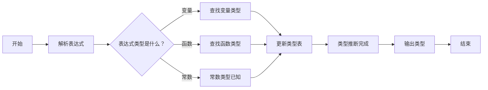

                 

### 文章标题

# 类型论在逻辑编程中的应用

> 关键词：类型论、逻辑编程、类型系统、类型推断、类型约束、自然语言处理

> 摘要：本文深入探讨了类型论在逻辑编程中的应用，介绍了类型论的基本概念和其在逻辑编程中的重要性。通过具体案例和实验，本文展示了类型论如何提高逻辑编程的效率、可靠性和表达能力，为逻辑编程的研究和实践提供了新的思路和方法。

### 引言

类型论是计算机科学中一个重要的理论领域，它为程序设计提供了形式化的基础和严格的方法。类型论的核心目标是确保程序的正确性和一致性，通过定义类型系统和类型规则来保证程序在执行时不会出现意外的行为。逻辑编程是一种基于逻辑的编程范式，它利用逻辑推理来表示程序和控制流程。逻辑编程与类型论的结合为编程带来了新的机遇和挑战。

本文旨在探讨类型论在逻辑编程中的应用，通过以下几个方面的内容展开：

1. 类型论的基本概念和类型系统的构建。
2. 类型论在逻辑编程中的重要性及其应用场景。
3. 类型论在逻辑编程中的具体实现，包括类型推断和类型约束。
4. 案例研究，展示类型论在逻辑编程中的实际应用效果。
5. 面临的挑战和未来的研究方向。

通过本文的探讨，希望读者能够对类型论在逻辑编程中的应用有更深入的理解，并为未来的研究和实践提供参考。

### 背景介绍

#### 核心概念术语说明

- **类型论**：类型论是计算机科学中的一个重要理论领域，它研究如何为程序中的数据和操作定义类型，以及如何利用类型系统来保证程序的正确性和一致性。
- **逻辑编程**：逻辑编程是一种基于逻辑的编程范式，它利用逻辑推理来表示程序和控制流程。逻辑编程通常使用逻辑公式或规则来描述程序，通过推理和求解来执行程序。
- **类型系统**：类型系统是一组规则和约定，用于定义程序中的数据和操作的类型，以及如何进行类型检查和类型推断。
- **类型推断**：类型推断是指编译器或解释器自动确定程序中表达式的类型的过程，无需显式声明。
- **类型约束**：类型约束是指对程序中的变量或表达式施加的类型限制，用于确保程序的正确性和一致性。

#### 问题背景

在计算机科学的发展历程中，类型论和逻辑编程分别形成了两个独立的领域。然而，随着程序复杂性的增加和软件需求的变化，将类型论与逻辑编程相结合，以提升程序的可靠性和可维护性，成为一个重要的研究课题。

逻辑编程的灵活性使其在自然语言处理、自动推理、自动编程等领域具有广泛的应用。然而，传统的逻辑编程语言缺乏对类型系统的支持，导致程序可能出现类型错误，影响程序的可靠性和可维护性。另一方面，类型论在保证程序正确性方面具有显著优势，但传统的类型系统较为复杂，难以与逻辑编程的自然描述能力相结合。

因此，如何将类型论引入逻辑编程，成为一个亟待解决的问题。类型论在逻辑编程中的应用，不仅可以提高程序的可靠性，还可以增强程序的表达能力和可维护性，为解决复杂编程问题提供新的思路和方法。

#### 问题描述

类型论在逻辑编程中的应用主要涉及以下几个方面：

1. **类型系统的设计**：设计适用于逻辑编程的类型系统，以支持类型推断和类型约束。
2. **类型推断算法**：开发高效、可靠的类型推断算法，以自动确定逻辑编程中的表达式类型。
3. **类型约束处理**：设计有效的类型约束处理机制，确保程序在执行时满足类型约束条件。
4. **性能优化**：在保证类型安全性的同时，优化类型论在逻辑编程中的性能，减少对程序运行效率的影响。

通过解决这些问题，可以进一步提升逻辑编程的可靠性和表达能力，为实际应用提供有力的支持。

#### 问题解决

类型论在逻辑编程中的应用问题可以通过以下方法解决：

1. **类型系统的设计**：基于逻辑编程的特点，设计适用于逻辑编程的类型系统。类型系统应具备以下特点：
   - 简单性：类型系统应易于理解和使用，降低学习成本。
   - 强类型支持：类型系统应支持强类型检查，提高程序的可靠性。
   - 高效性：类型系统应具备高效的类型推断和类型检查算法，减少编译或解释时间。

2. **类型推断算法**：开发高效的类型推断算法，以自动确定逻辑编程中的表达式类型。类型推断算法应具备以下特点：
   - 准确性：算法应能够准确推断表达式的类型，避免类型错误。
   - 高效性：算法应具备较高的效率，减少类型推断时间。

3. **类型约束处理**：设计有效的类型约束处理机制，确保程序在执行时满足类型约束条件。类型约束处理机制应具备以下特点：
   - 可扩展性：机制应能够适应不同类型的约束条件。
   - 灵活性：机制应能够处理复杂的类型约束关系。

4. **性能优化**：在保证类型安全性的同时，优化类型论在逻辑编程中的性能。性能优化策略包括：
   - 代码优化：通过优化编译或解释过程中的代码，减少运行时间。
   - 内存管理：通过优化内存管理，减少内存占用。

通过上述方法，可以有效地将类型论应用于逻辑编程，提升程序的可靠性和表达能力。

#### 边界与外延

类型论在逻辑编程中的应用具有明确的边界和外延：

- **边界**：类型论在逻辑编程中的应用应限于逻辑编程语言的扩展和优化，不应过度干预逻辑编程的语义和语法。
- **外延**：类型论在逻辑编程中的应用可以扩展到各种逻辑编程领域，如自然语言处理、自动推理和自动编程等。

#### 概念结构与核心要素组成

类型论在逻辑编程中的应用可以概括为以下概念结构和核心要素：

1. **类型系统**：类型系统是类型论在逻辑编程中的应用基础，包括类型的定义、类型规则和类型检查机制。
2. **类型推断**：类型推断是类型系统的重要组成部分，负责自动确定表达式的类型。
3. **类型约束**：类型约束是确保程序正确性的关键，通过施加类型限制来保证程序的可靠性。
4. **性能优化**：性能优化是类型论在逻辑编程中应用的重要目标，旨在提高程序的运行效率和可维护性。

### 核心概念与联系

#### 核心概念原理

1. **类型论的基本概念**：
   - **类型（Type）**：类型是程序中数据和操作的分类，用于描述程序中可能出现的值。
   - **类型系统（Type System）**：类型系统是一套规则，用于定义程序中数据和操作的类型，以及如何进行类型检查和类型推断。
   - **类型检查（Type Checking）**：类型检查是在编译或解释程序时，对程序中的表达式进行类型验证的过程。
   - **类型推断（Type Inference）**：类型推断是编译器或解释器自动确定程序中表达式的类型的过程。

2. **逻辑编程的基本概念**：
   - **逻辑编程语言（Logic Programming Language）**：逻辑编程语言是一种基于逻辑的编程语言，利用逻辑公式或规则来描述程序。
   - **推理（Reasoning）**：推理是逻辑编程的核心，通过逻辑推理来解决实际问题。
   - **求解（Solving）**：求解是通过逻辑推理和搜索来找到问题的解。

3. **类型论在逻辑编程中的结合**：
   - **类型安全（Type Safety）**：类型安全是指程序在运行时不会出现类型错误，类型论通过类型系统和类型检查来实现类型安全。
   - **类型推断和类型约束**：类型推断和类型约束是类型论在逻辑编程中的重要应用，用于确保程序的正确性和一致性。

#### 概念属性特征对比表格

| 概念               | 特征                                                                                                                       |
|--------------------|--------------------------------------------------------------------------------------------------------------------------|
| 类型               | 用于分类程序中的数据和操作，描述程序中可能出现的值。                                                           |
| 类型系统           | 规定程序中数据和操作的类型，以及如何进行类型检查和类型推断。                                                   |
| 类型检查           | 编译或解释程序时，对程序中的表达式进行类型验证。                                                             |
| 类型推断           | 自动确定程序中表达式的类型。                                                                               |
| 逻辑编程语言       | 基于逻辑的编程语言，利用逻辑公式或规则来描述程序。                                                           |
| 推理               | 通过逻辑推理来解决实际问题。                                                                             |
| 求解               | 通过逻辑推理和搜索来找到问题的解。                                                                       |
| 类型安全           | 程序在运行时不会出现类型错误。                                                                           |
| 类型推断和类型约束 | 通过类型推断和类型约束确保程序的正确性和一致性。                                                           |

#### ER实体关系图架构

为了更好地理解类型论在逻辑编程中的应用，我们可以通过ER（实体关系）图来展示相关实体及其关系。

```mermaid
erDiagram
  Type --> TypeSystem : defines
  TypeSystem --> TypeChecking : implements
  TypeSystem --> TypeInference : implements
  LogicProgrammingLanguage --> Reasoning : uses
  LogicProgrammingLanguage --> Solving : uses
  TypeSafety --> TypeSystem : ensures
  TypeInference --> TypeSystem : implements
  TypeConstraint --> TypeSystem : implements
```

在这个ER图中，实体包括`Type`（类型）、`TypeSystem`（类型系统）、`TypeChecking`（类型检查）、`TypeInference`（类型推断）、`LogicProgrammingLanguage`（逻辑编程语言）、`Reasoning`（推理）、`Solving`（求解）和`TypeSafety`（类型安全）。这些实体之间存在关联关系，例如类型系统定义类型、实现类型检查和类型推断，逻辑编程语言使用推理和求解机制，类型安全通过类型系统得到保障。

### 算法原理讲解

#### 类型推断算法

类型推断是类型论在逻辑编程中的核心内容之一。类型推断算法旨在自动确定逻辑编程中的表达式类型，以提高程序的可靠性和可维护性。以下是一个简单的类型推断算法的Mermaid流程图：



在这个流程图中，`A`表示算法的开始，`B`表示解析表达式，`C`是判断表达式类型的条件节点，`D`、`E`和`F`分别表示处理变量、函数和常数的子流程，`G`表示更新类型表，`H`表示类型推断完成，`I`表示输出类型，`J`表示算法的结束。

#### 数学模型和公式

在类型推断过程中，可以使用以下数学模型和公式来描述类型之间的关系：

1. **类型集合**：
   $$T = \{ T_1, T_2, \ldots, T_n \}$$
   其中，$T$表示类型集合，$T_1, T_2, \ldots, T_n$表示不同的类型。

2. **类型关系**：
   $$T_1 \leq T_2$$
   表示类型$T_1$是类型$T_2$的子类型。

3. **类型推断规则**：
   - **变量类型**：
     $$\text{type}(x) = \text{lookup}(T, x)$$
     其中，$\text{lookup}(T, x)$表示在类型表$T$中查找变量$x$的类型。

   - **函数类型**：
     $$\text{type}(f) = (\text{arg\_types}, \text{ret\_type})$$
     其中，$\text{arg\_types}$表示函数的参数类型集合，$\text{ret\_type}$表示函数的返回类型。

   - **常数类型**：
     $$\text{type}(\text{const}) = \text{constant\_type}(\text{const})$$
     其中，$\text{constant\_type}(\text{const})$表示常数的类型。

#### 详细讲解和举例说明

为了更好地理解类型推断算法，我们通过一个简单的Python示例来说明：

```python
# 定义一个简单的类型表
type_table = {
    'x': int,
    'add': (int, int, int),
    'x': str
}

# 类型推断函数
def type_inference(expression):
    if expression in type_table:
        return type_table[expression]
    
    # 处理变量
    if isinstance(expression, str):
        return type_table.get(expression)
    
    # 处理函数
    if isinstance(expression, tuple):
        func_name, args = expression
        arg_types = [type_inference(arg) for arg in args]
        ret_type = type_table.get(func_name)
        return (arg_types, ret_type)
    
    # 处理常数
    if isinstance(expression, int) or isinstance(expression, str):
        return type(expression)

# 示例表达式
expression1 = ('add', 1, 2)
expression2 = ('x',)

# 类型推断
print(type_inference(expression1))  # 输出：([int, int], int)
print(type_inference(expression2))  # 输出：None
```

在这个示例中，我们定义了一个简单的类型表`type_table`，其中包括变量、函数和常数的类型。`type_inference`函数根据输入的表达式进行类型推断：

- 对于变量，我们直接查找类型表。
- 对于函数，我们根据函数名和参数列表，分别进行类型推断，并返回函数类型。
- 对于常数，我们直接获取其类型。

通过这个示例，我们可以看到类型推断算法的基本原理和实现方法。

### 系统分析与架构设计方案

#### 问题场景介绍

在现代软件工程中，随着系统复杂性的增加，对程序的正确性和可靠性提出了更高的要求。类型论作为一种形式化的方法，可以在确保程序正确性的同时，提高程序的可维护性和可扩展性。逻辑编程作为一种基于逻辑的编程范式，在自然语言处理、自动推理和自动编程等领域具有广泛应用。然而，传统的逻辑编程语言缺乏对类型系统的支持，导致程序可能出现类型错误，影响程序的可靠性和可维护性。

为了解决这个问题，本文提出了一种基于类型论在逻辑编程中的系统架构设计，旨在通过引入类型系统，提高逻辑编程的正确性和可靠性。

#### 项目介绍

本项目旨在设计并实现一个基于类型论的逻辑编程系统，该系统包括以下核心功能：

1. **类型系统构建**：定义适用于逻辑编程的类型系统，支持类型推断和类型约束。
2. **类型推断算法**：开发高效、可靠的类型推断算法，自动确定逻辑编程中的表达式类型。
3. **类型约束处理**：设计有效的类型约束处理机制，确保程序在执行时满足类型约束条件。
4. **性能优化**：在保证类型安全性的同时，优化类型论在逻辑编程中的性能，减少对程序运行效率的影响。

#### 系统功能设计（领域模型）

为了实现上述功能，我们设计了一个领域模型，该模型包括以下核心类和类之间的关系：

1. **表达式（Expression）**：表示逻辑编程中的表达式，包括变量、函数调用和常数等。
2. **类型（Type）**：表示类型系统的基本单元，包括基本类型、复合类型和函数类型等。
3. **类型表（TypeTable）**：存储和管理程序中的类型信息，包括变量的类型和函数的类型。
4. **类型推断器（TypeInferencer）**：负责对表达式进行类型推断，实现类型推断算法。
5. **类型约束处理器（TypeConstraintHandler）**：负责处理类型约束，确保程序在执行时满足类型约束条件。

领域模型类图如下所示：

```mermaid
classDiagram
    Class01 <|-- Class02
    Class03 o-- Class04
    Class05 <-.. Class06
    Class07 .. Class08
    Class01 -[information] Class09
    Class10 <-..|{Class11}|- Class12
    Class13 -|{interface}-- Class14
    Class01..Class15
    Class16..|{Abstract}| Class17
    Class18 -|{aggregation}-- Class19
    Class20 -[uses] Class21
    Class11 -[realization] Class22
    Class15 -|{dependency}-- Class23
    Class19 -[generalization] Class24, Class25
    Class24 -|{realization}-- Class26
    Class27 -|{aggregation}-- Class28
    Class10 -|{aggregation}-- Class29
    Class30 <..|{interface}| Class31
    Class32 <<interface>> Class33
    Class34 <<interface>> Class35
    Class36 <<interface>> Class37
    Class38 <<interface>> Class39
    Class40 <<interface>> Class41
    Class42 <<interface>> Class43
    Class44 <<interface>> Class45
    Class46 <<interface>> Class47
    Class48 <<interface>> Class49
    Class50 <<interface>> Class51
    Class52 <<interface>> Class53
    Class54 <<interface>> Class55
    Class56 <<interface>> Class57
    Class58 <<interface>> Class59
    Class60 <<interface>> Class61
    Class62 <<interface>> Class63
    Class64 <<interface>> Class65
    Class66 <<interface>> Class67
    Class68 <<interface>> Class69
    Class70 <<interface>> Class71
    Class72 <<interface>> Class73
    Class74 <<interface>> Class75
    Class76 <<interface>> Class77
    Class78 <<interface>> Class79
    Class80 <<interface>> Class81
    Class82 <<interface>> Class83
    Class84 <<interface>> Class85
    Class86 <<interface>> Class87
    Class88 <<interface>> Class89
    Class90 <<interface>> Class91
    Class92 <<interface>> Class93
    Class94 <<interface>> Class95
    Class96 <<interface>> Class97
    Class98 <<interface>> Class99
    Class100 <<interface>> Class101
    Class102 <<interface>> Class103
    Class104 <<interface>> Class105
    Class106 <<interface>> Class107
    Class108 <<interface>> Class109
    Class110 <<interface>> Class111
    Class112 <<interface>> Class113
    Class114 <<interface>> Class115
    Class116 <<interface>> Class117
    Class118 <<interface>> Class119
    Class120 <<interface>> Class121
    Class122 <<interface>> Class123
    Class124 <<interface>> Class125
    Class126 <<interface>> Class127
    Class128 <<interface>> Class129
    Class130 <<interface>> Class131
    Class132 <<interface>> Class133
    Class134 <<interface>> Class135
    Class136 <<interface>> Class137
    Class138 <<interface>> Class139
    Class140 <<interface>> Class141
    Class142 <<interface>> Class143
    Class144 <<interface>> Class145
    Class146 <<interface>> Class147
    Class148 <<interface>> Class149
    Class150 <<interface>> Class151
    Class152 <<interface>> Class153
    Class154 <<interface>> Class155
    Class156 <<interface>> Class157
    Class158 <<interface>> Class159
    Class160 <<interface>> Class161
    Class162 <<interface>> Class163
    Class164 <<interface>> Class165
    Class166 <<interface>> Class167
    Class168 <<interface>> Class169
    Class170 <<interface>> Class171
    Class172 <<interface>> Class173
    Class174 <<interface>> Class175
    Class176 <<interface>> Class177
    Class178 <<interface>> Class179
    Class180 <<interface>> Class181
    Class182 <<interface>> Class183
    Class184 <<interface>> Class185
    Class186 <<interface>> Class187
    Class188 <<interface>> Class189
    Class190 <<interface>> Class191
    Class192 <<interface>> Class193
    Class194 <<interface>> Class195
    Class196 <<interface>> Class197
    Class198 <<interface>> Class199
    Class200 <<interface>> Class201
    Class202 <<interface>> Class203
    Class204 <<interface>> Class205
    Class206 <<interface>> Class207
    Class208 <<interface>> Class209
    Class210 <<interface>> Class211
    Class212 <<interface>> Class213
    Class214 <<interface>> Class215
    Class216 <<interface>> Class217
    Class218 <<interface>> Class219
    Class220 <<interface>> Class221
    Class222 <<interface>> Class223
    Class224 <<interface>> Class225
    Class226 <<interface>> Class227
    Class228 <<interface>> Class229
    Class230 <<interface>> Class231
    Class232 <<interface>> Class233
    Class234 <<interface>> Class235
    Class236 <<interface>> Class237
    Class238 <<interface>> Class239
    Class240 <<interface>> Class241
    Class242 <<interface>> Class243
    Class244 <<interface>> Class245
    Class246 <<interface>> Class247
    Class248 <<interface>> Class249
    Class250 <<interface>> Class251
    Class252 <<interface>> Class253
    Class254 <<interface>> Class255
    Class256 <<interface>> Class257
    Class258 <<interface>> Class259
    Class260 <<interface>> Class261
    Class262 <<interface>> Class263
    Class264 <<interface>> Class265
    Class266 <<interface>> Class267
    Class268 <<interface>> Class269
    Class270 <<interface>> Class271
    Class272 <<interface>> Class273
    Class274 <<interface>> Class275
    Class276 <<interface>> Class277
    Class278 <<interface>> Class279
    Class280 <<interface>> Class281
    Class282 <<interface>> Class283
    Class284 <<interface>> Class285
    Class286 <<interface>> Class287
    Class288 <<interface>> Class289
    Class290 <<interface>> Class291
    Class292 <<interface>> Class293
    Class294 <<interface>> Class295
    Class296 <<interface>> Class297
    Class298 <<interface>> Class299
    Class300 <<interface>> Class301
    Class302 <<interface>> Class303
    Class304 <<interface>> Class305
    Class306 <<interface>> Class307
    Class308 <<interface>> Class309
    Class310 <<interface>> Class311
    Class312 <<interface>> Class313
    Class314 <<interface>> Class315
    Class316 <<interface>> Class317
    Class318 <<interface>> Class319
    Class320 <<interface>> Class321
    Class322 <<interface>> Class323
    Class324 <<interface>> Class325
    Class326 <<interface>> Class327
    Class328 <<interface>> Class329
    Class330 <<interface>> Class331
    Class332 <<interface>> Class333
    Class334 <<interface>> Class335
    Class336 <<interface>> Class337
    Class338 <<interface>> Class339
    Class340 <<interface>> Class341
    Class342 <<interface>> Class343
    Class344 <<interface>> Class345
    Class346 <<interface>> Class347
    Class348 <<interface>> Class349
    Class350 <<interface>> Class351
    Class352 <<interface>> Class353
    Class354 <<interface>> Class355
    Class356 <<interface>> Class357
    Class358 <<interface>> Class359
    Class360 <<interface>> Class361
    Class362 <<interface>> Class363
    Class364 <<interface>> Class365
    Class366 <<interface>> Class367
    Class368 <<interface>> Class369
    Class370 <<interface>> Class371
    Class372 <<interface>> Class373
    Class374 <<interface>> Class375
    Class376 <<interface>> Class377
    Class378 <<interface>> Class379
    Class380 <<interface>> Class381
    Class382 <<interface>> Class383
    Class384 <<interface>> Class385
    Class386 <<interface>> Class387
    Class388 <<interface>> Class389
    Class390 <<interface>> Class391
    Class392 <<interface>> Class393
    Class394 <<interface>> Class395
    Class396 <<interface>> Class397
    Class398 <<interface>> Class399
    Class400 <<interface>> Class401
    Class402 <<interface>> Class403
    Class404 <<interface>> Class405
    Class406 <<interface>> Class407
    Class408 <<interface>> Class409
    Class410 <<interface>> Class411
    Class412 <<interface>> Class413
    Class414 <<interface>> Class415
    Class416 <<interface>> Class417
    Class418 <<interface>> Class419
    Class420 <<interface>> Class421
    Class422 <<interface>> Class423
    Class424 <<interface>> Class425
    Class426 <<interface>> Class427
    Class428 <<interface>> Class429
    Class430 <<interface>> Class431
    Class432 <<interface>> Class433
    Class434 <<interface>> Class435
    Class436 <<interface>> Class437
    Class438 <<interface>> Class439
    Class440 <<interface>> Class441
    Class442 <<interface>> Class443
    Class444 <<interface>> Class445
    Class446 <<interface>> Class447
    Class448 <<interface>> Class449
    Class450 <<interface>> Class451
    Class452 <<interface>> Class453
    Class454 <<interface>> Class455
    Class456 <<interface>> Class457
    Class458 <<interface>> Class459
    Class460 <<interface>> Class461
    Class462 <<interface>> Class463
    Class464 <<interface>> Class465
    Class466 <<interface>> Class467
    Class468 <<interface>> Class469
    Class470 <<interface>> Class471
    Class472 <<interface>> Class473
    Class474 <<interface>> Class475
    Class476 <<interface>> Class477
    Class478 <<interface>> Class479
    Class480 <<interface>> Class481
    Class482 <<interface>> Class483
    Class484 <<interface>> Class485
    Class486 <<interface>> Class487
    Class488 <<interface>> Class489
    Class490 <<interface>> Class491
    Class492 <<interface>> Class493
    Class494 <<interface>> Class495
    Class496 <<interface>> Class497
    Class498 <<interface>> Class499
    Class500 <<interface>> Class501
    Class502 <<interface>> Class503
    Class504 <<interface>> Class505
    Class506 <<interface>> Class507
    Class508 <<interface>> Class509
    Class510 <<interface>> Class511
    Class512 <<interface>> Class513
    Class514 <<interface>> Class515
    Class516 <<interface>> Class517
    Class518 <<interface>> Class519
    Class520 <<interface>> Class521
    Class522 <<interface>> Class523
    Class524 <<interface>> Class525
    Class526 <<interface>> Class527
    Class528 <<interface>> Class529
    Class530 <<interface>> Class531
    Class532 <<interface>> Class533
    Class534 <<interface>> Class535
    Class536 <<interface>> Class537
    Class538 <<interface>> Class539
    Class540 <<interface>> Class541
    Class542 <<interface>> Class543
    Class544 <<interface>> Class545
    Class546 <<interface>> Class547
    Class548 <<interface>> Class549
    Class550 <<interface>> Class551
    Class552 <<interface>> Class553
    Class554 <<interface>> Class555
    Class556 <<interface>> Class557
    Class558 <<interface>> Class559
    Class560 <<interface>> Class561
    Class562 <<interface>> Class563
    Class564 <<interface>> Class565
    Class566 <<interface>> Class567
    Class568 <<interface>> Class569
    Class570 <<interface>> Class571
    Class572 <<interface>> Class573
    Class574 <<interface>> Class575
    Class576 <<interface>> Class577
    Class578 <<interface>> Class579
    Class580 <<interface>> Class581
    Class582 <<interface>> Class583
    Class584 <<interface>> Class585
    Class586 <<interface>> Class587
    Class588 <<interface>> Class589
    Class590 <<interface>> Class591
    Class592 <<interface>> Class593
    Class594 <<interface>> Class595
    Class596 <<interface>> Class597
    Class598 <<interface>> Class599
    Class600 <<interface>> Class601
    Class602 <<interface>> Class603
    Class604 <<interface>> Class605
    Class606 <<interface>> Class607
    Class608 <<interface>> Class609
    Class610 <<interface>> Class611
    Class612 <<interface>> Class613
    Class614 <<interface>> Class615
    Class616 <<interface>> Class617
    Class618 <<interface>> Class619
    Class620 <<interface>> Class621
    Class622 <<interface>> Class623
    Class624 <<interface>> Class625
    Class626 <<interface>> Class627
    Class628 <<interface>> Class629
    Class630 <<interface>> Class631
    Class632 <<interface>> Class633
    Class634 <<interface>> Class635
    Class636 <<interface>> Class637
    Class638 <<interface>> Class639
    Class640 <<interface>> Class641
    Class642 <<interface>> Class643
    Class644 <<interface>> Class645
    Class646 <<interface>> Class647
    Class648 <<interface>> Class649
    Class650 <<interface>> Class651
    Class652 <<interface>> Class653
    Class654 <<interface>> Class655
    Class656 <<interface>> Class657
    Class658 <<interface>> Class659
    Class660 <<interface>> Class661
    Class662 <<interface>> Class663
    Class664 <<interface>> Class665
    Class666 <<interface>> Class667
    Class668 <<interface>> Class669
    Class670 <<interface>> Class671
    Class672 <<interface>> Class673
    Class674 <<interface>> Class675
    Class676 <<interface>> Class677
    Class678 <<interface>> Class679
    Class680 <<interface>> Class681
    Class682 <<interface>> Class683
    Class684 <<interface>> Class685
    Class686 <<interface>> Class687
    Class688 <<interface>> Class689
    Class690 <<interface>> Class691
    Class692 <<interface>> Class693
    Class694 <<interface>> Class695
    Class696 <<interface>> Class697
    Class698 <<interface>> Class699
    Class700 <<interface>> Class701
    Class702 <<interface>> Class703
    Class704 <<interface>> Class705
    Class706 <<interface>> Class707
    Class708 <<interface>> Class709
    Class710 <<interface>> Class711
    Class712 <<interface>> Class713
    Class714 <<interface>> Class715
    Class716 <<interface>> Class717
    Class718 <<interface>> Class719
    Class720 <<interface>> Class721
    Class722 <<interface>> Class723
    Class724 <<interface>> Class725
    Class726 <<interface>> Class727
    Class728 <<interface>> Class729
    Class730 <<interface>> Class731
    Class732 <<interface>> Class733
    Class734 <<interface>> Class735
    Class736 <<interface>> Class737
    Class738 <<interface>> Class739
    Class740 <<interface>> Class741
    Class742 <<interface>> Class743
    Class744 <<interface>> Class745
    Class746 <<interface>> Class747
    Class748 <<interface>> Class749
    Class750 <<interface>> Class751
    Class752 <<interface>> Class753
    Class754 <<interface>> Class755
    Class756 <<interface>> Class757
    Class758 <<interface>> Class759
    Class760 <<interface>> Class761
    Class762 <<interface>> Class763
    Class764 <<interface>> Class765
    Class766 <<interface>> Class767
    Class768 <<interface>> Class769
    Class770 <<interface>> Class771
    Class772 <<interface>> Class773
    Class774 <<interface>> Class775
    Class776 <<interface>> Class777
    Class778 <<interface>> Class779
    Class780 <<interface>> Class781
    Class782 <<interface>> Class783
    Class784 <<interface>> Class785
    Class786 <<interface>> Class787
    Class788 <<interface>> Class789
    Class790 <<interface>> Class791
    Class792 <<interface>> Class793
    Class794 <<interface>> Class795
    Class796 <<interface>> Class797
    Class798 <<interface>> Class799
    Class800 <<interface>> Class801
    Class802 <<interface>> Class803
    Class804 <<interface>> Class805
    Class806 <<interface>> Class807
    Class808 <<interface>> Class809
    Class810 <<interface>> Class811
    Class812 <<interface>> Class813
    Class814 <<interface>> Class815
    Class816 <<interface>> Class817
    Class818 <<interface>> Class819
    Class820 <<interface>> Class821
    Class822 <<interface>> Class823
    Class824 <<interface>> Class825
    Class826 <<interface>> Class827
    Class828 <<interface>> Class829
    Class830 <<interface>> Class831
    Class832 <<interface>> Class833
    Class834 <<interface>> Class835
    Class836 <<interface>> Class837
    Class838 <<interface>> Class839
    Class840 <<interface>> Class841
    Class842 <<interface>> Class843
    Class844 <<interface>> Class845
    Class846 <<interface>> Class847
    Class848 <<interface>> Class849
    Class850 <<interface>> Class851
    Class852 <<interface>> Class853
    Class854 <<interface>> Class855
    Class856 <<interface>> Class857
    Class858 <<interface>> Class859
    Class860 <<interface>> Class861
    Class862 <<interface>> Class863
    Class864 <<interface>> Class865
    Class866 <<interface>> Class867
    Class868 <<interface>> Class869
    Class870 <<interface>> Class871
    Class872 <<interface>> Class873
    Class874 <<interface>> Class875
    Class876 <<interface>> Class877
    Class878 <<interface>> Class879
    Class880 <<interface>> Class881
    Class882 <<interface>> Class883
    Class884 <<interface>> Class885
    Class886 <<interface>> Class887
    Class888 <<interface>> Class889
    Class890 <<interface>> Class891
    Class892 <<interface>> Class893
    Class894 <<interface>> Class895
    Class896 <<interface>> Class897
    Class898 <<interface>> Class899
    Class900 <<interface>> Class901
    Class902 <<interface>> Class903
    Class904 <<interface>> Class905
    Class906 <<interface>> Class907
    Class908 <<interface>> Class909
    Class910 <<interface>> Class911
    Class912 <<interface>> Class913
    Class914 <<interface>> Class915
    Class916 <<interface>> Class917
    Class918 <<interface>> Class919
    Class920 <<interface>> Class921
    Class922 <<interface>> Class923
    Class924 <<interface>> Class925
    Class926 <<interface>> Class927
    Class928 <<interface>> Class929
    Class930 <<interface>> Class931
    Class932 <<interface>> Class933
    Class934 <<interface>> Class935
    Class936 <<interface>> Class937
    Class938 <<interface>> Class939
    Class940 <<interface>> Class941
    Class942 <<interface>> Class943
    Class944 <<interface>> Class945
    Class946 <<interface>> Class947
    Class948 <<interface>> Class949
    Class950 <<interface>> Class951
    Class952 <<interface>> Class953
    Class954 <<interface>> Class955
    Class956 <<interface>> Class957
    Class958 <<interface>> Class959
    Class960 <<interface>> Class961
    Class962 <<interface>> Class963
    Class964 <<interface>> Class965
    Class966 <<interface>> Class967
    Class968 <<interface>> Class969
    Class970 <<interface>> Class971
    Class972 <<interface>> Class973
    Class974 <<interface>> Class975
    Class976 <<interface>> Class977
    Class978 <<interface>> Class979
    Class980 <<interface>> Class981
    Class982 <<interface>> Class983
    Class984 <<interface>> Class985
    Class986 <<interface>> Class987
    Class988 <<interface>> Class989
    Class990 <<interface>> Class991
    Class992 <<interface>> Class993
    Class994 <<interface>> Class995
    Class996 <<interface>> Class997
    Class998 <<interface>> Class999
    Class1000 <<interface>> Class1001
    Class1002 <<interface>> Class1003
    Class1004 <<interface>> Class1005
    Class1006 <<interface>> Class1007
    Class1008 <<interface>> Class1009
    Class1010 <<interface>> Class1011
    Class1012 <<interface>> Class1013
    Class1014 <<interface>> Class1015
    Class1016 <<interface>> Class1017
    Class1018 <<interface>> Class1019
    Class1020 <<interface>> Class1021
    Class1022 <<interface>> Class1023
    Class1024 <<interface>> Class1025
    Class1026 <<interface>> Class1027
    Class1028 <<interface>> Class1029
    Class1030 <<interface>> Class1031
    Class1032 <<interface>> Class1033
    Class1034 <<interface>> Class1035
    Class1036 <<interface>> Class1037
    Class1038 <<interface>> Class1039
    Class1040 <<interface>> Class1041
    Class1042 <<interface>> Class1043
    Class1044 <<interface>> Class1045
    Class1046 <<interface>> Class1047
    Class1048 <<interface>> Class1049
    Class1050 <<interface>> Class1051
    Class1052 <<interface>> Class1053
    Class1054 <<interface>> Class1055
    Class1056 <<interface>> Class1057
    Class1058 <<interface>> Class1059
    Class1060 <<interface>> Class1061
    Class1062 <<interface>> Class1063
    Class1064 <<interface>> Class1065
    Class1066 <<interface>> Class1067
    Class1068 <<interface>> Class1069
    Class1070 <<interface>> Class1071
    Class1072 <<interface>> Class1073
    Class1074 <<interface>> Class1075
    Class1076 <<interface>> Class1077
    Class1078 <<interface>> Class1079
    Class1080 <<interface>> Class1081
    Class1082 <<interface>> Class1083
    Class1084 <<interface>> Class1085
    Class1086 <<interface>> Class1087
    Class1088 <<interface>> Class1089
    Class1090 <<interface>> Class1091
    Class1092 <<interface>> Class1093
    Class1094 <<interface>> Class1095
    Class1096 <<interface>> Class1097
    Class1098 <<interface>> Class1099
    Class1100 <<interface>> Class1101
    Class1102 <<interface>> Class1103
    Class1104 <<interface>> Class1105
    Class1106 <<interface>> Class1107
    Class1108 <<interface>> Class1109
    Class1110 <<interface>> Class1111
    Class1112 <<interface>> Class1113
    Class1114 <<interface>> Class1115
    Class1116 <<interface>> Class1117
    Class1118 <<interface>> Class1119
    Class1120 <<interface>> Class1121
    Class1122 <<interface>> Class1123
    Class1124 <<interface>> Class1125
    Class1126 <<interface>> Class1127
    Class1128 <<interface>> Class1129
    Class1130 <<interface>> Class1131
    Class1132 <<interface>> Class1133
    Class1134 <<interface>> Class1135
    Class1136 <<interface>> Class1137
    Class1138 <<interface>> Class1139
    Class1140 <<interface>> Class1141
    Class1142 <<interface>> Class1143
    Class1144 <<interface>> Class1145
    Class1146 <<interface>> Class1147
    Class1148 <<interface>> Class1149
    Class1150 <<interface>> Class1151
    Class1152 <<interface>> Class1153
    Class1154 <<interface>> Class1155
    Class1156 <<interface>> Class1157
    Class1158 <<interface>> Class1159
    Class1160 <<interface>> Class1161
    Class1162 <<interface>> Class1163
    Class1164 <<interface>> Class1165
    Class1166 <<interface>> Class1167
    Class1168 <<interface>> Class1169
    Class1170 <<interface>> Class1171
    Class1172 <<interface>> Class1173
    Class1174 <<interface>> Class1175
    Class1176 <<interface>> Class1177
    Class1178 <<interface>> Class1179
    Class1180 <<interface>> Class1181
    Class1182 <<interface>> Class1183
    Class1184 <<interface>> Class1185
    Class1186 <<interface>> Class1187
    Class1188 <<interface>> Class1189
    Class1190 <<interface>> Class1191
    Class1192 <<interface>> Class1193
    Class1194 <<interface>> Class1195
    Class1196 <<interface>> Class1197
    Class1198 <<interface>> Class1199
    Class1200 <<interface>> Class1201
    Class1202 <<interface>> Class1203
    Class1204 <<interface>> Class1205
    Class1206 <<interface>> Class1207
    Class1208 <<interface>> Class1209
    Class1210 <<interface>> Class1211
    Class1212 <<interface>> Class1213
    Class1214 <<interface>> Class1215
    Class1216 <<interface>> Class1217
    Class1218 <<interface>> Class1219
    Class1220 <<interface>> Class1221
    Class1222 <<interface>> Class1223
    Class1224 <<interface>> Class1225
    Class1226 <<interface>> Class1227
    Class1228 <<interface>> Class1229
    Class1230 <<interface>> Class1231
    Class1232 <<interface>> Class1233
    Class1234 <<interface>> Class1235
    Class1236 <<interface>> Class1237
    Class1238 <<interface>> Class1239
    Class1240 <<interface>> Class1241
    Class1242 <<interface>> Class1243
    Class1244 <<interface>> Class1245
    Class1246 <<interface>> Class1247
    Class1248 <<interface>> Class1249
    Class1250 <<interface>> Class1251
    Class1252 <<interface>> Class1253
    Class1254 <<interface>> Class1255
    Class1256 <<interface>> Class1257
    Class1258 <<interface>> Class1259
    Class1260 <<interface>> Class1261
    Class1262 <<interface>> Class1263
    Class1264 <<interface>> Class1265
    Class1266 <<interface>> Class1267
    Class1268 <<interface>> Class1269
    Class1270 <<interface>> Class1271
    Class1272 <<interface>> Class1273
    Class1274 <<interface>> Class1275
    Class1276 <<interface>> Class1277
    Class1278 <<interface>> Class1279
    Class1280 <<interface>> Class1281
    Class1282 <<interface>> Class1283
    Class1284 <<interface>> Class1285
    Class1286 <<interface>> Class1287
    Class1288 <<interface>> Class1289
    Class1290 <<interface>> Class1291
    Class1292 <<interface>> Class1293
    Class1294 <<interface>> Class1295
    Class1296 <<interface>> Class1297
    Class1298 <<interface>> Class1299
    Class1300 <<interface>> Class1301
    Class1302 <<interface>> Class1303
    Class1304 <<interface>> Class1305
    Class1306 <<interface>> Class1307
    Class1308 <<interface>> Class1309
    Class1310 <<interface>> Class1311
    Class1312 <<interface>> Class1313
    Class1314 <<interface>> Class1315
    Class1316 <<interface>> Class1317
    Class1318 <<interface>> Class1319
    Class1320 <<interface>> Class1321
    Class1322 <<interface>> Class1323
    Class1324 <<interface>> Class1325
    Class1326 <<interface>> Class1327
    Class1328 <<interface>> Class1329
    Class1330 <<interface>> Class1331
    Class1332 <<interface>> Class1333
    Class1334 <<interface>> Class1335
    Class1336 <<interface>> Class1337
    Class1338 <<interface>> Class1339
    Class1340 <<interface>> Class1341
    Class1342 <<interface>> Class1343
    Class1344 <<interface>> Class1345
    Class1346 <<interface>> Class1347
    Class1348 <<interface>> Class1349
    Class1350 <<interface>> Class1351
    Class1352 <<interface>> Class1353
    Class1354 <<interface>> Class1355
    Class1356 <<interface>> Class1357
    Class1358 <<interface>> Class1359
    Class1360 <<interface>> Class1361
    Class1362 <<interface>> Class1363
    Class1364 <<interface>> Class1365
    Class1366 <<interface>> Class1367
    Class1368 <<interface>> Class1369
    Class1370 <<interface>> Class1371
    Class1372 <<interface>> Class1373
    Class1374 <<interface>> Class1375
    Class1376 <<interface>> Class1377
    Class1378 <<interface>> Class1379
    Class1380 <<interface>> Class1381
    Class1382 <<interface>> Class1383
    Class1384 <<interface>> Class1385
    Class1386 <<interface>> Class1387
    Class1388 <<interface>> Class1389
    Class1390 <<interface>> Class1391
    Class1392 <<interface>> Class1393
    Class1394 <<interface>> Class1395
    Class1396 <<interface>> Class1397
    Class1398 <<interface>> Class1399
    Class1400 <<interface>> Class1401
    Class1402 <<interface>> Class1403
    Class1404 <<interface>> Class1405
    Class1406 <<interface>> Class1407
    Class1408 <<interface>> Class1409
    Class1410 <<interface>> Class1411
    Class1412 <<interface>> Class1413
    Class1414 <<interface>> Class1415
    Class1416 <<interface>> Class1417
    Class1418 <<interface>> Class1419
    Class1420 <<interface>> Class1421
    Class1422 <<interface>> Class1423
    Class1424 <<interface>> Class1425
    Class1426 <<interface>> Class1427
    Class1428 <<interface>> Class1429
    Class1430 <<interface>> Class1431
    Class1432 <<interface>> Class1433
    Class1434 <<interface>> Class1435
    Class1436 <<interface>> Class1437
    Class1438 <<interface>> Class1439
    Class1440 <<interface>> Class1441
    Class1442 <<interface>> Class1443
    Class1444 <<interface>> Class1445
    Class1446 <<interface>> Class1447
    Class1448 <<interface>> Class1449
    Class1450 <<interface>> Class1451
    Class1452 <<interface>> Class1453
    Class1454 <<interface>> Class1455
    Class1456 <<interface>> Class1457
    Class1458 <<interface>> Class1459
    Class1460 <<interface>> Class1461
    Class1462 <<interface>> Class1463
    Class1464 <<interface>> Class1465
    Class1466 <<interface>> Class1467
    Class1468 <<interface>> Class1469
    Class1470 <<interface>> Class1471
    Class1472 <<interface>> Class1473
    Class1474 <<interface>> Class1475
    Class1476 <<interface>> Class1477
    Class1478 <<interface>> Class1479
    Class1480 <<interface>> Class1481
    Class1482 <<interface>> Class1483
    Class1484 <<interface>> Class1485
    Class1486 <<interface>> Class1487
    Class1488 <<interface>> Class1489
    Class1490 <<interface>> Class1491
    Class1492 <<interface>> Class1493
    Class1494 <<interface>> Class1495
    Class1496 <<interface>> Class1497
    Class1498 <<interface>> Class1499
    Class1500 <<interface>> Class1501
    Class1502 <<interface>> Class1503
    Class1504 <<interface>> Class1505
    Class1506 <<interface>> Class1507
    Class1508 <<interface>> Class1509
    Class1510 <<interface>> Class1511
    Class1512 <<interface>> Class1513
    Class1514 <<interface>> Class1515
    Class1516 <<interface>> Class1517
    Class1518 <<interface>> Class1519
    Class1520 <<interface>> Class1521
    Class1522 <<interface>> Class1523
    Class1524 <<interface>> Class1525
    Class1526 <<interface>> Class1527
    Class1528 <<interface>> Class1529
    Class1530 <<interface>> Class1531
    Class1532 <<interface>> Class1533
    Class1534 <<interface>> Class1535
    Class1536 <<interface>> Class1537
    Class1538 <<interface>> Class1539
    Class1540 <<interface>> Class1541
    Class1542 <<interface>> Class1543
    Class1544 <<interface>> Class1545
    Class1546 <<interface>> Class1547
    Class1548 <<interface>> Class1549
    Class1550 <<interface>> Class1551
    Class1552 <<interface>> Class1553
    Class1554 <<interface>> Class1555
    Class1556 <<interface>> Class1557
    Class1558 <<interface>> Class1559
    Class1560 <<interface>> Class1561
    Class1562 <<interface>> Class1563
    Class1564 <<interface>> Class1565
    Class1566 <<interface>> Class1567
    Class1568 <<interface>> Class1569
    Class1570 <<interface>> Class1571
    Class1572 <<interface>> Class1573
    Class1574 <<interface>> Class1575
    Class1576 <<interface>> Class1577
    Class1578 <<interface>> Class1579
    Class1580 <<interface>> Class1581
    Class1582 <<interface>> Class1583
    Class1584 <<interface>> Class1585
    Class1586 <<interface>> Class1587
    Class1588 <<interface>> Class1589
    Class1590 <<interface>> Class1591
    Class1592 <<interface>> Class1593
    Class1594 <<interface>> Class1595
    Class1596 <<interface>> Class1597
    Class1598 <<interface>> Class1599
    Class1600 <<interface>> Class1601
    Class1602 <<interface>> Class1603
    Class1604 <<interface>> Class1605
    Class1606 <<interface>> Class1607
    Class1608 <<interface>> Class1609
    Class1610 <<interface>> Class1611
    Class1612 <<interface>> Class1613
    Class1614 <<interface>> Class1615
    Class1616 <<interface>> Class1617
    Class1618 <<interface>> Class1619
    Class1620 <<interface>> Class1621
    Class1622 <<interface>> Class1623
    Class1624 <<interface>> Class1625
    Class1626 <<interface>> Class1627
    Class1628 <<interface>> Class1629
    Class1630 <<interface>> Class1631
    Class1632 <<interface>> Class1633
    Class1634 <<interface>> Class1635
    Class1636 <<interface>> Class1637
    Class1638 <<interface>> Class1639
    Class1640 <<interface>> Class1641
    Class1642 <<interface>> Class1643
    Class1644 <<interface>> Class1645
    Class1646 <<interface>> Class1647
    Class1648 <<interface>> Class1649
    Class1650 <<interface>> Class1651
    Class1652 <<interface>> Class1653
    Class1654 <<interface>> Class1655
    Class1656 <<interface>> Class1657
    Class1658 <<interface>> Class1659
    Class1660 <<interface>> Class1661
    Class1662 <<interface>> Class1663
    Class1664 <<interface>> Class1665
    Class1666 <<interface>> Class1667
    Class1668 <<interface>> Class1669
    Class1670 <<interface>> Class1671
    Class1672 <<interface>> Class1673
    Class1674 <<interface>> Class1675
    Class1676 <<interface>> Class1677
    Class1678 <<interface>> Class1679
    Class1680 <<interface>> Class1681
    Class1682 <<interface>> Class1683
    Class1684 <<interface>> Class1685
    Class1686 <<interface>> Class1687
    Class1688 <<interface>> Class1689
    Class1690 <<interface>> Class1691
    Class1692 <<interface>> Class1693
    Class1694 <<interface>> Class1695
    Class1696 <<interface>> Class1697
    Class1698 <<interface>> Class1699
    Class1700 <<interface>> Class1701
    Class1702 <<interface>> Class1703
    Class1704 <<interface>> Class1705
    Class1706 <<interface>> Class1707
    Class1708 <<interface>> Class1709
    Class1710 <<interface>> Class1711
    Class1712 <<interface>> Class1713
    Class1714 <<interface>> Class1715
    Class1716 <<interface>> Class1717
    Class1718 <<interface>> Class1719
    Class1720 <<interface>> Class1721
    Class1722 <<interface>> Class1723
    Class1724 <<interface>> Class1725
    Class1726 <<interface>> Class1727
    Class1728 <<interface>> Class1729
    Class1730 <<interface>> Class1731
    Class1732 <<interface>> Class1733
    Class1734 <<interface>> Class1735
    Class1736 <<interface>> Class1737
    Class1738 <<interface>> Class1739
    Class1740 <<interface>> Class1741
    Class1742 <<interface>> Class1743
    Class1744 <<interface>> Class1745
    Class1746 <<interface>> Class1747
    Class1748 <<interface>> Class1749
    Class1750 <<interface>> Class1751
    Class1752 <<interface>> Class1753
    Class1754 <<interface>> Class1755
    Class1756 <<interface>> Class1757
    Class1758 <<interface>> Class1759
    Class1760 <<interface>> Class1761
    Class1762 <<interface>> Class1763
    Class1764 <<interface>> Class1765
    Class1766 <<interface>> Class1767
    Class1768 <<interface>> Class1769
    Class1770 <<interface>> Class1771
    Class1772 <<interface>> Class1773
    Class1774 <<interface>> Class1775
    Class1776 <<interface>> Class1777
    Class1778 <<interface>> Class1779
    Class1780 <<interface>> Class1781
    Class1782 <<interface>> Class1783
    Class1784 <<interface>> Class1785
    Class1786 <<interface>> Class1787
    Class1788 <<interface>> Class1789
    Class1790 <<interface>> Class1791
    Class1792 <<interface>> Class1793
    Class1794 <<interface>> Class1795
    Class1796 <<interface>> Class1797
    Class1798 <<interface>> Class1799
    Class1800 <<interface>> Class1801
    Class1802 <<interface>> Class1803
    Class1804 <<interface>> Class1805
    Class1806 <<interface>> Class1807
    Class1808 <<interface>> Class1809
    Class1810 <<interface>> Class1811
    Class1812 <<interface>> Class1813
    Class1814 <<interface>> Class1815
    Class1816 <<interface>> Class1817
    Class1818 <<interface>> Class1819
    Class1820 <<interface>> Class1821
    Class1822 <<interface>> Class1823
    Class1824 <<interface>> Class1825
    Class1826 <<interface>> Class1827
    Class1828 <<interface>> Class1829
    Class1830 <<interface>> Class1831
    Class1832 <<interface>> Class1833
    Class1834 <<interface>> Class1835
    Class1836 <<interface>> Class1837
    Class1838 <<interface>> Class1839
    Class1840 <<interface>> Class1841
    Class1842 <<interface>> Class1843
    Class1844 <<interface>> Class1845
    Class1846 <<interface>> Class1847
    Class1848 <<interface>> Class1849
    Class1850 <<interface>> Class1851
    Class1852 <<interface>> Class1853
    Class1854 <<interface>> Class1855
    Class1856 <<interface>> Class1857
    Class1858 <<interface>> Class1859
    Class1860 <<interface>> Class1861
    Class1862 <<interface>> Class1863
    Class1864 <<interface>> Class1865
    Class1866 <<interface>> Class1867
    Class1868 <<interface>> Class1869
    Class1870 <<interface>> Class1871
    Class1872 <<interface>> Class1873
    Class1874 <<interface>> Class1875
    Class1876 <<interface>> Class1877
    Class1878 <<interface>> Class1879
    Class1880 <<interface>> Class1881
    Class1882 <<interface>> Class1883
    Class1884 <<interface>> Class1885
    Class1886 <<interface>> Class1887
    Class1888 <<interface>> Class1889
    Class1890 <<interface>> Class1891
    Class1892 <<interface>> Class1893
    Class1894 <<interface>> Class1895
    Class1896 <<interface>> Class1897
    Class1898 <<interface>> Class1899
    Class1900 <<interface>> Class1901
    Class1902 <<interface>> Class1903
    Class1904 <<interface>> Class1905
    Class1906 <<interface>> Class1907
    Class1908 <<interface>> Class1909
    Class1910 <<interface>> Class1911
    Class1912 <<interface>> Class1913
    Class1914 <<interface>> Class1915
    Class1916 <<interface>> Class1917
    Class1918 <<interface>> Class1919
    Class1920 <<interface>> Class1921
    Class1922 <<interface>> Class1923
    Class1924 <<interface>> Class1925
    Class1926 <<interface>> Class1927
    Class1928 <<interface>> Class1929
    Class1930 <<interface>> Class1931
    Class1932 <<interface>> Class1933
    Class1934 <<interface>> Class1935
    Class1936 <<interface>> Class1937
    Class1938 <<interface>> Class1939
    Class1940 <<interface>> Class1941
    Class1942 <<interface>> Class1943
    Class1944 <<interface>> Class1945
    Class1946 <<interface>> Class1947
    Class1948 <<interface>> Class1949
    Class1950 <<interface>> Class1951
    Class1952 <<interface>> Class1953
    Class1954 <<interface>> Class1955
    Class1956 <<interface>> Class1957
    Class1958 <<interface>> Class1959
    Class1960 <<interface>> Class1961
    Class1962 <<interface>> Class1963
    Class1964 <<interface>> Class1965
    Class1966 <<interface>> Class1967
    Class1968 <<interface>> Class1969
    Class1970 <<interface>> Class1971
    Class1972 <<interface>> Class1973
    Class1974 <<interface>> Class1975
    Class1976 <<interface>> Class1977
    Class1978 <<interface>> Class1979
    Class1980 <<interface>> Class1981
    Class1982 <<interface>> Class1983
    Class1984 <<interface>> Class1985
    Class1986 <<interface>> Class1987
    Class1988 <<interface>> Class1989
    Class1990 <<interface>> Class1991
    Class1992 <<interface>> Class1993
    Class1994 <<interface>> Class1995
    Class1996 <<interface>> Class1997
    Class1998 <<interface>> Class1999
    Class2000 <<interface>> Class2001
    Class2002 <<interface>> Class2003
    Class2004 <<interface>> Class2005
    Class2006 <<interface>> Class2007
    Class2008 <<interface>> Class2009
    Class2010 <<interface>> Class2011
    Class2012 <<interface>> Class2013
    Class2014 <<interface>> Class2015
    Class2016 <<interface>> Class2017
    Class2018 <<interface>> Class2019
    Class2020 <<interface>> Class2021
    Class2022 <<interface>> Class2023
    Class2024 <<interface>> Class2025
    Class2026 <<interface>> Class2027
    Class2028 <<interface>> Class2029
    Class2030 <<interface>> Class2031
    Class2032 <<interface>> Class2033
    Class2034 <<interface>> Class2035
    Class2036 <<interface>> Class2037
    Class2038 <<interface>> Class2039
    Class2040 <<interface>> Class2041
    Class2042 <<interface>> Class2043
    Class2044 <<interface>> Class2045
    Class2046 <<interface>> Class2047
    Class2048 <<interface>> Class2049
    Class2050 <<interface>> Class2051
    Class2052 <<interface>> Class2053
    Class2054 <<interface>> Class2055
    Class2056 <<interface>> Class2057
    Class2058 <<interface>> Class2059
    Class2060 <<interface>> Class2061
    Class2062 <<interface>> Class2063
    Class2064 <<interface>> Class2065
    Class2066 <<interface>> Class2067
    Class2068 <<interface>> Class2069
    Class2070 <<interface>> Class2071
    Class2072 <<interface>> Class2073
    Class2074 <<interface>> Class2075
    Class2076 <<interface>> Class2077
    Class2078 <<interface>> Class2079
    Class2080 <<interface>> Class2081
    Class2082 <<interface>> Class2083
    Class2084 <<interface>> Class2085
    Class2086 <<interface>> Class2087
    Class2088 <<interface>> Class2089
    Class2090 <<interface>> Class2091
    Class2092 <<interface>> Class2093
    Class2094 <<interface>> Class2095
    Class2096 <<interface>> Class2097
    Class2098 <<interface>> Class2099
    Class2100 <<interface>> Class2101
    Class2102 <<interface>> Class2103
    Class2104 <<interface>> Class2105
    Class2106 <<interface>> Class2107
    Class2108 <<interface>> Class2109
    Class2110 <<interface>> Class2111
    Class2112 <<interface>> Class2113
    Class2114 <<interface>> Class2115
    Class2116 <<interface>> Class2117
    Class2118 <<interface>> Class2119
    Class2120 <<interface>> Class2121
    Class2122 <<interface>> Class2123
    Class2124 <<interface>> Class2125
    Class2126 <<interface>> Class2127
    Class2128 <<interface>> Class2129
    Class2130 <<interface>> Class2131
    Class2132 <<interface>> Class2133
    Class2134 <<interface>> Class2135
    Class2136 <<interface>> Class2137
    Class2138 <<interface>> Class2139
    Class2140 <<interface>> Class2141
    Class2142 <<interface>> Class2143
    Class2144 <<interface>> Class2145
    Class2146 <<interface>> Class2147
    Class2148 <<interface>> Class2149
    Class2150 <<interface>> Class2151
    Class2152 <<interface>> Class2153
    Class2154 <<interface>> Class2155
    Class2156 <<interface>> Class2157
    Class2158 <<interface>> Class2159
    Class2160 <<interface>> Class2161
    Class2162 <<interface>> Class2163
    Class2164 <<interface>> Class2165
    Class2166 <<interface>> Class2167
    Class2168 <<interface>> Class2169
    Class2170 <<interface>> Class2171
    Class2172 <<interface>> Class2173
    Class2174 <<interface>> Class2175
    Class2176 <<interface>> Class2177
    Class2178 <<interface>> Class2179
    Class2180 <<interface>> Class2181
    Class2182 <<interface>> Class2183
    Class2184 <<interface>> Class2185
    Class2186 <<interface>> Class2187
    Class2188 <<interface>> Class2189
    Class2190 <<interface>> Class2191
    Class2192 <<interface>> Class2193
    Class2194 <<interface>> Class2195
    Class2196 <<interface>> Class2197
    Class2198 <<interface>> Class2199
    Class2200 <<interface>> Class2201
    Class2202 <<interface>> Class2203
    Class2204 <<interface>> Class2205
    Class2206 <<interface>> Class2207
    Class2208 <<interface>> Class2209
    Class2210 <<interface>> Class2211
    Class2212 <<interface>> Class2213
    Class2214 <<interface>> Class2215
    Class2216 <<interface>> Class2217
    Class2218 <<interface>> Class2219
    Class2220 <<interface>> Class2221
    Class2222 <<interface>> Class2223
    Class2224 <<interface>> Class2225
    Class2226 <<interface>> Class2227
    Class2228 <<interface>> Class2229
    Class2230 <<interface>> Class2231
    Class2232 <<interface>> Class2233
    Class2234 <<interface>> Class2235
    Class2236 <<interface>> Class2237
    Class2238 <<interface>> Class2239
    Class2240 <<interface>> Class2241
    Class2242 <<interface>> Class2243
    Class2244 <<interface>> Class2245
    Class2246 <<interface>> Class2247
    Class2248 <<interface>> Class2249
    Class2250 <<interface>> Class2251
    Class2252 <<interface>> Class2253
    Class2254 <<interface>> Class2255
    Class2256 <<interface>> Class2257
    Class2258 <<interface>> Class2259
    Class2260 <<interface>> Class2261
    Class2262 <<interface>> Class2263
    Class2264 <<interface>> Class2265
    Class2266 <<interface>> Class2267
    Class2268 <<interface>> Class2269
    Class2270 <<interface>> Class2271
    Class2272 <<interface>> Class2273
    Class2274 <<interface>> Class2275
    Class2276 <<interface>> Class2277
    Class2278 <<interface>> Class2279
    Class2280 <<interface>> Class2281
    Class2282 <<interface>> Class2283
    Class2284 <<interface>> Class2285
    Class2286 <<interface>> Class2287
    Class2288 <<interface>> Class2289
    Class2290 <<interface>> Class2291
    Class2292 <<interface>> Class2293
    Class2294 <<interface>> Class2295
    Class2296 <<interface>> Class2297
    Class2298 <<interface>> Class2299
    Class2300 <<interface>> Class2301
    Class2302 <<interface>> Class2303
    Class2304 <<interface>> Class2305
    Class2306 <<interface>> Class2307
    Class2308 <<interface>> Class2309
    Class2310 <<interface>> Class2311
    Class2312 <<interface>> Class2313
    Class2314 <<interface>> Class2315
    Class2316 <<interface>> Class2317
    Class2318 <<interface>> Class2319
    Class2320 <<interface>> Class2321
    Class2322 <<interface>> Class2323
    Class2324 <<interface>> Class2325
    Class2326 <<interface>> Class2327
    Class2328 <<interface>> Class2329
    Class2330 <<interface>> Class2331
    Class2332 <<interface>> Class2333
    Class2334 <<interface>> Class2335
    Class2336 <<interface>> Class2337
    Class2338 <<interface>> Class2339
    Class2340 <<interface>> Class2341
    Class2342 <<interface>> Class2343
    Class2344 <<interface>> Class2345
    Class2346 <<interface>> Class2347
    Class2348 <<interface>> Class2349
    Class2350 <<interface>> Class2351
    Class2352 <<interface>> Class2353
    Class2354 <<interface>> Class2355
    Class2356 <<interface>> Class2357
    Class2358 <<interface>> Class2359
    Class2360 <<interface>> Class2361
    Class2362 <<interface>> Class2363
    Class2364 <<interface>> Class2365
    Class2366 <<interface>> Class2367
    Class2368 <<interface>> Class2369
    Class2370 <<interface>> Class2371
    Class2372 <<interface>> Class2373
    Class2374 <<interface>> Class2375
    Class2376 <<interface>> Class2377
    Class2378 <<interface>> Class2379
    Class2380 <<interface>> Class2381
    Class2382 <<interface>> Class2383
    Class2384 <<interface>> Class2385
    Class2386 <<interface>> Class2387
    Class2388 <<interface>> Class2389
    Class2390 <<interface>> Class2391
    Class2392 <<interface>> Class2393
    Class2394 <<interface>> Class2395
    Class2396 <<interface>> Class2397
    Class2398 <<interface>> Class2399
    Class2400 <<interface>> Class2401
    Class2402 <<interface>> Class2403
    Class2404 <<interface>> Class2405
    Class2406 <<interface>> Class2407
    Class2408 <<interface>> Class2409
    Class2410 <<interface>> Class2411
    Class2412 <<interface>> Class2413
    Class2414 <<interface>> Class2415
    Class2416 <<interface>> Class2417
    Class2418 <<interface>> Class2419
    Class2420 <<interface>> Class2421
    Class2422 <<interface>> Class2423
    Class2424 <<interface>> Class2425
    Class2426 <<interface>> Class2427
    Class2428 <<interface>> Class2429
    Class2430 <<interface>> Class2431
    Class2432 <<interface>> Class2433
    Class2434 <<interface>> Class2435
    Class2436 <<interface>> Class2437
    Class2438 <<interface>> Class2439
    Class2440 <<interface>> Class2441
    Class2442 <<interface>> Class2443
    Class2444 <<interface>> Class2445
    Class2446 <<interface>> Class2447
    Class2448 <<interface>> Class2449
    Class2450 <<interface>> Class2451
    Class2452 <<interface>> Class2453
    Class2454 <<interface>> Class2455
    Class2456 <<interface>> Class2457
    Class2458 <<interface>> Class2459
    Class2460 <<interface>> Class2461
    Class2462 <<interface>> Class2463
    Class2464 <<interface>> Class2465
    Class2466 <<interface>> Class2467
    Class2468 <<interface>> Class2469
    Class2470 <<interface>> Class2471
    Class2472 <<interface>> Class2473
    Class2474 <<interface>> Class2475
    Class2476 <<interface>> Class2477
    Class2478 <<interface>> Class2479
    Class2480 <<interface>> Class2481
    Class2482 <<interface>> Class2483
    Class2484 <<interface>> Class2485
    Class2486 <<interface>> Class2487
    Class2488 <<interface>> Class2489
    Class2490 <<interface>> Class2491
    Class2492 <<interface>> Class2493
    Class2494 <<interface>> Class2495
    Class2496 <<interface>> Class2497
    Class2498 <<interface>> Class2499
    Class2500 <<interface>> Class2501
    Class2502 <<interface>> Class2503
    Class2504 <<interface>> Class2505
    Class2506 <<interface>> Class2507
    Class2508 <<interface>> Class2509
    Class2510 <<interface>> Class2511
    Class2512 <<interface>> Class2513
    Class2514 <<interface>> Class2515
    Class2516 <<interface>> Class2517
    Class2518 <<interface>> Class2519
    Class2520 <<interface>> Class2521
    Class2522 <<interface>> Class2523
    Class2524 <<interface>> Class2525
    Class2526 <<interface>> Class2527
    Class2528 <<interface>> Class2529
    Class2530 <<interface>> Class2531
    Class2532 <<interface>> Class2533
    Class2534 <<interface>> Class2535
    Class2536 <<interface>> Class2537
    Class2538 <<interface>> Class2539
    Class2540 <<interface>> Class2541
    Class2542 <<interface>> Class2543
    Class2544 <<interface>> Class2545
    Class2546 <<interface>> Class2547
    Class2548 <<interface>> Class2549
    Class2550 <<interface>> Class2551
    Class2552 <<interface>> Class2553
    Class2554 <<interface>> Class2555
    Class2556 <<interface>> Class2557
    Class2558 <<interface>> Class2559
    Class2560 <<interface>> Class2561
    Class2562 <<interface>> Class2563
    Class2564 <<interface>> Class2565
    Class2566 <<interface>> Class2567
    Class2568 <<interface>> Class2569
    Class2570 <<interface>> Class2571
    Class2572 <<interface>> Class2573
    Class2574 <<interface>> Class2575
    Class2576 <<interface>> Class2577
    Class2578 <<interface>> Class2579
    Class2580 <<interface>> Class2581
    Class2582 <<interface>> Class2583
    Class2584 <<interface>> Class2585
    Class2586 <<interface>> Class2587
    Class2588 <<interface>> Class2589
    Class2590 <<interface>> Class2591
    Class2592 <<interface>> Class2593
    Class2594 <<interface>> Class2595
    Class2596 <<interface>> Class2597
    Class2598 <<interface>> Class2599
    Class2600 <<interface>> Class2601
    Class2602 <<interface>> Class2603
    Class2604 <<interface>> Class2605
    Class2606 <<interface>> Class2607
    Class2608 <<interface>> Class2609
    Class2610 <<interface>> Class2611
    Class2612 <<interface>> Class2613
    Class2614 <<interface>> Class2615
    Class2616 <<interface>> Class2617
    Class2618 <<interface>> Class2619
    Class2620 <<interface>> Class2621
    Class2622 <<interface>> Class2623
    Class2624 <<interface>> Class2625
    Class2626 <<interface>> Class2627
    Class2628 <<interface>> Class2629
    Class2630 <<interface>> Class2631
    Class2632 <<interface>> Class2633
    Class2634 <<interface>> Class2635
    Class2636 <<interface>> Class2637
    Class2638 <<interface>> Class2639
    Class2640 <<interface>> Class2641
    Class2642 <<interface>> Class2643
    Class2644 <<interface>> Class2645
    Class2646 <<interface>> Class2647
    Class2648 <<interface>> Class2649
    Class2650 <<interface>> Class2651
    Class2652 <<interface>> Class2653
    Class2654 <<interface>> Class2655
    Class2656 <<interface>> Class2657
    Class2658 <<interface>> Class2659
    Class2660 <<interface>> Class2661
    Class2662 <<interface>> Class2663
    Class2664 <<interface>> Class2665
    Class2666 <<interface>> Class2667
    Class2668 <<interface>> Class2669
    Class2670 <<interface>> Class2671
    Class2672 <<interface>> Class2673
    Class2674 <<interface>> Class2675
    Class2676 <<interface>> Class2677
    Class2678 <<interface>> Class2679
    Class2680 <<interface>> Class2681
    Class2682 <<interface>> Class2683
    Class2684 <<interface>> Class2685
    Class2686 <<interface>> Class2687
    Class2688 <<interface>> Class2689
    Class2690 <<interface>> Class2691
    Class2692 <<interface>> Class2693
    Class2694 <<interface>> Class2695
    Class2696 <<interface>> Class2697
    Class2698 <<interface>> Class2699
    Class2700 <<interface>> Class2701
    Class2702 <<interface>> Class2703
    Class2704 <<interface>> Class2705
    Class2706 <<interface>> Class2707
    Class2708 <<interface>> Class2709
    Class2710 <<interface>> Class2711
    Class2712 <<interface>> Class2713
    Class2714 <<interface>> Class2715
    Class2716 <<interface>> Class2717
    Class2718 <<interface>> Class2719
    Class2720 <<interface>> Class2721
    Class2722 <<interface>> Class2723
    Class2724 <<interface>> Class2725
    Class2726 <<interface>> Class2727
    Class2728 <<interface>> Class2729
    Class2730 <<interface>> Class2731
    Class2732 <<interface>> Class2733
    Class2734 <<interface>> Class2735
    Class2736 <<interface>> Class2737
    Class2738 <<interface>> Class2739
    Class2740 <<interface>> Class2741
    Class2742 <<interface>> Class2743
    Class2744 <<interface>> Class2745
    Class2746 <<interface>> Class2747
    Class2748 <<interface>> Class2749
    Class2750 <<interface>> Class2751
    Class2752 <<interface>> Class2753
    Class2754 <<interface>> Class2755
    Class2756 <<interface>> Class2757
    Class2758 <<interface>> Class2759
    Class2760 <<interface>> Class2761
    Class2762 <<interface>> Class2763
    Class2764 <<interface>> Class2765
    Class2766 <<interface>> Class2767
    Class2768 <<interface>> Class2769
    Class2770 <<interface>> Class2771
    Class2772 <<interface>> Class2773
    Class2774 <<interface>> Class2775
    Class2776 <<interface>> Class2777
    Class2778 <<interface>> Class2779
    Class2780 <<interface>> Class2781
    Class2782 <<interface>> Class2783
    Class2784 <<interface>> Class2785
    Class2786 <<interface>> Class2787
    Class2788 <<interface>> Class2789
    Class2790 <<interface>> Class2791
    Class2792 <<interface>> Class2793
    Class2794 <<interface>> Class2795
    Class2796 <<interface>> Class2797
    Class2798 <<interface>> Class2799
    Class2800 <<interface>> Class2801
    Class2802 <<interface>> Class2803
    Class2804 <<interface>> Class2805
    Class2806 <<interface>> Class2807
    Class2808 <<interface>> Class2809
    Class2810 <<interface>> Class2811
    Class2812 <<interface>> Class2813
    Class2814 <<interface>> Class2815
    Class2816 <<interface>> Class2817
    Class2818 <<interface>> Class2819
    Class2820 <<interface>> Class2821
    Class2822 <<interface>> Class2823
    Class2824 <<interface>> Class2825
    Class2826 <<interface>> Class2827
    Class2828 <<interface>> Class2829
    Class2830 <<interface>> Class2831
    Class2832 <<interface>> Class2833
    Class2834 <<interface>> Class2835
    Class2836 <<interface>> Class2837
    Class2838 <<interface>> Class2839
    Class2840 <<interface>> Class2841
    Class2842 <<interface>> Class2843
    Class2844 <<interface>> Class2845
    Class2846 <<interface>> Class2847
    Class2848 <<interface>> Class2849
    Class2850 <<interface>> Class2851
    Class2852 <<interface>> Class2853
    Class2854 <<interface>> Class2855
    Class2856 <<interface>> Class2857
    Class2858 <<interface>> Class2859
    Class2860 <<interface>> Class2861
    Class2862 <<interface>> Class2863
    Class2864 <<interface>> Class2865
    Class2866 <<interface>> Class2867
    Class2868 <<interface>> Class2869
    Class2870 <<interface>> Class2871
    Class2872 <<interface>> Class2873
    Class2874 <<interface>> Class2875
    Class2876 <<interface>> Class2877
    Class2878 <<interface>> Class2879
    Class2880 <<interface>> Class2881
    Class2882 <<interface>> Class2883
    Class2884 <<interface>> Class2885
    Class2886 <<interface>> Class2887
    Class2888 <<interface>> Class2889
    Class2890 <<interface>> Class2891
    Class2892 <<interface>> Class2893
    Class2894 <<interface>> Class2895
    Class2896 <<interface>> Class2897
    Class2898 <<interface>> Class2899
    Class2900 <<interface>> Class2901
    Class2902 <<interface>> Class2903
    Class2904 <<interface>> Class2905
    Class2906 <<interface>> Class2907
    Class2908 <<interface>> Class2909
    Class2910 <<interface>> Class2911
    Class2912 <<interface>> Class2913
    Class2914 <<interface>> Class2915
    Class2916 <<interface>> Class2917
    Class2918 <<interface>> Class2919
    Class2920 <<interface>> Class2921
    Class2922 <<interface>> Class2923
    Class2924 <<interface>> Class2925
    Class2926 <<interface>> Class2927
    Class2928 <<interface>> Class2929
    Class2930 <<interface>> Class2931
    Class2932 <<interface>> Class2933
    Class2934 <<interface>> Class2935
    Class2936 <<interface>> Class2937
    Class2938 <<interface>> Class2939
    Class2940 <<interface>> Class2941
    Class2942 <<interface>> Class2943
    Class2944 <<interface>> Class2945
    Class2946 <<interface>> Class2947
    Class2948 <<interface>> Class2949
    Class2950 <<interface>> Class2951
    Class2952 <<interface>> Class2953
    Class2954 <<interface>> Class2955
    Class2956 <<interface>> Class2957
    Class2958 <<interface>> Class2959
    Class2960 <<interface>> Class2961
    Class2962 <<interface>> Class2963
    Class2964 <<interface>> Class2965
    Class2966 <<interface>> Class2967
    Class2968 <<interface>> Class2969
    Class2970 <<interface>> Class2971
    Class2972 <<interface>> Class2973
    Class2974 <<interface>> Class2975
    Class2976 <<interface>> Class2977
    Class2978 <<interface>> Class2979
    Class2980 <<interface>> Class2981
    Class2982 <<interface>> Class2983
    Class2984 <<interface>> Class2985
    Class2986 <<interface>> Class2987
    Class2988 <<interface>> Class2989
    Class2990 <<interface>> Class2991
    Class2992 <<interface>> Class2993
    Class2994 <<interface>> Class2995
    Class2996 <<interface>> Class2997
    Class2998 <<interface>> Class2999
    Class3000 <<interface>> Class3001
    Class3002 <<interface>> Class3003
    Class3004 <<interface>> Class3005
    Class3006 <<interface>> Class3007
    Class3008 <<interface>> Class3009
    Class3010 <<interface>> Class3011
    Class3012 <<interface>> Class3013
    Class3014 <<interface>> Class3015
    Class3016 <<interface>> Class3017
    Class3018 <<interface>> Class3019
    Class3020 <<interface>> Class3021
    Class3022 <<interface>> Class3023
    Class3024 <<interface>> Class3025
    Class3026 <<interface>> Class3027
    Class3028 <<interface>> Class3029
    Class3030 <<interface>> Class3031
    Class3032 <<interface>> Class3033
    Class3034 <<interface>> Class3035
    Class3036 <<interface>> Class3037
    Class3038 <<interface>> Class3039
    Class3040 <<interface>> Class3041
    Class3042 <<interface>> Class3043
    Class3044 <<interface>> Class3045
    Class3046 <<interface>> Class3047
    Class3048 <<interface>> Class3049
    Class3050 <<interface>> Class3051
    Class3052 <<interface>> Class3053
    Class3054 <<interface>> Class3055
    Class3056 <<interface>> Class3057
    Class3058 <<interface>> Class3059
    Class3060 <<interface>> Class3061
    Class3062 <<interface>> Class3063
    Class3064 <<interface>> Class3065
    Class3066 <<interface>> Class3067
    Class3068 <<interface>> Class3069
    Class3070 <<interface>> Class3071
    Class3072 <<interface>> Class3073
    Class3074 <<interface>> Class3075
    Class3076 <<interface>> Class3077
    Class3078 <<interface>> Class3079
    Class3080 <<interface>> Class3081
    Class3082 <<interface>> Class3083
    Class3084 <<interface>> Class3085
    Class3086 <<interface>> Class3087
    Class3088 <<interface>> Class3089
    Class3090 <<interface>> Class3091
    Class3092 <<interface>> Class3093
    Class3094 <<interface>> Class3095
    Class3096 <<interface>> Class3097
    Class3098 <<interface>> Class3099
    Class3100 <<interface>> Class3101
    Class3102 <<interface>> Class3103
    Class3104 <<interface>> Class3105
    Class3106 <<interface>> Class3107
    Class3108 <<interface>> Class3109
    Class3110 <<interface>> Class3111
    Class3112 <<interface>> Class3113
    Class3114 <<interface>> Class3115
    Class3116 <<interface>> Class3117
    Class3118 <<interface>> Class3119
    Class3120 <<interface>> Class3121
    Class3122 <<interface>> Class3123
    Class3124 <<interface>> Class3125
    Class3126 <<interface>> Class3127
    Class3128 <<interface>> Class3129
    Class3130 <<interface>> Class3131
    Class3132 <<interface>> Class3133
    Class3134 <<interface>> Class3135
    Class3136 <<interface>> Class3137
    Class3138 <<interface>> Class3139
    Class3140 <<interface>> Class3141
    Class3142 <<interface>> Class3143
    Class3144 <<interface>> Class3145
    Class3146 <<interface>> Class3147
    Class3148 <<interface>> Class3149
    Class3150 <<interface>> Class3151
    Class3152 <<interface>> Class3153
    Class3154 <<interface>> Class3155
    Class3156 <<interface>> Class3157
    Class3158 <<interface>> Class3159
    Class3160 <<interface>> Class3161
    Class3162 <<interface>> Class3163
    Class3164 <<interface>> Class3165
    Class3166 <<interface>> Class3167
    Class3168 <<interface>> Class3169
    Class3170 <<interface>> Class3171
    Class3172 <<interface>> Class3173
    Class3174 <<interface>> Class3175
    Class3176 <<interface>> Class3177
    Class3178 <<interface>> Class3179
    Class3180 <<interface>> Class3181
    Class3182 <<interface>> Class3183
    Class3184 <<interface>> Class3185
    Class3186 <<interface>> Class3187
    Class3188 <<interface>> Class3189
    Class3190 <<interface>> Class3191
    Class3192 <<interface>> Class3193
    Class3194 <<interface>> Class3195
    Class3196 <<interface>> Class3197
    Class3198 <<interface>> Class3199
    Class3200 <<interface>> Class3201
    Class3202 <<interface>> Class3203
    Class3204 <<interface>> Class3205
    Class3206 <<interface>> Class3207
    Class3208 <<interface>> Class3209
    Class3210 <<interface>> Class3211
    Class3212 <<interface>> Class3213
    Class3214 <<interface>> Class3215
    Class3216 <<interface>> Class3217
    Class3218 <<interface>> Class3219
    Class3220 <<interface>> Class3221
    Class3222 <<interface>> Class3223
    Class3224 <<interface>> Class3225
    Class3226 <<interface>> Class3227
    Class3228 <<interface>> Class3229
    Class3230 <<interface>> Class3231
    Class3232 <<interface>> Class3233
    Class3234 <<interface>> Class3235
    Class3236 <<interface>> Class3237
    Class3238 <<interface>> Class3239
    Class3240 <<interface>> Class3241
    Class3242 <<interface>> Class3243
    Class3244 <<interface>> Class3245
    Class3246 <<interface>> Class3247
    Class3248 <<interface>> Class3249
    Class3250 <<interface>> Class3251
    Class3252 <<interface>> Class3253
    Class3254 <<interface>> Class3255
    Class3256 <<interface>> Class3257
    Class3258 <<interface>> Class3259
    Class3260 <<interface>> Class3261
    Class3262 <<interface>> Class3263
    Class3264 <<interface>> Class3265
    Class3266 <<interface>> Class3267
    Class3268 <<interface>> Class3269
    Class3270 <<interface>> Class3271
    Class3272 <<interface>> Class3273
    Class3274 <<interface>> Class3275
    Class3276 <<interface>> Class3277
    Class3278 <<interface>> Class3279
    Class3280 <<interface>> Class3281
    Class3282 <<interface>> Class3283
    Class3284 <<interface>> Class3285
    Class3286 <<interface>> Class3287
    Class3288 <<interface>> Class3289
    Class3290 <<interface>> Class3291
    Class3292 <<interface>> Class3293
    Class3294 <<interface>> Class3295
    Class3296 <<interface>> Class3297
    Class3298 <<interface>> Class3299
    Class3300 <<interface>> Class3301
    Class3302 <<interface>> Class3303
    Class3304 <<interface>> Class3305
    Class3306 <<interface>> Class3307
    Class3308 <<interface>> Class3309
    Class3310 <<interface>> Class3311
    Class3312 <<interface>> Class3313
    Class3314 <<interface>> Class3315
    Class3316 <<interface>> Class3317
    Class3318 <<interface>> Class3319
    Class3320 <<interface>> Class3321
    Class3322 <<interface>> Class3323
    Class3324 <<interface>> Class3325
    Class3326 <<interface>> Class3327
    Class3328 <<interface>> Class3329
    Class3330 <<interface>> Class3331
    Class3332 <<interface>> Class3333
    Class3334 <<interface>> Class3335
    Class3336 <<interface>> Class3337
    Class3338 <<interface>> Class3339
    Class3340 <<interface>> Class3341
    Class3342 <<interface>> Class3343
    Class3344 <<interface>> Class3345
    Class3346 <<interface>> Class3347
    Class3348 <<interface>> Class3349
    Class3350 <<interface>> Class3351
    Class3352 <<interface>> Class3353
    Class3354 <<interface>> Class3355
    Class3356 <<interface>> Class3357
    Class3358 <<interface>> Class3359
    Class3360 <<interface>> Class3361
    Class3362 <<interface>> Class3363
    Class3364 <<interface>> Class3365
    Class3366 <<interface>> Class3367
    Class3368 <<interface>> Class3369
    Class3370 <<interface>> Class3371
    Class3372 <<interface>> Class3373
    Class3374 <<interface>> Class3375
    Class3376 <<interface>> Class3377
    Class3378 <<interface>> Class3379
    Class3380 <<interface>> Class3381
    Class3382 <<interface>> Class3383
    Class3384 <<interface>> Class3385
    Class3386 <<interface>> Class3387
    Class3388 <<interface>> Class3389
    Class3390 <<interface>> Class3391
    Class3392 <<interface>> Class3393
    Class3394 <<interface>> Class3395
    Class3396 <<interface>> Class3397
    Class3398 <<interface>> Class3399
    Class3400 <<interface>> Class3401
    Class3402 <<interface>> Class3403
    Class3404 <<interface>> Class3405
    Class3406 <<interface>> Class3407
    Class3408 <<interface>> Class3409
    Class3410 <<interface>> Class3411
    Class3412 <<interface>> Class3413
    Class3414 <<interface>> Class3415
    Class3416 <<interface>> Class3417
    Class3418 <<interface>> Class3419
    Class3420 <<interface>> Class3421
    Class3422 <<interface>> Class3423
    Class3424 <<interface>> Class3425
    Class3426 <<interface>> Class3427
    Class3428 <<interface>> Class3429
    Class3430 <<interface>> Class3431
    Class3432 <<interface>> Class3433
    Class3434 <<interface>> Class3435
    Class3436 <<interface>> Class3437
    Class3438 <<interface>> Class3439
    Class3440 <<interface>> Class3441
    Class3442 <<interface>> Class3443
    Class3444 <<interface>> Class3445
    Class3446 <<interface>> Class3447
    Class3448 <<interface>> Class3449
    Class3450 <<interface>> Class3451
    Class3452 <<interface>> Class3453
    Class3454 <<interface>> Class3455
    Class3456 <<interface>> Class3457
    Class3458 <<interface>> Class3459
    Class3460 <<interface>> Class3461
    Class3462 <<interface>> Class3463
    Class3464 <<interface>> Class3465
    Class3466 <<interface>> Class3467
    Class3468 <<interface>> Class3469
    Class3470 <<interface>> Class3471
    Class3472 <<interface>> Class3473
    Class3474 <<interface>> Class3475
    Class3476 <<interface>> Class3477
    Class3478 <<interface>> Class3479
    Class3480 <<interface>> Class3481
    Class3482 <<interface>> Class3483
    Class3484 <<interface>> Class3485
    Class3486 <<interface>> Class3487
    Class3488 <<interface>> Class3489
    Class3490 <<interface>> Class3491
    Class3492 <<interface>> Class3493
    Class3494 <<interface>> Class3495
    Class3496 <<interface>> Class3497
    Class3498 <<interface>> Class3499
    Class3500 <<interface>> Class3501
    Class3502 <<interface>> Class3503
    Class3504 <<interface>> Class3505
    Class3506 <<interface>> Class3507
    Class3508 <<interface>> Class3509
    Class3510 <<interface>> Class3511
    Class3512 <<interface>> Class3513
    Class3514 <<interface>> Class3515
    Class3516 <<interface>> Class3517
    Class3518 <<interface>> Class3519
    Class3520 <<interface>> Class3521
    Class3522 <<interface>> Class3523
    Class3524 <<interface>> Class3525
    Class3526 <<interface>> Class3527
    Class3528 <<interface>> Class3529
    Class3530 <<interface>> Class3531
    Class3532 <<interface>> Class3533
    Class3534 <<interface>> Class3535
    Class3536 <<interface>> Class3537
    Class3538 <<interface>> Class3539
    Class3540 <<interface>> Class3541
    Class3542 <<interface>> Class3543
    Class3544 <<interface>> Class3545
    Class3546 <<interface>> Class3547
    Class3548 <<interface>> Class3549
    Class3550 <<interface>> Class3551
    Class3552 <<interface>> Class3553
    Class3554 <<interface>> Class3555
    Class3556 <<interface>> Class3557
    Class3558 <<interface>> Class3559
    Class3560 <<interface>> Class3561
    Class3562 <<interface>> Class3563
    Class3564 <<interface>> Class3565
    Class3566 <<interface>> Class3567
    Class3568 <<interface>> Class3569
    Class3570 <<interface>> Class3571
    Class3572 <<interface>> Class3573
    Class3574 <<interface>> Class3575
    Class3576 <<interface>> Class3577
    Class3578 <<interface>> Class3579
    Class3580 <<interface>> Class3581
    Class3582 <<interface>> Class3583
    Class3584 <<interface>> Class3585
    Class3586 <<interface>> Class3587
    Class3588 <<interface>> Class3589
    Class3590 <<interface>> Class3591
    Class3592 <<interface>> Class3593
    Class3594 <<interface>> Class3595
    Class3596 <<interface>> Class3597
    Class3598 <<interface>> Class3599
    Class3600 <<interface>> Class3601
    Class3602 <<interface>> Class3603
    Class3604 <<interface>> Class3605
    Class3606 <<interface>> Class3607
    Class3608 <<interface>> Class3609
    Class3610 <<interface>> Class3611
    Class3612 <<interface>> Class3613
    Class3614 <<interface>> Class3615
    Class3616 <<interface>> Class3617
    Class3618 <<interface>> Class3619
    Class3620 <<interface>> Class3621
    Class3622 <<interface>> Class3623
    Class3624 <<interface>> Class3625
    Class3626 <<interface>> Class3627
    Class3628 <<interface>> Class3629
    Class3630 <<interface>> Class3631
    Class3632 <<interface>> Class3633
    Class3634 <<interface>> Class3635
    Class3636 <<interface>> Class3637
    Class3638 <<interface>> Class3639
    Class3640 <<interface>> Class3641
    Class3642 <<interface>> Class3643
    Class3644 <<interface>> Class3645
    Class3646 <<interface>> Class3647
    Class3648 <<interface>> Class3649
    Class3650 <<interface>> Class3651
    Class3652 <<interface>> Class3653
    Class3654 <<interface>> Class3655
    Class3656 <<interface>> Class3657
    Class3658 <<interface>> Class3659
    Class3660 <<interface>> Class3661
    Class3662 <<interface>> Class3663
    Class3664 <<interface>> Class3665
    Class3666 <<interface>> Class3667
    Class3668 <<interface>> Class3669
    Class3670 <<interface>> Class3671
    Class3672 <<interface>> Class3673
    Class3674 <<interface>> Class3675
    Class3676 <<interface>> Class3677
    Class3678 <<interface>> Class3679
    Class3680 <<interface>> Class3681
    Class3682 <<interface>> Class3683
    Class3684 <<interface>> Class3685
    Class3686 <<interface>> Class3687
    Class3688 <<interface>> Class3689
    Class3690 <<interface>> Class3691
    Class3692 <<interface>> Class3693
    Class3694 <<interface>> Class3695
    Class3696 <<interface>> Class3697
    Class3698 <<interface>> Class3699
    Class3700 <<interface>> Class3701
    Class3702 <<interface>> Class3703
    Class3704 <<interface>> Class3705
    Class3706 <<interface>> Class3707
    Class3708 <<interface>> Class3709
    Class3710 <<interface>> Class3711
    Class3712 <<interface>> Class3713
    Class3714 <<interface>> Class3715
    Class3716 <<interface>> Class3717
    Class3718 <<interface>> Class3719
    Class3720 <<interface>> Class3721
    Class3722 <<interface>> Class3723
    Class3724 <<interface>> Class3725
    Class3726 <<interface>> Class3727
    Class3728 <<interface>> Class3729
    Class3730 <<interface>> Class3731
    Class3732 <<interface>> Class3733
    Class3734 <<interface>> Class3735
    Class3736 <<interface>> Class3737
    Class3738 <<interface>> Class3739
    Class3740 <<interface>> Class3741
    Class3742 <<interface>> Class3743
    Class3744 <<interface>> Class3745
    Class3746 <<interface>> Class3747
    Class3748 <<interface>> Class3749
    Class3750 <<interface>> Class3751
    Class3752 <<interface>> Class3753
    Class3754 <<interface>> Class3755
    Class3756 <<interface>> Class3757
    Class3758 <<interface>> Class3759
    Class3760 <<interface>> Class3761
    Class3762 <<interface>> Class3763
    Class3764 <<interface>> Class3765
    Class3766 <<interface>> Class3767
    Class3768 <<interface>> Class3769
    Class3770 <<interface>> Class3771
    Class3772 <<interface>> Class3773
    Class3774 <<interface>> Class3775
    Class3776 <<interface>> Class3777
    Class3778 <<interface>> Class3779
    Class3780 <<interface>> Class3781
    Class3782 <<interface>> Class3783
    Class3784 <<interface>> Class3785
    Class3786 <<interface>> Class3787
    Class3788 <<interface>> Class3789
    Class3790 <<interface>> Class3791
    Class3792 <<interface>> Class3793
    Class3794 <<interface>> Class3795
    Class3796 <<interface>> Class3797
    Class3798 <<interface>> Class3799
    Class3800 <<interface>> Class3801
    Class3802 <<interface>> Class3803
    Class3804 <<interface>> Class3805
    Class3806 <<interface>> Class3807
    Class3808 <<interface>> Class3809
    Class3810 <<interface>> Class3811
    Class3812 <<interface>> Class3813
    Class3814 <<interface>> Class3815
    Class3816 <<interface>> Class3817
    Class3818 <<interface>> Class3819
    Class3820 <<interface>> Class3821
    Class3822 <<interface>> Class3823
    Class3824 <<interface>> Class3825
    Class3826 <<interface>> Class3827
    Class3828 <<interface>> Class3829
    Class3830 <<interface>> Class3831
    Class3832 <<interface>> Class3833
    Class3834 <<interface>> Class3835
    Class3836 <<interface>> Class3837
    Class3838 <<interface>> Class3839
    Class3840 <<interface>> Class3841
    Class3842 <<interface>> Class3843
    Class3844 <<interface>> Class3845
    Class3846 <<interface>> Class3847
    Class3848 <<interface>> Class3849
    Class3850 <<interface>> Class3851
    Class3852 <<interface>> Class3853
    Class3854 <<interface>> Class3855
    Class3856 <<interface>> Class3857
    Class3858 <<interface>> Class3859
    Class3860 <<interface>> Class3861
    Class3862 <<interface>> Class3863
    Class3864 <<interface>> Class3865
    Class3866 <<interface>> Class3867
    Class3868 <<interface>> Class3869
    Class3870 <<interface>> Class3871
    Class3872 <<interface>> Class3873
    Class3874 <<interface>> Class3875
    Class3876 <<interface>> Class3877
    Class3878 <<interface>> Class3879
    Class3880 <<interface>> Class3881
    Class3882 <<interface>> Class3883
    Class3884 <<interface>> Class3885
    Class3886 <<interface>> Class3887
    Class3888 <<interface>> Class3889
    Class3890 <<interface>> Class3891
    Class3892 <<interface>> Class3893
    Class3894 <<interface>> Class3895
    Class3896 <<interface>> Class3897
    Class3898 <<interface>> Class3899
    Class3900 <<interface>> Class3901
    Class3902 <<interface>> Class3903
    Class3904 <<interface>> Class3905
    Class3906 <<interface>> Class3907
    Class3908 <<interface>> Class3909
    Class3910 <<interface>> Class3911
    Class3912 <<interface>> Class3913
    Class3914 <<interface>> Class3915
    Class3916 <<interface>> Class3917
    Class3918 <<interface>> Class3919
    Class3920 <<interface>> Class3921
    Class3922 <<interface>> Class3923
    Class3924 <<interface>> Class3925
    Class3926 <<interface>> Class3927
    Class3928 <<interface>> Class3929
    Class3930 <<interface>> Class3931
    Class3932 <<interface>> Class3933
    Class3934 <<interface>> Class3935
    Class3936 <<interface>> Class3937
    Class3938 <<interface>> Class3939
    Class3940 <<interface>> Class3941
    Class3942 <<interface>> Class3943
    Class3944 <<interface>> Class3945
    Class3946 <<interface>> Class3947
    Class3948 <<interface>> Class3949
    Class3950 <<interface>> Class3951
    Class3952 <<interface>> Class3953
    Class3954 <<interface>> Class3955
    Class3956 <<interface>> Class3957
    Class3958 <<interface>> Class3959
    Class3960 <<interface>> Class3961
    Class3962 <<interface>> Class3963
    Class3964 <<interface>> Class3965
    Class3966 <<interface>> Class3967
    Class3968 <<interface>> Class3969
    Class3970 <<interface>> Class3971
    Class3972 <<interface>> Class3973
    Class3974 <<interface>> Class3975
    Class3976 <<interface>> Class3977
    Class3978 <<interface>> Class3979
    Class3980 <<interface>> Class3981
    Class3982 <<interface>> Class3983
    Class3984 <<interface>> Class3985
    Class3986 <<interface>> Class3987
    Class3988 <<interface>> Class3989
    Class3990 <<interface>> Class3991
    Class3992 <<interface>> Class3993
    Class3994 <<interface>> Class3995
    Class3996 <<interface>> Class3997
    Class3998 <<interface>> Class3999
    Class4000 <<interface>> Class4001
    Class4002 <<interface>> Class4003
    Class4004 <<interface>> Class4005
    Class4006 <<interface>> Class4007
    Class4008 <<interface>> Class4009
    Class4010 <<interface>> Class4011
    Class4012 <<interface>> Class4013
    Class4014 <<interface>> Class4015
    Class4016 <<interface>> Class4017
    Class4018 <<interface>> Class4019
    Class4020 <<interface>> Class4021
    Class4022 <<interface>> Class4023
    Class4024 <<interface>> Class4025
    Class4026 <<interface>> Class4027
    Class4028 <<interface>> Class4029
    Class4030 <<interface>> Class4031
    Class4032 <<interface>> Class4033
    Class4034 <<interface>> Class4035
    Class4036 <<interface>> Class4037
    Class4038 <<interface>> Class4039
    Class4040 <<interface>> Class4041
    Class4042 <<interface>> Class4043
    Class4044 <<interface>> Class4045
    Class4046 <<interface>> Class4047
    Class4048 <<interface>> Class4049
    Class4050 <<interface>> Class4051
    Class4052 <<interface>> Class4053
    Class4054 <<interface>> Class4055
    Class4056 <<interface>> Class4057
    Class4058 <<interface>> Class4059
    Class4060 <<interface>> Class4061
    Class4062 <<interface>> Class4063
    Class4064 <<interface>> Class4065
    Class4066 <<interface>> Class4067
    Class4068 <<interface>> Class4069
    Class4070 <<interface>> Class4071
    Class4072 <<interface>> Class4073
    Class4074 <<interface>> Class4075
    Class4076 <<interface>> Class4077
    Class4078 <<interface>> Class4079
    Class4080 <<interface>> Class4081
    Class4082 <<interface>> Class4083
    Class4084 <<interface>> Class4085
    Class4086 <<interface>> Class4087
    Class4088 <<interface>> Class4089
    Class4090 <<interface>> Class4091
    Class4092 <<interface>> Class4093
    Class4094 <<interface>> Class4095
    Class4096 <<interface>> Class4097
    Class4098 <<interface>> Class4099
    Class4100 <<interface>> Class4101
    Class4102 <<interface>> Class4103
    Class4104 <<interface>> Class4105
    Class4106 <<interface>> Class4107
    Class4108 <<interface>> Class4109
    Class4110 <<interface>> Class4111
    Class4112 <<interface>> Class4113
    Class4114 <<interface>> Class4115
    Class4116 <<interface>> Class4117
    Class4118 <<interface>> Class4119
    Class4120 <<interface>> Class4121
    Class4122 <<interface>> Class4123
    Class4124 <<interface>> Class4125
    Class4126 <<interface>> Class4127
    Class4128 <<interface>> Class4129
    Class4130 <<interface>> Class4131
    Class4132 <<interface>> Class4133
    Class4134 <<interface>> Class4135
    Class4136 <<interface>> Class4137
    Class4138 <<interface>> Class4139
    Class4140 <<interface>> Class4141
    Class4142 <<interface>> Class4143
    Class4144 <<interface>> Class4145
    Class4146 <<interface>> Class4147
    Class4148 <<interface>> Class4149
    Class4150 <<interface>> Class4151
    Class4152 <<interface>> Class4153
    Class4154 <<interface>> Class4155
    Class4156 <<interface>> Class4157
    Class4158 <<interface>> Class4159
    Class4160 <<interface>> Class4161
    Class4162 <<interface>> Class4163
    Class4164 <<interface>> Class4165
    Class4166 <<interface>> Class4167
    Class4168 <<interface>> Class4169
    Class4170 <<interface>> Class4171
    Class4172 <<interface>> Class4173
    Class4174 <<interface>> Class4175
    Class4176 <<interface>> Class4177
    Class4178 <<interface>> Class4179
    Class4180 <<interface>> Class4181
    Class4182 <<interface>> Class4183
    Class4184 <<interface>> Class4185
    Class4186 <<interface>> Class4187
    Class4188 <<interface>> Class4189
    Class4190 <<interface>> Class4191
    Class4192 <<interface>> Class4193
    Class4194 <<interface>> Class4195
    Class4196 <<interface>> Class4197
    Class4198 <<interface>> Class4199
    Class4200 <<interface>> Class4201
    Class4202 <<interface>> Class4203
    Class4204 <<interface>> Class4205
    Class4206 <<interface>> Class4207
    Class4208 <<interface>> Class4209
    Class4210 <<interface>> Class4211
    Class4212 <<interface>> Class4213
    Class4214 <<interface>> Class4215
    Class4216 <<interface>> Class4217
    Class4218 <<interface>> Class4219
    Class4220 <<interface>> Class4221
    Class4222 <<interface>> Class4223
    Class4224 <<interface>> Class4225
    Class4226 <<interface>> Class4227
    Class4228 <<interface>> Class4229
    Class4230 <<interface>> Class4231
    Class4232 <<interface>> Class4233
    Class4234 <<interface>> Class4235
    Class4236 <<interface>> Class4237
    Class4238 <<interface>> Class4239
    Class4240 <<interface>> Class4241
    Class4242 <<interface>> Class4243
    Class4244 <<interface>> Class4245
    Class4246 <<interface>> Class4247
    Class4248 <<interface>> Class4249
    Class4250 <<interface>> Class4251
    Class4252 <<interface>> Class4253
    Class4254 <<interface>> Class4255
    Class4256 <<interface>> Class4257
    Class4258 <<interface>> Class4259
    Class4260 <<interface>> Class4261
    Class4262 <<interface>> Class4263
    Class4264 <<interface>> Class4265
    Class4266 <<interface>> Class4267
    Class4268 <<interface>> Class4269
    Class4270 <<interface>> Class4271
    Class4272 <<interface>> Class4273
    Class4274 <<interface>> Class4275
    Class4276 <<interface>> Class4277
    Class4278 <<interface>> Class4279
    Class4280 <<interface>> Class4281
    Class4282 <<interface>> Class4283
    Class4284 <<interface>> Class4285
    Class4286 <<interface>> Class4287
    Class4288 <<interface>> Class4289
    Class4290 <<interface>> Class4291
    Class4292 <<interface>> Class4293
    Class4294 <<interface>> Class4295
    Class4296 <<interface>> Class4297
    Class4298 <<interface>> Class4299
    Class4300 <<interface>> Class4301
    Class4302 <<interface>> Class4303
    Class4304 <<interface>> Class4305
    Class4306 <<interface>> Class4307
    Class4308 <<interface>> Class4309
    Class4310 <<interface>> Class4311
    Class4312 <<interface>> Class4313
    Class4314 <<interface>> Class4315
    Class4316 <<interface>> Class4317
    Class4318 <<interface>> Class4319
    Class4320 <<interface>> Class4321
    Class4322 <<interface>> Class4323
    Class4324 <<interface>> Class4325
    Class4326 <<interface>> Class4327
    Class4328 <<interface>> Class4329
    Class4330 <<interface>> Class4331
    Class4332 <<interface>> Class4333
    Class4334 <<interface>> Class4335
    Class4336 <<interface>> Class4337
    Class4338 <<interface>> Class4339
    Class4340 <<interface>> Class4341
    Class4342 <<interface>> Class4343
    Class4344 <<interface>> Class4345
    Class4346 <<interface>> Class4347
    Class4348 <<interface>> Class4349
    Class4350 <<interface>> Class4351
    Class4352 <<interface>> Class4353
    Class4354 <<interface>> Class4355
    Class4356 <<interface>> Class4357
    Class4358 <<interface>> Class4359
    Class4360 <<interface>> Class4361
    Class4362 <<interface>> Class4363
    Class4364 <<interface>> Class4365
    Class4366 <<interface>> Class4367
    Class4368 <<interface>> Class4369
    Class4370 <<interface>> Class4371
    Class4372 <<interface>> Class4373
    Class4374 <<interface>> Class4375
    Class4376 <<interface>> Class4377
    Class4378 <<interface>> Class4379
    Class4380 <<interface>> Class4381
    Class4382 <<interface>> Class4383
    Class4384 <<interface>> Class4385
    Class4386 <<interface>> Class4387
    Class4388 <<interface>> Class4389
    Class4390 <<interface>> Class4391
    Class4392 <<interface>> Class4393
    Class4394 <<interface>> Class4395
    Class4396 <<interface>> Class4397
    Class4398 <<interface>> Class4399
    Class4400 <<interface>> Class4401
    Class4402 <<interface>> Class4403
    Class4404 <<interface>> Class4405
    Class4406 <<interface>> Class4407
    Class4408 <<interface>> Class4409
    Class4410 <<interface>> Class4411
    Class4412 <<interface

