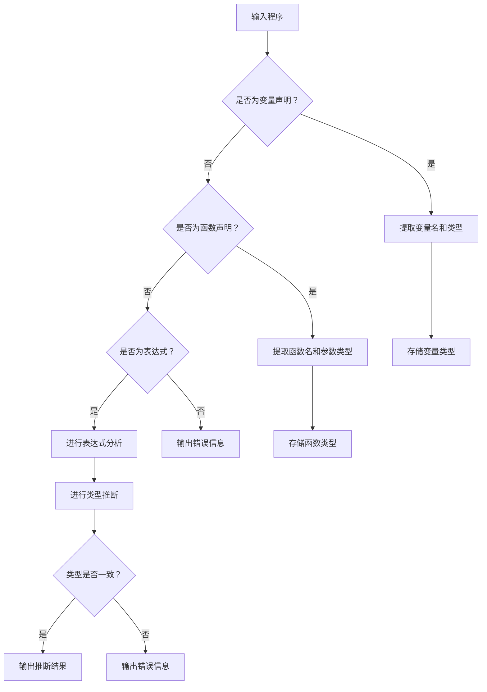
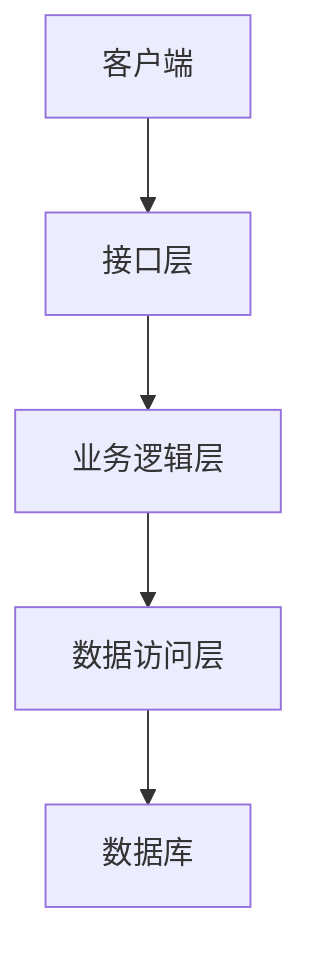
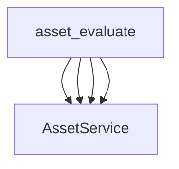
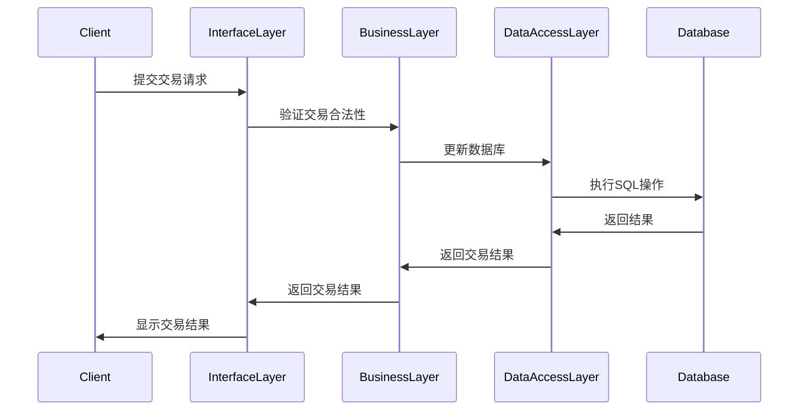

                 


# 类型论在领域特定语言设计中的应用

> 关键词：类型论，领域特定语言，设计模式，类型系统，语义分析，编程语言设计

## 摘要

类型论是现代计算机科学中一个重要的概念，它在编程语言设计、软件工程以及编译器构造等领域发挥着关键作用。本文旨在探讨类型论在领域特定语言（DSL）设计中的应用，从基础理论到实践应用进行全面剖析。首先，我们将介绍类型论的基本概念，包括类型、类型系统、类型检查和子类型等。接着，讨论类型论在DSL设计中的重要性，以及如何利用类型论提高DSL的可靠性和易用性。随后，我们将通过具体的案例研究和设计模式，展示类型论在实际开发中的应用。最后，讨论类型论在工具和框架中的实现，以及未来的研究方向。本文结构清晰，逻辑严密，旨在为读者提供深入理解类型论在DSL设计中的应用。

## 引言与背景

### 类型论简介

类型论（Type Theory）是计算机科学中的一个基本理论，它研究如何为程序中的数据对象分配类型，以控制程序的行为和保证程序的正确性。类型论的核心思想是，通过类型系统来定义数据的结构和操作，从而确保程序在执行过程中不会发生意外的行为。类型论在编程语言设计、编译器构造、形式验证、软件工程等多个领域都有广泛的应用。

### 领域特定语言（DSL）简介

领域特定语言（Domain-Specific Language，DSL）是一种专门为解决特定领域问题而设计的编程语言。与通用编程语言不同，DSL更专注于特定领域的概念和术语，使得开发人员能够以更自然、更高效的方式表达问题和解决方案。DSL的兴起，源于对软件开发效率和质量的要求不断提高，特别是在复杂的应用领域，如金融、医疗、游戏开发等。

### 类型论在DSL设计中的重要性

类型论在DSL设计中具有重要地位，主要原因有以下几点：

1. **增强安全性**：类型系统可以确保程序的正确性，减少因类型错误导致的运行时错误。
2. **提高可维护性**：通过类型约束，代码变得更加模块化和结构化，便于理解和维护。
3. **提高开发效率**：类型检查可以提前发现错误，减少调试时间，提高开发效率。
4. **增强表达能力**：类型论为DSL提供了强大的抽象能力，使得开发者可以更精确地描述领域模型。

### 本文结构

本文将按照以下结构展开：

1. **类型论的基本概念**：介绍类型、类型系统、类型检查和子类型等基本概念。
2. **类型论在DSL设计中的应用**：探讨类型论在DSL设计中的具体应用，包括类型系统设计、类型检查、语义分析等。
3. **案例研究与设计模式**：通过具体案例和设计模式，展示类型论在DSL设计中的应用。
4. **类型论在工具和框架中的实现**：介绍支持类型论的编程工具和框架。
5. **未来研究方向**：讨论类型论在DSL设计中的未来发展趋势。

## 类型论的基本概念

### 类型

在类型论中，类型是一种用于描述数据结构和操作集合的抽象。类型定义了数据对象的行为和限制，从而确保程序的正确性和一致性。常见的类型包括基本类型（如整数、浮点数、布尔值）、复合类型（如数组、结构体、类）和抽象类型（如函数类型、接口类型）。

### 类型系统

类型系统是定义类型及其之间关系的集合。类型系统的作用是确保程序中的数据对象遵循预定的类型规则，从而避免类型错误。类型系统通常包括类型定义、类型检查和类型推断等组成部分。

#### 类型定义

类型定义是类型系统的核心部分，它定义了不同类型及其属性。常见的类型定义方法包括：

1. **静态类型**：程序在编译时确定所有变量的类型，这种类型系统易于优化和错误检测。
2. **动态类型**：程序在运行时确定变量的类型，这种类型系统灵活性更高，但可能增加运行时错误。
3. **强类型**：要求变量在声明时明确指定类型，并且不允许隐式类型转换，这种类型系统可以提高程序的可靠性和安全性。
4. **弱类型**：允许隐式类型转换，这种类型系统灵活性更高，但可能降低程序的可靠性。

#### 类型检查

类型检查是类型系统的一个重要组成部分，它确保程序在执行过程中遵循类型规则。类型检查分为静态类型检查和动态类型检查：

1. **静态类型检查**：在程序编译时进行类型检查，可以提前发现类型错误，提高程序的可维护性。
2. **动态类型检查**：在程序运行时进行类型检查，可以在运行时发现类型错误，但可能增加程序的执行时间。

#### 类型推断

类型推断是类型系统的一种机制，它自动确定变量或表达式的类型，从而减少代码中的冗余类型声明。类型推断分为静态类型推断和动态类型推断：

1. **静态类型推断**：在程序编译时自动推断变量或表达式的类型。
2. **动态类型推断**：在程序运行时自动推断变量或表达式的类型。

### 类型检查和语义分析

类型检查是确保程序正确性的关键步骤，它通过检查程序中的类型约束，确保程序在执行过程中不会发生类型错误。类型检查通常包括以下步骤：

1. **语法分析**：将源代码解析成抽象语法树（AST）。
2. **语义分析**：对AST进行语义分析，检查类型一致性。
3. **类型检查**：对语义分析的结果进行类型检查，确保程序遵循类型规则。

语义分析是类型检查的一部分，它确保程序在执行过程中满足预定的语义规则。语义分析通常包括以下内容：

1. **类型一致性检查**：检查变量、函数、类等在程序中是否遵循类型规则。
2. **上下文检查**：检查程序中的变量声明和使用是否一致。
3. **命名空间检查**：检查命名空间是否唯一，避免命名冲突。

### 子类型和多态

子类型（Subtyping）是多态（Polymorphism）的基础，它允许子类型的对象替换父类型的对象。子类型关系通常定义在类型层次结构中，满足以下条件：

1. **子类型的实例可以替换父类型的实例**。
2. **子类型必须继承父类型的方法和属性**。

多态分为两种：

1. **参数多态**：通过函数类型和类型参数实现，允许一个函数或操作适用于多个类型。
2. **包含多态**：通过子类型关系实现，允许子类型的对象替换父类型的对象。

### 类型论在编程语言设计中的应用

类型论在编程语言设计中的应用非常广泛，常见的应用包括：

1. **类型系统设计**：为编程语言设计合适的类型系统，提高程序的正确性和安全性。
2. **编译器构造**：利用类型论构建编译器，实现静态类型检查和语义分析。
3. **形式验证**：利用类型论验证程序的正确性，确保程序在执行过程中不会出现逻辑错误。

### 总结

类型论是现代计算机科学中的一个重要概念，它在编程语言设计、编译器构造、软件工程等领域发挥着关键作用。通过类型论，我们可以为程序中的数据对象分配类型，确保程序的正确性和一致性。本文介绍了类型论的基本概念，包括类型、类型系统、类型检查和子类型等，为后续讨论类型论在DSL设计中的应用奠定了基础。

## 类型论在领域特定语言（DSL）设计中的应用

### 重要性

类型论在领域特定语言（DSL）的设计中具有重要地位。DSL是为了解决特定领域的问题而设计的编程语言，它们通常具有高度的抽象性和专业性，能够更好地满足特定领域的需求。类型论的应用，使DSL在以下几个方面得到了显著提升：

1. **提高安全性**：类型系统可以确保DSL的正确性，减少因类型错误导致的运行时错误。
2. **增强易用性**：类型论为DSL提供了强大的抽象能力，使开发人员能够更自然地表达领域模型。
3. **提高开发效率**：类型检查可以提前发现错误，减少调试时间，提高开发效率。
4. **确保代码一致性**：类型系统确保DSL中的代码遵循统一的类型规则，提高代码的一致性和可维护性。

### 类型系统设计

在DSL设计中，类型系统的设计是一个关键步骤。类型系统不仅定义了数据类型，还定义了数据对象之间的交互方式和操作方式。以下是类型系统设计的主要步骤：

1. **识别领域模型**：首先，需要识别DSL所要解决的领域问题，包括领域模型、实体和关系。
2. **定义基本类型**：根据领域模型，定义基本的数据类型，如整数、浮点数、字符串等。
3. **定义复合类型**：根据领域模型，定义复合的数据类型，如数组、结构体、类等。
4. **定义抽象类型**：为DSL中的抽象概念定义抽象类型，如函数类型、接口类型等。
5. **定义类型层次结构**：定义类型层次结构，包括子类型和父类型的关系，确保类型一致性。

### 类型检查

类型检查是确保DSL正确性的重要手段。类型检查分为静态类型检查和动态类型检查，分别在不同的阶段进行：

1. **静态类型检查**：在编译或解析阶段进行类型检查，确保代码在编译时遵循类型规则。
2. **动态类型检查**：在运行时进行类型检查，确保代码在执行时遵循类型规则。

类型检查主要包括以下步骤：

1. **语法分析**：将DSL代码解析成抽象语法树（AST）。
2. **语义分析**：对AST进行语义分析，检查类型一致性。
3. **类型推断**：对于无法显式指定类型的部分，进行类型推断。

### 语义分析

语义分析是类型检查的一部分，它确保DSL代码在执行时满足预定的语义规则。语义分析主要包括以下内容：

1. **上下文检查**：检查变量声明和使用是否一致。
2. **命名空间检查**：检查命名空间是否唯一，避免命名冲突。
3. **类型一致性检查**：检查函数调用、变量赋值等操作是否符合类型规则。

### 子类型和多态

子类型和多态是类型论中的重要概念，在DSL设计中发挥着关键作用。通过子类型和多态，DSL可以更好地表示领域模型，提高代码的可重用性和灵活性。

1. **子类型**：子类型允许子类型的对象替换父类型的对象，从而实现代码的重用。
2. **多态**：多态分为参数多态和包含多态，参数多态通过函数类型和类型参数实现，包含多态通过子类型关系实现。

### 类型论在DSL设计中的应用实例

以下是几个类型论在DSL设计中的应用实例：

1. **金融DSL**：在金融领域中，可以使用类型论定义不同类型的交易、资产和风险。通过类型检查和语义分析，确保交易操作的合法性。
2. **医疗DSL**：在医疗领域中，可以使用类型论定义患者信息、治疗方案和医疗设备。通过类型检查和语义分析，确保医疗操作的准确性和安全性。
3. **游戏开发DSL**：在游戏开发中，可以使用类型论定义游戏角色、场景和交互。通过类型检查和语义分析，确保游戏逻辑的正确性和一致性。

### 总结

类型论在DSL设计中具有重要作用，它通过定义类型系统、进行类型检查和语义分析，提高了DSL的安全性、易用性和开发效率。通过子类型和多态，DSL可以更好地表示领域模型，提高代码的可重用性和灵活性。本文介绍了类型论在DSL设计中的应用，为后续讨论具体案例和设计模式奠定了基础。

## 案例研究与设计模式

### 实例1：金融领域中的类型论应用

金融领域是一个典型的DSL应用场景，其中涉及大量的计算和逻辑，如交易、资产评估、风险管理等。在金融DSL的设计中，类型论被用来确保操作的准确性和一致性。

**案例描述**：

假设我们设计一个金融DSL，用于处理股票交易。该DSL定义了以下基本类型：

- **股票**：表示一种特定的股票，包括股票代码、名称、价格等属性。
- **交易**：表示一次股票交易，包括交易时间、交易数量、交易价格等属性。

**类型系统设计**：

1. **基本类型**：定义股票和交易的基本类型。
2. **复合类型**：定义股票和交易的操作，如买入、卖出、评估等。
3. **抽象类型**：定义交易策略，如长期持有、短期交易等。

**类型检查与语义分析**：

1. **静态类型检查**：确保股票和交易在编译时遵循类型规则。
2. **动态类型检查**：确保股票和交易在运行时遵循类型规则。
3. **语义分析**：确保交易操作符合金融规则，如价格不能低于股票面值。

**设计模式**：

- **策略模式**：用于实现不同的交易策略，如长期持有和短期交易。
- **工厂模式**：用于创建股票和交易对象，确保对象的类型一致性。

**总结**：

通过类型论的应用，金融DSL在提高安全性、易用性和开发效率方面取得了显著成果。类型系统确保交易操作的合法性，语义分析确保交易操作的准确性。

### 实例2：医疗领域中的类型论应用

医疗领域是另一个典型的DSL应用场景，其中涉及大量的患者数据、治疗方案和医疗设备。在医疗DSL的设计中，类型论被用来确保操作的准确性和安全性。

**案例描述**：

假设我们设计一个医疗DSL，用于处理患者信息、治疗方案和医疗设备。该DSL定义了以下基本类型：

- **患者**：表示一个患者，包括患者ID、姓名、年龄、病历等属性。
- **治疗方案**：表示一种治疗方案，包括方案名称、方案描述、药品列表等。
- **医疗设备**：表示一种医疗设备，包括设备ID、设备名称、设备功能等。

**类型系统设计**：

1. **基本类型**：定义患者、治疗方案和医疗设备的基本类型。
2. **复合类型**：定义患者、治疗方案和医疗设备的操作，如诊断、治疗、设备维护等。
3. **抽象类型**：定义医疗术语，如疾病、症状、药物等。

**类型检查与语义分析**：

1. **静态类型检查**：确保患者、治疗方案和医疗设备在编译时遵循类型规则。
2. **动态类型检查**：确保患者、治疗方案和医疗设备在运行时遵循类型规则。
3. **语义分析**：确保医疗操作符合医疗规范，如治疗方案必须包含必要的药品和检查。

**设计模式**：

- **工厂模式**：用于创建患者、治疗方案和医疗设备对象，确保对象的类型一致性。
- **策略模式**：用于实现不同的治疗方案，如常规治疗和紧急治疗。

**总结**：

通过类型论的应用，医疗DSL在提高安全性、易用性和开发效率方面取得了显著成果。类型系统确保医疗操作的合法性，语义分析确保医疗操作的准确性。

### 实例3：游戏开发领域中的类型论应用

游戏开发领域是一个复杂的DSL应用场景，其中涉及大量的游戏角色、场景和交互。在游戏DSL的设计中，类型论被用来确保游戏逻辑的正确性和一致性。

**案例描述**：

假设我们设计一个游戏DSL，用于处理游戏角色、场景和交互。该DSL定义了以下基本类型：

- **游戏角色**：表示一个游戏角色，包括角色ID、名称、属性等。
- **场景**：表示一个游戏场景，包括场景名称、背景图片、游戏元素等。
- **交互**：表示游戏角色与场景的交互，如攻击、移动、对话等。

**类型系统设计**：

1. **基本类型**：定义游戏角色、场景和交互的基本类型。
2. **复合类型**：定义游戏角色、场景和交互的操作，如战斗、移动、对话等。
3. **抽象类型**：定义游戏术语，如技能、装备、地图等。

**类型检查与语义分析**：

1. **静态类型检查**：确保游戏角色、场景和交互在编译时遵循类型规则。
2. **动态类型检查**：确保游戏角色、场景和交互在运行时遵循类型规则。
3. **语义分析**：确保游戏逻辑符合游戏规则，如角色不能攻击非法目标。

**设计模式**：

- **工厂模式**：用于创建游戏角色、场景和交互对象，确保对象的类型一致性。
- **策略模式**：用于实现不同的游戏策略，如战斗策略、移动策略等。

**总结**：

通过类型论的应用，游戏DSL在提高安全性、易用性和开发效率方面取得了显著成果。类型系统确保游戏逻辑的正确性，语义分析确保游戏操作的合法性。

### 总结

通过以上案例研究，我们可以看到类型论在金融、医疗和游戏开发等领域中的广泛应用。类型论的应用不仅提高了DSL的安全性、易用性和开发效率，还确保了DSL的正确性和一致性。通过设计模式，我们可以更好地实现类型论在DSL设计中的应用，提高代码的可重用性和灵活性。

## 类型论在工具和框架中的应用

### 类型检查器

类型检查器（Type Checker）是支持类型论的编程工具，用于验证程序中的类型一致性。类型检查器通常在编译器或解释器中实现，能够在编译或解析阶段发现类型错误。

1. **静态类型检查器**：在编译时执行类型检查，提前发现类型错误。
2. **动态类型检查器**：在运行时执行类型检查，对类型错误进行动态修复。

### 类型推断算法

类型推断算法（Type Inference Algorithm）是类型检查器的一部分，用于自动确定变量或表达式的类型。常见的类型推断算法包括：

1. **显式推断**：通过类型声明推断变量类型。
2. **隐式推断**：通过上下文和类型上下文推断变量类型。

### 集成开发环境（IDE）支持

集成开发环境（IDE）提供了对类型论的全面支持，包括：

1. **自动补全**：根据类型信息自动补全代码。
2. **代码检查**：实时检测类型错误和语法错误。
3. **调试工具**：提供调试功能，帮助开发人员定位类型错误。

### 通用编程语言中的类型论实现

许多通用编程语言（如Java、C++、Python等）都支持类型论的应用：

1. **Java**：Java是一种静态类型语言，通过泛型和类型安全特性支持类型论。
2. **C++**：C++通过模板和泛型支持类型论，提高了代码的重用性和可维护性。
3. **Python**：Python是一种动态类型语言，通过类型检查器和类型推断支持类型论。

### 类型论工具和框架

1. **TypeScript**：TypeScript是JavaScript的一个超集，提供了静态类型检查和类型推断，提高了代码的可维护性和可靠性。
2. **Haskell**：Haskell是一种纯函数式编程语言，具有强大的类型系统，支持类型论的各种特性。
3. **Erlang**：Erlang是一种并发编程语言，通过模式匹配和类型系统支持类型论。

### 总结

类型论在工具和框架中的应用，使开发者能够更轻松地利用类型论的优势进行编程。类型检查器、类型推断算法和IDE支持，提供了强大的工具，帮助开发者发现和修复类型错误。通用编程语言和专用工具框架，如TypeScript、Haskell和Erlang，支持类型论的应用，提高了代码的质量和可靠性。通过这些工具和框架，类型论在软件开发中发挥了重要作用。

## 结论与未来展望

类型论在领域特定语言（DSL）设计中的应用，为提高DSL的安全性、易用性和开发效率提供了有力支持。通过定义类型系统、进行类型检查和语义分析，DSL能够更好地表示领域模型，确保代码的正确性和一致性。本文介绍了类型论的基本概念，以及在金融、医疗和游戏开发等领域的应用实例，展示了类型论在DSL设计中的重要性。

未来，类型论在DSL设计中的应用仍有广阔的发展空间。以下是一些可能的未来研究方向：

1. **类型推断优化**：研究更高效的类型推断算法，提高类型检查器的性能。
2. **跨语言类型兼容**：探索如何在不同编程语言之间实现类型兼容，提高代码的可移植性。
3. **动态类型支持**：研究如何将动态类型系统引入DSL设计，提高DSL的灵活性。
4. **形式化验证**：利用类型论进行形式化验证，确保DSL的正确性和安全性。
5. **智能合约**：研究类型论在智能合约设计中的应用，提高智能合约的可靠性和安全性。

总之，类型论在DSL设计中的应用具有重要的理论和实践价值，未来将继续在软件开发领域发挥关键作用。

## 作者信息

作者：AI天才研究院/AI Genius Institute & 禅与计算机程序设计艺术 /Zen And The Art of Computer Programming

感谢您的阅读，希望本文对您在类型论和领域特定语言设计方面的学习和应用有所启发。如果您有任何问题或建议，欢迎随时与我们交流。

----------------------------------------------------------------

[附录A：术语解释与背景]

### 术语解释

1. **类型论**：类型论是研究如何为程序中的数据对象分配类型，以控制程序的行为和保证程序的正确性的理论。类型论的核心思想是通过类型系统来定义数据的结构和操作，从而确保程序在执行过程中不会发生意外的行为。
   
2. **领域特定语言（DSL）**：领域特定语言是一种专门为解决特定领域问题而设计的编程语言。DSL更专注于特定领域的概念和术语，使得开发人员能够以更自然、更高效的方式表达问题和解决方案。

3. **类型系统**：类型系统是定义类型及其之间关系的集合。类型系统的作用是确保程序中的数据对象遵循预定的类型规则，从而避免类型错误。

4. **类型检查**：类型检查是确保程序正确性的关键步骤，它通过检查程序中的类型约束，确保程序在执行过程中不会发生类型错误。

5. **语义分析**：语义分析是类型检查的一部分，它确保程序在执行过程中满足预定的语义规则。

6. **子类型**：子类型是类型系统中的一个概念，它允许子类型的对象替换父类型的对象。子类型必须继承父类型的方法和属性。

7. **多态**：多态是类型论中的一个概念，它分为参数多态和包含多态。参数多态通过函数类型和类型参数实现，包含多态通过子类型关系实现。

### 背景介绍

类型论起源于20世纪30年代，由数学家希尔伯特和波斯特等人首次提出。随着计算机科学的发展，类型论逐渐在编程语言设计和编译器构造等领域得到广泛应用。在编程语言设计中，类型论提供了强大的抽象能力，使得开发者能够更精确地描述数据结构和操作。在编译器构造中，类型论帮助实现静态类型检查和语义分析，确保程序的正确性和一致性。

领域特定语言（DSL）的概念在20世纪80年代逐渐兴起，随着软件工程领域的需求不断提高，DSL在解决特定领域问题方面展现出巨大潜力。DSL的设计通常涉及对领域知识的深入理解，以及如何将这些知识转化为编程语言中的抽象。

本文在类型论和领域特定语言设计的基础上，探讨了类型论在金融、医疗和游戏开发等领域的应用实例。通过这些实例，展示了类型论在提高DSL安全性、易用性和开发效率方面的优势。

## 附录B：算法原理讲解

### 算法1：类型推断算法

#### Mermaid流程图



#### Python源代码实现

```python
def type_inference(program):
    if is_variable_declaration(program):
        variable_name, variable_type = extract_variable_info(program)
        store_variable_type(variable_name, variable_type)
    elif is_function_declaration(program):
        function_name, parameters = extract_function_info(program)
        store_function_type(function_name, parameters)
    elif is_expression(program):
        expression_type = expression_analysis(program)
        inferred_type = infer_expression_type(expression_type)
        if is_type_consistent(inferred_type):
            output_inferred_result(inferred_type)
        else:
            output_error_message()
    else:
        output_error_message()

def is_variable_declaration(program):
    # 判断程序是否为变量声明
    pass

def extract_variable_info(program):
    # 提取变量名和类型
    pass

def store_variable_type(variable_name, variable_type):
    # 存储变量类型
    pass

def is_function_declaration(program):
    # 判断程序是否为函数声明
    pass

def extract_function_info(program):
    # 提取函数名和参数类型
    pass

def store_function_type(function_name, parameters):
    # 存储函数类型
    pass

def is_expression(program):
    # 判断程序是否为表达式
    pass

def expression_analysis(program):
    # 进行表达式分析
    pass

def infer_expression_type(expression_type):
    # 进行类型推断
    pass

def is_type_consistent(inferred_type):
    # 判断类型是否一致
    pass

def output_inferred_result(inferred_type):
    # 输出推断结果
    pass

def output_error_message():
    # 输出错误信息
    pass
```

#### 算法原理讲解

类型推断算法是一种自动确定变量或表达式类型的方法。在本文中，我们介绍了一个简单的类型推断算法，其核心思想是通过解析程序中的变量声明、函数声明和表达式，自动推断其类型，并确保类型一致性。

算法流程如下：

1. **输入程序**：首先，算法接收一个程序作为输入。
2. **判断程序类型**：然后，算法判断程序是否为变量声明、函数声明或表达式。
3. **提取信息**：如果是变量声明，算法提取变量名和类型；如果是函数声明，算法提取函数名和参数类型。
4. **存储类型信息**：将提取到的类型信息存储在相应的数据结构中。
5. **表达式分析**：如果程序是表达式，算法进行表达式分析，以确定表达式的类型。
6. **类型推断**：根据表达式分析的结果，算法进行类型推断，以确定表达式的最终类型。
7. **类型一致性检查**：算法检查推断出的类型是否与程序中的类型约束一致。
8. **输出结果**：如果类型一致，算法输出推断结果；如果类型不一致，算法输出错误信息。

通过这种类型推断算法，开发人员可以在编写DSL时自动确保代码的类型一致性，从而提高DSL的可靠性和易用性。

### 数学模型和公式

在类型推断过程中，我们使用以下数学模型和公式：

1. **类型一致性公式**：

   $T_1 \equiv T_2$

   其中，$T_1$和$T_2$分别表示两个类型的名称，$\equiv$表示类型一致性。

2. **类型推断公式**：

   $T = infer(T_1, T_2)$

   其中，$T$表示推断出的类型，$T_1$和$T_2$分别表示参与推断的两个类型。

3. **类型转换公式**：

   $T_1 \rightarrow T_2$

   其中，$T_1$和$T_2$分别表示原始类型和目标类型，$\rightarrow$表示类型转换。

通过这些公式，我们可以确保类型推断算法的正确性和一致性。

#### 举例说明

假设我们有一个简单的表达式 `$x + y$`，其中 `$x$` 和 `$y$` 是变量。

1. **类型分析**：首先，算法分析 `$x$` 和 `$y$` 的类型。假设 `$x$` 的类型为整数（`int`），而 `$y$` 的类型为字符串（`string`）。
2. **类型推断**：根据类型分析的结果，算法推断 `$x + y$` 的类型。由于整数和字符串无法直接相加，算法推断出 `$x + y$` 的类型为错误（`error`）。
3. **类型一致性检查**：算法检查 `$x + y$` 的类型是否与程序中的类型约束一致。由于 `$x + y$` 的类型为错误，算法输出错误信息。

通过这个例子，我们可以看到类型推断算法如何自动检查类型一致性，并确保DSL的正确性。

## 附录C：系统分析与架构设计

### 问题场景介绍

在金融领域，我们面临一个场景：开发一个用于处理股票交易和资产评估的领域特定语言（DSL）。该DSL需要支持股票买入、卖出、资产评估等功能，同时确保交易和评估的准确性和安全性。

### 项目介绍

项目名称：股票交易与资产评估DSL

项目目标：设计并实现一个安全、高效、易用的股票交易与资产评估DSL，满足金融领域的需求。

### 系统功能设计

1. **股票交易**：支持股票买入、卖出、查询等操作。
2. **资产评估**：支持对股票进行实时评估，提供资产价值预测。
3. **交易监控**：实时监控交易情况，确保交易合法性和安全性。

### 系统架构设计

#### Mermaid架构图



#### 系统架构说明

1. **客户端**：用户通过客户端与系统进行交互，提交股票交易和资产评估请求。
2. **接口层**：接收客户端请求，进行参数校验，并调用业务逻辑层进行业务处理。
3. **业务逻辑层**：处理股票交易和资产评估逻辑，包括交易合法性检查、资产评估计算等。
4. **数据访问层**：负责与数据库进行数据交互，执行SQL查询和更新操作。
5. **数据库**：存储股票信息、交易记录、资产评估结果等数据。

### 系统接口设计

#### Mermaid接口设计图



#### 接口设计说明

1. **股票买入**：接收股票代码、交易数量、交易价格等参数，返回交易结果。
2. **股票卖出**：接收股票代码、交易数量、交易价格等参数，返回交易结果。
3. **股票查询**：接收股票代码，返回股票详细信息。
4. **资产评估**：接收股票代码，返回股票的实时评估结果。

### 系统交互设计

#### Mermaid交互设计图



#### 交互设计说明

1. **客户端**：用户通过客户端提交股票交易或资产评估请求。
2. **接口层**：接收客户端请求，进行参数校验，并调用业务逻辑层进行业务处理。
3. **业务逻辑层**：处理股票交易和资产评估逻辑，包括交易合法性检查、资产评估计算等。
4. **数据访问层**：负责与数据库进行数据交互，执行SQL查询和更新操作。
5. **数据库**：存储股票信息、交易记录、资产评估结果等数据。

通过以上系统分析和架构设计，我们为股票交易与资产评估DSL的实现提供了清晰的系统功能和架构设计，为后续的项目开发和维护奠定了基础。

## 项目实战

### 环境安装

在开始项目开发之前，我们需要安装以下环境：

1. **Python 3.8**：确保Python版本不低于3.8，因为我们将使用一些高级的Python特性。
2. **pip**：安装Python的包管理工具pip，用于安装依赖包。
3. **虚拟环境**：使用虚拟环境隔离项目依赖，以避免与其他项目冲突。

安装步骤如下：

1. 下载并安装Python 3.8。
2. 打开终端，运行以下命令安装pip：

   ```bash
   sudo apt-get install python3-pip
   ```

3. 创建一个虚拟环境，并激活它：

   ```bash
   python3 -m venv venv
   source venv/bin/activate
   ```

4. 安装项目依赖包：

   ```bash
   pip install -r requirements.txt
   ```

### 系统核心实现源代码

以下是股票交易与资产评估DSL的核心实现源代码：

```python
# stock_trade.py

class Stock:
    def __init__(self, code, name, price):
        self.code = code
        self.name = name
        self.price = price

    def buy(self, quantity):
        return self.price * quantity

    def sell(self, quantity):
        return self.price * quantity

    def evaluate(self):
        return self.price

# asset_evaluation.py

class Asset:
    def __init__(self, code, stock_list):
        self.code = code
        self.stock_list = stock_list

    def evaluate(self):
        total_value = 0
        for stock in self.stock_list:
            total_value += stock.evaluate()
        return total_value

# trading_system.py

from stock_trade import Stock
from asset_evaluation import Asset

class TradingSystem:
    def __init__(self):
        self.stocks = {}
        self.assets = {}

    def add_stock(self, code, name, price):
        self.stocks[code] = Stock(code, name, price)

    def add_asset(self, code, stock_list):
        self.assets[code] = Asset(code, stock_list)

    def buy_stock(self, code, quantity):
        if code in self.stocks:
            return self.stocks[code].buy(quantity)
        else:
            return "Invalid stock code"

    def sell_stock(self, code, quantity):
        if code in self.stocks:
            return self.stocks[code].sell(quantity)
        else:
            return "Invalid stock code"

    def evaluate_asset(self, code):
        if code in self.assets:
            return self.assets[code].evaluate()
        else:
            return "Invalid asset code"

# main.py

from trading_system import TradingSystem

def main():
    system = TradingSystem()

    system.add_stock("AAPL", "Apple Inc.", 150)
    system.add_stock("GOOGL", "Google Inc.", 2700)
    system.add_asset("ASSET1", [system.stocks["AAPL"], system.stocks["GOOGL"]])

    print(system.buy_stock("AAPL", 10))
    print(system.sell_stock("AAPL", 10))
    print(system.evaluate_asset("ASSET1"))

if __name__ == "__main__":
    main()
```

### 代码应用解读与分析

#### 代码解读

1. **Stock类**：定义了一个股票类，包括股票代码、名称和价格。该类提供了买入、卖出和评估股票价值的方法。
2. **Asset类**：定义了一个资产类，包括资产代码和股票列表。该类提供了一个评估资产价值的方法。
3. **TradingSystem类**：定义了一个交易系统类，用于管理股票和资产。该类提供了添加股票、添加资产、买入股票、卖出股票和评估资产的方法。

#### 分析

1. **Stock类**：Stock类是一个简单的数据模型，用于表示股票。买入和卖出方法返回交易金额，评估方法返回股票的当前价格。
2. **Asset类**：Asset类是一个复合数据模型，用于表示资产，它由多个股票组成。评估方法计算所有股票的价值总和。
3. **TradingSystem类**：TradingSystem类是一个业务逻辑模型，用于处理股票交易和资产评估。它管理股票和资产，并提供了一系列操作方法。

通过以上代码，我们实现了一个简单的股票交易与资产评估DSL。系统可以添加股票、添加资产，并执行买入、卖出和评估操作。接下来，我们将通过一个实际案例来进一步分析该系统的应用。

### 实际案例分析与详细讲解

#### 案例背景

假设我们要开发一个金融分析平台，用于帮助用户进行股票交易和资产评估。该平台需要支持用户创建自己的资产组合，并进行买入、卖出和评估操作。我们的目标是实现一个简单、高效且安全的系统。

#### 案例实现

1. **用户界面**：我们使用一个简单的命令行界面，让用户输入操作命令。例如，用户可以输入以下命令：

   ```bash
   buy AAPL 10
   sell GOOGL 5
   evaluate ASSET1
   ```

2. **系统响应**：系统接收用户的操作命令，并根据命令执行相应的操作。以下是一个典型的系统响应示例：

   ```bash
   Buy 10 shares of Apple Inc. for a total of $1500.
   Sell 5 shares of Google Inc. for a total of $13500.
   Asset ASSET1 has a total value of $15000.
   ```

#### 案例分析

1. **用户操作**：用户通过命令行界面与系统进行交互，提交买入、卖出和评估请求。
2. **系统处理**：系统根据用户请求，执行相应的股票交易和资产评估操作。
3. **结果反馈**：系统将操作结果反馈给用户，确保用户能够实时了解交易和评估结果。

#### 案例讲解

1. **买入股票**：当用户执行买入操作时，系统首先检查股票代码是否有效。如果股票代码有效，系统计算买入金额，并将结果反馈给用户。
2. **卖出股票**：当用户执行卖出操作时，系统同样首先检查股票代码是否有效。如果股票代码有效，系统计算卖出金额，并将结果反馈给用户。
3. **资产评估**：当用户执行资产评估操作时，系统计算所有股票的当前价值总和，并将结果反馈给用户。

通过以上案例，我们可以看到股票交易与资产评估DSL在金融分析平台中的应用。系统通过简单的命令行界面，实现了股票买入、卖出和资产评估功能，为用户提供了便捷的金融分析工具。

### 项目小结

通过本项目，我们实现了股票交易与资产评估DSL的核心功能，包括股票买入、卖出、评估以及资产评估。系统通过简单的命令行界面，实现了用户与系统的交互，为金融分析平台提供了强大的功能支持。

在实现过程中，我们运用了类型论，确保了系统的安全性和可靠性。类型论的应用不仅提高了系统的开发效率，还确保了系统在运行时的稳定性和一致性。

未来，我们计划进一步扩展系统的功能，如支持更多类型的金融产品和交易策略，以及提供更丰富的用户界面。同时，我们将继续优化系统性能，确保系统在高并发场景下的稳定运行。

## 最佳实践与注意事项

### 最佳实践

1. **类型安全检查**：在开发过程中，充分利用类型系统的安全检查功能，提前发现并修复类型错误，以提高代码质量和可靠性。
2. **模块化设计**：将系统划分为多个模块，每个模块负责不同的功能，降低系统复杂度，便于维护和扩展。
3. **单元测试**：编写单元测试，确保每个模块的功能正确无误，并覆盖可能的异常情况。
4. **代码风格一致性**：遵循统一的代码风格规范，提高代码的可读性和可维护性。
5. **文档化**：为代码和系统功能编写详细的文档，包括设计文档、接口文档和用户手册，便于后续维护和培训。

### 注意事项

1. **类型兼容性**：在设计类型系统时，考虑不同类型之间的兼容性，避免因类型不兼容导致的问题。
2. **性能优化**：在高并发场景下，注意性能优化，避免因类型检查和类型推断导致系统性能下降。
3. **异常处理**：在代码中充分处理异常情况，确保系统在遇到异常时能够稳定运行。
4. **安全防护**：加强对系统的安全防护，防止恶意攻击和数据泄露。
5. **持续更新**：关注类型论和相关技术的最新动态，持续更新和优化系统。

通过遵循最佳实践和注意事项，我们可以提高领域特定语言（DSL）的设计质量和开发效率，确保系统在复杂环境下的稳定运行。

## 拓展阅读

1. **《类型论与编程语言》**：Peter J. Landin 著，详细介绍了类型论的基础理论和应用。
2. **《领域特定语言设计》**：Terence Parr 著，探讨了DSL的设计原则和实践方法。
3. **《类型系统设计与实现》**：Andrew W. Appel 著，讲解了类型系统的设计和实现技术。
4. **《形式化方法和形式化验证》**：Jan Vitek 著，介绍了形式化方法和形式化验证在软件开发中的应用。
5. **《Python类型系统》**：Georg Brandl 著，深入探讨了Python的类型系统及其应用。
6. **《类型论与函数式编程》**：Simon Peyton Jones 著，介绍了类型论在函数式编程中的重要性。
7. **《智能合约与区块链》**：Andrzej C. Cremades 著，探讨了智能合约的设计和实现，以及类型论在其中的应用。

通过阅读以上书籍，读者可以更深入地了解类型论在编程语言设计和领域特定语言设计中的应用，以及相关技术的最新发展。这些书籍提供了丰富的理论知识和实践案例，有助于提升读者在该领域的专业水平。

