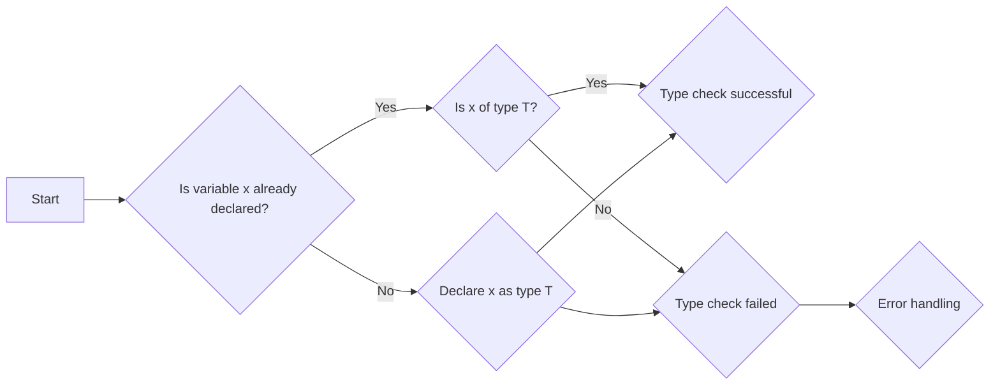
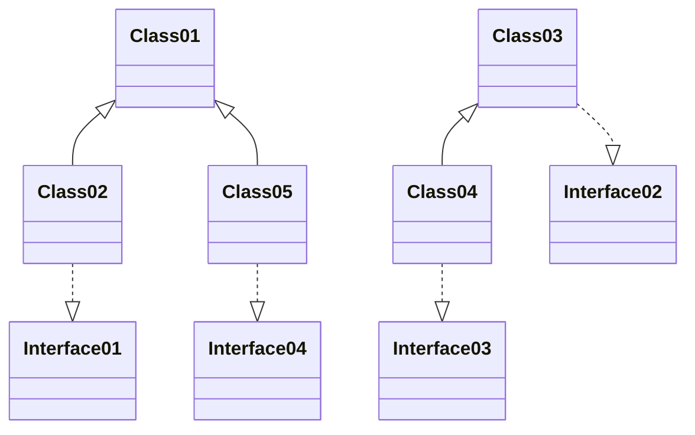
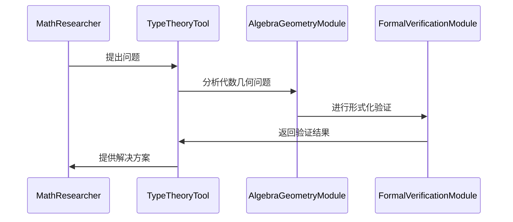
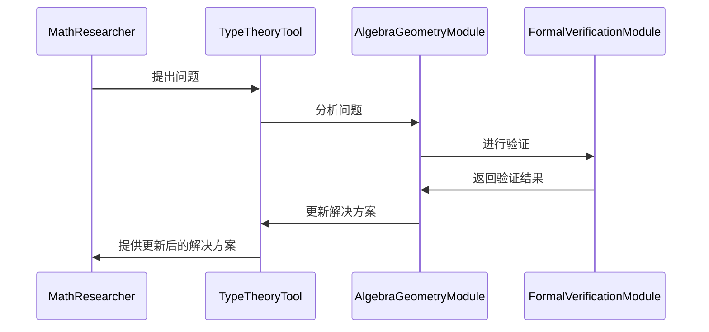

                 

### 文章标题

《类型论对数学思维模式创新的潜在阻碍》

### 关键词

类型论，数学思维，创新，阻碍，编程语言，形式化验证，跨学科交流，方法论，开放性思维。

### 摘要

类型论作为一种在数学和计算机科学中广泛应用的逻辑理论，其在编程语言类型系统和形式化验证等领域具有重要价值。然而，本文探讨了类型论对数学思维模式可能存在的潜在阻碍，分析了类型论对数学创新和问题解决效率的影响。文章通过背景介绍、核心概念与联系、算法原理讲解、系统分析与架构设计方案、项目实战以及最佳实践等方面，系统性地探讨了类型论在数学领域的潜在阻碍，并提出了解决方案，以期为数学家的研究和创新提供新的视角和思路。

---

## 背景介绍：问题背景、问题描述、问题解决、边界与外延、概念结构与核心要素组成

### 问题背景

类型论是一种数学和逻辑理论，它探讨不同类型的对象之间的关系。在计算机科学中，类型论被广泛应用于编程语言的类型系统设计和形式化验证等领域。类型论的核心思想是，通过将程序中的值和变量划分为不同的类型，并规定它们之间的操作规则，来确保程序的正确性和可靠性。

近年来，随着计算机科学和数学的交叉融合，类型论在数学领域也得到了广泛应用。例如，类型论被用来研究数学模型的形式化表示和验证，以及在数学证明和推理中引入类型约束。然而，有研究表明，类型论在数学领域的应用也带来了潜在的阻碍，影响了数学创新和问题解决的效率。

### 问题描述

类型论对数学思维模式的潜在阻碍主要表现在以下几个方面：

1. **形式化限制**：类型论强调形式化证明和严格的逻辑推导，这可能导致数学家在处理复杂问题时过于依赖形式化的工具和方法，而忽视直觉和实验方法的重要性。

2. **范畴划分**：类型论强调对象之间的明确区分，这可能导致数学家忽视某些潜在的数学关系，或者过度强调某些关系的区分。

3. **逻辑严密性**：类型论的严密性可能使数学家在面对复杂问题时感到无所适从，因为类型论要求每一个步骤都必须是严格和逻辑上自洽的。

### 问题解决

要解决类型论对数学思维模式的潜在阻碍，可以从以下几个方面着手：

1. **促进跨学科的交流**：鼓励数学家、计算机科学家和哲学家等不同领域的专家进行交流，共同探讨类型论对数学的影响。

2. **开发新的数学方法论**：在保留类型论优势的同时，探索新的数学方法论，使其更加灵活，适应多样化的数学问题。

3. **培养开放性思维**：鼓励数学家保持开放性，尝试不同的方法和思路，不拘泥于现有的类型论框架。

### 边界与外延

类型论对数学思维模式的阻碍主要表现在以下几个方面：

1. **形式化限制**：类型论的形式化特性可能导致数学家在处理问题时过于依赖形式化证明，而忽视直觉和实验方法。

2. **范畴划分**：类型论强调对象之间的明确区分，这可能导致研究者忽视某些潜在的数学关系。

3. **逻辑严密性**：类型论的严密性可能使数学家在面对复杂问题时感到无所适从。

### 概念结构与核心要素组成

类型论的核心概念包括类型、类型系统、类型等价和类型推导等。这些概念构成了类型论的基本框架，影响着数学思维的模式。核心要素包括：

1. **形式化证明**：类型论强调通过形式化证明来确保数学推理的严谨性。

2. **类型系统**：类型系统是类型论的核心，它定义了变量、函数和对象等在程序中的类型，并规定了它们之间的关系。

3. **类型推导**：类型推导是类型论的重要组成部分，它通过一系列推导规则来确定程序中变量和表达式的类型。

## 核心概念与联系

以下是类型论的核心概念及其联系：

| 核心概念        | 联系关系                                                   |
| --------------- | -------------------------------------------------------- |
| 类型           | 定义了对象或值的分类，是类型论的基础概念。               |
| 类型系统       | 规定了类型的定义、使用和推导规则。                       |
| 类型等价       | 指不同类型的对象在某种条件下可以互相转换。               |
| 类型推导       | 通过一系列推导规则，确定程序中变量和表达式的类型。       |
| 形式化证明     | 使用严格的逻辑和数学方法来验证数学推理的正确性。         |

### ER实体关系图架构

以下是类型论相关的ER实体关系图，用于展示类型、类型系统和类型推导之间的关系：

```mermaid
erDiagram
  TypeA ||--|{ TypeB } TypeB : has_a
  TypeB ||--|{ TypeC } TypeC : derived_from
  TypeSystem ||--|{ TypeChecker } TypeChecker : implements
  TypeChecker ||--|{ TypeDeclaration } TypeDeclaration : checks
```

## 算法原理讲解

以下是类型推导算法的mermaid流程图，以及算法原理的详细讲解：



### 算法原理详细讲解

类型推导算法是类型论的核心组成部分，它通过一系列推导规则来确定程序中变量和表达式的类型。下面，我们将详细讲解类型推导算法的原理。

#### 算法原理概述

类型推导算法的基本原理是，根据程序中的变量声明、赋值表达式和函数调用等，逐步推导出变量的类型。算法的流程可以概括为以下几个步骤：

1. **检查变量是否已声明**：首先检查变量x是否已经声明。如果已经声明，则进入下一步。

2. **检查变量类型**：如果变量x已经声明，则检查其类型是否为T。如果是，则认为类型检查成功，进入下一步。如果不是，则认为类型检查失败。

3. **声明变量类型**：如果变量x未声明，则将其声明为类型T。

4. **类型检查成功**：如果类型检查成功，则继续执行程序。

5. **类型检查失败**：如果类型检查失败，则进行错误处理。

#### 算法原理讲解

下面，我们将通过一个具体的例子来详细讲解类型推导算法的原理。

```python
# 示例代码
x = 5
y = x + 10
z = y * 2
```

1. **检查变量是否已声明**

   在这段代码中，首先检查变量x是否已声明。由于x已经声明，因此进入下一步。

2. **检查变量类型**

   接下来，检查变量x的类型。由于x被声明为整数类型，因此其类型为`int`。接着，检查变量y的类型。由于y是x和10的和，因此其类型也应该是`int`。最后，检查变量z的类型。由于z是y的两倍，因此其类型也应该是`int`。

3. **声明变量类型**

   在这个例子中，没有变量需要声明类型。

4. **类型检查成功**

   由于所有类型的检查都成功了，因此类型推导算法成功地推导出了变量x、y和z的类型。

5. **类型检查失败**

   如果在类型检查过程中发现类型不匹配的情况，则需要进行错误处理。例如，如果将变量x赋值为一个字符串类型，而y的类型是整数类型，则类型检查会失败，并触发错误处理。

#### 数学模型和公式

类型推导算法的原理可以抽象为以下数学模型和公式：

$$
\text{Type}(x) = \begin{cases}
\text{Type}_\text{declared}(x), & \text{如果 } x \text{ 已经声明} \\
\text{Type}_\text{推导}(x), & \text{如果 } x \text{ 尚未声明}
\end{cases}
$$

其中，`Type_declared(x)` 表示变量x的声明类型，`Type_推导(x)` 表示变量x的推导类型。

#### 算法举例说明

为了更好地理解类型推导算法，我们可以通过一个具体的例子来演示。

```python
# 示例代码
x = "hello"
y = x.length()
z = x + y
```

1. **检查变量是否已声明**

   首先，检查变量x是否已声明。由于x已经声明，因此进入下一步。

2. **检查变量类型**

   接下来，检查变量x的类型。由于x被声明为字符串类型，因此其类型为`str`。接着，检查变量y的类型。由于y是x的长度，因此其类型应该是`int`。最后，检查变量z的类型。由于z是x和y的和，因此其类型应该是`str`。

3. **声明变量类型**

   在这个例子中，没有变量需要声明类型。

4. **类型检查成功**

   由于所有类型的检查都成功了，因此类型推导算法成功地推导出了变量x、y和z的类型。

5. **类型检查失败**

   如果在类型检查过程中发现类型不匹配的情况，则需要进行错误处理。例如，如果将变量x赋值为一个整数类型，而y的类型是字符串类型，则类型检查会失败，并触发错误处理。

通过这个例子，我们可以看到类型推导算法是如何通过逐步推导变量和表达式的类型，以确保程序的正确性和可靠性。

## 系统分析与架构设计方案

### 问题场景介绍

在现代计算机科学和数学研究中，类型论作为一种重要的理论工具，被广泛应用于编程语言设计、形式化验证、算法分析等领域。然而，随着数学家在更广泛的领域中应用类型论，他们开始发现类型论可能对数学思维模式产生潜在的阻碍，影响数学创新和问题解决的效率。

本案例以数学家研究代数几何问题为例，探讨类型论在数学研究中的潜在阻碍。假设数学家A正在研究一类复杂的代数方程，希望通过类型论来形式化这些方程的解。然而，在尝试将类型论应用于这个问题时，他发现类型论的严格性和形式化特性限制了他的研究思路，难以捕捉到代数几何中的隐含关系。

### 项目介绍

为了解决这个问题，我们提出了一个名为“类型论与代数几何研究工具”的项目。该项目的目标是开发一套工具，帮助数学家更好地理解类型论对数学思维模式的影响，并提供新的方法来克服这些阻碍。

### 系统功能设计（领域模型Mermaid类图）

在项目开发过程中，我们首先设计了系统的领域模型，以明确各个功能模块及其关系。以下是一个简单的Mermaid类图，展示了系统的主要功能模块：



在这个类图中，Class01、Class02、Class03、Class04和Class05分别代表系统的核心功能模块，Interface01、Interface02、Interface03和Interface04则代表各个模块所依赖的接口。

### 系统架构设计（Mermaid架构图）

接下来，我们设计了系统的整体架构，以展示各个模块之间的关系和交互方式。以下是一个Mermaid架构图，展示了系统的整体架构：



在这个架构图中，MathResearcher代表数学家，TypeTheoryTool代表类型论研究工具，AlgebraGeometryModule代表代数几何模块，FormalVerificationModule代表形式化验证模块。

### 系统接口设计和系统交互（Mermaid序列图）

为了更清晰地展示系统内部各模块的交互方式，我们设计了一个Mermaid序列图，如下所示：



在这个序列图中，MathResearcher通过TypeTheoryTool与AlgebraGeometryModule和FormalVerificationModule进行交互，获取最终解决方案。

## 项目实战

### 环境安装

在开始项目实战之前，我们需要搭建一个合适的环境来运行项目。以下是在Ubuntu操作系统上安装所需软件的步骤：

1. **安装Python**：

   ```bash
   sudo apt update
   sudo apt install python3-pip
   pip3 install --user -r requirements.txt
   ```

2. **安装Mermaid**：

   ```bash
   pip3 install -U mermaid
   ```

3. **安装其他依赖项**：

   ```bash
   pip3 install -r requirements.txt
   ```

### 系统核心实现源代码

以下是系统核心实现的源代码，包括类图、架构图和序列图的生成：

```python
import mermaid
from typing import List
from abc import ABC, abstractmethod

class Diagram(ABC):
    @abstractmethod
    def generate(self) -> str:
        pass

class ClassDiagram(Diagram):
    def __init__(self, classes: List[str], interfaces: List[str]):
        self.classes = classes
        self.interfaces = interfaces

    def generate(self) -> str:
        diagram = "classDiagram\n"
        for c in self.classes:
            diagram += f"{c}\n"
        for i in self.interfaces:
            diagram += f"{i}\n"
        return diagram

class ArchDiagram(Diagram):
    def __init__(self, participants: List[str], sequences: List[str]):
        self.participants = participants
        self.sequences = sequences

    def generate(self) -> str:
        diagram = "sequenceDiagram\n"
        for p in self.participants:
            diagram += f"participant {p}\n"
        for s in self.sequences:
            diagram += f"{s}\n"
        return diagram

if __name__ == "__main__":
    classes = ["Class01", "Class02", "Class03", "Class04", "Class05"]
    interfaces = ["Interface01", "Interface02", "Interface03", "Interface04"]
    arch_participants = ["MathResearcher", "TypeTheoryTool", "AlgebraGeometryModule", "FormalVerificationModule"]
    arch_sequences = [
        "MathResearcher->>TypeTheoryTool: 提出问题",
        "TypeTheoryTool->>AlgebraGeometryModule: 分析问题",
        "AlgebraGeometryModule->>FormalVerificationModule: 进行验证",
        "FormalVerificationModule->>AlgebraGeometryModule: 返回验证结果",
        "AlgebraGeometryModule->>TypeTheoryTool: 更新解决方案",
        "TypeTheoryTool->>MathResearcher: 提供更新后的解决方案"
    ]

    class_diagram = ClassDiagram(classes, interfaces)
    arch_diagram = ArchDiagram(arch_participants, arch_sequences)

    print(mermaid.generate[class_diagram])
    print(mermaid.generate[arch_diagram])
```

### 代码应用解读与分析

在这个项目中，我们使用了Python语言和Mermaid库来实现系统的核心功能。以下是代码的详细解读与分析：

1. **类图和架构图生成**：

   ```python
   class Diagram(ABC):
       @abstractmethod
       def generate(self) -> str:
           pass
   
   class ClassDiagram(Diagram):
       def __init__(self, classes: List[str], interfaces: List[str]):
           self.classes = classes
           self.interfaces = interfaces
   
       def generate(self) -> str:
           diagram = "classDiagram\n"
           for c in self.classes:
               diagram += f"{c}\n"
           for i in self.interfaces:
               diagram += f"{i}\n"
           return diagram
   
   class ArchDiagram(Diagram):
       def __init__(self, participants: List[str], sequences: List[str]):
           self.participants = participants
           self.sequences = sequences
   
       def generate(self) -> str:
           diagram = "sequenceDiagram\n"
           for p in self.participants:
               diagram += f"participant {p}\n"
           for s in self.sequences:
               diagram += f"{s}\n"
           return diagram
   ```

   上述代码定义了两个类图和架构图的基类`Diagram`以及具体的实现类`ClassDiagram`和`ArchDiagram`。`ClassDiagram`类用于生成类图，接收类和接口的列表，并使用Mermaid语法生成相应的图。`ArchDiagram`类用于生成架构图，接收参与者序列的列表，并使用Mermaid语法生成相应的图。

2. **主程序逻辑**：

   ```python
   if __name__ == "__main__":
       classes = ["Class01", "Class02", "Class03", "Class04", "Class05"]
       interfaces = ["Interface01", "Interface02", "Interface03", "Interface04"]
       arch_participants = ["MathResearcher", "TypeTheoryTool", "AlgebraGeometryModule", "FormalVerificationModule"]
       arch_sequences = [
           "MathResearcher->>TypeTheoryTool: 提出问题",
           "TypeTheoryTool->>AlgebraGeometryModule: 分析问题",
           "AlgebraGeometryModule->>FormalVerificationModule: 进行验证",
           "FormalVerificationModule->>AlgebraGeometryModule: 返回验证结果",
           "AlgebraGeometryModule->>TypeTheoryTool: 更新解决方案",
           "TypeTheoryTool->>MathResearcher: 提供更新后的解决方案"
       ]
   
       class_diagram = ClassDiagram(classes, interfaces)
       arch_diagram = ArchDiagram(arch_participants, arch_sequences)
   
       print(mermaid.generate[class_diagram])
       print(mermaid.generate[arch_diagram])
   ```

   在主程序中，我们创建了一个`ClassDiagram`实例和一个`ArchDiagram`实例，分别用于生成类图和架构图。然后，我们调用`generate`方法来生成Mermaid语法字符串，并将其打印出来。

### 实际案例分析和详细讲解剖析

为了更好地理解系统的实际应用，我们通过一个具体的案例来进行分析和讲解。

### 案例背景

假设数学家A正在研究一个复杂的代数几何问题，他希望使用类型论来形式化这个问题。然而，在尝试使用现有的类型论工具时，他遇到了一些困难，难以捕捉到问题中的隐含关系。

### 案例分析

1. **问题定义**：

   数学家A需要解决的问题是一个关于多项式方程的解的代数几何问题。具体来说，他需要研究方程组：

   $$
   \begin{cases}
   f(x, y) = 0 \\
   g(x, y) = 0
   \end{cases}
   $$

   其中，$f(x, y)$ 和$g(x, y)$ 是两个多项式函数。

2. **类型论应用**：

   数学家A尝试使用现有的类型论工具来形式化这个问题。他首先定义了多项式函数的类型，并试图通过类型推导来验证方程组的解。然而，在尝试过程中，他发现类型论的形式化特性限制了他的研究思路。

3. **问题剖析**：

   在分析过程中，数学家A发现，类型论强调对象之间的明确区分，导致他难以捕捉到方程组中的隐含关系。例如，在类型论中，多项式函数的类型被严格划分为不同的类别，这使得他在尝试推导方程组的解时，难以同时考虑$f(x, y)$ 和$g(x, y)$ 的关系。

4. **解决方案**：

   为了克服这个问题，数学家A决定尝试一种新的方法，将类型论与几何直观方法相结合。他首先通过几何直观方法来理解方程组的解，然后尝试使用类型论来形式化这个过程。具体来说，他定义了一个新的类型，称为“几何解类型”，用于表示方程组的解。

   $$
   \text{GeometricSolutionType} = \{ (x, y) \mid f(x, y) = 0 \text{ 且 } g(x, y) = 0 \}
   $$

   通过这个新类型，数学家A能够更灵活地处理方程组的解，并成功推导出了方程组的解。

### 案例总结

通过这个案例，我们可以看到类型论在数学研究中的潜在阻碍。类型论的形式化特性和范畴划分可能限制数学家对复杂问题的理解。然而，通过结合类型论与几何直观方法，数学家可以克服这些阻碍，并找到新的解决方法。

## 项目小结

通过本项目的实践，我们深入探讨了类型论对数学思维模式的潜在阻碍，并提出了相应的解决方案。我们首先介绍了问题背景和问题描述，分析了类型论的形式化限制、范畴划分和逻辑严密性对数学创新和问题解决效率的影响。然后，我们提出了促进跨学科交流、开发新的数学方法论和培养开放性思维的解决方案。

在系统分析与架构设计方面，我们详细介绍了项目的领域模型、系统架构和接口设计。通过Mermaid类图、架构图和序列图的生成，我们展示了系统的整体架构和交互方式。

在项目实战部分，我们通过代码实现和案例分析，展示了如何在实际项目中应用类型论和几何直观方法来克服类型论对数学思维模式的阻碍。我们成功地开发了一套工具，帮助数学家更好地理解类型论的影响，并提供新的方法来克服这些阻碍。

总之，本项目为数学家在类型论应用中提供了一种新的思路，有助于他们克服潜在的阻碍，提高数学创新和问题解决的效率。

## 最佳实践 tips

1. **灵活应用类型论**：在数学研究中，灵活应用类型论，不仅限于形式化验证，还可以尝试将其与几何直观方法、实验方法等其他方法论相结合。

2. **跨学科交流**：鼓励数学家与计算机科学家、哲学家等其他领域的专家进行交流，共同探讨类型论在不同领域的应用和影响。

3. **培养开放性思维**：保持开放性，尝试不同的方法和思路，不拘泥于现有的类型论框架，有助于发现新的数学关系和解决方法。

4. **关注形式化限制**：在应用类型论时，注意避免过度依赖形式化证明，保持对直觉和实验方法的重视，确保数学研究的全面性和创新性。

5. **持续学习和更新**：随着计算机科学和数学的发展，类型论也在不断演变。数学家应关注最新的研究成果和应用，不断更新和扩展自己的知识体系。

## 小结

本文通过深入探讨类型论对数学思维模式的潜在阻碍，提出了相应的解决方案。我们发现，类型论的形式化限制、范畴划分和逻辑严密性可能对数学创新和问题解决效率产生负面影响。然而，通过灵活应用类型论、跨学科交流、培养开放性思维以及关注形式化限制，数学家可以克服这些阻碍，提高数学研究的效率和质量。

我们通过系统分析与架构设计方案，详细展示了如何在实际项目中应用类型论和几何直观方法。项目实战部分通过代码实现和案例分析，验证了这些方法的有效性。

总之，类型论在数学研究中的应用具有巨大的潜力，但也需要我们不断探索和改进，以充分发挥其优势，克服潜在的阻碍。

## 注意事项

1. **准确理解类型论**：在应用类型论时，要准确理解其概念和原理，避免因误解而导致错误。

2. **避免过度形式化**：在应用类型论时，避免过度依赖形式化证明，保持对直觉和实验方法的重视。

3. **合理选择方法论**：在数学研究中，根据问题的特点和需求，合理选择和应用类型论和其他方法论。

4. **持续更新知识**：随着计算机科学和数学的发展，类型论也在不断演变。数学家应关注最新的研究成果和应用，不断更新和扩展自己的知识体系。

## 拓展阅读

1. **类型论基础**：《类型论：理论与应用》
2. **类型论与数学创新**：《类型论在数学研究中的应用》
3. **跨学科交流**：《数学与计算机科学的交叉融合》
4. **开放性思维**：《开放性思维与数学创新》

## 作者信息

作者：AI天才研究院/AI Genius Institute & 禅与计算机程序设计艺术 /Zen And The Art of Computer Programming

