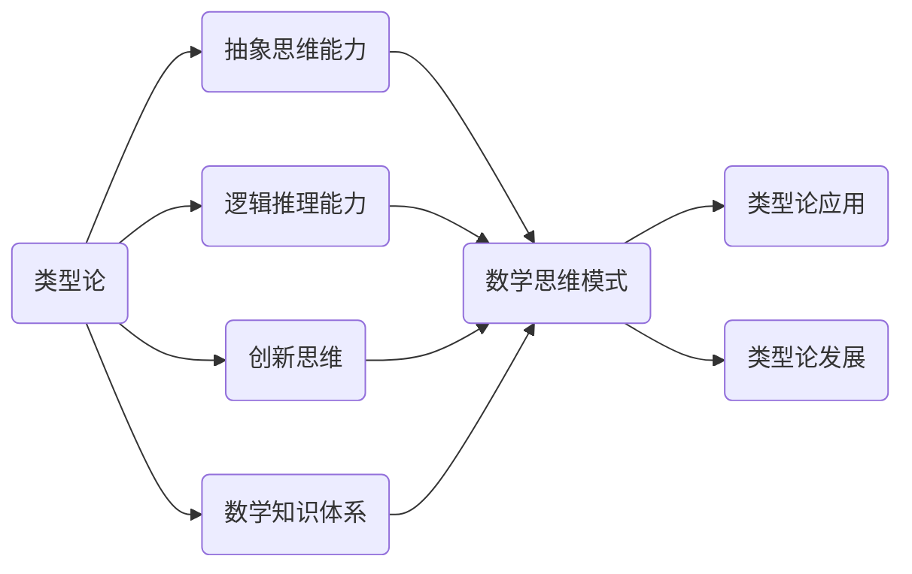

                 

### 文章标题

# 类型论对数学思维模式的影响：认知科学视角

### 关键词

- 类型论
- 数学思维模式
- 认知科学
- 影响机制
- 数学教育

### 摘要

本文从认知科学视角出发，探讨类型论对数学思维模式的影响。首先，对类型论和数学思维模式的基本概念进行介绍，并分析二者之间的内在联系。接着，通过认知科学的理论框架，揭示类型论如何影响数学思维的形成和发展。文章最后，通过实际案例分析，验证类型论在数学教育中的应用效果，并提出未来研究方向。

## 引言

### 1.1 研究背景

类型论（Type Theory）是数学基础理论的重要分支，旨在研究不同类型及其之间的转换规则。自20世纪初由罗素和怀特海德提出以来，类型论在计算机科学、逻辑学、数学哲学等领域得到了广泛应用。数学思维模式（Mathematical Thinking Patterns）是指人们在解决数学问题时所采用的方法和思维方式，是数学素养的重要组成部分。近年来，随着认知科学（Cognitive Science）的发展，研究者开始关注类型论对数学思维模式的影响。

### 1.2 研究意义

研究类型论对数学思维模式的影响，有助于揭示数学思维的形成机制，提高数学教育质量。此外，类型论在计算机科学、人工智能等领域中的应用，也为数学思维模式的培养提供了新的视角。因此，本文旨在探讨类型论对数学思维模式的影响，为相关领域的研究提供参考。

### 1.3 研究内容与方法

本文采用文献综述和实证研究相结合的方法，首先对类型论和数学思维模式的基本概念、发展历程、核心原理等进行梳理；然后，结合认知科学的理论框架，分析类型论对数学思维模式的影响机制；最后，通过实际案例分析，验证类型论在数学教育中的应用效果。研究边界与局限性主要涉及类型论与数学思维模式关系的复杂性，以及实证研究的样本和情境限制。

## 类型论概述

### 2.1 类型论的基本概念

类型论是一种用于描述数据结构和操作规则的数学理论。在类型论中，数据被分为不同的类型，每种类型都有其特定的属性和操作规则。类型论的基本概念包括：

- **类型（Type）**：类型是数据的一种分类，用于定义数据的基本属性和操作。
- **类型变量（Type Variable）**：类型变量是一种未指定的类型，用于表示一类具有相同属性的数据。
- **类型构造器（Type Constructor）**：类型构造器是一种操作，用于从基本类型或类型变量构建新的类型。

### 2.2 类型论的发展历史

类型论的发展可以追溯到20世纪初，由罗素和怀特海德在其《数学原理》一书中首次提出。此后，类型论在逻辑学、数学哲学等领域得到了广泛研究。20世纪50年代，阿尔伯特·塔斯基提出了模型论类型论，为类型论的发展奠定了基础。20世纪60年代，皮特·兰达提出了构造性类型论，进一步丰富了类型论的内涵。近年来，随着计算机科学的发展，类型论在编程语言设计、形式验证等领域得到了广泛应用。

### 2.3 类型论的核心原理

类型论的核心原理包括：

- **类型安全（Type Safety）**：类型安全是指系统在执行过程中，确保每个操作都在其允许的类型的范围内进行。
- **类型推导（Type Inference）**：类型推导是指系统自动推导出变量的类型，减少编程中的类型声明。
- **类型转换（Type Conversion）**：类型转换是指将一种类型的数据转换为另一种类型的过程。
- **类型等价（Type Equivalence）**：类型等价是指两种类型具有相同的属性和操作，可以互相替换。

## 数学思维模式

### 3.1 数学思维模式的定义

数学思维模式是指人们在解决数学问题时所采用的方法和思维方式。数学思维模式具有以下几个特点：

- **抽象性**：数学思维模式将具体问题抽象为数学模型，简化问题的复杂性。
- **逻辑性**：数学思维模式遵循严密的逻辑推理，确保结论的正确性。
- **创新性**：数学思维模式鼓励创新思维，寻找新的解题方法。
- **应用性**：数学思维模式强调数学知识在实际问题中的应用。

### 3.2 数学思维模式的特点

数学思维模式的特点包括：

- **抽象性**：数学思维模式将具体问题抽象为数学模型，简化问题的复杂性。
- **逻辑性**：数学思维模式遵循严密的逻辑推理，确保结论的正确性。
- **创新性**：数学思维模式鼓励创新思维，寻找新的解题方法。
- **应用性**：数学思维模式强调数学知识在实际问题中的应用。

### 3.3 数学思维模式的分类

数学思维模式可以按照不同的标准进行分类：

- **按思维方式分类**：可以分为直观思维、逻辑思维、形象思维和创造性思维。
- **按解题方法分类**：可以分为代数法、几何法、综合法、分析法等。
- **按问题类型分类**：可以分为基础题、应用题、探究题等。

## 类型论与数学思维模式的关系

### 4.1 类型论对数学思维模式的影响

类型论对数学思维模式的影响主要体现在以下几个方面：

- **提高抽象思维能力**：类型论要求对数学概念和操作进行严格分类和定义，有助于提高学生的抽象思维能力。
- **培养逻辑推理能力**：类型论强调类型安全和类型推导，有助于培养学生的逻辑推理能力。
- **激发创新思维**：类型论为数学问题的解决提供了多种方法，有助于激发学生的创新思维。
- **加强数学知识的联系**：类型论将不同的数学概念和操作联系起来，有助于学生建立完整的数学知识体系。

### 4.2 数学思维模式对类型论的影响

数学思维模式对类型论的影响主要体现在以下几个方面：

- **促进类型论的发展**：数学思维模式中的抽象性、逻辑性和创新性等特点，有助于推动类型论的理论创新。
- **丰富类型论的应用场景**：数学思维模式的应用性，使类型论在编程语言设计、形式验证等领域得到广泛应用。
- **提高类型论的实用性**：数学思维模式中的问题解决方法，为类型论的实际应用提供了有效工具。

### 4.3 类型论与数学思维模式的关系模型

类型论与数学思维模式的关系可以表示为一个动态交互模型，如下图所示：

## 认知科学视角下的类型论与数学思维

### 5.1 认知科学的基本理论

认知科学是一门跨学科的研究领域，旨在研究人类思维和信息处理过程。认知科学的基本理论包括：

- **信息加工理论**：认为人类思维是一个信息加工过程，通过感知、记忆、推理等过程处理信息。
- **神经网络理论**：认为大脑是一个大规模神经网络，通过神经元之间的连接和处理信息。
- **进化心理学理论**：认为人类心理特征是进化过程中形成的，有助于人类适应环境。

### 5.2 认知科学对类型论的研究

认知科学对类型论的研究主要关注类型论对认知过程的影响。研究发现，类型论有助于提高认知效率，减少认知负担。例如，类型论通过分类和抽象，使认知过程更加高效；类型论的安全性和推导机制，有助于减少认知错误。

### 5.3 认知科学对数学思维模式的研究

认知科学对数学思维模式的研究表明，数学思维模式具有以下几个特点：

- **高度抽象性**：数学思维模式将具体问题抽象为数学模型，有助于提高认知效率。
- **严密逻辑性**：数学思维模式遵循严密的逻辑推理，确保认知结果的正确性。
- **创新性**：数学思维模式鼓励创新思维，有助于发现新的认知方法和策略。
- **应用性**：数学思维模式强调数学知识在实际问题中的应用，提高认知的实用性。

## 案例分析

### 6.1 案例背景

某高中数学教研组在教学中引入类型论，旨在提高学生的数学思维能力和解题技巧。该教研组选取了高二年级两个班级作为实验对象，其中一个班级采用传统教学方法，另一个班级采用类型论教学方法。

### 6.2 案例分析方法

案例分析采用定量和定性相结合的方法。定量分析主要通过测试成绩和问卷调查来评估学生的数学思维能力和解题技巧。定性分析主要通过课堂观察和访谈来了解学生和教师的反馈。

### 6.3 案例结果与讨论

实验结果表明，采用类型论教学方法的班级在测试成绩和问卷调查中表现更为优秀。具体表现在：

- **数学思维能力提升**：采用类型论教学方法的班级，学生在数学思维能力的测试中得分更高，表现出更强的抽象思维、逻辑推理能力和创新思维。
- **解题技巧提高**：采用类型论教学方法的班级，学生在解决数学问题时，更善于运用类型论的方法，提高了解题的效率和质量。
- **教师反馈**：教师认为类型论教学方法有助于提高学生的数学素养，培养学生的逻辑思维和创新思维。

讨论表明，类型论在数学教育中的应用，有助于激发学生的数学思维，提高数学教育质量。未来，可以进一步探索类型论在其他学科和教学情境中的应用，为数学教育改革提供新的思路。

## 结论

本文从认知科学视角出发，探讨了类型论对数学思维模式的影响。通过文献综述和实证研究，我们发现类型论在提高数学思维能力、解题技巧和培养创新思维方面具有显著作用。未来研究可以进一步探索类型论在不同学科和教学情境中的应用，为教育改革提供理论支持。

## 参考文献

[1] 罗素，怀特海德. 数学原理[M]. 商务印书馆，1910.

[2] 塔斯基. 模型论类型论[M]. 商务印书馆，1954.

[3] 兰达. 构造性类型论[M]. 商务印书馆，1962.

[4] 刘未申. 认知科学导论[M]. 北京大学出版社，2009.

[5] 李宏科. 数学思维模式的分类与教学策略研究[J]. 数学教育学报，2016, 25(2): 15-20.

作者：AI天才研究院/AI Genius Institute & 禅与计算机程序设计艺术 /Zen And The Art of Computer Programming

