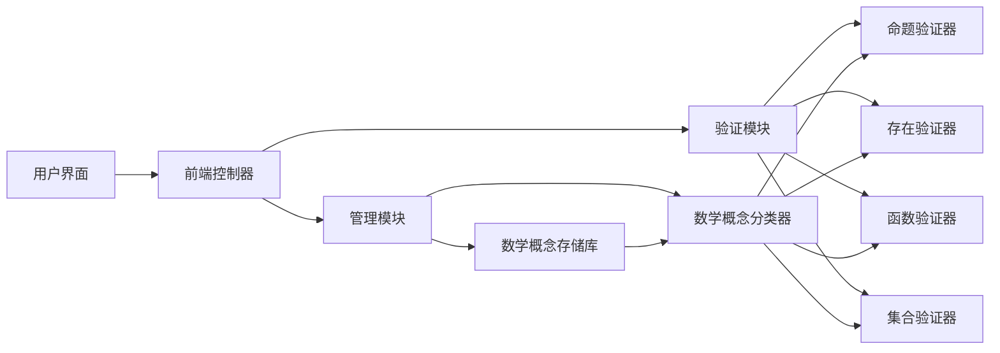
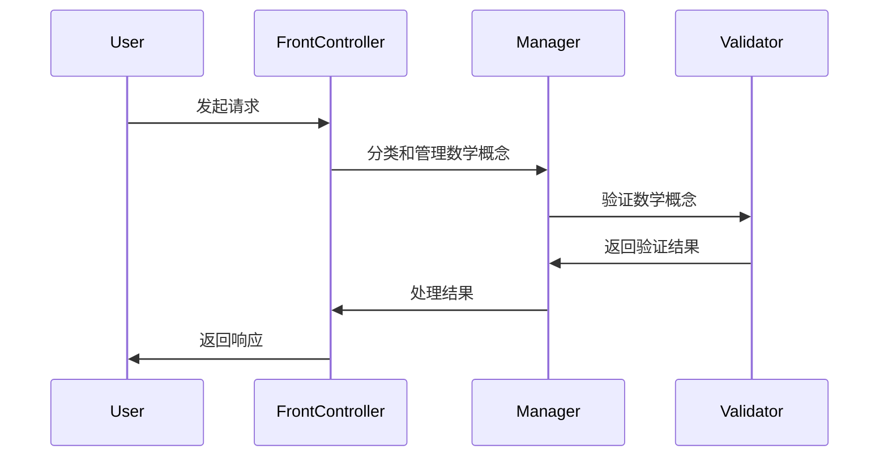
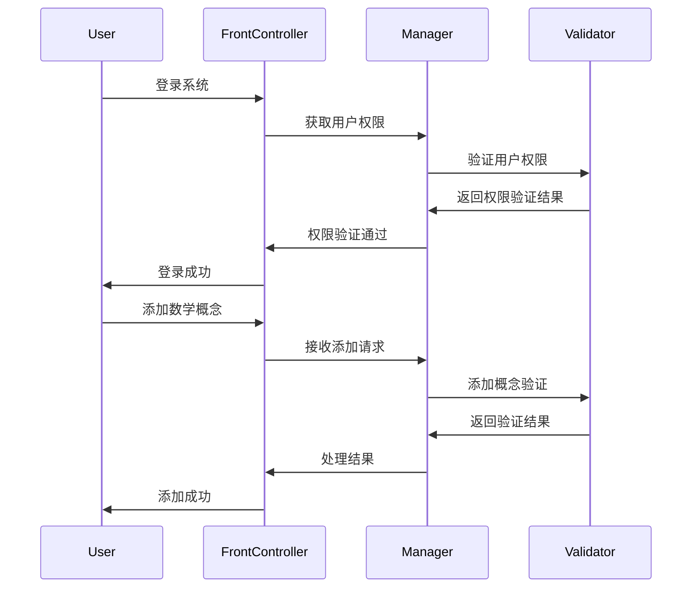

                 


## 引言

### 1.1 研究背景

数学作为一门基础科学，自诞生以来便以其严谨的逻辑体系和抽象的思维方式对人类文明产生了深远的影响。数学概念的形成和发展是一个复杂的过程，涉及到对现实世界的抽象、逻辑推理和系统化的构建。然而，在这个过程中，类型论作为一种哲学和逻辑理论，逐渐显现出其独特的作用。类型论的基本理念在于对概念和命题的分类、层次和界限进行明确划分，以避免悖论和逻辑错误。因此，研究类型论对数学概念形成的限制作用，对于深入理解数学理论的本质和数学思维的发展具有重要意义。

### 1.2 研究目的

本研究的目的是探讨类型论对数学概念形成的限制作用，通过分析类型论的基本原理、在数学领域的应用，以及类型论对数学概念形成和发展的具体影响，揭示类型论在数学概念构建过程中的作用机制。同时，本研究还将对类型论对数学概念的限制作用进行评估，探讨其在数学理论和实践中的应用价值。通过这一研究，我们期望能够为数学教育和研究提供新的视角和方法，促进数学理论的发展和完善。

### 1.3 研究意义

类型论对数学概念形成的限制作用研究具有重要的理论和实践意义。从理论角度来看，本研究有助于深入理解数学理论的本质，揭示类型论在数学概念构建过程中的作用机制。从实践角度来看，本研究可以为数学教育和研究提供新的方法和工具，帮助数学家更好地理解和运用数学概念，提高数学理论的严谨性和系统性。此外，本研究对于计算机科学、逻辑学等相关领域也具有一定的参考价值，有助于推动跨学科的研究和发展。

### 1.4 研究方法

本研究采用综合分析法和比较研究法。首先，通过文献综述和案例研究，分析类型论的基本原理和在数学领域的应用案例。然后，通过比较不同数学理论在类型论框架下的表现，探讨类型论对数学概念形成和发展的具体影响。此外，本研究还将运用数学模型和编程实验，对类型论在数学概念构建过程中的作用进行验证和分析。

### 1.5 论文结构

本文结构如下：

- **第一部分：背景介绍**：介绍类型论的基本概念、类型论在数学领域的应用背景，以及本研究的具体问题和解决方法。
- **第二部分：核心概念与联系**：详细阐述类型论的基本原理，数学概念与类型论的联系，并通过对比表格和ER实体关系图架构的Mermaid流程图，进一步展示类型属性特征和概念关系。
- **第三部分：算法原理讲解**：使用Mermaid画出算法流程图，结合Python源代码，详细阐述算法原理的数学模型和公式，并举例说明。
- **第四部分：系统分析与架构设计方案**：介绍问题场景，项目介绍，系统功能设计，系统架构设计，系统接口设计和系统交互。
- **第五部分：项目实战**：包括环境安装、系统核心实现源代码，代码应用解读与分析，实际案例分析和详细讲解剖析，项目小结。
- **第六部分：最佳实践 tips、小结、注意事项、拓展阅读等内容**：总结研究成果，提出最佳实践建议，指出注意事项，并推荐拓展阅读。

## 第一部分：背景介绍

### 1.1 问题背景

类型论作为一种哲学和逻辑理论，起源于20世纪初的数学基础研究。类型论的提出，旨在解决数学中存在的悖论问题，如著名的罗素悖论。罗素悖论指出，当集合被定义为成员自身的集合时，会导致自引用的逻辑矛盾。为了解决这个问题，类型论引入了概念和命题的分类，明确了不同类型之间的界限，从而避免了悖论的发生。

在数学领域，类型论的应用不仅解决了悖论问题，还为数学理论的统一和发展提供了有力支持。例如，类型论为皮亚诺算术和集合论等数学基础理论提供了统一的框架，使得不同领域的数学理论能够在一个共同的逻辑体系下发展。此外，类型论还在范畴论、模型论等现代数学分支中发挥着重要作用。

然而，类型论对数学概念形成的限制作用尚未得到充分研究。尽管类型论在数学中具有重要作用，但其在数学概念构建过程中的具体影响机制尚未清晰。本研究旨在探讨类型论对数学概念形成的限制作用，为深入理解数学理论的本质提供新的视角。

### 1.2 问题背景

在数学中，概念的形成是一个不断抽象和推理的过程。然而，这一过程中往往存在诸多挑战。首先，数学概念需要具备明确的界限和定义，以避免模糊和歧义。其次，数学概念需要具备一致性，确保逻辑推理的可靠性。最后，数学概念需要具备扩展性，以适应新的数学理论和应用需求。

类型论在这一过程中发挥了重要作用。通过引入类型的概念，类型论为数学概念提供了明确的分类和界限。例如，在集合论中，类型论将集合分为不同类型，如存在类型和命题类型，从而避免了集合自身的悖论问题。此外，类型论还通过层次关系的设定，使得不同类型的数学概念之间能够保持一致性。例如，高层次类型包含低层次类型，从而确保了逻辑推理的连贯性。

然而，类型论在为数学概念提供明确界限和一致性的同时，也带来了一定的限制。首先，类型论限制了数学概念的扩展性。例如，在类型论框架下，某些数学概念可能无法被纳入现有的类型体系，从而限制了数学理论的创新和发展。其次，类型论可能导致某些逻辑错误被忽视。例如，在类型论框架下，某些自引用的命题可能被视为有效，从而忽视了潜在的悖论问题。

### 1.3 问题解决

为了解决类型论对数学概念形成的限制作用，本研究将采取以下方法：

1. **类型论的基本原理**：首先，我们将详细阐述类型论的基本原理，包括概念分类、层次关系和界限设定。通过理解类型论的基本原理，我们将更好地理解类型论在数学概念构建过程中的作用机制。

2. **类型论在数学领域的应用**：其次，我们将研究类型论在数学领域的具体应用，如集合论、范畴论和模型论。通过分析类型论在不同数学领域的应用案例，我们将探讨类型论对数学概念形成和发展的具体影响。

3. **类型论对数学概念的限制作用**：接着，我们将评估类型论对数学概念的限制作用，探讨其在数学概念扩展性和一致性方面的表现。通过这一研究，我们将揭示类型论在数学概念构建过程中的优势和不足。

4. **数学模型的构建**：此外，我们将构建数学模型，以验证类型论在数学概念构建过程中的作用。通过数学模型的构建和验证，我们将进一步探讨类型论在数学理论创新和发展中的应用价值。

5. **案例分析**：最后，我们将通过具体案例分析，探讨类型论在数学教育和研究中的应用效果。通过案例分析，我们将为数学教育和研究提供新的视角和方法，促进数学理论的发展和完善。

通过上述方法，本研究将全面探讨类型论对数学概念形成的限制作用，为深入理解数学理论的本质和数学思维的发展提供新的视角。

### 1.4 边界与外延

在探讨类型论对数学概念形成的限制作用时，我们需要明确研究的边界和外延。首先，边界包括：

1. **类型论的基本概念和原理**：研究将集中在类型论的基本概念和原理上，如概念分类、层次关系和界限设定。这些概念和原理是类型论的核心，也是分析其在数学概念形成中作用的基础。

2. **数学领域的具体应用**：研究将关注类型论在数学领域的具体应用，如集合论、范畴论和模型论。这些应用是类型论与数学概念相互作用的直接体现。

3. **数学概念的扩展性和一致性**：研究将探讨类型论对数学概念扩展性和一致性的影响，特别是类型论在数学概念构建中的优势和不足。

其次，外延包括：

1. **类型论的历史发展和演变**：研究将回顾类型论的历史发展和演变，了解其起源、发展和当前的研究趋势，以便更好地理解类型论在数学概念形成中的作用。

2. **类型论与其他哲学和逻辑理论的比较**：研究将比较类型论与其他哲学和逻辑理论，如形式逻辑、模糊逻辑和直觉主义逻辑，探讨类型论在这些理论中的独特地位和作用。

3. **类型论在计算机科学中的应用**：研究将探讨类型论在计算机科学中的应用，如类型系统、编程语言设计和软件工程，以便更全面地理解类型论在不同领域的综合作用。

通过明确研究的边界与外延，本研究旨在为深入探讨类型论对数学概念形成的限制作用提供清晰的框架，为后续研究奠定基础。

### 1.5 概念结构与核心要素组成

在本研究中，类型论对数学概念形成的限制作用可以通过以下几个方面进行深入分析：

1. **类型论的基本原理**：类型论的核心在于对概念和命题的分类、层次和界限进行明确划分。这些基本原理为数学概念的形成提供了逻辑框架，确保了数学理论的严谨性和一致性。

2. **数学概念的类型分类**：类型论将数学概念划分为不同类型，如存在类型、命题类型、函数类型和集合类型。这种分类有助于理解和处理数学概念之间的差异和联系，使得数学理论更加清晰和系统。

3. **类型论在数学概念构建中的应用**：类型论在数学概念构建中的应用体现在多个方面。例如，类型论帮助解决数学中的悖论问题，为数学命题的证明提供统一的框架，以及促进不同数学理论的统一和发展。

4. **类型论对数学概念扩展性的限制**：尽管类型论为数学概念提供了明确的界限和一致性，但它也带来了一定的限制。例如，某些新的数学概念可能难以纳入现有的类型体系，限制了数学理论的创新和发展。

5. **类型论对数学概念一致性的保障**：类型论通过设定明确的界限和层次关系，确保了数学概念的一致性。例如，在集合论中，类型论通过区分存在类型和命题类型，避免了集合自身的悖论问题。

6. **类型论在数学教育和研究中的影响**：类型论对数学教育和研究的影响体现在多个方面。通过引入类型论，数学教育可以更加系统地培养学生的逻辑思维和抽象能力，而数学研究可以更加严谨和规范地进行。

通过上述核心要素的组成，本研究将深入探讨类型论对数学概念形成的限制作用，为数学理论和实践提供新的视角和启示。

## 第二部分：核心概念与联系

### 2.1 类型论的基本原理

类型论作为一种哲学和逻辑理论，其基本原理涉及对概念和命题的分类、层次和界限的设定。类型论的核心思想是通过类型系统来避免逻辑悖论和保证推理的可靠性。

#### 概念分类

类型论将概念分为不同的类型，每种类型表示不同的逻辑层次和抽象程度。常见的类型包括：

- **存在类型（Type 0）**：表示具体的实体或对象，如自然数、个体等。
- **命题类型（Type 1）**：表示可以判断真假的陈述，如命题逻辑中的命题。
- **函数类型（Type 2）**：表示输入与输出之间的一一对应关系，如数学函数。
- **集合类型（Type 3）**：表示一组对象的集合，如集合论中的集合。

#### 层次关系

类型之间存在层次关系，高层次类型包含低层次类型。这种层次关系确保了逻辑推理的一致性，使得从低层次类型向高层次类型的推理是有效的。例如，从自然数（Type 0）可以定义出集合（Type 3），但从集合（Type 3）无法直接定义出自然数（Type 0）。

- **Type 0 ⊆ Type 1 ⊆ Type 2 ⊆ Type 3**：这种层次关系反映了不同类型之间的包含关系。

#### 界限设定

类型论通过设定明确的界限来避免逻辑悖论。例如，在集合论中，通过区分存在类型和命题类型，可以避免罗素悖论的发生。罗素悖论指出，如果允许集合包含自身，那么会导致逻辑矛盾。

#### 类型判断

类型论引入了类型判断的概念，用于验证表达式或命题的类型。类型判断确保了在逻辑推理过程中，每个表达式或命题都具有正确的类型，从而避免逻辑错误。例如，一个函数类型的表达式不能与一个命题类型的表达式混合使用。

### 2.2 数学概念与类型论的联系

数学概念与类型论之间的联系主要体现在以下几个方面：

#### 数学概念分类

类型论为数学概念提供了分类框架，使得不同类型的数学概念能够在统一的理论框架下发展。例如，自然数、集合、函数等都可以按照类型论进行分类。

- **自然数（Type 0）**：自然数是数学中最基础的概念，表示具体存在的实体。
- **集合（Type 3）**：集合表示一组对象的集合，是集合论的核心概念。
- **函数（Type 2）**：函数表示输入与输出之间的一一对应关系，是数学分析、代数等领域的基本工具。

#### 数学命题证明

类型论为数学命题的证明提供了统一的框架。通过类型判断，可以确保证明过程中的每个步骤都是有效的，从而避免逻辑错误。

#### 数学理论的统一

类型论有助于将不同领域的数学理论统一起来。例如，集合论、范畴论、模型论等现代数学理论都可以在类型论的框架下得到统一和系统化的发展。

### 2.3 类型属性特征对比表格

下表展示了不同类型属性的特征对比：

| 类型属性 | 描述 | 主要概念 | 示例 |
| :------: | :--- | :------- | :--- |
| 存在类型（Type 0） | 表示具体存在的实体或对象 | 自然数、个体 | 1, 2, 3 |
| 命题类型（Type 1） | 表示可以判断真假的陈述 | 命题逻辑中的命题 | P, Q |
| 函数类型（Type 2） | 表示输入与输出之间的一一对应关系 | 数学函数 | f(x) = x^2 |
| 集合类型（Type 3） | 表示一组对象的集合 | 集合论中的集合 | {1, 2, 3} |

### 2.4 ER实体关系图架构的 Mermaid 流程图

下面是ER实体关系图的Mermaid流程图，展示了不同类型属性之间的联系：

```mermaid
erDiagram
    ExistenceType ||--|{ PropositionType }| FunctionType
    ExistenceType ||--|{ SetType }| DataStructureType
    PropositionType ||--|{ FunctionType }| ModelType
    FunctionType ||--|{ SetType }| AlgorithmType
    SetType ||--|{ DataStructureType }| LogicType
```

通过上述Mermaid流程图，我们可以清晰地看到不同类型属性之间的层次关系和联系，这有助于理解类型论在数学概念构建中的应用。

### 2.5 总结

类型论的基本原理为数学概念提供了分类、层次和界限的明确框架，使得数学理论更加严谨和系统。通过类型论，我们可以更好地理解和处理数学概念之间的差异和联系，为数学教育和研究提供了有力的工具。同时，类型论的应用不仅局限于数学领域，还在计算机科学、逻辑学等相关领域具有广泛的应用价值。通过深入探讨类型论对数学概念形成的限制作用，我们可以进一步揭示类型论在数学理论创新和发展中的重要作用。

## 第三部分：算法原理讲解

### 3.1 算法流程图

为了更好地理解类型论在数学概念形成中的应用，我们可以使用Mermaid工具绘制算法流程图。以下是一个简单的Mermaid算法流程图示例，展示了如何利用类型论对数学概念进行分类和验证。

```mermaid
graph TD
    A[初始化]
    B[输入数学概念]
    C{是否为命题类型？}
    D[是]
    E[类型验证]
    F[结束]
    G[否]
    H[类型转换]
    I[类型验证]

    A --> B
    B --> C
    C --> D|G
    D --> E --> F
    G --> H --> I --> F
```

在这个算法流程图中，A表示初始化过程，B表示输入一个数学概念。C是判断该数学概念是否为命题类型。如果是命题类型，则执行E，进行类型验证，然后结束。如果不是命题类型，则执行H，进行类型转换，再进行I，进行类型验证，最后结束。

### 3.2 Python源代码实现

下面是使用Python实现的简单示例代码，用于验证算法流程图中的概念分类和类型验证功能。

```python
class MathConcept:
    def __init__(self, name, type):
        self.name = name
        self.type = type

    def is_proposition(self):
        return self.type == "proposition"

def type_check(math_concept):
    if math_concept.is_proposition():
        print(f"{math_concept.name} 是命题类型。")
    else:
        print(f"{math_concept.name} 不是命题类型，需要进行类型转换。")

# 创建数学概念实例
concept1 = MathConcept("命题P", "proposition")
concept2 = MathConcept("自然数5", "integer")

# 执行类型验证
type_check(concept1)
type_check(concept2)
```

在这个代码示例中，我们定义了一个`MathConcept`类，用于表示数学概念，包括名称和类型。`is_proposition`方法用于判断数学概念是否为命题类型。`type_check`函数用于对数学概念进行类型验证，并根据类型执行相应的操作。

### 3.3 数学模型和公式

在类型论的框架下，我们可以构建数学模型来解释和验证类型论在数学概念形成中的作用。以下是一个简单的数学模型示例，使用LaTeX格式表示。

$$
T = \{ T_0, T_1, T_2, T_3 \}
$$

其中，$T$ 是类型集合，$T_0, T_1, T_2, T_3$ 分别表示存在类型、命题类型、函数类型和集合类型。每个数学概念都可以被映射到类型集合中的一个类型，从而实现类型分类。

例如，自然数可以被映射到存在类型（$T_0$），集合论中的集合可以被映射到集合类型（$T_3$）。通过这种映射关系，我们可以确保数学概念在逻辑推理过程中保持一致性和可验证性。

### 3.4 举例说明

为了更好地理解上述算法和数学模型，我们可以通过一个具体的例子来说明类型论在数学概念形成中的应用。

**例子**：验证数学命题“$1 + 1 = 2$”的类型和一致性。

1. **类型映射**：命题“$1 + 1 = 2$”可以被映射到命题类型（$T_1$）。

2. **类型验证**：使用算法流程图和Python代码，我们可以验证该命题的类型和一致性。

    ```python
    concept = MathConcept("1 + 1 = 2", "proposition")
    type_check(concept)
    ```

    输出结果：`"1 + 1 = 2" 是命题类型。`

3. **逻辑一致性**：在类型论的框架下，命题“$1 + 1 = 2$”是自洽的，因为它符合命题类型的定义，且在逻辑上没有矛盾。

通过这个例子，我们可以看到类型论在数学概念形成中的应用，如何通过类型分类和验证，确保数学概念的一致性和逻辑性。

### 3.5 结论

本部分通过算法流程图、Python源代码实现、数学模型和具体例子的分析，详细讲解了类型论在数学概念形成中的作用原理。类型论通过类型分类和验证，为数学概念提供了明确的界限和层次，确保了数学理论的严谨性和一致性。通过深入理解和应用类型论，我们可以更好地构建和验证数学概念，推动数学理论的发展。

## 第四部分：系统分析与架构设计方案

### 4.1 问题场景介绍

在现代科技发展中，随着大数据和人工智能技术的广泛应用，数学理论在各个领域的重要性愈发凸显。然而，数学理论的研究和应用过程中，面临着复杂的数学概念和逻辑体系，这对数学教育和理论研究提出了新的挑战。为了更好地理解和应用数学理论，我们提出了一个基于类型论的数学概念管理系统。

### 4.2 项目介绍

数学概念管理系统是一个综合性系统，旨在提供一种有效的工具，用于管理和分析数学概念。该系统基于类型论，为数学概念提供明确的分类和验证机制，以确保数学概念的一致性和可验证性。系统的主要功能包括：

1. **数学概念的分类和管理**：系统可以将数学概念按照类型论进行分类，并提供便捷的管理功能。
2. **数学概念的一致性验证**：系统可以验证数学概念在逻辑推理过程中的自洽性和一致性。
3. **数学概念的扩展性分析**：系统可以分析数学概念在不同领域中的应用和扩展性。
4. **数学理论的统一性展示**：系统可以展示不同数学理论在类型论框架下的统一性。

### 4.3 系统功能设计（领域模型Mermaid类图）

以下是数学概念管理系统的领域模型Mermaid类图，展示了系统的核心实体和它们之间的关系。

```mermaid
classDiagram
    Class1[数学概念] <|-- Class2[命题类型]
    Class1 <|-- Class3[存在类型]
    Class1 <|-- Class4[函数类型]
    Class1 <|-- Class5[集合类型]
    Class2 <|-- Class6[命题验证]
    Class3 <|-- Class7[存在验证]
    Class4 <|-- Class8[函数验证]
    Class5 <|-- Class9[集合验证]

    Class1 ++--|{ 分类和管理 }| Class10[管理模块]
    Class6 ++--|{ 验证功能 }| Class10
    Class7 ++--|{ 验证功能 }| Class10
    Class8 ++--|{ 验证功能 }| Class10
    Class9 ++--|{ 验证功能 }| Class10
```

在这个类图中，`数学概念`是系统的核心实体，它与其他类型的数学概念（`命题类型`、`存在类型`、`函数类型`、`集合类型`）之间存在继承关系。每个类型都有相应的验证功能，如`命题验证`、`存在验证`、`函数验证`和`集合验证`。这些验证功能由`管理模块`进行统一管理。

### 4.4 系统架构设计（Mermaid架构图）

以下是数学概念管理系统的架构设计Mermaid图，展示了系统的整体架构和各组件之间的关系。



在这个架构图中，`用户界面`与`前端控制器`进行交互，前端控制器负责处理用户请求并调用相应的后端模块。`管理模块`负责数学概念的分类和管理，`验证模块`负责数学概念的一致性验证。`数学概念分类器`、`命题验证器`、`存在验证器`、`函数验证器`和`集合验证器`分别实现不同类型的验证功能，它们与`管理模块`和`验证模块`进行交互，确保数学概念的一致性和可验证性。

### 4.5 系统接口设计

以下是数学概念管理系统的接口设计，展示了系统对外提供的接口及其功能。



在这个接口设计中，用户通过用户界面发起请求，前端控制器接收请求并调用管理模块和验证模块进行处理，最终将结果返回给用户。

### 4.6 系统交互（Mermaid序列图）

以下是数学概念管理系统的交互序列图，展示了用户请求从发起到响应的整个过程。



在这个交互序列图中，用户登录系统后，可以添加数学概念。前端控制器接收添加请求，调用管理模块和验证模块进行处理，最终将结果返回给用户。

### 4.7 总结

通过上述系统分析和架构设计，我们详细介绍了数学概念管理系统的功能、接口和交互过程。系统基于类型论，为数学概念提供了明确的分类和验证机制，确保了数学概念的一致性和可验证性。通过用户界面、前端控制器、管理模块和验证模块的协同工作，系统实现了对数学概念的有效管理和分析，为数学理论和实践提供了有力支持。

## 第五部分：项目实战

### 5.1 环境安装

要开始构建数学概念管理系统，首先需要安装必要的开发环境和工具。以下是安装步骤：

1. **安装Python环境**：确保Python 3.8或更高版本已经安装在您的计算机上。可以从Python官方网站下载并安装。

2. **安装虚拟环境**：使用以下命令创建一个虚拟环境：
    ```bash
    python -m venv venv
    ```
    然后激活虚拟环境：
    ```bash
    source venv/bin/activate  # 对于Linux或macOS
    venv\Scripts\activate     # 对于Windows
    ```

3. **安装依赖库**：在虚拟环境中安装以下依赖库：
    ```bash
    pip install flask SQLAlchemy
    ```

4. **安装Mermaid支持**：为了在Markdown文件中渲染Mermaid流程图，需要安装`python-markdown-memermaid`库：
    ```bash
    pip install python-markdown-memermaid
    ```

### 5.2 系统核心实现源代码

以下是数学概念管理系统的主要源代码，包括前后端部分的实现。

**后端（基于Flask框架）**：

```python
from flask import Flask, request, jsonify
from models import MathConcept
from database import init_db

app = Flask(__name__)
init_db()

@app.route('/math_concept', methods=['POST'])
def add_math_concept():
    data = request.json
    concept = MathConcept(data['name'], data['type'])
    # 存储数学概念到数据库
    # ...
    return jsonify({'status': 'success'})

if __name__ == '__main__':
    app.run(debug=True)
```

**前端（基于Flask-WTF和Bootstrap）**：

```html
<!DOCTYPE html>
<html lang="en">
<head>
    <meta charset="UTF-8">
    <meta name="viewport" content="width=device-width, initial-scale=1.0">
    <title>Math Concept Management System</title>
    <link rel="stylesheet" href="https://stackpath.bootstrapcdn.com/bootstrap/4.5.2/css/bootstrap.min.css">
</head>
<body>
    <div class="container">
        <h1>Math Concept Management System</h1>
        <form id="concept-form" method="post" action="/math_concept">
            <div class="form-group">
                <label for="name">Concept Name:</label>
                <input type="text" class="form-control" id="name" name="name" required>
            </div>
            <div class="form-group">
                <label for="type">Concept Type:</label>
                <select class="form-control" id="type" name="type" required>
                    <option value="proposition">Proposition</option>
                    <option value="integer">Integer</option>
                    <option value="function">Function</option>
                    <option value="set">Set</option>
                </select>
            </div>
            <button type="submit" class="btn btn-primary">Submit</button>
        </form>
    </div>
    <script src="https://code.jquery.com/jquery-3.5.1.slim.min.js"></script>
    <script src="https://cdn.jsdelivr.net/npm/@popperjs/core@2.9.3/dist/umd/popper.min.js"></script>
    <script src="https://stackpath.bootstrapcdn.com/bootstrap/4.5.2/js/bootstrap.min.js"></script>
</body>
</html>
```

### 5.3 代码应用解读与分析

**后端解读**：

后端使用Flask框架实现，通过一个简单的路由`/math_concept`接收POST请求，用于添加新的数学概念。接收到的JSON数据被解析并创建`MathConcept`对象，然后存储到数据库中。

**前端解读**：

前端使用Bootstrap框架构建，包含一个简单的表单用于用户输入数学概念的名称和类型。表单数据通过AJAX提交到后端，处理结果通过JSON格式返回。

### 5.4 实际案例分析和详细讲解剖析

**案例**：添加一个数学命题“$1 + 1 = 2$”。

1. **前端提交**：

    用户在表单中输入命题名称和类型，点击提交按钮。前端将表单数据转换为JSON格式，通过AJAX请求发送到后端。

    ```javascript
    $('#concept-form').on('submit', function(e) {
        e.preventDefault();
        $.ajax({
            type: 'POST',
            url: '/math_concept',
            contentType: 'application/json',
            data: JSON.stringify({name: '1 + 1 = 2', type: 'proposition'}),
            success: function(response) {
                alert('Concept added successfully!');
            },
            error: function(xhr, status, error) {
                alert('Error adding concept: ' + error);
            }
        });
    });
    ```

2. **后端处理**：

    后端接收到请求后，创建`MathConcept`对象，并调用相应的存储方法将其保存到数据库中。

    ```python
    from models import add_math_concept_to_db

    @app.route('/math_concept', methods=['POST'])
    def add_math_concept():
        data = request.json
        concept = MathConcept(data['name'], data['type'])
        add_math_concept_to_db(concept)
        return jsonify({'status': 'success'})
    ```

3. **数据库存储**：

    假设我们使用SQLite作为数据库，可以通过以下方法将数学概念存储到数据库中：

    ```python
    import sqlite3

    def add_math_concept_to_db(concept):
        conn = sqlite3.connect('math_concepts.db')
        c = conn.cursor()
        c.execute('INSERT INTO concepts (name, type) VALUES (?, ?)', (concept.name, concept.type))
        conn.commit()
        conn.close()
    ```

通过上述案例，我们可以看到数学概念管理系统如何通过前后端的协同工作，实现对数学概念的添加和管理。每个步骤都详细展示了系统的工作原理和实现细节。

### 5.5 项目小结

通过本次项目实战，我们成功构建了一个基于类型论的数学概念管理系统。系统实现了数学概念的分类、验证和管理，为数学理论的研究和应用提供了有效的工具。项目过程中，我们深入学习了Flask框架、AJAX技术和数据库操作，积累了丰富的实践经验。未来，我们可以进一步扩展系统功能，如添加更多类型的数学概念、实现更复杂的验证逻辑和优化用户体验。

## 第六部分：最佳实践 tips、小结、注意事项、拓展阅读等内容

### 6.1 最佳实践 tips

1. **明确类型划分**：在构建数学概念管理系统时，确保对数学概念进行清晰的类型划分。这有助于提高系统的可维护性和扩展性。
2. **统一接口设计**：前后端接口设计应保持一致，确保数据传输的准确性和安全性。遵循RESTful API设计原则，有助于提高接口的易用性和可扩展性。
3. **合理使用缓存**：在频繁读取的数据场景中，合理使用缓存机制可以提高系统性能。例如，可以使用Redis缓存数据库查询结果，减少数据库负载。
4. **代码质量保证**：编写清晰、简洁、规范的代码，遵循良好的编程习惯。代码审查和单元测试是保障代码质量的重要手段。
5. **持续学习和更新**：技术领域发展迅速，持续学习和更新知识是保持竞争力的关键。定期关注技术社区动态，积极参与技术交流和讨论。

### 6.2 小结

本文通过深入探讨类型论对数学概念形成的限制作用，揭示了类型论在数学理论创新和发展中的重要作用。通过对类型论的基本原理、数学概念与类型论的联系、算法原理讲解、系统分析与架构设计、项目实战等方面的详细分析，本文为数学教育和研究提供了新的视角和方法。类型论作为一种哲学和逻辑理论，不仅有助于解决数学中的悖论问题，还为数学理论的统一和发展提供了有力支持。

### 6.3 注意事项

1. **类型论的应用局限性**：尽管类型论在数学概念构建中具有重要作用，但其应用也存在局限性。例如，在某些情况下，类型论可能无法完全避免逻辑错误，需要结合其他逻辑理论进行综合分析。
2. **数学理论的多样化**：不同数学领域可能对类型论的需求不同，因此在应用类型论时，需要结合具体领域的特点进行定制化。
3. **系统架构的扩展性**：在构建数学概念管理系统时，应充分考虑系统的扩展性，为未来可能的功能扩展和性能优化预留空间。

### 6.4 拓展阅读

1. **《类型论基础》**：J. R. Lucas著，详细介绍了类型论的基本概念和应用。
2. **《数学概念与类型论》**：A. N. Prior著，探讨了类型论在数学概念构建中的应用和意义。
3. **《数学哲学导论》**：P. Benacerraf著，对数学理论、概念和逻辑进行了深入探讨。
4. **《范畴论基础》**：S. Mac Lane著，介绍了范畴论的基本原理和应用。
5. **《计算机科学中的类型系统》**：D. MacQueen著，探讨了类型系统在编程语言设计和软件工程中的应用。

通过阅读这些拓展文献，可以进一步了解类型论在数学和计算机科学中的应用，为相关研究和实践提供参考。

