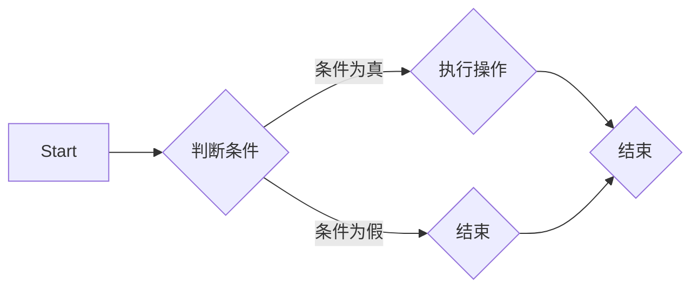

                 

# 类型论对数学直觉重要性认知的挑战

## 关键词

类型论、数学直觉、逻辑基础、证明理论、编程语言、形式验证

## 摘要

本文旨在探讨类型论对数学直觉重要性认知的挑战。类型论作为数学和计算机科学中的核心理论之一，不仅在逻辑和证明理论中发挥了重要作用，也对编程语言和形式验证产生了深远影响。通过分析类型论的基础、在数学中的应用以及其对数学直觉的挑战，本文揭示了类型论在现代数学研究中的关键地位，并展望了其未来发展趋势。

## 第一部分：类型论基础

### 第1章：类型论的起源与发展

#### 1.1 类型论的起源

类型论起源于20世纪初的数学和逻辑研究，当时数学家们试图为数学命题提供一种更加精确的表述方式。类型论最早可以追溯到弗雷格（Gottlob Frege）的工作，他在研究逻辑和数学的关系时提出了类型的概念。随后，类型论在数学和计算机科学中得到了广泛的应用和发展。

#### 1.2 类型论的发展历程

类型论的发展经历了多个阶段，从最初的简单类型系统到现代复杂的类型依赖证明系统。在此过程中，许多学者做出了重要贡献。例如，丘奇（Alonzo Church）提出了λ演算，开创了类型论在计算机科学中的应用；卡内尔（Per Martin-Löf）则提出了依赖类型理论，为类型论在证明理论和编程语言中的应用奠定了基础。

#### 1.3 类型论的核心概念

类型论的核心概念包括类型、类型系统、简单类型和复合类型等。类型是数学表达式的分类，类型系统是类型定义的集合，简单类型是不能再分解的类型，而复合类型是由简单类型组合而成的类型。类型等价和类型赋值也是类型论中的基本概念，用于描述类型之间的关系。

### 第2章：类型论在数学中的应用

#### 2.1 数学直觉与类型论的关系

数学直觉是指数学家在数学研究和证明过程中所具有的直观感知能力。类型论为数学直觉提供了一种形式化的表达方式，使得数学家能够更加准确地描述和验证数学命题。类型论对数学直觉的重要性体现在其对数学证明的严谨性和精确性提升方面。

#### 2.2 类型论在数学中的具体应用

类型论在数学中的应用非常广泛。在集合论中，类型论提供了对集合概念的形式化定义；在代数几何中，类型论为代数结构的研究提供了工具；在拓扑学中，类型论为拓扑结构的分类和证明提供了支持。类型论的优势在于其能够揭示数学对象之间的深层联系，并为数学研究提供新的视角。

#### 2.3 类型论的优势与挑战

类型论的优势在于其能够提高数学证明的可靠性，减少错误的发生。然而，类型论在数学研究中也面临一些挑战，例如类型论的复杂性和对数学直觉的依赖。类型论的发展需要数学家具备较高的逻辑思维能力和直觉感知能力，这对于数学研究提出了更高的要求。

## 第二部分：类型论对数学直觉的挑战

### 第3章：类型论的逻辑挑战

#### 3.1 类型论的逻辑基础

类型论的逻辑基础包括类型判断、类型转换和类型组合等基本逻辑运算。类型判断用于确定表达式的类型，类型转换用于在不同类型之间进行转换，类型组合用于将多个类型组合成新的类型。类型论的逻辑基础为类型依赖证明系统提供了理论支持。

#### 3.2 类型论中的逻辑难题

类型论中存在一些逻辑难题，例如非标准逻辑和类型论的悖论。非标准逻辑是指类型论中的一些非标准类型，它们与标准类型之间存在差异。类型论的悖论是指类型论中存在的一些矛盾现象，例如类型自指问题。这些难题对类型论的发展提出了挑战。

#### 3.3 类型论与经典逻辑的对比

类型论与经典逻辑在逻辑形式和证明方法上存在一定的差异。经典逻辑主要关注命题的真假，而类型论则更关注类型之间的关系。类型论在证明过程中引入了类型的概念，使得证明过程更加精确和严谨。类型论与经典逻辑的对比有助于我们更好地理解类型论的特点和优势。

### 第4章：类型论在证明理论中的应用

#### 4.1 证明理论与类型论

证明理论是研究数学证明的方法和逻辑结构的学科。类型论在证明理论中的应用主要体现在类型依赖证明系统中。类型依赖证明系统通过类型的概念来描述证明过程，使得证明过程更加形式化和规范化。

#### 4.2 类型依赖证明系统

类型依赖证明系统是一种基于类型论的证明系统，它通过类型依赖关系来描述证明过程中各个步骤之间的关系。类型依赖证明系统的基本方法包括类型判断、类型转换和类型组合等。类型依赖证明系统在数学证明中具有广泛的应用，例如在证明数学定理和解决数学难题方面。

#### 4.3 类型依赖证明的应用

类型依赖证明在数学证明中具有广泛的应用。例如，在证明数学定理时，可以通过类型依赖证明系统来验证定理的证明过程是否正确；在解决数学难题时，类型依赖证明系统可以帮助我们寻找证明思路和证明方法。类型依赖证明的应用不仅提高了数学证明的可靠性，也为数学研究提供了新的工具。

## 第三部分：类型论在计算机科学中的应用

### 第5章：类型论对数学直觉的挑战与启示

#### 5.1 类型论对数学直觉的挑战

类型论对数学直觉提出了挑战，主要体现在以下几个方面：

1. **精确性与直观性的冲突**：类型论强调数学表达的精确性，有时与数学家的直观感知存在冲突。数学家需要在精确性和直观性之间寻求平衡。
2. **复杂性**：类型论的复杂性和抽象性使得数学家在理解和应用类型论时面临挑战。类型论的学习和应用需要数学家具备较高的逻辑思维能力和抽象思维能力。
3. **验证难度**：类型论的验证过程通常比较复杂，需要数学家进行严格的逻辑推理。这使得类型论的验证过程可能成为数学研究的一个瓶颈。

#### 5.2 类型论的启示

类型论对数学直觉的启示主要体现在以下几个方面：

1. **形式化与抽象化**：类型论强调数学表达的形式化和抽象化，这有助于数学家更好地理解数学概念和数学命题的本质。
2. **证明理论的改进**：类型论为证明理论提供了新的视角和方法，有助于改进数学证明的效率和可靠性。
3. **跨学科研究**：类型论在数学和计算机科学之间的交叉研究，为数学家提供了新的研究方法和工具，促进了数学与计算机科学的发展。

### 第6章：类型论在编程语言中的应用

#### 6.1 类型论与编程语言

类型论在编程语言中的应用主要体现在类型系统的设计方面。类型系统是编程语言的核心组成部分，它用于确保程序的正确性和可靠性。类型论为编程语言的类型系统设计提供了理论支持，使得编程语言能够更好地支持复杂程序的开发和维护。

#### 6.2 静态类型语言与动态类型语言

静态类型语言和动态类型语言是两种不同的编程语言类型。静态类型语言在编译时进行类型检查，而动态类型语言在运行时进行类型检查。类型论为这两种类型的编程语言提供了不同的类型系统设计方法，使得编程语言能够更好地适应不同的应用场景。

#### 6.3 类型检查与类型推导

类型检查和类型推导是编程语言类型系统设计中的两个重要概念。类型检查用于确保程序在运行时能够正确执行，类型推导则用于自动推导程序中的类型信息。类型论为类型检查和类型推导提供了理论支持，使得编程语言的类型系统能够更好地支持程序的正确性和可靠性。

### 第7章：类型论在形式验证中的应用

#### 7.1 形式验证与类型论

形式验证是一种用于验证程序正确性的方法，它通过形式化的证明过程来确保程序的可靠性和安全性。类型论在形式验证中的应用主要体现在类型依赖证明系统方面。类型依赖证明系统可以用于验证程序的类型属性，从而确保程序的正确性和可靠性。

#### 7.2 类型论在软件工程中的应用

类型论在软件工程中的应用非常广泛，主要体现在以下几个方面：

1. **代码安全性**：类型论可以帮助我们验证程序的代码安全性，从而减少代码漏洞和错误的发生。
2. **系统可靠性**：类型论可以帮助我们验证系统的可靠性，从而确保系统的稳定性和安全性。
3. **程序优化**：类型论可以帮助我们优化程序的性能，从而提高程序的运行效率。

#### 7.3 类型论在软件工程中的挑战与机遇

类型论在软件工程中面临着一些挑战，例如类型论的复杂性和验证难度等。然而，类型论也为软件工程带来了许多机遇，例如提高代码的安全性、可靠性和可维护性等。类型论在软件工程中的应用前景广阔，有望成为软件工程的重要工具。

### 第8章：总结与展望

#### 8.1 类型论的重要性

类型论在数学与计算机科学中的重要性体现在以下几个方面：

1. **提高数学证明的可靠性**：类型论为数学证明提供了一种形式化的表达方式，从而提高了数学证明的可靠性。
2. **支持编程语言设计**：类型论为编程语言的设计提供了理论支持，使得编程语言能够更好地支持复杂程序的开发和维护。
3. **促进形式验证的发展**：类型论在形式验证中的应用为验证程序的正确性和安全性提供了新的工具和方法。

#### 8.2 未来发展趋势

类型论的未来发展趋势主要体现在以下几个方面：

1. **数学领域的应用**：类型论在数学领域的应用将不断拓展，特别是在数学证明、数学建模和数学教育等方面。
2. **计算机科学领域的应用**：类型论在计算机科学领域的应用将更加深入，特别是在编程语言设计、形式验证和软件工程等方面。
3. **跨学科研究**：类型论与其他学科（如逻辑学、哲学和认知科学等）的交叉研究将不断推进，从而促进类型论的发展和应用。

#### 8.3 对数学直觉的启示

类型论对数学直觉的启示主要体现在以下几个方面：

1. **形式化与直观性**：类型论强调数学表达的形式化和抽象化，这对数学家的直观感知提出了挑战，同时也为数学家提供了新的思考方式和工具。
2. **证明理论的改进**：类型论为证明理论提供了新的视角和方法，有助于改进数学证明的效率和可靠性。
3. **跨学科研究**：类型论在数学与其他学科之间的交叉研究，为数学家提供了新的研究方法和工具，从而丰富了数学直觉的内容和形式。

## 附录

### 附录A：术语解释

- **类型论**：类型论是研究类型系统的理论，它用于描述表达式的类型和类型之间的关系。
- **数学直觉**：数学直觉是数学家在数学研究和证明过程中所具有的直观感知能力。
- **证明理论**：证明理论是研究数学证明的方法和逻辑结构的学科。
- **形式验证**：形式验证是一种用于验证程序正确性的方法，它通过形式化的证明过程来确保程序的可靠性和安全性。

### 附录B：概念属性特征对比表格

| 概念       | 属性特征                                       | 对比 |
|------------|----------------------------------------------|-----|
| 类型论     | 描述表达式的类型和类型之间的关系               |     |
| 数学直觉   | 数学家在数学研究和证明过程中所具有的直观感知能力 |     |
| 证明理论   | 研究数学证明的方法和逻辑结构                 |     |
| 形式验证   | 验证程序正确性的方法，通过形式化证明过程       |     |

### 附录C：ER实体关系图架构

```mermaid
erDiagram
    Class1 ||--|{ Class2 : has-a }|
    Class1 ||--|{ Class3 : is-a }|
```

### 附录D：算法原理讲解

#### 算法流程图



#### Python源代码

```python
def algorithm(x):
    if x > 0:
        # 执行操作
        print("条件为真，执行操作")
    else:
        # 结束
        print("条件为假，结束")

# 示例
algorithm(5)
```

#### 算法原理

算法原理是通过判断条件来决定是否执行操作。如果条件为真，则执行操作；如果条件为假，则结束算法。

#### 举例说明

假设我们有一个数 x，如果 x 大于 0，则执行操作，否则结束算法。在这个例子中，x = 5，因此算法会执行操作并打印“条件为真，执行操作”。

## 作者信息

作者：AI天才研究院/AI Genius Institute & 禅与计算机程序设计艺术 /Zen And The Art of Computer Programming

## 注意事项

1. 类型论在数学和计算机科学中的应用非常广泛，本文仅对其进行了简要介绍，读者如有兴趣可进一步研究。
2. 类型论是一门复杂的学科，需要读者具备一定的逻辑思维能力和数学基础。
3. 本文旨在探讨类型论对数学直觉重要性认知的挑战，读者在阅读过程中如有疑问，请结合具体实例进行分析。

## 拓展阅读

1. 《类型论与编程语言》
2. 《数学直觉与数学证明》
3. 《形式验证技术与应用》

## 文章小结

本文通过对类型论的基础、在数学中的应用以及其对数学直觉的挑战的探讨，揭示了类型论在现代数学研究中的关键地位。类型论不仅为数学证明提供了形式化的表达方式，也对编程语言和形式验证产生了深远影响。类型论对数学直觉的挑战和启示，为数学研究和计算机科学的发展提供了新的思路和工具。未来，类型论将在数学和计算机科学中发挥更加重要的作用。|>

