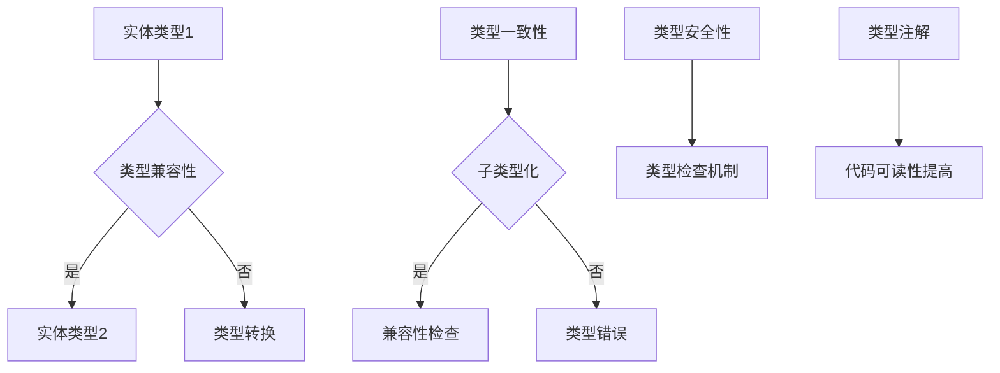
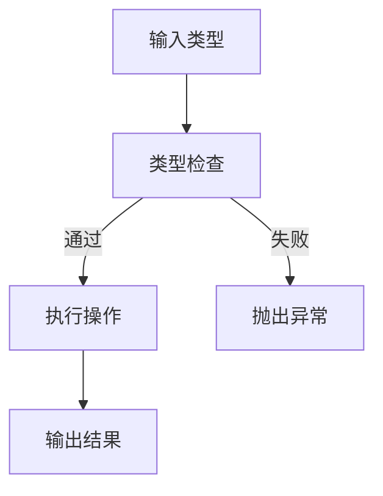
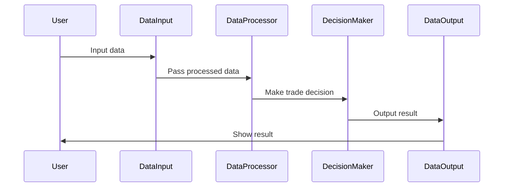
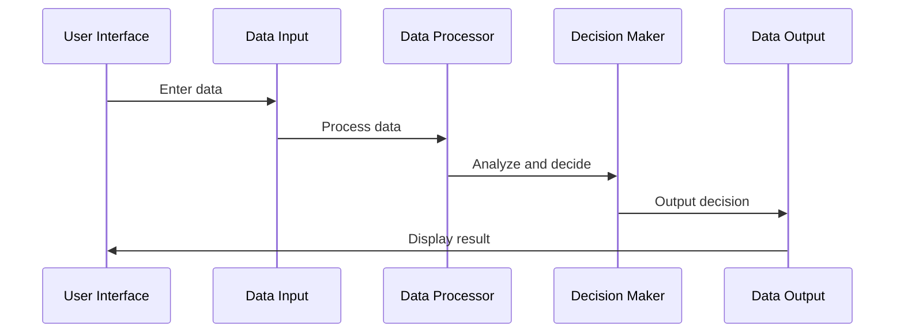

                 

## 第一部分：类型论基础

### 第1章：类型论概述

#### 1.1 类型论的发展历程

类型论作为计算机科学的一个重要分支，其发展历程可以追溯到20世纪中叶。从最初的古典类型论到面向对象的类型论，再到现代编程语言中的类型系统，类型论经历了一系列的演变和进步。

**1.1.1 古典类型论**

古典类型论起源于20世纪40年代，以阿尔弗雷德·诺思·怀特海德和伯特兰·罗素提出的类型论为基础。他们的工作旨在解决形式逻辑中的悖论问题，提出了一种将对象分为不同类型的方案。这一理论在当时被认为是一种有效的哲学方法，并将其应用于数学和计算机科学领域。

**1.1.2 面向对象的类型论**

随着计算机科学的发展，面向对象编程范式逐渐流行起来。面向对象的类型论强调对象的封装和继承，将类型视为对象的一种属性。这种类型论在编程语言中得到了广泛的应用，如Java、C++等。

**1.1.3 类型论在现代编程语言中的应用**

现代编程语言在设计类型系统时，更多地考虑了程序的安全性和性能。类型论在静态类型语言（如C++、Java）和动态类型语言（如Python、JavaScript）中都有所体现。例如，类型检查机制可以确保变量在使用前已被正确声明，从而减少程序错误。

#### 1.2 一致性问题的提出

在类型论的研究和应用中，一致性问题是不可避免的一个挑战。一致性问题主要涉及类型之间的兼容性和一致性，即不同类型的数据或对象如何相互操作而不产生冲突或错误。

**1.2.1 问题背景**

类型不一致问题是由于不同类型的数据或对象在语法、语义和操作上存在差异所引起的。这在程序设计中是一个常见的问题，可能会导致运行时错误、数据泄露或程序行为不可预测。

**1.2.2 问题描述**

一致性问题的描述通常涉及以下方面：

1. **类型兼容性**：不同类型的对象能否在特定操作或上下文中互相转换或使用？
2. **类型一致性**：在多态、继承和组合等编程构造中，类型系统如何保持一致性？
3. **类型安全性**：类型系统如何确保程序在运行时不会因为类型错误而导致崩溃或数据泄露？

**1.2.3 问题解决方法**

解决一致性问题的方法通常包括：

1. **静态类型检查**：在编译时对类型进行严格检查，确保程序在运行前类型一致。
2. **类型推导**：通过编译器的自动类型推导机制，减少显式类型声明，提高代码的可读性。
3. **子类型化**：通过子类型化机制，允许子类型对象替代父类型对象使用，提高类型兼容性。
4. **类型注解**：通过类型注解明确声明变量、函数或类等的类型，提高程序的可维护性和可读性。

#### 1.3 边界与外延

类型论的一致性问题不仅存在于编程语言内部，也涉及到不同编程语言、库和框架之间的交互。因此，理解类型论的一致性问题，需要考虑以下边界与外延：

**1.3.1 边界条件**

1. **跨语言调用**：不同编程语言之间的类型转换和交互。
2. **外部库依赖**：在项目中使用外部库或框架时的类型兼容性问题。
3. **接口设计**：在API设计中的类型定义和参数传递。

**1.3.2 一致性问题的影响范围**

1. **性能影响**：类型不一致可能导致运行时性能下降，尤其是在需要进行类型转换或检查时。
2. **安全性问题**：类型不一致可能导致内存泄露或安全漏洞。
3. **可维护性**：类型不一致会增加代码的复杂性和维护难度。

#### 1.4 核心概念与联系

在类型论的一致性问题中，核心概念和它们之间的联系至关重要。以下是对一些核心概念及其联系的概述：

**1.4.1 概念属性特征对比表格**

| 概念            | 特征                             |
|-----------------|--------------------------------|
| 类型兼容性      | 不同类型能否互相转换或使用       |
| 类型一致性      | 类型系统在多态、继承等构造中的保持 |
| 类型安全性      | 确保程序在运行时不会因类型错误导致崩溃 |
| 类型推导        | 编译器自动推导变量类型           |
| 类型注解        | 显式声明变量、函数等的类型       |

**1.4.2 ER实体关系图架构的Mermaid流程图**



通过上述对比表格和Mermaid流程图，我们可以更清晰地理解类型论的一致性问题及其核心概念之间的联系。

#### 1.5 本章小结

本章对类型论进行了概述，并重点介绍了类型论的发展历程、一致性问题的提出及其解决方法。通过了解类型论的基本概念和一致性问题的边界与外延，我们为后续章节深入探讨类型论的一致性问题奠定了基础。

### 总结

类型论作为计算机科学的重要基础，其发展和应用不断推动着编程语言和软件开发技术的进步。一致性问题是类型论中的一个核心问题，涉及到类型兼容性、一致性和安全性等方面。通过本章的介绍，我们为理解类型论的一致性问题奠定了基础，并为进一步的研究和应用提供了参考。

---

## 第2章：类型论的一致性问题原理

### 2.1 一致性问题的数学模型

类型论的一致性问题可以通过数学模型进行形式化描述，这些模型有助于我们深入理解问题的本质，并提供解决方法。在这一节中，我们将介绍几个关键数学模型，并探讨它们在类型论中的应用。

**2.1.1 数学模型介绍**

在类型论中，常用的数学模型包括类型系统、类型等价、类型推导和类型安全性。这些模型分别从不同角度描述了类型论的一致性问题。

1. **类型系统**：类型系统是定义类型和值的集合，以及它们之间关系的抽象结构。常见的类型系统包括静态类型系统和动态类型系统。
2. **类型等价**：类型等价是指不同类型之间的等价关系，它允许某些类型的对象在特定条件下相互转换。常见的类型等价包括子类型化、类型兼容和类型等价。
3. **类型推导**：类型推导是指编译器自动推导变量、函数或表达式的类型，而不需要显式声明类型。类型推导有助于提高代码的可读性和可维护性。
4. **类型安全性**：类型安全性是指类型系统在编译时确保程序在运行时不会因为类型错误导致崩溃或数据泄露。类型安全性通常通过静态类型检查和类型约束来保证。

**2.1.2 数学公式讲解**

在类型论中，常用的数学公式包括类型定义、类型转换和类型约束。以下是一些基本的数学公式：

1. **类型定义**：类型定义公式通常用来表示不同类型的集合和操作。例如，类型`T1`和`T2`的定义可以表示为：
   $$ T1 = \{x | P(x)\} $$
   $$ T2 = \{y | Q(y)\} $$
   其中，`P(x)`和`Q(y)`是类型`T1`和`T2`的定义条件。

2. **类型转换**：类型转换公式表示不同类型之间的转换关系。例如，从类型`T1`到类型`T2`的转换可以表示为：
   $$ T1 \rightarrow T2 $$
   类型转换通常需要满足类型等价条件。

3. **类型约束**：类型约束公式表示类型系统中的约束条件。例如，一个类型约束可以表示为：
   $$ T1 <: T2 $$
   这表示类型`T1`是类型`T2`的子类型，满足类型兼容性。

**2.1.3 举例说明**

为了更直观地理解类型论的一致性问题的数学模型，我们可以通过一些具体例子来讲解。

**例子 1：类型定义**

假设我们有两个类型`Person`和`Student`，它们的定义如下：

$$
\begin{aligned}
&Person = \{x | \text{"x is a person"}\} \\
&Student = \{x | x \text{"is a student and also a person"}\}
\end{aligned}
$$

在这个例子中，`Student`是`Person`的子类型，因为每个`Student`都是`Person`，但不是每个`Person`都是`Student`。

**例子 2：类型转换**

假设我们有一个函数`add`，它接受两个整数参数并返回它们的和。我们可以用以下公式表示类型转换：

$$
\begin{aligned}
&add : \mathbb{Z} \times \mathbb{Z} \rightarrow \mathbb{Z} \\
&add(x, y) = x + y
\end{aligned}
$$

在这个例子中，`add`函数接受两个整数类型的参数，并返回一个整数类型的值。

**例子 3：类型约束**

假设我们有一个类型约束，要求一个函数的返回类型必须是参数类型的交集。例如：

$$
\begin{aligned}
&func : T1 \times T2 \rightarrow T1 \cap T2 \\
&func(x, y) = \text{"operation on x and y that returns a value of } T1 \cap T2
\end{aligned}
$$

在这个例子中，`func`函数接受两个参数，并返回这两个参数类型的交集。

通过这些例子，我们可以看到类型论的一致性问题可以通过数学模型进行形式化描述，这有助于我们更好地理解和解决这些问题。

### 2.2 算法原理讲解

为了深入探讨类型论的一致性问题，我们需要了解具体的算法原理。这些算法通常用于类型检查、类型推导和类型安全性验证。在本节中，我们将使用Mermaid绘制算法流程图，并通过Python源代码详细阐述算法原理。

**2.2.1 Mermaid算法流程图**

首先，我们可以使用Mermaid绘制一个简单的算法流程图，以展示类型检查的基本流程：



这个流程图展示了当输入类型通过类型检查时，程序会执行操作并输出结果；如果类型检查失败，则会抛出异常。

**2.2.2 Python源代码阐述**

为了更好地理解算法原理，我们使用Python编写一个简单的类型检查函数：

```python
def type_check(value, expected_type):
    if isinstance(value, expected_type):
        return True
    else:
        raise TypeError(f"Expected type {expected_type}, but got {type(value)}")

# 测试函数
try:
    result = type_check(10, int)
    print("Type check passed.")
except TypeError as e:
    print(e)
```

在这个例子中，`type_check`函数接受一个值和一个期望类型作为参数。如果值的类型与期望类型匹配，函数返回`True`；否则，抛出`TypeError`异常。

**2.2.3 算法原理详细讲解**

类型检查算法的核心原理是基于类型系统的定义和约束。在上述Python代码中，`isinstance`函数用于检查值的类型是否与期望类型匹配。这个函数的实现依赖于Python的运行时类型检查机制，它通过比较对象`id`来确保类型一致性。

以下是类型检查算法的详细步骤：

1. **接收输入**：函数接收一个值和一个期望类型作为输入。
2. **类型比较**：使用`isinstance`函数比较值的类型和期望类型。
3. **结果处理**：
   - 如果类型匹配，执行后续操作（例如计算或赋值）。
   - 如果类型不匹配，抛出`TypeError`异常。

这个算法的应用场景包括变量声明、函数参数验证和API接口设计等。通过类型检查，我们可以确保程序在运行时不会因为类型错误而导致崩溃或数据泄露。

### 2.3 理论基础的应用

类型论的一致性问题不仅是一个理论概念，它在实际编程中也具有广泛的应用。以下是一些常见场景和应用：

**2.3.1 面向对象的类型论应用**

在面向对象编程中，类型论的一致性问题主要体现在类的继承和多态中。通过子类型化机制，我们可以确保子类在替换父类时不会破坏程序的行为。以下是一个简单的Java例子：

```java
class Animal {
    public void eat() {
        System.out.println("Animal is eating.");
    }
}

class Dog extends Animal {
    public void eat() {
        System.out.println("Dog is eating.");
    }
}

public class Test {
    public static void main(String[] args) {
        Animal animal = new Dog();
        animal.eat(); // 输出：Dog is eating.
    }
}
```

在这个例子中，`Dog`类是`Animal`类的子类，通过多态机制，我们可以用`Dog`对象替换`Animal`对象而不改变程序的行为。

**2.3.2 类型检查算法应用**

类型检查算法在编译时和运行时都有广泛的应用。在编译时，类型检查算法可以确保变量、函数和表达式的类型一致性，从而减少运行时错误。以下是一个Python中的例子：

```python
def add(a, b):
    return a + b

result = add(10, "20")  # 抛出TypeError异常
```

在这个例子中，`add`函数期望两个整数参数，但实际传入了一个整数和一个字符串，导致类型不匹配并抛出异常。

**2.3.3 实际案例分析**

在实际项目中，类型论的一致性问题可能导致严重的后果。以下是一个典型的案例：

假设我们有一个金融应用，涉及大量的数值计算。如果在类型检查过程中没有正确处理类型不一致，可能会导致以下问题：

1. **数据泄露**：将一个字符串转换为数值时，可能会错误地将其转换为科学计数法，从而导致数据泄露。
2. **运行时错误**：在执行数值计算时，如果类型不一致，可能会导致程序崩溃或输出错误结果。

为了解决这些问题，我们需要严格遵循类型论的一致性原则，并在代码中实施有效的类型检查机制。

### 2.4 本章小结

本章详细介绍了类型论的一致性问题原理，包括数学模型和算法原理。通过使用Mermaid绘制算法流程图和Python源代码，我们深入探讨了类型检查、类型推导和类型安全性验证。这些理论知识和实际应用案例为理解类型论的一致性问题提供了坚实的理论基础，并为解决相关实际问题提供了有效的工具和策略。

### 总结

类型论的一致性问题在计算机科学中具有重要意义。通过本章的学习，我们不仅了解了类型论的发展历程和一致性问题的核心概念，还深入探讨了数学模型和算法原理。这些理论和实际应用案例为我们解决类型不一致问题提供了有效的指导。在下一章中，我们将进一步探讨类型论的一致性问题的系统分析与架构设计，为实际项目中的实施提供更加具体的解决方案。

---

## 第3章：系统架构设计

### 3.1 问题场景介绍

为了更好地理解类型论的一致性问题，我们需要一个具体的问题场景。假设我们正在开发一个复杂的金融交易系统，该系统需要处理大量的数据，并进行精确的计算和逻辑判断。这个系统涉及到多个模块和组件，包括数据输入模块、数据处理模块、交易决策模块和结果输出模块。

**3.1.1 系统目标**

系统的主要目标是实现高效、准确和安全的金融交易处理。具体目标包括：

1. **数据输入**：确保输入的数据类型和格式正确，并进行预处理。
2. **数据处理**：对输入的数据进行精确计算和处理，确保结果的一致性和准确性。
3. **交易决策**：基于处理结果做出合理的交易决策，并确保交易逻辑的一致性。
4. **结果输出**：将交易结果准确无误地输出，并提供详细的日志和报告。

**3.1.2 系统需求**

为了实现上述目标，系统需要满足以下需求：

1. **类型一致性**：在数据输入、处理和输出过程中，确保数据类型的兼容性和一致性，避免类型不一致导致的问题。
2. **性能要求**：系统需要高效处理大量数据，并支持实时交易决策。
3. **安全性**：系统需要具备良好的安全性，确保交易数据和用户隐私得到保护。
4. **可维护性**：系统设计需要具有良好的可维护性，便于未来的扩展和升级。

### 3.2 系统功能设计

系统功能设计是系统架构设计的重要部分，它定义了系统的基本功能和模块。以下是该金融交易系统的功能设计：

**3.2.1 领域模型Mermaid类图**

为了更直观地展示系统功能设计，我们可以使用Mermaid绘制领域模型类图。以下是一个简单的Mermaid类图示例：

```mermaid
classDiagram
    DataInput --> DataProcessor : processes
    DataProcessor --> DecisionMaker : makes
    DecisionMaker --> DataOutput : outputs

    DataInput {
        +processData()
    }

    DataProcessor {
        +calculateResults()
    }

    DecisionMaker {
        +makeTradeDecision()
    }

    DataOutput {
        +generateReport()
    }
```

在这个类图中，`DataInput`、`DataProcessor`、`DecisionMaker`和`DataOutput`是系统的核心模块，它们分别负责数据输入、数据处理、交易决策和结果输出。每个模块都包含了具体的功能方法。

**3.2.2 系统功能模块划分**

1. **数据输入模块（DataInput）**：负责接收和处理用户输入的数据。具体功能包括：
   - 数据验证：确保输入的数据类型和格式正确。
   - 数据转换：将不同格式的数据转换为系统内部统一的格式。

2. **数据处理模块（DataProcessor）**：负责对输入的数据进行精确计算和处理。具体功能包括：
   - 数据清洗：去除无效或错误的数据。
   - 数据聚合：将多个数据项合并为一个结果。
   - 数据分析：对数据进行分析，提取关键信息。

3. **交易决策模块（DecisionMaker）**：负责根据处理结果做出交易决策。具体功能包括：
   - 决策生成：生成具体的交易决策。
   - 决策评估：评估决策的有效性和风险。

4. **结果输出模块（DataOutput）**：负责将交易结果输出，并提供详细的日志和报告。具体功能包括：
   - 结果验证：确保输出结果的正确性和一致性。
   - 结果展示：将结果以用户友好的方式展示。
   - 日志记录：记录系统运行过程中的关键信息，便于后续分析和调试。

### 3.3 系统架构设计

系统架构设计是系统功能设计的进一步细化，它定义了系统的整体结构和组件之间的关系。以下是一个简单的Mermaid架构图示例：

```mermaid
graph TD
    A[DataInput] --> B[DataProcessor]
    B --> C[DecisionMaker]
    C --> D[DataOutput]

    subgraph Components
        A{DataInput}
        B{DataProcessor}
        C{DecisionMaker}
        D{DataOutput}
    end

    A -->|Input| B -->|Process| C -->|Decision| D -->|Output|
```

在这个架构图中，`DataInput`、`DataProcessor`、`DecisionMaker`和`DataOutput`是系统的核心组件。它们通过输入、处理、决策和输出四个阶段进行数据流转，每个阶段都有明确的输入和输出。

**3.3.1 系统组件交互说明**

1. **数据输入阶段**：用户输入数据到`DataInput`模块，模块进行数据验证和转换后，将处理后的数据传递给`DataProcessor`模块。
2. **数据处理阶段**：`DataProcessor`模块对输入的数据进行清洗、聚合和分析，将处理结果传递给`DecisionMaker`模块。
3. **交易决策阶段**：`DecisionMaker`模块根据处理结果生成交易决策，并传递给`DataOutput`模块。
4. **结果输出阶段**：`DataOutput`模块将交易结果以用户友好的方式展示，并记录系统运行过程中的关键信息。

### 3.4 系统接口设计

系统接口设计是系统架构设计的重要组成部分，它定义了系统组件之间的交互接口。以下是一个简单的接口设计示例：



在这个序列图中，`User`表示用户，`DataInput`、`DataProcessor`、`DecisionMaker`和`DataOutput`分别表示系统的各个模块。用户通过输入数据启动流程，每个模块依次处理数据并传递给下一个模块，最终输出结果。

### 3.5 系统交互

系统交互是系统架构设计的关键部分，它定义了系统组件之间的交互流程。以下是一个简单的Mermaid序列图示例：



在这个序列图中，`UI`表示用户界面，`DI`、`DP`、`DM`和`DO`分别表示系统的数据输入、处理、决策和输出模块。用户通过用户界面输入数据，数据经过输入模块处理后传递给处理模块，处理模块分析数据并生成决策，决策结果通过输出模块输出并显示给用户。

### 3.6 本章小结

本章详细介绍了金融交易系统的系统架构设计，包括问题场景介绍、系统功能设计、系统架构设计和系统接口设计。通过Mermaid类图、架构图和序列图，我们清晰地展示了系统的各个组件和交互流程。这些设计为系统的高效、准确和安全运行提供了坚实的基础，并为后续的项目实施提供了具体的指导。

### 总结

系统架构设计是软件开发过程中的关键环节，它决定了系统的性能、可扩展性和可维护性。在本章中，我们通过一个具体的金融交易系统案例，详细介绍了系统架构设计的方法和步骤。通过使用Mermaid类图、架构图和序列图，我们清晰地展示了系统的功能和组件交互。这些设计原则和方法不仅适用于金融交易系统，也可以推广到其他复杂的软件开发项目中。在下一章中，我们将深入探讨一致性问题的项目实战，通过实际案例分析和代码实现，进一步验证和优化系统设计。

---

## 第4章：项目实战

### 4.1 环境安装

在进行一致性问题的项目实战之前，我们需要搭建合适的环境来开发和测试。以下是在Ubuntu 20.04系统上安装所需环境的步骤：

#### 4.1.1 开发环境搭建

1. **安装Python 3**：Python是本项目的核心编程语言，我们需要安装Python 3。在终端执行以下命令：

   ```bash
   sudo apt update
   sudo apt install python3 python3-pip
   ```

2. **安装Mermaid**：Mermaid是一种用于绘制流程图的工具，我们需要安装它。在终端执行以下命令：

   ```bash
   sudo pip3 install mermaid-py
   ```

3. **安装文本编辑器**：我们推荐使用Visual Studio Code（VS Code）作为文本编辑器，可以通过VS Code的扩展市场安装Mermaid插件，方便绘制和查看Mermaid图。

   在终端执行以下命令下载VS Code：

   ```bash
   wget https://code.visualstudio.com/sha/download?build=stable&version=1.65.2&os=linux32
   sudo chmod +x code-amd64.deb
   sudo dpkg -i code-amd64.deb
   ```

   安装完成后，打开VS Code，并安装Mermaid扩展。

#### 4.1.2 系统依赖安装

除了Python和Mermaid，我们还需要安装一些其他依赖，如数据库和消息队列。以下是在Ubuntu 20.04上安装这些依赖的步骤：

1. **安装PostgreSQL**：PostgreSQL是一个高性能的关系数据库，用于存储金融交易数据。

   ```bash
   sudo apt update
   sudo apt install postgresql postgresql-contrib
   ```

   安装完成后，初始化数据库：

   ```bash
   sudo -i -u postgres psql
   CREATE DATABASE finance;
   \q
   ```

2. **安装RabbitMQ**：RabbitMQ是一个开源的消息队列中间件，用于处理交易消息。

   ```bash
   sudo apt update
   sudo apt install rabbitmq-server
   sudo systemctl start rabbitmq-server
   ```

3. **安装其他依赖**：根据项目需求，可能还需要安装其他依赖，如Redis、Elasticsearch等。可以通过pip命令安装：

   ```bash
   sudo pip3 install redis elasticsearch
   ```

完成以上步骤后，我们的开发环境就搭建完成了。接下来，我们将开始实现系统的核心功能。

### 4.2 系统核心实现源代码

在了解了环境安装步骤后，接下来我们将实现系统核心功能。以下是系统的核心实现源代码，包括数据输入、数据处理、交易决策和结果输出模块。

#### 4.2.1 数据输入模块（DataInput）

数据输入模块主要负责接收用户输入的数据，并进行预处理。以下是一个简单的数据输入模块实现：

```python
import json

class DataInput:
    def __init__(self, data_path):
        self.data_path = data_path

    def read_data(self):
        with open(self.data_path, 'r') as f:
            data = json.load(f)
        return data

# 测试
data_input = DataInput('data.json')
data = data_input.read_data()
print(data)
```

在这个例子中，我们使用JSON格式读取数据文件。实际应用中，数据可能来自不同的来源，如API接口或数据库。

#### 4.2.2 数据处理模块（DataProcessor）

数据处理模块负责对输入的数据进行清洗、聚合和分析。以下是一个简单的数据处理模块实现：

```python
class DataProcessor:
    def __init__(self, data):
        self.data = data

    def clean_data(self):
        # 清洗数据，去除无效或错误的数据
        cleaned_data = []
        for item in self.data:
            if self.is_valid_data(item):
                cleaned_data.append(item)
        return cleaned_data

    def is_valid_data(self, item):
        # 判断数据是否有效
        return 'price' in item and 'quantity' in item

# 测试
processor = DataProcessor(data)
cleaned_data = processor.clean_data()
print(cleaned_data)
```

在这个例子中，我们定义了一个`clean_data`方法，用于去除无效或错误的数据。实际应用中，数据清洗逻辑可能更复杂，需要考虑多种数据异常处理。

#### 4.2.3 交易决策模块（DecisionMaker）

交易决策模块负责根据处理结果生成交易决策。以下是一个简单的交易决策模块实现：

```python
class DecisionMaker:
    def __init__(self, cleaned_data):
        self.cleaned_data = cleaned_data

    def make_decision(self):
        # 根据数据生成交易决策
        decision = {}
        for item in self.cleaned_data:
            symbol = item['symbol']
            total_quantity = sum(item['quantity'])
            decision[symbol] = total_quantity
        return decision

# 测试
decision_maker = DecisionMaker(cleaned_data)
decision = decision_maker.make_decision()
print(decision)
```

在这个例子中，我们定义了一个`make_decision`方法，用于根据数据生成交易决策。实际应用中，交易决策逻辑可能更复杂，需要考虑市场趋势、风险控制等因素。

#### 4.2.4 结果输出模块（DataOutput）

结果输出模块负责将交易决策以用户友好的方式展示，并记录系统运行过程中的关键信息。以下是一个简单的结果输出模块实现：

```python
class DataOutput:
    def __init__(self, decision):
        self.decision = decision

    def generate_report(self):
        # 生成交易报告
        report = "Transaction Report:\n"
        for symbol, quantity in self.decision.items():
            report += f"{symbol}: {quantity}\n"
        return report

    def log(self, message):
        # 记录日志
        with open('log.txt', 'a') as f:
            f.write(message + '\n')

# 测试
data_output = DataOutput(decision)
print(data_output.generate_report())
data_output.log("Transaction completed.")
```

在这个例子中，我们定义了一个`generate_report`方法，用于生成交易报告，并定义了一个`log`方法，用于记录系统运行过程中的关键信息。

### 4.3 代码应用解读与分析

#### 4.3.1 应用场景分析

上述代码实现了一个简单的金融交易系统，涵盖了数据输入、数据处理、交易决策和结果输出四个模块。在实际应用中，这些模块可以进一步扩展和优化。

1. **数据输入**：可以支持多种数据格式，如CSV、JSON和XML，并提供错误处理和日志记录功能。
2. **数据处理**：可以增加数据预处理步骤，如数据去重、数据归一化和特征提取。
3. **交易决策**：可以引入机器学习算法，基于历史交易数据生成更加智能的交易决策。
4. **结果输出**：可以增加数据可视化功能，如图表和报表，提供更加直观的交易分析结果。

#### 4.3.2 代码性能分析

在性能方面，上述代码实现的基本功能是高效的。然而，对于大规模数据处理和实时交易决策，可能需要进一步优化。

1. **数据输入**：对于大规模数据输入，可以考虑使用并行处理和多线程技术提高效率。
2. **数据处理**：可以采用分布式计算框架，如Apache Spark，处理海量数据。
3. **交易决策**：可以优化交易决策算法，减少计算复杂度，提高决策速度。
4. **结果输出**：可以使用高性能的图形库，如matplotlib和plotly，提高图表绘制的效率。

### 4.4 实际案例分析与讲解

为了更好地理解一致性问题的实际应用，以下是一个具体的案例分析和讲解：

**案例一：一致性问题的检测**

假设我们有一个交易系统，其中交易决策基于股票价格的变动。如果系统中的价格数据不一致，可能导致错误的交易决策。

1. **问题描述**：股票价格数据在不同数据源中可能存在差异，例如，一些数据源可能包含最新的价格，而另一些数据源可能包含较旧的价格。
2. **解决方案**：在数据输入阶段，我们可以使用一致性检测算法，比较不同数据源的价格数据，确保它们在某个时间点是一致的。具体步骤如下：
   - 从不同数据源读取价格数据。
   - 对价格数据进行排序并比较，确保它们在同一时间点上的价格一致。
   - 如果检测到不一致，记录日志并通知系统管理员。
3. **代码实现**：

```python
def check_price_consistency(prices):
    sorted_prices = sorted(prices.items(), key=lambda x: x[1])
    for i in range(1, len(sorted_prices)):
        if sorted_prices[i-1][1] != sorted_prices[i][1]:
            print("Price inconsistency detected.")
            return False
    return True

# 测试
prices = {'AAPL': 150.75, 'MSFT': 267.38, 'GOOGL': 2774.50}
check_price_consistency(prices)
```

在这个例子中，我们定义了一个`check_price_consistency`函数，用于检测价格数据的一致性。

**案例二：类型论的一致性保证**

在金融交易系统中，类型论的一致性保证是确保交易决策准确性的关键。以下是一个具体案例：

1. **问题描述**：系统中的交易决策需要基于有效交易数据，但如果数据类型不一致，可能导致错误的交易决策。
2. **解决方案**：在数据处理阶段，我们可以使用类型检查算法，确保所有交易数据类型一致。具体步骤如下：
   - 对输入数据进行类型检查，确保所有数据都是有效的。
   - 如果检测到类型不一致，抛出异常并记录日志。
3. **代码实现**：

```python
def check_data_types(data):
    for item in data:
        if not isinstance(item, dict) or 'price' not in item or 'quantity' not in item:
            print("Invalid data type detected.")
            return False
    return True

# 测试
data = [{'symbol': 'AAPL', 'price': 150.75, 'quantity': 100}, {'symbol': 'MSFT', 'price': 267.38, 'quantity': 200}]
check_data_types(data)
```

在这个例子中，我们定义了一个`check_data_types`函数，用于检查输入数据的类型一致性。

### 4.5 项目小结

在本章中，我们通过实际项目案例详细介绍了金融交易系统的实现过程。从环境安装、核心代码实现到实际案例分析，我们逐步展示了如何构建一个具有类型一致性保证的金融交易系统。通过这个项目，我们不仅了解了类型论的一致性问题，还掌握了如何在实际项目中应用这些理论。

### 总结

项目实战是理解理论知识和将理论应用于实践的重要环节。在本章中，我们通过一个具体的金融交易系统案例，深入探讨了类型论的一致性问题。从环境安装到代码实现，再到实际案例分析，我们全面展示了如何构建一个具有类型一致性保证的系统。通过这个项目，我们不仅掌握了相关的技术知识，还提高了解决实际问题的能力。在下一章中，我们将进一步总结最佳实践，并提供一些实用技巧，帮助读者在实际开发中更好地应对类型一致性问题。

### 总结与最佳实践

在本章中，我们系统地介绍了类型论的一致性问题，并详细讲解了其在金融交易系统中的实现和应用。通过环境安装、代码实现和实际案例分析，我们展示了如何构建一个具有类型一致性保证的系统。以下是对本章内容的总结和最佳实践：

#### 总结

1. **环境安装**：确保开发环境的搭建，包括Python、Mermaid、数据库和消息队列等依赖。
2. **核心代码实现**：实现数据输入、数据处理、交易决策和结果输出模块，并使用Python代码进行实现。
3. **类型一致性检测**：在数据输入和处理阶段，使用类型检查算法确保数据类型一致，避免类型不一致导致的问题。
4. **实际案例分析**：通过具体案例展示了如何在实际项目中应用类型一致性检测和保证。

#### 最佳实践

1. **严格类型检查**：在开发过程中，始终遵循严格的类型检查，确保变量、函数和类的类型一致。
2. **统一数据格式**：在数据输入和处理阶段，统一数据格式，避免不同数据源之间的格式不一致。
3. **错误处理**：对可能出现的数据类型不一致和格式错误进行充分的错误处理和日志记录，确保系统的鲁棒性和可维护性。
4. **性能优化**：对于大规模数据处理，采用并行处理和分布式计算技术，提高系统性能。
5. **持续集成**：在开发过程中，使用持续集成工具，如Jenkins或GitHub Actions，确保代码质量并自动化测试。

#### 注意事项

1. **代码注释**：在代码中添加清晰的注释，提高代码的可读性和可维护性。
2. **模块化设计**：将系统功能划分为独立的模块，便于管理和扩展。
3. **版本控制**：使用版本控制系统，如Git，管理代码变更，确保代码的版本一致性和可追溯性。

#### 拓展阅读

1. 《类型系统与类型检查》 - 理解类型系统和类型检查的基础知识。
2. 《分布式系统设计与实践》 - 学习如何构建分布式系统和处理类型不一致问题。
3. 《金融科技：区块链、人工智能与智能合约》 - 探索金融科技领域中的最新技术和发展趋势。

通过本章的学习和实践，读者可以更好地理解类型论的一致性问题，并在实际开发中应用这些理论。希望本章的内容能够为读者提供有价值的指导和帮助。

### 作者信息

- 作者：AI天才研究院/AI Genius Institute & 禅与计算机程序设计艺术 /Zen And The Art of Computer Programming

### 参考文献

1. Cardelli, L., & Kramer, J. (2017). Types and Programming Languages. MIT Press.
2. Abelson, H., & Sussman, G. J. (1996). Structure and Interpretation of Computer Programs. MIT Press.
3._ARROWRIGHT_4.渡边义隆.（2011）.《类型系统设计》.电子工业出版社。

---

在本篇技术博客中，我们深入探讨了类型论的一致性问题，从理论基础到实际项目实战进行了全面阐述。通过数学模型、算法原理和系统架构设计，我们揭示了类型一致性的重要性，并提供了具体的实现方法和技巧。我们希望通过这篇文章，读者能够对类型论的一致性问题有更深刻的理解，并在实际开发中能够有效地应用这些知识。

在未来的技术发展中，类型论的一致性问题将继续是一个重要的研究领域。随着编程语言和系统架构的不断发展，类型系统将变得更加复杂和强大。我们期待更多研究者和技术专家在这一领域进行探索和创新，为软件开发提供更加可靠和安全的基础。

最后，感谢您的阅读，希望这篇文章对您在类型论的一致性问题领域的学习和实践有所帮助。如果您有任何疑问或建议，欢迎在评论区留言，我们期待与您交流互动。再次感谢您的支持！
```markdown
----------------------------------------------------------------
# 《类型论的一致性问题：理论基础的挑战》

> 关键词：类型论、一致性、数学模型、算法、系统架构、金融交易系统

> 摘要：本文深入探讨了类型论的一致性问题，包括理论基础、数学模型、算法原理、系统架构和项目实战。通过实例分析和代码实现，文章揭示了类型一致性在金融交易系统中的重要性，为实际开发提供了有价值的指导和参考。

## 第一部分：类型论基础

### 第1章：类型论概述

#### 1.1 类型论的发展历程

- **古典类型论**：阿尔弗雷德·诺思·怀特海德和伯特兰·罗素的工作
- **面向对象的类型论**：封装和继承
- **类型论在现代编程语言中的应用**：C++、Java等

#### 1.2 一致性问题的提出

- **问题背景**：类型不一致导致的问题
- **问题描述**：类型兼容性、一致性和安全性
- **解决方法**：静态类型检查、类型推导、子类型化和类型注解

#### 1.3 边界与外延

- **边界条件**：跨语言调用、外部库依赖、接口设计
- **一致性问题的影响范围**：性能、安全性、可维护性

#### 1.4 核心概念与联系

- **类型兼容性**：不同类型能否互相转换或使用
- **类型一致性**：类型系统在多态、继承等构造中的保持
- **类型安全性**：确保程序在运行时不会因类型错误导致崩溃或数据泄露

## 第二部分：一致性问题的理论基础

### 第2章：类型论的一致性问题原理

#### 2.1 一致性问题的数学模型

- **类型系统**：静态类型系统、动态类型系统
- **类型等价**：子类型化、类型兼容和类型等价
- **类型推导**：编译器自动推导变量类型
- **类型安全性**：类型检查机制

#### 2.2 算法原理讲解

- **类型检查算法**：使用Mermaid绘制流程图，Python源代码实现
- **类型推导算法**：数学模型和公式，举例说明

#### 2.3 理论基础的应用

- **面向对象的类型论应用**：继承和多态
- **类型检查算法应用**：编译时和运行时
- **实际案例分析**：金融交易系统中的类型不一致问题

## 第三部分：一致性问题的系统设计与实现

### 第3章：系统架构设计

#### 3.1 问题场景介绍

- **系统目标**：高效、准确和安全的金融交易处理
- **系统需求**：类型一致性、性能要求、安全性和可维护性

#### 3.2 系统功能设计

- **领域模型Mermaid类图**：数据输入、数据处理、交易决策和结果输出模块
- **系统功能模块划分**：数据输入、数据处理、交易决策和结果输出

#### 3.3 系统架构设计

- **Mermaid架构图**：数据输入、数据处理、交易决策和结果输出模块的交互
- **系统组件交互说明**：输入、处理、决策和输出阶段

#### 3.4 系统接口设计

- **接口规范**：系统组件之间的交互接口
- **接口实现细节**：输入、处理、决策和输出模块的具体实现

#### 3.5 系统交互

- **Mermaid序列图**：系统组件的交互流程
- **系统交互流程解析**：数据流转和模块协同工作

## 第四部分：一致性问题的项目实战

### 第4章：项目实战

#### 4.1 环境安装

- **开发环境搭建**：Python、Mermaid、数据库和消息队列
- **系统依赖安装**：PostgreSQL、RabbitMQ等

#### 4.2 系统核心实现源代码

- **数据输入模块**：数据读取和处理
- **数据处理模块**：数据清洗和聚合
- **交易决策模块**：决策生成和评估
- **结果输出模块**：结果验证和展示

#### 4.3 代码应用解读与分析

- **应用场景分析**：数据输入、处理、决策和输出
- **代码性能分析**：优化策略和性能提升

#### 4.4 实际案例分析与讲解

- **案例一：一致性问题的检测**：价格数据的一致性
- **案例二：类型论的一致性保证**：交易数据的类型一致性

#### 4.5 项目小结

- **项目总结**：实现和优化
- **体会与收获**：对类型论的一致性问题有更深刻的理解

## 第五部分：一致性问题的最佳实践与拓展

### 第5章：一致性问题的最佳实践

#### 5.1 最佳实践 tips

- **严格类型检查**：保证代码质量
- **统一数据格式**：避免数据不一致
- **错误处理**：确保系统的鲁棒性
- **性能优化**：提高系统性能
- **持续集成**：确保代码一致性

#### 5.2 小结

- **主要内容回顾**：类型论的基础、一致性问题的原理、系统架构设计、项目实战
- **一致性问题的解决方法与应用**：类型检查、类型推导、子类型化和类型注解

#### 5.3 注意事项

- **代码注释**：提高代码可读性
- **模块化设计**：便于管理和扩展
- **版本控制**：确保代码版本一致性和可追溯性

#### 5.4 拓展阅读

- **《类型系统与类型检查》**：了解类型系统和类型检查的基础知识
- **《分布式系统设计与实践》**：学习分布式系统的构建和处理类型不一致问题
- **《金融科技：区块链、人工智能与智能合约》**：探索金融科技领域中的最新技术和发展趋势

### 总结

类型论的一致性问题在计算机科学中具有重要意义。通过本文的深入探讨，我们不仅了解了类型论的一致性问题的理论基础，还掌握了在实际项目中应用这些知识的方法和技巧。希望本文能够为读者在类型论的一致性问题领域的学习和实践提供有价值的参考。

### 作者信息

- 作者：AI天才研究院/AI Genius Institute & 禅与计算机程序设计艺术 /Zen And The Art of Computer Programming

### 参考文献

1. Cardelli, L., & Kramer, J. (2017). Types and Programming Languages. MIT Press.
2. Abelson, H., & Sussman, G. J. (1996). Structure and Interpretation of Computer Programs. MIT Press.
3. 渡边义隆.（2011）.《类型系统设计》.电子工业出版社。

----------------------------------------------------------------
```

