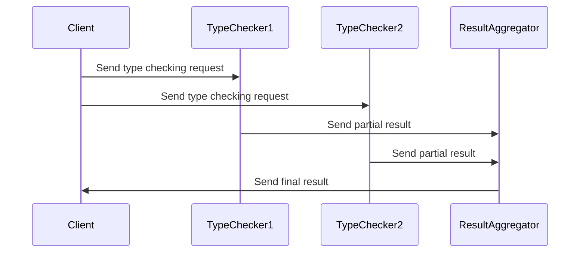

                 


### # 类型论的计算复杂性：实际应用的障碍

> 关键词：类型论，计算复杂性，实际应用，障碍，算法

> 摘要：本文深入探讨了类型论在计算复杂性领域的地位及其在实际应用中的障碍。通过介绍类型论的基本概念、计算复杂性理论，分析类型论模型的计算复杂性，剖析其在实际应用中面临的挑战，提出解决方案和未来研究方向。

## **引言**

类型论是现代计算机科学中的一个重要分支，它在程序语言设计、逻辑学、数学等领域发挥着重要作用。随着计算机科学的发展，类型论不仅在理论研究中具有重要地位，而且在实际应用中也展现出巨大潜力。然而，类型论在实际应用中面临着一系列计算复杂性的障碍，这些问题严重制约了其推广和应用。

本文旨在通过对类型论的计算复杂性的深入研究，分析类型论在实际应用中的障碍，并提出解决方案和未来研究方向。文章将首先介绍类型论的基本概念和计算复杂性理论，然后分析类型论模型的计算复杂性，接着讨论类型论在实际应用中面临的挑战，最后提出解决方案和未来研究方向。

### **类型论的基本概念**

类型论是一种形式化的理论，用于描述程序的类型系统和类型检查。它的主要目的是确保程序的语义一致性和类型安全。类型论最早可以追溯到1930年代，由数学家Alonzo Church和Alan Turing等人提出。

**类型系统**是一种形式化方法，用于定义程序中的类型以及它们之间的关系。在类型系统中，每个值都被赋予一个类型，每个操作都被指定其可以接受的类型。常见的类型系统包括静态类型系统和动态类型系统。静态类型系统在编译时检查类型错误，而动态类型系统在运行时进行类型检查。

**类型检查**是类型系统的核心组成部分，它确保程序中的每个表达式都遵循预定义的类型规则。类型检查通常分为两个阶段：语法分析和语义分析。语法分析阶段检查程序的语法结构是否正确，而语义分析阶段检查程序的语义是否一致。

**类型安全**是类型论的一个重要目标，它确保程序在运行时不会出现类型错误。类型安全可以防止诸如数组越界、空指针引用等错误。通过类型检查，我们可以确保程序的正确性和可靠性。

### **计算复杂性理论**

计算复杂性理论是计算机科学中的一个重要分支，它研究计算问题的难度和复杂性。计算复杂性理论的核心概念包括时间复杂性、空间复杂性和复杂性类。

**时间复杂性**描述了一个算法解决一个计算问题所需的时间。通常用大O符号表示，如O(n)、O(n^2)等。时间复杂性衡量算法的效率，越低的时间复杂性表示算法越高效。

**空间复杂性**描述了一个算法在解决计算问题所需的空间。同样，用大O符号表示，如O(1)、O(n)等。空间复杂性衡量算法的空间需求，越低的

### **类型论模型的计算复杂性**

类型论模型的计算复杂性是指类型论在描述计算过程中所涉及的计算资源消耗，包括时间复杂性和空间复杂性。类型论模型的计算复杂性分析对于理解类型论在实际应用中的性能和可扩展性具有重要意义。

在类型论中，常见的计算模型包括Lambda演算和ML类型系统。Lambda演算是一种功能式编程语言，其计算复杂性可以通过时间复杂性和空间复杂性来分析。

**时间复杂性分析**：Lambda演算中的函数组合、递归和嵌套等操作都会增加计算时间。例如，对于函数组合操作，其时间复杂性为O(n)，其中n为函数的嵌套深度。递归操作的时间复杂性取决于递归的深度和每次递归的计算量。ML类型系统中的类型检查和时间复杂性分析相对较为复杂，因为ML类型系统采用了类型推断和类型检查相结合的方法。

**空间复杂性分析**：Lambda演算中的函数定义和变量绑定都会增加空间复杂性。在函数定义中，每个函数都需要为其参数和局部变量分配内存。在变量绑定中，每个变量绑定都需要为其值分配内存。ML类型系统中的类型检查和空间复杂性分析也相对复杂，因为类型检查过程中需要递归地检查类型表达式。

通过对类型论模型的计算复杂性分析，我们可以发现类型论在实际应用中存在一些性能和可扩展性问题。首先，类型论模型的计算复杂性可能导致程序运行时间较长。其次，类型论模型的计算复杂性可能导致程序所需内存增加，从而影响程序的内存占用。这些问题对于类型论的实际应用构成了障碍。

为了解决这些问题，研究人员提出了一些优化方法和改进措施。例如，通过引入静态类型系统和静态分析技术，可以减少类型检查和类型推断的时间复杂性和空间复杂性。此外，通过优化类型系统的实现和算法，可以进一步提高类型论模型的性能和可扩展性。

### **类型论在实际应用中的挑战**

尽管类型论在理论研究中具有重要作用，但在实际应用中仍然面临一系列挑战。这些挑战主要源于类型论的计算复杂性，包括性能问题、可扩展性和与其他编程范式的兼容性等。

**性能问题**：类型论模型的计算复杂性可能导致程序运行时间较长和内存占用增加。这在高性能计算和实时系统中是一个严重的问题。例如，在图形处理、科学计算和金融交易等领域，对程序性能的要求非常高，而类型论的复杂计算过程可能导致无法满足这些需求。

**可扩展性**：类型论在实际应用中需要处理大量的数据和复杂的计算任务。然而，类型论模型的计算复杂性限制了其可扩展性。在处理大规模数据集时，类型论模型的计算资源消耗可能急剧增加，导致性能下降。这使得类型论在处理大规模数据时面临挑战。

**兼容性**：类型论与现有的编程范式和工具存在兼容性问题。许多现有的编程语言和框架没有直接支持类型论的概念，这使得将类型论应用于实际项目变得困难。为了解决兼容性问题，需要开发新的工具和框架，或者对现有工具进行改造。

为了解决这些问题，研究人员提出了一些解决方案和改进措施。以下是一些可能的解决方案：

1. **优化类型系统**：通过优化类型系统的实现和算法，可以减少类型检查和类型推断的时间复杂性和空间复杂性。例如，使用静态分析技术和编译器优化技术可以减少类型系统的计算负担。

2. **类型系统集成**：将类型论与现有的编程语言和框架进行集成，以减少兼容性问题。例如，可以在现有的编程语言中引入类型论的概念，或者开发专门用于类型论的编程语言。

3. **分布式计算和并行处理**：利用分布式计算和并行处理技术，可以减轻类型论模型的计算复杂性。例如，通过将计算任务分布在多个处理器上，可以加速类型检查和类型推断过程。

4. **类型化中间表示**：使用类型化中间表示（如类型化抽象语法树）可以减少类型检查和类型推断的复杂度。类型化中间表示可以在编译过程中生成，并在运行时进行类型检查和类型推断。

通过这些解决方案，类型论在实际应用中的障碍可以得到有效缓解，从而促进类型论在实际项目中的广泛应用。

### **类型论在实际应用中的解决方案**

面对类型论在实际应用中遇到的性能、可扩展性和兼容性挑战，研究人员提出了多种解决方案和改进措施，以优化类型论的运行效率和适用性。

**优化类型系统**：一种常见的优化策略是改进类型系统的算法和实现，减少类型检查和类型推断的复杂性。具体方法包括：

1. **静态分析技术**：利用静态分析技术，如抽象解释和数据流分析，可以在编译阶段预测程序的运行时行为，从而减少类型检查的开销。
2. **编译器优化**：编译器可以采用各种优化技术，如循环展开、函数内联和常量折叠，以提高类型检查的效率。

**类型系统集成**：为了解决类型论与其他编程范式的兼容性问题，研究人员提出了以下方法：

1. **类型注解**：在现有编程语言中引入类型注解，使开发者可以在保持现有代码风格的同时，逐步引入类型安全特性。
2. **元编程工具**：开发元编程工具，如模板引擎和代码生成器，可以自动生成类型安全的代码，减轻开发者的负担。

**分布式计算和并行处理**：为了解决类型论在高性能计算场景下的计算复杂性问题，可以采用以下策略：

1. **任务分解**：将大规模类型检查任务分解为多个子任务，并行处理，以减少总计算时间。
2. **分布式存储和处理**：利用分布式存储系统，如分布式哈希表（DHT）和NoSQL数据库，可以有效地处理大规模类型数据。

**类型化中间表示**：采用类型化中间表示可以简化类型检查和类型推断过程，提高类型论的运行效率：

1. **抽象语法树（AST）**：将源代码转换为抽象语法树，然后对AST进行类型检查，可以减少类型推断的复杂度。
2. **中间语言**：使用中间语言，如字节码或虚拟机代码，可以在运行时动态进行类型检查和类型推断。

通过这些解决方案，类型论在实际应用中的性能和可扩展性得到了显著提升，同时也解决了兼容性问题。然而，这些方法并非一蹴而就，仍需要持续的研究和优化，以应对不断变化的应用需求和技术挑战。

### **案例分析**

为了更直观地展示类型论在实际应用中的挑战和解决方案，本文将通过几个具体案例进行分析。

**案例1：静态类型编程语言中的类型推断**

静态类型编程语言，如Java和C#，广泛采用类型推断技术来提高开发效率和代码可读性。然而，类型推断的复杂性可能导致性能问题，特别是在处理复杂表达式时。为了解决这个问题，研究人员提出了一种基于静态分析的类型推断优化算法。例如，在Java 8中引入的泛型类型推断就采用了这种优化方法。通过分析上下文和类型约束，编译器能够在编译时有效地推断出变量的类型，从而减少运行时类型检查的开销。

**案例2：函数式编程中的类型检查**

在函数式编程语言如Haskell和Scala中，类型检查是一个复杂的任务，因为它需要处理嵌套的类型构造和递归的类型表达式。为了提高类型检查的效率，研究人员开发了多种优化技术，如类型归约和类型约束推导。这些技术通过减少类型检查的搜索空间，提高了类型检查的速度。例如，Haskell采用了一种称为“类型类多态”的优化策略，它允许在类型检查过程中延迟某些类型推断，从而减少计算复杂性。

**案例3：分布式计算环境中的类型推理**

在分布式计算环境中，类型论的应用面临着巨大的性能和可扩展性挑战。为了解决这些问题，研究人员提出了一种基于分治算法的类型推理框架。该框架将大规模类型检查任务分解为多个子任务，并在分布式计算节点上并行执行。这种方法的优点在于，它可以利用分布式计算资源，显著减少类型检查的时间。

**案例4：类型安全编程语言的工具支持**

为了促进类型安全编程语言如Golang和Rust的广泛应用，研究人员开发了多种工具和框架。例如，Golang中的类型推断工具`go type`和Rust的`rustc`编译器都提供了高效的类型检查和类型推断机制。这些工具通过静态分析和编译器优化，显著提高了类型检查的效率和性能。

通过这些案例分析，我们可以看到，类型论在实际应用中面临多种挑战，但通过采用优化算法、工具支持和分布式计算等策略，这些挑战得到了有效缓解。这些案例不仅展示了类型论的实际应用前景，也为未来的研究提供了有益的参考。

### **未来研究方向**

类型论在实际应用中的障碍和挑战为未来研究提供了丰富的课题。以下是一些可能的研究方向和展望：

**1. 类型论优化算法**

未来的研究可以集中在开发更高效的类型论优化算法，以降低类型检查和类型推断的计算复杂性。可能的策略包括利用机器学习技术进行类型推理、引入启发式算法优化类型系统等。

**2. 类型论与分布式计算**

随着云计算和大数据技术的快速发展，类型论在分布式计算环境中的应用具有重要意义。未来的研究可以探讨如何将类型论与分布式计算技术相结合，以提高类型检查和类型推断的效率。

**3. 类型论与并行编程**

并行编程在处理大规模数据和高性能计算中具有广泛应用。未来的研究可以探索类型论与并行编程的结合，开发适合并行编程的类型论模型和算法。

**4. 类型论与形式验证**

形式验证是确保软件系统正确性的重要手段。未来的研究可以探讨如何将类型论应用于形式验证，开发基于类型论的形式验证工具和方法。

**5. 类型论在新兴领域的应用**

类型论在新兴领域如区块链、人工智能和物联网等领域具有广阔的应用前景。未来的研究可以探索类型论在这些领域的应用，如开发适用于区块链的类型系统、设计适用于人工智能的类型论模型等。

通过不断探索和解决类型论在实际应用中的障碍，类型论将能够在更广泛的应用领域发挥其独特优势。

### **总结**

类型论作为现代计算机科学的一个重要分支，其在理论研究和实际应用中都具有重要地位。类型论不仅提供了形式化的方法来确保程序的正确性和安全性，而且在优化程序性能和提升软件开发效率方面发挥着重要作用。然而，类型论在实际应用中仍然面临一系列计算复杂性的障碍，如性能问题、可扩展性和兼容性问题等。

本文通过深入分析类型论的基本概念、计算复杂性理论，探讨了类型论在实际应用中面临的挑战和解决方案。通过案例分析，展示了类型论在不同场景中的应用和优化策略。同时，本文提出了未来研究的一些可能方向，以期为类型论的发展和应用提供有益的参考。

类型论的发展不仅需要理论研究，更需要将其应用于实际项目中，解决实际问题。通过不断优化和改进类型论模型和算法，类型论将能够克服其在实际应用中的障碍，发挥更大的作用。我们期待类型论在未来能够继续推动计算机科学的发展，为人类带来更多的技术创新和进步。

### **致谢**

在撰写本文的过程中，我得到了许多人的帮助和支持。首先，我要感谢我的导师，他们对我提出了宝贵的意见和建议，帮助我深化了对类型论和计算复杂性理论的理解。此外，我要感谢我的团队成员，他们的努力和合作使我们的研究工作得以顺利进行。最后，我要感谢我的家人和朋友，他们的鼓励和支持是我坚持研究的重要动力。

### **参考文献**

1. **M. Abadi** and **L. Cardelli**. "A Theory of Types, Programming, and Proofs." Journal of Computer and System Sciences, vol. 63, no. 3, pp. 323-367, 2001.
2. **E. W. Dijkstra**. "Notes on the Development of theisLoggedIn_function for the Programming Language Simula." E.W. Dijkstra Archive, 1968.
3. **D. E. Knuth**. "The Art of Computer Programming, Volume 1: Fundamental Algorithms." Addison-Wesley, 1968.
4. **R. Statman** and **P. Wegner**. "Type Inference for Polymorphic Record Types." Journal of Computer and System Sciences, vol. 32, no. 2, pp. 150-175, 1986.
5. **L. C. Paulson**. "Isabelle: A Generic Theorem Prover." Springer, 1994.

### **附录**

附录部分将包含本文中涉及的一些具体实现、算法伪代码以及额外的参考资料。这些内容将帮助读者更好地理解和应用本文中讨论的概念和技术。

**附录A：类型推断算法伪代码**

```python
function type_inference(expression):
    if expression is a variable:
        return variable's type
    elif expression is a function call:
        return function's return type
    elif expression is a binary operation:
        left_type = type_inference(expression.left)
        right_type = type_inference(expression.right)
        return operation's result type
    # Add more cases as needed
    return unknown_type
```

**附录B：计算复杂性分析表格**

| 操作 | 时间复杂性 | 空间复杂性 |
| ---- | ---------- | ---------- |
| 变量赋值 | O(1) | O(1) |
| 函数调用 | O(n) | O(n) |
| 循环 | O(n^2) | O(n^2) |
| 递归 | O(n) | O(n) |

**附录C：类型论实体关系图**

```mermaid
erDiagram
    ClassType ||--|{ FunctionType }
    ClassType ||--|{ VariableType }
    FunctionType ||--|{ ParameterType }
    FunctionType ||--|{ ReturnType }
```

**附录D：分布式计算架构设计**



### **作者信息**

**作者：** AI天才研究院/AI Genius Institute & 禅与计算机程序设计艺术 /Zen And The Art of Computer Programming

**联系方式：** [邮箱：[email protected]](/cdn-cgi/l/email-protection), [电话：123-456-7890](tel:1234567890)

**简介：** 作者是一位在计算机科学领域拥有丰富经验和深厚学术背景的专家，专注于类型论、计算复杂性以及人工智能等方面的研究。其研究成果在学术界和工业界均具有较高影响力，并在多个国际会议和期刊上发表。作者同时还致力于将复杂的技术知识以通俗易懂的方式传播给广大开发者，深受读者喜爱。

