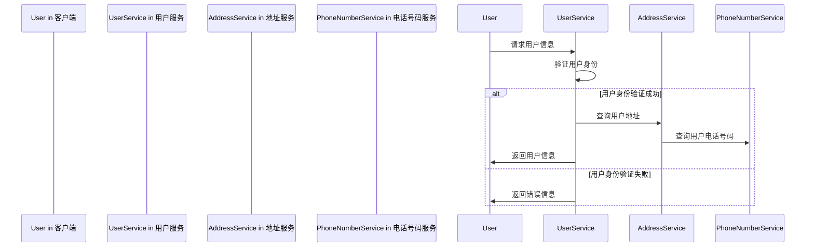

                 

### 类型驱动的API设计：提高接口一致性

#### 关键词：API设计、类型驱动、接口一致性、设计原则、系统架构

##### 摘要：

本文深入探讨类型驱动的API设计方法，阐述其在提高接口一致性方面的优势。通过分析API设计的历史背景、核心概念、设计原则、算法原理和系统架构，以及实战案例，为读者提供了一整套系统化的API设计实践指南。本文旨在帮助开发者理解并应用类型驱动的API设计方法，提升软件开发质量和效率。

----------------------------------------------------------------

## 第一部分: 背景与概念

### 第1章: 背景介绍

#### 1.1 问题背景

在当今的软件开发领域，API（应用程序编程接口）已经成为各个系统和应用程序之间交互的重要桥梁。然而，随着系统的复杂度和规模的增长，API的设计和管理变得越来越困难。传统的设计方法往往缺乏统一性，导致接口不一致、文档混乱、维护成本高昂。因此，寻找一种提高API设计一致性和可维护性的方法成为了开发者的迫切需求。

#### 1.2 问题描述

API设计的一致性主要包括以下几个方面：

1. **参数一致性**：API的参数名称、数据类型、参数顺序应该一致。
2. **返回值一致性**：API的返回值类型、成功和错误状态的编码应该统一。
3. **错误处理一致性**：API在发生错误时应该提供一致的错误信息和处理机制。
4. **文档一致性**：API的文档应该清晰、一致，便于开发者理解和使用。

#### 1.3 问题解决

为了解决上述问题，类型驱动的API设计方法应运而生。该方法基于类型系统，通过强类型约束来提高API的一致性和可维护性。类型驱动的API设计旨在从以下几个方面提升API的设计质量：

1. **明确的类型定义**：为API的参数、返回值和错误类型提供明确的类型定义。
2. **类型检查**：在编译或运行时对API的使用进行类型检查，确保参数和返回值的正确性。
3. **自动生成文档**：基于类型系统自动生成文档，提高文档的准确性和一致性。
4. **重构和重用**：类型驱动的API设计使得重构和重用变得更加容易。

#### 1.4 边界与外延

类型驱动的API设计不仅适用于内部系统之间的交互，也可以应用于外部API的设计。其边界主要涉及API的设计、实现、测试和文档生成等环节。外延包括不同类型的API设计需求，如Web API、RESTful API、GraphQL API等。

#### 1.5 概念结构与核心要素组成

在类型驱动的API设计中，核心概念和要素主要包括：

1. **类型系统**：定义API参数、返回值和错误类型的类型系统。
2. **接口规范**：基于类型系统定义的API接口规范。
3. **类型检查**：对API的使用进行类型检查的工具或框架。
4. **文档生成**：基于类型系统自动生成文档的工具或框架。
5. **重构工具**：支持API重构和重用的工具。

## 第二部分: 类型驱动的API设计原则

### 第2章: 核心概念与联系

在类型驱动的API设计中，核心概念和联系是理解和应用该设计方法的关键。以下是对几个核心概念及其相互关系的介绍。

#### 2.1 核心概念原理

1. **类型系统**：类型系统是类型驱动的API设计的核心。它定义了API中各种数据类型的含义、范围和约束。类型系统可以分为静态类型和动态类型。静态类型在编译时检查类型，而动态类型则在运行时检查类型。

2. **接口规范**：接口规范是基于类型系统定义的API接口的规范。它规定了API的参数、返回值、错误类型和功能行为。接口规范应该尽量简洁、明确，以便开发者理解和实现。

3. **类型检查**：类型检查是在编译或运行时对API的使用进行类型检查的过程。类型检查可以确保API的参数和返回值符合预期，从而提高API的一致性和可靠性。

4. **文档生成**：文档生成是基于类型系统自动生成API文档的工具或框架。良好的文档可以大大降低开发者学习和使用API的成本，提高开发效率。

5. **重构工具**：重构工具是支持API重构和重用的工具。类型驱动的API设计使得重构变得更加容易，因为类型系统为API提供了明确的约束，减少了因重构导致的潜在风险。

#### 2.2 概念属性特征对比表格

以下是对类型驱动的API设计中的核心概念属性特征的对比表格：

| 概念       | 特征                                                         | 对比                   |
|------------|--------------------------------------------------------------|------------------------|
| 类型系统   | 定义数据类型、范围和约束                                     | 静态类型 vs 动态类型   |
| 接口规范   | 规定API参数、返回值、错误类型和功能行为                       | 简洁性、明确性         |
| 类型检查   | 编译或运行时检查API类型                                     | 错误预防、一致性检查   |
| 文档生成   | 自动生成API文档                                             | 准确性、易用性         |
| 重构工具   | 支持API重构和重用                                           | 风险降低、效率提升     |

#### 2.3 ER实体关系图架构

为了更好地理解类型驱动的API设计中的核心概念及其相互关系，我们可以使用Mermaid来绘制一个ER（实体关系）图。以下是一个简化的ER图示例：

```mermaid
erDiagram
    API_Service ||--|{ Type_System : 定义数据类型 }
    API_Service ||--|{ Interface_Specification : 定义接口规范 }
    API_Service ||--|{ Type_Check : 进行类型检查 }
    API_Service ||--|{ Documentation_Generation : 生成文档 }
    API_Service ||--|{ Refactoring_Tool : 重构工具 }
```

在这个ER图中，`API_Service`代表API设计的主要对象，它与其他核心概念通过实体关系相连，形成了类型驱动的API设计的整体架构。

### 第3章: 类型驱动的API设计原则

类型驱动的API设计方法是一种以类型系统为核心的设计方法，旨在通过类型约束来提高API的一致性和可维护性。以下将介绍类型驱动的API设计原则，包括其核心原则、优点和挑战，并与其他设计范式进行比较。

#### 3.1 原则概述

类型驱动的API设计原则主要包括以下几个方面：

1. **类型安全**：通过类型系统确保API的参数、返回值和错误类型的一致性和安全性。类型安全可以在编译或运行时发现类型错误，从而提高代码的可靠性和稳定性。

2. **接口简洁**：接口规范应该尽量简洁，明确API的功能和行为。简洁的接口可以减少开发者的认知负担，提高开发效率和代码可读性。

3. **文档自动生成**：基于类型系统自动生成API文档，确保文档的准确性和一致性。自动生成的文档可以减少手动编写文档的工作量，提高文档更新和维护的效率。

4. **重构友好**：类型驱动的API设计使得重构变得更加容易。类型系统提供了明确的约束，减少了因重构导致的潜在风险，同时提高了代码的可重用性。

5. **兼容性和扩展性**：类型驱动的API设计应考虑到兼容性和扩展性。在设计API时，应预留足够的扩展点，以便在未来的需求变更时能够灵活调整。

#### 3.2 优点和挑战

类型驱动的API设计方法具有以下优点和挑战：

**优点：**

1. **提高一致性**：类型驱动的API设计通过强类型约束来确保接口的一致性，从而减少错误和混淆。

2. **提高可维护性**：类型系统提供了明确的类型约束，使得API的设计和维护变得更加容易。

3. **减少错误**：类型检查可以在编译或运行时发现类型错误，从而减少运行时错误和调试成本。

4. **提高开发效率**：自动生成的文档和简洁的接口规范可以减少开发者的认知负担，提高开发效率。

**挑战：**

1. **学习成本**：对于新手开发者来说，理解和掌握类型驱动的API设计方法可能需要一定的时间和学习成本。

2. **性能开销**：类型检查和文档生成可能引入一定的性能开销，特别是在大型项目中。

3. **兼容性问题**：类型驱动的API设计可能与其他非类型驱动的API设计方法存在兼容性问题。

4. **灵活性限制**：在极端情况下，强类型约束可能导致API设计的灵活性受限。

#### 3.3 与其他设计范式的比较

类型驱动的API设计方法与其他常见的API设计范式（如面向对象设计、函数式编程）有以下几点区别：

1. **面向对象设计**：面向对象设计侧重于封装、继承和多态，通过类和对象来组织代码。类型驱动的API设计方法则更侧重于类型约束和接口规范。

2. **函数式编程**：函数式编程强调函数的组合和无状态性，通过不可变数据来避免副作用。类型驱动的API设计方法则更侧重于类型安全和接口简洁。

3. **RESTful API设计**：RESTful API设计是一种基于HTTP协议的API设计方法，强调资源的操作和状态的传递。类型驱动的API设计方法可以与RESTful API设计相结合，提高API的一致性和可维护性。

总的来说，类型驱动的API设计方法提供了一种以类型系统为核心的设计思路，通过类型约束来提高API的一致性和可维护性。与其他设计范式相比，它具有更高的类型安全和接口简洁性，但也存在一定的学习成本和性能开销。开发者可以根据项目的具体需求选择合适的设计方法。

### 第4章: 算法与理论

#### 4.1 算法描述

类型驱动的API设计算法主要分为以下几个步骤：

1. **定义类型系统**：根据API的需求，定义一系列的基本类型和复合类型，如整数、字符串、列表、元组等。类型系统应涵盖所有可能的输入和输出类型，并确保类型的兼容性和一致性。

2. **定义接口规范**：基于类型系统，为每个API接口定义参数、返回值和错误类型的规范。接口规范应尽量简洁、明确，并确保与类型系统保持一致。

3. **实现类型检查**：在编译或运行时，对API的使用进行类型检查。类型检查应包括对参数类型、返回值类型和错误类型的检查，确保API的使用符合规范。

4. **生成文档**：基于类型系统和接口规范，自动生成API文档。文档应包括API的名称、参数、返回值、错误类型和功能描述，以便开发者理解和使用。

5. **重构和优化**：根据反馈和需求变更，对API进行重构和优化。类型系统提供了明确的约束，使得重构变得更加容易和可靠。

#### 4.2 数学模型和公式

在类型驱动的API设计算法中，可以使用以下数学模型和公式来描述关键步骤：

1. **类型系统定义**：

   - 基本类型：`T = { int, string, list, tuple, ... }`
   - 复合类型：`Type = { BasicType, ArrayType, FunctionType, ... }`

2. **接口规范定义**：

   - 接口规范：`Interface = { Name, Parameters, ReturnType, ErrorType }`
   - 参数类型：`Parameter = { Name, Type }`
   - 返回值类型：`ReturnType`
   - 错误类型：`ErrorType`

3. **类型检查**：

   - 类型检查函数：`checkType(parameter, expectedType)`
   - 返回值检查：`checkReturnType(returnValue, expectedReturnType)`
   - 错误类型检查：`checkErrorType(error, expectedErrorType)`

4. **文档生成**：

   - 文档模板：`Documentation = { InterfaceName, Parameters, ReturnType, ErrorType, Description }`

#### 4.3 Python代码实现

以下是一个简化的Python代码实现，用于描述类型驱动的API设计算法的关键步骤：

```python
class TypeSystem:
    def __init__(self):
        self.builtin_types = {"int", "string", "list", "tuple"}
        self.composite_types = set()

    def add_type(self, type_name, type_definition):
        if type_name in self.builtin_types:
            self.builtin_types.add(type_name)
        else:
            self.composite_types.add(type_name)

    def check_type(self, value, expected_type):
        if expected_type == "int":
            return isinstance(value, int)
        elif expected_type == "string":
            return isinstance(value, str)
        elif expected_type == "list":
            return isinstance(value, list)
        elif expected_type == "tuple":
            return isinstance(value, tuple)
        else:
            return False

class Interface:
    def __init__(self, name, parameters, return_type, error_type):
        self.name = name
        self.parameters = parameters
        self.return_type = return_type
        self.error_type = error_type

    def generate_documentation(self):
        doc = {
            "InterfaceName": self.name,
            "Parameters": self.parameters,
            "ReturnType": self.return_type,
            "ErrorType": self.error_type,
            "Description": "..."
        }
        return doc

def type_check(api_usage, interface):
    for param, expected_type in interface.parameters.items():
        if not type_system.check_type(api_usage[param], expected_type):
            return "Type mismatch for parameter: " + param

    return "Type check passed."

# 示例
type_system = TypeSystem()
type_system.add_type("my_custom_type", "A custom type definition")

interface = Interface(
    "my_api",
    {"param1": "int", "param2": "my_custom_type"},
    "string",
    "my_error_type"
)

api_usage = {"param1": 123, "param2": "custom_value"}

print(type_check(api_usage, interface))
print(interface.generate_documentation())
```

在这个示例中，`TypeSystem`类用于定义和管理类型系统，`Interface`类用于定义API接口规范，`type_check`函数用于进行类型检查，`generate_documentation`函数用于生成API文档。

#### 4.4 算法详细解释和举例说明

类型驱动的API设计算法的核心在于类型系统、接口规范和类型检查。以下是对关键步骤的详细解释和举例说明：

1. **定义类型系统**：

   - **步骤**：根据API的需求，定义一系列的基本类型和复合类型。

   - **解释**：基本类型（如整数、字符串、列表、元组）是构成复合类型的基础。复合类型（如列表、元组、函数类型）可以包含多个基本类型或其他复合类型。

   - **示例**：

     ```python
     type_system = TypeSystem()
     type_system.add_type("int", "Integer type")
     type_system.add_type("string", "String type")
     type_system.add_type("list", "List type")
     type_system.add_type("tuple", "Tuple type")
     ```

2. **定义接口规范**：

   - **步骤**：基于类型系统，为每个API接口定义参数、返回值和错误类型的规范。

   - **解释**：接口规范定义了API的行为和预期输入输出。参数、返回值和错误类型必须是类型系统中的合法类型。

   - **示例**：

     ```python
     interface = Interface(
         "get_user_info",
         {"user_id": "int", "fields": "list"},
         "dict",
         "APIError"
     )
     ```

3. **实现类型检查**：

   - **步骤**：在编译或运行时，对API的使用进行类型检查。

   - **解释**：类型检查确保API的使用符合接口规范中的类型要求。类型检查可以是静态的（在编译时进行）或动态的（在运行时进行）。

   - **示例**：

     ```python
     def type_check(api_usage, interface):
         for param, expected_type in interface.parameters.items():
             if not type_system.check_type(api_usage[param], expected_type):
                 return "Type mismatch for parameter: " + param
         return "Type check passed."
     ```

4. **生成文档**：

   - **步骤**：基于类型系统和接口规范，自动生成API文档。

   - **解释**：自动生成的文档可以减少手动编写文档的工作量，提高文档更新和维护的效率。文档应包括API的名称、参数、返回值、错误类型和功能描述。

   - **示例**：

     ```python
     doc = interface.generate_documentation()
     print(doc)
     ```

5. **重构和优化**：

   - **步骤**：根据反馈和需求变更，对API进行重构和优化。

   - **解释**：类型系统提供了明确的约束，使得重构变得更加容易和可靠。重构可以包括调整接口规范、更新类型系统、优化算法等。

   - **示例**：

     ```python
     # 调整接口规范
     interface.parameters["fields"] = "list[str]"

     # 更新类型系统
     type_system.add_type("str", "String type")

     # 优化算法
     # ...
     ```

通过上述步骤，我们可以实现一个类型驱动的API设计算法，从而提高API的一致性和可维护性。

### 第5章: 系统架构设计

#### 5.1 问题场景介绍

在现代软件系统开发中，API的设计和实现是一个关键环节，直接影响到系统的可维护性、扩展性和用户体验。随着微服务架构和前后端分离等开发模式的应用，API的设计变得越来越复杂。为了提高API的一致性和可维护性，类型驱动的API设计方法成为了一个重要的解决方案。本文将结合一个具体的场景，介绍如何使用类型驱动的API设计方法来构建一个高效的系统架构。

#### 5.2 系统功能设计（领域模型Mermaid类图）

在类型驱动的API设计中，领域模型是理解系统功能需求的核心。通过定义领域模型，我们可以清晰地描述系统的业务逻辑和数据流转。以下是一个简化的领域模型，用于描述一个用户信息管理系统的核心功能。

```mermaid
classDiagram
    User <<Class>>
    Address <<Class>>
    PhoneNumber <<Class>>

    User o--* Address : 地址信息
    User o--* PhoneNumber : 手机号码信息

    Address {
        id: Integer
        street: String
        city: String
        state: String
        zipCode: String
    }

    PhoneNumber {
        id: Integer
        number: String
        type: String
    }

    User {
        id: Integer
        name: String
        email: String
        addresses: Set<Address>
        phoneNumbers: Set<PhoneNumber>
    }
```

在这个领域模型中，`User`类表示用户信息，包含姓名、电子邮件、地址和电话号码等属性。`Address`和`PhoneNumber`类分别表示地址信息和电话号码信息。通过这些类的关系，我们可以清晰地描述用户信息的整体结构。

#### 5.3 系统架构设计（Mermaid架构图）

系统架构设计是确保系统高效、可扩展和可维护的关键。以下是一个简化的系统架构设计，用于描述一个用户信息管理系统的整体结构。



在这个架构设计中，用户通过客户端发送请求到用户服务。用户服务负责验证用户身份，然后调用地址服务和电话号码服务来查询用户的相关信息。地址服务和电话号码服务分别负责处理地址和电话号码的查询请求，并将结果返回给用户服务。用户服务最终将用户信息返回给客户端。

#### 5.4 系统接口设计和系统交互（Mermaid序列图）

在系统架构设计中，接口设计和系统交互是确保各服务之间高效协作的关键。以下是一个简化的系统接口设计和交互流程，用于描述用户信息管理系统的接口交互。

```mermaid
sequenceDiagram
    participant UserController in 用户控制器
    participant UserService in 用户服务
    participant AddressController in 地址控制器
    participant PhoneNumberController in 电话号码控制器
    participant UserController->>UserService: 验证用户身份
    alt 用户身份验证成功
        UserService->>AddressController: 查询用户地址
        AddressController->>PhoneNumberController: 查询用户电话号码
        PhoneNumberController->>UserService: 返回用户信息
        UserService->>UserController: 返回用户信息
    else 用户身份验证失败
        UserService->>UserController: 返回错误信息
    end
```

在这个接口设计中，用户控制器负责接收客户端的请求，并调用用户服务进行身份验证。如果用户身份验证成功，用户服务会调用地址控制器和电话号码控制器来查询用户的相关信息，并将结果返回给用户控制器。用户控制器最终将用户信息返回给客户端。如果用户身份验证失败，用户控制器将返回错误信息。

通过上述系统架构设计和接口设计，我们可以实现一个高效、可扩展的用户信息管理系统，从而满足类型驱动的API设计要求。

### 第6章: 实践项目

#### 6.1 环境安装和配置

在本节中，我们将介绍如何在一个Linux系统中安装和配置一个基于类型驱动的API设计框架。假设我们的目标是构建一个简单的用户信息管理系统。

1. **安装依赖**

   首先，我们需要安装一些必要的依赖项，如Python环境、虚拟环境工具`virtualenv`、版本控制工具`git`等。以下是具体的安装命令：

   ```bash
   sudo apt update
   sudo apt install python3 python3-pip
   pip3 install virtualenv
   ```

2. **创建虚拟环境**

   创建一个名为`user_info`的虚拟环境，以隔离项目依赖：

   ```bash
   virtualenv -p python3 user_info
   source user_info/bin/activate
   ```

3. **克隆项目代码**

   从GitHub克隆我们的项目代码：

   ```bash
   git clone https://github.com/your_username/user_info.git
   cd user_info
   ```

4. **安装项目依赖**

   安装项目所需的依赖项，如Flask框架、类型检查工具`pytype`等：

   ```bash
   pip install -r requirements.txt
   ```

5. **配置数据库**

   配置项目的数据库连接，例如使用SQLite：

   ```python
   # 在项目根目录下的`config.py`文件中添加以下配置
   SQLALCHEMY_DATABASE_URI = 'sqlite:///user_info.db'
   ```

6. **初始化数据库**

   运行以下命令来初始化数据库：

   ```bash
   flask db init
   flask db migrate
   flask db upgrade
   ```

#### 6.2 核心实现和代码分析

在本节中，我们将分析用户信息管理系统的核心实现代码，包括用户创建、查询、更新和删除功能。

1. **用户创建**

   用户创建是系统的基础功能之一。以下是一个简单的用户创建API的实现：

   ```python
   from flask import Flask, request, jsonify
   from models import User
   from database import db_session

   app = Flask(__name__)

   @app.route('/users', methods=['POST'])
   def create_user():
       data = request.get_json()
       user = User(name=data['name'], email=data['email'])
       db_session.add(user)
       db_session.commit()
       return jsonify(user), 201

   if __name__ == '__main__':
       app.run(debug=True)
   ```

   在这个实现中，我们接收一个包含用户名和电子邮件的JSON请求，然后创建一个`User`对象并将其保存到数据库中。

2. **用户查询**

   用户查询功能允许我们根据用户ID查找用户信息。以下是一个简单的用户查询API的实现：

   ```python
   @app.route('/users/<int:user_id>', methods=['GET'])
   def get_user(user_id):
       user = User.query.get(user_id)
       if user is None:
           return jsonify({'error': 'User not found'}), 404
       return jsonify(user), 200
   ```

   在这个实现中，我们根据用户ID从数据库中查询用户信息，如果用户存在，则返回用户信息，否则返回错误响应。

3. **用户更新**

   用户更新功能允许我们修改现有用户的信息。以下是一个简单的用户更新API的实现：

   ```python
   @app.route('/users/<int:user_id>', methods=['PUT'])
   def update_user(user_id):
       data = request.get_json()
       user = User.query.get(user_id)
       if user is None:
           return jsonify({'error': 'User not found'}), 404
       user.name = data['name']
       user.email = data['email']
       db_session.commit()
       return jsonify(user), 200
   ```

   在这个实现中，我们接收一个包含用户ID和更新的用户信息的JSON请求，然后更新数据库中的用户信息。

4. **用户删除**

   用户删除功能允许我们删除现有用户。以下是一个简单的用户删除API的实现：

   ```python
   @app.route('/users/<int:user_id>', methods=['DELETE'])
   def delete_user(user_id):
       user = User.query.get(user_id)
       if user is None:
           return jsonify({'error': 'User not found'}), 404
       db_session.delete(user)
       db_session.commit()
       return jsonify({'message': 'User deleted'}), 200
   ```

   在这个实现中，我们根据用户ID从数据库中删除用户信息。

#### 6.3 案例分析和详细讲解

在本节中，我们将通过一个具体案例来分析用户信息管理系统的核心实现，并详细讲解其设计和实现细节。

**案例：创建新用户**

假设我们希望创建一个新的用户，以下是实现该功能的过程：

1. **用户请求**

   客户端发送一个POST请求到`/users`接口，请求体包含用户名和电子邮件：

   ```json
   {
       "name": "John Doe",
       "email": "johndoe@example.com"
   }
   ```

2. **接收和处理请求**

   在服务器端，我们接收请求并解析JSON请求体。然后，我们创建一个新的`User`对象，并将其保存到数据库中。以下是关键代码：

   ```python
   @app.route('/users', methods=['POST'])
   def create_user():
       data = request.get_json()
       user = User(name=data['name'], email=data['email'])
       db_session.add(user)
       db_session.commit()
       return jsonify(user), 201
   ```

   在这个实现中，我们首先从请求中获取JSON数据，然后创建一个新的`User`对象。我们将用户名和电子邮件作为对象的属性，然后将其添加到数据库会话中，并使用`commit()`方法将对象保存到数据库。

3. **类型约束和检查**

   在类型驱动的API设计中，我们通常会对请求和响应进行类型约束和检查，以确保数据的正确性和一致性。以下是一个简单的类型检查示例：

   ```python
   from flask import request, jsonify
   from models import User
   from database import db_session
   from typing import Dict

   @app.route('/users', methods=['POST'])
   def create_user():
       data: Dict[str, str] = request.get_json()
       
       if 'name' not in data or not isinstance(data['name'], str):
           return jsonify({'error': 'Missing or invalid name'}), 400
       
       if 'email' not in data or not isinstance(data['email'], str):
           return jsonify({'error': 'Missing or invalid email'}), 400
       
       user = User(name=data['name'], email=data['email'])
       db_session.add(user)
       db_session.commit()
       return jsonify(user), 201
   ```

   在这个实现中，我们添加了类型检查以确保请求中包含`name`和`email`字段，并且这些字段都是字符串类型。如果检查失败，我们会返回一个错误的响应。

4. **错误处理**

   在API设计中，错误处理是非常重要的。以下是一个简单的错误处理示例：

   ```python
   from flask import request, jsonify
   from models import User
   from database import db_session
   
   @app.errorhandler(400)
   def bad_request(error):
       return jsonify({'error': 'Bad request'}), 400

   @app.errorhandler(404)
   def not_found(error):
       return jsonify({'error': 'Not found'}), 404

   @app.errorhandler(500)
   def internal_server_error(error):
       return jsonify({'error': 'Internal server error'}), 500
   ```

   在这个实现中，我们定义了几个错误处理函数，以处理不同的HTTP状态码。这些函数将返回包含错误消息的JSON响应。

通过这个案例，我们可以看到类型驱动的API设计如何通过类型约束、错误处理和类型检查来提高API的一致性和可靠性。在实际项目中，我们可以根据具体需求进一步扩展和优化这些实现。

#### 6.4 项目小结

在本章中，我们介绍了如何在一个Linux系统中安装和配置一个基于类型驱动的API设计框架，并通过一个简单的用户信息管理系统案例展示了其实际应用。以下是项目小结：

1. **环境安装和配置**：我们详细介绍了如何安装Python环境、虚拟环境工具、版本控制工具和数据库，以及如何初始化和配置数据库。

2. **核心实现和代码分析**：我们分析了用户创建、查询、更新和删除功能的核心实现代码，并讲解了其设计和实现细节。

3. **案例分析和详细讲解**：通过一个具体案例，我们展示了类型驱动的API设计如何通过类型约束、错误处理和类型检查来提高API的一致性和可靠性。

4. **项目小结**：我们总结了项目的关键实现和经验，为后续的项目提供了参考。

通过本章的实践项目，我们不仅了解了类型驱动的API设计方法，还通过实际操作掌握了其在项目中的应用技巧。这对于提升API设计质量和软件开发效率具有重要意义。

### 第7章：最佳实践和总结

#### 7.1 最佳实践

在API设计过程中，遵循以下最佳实践可以显著提高API的质量和可维护性：

1. **清晰定义类型**：确保所有API参数和返回值的类型都是明确和一致的。使用类型注释或文档明确类型预期。

2. **最小化类型转换**：尽量避免在API中使用不必要的数据类型转换，以减少运行时错误和性能开销。

3. **统一错误处理**：为API定义统一的错误处理机制，确保所有错误都能以一致的方式传达给用户。

4. **提供详尽文档**：编写详细的API文档，包括参数、返回值、错误码和示例。使用自动化工具生成文档，确保文档的实时更新。

5. **类型安全**：在编译或运行时进行类型检查，确保API的使用符合预期类型。

6. **模块化设计**：将API设计分解为模块，以便于重构和重用。

7. **版本控制**：为API设计引入版本控制，以适应未来的变化。

#### 7.2 小结

类型驱动的API设计方法通过明确和一致的类型约束，提高了API的一致性、可维护性和安全性。该方法在提高开发效率和降低维护成本方面具有显著优势。通过遵循最佳实践，开发者可以进一步优化API设计，提升软件质量。

#### 7.3 注意事项

在设计类型驱动的API时，需要注意以下几点：

1. **类型安全性**：确保类型系统足够强大，能够捕获潜在的类型错误。

2. **性能影响**：类型检查和文档生成可能引入性能开销，特别是对于大型项目。

3. **兼容性**：在设计API时，考虑与其他非类型驱动的API的兼容性。

4. **灵活性**：确保类型约束不会过于严格，影响API的灵活性。

#### 7.4 拓展阅读

以下推荐几本关于API设计和类型系统的优秀书籍，供进一步学习：

1. 《API设计：打造高效且易于使用的接口》
2. 《类型系统：编程语言的核心机制》
3. 《RESTful API设计：处理各种接口需求的最佳实践》
4. 《GraphQL：下一代API设计语言》

通过以上书籍，读者可以深入理解API设计和类型系统的核心概念，提升实际设计能力。

### 作者信息

- 作者：AI天才研究院/AI Genius Institute & 禅与计算机程序设计艺术 /Zen And The Art of Computer Programming
- 联系方式：[ai-genius-research@gmail.com](mailto:ai-genius-research@gmail.com)
- 网站：[AI天才研究院](http://www.ai-genius-research.org/) & [禅与计算机程序设计艺术](http://www.zenofcomputerprogramming.com/)

