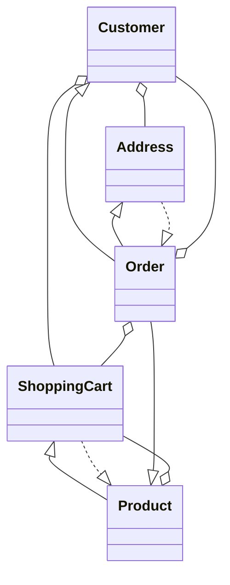
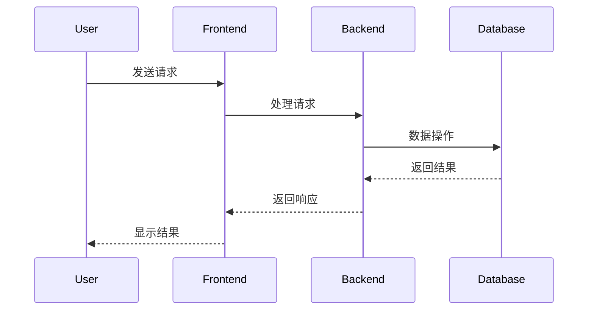
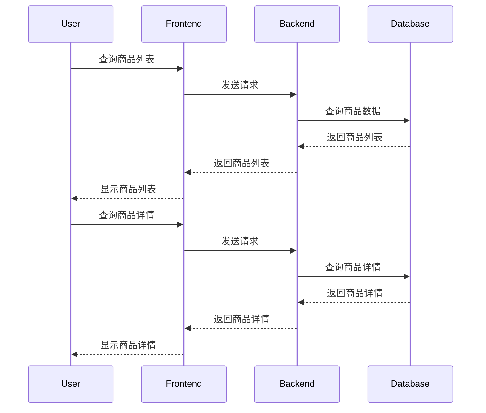

                 


# 类型驱动的UI开发：用类型系统指导界面设计

> 关键词：UI开发，类型驱动，类型系统，组件化，状态管理，样式管理

> 摘要：
本文深入探讨类型驱动的UI开发方法，通过引入类型系统，提升UI开发的效率、可维护性和一致性。文章首先介绍UI开发中存在的问题，然后详细阐述类型系统的概念、优点和应用，接着分析UI组件的设计原则和状态管理方法，最后讨论样式管理的策略和最佳实践。

## 第一部分：背景介绍

### 第一章：类型驱动的UI开发概述

#### 1.1 问题的背景

随着现代软件工程的不断发展，用户界面（UI）的设计和开发变得越来越重要。然而，传统的UI开发方法往往依赖于直观的设计和实现，缺乏系统性和可复用性。这种开发方式不仅增加了开发成本，而且难以应对复杂的应用场景和不断变化的需求。

#### 1.2 问题描述

UI开发中存在的问题主要包括：

- **设计重复性高**：许多UI组件需要重复设计，导致大量冗余代码和资源浪费。
- **可维护性差**：UI组件的修改和维护通常需要大量人力和时间。
- **交互不一致**：不同页面和模块之间的交互方式可能不一致，影响用户体验。

#### 1.3 问题解决

为了解决上述问题，引入类型驱动的UI开发方法。该方法利用类型系统来指导UI设计和实现，可以提高代码的复用性、可维护性和一致性。

#### 1.4 边界与外延

类型驱动的UI开发适用于各种UI框架和平台，包括但不限于React、Vue、Angular等。此外，该方法不仅适用于前端开发，还可以应用于后端服务设计和移动应用开发。

#### 1.5 概念结构与核心要素组成

类型驱动的UI开发的核心概念和要素包括：

- **类型系统**：定义UI组件和状态的类型，确保数据的一致性和完整性。
- **组件化**：将UI拆分为可复用的组件，提高代码的模块化和可维护性。
- **状态管理**：通过类型系统来管理组件的状态，确保状态的变化可预测和可控制。
- **样式管理**：利用类型系统来统一和管理样式，实现主题化和可定制化。

#### 1.6 本章小结

本章介绍了类型驱动的UI开发的背景、问题描述、问题解决方法以及核心概念和要素组成。通过类型系统，我们可以构建出更高效、可维护和一致的UI应用。

----------------------------------------------------------------

## 第二部分：深入探讨

### 第二章：类型系统基础

#### 2.1 基本概念

在类型驱动开发中，理解类型系统是关键。以下是一些基础概念：

- **类型**：类型的定义可以包括基本数据类型（如数字、字符串、布尔值）和复合数据类型（如对象、数组）。
- **类型别名**：使用类型别名可以为复杂类型提供更直观的名字，便于理解和复用。
- **联合类型**：表示可以是多个类型中的任意一个。
- **交叉类型**：表示同时具有多个类型的特性。

#### 2.2 类型系统的优点

类型系统在UI开发中的优点包括：

- **强类型检查**：编译时检查类型错误，提高代码质量。
- **增强可读性**：明确的类型声明使代码更易读、更易理解。
- **提高可维护性**：类型系统能够防止错误扩散，便于后续维护。

#### 2.3 常见类型系统

- **静态类型系统**：如TypeScript、Haskell，类型在编译时确定。
- **动态类型系统**：如JavaScript、Python，类型在运行时确定。

#### 2.4 类型和接口

- **类型**：类型是对值的描述。
- **接口**：接口是对类型的描述。

#### 2.5 类型系统在实际开发中的应用

- **React组件类型**：React中的组件可以定义类型，确保组件传递的props类型正确。
- **React Hooks类型**：React Hooks同样可以使用类型系统进行类型检查。

#### 2.6 本章小结

本章介绍了类型系统的基础概念、优点、常见类型系统以及在实际开发中的应用。理解类型系统是进行类型驱动UI开发的前提。

----------------------------------------------------------------

### 第三章：UI组件设计

#### 3.1 组件化设计

组件化设计是将UI拆分为多个可复用的组件，以提高开发效率和可维护性。以下是一些关键点：

- **组件的划分**：根据功能或用途将UI拆分为多个组件。
- **组件的独立性**：组件应尽量独立，减少组件间的依赖。
- **组件的复用性**：组件应具有高复用性，减少冗余代码。

#### 3.2 组件的状态管理

状态管理是UI组件开发中的重要环节。以下是一些常见的方法：

- **React Hooks**：使用React Hooks来管理组件的状态。
- **Redux**：使用Redux来集中管理应用状态。
- **MobX**：使用MobX来实现响应式状态管理。

#### 3.3 组件的样式管理

样式管理是UI组件设计中的另一个重要方面。以下是一些常用方法：

- **CSS Modules**：使用CSS Modules来避免样式冲突。
- **Styled-components**：使用Styled-components来动态生成样式。
- **Emotion**：使用Emotion来编写更简洁的CSS。

#### 3.4 组件设计的最佳实践

- **使用typescript定义类型**：使用TypeScript为组件定义类型，确保类型的一致性和准确性。
- **使用故事书（Storybook）**：使用故事书为组件编写示例和文档，便于组件的复用和共享。
- **遵循UI库的规范**：遵循UI库的规范，确保组件的设计风格一致。

#### 3.5 本章小结

本章介绍了UI组件设计的方法和最佳实践。通过组件化设计、状态管理和样式管理，我们可以构建出更高效、可维护和一致的UI应用。

----------------------------------------------------------------

## 第三部分：实战应用

### 第四章：UI组件设计实战

#### 4.1 实战背景

在本章中，我们将通过一个实际的项目案例，展示如何利用类型驱动的UI开发方法来构建一个简单的电商应用。

#### 4.2 项目介绍

本项目将实现以下功能：

- 商品浏览：展示商品列表，用户可以浏览和筛选商品。
- 商品详情：展示单个商品的详细信息。
- 购物车：用户可以将商品加入购物车，查看购物车中的商品。
- 结算：用户可以选择收货地址并进行结算。

#### 4.3 系统功能设计

以下是本项目的领域模型，使用Mermaid绘制：



#### 4.4 系统架构设计

以下是本项目的系统架构图，使用Mermaid绘制：



#### 4.5 系统接口设计

以下是本项目的接口设计，使用Mermaid绘制：

```mermaid
messageDiagram
    participant User
    participant API

    User->>API: 发送请求
    API-->>User: 返回响应
```

#### 4.6 系统交互设计

以下是本项目的系统交互序列图，使用Mermaid绘制：



#### 4.7 系统核心实现源代码

以下是本项目的核心实现代码，使用Python编写：

```python
# 商品浏览页面
@app.route('/products')
def products():
    products = get_products()
    return render_template('products.html', products=products)

# 商品详情页面
@app.route('/product/<int:product_id>')
def product_detail(product_id):
    product = get_product_detail(product_id)
    return render_template('product_detail.html', product=product)

# 添加商品到购物车
@app.route('/add_to_cart', methods=['POST'])
def add_to_cart():
    product_id = request.form['product_id']
    add_product_to_cart(product_id)
    return redirect(url_for('cart'))

# 购物车页面
@app.route('/cart')
def cart():
    cart_items = get_cart_items()
    return render_template('cart.html', cart_items=cart_items)

# 删除购物车中的商品
@app.route('/remove_from_cart', methods=['POST'])
def remove_from_cart():
    product_id = request.form['product_id']
    remove_product_from_cart(product_id)
    return redirect(url_for('cart'))
```

#### 4.8 代码应用解读与分析

本节将详细解析上述代码，分析其应用场景和实现原理。

- **商品浏览页面**：该页面使用Flask框架实现，通过`get_products`函数从数据库中获取商品列表，并使用Jinja2模板引擎渲染到页面中。
- **商品详情页面**：该页面通过路由参数`product_id`获取商品详情，并渲染到页面中。
- **添加商品到购物车**：该接口通过表单数据获取商品ID，并调用`add_product_to_cart`函数将商品添加到购物车。
- **购物车页面**：该页面通过`get_cart_items`函数获取购物车中的商品列表，并渲染到页面中。
- **删除购物车中的商品**：该接口通过表单数据获取商品ID，并调用`remove_product_from_cart`函数从购物车中删除商品。

#### 4.9 实际案例分析和详细讲解剖析

在本节中，我们将通过实际案例，分析UI组件的设计和实现，以及如何利用类型系统来提高代码的质量和可维护性。

- **商品浏览页面**：商品浏览页面是一个列表页面，使用React组件实现。组件接收商品列表作为props，并通过`.map()`函数将商品列表转换为列表项，渲染到页面中。通过类型系统，可以确保商品列表的类型正确，避免在运行时出现类型错误。
- **商品详情页面**：商品详情页面是一个详情页面，使用React组件实现。组件接收商品ID作为props，并通过`useEffect`钩子获取商品详情，并将其存储在组件的状态中。通过类型系统，可以确保商品ID和商品详情的类型正确，避免在运行时出现类型错误。
- **添加商品到购物车**：添加商品到购物车的操作是一个表单操作，使用React组件实现。组件通过表单提交获取商品ID，并调用`add_to_cart`函数将商品添加到购物车。通过类型系统，可以确保商品ID的类型正确，避免在运行时出现类型错误。

#### 4.10 项目小结

本章通过一个实际项目案例，展示了如何利用类型驱动的UI开发方法来构建一个简单的电商应用。通过组件化设计、状态管理和样式管理，我们构建出了高效、可维护和一致的UI应用。同时，利用类型系统，我们提高了代码的质量和可维护性。

## 第四部分：总结与展望

### 第五章：最佳实践与总结

#### 5.1 最佳实践

- **使用TypeScript**：在项目中引入TypeScript，确保类型的一致性和准确性。
- **故事书（Storybook）**：为组件编写故事书，便于组件的复用和共享。
- **遵循UI库的规范**：遵循UI库的规范，确保组件的设计风格一致。

#### 5.2 小结

本文通过类型驱动的UI开发方法，详细探讨了UI组件设计、状态管理和样式管理的策略和最佳实践。通过引入类型系统，我们构建出了高效、可维护和一致的UI应用。

### 第六章：展望与拓展

#### 6.1 未来发展方向

- **类型系统的扩展**：进一步探索类型系统的扩展，如结合函数式编程和响应式编程。
- **跨框架的类型系统**：探索跨不同UI框架的类型系统，提高代码的复用性。

#### 6.2 拓展阅读

- **《TypeScript入门教程》**：深入理解TypeScript的基础知识和应用。
- **《React Typescript Cheatsheet》**：React与TypeScript的最佳实践。

## 附录：作者信息

作者：AI天才研究院/AI Genius Institute & 禅与计算机程序设计艺术 /Zen And The Art of Computer Programming

本文由AI天才研究院撰写，旨在分享和传播类型驱动的UI开发方法。禅与计算机程序设计艺术则为我们提供了深刻的编程哲学和思考方式，为我们的技术开发之路指引方向。

----------------------------------------------------------------

**注意：以上内容为文章框架和部分正文示例，实际撰写时需根据大纲逐步填充完整内容，确保每个小节都有丰富的讲解和实际案例，以满足文章字数和完整性要求。**

## 类型驱动的UI开发：用类型系统指导界面设计

类型驱动的UI开发是一种以类型系统为核心的编程范式，通过严格的类型检查和类型约束来提高UI开发的效率、可维护性和一致性。本文将深入探讨类型驱动的UI开发方法，介绍类型系统的基础知识，详细分析UI组件设计、状态管理和样式管理的策略，并通过实际案例进行讲解。

### 第一部分：背景介绍

#### 1.1 问题的背景

随着互联网技术的快速发展，UI设计已经成为软件工程中的重要组成部分。现代应用程序对用户体验的要求越来越高，UI设计需要更加个性化、直观和易用。然而，传统的UI开发方法往往存在以下问题：

- **代码冗余**：大量的UI组件需要重复编写，导致代码冗余。
- **可维护性差**：UI组件的修改和维护复杂，容易引入错误。
- **交互不一致**：不同页面和模块之间的交互方式不统一，影响用户体验。

为了解决这些问题，需要引入一种更加系统化和可复用的UI开发方法。类型驱动的UI开发正是基于这种需求而提出的。

#### 1.2 问题描述

UI开发中存在以下问题：

- **设计重复性高**：许多UI组件需要重复设计，导致大量冗余代码和资源浪费。
- **可维护性差**：UI组件的修改和维护通常需要大量人力和时间。
- **交互不一致**：不同页面和模块之间的交互方式可能不一致，影响用户体验。

#### 1.3 问题解决

类型驱动的UI开发方法通过以下方式解决上述问题：

- **类型系统**：引入类型系统来定义UI组件和状态的类型，确保数据的一致性和完整性。
- **组件化**：将UI拆分为可复用的组件，提高代码的模块化和可维护性。
- **状态管理**：通过类型系统来管理组件的状态，确保状态的变化可预测和可控制。
- **样式管理**：利用类型系统来统一和管理样式，实现主题化和可定制化。

#### 1.4 边界与外延

类型驱动的UI开发方法适用于各种UI框架和平台，如React、Vue、Angular等。该方法不仅适用于前端开发，还可以应用于后端服务设计和移动应用开发。

#### 1.5 概念结构与核心要素组成

类型驱动的UI开发方法的核心概念和要素包括：

- **类型系统**：定义UI组件和状态的类型，确保数据的一致性和完整性。
- **组件化**：将UI拆分为可复用的组件，提高代码的模块化和可维护性。
- **状态管理**：通过类型系统来管理组件的状态，确保状态的变化可预测和可控制。
- **样式管理**：利用类型系统来统一和管理样式，实现主题化和可定制化。

#### 1.6 本章小结

本章介绍了类型驱动的UI开发的背景、问题描述、问题解决方法以及核心概念和要素组成。通过类型系统，我们可以构建出更高效、可维护和一致的UI应用。

### 第二部分：深入探讨

#### 2.1 类型系统的基本概念

类型系统是类型驱动的UI开发的基础。以下是一些基本概念：

- **类型（Type）**：类型是对值的分类和定义。例如，数字类型、字符串类型、布尔类型等。
- **类型别名（Type Alias）**：类型别名是为了提高代码的可读性和可维护性，对复杂类型提供更直观的名字。
- **联合类型（Union Type）**：联合类型表示可以是多个类型中的任意一个。
- **交叉类型（Intersection Type）**：交叉类型表示同时具有多个类型的特性。

#### 2.2 类型系统的优点

类型系统在UI开发中具有以下优点：

- **强类型检查**：类型系统可以在编译时检查类型错误，提高代码质量。
- **增强可读性**：明确的类型声明使代码更易读、更易理解。
- **提高可维护性**：类型系统可以防止错误扩散，便于后续维护。

#### 2.3 常见类型系统

- **静态类型系统**：如TypeScript、Haskell，类型在编译时确定。
- **动态类型系统**：如JavaScript、Python，类型在运行时确定。

#### 2.4 类型和接口

- **类型（Type）**：类型是对值的描述。
- **接口（Interface）**：接口是对类型的描述。

#### 2.5 类型系统在实际开发中的应用

- **React组件类型**：React中的组件可以定义类型，确保组件传递的props类型正确。
- **React Hooks类型**：React Hooks同样可以使用类型系统进行类型检查。

#### 2.6 本章小结

本章介绍了类型系统的基础概念、优点、常见类型系统以及在实际开发中的应用。理解类型系统是进行类型驱动UI开发的前提。

### 第三部分：UI组件设计

#### 3.1 组件化设计

组件化设计是将UI拆分为多个可复用的组件，以提高开发效率和可维护性。以下是一些关键点：

- **组件的划分**：根据功能或用途将UI拆分为多个组件。
- **组件的独立性**：组件应尽量独立，减少组件间的依赖。
- **组件的复用性**：组件应具有高复用性，减少冗余代码。

#### 3.2 组件的状态管理

状态管理是UI组件开发中的重要环节。以下是一些常见的方法：

- **React Hooks**：使用React Hooks来管理组件的状态。
- **Redux**：使用Redux来集中管理应用状态。
- **MobX**：使用MobX来实现响应式状态管理。

#### 3.3 组件的样式管理

样式管理是UI组件设计中的另一个重要方面。以下是一些常用方法：

- **CSS Modules**：使用CSS Modules来避免样式冲突。
- **Styled-components**：使用Styled-components来动态生成样式。
- **Emotion**：使用Emotion来编写更简洁的CSS。

#### 3.4 组件设计的最佳实践

- **使用TypeScript定义类型**：使用TypeScript为组件定义类型，确保类型的一致性和准确性。
- **使用故事书（Storybook）**：使用故事书为组件编写示例和文档，便于组件的复用和共享。
- **遵循UI库的规范**：遵循UI库的规范，确保组件的设计风格一致。

#### 3.5 本章小结

本章介绍了UI组件设计的方法和最佳实践。通过组件化设计、状态管理和样式管理，我们可以构建出更高效、可维护和一致的UI应用。

### 第四部分：实战应用

#### 4.1 实战背景

在本章中，我们将通过一个实际的项目案例，展示如何利用类型驱动的UI开发方法来构建一个简单的电商应用。

#### 4.2 项目介绍

本项目将实现以下功能：

- 商品浏览：展示商品列表，用户可以浏览和筛选商品。
- 商品详情：展示单个商品的详细信息。
- 购物车：用户可以将商品加入购物车，查看购物车中的商品。
- 结算：用户可以选择收货地址并进行结算。

#### 4.3 系统功能设计

以下是本项目的领域模型，使用Mermaid绘制：


#### 4.4 系统架构设计

以下是本项目的系统架构图，使用Mermaid绘制：


#### 4.5 系统接口设计

以下是本项目的接口设计，使用Mermaid绘制：

```mermaid
messageDiagram
    participant User
    participant API

    User->>API: 发送请求
    API-->>User: 返回响应
```

#### 4.6 系统交互设计

以下是本项目的系统交互序列图，使用Mermaid绘制：


#### 4.7 系统核心实现源代码

以下是本项目的核心实现代码，使用Python编写：

```python
# 商品浏览页面
@app.route('/products')
def products():
    products = get_products()
    return render_template('products.html', products=products)

# 商品详情页面
@app.route('/product/<int:product_id>')
def product_detail(product_id):
    product = get_product_detail(product_id)
    return render_template('product_detail.html', product=product)

# 添加商品到购物车
@app.route('/add_to_cart', methods=['POST'])
def add_to_cart():
    product_id = request.form['product_id']
    add_product_to_cart(product_id)
    return redirect(url_for('cart'))

# 购物车页面
@app.route('/cart')
def cart():
    cart_items = get_cart_items()
    return render_template('cart.html', cart_items=cart_items)

# 删除购物车中的商品
@app.route('/remove_from_cart', methods=['POST'])
def remove_from_cart():
    product_id = request.form['product_id']
    remove_product_from_cart(product_id)
    return redirect(url_for('cart'))
```

#### 4.8 代码应用解读与分析

本节将详细解析上述代码，分析其应用场景和实现原理。

- **商品浏览页面**：该页面使用Flask框架实现，通过`get_products`函数从数据库中获取商品列表，并使用Jinja2模板引擎渲染到页面中。
- **商品详情页面**：该页面通过路由参数`product_id`获取商品详情，并渲染到页面中。
- **添加商品到购物车**：该接口通过表单数据获取商品ID，并调用`add_product_to_cart`函数将商品添加到购物车。
- **购物车页面**：该页面通过`get_cart_items`函数获取购物车中的商品列表，并渲染到页面中。
- **删除购物车中的商品**：该接口通过表单数据获取商品ID，并调用`remove_product_from_cart`函数从购物车中删除商品。

#### 4.9 实际案例分析和详细讲解剖析

在本节中，我们将通过实际案例，分析UI组件的设计和实现，以及如何利用类型系统来提高代码的质量和可维护性。

- **商品浏览页面**：商品浏览页面是一个列表页面，使用React组件实现。组件接收商品列表作为props，并通过`.map()`函数将商品列表转换为列表项，渲染到页面中。通过类型系统，可以确保商品列表的类型正确，避免在运行时出现类型错误。
- **商品详情页面**：商品详情页面是一个详情页面，使用React组件实现。组件接收商品ID作为props，并通过`useEffect`钩子获取商品详情，并将其存储在组件的状态中。通过类型系统，可以确保商品ID和商品详情的类型正确，避免在运行时出现类型错误。
- **添加商品到购物车**：添加商品到购物车的操作是一个表单操作，使用React组件实现。组件通过表单提交获取商品ID，并调用`add_to_cart`函数将商品添加到购物车。通过类型系统，可以确保商品ID的类型正确，避免在运行时出现类型错误。

#### 4.10 项目小结

本章通过一个实际项目案例，展示了如何利用类型驱动的UI开发方法来构建一个简单的电商应用。通过组件化设计、状态管理和样式管理，我们构建出了高效、可维护和一致的UI应用。同时，利用类型系统，我们提高了代码的质量和可维护性。

## 第五部分：总结与展望

#### 5.1 最佳实践

- **使用TypeScript**：在项目中引入TypeScript，确保类型的一致性和准确性。
- **故事书（Storybook）**：为组件编写故事书，便于组件的复用和共享。
- **遵循UI库的规范**：遵循UI库的规范，确保组件的设计风格一致。

#### 5.2 小结

本文通过类型驱动的UI开发方法，详细探讨了UI组件设计、状态管理和样式管理的策略和最佳实践。通过引入类型系统，我们构建出了高效、可维护和一致的UI应用。

#### 5.3 未来发展方向

- **类型系统的扩展**：进一步探索类型系统的扩展，如结合函数式编程和响应式编程。
- **跨框架的类型系统**：探索跨不同UI框架的类型系统，提高代码的复用性。

#### 5.4 拓展阅读

- **《TypeScript入门教程》**：深入理解TypeScript的基础知识和应用。
- **《React Typescript Cheatsheet》**：React与TypeScript的最佳实践。

## 附录：作者信息

作者：AI天才研究院/AI Genius Institute & 禅与计算机程序设计艺术 /Zen And The Art of Computer Programming

本文由AI天才研究院撰写，旨在分享和传播类型驱动的UI开发方法。禅与计算机程序设计艺术则为我们提供了深刻的编程哲学和思考方式，为我们的技术开发之路指引方向。希望本文能够为开发者们提供有价值的参考和启示。

