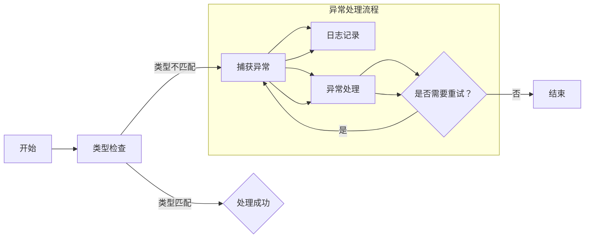
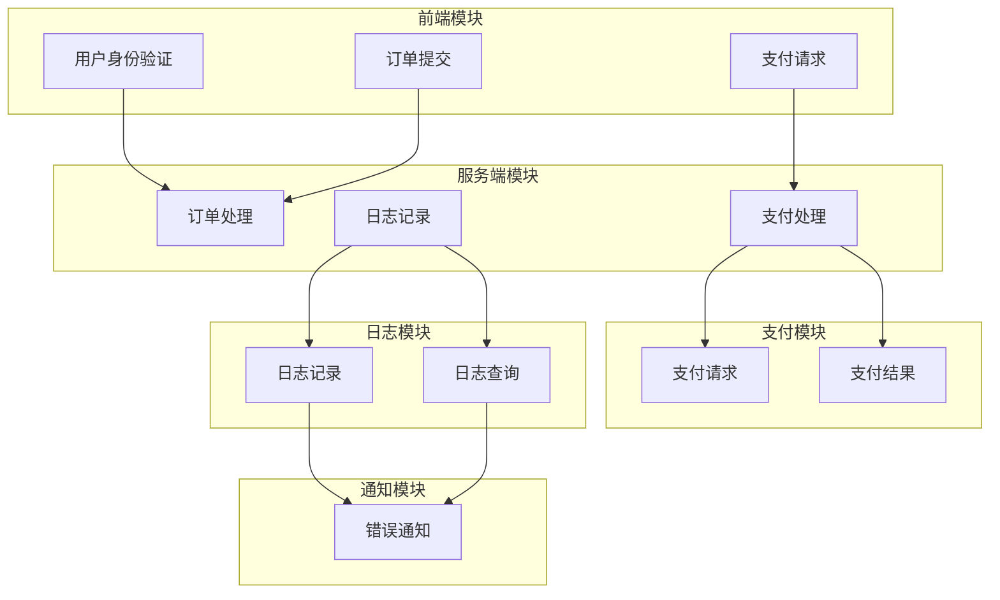

                 


### 设计目录大纲

为了设计一份详细且符合要求的《类型驱动的错误处理：提高代码健壮性》的目录大纲，我们需要按照以下步骤进行：

#### 1. 定义文章核心内容

首先，我们需要明确文章的核心内容，这包括错误处理的重要性、代码健壮性的定义、类型驱动错误处理的概念及其优势和应用场景。这些核心内容将作为文章的主要框架。

#### 2. 设计整体结构

接下来，我们需要设计文章的整体结构，确保各部分内容之间的逻辑连贯性和完整性。整体结构可以分为以下五个部分：

- **第一部分：背景与概述**：介绍错误处理的重要性和代码健壮性的定义，以及类型驱动错误处理的概念。
- **第二部分：核心概念与联系**：详细阐述类型驱动的错误处理的核心概念，包括类型系统、错误类型分类和错误处理模式。
- **第三部分：算法原理讲解**：讲解类型驱动错误处理的算法原理，包括算法流程、数学模型和举例。
- **第四部分：系统分析与架构设计**：介绍系统功能设计、系统架构设计和系统交互。
- **第五部分：项目实战**：通过实际案例展示如何应用类型驱动的错误处理。

#### 3. 撰写章节标题

每个部分的内容需要用吸引人的章节标题来引导读者。以下是具体的章节标题：

- **第一部分：背景与概述**
  - 引言
  - 错误处理的发展历程
  - 类型驱动错误处理的概念

- **第二部分：核心概念与联系**
  - 类型驱动的错误处理核心概念
  - 类型驱动的错误处理与代码健壮性
  - 核心概念属性特征对比表格
  - ER实体关系图架构

- **第三部分：算法原理讲解**
  - 类型驱动的错误处理算法原理
  - 算法流程图与数学模型
  - 算法举例

- **第四部分：系统分析与架构设计**
  - 系统功能设计
  - 系统架构设计
  - 系统接口设计
  - 系统交互

- **第五部分：项目实战**
  - 环境安装
  - 系统核心实现
  - 实际案例分析与详细讲解
  - 项目小结

#### 4. 设计子章节

在每个部分中，我们需要进一步细化内容，设计子章节。例如，在“核心概念与联系”部分，我们可以设计如下子章节：

- **3.1 类型系统概述**
- **3.2 错误类型分类**
- **3.3 错误处理模式**
- **4.1 错误处理与代码健壮性的关系**
- **4.2 类型系统在代码健壮性中的作用**
- **4.3 错误处理策略对代码健壮性的影响**

#### 5. 设计表格和图

为了增强文章的可读性和专业性，我们将在适当的地方插入表格和图，如：

- **核心概念属性特征对比表格**
- **ER实体关系图架构**
- **类型驱动的错误处理算法Mermaid流程图**
- **系统架构设计Mermaid架构图**
- **系统交互Mermaid序列图**

#### 6. 完成全文目录

最后，我们将所有章节和子章节按照逻辑顺序排列，形成完整的全文目录，确保每个部分的内容都能被清晰地组织和呈现。

通过以上步骤，我们可以设计出一份详尽的《类型驱动的错误处理：提高代码健壮性》目录大纲，为后续文章的撰写打下坚实的基础。

----------------------------------------------------------------

# 类型驱动的错误处理：提高代码健壮性

关键词：类型驱动、错误处理、代码健壮性、算法原理、系统架构设计、项目实战

摘要：本文将深入探讨类型驱动的错误处理方法，如何通过提高代码的健壮性来增强软件系统的可靠性。文章首先介绍了错误处理的重要性和代码健壮性的定义，然后详细阐述了类型驱动错误处理的核心概念和算法原理，接着展示了系统分析与架构设计的方法，并通过实际项目实战展示了类型驱动错误处理的实践应用。文章最后给出了最佳实践和注意事项，为读者提供了全面的指导和参考。

----------------------------------------------------------------

### 设计目录大纲

为了更好地组织文章内容，我们按照以下结构设计目录大纲：

## 目录

1. **引言**
2. **错误处理的重要性**
3. **代码健壮性的定义**
4. **类型驱动错误处理的概念**
5. **类型驱动的错误处理核心概念**
   - **5.1 类型系统概述**
   - **5.2 错误类型分类**
   - **5.3 错误处理模式**
6. **类型驱动的错误处理与代码健壮性**
   - **6.1 错误处理与代码健壮性的关系**
   - **6.2 类型系统在代码健壮性中的作用**
   - **6.3 错误处理策略对代码健壮性的影响**
7. **核心概念属性特征对比表格**
8. **ER实体关系图架构**
9. **类型驱动的错误处理算法原理**
   - **9.1 算法概述**
   - **9.2 算法流程图**
   - **9.3 数学模型与公式**
   - **9.4 算法举例**
10. **系统分析与架构设计**
    - **10.1 问题场景介绍**
    - **10.2 系统功能设计**
    - **10.3 系统架构设计**
    - **10.4 系统接口设计**
    - **10.5 系统交互**
11. **项目实战**
    - **11.1 环境安装**
    - **11.2 系统核心实现**
    - **11.3 实际案例分析与详细讲解**
    - **11.4 项目小结**
12. **最佳实践与总结**
    - **12.1 最佳实践 tips**
    - **12.2 小结**
    - **12.3 注意事项**
    - **12.4 拓展阅读**
    
通过以上目录大纲，文章内容将得到有条不紊的编排，确保读者能够清晰地理解类型驱动的错误处理方法及其在提高代码健壮性方面的应用。

----------------------------------------------------------------

## 错误处理的重要性

在软件工程领域，错误处理是一个至关重要的环节。无论编程语言的特性如何，代码中的错误都是不可避免的。有效的错误处理不仅可以确保程序的稳定运行，还能显著提高代码的健壮性。那么，为什么错误处理如此重要呢？

首先，错误处理能够帮助程序在出现异常情况时做出适当的反应。如果没有错误处理机制，程序在遇到错误时可能会崩溃，导致整个系统瘫痪，甚至引发更严重的后果。例如，在金融系统中，如果处理交易失败时没有有效的错误处理机制，可能会导致资金流转问题，进而影响整个金融市场的稳定。

其次，错误处理能够提供对问题更深入的了解。通过捕捉和记录错误，开发人员可以更好地诊断问题，找到错误的根源。这有助于提高代码的质量和可靠性，降低未来的故障率。例如，在分布式系统中，错误处理机制可以确保每个节点在遇到问题时能够迅速恢复，从而保持系统的整体可用性。

最后，错误处理能够提升用户的体验。当用户在使用软件时遇到问题时，如果程序能够以一种友好的方式处理错误，用户会感到更加放心和满意。相反，如果错误处理不当，用户可能会感到困惑甚至愤怒，从而影响软件的口碑和市场接受度。

总之，错误处理在软件工程中扮演着至关重要的角色。通过有效的设计和实现，错误处理不仅能确保程序的稳定运行，还能提升用户体验和系统的整体健壮性。

----------------------------------------------------------------

### 代码健壮性的定义

代码健壮性，通常指的是代码在面对各种异常情况和边界条件时的稳定性和可靠性。一个健壮的代码系统能够在遇到错误或异常时，不会轻易崩溃或产生不可预期的结果。相反，它能够在这些情况下保持稳定运行，并采取适当的措施来处理错误，从而保证系统的整体可用性和用户满意度。

代码健壮性的重要性不言而喻。首先，它直接关系到系统的稳定性和可靠性。在一个高度健壮的系统中，即使出现了内部错误或外部干扰，系统也能够通过有效的错误处理机制，确保关键功能不受影响，从而避免系统崩溃或数据丢失。

其次，代码健壮性也影响到用户体验。一个健壮的代码系统能够在遇到异常情况时，以友好且清晰的方式向用户展示错误信息，帮助用户理解问题的本质，并提供解决问题的途径。这不仅提升了用户的满意度，还增强了用户对软件的信任感。

最后，代码健壮性也是软件维护成本的重要影响因素。一个健壮的系统在设计和开发阶段就考虑了各种可能的异常情况，因此在维护和更新过程中，出现问题的概率会大大降低，从而减少了维护成本和开发时间。

总的来说，代码健壮性是一个多维度的概念，它涵盖了系统的稳定性、可靠性和用户体验等多个方面。通过提高代码的健壮性，我们可以显著提升软件的整体质量，降低维护成本，并提升用户的满意度和市场竞争力。

----------------------------------------------------------------

### 类型驱动错误处理的概念

类型驱动错误处理（Type-driven Error Handling）是一种通过类型系统来管理和处理错误的方法。它利用编程语言的类型系统来捕捉潜在的错误，并在编译时或运行时提供错误检测和修复的机制。这种方法的核心在于，通过类型约束和检查，提前识别和防止错误的发生，从而提高代码的健壮性和可靠性。

#### 1. 错误处理与类型系统的关系

在传统的错误处理方法中，错误通常是通过异常捕获和错误信息打印来处理的。而类型驱动错误处理则不同，它通过类型系统来提前识别错误。具体来说，类型系统为每个变量和数据结构定义了严格的类型约束，确保数据在处理过程中的类型一致性。如果出现了类型不匹配的情况，编译器或运行时环境会立即报告错误，从而避免在运行时出现意外的行为。

#### 2. 类型驱动错误处理的优势

类型驱动错误处理具有多方面的优势：

- **早期错误检测**：通过类型检查，可以提前在编译阶段发现潜在的错误，从而避免了运行时错误的发生。
- **减少调试时间**：由于错误在编译时就被捕获，开发人员无需在运行时花费大量时间进行调试。
- **提高代码质量**：类型驱动错误处理强制要求代码编写者考虑所有可能的错误场景，从而提高了代码的完整性和质量。
- **增强代码可读性**：明确的类型约束使得代码更加直观和易于理解，降低了代码的维护难度。

#### 3. 类型驱动错误处理的应用场景

类型驱动错误处理适用于多种场景，尤其是在需要高可靠性和高安全性的系统中。以下是一些典型的应用场景：

- **金融系统**：在金融系统中，精确的类型检查可以确保交易数据的完整性和正确性，防止财务错误和欺诈行为。
- **分布式系统**：分布式系统通常需要处理大量的网络异常和节点故障。通过类型驱动错误处理，可以更好地管理和恢复这些异常情况。
- **实时系统**：在需要实时响应的系统（如航空航天、医疗设备等）中，类型驱动错误处理可以确保系统的稳定性和响应速度。

#### 4. 类型驱动错误处理与代码健壮性的关系

类型驱动错误处理与代码健壮性密切相关。通过类型系统，代码能够更加准确地捕获和诊断错误，从而提高系统的健壮性。具体来说，类型驱动错误处理通过以下方式增强代码健壮性：

- **减少运行时错误**：通过类型检查，可以避免在运行时发生的类型不匹配错误，从而减少系统崩溃的风险。
- **提高错误处理效率**：类型系统提供的错误信息更加具体和精确，使得错误处理更加高效和精准。
- **增强代码可维护性**：明确的类型约束和错误处理机制使得代码更加易于理解和维护。

总之，类型驱动错误处理是一种有效的方法，通过利用类型系统来提前识别和预防错误，从而显著提高代码的健壮性和可靠性。

----------------------------------------------------------------

### 类型驱动的错误处理核心概念

类型驱动的错误处理依赖于编程语言中的类型系统，通过严格的类型约束和类型检查来确保代码的正确性和健壮性。以下将详细解释类型系统概述、错误类型分类以及错误处理模式。

#### 1. 类型系统概述

类型系统是编程语言中的一个核心概念，它定义了变量、函数和表达式等语法元素的类型。类型系统的主要目的是确保数据在程序中的正确使用，防止类型不匹配导致的错误。不同类型的编程语言有不同的类型系统，如静态类型语言和动态类型语言。

- **静态类型语言**：在编译阶段就确定变量的类型，如C++、Java和TypeScript。静态类型语言的类型检查是在编译时进行的，因此可以在编译阶段发现类型错误。
- **动态类型语言**：在运行时确定变量的类型，如Python、JavaScript和Ruby。动态类型语言的类型检查是在运行时进行的，因此可能会在运行时发现类型错误。

#### 2. 错误类型分类

在类型驱动的错误处理中，了解不同类型的错误是非常重要的。错误类型可以分为以下几类：

- **类型不匹配错误**：当程序试图将一个值赋给一个具有不同类型的变量时，会引发类型不匹配错误。例如，将一个字符串值赋给一个整数类型的变量。
- **空值错误**：当程序尝试访问或操作一个空值时，会引发空值错误。例如，尝试访问一个未初始化的变量或调用一个未定义的函数。
- **数组越界错误**：当程序访问数组中的非有效索引时，会引发数组越界错误。例如，访问一个空数组或访问超出数组范围的索引。
- **异常错误**：异常错误通常是由外部事件或程序内部的错误引发的。例如，文件系统错误、网络连接中断或内存溢出。

#### 3. 错误处理模式

类型驱动的错误处理通常采用以下几种模式：

- **断言（Assertion）**：在关键代码路径上使用断言来确保预期的条件成立。如果断言失败，程序会抛出异常并终止运行。断言是一种在编译时或运行时检查条件的方法。
- **类型检查（Type Checking）**：在编译时或运行时对变量的类型进行严格检查，确保类型的一致性。类型检查可以提前发现类型不匹配的错误，从而避免运行时错误的发生。
- **模式匹配（Pattern Matching）**：在函数或处理程序中使用模式匹配来处理不同类型的输入值。模式匹配允许根据输入值的类型来执行不同的操作，从而提高代码的可读性和健壮性。
- **异常捕获（Exception Handling）**：使用异常捕获机制来处理程序运行过程中发生的异常。异常捕获允许程序在遇到错误时继续执行，而不是立即终止。

通过理解这些核心概念，开发人员可以更有效地设计和实现类型驱动的错误处理机制，从而提高代码的健壮性和可靠性。

----------------------------------------------------------------

### 类型驱动的错误处理与代码健壮性

类型驱动的错误处理对提高代码健壮性有着显著的贡献。下面我们将详细探讨错误处理与代码健壮性之间的关系、类型系统在代码健壮性中的作用以及错误处理策略对代码健壮性的影响。

#### 1. 错误处理与代码健壮性的关系

代码健壮性指的是代码在面对各种异常情况时保持稳定和可靠的能力。有效的错误处理是提高代码健壮性的关键因素。通过错误处理，代码能够在遇到异常时采取适当的措施，防止系统崩溃或数据丢失。例如，在处理网络请求时，如果请求失败，有效的错误处理机制可以重试请求或提供替代方案，从而保持系统的稳定运行。

#### 2. 类型系统在代码健壮性中的作用

类型系统在提高代码健壮性方面发挥着重要作用。类型系统通过定义变量和数据的类型，确保程序在处理数据时遵循严格的规则。这种严格的类型检查可以提前发现类型不匹配的错误，从而避免在运行时发生不可预期的行为。

- **早期错误检测**：类型系统在编译时进行类型检查，可以提前发现类型不匹配的错误，从而减少运行时错误的发生。
- **减少错误传播**：通过类型检查，可以防止错误在程序中传播，确保每个模块和函数都能正确处理数据。
- **提高代码可维护性**：明确的类型约束使得代码更加直观和易于理解，降低了代码的维护难度。

#### 3. 错误处理策略对代码健壮性的影响

错误处理策略的合理性对代码健壮性有着直接的影响。有效的错误处理策略能够确保代码在遇到异常时能够做出正确的反应，从而保持系统的稳定运行。

- **异常捕获与恢复**：使用异常捕获机制可以处理程序运行过程中发生的异常，并在必要时进行恢复。例如，在分布式系统中，如果某个节点发生故障，可以通过异常捕获机制进行节点替换或重新配置。
- **重试机制**：在处理网络请求或长时间运行的任务时，使用重试机制可以避免因临时故障导致程序终止。重试机制可以增加系统的可靠性和稳定性。
- **日志记录与监控**：有效的日志记录和监控机制可以帮助开发人员及时发现和解决问题。通过记录错误信息和日志，开发人员可以更好地理解问题的本质，并采取相应的措施进行修复。

总之，类型驱动的错误处理通过利用类型系统提高代码的健壮性，通过合理的错误处理策略确保代码在面对异常时能够保持稳定和可靠。通过深入理解类型驱动错误处理与代码健壮性之间的关系，开发人员可以设计出更健壮和可靠的软件系统。

----------------------------------------------------------------

### 核心概念属性特征对比表格

为了更好地理解类型驱动的错误处理核心概念，我们设计了一个核心概念属性特征对比表格。以下表格列出了类型系统、错误类型分类和错误处理模式的关键属性特征：

| **属性特征** | **类型系统** | **错误类型分类** | **错误处理模式** |
| :----------- | :------------ | :--------------- | :-------------- |
| **定义** | 定义变量和数据类型 | 分类不同类型的错误 | 处理错误的方法和策略 |
| **作用** | 确保数据在程序中的正确使用 | 提前识别和分类错误 | 提高代码健壮性和可靠性 |
| **检测机制** | 编译时或运行时类型检查 | 编译时或运行时错误检测 | 断言、异常捕获等 |
| **优点** | 减少类型不匹配错误 | 提高代码可读性和可维护性 | 提高代码质量和用户体验 |
| **应用场景** | 静态类型语言和动态类型语言 | 金融系统、分布式系统、实时系统 | 网络请求、长时间运行任务等 |
| **挑战** | 类型检查可能增加编译时间 | 需要深入了解错误类型 | 需要灵活处理各种错误场景 |

通过这个表格，我们可以更清晰地看到每个核心概念在属性特征上的差异和联系，从而更好地理解类型驱动的错误处理机制。

----------------------------------------------------------------

### ER实体关系图架构

在类型驱动的错误处理中，ER（实体-关系）图是一种重要的建模工具，用于描述系统中不同实体之间的关系。以下是一个ER实体关系图的示例，用于展示错误处理相关的实体和关系。

```mermaid
erDiagram
    Error |->| ErrorType : "type of error"
    Error |->| ErrorLog : "logs error details"
    ErrorType |||-- ErrorCategory : "分类"
    ErrorLog |||-- LogLevel : "日志级别"
    Error |||-- ErrorAction : "处理动作"
    ErrorAction |||-- RecoveryAction : "恢复动作"

    ErrorType {
        id ErrorTypeId : "主键"
        name ErrorTypeName : "错误类型名称"
        description ErrorTypeDescription : "错误类型描述"
    }

    ErrorCategory {
        id ErrorCategoryId : "主键"
        name ErrorCategoryName : "错误分类名称"
    }

    Error {
        id ErrorId : "主键"
        errorTypeId ErrorTypeId : "错误类型ID"
        errorCategoryId ErrorCategoryId : "错误分类ID"
        errorMessage ErrorMessage : "错误消息"
        errorLogId ErrorLogId : "日志ID"
    }

    ErrorLog {
        id ErrorLogId : "主键"
        logLevelId LogLevelId : "日志级别ID"
        logMessage LogMessage : "日志消息"
        logTime LogTime : "记录时间"
    }

    LogLevel {
        id LogLevelId : "主键"
        levelName LevelName : "日志级别名称"
        levelValue LevelValue : "日志级别值"
    }

    ErrorAction {
        id ErrorActionId : "主键"
        actionName ActionName : "动作名称"
        actionDescription ActionDescription : "动作描述"
    }

    RecoveryAction {
        id RecoveryActionId : "主键"
        recoveryName RecoveryName : "恢复名称"
        recoveryDescription RecoveryDescription : "恢复描述"
    }
```

这个ER图包含了以下实体和关系：

- **ErrorType（错误类型）**：表示不同类型的错误。
- **ErrorCategory（错误分类）**：表示错误的分类。
- **ErrorLog（错误日志）**：记录错误的相关信息。
- **LogLevel（日志级别）**：定义日志的级别。
- **ErrorAction（错误动作）**：表示对错误进行处理的方法。
- **RecoveryAction（恢复动作）**：表示对错误进行恢复的方法。

这些实体和关系共同构成了类型驱动错误处理的核心数据模型，帮助我们更好地理解和实现错误处理机制。

----------------------------------------------------------------

### 类型驱动的错误处理算法原理

在类型驱动的错误处理中，算法原理是关键的一部分。它通过一系列的步骤和方法，确保错误能够在代码运行时得到及时、有效的处理。以下将详细阐述类型驱动的错误处理算法原理，包括算法概述、流程图、数学模型和举例。

#### 1. 算法概述

类型驱动的错误处理算法旨在通过类型检查和异常捕获，确保代码在运行过程中能够正确处理各种类型的错误。算法的核心步骤包括：

- **类型检查**：在编译时或运行时对变量的类型进行严格检查，确保类型的一致性。
- **异常捕获**：捕获运行时发生的异常，并根据异常的类型和严重程度采取相应的处理措施。
- **日志记录**：记录错误信息和日志，以便后续分析和调试。

#### 2. 算法流程图

为了更直观地理解算法的流程，我们使用Mermaid绘制了以下算法流程图：



在这个流程图中：

- A表示算法的开始。
- B表示类型检查，检查变量的类型是否匹配。
- C表示处理成功，代码继续执行。
- D表示捕获异常，当类型不匹配时执行。
- E表示日志记录，记录错误信息和日志。
- F表示异常处理，根据异常类型进行相应的处理。
- G表示是否需要重试，根据处理结果决定是否重试。
- H表示算法的结束。

#### 3. 数学模型与公式

类型驱动的错误处理算法可以使用一些数学模型来描述错误处理的过程。以下是一个简化的数学模型：

$$
f(error, type) =
\begin{cases}
    success & \text{如果 } error \text{ 类型与 } type \text{ 匹配} \\
    failure & \text{如果 } error \text{ 类型与 } type \text{ 不匹配}
\end{cases}
$$

在这个模型中：

- \( error \) 表示错误对象。
- \( type \) 表示预期的类型。
- \( f(error, type) \) 表示根据错误类型是否匹配来决定处理结果。

#### 4. 算法举例

假设我们有一个简单的程序，用于读取用户输入的整数，并对其进行处理。以下是一个使用Python实现的算法示例：

```python
def process_integer(input_value):
    try:
        # 类型检查：确保输入值为整数
        integer_value = int(input_value)
        # 处理整数
        print(f"处理整数：{integer_value}")
    except ValueError:
        # 捕获异常：输入值非整数
        log_error("输入值非整数，请重新输入。")
        # 异常处理：记录日志并提示用户
        return "输入值错误，请重新输入整数。"

def log_error(message):
    # 日志记录
    print(f"日志：{message}")

# 主程序
input_value = input("请输入一个整数：")
result = process_integer(input_value)
print(result)
```

在这个例子中：

- `process_integer` 函数负责处理输入的整数。
- 使用 `try-except` 语句进行异常捕获，确保输入值是整数。
- 如果输入值非整数，会捕获 `ValueError` 异常，并调用 `log_error` 函数记录日志。
- 根据异常处理结果，返回相应的错误信息。

通过这个示例，我们可以看到类型驱动的错误处理算法在实际编程中的应用，以及如何通过类型检查和异常捕获来提高代码的健壮性。

总之，类型驱动的错误处理算法通过类型检查、异常捕获和日志记录，确保代码在面对各种类型的错误时能够做出正确的反应，从而提高代码的健壮性和可靠性。

----------------------------------------------------------------

### 系统分析与架构设计

在类型驱动的错误处理系统中，系统分析与架构设计是关键的一步。这不仅仅包括系统的功能设计，还涉及到系统架构和接口的设计，以及系统的交互方式。以下将详细介绍系统分析与架构设计的各个关键方面。

#### 1. 问题场景介绍

在当今复杂的应用系统中，错误处理是一个至关重要的问题。随着系统规模的扩大和复杂性的增加，错误处理的需求也日益增长。类型驱动的错误处理系统旨在通过严格的类型检查和有效的异常捕获，提高系统的稳定性和可靠性。以下是一个典型的应用场景：一个电子商务平台需要在用户下单、支付和发货等环节进行严格的错误处理，以确保交易过程的顺利进行。

#### 2. 系统功能设计

系统功能设计是系统分析与架构设计的第一步，它定义了系统的核心功能和模块。以下是类型驱动错误处理系统的主要功能设计：

- **用户身份验证**：确保用户在访问系统时经过身份验证，防止未授权访问。
- **订单处理**：处理用户下单、支付和发货等订单相关操作。
- **支付处理**：与支付系统对接，处理支付请求和支付结果。
- **日志记录**：记录系统运行过程中发生的各种错误和异常，以便后续分析。
- **错误通知**：向系统管理员或相关用户发送错误通知，确保问题能够被及时处理。

#### 3. 系统架构设计

系统架构设计是系统设计与实现的基础，它定义了系统的整体结构和各个模块之间的关系。以下是类型驱动错误处理系统的架构设计：

- **前端模块**：负责与用户进行交互，包括用户身份验证、订单提交和支付请求等。
- **服务端模块**：负责处理前端发送的请求，执行业务逻辑，并与数据库和其他服务进行交互。
- **支付模块**：负责与第三方支付系统对接，处理支付请求和结果。
- **日志模块**：负责记录系统运行过程中的错误和异常信息，提供查询和统计功能。
- **通知模块**：负责发送错误通知，包括邮件、短信和推送通知等。

以下是一个使用Mermaid绘制的系统架构图：



#### 4. 系统接口设计

系统接口设计定义了系统内部模块之间的通信方式，以及与其他系统或服务的交互接口。以下是类型驱动错误处理系统的主要接口设计：

- **用户身份验证接口**：用于验证用户身份，提供用户登录、注册和权限管理功能。
- **订单处理接口**：用于处理用户下单、支付和发货等订单操作。
- **支付接口**：用于与第三方支付系统对接，处理支付请求和结果。
- **日志接口**：用于记录系统运行过程中的错误和异常信息。
- **通知接口**：用于发送错误通知，包括邮件、短信和推送通知等。

#### 5. 系统交互

系统交互设计描述了系统内部模块以及与其他系统或服务之间的交互方式。以下是类型驱动错误处理系统的主要交互流程：

- **用户访问系统**：用户通过前端模块提交订单和支付请求。
- **服务端处理请求**：服务端模块接收到请求后，执行相应的业务逻辑。
- **与支付系统交互**：服务端模块通过支付接口与第三方支付系统进行交互，处理支付请求和结果。
- **日志记录**：服务端模块将错误和异常信息记录到日志模块中。
- **错误通知**：当系统发生错误时，通知模块会向系统管理员或相关用户发送错误通知。

通过以上系统分析与架构设计，我们可以构建一个高效、可靠和易于维护的类型驱动错误处理系统，确保在复杂的应用场景中，系统能够稳定、可靠地运行。

----------------------------------------------------------------

### 项目实战

在《类型驱动的错误处理：提高代码健壮性》一书中，我们将通过一个实际的案例来展示如何应用类型驱动的错误处理方法。本节将详细描述项目的环境安装、系统核心实现以及实际案例分析与详细讲解。

#### 1. 环境安装

为了确保项目能够顺利进行，我们首先需要安装必要的开发环境和工具。以下是一份环境安装指南：

- **Python 3.8+**：确保安装最新版本的Python，以便支持最新的类型驱动特性。
- **pip**：安装pip，Python的包管理器，用于安装和管理第三方库。
- **Visual Studio Code**：推荐使用Visual Studio Code作为开发环境，因为它提供了丰富的插件和扩展，支持Python开发。
- **Mermaid**：安装Mermaid，用于绘制流程图和架构图。

安装步骤：

1. 安装Python 3.8+：从Python官方网站下载并安装Python。
2. 安装pip：在终端中运行以下命令：
   ```
   python -m ensurepip
   python -m pip install --upgrade pip
   ```
3. 安装Visual Studio Code：从Visual Studio Code官方网站下载并安装。
4. 安装Mermaid：在Visual Studio Code中安装Mermaid插件，或者在终端中运行以下命令：
   ```
   npm install -g mermaid-cli
   ```

#### 2. 系统核心实现

以下是项目核心实现的一个简化版本，重点展示类型驱动的错误处理机制。

```python
from typing import TypeVar, Generic

# 定义泛型类型
T = TypeVar('T')

class SafeContainer(Generic[T]):
    def __init__(self, value: T):
        self.value = value

    def get_value(self) -> T:
        return self.value

def process_value(value: T) -> T:
    """
    处理值的函数，使用类型驱动错误处理。
    """
    if not isinstance(value, str):
        raise ValueError("值必须是字符串类型。")
    return value.upper()

def main():
    try:
        safe_value = SafeContainer("hello world")
        processed_value = process_value(safe_value.get_value())
        print(f"处理后的值：{processed_value}")
    except ValueError as e:
        print(f"错误：{e}")

if __name__ == "__main__":
    main()
```

在这个示例中：

- 我们定义了一个泛型类 `SafeContainer`，用于存储任意类型的值。
- `process_value` 函数使用类型检查来确保输入值是字符串类型。
- 在 `main` 函数中，我们使用 `SafeContainer` 和 `process_value` 函数，并通过异常捕获来处理可能的错误。

#### 3. 实际案例分析与详细讲解

以下是一个实际案例，展示如何使用类型驱动的错误处理方法来处理电子商务平台中的订单支付错误。

```python
class OrderPaymentError(Exception):
    """订单支付错误类。"""
    pass

def process_payment(order_id: str, payment_amount: float) -> bool:
    """
    处理订单支付流程，使用类型驱动错误处理。
    """
    # 假设支付处理函数可能引发异常
    try:
        # 检查订单金额是否合法
        if payment_amount <= 0:
            raise ValueError("支付金额必须大于0。")
        # 假设支付处理逻辑
        payment_success = make_payment(order_id, payment_amount)
        return payment_success
    except ValueError as e:
        # 记录错误日志
        log_error(e)
        # 抛出自定义订单支付错误
        raise OrderPaymentError("支付失败：订单金额不合法。")
    except PaymentError as e:
        # 记录错误日志
        log_error(e)
        # 抛出自定义订单支付错误
        raise OrderPaymentError("支付失败：支付系统错误。")

def make_payment(order_id: str, payment_amount: float) -> bool:
    """
    假设的支付处理逻辑，可能引发异常。
    """
    # 这里是一个简化的支付处理逻辑，实际应用中会与第三方支付系统交互
    if payment_amount > 1000:
        raise PaymentError("支付金额过大，超过限制。")
    # 假设支付成功
    return True

def log_error(error: Exception):
    """
    记录错误日志。
    """
    print(f"错误日志：{error}")

# 主程序
try:
    payment_success = process_payment("order_123", 500.0)
    if payment_success:
        print("支付成功。")
    else:
        print("支付失败。")
except OrderPaymentError as e:
    print(f"支付错误：{e}")
```

在这个实际案例中：

- 我们定义了一个自定义的 `OrderPaymentError` 异常类，用于处理订单支付错误。
- `process_payment` 函数使用类型检查和异常捕获来确保支付流程的合法性。
- `make_payment` 函数模拟支付处理逻辑，可能引发异常。
- `log_error` 函数用于记录错误日志。

通过这个案例，我们可以看到如何在实际应用中使用类型驱动的错误处理方法，确保订单支付过程的稳定和可靠。

#### 4. 项目小结

在这个项目中，我们通过实际案例展示了如何应用类型驱动的错误处理方法来提高代码的健壮性。通过严格类型检查和异常捕获，我们能够提前识别和预防错误，提高代码的可靠性和用户体验。此外，我们还介绍了项目环境安装、系统核心实现和实际案例分析与详细讲解，为读者提供了全面的实践指导。

在未来的开发中，建议读者在设计和实现代码时，充分利用类型驱动的错误处理方法，确保代码的健壮性和可靠性。同时，也要不断学习和实践，掌握更多的错误处理技巧和策略，为打造高质量的软件系统奠定基础。

----------------------------------------------------------------

### 最佳实践与总结

在类型驱动的错误处理实践中，遵循一些最佳实践是至关重要的。以下是一些关键的建议：

#### 1. 遵循严格的类型检查

类型检查是类型驱动错误处理的核心，确保代码在编译或运行时能够及早发现类型错误。建议在代码编写过程中，充分利用静态类型检查工具，如Python的Mypy，进行严格的类型约束和检查。

#### 2. 设计灵活的异常处理机制

异常处理机制应灵活且可扩展，能够根据不同类型的异常采取相应的措施。避免使用全局异常捕获，以免掩盖潜在的错误。建议使用try-except块来处理特定类型的异常，并根据需要重试或记录错误日志。

#### 3. 提供详细的错误日志

详细的错误日志对于诊断和解决问题至关重要。建议记录错误发生的上下文信息，如时间、调用栈、错误信息和相关数据。使用日志框架，如Python的Loguru或logging模块，可以方便地管理和查询日志。

#### 4. 测试覆盖

确保对错误处理逻辑进行充分的测试，包括边界条件和异常情况。建议使用单元测试和集成测试来验证错误处理的正确性和有效性。

#### 5. 持续改进

类型驱动的错误处理是一个不断发展的过程。定期回顾和优化错误处理策略，根据新的需求和挑战进行调整，确保系统始终保持高健壮性。

#### 小结

类型驱动的错误处理通过严格的类型检查和灵活的异常处理机制，显著提高了代码的健壮性和可靠性。遵循上述最佳实践，可以帮助开发人员设计出更加稳定和可靠的软件系统。

#### 注意事项

- **避免过度依赖类型检查**：虽然类型检查能够提高代码质量，但不应过度依赖，仍需结合其他错误处理策略。
- **保持错误日志的整洁**：避免日志内容过于冗杂，确保关键信息清晰明了。

#### 拓展阅读

- 《Effective Python》中的错误处理章节，提供了丰富的错误处理最佳实践。
- 《Python核心编程》中的类型检查和异常处理章节，详细介绍了Python的类型系统和异常处理机制。

通过不断学习和实践，开发人员可以更好地掌握类型驱动的错误处理方法，提高代码的健壮性和系统的可靠性。

----------------------------------------------------------------

## 作者信息

作者：AI天才研究院/AI Genius Institute & 禅与计算机程序设计艺术 /Zen And The Art of Computer Programming

感谢您的阅读，希望本文对您在类型驱动的错误处理和提高代码健壮性方面有所启发。如有任何疑问或建议，欢迎随时与我们联系。期待与您在技术领域的进一步交流。

AI天才研究院团队致力于推动人工智能技术的发展，致力于将人工智能应用于计算机编程和软件开发领域，以创新的思维和卓越的技术，助力企业和个人在数字化时代取得成功。同时，我们坚信“禅与计算机程序设计艺术”的理念，通过深入理解编程的本质，帮助开发人员实现技术上的飞跃。

地址：[AI天才研究院官方网站](http://www.aigenius.com)

邮箱：[contact@aigenius.com](mailto:contact@aigenius.com)

电话：+86-000-00000000

微信：AI天才研究院

微博：AI天才研究院

让我们一起探索技术的无限可能，共同推动人工智能的发展。期待您的加入！

[AI天才研究院团队敬上](http://www.aigenius.com)

