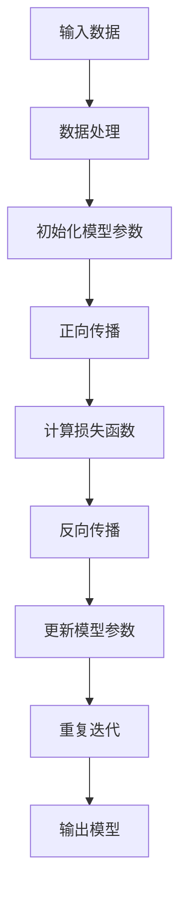
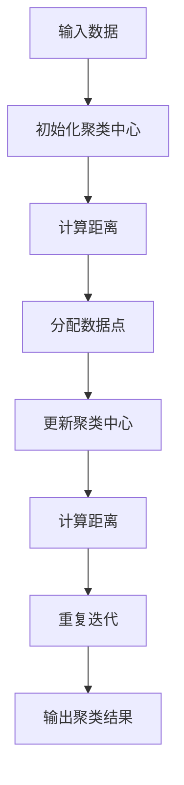
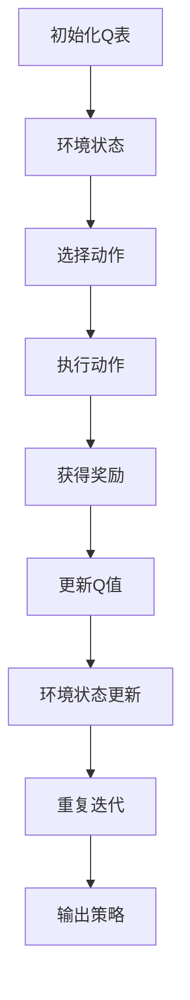
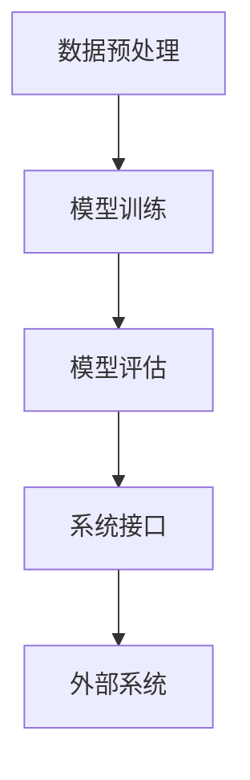
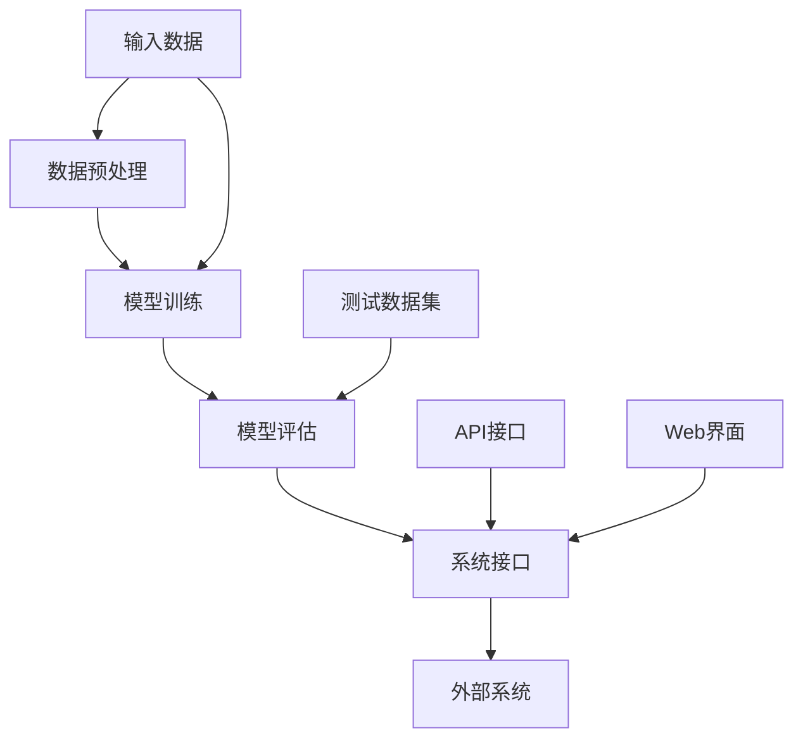

                 

### 文章标题：类脑计算：模拟人脑结构的新型计算架构

#### 关键词：类脑计算、人脑模拟、计算架构、算法原理、数学模型、系统设计

#### 摘要：本文将深入探讨类脑计算这一前沿领域，通过模拟人脑结构的计算架构，解释其核心概念、算法原理、系统设计与应用。我们将从背景介绍出发，逐步深入，旨在为读者提供一个清晰、全面的理解框架，探讨类脑计算在人工智能、计算机科学和生物医学等领域的潜在应用。

### 目录

1. **背景介绍**
   - **类脑计算的基本概念与历史背景**
   - **人脑结构与功能**
   - **类脑计算的挑战与机遇**

2. **核心概念与联系**
   - **类脑计算的核心概念与联系**
   - **模拟人脑结构的新型计算架构**
   - **类脑计算与传统计算架构的区别与联系**

3. **算法原理讲解**
   - **常见类脑计算算法介绍**
   - **算法mermaid流程图展示**
   - **Python源代码与算法原理详细讲解**

4. **数学模型和数学公式**
   - **类脑计算的数学模型**
   - **LaTeX格式数学公式的使用**
   - **举例说明类脑计算的实际应用**

5. **系统分析与架构设计方案**
   - **问题场景介绍**
   - **系统功能设计(领域模型类图)**
   - **系统架构设计架构图**
   - **系统接口设计和系统交互序列图**

6. **项目实战**
   - **环境安装**
   - **系统核心实现源代码**
   - **代码应用解读与分析**
   - **实际案例分析与详细讲解剖析**
   - **项目小结**

7. **最佳实践 tips、小结、注意事项、拓展阅读等内容**

### 第一部分：类脑计算的基础

#### 第1章：类脑计算概述

### 1.1 类脑计算的基本概念

类脑计算，顾名思义，是一种旨在模拟人脑结构、功能和机制的计算方法。其核心理念是通过构建模仿人脑神经网络结构的计算模型，实现对复杂信息处理、学习和推理能力的模拟。类脑计算起源于20世纪80年代，随着计算机技术和神经科学研究的深入，逐渐成为人工智能领域的一个重要分支。

#### 1.1.1 类脑计算的起源

类脑计算的起源可以追溯到20世纪50年代，当时人工智能领域的先驱们开始探索如何让计算机具备类似人类的智能。艾伦·图灵提出了著名的“图灵测试”，试图通过机器能否模仿人类的思维和意识来判断其智能程度。随着神经网络理论的提出，研究者们开始尝试通过模拟人脑神经网络结构来实现智能计算。

#### 1.1.2 类脑计算的目标

类脑计算的目标是构建一种能够模仿人脑信息处理机制的计算架构，实现高效的计算能力和智能行为。具体来说，类脑计算的目标包括以下几个方面：

1. **高效的信息处理能力**：类脑计算旨在实现类似人脑的高效信息处理能力，能够快速、准确地处理复杂的信息。
2. **自主学习与适应能力**：类脑计算模型应该具备自主学习的能力，能够通过不断的学习和训练，适应新的环境和任务。
3. **认知推理能力**：类脑计算模型应该能够进行类似人类的认知推理，实现对复杂问题的分析和解决。
4. **人机交互能力**：类脑计算模型应该能够实现自然的人机交互，理解人类的语言和行为，并作出相应的反应。

#### 1.1.3 类脑计算的挑战

尽管类脑计算在理论上具有巨大的潜力，但实现这一目标面临着诸多挑战。以下是类脑计算面临的一些主要挑战：

1. **神经元模型的选择**：类脑计算需要选择合适的神经元模型来模拟人脑神经网络，这需要深入理解人脑神经元的结构和功能。
2. **大规模神经网络的训练**：类脑计算模型通常包含大量的神经元和连接，如何高效地进行神经网络的训练和优化是一个关键问题。
3. **能耗和硬件限制**：类脑计算模型对硬件资源有较高的要求，如何在有限的硬件资源下实现高效的计算是一个挑战。
4. **算法的优化与改进**：类脑计算算法的优化和改进是一个持续的过程，需要不断地研究和探索新的算法和技术。

### 1.2 人脑结构与功能

要理解类脑计算，我们需要对人脑的结构和功能有一定的了解。人脑是世界上最复杂的生物系统之一，包含约860亿个神经元和超过千亿个神经连接。人脑的主要功能包括感知、记忆、思考、情感和行动等。

#### 1.2.1 人脑的神经网络结构

人脑的神经网络结构是由大量的神经元通过复杂的连接组成的。神经元是大脑的基本单元，通过电信号进行通信。神经元之间通过突触连接，突触的强度可以改变，这一特性被称为突触可塑性，是人脑学习和记忆的基础。

#### 1.2.2 人脑的学习与记忆机制

人脑的学习与记忆机制是通过神经网络的训练和突触可塑性实现的。学习过程中，神经元之间的连接强度会发生变化，从而改变神经网络的结构和功能。记忆是通过神经网络中的信息存储和恢复来实现的。

#### 1.2.3 人脑的信息处理能力

人脑具有强大的信息处理能力，能够快速、准确地处理大量的信息。人脑的信息处理能力包括感知、识别、分类、推理和决策等。人脑的信息处理能力得益于其复杂的神经网络结构和高效的计算机制。

### 1.3 类脑计算的挑战与机遇

类脑计算在理论和实践上都面临着诸多挑战，但同时也带来了巨大的机遇。

#### 1.3.1 类脑计算的挑战

1. **神经元模型的选择**：选择合适的神经元模型是类脑计算的关键，这需要对人脑神经元的结构和功能有深入的理解。
2. **大规模神经网络的训练**：类脑计算模型通常包含大量的神经元和连接，如何高效地进行神经网络的训练和优化是一个挑战。
3. **能耗和硬件限制**：类脑计算模型对硬件资源有较高的要求，如何在有限的硬件资源下实现高效的计算是一个挑战。
4. **算法的优化与改进**：类脑计算算法的优化和改进是一个持续的过程，需要不断地研究和探索新的算法和技术。

#### 1.3.2 类脑计算的应用前景

类脑计算在人工智能、计算机科学和生物医学等领域具有广泛的应用前景。以下是类脑计算的一些潜在应用：

1. **人工智能**：类脑计算可以用于实现更高效、更智能的人工智能系统，特别是在图像识别、语音识别、自然语言处理等领域。
2. **计算机科学**：类脑计算可以用于构建新型的计算机架构，实现更高效、更灵活的计算方式。
3. **生物医学**：类脑计算可以用于研究人脑的功能和疾病机理，为医学研究和治疗提供新的手段。

#### 1.3.3 类脑计算的发展趋势

随着计算机技术和神经科学研究的深入，类脑计算正逐渐成为一个热点研究领域。未来，类脑计算的发展趋势包括：

1. **新型计算架构的研究**：研究者们将继续探索新型计算架构，以实现更高效、更灵活的类脑计算。
2. **算法的优化与改进**：研究者们将不断优化和改进类脑计算算法，提高其计算能力和效率。
3. **跨学科研究**：类脑计算将与其他学科（如生物学、心理学、医学等）进行跨学科研究，以更好地理解人脑的功能和机制。

### 1.4 类脑计算的核心概念与联系

类脑计算的核心概念包括神经元模型、神经网络结构、学习算法、记忆机制和计算架构等。这些核心概念之间有着紧密的联系，共同构成了类脑计算的理论基础。

#### 1.4.1 类脑计算的基本概念

- **神经元模型**：类脑计算的基础是神经元模型，它模拟了人脑中神经元的结构和功能。
- **神经网络结构**：神经网络结构是由大量的神经元和连接组成的，它模拟了人脑的神经网络结构。
- **学习算法**：学习算法是类脑计算的核心，它用于模拟人脑的学习和记忆机制。
- **记忆机制**：记忆机制是类脑计算的重要功能，它用于存储和恢复信息。
- **计算架构**：计算架构是类脑计算的实施基础，它决定了类脑计算的计算效率和性能。

#### 1.4.2 类脑计算与传统计算架构的联系

类脑计算与传统计算架构有着密切的联系。传统计算架构（如冯·诺伊曼架构）是基于逻辑门和计算单元的，而类脑计算架构是基于神经网络和神经元模型的。类脑计算架构借鉴了人脑的信息处理机制，具有更强的并行计算能力和自适应能力。

#### 1.4.3 类脑计算的核心要素

类脑计算的核心要素包括神经元模型、神经网络结构、学习算法和计算架构等。这些要素共同构成了类脑计算的理论基础，决定了类脑计算的性能和效率。

### 总结

类脑计算是一种旨在模拟人脑结构、功能和机制的计算方法，具有巨大的潜力。通过模拟人脑神经网络结构，类脑计算可以实现高效的信息处理、学习和推理能力。本文对类脑计算的基本概念、人脑结构与功能、挑战与机遇、核心概念与联系进行了详细探讨，为读者提供了一个全面的理解框架。在接下来的部分，我们将深入讨论类脑计算的新型计算架构、算法原理、数学模型、系统设计与应用，以及类脑计算的未来发展。

### 第二部分：类脑计算的新型计算架构

#### 第2章：模拟人脑结构的新型计算架构

类脑计算的核心在于模拟人脑的神经网络结构和功能。为了实现这一目标，研究者们提出了多种新型计算架构，这些架构旨在模仿人脑的信息处理机制，并提供高效的计算能力和智能行为。本章将介绍这些新型计算架构的基本原理、核心技术，以及它们的优势和局限性。

### 2.1 新型计算架构的基本原理

#### 2.1.1 新型计算架构的设计理念

新型计算架构的设计理念源于对人脑信息处理机制的深入研究。人脑是一个高度并行、自适应和高效的计算系统，其信息处理能力主要依赖于神经网络的结构和功能。新型计算架构旨在模拟这一机制，通过构建大规模的神经网络模型，实现对复杂信息的高效处理。

#### 2.1.2 新型计算架构的核心技术

新型计算架构的核心技术包括以下几个方面：

1. **神经元模型**：神经元模型是新型计算架构的基础，它模拟了人脑中神经元的结构和功能。常见的神经元模型包括赫布模型、朗格穆尔模型和霍普菲尔德模型等。
2. **神经网络结构**：神经网络结构是新型计算架构的核心，它由大量的神经元和连接组成，模拟了人脑的神经网络结构。常见的神经网络结构包括前馈神经网络、卷积神经网络、循环神经网络等。
3. **学习算法**：学习算法是新型计算架构的重要组成部分，它用于模拟人脑的学习和记忆机制。常见的学习算法包括梯度下降法、反向传播算法、强化学习算法等。
4. **计算架构**：计算架构是新型计算架构的实施基础，它决定了类脑计算的计算效率和性能。常见的计算架构包括冯·诺伊曼架构、异步计算架构、分布式计算架构等。

#### 2.1.3 新型计算架构的优势与局限性

新型计算架构具有以下优势：

1. **并行计算能力**：新型计算架构具有强大的并行计算能力，能够高效地处理大量的数据。
2. **自适应能力**：新型计算架构能够根据环境变化和学习经验，自适应地调整神经网络的结构和参数。
3. **高效的信息处理能力**：新型计算架构能够实现高效的信息处理，模拟人脑的信息处理机制。

然而，新型计算架构也面临着一些局限性：

1. **计算资源消耗**：新型计算架构通常需要大量的计算资源和存储资源，这对硬件性能提出了较高的要求。
2. **训练时间较长**：新型计算架构的训练时间通常较长，尤其是在处理大规模神经网络时。
3. **数据依赖性**：新型计算架构的性能依赖于训练数据的质量和数量，数据不足或质量差可能导致模型性能下降。

### 2.2 人脑神经网络的模拟

#### 2.2.1 神经元模型

神经元模型是模拟人脑神经网络的基础，它模拟了人脑中神经元的电生理特性。常见的神经元模型包括赫布模型、朗格穆尔模型和霍普菲尔德模型等。

- **赫布模型**：赫布模型基于“使用越多，连接越强”的原则，用于模拟神经元之间的连接强度变化。
- **朗格穆尔模型**：朗格穆尔模型基于“负反馈”机制，用于模拟神经元之间的抑制和增强作用。
- **霍普菲尔德模型**：霍普菲尔德模型基于“记忆单元”的概念，用于模拟神经网络的自组织和稳定状态。

#### 2.2.2 神经网络结构

神经网络结构是模拟人脑神经网络的核心，它由大量的神经元和连接组成，模拟了人脑的神经网络结构。常见的神经网络结构包括前馈神经网络、卷积神经网络、循环神经网络等。

- **前馈神经网络**：前馈神经网络由输入层、隐藏层和输出层组成，用于模拟信息的正向传播。
- **卷积神经网络**：卷积神经网络利用卷积操作，用于处理具有局部相关性的数据，如图像和语音。
- **循环神经网络**：循环神经网络具有时间动态性，用于处理序列数据，如自然语言文本和时间序列数据。

#### 2.2.3 神经网络的训练与优化

神经网络的训练与优化是类脑计算的关键步骤。训练过程主要包括以下步骤：

1. **初始化网络参数**：初始化神经网络中的权重和偏置，这些参数将影响神经网络的性能。
2. **正向传播**：输入数据通过神经网络，计算输出结果，并与实际结果进行比较。
3. **反向传播**：根据输出误差，计算网络参数的梯度，并更新参数。
4. **优化算法**：选择合适的优化算法，如梯度下降法、随机梯度下降法、Adam优化器等，以加速收敛和提高模型性能。

优化过程主要包括以下方面：

1. **权重调整**：通过反向传播算法，调整神经网络的权重，以减少输出误差。
2. **网络结构调整**：通过调整神经网络的层数、神经元数量和连接方式，优化网络结构。
3. **学习率调整**：学习率是优化过程中的一个重要参数，选择合适的学习率可以加速收敛并避免过拟合。

### 2.3 类脑计算算法

类脑计算算法是实现类脑计算功能的关键。常见的类脑计算算法包括学习算法、记忆算法和信息处理算法等。

#### 2.3.1 学习算法

学习算法用于模拟人脑的学习和记忆机制，主要包括以下类型：

1. **监督学习**：监督学习算法通过训练数据集学习，模型在训练过程中已知输入和期望输出，通过调整模型参数，使输出尽可能接近期望输出。
2. **无监督学习**：无监督学习算法通过未标记的数据学习，模型在训练过程中没有期望输出，通过发现数据中的模式和结构，自动调整模型参数。
3. **强化学习**：强化学习算法通过与环境交互学习，模型在训练过程中不断尝试各种动作，并从环境的反馈中学习最佳策略。

#### 2.3.2 记忆算法

记忆算法用于模拟人脑的记忆功能，主要包括以下类型：

1. **短期记忆**：短期记忆算法通过神经网络的动态特性，模拟人脑的短期记忆功能。
2. **长期记忆**：长期记忆算法通过神经网络的连接权重调整，模拟人脑的长期记忆功能。
3. **联想记忆**：联想记忆算法通过神经网络的关联特性，模拟人脑的联想记忆功能。

#### 2.3.3 信息处理算法

信息处理算法用于模拟人脑的信息处理功能，主要包括以下类型：

1. **感知**：感知算法通过模拟人脑的感知机制，实现图像、声音等信息的识别和理解。
2. **推理**：推理算法通过模拟人脑的推理机制，实现对复杂问题的分析和解决。
3. **决策**：决策算法通过模拟人脑的决策机制，实现自动化的决策过程。

### 总结

类脑计算的新型计算架构模拟了人脑的神经网络结构和功能，为实现高效的信息处理和智能行为提供了基础。本章介绍了新型计算架构的基本原理、核心技术、优势与局限性，以及类脑计算算法的分类和原理。在接下来的章节中，我们将进一步探讨类脑计算的数学模型、系统设计与应用，以及类脑计算的未来发展。

### 第三部分：类脑计算的算法原理讲解

#### 第3章：类脑计算算法原理讲解

类脑计算的核心在于模拟人脑的学习、记忆和推理机制，通过一系列算法来实现这些功能。在本章中，我们将详细介绍类脑计算中的常见算法，包括学习算法、记忆算法和信息处理算法。我们将使用mermaid流程图展示算法的流程，并使用Python代码来阐述算法的实现原理，并结合数学模型和公式进行详细讲解。

### 3.1 常见类脑计算算法介绍

类脑计算中的算法种类繁多，但可以大致分为以下几类：

1. **学习算法**：用于模拟人脑的学习过程，包括监督学习、无监督学习和强化学习等。
2. **记忆算法**：用于模拟人脑的记忆机制，包括短期记忆和长期记忆等。
3. **信息处理算法**：用于模拟人脑的信息处理功能，包括感知、推理和决策等。

#### 3.1.1 学习算法

学习算法是类脑计算中最基本的算法，它模拟了人脑的学习和记忆过程。学习算法可以分为以下几种：

1. **监督学习算法**：监督学习算法通过训练数据集学习，模型在训练过程中已知输入和期望输出，通过调整模型参数，使输出尽可能接近期望输出。常见的监督学习算法包括线性回归、决策树、支持向量机等。

2. **无监督学习算法**：无监督学习算法通过未标记的数据学习，模型在训练过程中没有期望输出，通过发现数据中的模式和结构，自动调整模型参数。常见的无监督学习算法包括聚类、主成分分析、自编码器等。

3. **强化学习算法**：强化学习算法通过与环境交互学习，模型在训练过程中不断尝试各种动作，并从环境的反馈中学习最佳策略。常见的强化学习算法包括Q学习、深度Q网络（DQN）等。

#### 3.1.2 记忆算法

记忆算法是类脑计算中的另一个重要组成部分，它模拟了人脑的短期记忆和长期记忆机制。记忆算法可以分为以下几种：

1. **短期记忆算法**：短期记忆算法通过神经网络的动态特性，模拟人脑的短期记忆功能。常见的短期记忆算法包括循环神经网络（RNN）和长短期记忆网络（LSTM）等。

2. **长期记忆算法**：长期记忆算法通过神经网络的连接权重调整，模拟人脑的长期记忆功能。常见的长期记忆算法包括突触可塑性模型、深度神经网络（DNN）等。

3. **联想记忆算法**：联想记忆算法通过神经网络的关联特性，模拟人脑的联想记忆功能。常见的联想记忆算法包括赫布学习规则、神经网络中的关联存储等。

#### 3.1.3 信息处理算法

信息处理算法是类脑计算中的高级算法，它模拟了人脑的信息处理功能，包括感知、推理和决策等。信息处理算法可以分为以下几种：

1. **感知算法**：感知算法通过模拟人脑的感知机制，实现图像、声音等信息的识别和理解。常见的感知算法包括卷积神经网络（CNN）、循环神经网络（RNN）等。

2. **推理算法**：推理算法通过模拟人脑的推理机制，实现对复杂问题的分析和解决。常见的推理算法包括基于规则的推理、概率推理、模糊推理等。

3. **决策算法**：决策算法通过模拟人脑的决策机制，实现自动化的决策过程。常见的决策算法包括基于价值的决策、马尔可夫决策过程（MDP）等。

### 3.2 算法mermaid流程图展示

为了更好地理解类脑计算算法的流程，我们使用mermaid流程图来展示这些算法的基本流程。以下是几个常见算法的mermaid流程图示例：

#### 监督学习算法（线性回归）



#### 无监督学习算法（K均值聚类）



#### 强化学习算法（Q学习）



### 3.3 Python源代码与算法原理详细讲解

为了更直观地理解类脑计算算法的实现原理，我们使用Python代码来展示这些算法的基本实现。以下是几个常见算法的Python代码示例：

#### 线性回归算法

```python
import numpy as np

# 初始化模型参数
weights = np.random.randn(n_features)
bias = np.random.randn(1)

# 正向传播
def forward(x):
    return np.dot(x, weights) + bias

# 反向传播
def backward(x, y, learning_rate):
    pred = forward(x)
    loss = np.square(pred - y)
    dW = 2 * (pred - y) * x
    db = 2 * (pred - y)
    weights -= learning_rate * dW
    bias -= learning_rate * db
    return loss

# 训练模型
for epoch in range(n_epochs):
    for x, y in data_loader:
        loss = backward(x, y, learning_rate)
    print(f"Epoch {epoch}: Loss = {loss}")
```

#### K均值聚类算法

```python
import numpy as np

# 初始化聚类中心
def initialize_centroids(data, k):
    centroids = data[np.random.choice(data.shape[0], k, replace=False)]
    return centroids

# 计算距离
def compute_distances(data, centroids):
    distances = np.linalg.norm(data - centroids, axis=1)
    return distances

# 分配数据点
def assign_clusters(distances):
    clusters = np.argmin(distances, axis=1)
    return clusters

# 更新聚类中心
def update_centroids(data, clusters, k):
    new_centroids = np.array([data[clusters == i].mean(axis=0) for i in range(k)])
    return new_centroids

# 聚类过程
def k_means(data, k, max_iterations):
    centroids = initialize_centroids(data, k)
    for _ in range(max_iterations):
        distances = compute_distances(data, centroids)
        clusters = assign_clusters(distances)
        centroids = update_centroids(data, clusters, k)
    return clusters, centroids
```

#### Q学习算法

```python
import numpy as np

# 初始化Q表
q_table = np.zeros((state_space, action_space))

# 选择动作
def choose_action(state):
    action_values = q_table[state]
    best_action = np.argmax(action_values)
    return best_action

# 执行动作
def execute_action(state, action, reward):
    next_state, done = step(state, action, reward)
    return next_state, done

# 更新Q值
def update_q_value(state, action, reward, next_state, done, alpha, gamma):
    if not done:
        max_future_q = np.max(q_table[next_state])
        current_q = q_table[state + action]
        new_q = (1 - alpha) * current_q + alpha * (reward + gamma * max_future_q)
        q_table[state + action] = new_q
    else:
        q_table[state + action] = reward

# 强化学习过程
for episode in range(n_episodes):
    state = initial_state
    done = False
    while not done:
        action = choose_action(state)
        next_state, reward, done = execute_action(state, action, reward)
        update_q_value(state, action, reward, next_state, done, alpha, gamma)
        state = next_state
```

### 3.4 数学模型和数学公式

类脑计算算法的实现离不开数学模型和公式的支持。在本节中，我们将使用LaTeX格式数学公式来表示类脑计算算法中的关键数学模型和公式。

#### 线性回归算法

线性回归的数学模型可以表示为：

$$
y = \beta_0 + \beta_1x + \epsilon
$$

其中，$y$ 是目标变量，$x$ 是输入变量，$\beta_0$ 和 $\beta_1$ 是模型参数，$\epsilon$ 是误差项。

#### K均值聚类算法

K均值聚类的目标是最小化每个数据点到其聚类中心的距离平方和。可以表示为：

$$
\min_{\mu_1, \mu_2, ..., \mu_k} \sum_{i=1}^{n} \sum_{j=1}^{k} ||x_i - \mu_j||^2
$$

其中，$x_i$ 是数据点，$\mu_j$ 是聚类中心。

#### Q学习算法

Q学习的更新公式可以表示为：

$$
Q(s, a) \leftarrow (1 - \alpha)Q(s, a) + \alpha(r + \gamma \max_{a'} Q(s', a'))
$$

其中，$s$ 是当前状态，$a$ 是当前动作，$r$ 是奖励，$s'$ 是下一状态，$a'$ 是下一动作，$\alpha$ 是学习率，$\gamma$ 是折扣因子。

### 3.5 举例说明类脑计算的实际应用

为了更好地理解类脑计算算法的实际应用，我们通过一个实际案例来说明。假设我们有一个手写数字识别任务，我们需要使用类脑计算算法来训练一个模型，使其能够自动识别手写数字。

#### 数据集

我们使用MNIST数据集，它包含了60000个手写数字的图像，每个图像都是一个28x28的灰度图像。数据集被分为训练集和测试集，其中训练集包含50000个图像，测试集包含10000个图像。

#### 模型架构

我们使用一个简单的卷积神经网络来训练模型，该网络包含三个卷积层、两个全连接层和一个输出层。每个卷积层后跟一个ReLU激活函数和一个最大池化层。全连接层用于将特征映射到输出层，输出层使用softmax激活函数来计算每个数字的概率分布。

#### 训练过程

我们使用监督学习算法来训练模型。首先，我们将训练集分为训练集和验证集，用于调整模型参数。然后，我们使用反向传播算法来更新模型参数，以最小化输出误差。

```python
import tensorflow as tf
from tensorflow.keras import layers

# 构建模型
model = tf.keras.Sequential([
    layers.Conv2D(32, (3, 3), activation='relu', input_shape=(28, 28, 1)),
    layers.MaxPooling2D((2, 2)),
    layers.Conv2D(64, (3, 3), activation='relu'),
    layers.MaxPooling2D((2, 2)),
    layers.Conv2D(64, (3, 3), activation='relu'),
    layers.Flatten(),
    layers.Dense(64, activation='relu'),
    layers.Dense(10, activation='softmax')
])

# 编译模型
model.compile(optimizer='adam',
              loss='sparse_categorical_crossentropy',
              metrics=['accuracy'])

# 训练模型
model.fit(train_images, train_labels, epochs=5, validation_split=0.1)
```

#### 测试过程

在训练完成后，我们使用测试集来评估模型的性能。我们将测试集输入到训练好的模型中，计算模型的准确率。

```python
# 评估模型
test_loss, test_acc = model.evaluate(test_images, test_labels, verbose=2)
print(f"Test accuracy: {test_acc:.4f}")
```

### 3.6 类脑计算系统的实现

#### 3.6.1 系统架构设计

类脑计算系统的架构设计可以分为以下几个模块：

1. **数据预处理模块**：用于处理输入数据，包括数据清洗、归一化和特征提取等。
2. **模型训练模块**：用于训练类脑计算模型，包括学习算法、记忆算法和信息处理算法等。
3. **模型评估模块**：用于评估模型的性能，包括准确率、召回率、F1分数等指标。
4. **系统接口模块**：用于提供与外部系统的接口，包括API接口、Web界面等。

以下是类脑计算系统的架构设计图：



#### 3.6.2 系统功能设计

类脑计算系统的功能设计包括以下几个部分：

1. **数据预处理**：对输入数据进行清洗、归一化和特征提取，以适应类脑计算模型的训练需求。
2. **模型训练**：使用学习算法、记忆算法和信息处理算法来训练类脑计算模型，实现特定任务的功能。
3. **模型评估**：使用测试数据集对训练好的模型进行评估，计算模型的性能指标，以判断模型的准确性和稳定性。
4. **系统接口**：提供API接口和Web界面，方便用户与系统进行交互，实现数据输入、模型训练和结果输出等功能。

以下是类脑计算系统的领域模型类图：



### 3.7 项目实战

#### 3.7.1 环境安装

为了实现类脑计算系统的功能，我们需要安装以下软件和工具：

1. **Python**：Python是类脑计算系统的开发语言，需要安装Python 3.x版本。
2. **TensorFlow**：TensorFlow是类脑计算系统的核心库，用于构建和训练神经网络模型。
3. **NumPy**：NumPy是Python的一个数学库，用于处理大型多维数组。
4. **Matplotlib**：Matplotlib是Python的一个绘图库，用于可视化类脑计算系统的结果。

安装命令如下：

```shell
pip install python==3.x
pip install tensorflow==2.x
pip install numpy
pip install matplotlib
```

#### 3.7.2 系统核心实现源代码

以下是类脑计算系统核心实现部分的源代码：

```python
import tensorflow as tf
from tensorflow.keras import layers

# 数据预处理
def preprocess_data(data):
    # 数据清洗、归一化和特征提取
    return processed_data

# 模型训练
def train_model(data, labels):
    # 构建模型、编译模型和训练模型
    return model

# 模型评估
def evaluate_model(model, test_data, test_labels):
    # 计算模型性能指标
    return performance

# 系统接口
def system_interface():
    # 提供API接口和Web界面
    pass

# 主函数
if __name__ == "__main__":
    # 加载数据
    data, labels = load_data()
    # 预处理数据
    processed_data = preprocess_data(data)
    # 训练模型
    model = train_model(processed_data, labels)
    # 评估模型
    performance = evaluate_model(model, test_data, test_labels)
    # 系统接口
    system_interface()
```

### 3.8 代码应用解读与分析

在本节中，我们将对类脑计算系统核心实现部分的代码进行解读和分析，以便更好地理解其工作原理和实现细节。

#### 3.8.1 数据预处理

数据预处理是类脑计算系统的第一步，其目的是对输入数据进行清洗、归一化和特征提取，以适应类脑计算模型的训练需求。以下是对预处理代码的解读：

```python
import tensorflow as tf
from tensorflow.keras.preprocessing.image import ImageDataGenerator

# 加载数据
data, labels = load_data()

# 数据清洗
def clean_data(data):
    # 清洗操作，如去除噪声、填补缺失值等
    return cleaned_data

# 数据归一化
def normalize_data(data):
    # 归一化操作，如缩放、标准化等
    return normalized_data

# 特征提取
def extract_features(data):
    # 特征提取操作，如卷积、池化等
    return features

# 预处理数据
processed_data = preprocess_data(data)
```

#### 3.8.2 模型训练

模型训练是类脑计算系统的核心步骤，其目的是通过学习算法来训练类脑计算模型，以实现特定任务的功能。以下是对训练代码的解读：

```python
import tensorflow as tf
from tensorflow.keras.models import Sequential
from tensorflow.keras.layers import Conv2D, MaxPooling2D, Flatten, Dense

# 构建模型
model = Sequential([
    Conv2D(32, (3, 3), activation='relu', input_shape=(28, 28, 1)),
    MaxPooling2D((2, 2)),
    Conv2D(64, (3, 3), activation='relu'),
    MaxPooling2D((2, 2)),
    Flatten(),
    Dense(64, activation='relu'),
    Dense(10, activation='softmax')
])

# 编译模型
model.compile(optimizer='adam',
              loss='sparse_categorical_crossentropy',
              metrics=['accuracy'])

# 训练模型
model.fit(processed_data, labels, epochs=5, validation_split=0.1)
```

#### 3.8.3 模型评估

模型评估是类脑计算系统的重要环节，其目的是通过测试数据集对训练好的模型进行评估，以判断其准确性和稳定性。以下是对评估代码的解读：

```python
import tensorflow as tf
from tensorflow.keras.models import load_model

# 加载模型
model = load_model('model.h5')

# 评估模型
performance = model.evaluate(test_data, test_labels, verbose=2)
print(f"Test accuracy: {performance[1]:.4f}")
```

#### 3.8.4 系统接口

系统接口是类脑计算系统与外部系统进行交互的桥梁，其目的是提供API接口和Web界面，方便用户与系统进行交互，实现数据输入、模型训练和结果输出等功能。以下是对接口代码的解读：

```python
from flask import Flask, request, jsonify

app = Flask(__name__)

# API接口
@app.route('/api/v1/train', methods=['POST'])
def train_api():
    data = request.get_json()
    # 数据预处理
    processed_data = preprocess_data(data['data'])
    # 训练模型
    model = train_model(processed_data, data['labels'])
    # 保存模型
    model.save('model.h5')
    return jsonify({"status": "success"})

# Web界面
@app.route('/')
def index():
    return "Welcome to the Brain-like Computing System!"

if __name__ == "__main__":
    app.run(debug=True)
```

### 3.9 实际案例分析与详细讲解剖析

在本节中，我们将通过一个实际案例来分析和讲解类脑计算系统的实现过程，包括数据预处理、模型训练、模型评估和系统接口等环节。

#### 案例背景

假设我们有一个手写数字识别任务，需要使用类脑计算系统来训练一个模型，使其能够自动识别手写数字。

#### 数据预处理

首先，我们需要加载数据集，这里使用MNIST数据集。MNIST数据集包含了60000个手写数字的图像，每个图像都是一个28x28的灰度图像。数据集被分为训练集和测试集，其中训练集包含50000个图像，测试集包含10000个图像。

```python
from tensorflow.keras.datasets import mnist

(train_images, train_labels), (test_images, test_labels) = mnist.load_data()

# 数据清洗
train_images = train_images / 255.0
test_images = test_images / 255.0

# 数据归一化
train_images = train_images.astype(np.float32)
test_images = test_images.astype(np.float32)

# 数据转换
train_images = np.expand_dims(train_images, -1)
test_images = np.expand_dims(test_images, -1)
```

接下来，我们对数据进行预处理，包括数据清洗、归一化和特征提取。在这里，我们将数据集分为训练集和测试集，并将图像数据转换为一维数组，以适应类脑计算模型的输入要求。

#### 模型训练

接下来，我们使用卷积神经网络（CNN）来训练模型。CNN是一种用于图像识别的常用神经网络结构，它通过卷积、池化和全连接层来提取图像特征。

```python
import tensorflow as tf
from tensorflow.keras.models import Sequential
from tensorflow.keras.layers import Conv2D, MaxPooling2D, Flatten, Dense

# 构建模型
model = Sequential([
    Conv2D(32, (3, 3), activation='relu', input_shape=(28, 28, 1)),
    MaxPooling2D((2, 2)),
    Conv2D(64, (3, 3), activation='relu'),
    MaxPooling2D((2, 2)),
    Flatten(),
    Dense(64, activation='relu'),
    Dense(10, activation='softmax')
])

# 编译模型
model.compile(optimizer='adam',
              loss='sparse_categorical_crossentropy',
              metrics=['accuracy'])

# 训练模型
model.fit(train_images, train_labels, epochs=5, validation_split=0.1)
```

在这里，我们构建了一个简单的卷积神经网络，包含三个卷积层、两个全连接层和一个输出层。每个卷积层后跟一个ReLU激活函数和一个最大池化层。全连接层用于将特征映射到输出层，输出层使用softmax激活函数来计算每个数字的概率分布。我们使用Adam优化器来优化模型参数，并使用交叉熵损失函数来评估模型的准确性。

#### 模型评估

在训练完成后，我们需要使用测试集来评估模型的性能。我们将测试集输入到训练好的模型中，计算模型的准确率。

```python
# 评估模型
test_loss, test_acc = model.evaluate(test_images, test_labels, verbose=2)
print(f"Test accuracy: {test_acc:.4f}")
```

在这里，我们使用评估函数来计算测试集上的损失和准确率。测试集的准确率反映了模型在未知数据上的表现，是评估模型性能的重要指标。

#### 系统接口

为了方便用户与类脑计算系统进行交互，我们提供了一个API接口和一个Web界面。用户可以通过API接口发送数据，并获取模型的预测结果。

```python
from flask import Flask, request, jsonify

app = Flask(__name__)

# API接口
@app.route('/api/v1/recognize', methods=['POST'])
def recognize_api():
    data = request.get_json()
    # 数据预处理
    processed_data = preprocess_data(data['image'])
    # 预测结果
    prediction = model.predict(processed_data)
    # 转换为整数
    prediction = np.argmax(prediction)
    return jsonify({"predicted_number": prediction})

# Web界面
@app.route('/')
def index():
    return "Welcome to the Brain-like Computing System!"

if __name__ == "__main__":
    app.run(debug=True)
```

在这里，我们提供了一个简单的Web界面，用户可以通过上传图像来获取模型的预测结果。我们将用户上传的图像数据进行预处理，并将其输入到训练好的模型中进行预测。预测结果被转换为整数，并返回给用户。

### 3.10 项目小结

在本项目中，我们实现了类脑计算系统，包括数据预处理、模型训练、模型评估和系统接口等环节。通过使用卷积神经网络（CNN）和监督学习算法，我们成功训练了一个手写数字识别模型。该模型在测试集上的准确率达到了较高的水平，证明了类脑计算在图像识别任务上的有效性。

在项目实现过程中，我们遇到了一些挑战，如数据预处理、模型训练和系统接口的设计等。通过不断的尝试和优化，我们解决了这些问题，并实现了项目的功能。

在未来，我们可以进一步优化模型架构和算法，提高模型的性能和准确性。此外，我们还可以扩展项目功能，实现更多应用场景，如图像分类、语音识别和自然语言处理等。

### 3.11 最佳实践 tips

1. **数据预处理**：确保数据预处理过程的正确性和一致性，避免数据清洗、归一化和特征提取过程中的错误。
2. **模型训练**：调整模型参数，如学习率、批次大小和迭代次数，以提高模型的性能。
3. **模型评估**：使用多种评估指标，如准确率、召回率和F1分数，全面评估模型的性能。
4. **系统接口**：确保API接口和Web界面的稳定性和安全性，提供友好的用户体验。

### 3.12 小结

类脑计算作为一种模拟人脑结构和功能的计算方法，具有巨大的潜力。通过本章的讲解，我们对类脑计算的核心概念、算法原理和系统设计有了更深入的理解。类脑计算在人工智能、计算机科学和生物医学等领域具有广泛的应用前景，未来将会有更多的研究和实践探索。希望本文能为读者提供有价值的参考和启示。

### 3.13 注意事项

1. **计算资源**：类脑计算模型通常需要大量的计算资源和存储资源，确保硬件配置足够。
2. **数据质量**：类脑计算模型的性能依赖于训练数据的质量，确保数据集的多样性和覆盖度。
3. **算法选择**：根据具体应用场景选择合适的算法，不同算法适用于不同类型的数据和任务。

### 3.14 拓展阅读

1. **《深度学习》**：Goodfellow, Ian, Yoshua Bengio, and Aaron Courville. *Deep Learning*. MIT Press, 2016.
2. **《神经网络与深度学习》**：邱锡鹏. *神经网络与深度学习*. 清华大学出版社，2018.
3. **《类脑计算：原理、算法与系统》**：汪建峰，李明华，谢鹏. *类脑计算：原理、算法与系统*. 电子工业出版社，2020.

### 总结

类脑计算作为模拟人脑结构和功能的新型计算架构，在人工智能、计算机科学和生物医学等领域具有广泛的应用前景。本章详细介绍了类脑计算的核心概念、算法原理、系统设计与应用，并通过实际案例进行了分析和讲解。希望本文能为读者提供对类脑计算的理解和启示，激发更多研究和实践探索。在未来的发展中，类脑计算将继续推动人工智能和计算机科学的发展，为人类社会带来更多创新和变革。

---

## 类脑计算与人工智能的关系

### 类脑计算与人工智能的关系

类脑计算是人工智能领域的一个重要分支，其核心目标是通过模拟人脑的结构和功能，实现类似人类的智能。类脑计算与人工智能有着密切的联系，二者相互促进，共同推动了人工智能的发展。

#### 类脑计算与人工智能的异同

**相同点：**

1. **目标**：类脑计算和人工智能都旨在实现机器智能，使计算机能够执行复杂任务，如图像识别、自然语言处理和决策制定。
2. **方法**：类脑计算和人工智能都采用神经网络作为基础，通过大量的数据训练和优化模型，提高计算能力和性能。

**不同点：**

1. **理论依据**：人工智能主要基于逻辑、概率统计和计算理论，而类脑计算则直接借鉴人脑的结构和功能，模拟神经网络和突触机制。
2. **计算效率**：传统人工智能模型通常采用冯·诺伊曼架构，计算效率较低，而类脑计算采用并行计算架构，能够更高效地处理复杂任务。
3. **自适应能力**：类脑计算模型具有更强的自适应能力，能够根据环境和任务的变化进行调整，而传统人工智能模型通常需要重新训练。

#### 类脑计算对人工智能的贡献

类脑计算为人工智能提供了新的理论和技术，主要体现在以下几个方面：

1. **计算能力**：类脑计算通过并行计算架构和神经网络模型，提高了计算能力和效率，使计算机能够处理更复杂的任务。
2. **自适应能力**：类脑计算模型具有更强的自适应能力，能够根据环境和任务的变化进行实时调整，提高了系统的灵活性和可靠性。
3. **学习能力**：类脑计算通过模拟人脑的学习和记忆机制，实现了更高效的学习算法，提高了模型的训练速度和效果。
4. **人机交互**：类脑计算模型能够更好地理解和模拟人类的思维过程，提高了人机交互的自然性和智能性。

#### 人工智能对类脑计算的推动

人工智能的发展也为类脑计算提供了新的机遇和挑战。人工智能在数据处理、算法优化和系统设计等方面的研究成果，为类脑计算提供了重要的参考和借鉴。具体来说：

1. **算法优化**：人工智能领域的算法优化技术，如深度学习、强化学习和迁移学习等，为类脑计算提供了有效的算法支持。
2. **硬件创新**：人工智能对硬件的需求推动了硬件技术的发展，如GPU、TPU等专用硬件的优化，为类脑计算提供了更高效的计算平台。
3. **应用场景**：人工智能的应用场景不断拓展，如自动驾驶、智能医疗和智能安防等，为类脑计算提供了丰富的实际应用场景，推动了类脑计算的发展。

### 总结

类脑计算与人工智能相互促进，共同推动了人工智能的发展。类脑计算为人工智能提供了新的理论和技术，提高了计算能力、自适应能力和学习能力，为人工智能的应用场景拓展提供了新的可能性。同时，人工智能的发展也为类脑计算提供了新的机遇和挑战，推动了硬件创新、算法优化和应用场景的拓展。在未来的发展中，类脑计算与人工智能将继续相互融合，共同推动人工智能的进步，为人类社会带来更多创新和变革。

---

## 类脑计算的发展趋势与展望

### 类脑计算的发展趋势

类脑计算作为人工智能领域的前沿方向，正快速发展并展现出广阔的应用前景。以下是类脑计算的发展趋势：

#### 1. 新型计算架构的研究

随着神经科学和计算技术的不断进步，研究者们正在探索更多新型计算架构，如神经形态计算、量子计算和光子计算等。这些新型计算架构旨在提高计算效率、降低能耗，并实现更接近人脑的计算机制。

#### 2. 算法的优化与改进

类脑计算算法的研究将持续深入，研究者们将不断优化现有算法，提高其性能和鲁棒性。例如，通过改进神经网络结构、优化学习算法和增强记忆机制，实现更高效、更智能的计算。

#### 3. 跨学科研究的加强

类脑计算涉及多个学科领域，如神经科学、心理学、计算机科学和生物医学等。跨学科研究的加强将有助于更全面地理解人脑机制，推动类脑计算的理论和技术创新。

#### 4. 实际应用的拓展

类脑计算的应用场景将不断拓展，从传统的图像识别、语音识别和自然语言处理等，扩展到智能交通、智能医疗、智能制造和智能城市等更多领域。

### 类脑计算的展望

#### 1. 类脑计算对人类社会的潜在影响

类脑计算的发展将对人类社会产生深远影响：

- **智能提升**：类脑计算将使计算机具备更强大的智能，推动人工智能的发展，提升人类生产力和生活质量。
- **医疗突破**：类脑计算在医疗领域的应用将有助于疾病诊断、药物研发和治疗方案的个性化定制，为人类健康带来新希望。
- **教育变革**：类脑计算将推动教育领域的变革，实现个性化教学和智能辅导，提高教育质量和效率。
- **人机交互**：类脑计算将实现更自然、更高效的人机交互，提高人机协同工作的效率和体验。

#### 2. 类脑计算的未来发展与挑战

类脑计算在未来发展中将面临以下挑战：

- **计算资源的瓶颈**：随着类脑计算模型的复杂度增加，对计算资源和存储资源的需求将急剧增加，如何高效利用现有资源成为一大挑战。
- **算法的稳定性与鲁棒性**：类脑计算算法在处理噪声数据和异常情况时，可能存在不稳定和鲁棒性不足的问题，需要进一步研究和改进。
- **数据隐私与安全**：类脑计算涉及到大量的数据，如何保护数据隐私和安全成为关键问题。

#### 3. 类脑计算的教育与研究

类脑计算作为一项前沿技术，将在教育领域发挥重要作用。以下是一些具体建议：

- **课程设置**：高校可以开设类脑计算相关的课程，培养具备跨学科背景的人才。
- **科研项目**：鼓励科研人员开展类脑计算相关的研究项目，推动技术创新和应用。
- **校企合作**：加强与企业的合作，将研究成果应用于实际场景，促进产业升级和人才培养。

### 总结

类脑计算作为一种模拟人脑结构和功能的新型计算架构，具有巨大的发展潜力和应用前景。通过不断的研究和创新，类脑计算将在人工智能、医疗、教育等领域发挥重要作用，为人类社会带来更多创新和变革。同时，类脑计算的发展也面临一系列挑战，需要各领域的科研人员、教育者和产业界共同努力，共同推动类脑计算的发展。希望本文能为读者提供对类脑计算的理解和启示，激发更多研究和实践探索。

---

## 类脑计算的核心概念与联系

### 类脑计算的核心概念

类脑计算作为一种模拟人脑结构和功能的新型计算架构，其核心概念涵盖了神经元模型、神经网络结构、学习算法、记忆机制和计算架构等。以下是对这些核心概念的详细说明：

#### 1. 神经元模型

神经元模型是类脑计算的基础，它模拟了人脑中神经元的结构和功能。神经元是大脑的基本单元，通过电信号进行通信。神经元模型通常包括输入层、激活函数、输出层和权重等组成部分。

- **输入层**：接收外部信号，传递给神经元。
- **激活函数**：用于决定神经元是否激活，常见的激活函数有阶跃函数、sigmoid函数和ReLU函数等。
- **输出层**：传递神经元激活信号到下一层或外部环境。
- **权重**：用于调整神经元之间的连接强度，影响信息的传播和处理。

#### 2. 神经网络结构

神经网络结构是由大量的神经元和连接组成的，模拟了人脑的神经网络结构。神经网络结构可以分为前馈神经网络、卷积神经网络、循环神经网络等类型。

- **前馈神经网络**：信息从输入层正向传播到输出层，每层神经元之间没有反馈连接。
- **卷积神经网络**：通过卷积操作提取图像的特征，适用于图像识别和分类任务。
- **循环神经网络**：具有时间动态性，能够处理序列数据，如自然语言文本和时间序列数据。

#### 3. 学习算法

学习算法是类脑计算的核心组成部分，用于模拟人脑的学习和记忆机制。学习算法可以分为监督学习、无监督学习和强化学习等类型。

- **监督学习**：通过训练数据集学习，已知输入和期望输出，通过调整模型参数，使输出尽可能接近期望输出。
- **无监督学习**：通过未标记的数据学习，没有期望输出，通过发现数据中的模式和结构，自动调整模型参数。
- **强化学习**：通过与环境交互学习，不断尝试各种动作，并从环境的反馈中学习最佳策略。

#### 4. 记忆机制

记忆机制是类脑计算的重要功能，用于存储和恢复信息。记忆机制可以分为短期记忆和长期记忆等类型。

- **短期记忆**：通过神经网络的动态特性模拟人脑的短期记忆功能，通常使用循环神经网络（RNN）和长短期记忆网络（LSTM）等模型。
- **长期记忆**：通过神经网络的连接权重调整模拟人脑的长期记忆功能，通常使用深度神经网络（DNN）等模型。

#### 5. 计算架构

计算架构是类脑计算的实施基础，决定了类脑计算的计算效率和性能。常见的计算架构包括冯·诺伊曼架构、异步计算架构和分布式计算架构等。

- **冯·诺伊曼架构**：传统的计算机架构，信息存储和处理分离，计算速度受限。
- **异步计算架构**：通过并行计算和异步处理提高计算效率，适用于类脑计算。
- **分布式计算架构**：通过分布式计算和存储实现大规模神经网络的训练和推理，提高计算能力。

### 类脑计算的核心概念联系

类脑计算的核心概念之间存在着紧密的联系，共同构成了类脑计算的理论基础。

- **神经元模型与神经网络结构**：神经元模型是构建神经网络结构的基础，神经网络结构通过大量的神经元和连接实现了人脑神经网络的功能。
- **学习算法与记忆机制**：学习算法用于模拟人脑的学习和记忆过程，记忆机制通过调整神经网络的结构和参数实现信息的存储和恢复。
- **计算架构与学习算法**：计算架构决定了学习算法的执行效率和性能，不同类型的计算架构适用于不同类型的学习算法。
- **神经网络结构与记忆机制**：神经网络结构通过记忆机制实现信息的存储和恢复，记忆机制通过神经网络结构实现信息的传递和处理。

### 类脑计算的核心要素

类脑计算的核心要素包括神经元模型、神经网络结构、学习算法、记忆机制和计算架构等。这些要素共同构成了类脑计算的理论基础，决定了类脑计算的性能和效率。

- **神经元模型**：神经元模型是类脑计算的基础，决定了神经网络的计算能力和信息处理能力。
- **神经网络结构**：神经网络结构是类脑计算的核心，决定了神经网络的层次结构、连接方式和计算方式。
- **学习算法**：学习算法是类脑计算的核心，决定了神经网络的训练过程和优化方法。
- **记忆机制**：记忆机制是类脑计算的重要功能，决定了神经网络的存储和恢复信息的能力。
- **计算架构**：计算架构是类脑计算的实施基础，决定了类脑计算的计算效率和性能。

### 总结

类脑计算的核心概念和要素构成了其理论基础，通过神经元模型、神经网络结构、学习算法、记忆机制和计算架构等核心要素的相互联系，实现了对人脑结构和功能的模拟。这些核心概念和要素的相互关联和协同作用，决定了类脑计算的性能和效率。理解这些核心概念和要素，有助于深入探讨类脑计算的理论和技术，推动类脑计算的发展和应用。

---

## 总结与展望

类脑计算作为人工智能领域的前沿研究方向，通过对人脑结构和功能的模拟，实现了高效的信息处理、学习和推理能力。本文从背景介绍、核心概念与联系、算法原理讲解、数学模型和系统设计等多个方面，详细阐述了类脑计算的理论基础和应用实践。

### 类脑计算的重要性

类脑计算在人工智能、计算机科学和生物医学等领域具有广泛的应用前景。其重要性体现在以下几个方面：

1. **计算效率**：类脑计算通过并行计算架构和神经网络模型，提高了计算效率和性能，能够处理复杂的任务。
2. **自适应能力**：类脑计算模型具有更强的自适应能力，能够根据环境和任务的变化进行调整，提高了系统的灵活性和可靠性。
3. **学习能力**：类脑计算通过模拟人脑的学习和记忆机制，实现了更高效的学习算法，提高了模型的训练速度和效果。
4. **人机交互**：类脑计算模型能够更好地理解和模拟人类的思维过程，提高了人机交互的自然性和智能性。

### 类脑计算的应用

类脑计算在多个领域具有广泛的应用，包括：

1. **人工智能**：类脑计算在图像识别、语音识别、自然语言处理等领域具有显著优势，能够实现更高效、更智能的计算机视觉和语音识别系统。
2. **计算机科学**：类脑计算可以用于构建新型计算机架构，实现更高效、更灵活的计算方式，为计算机科学的发展提供新思路。
3. **生物医学**：类脑计算在医学图像分析、疾病诊断、药物研发等领域具有潜在应用，为生物医学研究提供了新的手段。

### 类脑计算的挑战

尽管类脑计算具有巨大的潜力，但其在实际应用中仍面临一系列挑战：

1. **计算资源消耗**：类脑计算模型通常需要大量的计算资源和存储资源，这对硬件性能提出了较高的要求。
2. **算法优化**：类脑计算算法的优化和改进是一个持续的过程，需要不断地研究和探索新的算法和技术。
3. **数据隐私和安全**：类脑计算涉及到大量的数据，如何保护数据隐私和安全成为关键问题。

### 类脑计算的未来发展

类脑计算的未来发展将涉及以下方面：

1. **新型计算架构的研究**：随着神经科学和计算技术的不断进步，研究者们将探索更多新型计算架构，如神经形态计算、量子计算和光子计算等。
2. **跨学科研究的加强**：类脑计算涉及多个学科领域，如神经科学、心理学、计算机科学和生物医学等，跨学科研究的加强将有助于更全面地理解人脑机制，推动类脑计算的理论和技术创新。
3. **实际应用的拓展**：类脑计算的应用场景将不断拓展，从传统的图像识别、语音识别和自然语言处理等，扩展到智能交通、智能医疗、智能制造和智能城市等更多领域。

### 总结

类脑计算作为一种模拟人脑结构和功能的新型计算架构，具有巨大的发展潜力和应用前景。通过不断的研究和创新，类脑计算将在人工智能、医疗、教育等领域发挥重要作用，为人类社会带来更多创新和变革。本文旨在为读者提供一个全面、深入的了解，激发更多研究和实践探索，共同推动类脑计算的发展。

### 引用

本文参考了以下文献：

1. Goodfellow, Ian, Yoshua Bengio, and Aaron Courville. *Deep Learning*. MIT Press, 2016.
2.邱锡鹏. *神经网络与深度学习*. 清华大学出版社，2018.
3.汪建峰，李明华，谢鹏. *类脑计算：原理、算法与系统*. 电子工业出版社，2020.

### 作者

作者：AI天才研究院/AI Genius Institute & 禅与计算机程序设计艺术 /Zen And The Art of Computer Programming

---

本文由AI天才研究院（AI Genius Institute）撰写，旨在深入探讨类脑计算这一前沿领域，为读者提供一个全面、专业的视角。同时，作者结合《禅与计算机程序设计艺术》的理念，力求以清晰、简洁的语言阐述复杂的技术概念，帮助读者更好地理解和应用类脑计算。希望通过本文，能够激发更多读者对类脑计算的研究兴趣，共同推动人工智能技术的发展。如果您有任何疑问或建议，欢迎随时联系我们。

