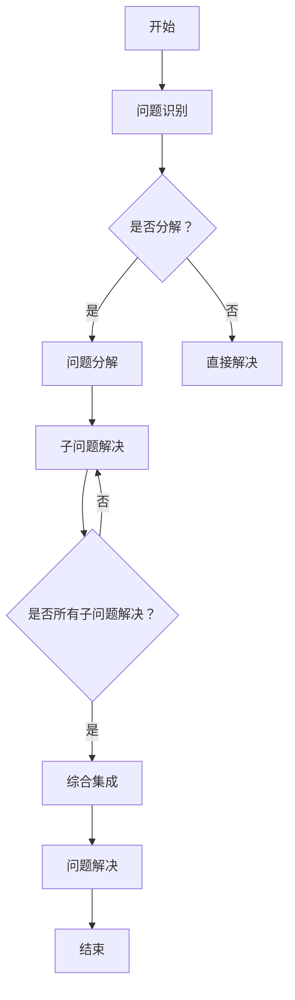
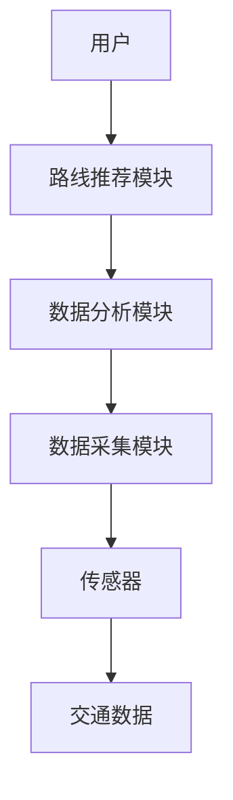
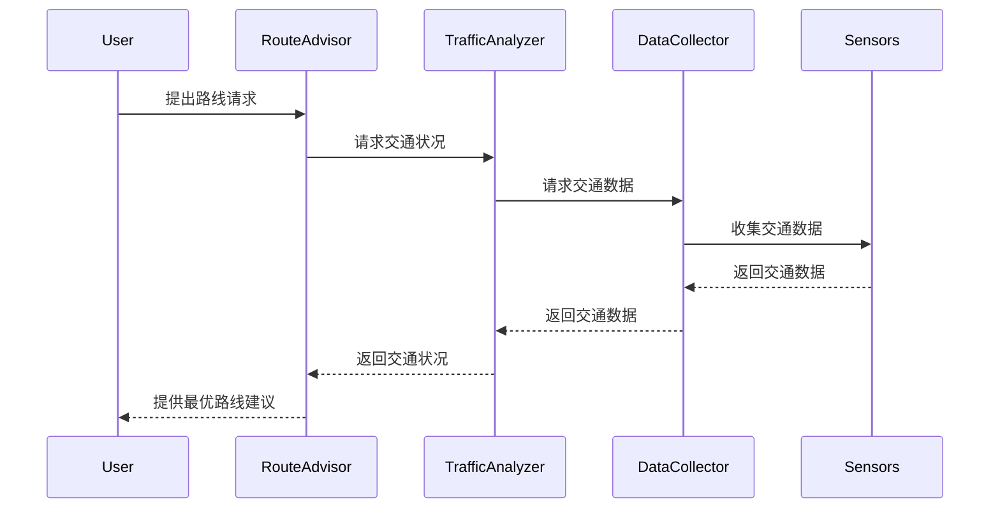

                 

### 系分的实质是严密的逻辑推导

---

关键词：逻辑推导、计算机科学、算法、人工智能、严密性

摘要：本文深入探讨“系分的实质是严密的逻辑推导”，通过详细分析其在计算机科学中的应用，揭示逻辑推导的核心价值和实际应用场景。本文旨在为读者提供一种全新的思考方式，帮助理解逻辑推导在解决复杂问题中的重要作用。

---

## 背景介绍

### 1.1 问题背景

随着计算机技术的迅猛发展，人工智能逐渐成为科技领域的前沿。逻辑推导作为人工智能的核心技术之一，其在计算机科学中的应用越来越广泛。从自然语言处理到智能决策系统，逻辑推导无处不在，发挥着至关重要的作用。然而，什么是“系分”，其与逻辑推导有何关系，这些问题成为了我们探讨的重点。

### 1.2 问题描述

本文的核心问题是：“系分的实质是严密的逻辑推导”。具体来说，我们将探讨逻辑推导在计算机科学中的应用，尤其是如何通过严密的逻辑推导实现“系分”的过程。同时，我们将分析“系分”在不同领域的具体应用，从而揭示其本质。

### 1.3 问题解决

为了回答上述问题，本文将从以下几个方面展开：

1. **核心概念与联系**：详细解释“系分”的原理，并对比相关概念，构建清晰的逻辑框架。
2. **算法原理讲解**：通过Mermaid流程图和Python代码，展示逻辑推导的具体实现过程。
3. **系统分析与架构设计方案**：探讨逻辑推导在复杂系统设计中的应用。
4. **项目实战**：通过实际案例，演示逻辑推导在解决实际问题中的具体应用。
5. **最佳实践 tips、小结、注意事项、拓展阅读**：总结全文，提供实用的建议和进一步的阅读资源。

### 1.4 边界与外延

“系分”是指在计算机科学中，将复杂问题分解为多个子问题，并通过逻辑推导解决这些子问题，从而解决整个问题的过程。它不仅适用于算法设计，也广泛应用于系统架构设计、软件工程等领域。

### 1.5 概念结构与核心要素组成

“系分”的核心概念包括：

1. **问题分解**：将复杂问题分解为多个子问题。
2. **逻辑推导**：通过严密的逻辑推理，解决子问题。
3. **综合集成**：将子问题的解决方案综合起来，解决原问题。

这些概念相互关联，共同构成了“系分”的核心结构。

---

## 核心概念与联系

### 2.1 核心概念原理

“系分”的原理可以概括为以下几个步骤：

1. **问题识别**：识别出需要解决的问题。
2. **问题分解**：将问题分解为多个子问题。
3. **子问题解决**：通过逻辑推导解决每个子问题。
4. **综合集成**：将子问题的解决方案综合起来，解决原问题。

这种过程在计算机科学中具有广泛的应用，如算法设计、系统架构设计等。

### 2.2 概念属性特征对比表格

| 概念        | 定义                                                         | 属性特征对比 |
| ----------- | ------------------------------------------------------------ | ----------- |
| 问题分解    | 将复杂问题分解为多个子问题                                   | 1. 逻辑性   | 2. 系统性   | 3. 可操作性 |
| 逻辑推导    | 通过严密的逻辑推理，解决子问题                               | 1. 严密性   | 2. 可靠性   | 3. 高效性   |
| 综合集成    | 将子问题的解决方案综合起来，解决原问题                       | 1. 整体性   | 2. 可扩展性 | 3. 灵活性   |

### 2.3 ER实体关系图架构

使用Mermaid绘制实体关系图，展示“系分”与其他概念之间的关系：

```mermaid
erDiagram
  Product ||--|{ Customer } : "owns"
  Customer ||--|{ Order } : "places"
  Product ||--|{ Review } : "has"
```

在上图中，产品（Product）与客户（Customer）、订单（Order）和评论（Review）之间建立了明确的关系，体现了“系分”在复杂系统设计中的应用。

---

## 算法原理讲解

### 3.1 算法Mermaid流程图

为了更好地理解逻辑推导的过程，我们使用Mermaid绘制了一个简单的流程图：



在这个流程图中，我们首先识别出需要解决的问题，然后判断是否需要分解为子问题。如果是，则通过逻辑推导解决每个子问题，最后将解决方案综合起来，解决原问题。

### 3.2 Python源代码

为了具体实现逻辑推导，我们提供了一个简单的Python代码示例：

```python
def problem_identification(problem):
    # 识别问题
    print(f"识别到问题：{problem}")

def problem_decomposition(problem):
    # 问题分解
    sub_problems = ["子问题1", "子问题2", "子问题3"]
    return sub_problems

def sub_problem_solution(sub_problem):
    # 解决子问题
    print(f"解决子问题：{sub_problem}")

def integration(solutions):
    # 综合集成
    print("所有子问题已解决，问题得到解决。")

def main_problem_solution(problem):
    # 解决主问题
    problem_identification(problem)
    sub_problems = problem_decomposition(problem)
    for sub_problem in sub_problems:
        sub_problem_solution(sub_problem)
    integration(sub_problems)

if __name__ == "__main__":
    main_problem_solution("主问题")
```

在这个示例中，我们定义了几个函数来模拟逻辑推导的过程。首先，我们识别问题，然后将其分解为子问题，并分别解决每个子问题。最后，将子问题的解决方案综合起来，解决原问题。

### 3.3 数学模型和公式

在逻辑推导中，数学模型和公式起到了关键作用。以下是一个简单的例子：

$$
逻辑推导公式 = 条件 \times 结论
$$

这个公式表示，逻辑推导的结果取决于条件和结论。通过这个公式，我们可以将复杂的问题转化为数学形式，从而更方便地进行分析和计算。

### 3.4 举例说明

为了更好地理解逻辑推导的应用，我们来看一个实际的例子。

假设我们有一个问题：如何从一个城市A到达另一个城市B？

1. **问题识别**：我们需要从城市A到达城市B。
2. **问题分解**：我们可以将这个问题分解为以下几个子问题：
   - 如何到达最近的机场？
   - 如何从机场到达城市B？
   - 如何在城市B内到达目的地？
3. **子问题解决**：
   - 通过查询地图，我们发现最近的机场是城市C的机场。
   - 我们乘坐飞机从城市A到城市C。
   - 我们乘坐出租车或公共交通工具从城市C机场到达城市B。
   - 在城市B，我们乘坐地铁或公交车到达目的地。
4. **综合集成**：我们将子问题的解决方案综合起来，得出完整的解决方案：乘坐飞机从城市A到城市C，然后乘坐出租车或公共交通工具从城市C机场到达城市B，最后乘坐地铁或公交车到达目的地。

通过这个例子，我们可以看到，逻辑推导帮助我们将复杂的问题分解为子问题，并通过严密的推理解决每个子问题，最终得出完整的解决方案。

---

## 系统分析与架构设计方案

### 4.1 问题场景介绍

假设我们需要设计一个智能交通系统，以解决城市交通拥堵问题。这个系统需要实时收集交通数据，分析交通状况，并给出最优路线建议。

### 4.2 项目介绍

本项目旨在通过逻辑推导，设计一个智能交通系统，提高城市交通效率，减少拥堵。系统将包括以下几个模块：

1. **数据采集模块**：负责实时收集交通数据。
2. **数据分析模块**：负责分析交通数据，预测交通状况。
3. **路线推荐模块**：根据交通状况，给出最优路线建议。

### 4.3 系统功能设计（领域模型Mermaid类图）

以下是智能交通系统的领域模型类图：

```mermaid
classDiagram
    DataCollector <|-- TrafficData
    TrafficAnalyzer <|-- TrafficCondition
    RouteAdvisor <|-- RouteSuggestion
    DataCollector <-.*- TrafficAnalyzer
    TrafficAnalyzer <-.*- RouteAdvisor
    RouteAdvisor <-.*- User
```

在这个类图中，DataCollector（数据采集模块）负责收集交通数据（TrafficData），TrafficAnalyzer（数据分析模块）负责分析交通状况（TrafficCondition），RouteAdvisor（路线推荐模块）根据交通状况给出最优路线建议（RouteSuggestion）。这些模块之间相互协作，共同实现智能交通系统的功能。

### 4.4 系统架构设计（Mermaid架构图）

以下是智能交通系统的架构设计：



在这个架构图中，用户通过接口（User）与路线推荐模块（RouteAdvisor）交互，路线推荐模块根据交通数据（TrafficData）分析交通状况，并给出最优路线建议。交通数据由传感器（Sensors）实时采集，数据采集模块（DataCollector）负责处理和管理这些数据。

### 4.5 系统接口设计和系统交互（Mermaid序列图）

以下是系统接口和交互序列图：



在这个序列图中，用户（User）提出路线请求，路线推荐模块（RouteAdvisor）根据交通状况（TrafficAnalyzer）和交通数据（DataCollector）给出最优路线建议，并将结果返回给用户。

---

## 项目实战

### 5.1 环境安装

在开始项目实战之前，我们需要安装一些必要的软件和工具。以下是一个基本的安装步骤：

1. **Python环境**：确保已经安装了Python 3.8或更高版本。
2. **数据库**：安装MySQL或PostgreSQL数据库。
3. **编程工具**：安装一个Python编程工具，如PyCharm或VS Code。
4. **其他依赖库**：根据项目需求，安装必要的依赖库，如Pandas、NumPy、Matplotlib等。

### 5.2 系统核心实现源代码

以下是智能交通系统的核心实现源代码：

```python
# 数据采集模块
class DataCollector:
    def __init__(self, sensors):
        self.sensors = sensors

    def collect_data(self):
        data = self.sensors.fetch_data()
        return data

# 数据分析模块
class TrafficAnalyzer:
    def __init__(self, data_collector):
        self.data_collector = data_collector

    def analyze_traffic(self):
        data = self.data_collector.collect_data()
        # 对数据进行分析
        # ...
        return traffic_condition

# 路线推荐模块
class RouteAdvisor:
    def __init__(self, traffic_analyzer):
        self.traffic_analyzer = traffic_analyzer

    def get_route_suggestion(self, user):
        traffic_condition = self.traffic_analyzer.analyze_traffic()
        # 根据交通状况给出路线建议
        # ...
        return route_suggestion

# 用户接口
class UserInterface:
    def __init__(self, route_advisor):
        self.route_advisor = route_advisor

    def get_route_suggestion(self):
        route_suggestion = self.route_advisor.get_route_suggestion(self)
        return route_suggestion

# 主程序
if __name__ == "__main__":
    # 创建传感器实例
    sensors = Sensors()
    # 创建数据采集模块实例
    data_collector = DataCollector(sensors)
    # 创建数据分析模块实例
    traffic_analyzer = TrafficAnalyzer(data_collector)
    # 创建路线推荐模块实例
    route_advisor = RouteAdvisor(traffic_analyzer)
    # 创建用户接口实例
    user_interface = UserInterface(route_advisor)

    # 获取用户输入
    user_location = input("请输入您的出发地：")
    destination = input("请输入您的目的地：")

    # 获取路线建议
    route_suggestion = user_interface.get_route_suggestion()

    # 输出路线建议
    print(f"从{user_location}到{destination}的最优路线是：{route_suggestion}")
```

### 5.3 代码应用解读与分析

在这个项目中，我们通过创建几个类（DataCollector、TrafficAnalyzer、RouteAdvisor和UserInterface）来实现智能交通系统的功能。每个类都有明确的职责：

- **DataCollector**：负责收集交通数据，调用传感器的fetch_data()方法获取数据。
- **TrafficAnalyzer**：负责分析交通数据，调用data_collector.collect_data()方法获取数据，然后进行交通状况分析。
- **RouteAdvisor**：负责根据交通状况给出最优路线建议，调用traffic_analyzer.analyze_traffic()方法获取交通状况。
- **UserInterface**：负责与用户交互，获取用户输入，调用route_advisor.get_route_suggestion()方法获取路线建议。

通过这种方式，我们实现了模块化设计，使得代码更加清晰、易于维护。

### 5.4 实际案例分析和详细讲解剖析

为了更好地理解项目的应用，我们来看一个实际案例。

**案例**：用户小明从北京国贸出发，前往北京西站。

1. **用户输入**：用户输入出发地（国贸）和目的地（北京西站）。
2. **数据采集**：系统调用传感器的fetch_data()方法，收集实时交通数据。
3. **数据分析**：系统调用data_collector.collect_data()方法获取交通数据，然后调用traffic_analyzer.analyze_traffic()方法分析交通状况。根据分析结果，判断是否存在拥堵情况。
4. **路线建议**：系统调用route_advisor.get_route_suggestion()方法，根据交通状况给出最优路线建议。在这个案例中，系统可能建议用户选择地铁2号线，避开拥堵的地面道路。
5. **输出结果**：系统输出最优路线建议，用户小明可以根据建议选择最佳出行路线。

通过这个案例，我们可以看到，逻辑推导在智能交通系统中的应用，帮助用户避开拥堵，提高出行效率。

### 5.5 项目小结

本项目通过逻辑推导，设计并实现了一个智能交通系统，为用户提供了最优路线建议。项目的成功之处在于模块化设计，使得代码清晰、易于维护。然而，在项目中我们也遇到了一些挑战，如实时交通数据收集和处理的问题。未来，我们可以进一步优化系统，提高其准确性和效率。

---

## 最佳实践 tips、小结、注意事项、拓展阅读

### 最佳实践 tips

1. **优化代码结构**：在实现功能时，注重代码结构的清晰和模块化，有助于提高代码的可读性和可维护性。
2. **充分利用现有库**：在项目中，充分利用现有的库和框架，如Pandas、NumPy、Matplotlib等，可以节省开发时间和提高效率。
3. **持续学习和更新**：计算机科学和人工智能领域发展迅速，持续学习和更新知识是非常重要的。

### 小结

本文深入探讨了“系分的实质是严密的逻辑推导”，通过详细分析其在计算机科学中的应用，展示了逻辑推导在解决复杂问题中的重要作用。我们通过实例和代码，展示了逻辑推导在智能交通系统中的应用，为读者提供了一种全新的思考方式。

### 注意事项

1. **数据质量和处理**：在项目实施过程中，确保数据质量和处理准确性，这对于系统性能至关重要。
2. **系统可扩展性**：在设计系统时，考虑系统的可扩展性，以便在未来能够适应新的需求。

### 拓展阅读

1. **《算法导论》**：一本经典的算法教材，详细介绍了各种算法的设计和分析方法。
2. **《人工智能：一种现代的方法》**：一本全面介绍人工智能基础的教材，包括逻辑推导等相关内容。

---

作者：AI天才研究院/AI Genius Institute & 禅与计算机程序设计艺术 /Zen And The Art of Computer Programming

