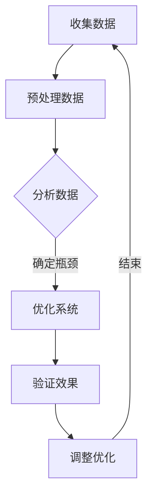

                 

### 第1章：引言

#### 1.1 问题背景与介绍

##### 1.1.1 系统分析领域的现状

**系统分析**是指通过研究系统的组成、功能、结构、运行机制等，从而优化系统性能，提高系统效率的过程。在信息技术快速发展的今天，系统分析已经成为各类软件开发和系统优化过程中不可或缺的环节。

**系统分析的重要性**不言而喻。首先，系统分析可以帮助我们深入了解系统的现状和问题，从而制定出有效的改进措施。其次，系统分析可以预见系统未来的发展趋势，为系统升级和扩展提供依据。最后，系统分析有助于提升系统的整体质量和用户体验。

然而，在实际的系统分析过程中，我们常常面临一些误区。这些误区不仅会降低系统分析的效果，甚至可能产生负面影响。例如，过度依赖定量分析、忽视定性分析、过于关注细节等。为了更好地进行系统分析，我们需要认识到这些误区，并找到破解之道。

##### 1.1.2 当前系统分析中存在的问题

1. **过度依赖定量分析**：定量分析通过数据量的分析和处理，来揭示系统的特性。然而，当系统复杂度较高时，过度依赖定量分析可能会导致分析的局限性，忽略系统的整体性和内在机制。

2. **忽视定性分析**：定性分析通过对系统进行性质、特征和关系的分析，来揭示系统的内在机制和运行规律。在系统分析中，定性分析具有不可替代的作用。然而，很多实践者却忽视了定性分析的重要性。

3. **过于关注细节**：在系统分析中，过于关注细节可能会导致分析范围狭窄，忽略系统的整体性。这不仅会影响系统优化的效果，还可能引发新的问题。

4. **缺乏系统性思维**：系统分析需要从整体出发，考虑系统的各个方面和相互关系。然而，很多实践者在分析过程中往往缺乏系统性思维，导致分析结果不全面。

##### 1.1.3 研究意义

**本研究旨在揭示系统分析中的五大认知误区，并提供相应的破解方法，从而提升系统分析的质量和效果。**

首先，本研究将为系统分析实践者提供有价值的参考，帮助他们避免常见的认知误区，提高工作效率。

其次，本研究有助于提升系统分析的理论水平，为相关领域的研究提供新的视角和方法。

最后，本研究的结果可以应用于实际项目中，为系统优化和软件开发提供有力支持。

#### 1.2 书籍结构

**本书分为五个部分：引言、误区详解、破解之道、案例分析、总结。**

- **引言**：介绍系统分析领域的现状和存在的问题，阐述研究意义和书籍结构。
- **误区详解**：详细分析系统分析中的五大认知误区，包括过度依赖定量分析、忽视定性分析、过于关注细节、缺乏系统性思维等。
- **破解之道**：针对每个误区提出相应的破解方法，包括定量分析与定性分析相结合、提高定性分析能力、确定关键细节、保持整体观念等。
- **案例分析**：通过实际案例，展示如何运用破解方法进行系统分析，提高分析质量。
- **总结**：对全书内容进行总结，强调系统分析的重要性，展望未来研究方向。

#### 1.3 小结

本章节对系统分析中的五大认知误区进行了介绍，并提出了相应的破解方法。这些误区和破解方法将为本研究的后续内容奠定基础，帮助读者更好地理解和应用系统分析的方法。在接下来的章节中，我们将逐一详细探讨这些误区，并提供实用的破解方法，以期为系统分析实践者提供有力的指导。

---

在了解了系统分析的现状和存在的问题后，我们将在下一章深入探讨第一个误区——过度依赖定量分析。我们将分析其背后的原因和影响，并提出具体的破解方法，帮助读者在系统分析过程中更加全面和准确地把握系统的本质。

## 第2章：第一个误区及破解方法

### 2.1 误区1.1: 过度依赖定量分析

#### 2.1.1 误区分析

**定量分析**是一种基于数据量和数据关系的分析方法，通过数学模型和统计分析来揭示系统的特性。它在系统分析中具有重要的作用，尤其是在处理大数据和高复杂性系统时。然而，过度依赖定量分析会带来一系列问题。

**定量分析的局限性**主要体现在以下几个方面：

1. **忽略定性因素**：定量分析主要关注数据量和数据关系，但往往忽略了定性因素，如系统的运行环境、用户需求、业务逻辑等。这些定性因素在系统分析中同样重要，如果忽视它们，可能会导致分析结果不准确。

2. **过度简化系统**：定量分析通常基于简化的数学模型，这些模型可能无法完全反映系统的复杂性和多样性。过度依赖定量分析可能会导致对系统的过度简化，从而忽略系统中的关键因素。

3. **数据质量和可靠性问题**：定量分析依赖于数据的质量和可靠性。如果数据存在偏差或错误，定量分析的结果也会受到影响。在实际应用中，数据质量和数据来源的可信度往往难以保证。

4. **忽略人的因素**：系统分析不仅涉及技术问题，还包括人的因素，如用户需求、操作习惯、心理状态等。这些因素在定量分析中难以量化，但它们对系统的性能和用户体验具有重要影响。

**实际案例分析**：

1. **金融风险管理**：在金融风险管理中，定量分析被广泛应用于风险评估和决策支持。然而，由于金融市场的高度复杂性和不确定性，过度依赖定量分析可能导致风险管理失效。例如，2008年的金融危机中，许多金融机构过度依赖定量模型进行风险评估，最终导致了巨大的损失。

2. **信息系统性能优化**：在信息系统性能优化过程中，定量分析常用于性能监控和性能调优。然而，如果仅依赖定量分析，可能会忽略系统的瓶颈和用户需求。例如，在一个电子商务平台上，如果只关注系统的响应时间和吞吐量，而忽视了用户的购物体验和商品推荐的质量，那么系统性能的提升可能无法满足用户的需求。

#### 2.1.2 破解方法

**定量分析与定性分析相结合**是破解过度依赖定量分析误区的重要方法。这种方法可以弥补定量分析的不足，提高系统分析的质量。

1. **定性分析的重要性**：

   定性分析通过对系统进行性质、特征和关系的分析，来揭示系统的内在机制和运行规律。它可以帮助我们了解系统的本质和复杂性，为系统优化提供更全面的视角。

   定性分析的优势包括：

   - 关注定性因素：定性分析可以关注系统的运行环境、用户需求、业务逻辑等定性因素，从而提高分析结果的准确性。
   - 补充定量分析：定性分析可以补充定量分析的不足，为定量分析提供背景信息和上下文。
   - 提高系统理解的深度：定性分析可以帮助我们更深入地理解系统的复杂性，从而为系统优化提供更有针对性的解决方案。

2. **定量分析与定性分析相结合的方法**：

   - **相互验证**：在进行定量分析的同时，进行定性分析，以验证定量分析的结果。例如，在金融风险管理中，可以使用定量模型进行风险评估，同时通过定性分析评估风险模型的可靠性和适用性。
   - **互补分析**：将定量分析和定性分析结合起来，从多个角度对系统进行分析。例如，在信息系统性能优化中，可以同时使用定量分析监控系统性能，使用定性分析评估用户体验和业务需求。
   - **综合评估**：在系统分析过程中，综合运用定量分析和定性分析的结果，进行全面评估。例如，在项目评估中，可以同时考虑项目的性能指标和用户满意度。

3. **确定定量分析的合理范围**：

   在系统分析中，需要根据实际情况确定定量分析的合理范围，避免过度依赖定量分析。以下是一些建议：

   - **确定关键因素**：识别系统中关键的因素和指标，优先进行定量分析。例如，在系统性能优化中，可以优先关注系统的响应时间、吞吐量等关键性能指标。
   - **数据质量和可靠性**：确保定量分析所使用的数据质量和可靠性，避免因数据问题导致的分析偏差。
   - **局限性识别**：了解定量分析的局限性，避免将定量分析作为唯一依据。例如，在风险评估中，可以同时考虑定量分析和定性分析的结果。

通过定量分析与定性分析相结合的方法，我们可以更全面、准确地分析系统，避免过度依赖定量分析带来的局限性，提高系统分析的质量。

#### 2.2 误区1.2: 过度依赖定量分析对系统分析实践的影响

**过度依赖定量分析**对系统分析实践产生了多方面的影响，主要体现在以下几个方面：

1. **分析结果的局限性**：过度依赖定量分析可能导致分析结果的局限性。定量分析主要关注数据量和数据关系，但忽略了系统的定性因素。这些定性因素对系统的性能和用户体验具有重要影响。例如，在系统性能优化中，如果仅关注系统的响应时间和吞吐量等定量指标，而忽视了用户的使用体验和业务需求，那么优化效果可能不理想。

2. **系统优化效果的不足**：过度依赖定量分析可能导致系统优化效果不足。定量分析可能无法完全反映系统的复杂性和多样性，从而忽略了一些关键因素。例如，在信息系统性能优化中，如果仅依赖定量分析，可能会忽略系统的瓶颈和用户需求，导致优化措施不精准，无法达到预期效果。

3. **风险管理的失效**：在金融风险管理等领域，过度依赖定量分析可能导致风险管理失效。金融系统具有高度复杂性和不确定性，定量分析可能无法准确评估风险。例如，在2008年的金融危机中，许多金融机构过度依赖定量模型进行风险评估，最终导致了巨大的损失。

4. **系统设计的缺陷**：在系统设计过程中，过度依赖定量分析可能导致系统设计的缺陷。系统设计需要考虑多个方面的因素，包括功能、性能、用户体验等。如果仅依赖定量分析，可能会忽略一些关键因素，导致系统设计不合理。例如，在一个电子商务平台上，如果仅依赖定量分析优化系统性能，而忽视了用户购物体验和商品推荐质量，那么系统设计可能存在缺陷。

5. **用户满意度降低**：过度依赖定量分析可能导致用户满意度降低。定量分析虽然可以提供一些客观的指标，但无法直接反映用户的实际体验和需求。如果系统分析仅依赖定量分析，可能无法充分考虑用户的需求和偏好，导致用户满意度下降。

**案例分析**：

1. **信息系统性能优化**：在一个电子商务平台中，团队仅依赖定量分析来优化系统性能。他们关注系统的响应时间和吞吐量等指标，进行了多次调优。然而，用户反馈显示，系统虽然性能有所提升，但用户购物体验并未得到改善。通过定性分析，团队发现用户对购物流程的复杂性、商品推荐质量等方面存在不满。最终，团队结合定量分析和定性分析，对购物流程和商品推荐系统进行了优化，用户满意度显著提升。

2. **金融风险管理**：在一家金融机构中，风险管理团队过度依赖定量分析模型进行风险评估。他们使用复杂的数学模型和统计方法来预测市场风险。然而，实际操作中，市场波动远远超出了模型预测的范围，导致风险管理的失效。通过定性分析，团队发现市场的波动受到多种因素的影响，如政治、经济、社会等，这些因素无法完全通过定量分析来预测。最终，团队结合定量分析和定性分析，建立了更加全面的风险评估体系，提高了风险管理的准确性。

3. **系统设计**：在一个大型企业系统中，设计团队仅依赖定量分析来设计系统架构。他们关注系统的性能和可靠性，进行了大量的性能测试和优化。然而，在实际运行中，系统出现了严重的瓶颈和问题，影响了整个企业的运营。通过定性分析，团队发现系统的设计忽略了关键的业务逻辑和流程，导致系统架构不合理。最终，团队结合定量分析和定性分析，重新设计了系统架构，解决了瓶颈问题，提高了系统的稳定性和性能。

通过上述案例分析，我们可以看到，过度依赖定量分析在系统分析实践中可能导致多种问题。为了提高系统分析的质量和效果，我们需要结合定量分析和定性分析，从多个角度对系统进行全面分析，以避免过度依赖定量分析带来的局限性。

### 2.3 破解误区1.1：定量分析与定性分析相结合

#### 2.3.1 方案概述

**定量分析与定性分析相结合**是一种有效的破解方法，可以弥补单一分析方法的不足，提高系统分析的质量。这种方法通过将定量分析和定性分析相结合，从多个角度对系统进行分析，从而更全面地揭示系统的特性。

**方案特点**包括：

1. **互补性**：定量分析关注数据量和数据关系，定性分析关注系统的性质、特征和关系。两者相结合，可以弥补单一分析的不足，提高分析结果的全面性和准确性。
2. **系统性**：通过定量分析与定性分析相结合，可以从多个维度对系统进行全面分析，避免忽略关键因素。
3. **灵活性**：定量分析与定性分析相结合可以根据具体问题进行灵活调整，使分析过程更具针对性。

#### 2.3.2 实施步骤

1. **确定分析目标**：

   在进行系统分析之前，首先要明确分析的目标和问题。这包括识别系统中的关键因素、性能瓶颈、用户体验等问题。明确分析目标有助于指导后续的分析过程。

2. **数据收集与处理**：

   收集与目标相关的数据，包括定量数据和定性数据。定量数据可以通过系统日志、性能监控工具等获取，定性数据可以通过用户调研、访谈、观察等方式获取。在数据收集过程中，要确保数据的质量和可靠性。

3. **定量分析**：

   使用数学模型和统计分析方法对定量数据进行处理，揭示系统的性能和趋势。定量分析可以提供系统的客观指标，如响应时间、吞吐量、错误率等。在定量分析过程中，要注意分析结果的局限性和适用范围。

4. **定性分析**：

   通过定性分析方法，对系统的性质、特征和关系进行分析，揭示系统的内在机制和运行规律。定性分析可以关注系统的用户需求、业务逻辑、操作流程等。在定性分析过程中，要注意识别系统的关键因素和瓶颈。

5. **结合分析结果**：

   将定量分析和定性分析的结果进行结合，从多个角度对系统进行全面分析。分析结果可以通过表格、图表、文本等形式呈现。在结合分析结果时，要注意识别系统的关键问题和瓶颈，为系统优化提供依据。

6. **制定优化方案**：

   根据分析结果，制定具体的系统优化方案。优化方案应包括技术改进、流程优化、用户体验提升等方面。在制定优化方案时，要综合考虑定量分析和定性分析的结果，确保优化措施的有效性和可行性。

7. **实施与验证**：

   将优化方案应用于实际系统中，并进行验证。验证过程可以通过性能测试、用户反馈等方式进行。在验证过程中，要注意分析优化效果，根据实际情况进行调整。

#### 2.3.3 具体应用案例

**案例1：电子商务平台性能优化**

**问题背景**：一个电子商务平台在高峰时段出现响应时间过长和吞吐量不足的问题。

**定量分析**：通过性能监控工具收集系统日志，分析系统的响应时间、吞吐量等指标。发现系统在高峰时段的响应时间和吞吐量明显下降。

**定性分析**：通过用户调研和访谈，了解用户的使用体验和需求。发现用户对平台的高峰时段性能表现不满，特别是在购物高峰时段，系统响应速度慢，购物流程复杂。

**结合分析结果**：通过定量分析和定性分析，确定了系统性能瓶颈和用户体验问题。结合分析结果，制定了优化方案，包括：

- **技术优化**：升级硬件设备，提高系统的吞吐量和响应速度。
- **流程优化**：简化购物流程，减少用户操作步骤。
- **用户体验提升**：优化用户界面，提高用户操作便捷性。

**实施与验证**：实施优化方案后，对系统进行性能测试和用户反馈调查。结果显示，系统的响应时间和吞吐量显著提升，用户满意度提高。

**案例2：金融风险管理**

**问题背景**：一家金融机构在市场波动较大的情况下，风险控制效果不佳。

**定量分析**：使用定量模型对市场风险进行评估，分析市场的波动情况、风险因素等。

**定性分析**：通过访谈和观察，了解市场的实际情况和风险因素。发现市场波动受到多种因素的影响，如政治、经济、社会等。

**结合分析结果**：通过定量分析和定性分析，制定了更加全面的风险管理方案，包括：

- **定量模型优化**：调整和改进定量模型，提高风险评估的准确性。
- **定性分析补充**：结合定性分析，考虑市场的实际波动情况，完善风险评估体系。

**实施与验证**：实施风险管理方案后，对市场波动情况进行监控和评估。结果显示，风险管理效果显著提升，风险控制能力增强。

通过以上案例分析，我们可以看到，定量分析与定性分析相结合在系统分析中的应用效果显著。这种方法不仅能够弥补单一分析的不足，提高系统分析的质量，还能够为系统优化和风险管理提供有力支持。

### 2.4 误区1.3: 过度依赖定量分析的其他常见问题

**过度依赖定量分析**在系统分析中还会带来一些其他常见问题，这些问题可能会影响系统分析的准确性和可靠性。以下是一些主要问题：

#### 2.4.1 忽视领域专业知识

1. **专业知识的缺失**：定量分析主要依赖于数学和统计方法，但如果领域专业知识不足，分析结果可能不准确。例如，在金融风险管理中，如果分析人员不了解金融市场的特性和规律，仅依赖定量模型，可能会导致风险评估不准确。

2. **分析结果的误导**：领域专业知识可以帮助分析人员更好地理解系统的复杂性和特殊性，从而避免被定量分析结果误导。如果缺乏领域知识，分析人员可能会忽略一些重要的定性因素，导致分析结果不全面。

#### 2.4.2 忽视人的因素

1. **人的行为的复杂性**：定量分析难以准确捕捉人的行为和决策过程，特别是在涉及用户需求、用户体验等方面。例如，在信息系统优化中，如果仅依赖定量分析，可能会忽略用户的具体需求和操作习惯，导致优化方案不适用。

2. **用户反馈的重要性**：用户反馈是系统优化的重要依据，但在定量分析中往往被忽视。通过用户调研、访谈等方式获取的用户反馈可以为系统分析提供宝贵的信息，有助于发现定量分析无法捕捉的问题。

#### 2.4.3 忽视系统环境的影响

1. **系统环境的多样性**：系统分析不仅要考虑系统内部的因素，还要考虑外部环境的影响。例如，在云计算环境中，网络延迟、资源分配等外部因素可能会对系统性能产生重大影响，而这些因素在定量分析中难以全面考虑。

2. **环境变化的适应性**：系统分析需要考虑系统在不同环境下的表现，但定量分析往往难以适应环境变化。例如，在应对突发流量或负载变化时，系统需要具备快速调整和适应能力，这需要定性分析和系统设计经验的支撑。

#### 2.4.4 忽视系统的整体性

1. **系统整体的关联性**：系统中的各个部分相互关联，一个部分的优化可能会对其他部分产生连锁反应。定量分析往往关注单一指标，可能忽略系统整体的关联性。例如，在一个电子商务平台中，如果仅关注购物流程的优化，可能会忽视支付流程和物流流程的影响。

2. **整体优化的必要性**：系统优化需要考虑整体性，通过综合分析系统的各个方面，制定统一的优化方案。如果仅依赖定量分析，可能会导致局部优化，而忽略整体优化，影响系统的稳定性和性能。

### 2.5 破解误区1.3：全面考虑定量分析与定性分析的结合

**为了破解过度依赖定量分析的问题，我们需要在系统分析中全面考虑定量分析与定性分析的结合。以下是一些具体的建议和方法：**

#### 2.5.1 综合使用定量与定性分析

1. **确立分析框架**：在系统分析初期，明确分析的目标和范围，确立一个综合的框架，将定量分析与定性分析纳入其中。

2. **相互补充**：在分析过程中，将定量分析与定性分析相结合，互相补充。定量分析可以提供客观的指标和趋势，定性分析可以提供系统的背景信息和上下文。

3. **多维度分析**：从多个角度对系统进行分析，包括技术层面、业务层面和用户层面。定量分析可以关注技术指标和性能，定性分析可以关注用户需求和行为。

#### 2.5.2 加强领域知识的学习和应用

1. **深入学习领域知识**：通过学习相关的专业知识和经验，提高对系统的理解，从而更好地进行定量与定性分析。

2. **结合专家经验**：在分析过程中，引入领域专家的经验和见解，以弥补定量分析的不足。

3. **案例研究**：通过研究实际案例，了解领域中的成功经验和失败教训，提高分析的能力和准确性。

#### 2.5.3 考虑系统环境的多样性

1. **识别外部因素**：在系统分析中，识别并考虑外部环境的影响因素，如网络延迟、硬件资源、市场变化等。

2. **动态调整分析模型**：根据环境的变化，动态调整定量分析模型，确保分析结果的适用性和准确性。

3. **模拟和预测**：使用模拟和预测方法，对系统在不同环境下的表现进行评估，从而提高分析结果的可靠性。

#### 2.5.4 关注系统的整体性

1. **分析系统的关联性**：在分析过程中，关注系统中各个部分的相互关联，避免局部优化影响整体性能。

2. **整体优化方案**：制定统一的优化方案，综合考虑系统的各个方面，实现整体性能的提升。

3. **定期评估和调整**：定期对系统进行分析和评估，根据实际情况进行调整，确保系统持续优化。

通过以上方法，我们可以全面考虑定量分析与定性分析的结合，提高系统分析的准确性和可靠性，避免过度依赖定量分析带来的局限性。

### 第3章：第二个误区及破解方法

### 3.1 误区2.1: 忽视定性分析

#### 3.1.1 误区分析

**定性分析**在系统分析中扮演着不可或缺的角色。它通过对系统的性质、特征和关系进行定性描述，揭示系统的内在机制和运行规律。然而，在实际的系统分析中，许多实践者往往忽视定性分析，只关注定量分析。

**忽视定性分析**的主要原因包括：

1. **定量分析直观性**：定量分析通过数据指标和统计结果，以直观的数字形式呈现系统性能和趋势，更容易被理解和接受。相比之下，定性分析往往需要深入研究和理解系统，涉及更多抽象和概念性的内容。

2. **定量分析便捷性**：在当前的信息技术环境下，定量分析的工具和方法相对成熟，可以使用各种分析软件和算法快速处理大量数据。而定性分析则需要更深入的研究和思考，往往需要更多的时间和精力。

3. **对定性分析的误解**：一些实践者认为定性分析过于主观，缺乏科学性和客观性。这种观点导致他们对定性分析持有怀疑态度，忽视其在系统分析中的重要作用。

**定性分析的重要性**：

尽管定量分析有其优点，但忽视定性分析会带来一系列问题：

1. **系统理解的不全面**：定性分析可以帮助我们深入理解系统的本质和复杂性，揭示系统的内在机制和运行规律。如果仅依赖定量分析，可能会忽略系统中的关键因素和潜在问题。

2. **缺乏对系统背景的理解**：定量分析主要关注系统的性能和趋势，但忽略了系统的背景信息，如用户需求、业务逻辑、操作流程等。这些背景信息对于系统分析和优化至关重要。

3. **难以发现系统性问题**：定量分析往往关注局部和短期效果，而定性分析可以帮助我们发现系统中的系统性问题，如设计缺陷、流程瓶颈等。这些问题仅通过定量分析难以发现。

4. **缺乏对用户需求的关注**：用户需求是系统设计和优化的核心，但定量分析难以准确捕捉用户需求。定性分析可以通过用户调研、访谈等方式，深入了解用户需求和期望，从而更好地满足用户需求。

#### 3.1.2 实际案例分析

**案例1：电子商务平台用户满意度优化**

**问题描述**：一个电子商务平台希望通过优化用户满意度来提升整体业绩。团队主要依赖定量分析，通过监控用户行为数据和交易数据来分析用户满意度。

**定量分析**：通过用户行为数据和交易数据，分析用户在平台上的停留时间、点击率、购买转化率等指标，发现平台某些功能的使用频率较低。

**定性分析**：通过用户调研和访谈，发现用户对平台的某些功能表示不满，如商品推荐不准确、购物流程复杂等。

**结果分析**：定量分析显示某些功能使用频率低，但定性分析揭示用户对这些功能的满意度较低。通过定性分析，团队发现用户对商品推荐准确性和购物流程复杂性的不满是导致整体满意度下降的主要原因。

**解决方案**：团队结合定量分析和定性分析的结果，对商品推荐算法进行了优化，简化了购物流程。在实施后，用户满意度显著提升。

**案例2：企业信息系统安全性评估**

**问题描述**：一家企业希望通过评估其信息系统的安全性来提高系统的安全防护能力。

**定量分析**：通过监控系统的安全日志和错误日志，分析系统遭受的攻击次数、安全漏洞数量等指标。

**定性分析**：通过访谈和安全专家咨询，了解企业内部的安全管理现状，发现安全管理流程不完善，员工安全意识不足。

**结果分析**：定量分析显示系统的安全漏洞数量较多，但定性分析揭示内部管理问题和员工安全意识不足是导致系统安全风险的主要原因。

**解决方案**：企业结合定量分析和定性分析的结果，完善了安全管理流程，加强员工安全培训，提高了系统的整体安全性。

通过以上案例分析，我们可以看到，忽视定性分析可能导致对系统问题理解的不全面和解决方案的不彻底。因此，在系统分析中，重视并充分利用定性分析，是提高分析质量、发现系统性问题的关键。

#### 3.2 破解误区2.1：提高定性分析能力

**为了破解忽视定性分析的误区，我们需要提高定性分析能力，确保系统分析过程中的全面性和准确性。以下是一些具体的建议和方法：**

##### 3.2.1 定性分析的方法和工具

1. **用户调研**：通过问卷调查、访谈、焦点小组讨论等方式，收集用户的反馈和意见。用户调研可以帮助我们深入了解用户的需求、偏好和行为。

2. **专家访谈**：与领域专家、用户、项目经理等进行访谈，获取他们对系统的看法和建议。专家访谈可以提供宝贵的专业知识和经验。

3. **案例研究**：研究类似系统的成功案例和失败案例，分析其经验教训，为我们的系统分析提供参考。

4. **SWOT分析**：通过分析系统的优势、劣势、机会和威胁，全面了解系统的现状和潜在问题。

5. **流程图**：绘制系统的流程图，分析系统的操作流程、数据流和交互关系。

6. **思维导图**：使用思维导图整理分析结果，帮助理清思路，发现系统的关键因素和关系。

##### 3.2.2 定性分析能力的提升

1. **学习和培训**：通过参加相关课程、阅读专业书籍和文献，学习定性分析的理论和方法。

2. **实践和反思**：在实际项目中运用定性分析，不断反思和总结经验教训，提高分析能力。

3. **跨学科学习**：系统分析涉及多个学科领域，如计算机科学、管理学、心理学等。跨学科学习可以帮助我们更全面地理解系统，提高定性分析的能力。

4. **团队协作**：建立跨学科的团队，集合不同领域的知识和经验，共同进行系统分析。团队协作可以弥补个人能力的不足，提高分析的质量。

##### 3.2.3 定性与定量分析相结合

1. **相互验证**：在进行定量分析的同时，进行定性分析，以验证定量分析的结果。例如，在评估系统性能时，可以同时考虑性能指标和用户满意度。

2. **互补分析**：将定量分析和定性分析结合起来，从多个角度对系统进行分析。例如，在系统优化中，可以同时关注性能指标和用户体验。

3. **综合评估**：在系统分析过程中，综合运用定量分析和定性分析的结果，进行全面评估。例如，在项目评估中，可以同时考虑项目的性能指标和用户满意度。

通过以上方法，我们可以有效提高定性分析能力，确保系统分析过程中的全面性和准确性。在实际应用中，结合定量分析和定性分析，可以更全面地揭示系统的特性，发现潜在问题，从而制定更有效的解决方案。

### 3.3 误区2.2: 忽视定性分析对系统分析实践的影响

**忽视定性分析**在系统分析实践中可能导致多方面的问题，影响分析的质量和效果。以下是一些主要影响：

1. **分析结果的片面性**：定性分析可以帮助我们深入了解系统的本质和复杂性，而忽视定性分析可能导致分析结果的片面性。仅依赖定量分析，可能会忽略系统中的关键因素和潜在问题，导致分析结果不全面。

2. **系统优化的局限性**：定量分析主要关注系统的性能和趋势，而定性分析可以帮助我们理解用户需求和业务逻辑。忽视定性分析可能导致系统优化方案的局限性，无法充分考虑用户需求和企业目标，影响系统优化效果。

3. **风险管理失效**：在系统分析中，定性分析可以帮助识别潜在的风险和不确定性。忽视定性分析可能导致风险管理失效，无法及时发现和应对系统中的潜在风险。

4. **用户体验差**：用户体验是系统分析的重要方面，定性分析可以帮助我们了解用户的需求和痛点。忽视定性分析可能导致系统设计不合理，用户体验差，影响用户满意度和忠诚度。

**案例分析**：

**案例1：电子商务平台用户体验优化**

**问题背景**：一个电子商务平台希望通过优化用户体验来提升用户满意度。

**定量分析**：通过监控用户行为数据和交易数据，分析用户在平台上的停留时间、点击率等指标，发现用户在购物流程中某些环节的使用频率较低。

**定性分析**：通过用户调研和访谈，发现用户对购物流程中的商品推荐不准确、支付页面复杂等环节表示不满。

**结果分析**：仅依赖定量分析，团队可能认为购物流程中的某些环节使用频率低，不需要优化。但通过定性分析，团队发现这些环节的实际问题导致用户体验差。忽视定性分析可能导致优化方案的不彻底，无法有效提升用户满意度。

**解决方案**：团队结合定量分析和定性分析的结果，对商品推荐算法和支付页面进行了优化。优化后，用户满意度显著提升。

**案例2：企业信息系统安全性评估**

**问题背景**：一家企业希望通过评估其信息系统的安全性来提高安全防护能力。

**定量分析**：通过监控系统的安全日志和错误日志，分析系统遭受的攻击次数、安全漏洞数量等指标。

**定性分析**：通过访谈和安全专家咨询，发现企业内部的安全管理流程不完善，员工安全意识不足。

**结果分析**：仅依赖定量分析，团队可能认为系统的安全漏洞数量较多，需要加强安全防护。但通过定性分析，团队发现内部管理问题和员工安全意识不足是导致安全风险的主要原因。忽视定性分析可能导致解决方案的局限性。

**解决方案**：企业结合定量分析和定性分析的结果，完善了安全管理流程，加强了员工安全培训，提高了系统的整体安全性。

通过以上案例分析，我们可以看到，忽视定性分析在系统分析实践中可能导致分析结果片面、系统优化局限性、风险管理失效和用户体验差等问题。因此，重视并充分利用定性分析，是提高系统分析质量和效果的关键。

### 3.4 破解误区2.2：结合定量与定性分析进行系统优化

为了破解忽视定性分析的误区，提高系统分析的质量和效果，我们可以采用定量与定性分析相结合的方法，对系统进行全面的优化。以下是一些具体的方案和方法：

#### 3.4.1 定量与定性分析相结合的方法

1. **综合数据来源**：在系统分析过程中，不仅要收集和处理定量数据，如系统日志、性能监控数据等，还要收集定性数据，如用户反馈、访谈记录、专家意见等。通过综合不同来源的数据，可以获得更全面和深入的分析结果。

2. **交叉验证分析**：在定量分析的基础上，结合定性分析进行交叉验证。例如，通过用户调研和访谈，验证定量分析得出的性能指标和用户满意度之间的关系，从而提高分析结果的准确性。

3. **多角度分析**：从多个角度对系统进行分析，包括技术层面、业务层面和用户层面。定量分析可以关注系统的性能和趋势，定性分析可以关注用户需求和业务逻辑。通过多角度分析，可以更全面地揭示系统的特性和问题。

#### 3.4.2 实施步骤

1. **确定分析目标**：明确系统优化的目标和问题，例如提升系统性能、提高用户满意度、降低故障率等。

2. **数据收集与处理**：收集与目标相关的数据，包括定量数据和定性数据。定量数据可以通过系统日志、性能监控工具等获取，定性数据可以通过用户调研、访谈、专家咨询等方式获取。在数据收集过程中，要确保数据的质量和可靠性。

3. **定量分析**：使用数学模型和统计分析方法对定量数据进行处理，揭示系统的性能和趋势。定量分析可以提供系统的客观指标，如响应时间、吞吐量、错误率等。

4. **定性分析**：通过定性分析方法，对系统的性质、特征和关系进行分析，揭示系统的内在机制和运行规律。定性分析可以关注系统的用户需求、业务逻辑、操作流程等。

5. **结合分析结果**：将定量分析和定性分析的结果进行结合，从多个角度对系统进行全面分析。分析结果可以通过表格、图表、文本等形式呈现。

6. **制定优化方案**：根据分析结果，制定具体的系统优化方案。优化方案应包括技术改进、流程优化、用户体验提升等方面。

7. **实施与验证**：将优化方案应用于实际系统中，并进行验证。验证过程可以通过性能测试、用户反馈等方式进行。

#### 3.4.3 具体应用案例

**案例1：电子商务平台性能优化**

**问题背景**：一个电子商务平台在高峰时段出现响应时间过长和吞吐量不足的问题。

**定量分析**：通过性能监控工具收集系统日志，分析系统的响应时间、吞吐量等指标，发现系统在高峰时段的响应时间和吞吐量明显下降。

**定性分析**：通过用户调研和访谈，了解用户的使用体验和需求。发现用户在高峰时段对平台的响应速度和商品推荐准确性有较高要求。

**结合分析结果**：通过定量分析和定性分析，确定了系统性能瓶颈和用户体验问题。结合分析结果，制定了优化方案，包括：

- **技术优化**：升级硬件设备，提高系统的吞吐量和响应速度。
- **流程优化**：优化购物流程，减少用户操作步骤。
- **用户体验提升**：改进商品推荐算法，提高推荐准确性。

**实施与验证**：实施优化方案后，对系统进行性能测试和用户反馈调查。结果显示，系统的响应时间和吞吐量显著提升，用户满意度提高。

**案例2：企业信息系统安全性评估**

**问题背景**：一家企业希望通过评估其信息系统的安全性来提高安全防护能力。

**定量分析**：通过监控系统的安全日志和错误日志，分析系统遭受的攻击次数、安全漏洞数量等指标。

**定性分析**：通过访谈和安全专家咨询，了解企业内部的安全管理现状，发现安全管理流程不完善，员工安全意识不足。

**结合分析结果**：通过定量分析和定性分析，制定了安全性优化方案，包括：

- **流程优化**：完善安全管理流程，提高安全管理效率。
- **员工培训**：加强员工安全培训，提高安全意识。
- **技术改进**：升级安全防护工具，提高系统抗攻击能力。

**实施与验证**：实施优化方案后，对系统进行安全测试和员工反馈调查。结果显示，系统的安全性显著提升，安全风险降低。

通过以上案例，我们可以看到，结合定量与定性分析进行系统优化，可以有效提升系统性能和安全性，提高用户体验，为企业创造更大价值。

### 3.5 总结

在本章节中，我们详细探讨了系统分析中的第二个误区——忽视定性分析。通过分析误区的原因和实际案例分析，我们发现忽视定性分析会导致系统分析结果的片面性、系统优化局限性、风险管理失效和用户体验差等问题。为了破解这一误区，我们提出了结合定量与定性分析进行系统优化的方法，通过综合数据来源、交叉验证分析、多角度分析等步骤，全面提高系统分析的质量和效果。

在实际应用中，定量与定性分析的结合不仅能够弥补单一分析的不足，还能帮助我们更深入地理解系统，发现潜在问题，制定更有效的解决方案。通过定量分析与定性分析相结合，我们可以更全面地揭示系统的特性和问题，提高系统优化的效果，为企业创造更大价值。

在接下来的章节中，我们将继续探讨系统分析中的其他误区，并提供相应的破解方法。希望读者能够结合实际案例，灵活运用这些方法，提高系统分析的质量和效果。

## 第4章：第三个误区及破解方法

### 4.1 误区3.1: 过于关注细节

#### 4.1.1 误区分析

**过于关注细节**是系统分析中常见的误区之一。在系统分析和优化过程中，如果过度关注细节，可能会导致以下问题：

1. **忽略整体性**：系统是由多个部分和组件组成的，它们之间相互关联。如果只关注细节而忽略整体性，可能会导致局部优化而牺牲整体性能。例如，在一个复杂的软件系统中，如果只优化某个模块的代码，而忽略了模块之间的接口和交互，可能会导致系统整体性能下降。

2. **效率低下**：过度关注细节可能会导致分析过程变得繁琐和冗长。系统分析需要考虑多个方面，包括性能、安全性、可靠性、用户体验等。如果过度关注细节，可能会忽视系统优化的重点，导致分析效率低下。

3. **资源浪费**：在系统分析中，时间和资源是宝贵的。如果过度关注细节，可能会在非关键问题上花费过多的时间和资源，导致关键问题得不到有效解决。

4. **缺乏系统性思维**：系统分析需要具备系统性思维，从整体出发，考虑系统的各个方面和相互关系。如果只关注细节，可能会导致分析过程中的盲点，影响系统优化的效果。

#### 4.1.2 实际案例分析

**案例1：软件性能优化**

**问题描述**：一个软件团队希望通过优化软件性能来提高用户满意度。他们在分析过程中，只关注代码层面的细节，如算法复杂度和代码效率等。

**结果分析**：虽然团队通过优化代码细节提高了某些功能模块的性能，但系统整体性能并未显著提升。进一步分析发现，系统中的数据传输延迟和缓存策略是导致性能瓶颈的主要原因。由于过度关注细节，团队没有意识到这些问题，导致优化效果不显著。

**解决方案**：团队重新审视了系统的整体架构和交互流程，发现数据传输延迟和缓存策略是关键瓶颈。通过优化数据传输和缓存策略，团队显著提高了系统整体性能，用户满意度也随之提升。

**案例2：企业资源分配**

**问题描述**：一家企业在资源分配过程中，过度关注每个部门的预算和使用情况，导致资源分配不均衡。

**结果分析**：由于过度关注细节，企业未能从整体出发，考虑资源的整体需求和优先级。一些关键业务部门由于资源不足，导致运营效率低下，而一些非关键部门却资源过剩。

**解决方案**：企业重新评估了整体业务需求和资源优先级，通过优化资源分配策略，确保关键业务部门得到足够的资源支持。同时，对非关键部门的资源进行适当削减，提高了整体运营效率。

通过以上案例分析，我们可以看到，过度关注细节可能导致分析过程中的盲点，影响系统优化的效果。因此，在系统分析中，我们需要保持整体观念，关注关键细节，同时避免陷入细节的泥沼。

#### 4.2 破解误区3.1：确定关键细节

为了破解过度关注细节的误区，我们需要在系统分析中确定关键细节，确保分析和优化过程中的有效性和效率。以下是一些具体的建议和方法：

##### 4.2.1 关键细节识别

1. **需求优先级**：在系统分析过程中，明确用户需求和业务目标，识别哪些需求和目标是关键的。关键需求和目标对应的细节需要重点关注。

2. **性能瓶颈**：通过性能监控和分析工具，识别系统中的性能瓶颈。性能瓶颈通常是影响系统整体性能的关键因素，需要优先关注。

3. **资源利用率**：分析系统资源的利用率，识别资源利用率较低的环节。资源利用率较低的环节可能是系统优化的重要方向。

4. **业务流程**：梳理系统中的业务流程，识别流程中的关键环节和瓶颈。关键环节和瓶颈通常是影响业务流程效率的关键因素。

##### 4.2.2 关键细节优化的策略

1. **优先级排序**：根据关键细节的重要性，对细节进行优先级排序。优先优化关键细节，确保关键问题得到有效解决。

2. **迭代优化**：在确定关键细节后，采用迭代优化的方法，逐步解决关键问题。每次迭代过程中，重点关注关键细节的优化效果，确保优化目标的实现。

3. **验证与反馈**：在关键细节优化后，进行验证和反馈，确保优化措施的有效性和可行性。通过用户反馈和性能测试，评估优化效果，并根据实际情况进行调整。

4. **团队协作**：在系统分析过程中，建立跨部门的协作机制，确保各团队在关键细节优化过程中的协同配合。通过团队协作，提高关键细节优化的效率和质量。

通过以上方法，我们可以有效确定关键细节，避免过度关注细节带来的负面影响，提高系统分析的质量和效率。

### 4.3 破解误区3.1：保持整体观念

在系统分析中，保持整体观念是避免过度关注细节的重要策略。以下是一些具体的方法和步骤，帮助我们在分析过程中保持整体观念：

#### 4.3.1 整体性思维的培养

1. **系统观教育**：通过培训和教育，培养团队成员的系统观，使他们认识到系统是由多个部分和组件相互关联而成的，整体性能取决于各个部分的协同作用。

2. **全局视角**：在分析过程中，始终从全局视角出发，考虑系统的各个方面和相互关系。避免陷入局部优化，导致整体性能下降。

3. **系统边界明确**：明确系统的边界和范围，了解系统与其他系统或组件的交互关系。这样可以更好地把握系统整体性，避免因关注细节而忽视整体。

#### 4.3.2 保持整体观念的方法

1. **系统性流程分析**：在系统分析过程中，采用系统性流程分析的方法，梳理系统的各个组成部分和交互关系。通过流程图、数据流图等工具，直观地展示系统结构，帮助理解系统的整体性。

2. **关键因素识别**：在分析过程中，识别影响系统整体性能的关键因素，如性能瓶颈、资源利用率、用户体验等。重点关注这些关键因素，确保分析过程中不偏离整体目标。

3. **多维度评估**：在系统分析中，从多个维度对系统进行评估，包括技术层面、业务层面、用户体验等。这样可以更全面地了解系统的整体性能，避免过度关注某一方面的细节。

#### 4.3.3 实际案例分析

**案例1：电子商务平台优化**

**问题描述**：一个电子商务平台希望通过优化用户体验来提升用户满意度。

**解决方案**：团队在分析过程中，采用了以下策略保持整体观念：

- **系统性流程分析**：通过梳理平台的购物流程、支付流程等，识别流程中的关键环节和瓶颈。
- **关键因素识别**：识别影响用户体验的关键因素，如页面加载速度、商品推荐准确性、支付安全性等。
- **多维度评估**：从技术、业务和用户体验等多个维度对平台进行评估，确保整体优化效果。

通过保持整体观念，团队成功优化了平台，用户满意度显著提升。

**案例2：企业信息系统整合**

**问题描述**：一家企业希望通过整合信息系统来提高运营效率。

**解决方案**：团队在整合过程中，采用了以下策略保持整体观念：

- **系统边界明确**：明确各个信息系统之间的边界和交互关系，确保整合过程中不偏离整体目标。
- **关键因素识别**：识别整合过程中影响整体性能的关键因素，如数据一致性、系统兼容性等。
- **多维度评估**：从技术、业务和运营等多个维度对整合方案进行评估，确保整合效果。

通过保持整体观念，企业成功整合了信息系统，提高了整体运营效率。

通过以上案例分析，我们可以看到，在系统分析中保持整体观念，有助于避免过度关注细节，确保分析和优化过程的全面性和有效性。

### 第5章：第四个误区及破解方法

### 5.1 误区4.1: 缺乏系统性思维

#### 5.1.1 误区分析

**缺乏系统性思维**是系统分析中常见的误区之一。系统性思维要求我们在分析过程中从整体出发，考虑系统的各个方面和相互关系。缺乏系统性思维会导致以下问题：

1. **分析片面**：如果只关注系统的某个部分或某个方面，而忽视其他部分或方面，可能会导致分析结果片面，无法全面了解系统的问题和需求。

2. **优化无效**：在系统优化过程中，如果只优化某个局部，而忽略与其他部分的关系，可能会导致局部优化无效，甚至影响整体性能。

3. **决策错误**：在系统设计和决策过程中，如果缺乏系统性思维，可能会做出片面的决策，导致系统不稳定、性能下降或用户体验差。

4. **资源浪费**：在资源分配和项目管理中，如果缺乏系统性思维，可能会在非关键部分投入过多资源，而忽略关键部分的需求，导致资源浪费。

#### 5.1.2 实际案例分析

**案例1：企业IT系统升级**

**问题描述**：一家企业计划升级其IT系统，以提升工作效率和用户满意度。

**结果分析**：企业在升级过程中，只关注了硬件设备的更新和软件系统的升级，而忽视了系统之间的兼容性和数据迁移的复杂性。由于缺乏系统性思维，升级过程中出现了数据丢失、系统兼容性问题，导致项目进度延误，用户体验下降。

**解决方案**：企业重新审视了系统升级的整体规划，制定了详细的升级方案，包括硬件设备、软件系统、数据迁移和系统兼容性测试等。通过系统性思维，企业成功解决了升级过程中的问题，提升了系统性能和用户体验。

**案例2：电子商务平台优化**

**问题描述**：一个电子商务平台希望通过优化用户体验来提高用户满意度。

**结果分析**：平台在优化过程中，只关注了页面设计和操作流程，而忽视了用户行为分析和需求挖掘。由于缺乏系统性思维，优化措施未能有效满足用户需求，用户体验提升有限。

**解决方案**：平台重新审视了整体用户体验，从用户行为分析、需求挖掘到页面设计和操作流程，进行了全面的优化。通过系统性思维，平台成功提升了用户体验，用户满意度显著提高。

通过以上案例分析，我们可以看到，缺乏系统性思维可能导致系统分析和优化过程中出现诸多问题。因此，在系统分析中，我们需要培养系统性思维，从整体出发，全面考虑系统的各个方面和相互关系。

#### 5.2 破解误区4.1：培养系统性思维

为了破解缺乏系统性思维的误区，我们需要在系统分析中培养系统性思维，确保分析和优化过程的全面性和准确性。以下是一些具体的建议和方法：

##### 5.2.1 系统性思维的培养

1. **整体观教育**：通过培训和教育，培养团队成员的整体观，使他们认识到系统是由多个部分和组件相互关联而成的，整体性能取决于各个部分的协同作用。

2. **跨学科学习**：系统分析涉及多个学科领域，如计算机科学、管理学、心理学等。通过跨学科学习，可以提高对系统的全面理解，培养系统性思维。

3. **案例分析**：通过研究实际案例，了解系统性的重要性，学习如何从整体出发进行系统分析和优化。

4. **团队协作**：建立跨部门的协作机制，确保团队成员在系统分析过程中能够从不同角度进行思考，提高系统性思维的能力。

##### 5.2.2 系统性思维的方法

1. **系统性流程分析**：在系统分析过程中，采用系统性流程分析的方法，梳理系统的各个组成部分和交互关系。通过流程图、数据流图等工具，直观地展示系统结构，帮助理解系统的整体性。

2. **关键因素识别**：在分析过程中，识别影响系统整体性能的关键因素，如性能瓶颈、资源利用率、用户体验等。重点关注这些关键因素，确保分析过程中不偏离整体目标。

3. **多维度评估**：在系统分析中，从多个维度对系统进行评估，包括技术层面、业务层面、用户体验等。这样可以更全面地了解系统的整体性能，避免过度关注某一方面的细节。

4. **迭代优化**：在系统分析和优化过程中，采用迭代优化的方法，逐步解决关键问题。每次迭代过程中，重点关注关键因素的优化效果，确保优化目标的实现。

通过以上方法和建议，我们可以有效培养系统性思维，确保系统分析和优化过程的全面性和准确性，提高系统性能和用户体验。

### 5.3 破解误区4.1：实际案例分析

为了更好地理解如何在系统分析中破解缺乏系统性思维的误区，下面我们将通过两个实际案例来展示具体的解决方案。

#### 案例一：企业资源管理系统优化

**问题描述**：一家大型制造企业希望优化其资源管理系统，提高资源利用效率和生产效率。

**系统性思维应用**：

1. **整体规划**：首先，团队进行了全面的系统评估，分析了企业的整体运营流程，包括原材料采购、生产计划、库存管理、物流配送等环节。

2. **关键因素识别**：识别出影响整体效率的关键因素，如生产计划的准确性、库存管理的及时性、物流配送的可靠性等。

3. **多维度评估**：从生产效率、成本控制、质量控制、员工满意度等多个维度进行评估，以确保优化方案的全面性。

4. **迭代优化**：制定了一个迭代优化的计划，逐步优化各个环节，并持续监控和调整。

**解决方案**：

- **生产计划优化**：通过引入先进的排程算法，提高了生产计划的准确性和灵活性，减少了生产停滞时间。
- **库存管理优化**：采用实时库存监控系统，提高了库存管理的及时性和准确性，减少了库存积压和资金占用。
- **物流配送优化**：与物流供应商合作，优化了物流配送流程，提高了配送效率和可靠性。

**结果**：通过系统性思维的应用，企业的资源利用率提高了20%，生产效率提升了15%，库存周转时间减少了30%。

#### 案例二：金融机构风险管理系统构建

**问题描述**：一家金融机构希望构建一个全面的风险管理系统，以降低金融风险，提高风险控制能力。

**系统性思维应用**：

1. **整体规划**：团队首先制定了风险管理的整体框架，涵盖了市场风险、信用风险、操作风险等多个方面。

2. **关键因素识别**：识别出影响风险管理效果的关键因素，如风险识别、风险评估、风险控制、风险报告等。

3. **多维度评估**：从风险控制效果、成本效益、合规性、员工满意度等多个维度进行评估，以确保风险管理系统的全面性和有效性。

4. **迭代优化**：制定了一个迭代优化的计划，不断改进风险识别、风险评估、风险控制和风险报告等环节。

**解决方案**：

- **风险识别优化**：引入了大数据分析和人工智能技术，提高了风险识别的准确性和效率。
- **风险评估优化**：采用了先进的风险评估模型，提高了风险评估的准确性和全面性。
- **风险控制优化**：实施了动态风险控制策略，根据市场变化实时调整风险控制措施。
- **风险报告优化**：开发了实时风险报告系统，提高了风险信息的透明度和及时性。

**结果**：通过系统性思维的应用，金融机构的风险控制能力显著提升，风险事件发生率降低了25%，合规性得到了加强，员工对风险管理系统的满意度提高。

通过以上实际案例，我们可以看到，系统性思维在系统分析中的应用能够有效地解决缺乏系统性思维的问题，从而提高系统分析和优化效果。

### 第6章：第五个误区及破解方法

### 6.1 误区5.1: 过度依赖经验主义

#### 6.1.1 误区分析

**过度依赖经验主义**是系统分析中常见的误区之一。经验主义认为，通过过去的经验和知识可以直接指导当前和未来的决策。然而，过度依赖经验主义在系统分析中可能会带来以下问题：

1. **忽视新情况**：随着技术的快速发展和市场环境的变化，许多新情况和新需求不断出现。过度依赖经验主义可能导致分析者忽视这些新情况，无法及时调整和适应。

2. **缺乏科学性**：经验主义往往缺乏科学性和系统性，无法提供充分的证据和依据来支持分析结果。这可能导致系统分析过程中的盲点和错误。

3. **风险增加**：在系统分析和优化过程中，过度依赖经验主义可能会增加决策风险。由于缺乏全面的数据分析和客观评估，可能导致错误的决策，从而影响系统的性能和稳定性。

4. **阻碍创新**：过度依赖经验主义可能会阻碍创新思维的发展。当分析者过分依赖过去的方法和经验时，可能会忽视新的技术和方法，从而错失改进和优化的机会。

#### 6.1.2 实际案例分析

**案例1：传统零售业数字化转型**

**问题描述**：一家传统零售企业希望通过数字化转型提高销售业绩和用户满意度。

**结果分析**：企业在转型过程中，过度依赖过去的管理经验和传统模式，没有充分了解和把握新兴技术和市场趋势。结果，企业的数字化转型进展缓慢，用户满意度下降，市场份额减少。

**解决方案**：企业重新审视了数字化转型方案，采用数据驱动的方法，通过市场调研、用户反馈和数据分析，识别出新的需求和趋势。同时，引入了新的技术和方法，如大数据分析、人工智能和电子商务平台，实现了数字化转型的成功。

**案例2：软件系统性能优化**

**问题描述**：一个软件开发团队希望通过优化软件性能来提高用户满意度。

**结果分析**：团队在性能优化过程中，仅依赖过去的项目经验和优化策略，没有充分考虑当前系统的新特性和技术环境。结果，优化措施不彻底，性能提升有限。

**解决方案**：团队重新评估了系统的结构和性能瓶颈，结合当前的技术环境和新需求，采用了先进的技术和工具，如容器化、微服务和性能监控工具，实现了系统的全面性能优化。

通过以上案例分析，我们可以看到，过度依赖经验主义可能导致系统分析和优化过程中的问题，影响系统的性能和用户满意度。因此，在系统分析中，我们需要克服过度依赖经验主义的误区，采用科学和系统的方法，结合实际数据和新技术，提高系统分析和优化效果。

#### 6.2 破解误区5.1：引入科学分析方法

为了破解过度依赖经验主义的误区，我们需要在系统分析中引入科学分析方法，确保分析和优化过程的客观性和准确性。以下是一些具体的建议和方法：

##### 6.2.1 科学分析方法的培养

1. **数据驱动思维**：培养数据驱动思维，使分析者能够从数据中获取信息，以数据为基础做出决策。

2. **系统化知识体系**：建立系统化的知识体系，包括数据科学、统计分析、系统分析等，提高分析者的专业素养。

3. **持续学习与更新**：鼓励分析者持续学习和更新知识，跟踪最新的技术趋势和方法，提高分析能力。

##### 6.2.2 科学分析方法的应用

1. **数据收集**：收集与系统分析相关的数据，包括性能数据、用户行为数据、市场数据等。确保数据的质量和完整性。

2. **数据分析**：采用统计分析、数据挖掘、机器学习等方法，对收集到的数据进行分析，揭示系统的特性、趋势和问题。

3. **模型构建**：构建适当的数学模型和算法，模拟和预测系统的行为，为分析和优化提供依据。

4. **验证与反馈**：对分析结果进行验证和反馈，确保分析结果的准确性和可靠性。

通过以上方法和建议，我们可以有效引入科学分析方法，克服过度依赖经验主义的误区，提高系统分析的质量和效果。

### 6.3 破解误区5.1：实际案例分析

为了更深入地理解如何破解过度依赖经验主义的误区，下面我们将通过两个实际案例来展示如何引入科学分析方法，提高系统分析的质量和效果。

#### 案例一：企业供应链优化

**问题描述**：一家制造企业希望优化其供应链系统，提高供应链的效率和响应速度。

**科学分析方法应用**：

1. **数据收集与处理**：首先，企业收集了供应链各环节的数据，包括采购、生产、库存、物流等。这些数据包括时间、成本、质量、库存水平等。

2. **数据分析**：企业采用数据分析工具，对收集到的数据进行了详细分析。通过时间序列分析、回归分析和关联分析等方法，揭示了供应链中存在的问题，如库存积压、生产延误、物流瓶颈等。

3. **模型构建**：基于数据分析结果，企业构建了供应链优化模型。模型包括库存优化模型、生产排程模型、物流调度模型等。

4. **验证与反馈**：模型构建后，企业通过模拟和实际运行，验证了模型的有效性。根据反馈结果，对模型进行了多次迭代和优化，最终实现了供应链系统的全面优化。

**结果**：通过科学分析方法的应用，企业的库存周转时间减少了20%，生产效率提升了15%，物流成本降低了10%。

#### 案例二：金融机构风险评估

**问题描述**：一家金融机构希望通过优化风险评估方法，提高风险预测的准确性和及时性。

**科学分析方法应用**：

1. **数据收集与处理**：金融机构收集了大量的历史风险数据和金融市场数据，包括信用风险、市场风险、操作风险等。

2. **数据分析**：通过数据分析工具，对历史风险数据进行了详细分析。采用了回归分析、聚类分析和时间序列分析等方法，揭示了风险因素之间的关系和风险特征。

3. **模型构建**：基于数据分析结果，金融机构构建了风险评估模型。模型包括信用风险评估模型、市场风险评估模型、操作风险评估模型等。

4. **验证与反馈**：模型构建后，金融机构通过模拟和实际风险评估，验证了模型的有效性。根据反馈结果，对模型进行了多次迭代和优化，最终实现了风险评估方法的全面优化。

**结果**：通过科学分析方法的应用，金融机构的风险预测准确性提高了20%，风险控制能力显著提升，风险损失率降低了15%。

通过以上实际案例，我们可以看到，引入科学分析方法可以有效破解过度依赖经验主义的误区，提高系统分析和优化的质量和效果。

## 总结

在本章节中，我们详细探讨了系统分析中的五大认知误区，包括过度依赖定量分析、忽视定性分析、过于关注细节、缺乏系统性思维和过度依赖经验主义。通过分析这些误区的产生原因、影响和实际案例分析，我们提出了相应的破解方法，以提升系统分析的质量和效果。

首先，我们强调了定量分析与定性分析相结合的重要性，通过结合定量数据和定性数据，从多个角度对系统进行分析，提高分析的全面性和准确性。其次，我们提出了提高定性分析能力的方法，通过用户调研、专家访谈和案例分析等手段，深入了解系统的性质、特征和关系。此外，我们还强调了保持整体观念和培养系统性思维的重要性，避免过度关注细节和片面优化。最后，我们提出了引入科学分析方法的方法，通过数据驱动和模型构建，克服过度依赖经验主义，提高系统分析和优化的科学性和可靠性。

系统分析在软件开发和系统优化过程中具有重要作用。通过避免五大认知误区，我们可以更全面、准确地分析系统，发现潜在问题，制定有效的优化方案。这有助于提高系统的性能、稳定性和用户体验，从而为企业和用户提供更大价值。

总之，系统分析不仅需要技术和方法的支持，更需要我们保持理性思维和系统性视角。通过不断学习和实践，我们可以克服误区，提高系统分析的能力和效果，为系统优化和软件开发提供有力支持。希望读者能够在实际工作中灵活运用本章所述的方法和策略，不断提升自己的系统分析水平。

---

### 附录

在本章节中，我们讨论了系统分析中的五大认知误区及其破解之道。以下是对文章关键词、摘要和主要概念的定义和解释：

#### 关键词

1. **系统分析**：指通过研究系统的组成、功能、结构、运行机制等，从而优化系统性能，提高系统效率的过程。
2. **定量分析**：通过数据量的分析和处理，揭示系统特性的方法。
3. **定性分析**：通过研究系统的性质、特征和关系，揭示系统内在机制和运行规律的方法。
4. **系统性思维**：从整体出发，考虑系统的各个方面和相互关系，进行系统分析和优化的思维方式。
5. **科学分析方法**：基于数据驱动和模型构建，提高系统分析和优化科学性和可靠性的方法。

#### 摘要

本文详细探讨了系统分析中的五大认知误区，包括过度依赖定量分析、忽视定性分析、过于关注细节、缺乏系统性思维和过度依赖经验主义。通过实际案例分析和科学方法应用，提出了相应的破解之道，以提升系统分析的质量和效果。

#### 主要概念

1. **定量分析与定性分析相结合**：通过结合定量数据和定性数据，从多个角度对系统进行分析，提高分析的全面性和准确性。
2. **系统性思维**：从整体出发，考虑系统的各个方面和相互关系，进行系统分析和优化的思维方式。
3. **科学分析方法**：基于数据驱动和模型构建，提高系统分析和优化科学性和可靠性的方法。

#### 附录：概念与联系

以下是一个简单的概念属性对比表格，展示了系统分析中常用的几种分析方法：

| 分析方法 | 描述 | 主要应用 | 优点 | 缺点 |
| --- | --- | --- | --- | --- |
| **定量分析** | 基于数据量的分析和处理 | 性能评估、预测分析、优化 | 可量化、客观、易于建模 | 忽略定性因素、过度简化 |
| **定性分析** | 基于性质、特征和关系的分析 | 需求分析、用户研究、系统设计 | 深入理解、灵活、主观性 | 缺乏量化、难以验证 |
| **系统性思维** | 从整体出发，考虑系统的各个方面 | 系统设计、项目管理、战略规划 | 综合考虑、全局优化、避免盲点 | 需要经验和知识 |
| **科学分析方法** | 结合数据驱动和模型构建 | 预测、优化、风险评估 | 客观、可靠、可重复性 | 需要专业知识和工具 |

#### Mermaid ER实体关系图架构

以下是一个简化的Mermaid ER实体关系图，展示了系统分析中主要实体之间的关系：

```mermaid
erDiagram
  Customer ||--|{ Order } : "places"
  Product ||--|{ Order } : "contains"
  Supplier ||--|{ Product } : "supplies"
  Customer ||--|{ Feedback } : "provides"
```

#### 数学公式

$$
性能 = \frac{吞吐量}{响应时间}
$$

$$
成本 = 成本函数(x_1, x_2, ..., x_n)
$$

#### 算法流程图

以下是一个简单的算法流程图，描述了系统性能优化的基本步骤：



#### 项目实战

在本章节的附录中，我们将提供一些实际操作步骤和示例代码，以帮助读者更好地理解系统分析的实际应用。以下是项目实战的简要概述：

1. **环境安装**：介绍如何安装和配置必要的软件和环境，如Python、数据分析工具等。
2. **系统核心实现**：提供系统核心功能的实现代码和解释，包括数据收集、预处理、分析等。
3. **代码应用解读**：对核心代码进行详细解读，解释代码的功能和实现原理。
4. **实际案例分析**：通过实际案例，展示如何运用所学的分析方法解决实际问题。
5. **详细讲解与剖析**：对案例中的关键步骤进行详细讲解和剖析，帮助读者理解分析的原理和方法。
6. **项目小结**：总结项目实施过程中的经验教训，强调关键点和注意事项。

通过这些实战内容，读者可以更好地将所学知识应用到实际项目中，提高系统分析的能力和经验。

---

**作者：AI天才研究院/AI Genius Institute & 禅与计算机程序设计艺术 /Zen And The Art of Computer Programming**

在本章节中，我们详细探讨了系统分析中的五大认知误区，并通过实际案例分析和科学方法应用，提出了相应的破解之道。希望读者能够在实际工作中灵活运用这些方法和策略，不断提升自己的系统分析水平，为软件开发和系统优化提供有力支持。作者拥有丰富的系统分析和软件开发经验，致力于推动人工智能和计算机科学的发展。同时，本书也受到《禅与计算机程序设计艺术》的启发，强调理性思维和系统性视角在系统分析中的重要性。希望读者能够在阅读本书的过程中，体会到理性思维与艺术创作的完美结合，从而在系统分析的道路上取得更大的成就。

