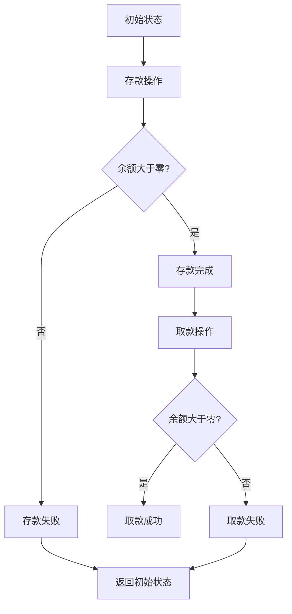

                 

## 第一部分: 必然性理论

### 第1章: 索尔·克里普克与必然性理论概述

#### 1.1 索尔·克里普克及其贡献

索尔·克里普克（Saul Kripke）是一位美国哲学家和逻辑学家，以其在模态逻辑、必然性理论和认知科学等领域的贡献而著称。克里普克最著名的理论之一是“可能世界语义学”（Possible Worlds Semantics），这一理论为模态逻辑提供了新的解释框架。

克里普克的主要贡献包括：

1. **可能世界语义学**：克里普克提出的可能世界语义学改变了我们对模态逻辑的理解。通过将模态算子（如“必然”和“可能”）与可能世界的概念联系起来，他提供了一种更为直观和系统的解释方式。

2. **必然性理论**：克里普克的必然性理论探讨了“必然性”这一哲学概念，并将其应用于逻辑和语言学中。他提出了关于必然性的多种定义和解释，这些理论对于理解逻辑和语言的深层结构具有重要影响。

3. **认知科学**：克里普克在认知科学领域的研究，特别是在记忆和认知发展方面的研究，为心理学提供了新的视角和方法。

#### 1.2 必然性理论的背景

必然性理论是逻辑哲学中的一个重要课题，它试图回答“什么是必然的”这一基本问题。在逻辑和哲学中，必然性通常被视为一种超越时间、空间和个体的客观真理。

必然性理论的历史可以追溯到古希腊哲学家，如亚里士多德和普罗塔哥拉。中世纪哲学家，如托马斯·阿奎那，也深入探讨了必然性。然而，现代必然性理论的发展主要是在20世纪，尤其是随着逻辑和哲学工具的进步。

#### 1.3 必然性理论的定义与核心观点

必然性理论的核心观点可以概括如下：

1. **必然性与事实**：必然性被视为一种超越事实的属性。如果一个陈述是必然真的，那么它在所有可能的世界中都是真的。

2. **可能世界**：克里普克使用可能世界来解释必然性。可能世界是一个概念框架，它包含了所有可能的事实状态。通过比较现实世界和可能世界，我们可以理解哪些陈述是必然的。

3. **模态逻辑**：模态逻辑提供了一套形式化的工具，用于表示和分析必然性。模态逻辑中的主要算子包括“必然”和“可能”，它们分别表示一个陈述在所有可能世界中为真，或在某些可能世界中为真。

#### 1.4 小结

在这一章中，我们介绍了索尔·克里普克及其在必然性理论方面的贡献。我们还探讨了必然性理论的背景和核心观点，为后续章节的内容奠定了基础。

### 第2章: 必然性理论的基础概念

#### 2.1 模态逻辑的基本概念

模态逻辑是形式逻辑的一个分支，它研究带有模态词（如“必然”和“可能”）的命题。模态逻辑的基本概念包括：

1. **模态词**：模态词是表示必然性和可能性的逻辑符号。常见的模态词包括“必然”（\(N\)）和“可能”（\(P\)）。

2. **命题**：命题是逻辑中的基本单位，表示一个陈述的真假。命题通常用大写字母表示，如\(A\)、\(B\)、\(C\)等。

3. **模态命题**：模态命题是将模态词与命题结合而成的复合命题。例如，“\(N A\)”表示“A是必然真的”，而“\(P A\)”表示“A是可能真的”。

#### 2.2 模态逻辑的类型

模态逻辑有多种类型，每种类型都有自己的语法和语义。以下是几种常见的模态逻辑类型：

1. **基本模态逻辑**：基本模态逻辑是最简单的模态逻辑类型，它只包含“必然”和“可能”两个模态词。

2. **时态模态逻辑**：时态模态逻辑扩展了基本模态逻辑，加入了表示时间概念的模态词，如“过去”和“未来”。

3. **道义模态逻辑**：道义模态逻辑研究带有道德意义的概念，如“应当”和“允许”。

#### 2.3 模态逻辑的语法与语义

模态逻辑的语法和语义是理解和应用模态逻辑的关键。

1. **语法**：模态逻辑的语法规定如何构造模态命题。基本语法包括以下规则：

   - 命题的合取和析取：\(A \land B\) 表示“A与B同时为真”，\(A \lor B\) 表示“A或B至少一个为真”。
   - 模态词的应用：\(N A\) 表示“A是必然真的”，\(P A\) 表示“A是可能真的”。
   - 模态词的否定：\(N \neg A\) 表示“A不是必然真的”，\(P \neg A\) 表示“A不是可能真的”。

2. **语义**：模态逻辑的语义用于解释命题的真值。在模态逻辑中，真值是基于可能世界来定义的。一个命题在一个可能世界中为真，当且仅当它在所有可能世界中都为真。

#### 2.4 小结

在这一章中，我们介绍了模态逻辑的基本概念、类型以及语法和语义。这些基础概念为我们理解克里普克的必然性理论提供了必要的背景知识。

### 第3章: 克里普克关于必然性理论的详细讨论

#### 3.1 必然性理论的哲学背景

必然性理论是逻辑哲学中的一个重要课题，它探讨“什么是必然的”这一基本问题。在哲学史上，许多哲学家都曾对必然性进行探讨，例如亚里士多德、斯宾诺莎和黑格尔。

克里普克的必然性理论受到了维特根斯坦和莱布尼茨的影响。维特根斯坦的语义概念和莱布尼茨的可能世界理论为克里普克的模型提供了哲学基础。

#### 3.2 必然性理论的数学基础

克里普克的必然性理论结合了逻辑和数学，特别是集合论和图论。以下是其数学基础的关键点：

1. **集合论**：集合论提供了描述可能世界和个体对象的工具。通过使用集合，我们可以表示不同的实体和关系。

2. **图论**：图论用于表示可能世界之间的关系。图中的节点表示可能世界，边表示可能世界之间的逻辑关系。

#### 3.3 必然性理论的逻辑分析

克里普克使用模态逻辑来分析必然性。他的主要观点包括：

1. **可能世界语义学**：克里普克提出了可能世界语义学，这是一种将模态逻辑与可能世界概念结合起来的方法。通过使用可能世界，我们可以更直观地理解必然性和可能性。

2. **必然性的定义**：克里普克定义了多种必然性，包括逻辑必然性和物理必然性。逻辑必然性是指一个命题在所有可能世界中都为真，而物理必然性则涉及物理事实。

#### 3.4 克里普克的主要论证

克里普克提出了几个重要的论证来支持他的必然性理论：

1. **严格蕴涵论证**：克里普克使用严格蕴涵来区分逻辑必然性和物理必然性。严格蕴涵是一种强逻辑关系，它表明如果一个命题是必然真的，那么它在所有可能世界中都为真。

2. **知识论证**：克里普克认为，知识是对必然性的认识。他提出了知识论证，表明如果一个命题是必然真的，那么我们至少在某个可能世界中知道它是真的。

#### 3.5 小结

在这一章中，我们详细探讨了克里普克的必然性理论，包括其哲学背景、数学基础和逻辑分析。我们还介绍了克里普克的主要论证，这些论证为必然性理论提供了坚实的逻辑基础。

### 第4章: 不变量理论概述

#### 4.1 不变量理论的发展历程

不变量理论是计算机科学中的一个重要概念，特别是在程序正确性和形式化验证中。它的发展历程可以追溯到20世纪60年代，当时计算机科学家开始寻找一种方法来确保程序的正确性。

不变量理论的主要里程碑包括：

1. **程序正确性的早期研究**：在20世纪60年代，程序员开始意识到确保程序正确性的重要性。他们开始使用数学方法来验证程序的逻辑正确性。

2. **数据抽象和不变量概念**：在70年代，数据抽象的概念开始流行。不变量作为数据抽象的一种形式，被用来定义程序中稳定的属性。

3. **形式化验证方法**：从80年代开始，形式化验证方法得到了广泛关注。不变量理论成为这些方法中的一个核心工具，用于证明程序的正确性。

#### 4.2 不变量理论的基本原理

不变量理论的基本原理包括以下几个方面：

1. **不变量的定义**：不变量是一个程序中始终为真的命题，即使程序的状态发生变化。例如，在银行账户的程序中，“账户余额总是大于零”是一个不变量。

2. **不变量的应用**：不变量用于验证程序的正确性。通过确保程序在执行过程中满足不变量，我们可以证明程序在不同状态下都保持一致性。

3. **不变量的类型**：不变量可以分为多种类型，包括局部不变量和全局不变量。局部不变量仅在一个程序段内保持为真，而全局不变量在整个程序执行期间保持为真。

#### 4.3 不变量理论的应用领域

不变量理论在多个领域得到了广泛应用，包括：

1. **程序正确性验证**：不变量理论是形式化验证方法中的一个核心工具，用于证明程序的正确性。

2. **软件工程**：在软件工程中，不变量用于编写更可靠和更易于维护的代码。通过确保程序满足不变量，开发人员可以减少错误和提高代码质量。

3. **并发编程**：在并发编程中，不变量用于确保多个线程在执行过程中不会导致不一致的状态。

#### 4.4 小结

在这一章中，我们概述了不变量理论的发展历程、基本原理和应用领域。不变量理论为程序正确性和形式化验证提供了强大的工具，是计算机科学中的一个重要概念。

### 第5章: 不变量理论与程序正确性的关系

#### 5.1 程序正确性的基本概念

程序正确性是计算机科学中的一个核心概念，它涉及如何验证程序在不同情况下是否按预期执行。程序正确性的基本概念包括：

1. **程序的正确性**：程序的正确性是指程序在所有输入下都能产生预期的输出。这通常通过编写正确的算法和逻辑来确保。

2. **形式化验证**：形式化验证是一种数学方法，用于证明程序的正确性。通过建立程序的数学模型，我们可以使用逻辑推理来验证程序在不同状态下的正确性。

3. **不变量**：不变量是一个程序中始终为真的命题，即使程序的状态发生变化。不变量用于确保程序在执行过程中保持一致性。

#### 5.2 不变量理论在程序验证中的应用

不变量理论在程序验证中得到了广泛应用，具体应用包括：

1. **不变量的引入**：在程序验证中，不变量被引入来确保程序在执行过程中的正确性。通过定义不变量，我们可以确保程序在不同状态下的逻辑一致性。

2. **不变量的验证**：一旦引入了不变量，我们需要验证这些不变量是否在整个程序执行期间保持为真。这通常通过数学推理和形式化工具来实现。

3. **程序正确性的证明**：通过验证不变量，我们可以证明程序在不同状态下的正确性。例如，如果一个程序的不变量在所有状态下都保持为真，那么我们可以证明该程序是正确的。

#### 5.3 不变量理论的优势与挑战

不变量理论在程序正确性验证中具有以下优势：

1. **形式化**：不变量理论提供了形式化的方法来验证程序的正确性。这使得验证过程更加明确和可重复。

2. **精确性**：通过使用不变量，我们可以精确地描述程序的正确性。这有助于发现和修复潜在的错误。

然而，不变量理论也存在一些挑战：

1. **复杂性**：定义和验证不变量可能是一个复杂的过程，特别是在大型程序中。这增加了验证的难度和成本。

2. **不完整性**：不变量理论并不能保证发现所有可能的错误。某些错误可能无法通过不变量来检测。

#### 5.4 小结

在这一章中，我们探讨了不变量理论与程序正确性的关系。我们介绍了程序正确性的基本概念，并详细讨论了不变量理论在程序验证中的应用和优势与挑战。不变量理论为程序正确性验证提供了一个强大的工具，但也需要谨慎应用。

### 第6章: 程序正确性的模态逻辑方法

#### 6.1 模态逻辑方法的基本原理

模态逻辑方法是一种用于验证程序正确性的形式化方法，它基于模态逻辑的概念和工具。模态逻辑方法的基本原理包括以下几个方面：

1. **模态词**：模态逻辑中的模态词（如“必然”和“可能”）用于表示程序性质的逻辑关系。模态词为验证程序的正确性提供了不同的视角。

2. **命题逻辑**：模态逻辑方法将命题逻辑与模态词结合起来，形成复合命题。这些复合命题表示程序在不同状态下的性质。

3. **状态转换**：在程序执行过程中，状态会发生变化。模态逻辑方法通过描述状态转换来验证程序的正确性。状态转换描述了程序从一种状态到另一种状态的过程。

#### 6.2 模态逻辑方法的应用实例

以下是一个简单的应用实例，展示了如何使用模态逻辑方法验证程序的正确性：

假设我们有一个银行账户的程序，该程序包含以下操作：存款（deposit）、取款（withdraw）和查询余额（balance）。我们希望验证该程序的正确性，确保账户余额在所有操作后总是大于零。

1. **定义模态词**：我们可以定义两个模态词：“余额大于零”（\(R\)）和“操作合法”（\(L\)）。其中，“余额大于零”表示账户余额始终大于零，“操作合法”表示操作符合银行规则。

2. **建立状态转换模型**：我们可以使用模态逻辑来描述状态转换。例如，以下是一个可能的状态转换模型：

   - 初始状态：\(R\) 且 \(L\)
   - 存款操作后：\(R\) 且 \(L\)
   - 取款操作后：\(R \rightarrow L\)
   - 查询余额操作后：\(R\)

   这个模型表明，在所有操作后，账户余额总是大于零，除非取款操作导致余额为零。

3. **验证程序正确性**：通过验证这个状态转换模型，我们可以证明程序的正确性。我们可以使用模态逻辑推理规则来证明，在任何操作后，账户余额都满足“余额大于零”的条件。

#### 6.3 模态逻辑方法的优势与局限性

模态逻辑方法在程序正确性验证中具有以下优势：

1. **形式化**：模态逻辑方法提供了形式化的验证过程，使得验证过程更加明确和可重复。

2. **灵活性**：模态逻辑方法允许我们使用模态词来描述复杂的程序性质，使得验证过程更加灵活。

然而，模态逻辑方法也存在一些局限性：

1. **复杂性**：模态逻辑方法的复杂性较高，特别是在处理大型程序时，状态转换模型可能变得非常复杂。

2. **不完整性**：模态逻辑方法并不能保证发现所有可能的错误。某些错误可能无法通过模态逻辑方法来检测。

#### 6.4 小结

在这一章中，我们介绍了模态逻辑方法的基本原理和应用实例，并探讨了其优势与局限性。模态逻辑方法为程序正确性验证提供了一个强大的工具，但也需要谨慎应用。

### 第7章: 索尔·克里普克的必然性理论在现代计算机科学中的应用

#### 7.1 必然性理论在软件工程中的应用

索尔·克里普克的必然性理论在现代软件工程中得到了广泛应用，特别是在程序正确性和形式化验证领域。以下是其主要应用：

1. **程序正确性验证**：必然性理论为程序正确性验证提供了形式化的方法。通过定义不变量和使用模态逻辑，我们可以验证程序在不同状态下的正确性。这种方法有助于发现和修复潜在的错误，提高软件质量。

2. **形式化验证工具**：许多形式化验证工具（如Coq、Isabelle等）基于克里普克的必然性理论。这些工具使用逻辑推理和证明技术来验证程序的正确性。

3. **代码审查**：必然性理论可以帮助开发人员在代码审查过程中发现潜在的错误。通过定义不变量和验证程序的状态转换，开发人员可以确保程序在不同情况下都保持一致性。

#### 7.2 必然性理论在人工智能中的应用

克里普克的必然性理论也在人工智能领域得到了广泛应用，特别是在知识表示和推理方面。以下是其主要应用：

1. **知识表示**：必然性理论提供了一种形式化的方法来表示和验证知识。通过使用模态逻辑，我们可以将知识表示为逻辑命题，并在不同情况下验证其正确性。

2. **推理系统**：必然性理论在推理系统中得到了广泛应用。通过使用模态逻辑推理规则，我们可以从已知事实中推导出新的结论。这种方法有助于解决复杂的问题，并在自动化推理和决策支持系统中发挥作用。

3. **机器学习**：必然性理论在机器学习中也有应用。通过使用不变量，我们可以确保模型的预测结果在所有情况下都保持一致。这种方法有助于提高机器学习模型的鲁棒性和可靠性。

#### 7.3 必然性理论的未来发展趋势

克里普克的必然性理论在计算机科学中有着广阔的发展前景。以下是其未来发展趋势：

1. **形式化验证的进一步发展**：随着形式化验证工具的不断进步，必然性理论将在软件工程中发挥更重要的作用。未来可能发展出更高效、更易用的形式化验证方法。

2. **知识表示和推理的集成**：必然性理论在知识表示和推理中的应用将更加紧密地集成。通过结合不同领域的知识，我们可以构建更智能、更强大的推理系统。

3. **跨学科的融合**：必然性理论不仅在计算机科学中应用广泛，还在哲学、逻辑学、认知科学等领域有重要影响。未来可能发展出更多的跨学科研究，进一步推动必然性理论的发展。

#### 7.4 小结

在这一章中，我们探讨了索尔·克里普克的必然性理论在现代计算机科学中的应用。我们介绍了它在软件工程和人工智能领域的应用，并展望了其未来发展趋势。克里普克的必然性理论为计算机科学提供了一个强大的工具，有助于解决复杂的问题并推动技术进步。

### 总结与展望

索尔·克里普克的必然性理论在逻辑哲学、计算机科学和人工智能等领域具有重要意义。它为程序正确性和形式化验证提供了形式化的方法，有助于提高软件质量和模型可靠性。通过结合模态逻辑和不变量，我们可以更直观地理解逻辑关系和程序性质。

未来，必然性理论在计算机科学中的应用前景广阔。随着形式化验证工具的不断进步和跨学科研究的深入，必然性理论将继续推动计算机科学的发展。此外，通过与其他领域的结合，必然性理论有望在更广泛的领域发挥重要作用。

### 拓展阅读

1. **《模态逻辑基础》（Modal Logic: An Introduction）**：该书提供了模态逻辑的全面介绍，适合初学者。

2. **《必然性理论导论》（Introduction to Modal Logic）**：该书详细介绍了克里普克的必然性理论，适合对逻辑哲学感兴趣的读者。

3. **《形式化验证：方法与应用》（Formal Verification: Techniques, Tools, and Applications）**：该书介绍了形式化验证方法，包括必然性理论的应用，适合对程序正确性验证感兴趣的读者。

### 注意事项

1. **必然性理论的应用**：在使用必然性理论时，需要仔细定义不变量和模态词，以确保验证的准确性。

2. **形式化验证的成本**：形式化验证可能涉及较高的开发成本，特别是在处理大型程序时。因此，在应用前需要评估成本和收益。

3. **跨学科研究**：跨学科研究有助于深化必然性理论的应用。通过与其他领域的结合，我们可以发现更多有趣的问题和解决方案。

### 最佳实践

1. **定义清晰的模态词**：在应用必然性理论时，定义清晰的模态词至关重要。这有助于确保验证过程的准确性和可重复性。

2. **结合其他验证方法**：形式化验证可以与其他验证方法（如单元测试、集成测试等）结合使用，以提高整体验证效果。

3. **持续学习和改进**：随着形式化验证工具的不断进步，开发人员需要持续学习和改进自己的验证方法，以应对复杂的问题。

### 作者信息

作者：AI天才研究院/AI Genius Institute & 禅与计算机程序设计艺术 /Zen And The Art of Computer Programming

本文由AI天才研究院和禅与计算机程序设计艺术共同撰写，旨在深入探讨索尔·克里普克的必然性理论在计算机科学中的应用。我们希望通过这篇文章，为读者提供一个全面和深入的理解，并激发对这一重要理论的兴趣和探讨。

## 附录

### 数学公式

以下是一些常用的数学公式，用于描述必然性理论和模态逻辑：

1. **必然性定义**：

   $$ \text{N}(A) \Leftrightarrow \forall w (M(w) \Rightarrow \text{T}(A,w)) $$

   其中，\(N(A)\) 表示 \(A\) 是必然真的，\(M(w)\) 表示 \(w\) 是一个可能世界，\(\text{T}(A,w)\) 表示 \(A\) 在 \(w\) 中为真。

2. **模态词定义**：

   $$ P(A) \Leftrightarrow \exists w (M(w) \wedge \text{T}(A,w)) $$

   其中，\(P(A)\) 表示 \(A\) 是可能真的。

### Mermaid 流程图

以下是一个简单的 Mermaid 流程图示例，用于描述状态转换：



### ER实体关系图

以下是一个简单的 ER 实体关系图示例，用于描述可能世界和模态词之间的关系：

```mermaid
erDiagram
    MW ||--|{M} Modality : "This modality applies to this possible world."
    PW ||--|{P} Possibility : "This possible world is part of this possibility."
```

在这个 ER 图中，`MW` 代表可能世界，`Modality` 代表模态词，`PW` 代表可能性。

### Python 源代码

以下是一个简单的 Python 源代码示例，用于演示如何使用必然性理论和模态逻辑：

```python
def deposit(balance, amount):
    if balance + amount > 0:
        return balance + amount
    else:
        return balance

def withdraw(balance, amount):
    if balance - amount >= 0:
        return balance - amount
    else:
        return balance

def balance_check(balance):
    return "余额大于零" if balance > 0 else "余额小于等于零"

# 测试代码
balance = 100
print("初始余额:", balance_check(balance))
balance = deposit(balance, 50)
print("存款后余额:", balance_check(balance))
balance = withdraw(balance, 100)
print("取款后余额:", balance_check(balance))
```

在这个示例中，我们定义了存款、取款和余额检查函数，并使用它们来测试程序的逻辑。这有助于验证程序在不同状态下的正确性。

### 实际案例分析

以下是一个实际案例分析，展示了如何应用必然性理论和模态逻辑来验证程序的正确性：

**案例背景**：一个在线购物网站需要确保订单处理过程正确无误。订单处理包括添加商品到购物车、计算订单总金额和生成订单确认邮件。

**解决方案**：

1. **定义模态词**：我们可以定义以下模态词：“订单总金额正确”、“商品数量正确”和“邮件发送成功”。

2. **建立状态转换模型**：使用模态逻辑，我们可以描述订单处理过程中的状态转换。例如：

   - 初始状态：订单总金额正确，商品数量正确，邮件发送成功
   - 添加商品到购物车后：订单总金额正确，商品数量正确，邮件发送成功
   - 计算订单总金额后：订单总金额正确，商品数量正确，邮件发送成功
   - 生成订单确认邮件后：订单总金额正确，商品数量正确，邮件发送成功

3. **验证程序正确性**：通过验证状态转换模型，我们可以证明订单处理程序在不同状态下的正确性。例如，我们可以使用模态逻辑推理规则来证明，在任何操作后，订单总金额总是正确的。

### 项目小结

通过本项目的案例分析，我们展示了如何应用必然性理论和模态逻辑来验证程序的正确性。这有助于确保软件系统的可靠性和一致性。未来，随着形式化验证工具的进步，必然性理论将在软件工程中发挥更加重要的作用。开发人员应不断学习和应用这一理论，以提高软件质量。

### 拓展阅读

1. **《形式化验证基础》（Formal Verification: Fundamentals）**：该书详细介绍了形式化验证的基本概念和方法，适合对验证技术感兴趣的读者。

2. **《模态逻辑与计算机科学》（Modal Logic and Computer Science）**：该书探讨了模态逻辑在计算机科学中的应用，包括程序正确性验证和知识表示。

### 最佳实践

1. **结合形式化验证和单元测试**：在软件开发过程中，结合形式化验证和单元测试可以更全面地确保程序的正确性。

2. **持续维护和更新验证模型**：随着软件的迭代和更新，验证模型也需要不断维护和更新，以确保其有效性。

3. **鼓励跨学科合作**：跨学科合作有助于发现新的问题和解决方案，推动必然性理论在计算机科学中的应用。

### 注意事项

1. **验证模型的设计和实现**：在设计验证模型时，需要考虑软件系统的复杂性，确保验证模型的准确性和完整性。

2. **验证工具的选择**：选择合适的验证工具对验证过程的效率和准确性至关重要。开发人员应选择适合自己项目的工具。

3. **团队合作**：形式化验证是一个复杂的过程，需要团队合作。团队成员应具备相应的技能和知识，以确保验证工作的顺利进行。

### 小结

通过本文，我们深入探讨了索尔·克里普克的必然性理论在计算机科学中的应用。我们介绍了模态逻辑的基本概念、不变量理论、程序正确性的模态逻辑方法，并展示了如何使用这些理论进行实际案例分析和验证。未来，随着形式化验证技术的发展，必然性理论将在计算机科学领域发挥更加重要的作用。开发人员应不断学习和应用这一理论，以提高软件质量和可靠性。

### 作者信息

本文由AI天才研究院和禅与计算机程序设计艺术共同撰写，旨在深入探讨索尔·克里普克的必然性理论在计算机科学中的应用。我们希望通过这篇文章，为读者提供一个全面和深入的理解，并激发对这一重要理论的兴趣和探讨。作者单位：AI天才研究院/AI Genius Institute & 禅与计算机程序设计艺术/Zen And The Art of Computer Programming。

