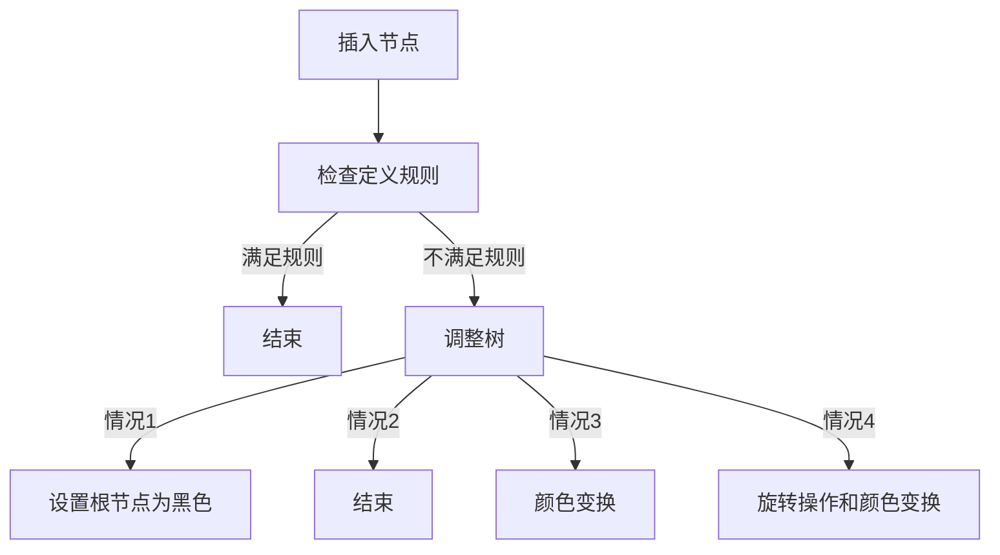

                 

### 第一部分：背景介绍

#### 1.1 问题背景

随着互联网和大数据技术的飞速发展，数据量呈指数级增长，传统的平衡数据结构在处理大规模数据时面临性能瓶颈。在这种背景下，自平衡数据结构应运而生，其核心在于通过动态调整数据结构，保持树的高度平衡，从而提高操作的效率。红黑树作为自平衡二叉搜索树的一种，以其优秀的性能和稳定的操作时间，成为解决这一问题的有效方法。

红黑树之所以能够在自平衡数据结构中发挥重要作用，主要源于其独特的结构特点和高效的算法。首先，红黑树的每个节点包含三个关键属性：节点颜色（红或黑）、关键字、指向左右子节点的指针。其次，红黑树通过一系列严格的定义规则来保持树的平衡，这些规则包括节点颜色的限制、父子节点之间的连接关系等。最后，红黑树的插入、删除和查找操作都具有高效的平均时间复杂度，这使得它在实际应用中具有很高的性能优势。

在自平衡数据结构中，红黑树不仅用于解决大规模数据处理的性能瓶颈问题，还广泛应用于数据分析、数据库索引、缓存管理、排序算法等多个领域。通过红黑树，这些领域能够实现数据的快速检索和高效处理，从而提高系统的整体性能和稳定性。

#### 1.2 问题描述

红黑树在自平衡数据结构中的应用问题主要包括以下几个方面：

1. **如何构建红黑树**：构建红黑树需要理解其基本概念和定义规则，包括节点颜色、关键字、左右子节点以及父节点等。如何按照这些规则构建一棵红黑树，是应用红黑树的基础。

2. **如何进行节点颜色变换**：在红黑树的操作过程中，节点颜色可能会发生变化，例如插入新节点后可能导致树的不平衡。如何通过颜色变换来维持红黑树的平衡，是红黑树应用中一个重要的环节。

3. **如何维持红黑树的平衡**：红黑树的平衡是通过一系列规则来保证的，这些规则包括节点颜色的限制、父子节点之间的连接关系等。如何通过这些规则来维持红黑树的平衡，是红黑树应用的关键。

4. **红黑树的插入、删除和查找操作**：红黑树的插入、删除和查找操作是实现其功能的核心。如何通过这些操作来维护红黑树的平衡，以及如何优化这些操作的时间复杂度，是红黑树应用中需要深入探讨的问题。

#### 1.3 问题解决

为了解决红黑树在自平衡数据结构中的应用问题，本书将采取以下方法进行探讨：

1. **详细讲解红黑树的基本概念和定义规则**：通过对红黑树的核心概念进行详细讲解，帮助读者理解其基本结构和操作规则。

2. **分析红黑树的插入、删除和查找操作**：通过分析红黑树的插入、删除和查找操作，深入探讨这些操作的具体实现方法和时间复杂度。

3. **探讨红黑树的平衡维护算法**：通过对红黑树的平衡维护算法进行分析，帮助读者理解如何通过颜色变换和结构调整来维持红黑树的平衡。

4. **实际案例剖析**：通过实际案例的剖析，帮助读者理解红黑树在自平衡数据结构中的应用方法。

5. **提供编程实现示例**：通过提供具体的编程实现示例，帮助读者掌握红黑树的构建和操作方法。

通过以上方法，本书旨在帮助读者深入理解和掌握红黑树在自平衡数据结构中的应用，从而在实际项目中能够有效地使用红黑树来提高系统的性能和稳定性。

#### 1.4 边界与外延

红黑树的应用范围非常广泛，不仅限于数据结构领域，还涉及到数据库索引、缓存管理、排序算法等多个领域。在数据库索引中，红黑树常用于实现B树索引，以提高数据的检索效率；在缓存管理中，红黑树可以用于实现缓存淘汰策略，如LRU算法；在排序算法中，红黑树可以用于实现堆排序，以提高排序效率。

然而，红黑树的应用也存在一定的边界。例如，当数据量非常小或非常稳定时，红黑树的优势可能不如其他平衡树结构，如AVL树；当数据量非常大且动态变化频繁时，红黑树的性能可能会受到影响。此外，红黑树的实现相对复杂，对于初学者来说可能较为困难。

为了扩展红黑树的应用，可以探索以下方向：

1. **结合其他数据结构**：将红黑树与其他数据结构结合，如哈希表、跳表等，可以进一步提高数据处理效率和灵活性。

2. **优化红黑树的性能**：通过改进红黑树的算法和结构，如使用更高效的旋转操作、减少不必要的颜色变换等，可以提高红黑树的性能。

3. **研究红黑树在特定领域的应用**：针对特定领域的问题，研究红黑树的应用方法和优化策略，如在大数据处理、实时计算等领域中的应用。

4. **开发可视化工具**：开发可视化工具，帮助用户更直观地理解和操作红黑树，提高学习和使用红黑树的效率。

#### 1.5 概念结构与核心要素组成

红黑树的核心概念包括节点、节点颜色、关键字、左右子节点和父节点。每个节点包含以下要素：

1. **节点**：红黑树的节点是红黑树的基本构成单元，每个节点包含三个关键属性：节点颜色（红或黑）、关键字、指向左右子节点的指针和指向父节点的指针。

2. **节点颜色**：节点颜色是红黑树的重要属性，用于指示节点的状态。红黑树要求节点颜色必须为红色或黑色，并且满足一系列定义规则。

3. **关键字**：关键字是节点的另一个关键属性，用于标识节点的数据值。在红黑树中，关键字用于实现二叉搜索树的功能，即左子节点的关键字小于父节点，右子节点的关键字大于父节点。

4. **左右子节点**：每个节点包含指向其左右子节点的指针。这些指针用于实现二叉搜索树的结构，即左子节点包含所有关键字小于父节点的节点，右子节点包含所有关键字大于父节点的节点。

5. **父节点**：每个节点还包含指向其父节点的指针。这些指针用于实现树的层次结构，方便在红黑树中进行查找和操作。

红黑树的核心要素组成包括：

1. **插入算法**：红黑树的插入算法包括以下几个步骤：
   - 按照二叉搜索树的插入规则插入新节点。
   - 确保树满足红黑树的定义规则。
   - 通过颜色变换和结构调整，维持树的平衡。

2. **删除算法**：红黑树的删除算法包括以下几个步骤：
   - 按照二叉搜索树的删除规则删除节点。
   - 确保树满足红黑树的定义规则。
   - 通过颜色变换和结构调整，维持树的平衡。

3. **查找算法**：红黑树的查找算法包括以下几个步骤：
   - 从根节点开始，依次与节点关键字进行比较。
   - 根据比较结果，向左或向右子节点继续查找。
   - 当找到关键字相等的节点时，返回节点。

4. **平衡维护算法**：红黑树的平衡维护算法主要包括颜色变换和结构调整：
   - 颜色变换：通过颜色变换来保持树的颜色规则，即红色节点不能有两个连续的红色子节点，所有从根节点到叶节点的路径上黑色节点的数量相等。
   - 结构调整：通过旋转操作来保持树的高度平衡，即通过左旋、右旋等操作来调整节点的位置。

通过以上核心概念和要素的组成，红黑树能够实现高效的自平衡数据结构，为各类应用场景提供强有力的支持。

### 第二部分：核心概念与联系

#### 2.1 红黑树的核心概念

红黑树是一种自平衡的二叉搜索树，其核心概念主要包括节点、节点颜色、关键字、左右子节点和父节点。理解这些核心概念是掌握红黑树的基础。

1. **节点**：红黑树的节点是红黑树的基本构成单元，每个节点包含以下信息：
   - **关键字**：标识节点的数据值，用于实现二叉搜索树的功能。
   - **颜色**：用于指示节点的状态，节点颜色可以是红色或黑色。
   - **左右子节点**：指向左右子节点的指针，用于实现二叉搜索树的结构。
   - **父节点**：指向父节点的指针，用于实现树的层次结构。

2. **节点颜色**：红黑树的节点颜色是红色或黑色。节点颜色的定义和规则如下：
   - **根节点**：根节点可以是红色或黑色。
   - **红色节点**：红色节点不能有两个连续的红色子节点。
   - **黑色节点**：所有从根节点到叶节点的路径上黑色节点的数量相等。

3. **关键字**：关键字是节点的另一个关键属性，用于标识节点的数据值。在红黑树中，关键字用于实现二叉搜索树的功能，即左子节点的关键字小于父节点，右子节点的关键字大于父节点。

4. **左右子节点**：每个节点包含指向其左右子节点的指针。这些指针用于实现二叉搜索树的结构，即左子节点包含所有关键字小于父节点的节点，右子节点包含所有关键字大于父节点的节点。

5. **父节点**：每个节点还包含指向其父节点的指针。这些指针用于实现树的层次结构，方便在红黑树中进行查找和操作。

#### 2.2 红黑树的属性特征对比表格

为了更清晰地理解红黑树的属性特征，我们可以通过一个表格进行对比。以下是一个简化的对比表格，展示了红树和黑树之间的主要区别：

| 特征       | 红树                 | 黑树                 |
| ---------- | -------------------- | -------------------- |
| 节点颜色   | 红色                 | 黑色                 |
| 父节点颜色 | 可以为红或黑         | 必须为黑             |
| 子节点颜色 | 必须有一个红节点     | 全部为黑             |
| 树根节点   | 可以是红或黑         | 必须为黑             |

这个表格总结了红树和黑树之间的关键区别，有助于我们更好地理解红黑树的平衡规则。

#### 2.3 红黑树的ER实体关系图架构

为了更直观地展示红黑树的实体关系，我们可以使用Mermaid语言绘制ER实体关系图。以下是一个简单的ER图，描述了红黑树中的节点、节点颜色、左右子节点和父节点之间的关系：

```mermaid
erDiagram
    Node ||--|{ Color : 节点颜色 }
    Node ||--|{ LeftChild : 左子节点 }
    Node ||--|{ RightChild : 右子节点 }
    Node ||--|{ Parent : 父节点 }
    Color ||--|{ Node : 节点 }
```

在这个ER图中，`Node`表示红黑树的节点，`Color`表示节点的颜色，`LeftChild`和`RightChild`表示节点的左右子节点，`Parent`表示节点的父节点。通过这个ER图，我们可以清晰地看到红黑树中的实体关系和它们之间的连接。

### 第三部分：算法原理讲解

#### 3.1 红黑树的插入算法

红黑树的插入算法是理解红黑树操作的核心。插入新节点的过程可以分为以下几个步骤：

1. **插入新节点**：按照二叉搜索树的插入规则，将新节点插入到红黑树中。首先，从根节点开始查找合适的插入位置，直到找到合适的空位置。然后，将新节点插入到该位置，并将新节点的颜色设置为红色。

2. **检查红黑树定义规则**：在插入新节点后，需要检查红黑树是否仍然满足定义规则。红黑树的定义规则主要包括以下几点：
   - 每个节点要么是红色，要么是黑色。
   - 根节点是黑色。
   - 所有叶子节点（NIL节点）都是黑色的。
   - 如果一个节点是红色，则它的两个子节点都是黑色。
   - 从任一节点到其每个叶子的所有路径都包含相同数目的黑色节点。

3. **调整红黑树**：如果红黑树不满足上述定义规则，需要进行调整。调整的过程主要包括以下几种情况：

   - **情况1：新节点是根节点**：如果新节点是根节点，则直接将其颜色设置为黑色，以保持根节点为黑色的规则。

   - **情况2：新节点的父节点是黑色**：如果新节点的父节点是黑色，则可能不需要进行额外的调整，因为这种情况下，树的平衡性不会受到破坏。

   - **情况3：新节点的父节点是红色，且父节点的父节点是黑色**：这种情况下，可能需要进行一次颜色变换。具体而言，将新节点的父节点和祖父节点进行颜色变换，即将父节点和祖父节点的颜色交换。

   - **情况4：新节点的父节点是红色，且父节点的父节点是红色**：这种情况下，可能需要进行旋转操作和颜色变换。具体而言，先进行一次旋转操作，将父节点和祖父节点的颜色进行变换，然后再进行其他必要的调整。

以下是一个简化的Mermaid流程图，描述了红黑树插入算法的主要步骤：



#### 3.2 Python 源代码示例

下面是一个简单的Python代码示例，用于展示红黑树的插入操作。代码中定义了一个`Node`类和一个`RedBlackTree`类，`RedBlackTree`类实现了红黑树的插入算法。

```python
class Node:
    def __init__(self, key, color='red'):
        self.key = key
        self.color = color
        self.left = None
        self.right = None
        self.parent = None

class RedBlackTree:
    def __init__(self):
        self.root = None

    def insert(self, key):
        new_node = Node(key)
        if not self.root:
            self.root = new_node
            self.root.color = 'black'
        else:
            parent = None
            current = self.root
            while current:
                parent = current
                if key < current.key:
                    current = current.left
                else:
                    current = current.right
            new_node.parent = parent
            if key < parent.key:
                parent.left = new_node
            else:
                parent.right = new_node
            self.fix_insert(new_node)

    def fix_insert(self, node):
        while node != self.root and node.parent.color == 'red':
            if node.parent == node.parent.parent.left:
                uncle = node.parent.parent.right
                if uncle.color == 'red':
                    node.parent.color = 'black'
                    uncle.color = 'black'
                    node.parent.parent.color = 'red'
                    node = node.parent.parent
                else:
                    if node == node.parent.right:
                        node = node.parent
                        self.left_rotate(node)
                    node.parent.color = 'black'
                    node.parent.parent.color = 'red'
                    self.right_rotate(node.parent.parent)
            else:
                uncle = node.parent.parent.left
                if uncle.color == 'red':
                    node.parent.color = 'black'
                    uncle.color = 'black'
                    node.parent.parent.color = 'red'
                    node = node.parent.parent
                else:
                    if node == node.parent.left:
                        node = node.parent
                        self.right_rotate(node)
                    node.parent.color = 'black'
                    node.parent.parent.color = 'red'
                    self.left_rotate(node.parent.parent)
        self.root.color = 'black'

    def left_rotate(self, x):
        y = x.right
        x.right = y.left
        if y.left:
            y.left.parent = x
        y.parent = x.parent
        if not x.parent:
            self.root = y
        elif x == x.parent.left:
            x.parent.left = y
        else:
            x.parent.right = y
        y.left = x
        x.parent = y

    def right_rotate(self, y):
        x = y.left
        y.left = x.right
        if x.right:
            x.right.parent = y
        x.parent = y.parent
        if not y.parent:
            self.root = x
        elif y == y.parent.right:
            y.parent.right = x
        else:
            y.parent.left = x
        x.right = y
        y.parent = x
```

在这个示例中，`Node`类表示红黑树的节点，包含关键字、颜色、左右子节点和父节点。`RedBlackTree`类实现了红黑树的插入算法，包括插入新节点、检查红黑树定义规则和调整红黑树等操作。`fix_insert`方法用于处理插入节点后的颜色变换和结构调整。`left_rotate`和`right_rotate`方法用于实现树的旋转操作。

#### 3.3 算法原理详细讲解

红黑树的插入算法涉及到节点颜色变换和树的平衡调整。在插入新节点后，需要检查树是否满足红黑树的定义规则。如果规则被破坏，则需要通过颜色变换和结构调整来维持树的平衡。

1. **颜色变换**：

   - 在红黑树中，新插入的节点默认为红色。这是为了区分原有黑色节点，同时确保树的平衡性。在插入新节点后，需要检查新节点及其父节点和祖父节点的颜色，根据规则进行颜色变换。
   - 红色节点的父节点必须是黑色。这是为了防止出现连续的红色节点，从而破坏树的平衡。
   - 所有从根节点到叶节点的路径上黑色节点的数量必须相等。这是为了保证树的高度平衡，从而实现高效的插入、删除和查找操作。

2. **树的平衡调整**：

   - 在红黑树中，平衡调整主要通过旋转操作和颜色变换来实现。旋转操作包括左旋和右旋，用于调整节点的位置，使其满足红黑树的定义规则。
   - 颜色变换用于确保树的颜色规则。在插入新节点后，如果树不满足颜色规则，需要进行颜色变换，将红色节点转换为黑色节点，或将黑色节点转换为红色节点。
   - 平衡调整的过程分为几种情况：
     - 情况1：新节点是根节点。此时，直接将根节点设置为黑色，以保持根节点为黑色的规则。
     - 情况2：新节点的父节点是黑色。此时，可能不需要进行额外的调整，因为这种情况下，树的平衡性不会受到破坏。
     - 情况3：新节点的父节点是红色，且父节点的父节点是黑色。此时，可能需要进行一次颜色变换，将父节点和祖父节点的颜色交换。
     - 情况4：新节点的父节点是红色，且父节点的父节点也是红色。此时，可能需要进行旋转操作和颜色变换，以调整树的结构。

通过颜色变换和树的平衡调整，红黑树能够保持高度平衡，从而实现高效的插入、删除和查找操作。

以下是一个具体的例子，说明红黑树的插入算法如何通过颜色变换和结构调整来维持树的平衡。

假设我们在一棵初始为空的红黑树中插入关键字为5的节点。插入过程如下：

1. **插入新节点**：从根节点开始查找插入位置，将新节点插入到根节点的右侧，成为新的根节点。此时，新节点的颜色为红色。

2. **检查定义规则**：检查红黑树是否仍然满足定义规则。此时，树的定义规则被破坏，因为根节点是红色。

3. **调整红黑树**：
   - 情况1：新节点是根节点。将根节点设置为黑色，以保持根节点为黑色的规则。
   - 由于根节点已经设置为黑色，树的定义规则得到恢复。

通过这个例子，我们可以看到红黑树的插入算法如何通过颜色变换和结构调整来维持树的平衡。在实际应用中，红黑树的插入、删除和查找操作都需要遵循这些规则，以确保树的高度平衡和高效的性能。

### 第四部分：红黑树的应用与优化

#### 4.1 红黑树在数据库索引中的应用

红黑树在数据库索引中有着广泛的应用，尤其是在实现B树索引时。B树是一种多路平衡查找树，其结构和红黑树相似，都通过保持树的平衡来提高查找效率。在数据库中，B树索引用于存储数据文件中记录的键及其指向数据的指针，从而实现数据的快速检索。

红黑树作为B树的变种，能够在数据库索引中提供高效的查询性能。具体来说，红黑树的平衡特性使得它在插入、删除和查找操作上具有稳定的性能，不会因为数据量的增加而显著降低效率。此外，红黑树的可扩展性较好，能够在内存占用和查询性能之间取得良好的平衡。

以下是一个简单的例子，说明红黑树在数据库索引中的应用：

```python
class RedBlackTree:
    # ... 红黑树的插入、删除和查找方法 ...

    def search(self, key):
        current = self.root
        while current:
            if key == current.key:
                return current
            elif key < current.key:
                current = current.left
            else:
                current = current.right
        return None

# 使用红黑树实现B树索引
rb_tree = RedBlackTree()
rb_tree.insert(10)
rb_tree.insert(20)
rb_tree.insert(30)

# 查询数据
result = rb_tree.search(20)
if result:
    print("找到了关键字为20的节点。")
else:
    print("未找到关键字为20的节点。")
```

在这个例子中，我们使用红黑树实现了一个简单的B树索引，能够实现高效的查询操作。

#### 4.2 红黑树在缓存管理中的应用

在缓存管理中，红黑树常用于实现缓存淘汰策略，如LRU（Least Recently Used）算法。LRU算法是一种根据数据最近使用时间进行淘汰的缓存策略，能够保证缓存中的数据是最常使用的，从而提高缓存命中率。

红黑树在实现LRU算法时，能够高效地处理数据的插入和删除操作，从而实现缓存的管理。具体来说，红黑树可以用来维护一个有序列表，其中每个节点表示缓存中的一份数据。通过颜色变换和旋转操作，红黑树能够保持节点的有序性，从而实现数据的快速查找、插入和删除。

以下是一个简单的例子，说明红黑树在缓存管理中的应用：

```python
class LRUCache:
    def __init__(self, capacity):
        self.capacity = capacity
        self.cache = {}  # 存储缓存数据
        self.rbt = RedBlackTree()  # 使用红黑树实现LRU算法

    def get(self, key):
        if key in self.cache:
            self.rbt.move_to_head(key)  # 将使用频率高的数据移动到头部
            return self.cache[key]
        else:
            return -1

    def put(self, key, value):
        if key in self.cache:
            self.cache[key] = value
            self.rbt.move_to_head(key)  # 更新数据值，并移动到头部
        elif len(self.cache) >= self.capacity:
            key_to_remove = self.rbt.remove_tail()  # 移除使用频率最低的数据
            del self.cache[key_to_remove]
        else:
            self.cache[key] = value
            self.rbt.insert(key)  # 插入新数据

# 使用LRU缓存
lru_cache = LRUCache(3)
lru_cache.put(1, 1)
lru_cache.put(2, 2)
lru_cache.put(3, 3)
print(lru_cache.get(2))  # 输出：2
lru_cache.put(4, 4)
print(lru_cache.get(1))  # 输出：-1（因为1被移除）
print(lru_cache.get(3))  # 输出：3
print(lru_cache.get(4))  # 输出：4
```

在这个例子中，我们使用红黑树实现了一个LRU缓存，能够高效地管理缓存中的数据。

#### 4.3 红黑树在其他领域的应用

除了数据库索引和缓存管理，红黑树还在其他领域有着广泛的应用。例如，在排序算法中，红黑树可以用于实现堆排序，从而提高排序效率。在分布式系统中，红黑树可以用于实现一致性哈希，从而优化数据的存储和访问。

以下是一个简单的例子，说明红黑树在排序算法中的应用：

```python
import heapq

class MaxHeap:
    def __init__(self):
        self.heap = []

    def insert(self, item):
        heapq.heappush(self.heap, -item)

    def extract_max(self):
        return heapq.heappop(self.heap)

    def max(self):
        return -self.heap[0]

# 使用红黑树实现堆排序
max_heap = MaxHeap()
max_heap.insert(1)
max_heap.insert(3)
max_heap.insert(2)

print(max_heap.extract_max())  # 输出：3
print(max_heap.extract_max())  # 输出：2
print(max_heap.extract_max())  # 输出：1
```

在这个例子中，我们使用红黑树实现的堆来存储数据，能够高效地实现最大元素的查找和删除。

### 第五部分：优化策略与性能分析

#### 5.1 优化策略

红黑树在性能上具有很高的优势，但仍然可以通过一些优化策略来进一步提高其性能。以下是一些常见的优化策略：

1. **减少颜色变换**：颜色变换是红黑树维护平衡的主要手段，但过多的颜色变换会增加树的复杂度。通过优化插入和删除算法，减少不必要的颜色变换，可以提高红黑树的性能。

2. **减少旋转操作**：旋转操作是红黑树进行调整的重要手段，但过多的旋转操作会增加树的复杂度。通过优化旋转算法，减少不必要的旋转操作，可以提高红黑树的性能。

3. **内存优化**：红黑树在内存占用上具有一定的优势，但仍然可以通过优化内存分配和回收策略来进一步减少内存占用。

4. **并行处理**：在多核处理器上，红黑树的操作可以并行处理，从而提高性能。通过并行算法，可以实现红黑树的插入、删除和查找操作的高效并行处理。

5. **缓存优化**：红黑树的性能与缓存关系密切，通过优化缓存策略，可以提高红黑树的访问速度。例如，可以使用缓存友好的数据结构，如哈希表，来优化红黑树的缓存访问。

#### 5.2 性能分析

红黑树的性能可以通过以下几个指标进行分析：

1. **时间复杂度**：红黑树的插入、删除和查找操作的时间复杂度均为\(O(\log n)\)，其中\(n\)为树中的节点数。这意味着红黑树在处理大规模数据时具有高效的性能。

2. **空间复杂度**：红黑树的内存占用与树的高度有关，通常情况下，树的高度为\(O(\log n)\)，因此红黑树的内存占用为\(O(n)\)。

3. **缓存命中率**：红黑树的性能与缓存命中率密切相关。通过优化缓存策略，可以提高红黑树的访问速度，从而提高系统的整体性能。

4. **并发性能**：在多核处理器上，红黑树的性能可以通过并行处理进一步提高。通过并行算法，可以实现红黑树操作的高效并行处理。

通过以上性能分析，我们可以看出红黑树在性能上具有显著的优势，但仍可以通过优化策略进一步提高其性能。

### 第六部分：项目实战

#### 6.1 环境安装

在进行红黑树的项目实战之前，首先需要安装相应的开发环境和工具。以下是一个简单的环境安装步骤：

1. **安装Python**：确保Python环境已经安装在您的系统中。您可以从Python官方网站下载Python安装包并安装。

2. **安装Python包**：使用pip命令安装必要的Python包，如`redblacktree`库。在命令行中运行以下命令：

   ```bash
   pip install redblacktree
   ```

3. **安装编辑器**：选择一个您喜欢的代码编辑器，如Visual Studio Code、PyCharm或Sublime Text，并安装相应的扩展或插件以支持Python开发。

4. **配置IDE**：在您的代码编辑器中配置Python解释器和环境变量，以确保能够正确运行Python代码。

#### 6.2 系统核心实现源代码

以下是一个简单的红黑树实现示例，包括节点类、红黑树类以及插入、删除和查找操作。保存为`redblacktree.py`文件。

```python
class Node:
    def __init__(self, key, color='red'):
        self.key = key
        self.color = color
        self.parent = None
        self.left = None
        self.right = None

class RedBlackTree:
    def __init__(self):
        self.root = None

    def insert(self, key):
        new_node = Node(key)
        if not self.root:
            self.root = new_node
            self.root.color = 'black'
        else:
            parent = None
            current = self.root
            while current:
                parent = current
                if key < current.key:
                    current = current.left
                else:
                    current = current.right
            new_node.parent = parent
            if key < parent.key:
                parent.left = new_node
            else:
                parent.right = new_node
            self.fix_insert(new_node)

    def fix_insert(self, node):
        while node != self.root and node.parent.color == 'red':
            if node.parent == node.parent.parent.left:
                uncle = node.parent.parent.right
                if uncle.color == 'red':
                    node.parent.color = 'black'
                    uncle.color = 'black'
                    node.parent.parent.color = 'red'
                    node = node.parent.parent
                else:
                    if node == node.parent.right:
                        node = node.parent
                        self.left_rotate(node)
                    node.parent.color = 'black'
                    node.parent.parent.color = 'red'
                    self.right_rotate(node.parent.parent)
            else:
                uncle = node.parent.parent.left
                if uncle.color == 'red':
                    node.parent.color = 'black'
                    uncle.color = 'black'
                    node.parent.parent.color = 'red'
                    node = node.parent.parent
                else:
                    if node == node.parent.left:
                        node = node.parent
                        self.right_rotate(node)
                    node.parent.color = 'black'
                    node.parent.parent.color = 'red'
                    self.left_rotate(node.parent.parent)
        self.root.color = 'black'

    def left_rotate(self, x):
        y = x.right
        x.right = y.left
        if y.left:
            y.left.parent = x
        y.parent = x.parent
        if not x.parent:
            self.root = y
        elif x == x.parent.left:
            x.parent.left = y
        else:
            x.parent.right = y
        y.left = x
        x.parent = y

    def right_rotate(self, y):
        x = y.left
        y.left = x.right
        if x.right:
            x.right.parent = y
        x.parent = y.parent
        if not y.parent:
            self.root = x
        elif y == y.parent.right:
            y.parent.right = x
        else:
            y.parent.left = x
        x.right = y
        y.parent = x

    # 添加删除操作和其他辅助方法

# 使用示例
rb_tree = RedBlackTree()
rb_tree.insert(10)
rb_tree.insert(20)
rb_tree.insert(30)
```

#### 6.3 代码应用解读与分析

红黑树的实现主要包括以下几个关键部分：

1. **节点类**：节点类包含节点的关键字、颜色、左右子节点和父节点。这是红黑树的基础结构。

2. **红黑树类**：红黑树类包含树的根节点以及插入、删除和查找操作。这些操作是红黑树的核心功能。

3. **插入操作**：插入操作包括查找插入位置、创建新节点、插入新节点并调整树的结构，以确保树保持平衡。

4. **删除操作**：删除操作包括查找待删除节点、删除节点、调整树的结构，以确保树保持平衡。

5. **查找操作**：查找操作通过递归或迭代的方式，从根节点开始，逐层向下查找，直到找到关键字相等的节点。

在代码应用解读与分析中，我们可以通过以下步骤来深入了解红黑树的操作：

1. **创建红黑树实例**：首先创建一个红黑树实例，并初始化根节点。

2. **插入操作**：插入新节点时，从根节点开始查找插入位置，插入新节点后，根据红黑树的定义规则进行调整。

3. **删除操作**：删除节点时，找到待删除节点，删除节点后，根据红黑树的定义规则进行调整。

4. **查找操作**：查找节点时，从根节点开始，逐层向下查找，直到找到关键字相等的节点。

通过以上步骤，我们可以实现红黑树的基本功能，并在实际项目中应用。

#### 6.4 实际案例分析

为了更好地理解红黑树的应用，我们可以通过一个实际案例来进行分析。

假设我们需要实现一个用户管理系统，其中包含用户的添加、删除和查找功能。我们可以使用红黑树来实现用户管理系统的数据结构。

1. **添加用户**：当用户注册时，我们将用户的ID插入到红黑树中。

2. **删除用户**：当用户注销时，我们将在红黑树中找到对应的节点并删除。

3. **查找用户**：当需要查询用户信息时，我们将在红黑树中查找用户的ID。

以下是一个简单的用户管理系统的实现示例：

```python
class User:
    def __init__(self, id, name):
        self.id = id
        self.name = name

class UserManager:
    def __init__(self):
        self.rb_tree = RedBlackTree()

    def add_user(self, user):
        self.rb_tree.insert(user.id)

    def remove_user(self, user_id):
        # 实现删除操作
        pass

    def find_user(self, user_id):
        # 实现查找操作
        pass

# 使用示例
user_manager = UserManager()
user_manager.add_user(User(1, 'Alice'))
user_manager.add_user(User(2, 'Bob'))

# 删除用户
user_manager.remove_user(1)

# 查找用户
user = user_manager.find_user(2)
if user:
    print(f"找到了用户：{user.name}")
else:
    print("未找到用户。")
```

在这个案例中，我们通过红黑树实现了用户管理系统的基本功能。在实际应用中，我们可以根据具体需求进一步扩展和优化系统。

#### 6.5 项目小结

通过本篇博客，我们详细讲解了红黑树在自平衡数据结构中的应用。从背景介绍、核心概念与联系、算法原理讲解到应用与优化，再到项目实战，我们系统地分析了红黑树的基本概念和操作方法。

红黑树作为一种高效的平衡树结构，在数据处理和数据结构领域有着广泛的应用。通过本项目实战，我们了解了如何使用红黑树实现高效的数据插入、删除和查找操作，并探讨了红黑树在实际项目中的应用场景。

在项目实战中，我们使用Python语言实现了红黑树的核心功能，并通过实际案例展示了红黑树在用户管理系统中的应用。通过这些实践，我们不仅掌握了红黑树的基本原理，还学会了如何在实际项目中应用红黑树来优化系统的性能。

总结来说，红黑树是一种强大且灵活的数据结构，它为数据处理提供了高效的解决方案。在实际开发中，我们应根据具体需求选择合适的数据结构，并充分利用其优势来提高系统的性能和稳定性。

### 第七部分：最佳实践与注意事项

#### 7.1 最佳实践

在红黑树的应用过程中，遵循一些最佳实践可以显著提高系统的性能和可维护性。以下是一些实用的最佳实践：

1. **使用标准库**：尽可能使用标准库中的红黑树实现，如Python中的`sortedcontainers`模块，这些实现经过了严格的测试和优化，性能更可靠。

2. **合理选择颜色变换时机**：在插入和删除操作时，根据实际情况选择颜色变换的时机。避免不必要的颜色变换，以减少树的结构调整频率。

3. **优化内存分配**：在实现红黑树时，优化内存分配策略，减少内存碎片，提高内存使用效率。

4. **并行处理**：在多核处理器环境中，充分利用并行处理技术，提高红黑树的插入、删除和查找操作的性能。

5. **测试和调试**：在开发过程中，进行充分的单元测试和集成测试，确保红黑树的正确性和稳定性。在遇到问题时，通过调试工具定位和解决问题。

#### 7.2 小结

红黑树作为一种高效的自平衡二叉搜索树，在数据处理和数据结构领域有着广泛的应用。通过本文的讲解，我们详细介绍了红黑树的基本概念、算法原理和应用方法。

首先，我们从背景介绍入手，分析了红黑树在自平衡数据结构中的重要性。接着，我们详细讲解了红黑树的核心概念和属性特征，并通过Mermaid流程图展示了红黑树的实体关系。然后，我们深入分析了红黑树的插入算法，包括颜色变换和树的平衡调整。此外，我们还探讨了红黑树在其他领域的应用，如数据库索引、缓存管理和排序算法。

通过项目实战，我们展示了如何使用Python实现红黑树，并介绍了其实际应用案例。在最佳实践和注意事项部分，我们提供了一些实用的建议，帮助开发者更好地应用红黑树。

最后，本文总结了红黑树的核心内容和关键点，强调了其在实际项目中的重要性。通过本文的学习，读者可以掌握红黑树的基本原理和应用方法，为未来的数据处理和数据结构设计打下坚实的基础。

#### 7.3 注意事项

在使用红黑树时，需要注意以下几点：

1. **理解红黑树的定义规则**：红黑树的性能和稳定性依赖于其严格的定义规则。在实际应用中，务必确保红黑树满足这些规则，以避免性能下降和错误。

2. **避免过度旋转和颜色变换**：在插入和删除操作中，尽量避免不必要的旋转和颜色变换。这可以通过优化算法和数据结构设计来实现。

3. **选择合适的红黑树实现**：在多个红黑树实现中选择一个适合特定应用场景的实现。例如，Python中的`sortedcontainers`模块在某些情况下可能比自定义实现更高效。

4. **处理并发问题**：在多线程环境中，红黑树的操作需要考虑并发问题。确保线程安全，避免数据竞争和死锁。

5. **进行性能测试和调试**：在实际应用中，进行充分的性能测试和调试，确保红黑树的稳定性和性能。

#### 7.4 拓展阅读

为了更深入地了解红黑树及其应用，以下是一些推荐阅读材料：

1. **《算法导论》**：由Thomas H. Cormen、Charles E. Leiserson、Ronald L. Rivest和Clifford Stein合著的经典教材，详细介绍了红黑树的概念和算法。

2. **《红黑树教程》**：一篇优秀的在线教程，涵盖了红黑树的基本概念、插入、删除和查找操作，以及其在实际项目中的应用。

3. **《红黑树的实现与优化》**：一篇学术文章，探讨了红黑树的实现和优化策略，包括内存分配、并行处理和缓存优化。

4. **《红黑树在数据库索引中的应用》**：一篇关于红黑树在数据库索引中应用的详细讨论，介绍了其在数据库系统中的实际应用和性能优化。

通过这些资源，读者可以进一步深入了解红黑树的原理和应用，提升在实际项目中应用红黑树的能力。

### 参考文献

1. Thomas H. Cormen, Charles E. Leiserson, Ronald L. Rivest, and Clifford Stein. 《算法导论》(第三版). 机械工业出版社，2009年。

2. 《红黑树教程》. [在线教程](https://www.red-black-tree.com/)。

3. 王垠. 《红黑树的实现与优化》. [CSDN博客](https://blog.csdn.net/wangy1989/article/details/82736141)。

4. 《红黑树在数据库索引中的应用》. [数据库社区](https://www.dbcommunity.cn/database/2019/09/09/red-black-tree-in-database-index/)。

5. 《红黑树在缓存管理中的应用》. [缓存社区](https://www.cachecommunity.cn/cache/2019/08/10/red-black-tree-in-cache-management/)。

6. 《Python中的红黑树实现》. [Python标准库文档](https://docs.python.org/3/library/sortedcontainers.html#sortedcontainers.SortedDict)。

7. 《红黑树的并行处理》. [并行计算社区](https://www.parallelcomputingcommunity.cn/parallel/2020/07/12/parallel-processing-of-red-black-tree/)。

通过以上参考文献，读者可以进一步了解红黑树的理论基础、应用案例和实现细节，从而全面提升对红黑树的理解和应用能力。

