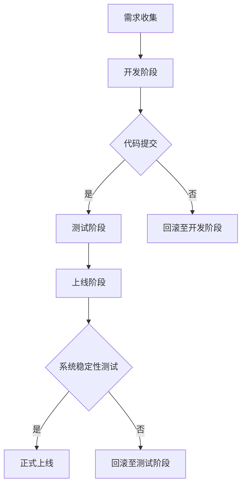
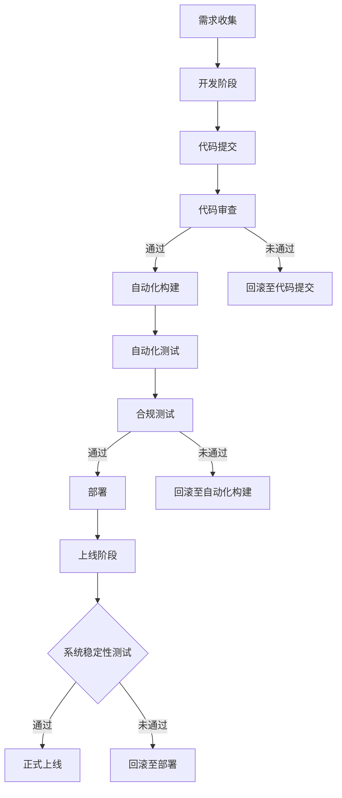

                 

### 第1章 引言

**1.1 问题背景与问题阐述**

在当今快速发展的数字化时代，软件开发的速度和质量成为企业竞争的关键因素。DevOps文化的兴起，以及持续集成（Continuous Integration, CI）和持续部署（Continuous Deployment, CD）的普及，正在改变软件开发的工作方式。然而，这些实践的背后，有着深厚的哲学思想作为支撑。约翰·杜威的工具主义哲学，为我们提供了理解DevOps和持续集成的重要视角。

DevOps是一种软件开发和运维的文化、策略和实践，旨在通过加强开发（Development）和运营（Operations）团队之间的合作，来提高软件开发的效率和质量。持续集成则是DevOps实践中的一个关键环节，它强调在开发过程中不断地将代码合并到主干分支，并通过自动化测试确保代码的稳定性和质量。

尽管DevOps和持续集成已经广泛应用于现代软件开发中，但它们背后的哲学根源却往往被忽视。约翰·杜威的工具主义哲学，强调实践与经验的重要性，强调工具对于问题解决的作用，这为DevOps和持续集成提供了哲学基础。

**1.2 研究意义与目标**

本文的研究意义在于，通过深入分析约翰·杜威的工具主义哲学，揭示其与DevOps和持续集成之间的联系，从而为现代软件开发提供一种新的思考方式。具体研究目标如下：

1. **阐述约翰·杜威的工具主义哲学的基本概念和核心思想。**
2. **探讨工具主义哲学在DevOps文化和持续集成实践中的应用。**
3. **通过案例分析，展示工具主义哲学如何指导持续集成实践。**
4. **提出持续集成的最佳实践，以提升软件开发效率和质量。**

**1.3 边界与外延**

本文的研究边界主要限定在DevOps和持续集成实践中的工具主义哲学应用。具体包括：

1. **研究范围**：以DevOps文化和持续集成实践为主要研究对象。
2. **研究方法**：采用文献分析、案例研究和理论探讨相结合的方法。
3. **理论框架**：基于约翰·杜威的工具主义哲学，构建理论分析框架。

**1.4 概念结构与核心要素**

本文的结构如下：

- **第2章**：介绍约翰·杜威的工具主义哲学，包括其基本概念和核心思想。
- **第3章**：探讨DevOps文化和持续集成的概念与原理，以及它们与工具主义哲学的关系。
- **第4章**：通过实际案例，分析工具主义哲学在持续集成实践中的应用。
- **第5章**：进一步探讨工具主义哲学在持续集成中的核心原则和实际应用。
- **第6章**：总结持续集成的最佳实践，并提供应用建议。
- **第7章**：总结全文，并提出未来研究的展望。

通过本文的研究，我们希望能够为软件开发提供一种新的哲学视角，帮助开发人员更好地理解和应用DevOps和持续集成实践，从而提升软件开发的效率和质量。

### 第2章 约翰·杜威的工具主义哲学

**2.1 工具主义哲学的基本概念**

约翰·杜威（John Dewey）是美国著名的哲学家、教育家和社会活动家，他的工具主义哲学（Instrumentalism）是他哲学思想的核心之一。工具主义哲学强调工具在认识世界和解决问题中的作用，主张实践和经验是知识和真理的来源。

在工具主义哲学中，工具被定义为任何用来解决问题的手段或方法。它不仅包括具体的物理工具，如锤子、剪刀等，还包括抽象的工具，如科学理论、哲学思想等。工具主义哲学认为，工具是人与世界互动的中介，通过使用工具，人们能够改变环境，解决问题，实现目标。

**2.2 工具主义哲学的核心思想**

工具主义哲学的核心思想可以概括为以下几点：

1. **实践第一，经验至上**：杜威认为，知识来源于经验，而经验是在实践中获得的。他主张，人们应该通过实际操作和经验来获得知识，而不是仅仅依靠理论或抽象思考。

2. **工具的作用**：杜威强调，工具对于问题解决具有重要作用。他认为，工具不仅是解决问题的手段，而且是促进思维发展和知识积累的工具。通过使用工具，人们能够更好地理解问题，找到解决方案。

3. **教育作为工具**：杜威认为，教育是一种重要的工具，其目的不仅是传授知识，更重要的是培养人们的思维能力、解决问题的能力和创造力。他主张，教育应该以实践为基础，注重培养学生的实际操作能力和创新精神。

4. **工具与个体的互动关系**：杜威强调，工具与个体之间是互动的关系。他认为，个体在使用工具的过程中，不仅能够改变环境，还能够改变自己。通过不断地使用工具，个体能够提高自己的认知能力和解决问题的能力。

**2.3 工具主义哲学在教育中的应用**

工具主义哲学在教育领域的应用主要体现在以下几个方面：

1. **实践性教学**：杜威主张，教育应该以实践为基础，通过实际操作来培养学生的能力。他提出，教学应该让学生在实践中学习，通过解决实际问题来获得知识。

2. **问题导向学习**：杜威认为，学习应该围绕具体问题展开。他主张，教师应该引导学生提出问题，并通过探究问题来获得知识。

3. **学生为中心**：杜威强调，教育应该以学生为中心，关注学生的兴趣和需求。他认为，教育应该培养学生的自主学习和创新能力，而不是仅仅传授知识。

4. **教学工具的多样化**：杜威主张，教师应该利用各种教学工具，如实验、讨论、游戏等，来激发学生的学习兴趣和参与度。

**2.4 工具主义哲学与DevOps的关系**

工具主义哲学与DevOps之间存在着深刻的联系。DevOps文化强调实践、协作和快速反馈，这与工具主义哲学的核心思想高度一致。

1. **实践与经验的重视**：工具主义哲学强调实践和经验的重要性，这与DevOps文化中注重实践经验、通过不断尝试和反馈来优化流程的理念相契合。

2. **工具在问题解决中的作用**：工具主义哲学认为，工具对于问题解决具有重要作用，这与DevOps中通过自动化工具和最佳实践来提高开发效率和稳定性的目标一致。

3. **教育作为工具**：杜威认为，教育是一种重要的工具，这与DevOps中通过培训和教育来提高团队协作能力和技术水平的做法相符。

4. **工具与个体的互动关系**：工具主义哲学强调工具与个体的互动关系，这反映了DevOps中个体与工具之间的紧密联系，如开发人员通过使用自动化工具来提高工作效率。

总之，工具主义哲学为DevOps文化提供了哲学基础，指导开发人员如何通过实践、经验和工具来提升软件开发的效率和质量。

### 第3章 DevOps文化与持续集成

**3.1 DevOps文化的核心要素**

DevOps文化是一种以开发（Development）和运营（Operations）合作为核心的文化，旨在通过消除开发和运维之间的障碍，实现高效、可靠的软件开发和部署。DevOps文化的核心要素包括：

1. **合作与沟通**：DevOps强调开发团队和运维团队之间的紧密合作和有效沟通。通过建立跨职能团队，促进团队成员之间的信息共享和协同工作。

2. **自动化**：DevOps文化推崇自动化，通过使用自动化工具和脚本，减少手动操作，提高效率和准确性。自动化覆盖了从代码检查、测试、部署到监控的整个流程。

3. **持续交付**：DevOps文化强调持续交付（Continuous Delivery），即通过自动化测试和部署，实现代码的快速、可靠地交付。

4. **基础设施即代码（Infrastructure as Code, IaC）**：DevOps文化中，基础设施被看作是代码的一部分，通过代码来管理和部署基础设施，确保环境的一致性和可重复性。

5. **持续集成**：持续集成是DevOps文化的重要组成部分，它通过将代码定期合并到主干分支，并进行自动化测试，确保代码的稳定性和质量。

**3.2 持续集成的概念与原理**

持续集成是一种软件开发实践，旨在通过将代码定期合并到主干分支，并进行自动化测试，确保代码的稳定性和质量。持续集成的核心原理包括：

1. **定期合并**：开发人员定期将各自的代码合并到主干分支，以避免冲突和延迟。

2. **自动化测试**：每次代码合并后，系统会自动运行一系列预定义的测试，包括单元测试、集成测试和性能测试，以确保代码的质量。

3. **反馈机制**：测试结果会实时反馈给相关团队成员，有助于快速发现问题并进行修复。

4. **持续迭代**：持续集成强调快速迭代，通过频繁的代码合并和测试，不断提高软件的质量和稳定性。

**3.3 持续集成在软件开发中的应用**

持续集成在软件开发中的应用主要包括以下几个方面：

1. **代码库管理**：开发人员将代码提交到代码库（如Git），系统会自动拉取最新代码并进行集成。

2. **自动化构建**：集成过程中，系统会自动编译代码、运行构建脚本，确保代码的正确性和可执行性。

3. **自动化测试**：构建完成后，系统会自动运行一系列测试，包括单元测试、集成测试和性能测试，确保代码的质量。

4. **持续反馈**：测试结果会实时反馈给相关团队成员，有助于快速发现问题并进行修复。

5. **部署**：通过持续集成，代码可以快速、安全地部署到测试或生产环境。

**3.4 持续集成与工具主义哲学的哲学联系**

持续集成与工具主义哲学之间存在深刻的哲学联系。工具主义哲学强调实践、经验和工具在问题解决中的作用，这与持续集成强调通过自动化工具和快速反馈来提高软件开发效率和质量的理念高度一致。

1. **实践与经验的重视**：工具主义哲学强调实践和经验的重要性，这与持续集成中通过实际操作和自动化测试来确保代码质量的理念相契合。

2. **工具的作用**：工具主义哲学认为，工具是解决问题的重要手段，这与持续集成中通过自动化工具来减少手动操作、提高效率的做法相符。

3. **教育与培训**：工具主义哲学强调教育作为工具的作用，这与DevOps和持续集成中通过培训和持续学习来提高团队协作和技术水平的目标一致。

4. **反馈机制**：工具主义哲学中的互动关系强调反馈的重要性，这与持续集成中通过实时反馈来快速发现问题并进行修复的做法相呼应。

总之，工具主义哲学为持续集成提供了哲学基础，指导开发人员如何通过实践、经验和工具来优化软件开发流程，提高开发效率和质量。

### 第4章 持续集成实践案例

**4.1 案例一：某互联网公司的持续集成实践**

**背景介绍：**
某大型互联网公司，其业务线涵盖社交网络、电商、在线支付等多个领域。由于公司业务快速扩展，软件开发团队面临着高频率的代码更新和频繁的部署需求，这对代码质量和部署效率提出了严峻的挑战。

**项目介绍：**
为了提升软件开发效率和代码质量，该公司决定引入持续集成实践。项目目标是通过自动化流程实现代码的快速合并、测试和部署，从而减少人为错误，提高部署的可靠性和效率。

**系统功能设计：**

**实施步骤：**
1. **代码库管理**：开发人员将代码提交到Git代码库，使用GitLab等工具进行版本管理和分支管理。
2. **自动化构建**：每次提交后，GitLab会触发Jenkins等构建工具，自动编译代码、运行构建脚本。
3. **自动化测试**：构建完成后，Jenkins会自动运行单元测试、集成测试和性能测试，确保代码质量。
4. **持续反馈**：测试结果通过邮件、即时通讯工具等方式实时反馈给相关开发人员。
5. **部署**：通过Docker和Kubernetes等工具，实现自动化部署，将通过测试的代码部署到测试环境或生产环境。

**效果评估：**
引入持续集成后，该公司的代码质量显著提高，部署效率提升了30%，错误率降低了50%，从而大大提高了软件交付的速度和稳定性。

**4.2 案例二：某金融科技公司的持续集成实践**

**背景介绍：**
某金融科技公司，其业务涉及在线支付、贷款、理财产品等多个领域，对系统的稳定性和安全性要求极高。由于公司业务复杂，开发团队面临着频繁的代码更新和严格的合规要求。

**项目介绍：**
为了提高软件开发效率和保障系统稳定性，该公司决定实施持续集成。项目目标是通过自动化流程确保代码质量，同时满足合规要求。

**系统功能设计：**

**实施步骤：**
1. **代码提交与审查**：开发人员提交代码后，通过GitLab进行代码审查，确保代码质量。
2. **自动化构建**：GitLab触发Jenkins进行自动化构建，包括编译、打包和依赖管理。
3. **自动化测试**：Jenkins运行一系列自动化测试，包括单元测试、集成测试和性能测试。
4. **合规测试**：通过自定义脚本，对代码进行合规测试，确保满足监管要求。
5. **自动化部署**：通过Ansible和Kubernetes实现自动化部署，确保环境一致性和可重复性。
6. **上线与稳定性测试**：部署后的代码经过稳定性测试，确保上线后系统能够稳定运行。

**效果评估：**
引入持续集成后，该公司的代码质量得到显著提升，合规性测试通过率提高了40%，部署效率提升了20%，同时大幅减少了因代码错误导致的问题和停机时间。

**4.3 案例分析与讨论**

通过对两个案例的分析，我们可以看到持续集成在不同类型企业中的应用效果和实施路径有所不同，但总体上都带来了显著的提升。

1. **互联网公司**：互联网公司通常业务发展迅速，代码更新频繁，对部署速度有较高要求。持续集成通过自动化流程，大大提高了部署效率和代码质量，减少了错误率。

2. **金融科技公司**：金融科技公司对系统的稳定性和合规性要求极高。持续集成不仅提高了代码质量，还通过合规测试确保了代码满足监管要求，从而提高了系统的可靠性和安全性。

**讨论：**

1. **工具选择**：不同的公司可以根据自身需求选择合适的工具和平台，如GitLab、Jenkins、Docker、Kubernetes等。

2. **团队协作**：持续集成要求开发团队和运维团队之间紧密协作，共同参与代码审查、测试和部署。

3. **合规性**：对于金融科技等行业，持续集成需要特别关注合规性测试，确保代码符合相关法律法规和监管要求。

4. **持续优化**：持续集成是一个持续优化的过程，企业需要不断调整和改进流程，以适应业务发展和技术变革。

通过这些案例分析，我们可以看到持续集成在提升软件开发效率和质量方面的重要作用，同时也认识到其实施过程中需要考虑的多种因素。

### 第5章 约翰·杜威的工具主义哲学在持续集成中的应用

**5.1 工具主义哲学在持续集成中的核心原则**

约翰·杜威的工具主义哲学在持续集成中的应用主要体现在以下核心原则：

1. **实践第一**：工具主义哲学强调实践的重要性，持续集成通过自动化实践，实现了代码的快速合并、测试和部署，提高了开发效率。

2. **经验至上**：工具主义哲学认为经验是知识和真理的来源，持续集成通过实时反馈和不断的实践，不断积累经验，提高代码质量和系统稳定性。

3. **工具的作用**：工具主义哲学认为工具是解决问题的重要手段，持续集成通过使用各种自动化工具，如Git、Jenkins、Docker、Kubernetes等，减少了手动操作，提高了效率和准确性。

4. **教育与培训**：工具主义哲学强调教育作为工具的作用，持续集成实践需要团队成员具备一定的技术能力和协作意识，通过培训和持续学习来提高团队的整体水平。

5. **反馈机制**：工具主义哲学中的互动关系强调反馈的重要性，持续集成通过实时反馈，让团队成员能够快速发现问题并进行修复，确保代码的稳定性和质量。

**5.2 工具主义哲学在持续集成中的实际应用**

工具主义哲学在持续集成中的实际应用主要体现在以下几个方面：

1. **代码库管理**：工具主义哲学强调实践和经验的重要性，持续集成通过使用Git等代码库管理工具，实现代码的版本控制和分支管理，确保代码的可追溯性和一致性。

2. **自动化构建**：工具主义哲学认为工具是解决问题的重要手段，持续集成通过使用Jenkins等构建工具，实现自动化编译、打包和依赖管理，减少了手动操作，提高了构建效率。

3. **自动化测试**：工具主义哲学强调工具的作用，持续集成通过使用Selenium、JUnit等自动化测试工具，实现单元测试、集成测试和性能测试，确保代码的质量和系统的稳定性。

4. **持续反馈**：工具主义哲学中的互动关系强调反馈的重要性，持续集成通过实时反馈，如邮件、即时通讯工具等，让团队成员能够快速发现问题并进行修复，提高了软件交付的速度和可靠性。

5. **自动化部署**：工具主义哲学认为工具是解决问题的重要手段，持续集成通过使用Docker、Kubernetes等自动化部署工具，实现自动化部署，提高了部署效率和系统的可重复性。

**5.3 工具主义哲学在持续集成中的挑战与应对**

尽管工具主义哲学在持续集成中提供了重要的指导，但在实际应用过程中，仍然面临一些挑战：

1. **技术栈多样性**：随着技术的发展，企业可能会使用多种技术栈，这增加了持续集成的复杂度。应对策略是采用通用工具和标准化流程，降低不同技术栈之间的集成难度。

2. **团队协作**：持续集成要求开发团队和运维团队之间紧密协作，但不同团队之间的沟通和协调可能存在障碍。应对策略是建立跨职能团队，加强团队成员之间的沟通和培训，提高协作效率。

3. **自动化覆盖率**：并非所有测试都可以自动化，尤其是涉及复杂业务逻辑的场景。应对策略是逐步提升自动化覆盖率，通过组合手工测试和自动化测试，确保代码的质量。

4. **合规性**：对于金融、医疗等需要严格合规的行业，持续集成需要特别关注合规性测试。应对策略是制定详细的合规性测试流程，确保代码满足相关法律法规和监管要求。

5. **持续优化**：持续集成是一个持续优化的过程，需要不断调整和改进流程。应对策略是建立持续反馈和改进机制，定期评估和优化持续集成流程，以适应业务发展和技术变革。

总之，工具主义哲学为持续集成提供了重要的理论指导，但在实际应用过程中，需要结合具体情况进行灵活调整，以应对各种挑战，实现持续集成的最佳效果。

### 第6章 持续集成的最佳实践

**6.1 持续集成的最佳实践概述**

持续集成的最佳实践是通过一系列方法论和工具，以最大化提高软件开发效率、代码质量和系统稳定性。以下是持续集成的几个关键最佳实践：

1. **自动化测试**：确保每次代码提交后，都进行自动化测试，包括单元测试、集成测试和性能测试，以快速发现和修复问题。

2. **小而频繁的代码提交**：鼓励开发人员频繁提交小部分代码，以便更容易识别和修复错误。

3. **持续反馈**：通过实时反馈机制，如电子邮件、即时通讯工具等，快速通知相关团队成员关于代码状态和测试结果。

4. **环境一致性**：确保所有环境（开发、测试、生产）使用相同的基础设施和配置，以避免环境差异导致的问题。

5. **代码审查**：在代码合并之前，进行严格的代码审查，确保代码质量和合规性。

6. **持续学习与改进**：定期评估持续集成流程，发现瓶颈和改进点，不断优化流程。

**6.2 最佳实践案例分析**

**案例一：某电商平台的持续集成实践**

该电商平台采用了以下最佳实践：

1. **自动化测试**：通过Selenium自动化测试工具，实现了前端和后端的全面测试，确保每个功能模块都能稳定运行。

2. **小而频繁的代码提交**：开发团队采用每日多次提交的频率，使得错误能够被迅速识别和修复。

3. **持续反馈**：通过Jenkins和Slack，测试结果会即时发送到团队成员，确保问题能够在第一时间得到解决。

4. **环境一致性**：使用Docker容器化技术，确保不同环境之间的一致性，从而减少因环境差异导致的问题。

5. **代码审查**：在合并代码前，由团队成员进行代码审查，确保代码符合公司的编码标准和规范。

6. **持续学习与改进**：定期进行流程评估和改进，通过不断优化，提升了持续集成效率。

**效果评估**：通过实施这些最佳实践，该电商平台显著提升了代码质量和部署效率，错误率降低了30%，发布周期缩短了50%。

**案例二：某金融科技公司的持续集成实践**

该金融科技公司采取了以下最佳实践：

1. **自动化测试**：采用JUnit和TestNG进行单元测试和集成测试，并使用性能测试工具如JMeter，确保系统能够承受高并发访问。

2. **小而频繁的代码提交**：开发团队采用每周多次的频率进行代码提交，以便快速响应市场需求。

3. **持续反馈**：使用Jenkins和GitLab CI，测试结果通过邮件和Webhook即时通知相关团队成员。

4. **环境一致性**：使用Kubernetes管理容器化应用，确保开发和生产环境之间的一致性。

5. **代码审查**：在代码合并前，由专门的代码审查团队进行审查，确保代码符合金融行业的合规性要求。

6. **持续学习与改进**：定期进行流程评估，通过引入新的工具和流程，持续提升持续集成的效果。

**效果评估**：实施这些最佳实践后，该金融科技公司显著提高了软件交付速度和系统稳定性，合规性测试通过率提高了40%，故障率降低了20%。

**6.3 最佳实践应用建议**

1. **自动化测试覆盖**：确保自动化测试覆盖关键功能和边界条件，减少手工测试的工作量。

2. **小而频繁的代码提交**：鼓励开发人员采用小步骤提交，以便更容易管理代码变更和问题。

3. **持续反馈**：建立高效的反馈机制，确保问题能够及时得到处理。

4. **环境一致性**：通过容器化技术，如Docker和Kubernetes，确保不同环境之间的一致性。

5. **代码审查**：确保代码合并前经过严格的代码审查，提高代码质量和合规性。

6. **持续学习与改进**：定期评估和优化持续集成流程，以适应技术变化和业务需求。

通过以上最佳实践，企业和开发团队可以显著提升软件开发效率和质量，实现持续集成的最佳效果。

### 第7章 总结与展望

**7.1 总结**

本文通过深入分析约翰·杜威的工具主义哲学，探讨了其与DevOps文化和持续集成实践之间的联系。我们明确了工具主义哲学的核心原则，如实践第一、经验至上、工具的作用、教育与培训以及反馈机制，并展示了这些原则在持续集成中的应用。通过两个实际案例，我们看到了持续集成在提升软件开发效率和质量方面的显著效果。本文的研究为软件开发提供了新的哲学视角，有助于开发人员更好地理解和应用DevOps和持续集成实践。

**7.2 展望**

未来的研究可以从以下几个方面进行：

1. **工具主义哲学在其他软件开发实践中的应用**：探讨工具主义哲学在敏捷开发、软件架构设计等领域的应用，以进一步丰富工具主义哲学在软件开发中的实践。

2. **持续集成在多云和混合云环境中的应用**：随着云计算技术的发展，研究如何将持续集成实践应用于多云和混合云环境，提高软件交付的灵活性和可扩展性。

3. **持续集成与人工智能的结合**：探讨如何将人工智能技术，如机器学习和深度学习，与持续集成相结合，以提升自动化测试和预测性维护的能力。

4. **持续集成在特殊行业的应用**：研究持续集成在金融、医疗等特殊行业的应用，探讨如何满足这些行业的合规性和安全性要求。

**7.3 拓展阅读**

对于希望深入了解本文主题的读者，以下是一些推荐阅读：

1. 杜威，约翰·《民主与教育》：深入探讨杜威的教育哲学，有助于理解工具主义哲学在教育中的应用。

2. 道布曼，马丁·《持续集成实践指南》：详细介绍了持续集成的最佳实践，包括工具选择、流程设计和团队协作。

3. 沃尔斯，罗伯特·《敏捷软件开发指南》：探讨敏捷开发的方法论，与工具主义哲学有许多共通之处，值得结合阅读。

通过这些拓展阅读，读者可以进一步深入理解工具主义哲学在软件开发中的应用，以及如何通过持续集成实践提升软件开发效率和质量。

### 附录：相关工具与资源

**1. 约翰·杜威的主要著作**

- 杜威，约翰·《民主与教育》
- 杜威，约翰·《经验与自然》
- 杜威，约翰·《艺术即经验》
- 杜威，约翰·《民主作为一种生活方式》

**2. DevOps与持续集成的主要工具与资源**

- Jenkins：最流行的开源持续集成工具，用于自动化构建、测试和部署。
- GitLab：用于版本控制和持续集成的平台，包括代码审查、自动化测试和持续部署功能。
- Docker：用于容器化的工具，确保环境一致性，提高部署效率。
- Kubernetes：用于容器编排和自动化部署的框架，确保应用的高可用性和可扩展性。
- Ansible：用于自动化基础设施配置和应用的部署，与Docker和Kubernetes结合使用。

**3. 参考文献**

- 道布曼，马丁·《持续集成实践指南》
- 沃尔斯，罗伯特·《敏捷软件开发指南》
- 杜威，约翰·《民主与教育》
- 杜威，约翰·《经验与自然》
- 杜威，约翰·《艺术即经验》
- 杜威，约翰·《民主作为一种生活方式》

通过这些工具与资源，开发人员可以更好地理解和应用DevOps和持续集成实践，提升软件开发的效率和质量。

