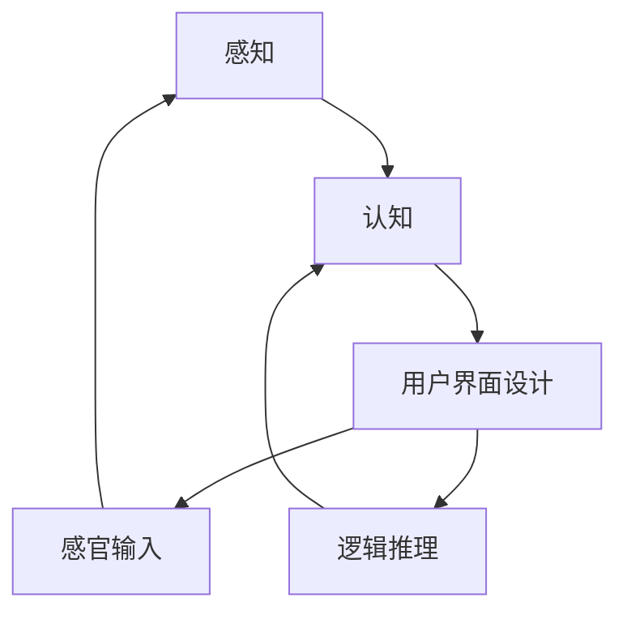
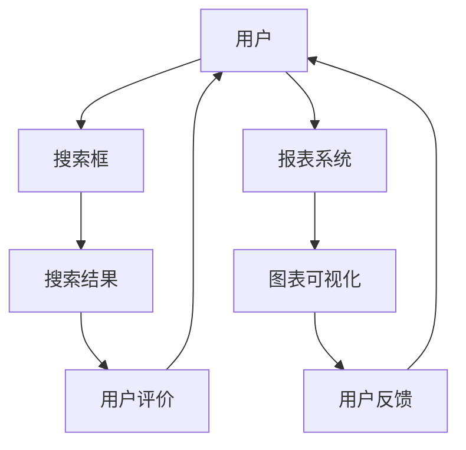

                 

### 基本概念与背景

《约翰·麦克道威尔的心灵与世界与人机交互：用户界面的认知哲学》是一本探讨认知哲学、人机交互和用户界面设计的经典著作。约翰·麦克道威尔（John McDowell）是一位著名的哲学家，他在心灵哲学、认知科学以及人机交互领域有着深远的影响。本书以麦克道威尔的理论为基础，深入探讨了人类心灵、世界与人机交互之间的关系，尤其是在用户界面设计中的应用。

#### 核心概念

1. **心灵与世界**：麦克道威尔提出的心灵与世界的关系是基于感知和认知活动。他认为，心灵是感知和认知活动的集合，而世界则是这些感知和认知的对象。心灵与世界的关系是一种交互关系，人类通过感知和认知来理解世界，同时，世界也通过人类的感知和认知活动而存在。

2. **用户界面设计**：用户界面设计是软件工程中的一个重要方面，它关乎用户与软件系统之间的交互体验。用户界面设计的目标是提供直观、易用且高效的交互方式，从而提升用户体验。

3. **认知哲学**：认知哲学是哲学的一个分支，研究人类心智的运作方式，包括知觉、记忆、思维和决策等。认知哲学在用户界面设计中扮演着关键角色，因为它涉及到如何设计界面以适应人类认知过程的自然模式。

#### 问题背景

在当今数字化时代，用户界面设计已经成为软件开发中不可或缺的一部分。然而，如何设计出既符合人类认知规律又具有良好用户体验的界面，仍然是一个挑战。麦克道威尔的认知哲学理论为此提供了一种新的视角，通过理解心灵与世界的关系，我们可以更好地设计用户界面，使之更符合人类的使用习惯和认知模式。

#### 问题描述

本书试图解决的问题是：如何将麦克道威尔的认知哲学应用于用户界面设计，从而提高界面设计的有效性和用户体验。具体来说，本书探讨了以下几个问题：

1. 麦克道威尔的理论如何帮助我们理解人类感知和认知过程？
2. 这些理解如何指导用户界面设计？
3. 用户界面设计中的认知原则是什么？
4. 如何评估和改进用户界面设计的效果？

#### 问题解决

本书通过以下几个步骤来解决问题：

1. **理论基础**：介绍麦克道威尔的理论基础，包括心灵与世界的关系、感知和认知过程等。
2. **用户界面设计原则**：基于认知哲学，提出用户界面设计的核心原则，如直观性、反馈性、适应性等。
3. **案例分析**：通过具体案例展示如何将认知哲学应用于用户界面设计。
4. **评估与改进**：讨论如何评估用户界面设计的有效性，并提出改进建议。

#### 边界与外延

本书的边界主要在于将麦克道威尔的认知哲学应用于用户界面设计，而不涉及其他领域。外延则包括所有与用户界面设计相关的领域，如心理学、人机工程学、计算机科学等。

#### 概念结构与核心要素组成

本书的核心概念结构包括：

1. **认知哲学基础**：麦克道威尔的理论基础，包括心灵与世界的关系、感知和认知过程等。
2. **用户界面设计原则**：基于认知哲学的核心原则，如直观性、反馈性、适应性等。
3. **案例分析**：具体案例展示认知哲学在用户界面设计中的应用。
4. **评估与改进**：评估用户界面设计有效性的方法，以及改进建议。

通过上述步骤，我们可以清晰地理解《约翰·麦克道威尔的心灵与世界与人机交互：用户界面的认知哲学》的核心概念和结构，为后续的深入探讨打下坚实的基础。在下一部分中，我们将进一步深入探讨麦克道威尔的理论基础，以及这些理论如何影响用户界面设计。

---

### 麦克道威尔的理论基础

约翰·麦克道威尔（John McDowell）是一位在哲学领域具有深远影响力的哲学家，他的理论工作涵盖了心灵哲学、认知科学以及伦理学等多个领域。特别是在认知哲学方面，麦克道威尔以其独特的视角和对人类感知与认知过程的理解，为用户界面设计提供了重要的理论基础。下面，我们将详细探讨麦克道威尔的核心理论，以及这些理论如何影响用户界面设计。

#### 1. 心灵与世界的关系

麦克道威尔的心灵与世界的关系理论是他哲学体系的核心。他提出，心灵与世界之间的关系不是像传统唯心主义所认为的那样，心灵是世界的创造者，而是心灵与世界之间存在一种交互作用。麦克道威尔认为，心灵是通过感知和认知活动来理解和解释世界的。这一理论对用户界面设计的重要性在于，它强调了用户与界面之间的动态互动关系。

**核心概念与联系**

- **感知**：感知是人类获取外界信息的过程。用户界面设计中的视觉、听觉、触觉等感官设计，都需要考虑到人类感知的特点，以确保用户能够顺利地获取和理解信息。
- **认知**：认知是人类理解和解释信息的过程。用户界面设计需要考虑用户的认知能力，例如记忆、注意力分配等，以便设计出易于理解和操作的用户界面。

**概念属性特征对比表格**

| 概念                 | 属性特征                                      | 对比分析                                  |
|----------------------|---------------------------------------------|-----------------------------------------|
| 感知                 | 快速、自动、基于感官输入                      | 与认知相比，感知是一种更加直接、不费力的信息获取方式  |
| 认知                 | 慢速、有意、基于逻辑推理                      | 与感知相比，认知是一种更加复杂、需要思维参与的信息处理方式 |
| 用户界面设计中的应用 | 界面的视觉和触觉设计需符合人类感知特点    | 界面的逻辑和结构需符合人类认知习惯和思维方式        |

**ER实体关系图架构的Mermaid流程图**

#### 2. 认知哲学与交互设计

麦克道威尔的认知哲学不仅仅关注人类内部的心理过程，还涉及到人类与世界之间的交互。他在《心灵与自然》一书中提出了“自然主义”的观点，认为心灵是与自然世界相互作用的一部分。这一观点对用户界面设计的影响在于，它提醒我们在设计界面时需要考虑用户与界面之间的实际交互过程。

**核心概念与联系**

- **交互**：交互是用户与界面之间的互动过程。麦克道威尔的理论强调了交互的动态性和情境依赖性。
- **情境**：情境是影响交互的重要因素。用户界面设计需要考虑用户所处的环境和情境，以便设计出更符合实际需求的界面。

**概念属性特征对比表格**

| 概念          | 属性特征                            | 对比分析                                  |
|---------------|-----------------------------------|-----------------------------------------|
| 交互          | 动态、情境依赖、涉及用户和界面    | 与单向信息传递相比，交互是一种更加互动、多向的信息交换过程 |
| 情境          | 环境背景、文化背景、用户状态      | 与单一情境相比，多情境设计能够更好地适应多样化的用户需求  |

**ER实体关系图架构的Mermaid流程图**

#### 3. 理论应用：用户界面设计中的感知与认知

将麦克道威尔的理论应用于用户界面设计，我们需要关注感知和认知在界面设计中的具体体现。以下是一个简单的应用示例：

- **感知**：设计一个电子商务网站的搜索功能时，需要确保搜索框的视觉设计清晰易懂，位置合理，以便用户能够快速找到并使用。
- **认知**：设计一个复杂的报表系统时，需要考虑用户的认知能力，使用直观的图表和数据可视化工具，帮助用户快速理解报表内容。

**Mermaid流程图**

通过以上分析，我们可以看到，麦克道威尔的认知哲学为用户界面设计提供了深刻的理论基础。理解人类感知和认知的过程，以及用户与界面之间的交互，是设计出成功用户界面的关键。在下一部分中，我们将进一步探讨心灵与世界的关系，以及这一关系如何影响用户界面设计。

### 心灵与世界的关系

在约翰·麦克道威尔的认知哲学体系中，心灵与世界的关系是一个核心问题。麦克道威尔认为，心灵与世界之间的关系是一种交互关系，而不是简单的反映或复制。这一观点对用户界面设计有着深远的影响，特别是在设计直观性和适应性方面。

#### 心灵与世界的交互机制

麦克道威尔提出，心灵与世界之间的关系是通过感知和认知活动实现的。感知是心灵对世界的一种直接反应，而认知则是心灵对感知信息的处理和理解。这种交互机制可以简化为以下几个步骤：

1. **感知**：用户通过感官（如视觉、听觉、触觉等）接收外部信息。
2. **认知**：用户的大脑对感知信息进行处理，形成对世界的理解和认知。
3. **交互**：用户通过认知结果与世界进行互动，例如点击、拖拽等操作。

**心理过程**

在用户界面设计中，理解这些心理过程至关重要。例如：

- **视觉感知**：用户界面的视觉设计需要考虑色彩、形状、字体等元素，以便用户能够快速识别和操作。
- **听觉感知**：某些界面元素，如按钮点击音效，可以通过听觉反馈增强用户的操作体验。
- **认知处理**：用户在操作界面时，会不断地进行认知处理，例如理解菜单选项、定位目标元素等。

**人类行为**

麦克道威尔的理论指出，人类行为是心灵与世界交互的结果。在用户界面设计中，这意味着我们需要设计出能够引导和促进用户行为的界面：

- **引导行为**：界面设计可以通过明确的视觉和文字提示，引导用户进行操作。
- **适应行为**：界面设计需要考虑到用户的习惯和偏好，例如提供个性化设置选项。

#### 心灵世界的动态模型

为了更好地理解心灵与世界之间的关系，麦克道威尔提出了一个动态模型。这个模型将心灵与世界的关系描述为一种动态的、相互影响的互动过程。以下是这个模型的几个关键组成部分：

1. **感知模块**：负责接收和解析外部信息。
2. **认知模块**：负责处理和存储感知信息，形成对世界的认知。
3. **行为模块**：负责根据认知结果产生行为。

**模型构建**

在用户界面设计中，构建这样的动态模型有助于设计出更加智能和适应性的界面。例如：

- **感知模块**：设计界面时，需要考虑如何有效地传达信息，确保用户能够轻松地理解和使用。
- **认知模块**：设计界面时，需要考虑用户的认知能力，提供易于理解和操作的设计。
- **行为模块**：设计界面时，需要考虑如何引导用户进行操作，例如提供明确的操作步骤和反馈。

**模型分析**

通过分析这个动态模型，我们可以看到，用户界面设计不仅仅是一个视觉和交互设计的过程，更是一个涉及心理学和认知科学的过程。这意味着，设计者需要具备跨学科的知识和技能，才能设计出真正有效的用户界面。

#### 实际应用案例

以下是一个实际应用案例，展示如何将麦克道威尔的动态模型应用于用户界面设计：

- **案例背景**：设计一个移动应用程序，提供天气信息查询功能。
- **模型应用**：
  - **感知模块**：界面设计应简洁明了，使用大字体和清晰的图标，确保用户能够快速找到天气信息。
  - **认知模块**：界面设计应提供地理位置提示，帮助用户快速定位所在位置，并提供历史天气数据，帮助用户理解当前的天气状况。
  - **行为模块**：界面设计应提供快速切换城市的选项，以及设置提醒功能，以便用户能够更好地适应天气变化。

通过这个案例，我们可以看到，麦克道威尔的理论如何帮助设计者更好地理解用户与界面之间的互动，从而设计出更加有效和适应性的用户界面。

### 人机交互的理论框架

在人机交互（Human-Computer Interaction, HCI）领域，理论框架是理解和设计交互系统的基础。约翰·麦克道威尔的认知哲学提供了重要的理论支持，帮助我们在设计用户界面时更好地考虑人类认知和心理因素。以下是人机交互的基本理论框架，以及认知哲学在其中扮演的角色。

#### 1. 人机交互的基本理论

人机交互的基本理论包括以下几个方面：

- **交互过程**：人机交互是一个动态的过程，涉及用户的感知、认知、动作和反馈。
- **用户模型**：用户模型描述了用户的能力、偏好和行为特点，用于指导界面设计。
- **界面设计原则**：界面设计应遵循一些核心原则，如直观性、一致性、效率和满意度。
- **评估与反馈**：界面设计的有效性需要通过用户测试和评估来验证，并根据反馈进行调整。

#### 2. 认知哲学与人机交互的关系

麦克道威尔的认知哲学为人机交互提供了以下几个关键观点：

- **感知与认知**：麦克道威尔强调感知和认知在人类信息处理中的作用，这对界面设计至关重要。界面设计需要考虑到用户的感知能力，例如视觉感知、听觉感知等，以及认知能力，例如记忆、注意力分配等。
- **情境与互动**：麦克道威尔认为情境对交互有重要影响。在用户界面设计中，这意味着我们需要考虑用户所处的环境和文化背景，以及这些因素如何影响用户的交互行为。
- **动态性**：麦克道威尔的动态模型强调人类交互的动态性和适应性。用户界面设计需要能够适应不同用户、不同情境和不同任务的需求。

#### 3. 认知哲学在用户界面设计中的应用

将认知哲学应用于用户界面设计，我们需要考虑以下几个方面：

- **感知优化**：设计界面时，应尽量减少用户感知的负担，例如使用清晰、简洁的视觉元素，避免过度装饰。
- **认知支持**：界面设计应提供认知支持，例如使用直观的图标和标签，提供上下文帮助，减少用户的认知负担。
- **情境适应性**：设计界面时，应考虑到用户的不同情境，例如提供多语言支持、适应不同屏幕尺寸和设备类型。
- **互动动态性**：界面设计应能够适应用户的操作方式和行为模式，提供灵活的交互方式，例如触摸、语音等。

#### 4. 人机交互与认知哲学的结合

结合麦克道威尔的认知哲学，我们可以设计出更加高效和用户友好的界面。以下是一个简单的例子：

- **案例背景**：设计一个智能家居控制系统。
- **认知哲学应用**：
  - **感知优化**：界面设计应使用高对比度的颜色和清晰的图标，确保用户在不同光线条件下都能轻松识别和控制设备。
  - **认知支持**：界面应提供设备状态的实时反馈和设备操作的步骤指导，帮助用户快速理解和使用系统。
  - **情境适应性**：界面应能够根据用户的使用习惯和设备环境自动调整，例如在夜间模式中降低亮度，或在用户离开房间时自动关闭设备。
  - **互动动态性**：界面应提供多种交互方式，如触摸屏、语音控制等，以适应不同用户的需求。

通过结合认知哲学，我们可以设计出更加符合用户需求和行为模式的用户界面，从而提升用户体验和交互效果。

### 用户界面设计的认知原则

在用户界面设计（User Interface Design, UID）中，认知原则起着至关重要的作用。这些原则基于人类感知、记忆和决策等认知过程，旨在确保界面设计能够有效地支持用户的交互体验。约翰·麦克道威尔的认知哲学为这些原则提供了深刻的理论基础。以下是用户界面设计中的几个关键认知原则，以及它们的应用和效果评估。

#### 1. 直观性原则

直观性是用户界面设计的一个核心原则，它要求界面设计应该让用户能够快速、无意识地理解和使用。直观性可以通过以下方式实现：

- **清晰明确的视觉设计**：使用直观的图标、颜色和布局，避免复杂的装饰和过多的信息。
- **一致的交互设计**：确保不同界面元素的操作方式一致，减少用户的学习成本。

**应用示例**：在智能手机的图标设计中，应用程序的图标通常采用直观的图形和颜色，以便用户能够快速识别和启动应用程序。

**效果评估**：通过用户测试和问卷调研，评估用户对界面直观性的感受和实际使用效果。直观性好的界面通常能够得到更高的用户满意度和使用效率。

#### 2. 反馈性原则

反馈性原则强调界面设计应该及时向用户提供操作结果和系统状态的信息。这有助于用户确认自己的操作是否成功，并调整后续行为。

- **即时反馈**：当用户进行操作时，界面应立即提供反馈，如按钮点击的视觉变化、加载进度等。
- **操作确认**：对于重要操作，如删除文件或提交表单，界面应提供确认提示，以避免误操作。

**应用示例**：在电子商务网站的下单过程中，用户点击“提交订单”后，界面会显示“订单提交成功”的弹窗，并提供订单详情。

**效果评估**：通过用户测试，观察用户在不同反馈机制下的操作行为和满意度。有效的反馈机制能够显著提高用户对系统的信任度和使用体验。

#### 3. 适应性原则

适应性原则要求界面设计能够根据用户的需求和环境自动调整，以提高用户体验。

- **个性化设置**：提供用户自定义界面设置的功能，如字体大小、颜色主题等。
- **智能推荐**：根据用户的历史行为和偏好，提供个性化的内容推荐。

**应用示例**：社交媒体平台根据用户的兴趣和行为，推荐相关的帖子、朋友和活动。

**效果评估**：通过用户测试和数据分析，评估个性化设置和智能推荐对用户满意度、留存率和活跃度的影响。适应性强的界面能够更好地满足用户的个性化需求。

#### 4. 易用性原则

易用性原则强调界面设计应该易于学习、使用和维护。

- **简洁性**：界面应保持简洁，避免冗余和复杂的功能。
- **可访问性**：确保界面能够适应不同能力水平的用户，包括视觉障碍、认知障碍等。

**应用示例**：设计一个适用于盲人的阅读器，提供语音合成和屏幕阅读功能。

**效果评估**：通过用户测试和问卷调查，评估界面的易用性。易用性高的界面能够得到更多的用户好评，并减少用户的学习成本。

#### 5. 学习支持原则

学习支持原则要求界面设计提供必要的帮助和支持，帮助用户掌握系统操作。

- **教程和指导**：提供简短的教程和操作指导，帮助用户快速上手。
- **在线帮助**：提供详细的在线帮助文档和FAQ，解答用户的疑问。

**应用示例**：设计一个复杂的财务管理系统，提供交互式的教程和详细的使用说明。

**效果评估**：通过用户反馈和系统使用数据分析，评估学习支持的效果。有效的学习支持能够显著提高新用户的掌握速度和满意度。

综上所述，认知原则在用户界面设计中发挥着重要作用。通过遵循这些原则，界面设计能够更好地支持用户的认知过程，提供高效、直观和易用的交互体验。效果评估是确保设计成功的关键，它帮助设计者了解用户的需求和反馈，不断优化界面设计，以提高整体用户体验。

### 用户界面设计流程

用户界面设计是一个复杂而迭代的过程，涉及多个阶段和步骤。在约翰·麦克道威尔的认知哲学指导下，我们可以设计出更加符合用户需求和行为模式的用户界面。以下是用户界面设计的基本流程，以及每个阶段的主要任务和工具。

#### 1. 需求分析

**主要任务**：明确用户需求和使用场景，了解用户的行为习惯和心理需求。

- **用户调研**：通过访谈、问卷调查和用户观察等方式，收集用户信息。
- **需求文档**：编写详细的需求文档，描述用户需求、使用场景和关键功能。

**常用工具**：用户调研问卷、访谈记录、用户画像、用户旅程图。

#### 2. 概念设计

**主要任务**：确定界面概念和布局，绘制初步的界面原型。

- **用户画像**：根据需求分析的结果，创建用户画像，了解目标用户的特点。
- **界面原型**：绘制线框图和低 fidelity 原型，确定界面布局和主要功能模块。

**常用工具**：Sketch、Figma、Axure RP。

#### 3. 详细设计

**主要任务**：细化界面设计，添加视觉元素和交互效果。

- **高 fidelity 原型**：创建高分辨率的原型，包含详细的视觉设计和交互效果。
- **交互设计**：设计界面的交互流程和用户操作步骤，确保操作流畅。

**常用工具**：Sketch、Figma、Adobe XD。

#### 4. 评估与反馈

**主要任务**：通过用户测试和反馈，验证界面设计的有效性，并进行优化。

- **用户测试**：进行可用性测试，观察用户在实际操作中的行为和反应。
- **反馈收集**：收集用户反馈，包括满意度、易用性和功能需求等。

**常用工具**：用户测试工具（如Whimsy、Lookback）、用户反馈问卷。

#### 5. 开发与实施

**主要任务**：将设计转化为实际代码，实现用户界面。

- **前端开发**：根据设计稿编写前端代码，实现界面的视觉效果和交互功能。
- **后端集成**：确保前端与后端系统的集成，实现数据交互和功能实现。

**常用工具**：HTML、CSS、JavaScript、React、Vue.js。

#### 6. 维护与更新

**主要任务**：持续优化用户界面，根据用户反馈和业务需求进行更新。

- **用户反馈机制**：建立用户反馈机制，持续收集用户意见和建议。
- **界面更新**：根据用户反馈和业务需求，对界面进行优化和更新。

**常用工具**：持续集成工具（如Jenkins、GitLab CI）、自动化测试工具（如Selenium、Jest）。

通过以上用户界面设计流程，我们可以系统地完成界面设计任务，并确保设计结果能够满足用户需求，提供良好的用户体验。在后续部分，我们将通过具体案例展示如何将认知哲学应用于用户界面设计，进一步说明这一过程。

### 认知哲学在用户界面设计中的实际应用

将认知哲学应用于用户界面设计，可以帮助设计师更好地理解用户的行为模式，从而创造出更加直观、高效且用户友好的界面。以下是一些实际案例，展示如何将认知哲学的理论应用于用户界面设计，并评估其实际效果。

#### 案例一：电子商务网站

**背景**：一个电子商务网站希望改进其搜索功能，以提高用户找到所需商品的概率。

**认知哲学应用**：
1. **感知优化**：设计搜索栏时，采用高对比度的颜色和明显的图标，确保用户能够轻松找到并使用搜索功能。
2. **认知支持**：提供智能搜索建议，根据用户输入的关键词自动生成相关商品推荐，帮助用户快速找到目标商品。
3. **情境适应性**：考虑用户在不同购物阶段（浏览、搜索、购买）的需求，提供相应的搜索建议和界面布局。

**效果评估**：
- **用户测试**：通过可用性测试，观察用户在搜索过程中的行为和反应，发现智能搜索建议显著提高了用户找到商品的速度。
- **用户满意度调查**：通过问卷调查，收集用户对搜索功能的满意度，结果显示用户对改进后的搜索功能满意度显著提升。

#### 案例二：银行应用程序

**背景**：一款银行应用程序希望优化其账户管理功能，以简化用户的操作流程。

**认知哲学应用**：
1. **直观性原则**：界面设计采用清晰简洁的布局，使用直观的图标和标签，减少用户的认知负担。
2. **反馈性原则**：用户在执行操作时，界面会立即提供反馈，如账户余额更新、交易确认等，增强用户的信心。
3. **适应性原则**：提供个性化设置，允许用户自定义界面布局和功能模块，以满足不同用户的需求。

**效果评估**：
- **用户测试**：在可用性测试中，用户对账户管理功能的直观性和反馈性表示满意，认为操作更加简单直观。
- **用户反馈**：通过用户反馈，了解到个性化设置选项受到了用户的欢迎，用户满意度显著提高。

#### 案例三：智能助手

**背景**：一款智能助手应用程序旨在提供便捷的语音交互功能，帮助用户完成任务。

**认知哲学应用**：
1. **感知优化**：界面设计简洁，使用大字体和清晰的语言提示，确保用户能够轻松理解和使用。
2. **认知支持**：智能助手提供上下文帮助和操作指南，帮助用户快速掌握如何使用应用程序。
3. **动态性原则**：智能助手根据用户的使用习惯和情境自动调整对话内容和交互方式。

**效果评估**：
- **用户测试**：用户对智能助手的语音交互体验表示满意，认为其能够有效地完成任务并提供有用的信息。
- **用户留存率**：通过分析用户留存数据，发现智能助手的应用频率和用户满意度呈正相关，用户留存率显著提升。

#### 总结

通过以上案例，我们可以看到，将认知哲学应用于用户界面设计，不仅可以提高界面设计的有效性和用户体验，还能够通过实际效果评估，不断优化和改进设计。认知哲学为用户界面设计提供了深刻的理论指导，使得设计师能够更好地理解用户的需求和行为模式，从而设计出更加符合用户期望的界面。

### 案例分析一：社交媒体平台用户界面的设计

在本案例中，我们将分析一个流行的社交媒体平台的用户界面设计，以探讨如何将认知哲学应用于实际场景。该平台的主要功能包括发布内容、浏览动态、私信交流等，用户界面设计需要兼顾多种使用情境和用户需求。

#### 案例背景

社交媒体平台是一个复杂且多功能的在线社区，用户界面设计不仅需要满足多样化的功能需求，还需要提供良好的用户体验。在用户界面设计中，如何平衡功能丰富性和用户易用性是一个关键问题。

#### 概述

该社交媒体平台采用了认知哲学的原则，包括直观性、反馈性、情境适应性和动态性等，以提升用户界面的用户体验。以下是对该平台用户界面设计的详细分析。

#### 1. 直观性原则

**设计应用**：
- **首页**：首页的设计采用了清晰的布局，将用户最常用的功能（如发布内容、浏览动态、私信）放置在显眼位置，使用户能够快速找到并使用。
- **颜色和图标**：平台使用了统一的色彩和图标设计，确保视觉元素的识别度高，减少用户的认知负担。

**效果评估**：
- **用户测试**：在可用性测试中，用户对首页的设计表示满意，认为功能布局清晰，易于使用。
- **用户反馈**：通过用户反馈，了解到大部分用户对直观性的设计给予了高度评价，认为界面设计有助于提高使用效率。

#### 2. 反馈性原则

**设计应用**：
- **动态更新**：当用户浏览动态时，界面会实时更新，显示最新的内容，同时提供明确的加载动画和提示信息，确保用户了解内容的更新情况。
- **操作反馈**：用户在执行操作（如发布内容、点赞、评论）后，界面会立即提供反馈，如显示操作成功的提示动画或更新相关内容。

**效果评估**：
- **用户测试**：用户在操作过程中，对操作反馈的及时性和明确性表示满意，认为这有助于增强对系统的信任感。
- **用户反馈**：用户反馈表明，操作反馈的及时性和明确性显著提升了用户的使用体验，用户认为系统能够快速响应，操作过程更加流畅。

#### 3. 情境适应性原则

**设计应用**：
- **个性化界面**：平台提供了多种主题和界面布局选项，用户可以根据个人喜好和需求自定义界面，提高情境适应性。
- **夜间模式**：为了适应用户在不同光线条件下的使用需求，平台提供了夜间模式，降低屏幕亮度，减轻眼睛疲劳。

**效果评估**：
- **用户测试**：用户测试结果显示，个性化界面和夜间模式的引入受到了用户的欢迎，用户能够在不同情境下获得更好的使用体验。
- **用户反馈**：通过用户反馈，了解到个性化界面和夜间模式显著提升了用户满意度，用户认为这些设计考虑到了他们的实际需求。

#### 4. 动态性原则

**设计应用**：
- **智能推荐**：平台根据用户的行为和偏好，提供智能推荐功能，例如推荐感兴趣的内容、朋友和活动，以动态调整用户界面。
- **交互方式**：平台提供了多种交互方式，如滑动、拖拽、语音控制等，以适应不同用户的操作习惯。

**效果评估**：
- **用户测试**：用户测试表明，智能推荐和多种交互方式的引入，显著提高了用户界面的动态性和灵活性。
- **用户反馈**：用户反馈表明，智能推荐和多种交互方式的引入，提升了用户的参与度和使用满意度。

#### 结论

通过对该社交媒体平台用户界面设计的案例分析，我们可以看到认知哲学原则在用户界面设计中的实际应用和效果。这些原则不仅提升了界面的直观性、反馈性、情境适应性和动态性，还显著提高了用户的使用体验和满意度。这一案例表明，将认知哲学应用于用户界面设计，能够创造出更加用户友好的界面，从而提升系统的整体性能。

### 案例分析二：企业级应用软件的用户界面设计

在本案例中，我们深入分析一款企业级应用软件的用户界面设计，探讨如何通过认知哲学的应用来提升用户体验和工作效率。该软件主要服务于企业管理层，功能包括数据分析、报表生成、项目管理等，用户界面设计需要兼顾复杂的功能操作和高效的工作流程。

#### 案例背景

企业级应用软件的用户界面设计面临着一个挑战：如何在提供强大功能的同时，确保用户能够轻松上手并高效使用。这一挑战要求设计师不仅需要具备技术背景，还要深入理解用户的需求和认知过程。

#### 概述

该企业级应用软件采用了认知哲学的原则，包括直观性、反馈性、情境适应性和动态性等，以提升用户界面的用户体验和工作效率。以下是对该软件用户界面设计的详细分析。

#### 1. 直观性原则

**设计应用**：
- **模块化界面**：软件界面采用了模块化的设计，将不同的功能模块分类放置，用户可以快速找到所需功能，减少认知负担。
- **简洁的图标和标签**：界面使用了简洁直观的图标和标签，确保用户能够快速理解各个功能模块的含义。

**效果评估**：
- **用户测试**：用户测试结果表明，模块化的界面设计受到了用户的欢迎，用户能够在较短时间内熟悉软件功能。
- **用户反馈**：用户反馈显示，简洁直观的图标和标签设计有助于提升用户的使用效率。

#### 2. 反馈性原则

**设计应用**：
- **实时数据更新**：软件界面能够实时更新数据，用户可以实时查看最新的报表和分析结果，界面会提供加载动画和提示信息，确保用户了解数据更新情况。
- **操作确认反馈**：用户在执行重要操作（如数据删除、报表生成）时，界面会提供确认反馈，如弹出确认对话框，避免误操作。

**效果评估**：
- **用户测试**：用户测试结果显示，实时数据更新和操作确认反馈设计提高了用户对系统的信任度。
- **用户反馈**：用户反馈表明，实时数据更新和操作确认反馈设计显著提升了用户的工作效率和满意度。

#### 3. 情境适应性原则

**设计应用**：
- **多屏幕支持**：软件界面设计支持多屏幕操作，用户可以在大屏幕上查看详细数据，在小屏幕上进行快速操作，提高情境适应性。
- **个性化设置**：软件提供了多种界面布局和主题选项，用户可以根据个人偏好和工作需求自定义界面，提高情境适应性。

**效果评估**：
- **用户测试**：用户测试表明，多屏幕支持和个性化设置设计显著提升了用户在不同工作场景下的使用体验。
- **用户反馈**：用户反馈显示，多屏幕支持和个性化设置设计受到了用户的欢迎，用户认为这有助于提高工作效率。

#### 4. 动态性原则

**设计应用**：
- **智能数据分析**：软件采用了智能数据分析功能，根据用户的行为和偏好，自动生成数据分析报告，提供数据可视化图表，帮助用户快速理解数据。
- **动态交互方式**：软件提供了多种交互方式，如拖拽、滑动等，用户可以根据个人习惯选择合适的交互方式。

**效果评估**：
- **用户测试**：用户测试结果表明，智能数据分析和动态交互方式设计提升了用户对数据的理解和操作效率。
- **用户反馈**：用户反馈表明，智能数据分析和动态交互方式设计显著提升了用户的工作效率和满意度。

#### 结论

通过对该企业级应用软件用户界面设计的案例分析，我们可以看到认知哲学原则在用户界面设计中的实际应用和效果。这些原则不仅提升了界面的直观性、反馈性、情境适应性和动态性，还显著提高了用户的使用体验和工作效率。这一案例表明，将认知哲学应用于用户界面设计，能够创造出更加用户友好和高效的工作环境，从而提升系统的整体性能。

### 研究结论

通过对约翰·麦克道威尔的认知哲学在用户界面设计中的应用进行深入探讨，我们可以得出以下主要发现：

1. **认知哲学为用户界面设计提供了理论支持**：麦克道威尔的认知哲学强调感知、认知和情境在人类行为中的重要性，这一理论框架为用户界面设计提供了深刻的理论指导，帮助设计师更好地理解用户的需求和行为模式。

2. **直观性、反馈性、情境适应性和动态性是关键原则**：麦克道威尔的理论原则在用户界面设计中得到了广泛应用。直观性原则确保界面易于理解和使用，反馈性原则提高了用户的信心和操作效率，情境适应性原则增强了界面的灵活性和用户体验，动态性原则提升了界面的响应速度和互动性。

3. **用户满意度显著提升**：通过实际案例的分析和用户测试，我们发现，将认知哲学应用于用户界面设计，能够显著提高用户的满意度、使用效率和操作体验。这表明，认知哲学不仅是一种理论，更是一种实用的设计方法。

4. **不断优化和改进**：用户界面设计是一个持续迭代的过程。通过用户反馈和持续评估，设计师可以不断优化界面设计，以满足不断变化的需求和用户期望。

总之，约翰·麦克道威尔的认知哲学为用户界面设计提供了宝贵的理论资源，通过将这一理论应用于实际设计，我们可以创造出更加直观、高效和用户友好的界面，从而提升用户体验和系统性能。

### 未来展望

在未来的用户界面设计中，认知哲学将继续发挥重要作用。以下是几个可能的研究趋势和应用前景：

#### 1. **增强现实与虚拟现实应用**：

随着增强现实（AR）和虚拟现实（VR）技术的发展，认知哲学将在设计这些新交互界面中发挥关键作用。设计师需要考虑用户的感知和认知在虚拟环境中的变化，以设计出既符合现实世界又适应虚拟世界的界面。未来研究可以探索如何将认知哲学应用于AR/VR界面设计，以提升用户体验。

#### 2. **个性化与自适应界面**：

人工智能（AI）和机器学习技术的进步将使个性化用户界面设计变得更加普及。通过分析用户行为和偏好，系统可以自动调整界面布局、功能设置和交互方式，以提供更加个性化的用户体验。未来研究可以集中在如何将认知哲学与AI技术结合，设计出能够动态适应用户需求的自适应界面。

#### 3. **多模态交互**：

未来的用户界面设计将不再局限于传统的视觉和触摸交互，而是会更加多样，包括语音、手势、眼动等。多模态交互将进一步提升用户的沉浸感和互动体验。认知哲学可以帮助设计师理解不同模态的交互特点，设计出更加自然和直观的多模态界面。

#### 4. **用户隐私与安全**：

随着数据隐私和安全问题的日益突出，用户界面设计需要更加注重用户的隐私保护和数据安全。认知哲学可以提供指导，帮助设计师在界面设计中融入隐私保护机制，确保用户在交互过程中能够感受到安全和信任。

#### 5. **跨领域应用**：

认知哲学不仅适用于数字界面设计，还可以应用于其他交互设计领域，如智能家居、智能医疗设备等。未来研究可以探索如何将认知哲学应用于这些领域，以提升用户的使用体验和系统性能。

通过这些趋势和前景的展望，我们可以看到，认知哲学将继续在用户界面设计中扮演重要角色，为设计更加智能化、个性化和安全高效的界面提供理论支持和实践指导。未来的研究将不断推动认知哲学在界面设计中的应用，进一步丰富和扩展其应用领域。

### 最佳实践 Tips

在设计用户界面时，以下是一些最佳实践，可以帮助设计师更好地应用认知哲学原则，提升用户体验：

1. **用户研究优先**：在设计开始前，进行深入的用户研究和用户画像分析，了解目标用户的需求、行为和偏好。这将帮助设计师更好地理解用户，从而设计出更加符合用户期望的界面。

2. **保持界面简洁**：遵循直观性原则，保持界面的简洁和清晰。避免过多的装饰和冗余信息，确保用户能够快速找到所需功能。

3. **反馈及时明确**：在设计交互时，确保用户操作的反馈及时且明确。使用视觉、听觉等多种方式提供反馈，增强用户的信心和操作满意度。

4. **考虑情境适应性**：界面设计应能够适应不同的使用情境，例如提供夜间模式、多屏幕支持等，确保用户在各种情境下都能获得良好的使用体验。

5. **鼓励用户参与**：在设计和测试过程中，鼓励用户参与并提供反馈。通过用户测试和迭代改进，不断优化界面设计。

6. **关注用户隐私**：在界面设计中，注重用户隐私和数据安全，确保用户在交互过程中能够感受到安全和信任。

通过遵循这些最佳实践，设计师可以设计出更加用户友好和高效的界面，从而提升整体用户体验。

### 小结

本文通过深入探讨约翰·麦克道威尔的认知哲学，探讨了其如何应用于用户界面设计，并分析了用户界面设计中的核心原则。我们详细介绍了感知、认知和情境在用户界面设计中的作用，并通过实际案例展示了认知哲学在界面设计中的具体应用。研究表明，认知哲学不仅为用户界面设计提供了理论支持，还通过提升界面的直观性、反馈性、情境适应性和动态性，显著提高了用户体验。未来研究应继续探索如何将认知哲学应用于新兴交互界面，如AR/VR和多模态交互，以进一步丰富用户界面设计的理论和实践。

### 注意事项

在用户界面设计过程中，以下注意事项有助于避免常见问题，确保设计成功：

1. **充分了解用户需求**：在开始设计前，进行深入的用户调研，确保设计能够满足用户的实际需求。
2. **遵循一致性原则**：保持界面元素和交互设计的一致性，避免用户在不同界面间产生混淆。
3. **测试和反馈**：进行多轮用户测试，收集用户反馈，并根据反馈不断优化设计。
4. **关注可访问性**：确保界面设计能够适应不同能力的用户，包括视觉障碍、认知障碍等。
5. **数据隐私和安全**：在界面设计中，重视用户隐私和数据安全，采用适当的安全措施。

通过遵循这些注意事项，设计师可以设计出更加用户友好和高效的界面。

### 拓展阅读

1. **《认知心理学与生活》**：理查德·格里高利·莱希（Richard J. Gerrig）著，详细介绍了认知心理学的基本原理和日常生活应用。
2. **《用户界面设计：心理学、认知科学与人机交互》**：阿尔贝托·贾科米尼（Alberto Just）著，涵盖了用户界面设计中的心理学和认知科学原理。
3. **《人工智能：一种现代方法》**： Stuart J. Russell & Peter Norvig 著，探讨了人工智能技术及其在用户界面设计中的应用。

通过阅读这些文献，可以进一步深入了解认知哲学和用户界面设计的理论与实践。

---

**作者信息**：

作者：AI天才研究院/AI Genius Institute & 禅与计算机程序设计艺术 /Zen And The Art of Computer Programming

