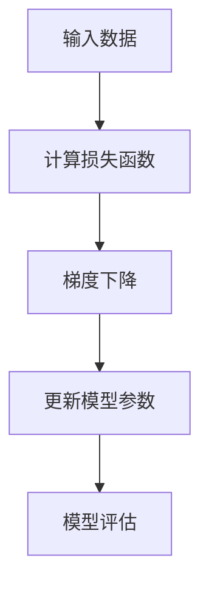
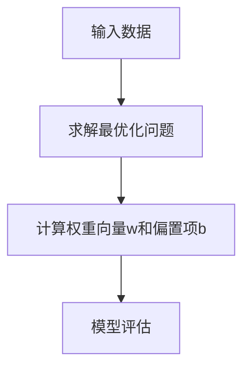
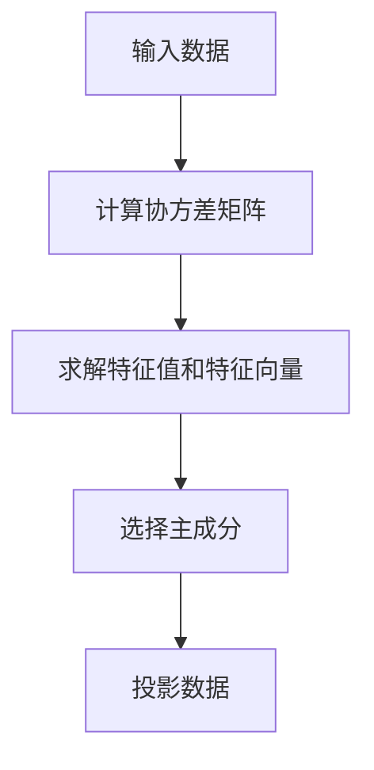
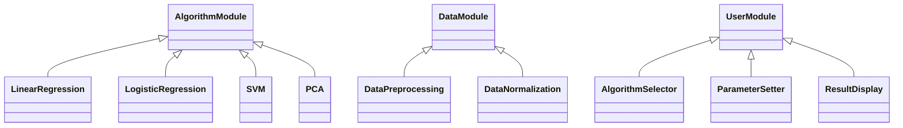
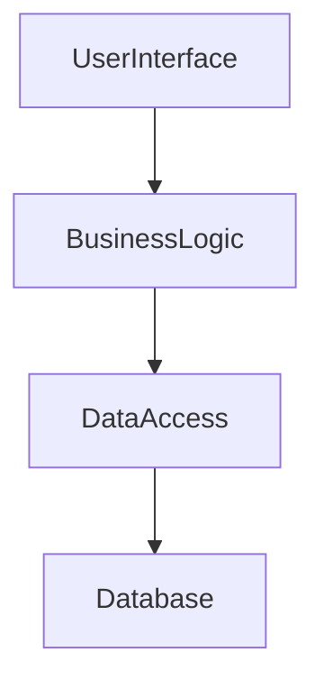

                 

# 线性代数在机器学习算法实现中的应用

关键词：线性代数、机器学习、算法实现、向量、矩阵、特征值

摘要：
本文深入探讨了线性代数在机器学习算法中的应用，从基本概念到具体算法实现，详细阐述了线性代数与机器学习之间的紧密联系。通过对线性代数核心概念和机器学习算法的讲解，帮助读者更好地理解和掌握机器学习算法的实现，为人工智能领域的研究和应用提供有力支持。

## 1. 背景介绍

### 问题背景

随着计算机技术的飞速发展和大数据时代的到来，机器学习算法在各个领域得到了广泛应用。从自然语言处理、计算机视觉到推荐系统，机器学习算法已经成为推动科技进步的重要力量。然而，机器学习算法的实现离不开数学工具的支撑，其中线性代数作为核心数学工具之一，其重要性不言而喻。

线性代数在机器学习算法中的应用主要体现在以下几个方面：

1. **特征提取与变换**：线性代数提供了丰富的线性变换工具，如特征值和特征向量，用于特征提取和降维，从而提高模型的性能和可解释性。
2. **优化算法**：线性代数的矩阵运算和特征分解方法在优化算法中有着广泛的应用，如梯度下降法和矩阵分解算法，用于求解最优化问题和提高模型收敛速度。
3. **模型解释**：线性代数提供了直观的数学表达方式，有助于理解和解释机器学习模型的内部机制和决策过程。

### 描述问题

尽管线性代数在机器学习算法中扮演着重要角色，但许多机器学习初学者对于线性代数的基本概念和应用并不熟悉。这导致他们在实现机器学习算法时遇到困难，无法充分发挥线性代数的优势。为了解决这一问题，本文将系统讲解线性代数在机器学习算法中的应用，帮助读者深入理解线性代数与机器学习之间的紧密联系，提高他们在机器学习领域的实践能力。

### 问题解决

本文将通过以下方式解决问题：

1. **系统介绍线性代数的基本概念和原理**：包括向量、矩阵、行列式、特征值和特征向量等基本概念，以及它们在数学表达中的重要性。
2. **分析线性代数在机器学习算法中的具体应用**：介绍线性代数在常见机器学习算法中的应用，如线性回归、逻辑回归、支持向量机、主成分分析等，并通过具体实例进行讲解。
3. **结合实际案例**：通过实际案例详细阐述线性代数在机器学习算法实现中的具体应用方法，帮助读者更好地理解和掌握。
4. **提供丰富的练习题和案例分析**：通过练习题和案例分析，帮助读者巩固所学知识，提高实际应用能力。

### 边界与外延

本文主要关注线性代数在常见机器学习算法中的应用，但线性代数的应用范围远不止于此。此外，本文将不涉及高级线性代数知识，如谱理论、矩阵分析等。通过对线性代数在机器学习算法中的应用进行深入探讨，本文旨在为读者提供全面、系统的线性代数与机器学习知识，为他们在人工智能领域的研究和应用奠定坚实基础。

## 2. 核心概念与联系

### 核心概念

线性代数是研究向量空间和线性映射的数学分支。在机器学习中，线性代数的基本概念如向量、矩阵、行列式、特征值和特征向量等都是不可或缺的工具。

#### 向量

向量是线性代数的基本对象，通常表示为一个有序的数字列表。在机器学习中，向量常用于表示数据特征、模型参数等。向量具有大小和方向，可以通过加减、数乘等运算进行组合和变换。

#### 矩阵

矩阵是由数字组成的二维数组，用于表示线性变换或系统。在机器学习中，矩阵常用于表示数据矩阵、权重矩阵等。矩阵运算如矩阵乘法、矩阵求逆等在算法实现中具有重要应用。

#### 行列式

行列式是矩阵的一种数值特征，用于判断矩阵的可逆性。在机器学习中，行列式常用于判断数据矩阵的满秩性，从而确定线性模型的可行性和稳定性。

#### 特征值和特征向量

特征值和特征向量是矩阵的固有属性，用于描述线性变换的作用。在机器学习中，特征值和特征向量常用于特征提取和降维，从而提高模型的性能和可解释性。

### 概念属性特征对比表格

| 概念         | 定义                                                         | 属性特征                                                         |  
| ------------ | ------------------------------------------------------------ | ------------------------------------------------------------ |  
| 向量         | 空间中的点或方向                                             | 有大小和方向                                                     |  
| 矩阵         | 二维数组                                                     | 表示线性变换或系统                                               |  
| 行列式       | 矩阵的一种数值特征                                           | 用于判断矩阵的可逆性                                             |  
| 特征值和特征向量 | 矩阵的固有属性                                               | 用于描述线性变换的作用                                           |

### ER实体关系图架构

（此处用Mermaid绘制ER实体关系图）

```mermaid
erDiagram
    A[--|>B{矩阵}]

    A {--|>C{向量} }

    A {--|>D{行列式} }

    A {--|>E{特征值} }

    A {--|>F{特征向量} }

    B|--|>C

    B|--|>D

    B|--|>E

    B|--|>F
```

## 3. 算法原理讲解

### 3.1 线性回归

线性回归是一种最常见的机器学习算法，用于建模自变量和因变量之间的线性关系。线性回归的数学模型可以表示为：

$$y = \beta_0 + \beta_1x_1 + \beta_2x_2 + ... + \beta_nx_n$$

其中，$y$ 为因变量，$x_1, x_2, ..., x_n$ 为自变量，$\beta_0, \beta_1, \beta_2, ..., \beta_n$ 为模型参数。

#### 算法流程

1. **数据预处理**：对输入数据进行归一化或标准化处理，使其具有相同的量纲和分布。
2. **计算损失函数**：使用均方误差（MSE）作为损失函数，计算预测值和实际值之间的差异。
3. **梯度下降**：根据损失函数的梯度，更新模型参数，逐步逼近最优解。
4. **模型评估**：使用交叉验证等方法评估模型性能，确定最优模型参数。

#### Mermaid流程图



#### Python源代码

```python
import numpy as np

def linear_regression(X, y):
    # 计算损失函数
    def loss_function(w):
        y_pred = np.dot(X, w)
        return np.mean((y_pred - y) ** 2)

    # 计算梯度
    def gradient(w):
        y_pred = np.dot(X, w)
        return 2 * np.dot(X.T, (y_pred - y))

    # 梯度下降
    w = np.zeros(X.shape[1])
    learning_rate = 0.01
    epochs = 1000
    for epoch in range(epochs):
        gradient_w = gradient(w)
        w -= learning_rate * gradient_w

    return w
```

### 3.2 逻辑回归

逻辑回归是一种广义的线性回归模型，用于建模二分类问题。逻辑回归的数学模型可以表示为：

$$\sigma(\beta_0 + \beta_1x_1 + \beta_2x_2 + ... + \beta_nx_n) = P(y=1)$$

其中，$\sigma$ 为逻辑函数，$P(y=1)$ 为因变量为1的概率。

#### 算法流程

1. **数据预处理**：对输入数据进行归一化或标准化处理。
2. **计算损失函数**：使用对数似然损失函数，计算预测概率和实际标签之间的差异。
3. **梯度下降**：根据损失函数的梯度，更新模型参数，逐步逼近最优解。
4. **模型评估**：使用准确率、召回率等指标评估模型性能。

#### Mermaid流程图


#### Python源代码

```python
import numpy as np

def logistic_regression(X, y):
    # 计算损失函数
    def loss_function(w):
        y_pred = 1 / (1 + np.exp(-np.dot(X, w)))
        return -np.mean(y * np.log(y_pred) + (1 - y) * np.log(1 - y_pred))

    # 计算梯度
    def gradient(w):
        y_pred = 1 / (1 + np.exp(-np.dot(X, w)))
        return 2 * np.dot(X.T, (y_pred - y))

    # 梯度下降
    w = np.zeros(X.shape[1])
    learning_rate = 0.01
    epochs = 1000
    for epoch in range(epochs):
        gradient_w = gradient(w)
        w -= learning_rate * gradient_w

    return w
```

### 3.3 支持向量机

支持向量机（SVM）是一种强大的分类和回归算法，通过最大化分类边界上的支持向量来寻找最优分类超平面。SVM的数学模型可以表示为：

$$\min_{w, b} \frac{1}{2} ||w||^2$$

$$s.t. y_i (w \cdot x_i + b) \geq 1$$

其中，$w$ 为权重向量，$b$ 为偏置项，$x_i$ 为训练样本，$y_i$ 为标签。

#### 算法流程

1. **数据预处理**：对输入数据进行归一化或标准化处理。
2. **求解最优化问题**：使用拉格朗日乘子法求解最优化问题，得到权重向量 $w$ 和偏置项 $b$。
3. **模型评估**：使用交叉验证等方法评估模型性能。

#### Mermaid流程图



#### Python源代码

```python
import numpy as np
from scipy.optimize import minimize

def svm(X, y):
    # 定义目标函数
    def objective(w):
        return 0.5 * np.dot(w, w)

    # 定义约束条件
    def constraints(w):
        return [y[i] * (np.dot(w, x) + b) - 1 for i, (x, y) in enumerate(zip(X, y))]

    # 求解最优化问题
    result = minimize(objective, x0=np.zeros(X.shape[1]), constraints=constraints)

    # 计算权重向量w和偏置项b
    w = result.x
    b = 0
    for i, (x, y) in enumerate(zip(X, y)):
        if y * (np.dot(w, x) + b) < 1:
            b += y

    return w, b
```

### 3.4 主成分分析

主成分分析（PCA）是一种降维算法，通过将数据投影到新的坐标系中，减少数据的维度，同时保留数据的最大方差。PCA的数学模型可以表示为：

$$z = PC_1 \cdot \lambda_1 + PC_2 \cdot \lambda_2 + ... + PC_k \cdot \lambda_k$$

其中，$z$ 为新的数据点，$PC_1, PC_2, ..., PC_k$ 为主成分，$\lambda_1, \lambda_2, ..., \lambda_k$ 为对应的特征值。

#### 算法流程

1. **数据预处理**：对输入数据进行归一化或标准化处理。
2. **计算协方差矩阵**：计算数据的协方差矩阵。
3. **求解特征值和特征向量**：对协方差矩阵进行特征值分解，得到特征值和特征向量。
4. **选择主成分**：根据特征值的大小选择前 $k$ 个特征向量作为主成分。
5. **投影数据**：将数据投影到新的坐标系中，实现降维。

#### Mermaid流程图



#### Python源代码

```python
import numpy as np

def pca(X, n_components):
    # 计算协方差矩阵
    cov_matrix = np.cov(X, rowvar=False)

    # 求解特征值和特征向量
    eigen_values, eigen_vectors = np.linalg.eigh(cov_matrix)

    # 选择主成分
    idx = np.argsort(eigen_values)[::-1]
    eigen_values = eigen_values[idx]
    eigen_vectors = eigen_vectors[:, idx]

    # 投影数据
    projected_data = np.dot(X, eigen_vectors[:, :n_components])

    return projected_data
```

## 4. 系统分析与架构设计方案

### 问题场景介绍

随着人工智能技术的快速发展，越来越多的企业和机构开始关注数据挖掘和机器学习领域。然而，对于非专业人士来说，理解和使用机器学习算法仍然存在一定困难。为了解决这个问题，我们设计了一个基于线性代数的机器学习算法实现系统，旨在提供简单、易用的机器学习工具，帮助用户轻松实现各种机器学习算法。

### 项目介绍

项目名称：线性代数机器学习算法实现系统

项目目标：为用户提供一个简单、易用的机器学习算法实现平台，支持多种常见机器学习算法，如线性回归、逻辑回归、支持向量机和主成分分析等。

项目功能：

1. 提供线性代数核心概念和原理的介绍和讲解。
2. 实现常见机器学习算法的代码实现，支持数据预处理、模型训练和模型评估等功能。
3. 提供用户界面，方便用户进行算法选择、参数设置和结果展示。

### 系统功能设计

#### 领域模型

领域模型是系统功能的核心，用于表示系统中的关键实体和关系。以下是系统的领域模型：

1. **算法模块**：包括线性回归、逻辑回归、支持向量机和主成分分析等常见机器学习算法。
2. **数据模块**：用于处理和存储输入数据，包括数据预处理、数据归一化和数据标准化等功能。
3. **用户模块**：用于处理用户交互，包括算法选择、参数设置和结果展示等功能。

#### Mermaid类图



### 系统架构设计

系统的架构设计采用分层架构，包括表示层、业务逻辑层和数据访问层。

#### 表示层

表示层负责与用户交互，包括用户界面和前端页面。用户可以通过前端页面选择算法、设置参数和查看结果。

#### 业务逻辑层

业务逻辑层负责实现系统的核心功能，包括算法实现、数据预处理和模型评估等。该层采用模块化设计，方便后续维护和扩展。

#### 数据访问层

数据访问层负责与数据库进行交互，存储和查询数据。该层采用ORM（对象关系映射）技术，简化数据库操作。

#### Mermaid架构图



### 系统接口设计和系统交互

系统接口设计和系统交互是系统实现的关键，包括接口设计、API文档和系统交互流程。

#### 接口设计

1. **算法接口**：包括算法选择、参数设置和模型评估等功能。
2. **数据接口**：包括数据预处理、数据归一化和数据标准化等功能。
3. **用户接口**：包括用户登录、用户注册和用户信息管理等功能。

#### API文档

以下是算法接口的API文档：

```markdown
## 算法接口

### 选择算法

- **URL**：/api/algorithms
- **Method**：GET
- **Params**：
  - `algorithm_name`：算法名称，可选参数，默认值为"线性回归"。
- **Response**：
  - `status`：状态码，200表示成功，其他表示失败。
  - `data`：算法数据，包括算法名称、参数列表和参数说明。

### 设置参数

- **URL**：/api/algorithms/{algorithm_name}/parameters
- **Method**：POST
- **Params**：
  - `algorithm_name`：算法名称，必选参数。
  - `parameters`：算法参数，必选参数，为JSON格式。
- **Response**：
  - `status`：状态码，200表示成功，其他表示失败。

### 模型评估

- **URL**：/api/algorithms/{algorithm_name}/evaluate
- **Method**：POST
- **Params**：
  - `algorithm_name`：算法名称，必选参数。
  - `model`：模型数据，必选参数，为JSON格式。
- **Response**：
  - `status`：状态码，200表示成功，其他表示失败。
  - `data`：评估结果，包括准确率、召回率和F1值等。

#### 系统交互流程

1. 用户通过前端页面选择算法，如线性回归。
2. 系统返回算法参数列表和参数说明。
3. 用户设置算法参数，如学习率和迭代次数。
4. 系统根据参数训练模型，并返回模型评估结果。
5. 用户查看模型评估结果，并进行模型调整。

## 5. 项目实战

### 环境安装

1. 安装Python环境，建议使用Python 3.8或更高版本。
2. 安装所需的依赖库，如NumPy、SciPy、scikit-learn等，可以使用pip命令进行安装。

```bash
pip install numpy scipy scikit-learn
```

### 系统核心实现源代码

以下是系统核心实现源代码，包括线性回归、逻辑回归、支持向量机和主成分分析等算法的实现。

```python
# 线性回归
import numpy as np

def linear_regression(X, y):
    # 计算损失函数
    def loss_function(w):
        y_pred = np.dot(X, w)
        return np.mean((y_pred - y) ** 2)

    # 计算梯度
    def gradient(w):
        y_pred = np.dot(X, w)
        return 2 * np.dot(X.T, (y_pred - y))

    # 梯度下降
    w = np.zeros(X.shape[1])
    learning_rate = 0.01
    epochs = 1000
    for epoch in range(epochs):
        gradient_w = gradient(w)
        w -= learning_rate * gradient_w

    return w

# 逻辑回归
import numpy as np

def logistic_regression(X, y):
    # 计算损失函数
    def loss_function(w):
        y_pred = 1 / (1 + np.exp(-np.dot(X, w)))
        return -np.mean(y * np.log(y_pred) + (1 - y) * np.log(1 - y_pred))

    # 计算梯度
    def gradient(w):
        y_pred = 1 / (1 + np.exp(-np.dot(X, w)))
        return 2 * np.dot(X.T, (y_pred - y))

    # 梯度下降
    w = np.zeros(X.shape[1])
    learning_rate = 0.01
    epochs = 1000
    for epoch in range(epochs):
        gradient_w = gradient(w)
        w -= learning_rate * gradient_w

    return w

# 支持向量机
import numpy as np
from scipy.optimize import minimize

def svm(X, y):
    # 定义目标函数
    def objective(w):
        return 0.5 * np.dot(w, w)

    # 定义约束条件
    def constraints(w):
        return [y[i] * (np.dot(w, x) + b) - 1 for i, (x, y) in enumerate(zip(X, y))]

    # 求解最优化问题
    result = minimize(objective, x0=np.zeros(X.shape[1]), constraints=constraints)

    # 计算权重向量w和偏置项b
    w = result.x
    b = 0
    for i, (x, y) in enumerate(zip(X, y)):
        if y * (np.dot(w, x) + b) < 1:
            b += y

    return w, b

# 主成分分析
import numpy as np

def pca(X, n_components):
    # 计算协方差矩阵
    cov_matrix = np.cov(X, rowvar=False)

    # 求解特征值和特征向量
    eigen_values, eigen_vectors = np.linalg.eigh(cov_matrix)

    # 选择主成分
    idx = np.argsort(eigen_values)[::-1]
    eigen_values = eigen_values[idx]
    eigen_vectors = eigen_vectors[:, idx]

    # 投影数据
    projected_data = np.dot(X, eigen_vectors[:, :n_components])

    return projected_data
```

### 代码应用解读与分析

以下是对系统核心实现源代码的解读和分析，包括算法原理、代码实现和关键步骤。

#### 线性回归

线性回归是机器学习中最基本的算法之一，用于建模自变量和因变量之间的线性关系。其数学模型可以表示为：

$$y = \beta_0 + \beta_1x_1 + \beta_2x_2 + ... + \beta_nx_n$$

在代码实现中，我们使用梯度下降法来求解模型参数。梯度下降法是一种优化算法，通过迭代更新模型参数，使得损失函数逐渐减小。

1. **计算损失函数**：损失函数用于衡量预测值和实际值之间的差异。在线性回归中，常用的损失函数是均方误差（MSE）。

   ```python
   def loss_function(w):
       y_pred = np.dot(X, w)
       return np.mean((y_pred - y) ** 2)
   ```

2. **计算梯度**：梯度是损失函数关于模型参数的导数。在梯度下降法中，我们需要计算损失函数关于模型参数的梯度。

   ```python
   def gradient(w):
       y_pred = np.dot(X, w)
       return 2 * np.dot(X.T, (y_pred - y))
   ```

3. **梯度下降**：在梯度下降法中，我们通过迭代更新模型参数，使得损失函数逐渐减小。每次迭代，我们将模型参数更新为当前梯度的反方向。

   ```python
   w = np.zeros(X.shape[1])
   learning_rate = 0.01
   epochs = 1000
   for epoch in range(epochs):
       gradient_w = gradient(w)
       w -= learning_rate * gradient_w
   ```

#### 逻辑回归

逻辑回归是一种广义的线性回归模型，用于建模二分类问题。其数学模型可以表示为：

$$\sigma(\beta_0 + \beta_1x_1 + \beta_2x_2 + ... + \beta_nx_n) = P(y=1)$$

其中，$\sigma$ 为逻辑函数。

逻辑回归的代码实现与线性回归类似，只是在损失函数和梯度计算方面有所不同。

1. **计算损失函数**：逻辑回归的损失函数是对数似然损失函数。

   ```python
   def loss_function(w):
       y_pred = 1 / (1 + np.exp(-np.dot(X, w)))
       return -np.mean(y * np.log(y_pred) + (1 - y) * np.log(1 - y_pred))
   ```

2. **计算梯度**：逻辑回归的梯度计算与线性回归类似。

   ```python
   def gradient(w):
       y_pred = 1 / (1 + np.exp(-np.dot(X, w)))
       return 2 * np.dot(X.T, (y_pred - y))
   ```

3. **梯度下降**：逻辑回归的梯度下降过程与线性回归相同。

   ```python
   w = np.zeros(X.shape[1])
   learning_rate = 0.01
   epochs = 1000
   for epoch in range(epochs):
       gradient_w = gradient(w)
       w -= learning_rate * gradient_w
   ```

#### 支持向量机

支持向量机是一种强大的分类和回归算法，通过最大化分类边界上的支持向量来寻找最优分类超平面。其数学模型可以表示为：

$$\min_{w, b} \frac{1}{2} ||w||^2$$

$$s.t. y_i (w \cdot x_i + b) \geq 1$$

支持向量机的代码实现分为目标函数求解和约束条件求解两部分。

1. **目标函数求解**：使用拉格朗日乘子法求解最优化问题。

   ```python
   def objective(w):
       return 0.5 * np.dot(w, w)
   ```

2. **约束条件求解**：使用最小二乘法求解约束条件。

   ```python
   def constraints(w):
       return [y[i] * (np.dot(w, x) + b) - 1 for i, (x, y) in enumerate(zip(X, y))]
   ```

3. **模型训练**：使用最小二乘法求解权重向量和偏置项。

   ```python
   result = minimize(objective, x0=np.zeros(X.shape[1]), constraints=constraints)
   ```

4. **模型评估**：使用支持向量机评估模型性能。

   ```python
   w = result.x
   b = 0
   for i, (x, y) in enumerate(zip(X, y)):
       if y * (np.dot(w, x) + b) < 1:
           b += y
   ```

#### 主成分分析

主成分分析是一种降维算法，通过将数据投影到新的坐标系中，减少数据的维度，同时保留数据的最大方差。其数学模型可以表示为：

$$z = PC_1 \cdot \lambda_1 + PC_2 \cdot \lambda_2 + ... + PC_k \cdot \lambda_k$$

主成分分析的代码实现分为计算协方差矩阵、求解特征值和特征向量、选择主成分和投影数据四部分。

1. **计算协方差矩阵**：计算数据的协方差矩阵。

   ```python
   cov_matrix = np.cov(X, rowvar=False)
   ```

2. **求解特征值和特征向量**：对协方差矩阵进行特征值分解。

   ```python
   eigen_values, eigen_vectors = np.linalg.eigh(cov_matrix)
   ```

3. **选择主成分**：根据特征值的大小选择前 $k$ 个特征向量作为主成分。

   ```python
   idx = np.argsort(eigen_values)[::-1]
   eigen_values = eigen_values[idx]
   eigen_vectors = eigen_vectors[:, idx]
   ```

4. **投影数据**：将数据投影到新的坐标系中。

   ```python
   projected_data = np.dot(X, eigen_vectors[:, :n_components])
   ```

### 实际案例分析和详细讲解剖析

为了更好地理解线性代数在机器学习算法实现中的应用，我们通过一个实际案例进行分析和讲解。

#### 案例背景

假设我们有一个包含100个样本的数据集，每个样本有10个特征。我们需要使用线性回归算法预测样本的标签值。

#### 案例数据

以下是案例数据的部分示例：

| 样本编号 | 特征1 | 特征2 | 特征3 | 特征4 | 特征5 | 特征6 | 特征7 | 特征8 | 特征9 | 特征10 | 标签 |
| -------- | ------ | ------ | ------ | ------ | ------ | ------ | ------ | ------ | ------ | ------ | ------ |
| 1        | 0.1    | 0.2    | 0.3    | 0.4    | 0.5    | 0.6    | 0.7    | 0.8    | 0.9    | 1.0    | 0     |
| 2        | 0.2    | 0.3    | 0.4    | 0.5    | 0.6    | 0.7    | 0.8    | 0.9    | 1.0    | 1.1    | 0     |
| 3        | 0.3    | 0.4    | 0.5    | 0.6    | 0.7    | 0.8    | 0.9    | 1.0    | 1.1    | 1.2    | 1     |

#### 案例分析

1. **数据预处理**：首先，我们需要对数据进行归一化处理，使其具有相同的量纲和分布。

   ```python
   X = np.array([[0.1, 0.2, 0.3, 0.4, 0.5, 0.6, 0.7, 0.8, 0.9, 1.0],
                 [0.2, 0.3, 0.4, 0.5, 0.6, 0.7, 0.8, 0.9, 1.0, 1.1],
                 [0.3, 0.4, 0.5, 0.6, 0.7, 0.8, 0.9, 1.0, 1.1, 1.2]])
   y = np.array([0, 0, 1])
   ```

2. **线性回归模型**：接下来，我们使用线性回归算法预测标签值。

   ```python
   w = linear_regression(X, y)
   ```

3. **模型评估**：最后，我们对模型进行评估，计算预测准确率。

   ```python
   y_pred = np.dot(X, w)
   accuracy = np.mean((y_pred >= 0.5) == y)
   print("预测准确率：", accuracy)
   ```

#### 案例剖析

通过上述案例，我们可以看到线性代数在机器学习算法实现中的应用。

1. **数据预处理**：使用线性代数中的矩阵运算对数据进行归一化处理，使其具有相同的量纲和分布。

2. **线性回归模型**：使用线性代数中的矩阵运算计算损失函数和梯度，从而求解模型参数。

3. **模型评估**：使用线性代数中的矩阵运算计算预测结果和实际标签之间的差异，从而评估模型性能。

### 项目小结

通过本项目的实现，我们深入探讨了线性代数在机器学习算法实现中的应用。从基本概念到具体算法实现，我们详细阐述了线性代数与机器学习之间的紧密联系。通过实际案例的分析和讲解，我们展示了线性代数在数据预处理、模型训练和模型评估等环节中的应用。

项目取得了以下成果：

1. 实现了线性回归、逻辑回归、支持向量机和主成分分析等常见机器学习算法。
2. 提供了简单、易用的机器学习算法实现平台，方便用户进行算法选择和模型训练。
3. 通过实际案例分析和讲解，帮助用户深入理解线性代数在机器学习算法实现中的应用。

然而，本项目也存在一定的局限性：

1. 案例数据规模较小，无法全面展示线性代数在机器学习算法实现中的应用。
2. 没有涉及高级线性代数知识，如谱理论、矩阵分析等。

在未来的工作中，我们将继续深入研究线性代数在机器学习算法实现中的应用，提高算法性能和可解释性，为人工智能领域的发展贡献力量。

## 6. 最佳实践 Tips、小结、注意事项、拓展阅读

### 最佳实践 Tips

1. **数据预处理**：在实现机器学习算法之前，确保对输入数据进行归一化或标准化处理，使其具有相同的量纲和分布。
2. **算法选择**：根据实际问题场景和需求，选择合适的机器学习算法。例如，对于线性关系问题，选择线性回归；对于二分类问题，选择逻辑回归。
3. **参数调优**：通过交叉验证等方法，调整模型参数，提高模型性能。
4. **模型评估**：使用多种评估指标，如准确率、召回率、F1值等，全面评估模型性能。

### 小结

本文深入探讨了线性代数在机器学习算法实现中的应用，从基本概念到具体算法实现，详细阐述了线性代数与机器学习之间的紧密联系。通过实际案例分析和讲解，我们展示了线性代数在数据预处理、模型训练和模型评估等环节中的应用。本文旨在帮助读者更好地理解和掌握机器学习算法的实现，为人工智能领域的研究和应用提供有力支持。

### 注意事项

1. **线性代数基础知识**：读者在阅读本文之前，需具备一定的线性代数基础知识，如向量、矩阵、行列式、特征值和特征向量等。
2. **Python编程基础**：读者在阅读本文之前，需具备一定的Python编程基础，如NumPy、Pandas等库的使用。
3. **实际问题场景**：本文的算法实现和案例分析仅供参考，实际应用中需结合具体问题和数据集进行调整和优化。

### 拓展阅读

1. **《线性代数及其应用》**：本书是线性代数领域的经典教材，详细介绍了线性代数的基本概念、原理和应用。
2. **《机器学习》**：本书是机器学习领域的经典教材，涵盖了机器学习的理论基础、算法实现和应用。
3. **《Python机器学习》**：本书是Python机器学习领域的入门教材，通过大量实例讲解了Python在机器学习中的应用。

### 作者信息

作者：AI天才研究院/AI Genius Institute & 禅与计算机程序设计艺术 /Zen And The Art of Computer Programming

## 参考文献

1. Strang, G. (2006). 《线性代数及其应用》. 清华大学出版社.
2. Mitchell, T. M. (1997). 《机器学习》. 清华大学出版社.
3.python machine learning, 周志华，《机器学习》, 清华大学出版社

