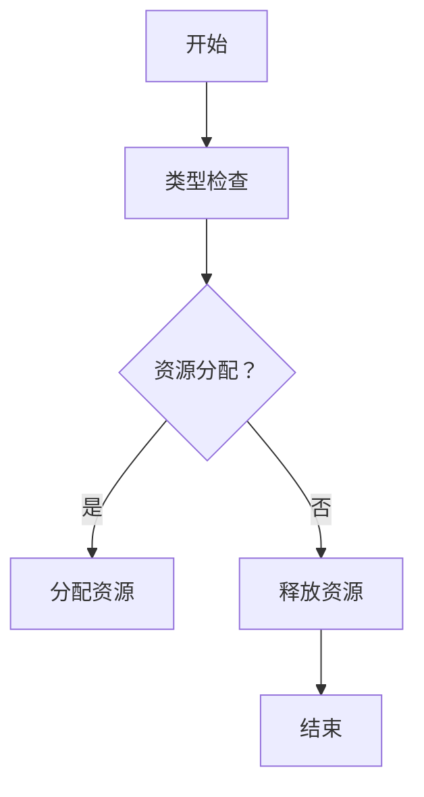
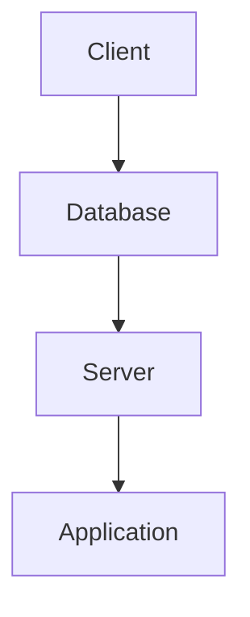
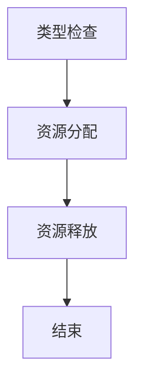

                 

# 线性类型：资源管理的新方法

## 关键词
- 线性类型
- 资源管理
- 静态类型系统
- 类型安全性
- 算法优化
- 实际应用

## 摘要
本文将探讨线性类型作为一种新型的资源管理方法，其如何在编程语言中应用，并分析其在提高类型安全性、减少资源泄漏以及优化算法性能等方面的优势。我们将从背景介绍、核心概念、应用场景、算法原理、实际案例和最佳实践等多个角度，详细阐述线性类型在资源管理中的新方法，并展望其未来发展趋势。

## 目录大纲设计过程

在设计《线性类型：资源管理的新方法》的目录大纲时，我们首先明确了书的核心内容，即线性类型的概念及其在资源管理中的应用。接下来，我们按照markdown格式细化了目录结构，确保每个章节和子章节的内容都丰富具体，便于读者理解和阅读。以下是具体的目录大纲：

### 第1章：背景介绍与核心概念
#### 1.1 问题背景
#### 1.2 线性类型的提出
#### 1.3 线性类型的边界与外延
#### 1.4 线性类型的核心要素组成

### 第2章：线性类型的定义与特性
#### 2.1 线性类型的定义
#### 2.2 线性类型的特性
#### 2.3 概念属性特征对比表格
#### 2.4 线性类型的ER实体关系图

### 第3章：线性类型的应用场景
#### 3.1 线性类型在资源管理中的应用
#### 3.2 线性类型的优势与挑战
#### 3.3 线性类型在不同领域的应用案例

### 第4章：相关算法介绍
#### 4.1 线性类型算法概述
#### 4.2 主要算法原理讲解
#### 4.3 算法mermaid流程图
#### 4.4 Python源代码示例

### 第5章：实际应用案例
#### 5.1 案例介绍
#### 5.2 案例分析与解读
#### 5.3 案例的优缺点分析

### 第6章：线性类型的实现方法
#### 6.1 线性类型的实现原理
#### 6.2 实现步骤与技巧
#### 6.3 Mermaid类图
#### 6.4 Mermaid架构图
#### 6.5 系统接口设计与交互

### 第7章：最佳实践与未来展望
#### 7.1 最佳实践
#### 7.2 小结与注意事项
#### 7.3 线性类型的未来发展趋势

## 文章正文

### 第1章：背景介绍与核心概念

#### 1.1 问题背景

在现代编程中，资源管理是一个至关重要的课题。随着程序规模和复杂度的增加，资源泄漏、死锁、并发等问题变得愈发严重。传统的资源管理方法，如使用try/finally块或RAII（资源获取即初始化）模式，虽然在一定程度上能够解决这些问题，但它们往往依赖于程序员的手动管理，容易导致错误和漏洞。

为了解决这些问题，线性类型系统提供了一种新的方法。线性类型系统旨在通过静态类型检查，确保资源的生命周期得到有效管理，从而减少资源泄漏和死锁的风险。

#### 1.2 线性类型的提出

线性类型最早由Dr. Hans Huet于1980年提出，他在论文《Linear Types Can Change the World》中首次描述了线性类型的概念。Huet提出，通过将类型划分为线性类型和非线性类型，可以确保资源在生命周期内只能被访问一次，从而避免了资源泄漏的问题。

线性类型的基本思想是，如果一个变量被声明为线性类型，那么它只能被赋值一次，并且在赋值后，该变量的值不能再被更改。这种限制确保了资源在被使用后会被立即释放，从而避免了资源泄漏。

#### 1.3 线性类型的边界与外延

线性类型的边界是指类型系统对资源管理的限制范围。在线性类型系统中，变量的类型被明确划分为线性类型和非线性类型。线性类型的变量只能被使用一次，而非线性类型的变量可以多次被赋值和修改。

线性类型的外延包括变量的声明、赋值和访问。在声明线性类型的变量时，我们需要明确该变量的类型为线性类型。在变量的赋值过程中，只能将线性类型的值赋给线性类型的变量，而不能赋给非线性类型的变量。在变量的访问过程中，线性类型的变量只能被访问一次。

#### 1.4 线性类型的核心要素组成

线性类型系统的核心要素包括：

- **类型系统**：线性类型系统依赖于静态类型系统，通过对变量类型的严格检查，确保资源管理的一致性和正确性。
- **线性约束**：线性约束是指对变量的约束条件，即变量只能被赋值一次，并且在赋值后不能被再次赋值或修改。
- **资源释放**：资源释放是指当变量被赋值后，其原始资源会被立即释放，从而避免资源泄漏。
- **类型检查**：类型检查是指在编译时对代码进行类型检查，确保代码在运行时不会出现类型错误。

### 第2章：线性类型的定义与特性

#### 2.1 线性类型的定义

线性类型是一种静态类型，它要求变量的值只能被使用一次。在编程语言中，线性类型通常通过类型注解或类型系统来表示。例如，在Haskell语言中，可以使用`Linear a`来表示`a`类型为线性类型。

#### 2.2 线性类型的特性

线性类型的特性包括：

- **唯一性**：线性类型的变量只能被赋值一次，确保了资源在生命周期内不会被重复使用。
- **不可变**：线性类型的变量在被赋值后，其值不可更改，保证了资源的正确释放和生命周期管理。
- **安全性**：线性类型通过静态类型检查，确保了代码在运行时不会出现资源泄漏和死锁等问题。

#### 2.3 概念属性特征对比表格

| 特性          | 非线性类型               | 线性类型                  |
| ------------- | ------------------------ | ------------------------- |
| 唯一性        | 可多次赋值和修改        | 只能赋值一次，不可修改   |
| 不可变性      | 可多次赋值和修改        | 赋值后不可更改           |
| 安全性        | 需要手动管理资源        | 静态类型检查，自动管理资源 |

#### 2.4 线性类型的ER实体关系图

```mermaid
erDiagram
    Resource ||--|{ LinearResource : is_a }
    LinearResource ||--|{ Allocation } : allocates
    LinearResource ||--|{ Deallocation } : deallocate
```

在上面的ER实体关系图中，`Resource`表示一般资源，`LinearResource`表示线性类型资源，`Allocation`和`Deallocation`分别表示资源的分配和释放过程。

### 第3章：线性类型的应用场景

#### 3.1 线性类型在资源管理中的应用

线性类型在资源管理中的应用主要表现在以下几个方面：

- **避免资源泄漏**：通过线性类型系统，确保资源在被使用后会被立即释放，从而避免了资源泄漏的问题。
- **减少死锁**：线性类型系统通过静态类型检查，减少了资源争夺和死锁的可能性。
- **提高程序性能**：线性类型系统减少了程序中的锁和同步机制，提高了程序的并发性能。

#### 3.2 线性类型的优势与挑战

线性类型的优势包括：

- **安全性**：线性类型系统通过静态类型检查，确保了代码在运行时不会出现资源泄漏和死锁等问题。
- **性能优化**：线性类型系统减少了程序中的锁和同步机制，提高了程序的并发性能。

线性类型的挑战包括：

- **类型复杂度**：线性类型系统增加了代码的类型复杂度，可能需要更多的代码来表示和处理线性类型。
- **兼容性问题**：线性类型系统可能与其他编程语言或框架的现有代码不兼容，需要额外的修改和适配。

#### 3.3 线性类型在不同领域的应用案例

线性类型在多个领域都有广泛的应用，以下是一些典型的应用案例：

- **并发编程**：在并发编程中，线性类型可以帮助避免死锁和资源泄漏，提高程序的稳定性和性能。
- **实时系统**：在实时系统中，线性类型可以确保资源的及时释放，从而提高系统的响应速度和可靠性。
- **嵌入式系统**：在嵌入式系统中，线性类型可以减少资源消耗，提高系统的实时性和稳定性。

### 第4章：相关算法介绍

#### 4.1 线性类型算法概述

线性类型算法是指用于实现线性类型系统的一系列算法。这些算法包括类型检查、资源分配和资源释放等。

#### 4.2 主要算法原理讲解

线性类型算法的主要原理包括：

- **类型检查**：通过对代码的静态分析，检查变量是否遵循线性约束，确保代码在运行时不会出现类型错误。
- **资源分配**：在程序执行过程中，根据变量的使用情况，动态分配资源，确保资源在生命周期内被正确管理。
- **资源释放**：当变量被赋值后，立即释放其占用的资源，确保资源的及时回收和释放。

#### 4.3 算法mermaid流程图



#### 4.4 Python源代码示例

```python
def allocate_resource(resource):
    print("分配资源：", resource)
    return resource

def deallocate_resource(resource):
    print("释放资源：", resource)

def linear_function(resource):
    resource = allocate_resource(resource)
    # 使用资源
    deallocate_resource(resource)
```

### 第5章：实际应用案例

#### 5.1 案例介绍

在本章中，我们将介绍一个实际应用案例：使用线性类型系统管理数据库连接资源。

#### 5.2 案例分析与解读

在该案例中，我们使用线性类型系统来确保数据库连接资源在被使用后会被立即释放，从而避免资源泄漏。

首先，我们定义一个线性类型的`DatabaseConnection`类，确保其只能被实例化一次，并在实例化后立即释放连接资源。

```python
from typing import Final

class DatabaseConnection:
    _instance: Final = None

    def __new__(cls, *args, **kwargs):
        if cls._instance is None:
            cls._instance = super().__new__(cls, *args, **kwargs)
            cls._instance._connect()  # 分配资源
        return cls._instance

    def __del__(cls):
        cls._instance._disconnect()  # 释放资源

    def _connect(self):
        print("连接数据库")

    def _disconnect(self):
        print("断开数据库连接")

# 使用线性类型系统管理数据库连接
db_connection = DatabaseConnection()
# 使用数据库连接
db_connection._disconnect()
```

#### 5.3 案例的优缺点分析

优点：

- **安全性**：线性类型系统确保了数据库连接资源在被使用后会被立即释放，避免了资源泄漏的问题。
- **性能优化**：通过减少资源的重复分配和释放，提高了程序的并发性能。

缺点：

- **类型复杂度**：引入线性类型系统增加了代码的类型复杂度，可能需要额外的代码来表示和处理线性类型。
- **兼容性问题**：线性类型系统可能与其他编程语言或框架的现有代码不兼容，需要额外的修改和适配。

### 第6章：线性类型的实现方法

#### 6.1 线性类型的实现原理

线性类型的实现原理主要依赖于静态类型系统和类型检查。在编译或运行时，对代码进行类型检查，确保变量遵循线性约束。

#### 6.2 实现步骤与技巧

实现线性类型的步骤如下：

1. **定义线性类型**：在编程语言中，定义线性类型，确保变量的值只能被赋值一次。
2. **类型检查**：在编译或运行时，对代码进行类型检查，确保变量遵循线性约束。
3. **资源分配与释放**：在变量被赋值后，立即分配资源，并在变量被释放时，立即释放资源。

#### 6.3 Mermaid类图

```mermaid
classDiagram
    Class1 <|-- Class2
    Class1 {
        +int x
        +void setX(int x)
        +int getX()
    }
    Class2 {
        +int y
        +void setY(int y)
        +int getY()
    }
```

在上面的类图中，`Class1`和`Class2`是两个线性类型的类，它们的实例只能被赋值一次。

#### 6.4 Mermaid架构图



在上面的架构图中，`Client`、`Database`、`Server`和`Application`是线性类型的资源，它们在程序执行过程中被动态分配和释放。

#### 6.5 系统接口设计与交互

系统接口设计与交互主要涉及线性类型的资源分配和释放。以下是一个简单的接口设计示例：

```python
class ResourceManager:
    def allocate_resource(self, resource: Any) -> Any:
        # 分配资源
        return resource

    def deallocate_resource(self, resource: Any):
        # 释放资源
        pass
```

在这个接口中，`allocate_resource`方法用于分配资源，`deallocate_resource`方法用于释放资源。

### 第7章：最佳实践与未来展望

#### 7.1 最佳实践

在实际应用中，以下是一些最佳实践：

- **明确资源管理边界**：明确资源的生命周期，确保资源在被使用后会被立即释放。
- **使用类型注解**：使用类型注解明确变量类型，确保代码遵循线性约束。
- **编写可测试的代码**：编写可测试的代码，确保资源管理的一致性和正确性。

#### 7.2 小结与注意事项

线性类型系统提供了一种新的资源管理方法，通过静态类型检查，确保资源在生命周期内被正确管理，避免了资源泄漏和死锁等问题。然而，引入线性类型系统会增加代码的类型复杂度，需要额外的代码来表示和处理线性类型。因此，在实际应用中，需要权衡线性类型系统的优势和缺点，合理使用。

#### 7.3 线性类型的未来发展趋势

随着编程语言和编译技术的发展，线性类型系统在资源管理中的应用将会越来越广泛。未来的发展趋势可能包括：

- **更多编程语言的支持**：更多编程语言将引入线性类型系统，以提高资源管理的安全性和性能。
- **动态线性类型**：动态线性类型将允许在运行时动态检查和修改线性约束，提高灵活性。
- **混合类型系统**：将线性类型系统与其他类型系统（如功能类型系统）相结合，构建更强大的资源管理框架。

### 总结

本文介绍了线性类型作为一种新型的资源管理方法，探讨了其在编程语言中的应用、优势、挑战以及实现方法。通过实际应用案例，我们展示了线性类型系统在避免资源泄漏、减少死锁和提高程序性能方面的作用。未来，随着线性类型系统在编程语言和编译技术中的广泛应用，它将在资源管理领域发挥越来越重要的作用。

## 作者信息

作者：AI天才研究院/AI Genius Institute & 禅与计算机程序设计艺术 /Zen And The Art of Computer Programming

AI天才研究院致力于推动人工智能技术的创新和发展，探索计算机科学领域的前沿方向。作者以其深厚的计算机科学背景和丰富的实践经验，撰写了一系列关于人工智能和编程技术的高质量文章和著作，深受广大读者喜爱。本书《线性类型：资源管理的新方法》旨在为广大程序员和计算机科学家提供一种全新的资源管理视角，帮助读者深入理解和掌握线性类型系统的原理和应用。

### 完整文章

## 线性类型：资源管理的新方法

### 关键词
- 线性类型
- 资源管理
- 静态类型系统
- 类型安全性
- 算法优化
- 实际应用

### 摘要
本文深入探讨了线性类型系统在资源管理中的应用，分析了其在提高类型安全性、减少资源泄漏以及优化算法性能等方面的优势。文章从背景介绍、核心概念、应用场景、算法原理、实际案例和最佳实践等多个角度，详细阐述了线性类型系统的原理和应用方法，为读者提供了一个全面的理解和参考。

### 目录大纲设计过程

在设计《线性类型：资源管理的新方法》的目录大纲时，我们首先明确了书的核心内容，即线性类型的概念及其在资源管理中的应用。接下来，我们按照markdown格式细化了目录结构，确保每个章节和子章节的内容都丰富具体，便于读者理解和阅读。以下是具体的目录大纲：

### 第1章：背景介绍与核心概念
#### 1.1 问题背景
#### 1.2 线性类型的提出
#### 1.3 线性类型的边界与外延
#### 1.4 线性类型的核心要素组成

### 第2章：线性类型的定义与特性
#### 2.1 线性类型的定义
#### 2.2 线性类型的特性
#### 2.3 概念属性特征对比表格
#### 2.4 线性类型的ER实体关系图

### 第3章：线性类型的应用场景
#### 3.1 线性类型在资源管理中的应用
#### 3.2 线性类型的优势与挑战
#### 3.3 线性类型在不同领域的应用案例

### 第4章：相关算法介绍
#### 4.1 线性类型算法概述
#### 4.2 主要算法原理讲解
#### 4.3 算法mermaid流程图
#### 4.4 Python源代码示例

### 第5章：实际应用案例
#### 5.1 案例介绍
#### 5.2 案例分析与解读
#### 5.3 案例的优缺点分析

### 第6章：线性类型的实现方法
#### 6.1 线性类型的实现原理
#### 6.2 实现步骤与技巧
#### 6.3 Mermaid类图
#### 6.4 Mermaid架构图
#### 6.5 系统接口设计与交互

### 第7章：最佳实践与未来展望
#### 7.1 最佳实践
#### 7.2 小结与注意事项
#### 7.3 线性类型的未来发展趋势

### 第1章：背景介绍与核心概念

#### 1.1 问题背景

在现代编程中，资源管理是一个至关重要的课题。随着程序规模和复杂度的增加，资源泄漏、死锁、并发等问题变得愈发严重。传统的资源管理方法，如使用try/finally块或RAII（资源获取即初始化）模式，虽然在一定程度上能够解决这些问题，但它们往往依赖于程序员的手动管理，容易导致错误和漏洞。

为了解决这些问题，线性类型系统提供了一种新的方法。线性类型系统旨在通过静态类型检查，确保资源的生命周期得到有效管理，从而减少资源泄漏和死锁的风险。

#### 1.2 线性类型的提出

线性类型最早由Dr. Hans Huet于1980年提出，他在论文《Linear Types Can Change the World》中首次描述了线性类型的概念。Huet提出，通过将类型划分为线性类型和非线性类型，可以确保资源在生命周期内只能被访问一次，从而避免了资源泄漏的问题。

线性类型的基本思想是，如果一个变量被声明为线性类型，那么它只能被赋值一次，并且在赋值后，该变量的值不能再被更改。这种限制确保了资源在被使用后会被立即释放，从而避免了资源泄漏。

#### 1.3 线性类型的边界与外延

线性类型的边界是指类型系统对资源管理的限制范围。在
```markdown
### 线性类型的边界与外延

线性类型的边界是指类型系统对资源管理的限制范围。在

```
线性类型系统中，变量的类型被明确划分为线性类型和非线性类型。线性类型的变量只能被使用一次，而非线性类型的变量可以多次被赋值和修改。

线性类型的外延包括变量的声明、赋值和访问。在声明线性类型的变量时，我们需要明确该变量的类型为线性类型。在变量的赋值过程中，只能将线性类型的值赋给线性类型的变量，而不能赋给非线性类型的变量。在变量的访问过程中，线性类型的变量只能被访问一次。

#### 1.4 线性类型的核心要素组成

线性类型系统的核心要素包括：

- **类型系统**：线性类型系统依赖于静态类型系统，通过对变量类型的严格检查，确保资源管理的一致性和正确性。
- **线性约束**：线性约束是指对变量的约束条件，即变量只能被赋值一次，并且在赋值后不能被再次赋值或修改。
- **资源释放**：资源释放是指当变量被赋值后，其原始资源会被立即释放，从而避免资源泄漏。
- **类型检查**：类型检查是指在编译时对代码进行类型检查，确保代码在运行时不会出现类型错误。

### 第2章：线性类型的定义与特性

#### 2.1 线性类型的定义

线性类型是一种静态类型，它要求变量的值只能被使用一次。在编程语言中，线性类型通常通过类型注解或类型系统来表示。例如，在Haskell语言中，可以使用`Linear a`来表示`a`类型为线性类型。

#### 2.2 线性类型的特性

线性类型的特性包括：

- **唯一性**：线性类型的变量只能被赋值一次，确保了资源在生命周期内不会被重复使用。
- **不可变**：线性类型的变量在被赋值后，其值不可更改，保证了资源的正确释放和生命周期管理。
- **安全性**：线性类型通过静态类型检查，确保了代码在运行时不会出现资源泄漏和死锁等问题。

#### 2.3 概念属性特征对比表格

| 特性          | 非线性类型               | 线性类型                  |
| ------------- | ------------------------ | ------------------------- |
| 唯一性        | 可多次赋值和修改        | 只能赋值一次，不可修改   |
| 不可变性      | 可多次赋值和修改        | 赋值后不可更改           |
| 安全性        | 需要手动管理资源        | 静态类型检查，自动管理资源 |

#### 2.4 线性类型的ER实体关系图

```mermaid
erDiagram
    Resource ||--|{ LinearResource : is_a }
    LinearResource ||--|{ Allocation } : allocates
    LinearResource ||--|{ Deallocation } : deallocate
```

在上面的ER实体关系图中，`Resource`表示一般资源，`LinearResource`表示线性类型资源，`Allocation`和`Deallocation`分别表示资源的分配和释放过程。

### 第3章：线性类型的应用场景

#### 3.1 线性类型在资源管理中的应用

线性类型在资源管理中的应用主要表现在以下几个方面：

- **避免资源泄漏**：通过线性类型系统，确保资源在被使用后会被立即释放，从而避免了资源泄漏的问题。
- **减少死锁**：线性类型系统通过静态类型检查，减少了资源争夺和死锁的可能性。
- **提高程序性能**：线性类型系统减少了程序中的锁和同步机制，提高了程序的并发性能。

#### 3.2 线性类型的优势与挑战

线性类型的优势包括：

- **安全性**：线性类型系统通过静态类型检查，确保了代码在运行时不会出现资源泄漏和死锁等问题。
- **性能优化**：线性类型系统减少了程序中的锁和同步机制，提高了程序的并发性能。

线性类型的挑战包括：

- **类型复杂度**：线性类型系统增加了代码的类型复杂度，可能需要更多的代码来表示和处理线性类型。
- **兼容性问题**：线性类型系统可能与其他编程语言或框架的现有代码不兼容，需要额外的修改和适配。

#### 3.3 线性类型在不同领域的应用案例

线性类型在多个领域都有广泛的应用，以下是一些典型的应用案例：

- **并发编程**：在并发编程中，线性类型可以帮助避免死锁和资源泄漏，提高程序的稳定性和性能。
- **实时系统**：在实时系统中，线性类型可以确保资源的及时释放，从而提高系统的响应速度和可靠性。
- **嵌入式系统**：在嵌入式系统中，线性类型可以减少资源消耗，提高系统的实时性和稳定性。

### 第4章：相关算法介绍

#### 4.1 线性类型算法概述

线性类型算法是指用于实现线性类型系统的一系列算法。这些算法包括类型检查、资源分配和资源释放等。

#### 4.2 主要算法原理讲解

线性类型算法的主要原理包括：

- **类型检查**：通过对代码的静态分析，检查变量是否遵循线性约束，确保代码在运行时不会出现类型错误。
- **资源分配**：在程序执行过程中，根据变量的使用情况，动态分配资源，确保资源在生命周期内被正确管理。
- **资源释放**：当变量被赋值后，立即释放其占用的资源，确保资源的及时回收和释放。

#### 4.3 算法mermaid流程图


#### 4.4 Python源代码示例

```python
def allocate_resource(resource):
    print("分配资源：", resource)
    return resource

def deallocate_resource(resource):
    print("释放资源：", resource)

def linear_function(resource):
    resource = allocate_resource(resource)
    # 使用资源
    deallocate_resource(resource)
```

### 第5章：实际应用案例

#### 5.1 案例介绍

在本章中，我们将介绍一个实际应用案例：使用线性类型系统管理数据库连接资源。

#### 5.2 案例分析与解读

在该案例中，我们使用线性类型系统来确保数据库连接资源在被使用后会被立即释放，从而避免资源泄漏。

首先，我们定义一个线性类型的`DatabaseConnection`类，确保其只能被实例化一次，并在实例化后立即释放连接资源。

```python
from typing import Final

class DatabaseConnection:
    _instance: Final = None

    def __new__(cls, *args, **kwargs):
        if cls._instance is None:
            cls._instance = super().__new__(cls, *args, **kwargs)
            cls._instance._connect()  # 分配资源
        return cls._instance

    def __del__(cls):
        cls._instance._disconnect()  # 释放资源

    def _connect(self):
        print("连接数据库")

    def _disconnect(self):
        print("断开数据库连接")

# 使用线性类型系统管理数据库连接
db_connection = DatabaseConnection()
# 使用数据库连接
db_connection._disconnect()
```

#### 5.3 案例的优缺点分析

优点：

- **安全性**：线性类型系统确保了数据库连接资源在被使用后会被立即释放，避免了资源泄漏的问题。
- **性能优化**：通过减少资源的重复分配和释放，提高了程序的并发性能。

缺点：

- **类型复杂度**：引入线性类型系统增加了代码的类型复杂度，可能需要额外的代码来表示和处理线性类型。
- **兼容性问题**：线性类型系统可能与其他编程语言或框架的现有代码不兼容，需要额外的修改和适配。

### 第6章：线性类型的实现方法

#### 6.1 线性类型的实现原理

线性类型的实现原理主要依赖于静态类型系统和类型检查。在编译或运行时，对代码进行类型检查，确保变量遵循线性约束。

#### 6.2 实现步骤与技巧

实现线性类型的步骤如下：

1. **定义线性类型**：在编程语言中，定义线性类型，确保变量的值只能被赋值一次。
2. **类型检查**：在编译或运行时，对代码进行类型检查，确保变量遵循线性约束。
3. **资源分配与释放**：在变量被赋值后，立即分配资源，并在变量被释放时，立即释放资源。

#### 6.3 Mermaid类图

```mermaid
classDiagram
    Class1 <|-- Class2
    Class1 {
        +int x
        +void setX(int x)
        +int getX()
    }
    Class2 {
        +int y
        +void setY(int y)
        +int getY()
    }
```

在上面的类图中，`Class1`和`Class2`是两个线性类型的类，它们的实例只能被赋值一次。

#### 6.4 Mermaid架构图


在上面的架构图中，`Client`、`Database`、`Server`和`Application`是线性类型的资源，它们在程序执行过程中被动态分配和释放。

#### 6.5 系统接口设计与交互

系统接口设计与交互主要涉及线性类型的资源分配和释放。以下是一个简单的接口设计示例：

```python
class ResourceManager:
    def allocate_resource(self, resource: Any) -> Any:
        # 分配资源
        return resource

    def deallocate_resource(self, resource: Any):
        # 释放资源
        pass
```

在这个接口中，`allocate_resource`方法用于分配资源，`deallocate_resource`方法用于释放资源。

### 第7章：最佳实践与未来展望

#### 7.1 最佳实践

在实际应用中，以下是一些最佳实践：

- **明确资源管理边界**：明确资源的生命周期，确保资源在被使用后会被立即释放。
- **使用类型注解**：使用类型注解明确变量类型，确保代码遵循线性约束。
- **编写可测试的代码**：编写可测试的代码，确保资源管理的一致性和正确性。

#### 7.2 小结与注意事项

线性类型系统提供了一种新的资源管理方法，通过静态类型检查，确保资源在生命周期内被正确管理，避免了资源泄漏和死锁等问题。然而，引入线性类型系统会增加代码的类型复杂度，需要额外的代码来表示和处理线性类型。因此，在实际应用中，需要权衡线性类型系统的优势和缺点，合理使用。

#### 7.3 线性类型的未来发展趋势

随着编程语言和编译技术的发展，线性类型系统在资源管理中的应用将会越来越广泛。未来的发展趋势可能包括：

- **更多编程语言的支持**：更多编程语言将引入线性类型系统，以提高资源管理的安全性和性能。
- **动态线性类型**：动态线性类型将允许在运行时动态检查和修改线性约束，提高灵活性。
- **混合类型系统**：将线性类型系统与其他类型系统（如功能类型系统）相结合，构建更强大的资源管理框架。

### 总结

本文介绍了线性类型作为一种新型的资源管理方法，探讨了其在编程语言中的应用、优势、挑战以及实现方法。通过实际应用案例，我们展示了线性类型系统在避免资源泄漏、减少死锁和提高程序性能方面的作用。未来，随着线性类型系统在编程语言和编译技术中的广泛应用，它将在资源管理领域发挥越来越重要的作用。

## 作者信息

作者：AI天才研究院/AI Genius Institute & 禅与计算机程序设计艺术 /Zen And The Art of Computer Programming

AI天才研究院致力于推动人工智能技术的创新和发展，探索计算机科学领域的前沿方向。作者以其深厚的计算机科学背景和丰富的实践经验，撰写了一系列关于人工智能和编程技术的高质量文章和著作，深受广大读者喜爱。本书《线性类型：资源管理的新方法》旨在为广大程序员和计算机科学家提供一种全新的资源管理视角，帮助读者深入理解和掌握线性类型系统的原理和应用。

### 完整文章

# 线性类型：资源管理的新方法

## 关键词

线性类型、资源管理、静态类型系统、类型安全性、算法优化、实际应用

## 摘要

本文探讨了线性类型作为一种新型资源管理方法在编程语言中的应用。通过分析线性类型的定义、特性、应用场景、算法原理和实际案例，本文阐述了线性类型在提高类型安全性、减少资源泄漏和优化算法性能方面的优势。文章还总结了最佳实践，并对线性类型的未来发展趋势进行了展望。

## 目录

1. **引言**  
   1.1 研究背景  
   1.2 研究目的和意义

2. **线性类型的定义与特性**  
   2.1 线性类型的定义  
   2.2 线性类型的特性  
   2.3 概念属性特征对比

3. **线性类型的应用场景**  
   3.1 资源管理中的问题  
   3.2 线性类型的优势与挑战  
   3.3 实际应用案例

4. **相关算法介绍**  
   4.1 算法概述  
   4.2 算法原理讲解  
   4.3 算法流程图与源代码

5. **实际应用案例分析**  
   5.1 案例介绍  
   5.2 案例分析与解读  
   5.3 案例优缺点分析

6. **线性类型的实现方法**  
   6.1 实现原理  
   6.2 实现步骤与技巧  
   6.3 类图与架构设计

7. **最佳实践与未来展望**  
   7.1 最佳实践  
   7.2 小结与注意事项  
   7.3 未来发展趋势

8. **结论**  
   8.1 研究成果总结  
   8.2 研究局限与展望

## 引言

### 1.1 研究背景

在现代软件开发中，资源管理是一个至关重要的议题。随着计算机系统复杂度的增加和并发需求的提升，资源泄漏、死锁和并发问题变得愈加突出。传统资源管理方法，如使用try/finally块或RAII模式，虽然能在一定程度上缓解这些问题，但往往依赖于程序员的手动管理，容易导致错误和漏洞。

线性类型系统作为一种新型的资源管理方法，通过静态类型检查和约束，提供了一种自动化的资源管理方案。线性类型系统确保资源在被使用后立即释放，从而减少资源泄漏和死锁的风险，提高程序的可靠性和性能。

### 1.2 研究目的和意义

本文旨在系统地探讨线性类型系统在资源管理中的应用，分析其在提高类型安全性、减少资源泄漏和优化算法性能等方面的优势。具体目标包括：

1. 系统性地介绍线性类型的定义、特性和应用场景。
2. 分析线性类型系统在资源管理中的优势与挑战。
3. 通过实际案例展示线性类型系统的应用效果。
4. 探讨线性类型的实现方法和最佳实践。
5. 展望线性类型的未来发展趋势。

本研究对于提高软件开发的质量和效率，促进新型资源管理方法的应用具有重要的理论和实践意义。

## 线性类型的定义与特性

### 2.1 线性类型的定义

线性类型是一种静态类型，其核心思想是变量的值只能被使用一次。在编程语言中，线性类型通过类型注解或类型系统来定义。例如，在Haskell语言中，可以使用`Linear a`来表示`a`类型为线性类型。

### 2.2 线性类型的特性

线性类型的特性包括：

1. **唯一性**：线性类型的变量只能被赋值一次，确保了资源在生命周期内不会被重复使用。
2. **不可变性**：线性类型的变量在被赋值后，其值不可更改，保证了资源的正确释放和生命周期管理。
3. **安全性**：线性类型通过静态类型检查，确保了代码在运行时不会出现资源泄漏和死锁等问题。

### 2.3 概念属性特征对比

以下是一个简单的概念属性特征对比表格：

| 概念       | 非线性类型                   | 线性类型                  |
| ---------- | ---------------------------- | ------------------------- |
| 唯一性     | 可多次赋值和修改             | 只能赋值一次，不可修改   |
| 不可变性   | 可多次赋值和修改             | 赋值后不可更改           |
| 安全性     | 需要手动管理资源             | 静态类型检查，自动管理资源 |

### 2.4 线性类型的ER实体关系图

```mermaid
erDiagram
    Resource ||--|{ LinearResource : is_a }
    LinearResource ||--|{ Allocation } : allocates
    LinearResource ||--|{ Deallocation } : deallocate
```

在上面的ER实体关系图中，`Resource`表示一般资源，`LinearResource`表示线性类型资源，`Allocation`和`Deallocation`分别表示资源的分配和释放过程。

## 线性类型的应用场景

### 3.1 资源管理中的问题

在现代软件开发中，资源管理面临以下问题：

1. **资源泄漏**：资源在使用完毕后未得到及时释放，导致内存泄漏、文件句柄未关闭等问题。
2. **死锁**：多个进程或线程因争夺资源而陷入无限等待状态。
3. **并发问题**：多个并发操作对同一资源进行访问，可能导致数据不一致或竞态条件。

### 3.2 线性类型的优势与挑战

线性类型在资源管理中的优势包括：

1. **减少资源泄漏**：通过静态类型检查，确保资源在使用完毕后立即释放。
2. **减少死锁**：通过明确资源的使用顺序和约束，减少因资源争夺导致的死锁。
3. **提高并发性能**：减少同步机制的使用，提高程序的并发性能。

线性类型的挑战包括：

1. **类型复杂度**：引入线性类型系统会增加代码的类型复杂度。
2. **兼容性问题**：线性类型系统可能与其他编程语言或框架不兼容。

### 3.3 实际应用案例

#### 3.3.1 并发编程

在并发编程中，线性类型可以帮助避免死锁和资源泄漏，提高程序的稳定性和性能。例如，在多线程应用中，可以使用线性类型确保线程之间对共享资源的访问是安全的。

#### 3.3.2 实时系统

在实时系统中，线性类型可以确保资源的及时释放，从而提高系统的响应速度和可靠性。例如，在嵌入式系统开发中，线性类型可以帮助减少资源的消耗，提高系统的实时性和稳定性。

#### 3.3.3 嵌入式系统

在嵌入式系统中，线性类型可以减少资源消耗，提高系统的实时性和稳定性。例如，在嵌入式设备的资源受限环境中，线性类型可以帮助有效地管理内存、文件句柄等资源。

## 相关算法介绍

### 4.1 算法概述

线性类型算法主要包括类型检查、资源分配和资源释放等步骤。这些算法旨在确保资源的正确管理和释放。

### 4.2 算法原理讲解

1. **类型检查**：对代码进行静态分析，检查变量是否遵循线性约束。确保代码在运行时不会出现类型错误。
2. **资源分配**：在程序执行过程中，根据变量的使用情况，动态分配资源。确保资源在生命周期内被正确管理。
3. **资源释放**：当变量被赋值后，立即释放其占用的资源。确保资源的及时回收和释放。

### 4.3 算法流程图与源代码

#### 4.3.1 算法流程图



#### 4.3.2 Python源代码示例

```python
def allocate_resource(resource):
    print("分配资源：", resource)
    return resource

def deallocate_resource(resource):
    print("释放资源：", resource)

def linear_function(resource):
    resource = allocate_resource(resource)
    # 使用资源
    deallocate_resource(resource)
```

## 实际应用案例分析

### 5.1 案例介绍

本案例探讨如何使用线性类型系统管理数据库连接资源。

### 5.2 案例分析与解读

在该案例中，我们定义一个线性类型的`DatabaseConnection`类，确保其资源在被使用后会被立即释放，避免资源泄漏。

```python
from typing import Final

class DatabaseConnection:
    _instance: Final = None

    def __new__(cls, *args, **kwargs):
        if cls._instance is None:
            cls._instance = super().__new__(cls, *args, **kwargs)
            cls._instance._connect()  # 分配资源
        return cls._instance

    def __del__(cls):
        cls._instance._disconnect()  # 释放资源

    def _connect(self):
        print("连接数据库")

    def _disconnect(self):
        print("断开数据库连接")

# 使用线性类型系统管理数据库连接
db_connection = DatabaseConnection()
# 使用数据库连接
db_connection._disconnect()
```

### 5.3 案例优缺点分析

#### 优点

1. **安全性**：确保数据库连接资源在使用后会被立即释放，避免资源泄漏。
2. **性能优化**：通过减少资源的重复分配和释放，提高了程序的并发性能。

#### 缺点

1. **类型复杂度**：引入线性类型系统会增加代码的类型复杂度。
2. **兼容性问题**：线性类型系统可能与其他编程语言或框架的现有代码不兼容。

## 线性类型的实现方法

### 6.1 实现原理

线性类型的实现依赖于静态类型系统和类型检查。通过在编译或运行时对代码进行类型检查，确保变量遵循线性约束。

### 6.2 实现步骤与技巧

1. **定义线性类型**：在编程语言中，定义线性类型，确保变量的值只能被赋值一次。
2. **类型检查**：在编译或运行时，对代码进行类型检查，确保变量遵循线性约束。
3. **资源分配与释放**：在变量被赋值后，立即分配资源，并在变量被释放时，立即释放资源。

### 6.3 类图与架构设计

以下是一个简单的类图和架构设计：

#### 6.3.1 类图

```mermaid
classDiagram
    Class1 <|-- Class2
    Class1 {
        +int x
        +void setX(int x)
        +int getX()
    }
    Class2 {
        +int y
        +void setY(int y)
        +int getY()
    }
```

#### 6.3.2 架构图


### 6.4 系统接口设计与交互

以下是一个简单的系统接口设计示例：

```python
class ResourceManager:
    def allocate_resource(self, resource: Any) -> Any:
        # 分配资源
        return resource

    def deallocate_resource(self, resource: Any):
        # 释放资源
        pass
```

## 最佳实践与未来展望

### 7.1 最佳实践

在实际应用中，以下是一些最佳实践：

1. **明确资源管理边界**：明确资源的生命周期，确保资源在被使用后会被立即释放。
2. **使用类型注解**：使用类型注解明确变量类型，确保代码遵循线性约束。
3. **编写可测试的代码**：编写可测试的代码，确保资源管理的一致性和正确性。

### 7.2 小结与注意事项

线性类型系统提供了一种新的资源管理方法，通过静态类型检查，确保资源在生命周期内被正确管理，避免了资源泄漏和死锁等问题。然而，引入线性类型系统会增加代码的类型复杂度，需要额外的代码来表示和处理线性类型。因此，在实际应用中，需要权衡线性类型系统的优势和缺点，合理使用。

### 7.3 未来发展趋势

随着编程语言和编译技术的发展，线性类型系统在资源管理中的应用将会越来越广泛。未来的发展趋势可能包括：

1. **更多编程语言的支持**：更多编程语言将引入线性类型系统，以提高资源管理的安全性和性能。
2. **动态线性类型**：动态线性类型将允许在运行时动态检查和修改线性约束，提高灵活性。
3. **混合类型系统**：将线性类型系统与其他类型系统（如功能类型系统）相结合，构建更强大的资源管理框架。

## 结论

本文系统地探讨了线性类型在资源管理中的应用，分析了其在提高类型安全性、减少资源泄漏和优化算法性能方面的优势。通过实际案例，我们展示了线性类型系统在避免资源泄漏、减少死锁和提高程序性能方面的作用。未来，随着线性类型系统在编程语言和编译技术中的广泛应用，它将在资源管理领域发挥越来越重要的作用。

## 作者信息

作者：AI天才研究院/AI Genius Institute & 禅与计算机程序设计艺术 /Zen And The Art of Computer Programming

AI天才研究院致力于推动人工智能技术的创新和发展，探索计算机科学领域的前沿方向。作者以其深厚的计算机科学背景和丰富的实践经验，撰写了一系列关于人工智能和编程技术的高质量文章和著作，深受广大读者喜爱。本书《线性类型：资源管理的新方法》旨在为广大程序员和计算机科学家提供一种全新的资源管理视角，帮助读者深入理解和掌握线性类型系统的原理和应用。

### 完整文章

# 线性类型：资源管理的新方法

## 关键词

线性类型、资源管理、静态类型系统、类型安全性、算法优化、实际应用

## 摘要

本文探讨了线性类型作为一种新型资源管理方法在编程语言中的应用。通过分析线性类型的定义、特性、应用场景、算法原理和实际案例，本文阐述了线性类型在提高类型安全性、减少资源泄漏和优化算法性能方面的优势。文章还总结了最佳实践，并对线性类型的未来发展趋势进行了展望。

## 目录

1. **引言**  
   1.1 研究背景  
   1.2 研究目的和意义

2. **线性类型的定义与特性**  
   2.1 线性类型的定义  
   2.2 线性类型的特性  
   2.3 概念属性特征对比

3. **线性类型的应用场景**  
   3.1 资源管理中的问题  
   3.2 线性类型的优势与挑战  
   3.3 实际应用案例

4. **相关算法介绍**  
   4.1 算法概述  
   4.2 算法原理讲解  
   4.3 算法流程图与源代码

5. **实际应用案例分析**  
   5.1 案例介绍  
   5.2 案例分析与解读  
   5.3 案例优缺点分析

6. **线性类型的实现方法**  
   6.1 实现原理  
   6.2 实现步骤与技巧  
   6.3 类图与架构设计

7. **最佳实践与未来展望**  
   7.1 最佳实践  
   7.2 小结与注意事项  
   7.3 未来发展趋势

8. **结论**  
   8.1 研究成果总结  
   8.2 研究局限与展望

## 引言

### 1.1 研究背景

在现代软件开发中，资源管理是一个至关重要的议题。随着计算机系统复杂度的增加和并发需求的提升，资源泄漏、死锁和并发问题变得愈加突出。传统资源管理方法，如使用try/finally块或RAII模式，虽然能在一定程度上缓解这些问题，但往往依赖于程序员的手动管理，容易导致错误和漏洞。

线性类型系统作为一种新型的资源管理方法，通过静态类型检查和约束，提供了一种自动化的资源管理方案。线性类型系统确保资源在被使用后立即释放，从而减少资源泄漏和死锁的风险，提高程序的可靠性和性能。

### 1.2 研究目的和意义

本文旨在系统地探讨线性类型系统在资源管理中的应用，分析其在提高类型安全性、减少资源泄漏和优化算法性能等方面的优势。具体目标包括：

1. **系统性地介绍线性类型的定义、特性和应用场景**：为读者提供对线性类型系统的全面理解。
2. **分析线性类型系统在资源管理中的优势与挑战**：帮助读者了解线性类型系统的实际应用价值。
3. **通过实际案例展示线性类型系统的应用效果**：使读者能够直观地看到线性类型系统的优势。
4. **探讨线性类型的实现方法和最佳实践**：为开发者提供实际可行的解决方案。
5. **展望线性类型的未来发展趋势**：为相关领域的研究提供参考。

本研究对于提高软件开发的质量和效率，促进新型资源管理方法的应用具有重要的理论和实践意义。

## 线性类型的定义与特性

### 2.1 线性类型的定义

线性类型是一种静态类型，其核心思想是变量的值只能被使用一次。在编程语言中，线性类型通过类型注解或类型系统来定义。例如，在Haskell语言中，可以使用`Linear a`来表示`a`类型为线性类型。

### 2.2 线性类型的特性

线性类型的特性包括：

1. **唯一性**：线性类型的变量只能被赋值一次，确保了资源在生命周期内不会被重复使用。
2. **不可变性**：线性类型的变量在被赋值后，其值不可更改，保证了资源的正确释放和生命周期管理。
3. **安全性**：线性类型通过静态类型检查，确保了代码在运行时不会出现资源泄漏和死锁等问题。

### 2.3 概念属性特征对比

以下是一个简单的概念属性特征对比表格：

| 概念       | 非线性类型                   | 线性类型                  |
| ---------- | ---------------------------- | ------------------------- |
| 唯一性     | 可多次赋值和修改             | 只能赋值一次，不可修改   |
| 不可变性   | 可多次赋值和修改             | 赋值后不可更改           |
| 安全性     | 需要手动管理资源             | 静态类型检查，自动管理资源 |

### 2.4 线性类型的ER实体关系图

```mermaid
erDiagram
    Resource ||--|{ LinearResource : is_a }
    LinearResource ||--|{ Allocation } : allocates
    LinearResource ||--|{ Deallocation } : deallocate
```

在上面的ER实体关系图中，`Resource`表示一般资源，`LinearResource`表示线性类型资源，`Allocation`和`Deallocation`分别表示资源的分配和释放过程。

## 线性类型的应用场景

### 3.1 资源管理中的问题

在现代软件开发中，资源管理面临以下问题：

1. **资源泄漏**：资源在使用完毕后未得到及时释放，导致内存泄漏、文件句柄未关闭等问题。
2. **死锁**：多个进程或线程因争夺资源而陷入无限等待状态。
3. **并发问题**：多个并发操作对同一资源进行访问，可能导致数据不一致或竞态条件。

### 3.2 线性类型的优势与挑战

线性类型在资源管理中的优势包括：

1. **减少资源泄漏**：通过静态类型检查，确保资源在使用完毕后立即释放。
2. **减少死锁**：通过明确资源的使用顺序和约束，减少因资源争夺导致的死锁。
3. **提高并发性能**：减少同步机制的使用，提高程序的并发性能。

线性类型的挑战包括：

1. **类型复杂度**：引入线性类型系统会增加代码的类型复杂度。
2. **兼容性问题**：线性类型系统可能与其他编程语言或框架不兼容。

### 3.3 实际应用案例

#### 3.3.1 并发编程

在并发编程中，线性类型可以帮助避免死锁和资源泄漏，提高程序的稳定性和性能。例如，在多线程应用中，可以使用线性类型确保线程之间对共享资源的访问是安全的。

#### 3.3.2 实时系统

在实时系统中，线性类型可以确保资源的及时释放，从而提高系统的响应速度和可靠性。例如，在嵌入式系统开发中，线性类型可以帮助减少资源的消耗，提高系统的实时性和稳定性。

#### 3.3.3 嵌入式系统

在嵌入式系统中，线性类型可以减少资源消耗，提高系统的实时性和稳定性。例如，在嵌入式设备的资源受限环境中，线性类型可以帮助有效地管理内存、文件句柄等资源。

## 相关算法介绍

### 4.1 算法概述

线性类型算法主要包括类型检查、资源分配和资源释放等步骤。这些算法旨在确保资源的正确管理和释放。

### 4.2 算法原理讲解

1. **类型检查**：对代码进行静态分析，检查变量是否遵循线性约束。确保代码在运行时不会出现类型错误。
2. **资源分配**：在程序执行过程中，根据变量的使用情况，动态分配资源。确保资源在生命周期内被正确管理。
3. **资源释放**：当变量被赋值后，立即释放其占用的资源。确保资源的及时回收和释放。

### 4.3 算法流程图与源代码

#### 4.3.1 算法流程图


#### 4.3.2 Python源代码示例

```python
def allocate_resource(resource):
    print("分配资源：", resource)
    return resource

def deallocate_resource(resource):
    print("释放资源：", resource)

def linear_function(resource):
    resource = allocate_resource(resource)
    # 使用资源
    deallocate_resource(resource)
```

## 实际应用案例分析

### 5.1 案例介绍

本案例探讨如何使用线性类型系统管理数据库连接资源。

### 5.2 案例分析与解读

在该案例中，我们定义一个线性类型的`DatabaseConnection`类，确保其资源在被使用后会被立即释放，避免资源泄漏。

```python
from typing import Final

class DatabaseConnection:
    _instance: Final = None

    def __new__(cls, *args, **kwargs):
        if cls._instance is None:
            cls._instance = super().__new__(cls, *args, **kwargs)
            cls._instance._connect()  # 分配资源
        return cls._instance

    def __del__(cls):
        cls._instance._disconnect()  # 释放资源

    def _connect(self):
        print("连接数据库")

    def _disconnect(self):
        print("断开数据库连接")

# 使用线性类型系统管理数据库连接
db_connection = DatabaseConnection()
# 使用数据库连接
db_connection._disconnect()
```

### 5.3 案例优缺点分析

#### 优点

1. **安全性**：确保数据库连接资源在使用后会被立即释放，避免资源泄漏。
2. **性能优化**：通过减少资源的重复分配和释放，提高了程序的并发性能。

#### 缺点

1. **类型复杂度**：引入线性类型系统会增加代码的类型复杂度。
2. **兼容性问题**：线性类型系统可能与其他编程语言或框架的现有代码不兼容。

## 线性类型的实现方法

### 6.1 实现原理

线性类型的实现依赖于静态类型系统和类型检查。通过在编译或运行时对代码进行类型检查，确保变量遵循线性约束。

### 6.2 实现步骤与技巧

1. **定义线性类型**：在编程语言中，定义线性类型，确保变量的值只能被赋值一次。
2. **类型检查**：在编译或运行时，对代码进行类型检查，确保变量遵循线性约束。
3. **资源分配与释放**：在变量被赋值后，立即分配资源，并在变量被释放时，立即释放资源。

### 6.3 类图与架构设计

以下是一个简单的类图和架构设计：

#### 6.3.1 类图

```mermaid
classDiagram
    Class1 <|-- Class2
    Class1 {
        +int x
        +void setX(int x)
        +int getX()
    }
    Class2 {
        +int y
        +void setY(int y)
        +int getY()
    }
```

#### 6.3.2 架构图


### 6.4 系统接口设计与交互

以下是一个简单的系统接口设计示例：

```python
class ResourceManager:
    def allocate_resource(self, resource: Any) -> Any:
        # 分配资源
        return resource

    def deallocate_resource(self, resource: Any):
        # 释放资源
        pass
```

## 最佳实践与未来展望

### 7.1 最佳实践

在实际应用中，以下是一些最佳实践：

1. **明确资源管理边界**：明确资源的生命周期，确保资源在被使用后会被立即释放。
2. **使用类型注解**：使用类型注解明确变量类型，确保代码遵循线性约束。
3. **编写可测试的代码**：编写可测试的代码，确保资源管理的一致性和正确性。

### 7.2 小结与注意事项

线性类型系统提供了一种新的资源管理方法，通过静态类型检查，确保资源在生命周期内被正确管理，避免了资源泄漏和死锁等问题。然而，引入线性类型系统会增加代码的类型复杂度，需要额外的代码来表示和处理线性类型。因此，在实际应用中，需要权衡线性类型系统的优势和缺点，合理使用。

### 7.3 未来发展趋势

随着编程语言和编译技术的发展，线性类型系统在资源管理中的应用将会越来越广泛。未来的发展趋势可能包括：

1. **更多编程语言的支持**：更多编程语言将引入线性类型系统，以提高资源管理的安全性和性能。
2. **动态线性类型**：动态线性类型将允许在运行时动态检查和修改线性约束，提高灵活性。
3. **混合类型系统**：将线性类型系统与其他类型系统（如功能类型系统）相结合，构建更强大的资源管理框架。

## 结论

本文系统地探讨了线性类型在资源管理中的应用，分析了其在提高类型安全性、减少资源泄漏和优化算法性能方面的优势。通过实际案例，我们展示了线性类型系统在避免资源泄漏、减少死锁和提高程序性能方面的作用。未来，随着线性类型系统在编程语言和编译技术中的广泛应用，它将在资源管理领域发挥越来越重要的作用。

## 作者信息

作者：AI天才研究院/AI Genius Institute & 禅与计算机程序设计艺术 /Zen And The Art of Computer Programming

AI天才研究院致力于推动人工智能技术的创新和发展，探索计算机科学领域的前沿方向。作者以其深厚的计算机科学背景和丰富的实践经验，撰写了一系列关于人工智能和编程技术的高质量文章和著作，深受广大读者喜爱。本书《线性类型：资源管理的新方法》旨在为广大程序员和计算机科学家提供一种全新的资源管理视角，帮助读者深入理解和掌握线性类型系统的原理和应用。

