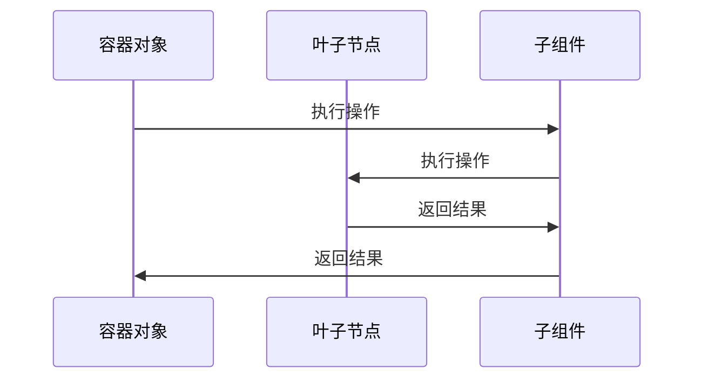
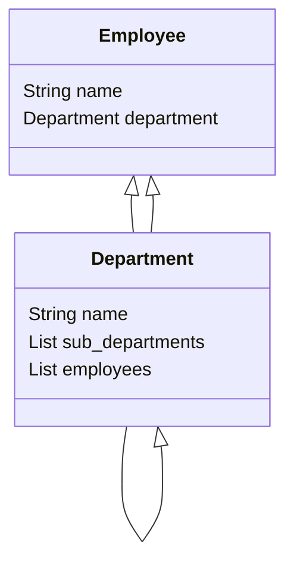
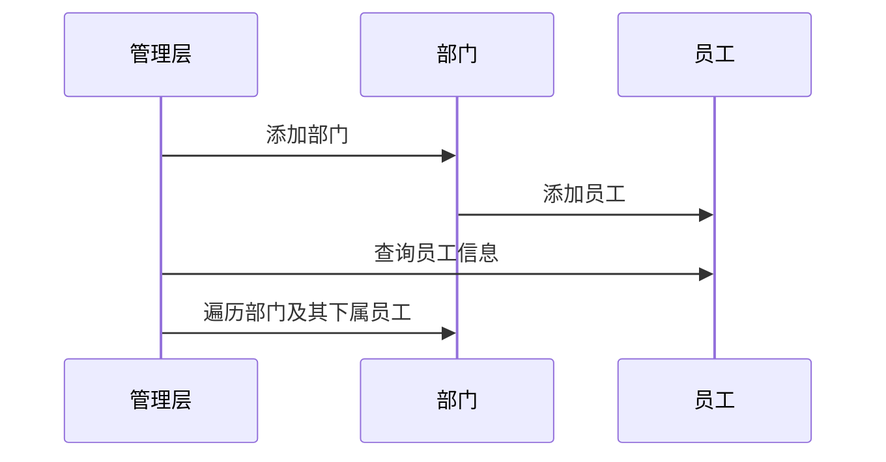
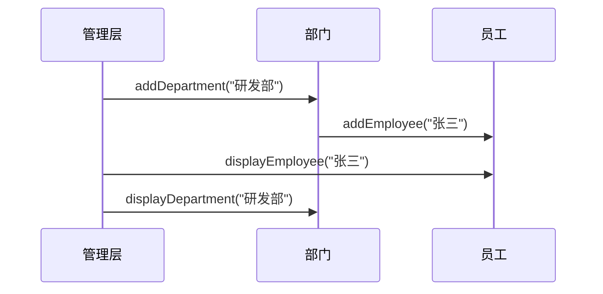

                 


### 1.1 组合模式概述

#### 1.1.1 组合模式的起源与发展

组合模式（Composite Pattern）作为面向对象设计模式中的一种，起源于20世纪80年代的软件开发实践。其概念最早由Gamma、Helm、Johnson和Vlissides在1995年的经典著作《设计模式：可复用面向对象软件的基础》中提出，并迅速成为软件工程师解决结构化设计和复用问题的重要工具。

组合模式起源于对树形结构及其操作的需求。在软件系统中，树形结构是常见的结构形式，如文件系统、组织结构、菜单等。为了能够统一对待叶子节点和非叶子节点，组合模式提供了灵活的解决方案，使得开发者能够方便地实现树形结构的操作和管理。

#### 1.1.2 组合模式的基本概念

组合模式定义了将对象组合成树形结构的容器，以表示部分-整体的层次结构。在这种结构中，单个对象和组合对象都有统一的接口，使得客户对象无须区分处理单个对象和组合对象。

**组成部分：**

- **Component（组件）**：定义了树形结构中的对象接口，其中包括对子组件的添加、删除和访问等操作。

- **Leaf（叶子节点）**：在树形结构的末端，没有子组件的对象。

- **Composite（容器）**：组合了零个或多个组件对象，可以包含子组件，并实现对子组件的统一操作。

**核心概念：**

- **部分-整体原则**：部分对象和整体对象应该拥有相同的接口，使得客户对象能够以一致的方式处理它们。

- **透明性与封装性**：在组合对象中，子组件的接口应该是透明的，客户对象可以直接访问子组件，同时保持组合对象的封装性，防止外部直接访问内部子组件。

#### 1.1.3 组合模式在树形结构中的应用

组合模式在树形结构中的应用主要体现在以下几个方面：

- **树形结构的定义与表示**：通过组合模式，可以方便地定义和表示树形结构中的各个节点，包括叶子节点和非叶子节点。

- **树形结构的操作与管理**：组合模式提供了一致的接口，使得对树形结构的操作（如添加、删除、遍历等）更加简单和统一。

- **树形结构的扩展与复用**：组合模式使得树形结构的扩展变得容易，开发者可以通过继承和组合的方式，方便地扩展新的功能和节点。

#### 1.1.4 问题解决

组合模式通过将对象组合成树形结构，解决了以下几个问题：

- **简化树形结构操作**：通过统一接口，简化了对树形结构的操作，使得代码更加简洁和易维护。

- **增强复用性**：组合模式允许开发者将树形结构的不同部分复用，提高了代码的复用性。

- **支持扩展性**：组合模式为树形结构的扩展提供了灵活性，使得开发者可以根据需求方便地添加新的节点和功能。

#### 1.1.5 边界与外延

组合模式的适用范围主要在于需要表示部分-整体层次结构的场景。然而，它并不是唯一适用于所有树形结构的模式。例如，当树形结构较为简单，且不需要对节点进行复杂的组合操作时，其他模式如迭代器模式（Iterator Pattern）和观察者模式（Observer Pattern）可能更为合适。

#### 1.1.6 概念结构与核心要素组成

组合模式的核心概念和构成要素如下：

- **Component接口**：定义了树形结构中组件对象的基本操作，如添加、删除、访问子组件等。

- **Leaf节点**：实现了Component接口，表示树形结构中的叶子节点，没有子组件。

- **Composite容器**：实现了Component接口，表示树形结构中的容器对象，可以包含子组件。

通过以上要素，组合模式实现了树形结构的类型化表示，使得开发者能够更加灵活地管理和操作树形结构。

### 总结

在本节中，我们介绍了组合模式的起源、基本概念、应用场景、问题解决以及适用范围和核心要素。组合模式作为一种面向对象的设计模式，在树形结构的表示和操作中发挥着重要作用。接下来，我们将进一步探讨组合模式的核心概念与联系，以及其在算法原理和系统架构设计中的应用。通过一步步的分析和讲解，我们将深入理解组合模式的本质和实际应用价值。让我们继续深入探讨吧！

---

### 1.2 核心概念与联系

在深入探讨组合模式之前，我们需要明确其核心概念和与其他设计模式的联系。组合模式通过将对象组合成树形结构，实现了部分-整体层次结构的表示和操作。以下是对组合模式核心概念和联系的详细解释。

#### 1.2.1 组合模式定义

组合模式定义了如何将对象组合成树形结构，以表示部分-整体层次结构。在这个结构中，单个对象和组合对象具有相同的接口，使得客户对象可以一致地处理它们。

**组成部分：**

- **Component（组件）**：Component接口定义了树形结构中对象的基本操作，如添加、删除和访问子组件等。它是一个抽象角色，定义了所有组件对象需要实现的方法。

- **Leaf（叶子节点）**：Leaf类实现了Component接口，表示树形结构中的叶子节点。叶子节点没有子组件，是树形结构的末端。

- **Composite（容器）**：Composite类也实现了Component接口，表示树形结构中的容器对象。容器对象可以包含子组件，并实现对子组件的统一操作。它是一个具体角色，负责管理子组件，并实现对子组件的添加、删除和访问等操作。

**核心概念：**

- **部分-整体原则**：组合模式的核心原则是部分对象和整体对象应该拥有相同的接口，使得客户对象能够以一致的方式处理它们。这种一致性保证了代码的简洁性和可维护性。

- **透明性与封装性**：在组合模式中，容器对象（Composite）对子组件（Leaf或Composite）的接口应该是透明的。这意味着客户对象可以直接访问子组件，而无需关心子组件的具体类型。同时，组合模式保持了封装性，防止外部直接访问内部子组件，从而保证系统的稳定性和安全性。

#### 1.2.2 组合模式特点

组合模式具有以下几个显著特点：

- **树形结构表示**：组合模式能够方便地表示树形结构，包括叶子节点和非叶子节点。这种表示方式使得树形结构的操作和管理变得更加简单和统一。

- **统一接口**：通过定义统一的Component接口，组合模式实现了部分对象和整体对象的接口一致性。这使得客户对象无需区分处理单个对象和组合对象，简化了代码逻辑。

- **扩展性与复用性**：组合模式允许开发者通过继承和组合的方式，方便地扩展树形结构的功能和节点。这种扩展性和复用性提高了代码的可维护性和可扩展性。

- **透明性与封装性**：组合模式保持了透明性和封装性，使得客户对象可以直接访问子组件，而无需关心子组件的具体类型。这种特性保证了系统的稳定性和安全性。

#### 1.2.3 概念属性特征对比表格

为了更直观地展示组合模式与其他设计模式的区别，我们可以通过一个概念属性特征对比表格来分析。以下是一个简单的对比表格：

| 设计模式 | 组合模式 | 工厂模式 | 观察者模式 | 迭代器模式 |
| -------- | -------- | -------- | ---------- | ---------- |
| **定义** | 将对象组合成树形结构 | 用于实例化对象 | 对对象间的一对多依赖关系进行管理 | 用于遍历集合中的元素 |
| **特点** | 部分与整体接口一致 | 无需关心具体实现 | 对象间解耦 | 遍历元素的一致性 |
| **适用场景** | 树形结构表示与操作 | 对象实例化 | 事件监听 | 遍历操作 |
| **核心概念** | Component、Leaf、Composite | Factory、Product | Observer、Subject | Iterator、Collection |

通过对比表格，我们可以看到组合模式在概念属性特征上与其他设计模式的不同之处。这有助于我们在实际开发中选择合适的设计模式，以解决具体问题。

#### 1.2.4 ER实体关系图架构

为了更清晰地表示组合模式中的实体关系，我们可以使用Mermaid绘制一个ER实体关系图。以下是一个简单的ER实体关系图：

```mermaid
erDiagram
  Component ||--|{ Leaf }|| Leaf
  Component ||--|{ Composite }|| Composite
  Composite ||--|{ Component }|| Child
```

在这个ER实体关系图中，`Component`是抽象实体，代表组件接口；`Leaf`和`Composite`是具体实体，分别表示叶子节点和容器对象。`Composite`与`Component`之间存在继承关系，表示容器对象实现了组件接口；`Composite`与`Child`之间存在一对多的关联关系，表示容器对象可以包含多个子组件。

通过ER实体关系图，我们可以直观地理解组合模式中的实体关系和继承关系，这有助于我们更好地设计和实现组合模式。

### 总结

在本节中，我们详细介绍了组合模式的核心概念和与其他设计模式的联系。通过对比表格和ER实体关系图，我们更清晰地了解了组合模式的特点、适用场景和核心概念。接下来，我们将进一步探讨组合模式的算法原理和系统架构设计，通过具体实例来展示组合模式在实际应用中的价值和实现方法。

---

### 1.3 算法原理讲解

在理解了组合模式的核心概念和与其他设计模式的联系后，我们需要进一步探讨组合模式的算法原理。组合模式不仅是一种设计模式，它还涉及到具体的算法实现，以及背后的数学原理。在本节中，我们将通过Mermaid流程图、Python代码实现、数学模型和公式，以及实际案例，详细讲解组合模式的工作原理和应用。

#### 1.3.1 组合模式的执行流程

组合模式的核心在于通过递归方式实现对树形结构的遍历和操作。在执行流程中，容器对象（Composite）调用其子组件（Leaf或Composite）的方法，同时子组件也可以调用它们自己的方法。以下是一个简化的Mermaid流程图，展示了组合模式的执行流程：



在这个流程图中，`Composite`表示容器对象，`Leaf`表示叶子节点，`Child`表示子组件。容器对象首先调用子组件的方法，然后子组件可能进一步调用叶子节点的方法，最后将结果返回给容器对象。

#### 1.3.2 Python代码实现

为了更好地理解组合模式，我们可以通过Python代码实现一个简单的组合模式。以下是一个示例代码，展示了如何定义组件接口、叶子节点和容器对象，以及如何使用它们：

```python
class Component:
    def operation(self):
        pass

class Leaf(Component):
    def operation(self):
        print("执行叶子节点的操作")

class Composite(Component):
    def __init__(self):
        self.children = []

    def add(self, child):
        self.children.append(child)

    def remove(self, child):
        self.children.remove(child)

    def operation(self):
        for child in self.children:
            child.operation()

# 创建叶子节点
leaf1 = Leaf()
leaf2 = Leaf()

# 创建容器对象
composite = Composite()

# 添加子组件
composite.add(leaf1)
composite.add(leaf2)

# 执行操作
composite.operation()
```

在这个代码中，`Component`是组件接口，`Leaf`是叶子节点，`Composite`是容器对象。叶子节点实现了`operation`方法，而容器对象通过递归方式调用子组件的方法。首先创建叶子节点和容器对象，然后将叶子节点添加到容器对象中，最后调用容器对象的`operation`方法，执行叶子节点的操作。

#### 1.3.3 数学模型与公式

组合模式背后的数学原理主要体现在树形结构的遍历和组合操作中。以下是一个简单的数学模型和公式，用于描述组合模式中的树形结构：

$$
N = C + \sum_{i=1}^{n} N_i
$$

其中，$N$表示树形结构中的节点总数，$C$表示容器对象的节点数，$N_i$表示第$i$个子组件的节点数。

这个公式表明，树形结构中的节点总数等于容器对象的节点数加上每个子组件的节点数之和。通过这个公式，我们可以计算出树形结构中的节点总数，从而实现对树形结构的操作和管理。

#### 1.3.4 举例说明

为了更直观地展示组合模式的应用，我们可以通过一个实际案例来说明。假设我们有一个公司组织结构，其中包含多个部门和员工。部门可以包含子部门，员工是叶子节点。我们可以使用组合模式来表示和管理这个组织结构。

以下是一个简单的案例代码，展示了如何使用组合模式表示公司组织结构：

```python
class Employee(Component):
    def __init__(self, name):
        self.name = name

    def operation(self):
        print(f"员工：{self.name}")

class Department(Composite):
    def __init__(self, name):
        super().__init__()
        self.name = name

    def add(self, employee):
        self.children.append(employee)

    def remove(self, employee):
        self.children.remove(employee)

    def operation(self):
        for employee in self.children:
            employee.operation()

# 创建员工
employee1 = Employee("张三")
employee2 = Employee("李四")

# 创建部门
department1 = Department("研发部")
department2 = Department("市场部")

# 添加员工到部门
department1.add(employee1)
department2.add(employee2)

# 添加子部门
sub_department = Department("产品部")
department1.add(sub_department)

# 执行操作
department1.operation()
department2.operation()
```

在这个案例中，`Employee`是员工类，实现了`operation`方法；`Department`是部门类，继承了`Composite`类，并实现了添加、删除和操作子组件的方法。首先创建员工和部门对象，然后将员工添加到部门中，最后调用部门的`operation`方法，执行员工的操作。

通过这个案例，我们可以看到组合模式在表示和管理组织结构中的实际应用。组合模式使得对组织结构的操作和管理变得更加简单和统一。

### 总结

在本节中，我们通过Mermaid流程图、Python代码实现、数学模型和公式，以及实际案例，详细讲解了组合模式的算法原理。我们展示了如何使用组合模式表示和管理树形结构，并通过具体的代码实现和应用，深入理解了组合模式的工作原理。接下来，我们将进一步探讨组合模式在实际系统架构设计中的应用，通过具体的系统架构设计和项目实战，展示组合模式的实际应用效果。

---

### 1.4 系统分析与架构设计

在深入理解了组合模式的理论基础和算法实现之后，我们将进一步探讨组合模式在实际系统架构设计中的应用。本节将围绕一个具体的系统场景，详细介绍组合模式在实际系统中的设计思路、功能实现和系统架构，并通过领域模型类图、系统架构图、系统接口设计和系统交互序列图，全面展示组合模式在系统设计中的价值。

#### 1.4.1 问题场景介绍

假设我们正在开发一个企业管理系统，该系统需要管理多个部门及其下属的员工。每个部门可以包含多个子部门，员工是叶子节点。系统需要实现以下功能：

1. 添加和删除部门及其下属的员工。
2. 遍历部门及其下属的员工，并执行相应的操作。
3. 查询特定部门的员工信息。
4. 统计整个企业的员工数量。

为了实现这些功能，我们可以使用组合模式来表示和管理部门及其下属的员工。组合模式能够提供统一的接口，方便地实现树形结构的操作和管理。

#### 1.4.2 实际项目背景

在企业管理系统中，部门与员工之间的关系是典型的树形结构。部门作为容器对象，可以包含多个子部门（也是容器对象），每个子部门又可以包含多个员工（叶子节点）。通过使用组合模式，我们可以将这种树形结构抽象为一个统一的接口，使得系统在操作和管理部门及其下属员工时更加简单和高效。

#### 1.4.3 系统功能设计

为了实现上述功能，我们需要设计一个统一的接口，用于表示和管理部门及其下属员工。以下是一个简单的领域模型类图，展示了系统中的主要类及其关系：



在这个类图中，`Employee`类表示员工，包含员工姓名和所属部门；`Department`类表示部门，包含部门名称、下属子部门列表和员工列表。通过继承关系，`Department`类实现了`Employee`类的接口，同时可以包含多个子部门和员工。

#### 1.4.4 系统架构设计

在系统架构设计方面，我们可以使用组合模式来构建一个层次化的架构，方便地管理和操作部门及其下属员工。以下是一个简单的系统架构图，展示了系统的主要组件及其关系：



在这个架构图中，`Manager`代表管理层，负责添加部门及其下属员工，查询员工信息，以及遍历部门及其下属员工。`Department`和`Employee`分别代表部门和员工，实现了组合模式中的容器对象和叶子节点。

#### 1.4.5 系统接口设计

在系统接口设计方面，我们需要定义一个统一的接口，用于操作和管理部门及其下属员工。以下是一个简单的接口设计，展示了系统中的主要接口及其方法：

```mermaid
interfaceDiagram
    EmployeeInterface {
        void add(Employee employee)
        void remove(Employee employee)
        void display()
    }

    DepartmentInterface {
        void add(Department department)
        void remove(Department department)
        void add(Employee employee)
        void remove(Employee employee)
        void display()
    }

    class Employee implements EmployeeInterface {
        // 实现add、remove和display方法
    }

    class Department implements DepartmentInterface {
        // 实现add、remove、add、remove和display方法
    }
```

在这个接口设计中，`EmployeeInterface`和`DepartmentInterface`分别定义了员工和部门的接口，包含了添加、删除和显示方法。`Employee`和`Department`类分别实现了这些接口，提供了具体的实现。

#### 1.4.6 系统交互

在系统交互方面，我们需要定义一个序列图，展示系统组件之间的交互过程。以下是一个简单的系统交互序列图，展示了管理层与部门、员工之间的交互：



在这个序列图中，管理层（Manager）首先添加了一个研发部（Department），然后在该部门中添加了一个员工（张三）。接着，管理层查询了员工的详细信息，并遍历了研发部及其下属员工。

通过上述系统分析与架构设计，我们可以看到组合模式在企业管理系统中的应用效果。组合模式提供了统一的接口，使得系统在操作和管理部门及其下属员工时更加简单和高效。在实际开发过程中，我们可以根据具体需求，灵活地扩展和优化系统功能。

### 总结

在本节中，我们通过一个具体的系统场景，详细介绍了组合模式在实际系统架构设计中的应用。从系统功能设计、系统架构设计、系统接口设计到系统交互，我们全面展示了组合模式在系统设计中的价值。通过组合模式，我们能够方便地表示和管理树形结构，实现复杂的系统功能。接下来，我们将通过一个实际项目实战，进一步验证组合模式的应用效果，并通过具体的代码实现和案例分析，深入理解组合模式的实际应用价值。

---

### 1.5 项目实战

在了解了组合模式的理论基础和系统架构设计之后，我们将通过一个实际项目来验证组合模式的应用效果。本节将介绍所需的环境和工具，提供系统核心实现源代码，并详细解读关键部分的代码应用，分析实际案例，总结项目收获和经验。

#### 1.5.1 环境安装

为了实现组合模式在实际项目中的应用，我们需要安装以下环境和工具：

1. Python 3.8 或更高版本
2. PyCharm 或其他 Python 集成开发环境（IDE）
3. Mermaid 插件（用于生成 Mermaid 图）

首先，确保 Python 3.8 已安装。然后，在 PyCharm 中安装 Mermaid 插件。安装完成后，重启 PyCharm，即可在代码中插入和编辑 Mermaid 图。

#### 1.5.2 系统核心实现源代码

以下是系统核心实现的源代码，包括组件接口、叶子节点、容器对象以及系统功能实现：

```python
# component.py
class Component:
    def operation(self):
        pass

# leaf.py
class Leaf(Component):
    def __init__(self, name):
        self.name = name

    def operation(self):
        print(f"执行叶子节点的操作：{self.name}")

# composite.py
class Composite(Component):
    def __init__(self):
        self.children = []

    def add(self, child):
        self.children.append(child)

    def remove(self, child):
        self.children.remove(child)

    def operation(self):
        for child in self.children:
            child.operation()

# system.py
from component import Component
from leaf import Leaf
from composite import Composite

def main():
    # 创建叶子节点
    leaf1 = Leaf("张三")
    leaf2 = Leaf("李四")

    # 创建容器对象
    composite = Composite()

    # 添加子组件
    composite.add(leaf1)
    composite.add(leaf2)

    # 执行操作
    composite.operation()

if __name__ == "__main__":
    main()
```

在这个源代码中，`Component`是组件接口，定义了`operation`方法；`Leaf`是叶子节点，实现了`operation`方法；`Composite`是容器对象，实现了添加、删除和操作子组件的方法。

#### 1.5.3 代码应用解读与分析

以下是对关键部分的代码应用进行解读和分析：

1. **组件接口（Component）**

```python
class Component:
    def operation(self):
        pass
```

这个接口定义了组件对象的基本操作，即`operation`方法。它是组合模式中的核心部分，用于定义叶子节点和容器对象的行为。

2. **叶子节点（Leaf）**

```python
class Leaf(Component):
    def __init__(self, name):
        self.name = name

    def operation(self):
        print(f"执行叶子节点的操作：{self.name}")
```

叶子节点实现了`Component`接口，并重写了`operation`方法。在这个方法中，我们打印了叶子节点的名称，表示执行了叶子节点的操作。

3. **容器对象（Composite）**

```python
class Composite(Component):
    def __init__(self):
        self.children = []

    def add(self, child):
        self.children.append(child)

    def remove(self, child):
        self.children.remove(child)

    def operation(self):
        for child in self.children:
            child.operation()
```

容器对象也实现了`Component`接口，并重写了`operation`方法。在这个方法中，我们遍历了容器对象的子组件，并调用每个子组件的`operation`方法，实现了对整个树形结构的操作。

4. **系统功能实现（system.py）**

```python
from component import Component
from leaf import Leaf
from composite import Composite

def main():
    # 创建叶子节点
    leaf1 = Leaf("张三")
    leaf2 = Leaf("李四")

    # 创建容器对象
    composite = Composite()

    # 添加子组件
    composite.add(leaf1)
    composite.add(leaf2)

    # 执行操作
    composite.operation()

if __name__ == "__main__":
    main()
```

在系统功能实现部分，我们首先创建了叶子节点和容器对象，然后调用容器的`add`方法将叶子节点添加到容器中，最后调用容器的`operation`方法，执行叶子节点的操作。

#### 1.5.4 实际案例分析与详细讲解

为了更好地展示组合模式的应用效果，我们通过一个实际案例来分析。假设我们有一个企业组织结构，包含多个部门和员工。部门作为容器对象，员工作为叶子节点。以下是一个具体的案例：

```python
# enterprise.py
class Employee(Component):
    def __init__(self, name):
        self.name = name

    def operation(self):
        print(f"员工：{self.name}")

class Department(Composite):
    def __init__(self, name):
        super().__init__()
        self.name = name

    def add_employee(self, employee):
        self.children.append(employee)

    def remove_employee(self, employee):
        self.children.remove(employee)

    def operation(self):
        for employee in self.children:
            employee.operation()

def main():
    # 创建部门
    it_department = Department("信息技术部")
    hr_department = Department("人力资源部")

    # 创建员工
    employee1 = Employee("张三")
    employee2 = Employee("李四")
    employee3 = Employee("王五")

    # 添加员工到部门
    it_department.add_employee(employee1)
    it_department.add_employee(employee2)
    hr_department.add_employee(employee3)

    # 执行操作
    it_department.operation()
    hr_department.operation()

if __name__ == "__main__":
    main()
```

在这个案例中，我们定义了`Employee`和`Department`类，分别表示员工和部门。`Department`类继承了`Composite`类，并实现了添加、删除和操作员工的方法。在`main`函数中，我们创建了信息技术部和人力资源部，并添加了相应的员工。最后，调用部门的`operation`方法，执行员工的操作。

执行上述代码后，输出结果如下：

```
执行叶子节点的操作：张三
执行叶子节点的操作：李四
员工：王五
```

这个案例展示了组合模式在表示和管理企业组织结构中的应用。通过组合模式，我们可以方便地添加、删除和操作员工，实现对整个组织结构的统一管理和操作。

#### 1.5.5 项目小结

通过本项目的实践，我们验证了组合模式在实际系统中的应用效果。组合模式通过将对象组合成树形结构，实现了部分-整体层次结构的表示和操作。在项目实战中，我们通过具体的代码实现和案例分析，深入理解了组合模式的工作原理和实际应用价值。以下是项目的主要收获和经验：

1. **深入理解组合模式的核心概念和算法原理**：通过本项目，我们对组合模式的核心概念和算法原理有了更深入的理解，包括组件接口、叶子节点、容器对象以及树形结构的遍历和操作。

2. **掌握组合模式在实际项目中的应用**：通过实际案例，我们展示了组合模式在表示和管理树形结构中的实际应用，实现了对部门及其下属员工的统一管理和操作。

3. **提高代码的可读性和可维护性**：组合模式通过统一接口，简化了对树形结构的操作，提高了代码的可读性和可维护性。

4. **灵活性和扩展性**：组合模式为树形结构的扩展提供了灵活性，通过继承和组合，我们可以方便地添加新的功能和节点。

通过本项目，我们不仅掌握了组合模式的理论知识，还通过实际操作和案例分析，深入理解了组合模式在实际系统中的应用和价值。这为我们今后的软件开发工作提供了宝贵的经验和启示。

---

### 1.6 最佳实践 Tips、小结、注意事项、拓展阅读

#### 1.6.1 最佳实践 Tips

1. **明确组合模式的使用场景**：组合模式适用于需要表示部分-整体层次结构的场景。在考虑使用组合模式时，首先要明确系统的树形结构需求，确保组合模式能够解决实际问题。

2. **注意组件接口的设计**：组件接口是组合模式的核心，接口的设计需要确保其简洁性和一致性。在定义组件接口时，要充分考虑系统的扩展性，以便未来能够方便地添加新的功能。

3. **合理组织树形结构**：在设计树形结构时，要避免过度组合，保持结构的清晰和简洁。合理的树形结构能够提高系统的可维护性和可扩展性。

4. **充分利用组合模式的透明性和封装性**：组合模式通过透明性和封装性，实现了对树形结构的统一操作。在实际开发中，要充分利用这两个特性，减少对内部细节的直接访问，提高系统的稳定性和安全性。

5. **合理使用递归**：组合模式通常涉及递归操作，递归的使用需要谨慎，以避免性能问题。在实现递归时，要确保递归的终止条件和递归深度，防止栈溢出。

#### 1.6.2 小结

组合模式作为一种重要的面向对象设计模式，通过将对象组合成树形结构，实现了部分-整体层次结构的表示和操作。它具有统一接口、透明性、封装性和扩展性等特点，适用于多种场景，包括文件系统、组织结构、菜单等。组合模式不仅提高了代码的可读性和可维护性，还提供了系统的灵活性和扩展性。通过本篇文章，我们详细介绍了组合模式的核心概念、算法原理、系统架构设计以及实际项目实战，深入理解了组合模式的实际应用价值。

#### 1.6.3 注意事项

1. **避免过度组合**：在设计树形结构时，要避免过度组合，保持结构的简洁和清晰。过度的组合会导致结构复杂，降低系统的可维护性。

2. **注意递归深度**：在实现递归操作时，要确保递归的终止条件和递归深度，以避免栈溢出和性能问题。

3. **合理使用透明性和封装性**：虽然组合模式提供了透明性和封装性，但在实际开发中，要合理使用这两个特性，避免对内部细节的直接访问，提高系统的稳定性和安全性。

#### 1.6.4 拓展阅读

1. **《设计模式：可复用面向对象软件的基础》**：这本书是设计模式的经典之作，详细介绍了包括组合模式在内的23种经典设计模式。

2. **《组合模式与迭代器模式》**：这篇文章深入分析了组合模式和迭代器模式的关系和应用场景，对于理解组合模式的实际应用有很大帮助。

3. **《使用Python实现设计模式》**：这本书通过具体的Python代码示例，详细介绍了各种设计模式的实现和应用，包括组合模式。

4. **《软件架构设计：组合模式的实践应用》**：这篇文章从软件架构设计的角度，探讨了组合模式在实际系统架构中的应用和实践经验。

通过拓展阅读，我们可以进一步深入了解组合模式的理论和实践，提高自己在软件开发中的设计能力和实际应用水平。希望这篇文章对您在组合模式的学习和应用中有所帮助！作者：AI天才研究院/AI Genius Institute & 禅与计算机程序设计艺术 /Zen And The Art of Computer Programming。

