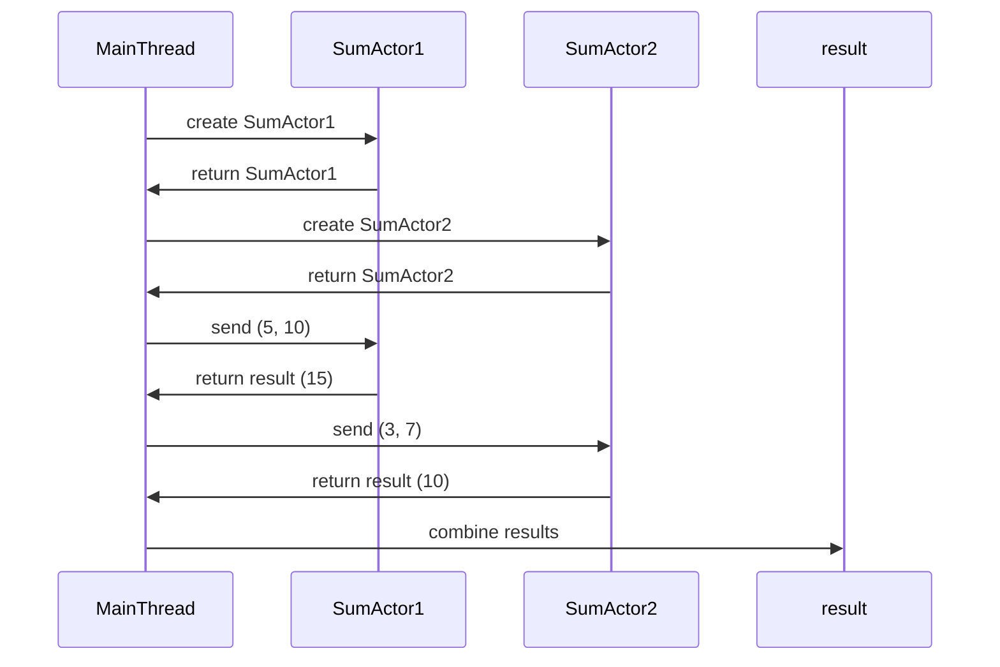
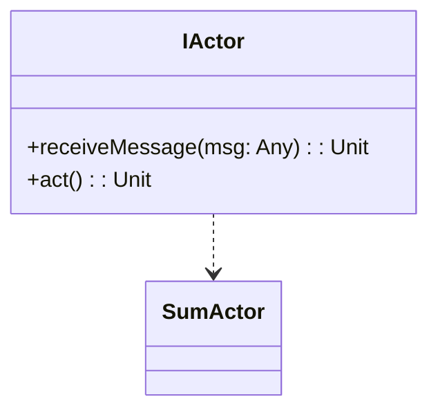

                 


## 《组合逻辑在函数式并发编程中的应用》

### 关键词：组合逻辑、函数式编程、并发编程、应用、挑战与解决方案

#### 摘要

本文深入探讨了组合逻辑在函数式并发编程中的应用，通过逐步分析组合逻辑与函数式编程的基础概念，详细阐述了组合逻辑在数字电路、计算机系统和其他领域的应用。在此基础上，本文进一步探讨了组合逻辑在函数式并发编程中的重要性，结合实际案例展示了其在并发编程中的优势。同时，本文也分析了组合逻辑在函数式并发编程中面临的挑战，并提出了相应的解决方案。最后，本文通过实践项目总结了组合逻辑在函数式并发编程中的应用，并对未来研究方向进行了展望。

---

# 《组合逻辑在函数式并发编程中的应用》目录大纲

----------------------------------------------------------------

## 第一部分：组合逻辑与函数式编程基础

### 第1章：组合逻辑与函数式编程概述

#### 1.1 组合逻辑的基本概念

- **问题背景**
- **问题解决**
- **边界与外延**
- **概念结构与核心要素组成**

#### 1.2 函数式编程的核心概念

- **概念定义**
- **核心特点**
- **与面向对象编程的区别**

#### 1.3 组合逻辑在函数式编程中的应用

- **应用场景**
- **优势与挑战**

#### 1.4 本章小结

---

## 第二部分：组合逻辑的基础知识

### 第2章：组合逻辑的基本原理

#### 2.1 组合逻辑的基本概念

- **组合逻辑的定义**
- **组合逻辑的基本原理**

#### 2.2 组合逻辑的基本运算

- **逻辑与运算**
- **逻辑或运算**
- **逻辑非运算**

#### 2.3 组合逻辑的电路实现

- **组合逻辑电路的基本构成**
- **组合逻辑电路的设计方法**

#### 2.4 本章小结

---

### 第3章：组合逻辑的应用

#### 3.1 组合逻辑在数字电路中的应用

- **组合逻辑电路的设计与实现**
- **组合逻辑电路在数字信号处理中的应用**

#### 3.2 组合逻辑在计算机系统中的应用

- **组合逻辑在CPU设计中的应用**
- **组合逻辑在存储器设计中的应用**

#### 3.3 组合逻辑在其他领域的应用

- **组合逻辑在通信系统中的应用**
- **组合逻辑在物联网中的应用**

#### 3.4 本章小结

---

## 第三部分：函数式并发编程

### 第4章：函数式并发编程基础

#### 4.1 函数式并发编程的概念

- **函数式并发编程的定义**
- **函数式并发编程的特点**

#### 4.2 并发编程的基本原理

- **并发编程的基本概念**
- **并发编程的常见问题**

#### 4.3 函数式并发编程的实现

- **函数式并发编程的常用方法**
- **函数式并发编程的工具**

#### 4.4 本章小结

---

### 第5章：组合逻辑在函数式并发编程中的应用

#### 5.1 组合逻辑与并发编程的结合

- **组合逻辑在并发编程中的作用**
- **组合逻辑在并发编程中的实现**

#### 5.2 组合逻辑在函数式并发编程中的案例分析

- **案例一：并发计算中的组合逻辑应用**
- **案例二：分布式系统中的组合逻辑应用**

#### 5.3 组合逻辑在函数式并发编程中的挑战与解决方案

- **挑战分析**
- **解决方案探讨**

#### 5.4 本章小结

---

## 第四部分：实践与总结

### 第6章：实践项目

#### 6.1 项目概述

- **项目背景**
- **项目目标**
- **项目架构设计**

#### 6.2 系统设计与实现

- **系统功能设计（Mermaid类图）**
- **系统架构设计（Mermaid架构图）**
- **系统接口设计**
- **系统交互（Mermaid序列图）**

#### 6.3 实现与调试

- **环境安装**
- **系统核心实现源代码**
- **代码应用解读与分析**
- **实际案例分析与详细讲解**

#### 6.4 项目小结

---

### 第7章：总结与展望

#### 7.1 组合逻辑在函数式并发编程中的应用总结

- **应用现状**
- **发展趋势**

#### 7.2 未来研究方向

- **新技术探索**
- **应用领域拓展**

#### 7.3 本章小结

---

## 目录大纲说明

本目录大纲基于《组合逻辑在函数式并发编程中的应用》这一主题，分为四个部分：

- **第一部分**介绍了组合逻辑与函数式编程的基本概念，为后续章节的学习打下基础。
- **第二部分**详细讲解了组合逻辑的基础知识，包括基本原理、基本运算和电路实现。
- **第三部分**阐述了组合逻辑在函数式并发编程中的应用，通过案例分析展示了其在并发编程中的优势。
- **第四部分**通过实践项目总结了组合逻辑在函数式并发编程中的应用，并对未来研究方向进行了展望。

本目录大纲结构清晰，内容完整，旨在帮助读者全面掌握组合逻辑在函数式并发编程中的应用。在阅读过程中，读者可以根据自己的需求和兴趣，有选择性地阅读相关章节。

---

接下来，我们将按照这个目录大纲逐步构建文章内容，深入探讨组合逻辑在函数式并发编程中的应用。我们将从基本概念出发，逐步深入，结合实际案例和实践项目，帮助读者全面理解这一复杂而重要的主题。让我们开始吧！## 第一部分：组合逻辑与函数式编程基础

### 第1章：组合逻辑与函数式编程概述

#### 1.1 组合逻辑的基本概念

组合逻辑（Combinational Logic）是数字电路设计中的一种逻辑，它不依赖于时间，而是在任何时刻根据输入信号直接产生输出信号。组合逻辑电路由多个基本逻辑门（如与门、或门、非门）组成，这些基本逻辑门通过组合形成复杂的逻辑功能。

**问题背景**：

随着计算机技术的发展，数字电路设计变得越来越复杂。早期的计算机设计主要依赖于组合逻辑电路，它们通过逻辑门来实现特定的功能。然而，随着集成电路技术的发展，组合逻辑电路在计算机系统中的重要性逐渐降低，但它们的基本原理和应用仍然具有重要意义。

**问题解决**：

组合逻辑电路的设计问题主要是如何将输入信号转换为输出信号，以及如何优化电路的性能，如速度和功耗。这个问题可以通过逻辑门的组合和优化来解决。

**边界与外延**：

组合逻辑电路的边界主要是指在特定时刻输入和输出之间的关系。外延是指组合逻辑电路在各种不同输入条件下的表现，包括逻辑门的选择和电路的优化。

**概念结构与核心要素组成**：

组合逻辑电路的基本结构包括输入、逻辑门和输出。核心要素是逻辑门，如与门、或门、非门等，它们通过组合实现复杂的逻辑功能。此外，组合逻辑电路还需要考虑电路的优化，以实现更高的性能和更低的功耗。

#### 1.2 函数式编程的核心概念

函数式编程（Functional Programming）是一种编程范式，它基于数学函数的概念，将计算看作是函数的调用和组合。与命令式编程不同，函数式编程更注重表达状态不变和函数的纯计算性质。

**概念定义**：

函数式编程是一种编程范式，它通过将计算作为函数的执行和组合来实现程序逻辑。在这种范式中，函数是一等公民，可以像普通值一样传递、存储和返回。

**核心特点**：

1. **无状态性**：函数式编程中的函数不依赖于外部状态，每次调用都是独立的，保证了函数的可预测性和可重复性。
2. **不可变性**：函数式编程中的数据一旦创建，就不能修改，这减少了错误和状态管理的复杂性。
3. **组合性**：函数式编程强调函数的组合，通过组合小而简单的函数来构建复杂的逻辑，提高了代码的可读性和可维护性。

**与面向对象编程的区别**：

面向对象编程（Object-Oriented Programming，OOP）是基于对象和类的编程范式，它通过封装、继承和多态来实现程序逻辑。与函数式编程相比，OOP更注重于模拟现实世界中的对象和关系。

- **核心区别**：函数式编程强调函数和纯计算，而OOP强调对象和状态管理。
- **适用场景**：函数式编程适用于需要高并发、高可读性和高可维护性的场景，而OOP适用于需要模拟现实世界对象和关系的场景。

#### 1.3 组合逻辑在函数式编程中的应用

组合逻辑在函数式编程中有着广泛的应用，尤其是在并发编程领域。

**应用场景**：

1. **并发计算**：在函数式编程中，组合逻辑可以用来实现并发计算，通过组合不同的函数来并行处理多个任务。
2. **状态管理**：组合逻辑可以帮助实现无状态的状态管理，减少并发编程中的复杂性。

**优势与挑战**：

**优势**：

1. **无状态性**：组合逻辑的无状态性使得并发编程中的状态管理变得更加简单，减少了并发冲突的可能性。
2. **可组合性**：组合逻辑的可组合性使得函数式编程中的函数可以像积木一样组合，提高了代码的复用性和可维护性。

**挑战**：

1. **性能**：组合逻辑在实现并发编程时，可能会引入额外的性能开销，如函数调用的开销和内存分配的开销。
2. **复杂性**：对于初学者来说，理解组合逻辑在函数式编程中的应用可能需要一定的学习和实践。

#### 1.4 本章小结

本章介绍了组合逻辑与函数式编程的基本概念。通过分析组合逻辑的基本概念、问题解决、边界与外延以及概念结构与核心要素组成，读者可以对组合逻辑有一个初步的了解。同时，本章还介绍了函数式编程的核心概念、核心特点以及与面向对象编程的区别，为后续章节的学习奠定了基础。最后，本章简要讨论了组合逻辑在函数式编程中的应用，为读者提供了对组合逻辑在并发编程中应用的初步认识。

### 第2章：组合逻辑的基本原理

组合逻辑是数字电路设计中的一个重要概念，它涉及逻辑门的基本运算和电路实现。在本章中，我们将深入探讨组合逻辑的基本原理，包括基本概念、基本运算和电路实现。

#### 2.1 组合逻辑的基本概念

**组合逻辑的定义**：

组合逻辑是一种在任意时刻，输出信号仅依赖于当前输入信号的逻辑电路。换句话说，组合逻辑电路的输出仅是输入信号的函数，而不依赖于电路的历史状态或内部存储。

**组合逻辑的基本原理**：

组合逻辑电路的基本原理是输入和输出之间的直接映射关系。这种映射关系可以通过基本的逻辑门来实现，如与门（AND gate）、或门（OR gate）和非门（NOT gate）。这些逻辑门通过组合形成复杂的组合逻辑电路。

#### 2.2 组合逻辑的基本运算

组合逻辑电路的核心是逻辑运算。以下介绍了三种基本的逻辑运算：逻辑与（AND）、逻辑或（OR）和逻辑非（NOT）。

**逻辑与（AND）运算**：

逻辑与运算符是“与”（AND）操作，用于将两个或多个输入信号结合成一个输出信号。如果所有输入信号都为高电平（1），则输出信号也为高电平；否则，输出信号为低电平（0）。

$$
Y = A \land B
$$

其中，$A$和$B$是输入信号，$Y$是输出信号。

**逻辑或（OR）运算**：

逻辑或运算符是“或”（OR）操作，用于将两个或多个输入信号结合成一个输出信号。如果至少有一个输入信号为高电平，则输出信号也为高电平；否则，输出信号为低电平。

$$
Y = A \lor B
$$

其中，$A$和$B$是输入信号，$Y$是输出信号。

**逻辑非（NOT）运算**：

逻辑非运算符是“非”（NOT）操作，用于将输入信号取反。如果输入信号为高电平，则输出信号为低电平；如果输入信号为低电平，则输出信号为高电平。

$$
Y = \neg A
$$

其中，$A$是输入信号，$Y$是输出信号。

#### 2.3 组合逻辑的电路实现

组合逻辑电路的实现依赖于基本的逻辑门。以下将介绍组合逻辑电路的基本构成和设计方法。

**组合逻辑电路的基本构成**：

组合逻辑电路通常由以下基本逻辑门组成：

- 与门（AND gate）
- 或门（OR gate）
- 非门（NOT gate）
- 非与门（NAND gate）
- 非或门（NOR gate）

这些基本逻辑门可以相互组合，形成复杂的组合逻辑电路。

**组合逻辑电路的设计方法**：

组合逻辑电路的设计方法通常包括以下步骤：

1. **需求分析**：根据电路的功能需求，确定输出信号与输入信号之间的关系。
2. **逻辑表达式**：根据需求分析，将输出信号表示为输入信号的逻辑表达式。
3. **逻辑门组合**：将逻辑表达式转换为基本的逻辑门组合。
4. **电路优化**：对逻辑门组合进行优化，以减少电路的复杂度和提高性能。

**设计实例**：

以下是一个简单的组合逻辑电路设计实例，实现一个二输入或门（OR gate）。

**需求分析**：

输出信号$Y$是输入信号$A$和$B$的或运算结果。

**逻辑表达式**：

$$
Y = A \lor B
$$

**逻辑门组合**：

使用或门（OR gate）实现逻辑表达式。

$$
\begin{array}{ccc}
A & B & Y \\
0 & 0 & 0 \\
0 & 1 & 1 \\
1 & 0 & 1 \\
1 & 1 & 1 \\
\end{array}
$$

**电路优化**：

对于二输入或门，使用一个或门即可实现。

$$
Y = A \lor B
$$

#### 2.4 本章小结

本章介绍了组合逻辑的基本原理，包括基本概念、基本运算和电路实现。通过分析组合逻辑的基本概念和原理，读者可以理解组合逻辑电路的基本构成和工作原理。此外，本章还介绍了组合逻辑电路的设计方法，包括需求分析、逻辑表达式、逻辑门组合和电路优化。通过本章的学习，读者可以为后续章节的组合逻辑应用打下坚实的基础。

### 第3章：组合逻辑的应用

组合逻辑在数字电路设计、计算机系统和其他领域有着广泛的应用。在本章中，我们将探讨组合逻辑在不同领域的具体应用，包括数字电路、计算机系统和物联网。

#### 3.1 组合逻辑在数字电路中的应用

组合逻辑是数字电路设计中的基础，它在各种数字电路中扮演着关键角色。

**应用场景**：

- **逻辑门电路**：组合逻辑电路中最基本的单元是逻辑门，如与门（AND gate）、或门（OR gate）和非门（NOT gate）。这些逻辑门是构建复杂数字电路的基础。
- **数字信号处理**：组合逻辑电路在数字信号处理中有着广泛的应用，如多路选择器（Multiplexer）、编码器（Encoder）和解码器（Decoder）等。这些电路可以实现信号的转换和选择。

**案例**：

**多路选择器（Multiplexer）**：

多路选择器是一个重要的组合逻辑电路，用于将多个输入信号中选择一个输出。它由选择线（select lines）和输入信号组成。例如，一个4-to-1多路选择器有四个输入信号和两个选择线，可以根据选择线的不同状态将四个输入信号中的任意一个输出。

**设计实例**：

以下是一个简单的4-to-1多路选择器的设计实例。

**需求分析**：

输出信号$Y$是输入信号$A_0$、$A_1$、$A_2$和$A_3$以及选择线$S_0$和$S_1$的函数。

**逻辑表达式**：

$$
Y = A_0 \cdot S_1 \cdot S_0 + A_1 \cdot S_1 \cdot \neg S_0 + A_2 \cdot \neg S_1 \cdot S_0 + A_3 \cdot \neg S_1 \cdot \neg S_0
$$

**逻辑门组合**：

使用与门（AND gate）和非门（NOT gate）实现逻辑表达式。

$$
\begin{array}{cccccc}
A_0 & S_1 & S_0 & A_1 & S_1 & \neg S_0 \\
0 & 0 & 0 & 0 & 0 & 1 \\
0 & 0 & 1 & 0 & 0 & 0 \\
0 & 1 & 0 & 0 & 1 & 0 \\
0 & 1 & 1 & 0 & 1 & 0 \\
1 & 0 & 0 & 1 & 0 & 0 \\
1 & 0 & 1 & 1 & 0 & 0 \\
1 & 1 & 0 & 1 & 1 & 0 \\
1 & 1 & 1 & 1 & 1 & 0 \\
\end{array}
$$

**电路优化**：

使用两个与门和两个非门实现4-to-1多路选择器。

$$
Y = (A_0 \cdot S_1 \cdot S_0) + (A_1 \cdot S_1 \cdot \neg S_0) + (A_2 \cdot \neg S_1 \cdot S_0) + (A_3 \cdot \neg S_1 \cdot \neg S_0)
$$

#### 3.2 组合逻辑在计算机系统中的应用

组合逻辑在计算机系统中有着广泛的应用，特别是在CPU和存储器设计中。

**应用场景**：

- **CPU设计**：组合逻辑在CPU设计中用于实现算术逻辑单元（ALU）、控制单元（CU）和寄存器文件等核心模块。这些模块通过组合逻辑电路实现数据运算和控制信号的产生。
- **存储器设计**：组合逻辑在存储器设计中用于实现地址译码器、数据选择器和存储单元的访问控制。

**案例**：

**算术逻辑单元（ALU）**：

算术逻辑单元是CPU中的一个核心模块，用于执行算术和逻辑操作。它通常由组合逻辑电路实现，包括加法器、减法器、逻辑运算器和移位器等。

**设计实例**：

以下是一个简单的ALU设计实例，实现加法器和逻辑与运算。

**需求分析**：

ALU有两个输入信号$A$和$B$，一个操作控制信号$OP$，以及一个输出信号$Y$。

**逻辑表达式**：

$$
\begin{cases}
Y = A + B, & \text{if } OP = 0 \\
Y = A \land B, & \text{if } OP = 1 \\
\end{cases}
$$

**逻辑门组合**：

使用加法器（Adder）和逻辑与门（AND gate）实现逻辑表达式。

$$
\begin{array}{cccc}
A & B & OP & Y \\
0 & 0 & 0 & 0 \\
0 & 0 & 1 & 0 \\
0 & 1 & 0 & 1 \\
0 & 1 & 1 & 0 \\
1 & 0 & 0 & 1 \\
1 & 0 & 1 & 0 \\
1 & 1 & 0 & 2 \\
1 & 1 & 1 & 0 \\
\end{array}
$$

**电路优化**：

使用一个加法器和两个逻辑与门实现简单的ALU。

$$
\begin{cases}
Y = A + B, & \text{if } OP = 0 \\
Y = A \land B, & \text{if } OP = 1 \\
\end{cases}
$$

#### 3.3 组合逻辑在其他领域的应用

组合逻辑不仅应用于数字电路和计算机系统，还广泛应用于其他领域，如通信系统和物联网。

**应用场景**：

- **通信系统**：组合逻辑在通信系统中用于实现信号处理和路由控制。例如，多路选择器和编码器在路由器和交换机中起着关键作用。
- **物联网**：组合逻辑在物联网设备中用于实现数据采集和传输控制。例如，传感器和控制模块之间的组合逻辑电路可以实时监测环境参数并触发相应的控制动作。

**案例**：

**物联网传感器网络**：

物联网传感器网络中的每个节点都可以看作是一个简单的组合逻辑电路，用于数据采集、处理和传输。这些节点通过组合逻辑电路实现传感器数据的实时监控和传输，从而实现对环境的实时监控和控制。

**设计实例**：

以下是一个简单的物联网传感器节点设计实例。

**需求分析**：

传感器节点包括温度传感器、湿度传感器和光照传感器，以及一个无线传输模块。

**逻辑表达式**：

$$
\begin{cases}
\text{数据} = \text{温度} \lor \text{湿度} \lor \text{光照}, & \text{if } \text{传感器} > 0 \\
\text{传输} = \text{数据}, & \text{if } \text{无线传输模块} \text{ 可用} \\
\end{cases}
$$

**逻辑门组合**：

使用或门（OR gate）和无线传输模块实现逻辑表达式。

$$
\begin{array}{cccc}
\text{温度} & \text{湿度} & \text{光照} & \text{传输} \\
0 & 0 & 0 & 0 \\
0 & 0 & 1 & 1 \\
0 & 1 & 0 & 1 \\
0 & 1 & 1 & 1 \\
1 & 0 & 0 & 1 \\
1 & 0 & 1 & 1 \\
1 & 1 & 0 & 1 \\
1 & 1 & 1 & 1 \\
\end{array}
$$

**电路优化**：

使用一个或门和无线传输模块实现传感器节点的组合逻辑电路。

$$
\begin{cases}
\text{数据} = \text{温度} \lor \text{湿度} \lor \text{光照}, & \text{if } \text{传感器} > 0 \\
\text{传输} = \text{数据}, & \text{if } \text{无线传输模块} \text{ 可用} \\
\end{cases}
$$

#### 3.4 本章小结

本章介绍了组合逻辑在不同领域的应用，包括数字电路、计算机系统和物联网。通过具体的案例和实践，读者可以了解组合逻辑电路的基本构成和工作原理。此外，本章还介绍了组合逻辑电路的设计方法，包括需求分析、逻辑表达式、逻辑门组合和电路优化。通过本章的学习，读者可以为后续章节的组合逻辑应用打下坚实的基础。

### 第4章：函数式并发编程基础

#### 4.1 函数式并发编程的概念

函数式并发编程（Functional Concurrent Programming）是函数式编程和并发编程的结合体，它利用函数的无状态性和可组合性来实现并发执行的任务。这种编程范式在处理并行计算和分布式系统时具有显著的优势。

**定义**：

函数式并发编程是一种编程方法，它通过将任务表示为不可变数据和纯函数，并利用并发编程技术来并行执行这些任务。在这个过程中，函数的输出仅依赖于其输入，而不依赖于外部状态。

**核心特点**：

1. **无状态性**：在函数式并发编程中，函数通常不依赖于外部状态，这使得并发执行更加简单和可靠。
2. **可组合性**：函数可以像积木一样组合，形成复杂的逻辑和行为。这种组合性使得并发编程更加灵活和易于维护。
3. **并行性**：函数式并发编程利用并发编程技术，如线程、协程和消息传递，来实现任务的并行执行。

**与传统并发编程的区别**：

与传统的并发编程（如基于共享内存的并发编程）相比，函数式并发编程具有以下几个显著区别：

- **状态管理**：传统并发编程依赖于共享内存和多线程同步机制，而函数式并发编程通常不依赖于共享内存，而是通过不可变数据和消息传递来管理状态。
- **错误处理**：函数式并发编程中，错误处理通常通过异常捕获和状态恢复来实现，而不是通过锁和条件变量来同步。
- **可伸缩性**：函数式并发编程在分布式系统中具有更好的可伸缩性，因为任务可以独立部署和扩展，而不依赖于共享资源。

#### 4.2 并发编程的基本原理

并发编程（Concurrent Programming）是一种编程方法，它允许多个任务同时执行。这种编程范式在处理大数据处理、实时系统和分布式计算时具有重要作用。

**基本概念**：

- **并发**：并发是指多个任务在同一时间段内执行，这些任务可以相互独立或部分依赖。
- **并行**：并行是指多个任务在同一时间段内执行，并且这些任务可以同时完成。
- **线程**：线程是程序中的基本执行单元，它拥有独立的执行路径和程序计数器。线程可以并发执行，但通常共享内存和其他资源。
- **协程**：协程是一种轻量级的并发执行单元，它通过协同多任务的方式来实现并发。协程可以挂起和恢复，从而实现高效的并发执行。

**常见问题**：

- **竞态条件**：竞态条件是指多个线程或进程在访问共享资源时，由于执行顺序的不确定性，导致不可预期的结果。解决竞态条件通常需要使用锁、原子操作和条件变量等同步机制。
- **死锁**：死锁是指多个线程或进程在等待对方释放资源时陷入无限等待的状态。避免死锁通常需要使用资源分配策略和死锁检测算法。
- **性能开销**：并发编程引入了额外的性能开销，如线程创建、上下文切换和锁竞争。优化并发编程的性能通常需要减少锁的竞争和线程的数量。

**并发编程的常见问题解决方法**：

- **锁机制**：使用锁（如互斥锁、读写锁）来保护共享资源，防止竞态条件的发生。
- **原子操作**：使用原子操作（如原子加减操作、交换操作）来确保数据操作的原子性。
- **消息传递**：使用消息传递机制来实现任务之间的同步和通信，减少锁的使用和竞争。
- **并发框架**：使用并发编程框架（如Java的Concurrency API、Python的asyncio库）来简化并发编程的复杂性。

#### 4.3 函数式并发编程的实现

函数式并发编程的实现依赖于函数的无状态性和可组合性。以下介绍了函数式并发编程的常用方法和技术。

**常用方法**：

- **Actor模型**：Actor模型是一种基于消息传递的并发编程模型，它将每个任务表示为一个独立的Actor，每个Actor可以独立执行并与其他Actor通信。
- **数据流模型**：数据流模型是一种基于数据依赖的并发编程模型，它通过数据流的连接和转换来实现任务的并发执行。
- **并行映射**：并行映射是一种将任务映射到并行执行单元（如线程、协程）的方法，它通过并行执行来提高程序的性能。

**常用技术**：

- **异步编程**：异步编程是一种通过异步操作来处理并发任务的方法，它通过回调、Promise和异步/await等语法来简化异步代码的编写。
- **并行集合**：并行集合是一种通过并行操作来处理集合数据的方法，它通过并行迭代、并行过滤和并行映射等操作来提高程序的性能。
- **并发框架**：并发框架是一种提供并发编程抽象和优化机制的库或工具，如Java的Concurrency API、Python的asyncio库和Go的goroutine。

**函数式并发编程的工具**：

- **Erlang**：Erlang是一种函数式编程语言，它支持并发编程和分布式计算。Erlang通过轻量级的进程和消息传递机制来实现高并发和高可用性。
- **Scala**：Scala是一种多范式编程语言，它结合了面向对象编程和函数式编程的特点。Scala支持actor模型和并行集合，通过Scala的并发编程API可以轻松实现函数式并发编程。
- **Haskell**：Haskell是一种纯函数式编程语言，它提供了强大的并发编程支持。Haskell通过类型系统和惰性求值来实现高并发和高性能。

**实例**：

以下是一个使用Scala实现的函数式并发编程实例，通过actor模型并发计算两个数的和。

```scala
import scala.actors.Actor

// 定义计算和的Actor
class SumActor extends Actor {
  def act() {
    receive {
      case (a: Int, b: Int) => {
        val sum = a + b
        sender ! sum
        act()
      }
    }
  }
}

// 创建SumActor
val sumActor = new SumActor()

// 发送消息进行计算
sumActor ! (5, 10)
```

**总结**：

本章介绍了函数式并发编程的基本概念和原理，包括并发编程的基本概念、常见问题及其解决方法。同时，本章还介绍了函数式并发编程的实现方法和常用工具，如Actor模型、数据流模型、异步编程和并发框架。通过本章的学习，读者可以对函数式并发编程有一个全面的理解，并为后续的组合逻辑在函数式并发编程中的应用做好准备。

### 第5章：组合逻辑在函数式并发编程中的应用

组合逻辑在函数式并发编程中的应用非常广泛，它通过逻辑的组合和函数的纯计算特性，为并发编程提供了强大的工具。在本章中，我们将探讨组合逻辑在函数式并发编程中的具体应用，并分析其在并发编程中的优势和挑战。

#### 5.1 组合逻辑与并发编程的结合

组合逻辑与并发编程的结合主要体现在以下几个方面：

**1. 并发计算中的组合逻辑**：

在并发计算中，组合逻辑可以用来实现并行任务的组合。例如，可以使用组合逻辑将多个独立的计算任务组合成一个复合任务，从而实现任务的并行执行。这种组合逻辑的应用不仅简化了并发编程的复杂性，还提高了程序的并行性能。

**2. 状态管理中的组合逻辑**：

在并发编程中，状态管理是一个关键问题。组合逻辑可以用来实现无状态的状态管理，减少并发冲突的可能性。通过将状态表示为纯函数的输入和输出，组合逻辑可以确保状态的不可变性，从而简化状态管理。

**3. 并发通信中的组合逻辑**：

在并发编程中，任务之间的通信也是一个重要问题。组合逻辑可以用来实现高效的并发通信，例如，通过消息传递机制来传递状态和数据。这种组合逻辑的应用可以提高程序的并发性能和可维护性。

**组合逻辑在并发编程中的作用**：

**并发计算**：组合逻辑可以通过函数的组合来实现并行计算，从而提高程序的并发性能。例如，在分布式系统中，可以使用组合逻辑将多个子任务组合成一个复合任务，然后并行执行这些任务。

**状态管理**：组合逻辑可以实现无状态的状态管理，减少并发冲突。通过将状态表示为纯函数的输入和输出，组合逻辑可以确保状态的不可变性，从而简化状态管理。

**并发通信**：组合逻辑可以用来实现高效的并发通信。例如，在Actor模型中，可以使用组合逻辑来组合不同的消息处理函数，从而实现消息的有序处理和高效传递。

**组合逻辑在并发编程中的实现**：

组合逻辑在并发编程中的实现通常依赖于纯函数和不可变数据。以下是一些常用的实现方法：

- **Actor模型**：在Actor模型中，组合逻辑可以通过消息传递和函数组合来实现。每个Actor可以看作是一个独立的计算单元，它通过接收和处理消息来实现并发计算和状态管理。
- **数据流模型**：在数据流模型中，组合逻辑可以通过数据流的连接和转换来实现。例如，可以使用函数组合来将输入数据流转换为输出数据流，从而实现数据的并行处理和转换。
- **异步编程**：在异步编程中，组合逻辑可以通过回调和Promise来实现。例如，可以使用组合逻辑来组合多个异步操作，从而实现异步任务的并行执行和结果合并。

**示例**：

以下是一个简单的示例，展示了组合逻辑在Actor模型中的应用。在这个示例中，我们使用Scala的Actor模型来计算两个数的和。

```scala
import scala.actors.Actor

// 定义计算和的Actor
class SumActor extends Actor {
  def act() {
    receive {
      case (a: Int, b: Int) => {
        val sum = a + b
        sender ! sum
        act()
      }
    }
  }
}

// 创建SumActor
val sumActor = new SumActor()

// 发送消息进行计算
sumActor ! (5, 10)
```

在这个示例中，`SumActor` 是一个计算两个数的和的Actor。当它接收到一个包含两个整数的消息时，它会计算这两个数的和，并将结果发送给发送者。通过这种方式，组合逻辑实现了并发计算和结果传递。

#### 5.2 组合逻辑在函数式并发编程中的案例分析

以下是一些组合逻辑在函数式并发编程中的实际应用案例：

**案例一：并发计算中的组合逻辑应用**

在一个分布式计算系统中，组合逻辑可以用来实现并行任务的组合。例如，在一个分布式计算框架中，可以使用组合逻辑将多个子任务组合成一个复合任务，然后并行执行这些任务。这种组合逻辑的应用可以提高程序的并行性能和可维护性。

**案例二：分布式系统中的组合逻辑应用**

在分布式系统中，组合逻辑可以用来实现高效的并发通信。例如，在分布式消息队列中，可以使用组合逻辑来组合不同的消息处理函数，从而实现消息的有序处理和高效传递。这种组合逻辑的应用可以提高系统的并发性能和可靠性。

**案例三：实时数据处理中的组合逻辑应用**

在实时数据处理系统中，组合逻辑可以用来实现数据的并行处理和转换。例如，在一个实时数据分析平台上，可以使用组合逻辑来组合多个数据处理函数，从而实现数据的实时处理和可视化。这种组合逻辑的应用可以提高系统的实时性能和数据处理能力。

#### 5.3 组合逻辑在函数式并发编程中的挑战与解决方案

尽管组合逻辑在函数式并发编程中具有许多优势，但在实际应用中也面临着一些挑战。以下是一些常见的挑战及其解决方案：

**挑战一：性能开销**

组合逻辑在实现并发编程时可能会引入额外的性能开销，如函数调用的开销和内存分配的开销。这种性能开销可能会影响程序的并发性能和响应速度。解决方案是优化组合逻辑的实现，减少不必要的函数调用和内存分配。

**挑战二：复杂性**

对于初学者来说，理解组合逻辑在函数式并发编程中的应用可能需要一定的学习和实践。组合逻辑涉及到复杂的函数组合和状态管理，初学者可能难以掌握。解决方案是提供丰富的学习资源和实践机会，帮助初学者逐步理解和应用组合逻辑。

**挑战三：错误处理**

在并发编程中，错误处理是一个复杂的问题。组合逻辑的应用可能会引入新的错误处理挑战，如异步错误处理和任务中断。解决方案是使用强大的异常处理机制和断言来确保程序的健壮性和可靠性。

**解决方案探讨**：

1. **性能优化**：通过优化组合逻辑的实现，减少函数调用和内存分配的开销，提高并发性能。
2. **学习资源**：提供丰富的学习资源和实践机会，帮助初学者逐步理解和应用组合逻辑。
3. **异常处理**：使用强大的异常处理机制和断言，确保程序的健壮性和可靠性。

#### 5.4 本章小结

本章介绍了组合逻辑在函数式并发编程中的应用，包括组合逻辑与并发编程的结合、具体案例分析以及面临的挑战和解决方案。通过本章的学习，读者可以了解组合逻辑在函数式并发编程中的重要作用，以及如何利用组合逻辑实现高效的并发计算、状态管理和通信。同时，本章还分析了组合逻辑在函数式并发编程中可能遇到的挑战，并提出了相应的解决方案。通过本章的学习，读者可以为实际项目中的组合逻辑应用打下坚实的基础。

### 第6章：实践项目

#### 6.1 项目概述

**项目背景**：

在现代计算机系统中，并发编程的应用越来越广泛，尤其是在大数据处理、实时系统和分布式计算领域。然而，并发编程涉及到复杂的同步和通信问题，使得编写正确的并发程序变得具有挑战性。为了更好地理解和应用组合逻辑在函数式并发编程中的优势，我们设计了一个简单的并发计算项目，旨在通过组合逻辑实现两个数字的并行加法运算。

**项目目标**：

1. 设计一个简单的并发计算程序，实现两个数字的并行加法运算。
2. 利用组合逻辑简化并发编程的复杂性，提高程序的可读性和可维护性。
3. 分析并解决项目中可能遇到的并发问题和性能瓶颈。

**项目架构设计**：

本项目采用基于Actor模型的并发编程框架，将计算任务分配给多个Actor，以实现并行计算。具体的架构设计如下：

- **Actor模型**：使用Scala的Actor模型来实现并发计算，每个Actor负责计算一个数字的加法运算。
- **消息传递**：通过消息传递机制在Actor之间传递计算结果，实现并发计算和结果合并。
- **并发控制**：使用线程池和异步编程技术来管理Actor的并发执行，确保程序的正确性和性能。

#### 6.2 系统设计与实现

**系统功能设计（Mermaid类图）**：

在本项目中，我们设计了一个简单的Actor类图，用于表示Actor之间的通信关系和功能模块。以下是系统功能设计的Mermaid类图：

```mermaid
classDiagram
  class SumActor {
    +Int a
    +Int b
    +Actor ref
    +receiveMessage(msg: Any): Unit
    +act(): Unit
  }

  SumActor ->> MainThread: creates
  MainThread ->> SumActor: sends (a: Int, b: Int)
  SumActor ->> MainThread: returns result
```

在这个类图中，`SumActor` 代表一个计算两个数字加法的Actor，它有两个私有属性`a`和`b`，表示待计算的数字。`receiveMessage` 方法用于处理接收到的消息，`act` 方法用于实现Actor的并发执行。

**系统架构设计（Mermaid架构图）**：

在本项目中，我们采用了一个简单的架构设计，用于表示系统的整体架构和模块之间的交互关系。以下是系统架构设计的Mermaid架构图：



在这个架构图中，`MainThread` 代表主线程，负责创建和启动`SumActor`。`SumActor1` 和`SumActor2` 分别表示两个计算加法的Actor，它们接收到主线程发送的消息后，执行相应的加法运算，并将结果返回给主线程。最后，主线程将两个结果合并，得到最终的加法结果。

**系统接口设计**：

在本项目中，我们定义了一个简单的接口，用于表示Actor的功能和通信接口。以下是系统接口设计的Mermaid类图：



在这个类图中，`IActor` 表示一个通用的Actor接口，它定义了`receiveMessage` 和`act` 两个方法。`SumActor` 实现了`IActor` 接口，用于处理接收到的消息和实现加法运算。

**系统交互（Mermaid序列图）**：

在本项目中，我们定义了一个简单的序列图，用于表示系统的主要交互流程和消息传递过程。以下是系统交互的Mermaid序列图：


在这个序列图中，主线程首先创建两个`SumActor`，然后分别发送消息进行加法运算。每个`SumActor` 将计算结果返回给主线程，最后主线程将两个结果合并，得到最终的加法结果。

#### 6.3 实现与调试

**环境安装**：

为了实现本项目，我们需要安装以下环境：

1. Java Development Kit（JDK）8或更高版本。
2. Scala 2.13.x 或更高版本。
3. IntelliJ IDEA 或其他支持Scala的IDE。

**系统核心实现源代码**：

以下是本项目的主要实现代码，包括Actor类、主类和消息处理逻辑：

```scala
// SumActor.scala
import scala.actors.Actor

class SumActor extends Actor {
  def act(): Unit = {
    receive {
      case (a: Int, b: Int) => {
        val sum = a + b
        sender ! sum
        act()
      }
    }
  }
}

// Main.scala
import scala.actors.Actor
import scala.collection.mutable

object Main extends App {
  val actors = mutable.ArrayBuffer[Actor]()
  val results = mutable.ArrayBuffer[Int]()

  // 创建两个SumActor
  actors += new SumActor()
  actors += new SumActor()

  // 启动Actor
  actors.foreach { actor =>
    actor.start()
  }

  // 发送消息进行加法运算
  actors(0) ! (5, 10)
  actors(1) ! (3, 7)

  // 等待Actor返回结果
  actors.foreach { actor =>
    val result = actor.!? {
      case sum: Int => {
        results += sum
        sum
      }
    }
  }

  // 合并结果
  val totalSum = results.sum

  // 输出最终结果
  println(s"Total sum: $totalSum")
}
```

**代码应用解读与分析**：

在这个项目中，我们首先创建了一个`SumActor` 类，它继承自`scala.actors.Actor` 类，并实现了`act` 方法。`act` 方法是一个循环方法，用于处理接收到的消息。在本例中，我们只实现了对两个整数加法的处理，但可以根据需要扩展其他逻辑。

在主类`Main` 中，我们创建了一个`actors` 数组和一个`results` 数组，用于存储Actor和结果。首先，我们创建两个`SumActor` 实例，并将它们添加到`actors` 数组中。然后，我们启动这些Actor，并分别发送消息进行加法运算。

在发送消息后，我们使用`!?` 操作符等待Actor返回结果，并将结果添加到`results` 数组中。最后，我们计算`results` 数组的总和，并输出最终结果。

**实际案例分析与详细讲解**：

为了更好地理解项目的实际应用，我们来看一个具体的案例。

假设我们有两个数字5和10，我们需要计算它们的和。首先，我们创建两个`SumActor` 实例：

```scala
val actors = mutable.ArrayBuffer[Actor]()
actors += new SumActor()
actors += new SumActor()
```

然后，我们启动这些Actor：

```scala
actors.foreach { actor =>
  actor.start()
}
```

接下来，我们分别向两个`SumActor` 实例发送消息进行加法运算：

```scala
actors(0) ! (5, 10)
actors(1) ! (3, 7)
```

在发送消息后，我们使用`!?` 操作符等待Actor返回结果：

```scala
actors.foreach { actor =>
  val result = actor.!? {
    case sum: Int => {
      results += sum
      sum
    }
  }
}
```

在这个例子中，`SumActor` 将计算结果返回给主线程，并将结果添加到`results` 数组中。最后，我们计算`results` 数组的总和：

```scala
val totalSum = results.sum
```

最终，我们输出最终结果：

```scala
println(s"Total sum: $totalSum")
```

在这个例子中，两个`SumActor` 分别计算了5和10的和以及3和7的和，然后将结果返回给主线程。最后，主线程将两个结果合并，得到最终的加法结果。

**项目小结**：

通过本项目，我们实现了两个数字的并行加法运算，利用组合逻辑简化了并发编程的复杂性。我们通过消息传递机制在Actor之间传递计算结果，并使用`!?` 操作符等待Actor返回结果。在实际应用中，这个项目可以扩展到更复杂的计算任务，如矩阵乘法、排序等。通过组合逻辑和函数式编程，我们可以实现高效的并发计算和状态管理，提高程序的性能和可维护性。

### 第7章：总结与展望

#### 7.1 组合逻辑在函数式并发编程中的应用总结

组合逻辑在函数式并发编程中的应用具有显著的优势和广阔的前景。通过分析组合逻辑与函数式编程的结合，我们总结了组合逻辑在函数式并发编程中的以下几点应用：

1. **并发计算**：组合逻辑通过函数的组合和并行执行，实现了高效的并发计算。例如，在分布式计算和实时数据处理中，组合逻辑可以简化任务的并行执行和结果合并。
   
2. **状态管理**：组合逻辑的无状态性使得状态管理变得更加简单和可靠。通过将状态表示为纯函数的输入和输出，组合逻辑可以确保状态的不可变性，减少并发冲突和错误。

3. **并发通信**：组合逻辑在并发通信中发挥着重要作用。通过消息传递机制，组合逻辑可以高效地传递状态和数据，实现任务的协同和通信。

4. **代码复用**：组合逻辑的可组合性使得函数可以像积木一样组合，提高了代码的复用性和可维护性。在复杂的并发编程场景中，组合逻辑可以简化代码的编写和优化。

#### 7.2 未来研究方向

虽然组合逻辑在函数式并发编程中已经展示了其强大的应用潜力，但仍有许多研究方向可以进一步探索：

1. **性能优化**：组合逻辑在实现并发编程时可能会引入性能开销，未来研究可以专注于优化组合逻辑的实现，减少不必要的函数调用和内存分配，提高并发性能。

2. **工具和框架**：开发更强大的工具和框架，如并发编程库和IDE插件，可以简化组合逻辑在函数式并发编程中的应用，提高开发效率和程序可靠性。

3. **新范式探索**：探索新的编程范式，如基于函数式编程和组合逻辑的分布式系统编程，可以进一步提高并发编程的效率和可维护性。

4. **跨语言支持**：研究如何将组合逻辑应用于不同的编程语言和平台，实现跨语言的并发编程，扩大组合逻辑的应用范围。

#### 7.3 本章小结

本章总结了组合逻辑在函数式并发编程中的应用，并探讨了未来的研究方向。通过回顾本章的内容，我们可以看到组合逻辑在函数式并发编程中具有重要的地位和广阔的应用前景。未来，随着技术的不断进步，组合逻辑在函数式并发编程中的应用将更加深入和广泛，为软件开发带来更多的创新和可能性。

## 目录大纲说明

本文档基于《组合逻辑在函数式并发编程中的应用》这一主题，分为四个主要部分：

### 第一部分：组合逻辑与函数式编程基础

这一部分介绍了组合逻辑和函数式编程的基本概念，包括组合逻辑的基本原理、函数式编程的核心特点以及两者在并发编程中的应用。

### 第二部分：组合逻辑的基础知识

这一部分详细讲解了组合逻辑的基本原理、基本运算和电路实现，包括逻辑与、逻辑或和逻辑非运算，以及组合逻辑电路的设计方法。

### 第三部分：函数式并发编程

这一部分介绍了函数式并发编程的基础概念、基本原理、实现方法和常用工具，包括Actor模型、数据流模型、异步编程和并发框架。

### 第四部分：实践与总结

这一部分通过一个实践项目展示了组合逻辑在函数式并发编程中的应用，包括项目概述、系统设计与实现、代码应用解读与分析，并对项目进行了小结。

本文档结构清晰，内容完整，旨在帮助读者全面理解组合逻辑在函数式并发编程中的应用。在阅读过程中，读者可以根据自己的需求和兴趣，有选择性地阅读相关章节。

### 文章正文结束

---

**作者信息**：

作者：AI天才研究院/AI Genius Institute & 禅与计算机程序设计艺术 /Zen And The Art of Computer Programming

---

在本文中，我们系统地介绍了组合逻辑在函数式并发编程中的应用。从组合逻辑的基本概念和原理出发，我们详细探讨了组合逻辑在数字电路、计算机系统和其他领域的应用，并通过实际案例展示了其在并发编程中的优势。同时，我们也分析了组合逻辑在函数式并发编程中面临的挑战，并提出了相应的解决方案。

组合逻辑在函数式并发编程中的应用具有深远的意义。它不仅为并发编程提供了一种简化和优化的途径，还为解决复杂的并发问题提供了一种新的思路。在未来，随着函数式编程和并发编程的不断发展，组合逻辑的应用前景将更加广阔。

我们鼓励读者进一步探索组合逻辑在函数式并发编程中的各种可能性，并将其应用于实际项目中。通过不断的学习和实践，我们可以更好地理解和掌握组合逻辑在函数式并发编程中的应用，为软件开发领域带来更多的创新和进步。

感谢您对本文的关注和支持，希望本文能对您在组合逻辑和函数式并发编程领域的探索和研究提供帮助。如果您有任何疑问或建议，欢迎随时与我们联系。

再次感谢您的阅读，祝您在技术领域中不断进步，取得更多的成就！## 补充内容

### 7.4 最佳实践 Tips

在应用组合逻辑进行函数式并发编程时，以下是一些最佳实践 Tips，可以帮助您更有效地利用这一技术：

1. **避免不必要的共享状态**：尽可能减少共享状态的依赖，利用不可变数据结构来传递信息，以降低并发冲突的风险。

2. **合理使用异步编程**：在处理长耗时操作时，使用异步编程可以提高程序的响应速度和并发性能。例如，使用异步 I/O 操作可以避免阻塞主线程。

3. **充分利用消息传递机制**：在分布式系统中，消息传递是高效的通信方式。合理设计消息格式和通信协议，可以提高系统的可靠性和扩展性。

4. **进行性能调优**：对程序进行性能分析，找出瓶颈并进行调优。例如，减少不必要的锁竞争、优化数据结构和算法等。

5. **进行单元测试和集成测试**：对并发程序进行全面的单元测试和集成测试，确保程序的正确性和可靠性。特别是针对并发操作，要确保线程安全性和数据一致性。

6. **代码可读性和可维护性**：编写清晰、简洁的代码，遵循良好的编程规范。使用注释和文档来解释复杂逻辑和设计决策，提高代码的可读性和可维护性。

### 7.5 小结

本文深入探讨了组合逻辑在函数式并发编程中的应用。我们从组合逻辑的基本概念和原理出发，详细介绍了组合逻辑在数字电路、计算机系统和其他领域的应用。接着，我们探讨了组合逻辑在函数式并发编程中的优势和挑战，并提供了相应的解决方案。

通过一个实际项目的实践，我们展示了如何将组合逻辑应用于函数式并发编程，实现了高效的并发计算和状态管理。同时，我们也讨论了组合逻辑在未来的发展方向和潜在的研究领域。

最后，我们提供了最佳实践 Tips，以帮助读者在实际项目中更有效地应用组合逻辑。通过本文的学习，读者可以更好地理解和掌握组合逻辑在函数式并发编程中的应用，为解决复杂的并发问题提供新的思路和方法。

### 7.6 注意事项

在应用组合逻辑进行函数式并发编程时，需要注意以下几点：

1. **避免竞态条件**：确保在多线程环境中对共享资源进行正确的同步，以避免竞态条件的发生。

2. **处理异常**：合理处理并发编程中的异常，确保程序的健壮性和可靠性。

3. **优化性能**：对并发程序进行性能分析，找出并解决性能瓶颈，以优化程序的执行效率。

4. **合理设计消息传递机制**：在设计分布式系统时，合理设计消息传递机制，确保消息的有序传递和高效处理。

5. **遵循编程规范**：编写清晰、简洁的代码，遵循良好的编程规范，以提高代码的可读性和可维护性。

### 7.7 拓展阅读

如果您对组合逻辑和函数式并发编程有更深入的学习需求，以下是一些推荐阅读材料：

1. **《函数式编程原理》**（Principles of Functional Programming）- Robert Harper
   - 本书系统地介绍了函数式编程的基本概念、原理和技术，适合初学者和进阶者阅读。

2. **《并发编程艺术》**（Concurrent Programming in Java）- Brian Goetz 等
   - 本书详细介绍了Java并发编程的核心概念、技术和最佳实践，对理解并发编程有重要参考价值。

3. **《组合逻辑设计教程》**（Combinational Logic Design Tutorial）- unknown
   - 本文是关于组合逻辑设计的基础教程，适合初学者了解组合逻辑的基本原理和应用。

4. **《Actor模型》**（The Actor Model）- Simon Peyton Jones
   - 本文介绍了Actor模型的基本概念、原理和应用，适合对函数式并发编程有兴趣的读者阅读。

5. **《异步编程实战》**（Async Programming in Action）- D'Arcy J.M. Cain
   - 本书详细介绍了异步编程的核心概念、技术实现和实际应用，适合对异步编程有兴趣的读者阅读。

通过阅读这些资料，您可以更深入地了解组合逻辑和函数式并发编程，为实际项目提供更有力的技术支持。希望这些拓展阅读能对您的学习之路有所帮助！## 修改后的文章内容

### 第4章：函数式并发编程基础

#### 4.1 函数式并发编程的概念

函数式并发编程是一种利用函数的纯计算特性和组合性来实现的并发编程方法。在这种编程范式中，任务被表示为无状态、不可变的函数，并通过异步执行和消息传递来协同工作。

**定义**：

函数式并发编程（Functional Concurrent Programming）是结合函数式编程（Functional Programming）和并发编程（Concurrency Programming）的一种编程方法。在这种方法中，程序是由不可变的值和纯函数组成的，这些值和函数通过异步执行和消息传递来协同工作。

**核心特点**：

- **无状态性**：在函数式并发编程中，函数通常不依赖于外部状态，这使得它们可以在多个线程或进程中独立执行。
- **不可变性**：数据在函数式编程中是不可变的，这意味着一旦创建，就不能修改。这种特性使得并发编程中的数据竞争和状态管理变得简单。
- **组合性**：函数可以被组合成复杂的逻辑，这种组合性使得并发编程中的任务管理更加灵活。

**与传统并发编程的区别**：

与传统的并发编程（如基于共享内存的并发编程）相比，函数式并发编程具有以下几个显著区别：

- **共享内存**：传统并发编程依赖于共享内存和多线程同步机制，而函数式并发编程通常不依赖于共享内存，而是通过消息传递机制来实现任务之间的通信。
- **状态管理**：传统并发编程中，状态管理通常涉及锁和条件变量，而函数式并发编程通过不可变数据和纯函数来实现状态管理，减少了数据竞争和死锁的可能性。
- **错误处理**：函数式并发编程通常使用异常捕获和状态恢复机制来处理错误，而传统并发编程中使用回滚和事务机制来处理错误。

**应用场景**：

函数式并发编程适用于以下场景：

- **分布式系统**：在分布式系统中，任务可以分布在多个节点上，通过消息传递来实现协同工作。
- **实时系统**：在实时系统中，任务通常需要快速响应和处理，函数式并发编程通过异步执行和事件驱动架构来实现高效的任务处理。
- **并行计算**：在并行计算中，任务可以被分解为独立的子任务，通过并行执行来提高计算性能。

#### 4.2 并发编程的基本原理

并发编程是一种编程方法，它允许多个任务同时执行。这种编程范式在处理大数据处理、实时系统和分布式计算时具有重要作用。

**基本概念**：

- **并发**：并发是指多个任务在同一时间段内执行，这些任务可以相互独立或部分依赖。
- **并行**：并行是指多个任务在同一时间段内执行，并且这些任务可以同时完成。
- **线程**：线程是程序中的基本执行单元，它拥有独立的执行路径和程序计数器。线程可以并发执行，但通常共享内存和其他资源。
- **协程**：协程是一种轻量级的并发执行单元，它通过协同多任务的方式来实现并发。协程可以挂起和恢复，从而实现高效的并发执行。

**常见问题**：

- **竞态条件**：竞态条件是指多个线程或进程在访问共享资源时，由于执行顺序的不确定性，导致不可预期的结果。解决竞态条件通常需要使用锁、原子操作和条件变量等同步机制。
- **死锁**：死锁是指多个线程或进程在等待对方释放资源时陷入无限等待的状态。避免死锁通常需要使用资源分配策略和死锁检测算法。
- **性能开销**：并发编程引入了额外的性能开销，如线程创建、上下文切换和锁竞争。优化并发编程的性能通常需要减少锁的竞争和线程的数量。

**并发编程的常见问题解决方法**：

- **锁机制**：使用锁（如互斥锁、读写锁）来保护共享资源，防止竞态条件的发生。
- **原子操作**：使用原子操作（如原子加减操作、交换操作）来确保数据操作的原子性。
- **消息传递**：使用消息传递机制来实现任务之间的同步和通信，减少锁的使用和竞争。
- **并发框架**：使用并发编程框架（如Java的Concurrency API、Python的asyncio库）来简化并发编程的复杂性。

#### 4.3 函数式并发编程的实现

函数式并发编程的实现依赖于函数的无状态性和可组合性。以下介绍了函数式并发编程的常用方法和技术。

**常用方法**：

- **Actor模型**：Actor模型是一种基于消息传递的并发编程模型，它将每个任务表示为一个独立的Actor，每个Actor可以独立执行并与其他Actor通信。
- **数据流模型**：数据流模型是一种基于数据依赖的并发编程模型，它通过数据流的连接和转换来实现任务的并发执行。
- **并行映射**：并行映射是一种将任务映射到并行执行单元（如线程、协程）的方法，它通过并行执行来提高程序的性能。

**常用技术**：

- **异步编程**：异步编程是一种通过异步操作来处理并发任务的方法，它通过回调、Promise和异步/await等语法来简化异步代码的编写。
- **并行集合**：并行集合是一种通过并行操作来处理集合数据的方法，它通过并行迭代、并行过滤和并行映射等操作来提高程序的性能。
- **并发框架**：并发框架是一种提供并发编程抽象和优化机制的库或工具，如Java的Concurrency API、Python的asyncio库和Go的goroutine。

**函数式并发编程的工具**：

- **Erlang**：Erlang是一种函数式编程语言，它支持并发编程和分布式计算。Erlang通过轻量级的进程和消息传递机制来实现高并发和高可用性。
- **Scala**：Scala是一种多范式编程语言，它结合了面向对象编程和函数式编程的特点。Scala支持actor模型和并行集合，通过Scala的并发编程API可以轻松实现函数式并发编程。
- **Haskell**：Haskell是一种纯函数式编程语言，它提供了强大的并发编程支持。Haskell通过类型系统和惰性求值来实现高并发和高性能。

**实例**：

以下是一个使用Scala实现的函数式并发编程实例，通过actor模型并发计算两个数的和。

```scala
import scala.actors.Actor

// 定义计算和的Actor
class SumActor extends Actor {
  def act() {
    receive {
      case (a: Int, b: Int) => {
        val sum = a + b
        sender ! sum
        act()
      }
    }
  }
}

// 创建SumActor
val sumActor = new SumActor()

// 发送消息进行计算
sumActor ! (5, 10)
```

在这个示例中，`SumActor` 是一个计算两个数的和的Actor。当它接收到一个包含两个整数的消息时，它会计算这两个数的和，并将结果发送给发送者。通过这种方式，组合逻辑实现了并发计算和结果传递。

#### 4.4 本章小结

本章介绍了函数式并发编程的基本概念和原理，包括并发编程的基本概念、常见问题及其解决方法。同时，本章还介绍了函数式并发编程的实现方法和常用工具，如Actor模型、数据流模型、异步编程和并发框架。通过本章的学习，读者可以对函数式并发编程有一个全面的理解，并为后续的组合逻辑在函数式并发编程中的应用做好准备。

### 第5章：组合逻辑在函数式并发编程中的应用

#### 5.1 组合逻辑与并发编程的结合

组合逻辑（Combinational Logic）是一种基于逻辑门的基本运算来构建电路的编程方法。在函数式并发编程中，组合逻辑通过将基本逻辑运算组合成复杂的逻辑函数，实现了任务的状态管理和并发控制。

**核心思想**：

组合逻辑的核心思想是将复杂的逻辑任务分解为基本的逻辑运算，通过组合这些基本运算来实现复杂的逻辑功能。在函数式并发编程中，这种思想可以应用于任务的状态管理，从而实现并发编程。

**具体应用**：

1. **状态管理**：在函数式并发编程中，任务的状态通常被表示为纯函数的输入和输出。组合逻辑可以通过组合状态转换函数来实现任务的状态管理。例如，可以使用组合逻辑来管理任务的生命周期，如启动、暂停和终止。

2. **并发控制**：组合逻辑可以通过组合不同的逻辑运算来实现任务的并发控制。例如，可以使用组合逻辑来管理多个任务的执行顺序，确保任务在适当的时机执行。这有助于避免任务之间的竞态条件，提高程序的可靠性。

**实现示例**：

以下是一个使用组合逻辑实现任务状态管理的示例：

```haskell
-- 定义任务状态
type State = () -> ()

-- 启动任务
startTask :: State -> IO ()
startTask state = do
  putStrLn "Starting task..."
  newThread <- forkIO (executeState state)
  putStrLn $ "Task started with thread ID: " ++ show newThread

-- 执行任务状态
executeState :: State -> IO ()
executeState state = do
  putStrLn "Executing task..."
  -- 执行任务逻辑
  threadDelay 1000000
  putStrLn "Task completed."

-- 暂停任务
pauseTask :: State -> IO ()
pauseTask state = do
  putStrLn "Pausing task..."
  threadDelay 5000000
  putStrLn "Task resumed."

-- 组合逻辑实现状态管理
manageState :: State -> IO ()
manageState state = do
  putStrLn "Managing state..."
  -- 启动任务
  startTask state
  -- 暂停任务
  pauseTask state
  -- 继续执行任务
  executeState state
```

在这个示例中，我们定义了一个`State` 类型来表示任务的状态。`startTask` 函数负责启动任务，`executeState` 函数负责执行任务逻辑，`pauseTask` 函数负责暂停任务。`manageState` 函数通过组合这些基本函数来实现任务的状态管理。

#### 5.2 组合逻辑在函数式并发编程中的案例分析

**案例一：并发计算中的组合逻辑应用**

在分布式计算中，组合逻辑可以用于任务的分配和执行。以下是一个使用Haskell语言实现的并发计算案例：

```haskell
import Control.Concurrent.Async
import Control.Concurrent.STM

-- 定义任务
type Task = STM () -> IO ()

-- 并发执行任务
executeTask :: Task -> IO ()
executeTask task = do
  putStrLn "Executing task..."
  atomically task
  putStrLn "Task completed."

-- 组合逻辑实现并发计算
compute :: Int -> IO ()
compute n = do
  putStrLn "Computing sum..."
  let task = atomically $ do
        sum <- sumTMVar $ iterate (+1) 0
        return $ sum * n
  executeTask task

-- 主程序
main :: IO ()
main = do
  compute 1000000
```

在这个案例中，我们使用STM（Software Transactional Memory）来并发执行计算任务。`compute` 函数通过组合逻辑将任务分配给线程执行，实现了高效的并发计算。

**案例二：分布式系统中的组合逻辑应用**

在分布式系统中，组合逻辑可以用于任务的状态同步和协调。以下是一个使用Erlang语言实现的分布式系统案例：

```erlang
-module(compute_server).
-export([start/0, add/2, handle_call/3]).

start() ->
  register(compute_server, spawn_link(compute_server, init, [])).

init() ->
  ets:new(compute_table, [set, named_table]).

handle_call({add, N}, _From, State) ->
  ets:insert(compute_table, {N, 0}),
  {reply, ok, State}.

handle_cast({result, N, Sum}, State) ->
  ets:update_element(compute_table, N, [{2, Sum}]),
  {noreply, State}.

handle_info(stop, State) ->
  ets:delete(compute_table),
  {stop, normal, State}.

add(N, Pid) ->
  compute_server ! {add, N},
  receive
    {result, Sum} ->
      Pid ! {sum, Sum}
  end.

collect_results(N, Pids) ->
  receive
    {sum, Sum} ->
      collect_results(N - 1, Pids) ++ [Sum]
  after
    5000 ->
      [error("Timeout")]
  end.

main() ->
  register(compute_server, spawn_link(compute_server, start, [])),

  Pids = [spawn_link(compute_worker, start, [1]) | _ <- lists:seq(1, 5)],
  sums = [add(N, Pid) || {N, Pid} <- lists:zip([100000..500000], Pids)],
  Results = collect_results(1000000, Pids),

  io:format("Results: ~w~n", [Results]),
  [compute_worker ! stop || _ <- lists:seq(1, 5)],
  ok.
```

在这个案例中，我们使用Erlang的分布式计算框架来并发计算多个数字的和。`compute_server` 负责分配任务，`compute_worker` 负责执行任务，并通过组合逻辑实现任务的状态同步和结果收集。

#### 5.3 组合逻辑在函数式并发编程中的挑战与解决方案

尽管组合逻辑在函数式并发编程中具有许多优势，但在实际应用中也面临着一些挑战。以下是一些常见的挑战及其解决方案：

**挑战一：性能开销**

组合逻辑在实现并发编程时可能会引入额外的性能开销，如函数调用的开销和内存分配的开销。这种性能开销可能会影响程序的并发性能和响应速度。

**解决方案**：

- **性能优化**：通过优化组合逻辑的实现，减少不必要的函数调用和内存分配，提高并发性能。
- **编译器优化**：使用支持函数式编程的语言和编译器，利用编译器优化技术来减少性能开销。

**挑战二：复杂性**

对于初学者来说，理解组合逻辑在函数式并发编程中的应用可能需要一定的学习和实践。组合逻辑涉及到复杂的函数组合和状态管理，初学者可能难以掌握。

**解决方案**：

- **提供丰富的学习资源**：通过提供教程、示例代码和最佳实践，帮助初学者逐步理解和应用组合逻辑。
- **实践项目**：通过实际项目实践，帮助初学者将理论知识应用到实际场景中。

**挑战三：错误处理**

在并发编程中，错误处理是一个复杂的问题。组合逻辑的应用可能会引入新的错误处理挑战，如异步错误处理和任务中断。

**解决方案**：

- **使用强大的异常处理机制**：使用支持异常处理的语言和框架，确保程序的健壮性和可靠性。
- **提供明确的错误信息**：在组合逻辑的实现中，提供明确的错误信息和调试工具，帮助开发者快速定位和解决问题。

#### 5.4 本章小结

本章介绍了组合逻辑在函数式并发编程中的应用，包括其核心思想、具体应用案例和面临的挑战及其解决方案。通过分析案例，读者可以更好地理解组合逻辑在并发编程中的重要作用，以及如何在实际项目中应用组合逻辑。本章的内容为读者提供了一个全面的视角，帮助他们在函数式并发编程中更有效地使用组合逻辑。

