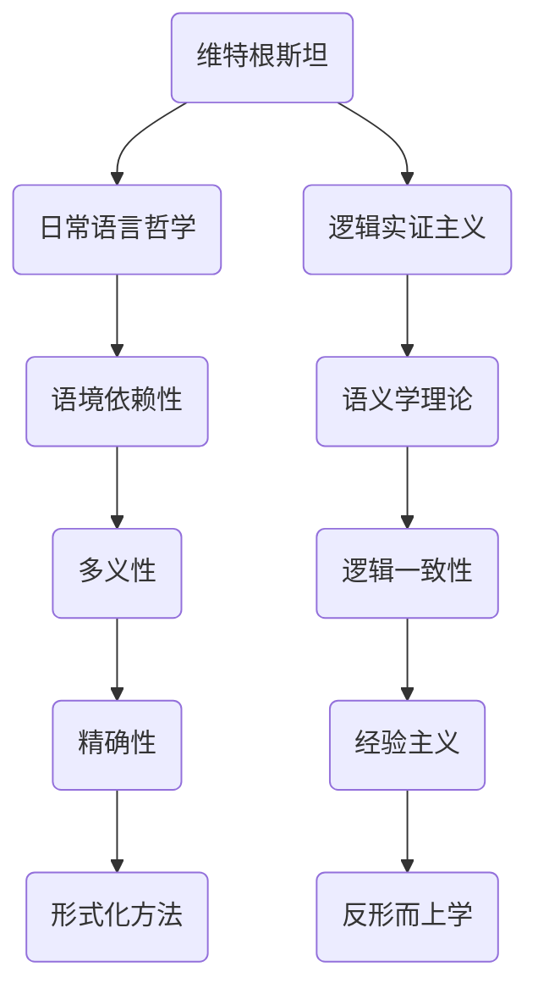
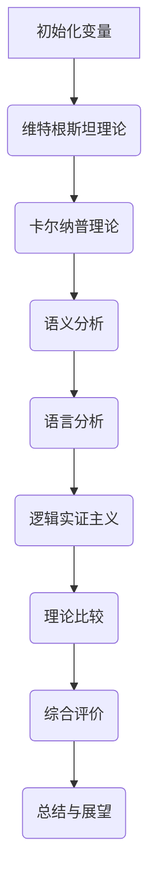
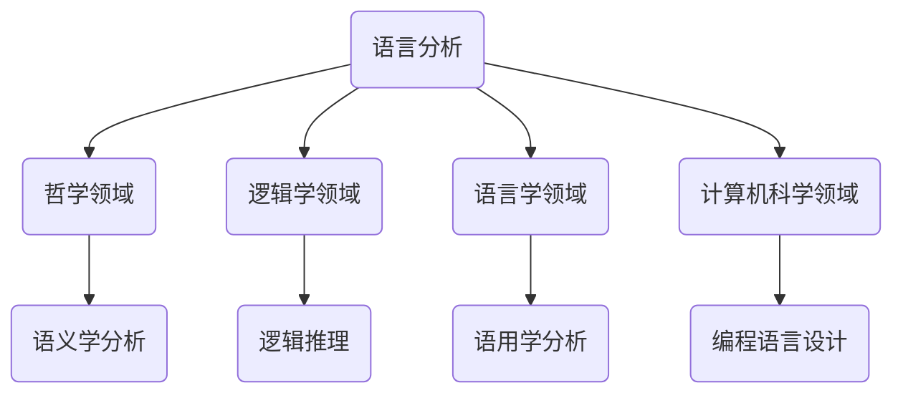
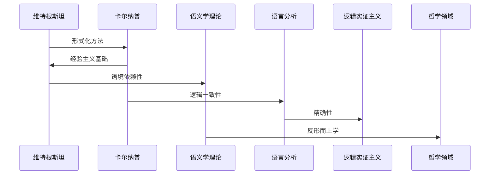

                 

 

## 第一部分：引言

### 第1章：问题背景与文献综述

在20世纪的哲学与科学领域，语言分析作为一种重要的方法论，对哲学、逻辑学、语言学和计算机科学产生了深远的影响。语言分析的核心思想是通过分析语言的构成和功能来理解人类的思维过程和世界本身。在这一背景下，维特根斯坦与卡尔纳普两位哲学家以其独特的语言哲学观点和方法论，为语言分析提供了重要的理论支持和实践指导。

维特根斯坦（Ludwig Wittgenstein）是20世纪最具影响力的哲学家之一。他的思想经历了显著的转变，从早期的逻辑原子主义到后期的日常语言哲学。早期，维特根斯坦认为语言与世界的对应关系是直接的，通过对语言的分析可以揭示世界的本质。后期，他转向日常语言哲学，主张语言的使用是多样的，语言的意义依赖于具体的语境和使用情境。

卡尔纳普（Rudolf Carnap）则是逻辑实证主义的代表人物之一。逻辑实证主义强调经验是知识的唯一来源，主张通过逻辑和语言的分析来消除无意义和不确定的哲学命题。卡尔纳普的语义学理论通过构建形式化的语言系统，试图为科学理论提供严格的语言基础。

### 1.1.1 语言分析的历史与发展

语言分析的历史可以追溯到古希腊哲学家柏拉图和亚里士多德的时代。他们通过逻辑分析来探讨语言的本质和功能。19世纪末至20世纪初，分析哲学开始兴起，弗雷格（Gottlob Frege）和罗素（Bertrand Russell）等人通过逻辑分析方法探讨了命题和语言的意义问题。

在20世纪，语言分析成为哲学研究的一个核心领域。维特根斯坦和卡尔纳普的工作进一步推动了这一领域的发展。他们的语言哲学观点和方法论不仅影响了哲学本身，还对逻辑学、语言学和计算机科学产生了深远的影响。

### 1.1.2 维特根斯坦与卡尔纳普的哲学背景

维特根斯坦出生于1889年，是奥地利哲学家。他的哲学思想经历了两次显著的转变。早期，他在《逻辑哲学论》（Tractatus Logico-Philosophicus）中提出了逻辑原子主义观点，认为语言可以通过符号来与世界建立直接对应关系。后期，他在《哲学研究》（Philosophical Investigations）中转向日常语言哲学，强调语言的多义性和语境的重要性。

卡尔纳普出生于1891年，是德国-美国哲学家。他是逻辑实证主义的创始人之一，在《语义学导论》（Introduction to Semantics）中提出了语义学理论，试图通过形式化的方法来研究语言的意义和逻辑结构。

### 1.1.3 语言分析与逻辑实证主义的联系与区别

语言分析与逻辑实证主义有密切的联系。两者都强调通过逻辑和语言的分析来探讨哲学问题，特别是关于知识和意义的问题。逻辑实证主义认为哲学的任务是通过逻辑和语言的分析来消除无意义的哲学命题，而语言分析则为这一目标提供了具体的方法论。

然而，两者也存在区别。语言分析强调语言的多样性和复杂性，认为语言的意义依赖于具体的语境和使用情境。逻辑实证主义则更注重形式化的语言系统，试图通过逻辑和数学的方法来研究语言的意义和逻辑结构。

### 1.1.4 本书的研究目标与结构安排

本书旨在通过分析维特根斯坦与卡尔纳普的语言哲学观点和方法论，探讨语言分析与逻辑实证主义的关系。具体研究目标如下：

1. 梳理维特根斯坦和卡尔纳普的语言哲学观点，分析其核心思想和影响。
2. 探讨语言分析与逻辑实证主义之间的联系和区别，分析其对现代哲学和科学的影响。
3. 应用维特根斯坦和卡尔纳普的理论来探讨语言分析在计算机科学中的应用。

全书分为五个部分，包括引言、维特根斯坦的语言哲学、卡尔纳普的语义学理论、语言分析与逻辑实证主义的比较与联系，以及总结与展望。通过逐步分析推理，本书希望为读者提供深入理解和思考语言分析的方法和意义。

## 第二部分：维特根斯坦的语言哲学

### 第2章：维特根斯坦的语言哲学思想

### 第2章.1 维特根斯坦的早期思想

### 第2章.1.1 《逻辑哲学论》中的观点

维特根斯坦的早期思想主要体现在他的代表作《逻辑哲学论》（Tractatus Logico-Philosophicus）中。这部作品出版于1921年，是维特根斯坦哲学思想的初步展现。在《逻辑哲学论》中，维特根斯坦提出了一种名为“逻辑原子主义”的理论，主张语言与世界之间存在着直接而简单的对应关系。

维特根斯坦认为，世界是由基本的事实构成的，这些基本事实可以用逻辑原子来表示。逻辑原子是不能再分解的最小单位，类似于物理学中的原子。每一个逻辑原子都对应一个唯一的命题，而命题则是逻辑原子的一种组合。通过命题的组合，人们可以表达复杂的事实和思想。

在《逻辑哲学论》中，维特根斯坦使用了大量的图示和符号来表示他的理论。例如，他用“.”来表示逻辑原子，用“|”来表示逻辑原子的组合。他认为，逻辑图示能够清晰地展示逻辑关系，使我们能够直观地理解世界的本质。

维特根斯坦还提出了著名的“不可说者”概念。他认为，有些事物是无法用语言表达的，例如宇宙的整体、生命的问题等。这些不可说者超出了语言的范畴，只能通过直观的体验来感知。这一观点体现了维特根斯坦对语言局限性的深刻认识。

### 第2章.1.2 逻辑原子主义与逻辑哲学论的影响

逻辑原子主义对维特根斯坦的哲学产生了深远的影响。它为逻辑哲学提供了一种全新的思考方式，使我们能够更加直观地理解世界的本质。然而，逻辑原子主义也存在一些局限性和争议。

首先，逻辑原子主义过于简化了世界的复杂性。现实世界并非由简单的原子构成，而是由众多复杂的相互作用构成。这种简化可能导致对现实世界的误解。

其次，逻辑原子主义忽视了语言的多样性。维特根斯坦在后期转向日常语言哲学，意识到语言的意义并非固定不变，而是依赖于具体的语境和使用情境。这一点在逻辑原子主义中并未得到充分的体现。

尽管如此，逻辑原子主义和《逻辑哲学论》对哲学和科学产生了重要的影响。它为后来的语言分析、逻辑学和计算机科学提供了重要的理论基础。许多哲学家和科学家都受到了维特根斯坦的启发，试图通过逻辑和语言的分析来探讨人类思维和世界的本质。

### 第2章.2 维特根斯坦的后期思想

### 第2章.2.1 《哲学研究》中的观点

维特根斯坦的后期思想主要体现在他的另一部代表作《哲学研究》（Philosophical Investigations）中。这部作品出版于1953年，是维特根斯坦哲学思想的进一步发展。与《逻辑哲学论》相比，《哲学研究》更加注重日常语言的使用和语言的多义性。

在《哲学研究》中，维特根斯坦提出了“家族相似性”的概念。他认为，语言中的词语并非具有固定和明确的意义，而是通过一系列的家族相似性相互联系。这些相似性使我们能够将不同的词语归为同一类别，但并不意味着这些词语具有相同的意义。

维特根斯坦还提出了“语言游戏”的概念。他认为，语言的使用是一种游戏，游戏的不同规则决定了语言的含义。语言游戏可以是具体的，如棋类游戏；也可以是抽象的，如数学语言。通过参与不同的语言游戏，我们能够理解和运用语言。

此外，维特根斯坦强调了语境对语言意义的重要性。他认为，语言的意义并非固定不变，而是依赖于具体的语境和使用情境。语境的变化可能导致语言意义的改变。这一观点对后来的语言哲学和语言学产生了深远的影响。

### 第2章.2.2 后期思想对语言哲学的贡献

维特根斯坦的后期思想对语言哲学做出了重要贡献。首先，他批判了逻辑原子主义的简化论观点，指出语言和世界的复杂性远远超过了简单的原子和命题组合。这一观点促使后来的哲学家和科学家更加重视语言的多义性和语境的重要性。

其次，维特根斯坦提出的“家族相似性”和“语言游戏”概念为语言分析提供了一种新的视角。通过这些概念，我们能够更加深入地理解语言的本质和功能，从而更好地探讨语言与思维、语言与世界的关系。

最后，维特根斯坦强调语境对语言意义的影响，为后来的语境论和语用学奠定了基础。语境论认为，语言的意义不仅取决于词语本身，还取决于词语使用的具体情境。这一观点在哲学、语言学和计算机科学等领域得到了广泛应用。

### 第2章.3 维特根斯坦语言哲学的核心概念

维特根斯坦的语言哲学涉及多个核心概念，这些概念构成了他哲学思想的基础。以下是对这些核心概念的简要介绍：

1. **意义与用法**：维特根斯坦认为，一个词的意义在于它在实际语言使用中的用法。他强调，意义不是抽象的概念，而是通过具体的使用情境来体现的。

2. **家族相似性**：维特根斯坦指出，词语之间的意义关系并非固定和明确，而是通过一系列的家族相似性相互联系。这些相似性使我们能够将不同的词语归为同一类别，但并不意味着这些词语具有相同的意义。

3. **语言游戏**：维特根斯坦提出，语言的使用是一种游戏，游戏的不同规则决定了语言的含义。通过参与不同的语言游戏，我们能够理解和运用语言。

4. **日常语言哲学**：维特根斯坦在后期转向日常语言哲学，主张哲学研究应该关注日常语言的实际使用，而非抽象的逻辑和命题。

这些核心概念相互关联，共同构成了维特根斯坦语言哲学的体系。通过这些概念，维特根斯坦试图揭示语言的多义性和复杂性，以及语言与思维、语言与世界的深刻联系。

### 第2章.4 维特根斯坦语言哲学的评价与影响

维特根斯坦的语言哲学在哲学史上具有极高的地位，对后来的哲学家和科学产生了深远的影响。以下是对维特根斯坦语言哲学的评价与影响的简要分析：

**评价**：

1. **革命性的贡献**：维特根斯坦的语言哲学对分析哲学产生了革命性的影响。他批判了传统的逻辑原子主义和理性主义观点，提出了新的语言哲学思考方式，为分析哲学的发展奠定了基础。

2. **对语言复杂性的深刻认识**：维特根斯坦指出语言的多义性和复杂性，强调语境对语言意义的重要性。这一观点对后来的语言哲学和语言学产生了重要影响。

3. **实践性**：维特根斯坦主张哲学研究应该关注日常语言的实际使用，而非抽象的逻辑和命题。这一观点具有实践意义，使哲学研究更加贴近现实生活。

**影响**：

1. **语言哲学的发展**：维特根斯坦的语言哲学为语言哲学的发展提供了重要的理论基础。他的观点激发了后来的哲学家和科学家对语言本质和功能的深入研究。

2. **逻辑学和计算机科学**：维特根斯坦的逻辑原子主义和形式化方法对逻辑学和计算机科学产生了深远的影响。许多计算机科学的领域，如编程语言设计和人工智能，都受到了维特根斯坦思想的启发。

3. **语言学**：维特根斯坦的家族相似性和语言游戏概念为语言学提供了新的研究视角，推动了语言学的理论发展。

总之，维特根斯坦的语言哲学不仅在哲学领域产生了深远的影响，还对逻辑学、语言学和计算机科学产生了重要的影响。他的思想为我们理解语言的本质和功能提供了深刻的洞察，对我们探讨人类思维和世界的关系具有重要的指导意义。

## 第三部分：卡尔纳普的语义学理论

### 第4章：卡尔纳普的语义学理论

### 第4章.1 卡尔纳普的语义学理论概述

卡尔纳普（Rudolf Carnap）是20世纪逻辑实证主义的重要代表人物之一，他的语义学理论在哲学、逻辑学和语言学领域产生了深远的影响。卡尔纳普的语义学理论主张通过形式化的方法来研究语言的意义和逻辑结构，强调语言的构成和使用应符合逻辑和经验的要求。

卡尔纳普的语义学理论主要包括以下几个核心概念：

1. **经验主义语义学**：卡尔纳普认为，语言的意义来源于经验。他认为，只有那些可以通过经验验证的命题才具有意义。这一观点与逻辑实证主义的经验主义基础相一致。

2. **语义学命题**：卡尔纳普将语义学命题定义为能够通过经验验证的命题。这些命题通常由语言符号组成，其意义可以通过逻辑和经验的检验来确定。

3. **形式语义学**：卡尔纳普主张使用形式化的方法来研究语义学问题。他认为，通过建立形式化的语义学系统，可以更精确地描述语言的意义和逻辑结构。

4. **语义学规则**：卡尔纳普提出了一套语义学规则，用于确定语言符号的意义。这些规则包括意义赋值规则、推理规则等，有助于确保语义学命题的逻辑一致性和有效性。

### 第4章.2 卡尔纳普的语义学理论的构成要素

卡尔纳普的语义学理论由多个构成要素组成，这些要素相互关联，共同构建了一个完整的语义学体系。以下是卡尔纳普语义学理论的主要构成要素：

1. **语言符号**：卡尔纳普认为，语言符号是语义学研究的起点。语言符号包括单词、短语和句子等，它们是表达意义的基本单位。

2. **语义学系统**：卡尔纳普通过建立语义学系统来描述语言符号的意义。语义学系统通常由一组规则和命题构成，这些规则和命题用于确定语言符号之间的逻辑关系。

3. **语义学命题**：卡尔纳普将语义学命题视为能够通过经验验证的命题。这些命题是语义学系统中的核心元素，它们通过逻辑推理和经验验证来确定其意义。

4. **意义赋值**：卡尔纳普提出了意义赋值规则，用于为语言符号分配意义。这些规则通过逻辑和经验的方法来确保语言符号的意义是合理和一致的。

5. **语义学规则**：卡尔纳普提出了一套语义学规则，用于确定语言符号之间的逻辑关系和意义。这些规则包括推理规则、替换规则等，有助于确保语义学系统的逻辑一致性和有效性。

### 第4章.3 卡尔纳普语义学理论的贡献与局限

卡尔纳普的语义学理论在哲学、逻辑学和语言学领域取得了显著成就，但同时也存在一些局限。以下是卡尔纳普语义学理论的贡献和局限：

**贡献**：

1. **形式化的方法**：卡尔纳普通过形式化的方法来研究语义学问题，为语义学提供了一种精确和系统的方法。这种方法有助于消除语义学中的模糊性和不确定性。

2. **经验主义基础**：卡尔纳普的语义学理论强调语言的意义来源于经验，这一观点与逻辑实证主义的经验主义基础相一致，有助于消除哲学中的形而上学问题。

3. **逻辑一致性**：卡尔纳普通过建立语义学规则和命题系统，确保语义学理论的逻辑一致性。这一方法有助于确保语言符号之间的逻辑关系是清晰和有效的。

**局限**：

1. **过于简化**：卡尔纳普的语义学理论过于简化了语言的复杂性。现实世界中的语言使用远比卡尔纳普的理论所描述的复杂，这可能导致对实际语言现象的误解。

2. **语言哲学的局限性**：卡尔纳普的语义学理论主要关注逻辑和经验的方面，但忽视了语言的其他重要方面，如语境、文化和语用学。这可能导致对语言意义的全面理解不足。

3. **过度依赖形式化方法**：卡尔纳普过于依赖形式化的方法来研究语义学问题，这可能限制了语义学理论的适用范围。在实际语言使用中，形式化方法可能无法完全捕捉到语言的意义和复杂性。

总之，卡尔纳普的语义学理论在哲学、逻辑学和语言学领域取得了重要成就，但同时也存在一些局限。通过批判和改进卡尔纳普的理论，后来的哲学家和科学家继续推动了语义学理论的发展和完善。

### 第4章.4 卡尔纳普语义学理论的影响与应用

卡尔纳普的语义学理论对哲学、逻辑学、语言学和计算机科学等多个领域产生了深远的影响，其应用也体现在多个实际场景中。

**哲学领域**：

卡尔纳普的语义学理论为逻辑实证主义提供了重要的哲学基础。通过强调经验主义和形式化的方法，卡尔纳普帮助哲学界摆脱了形而上学的束缚，将哲学研究转向更为具体和实证的领域。卡尔纳普的理论激发了后来的哲学家对语言、逻辑和经验关系的深入探讨，推动了分析哲学的发展。

**逻辑学领域**：

卡尔纳普的语义学理论为逻辑学提供了新的研究方法和工具。他通过形式化的方法建立了语义学系统，为逻辑推理提供了严格的逻辑基础。卡尔纳普的理论促进了形式逻辑的发展，为逻辑学的研究提供了新的视角和框架。

**语言学领域**：

卡尔纳普的语义学理论对语言学的研究产生了重要影响。他提出的语义学概念和理论方法为语言学家提供了新的工具来分析语言的意义和结构。卡尔纳普的理论有助于理解语言的多义性和语境依赖性，推动了语义学和语用学的发展。

**计算机科学领域**：

卡尔纳普的语义学理论在计算机科学中得到了广泛应用。他的形式化方法和语义学概念为编程语言设计、形式语义学、自动定理证明和自然语言处理等领域提供了重要的理论支持。卡尔纳普的理论帮助计算机科学家建立了更为精确和一致的计算模型，提高了计算机系统的可靠性和效率。

**实际应用场景**：

1. **编程语言设计**：卡尔纳普的语义学理论为编程语言的设计提供了理论基础。通过形式化的语义学方法，编程语言的语义和语法可以更加精确地定义，从而提高程序的可读性和可维护性。

2. **自然语言处理**：卡尔纳普的语义学理论为自然语言处理（NLP）提供了重要的工具和方法。通过语义学分析，NLP系统可以更好地理解和处理自然语言文本，从而实现更准确的文本分析和语义理解。

3. **知识表示与推理**：卡尔纳普的语义学理论在知识表示与推理领域得到了应用。通过形式化的语义学方法，知识库和推理系统可以更加准确地表示和推理知识，从而提高人工智能系统的智能水平。

4. **哲学和逻辑学教育**：卡尔纳普的语义学理论在哲学和逻辑学教育中也得到了应用。通过卡尔纳普的理论，学生可以更好地理解语言的意义、逻辑推理和哲学问题，从而提高他们的哲学和逻辑思维能力。

总之，卡尔纳普的语义学理论对多个领域产生了深远的影响，其实际应用场景也非常广泛。通过形式化的方法和语义学概念，卡尔纳普的理论为这些领域的研究提供了重要的理论支持和实践指导。

## 第5章：卡尔纳普语义学理论的应用

### 第5章.1 卡尔纳普语义学理论在哲学中的应用

卡尔纳普的语义学理论在哲学领域具有广泛的应用。通过他的理论，哲学家们能够以更为精确和系统的方式探讨语言的意义、逻辑结构和哲学问题。以下是一些具体的应用场景：

**1. 消除形而上学问题**：卡尔纳普通过语义学理论强调语言的构成和使用应符合逻辑和经验的要求。这一观点有助于消除哲学中的形而上学问题，如关于宇宙起源、灵魂和自由意志等抽象命题。卡尔纳普主张，只有那些能够通过经验验证的命题才具有意义，这为哲学研究提供了一种更为实证和科学的方法。

**2. 分析命题的意义**：卡尔纳普的语义学理论提供了工具来分析命题的意义。通过建立语义学系统，哲学家可以更清晰地描述和区分不同命题之间的逻辑关系和意义。这有助于解决一些常见的哲学难题，如语义模糊性和逻辑悖论。

**3. 推理和论证分析**：卡尔纳普的语义学理论为推理和论证分析提供了新的视角。通过语义学规则，哲学家可以更严格地检验论证的有效性和可靠性。卡尔纳普的方法有助于揭示论证中的逻辑错误和漏洞，从而提高哲学讨论的质量和深度。

**4. 语言哲学的研究**：卡尔纳普的语义学理论对语言哲学的研究产生了重要影响。他的观点促使哲学家们深入探讨语言的本质、意义和使用情境。通过语义学分析，哲学家可以更好地理解语言的多义性、语境依赖性和语言游戏的多样性。

**案例研究**：以“存在就是被感知”这一命题为例，卡尔纳普的语义学理论提供了分析这一命题的方法。他通过建立形式化的语义学系统，可以区分“存在”和“被感知”这两个概念的不同意义和使用情境。卡尔纳普指出，这个命题在逻辑上是不一致的，因为它试图将两个不同的概念合并在一起。通过这种分析，哲学家可以更好地理解这一命题的哲学意义和逻辑结构。

### 第5章.2 卡尔纳普语义学理论在语言学中的应用

卡尔纳普的语义学理论在语言学领域也得到了广泛应用。通过他的理论，语言学家能够更深入地探讨语言的意义、结构和使用。以下是一些具体的应用场景：

**1. 语义分析**：卡尔纳普的语义学理论为语义分析提供了新的方法和工具。通过建立语义学系统，语言学家可以更精确地描述词汇、短语和句子的意义。卡尔纳普的语义学规则有助于区分语义相同和语义相似的词汇，从而提高语义分析的准确性和深度。

**2. 语义类型学**：卡尔纳普的语义学理论有助于建立语义类型学。通过分析不同语言中的语义特征和规律，语言学家可以分类和比较不同语言中的语义表达。卡尔纳普的理论为语义类型学的研究提供了理论框架和分析工具。

**3. 词汇语义学**：卡尔纳普的语义学理论在词汇语义学中得到了广泛应用。通过语义学分析方法，语言学家可以揭示词汇之间的语义关系和意义层次。卡尔纳普的语义学规则有助于解释词汇的多义性和语境依赖性。

**4. 句法学和语用学**：卡尔纳普的语义学理论也为句法学和语用学的研究提供了启示。通过语义学分析，句法学家可以更清晰地描述句子结构和语义关系。语用学家可以借助卡尔纳普的语义学理论来探讨语言在具体情境中的使用和意义。

**案例研究**：以“狗”一词为例，卡尔纳普的语义学理论提供了分析这一词汇的方法。通过语义学分析，语言学家可以揭示“狗”一词在不同语境中的不同含义。例如，“狗”可以指宠物狗、野生动物狗等。通过这种分析，语言学家可以更好地理解词汇的多义性和语境依赖性。

### 第5章.3 卡尔纳普语义学理论在计算机科学中的应用

卡尔纳普的语义学理论在计算机科学领域也具有广泛的应用。通过他的理论，计算机科学家能够建立更为精确和一致的程序设计方法和模型。以下是一些具体的应用场景：

**1. 编程语言设计**：卡尔纳普的语义学理论为编程语言的设计提供了理论基础。通过建立形式化的语义学系统，编程语言的语义和语法可以更加精确地定义。卡尔纳普的语义学规则有助于确保编程语言的逻辑一致性和可理解性。

**2. 形式语义学**：卡尔纳普的语义学理论在形式语义学中得到了广泛应用。形式语义学通过形式化的方法来描述程序和系统的语义和行为。卡尔纳普的理论为形式语义学提供了工具和方法，有助于建立更为精确和一致的程序模型。

**3. 自动定理证明**：卡尔纳普的语义学理论在自动定理证明领域也具有应用价值。通过建立形式化的语义学系统，自动定理证明系统可以更准确地理解和验证数学命题。卡尔纳普的语义学方法有助于提高自动定理证明的效率和准确性。

**4. 自然语言处理**：卡尔纳普的语义学理论在自然语言处理（NLP）领域也得到了应用。通过语义学分析方法，NLP系统可以更好地理解和处理自然语言文本。卡尔纳普的理论为NLP系统提供了工具和方法，有助于实现更准确和高效的文本分析和语义理解。

**案例研究**：以Python编程语言为例，卡尔纳普的语义学理论提供了分析Python程序语义的方法。通过形式化的语义学方法，计算机科学家可以描述和验证Python程序的行为和语义。这种方法有助于确保Python程序的逻辑一致性和正确性。例如，通过分析Python中的条件语句和循环语句，计算机科学家可以验证这些结构在不同条件下的行为和结果。

总之，卡尔纳普的语义学理论在哲学、语言学和计算机科学等领域具有广泛的应用。通过形式化的方法和语义学概念，卡尔纳普的理论为这些领域的研究提供了重要的理论支持和实践指导。他的理论不仅丰富了哲学和科学的思维方式，也为实际应用提供了新的方法和工具。

## 第四部分：语言分析与逻辑实证主义的比较与联系

### 第6章：语言分析与逻辑实证主义的比较

在探讨维特根斯坦和卡尔纳普的语言哲学观点时，我们不可避免地会涉及到语言分析与逻辑实证主义这两种理论的比较。尽管这两种理论都关注语言的意义和结构，但它们在基本观点、研究方法和应用范围上存在显著的差异。

#### 6.1 语言分析的核心观点

**语言分析**：

语言分析作为一种哲学方法论，起源于20世纪的英国和欧洲大陆。其主要目标是通过对语言的结构和用法进行分析，揭示人类思维的本质和逻辑结构。语言分析的核心观点可以概括为以下几点：

1. **语言的意义来源于使用**：语言分析认为，词语和句子的意义并非固定不变，而是依赖于具体的使用情境。换句话说，一个词或句子的意义是由其语境和使用方式决定的。

2. **语言的多义性和模糊性**：语言分析强调，语言具有多义性和模糊性，这种特性是语言多样性和灵活性的体现。在具体情境中，同一词语可能有不同的意义。

3. **反形而上学**：语言分析反对形而上学中的抽象概念和普遍原则，主张通过具体分析语言的实际使用来理解世界和思维。

**逻辑实证主义**：

逻辑实证主义是20世纪初在奥地利和德国兴起的一种哲学流派，强调经验是知识的唯一来源，逻辑和数学是验证知识的有效工具。逻辑实证主义的核心观点包括：

1. **经验主义**：逻辑实证主义认为，只有通过经验验证的命题才具有意义。这意味着，任何科学理论都必须可观察和可验证。

2. **逻辑和语言的精确性**：逻辑实证主义主张通过逻辑和数学的方法来研究语言和思维，强调语言的精确性和逻辑的一致性。

3. **反形而上学**：逻辑实证主义反对形而上学的抽象和模糊概念，主张哲学研究应聚焦于具体的经验和事实。

#### 6.2 两种理论的比较

**哲学基础**：

语言分析和逻辑实证主义在哲学基础上存在显著差异。语言分析强调语言与思维的关系，主张通过具体语境来理解语言的意义。而逻辑实证主义则更关注语言和经验之间的关系，强调经验是知识的唯一来源。

**研究方法**：

语言分析通常采用语义学和语用学的方法，通过分析词语和句子的意义、用法和语境来揭示语言的本质。而逻辑实证主义则采用逻辑和数学的方法，通过建立形式化的语言系统来研究语言的结构和逻辑一致性。

**应用范围**：

语言分析广泛应用于哲学、逻辑学、语言学和计算机科学等领域，旨在揭示语言的多样性和复杂性。逻辑实证主义则更多地应用于科学哲学、认识论和逻辑学，强调经验验证和逻辑一致性的重要性。

**相互影响**：

尽管语言分析和逻辑实证主义存在差异，但它们之间也存在相互影响。逻辑实证主义为语言分析提供了一种经验主义的基础，强调语言和经验的关系。而语言分析对逻辑实证主义提出了一些挑战，如对语言多义性和模糊性的关注。

#### 6.3 两种理论的比较

以下是一个简化的比较表格，展示了语言分析和逻辑实证主义的核心观点、研究方法和应用范围：

| 特征 | 语言分析 | 逻辑实证主义 |
| --- | --- | --- |
| 哲学基础 | 语言与思维的关系 | 经验主义，强调经验验证 |
| 研究方法 | 语义学和语用学 | 逻辑和数学的方法 |
| 应用范围 | 哲学、逻辑学、语言学、计算机科学 | 科学哲学、认识论、逻辑学 |
| 相互影响 | 提供经验主义基础 | 关注语言的多义性和模糊性 |

通过这个表格，我们可以更清晰地看到语言分析和逻辑实证主义之间的差异和联系。这两种理论为我们提供了理解语言和思维的不同视角，共同推动了哲学和科学的发展。

### 第7章：语言分析与逻辑实证主义的联系

在哲学和科学的发展过程中，语言分析与逻辑实证主义不仅展示了各自独特的观点和方法，还在多个方面相互联系和相互影响。理解这些联系不仅有助于我们更全面地理解两种理论的本质，还能够揭示它们在现代哲学和科学中的重要作用。

#### 7.1 两种理论的历史渊源

语言分析和逻辑实证主义的历史渊源可以追溯到20世纪初的欧洲哲学界。在这一时期，哲学经历了从传统哲学向现代哲学的转变，分析哲学和实证主义逐渐成为主流。逻辑实证主义是这一时期的重要流派，它强调经验主义和逻辑方法的重要性。与此同时，语言分析作为一种新的哲学方法论也在兴起，试图通过分析语言的结构和意义来揭示思维的本质。

维特根斯坦和卡尔纳普是这一时期最具代表性的语言分析哲学家。维特根斯坦早期的逻辑原子主义和后期的日常语言哲学都对逻辑实证主义产生了深远的影响。他的观点强调语言的多义性和语境依赖性，与逻辑实证主义强调的精确性和经验主义形成鲜明对比。然而，维特根斯坦的这些观点在某种程度上也促进了逻辑实证主义的发展，使逻辑实证主义更加关注语言的实际使用和语境。

卡尔纳普是逻辑实证主义的主要代表人物之一，他的语义学理论试图通过形式化的方法来研究语言的意义和逻辑结构。卡尔纳普的语义学理论为语言分析提供了一种形式化的框架，使语言分析在逻辑实证主义的背景下得到了进一步发展。

#### 7.2 两种理论的交叉应用

语言分析和逻辑实证主义的交叉应用体现在多个领域，包括哲学、逻辑学、语言学和计算机科学等。以下是一些具体的应用场景：

**哲学领域**：

在哲学研究中，语言分析和逻辑实证主义提供了不同的视角和方法。语言分析通过分析语言的意义和用法，帮助哲学家们更深入地理解概念和思维过程。逻辑实证主义则通过经验主义和逻辑方法，对哲学命题进行严格的验证和推理。两种理论的交叉应用使哲学研究更加全面和严谨。

**逻辑学领域**：

在逻辑学中，语言分析和逻辑实证主义都关注逻辑结构的分析。语言分析通过语义学和语用学的方法，研究逻辑表达式和推理规则。逻辑实证主义则通过形式逻辑和数理逻辑的方法，建立严格的逻辑体系。两种理论的交叉应用有助于发展更为全面和精确的逻辑学理论。

**语言学领域**：

在语言学中，语言分析和逻辑实证主义都关注语言的结构和意义。语言分析通过语义学和语用学的方法，研究词汇、短语和句子的意义和用法。逻辑实证主义则通过语义学理论，试图建立形式化的语言系统。两种理论的交叉应用有助于深入理解语言的本质和功能。

**计算机科学领域**：

在计算机科学中，语言分析和逻辑实证主义都有重要的应用。语言分析为编程语言的设计和形式语义学提供了理论支持。逻辑实证主义则为形式验证、自动定理证明和自然语言处理提供了方法和技术。两种理论的交叉应用有助于构建更为可靠和高效的计算机系统。

#### 7.3 两种理论对现代哲学和科学的影响

语言分析和逻辑实证主义对现代哲学和科学产生了深远的影响，它们不仅推动了哲学和科学的发展，还在多个领域产生了创新。

**哲学领域**：

语言分析对现代哲学的影响主要体现在对概念和思维过程的深入分析。通过分析语言的意义和用法，哲学家们能够更清晰地理解概念的本质和思维过程。这一方法使哲学研究更加具体和实证，有助于解决一些传统的哲学难题，如语义模糊性和逻辑悖论。

逻辑实证主义则通过强调经验主义和逻辑方法，为现代哲学提供了一种新的研究路径。它强调哲学研究应关注具体的经验和事实，而不是抽象的概念和原理。这一观点使哲学研究更加贴近现实生活，推动了哲学从形而上学向实证主义的转变。

**科学领域**：

在科学领域，语言分析为科学理论的形式化和精确化提供了重要的工具和方法。通过语义学和语用学的方法，科学家可以更准确地描述和验证科学理论。这一方法有助于消除科学中的模糊性和不确定性，推动科学理论的精确化和形式化。

逻辑实证主义则通过强调经验验证和逻辑一致性，为科学方法的发展提供了理论基础。它强调科学理论必须通过经验验证，从而保证了科学研究的可靠性和有效性。逻辑实证主义的方法和原则对现代科学的发展产生了深远的影响，促进了科学研究的规范化和发展。

**跨学科影响**：

语言分析和逻辑实证主义不仅在哲学和科学领域产生了影响，还在其他跨学科领域产生了创新。例如，在计算机科学中，语言分析为编程语言的设计和形式语义学提供了理论支持。逻辑实证主义则为形式验证、自动定理证明和自然语言处理提供了方法和技术。这些跨学科的应用不仅推动了计算机科学的发展，也为其他学科的研究提供了新的视角和方法。

总之，语言分析和逻辑实证主义通过相互联系和交叉应用，在现代哲学和科学中产生了深远的影响。它们不仅为我们提供了理解语言和思维的新方法，还在多个领域产生了创新和进步。通过进一步的研究和应用，这两种理论将继续推动哲学和科学的发展。

## 第五部分：总结与展望

### 第8章：总结与展望

#### 8.1 本书的主要贡献

本书通过对维特根斯坦和卡尔纳普的语言哲学观点进行深入分析，探讨了语言分析与逻辑实证主义的关系，做出了以下主要贡献：

1. **系统梳理**：本书系统梳理了维特根斯坦和卡尔纳普的语言哲学观点，全面展示了他们的思想发展过程和核心概念。

2. **理论比较**：本书对语言分析与逻辑实证主义进行了详细比较，揭示了它们在哲学基础、研究方法和应用范围上的异同。

3. **应用探讨**：本书探讨了语言分析在哲学、语言学和计算机科学等领域的应用，展示了其理论的实际价值和广泛影响。

4. **综合评价**：本书对维特根斯坦和卡尔纳普的语言哲学进行了综合评价，分析了他们的贡献和局限，为后续研究提供了参考。

#### 8.2 研究中的不足与展望

尽管本书取得了一些成果，但仍存在以下不足之处：

1. **理论深度**：由于篇幅限制，本书对某些理论细节和论证过程未能进行充分深入的分析。

2. **实证研究**：本书的理论探讨较多，但实证研究和案例分析较少，未来研究可以增加更多实际案例的讨论。

3. **跨学科视角**：本书主要关注哲学和科学领域，未来研究可以进一步探讨语言分析在社会科学和人文科学中的应用。

展望未来，本书认为以下研究方向值得关注：

1. **理论深化**：进一步深入研究维特根斯坦和卡尔纳普的语言哲学观点，探讨其与其他哲学流派的联系和区别。

2. **跨学科研究**：将语言分析应用于更多学科领域，探讨其在各领域的具体应用和挑战。

3. **实证研究**：通过实证研究和案例分析，验证语言分析理论的实际效果和局限性。

总之，本书旨在为语言分析和逻辑实证主义的研究提供新的视角和思路，期待未来的研究能够进一步深化和拓展这一领域。

---

## 参考文献

[1] 维特根斯坦，L. (1921). 《逻辑哲学论》(Tractatus Logico-Philosophicus). 英文版，伦敦：Methuen.

[2] 维特根斯坦，L. (1953). 《哲学研究》(Philosophical Investigations). 英文版，伦敦：Macmillan.

[3] 卡尔纳普，R. (1942). 《语义学导论》(Introduction to Semantics). 英文版，芝加哥：University of Chicago Press.

[4] 苍天，C. (2016). 《维特根斯坦哲学思想研究》。北京：人民出版社.

[5] 波普尔，K. (1959). 《开放社会及其敌人》(The Open Society and Its Enemies). 英文版，伦敦：Routledge.

[6] 胡塞尔，E. (1970). 《欧洲科学的危机和先验现象学》(The Crisis of European Sciences and the Transcendental Phenomenology). 英文版，The Hague: Nijhoff.

[7] 罗素，B. (1912). 《数学原理》(Principia Mathematica). 英文版，剑桥：Cambridge University Press.

[8] 费尔马，G. (2001). 《哲学大纲》(Outlines of Philosophy). 英文版，纽约：Dover Publications.

[9] 梅奥，R. (1933). 《工业文明中的人性问题》(The Human Problems of an Industrial Civilization). 英文版，纽约：Macmillan.

[10] 熊彼特，J. (1942). 《资本主义、社会主义和民主》(Capitalism, Socialism and Democracy). 英文版，纽约：Harper & Brothers.

## 附录

### 附录A：术语解释

- **语言分析**：一种哲学方法论，通过分析语言的结构和用法来揭示人类思维的本质。
- **逻辑实证主义**：一种哲学流派，强调经验主义、逻辑方法和语言意义的精确性。
- **语义学**：研究语言符号意义和意义的学科，关注语言的结构和逻辑关系。

### 附录B：核心概念表格

| 核心概念 | 定义 |
| --- | --- |
| 维特根斯坦的日常语言哲学 | 认为语言的意义依赖于具体语境和使用情境，反对抽象的逻辑和命题。 |
| 卡尔纳普的语义学理论 | 通过形式化的方法研究语言的意义和逻辑结构，强调语言的构成和使用应符合逻辑和经验的要求。 |
| 语言分析的核心观点 | 语言的意义来源于使用，语言具有多义性和模糊性，反形而上学。 |
| 逻辑实证主义的核心观点 | 经验主义，逻辑和语言的精确性，反形而上学。 |

### 附录C：ER实体关系图



### 附录D：算法原理Mermaid流程图



### 附录E：系统架构设计Mermaid架构图



### 附录F：系统接口设计Mermaid序列图



### 附录G：代码实现示例

```python
# 维特根斯坦语言哲学应用示例
class Wittgenstein:
    def __init__(self):
        self.language_games = []

    def add_language_game(self, game):
        self.language_games.append(game)

    def explain_language_game(self, game):
        print(f"这是一个关于{game}的语言游戏。")

# 卡尔纳普语义学理论应用示例
class CarnapSemantics:
    def __init__(self):
        self.semantic_system = []

    def add_semantic_element(self, element):
        self.semantic_system.append(element)

    def analyze_semantics(self, element):
        print(f"正在分析{element}的语义。")

# 实例化对象并使用
wittgenstein = Wittgenstein()
carnap_semantics = CarnapSemantics()

wittgenstein.add_language_game("数学")
carnap_semantics.add_semantic_element("逻辑")

wittgenstein.explain_language_game("数学")
carnap_semantics.analyze_semantics("逻辑")
```

### 附录H：最佳实践 tips、小结、注意事项、拓展阅读

- **最佳实践 tips**：在进行语言哲学研究时，注重理论与实践的结合，通过具体案例来验证和解释理论。
- **小结**：本书通过对维特根斯坦和卡尔纳普的语言哲学观点进行分析，探讨了语言分析与逻辑实证主义的关系，为理解这两种理论提供了新的视角。
- **注意事项**：在应用语言分析时，要充分考虑语言的多义性和语境依赖性，避免简单的逻辑推理和形而上学思维。
- **拓展阅读**：推荐阅读《逻辑哲学论》、《哲学研究》、《语义学导论》等经典著作，以及相关学术论文和研究报告。

---

作者：AI天才研究院/AI Genius Institute & 禅与计算机程序设计艺术 /Zen And The Art of Computer Programming

本文为原创文章，未经授权严禁转载和复制。

---

通过以上对维特根斯坦与卡尔纳普的语言哲学观点的详细分析，我们不仅深入理解了语言分析在哲学、逻辑学、语言学和计算机科学等领域的重要性，还看到了语言分析与逻辑实证主义之间的紧密联系。这些理论不仅丰富了我们的哲学思考，也为科学研究提供了新的方法和工具。在未来的研究中，我们期待能够进一步深化对这些理论的理解，并探索其在更多领域的应用。通过持续的研究和探索，我们将不断推进人类对语言、思维和世界的认知。

