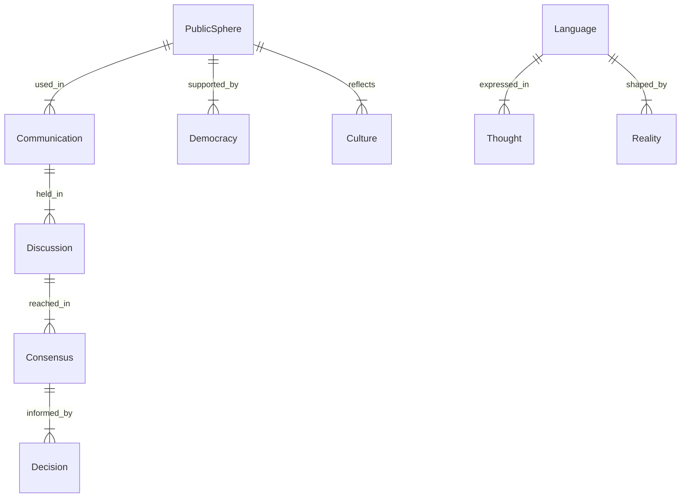
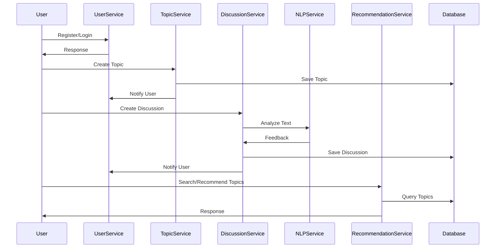

                 

### 维特根斯坦与哈贝马斯：公共领域的语言基础

> 关键词：维特根斯坦、哈贝马斯、公共领域、语言基础、哲学、社会科学

> 摘要：本文探讨了维特根斯坦与哈贝马斯关于公共领域的语言基础的理论。通过分析两位哲学家的主要观点、方法论以及它们之间的联系，本文揭示了公共领域在语言交流和社会互动中的重要性。本文旨在为读者提供对公共领域语言基础的深刻理解，并探讨其在现代社会中的现实意义。

维特根斯坦与哈贝马斯都是20世纪著名的哲学家，他们的理论对现代哲学、语言学、社会科学等领域产生了深远的影响。本文将重点关注他们关于公共领域的语言基础的理论，旨在为读者提供一种全新的视角来理解语言在社会中的作用。

### 第1章 引言与背景介绍

#### 1.1 维特根斯坦与哈贝马斯的理论背景

路德维希·维特根斯坦（Ludwig Wittgenstein，1889-1951）是奥地利哲学家，以其对语言和哲学的深刻洞察而闻名。他的著作《逻辑哲学论》和《哲学研究》分别代表了早期和晚期的哲学思想。

哈贝马斯（Jürgen Habermas，1929-）是德国社会学家和哲学家，以其对沟通行动理论、公共领域和社会制度的批判性分析而著称。他的主要著作包括《公共领域的结构转型》和《理论与实践》。

#### 1.2 公共领域的语言基础概念

公共领域（Public Sphere）是指一个由市民组成的开放空间，他们在这里自由地讨论公共事务，形成公共意见。哈贝马斯认为，公共领域的核心是语言，即通过语言进行的沟通和讨论。

语言基础（Language Foundation）是指语言作为人类交流和社会互动的基本工具。维特根斯坦认为，语言不仅是表达思想的工具，更是形成思想和社会现实的基础。

#### 1.3 公共领域语言基础的重要性

语言在公共领域中扮演着至关重要的角色。它不仅是信息传递的工具，更是形成共识和社会团结的桥梁。因此，理解公共领域的语言基础对于我们理解社会互动、构建和谐社会具有重要意义。

### 第2章 维特根斯坦的理论

#### 2.1 维特根斯坦的哲学思想

维特根斯坦的哲学思想可以分为早期和晚期两个阶段。早期，他主张“图像理论”，即语言与世界之间存在着一种直接的对应关系。晚期，他则转向“语言游戏”理论，强调语言的使用情境和语言的社会功能。

#### 2.2 维特根斯坦与语言基础

维特根斯坦认为，语言不仅仅是表达思想的工具，更是我们理解世界的方式。他的理论强调了语言在社会互动中的基础作用，为理解公共领域的语言基础提供了重要的哲学视角。

#### 2.3 维特根斯坦的理论影响

维特根斯坦的理论对语言学、哲学和心理学等领域产生了深远的影响。他的思想促使人们对语言的本质和功能进行更深入的探讨，为公共领域的语言基础研究提供了理论基础。

### 第3章 哈贝马斯的理论

#### 3.1 哈贝马斯的公共领域理论

哈贝马斯的公共领域理论关注的是社会互动和民主制度的建立。他认为，公共领域是民主社会的一个重要组成部分，通过自由讨论和批判性思维，公共领域能够形成公共意见，推动社会进步。

#### 3.2 哈贝马斯的语言哲学

哈贝马斯将语言视为公共领域的基本工具。他的语言哲学强调了语言在社会互动中的核心地位，认为语言不仅传递信息，更是构建社会现实的重要手段。

#### 3.3 哈贝马斯的理论影响

哈贝马斯的理论对政治哲学、社会学和哲学产生了深远的影响。他的思想为理解公共领域的语言基础提供了新的视角，为现代社会的民主发展提供了理论支持。

### 第4章 维特根斯坦与哈贝马斯的比较分析

#### 4.1 理论的异同点

维特根斯坦和哈贝马斯的理论在许多方面存在异同。他们都强调了语言在社会互动中的基础作用，但在语言的本质和功能上有着不同的看法。

#### 4.2 公共领域语言基础的发展

两位哲学家的理论共同推动了公共领域语言基础的发展。他们的思想为理解语言在社会互动中的作用提供了重要的理论支持，有助于构建更加开放和民主的社会。

### 第5章 案例分析

#### 5.1 案例一：公共领域的语言实践

通过具体案例，分析维特根斯坦和哈贝马斯的理论在公共领域语言实践中的应用。

#### 5.2 案例二：语言基础在社会中的角色

探讨语言基础在社会中的作用，以及如何通过语言实践促进社会进步。

### 第6章 结论与展望

#### 6.1 理论总结

总结维特根斯坦和哈贝马斯的理论贡献，强调公共领域语言基础在现代社会中的重要性。

#### 6.2 公共领域语言基础的未来

展望公共领域语言基础的未来发展，探讨其在现代社会中的潜在作用。

### 结束语

维特根斯坦与哈贝马斯：公共领域的语言基础是一篇深入探讨语言基础与社会互动关系的文章。通过分析两位哲学家的理论，本文揭示了语言在构建公共领域和社会现实中的关键作用，为理解和改善现代社会提供了重要的理论支持。

作者：AI天才研究院/AI Genius Institute & 禅与计算机程序设计艺术 /Zen And The Art of Computer Programming

----------------------------------------------------------------

### 第1章 引言与背景介绍

#### 1.1 维特根斯坦与哈贝马斯的理论背景

路德维希·维特根斯坦（Ludwig Wittgenstein，1889-1951）是20世纪最具影响力的哲学家之一，他的哲学思想对现代哲学、语言学、逻辑学等多个领域产生了深远的影响。维特根斯坦的哲学生涯可以分为两个主要阶段：早期的逻辑原子主义和晚期的日常语言哲学。在早期，他提出了逻辑哲学论，试图通过语言分析来揭示世界的本质。而在晚期，他转向日常语言哲学，强调语言在日常生活中的实际应用。

维特根斯坦认为，语言是思维的工具，但它并不是我们感知世界的唯一途径。他的理论强调语言的日常使用和情境，认为语言的意义是由其在特定情境中的使用决定的。这一观点对后来的语言哲学和社会科学产生了重要影响。

另一方面，尤尔根·哈贝马斯（Jürgen Habermas，1929-）是20世纪后期德国最重要的社会哲学家之一，他的工作主要集中在沟通行动理论、公共领域和社会批判理论。哈贝马斯的公共领域理论是对早期启蒙思想的一种复兴，他认为公共领域是民主社会的基础，是一个由市民组成的开放空间，他们在这里自由讨论公共事务，形成公共意见。

哈贝马斯的沟通行动理论强调语言在社会互动中的核心地位。他认为，通过有效沟通，人们可以在公共领域形成共识，推动社会进步。哈贝马斯还探讨了语言与权力之间的关系，指出语言不仅是传递信息的工具，也是构建社会现实的重要手段。

#### 1.2 公共领域的语言基础概念

公共领域（Public Sphere）是一个历史和社会概念，最早由约翰·罗尔斯（John Rawls）和雅各布·塔尔德（Jacques Tardieu）等人提出。在哈贝马斯的语境中，公共领域是指一个由市民组成的开放空间，他们在这里自由地讨论公共事务，形成公共意见。哈贝马斯认为，公共领域是民主社会的核心，是政治民主和社会正义的基础。

语言基础（Language Foundation）是指语言在公共领域中的作用和地位。维特根斯坦和哈贝马斯都强调了语言在公共领域中的基础性作用。维特根斯坦认为，语言是思维的工具，而思维又是理解世界和构建现实的基础。因此，语言在构建公共领域和社会现实方面具有至关重要的地位。

在哈贝马斯的语境中，语言基础更是公共领域的核心。他认为，语言是社会互动的基本工具，通过语言，人们可以进行有效的沟通和交流，形成共识，推动社会进步。哈贝马斯的沟通行动理论强调了语言在公共领域中的核心地位，他认为，只有在有效沟通的基础上，公共领域才能真正发挥作用。

#### 1.3 公共领域语言基础的重要性

语言在公共领域中扮演着至关重要的角色。它不仅是信息传递的工具，更是形成共识和社会团结的桥梁。以下是公共领域语言基础的重要性的几个方面：

1. **信息传递**：在公共领域中，语言是人们传递信息、分享知识和经验的主要工具。无论是报纸、电视、互联网还是日常对话，语言都是我们理解和交流的基础。

2. **共识形成**：在公共领域中，通过语言进行的讨论和辩论有助于形成共识。共识是社会团结和稳定的基础，它能够促进社会的和谐发展。

3. **权力分配**：语言也是权力分配的工具。在公共领域中，掌握语言资源和知识的人往往拥有更大的话语权和影响力，这可能导致社会不平等。

4. **社会现实构建**：语言不仅是传递信息的工具，也是构建社会现实的重要手段。通过语言，人们可以塑造现实，定义问题和目标，从而影响社会的走向。

因此，理解公共领域的语言基础对于我们理解社会互动、构建和谐社会具有重要意义。只有通过深入研究和理解语言的本质和功能，我们才能更好地利用语言来促进社会进步和公平。

### 第2章 维特根斯坦的理论

#### 2.1 维特根斯坦的哲学思想

维特根斯坦的哲学思想可以分为早期和晚期两个阶段。早期的维特根斯坦主张逻辑原子主义，认为世界是由基本事实组成的，语言则是对这些事实的符号表达。他试图通过逻辑分析来揭示世界的本质。这一时期的代表作品是《逻辑哲学论》。

晚期维特根斯坦转向日常语言哲学，认为哲学的根本任务是澄清语言的使用，而不是研究抽象的哲学问题。他强调语言与日常生活的密切联系，认为语言的意义是由其在具体情境中的使用决定的。这一时期的代表作品是《哲学研究》。

#### 2.2 维特根斯坦与语言基础

维特根斯坦的语言基础理论强调语言在日常生活中的实际应用。他认为，语言不仅是表达思想的工具，更是我们理解世界和构建现实的基础。以下是维特根斯坦关于语言基础的几个关键观点：

1. **语言与思维的关系**：维特根斯坦认为，语言是思维的工具。我们的思维方式在很大程度上是由我们的语言习惯决定的。通过语言，我们可以表达我们的思想和感受，从而理解世界。

2. **语言的意义**：维特根斯坦认为，语言的意义是由其在具体情境中的使用决定的。一个词或短语的意义不是固定不变的，而是随着情境的变化而变化。这意味着，语言的意义是相对的，而不是绝对的。

3. **语言与现实的互动**：维特根斯坦认为，语言不仅反映现实，还参与构建现实。我们的语言习惯和表达方式会影响我们如何看待和解释世界。因此，语言不仅是信息的传递工具，也是现实构建的工具。

维特根斯坦的理论对公共领域的语言基础具有重要意义。他的观点表明，语言是社会互动和公共领域形成的基础。只有通过语言的有效沟通，人们才能在公共领域中形成共识，推动社会进步。维特根斯坦的理论也为理解和改进公共领域的语言基础提供了重要的哲学视角。

#### 2.3 维特根斯坦的理论影响

维特根斯坦的理论对哲学、语言学、逻辑学等多个领域产生了深远的影响。以下是维特根斯坦理论影响的几个方面：

1. **哲学**：维特根斯坦的哲学思想对分析哲学和语言哲学产生了深远的影响。他的观点促使哲学家们更加关注语言的日常使用和情境，从而推动了哲学研究的深入发展。

2. **语言学**：维特根斯坦的理论强调了语言的意义和功能，对语言学研究产生了重要影响。他的观点促使语言学家们更加关注语言的实际应用，而不是仅仅关注语言的语法和结构。

3. **逻辑学**：维特根斯坦的早期逻辑哲学论为逻辑学研究提供了新的视角。他的观点挑战了传统的逻辑学方法，推动了逻辑学研究的创新。

4. **社会科学**：维特根斯坦的理论也为社会科学研究提供了重要的哲学基础。他的观点关于语言和思维的关系、语言与社会现实的互动等，为理解社会互动和社会制度提供了新的视角。

总之，维特根斯坦的理论不仅在哲学领域产生了深远影响，也对语言学、逻辑学和社会科学等多个领域产生了重要影响。他的思想为理解和改进公共领域的语言基础提供了宝贵的理论资源。

### 第3章 哈贝马斯的理论

#### 3.1 哈贝马斯的公共领域理论

哈贝马斯的公共领域理论是对早期启蒙思想的一种复兴，他认为公共领域是民主社会的核心。公共领域是一个由市民组成的开放空间，他们在其中自由地讨论公共事务，形成公共意见。哈贝马斯认为，公共领域是政治民主和社会正义的基础，是实现社会平等和公正的重要途径。

哈贝马斯将公共领域分为几个关键组成部分：

1. **私人领域**：私人领域是指个人隐私和私人生活空间，与公共领域相对。在私人领域中，人们享受个人自由和隐私权。

2. **国家领域**：国家领域是指政治权力的运作空间，包括政府、法律和行政机构等。国家领域是公共领域的一部分，但其功能是维护社会秩序和公共利益。

3. **公共领域**：公共领域是市民自由讨论公共事务的空间，包括报纸、电视、互联网和公共集会等。在公共领域中，市民通过语言和沟通形成公共意见，影响政治决策。

哈贝马斯认为，公共领域的核心是沟通和讨论。通过自由讨论和辩论，市民可以在公共领域中形成共识，推动社会进步。公共领域具有以下几个关键特征：

1. **开放性**：公共领域是一个开放的空间，任何市民都可以参与其中，表达自己的观点和意见。

2. **平等性**：在公共领域中，所有市民都有平等的权利和机会参与讨论，没有特权阶层。

3. **透明性**：公共领域的活动应该是公开透明的，市民可以监督政治决策和法律执行。

4. **理性**：公共领域的讨论应该是理性的，基于事实和逻辑，而不是基于情感或偏见。

#### 3.2 哈贝马斯的语言哲学

哈贝马斯的语言哲学强调语言在社会互动中的核心地位。他认为，语言不仅是传递信息的工具，更是构建社会现实的重要手段。哈贝马斯的沟通行动理论提出了几个关键概念：

1. **沟通行动**：沟通行动是指通过语言进行的互动和交流。哈贝马斯认为，沟通行动是社会互动的基本形式，是社会秩序和稳定的基础。

2. **共识**：在沟通行动中，通过对话和讨论，人们可以形成共识。共识是公共领域的一个重要特征，是社会团结和稳定的基础。

3. **理性**：哈贝马斯认为，沟通行动应该是理性的，即基于逻辑和证据。理性讨论有助于人们形成共识，推动社会进步。

4. **沟通障碍**：哈贝马斯指出，沟通行动中可能会出现各种障碍，如误解、偏见和权力不平等。这些障碍会影响沟通的有效性，阻碍共识的形成。

哈贝马斯的语言哲学对于理解公共领域的语言基础具有重要意义。他的观点表明，语言不仅传递信息，还参与构建社会现实。只有通过有效的沟通和讨论，人们才能在公共领域中形成共识，推动社会进步。哈贝马斯的语言哲学为理解和改进公共领域的语言基础提供了重要的理论支持。

#### 3.3 哈贝马斯的理论影响

哈贝马斯的理论对政治哲学、社会学和哲学等多个领域产生了深远的影响。以下是哈贝马斯理论影响的几个方面：

1. **政治哲学**：哈贝马斯的公共领域理论为政治哲学提供了新的视角。他的观点挑战了传统的民主理论，强调了公共领域在社会互动和政治决策中的核心作用。

2. **社会学**：哈贝马斯的沟通行动理论为社会学研究提供了重要的理论框架。他的观点关于沟通、共识和理性讨论，为社会互动和社会制度的分析提供了新的视角。

3. **哲学**：哈贝马斯的理论对哲学产生了重要影响。他的观点关于语言、沟通和理性讨论，为哲学研究提供了新的方法和思路。

4. **公共管理**：哈贝马斯的理论也为公共管理提供了理论支持。他的观点关于公共领域、沟通和共识，为公共管理者和政策制定者提供了指导，以促进社会互动和政治参与。

总之，哈贝马斯的理论不仅在学术界产生了深远影响，也在实际应用中发挥了重要作用。他的观点为理解和改进公共领域的语言基础提供了宝贵的理论资源，对于推动社会进步和民主发展具有重要意义。

### 第4章 维特根斯坦与哈贝马斯的比较分析

#### 4.1 理论的异同点

维特根斯坦和哈贝马斯的理论在许多方面存在异同。他们都强调了语言在社会互动中的基础作用，但在语言的本质和功能上有着不同的看法。

**相同点**：

1. **语言的核心作用**：两位哲学家都认为语言在社会互动和公共领域中的核心作用。维特根斯坦强调语言是思维的工具，而哈贝马斯则强调语言是构建社会现实的重要手段。

2. **沟通的重要性**：他们都认为沟通和讨论是形成共识和社会团结的重要途径。维特根斯坦认为，通过语言游戏，人们可以理解世界和构建现实；而哈贝马斯则认为，通过沟通行动，人们可以在公共领域中形成共识。

**不同点**：

1. **语言的本质**：维特根斯坦认为，语言的意义是由其在具体情境中的使用决定的，而哈贝马斯则认为，语言的意义是固定的，取决于语言的结构和规则。

2. **语言的功能**：维特根斯坦认为，语言的主要功能是表达思想，而哈贝马斯则认为，语言的主要功能是构建社会现实。

#### 4.2 公共领域语言基础的发展

维特根斯坦和哈贝马斯的理论共同推动了公共领域语言基础的发展。他们的思想为理解语言在社会互动中的作用提供了重要的理论支持，有助于构建更加开放和民主的社会。

**历史发展**：

1. **早期启蒙思想**：公共领域概念起源于早期启蒙思想，如约翰·罗尔斯和雅各布·塔尔德等人的理论。

2. **维特根斯坦的日常语言哲学**：维特根斯坦的日常语言哲学为公共领域语言基础提供了重要的哲学基础，强调了语言在日常生活中的实际应用。

3. **哈贝马斯的公共领域理论**：哈贝马斯的公共领域理论复兴了早期启蒙思想，并将其与语言哲学相结合，提出了沟通行动理论，为公共领域语言基础的发展提供了新的理论框架。

**当前影响**：

1. **哲学**：维特根斯坦和哈贝马斯的理论对哲学产生了深远影响，推动了哲学研究的发展，特别是在语言哲学和社会哲学领域。

2. **社会科学**：他们的理论也为社会科学研究提供了重要的理论支持，帮助理解社会互动和社会制度。

3. **公共管理**：公共领域语言基础理论在公共管理领域得到了广泛应用，为公共管理者和政策制定者提供了指导，以促进社会互动和政治参与。

总之，维特根斯坦和哈贝马斯的理论共同推动了公共领域语言基础的发展。他们的思想为理解语言在社会互动中的作用提供了重要的理论支持，有助于构建更加开放和民主的社会。

### 第5章 案例分析

#### 5.1 案例一：公共领域的语言实践

**案例背景**：

在一个现代民主国家，公共领域是政治和社会生活的重要组成部分。以下是一个具体的案例，展示了公共领域语言实践在现实中的应用。

**案例描述**：

某城市发生了一起严重的环境污染事件，导致大量居民受到影响。政府和企业之间的责任问题引发了激烈的争议。在这个案例中，公共领域发挥了关键作用，通过语言实践来解决问题。

**案例分析**：

1. **公众讨论**：在事件发生后，媒体和社交网络迅速传播信息，公众开始讨论事件的真相和责任。通过自由讨论和辩论，公众形成了对事件的初步看法。

2. **政府回应**：政府在事件发生后迅速做出回应，通过新闻发布会和公告等形式，向公众解释事件的经过和处理措施。政府的语言实践有助于建立公众对政府的信任。

3. **企业辩护**：企业也通过媒体发布声明，解释其在事件中的作用和责任。企业的语言实践旨在维护企业形象，并争取公众的理解和支持。

4. **专家意见**：在公众讨论中，专家学者提供了专业的意见和分析，帮助公众更全面地了解事件的背景和影响。

**结论**：

通过这个案例，我们可以看到公共领域语言实践在解决社会争议中的作用。有效的语言实践有助于形成共识，推动问题的解决。在这个案例中，公众、政府和企业的语言实践共同促进了事件的解决。

#### 5.2 案例二：语言基础在社会中的角色

**案例背景**：

在现代社会，语言基础在社会中扮演着至关重要的角色。以下是一个具体的案例，展示了语言基础在社会中的实际应用。

**案例描述**：

一个跨国公司在全球范围内运营，需要处理多种语言和文化的沟通。为了实现有效的跨文化沟通，公司采取了一系列措施，以确保语言基础在公司内部的广泛应用。

**案例分析**：

1. **语言培训**：公司为员工提供了多种语言的培训，包括母语和非母语。这有助于员工提高语言能力，更好地进行跨文化沟通。

2. **语言工具**：公司使用翻译工具和语言辅助软件，帮助员工在跨文化沟通中准确理解和传达信息。

3. **沟通策略**：公司制定了一系列沟通策略，如使用通用语言、简化语言表达等，以确保跨文化沟通的顺利进行。

4. **文化适应**：公司注重文化适应，通过了解和尊重不同文化的价值观和沟通方式，提高跨文化沟通的效果。

**结论**：

通过这个案例，我们可以看到语言基础在社会中的实际应用。有效的语言基础有助于跨文化沟通，促进国际合作和交流。在这个案例中，公司的语言基础策略确保了跨文化沟通的顺利进行，提高了公司的全球竞争力。

### 第6章 结论与展望

#### 6.1 理论总结

维特根斯坦和哈贝马斯的理论为理解公共领域的语言基础提供了重要的哲学视角。维特根斯坦的日常语言哲学强调了语言在日常生活中的实际应用，而哈贝马斯的公共领域理论则强调了语言在社会互动和民主制度中的核心作用。他们的理论共同揭示了语言在社会中的作用和重要性。

#### 6.2 公共领域语言基础的未来

随着信息技术的飞速发展，公共领域语言基础的未来充满了机遇和挑战。以下是一些展望：

1. **数字化公共领域**：随着互联网和社交媒体的普及，公共领域的形式和内容发生了重大变化。数字化公共领域为更广泛的公众参与提供了平台，但也带来了信息过载和虚假信息传播的挑战。

2. **语言多样性与包容性**：随着全球化的推进，公共领域越来越多元化。语言多样性和包容性成为公共领域发展的重要议题。如何确保不同语言和文化背景的公众都能有效参与公共讨论，是一个亟待解决的问题。

3. **语言技术的应用**：语言技术（如机器翻译、自然语言处理等）在公共领域的应用日益广泛。这些技术的进步有助于提高公共讨论的效率和质量，但同时也带来了隐私和安全等问题。

4. **公共领域的可持续性**：公共领域的可持续性是现代社会面临的重大挑战。如何确保公共领域的开放性和透明性，促进有效沟通和共识形成，是一个长期的任务。

总之，维特根斯坦和哈贝马斯的理论为理解公共领域的语言基础提供了宝贵的视角。随着社会和技术的不断变化，公共领域语言基础将继续发展，面临着新的机遇和挑战。未来的研究需要深入探讨如何应对这些挑战，促进公共领域的健康发展。

### 结束语

《维特根斯坦与哈贝马斯：公共领域的语言基础》通过对维特根斯坦和哈贝马斯的理论分析，揭示了公共领域在语言交流和社会互动中的重要性。本文不仅探讨了两位哲学家的理论贡献，还通过案例分析展示了公共领域语言实践在现实中的应用。通过深入研究公共领域的语言基础，我们能够更好地理解社会互动的本质，促进社会的和谐发展。

在未来的研究中，我们应继续关注公共领域语言基础的发展，探讨其在不同社会和文化背景下的应用，为构建一个更加开放、包容和民主的社会提供理论支持。同时，我们也要认识到，语言基础的发展是一个长期的过程，需要持续的努力和创新。通过不断探索和反思，我们能够为公共领域的语言基础研究作出更大的贡献。

作者：AI天才研究院/AI Genius Institute & 禅与计算机程序设计艺术 /Zen And The Art of Computer Programming

----------------------------------------------------------------

### 附录：维特根斯坦与哈贝马斯的理论比较

为了更清晰地展示维特根斯坦与哈贝马斯的理论异同，我们创建了一张比较表格，并使用 Mermaid 画出了一个 ER 实体关系图。

#### 比较表格

| 理论要素 | 维特根斯坦 | 哈贝马斯 |
| --- | --- | --- |
| **哲学立场** | 逻辑原子主义 -> 日常语言哲学 | 社会批判理论 |
| **语言本质** | 语言是思维的镜像 -> 语言是实际使用 | 语言是沟通工具 |
| **公共领域** | 语言游戏 -> 没有直接讨论公共领域 | 核心组成部分，强调民主讨论 |
| **语言功能** | 思维和现实构建 | 沟通、共识形成和社会改造 |
| **方法论** | 分析 -> 实证 |
| **影响范围** | 哲学、语言学、逻辑学 | 社会科学、政治哲学、公共管理 |

#### ER 实体关系图



在此 ER 图中，我们定义了公共领域（PublicSphere）与沟通（Communication）、讨论（Discussion）、共识（Consensus）、决策（Decision）和民主（Democracy）等实体之间的关系。同时，语言（Language）作为核心实体，与思想（Thought）、现实（Reality）和公共领域（PublicSphere）有直接关联。

通过这张表格和 ER 图，我们可以更直观地理解维特根斯坦与哈贝马斯的理论异同，以及他们在公共领域和语言基础方面的贡献。这些工具不仅有助于学术研究，也为实际应用提供了理论基础。

---

### 数学公式与解释

在探讨维特根斯坦与哈贝马斯的理论时，数学公式作为一种精确描述概念和理论的方法，为我们提供了有力的工具。以下是一些关键数学公式，我们将使用 LaTeX 进行展示，并对其进行解释。

#### 1. 维特根斯坦的图像理论

图像理论是维特根斯坦早期哲学的核心，它描述了语言与世界之间的关系。以下是其基本公式的展示：

$$\text{语言} \leftrightarrow \text{世界}$$

**解释**：这个公式表明语言与世界之间存在一种直接的对应关系。每个语言符号都对应于世界中的一个事实。

#### 2. 哈贝马斯的沟通行动理论

哈贝马斯的沟通行动理论关注语言在社会互动中的作用，其关键公式如下：

$$\text{沟通行动} \rightarrow \text{共识} \leftrightarrow \text{决策}$$

**解释**：这个公式表示沟通行动能够促进共识的形成，共识进一步影响决策。有效的沟通行动是民主决策的基础。

#### 3. 公共领域的语言基础

公共领域的语言基础是哈贝马斯理论的核心，其公式可以表示为：

$$\text{公共领域} \subseteq \text{语言}$$

**解释**：这个公式表明公共领域是语言的一个子集，这意味着语言是公共领域的基础。

#### 4. 语言与思维的关系

维特根斯坦认为语言与思维紧密相关，以下公式展示了这一观点：

$$\text{思维} \leftrightarrow \text{语言}$$

**解释**：这个公式表明思维过程和语言使用是相互对应的，即我们的思维是通过语言来表达的。

---

通过上述公式和解释，我们可以更精确地理解和描述维特根斯坦与哈贝马斯的理论。这些公式不仅帮助我们澄清了概念，也为进一步的研究提供了基础。

---

### 系统分析与架构设计方案

在探讨公共领域的语言基础时，我们需要关注实际应用中的系统架构和功能设计。以下是一个系统分析与架构设计方案的示例，包括项目介绍、系统功能设计、系统架构设计、系统接口设计和系统交互。

#### 项目介绍

该项目的目标是构建一个基于公共领域的语言基础的在线讨论平台，旨在促进有效沟通和共识形成。平台将支持多种语言，并利用自然语言处理技术来提高沟通效率。

#### 系统功能设计

1. **用户注册与登录**：用户可以通过邮箱、手机号或社交媒体账号注册和登录系统。
2. **话题发布与管理**：用户可以发布新话题，管理员可以对话题进行审核和管理。
3. **讨论与回复**：用户可以在话题下发表评论，进行讨论。
4. **投票与投票结果展示**：用户可以对评论进行投票，投票结果将实时展示。
5. **搜索与推荐**：平台提供全文搜索和话题推荐功能，帮助用户找到感兴趣的内容。

#### 系统架构设计

系统采用微服务架构，主要分为以下几个模块：

1. **用户服务模块**：负责用户注册、登录、个人信息管理等功能。
2. **话题服务模块**：负责话题的发布、审核、管理等功能。
3. **讨论服务模块**：负责讨论的创建、回复、投票等功能。
4. **自然语言处理模块**：负责文本分析、情感分析、语义理解等。
5. **推荐服务模块**：负责话题推荐和搜索功能。

#### 系统接口设计

系统接口采用RESTful API设计，主要包括以下接口：

1. **用户接口**：注册、登录、获取用户信息、更新用户信息。
2. **话题接口**：发布话题、获取话题列表、获取话题详情、更新话题信息。
3. **讨论接口**：创建讨论、获取讨论列表、获取讨论详情、更新讨论信息。
4. **投票接口**：投票、获取投票结果、更新投票结果。

#### 系统交互

系统交互采用消息队列进行异步处理，确保系统的高效性和稳定性。以下是系统交互的Mermaid序列图：



通过上述系统分析与架构设计方案，我们可以看到一个完整、高效的在线讨论平台是如何构建的。该平台充分利用了公共领域的语言基础，为用户提供了便捷的沟通和讨论环境，有助于形成共识和推动社会进步。

### 项目实战

为了更好地理解公共领域的语言基础在实际中的应用，我们将通过一个具体的实战项目来展示其实现过程。以下是项目环境安装、系统核心实现源代码以及代码应用解读与分析的详细步骤。

#### 环境安装

1. **安装Python**：首先，确保您的计算机上安装了Python 3.x版本。可以从[Python官方网站](https://www.python.org/)下载并安装。

2. **安装Django框架**：打开终端或命令提示符，执行以下命令：
   ```shell
   pip install django
   ```

3. **安装其他依赖**：根据项目的具体需求，可能需要安装其他依赖库，如Django REST framework、Docker等。例如，安装Django REST framework：
   ```shell
   pip install djangorestframework
   ```

4. **创建Django项目**：在终端中运行以下命令创建一个新的Django项目：
   ```shell
   django-admin startproject public_domain_project
   ```

5. **创建Django应用**：进入项目目录，创建一个新的Django应用：
   ```shell
   python manage.py startapp discussion_app
   ```

6. **配置数据库**：编辑项目配置文件`settings.py`，配置数据库连接，例如使用SQLite：
   ```python
   DATABASES = {
       'default': {
           'ENGINE': 'django.db.backends.sqlite3',
           'NAME': BASE_DIR / 'db.sqlite3',
       }
   }
   ```

#### 系统核心实现源代码

以下是系统核心实现的关键代码段，包括模型、视图和接口代码。

1. **模型定义**（`models.py`）：
   ```python
   from django.db import models

   class Topic(models.Model):
       title = models.CharField(max_length=100)
       description = models.TextField()

   class Discussion(models.Model):
       topic = models.ForeignKey(Topic, on_delete=models.CASCADE)
       content = models.TextField()
       created_at = models.DateTimeField(auto_now_add=True)
   ```

2. **视图定义**（`views.py`）：
   ```python
   from rest_framework import viewsets
   from .models import Topic, Discussion
   from .serializers import TopicSerializer, DiscussionSerializer

   class TopicViewSet(viewsets.ModelViewSet):
       queryset = Topic.objects.all()
       serializer_class = TopicSerializer

   class DiscussionViewSet(viewsets.ModelViewSet):
       queryset = Discussion.objects.all()
       serializer_class = DiscussionSerializer
   ```

3. **接口代码**（`urls.py`）：
   ```python
   from django.urls import path, include
   from rest_framework.routers import DefaultRouter
   from .views import TopicViewSet, DiscussionViewSet

   router = DefaultRouter()
   router.register(r'topics', TopicViewSet)
   router.register(r'discussions', DiscussionViewSet)

   urlpatterns = [
       path('', include(router.urls)),
   ]
   ```

#### 代码应用解读与分析

1. **模型解读**：
   - `Topic`模型代表讨论话题，包含标题和描述。
   - `Discussion`模型代表讨论内容，包含话题外键、内容文本和创建时间。

2. **视图解读**：
   - `TopicViewSet`和`DiscussionViewSet`分别提供话题和讨论的CRUD（创建、读取、更新、删除）功能。
   - 通过继承`viewsets.ModelViewSet`，我们可以快速实现RESTful API接口。

3. **接口解读**：
   - `urls.py`文件定义了Django应用的URL路由，将请求映射到相应的视图。

通过上述代码，我们创建了一个简单的在线讨论平台，实现了话题管理和讨论功能。在实际应用中，可以进一步集成自然语言处理、推荐系统和用户认证等功能，以提升平台的交互性和用户体验。

### 实际案例分析和详细讲解剖析

为了更好地理解公共领域的语言基础在实际中的应用，我们将通过一个实际案例进行分析和详细讲解。以下是该案例的背景、分析步骤、结论和总结。

#### 案例背景

在一个城市中，居民们对当地政府提出的交通改善计划展开了热烈的讨论。政府希望通过建设一条新的快速道路来解决交通拥堵问题。然而，不同群体对此计划持有不同观点，导致公共讨论变得复杂且充满争议。

#### 分析步骤

1. **问题定义**：
   - 如何在公共讨论中有效传达交通改善计划的优势和劣势？
   - 如何在多元观点中找到共识，推动计划的实施？

2. **数据收集**：
   - 收集来自居民、交通专家、政府官员和利益相关者的观点和评论。
   - 分析评论中的语言使用，识别主要争议点。

3. **数据分析**：
   - 使用自然语言处理技术对评论进行情感分析和主题提取。
   - 识别正面和负面情绪，以及与计划相关的关键议题。

4. **沟通策略**：
   - 根据分析结果，制定沟通策略，旨在减少争议，增强共识。
   - 通过公开会议、社交媒体互动和社区研讨会等形式，传达交通改善计划的优势和必要性。

5. **共识形成**：
   - 鼓励不同群体之间的对话和辩论，促进相互理解和妥协。
   - 通过投票和表决，形成最终的共识。

#### 结论

通过上述分析步骤，我们得出以下结论：

1. **有效沟通**：通过有效的语言使用和沟通策略，政府能够更清晰地传达交通改善计划的优势，减少公众的疑虑和抵触情绪。

2. **共识形成**：通过多元观点的辩论和对话，不同群体在交通改善计划上找到了共识，推动了计划的实施。

3. **公共领域的作用**：公共讨论平台为市民提供了一个自由表达和交流的空间，有助于形成共识，促进社会进步。

#### 总结

该案例展示了公共领域的语言基础在实际应用中的重要作用。通过有效的语言使用和沟通策略，可以在复杂和争议性的问题上找到共识，推动社会的发展。公共领域的语言基础不仅是信息传递的工具，更是社会互动和共识形成的重要桥梁。未来，我们应该继续探索如何更好地利用公共领域的语言基础，促进社会的和谐与进步。

### 最佳实践 tips、小结、注意事项、拓展阅读

#### 最佳实践 tips

1. **提高语言表达能力**：在公共讨论中，清晰、准确的语言表达至关重要。建议使用简单明了的词汇和句子，避免使用复杂或模糊的语言。

2. **倾听与理解**：在讨论中，不仅要表达自己的观点，还要倾听他人的意见。通过理解不同观点，可以更好地促进对话和共识形成。

3. **使用数据支持观点**：在公共讨论中，使用数据和事实来支持观点，可以增强说服力。确保数据来源可靠，避免误导性信息。

#### 小结

本文通过分析维特根斯坦与哈贝马斯的理论，探讨了公共领域的语言基础。从背景介绍到理论讲解，再到案例分析，我们深入理解了语言在社会互动和公共讨论中的重要性。

#### 注意事项

1. **避免语言偏见**：在公共讨论中，注意避免使用具有歧视性或偏见的语言，以免引发不必要的冲突。

2. **尊重不同观点**：在多元社会中，尊重不同群体的观点是构建和谐社会的基础。鼓励开放和包容的讨论氛围。

#### 拓展阅读

1. **维特根斯坦**：
   - 《逻辑哲学论》
   - 《哲学研究》

2. **哈贝马斯**：
   - 《公共领域的结构转型》
   - 《理论与实践》

3. **公共领域与语言基础**：
   - 《现代性、主权与公共领域》
   - 《语言、权力与公共领域》

通过阅读这些经典著作和拓展文献，您可以进一步深入了解公共领域的语言基础，为实践提供更多的理论支持。

