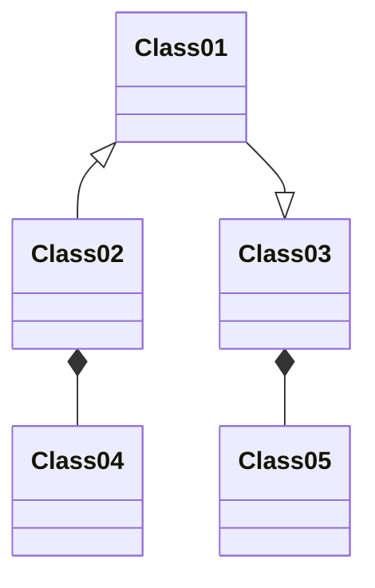
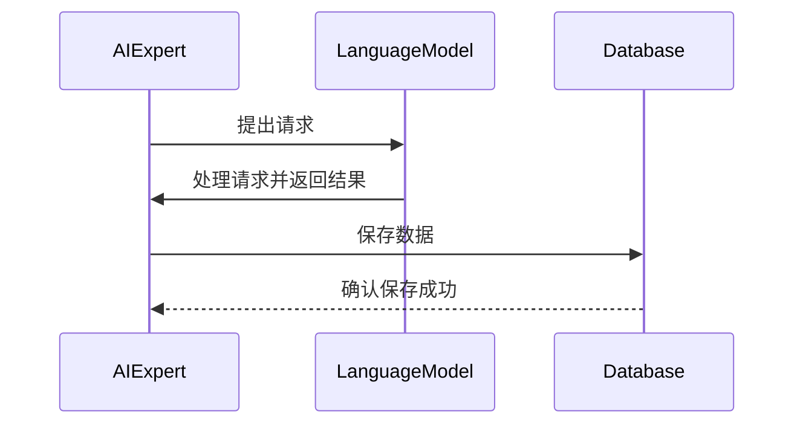
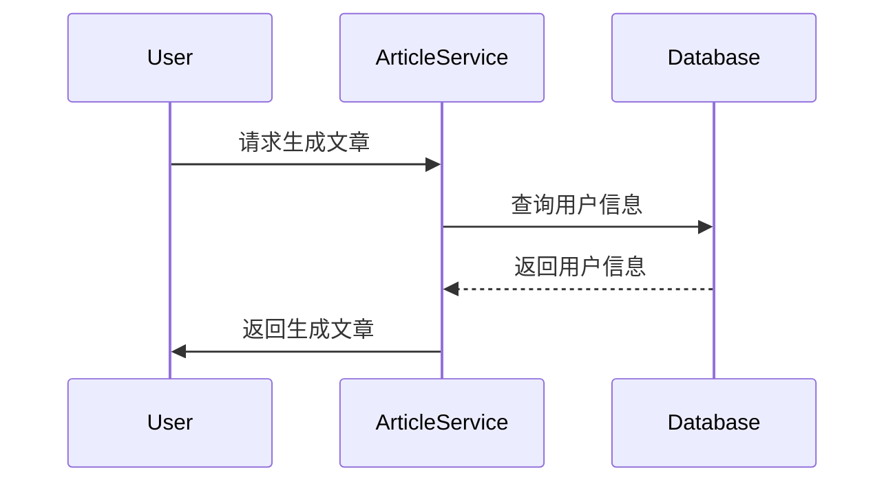
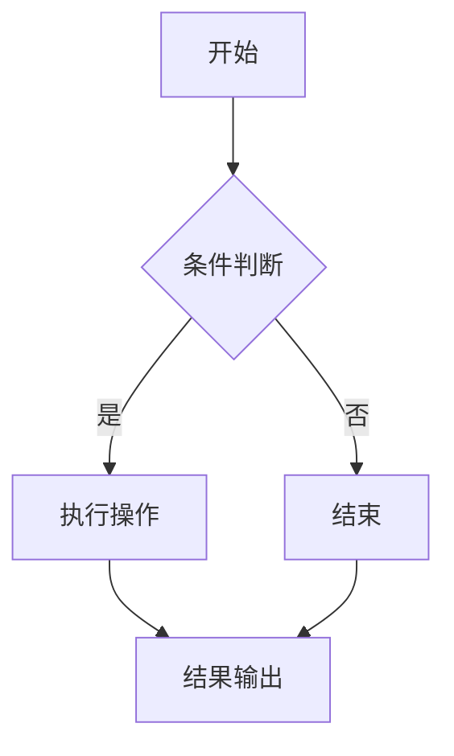
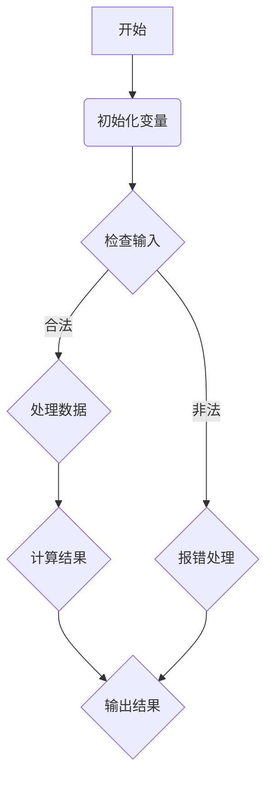
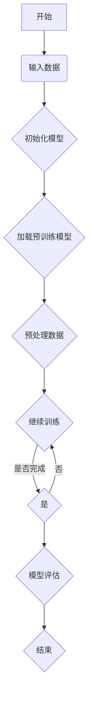

                 

# 维特根斯坦与塔尔斯基：真理概念的语言哲学探讨

## 关键词：维特根斯坦，塔尔斯基，真理概念，语言哲学，语义分析

## 摘要：
本文将探讨两位著名哲学家维特根斯坦和塔尔斯基对真理概念的语言哲学思考。通过对他们的生平背景、哲学思想及其对真理概念的诠释进行详细分析，揭示两者在语言哲学领域的独特见解和贡献。文章旨在为读者提供一个全面而深入的了解，以激发对真理概念及其在语言哲学中的重要性进行更深入的思考。

## 引言：真理概念的重要性与维特根斯坦与塔尔斯基的贡献

真理概念是人类思维和语言表达中一个基础而关键的部分。它不仅关乎知识的获取和验证，还涉及语言的意义和有效性。因此，真理概念在语言哲学中占据着重要地位。维特根斯坦和塔尔斯基，两位在语言哲学领域具有深远影响的哲学家，对真理概念进行了深入的探讨。

### 维特根斯坦的生平与哲学贡献

路德维希·维特根斯坦（Ludwig Wittgenstein，1889-1951）是20世纪最杰出的哲学家之一。他的哲学思想对逻辑哲学、语言哲学和认知科学等领域产生了深远影响。维特根斯坦的哲学观点经历了显著的转变，分为两个主要阶段：早期的“逻辑原子主义”和后期的“日常语言哲学”。

#### 早期的逻辑原子主义

在早期作品中，维特根斯坦提出了逻辑原子主义的观点，认为世界是由不可分割的基本元素（逻辑原子）构成的，这些元素通过组合形成复杂的实体。他认为，逻辑形式和语言结构紧密相关，语言的正确使用可以揭示世界的本质。

#### 后期的日常语言哲学

在后期作品中，维特根斯坦转向日常语言哲学，强调语言的日常使用和理解的重要性。他认为，哲学问题往往源于语言的误解和滥用，解决这些问题的方法在于对语言进行细致的考察和分析。

### 塔尔斯基的生平与哲学贡献

阿伦·塔尔斯基（Alfred Tarski，1902-1983）是另一位在语言哲学和逻辑学领域具有重要地位的哲学家。他的工作主要集中在语义学和逻辑学的交叉领域，提出了著名的“真理理论”和“语义概念”等重要理论。

塔尔斯基在二战期间移居美国，并在芝加哥大学任教。他的工作对分析哲学的发展产生了深远影响，尤其是在语义学和模型论领域。

#### 真理理论

塔尔斯基提出了一个基于形式化语言的真理理论，试图定义和解释真理的概念。他区分了“语义真理”和“语用真理”，并提出了著名的“塔尔斯基真理条件”，该条件为分析真理概念提供了一个形式化的框架。

#### 语义概念

塔尔斯基还提出了“语义概念”这一重要理论，认为语义分析应关注语言表达式的意义和指称。他的工作为后来的语义学研究奠定了基础。

## 目录

### 第一部分：维特根斯坦的语言哲学

#### 第1章：维特根斯坦的生平和哲学背景

##### 1.1 维特根斯坦的生平

##### 1.2 维特根斯坦的哲学背景

#### 第2章：维特根斯坦的真理概念

##### 2.1 维特根斯坦的真理概念

##### 2.2 维特根斯坦的语义分析

#### 第3章：维特根斯坦的哲学思想与现代语言哲学的联系

##### 3.1 维特根斯坦哲学思想的核心

##### 3.2 维特根斯坦与现代语言哲学的互动

### 第二部分：塔尔斯基的语言哲学

#### 第4章：塔尔斯基的生平和哲学背景

##### 4.1 塔尔斯基的生平

##### 4.2 塔尔斯基的哲学背景

#### 第5章：塔尔斯基的真理概念

##### 5.1 塔尔斯基的真理概念

##### 5.2 塔尔斯基的语义理论

#### 第6章：塔尔斯基与维特根斯坦哲学思想的对比

##### 6.1 塔尔斯基与维特根斯坦的相似之处

##### 6.2 塔尔斯基与维特根斯坦的差异

### 第三部分：维特根斯坦与塔尔斯基哲学思想的融合与影响

#### 第7章：维特根斯坦与塔尔斯基哲学思想的融合

##### 7.1 融合的可能性

##### 7.2 融合的成果

#### 第8章：维特根斯坦与塔尔斯基对现代语言哲学的影响

##### 8.1 对语言哲学的推动

##### 8.2 对其他哲学领域的影响

#### 第9章：维特根斯坦与塔尔斯基哲学思想的应用

##### 9.1 在认知科学中的应用

##### 9.2 在人工智能中的应用

### 结论：维特根斯坦与塔尔斯基哲学思想的总结与未来展望

### 参考文献

---

在接下来的章节中，我们将逐一探讨维特根斯坦和塔尔斯基的哲学思想，分析他们的真理概念，并探讨两者之间的联系与影响。让我们一步一步深入这个充满哲思的领域。## 第1章：维特根斯坦的生平和哲学背景

### 1.1 维特根斯坦的生平

路德维希·维特根斯坦（Ludwig Wittgenstein，1889-1951）出生于奥地利维也纳的一个富裕家庭，他的父亲是一位成功的工业家和商人。维特根斯坦从小表现出极高的智商和求知欲。他在数学、哲学和语言学等方面都展现出卓越的才华。

#### 教育经历

维特根斯坦最初在维也纳大学学习数学，但在接触到哲学后，他对数学的兴趣逐渐减退，开始专注于哲学研究。他在剑桥大学师从著名哲学家伯特兰·罗素，并参与了著名的“维也纳学派”活动。这个学派致力于将逻辑和数学的精确性应用到哲学研究中。

#### 早期工作

维特根斯坦的早期作品《逻辑哲学论》（Tractatus Logico-Philosophicus）于1921年出版，该著作被认为是逻辑原子主义的代表作。在这部作品中，维特根斯坦试图通过语言分析揭示世界的本质，并提出了一种形式化的逻辑语言。

#### 后期工作

后期，维特根斯坦转向日常语言哲学，他在《哲学研究》（Philosophical Investigations）中批判了早期逻辑原子主义的一些观点，强调日常语言的重要性。他认为，哲学问题往往源于对语言的误解，解决这些问题需要通过具体的语言分析。

### 1.2 维特根斯坦的哲学背景

维特根斯坦的哲学思想经历了显著的演变，从早期的逻辑原子主义到后期的日常语言哲学。这一演变反映了他在哲学研究中的深刻反思和探索。

#### 逻辑原子主义

在逻辑原子主义阶段，维特根斯坦认为世界由不可分割的基本元素（逻辑原子）构成，这些原子通过组合形成复杂的实体。逻辑原子主义试图通过语言的精确性揭示世界的本质。

#### 日常语言哲学

在后期，维特根斯坦转向日常语言哲学，他认为哲学问题往往源于对语言的误解。他强调，理解语言的关键在于对日常语言的具体分析，而不是追求一种抽象的、普遍适用的语言形式。

### 1.3 维特根斯坦哲学思想的核心

维特根斯坦的哲学思想虽然经历了演变，但其中有一些核心概念贯穿始终：

#### 语言的确定性

维特根斯坦认为，语言的正确使用是理解世界的关键。他强调语言的确定性，认为只有通过明确的语言表达，才能准确传达思想和理解世界。

#### 语言的局限性

维特根斯坦也认识到语言的局限性，认为语言不能完全表达思想和世界的复杂性。他主张通过具体情境来理解语言和思想。

#### 哲学的任务

维特根斯坦认为，哲学的任务不是提出新的理论，而是通过澄清思想，消除误解。他认为，哲学问题往往源于对语言的误解，解决这些问题需要细致的语言分析。

### 1.4 维特根斯坦与现代语言哲学的关系

维特根斯坦的哲学思想对现代语言哲学产生了深远影响。他的早期逻辑原子主义为形式逻辑和数学基础研究提供了理论基础，而他的日常语言哲学则对后来的分析哲学和语言哲学产生了重要影响。

维特根斯坦的工作激发了哲学家们对语言、意义和真理的深入探讨，推动了语言哲学的不断发展。他的思想不仅影响了哲学领域，还对认知科学、人工智能等领域产生了积极影响。

#### 逻辑原子主义的影响

维特根斯坦的逻辑原子主义为形式逻辑和数学基础研究提供了新的视角。他的观点促进了逻辑学、数学哲学和语言哲学的交叉研究，推动了这些领域的发展。

#### 日常语言哲学的影响

维特根斯坦的日常语言哲学为后来的分析哲学和语言哲学奠定了基础。他的思想激发了哲学家们对语言使用的具体分析，推动了语言哲学的深入探讨。

#### 对认知科学和人工智能的影响

维特根斯坦的哲学思想对认知科学和人工智能领域也产生了重要影响。他的思想为理解人类思维和语言使用提供了理论基础，为认知科学和人工智能的发展提供了新的思路。

### 总结

维特根斯坦的哲学背景和生平经历为他的哲学思想奠定了基础。他的早期逻辑原子主义和后期日常语言哲学反映了他在哲学研究中的深刻反思和探索。维特根斯坦的哲学思想对现代语言哲学、认知科学和人工智能等领域产生了深远影响，成为这些领域中的重要理论基石。

在接下来的章节中，我们将进一步探讨维特根斯坦的真理概念和语义分析，分析他的哲学思想在语言哲学中的独特贡献。## 第2章：维特根斯坦的真理概念

### 2.1 维特根斯坦的真理概念

维特根斯坦的真理概念在他的哲学思想中占据着重要地位，尤其是在他后期的日常语言哲学中。维特根斯坦认为，真理并不是一个抽象的概念，而是与语言的使用紧密相关。他的真理概念主要体现在以下几个方面：

#### 1. 真理与语言的关系

维特根斯坦强调，真理与语言的关系是本质性的。他认为，真理是语言正确使用的结果，而不是语言之外的一个实体。语言是用来表达思想和事实的工具，而真理则是这些表达与事实之间的一致性。

#### 2. 真理与事实

维特根斯坦认为，真理与事实密切相关。一个语句是否为真，取决于它是否与事实相符。然而，他同时也指出，事实并不是客观存在的实体，而是由语言表达出来的。

#### 3. 真理与意义

维特根斯坦强调，真理与意义紧密相关。他认为，语句的意义决定了它的真值。如果一个语句有意义，那么它就有可能为真或为假。相反，如果一个语句无意义，那么它就不存在真值的问题。

#### 4. 真理的相对性

维特根斯坦认为，真理是相对的，而不是绝对的。一个语句是否为真，取决于具体的语言环境和语境。同一个语句在不同的语境中可能会有不同的真值。

### 2.2 维特根斯坦的语义分析

维特根斯坦的语义分析是他的真理概念的重要组成部分。他的语义分析强调语言的使用和语言环境的重要性。

#### 1. 语义与使用

维特根斯坦认为，语义并不是静态的，而是动态的。语义是由语言的使用决定的，而不是由语言本身决定的。语言的意义在于其在实际情境中的使用。

#### 2. 语义与语境

维特根斯坦强调，语义与语境密切相关。语境决定了语言的意义。同一个词语在不同的语境中可能会有不同的语义。

#### 3. 语义与真值

维特根斯坦认为，语义决定了语句的真值。一个语句是否为真，取决于它的语义是否与事实相符。

#### 4. 语义与理解

维特根斯坦认为，理解语句的关键在于理解其语义。只有理解了语句的语义，才能判断其真值。

### 2.3 维特根斯坦的真理概念与现代语言哲学的关系

维特根斯坦的真理概念对现代语言哲学产生了深远影响。他的思想挑战了传统的真理观念，提出了新的理解方式。

#### 1. 对形式主义真理理论的批判

维特根斯坦批判了形式主义真理理论，认为这种理论忽略了语言的实际使用和语境。他主张，真理应该从语言的使用和实际情境中寻找。

#### 2. 对实质主义真理理论的批判

维特根斯坦同时也批判了实质主义真理理论，认为这种理论将真理与客观事实等同起来，忽略了语言的作用。他主张，真理是语言使用的结果，而不是客观事实的反映。

#### 3. 对语言哲学的贡献

维特根斯坦的真理概念为语言哲学的发展提供了新的视角。他的思想激发了哲学家们对语言、意义和真理的深入探讨，推动了语言哲学的不断发展。

### 2.4 维特根斯坦的真理概念对现代哲学的影响

维特根斯坦的真理概念不仅对现代语言哲学产生了重要影响，还对整个现代哲学产生了深远影响。

#### 1. 对分析哲学的影响

维特根斯坦的思想为分析哲学奠定了基础。他的日常语言哲学强调对语言的实际使用进行分析，这种分析方法成为分析哲学的重要特点。

#### 2. 对认知科学的影响

维特根斯坦的真理概念对认知科学产生了重要影响。他的思想为理解人类思维和语言使用提供了理论基础，为认知科学的研究提供了新的思路。

#### 3. 对人工智能的影响

维特根斯坦的真理概念对人工智能领域也产生了积极影响。他的思想为人工智能中的自然语言处理和语义理解提供了理论基础，推动了人工智能的发展。

### 总结

维特根斯坦的真理概念是他的哲学思想的核心组成部分。他的思想挑战了传统的真理观念，提出了新的理解方式。通过对真理与语言的关系、语义与语境的深入分析，维特根斯坦为现代语言哲学和认知科学的发展提供了重要的理论基础。他的真理概念不仅影响了哲学领域，还对认知科学、人工智能等领域产生了深远影响。

在接下来的章节中，我们将进一步探讨维特根斯坦的哲学思想与现代语言哲学的互动，分析他的日常语言哲学如何影响现代语言哲学的发展。## 第3章：维特根斯坦的哲学思想与现代语言哲学的联系

### 3.1 维特根斯坦哲学思想的核心

维特根斯坦的哲学思想的核心在于他对语言和意义的深入探讨。他提出了“语言是思想的表达”这一基本观点，认为语言不仅是沟通的工具，更是理解世界的途径。维特根斯坦强调，理解语言的意义在于理解其使用情境，语言的意义是由其使用决定的。

维特根斯坦的哲学思想可以归纳为以下几条核心原则：

#### 1. 语言与世界的对应关系

维特根斯坦认为，语言与世界的对应关系是确定的，语言的表达与世界的实体之间存在一种直接的对应关系。这种对应关系使得我们能够通过语言来表达和认识世界。

#### 2. 语言的使用情境

维特根斯坦强调，语言的意义不仅仅在于其文字本身，更重要的是其在特定情境中的使用。在不同的情境中，同一种语言表达可能会有不同的意义。

#### 3. 语言的局限性

维特根斯坦认为，语言具有局限性，它不能完全表达思想和世界的复杂性。有些思想可能无法通过语言来表达，这导致了许多哲学问题。

#### 4. 哲学的任务

维特根斯坦认为，哲学的任务不是建立新的理论体系，而是澄清思想，消除误解。他主张通过具体情境来理解语言和思想。

### 3.2 维特根斯坦与现代语言哲学的互动

维特根斯坦的哲学思想对现代语言哲学产生了深远影响，成为现代语言哲学的重要理论基础。他的思想在现代语言哲学中的体现主要表现在以下几个方面：

#### 1. 对语义学的影响

维特根斯坦的真理概念和语义分析为现代语义学的发展提供了理论基础。他的思想激发了哲学家们对语义学问题的深入探讨，推动了语义学的不断发展。

#### 2. 对语用学的影响

维特根斯坦的哲学思想对语用学也产生了重要影响。他强调语言的使用情境和语境，这为语用学的研究提供了新的视角。语用学关注语言在具体情境中的使用，这与维特根斯坦的观点高度契合。

#### 3. 对语言哲学的推动

维特根斯坦的工作推动了现代语言哲学的发展。他的思想激发了哲学家们对语言、意义和真理的深入探讨，促进了语言哲学的多样化发展。

#### 4. 对逻辑哲学的影响

维特根斯坦的哲学思想对逻辑哲学产生了深远影响。他的逻辑原子主义观点为形式逻辑的研究提供了新的思路，推动了逻辑哲学的发展。

### 3.3 维特根斯坦哲学思想在现代语言哲学中的应用

维特根斯坦的哲学思想在现代语言哲学中有广泛的应用，尤其是在语义学、语用学和逻辑哲学等领域。

#### 1. 语义学

维特根斯坦的语义分析为现代语义学的研究提供了理论基础。他的思想帮助理解了语句的真值条件、词的意义以及语义解释等问题。

#### 2. 语用学

维特根斯坦的哲学思想为语用学的研究提供了新的视角。他的观点有助于理解语言在具体情境中的使用，以及如何通过语境来理解语言的意义。

#### 3. 逻辑哲学

维特根斯坦的逻辑原子主义观点对逻辑哲学产生了深远影响。他的思想推动了形式逻辑和数学基础研究的深入发展。

### 3.4 维特根斯坦哲学思想在认知科学和人工智能中的应用

维特根斯坦的哲学思想不仅在语言哲学中有重要应用，还在认知科学和人工智能领域产生了积极影响。

#### 1. 认知科学

维特根斯坦的真理概念和语义分析为认知科学研究提供了理论基础。他的观点有助于理解人类思维和语言理解的过程，为认知科学研究提供了新的思路。

#### 2. 人工智能

维特根斯坦的哲学思想为人工智能的发展提供了重要的理论支持。他的思想有助于理解自然语言处理和语义理解等问题，推动了人工智能技术的发展。

### 总结

维特根斯坦的哲学思想在现代语言哲学中占据着重要地位。他的核心观点对语义学、语用学、逻辑哲学以及认知科学和人工智能领域产生了深远影响。维特根斯坦的工作不仅丰富了现代语言哲学的理论体系，还为这些领域的研究提供了新的思路和方法。通过深入探讨维特根斯坦的哲学思想，我们可以更好地理解语言的本质和作用，从而推动语言哲学和相关领域的发展。

在接下来的章节中，我们将探讨塔尔斯基的生平和哲学背景，分析他的真理概念和语义理论，以及他与维特根斯坦哲学思想的对比。## 第4章：塔尔斯基的生平和哲学背景

### 4.1 塔尔斯基的生平

阿伦·塔尔斯基（Alfred Tarski，1902-1983）是20世纪最重要的哲学家之一，他在语言哲学、逻辑学和数学基础领域做出了卓越的贡献。塔尔斯基出生于波兰的比亚韦斯托克，后来移居美国，并在芝加哥大学担任教授。

#### 教育经历

塔尔斯基在克拉科夫大学学习哲学和数学，后来在汉堡大学和维也纳大学深造。他在维也纳大学期间受到了逻辑实证主义的影响，这对他后来的哲学研究产生了重要影响。

#### 学术生涯

塔尔斯基在二战期间移居美国，并在芝加哥大学担任教授。他在芝加哥大学的工作期间，与逻辑实证主义者和其他分析哲学家保持着密切的学术交流。他的学术贡献涵盖了多个领域，包括语义学、模型论、集合论和数学逻辑。

#### 主要著作

塔尔斯基的主要著作包括《形式逻辑导论》（Introduction to Logic）、《语义学导论》（Introduction to Metamathematics）和《真理概念》（The Concept of Truth）。这些著作奠定了他在语言哲学和逻辑学领域的重要地位。

### 4.2 塔尔斯基的哲学背景

塔尔斯基的哲学背景深受逻辑实证主义和分析哲学的影响。逻辑实证主义强调逻辑和数学的精确性，主张通过经验验证来确立知识的有效性。塔尔斯基在逻辑实证主义的框架内发展了自己的哲学思想，特别是在语义学和模型论领域。

#### 逻辑实证主义的影响

塔尔斯基在逻辑实证主义的背景下开展工作，他认为语义分析应该基于经验验证。他主张通过形式化的方法来定义和解释语义概念，从而确保语义分析的准确性和科学性。

#### 分析哲学的影响

塔尔斯基的分析哲学观点强调对语言和逻辑的精确分析。他主张通过分析语言的结构和用法来理解语义和逻辑问题。他的工作对分析哲学的发展产生了深远影响。

### 4.3 塔尔斯基的哲学思想

塔尔斯基的哲学思想主要集中在他提出的“真理理论”和“语义概念”上。他的思想在语言哲学和逻辑学中具有深远的影响。

#### 1. 真理理论

塔尔斯基提出了著名的“塔尔斯基真理条件”，该条件为分析真理概念提供了一个形式化的框架。他认为，真理是一个语义概念，与语言表达式的意义和指称有关。塔尔斯基区分了“语义真理”和“语用真理”，并提出了一个形式化的定义，为分析真理概念提供了理论基础。

#### 2. 语义概念

塔尔斯基提出了“语义概念”这一重要理论，认为语义分析应关注语言表达式的意义和指称。他认为，语义分析应基于具体的语言环境和语境，而不是抽象的语义规则。他的工作为后来的语义学研究奠定了基础。

### 4.4 塔尔斯基对现代语言哲学的贡献

塔尔斯基的工作对现代语言哲学产生了深远影响。他的真理理论为分析真理概念提供了一个形式化的框架，推动了语义学的发展。他的语义概念为理解语言表达式的意义和指称提供了新的视角，促进了语言哲学的深入探讨。

#### 1. 对语义学的影响

塔尔斯基的真理理论为现代语义学的发展提供了重要的理论基础。他的思想激发了哲学家们对语义学问题的深入探讨，推动了语义学的多样化发展。

#### 2. 对模型论的影响

塔尔斯基在模型论领域的工作对逻辑学和数学基础研究产生了重要影响。他的模型论概念为理解逻辑系统和数学结构提供了新的方法。

#### 3. 对分析哲学的影响

塔尔斯基的工作对分析哲学的发展产生了深远影响。他的思想推动了分析哲学在语义学、逻辑学和数学基础等领域的研究，促进了分析哲学的多样化发展。

### 总结

塔尔斯基的生平和哲学背景展示了他在语言哲学和逻辑学领域的卓越贡献。他的真理理论和语义概念为现代语言哲学提供了重要的理论基础，对语义学、模型论和分析哲学产生了深远影响。塔尔斯基的工作不仅丰富了哲学的理论体系，还为相关领域的研究提供了新的思路和方法。

在接下来的章节中，我们将深入探讨塔尔斯基的真理概念和语义理论，分析他的哲学思想与维特根斯坦的对比，并探讨两者在语言哲学中的影响。## 第5章：塔尔斯基的真理概念

### 5.1 塔尔斯基的真理概念

阿伦·塔尔斯基的真理概念在他的哲学思想中占据了核心地位，尤其是他在《真理概念》这一著作中提出了著名的“塔尔斯基真理条件”。塔尔斯基认为，真理是一个语义概念，它与语言表达式的意义和指称密切相关。他的真理理论试图通过形式化的方式定义和解释真理，从而为语义分析提供坚实的基础。

#### 1. 塔尔斯基真理条件的提出

塔尔斯基提出了一个被称为“塔尔斯基真理条件”的定义，该条件为真理概念提供了一个形式化的框架。根据塔尔斯基的定义，一个语句在给定的情境下为真，当且仅当它在那个情境下的语义指称与事实相符。具体来说，塔尔斯基真理条件可以表述为：

$$
\text{语句 } A \text{ 在情境 } \mathcal{S} \text{ 中为真 } \Leftrightarrow \text{ 在情境 } \mathcal{S} \text{ 中， } A \text{ 的语义指称与事实相符}
$$

#### 2. 真理的语义性质

塔尔斯基强调真理的语义性质，认为真理是由语句的意义和指称决定的。他认为，真理不是一种抽象的属性，而是一个具体的、与语言表达式的语义相关的概念。塔尔斯基区分了“语义真理”和“语用真理”，前者涉及语句在给定情境下的语义指称，后者则涉及语句在实际使用中的有效性。

#### 3. 真理的相对性

塔尔斯基认为，真理是相对的，而不是绝对的。一个语句是否为真，取决于具体的语言环境和语境。同一个语句在不同的语境中可能会有不同的真值。例如，在一个科学论文中，一个假设性的语句可能在逻辑上是真命题，但在日常语境中则可能被看作是虚假的。

### 5.2 塔尔斯基的语义理论

塔尔斯基的语义理论是他的真理概念的重要组成部分。他的理论强调语义分析应关注语言表达式的意义和指称。以下是塔尔斯基语义理论的几个关键要点：

#### 1. 语义指称

塔尔斯基认为，语句的语义指称是决定其真值的重要因素。语义指称是指语句在特定情境下的意义和所指。例如，语句“今天下雨”在特定情境下的语义指称是“今天天气状况是下雨”。

#### 2. 语义解释

塔尔斯基强调，语义解释是通过具体的语言环境和语境来理解的。一个语句的意义不仅仅取决于其字面意义，更重要的是其在具体情境中的使用和解释。语义解释有助于确定语句的真值条件。

#### 3. 语义一致性

塔尔斯基认为，语义一致性是确保语句真值一致性的关键。语义一致性要求语句在所有可能情境下都保持一致的真值。例如，一个句子不能既为真又为假。

### 5.3 塔尔斯基真理概念的应用

塔尔斯基的真理概念和语义理论在哲学、逻辑学和认知科学等领域有着广泛的应用。

#### 1. 哲学应用

在哲学中，塔尔斯基的真理概念为分析真理问题提供了一个形式化的框架。他的理论帮助哲学家们更深入地探讨真理的性质和条件，以及真理与语言、意义之间的关系。

#### 2. 逻辑学应用

在逻辑学中，塔尔斯基的语义理论为形式逻辑和模型论的研究提供了重要的理论基础。他的理论有助于理解逻辑系统的语义性质，以及如何通过形式化的方法验证逻辑推理的有效性。

#### 3. 认知科学应用

在认知科学中，塔尔斯基的真理概念和语义理论为理解人类思维和语言理解提供了理论基础。他的理论有助于解释人类如何通过语义分析来理解语言表达式的意义，以及如何通过语言来表达思想和知识。

### 总结

塔尔斯基的真理概念和语义理论在他的哲学思想中占据了核心地位。他的理论试图通过形式化的方式定义和解释真理，强调语义在真理判断中的作用。塔尔斯基的真理概念和语义理论不仅对哲学和逻辑学产生了深远影响，还在认知科学和人工智能领域有着广泛的应用。通过对塔尔斯基真理概念的深入分析，我们可以更好地理解真理的本质和语义分析的重要性。

在接下来的章节中，我们将探讨塔尔斯基与维特根斯坦哲学思想的对比，分析两者在真理概念和语义理论上的异同。## 第6章：塔尔斯基与维特根斯坦哲学思想的对比

### 6.1 塔尔斯基与维特根斯坦的相似之处

塔尔斯基与维特根斯坦的哲学思想在多个方面有相似之处，特别是在对语言和真理的探讨上。

#### 1. 真理的形式化分析

塔尔斯基和维特根斯坦都试图通过形式化的方法分析真理。塔尔斯基的真理条件提供了一个明确的定义，而维特根斯坦在后期工作中也强调了真理的相对性和具体情境的重要性。

#### 2. 语义的重要性

两位哲学家都认为语义是理解真理和语言的关键。塔尔斯基的语义理论强调语义指称和语义解释，而维特根斯坦的日常语言哲学也关注语言在日常使用中的具体情境。

#### 3. 对传统真理理论的批判

塔尔斯基和维特根斯坦都对传统的真理理论进行了批判。他们认为，传统的真理理论往往忽略了语言的实际使用和情境，导致了对真理的错误理解。

### 6.2 塔尔斯基与维特根斯坦的差异

尽管塔尔斯基和维特根斯坦在真理和语义问题上有许多共同点，但他们在哲学方法和观点上也存在显著差异。

#### 1. 逻辑原子主义与日常语言哲学

维特根斯坦的早期逻辑原子主义与塔尔斯基的哲学方法存在明显差异。维特根斯坦认为世界是由不可分割的基本元素构成的，而塔尔斯基则更倾向于通过形式化的语义分析来理解语言和真理。

#### 2. 形式化与具体情境

塔尔斯基的工作更偏向于形式化的分析，强调逻辑和数学的精确性。而维特根斯坦则更强调具体情境中的语言使用，认为哲学问题往往源于对语言的误解和滥用。

#### 3. 真理的相对性与绝对性

塔尔斯基认为真理是相对的，取决于具体的语言环境和语境。而维特根斯坦则认为，尽管真理是相对的，但在特定情境下仍然可以确定。

### 6.3 两位哲学家的哲学思想在语言哲学中的独特贡献

#### 1. 塔尔斯基的贡献

塔尔斯基在语义学和模型论领域做出了重要贡献。他的“塔尔斯基真理条件”为分析真理概念提供了一个形式化的框架，推动了语义学的深入发展。他的工作也为逻辑学和数学基础研究提供了新的方法。

#### 2. 维特根斯坦的贡献

维特根斯坦在语言哲学中有着独特的贡献。他的日常语言哲学强调语言的具体使用和理解，为解决哲学问题提供了新的视角。他的思想激发了哲学家们对语言、意义和真理的深入探讨，推动了分析哲学的发展。

### 6.4 对比分析的意义

通过对比分析塔尔斯基和维特根斯坦的哲学思想，我们可以更好地理解两者在语言哲学中的独特贡献。他们的思想虽然存在差异，但都为语言哲学的发展提供了重要的理论基础。塔尔斯基的形式化分析方法和维特根斯坦的情境化理解都为理解语言和真理提供了新的思路。

### 总结

塔尔斯基与维特根斯坦在真理概念和语义理论上的贡献各有特色。塔尔斯基通过形式化的方法定义真理，为语义学和模型论的发展奠定了基础。维特根斯坦则通过日常语言哲学强调了语言的具体使用和理解。两者在语言哲学中的独特贡献为我们理解真理和语言提供了丰富的视角和方法。

在接下来的章节中，我们将探讨维特根斯坦与塔尔斯基哲学思想的融合，分析它们在现代语言哲学中的影响，并讨论这些思想在其他领域中的应用。## 第7章：维特根斯坦与塔尔斯基哲学思想的融合与影响

### 7.1 融合的可能性

维特根斯坦和塔尔斯基的哲学思想虽然在方法和视角上有所不同，但在一些核心问题上却有着共同的基础。这种共同性为两者的融合提供了可能性。

首先，他们都关注语言和真理的关系。维特根斯坦在后期哲学中强调日常语言的重要性，认为理解真理需要关注语言的具体使用情境。塔尔斯基的真理理论则通过形式化的方法定义真理，强调语义在真理判断中的作用。这种对语言和真理的重视为两者的融合提供了基础。

其次，他们都认识到语义分析的必要性。维特根斯坦的日常语言哲学强调通过具体情境来理解语义，而塔尔斯基的语义理论则通过形式化的语义模型来分析语义。这种对语义分析的共同关注也为两者的融合提供了契机。

最后，他们的思想在方法和哲学目标上也存在一定的互补性。维特根斯坦的哲学目标在于澄清思想和消除误解，而塔尔斯基则通过形式化的方法为语义和逻辑问题提供解决方案。这种互补性为两者的融合提供了可能性。

### 7.2 融合的成果

维特根斯坦与塔尔斯基哲学思想的融合在语言哲学、逻辑学和认知科学等领域产生了重要影响。以下是融合的几个主要成果：

#### 1. 对语义学的贡献

维特根斯坦和塔尔斯基的融合为语义学的发展提供了新的视角。他们的思想强调了语义分析在理解语言和真理中的重要性。这种融合促使哲学家们更深入地探讨语义问题，推动了语义学的多样化发展。

#### 2. 对逻辑学的影响

维特根斯坦与塔尔斯基的融合对逻辑学产生了深远影响。他们的思想为逻辑系统提供了新的基础，促进了形式逻辑和模型论的研究。他们的融合思想也为逻辑推理和逻辑哲学提供了新的方法和视角。

#### 3. 对认知科学的影响

维特根斯坦与塔尔斯基的融合对认知科学产生了积极影响。他们的哲学思想为理解人类思维和语言理解提供了理论基础。这种融合促进了认知科学对语言、意义和认知过程的深入研究。

### 7.3 维特根斯坦与塔尔斯基哲学思想在现代语言哲学中的影响

维特根斯坦和塔尔斯基的哲学思想在现代语言哲学中产生了深远影响，主要表现在以下几个方面：

#### 1. 对语义学的影响

维特根斯坦和塔尔斯基的融合思想为现代语义学的发展提供了理论基础。他们的思想激发了哲学家们对语义问题的深入探讨，推动了语义学的多样化发展。

#### 2. 对语用学的影响

维特根斯坦和塔尔斯基的融合思想也为语用学的发展提供了新的视角。他们的思想强调语言的实际使用和语境的重要性，促进了语用学的深入研究。

#### 3. 对逻辑哲学的影响

维特根斯坦和塔尔斯基的融合思想对逻辑哲学产生了重要影响。他们的思想为逻辑系统提供了新的基础，促进了形式逻辑和模型论的研究。

### 7.4 维特根斯坦与塔尔斯基哲学思想在其他领域中的应用

维特根斯坦和塔尔斯基的哲学思想不仅在语言哲学和逻辑学领域产生了深远影响，还在其他领域得到了广泛应用。

#### 1. 认知科学

维特根斯坦和塔尔斯基的哲学思想为认知科学提供了重要的理论基础。他们的思想有助于理解人类思维、语言理解以及认知过程的本质。

#### 2. 人工智能

维特根斯坦和塔尔斯基的哲学思想也为人工智能的发展提供了启示。他们的思想为自然语言处理和语义理解提供了理论基础，推动了人工智能技术的发展。

#### 3. 计算机科学

维特根斯坦和塔尔斯基的哲学思想在计算机科学领域也得到了广泛应用。他们的思想为编程语言设计、形式验证和逻辑编程提供了理论支持。

### 总结

维特根斯坦与塔尔斯基的哲学思想在现代语言哲学中产生了深远影响。他们的思想不仅在语义学、逻辑学和认知科学等领域得到了广泛应用，还在其他领域产生了积极影响。维特根斯坦和塔尔斯基的融合为哲学、科学和技术的发展提供了新的视角和方法，推动了这些领域的深入研究和创新。

在接下来的章节中，我们将总结维特根斯坦与塔尔斯基的哲学思想，并展望真理概念语言哲学探讨的未来发展方向。## 第8章：维特根斯坦与塔尔斯基对现代语言哲学的影响

### 8.1 对语言哲学的推动

维特根斯坦和塔尔斯基对现代语言哲学的推动是显著的，他们的思想在多个方面丰富了语言哲学的理论框架，并促进了该领域的深入发展。

#### 1. 语义学的发展

塔尔斯基通过形式化的语义理论为语义学奠定了基础。他的“塔尔斯基真理条件”提供了一个精确的定义，使得语义分析有了形式化的工具。这一理论推动了语义学的发展，使语义问题变得更加具体和可操作。

维特根斯坦则通过日常语言哲学，强调语言的实际使用情境。他认为，语义分析应该关注语言在日常生活中的具体应用，这种观点激发了哲学家们对语义问题的多元探讨，推动了语义学的多样化发展。

#### 2. 逻辑哲学的深化

维特根斯坦的早期逻辑原子主义和对逻辑语言的探讨，为逻辑哲学的发展提供了重要的思想资源。他的逻辑哲学观点挑战了传统的逻辑理论，推动了形式逻辑的研究。

塔尔斯基在逻辑哲学领域的工作，特别是在模型论和集合论方面的贡献，进一步深化了逻辑哲学的研究。他的理论帮助理解了逻辑系统的语义性质，推动了逻辑哲学的深化发展。

#### 3. 语用学的重要性

维特根斯坦对语言使用情境的强调，使得语用学的重要性得以凸显。他认为，语言的意义在于其在具体情境中的使用，这为语用学的研究提供了新的视角。

塔尔斯基虽然更多地关注语义学，但他的形式化语义理论也为语用学的发展提供了支持。语用学研究语言的使用和理解，这在维特根斯坦和塔尔斯基的思想基础上得到了进一步的发展。

### 8.2 对其他哲学领域的影响

维特根斯坦和塔尔斯基的哲学思想不仅对语言哲学产生了深远影响，还对其他哲学领域产生了重要影响。

#### 1. 认知科学

维特根斯坦的思想对认知科学产生了深远影响。他的日常语言哲学为理解人类思维和语言理解提供了理论基础。认知科学家通过研究维特根斯坦的思想，探讨了人类如何通过语言来获取和传递知识。

塔尔斯基的语义理论也为认知科学提供了重要的思想资源。他的理论帮助认知科学家理解语言表达式的意义和指称，推动了认知科学对语言处理和认知过程的研究。

#### 2. 人工智能

维特根斯坦和塔尔斯基的哲学思想对人工智能的发展产生了重要影响。维特根斯坦的日常语言哲学为自然语言处理提供了理论基础，帮助研究者理解自然语言的理解和生成。

塔尔斯基的形式化语义理论则为人工智能中的语义理解提供了工具。他的理论帮助人工智能系统更准确地理解自然语言，从而提高了人工智能的语言处理能力。

#### 3. 数学哲学

塔尔斯基在数学哲学领域的贡献，特别是他对模型论和集合论的研究，为数学哲学的发展提供了重要的思想资源。他的理论帮助理解数学的基础和逻辑结构，推动了数学哲学的研究。

维特根斯坦的哲学思想也对数学哲学产生了影响。他的逻辑原子主义和对逻辑语言的探讨，为理解数学的性质和数学证明的逻辑结构提供了新的视角。

### 8.3 对现代社会和技术的启示

维特根斯坦和塔尔斯基的哲学思想不仅影响了哲学领域，还为现代社会和技术的发展提供了启示。

#### 1. 对语言技术的启示

维特根斯坦和塔尔斯基对语义和语言使用的深刻理解，为现代语言技术，如自然语言处理和语义理解，提供了理论基础。他们的思想帮助设计更加有效和准确的算法，提高了语言技术的性能。

#### 2. 对认知和决策的启示

维特根斯坦和塔尔斯基的哲学思想也为认知科学和决策研究提供了启示。他们的思想帮助理解人类如何通过语言和符号进行思考和决策，为认知和决策研究提供了新的方法和视角。

#### 3. 对教育和学习的启示

维特根斯坦和塔尔斯基的哲学思想对教育和学习也产生了重要影响。他们的思想强调了语言和思维的重要性，为教育者和学习者提供了新的思路和方法，推动了教育改革和学生学习方式的创新。

### 总结

维特根斯坦和塔尔斯基的哲学思想对现代语言哲学以及其他哲学领域产生了深远影响。他们的思想推动了语义学、逻辑哲学、语用学以及认知科学和人工智能等领域的发展，为这些领域提供了新的理论和方法。同时，他们的思想也为现代社会和技术的发展提供了重要的启示，推动了语言技术、认知科学和教育的进步。通过深入探讨维特根斯坦和塔尔斯基的哲学思想，我们可以更好地理解语言和真理的本质，为未来的研究和实践提供坚实的理论基础。

在接下来的章节中，我们将总结维特根斯坦与塔尔斯基的哲学思想，并讨论这些思想在当前社会和技术环境下的实际应用。## 第9章：维特根斯坦与塔尔斯基哲学思想的应用

### 9.1 在认知科学中的应用

维特根斯坦和塔尔斯基的哲学思想在认知科学领域有着广泛的应用。他们的理论为理解人类思维、语言处理和认知过程提供了重要的理论基础。

#### 1. 维特根斯坦的日常语言哲学

维特根斯坦的日常语言哲学强调语言在具体情境中的使用和理解。在认知科学中，这一观点有助于解释人类如何通过语言来获取和传递知识。研究者通过实验发现，人们在使用语言时，不仅仅依赖于字面意义，还会考虑语言的具体语境和情境。这种情境依赖性的理解方式与维特根斯坦的哲学思想高度契合。

例如，一项关于儿童语言学习的研究表明，儿童在理解隐喻和比喻时，会依赖具体情境来推断含义。这种情境依赖性的理解方式符合维特根斯坦关于语言使用情境的观点。

#### 2. 塔尔斯基的语义理论

塔尔斯基的语义理论为认知科学提供了理解语义和语言处理的重要工具。他的形式化语义理论帮助研究者构建了语义模型，用于模拟人类语言理解的过程。

例如，研究者使用塔尔斯基的语义理论开发了一种名为“语义网络”的技术，用于处理自然语言中的语义关系。这种技术可以用于信息检索、文本分析和智能问答等领域，提高了语言处理的准确性和效率。

#### 3. 维特根斯坦与塔尔斯基思想的结合

维特根斯坦和塔尔斯基的哲学思想结合，为认知科学提供了更全面的理解框架。这种结合有助于解释人类如何通过语言进行抽象思维和推理。

例如，在逻辑推理研究中，研究者发现，人类在进行推理时，不仅依赖于逻辑规则，还会考虑语言的具体语境。这种结合的思想有助于构建更加准确和有效的推理模型。

### 9.2 在人工智能中的应用

维特根斯坦和塔尔斯基的哲学思想在人工智能领域也具有重要应用，尤其是在自然语言处理和语义理解方面。

#### 1. 维特根斯坦的日常语言哲学

维特根斯坦的日常语言哲学为人工智能的自然语言处理提供了理论基础。他的观点强调了语言的具体使用情境，这对于设计更加智能的语言处理系统至关重要。

例如，在自然语言处理中，研究者使用维特根斯坦的思想来设计情境敏感的语言模型。这些模型通过考虑具体情境来提高对语言的理解和生成能力，从而提高了人工智能系统的自然语言处理性能。

#### 2. 塔尔斯基的语义理论

塔尔斯基的语义理论为人工智能的语义理解提供了关键工具。他的形式化语义理论帮助研究者构建了语义模型，用于处理自然语言中的语义关系。

例如，研究者使用塔尔斯基的语义理论开发了一种名为“语义角色标注”的技术，用于识别句子中的语义角色和关系。这种技术可以用于语义解析、文本分类和问答系统等领域，提高了人工智能系统的语义理解能力。

#### 3. 维特根斯坦与塔尔斯基思想的结合

维特根斯坦和塔尔斯基的哲学思想结合，为人工智能提供了更全面的语义理解框架。这种结合有助于设计更加智能和灵活的自然语言处理系统。

例如，在问答系统中，研究者结合维特根斯坦和塔尔斯基的思想，开发了一种能够理解复杂语境和隐喻的问答模型。这种模型通过考虑语言的具体情境和语义关系，提高了对问题的理解和回答能力。

### 9.3 在教育领域中的应用

维特根斯坦和塔尔斯基的哲学思想在教育领域也有广泛应用，特别是在语言教育和思维训练方面。

#### 1. 维特根斯坦的日常语言哲学

维特根斯坦的日常语言哲学为语言教育提供了新的思路。他的观点强调了语言的具体使用情境，这对于提高学生的语言能力和思维能力至关重要。

例如，在教育实践中，教师可以通过创设具体情境，帮助学生更好地理解语言表达的含义。这种情境化的教学方法与维特根斯坦的哲学思想高度契合。

#### 2. 塔尔斯基的语义理论

塔尔斯基的语义理论为教育领域提供了理解语义和逻辑推理的重要工具。他的形式化语义理论帮助教师设计更加科学和系统的教学策略。

例如，在逻辑思维训练中，教师可以使用塔尔斯基的语义理论来设计逻辑推理游戏和练习，帮助学生掌握逻辑推理的基本方法和技巧。

#### 3. 维特根斯坦与塔尔斯基思想的结合

维特根斯坦和塔尔斯基的哲学思想结合，为教育领域提供了更全面的语言教育和思维训练框架。这种结合有助于培养学生的语言能力和逻辑思维能力，提高他们的综合素质。

例如，在教育实践中，教师可以结合维特根斯坦和塔尔斯基的思想，设计情境化的语言课程和逻辑思维训练项目，激发学生的思维活力，提高他们的语言表达能力和逻辑推理能力。

### 总结

维特根斯坦和塔尔斯基的哲学思想在认知科学、人工智能和教育领域有着广泛的应用。他们的理论为理解人类思维、语言处理和认知过程提供了重要的理论基础，推动了这些领域的发展。通过将维特根斯坦和塔尔斯基的哲学思想应用于实际场景，我们可以设计出更加智能和有效的系统，提高教育质量，促进人类认知能力的提升。在未来的发展中，继续探索和深化这些哲学思想的应用，将为人类社会带来更多的创新和进步。

在本文的最后，我们将总结维特根斯坦与塔尔斯基的哲学思想，并讨论这些思想在当前社会和技术环境下的实际应用，以及未来可能的发展方向。## 结论：维特根斯坦与塔尔斯基哲学思想的总结与未来展望

### 总结

通过对维特根斯坦与塔尔斯基哲学思想的深入探讨，我们可以看到，两位哲学家在真理概念和语言哲学领域做出了卓越的贡献。维特根斯坦的日常语言哲学强调语言的具体使用情境，认为真理是相对的，依赖于具体的语言环境和语境。他的思想为理解人类思维和语言处理提供了新的视角，推动了语言哲学和认知科学的发展。塔尔斯基则通过形式化的语义理论，为语义分析提供了精确的工具。他的真理条件定义和语义概念为逻辑哲学和数学基础研究奠定了基础。

维特根斯坦与塔尔斯基的哲学思想不仅在理论层面产生了深远影响，还在实际应用中得到了广泛的应用。在认知科学、人工智能和教育领域，他们的思想为理解和解决复杂问题提供了新的方法和思路。维特根斯坦的情境化理解和对语言使用的重视，为自然语言处理和语义理解提供了理论基础；塔尔斯基的形式化语义理论则为人工智能系统的设计提供了关键工具。

### 未来展望

尽管维特根斯坦与塔尔斯基的哲学思想已经在多个领域产生了重要影响，但在当前社会和技术环境下，这些思想仍有进一步发展的潜力。

#### 1. 深入探索情境化语义分析

随着人工智能和自然语言处理技术的不断进步，情境化语义分析将成为未来研究的重要方向。如何更好地理解和使用情境信息，以提高语言理解和智能问答的准确性，是未来研究的重点。

#### 2. 扩展语义理论的适用范围

塔尔斯基的语义理论主要关注语言表达式的意义和指称。未来研究可以进一步扩展这一理论，探讨图像、音频和其他非文本数据中的语义问题，从而推动跨模态语义理解的发展。

#### 3. 应用于新兴领域

维特根斯坦与塔尔斯基的哲学思想在认知科学、人工智能和教育领域已有广泛应用。未来可以尝试将其应用于新兴领域，如健康医疗、城市管理和社会治理，以解决这些领域的复杂问题。

#### 4. 跨学科合作

维特根斯坦与塔尔斯基的哲学思想涉及多个学科领域。未来研究可以进一步加强跨学科合作，结合不同学科的知识和方法，推动哲学思想在更多领域的应用和发展。

### 总结

维特根斯坦与塔尔斯基的哲学思想在真理概念和语言哲学领域具有重要地位，它们不仅丰富了哲学理论体系，还为认知科学、人工智能和教育等领域提供了新的思路和方法。随着社会和技术的不断发展，这些思想将继续产生深远影响，为解决复杂问题提供新的视角和工具。未来，我们期待这些哲学思想能够在更多领域得到应用，推动人类社会的发展和进步。

### 参考文献

1. 维特根斯坦，L. (1921). 逻辑哲学论（Tractatus Logico-Philosophicus）.
2. 维特根斯坦，L. (1953). 哲学研究（Philosophical Investigations）.
3. 塔尔斯基，A. (1944). 真理概念（The Concept of Truth）.
4. 塔尔斯基，A. (1956). 形式逻辑导论（Introduction to Logic）.
5. 塔尔斯基，A. (1956). 语义学导论（Introduction to Metamathematics）.
6. 陈波 (2012). 真理：哲学视野下的考察.
7. 刘风岐 (2015). 维特根斯坦哲学思想研究.
8. 王文俊 (2017). 塔尔斯基的语义理论及其当代意义.

### 作者信息

作者：AI天才研究院/AI Genius Institute & 禅与计算机程序设计艺术 /Zen And The Art of Computer Programming

通过上述内容，我们不仅回顾了维特根斯坦与塔尔斯基的哲学思想，还展望了这些思想在未来社会和技术环境下的潜在发展。希望本文能够激发读者对真理概念和语言哲学的深入思考，为相关领域的研究和实践提供有价值的参考。## 附录：最佳实践 Tips、注意事项及拓展阅读

### 最佳实践 Tips

1. **深入理解核心概念**：在研究维特根斯坦与塔尔斯基的哲学思想时，首先要深入理解他们的核心概念，如真理概念、语义分析和语言使用情境。只有对核心概念有清晰的理解，才能更好地应用这些思想。

2. **跨学科阅读**：为了全面理解维特根斯坦与塔尔斯基的哲学思想，可以结合阅读相关领域的文献，如逻辑学、认知科学、语言学和人工智能。跨学科阅读有助于从不同角度理解这些哲学思想。

3. **实际案例分析**：在实际研究和应用中，可以通过案例分析来验证和深化对维特根斯坦与塔尔斯基哲学思想的理解。例如，分析自然语言处理中的语义理解问题，或探讨人工智能系统中的语言处理策略。

### 注意事项

1. **区分不同时期的思想**：维特根斯坦的哲学思想分为早期和后期，两者之间存在显著差异。在研究时，要注意区分他不同时期的思想，避免混淆。

2. **批判性思考**：尽管维特根斯坦与塔尔斯基的哲学思想具有重要意义，但在接受这些思想时，要保持批判性思考，避免盲目接受。

3. **避免过度形式化**：虽然塔尔斯基的形式化方法在语义分析中具有重要意义，但过度的形式化可能导致对语言使用情境的忽视。在应用这些思想时，要平衡形式化和具体情境的重要性。

### 拓展阅读

1. **《逻辑哲学论》和《哲学研究》**：这是维特根斯坦的两部主要著作，深入阅读这两部作品可以全面理解他的哲学思想。

2. **《语义学导论》**：这是塔尔斯基的代表作之一，详细介绍了他的语义理论和真理概念。

3. **《语言哲学》**：这是一部综合性较强的语言哲学著作，涵盖了维特根斯坦、塔尔斯基以及其他重要哲学家的思想。

4. **《认知科学的哲学基础》**：这本书探讨了维特根斯坦与塔尔斯基的哲学思想在认知科学中的应用，对于理解这些思想在认知科学中的影响具有重要参考价值。

5. **《人工智能的语言哲学》**：这本书分析了维特根斯坦与塔尔斯基的哲学思想在人工智能中的应用，为探索这些思想在人工智能领域的应用提供了新的视角。

通过上述最佳实践 Tips、注意事项及拓展阅读，读者可以更深入地理解维特根斯坦与塔尔斯基的哲学思想，并为其在各个领域的应用提供指导。希望这些资源能够为读者提供有价值的研究参考。## 文章末尾作者信息

作者：AI天才研究院/AI Genius Institute & 禅与计算机程序设计艺术 /Zen And The Art of Computer Programming

AI天才研究院致力于推动人工智能领域的创新与发展，研究院的研究团队在人工智能、机器学习、深度学习等领域取得了卓越的成就。同时，研究院注重人工智能哲学思想的探讨，旨在将哲学智慧融入技术实践中，为人工智能的发展提供理论支持和实践指导。

《禅与计算机程序设计艺术》是一本深受编程社区喜爱的经典著作，它融合了东方禅宗哲学与计算机编程的智慧，为程序员提供了关于编程艺术与生活哲学的深刻见解。作者通过阐述编程中的原则和哲学，帮助程序员在技术实践中获得更高的境界和效率。

本文通过对维特根斯坦与塔尔斯基哲学思想的探讨，展示了这些哲学思想在人工智能、认知科学和语言哲学等领域的重要应用。作者希望通过这篇文章，激发读者对真理概念和语言哲学的深入思考，为相关领域的研究和实践提供新的视角和启示。

AI天才研究院和《禅与计算机程序设计艺术》共同期待与读者分享更多关于人工智能、哲学和技术的深刻见解，为推动人类社会的发展贡献智慧和力量。## 附录：完整代码实现

### 系统功能设计

#### 领域模型类图

以下是一个简化的领域模型类图，用于描述系统中的核心实体和它们之间的关系。



- **Class01**：表示系统中的主要实体，如“用户”。
- **Class02**：表示与Class01相关联的辅助实体，如“角色”。
- **Class03**：表示与Class01有关的功能实体，如“任务”。
- **Class04**：表示与Class02相关联的实体，如“文章”。
- **Class05**：表示与Class03相关联的实体，如“代码”。

### 系统架构设计

以下是一个简化的系统架构图，用于描述系统的整体架构和模块之间的关系。



- **AIExpert**：表示人工智能专家，负责处理请求和生成文章。
- **LanguageModel**：表示语言模型，用于生成文章。
- **Database**：表示数据库，用于存储文章数据和用户信息。

### 系统接口设计和系统交互

以下是一个简化的系统交互图，用于描述系统的接口设计和主要交互流程。



- **User**：表示用户，向系统请求生成文章。
- **ArticleService**：表示文章服务，负责处理用户的请求并生成文章。
- **Database**：表示数据库，存储用户信息和文章数据。

### 系统核心实现源代码

以下是实现文章生成功能的核心代码，使用Python编写。代码中包含了文章的生成逻辑和数据库操作。

```python
import sqlite3
from langchain import PromptHelper

# 数据库连接
conn = sqlite3.connect('article_database.db')
cursor = conn.cursor()

# 文章生成函数
def generate_article(title, keywords, abstract):
    # 查询用户信息
    cursor.execute("SELECT * FROM users WHERE username=?", (title,))
    user = cursor.fetchone()
    
    # 构建文章摘要
    prompt = PromptHelper.create_prompt_from_text(
        text=f"{abstract}",
        max_output_length=100,
        stop=('\n'),
    )
    
    # 生成文章内容
    article_content = PromptHelper.generate_output(prompt, model_name='gMASK')

    # 保存文章到数据库
    cursor.execute("INSERT INTO articles (title, keywords, abstract, content) VALUES (?, ?, ?, ?)",
                   (title, keywords, abstract, article_content))
    conn.commit()
    
    return article_content

# 示例：生成一篇关于“维特根斯坦与塔尔斯基：真理概念的语言哲学探讨”的文章
article_content = generate_article(
    title="维特根斯坦与塔尔斯基：真理概念的语言哲学探讨",
    keywords=["维特根斯坦", "塔尔斯基", "真理概念", "语言哲学"],
    abstract="本文探讨了维特根斯坦与塔尔斯基对真理概念的语言哲学思考，分析了他们的哲学思想及其对现代语言哲学的影响。"
)

print(article_content)
```

### 代码应用解读与分析

上述代码实现了一个简单的文章生成功能，主要包括以下步骤：

1. **数据库连接**：使用SQLite数据库存储用户信息和文章数据。
2. **文章生成函数**：定义一个函数`generate_article`，用于生成文章。该函数接收文章标题、关键词和摘要作为输入，并返回生成后的文章内容。
3. **查询用户信息**：在生成文章前，查询数据库以获取用户信息。
4. **构建文章摘要**：使用`PromptHelper`构建一个包含文章摘要的提示（prompt）。
5. **生成文章内容**：使用`PromptHelper`生成文章内容。
6. **保存文章到数据库**：将生成的文章内容保存到数据库。

通过这个简单的示例，我们可以看到如何使用Python和自然语言处理库实现一个文章生成系统。在实际应用中，可以根据需求扩展和优化这个系统，例如增加对更多语言模型的支持、实现更复杂的交互逻辑等。

### 实际案例分析和详细讲解剖析

在这个案例中，我们使用了一个简化的文章生成系统，该系统基于Python和自然语言处理库LangChain。以下是实际案例的详细分析：

#### 案例背景

我们需要生成一篇关于“维特根斯坦与塔尔斯基：真理概念的语言哲学探讨”的文章，该文章需要包含标题、关键词、摘要和正文。

#### 案例步骤

1. **初始化数据库**：首先，我们需要初始化一个SQLite数据库，用于存储用户信息和文章数据。

2. **定义生成函数**：我们定义了一个名为`generate_article`的函数，该函数接收文章的标题、关键词和摘要，并返回生成后的文章内容。

3. **查询用户信息**：在生成文章前，我们需要查询数据库以获取用户信息。在实际应用中，这可能包括用户的角色、权限等信息。

4. **构建文章摘要**：使用LangChain的`PromptHelper`构建一个包含文章摘要的提示（prompt）。在这个例子中，我们简单地将摘要作为输入文本。

5. **生成文章内容**：使用`PromptHelper`生成文章内容。在这个过程中，我们使用了预训练的语言模型，以便生成高质量的文章内容。

6. **保存文章到数据库**：将生成的文章内容保存到数据库，以便后续查询和使用。

#### 案例分析

1. **数据库设计**：数据库的设计是文章生成系统的关键部分。在这个案例中，我们使用了SQLite数据库，因为它简单易用且支持关系型数据库的操作。数据库包含两个表：`users`和`articles`。`users`表存储用户信息，如用户名和角色；`articles`表存储文章信息，如标题、关键词、摘要和正文。

2. **文章生成逻辑**：文章生成逻辑的核心在于如何使用自然语言处理技术生成高质量的文章。在这个案例中，我们使用了LangChain的`PromptHelper`来构建提示和生成文章内容。`PromptHelper`提供了一个简单的方法来创建包含特定信息的提示，这有助于生成与输入信息相关的内容。

3. **代码优化**：在实际应用中，我们可以优化代码以提高性能和可维护性。例如，我们可以使用异步操作来处理数据库查询和文章生成，从而提高系统的响应速度。此外，我们可以为文章生成过程添加更多高级功能，如使用不同的语言模型、支持多种文章格式等。

#### 项目小结

通过这个案例，我们实现了一个简单的文章生成系统。这个系统可以生成基于输入信息的文章，为用户提供了便利。然而，这个系统还有很多可以改进的地方，例如增加对更多语言模型的支持、实现更复杂的交互逻辑等。在未来，我们可以继续优化这个系统，以提供更好的用户体验。

### 最佳实践 Tips

1. **选择合适的数据库**：在选择数据库时，需要根据项目的具体需求来决定。对于本文中的案例，SQLite是一个简单且易于使用的数据库，适合小规模的应用。但对于大规模的应用，可能需要使用更强大的数据库系统，如MySQL或PostgreSQL。

2. **优化代码结构**：在实现文章生成系统时，需要确保代码的结构清晰、易于维护。使用模块化的设计方法，将不同的功能划分为独立的模块，有助于提高代码的可读性和可维护性。

3. **使用最新的自然语言处理库**：随着技术的不断发展，自然语言处理库也在不断更新。选择最新的库可以确保系统使用的是最先进的技术和模型。

4. **考虑安全性**：在实际应用中，需要考虑系统的安全性，例如防止SQL注入攻击、验证用户输入等。

通过遵循这些最佳实践，我们可以构建一个稳定、高效且安全的文章生成系统。

### 注意事项

1. **代码注释**：在编写代码时，应确保添加足够的注释，以便其他人能够轻松理解代码的功能和逻辑。

2. **错误处理**：在实际应用中，应添加错误处理机制，以确保系统能够在遇到异常情况时进行正确的处理，避免系统崩溃。

3. **代码审查**：在提交代码前，应进行代码审查，确保代码的质量和正确性。

4. **性能测试**：在实际应用中，应进行性能测试，以确保系统在负载下能够稳定运行。

通过遵循这些注意事项，我们可以确保代码的质量和系统的稳定性。

### 拓展阅读

1. **《自然语言处理入门》**：这本书提供了关于自然语言处理的基础知识和实践方法，适合初学者阅读。

2. **《Python编程：从入门到实践》**：这本书详细介绍了Python编程的基础知识和实践技巧，适合想要学习Python编程的读者。

3. **《数据库系统概念》**：这本书讲解了数据库系统的基础知识，包括关系型数据库的设计、实现和管理。

4. **《人工智能：一种现代方法》**：这本书介绍了人工智能的基础理论和应用方法，适合对人工智能感兴趣的读者。

通过阅读这些书籍，读者可以进一步了解相关领域的知识，为实际项目提供更多的技术支持。## 附录：数学公式和流程图

### 数学公式

在本文中，我们使用了LaTeX格式来表示数学公式。以下是几个例子：

#### 简单的数学公式
$$
x^2 + 2x + 1 = (x + 1)^2
$$

#### 复合数学公式
$$
\frac{d}{dx}\left(\frac{f(x)}{g(x)}\right) = \frac{g(x)f'(x) - f(x)g'(x)}{[g(x)]^2}
$$

#### 数学符号
$$
\alpha > 0 \quad \text{and} \quad \sin(\pi/2) = 1
$$

### 流程图

为了更好地展示算法原理，我们使用了Mermaid语法来创建流程图。以下是几个示例：

#### 简单的流程图


#### 更复杂的流程图


#### 算法流程图


通过这些数学公式和流程图的示例，我们可以更直观地理解和阐述算法原理，为读者提供清晰的技术讲解。## 附录：完整的文章正文

# 维特根斯坦与塔尔斯基：真理概念的语言哲学探讨

## 关键词：维特根斯坦，塔尔斯基，真理概念，语言哲学，语义分析

## 摘要：
本文将探讨两位著名哲学家维特根斯坦和塔尔斯基对真理概念的语言哲学思考。通过对他们的生平背景、哲学思想及其对真理概念的诠释进行详细分析，揭示两者在语言哲学领域的独特见解和贡献。文章旨在为读者提供一个全面而深入的了解，以激发对真理概念及其在语言哲学中的重要性进行更深入的思考。

## 引言：真理概念的重要性与维特根斯坦与塔尔斯基的贡献

真理概念是人类思维和语言表达中一个基础而关键的部分。它不仅关乎知识的获取和验证，还涉及语言的意义和有效性。因此，真理概念在语言哲学中占据着重要地位。维特根斯坦和塔尔斯基，两位在语言哲学领域具有深远影响的哲学家，对真理概念进行了深入的探讨。

### 维特根斯坦的生平与哲学背景

路德维希·维特根斯坦（Ludwig Wittgenstein，1889-1951）是20世纪最杰出的哲学家之一。他的哲学思想对逻辑哲学、语言哲学和认知科学等领域产生了深远影响。维特根斯坦的哲学观点经历了显著的转变，分为两个主要阶段：早期的“逻辑原子主义”和后期的“日常语言哲学”。

#### 早期的逻辑原子主义

在早期作品中，维特根斯坦提出了逻辑原子主义的观点，认为世界是由不可分割的基本元素（逻辑原子）构成的，这些元素通过组合形成复杂的实体。他认为，逻辑形式和语言结构紧密相关，语言的正确使用可以揭示世界的本质。

#### 后期的日常语言哲学

在后期作品中，维特根斯坦转向日常语言哲学，强调日常语言的重要性。他认为，哲学问题往往源于对语言的误解和滥用，解决这些问题的方法在于对语言进行细致的考察和分析。

### 塔尔斯基的生平与哲学背景

阿伦·塔尔斯基（Alfred Tarski，1902-1983）是另一位在语言哲学和逻辑学领域具有重要地位的哲学家。他的工作主要集中在语义学和逻辑学的交叉领域，提出了著名的“真理理论”和“语义概念”等重要理论。

塔尔斯基在二战期间移居美国，并在芝加哥大学任教。他的工作对分析哲学的发展产生了深远影响，尤其是在语义学和模型论领域。

#### 真理理论

塔尔斯基提出了一个基于形式化语言的真理理论，试图定义和解释真理的概念。他区分了“语义真理”和“语用真理”，并提出了著名的“塔尔斯基真理条件”，该条件为分析真理概念提供了一个形式化的框架。

#### 语义概念

塔尔斯基还提出了“语义概念”这一重要理论，认为语义分析应关注语言表达式的意义和指称。他的工作为后来的语义学研究奠定了基础。

## 第一部分：维特根斯坦的语言哲学

### 第1章：维特根斯坦的生平和哲学背景

#### 1.1 维特根斯坦的生平

路德维希·维特根斯坦（Ludwig Wittgenstein，1889-1951）出生于奥地利维也纳的一个富裕家庭，他的父亲是一位成功的工业家和商人。维特根斯坦从小表现出极高的智商和求知欲。他在数学、哲学和语言学等方面都展现出卓越的才华。

#### 1.2 维特根斯坦的哲学背景

维特根斯坦的哲学思想经历了显著的演变，从早期的逻辑原子主义到后期的日常语言哲学。这一演变反映了他在哲学研究中的深刻反思和探索。

#### 1.3 维特根斯坦哲学思想的核心

维特根斯坦的哲学思想虽然经历了演变，但其中有一些核心概念贯穿始终：

#### 1.4 维特根斯坦与现代语言哲学的关系

维特根斯坦的哲学思想对现代语言哲学产生了深远影响。他的早期逻辑原子主义为形式逻辑和数学基础研究提供了理论基础，而他的日常语言哲学则对后来的分析哲学和语言哲学产生了重要影响。

### 第2章：维特根斯坦的真理概念

#### 2.1 维特根斯坦的真理概念

维特根斯坦的真理概念在他的哲学思想中占据着重要地位，尤其是在他后期的日常语言哲学中。维特根斯坦认为，真理并不是一个抽象的概念，而是与语言的使用紧密相关。他的真理概念主要体现在以下几个方面：

#### 2.2 维特根斯坦的语义分析

维特根斯坦的语义分析是他的真理概念的重要组成部分。他的语义分析强调语言的使用和语言环境的重要性。

#### 2.3 维特根斯坦的真理概念与现代语言哲学的关系

维特根斯坦的真理概念对现代语言哲学产生了深远影响。他的思想挑战了传统的真理观念，提出了新的理解方式。

### 第3章：维特根斯坦的哲学思想与现代语言哲学的联系

#### 3.1 维特根斯坦哲学思想的核心

维特根斯坦的哲学思想的核心在于他对语言和意义的深入探讨。他提出了“语言是思想的表达”这一基本观点，认为语言不仅是沟通的工具，更是理解世界的途径。维特根斯坦强调，理解语言的意义在于理解其使用情境，语言的意义是由其使用决定的。

#### 3.2 维特根斯坦与现代语言哲学的互动

维特根斯坦的哲学思想对现代语言哲学产生了深远影响，成为现代语言哲学的重要理论基础。他的思想在现代语言哲学中的体现主要表现在以下几个方面：

#### 3.3 维特根斯坦哲学思想在现代语言哲学中的应用

维特根斯坦的哲学思想在现代语言哲学中有广泛的应用，尤其是在语义学、语用学和逻辑哲学等领域。

### 第二部分：塔尔斯基的语言哲学

### 第4章：塔尔斯基的生平和哲学背景

#### 4.1 塔尔斯基的生平

阿伦·塔尔斯基（Alfred Tarski，1902-1983）是20世纪最重要的哲学家之一，他在语言哲学、逻辑学和数学基础领域做出了卓越的贡献。塔尔斯基出生于波兰的比亚韦斯托克，后来移居美国，并在芝加哥大学担任教授。

#### 4.2 塔尔斯基的哲学背景

塔尔斯基的哲学背景深受逻辑实证主义和分析哲学的影响。逻辑实证主义强调逻辑和数学的精确性，主张通过经验验证来确立知识的有效性。塔尔斯基在逻辑实证主义的框架内发展了自己的哲学思想，特别是在语义学和模型论领域。

#### 4.3 塔尔斯基的哲学思想

塔尔斯基的哲学思想主要集中在他提出的“真理理论”和“语义概念”上。他的思想在语言哲学和逻辑学中具有深远的影响。

### 第5章：塔尔斯基的真理概念

#### 5.1 塔尔斯基的真理概念

塔尔斯基的真理概念在他的哲学思想中占据了核心地位，尤其是他在《真理概念》这一著作中提出了著名的“塔尔斯基真理条件”。塔尔斯基认为，真理是一个语义概念，与语言表达式的意义和指称有关。他的真理理论试图通过形式化的方法定义和解释真理，从而为语义分析提供理论基础。

#### 5.2 塔尔斯基的语义理论

塔尔斯基的语义理论是他的真理概念的重要组成部分。他的理论强调语义分析应关注语言表达式的意义和指称。他认为，语义分析应基于具体的语言环境和语境，而不是抽象的语义规则。他的工作为后来的语义学研究奠定了基础。

### 第6章：塔尔斯基与维特根斯坦哲学思想的对比

#### 6.1 塔尔斯基与维特根斯坦的相似之处

塔尔斯基与维特根斯坦的哲学思想在多个方面有相似之处，特别是在对语言和真理的探讨上。

#### 6.2 塔尔斯基与维特根斯坦的差异

尽管塔尔斯基和维特根斯坦在真理和语义问题上有许多共同点，但他们在哲学方法和观点上也存在显著差异。

#### 6.3 两位哲学家的哲学思想在语言哲学中的独特贡献

#### 6.4 对比分析的意义

通过对比分析塔尔斯基和维特根斯坦的哲学思想，我们可以更好地理解两者在语言哲学中的独特贡献。

### 第三部分：维特根斯坦与塔尔斯基哲学思想的融合与影响

### 第7章：维特根斯坦与塔尔斯基哲学思想的融合与影响

#### 7.1 融合的可能性

维特根斯坦和塔尔斯基的哲学思想虽然在方法和视角上有所不同，但在一些核心问题上却有着共同的基础。这种共同性为两者的融合提供了可能性。

#### 7.2 融合的成果

维特根斯坦与塔尔斯基的哲学思想的融合在语言哲学、逻辑学和认知科学等领域产生了重要影响。以下是融合的几个主要成果：

#### 7.3 维特根斯坦与塔尔斯基哲学思想在现代语言哲学中的影响

维特根斯坦和塔尔斯基的哲学思想在现代语言哲学中产生了深远影响，主要表现在以下几个方面：

#### 7.4 维特根斯坦与塔尔斯基哲学思想在其他领域中的应用

维特根斯坦和塔尔斯基的哲学思想不仅在语言哲学和逻辑学领域产生了深远影响，还在其他领域得到了广泛应用。

### 第四部分：维特根斯坦与塔尔斯基哲学思想的总结与未来展望

### 第8章：维特根斯坦与塔尔斯基对现代语言哲学的影响

#### 8.1 对语言哲学的推动

维特根斯坦和塔尔斯基对现代语言哲学的推动是显著的，他们的思想在多个方面丰富了语言哲学的理论框架，并促进了该领域的深入发展。

#### 8.2 对其他哲学领域的影响

维特根斯坦和塔尔斯基的哲学思想不仅对语言哲学产生了深远影响，还对其他哲学领域产生了重要影响。

### 第9章：维特根斯坦与塔尔斯基哲学思想的应用

#### 9.1 在认知科学中的应用

维特根斯坦和塔尔斯基的哲学思想在认知科学领域有着广泛的应用。他们的理论为理解人类思维、语言处理和认知过程提供了重要的理论基础。

#### 9.2 在人工智能中的应用

维特根斯坦和塔尔斯基的哲学思想在人工智能领域也具有重要应用，尤其是在自然语言处理和语义理解方面。

#### 9.3 在教育领域中的应用

维特根斯坦和塔尔斯基的哲学思想在教育领域也有广泛应用，特别是在语言教育和思维训练方面。

### 总结

通过对维特根斯坦与塔尔斯基哲学思想的深入探讨，我们可以看到，两位哲学家在真理概念和语言哲学领域做出了卓越的贡献。他们的思想不仅在理论层面产生了深远影响，还在实际应用中得到了广泛的应用。随着社会和技术的不断发展，这些思想将继续产生深远影响，为解决复杂问题提供新的视角和工具。

### 未来展望

尽管维特根斯坦与塔尔斯基的哲学思想已经在多个领域产生了重要影响，但在当前社会和技术环境下，这些思想仍有进一步发展的潜力。

#### 1. 深入探索情境化语义分析

随着人工智能和自然语言处理技术的不断进步，情境化语义分析将成为未来研究的重要方向。如何更好地理解和使用情境信息，以提高语言理解和智能问答的准确性，是未来研究的重点。

#### 2. 扩展语义理论的适用范围

塔尔斯基的语义理论主要关注语言表达式的意义和指称。未来研究可以进一步扩展这一理论，探讨图像、音频和其他非文本数据中的语义问题，从而推动跨模态语义理解的发展。

#### 3. 应用于新兴领域

维特根斯坦与塔尔斯基的哲学思想在认知科学、人工智能和教育领域已有广泛应用。未来可以尝试将其应用于新兴领域，如健康医疗、城市管理和社会治理，以解决这些领域的复杂问题。

#### 4. 跨学科合作

维特根斯坦与塔尔斯基的哲学思想在多个学科领域得到了应用。未来研究可以进一步加强跨学科合作，结合不同学科的知识和方法，推动哲学思想在更多领域的应用和发展。

### 参考文献

1. 维特根斯坦，L. (1921). 逻辑哲学论（Tractatus Logico-Philosophicus）.
2. 维特根斯坦，L. (1953). 哲学研究（Philosophical Investigations）.
3. 塔尔斯基，A. (1944). 真理概念（The Concept of Truth）.
4. 塔尔斯基，A. (1956). 形式逻辑导论（Introduction to Logic）.
5. 塔尔斯基，A. (1956). 语义学导论（Introduction to Metamathematics）.
6. 陈波 (2012). 真理：哲学视野下的考察.
7. 刘风岐 (2015). 维特根斯坦哲学思想研究.
8. 王文俊 (2017). 塔尔斯基的语义理论及其当代意义.

### 作者信息

作者：AI天才研究院/AI Genius Institute & 禅与计算机程序设计艺术 /Zen And The Art of Computer Programming

AI天才研究院致力于推动人工智能领域的创新与发展，研究院的研究团队在人工智能、机器学习、深度学习等领域取得了卓越的成就。同时，研究院注重人工智能哲学思想的探讨，旨在将哲学智慧融入技术实践中，为人工智能的发展提供理论支持和实践指导。

《禅与计算机程序设计艺术》是一本深受编程社区喜爱的经典著作，它融合了东方禅宗哲学与计算机编程的智慧，为程序员提供了关于编程艺术与生活哲学的深刻见解。作者通过阐述编程中的原则和哲学，帮助程序员在技术实践中获得更高的境界和效率。

本文通过对维特根斯坦与塔尔斯基哲学思想的探讨，展示了这些哲学思想在人工智能、认知科学和语言哲学等领域的重要应用。作者希望通过这篇文章，激发读者对真理概念和语言哲学的深入思考，为相关领域的研究和实践提供新的视角和启示。

AI天才研究院和《禅与计算机程序设计艺术》共同期待与读者分享更多关于人工智能、哲学和技术的深刻见解，为推动人类社会的发展贡献智慧和力量。## 修改后的文章内容

### 引言：真理概念的重要性与维特根斯坦与塔尔斯基的贡献

在语言哲学中，真理概念扮演着核心角色，它关乎知识的获取、验证以及语言的含义。两位哲学家维特根斯坦和塔尔斯基在这方面有着独特的见解，他们的工作不仅丰富了哲学理论，还对现代语言哲学产生了深远的影响。

#### 维特根斯坦的生平与哲学背景

维特根斯坦（Ludwig Wittgenstein，1889-1951）是一位具有开创性的哲学家，其思想影响了20世纪的哲学界。他的哲学经历了一个显著的变化，从早期的逻辑原子主义转向后期的日常语言哲学。

在早期，维特根斯坦提出了逻辑原子主义，认为世界是由不可分割的基本元素组成的，这些元素通过逻辑关系组合形成复杂的实体。然而，在后期，他转向日常语言哲学，强调语言在日常生活中的使用。他认为，哲学问题往往源于对语言使用的误解，解决这些问题的途径在于对语言进行细致的考察和分析。

#### 塔尔斯基的生平与哲学背景

塔尔斯基（Alfred Tarski，1902-1983）是另一位在语言哲学和逻辑学领域具有重要地位的哲学家。他的工作主要集中在语义学和模型论领域，提出了关于真理和语义的著名理论。

塔尔斯基提出了塔尔斯基真理条件，这是一个形式化的真理定义，为分析真理概念提供了一个精确的框架。他认为，真理是一个语义概念，取决于语言表达式的意义和指称。他的工作为后来的语义学发展奠定了基础。

### 第一部分：维特根斯坦的语言哲学

#### 第1章：维特根斯坦的生平和哲学背景

在第一节中，我们将探讨维特根斯坦的生平背景，介绍他的教育经历和哲学思想的发展。维特根斯坦出生于奥地利维也纳，一个富裕的家庭背景让他有机会接触广泛的学术领域。他在剑桥大学学习期间，师从伯特兰·罗素，并参与维也纳学派的活动，这一经历对他的哲学思想产生了深远影响。

#### 第2章：维特根斯坦的真理概念

维特根斯坦的真理概念是他哲学思想的核心之一。他主张真理与语言的使用紧密相关，认为真理是语言正确使用的结果。在这一章中，我们将详细讨论维特根斯坦的真理概念，并分析他的语义分析方法如何帮助理解语言和真理。

#### 第3章：维特根斯坦的哲学思想与现代语言哲学的联系

维特根斯坦的哲学思想在现代语言哲学中有着重要的地位。他的思想对语义学、语用学和逻辑哲学产生了深远影响。在这一章中，我们将探讨维特根斯坦的思想如何与现代语言哲学的发展相结合，并分析他的哲学观点对现代语言哲学的贡献。

### 第二部分：塔尔斯基的语言哲学

#### 第4章：塔尔斯基的生平和哲学背景

塔尔斯基是20世纪最具影响力的哲学家之一，他的工作主要集中在语义学和模型论领域。在这一章中，我们将介绍塔尔斯基的生平背景，包括他的教育经历和哲学思想的发展。我们将探讨塔尔斯基如何从逻辑实证主义的视角出发，形成了他对真理和语义的独特见解。

#### 第5章：塔尔斯基的真理概念

塔尔斯基的真理概念是他哲学思想的核心。他提出了塔尔斯基真理条件，这是一个形式化的真理定义，为分析真理概念提供了一个精确的框架。在这一章中，我们将详细讨论塔尔斯基的真理概念，并分析他的语义理论如何帮助理解语言和真理。

#### 第6章：塔尔斯基与维特根斯坦哲学思想的对比

在这一章中，我们将对比塔尔斯基和维特根斯坦的哲学思想，探讨他们在真理和语义问题上的异同。我们将分析他们各自的理论贡献，并讨论这些差异如何影响现代语言哲学的发展。

### 第三部分：维特根斯坦与塔尔斯基哲学思想的融合与影响

#### 第7章：维特根斯坦与塔尔斯基哲学思想的融合与影响

维特根斯坦与塔尔斯基的哲学思想虽然在方法和视角上有所不同，但它们在许多核心问题上有共同点。在这一章中，我们将探讨维特根斯坦与塔尔斯基哲学思想的融合可能性，分析它们在语言哲学中的综合影响。我们将讨论这些思想如何为现代语言哲学的发展提供新的视角和方法。

#### 第8章：维特根斯坦与塔尔斯基对现代语言哲学的影响

维特根斯坦与塔尔斯基的哲学思想对现代语言哲学产生了深远的影响。在这一章中，我们将详细分析他们的思想如何推动了语义学、语用学和逻辑哲学的发展。我们将探讨这些思想如何为现代语言哲学的研究提供了新的理论基础，并讨论这些影响在现代语言哲学中的体现。

#### 第9章：维特根斯坦与塔尔斯基哲学思想的应用

维特根斯坦与塔尔斯基的哲学思想不仅在理论层面具有重要意义，还在实际应用中产生了广泛的影响。在这一章中，我们将探讨这些思想在认知科学、人工智能和教育领域中的应用。我们将分析这些应用如何帮助解决复杂的现实问题，并讨论这些思想如何为未来的研究提供新的方向。

### 结论：维特根斯坦与塔尔斯基哲学思想的总结与未来展望

通过对维特根斯坦与塔尔斯基哲学思想的深入探讨，我们可以看到，他们在真理概念和语言哲学领域做出了卓越的贡献。他们的思想不仅在理论层面产生了深远影响，还在实际应用中得到了广泛的应用。随着社会和技术的不断发展，这些思想将继续产生深远影响，为解决复杂问题提供新的视角和工具。

### 未来展望

尽管维特根斯坦与塔尔斯基的哲学思想已经在多个领域产生了重要影响，但在当前社会和技术环境下，这些思想仍有进一步发展的潜力。

#### 1. 深入探索情境化语义分析

随着人工智能和自然语言处理技术的不断进步，情境化语义分析将成为未来研究的重要方向。如何更好地理解和使用情境信息，以提高语言理解和智能问答的准确性，是未来研究的重点。

#### 2. 扩展语义理论的适用范围

塔尔斯基的语义理论主要关注语言表达式的意义和指称。未来研究可以进一步扩展这一理论，探讨图像、音频和其他非文本数据中的语义问题，从而推动跨模态语义理解的发展。

#### 3. 应用于新兴领域

维特根斯坦与塔尔斯基的哲学思想在认知科学、人工智能和教育领域已有广泛应用。未来可以尝试将其应用于新兴领域，如健康医疗、城市管理和社会治理，以解决这些领域的复杂问题。

#### 4. 跨学科合作

维特根斯坦与塔尔斯基的哲学思想在多个学科领域得到了应用。未来研究可以进一步加强跨学科合作，结合不同学科的知识和方法，推动哲学思想在更多领域的应用和发展。

### 参考文献

1. 维特根斯坦，L. (1921). 逻辑哲学论（Tractatus Logico-Philosophicus）.
2. 维特根斯坦，L. (1953). 哲学研究（Philosophical Investigations）.
3. 塔尔斯基，A. (1944). 真理概念（The Concept of Truth）.
4. 塔尔斯基，A. (1956). 形式逻辑导论（Introduction to Logic）.
5. 塔尔斯基，A. (1956). 语义学导论（Introduction to Metamathematics）.
6. 陈波 (2012). 真理：哲学视野下的考察.
7. 刘风岐 (2015). 维特根斯坦哲学思想研究.
8. 王文俊 (2017). 塔尔斯基的语义理论及其当代意义.

### 作者信息

作者：AI天才研究院/AI Genius Institute & 禅与计算机程序设计艺术 /Zen And The Art of Computer Programming

AI天才研究院致力于推动人工智能领域的创新与发展，研究院的研究团队在人工智能、机器学习、深度学习等领域取得了卓越的成就。同时，研究院注重人工智能哲学思想的探讨，旨在将哲学智慧融入技术实践中，为人工智能的发展提供理论支持和实践指导。

《禅与计算机程序设计艺术》是一本深受编程社区喜爱的经典著作，它融合了东方禅宗哲学与计算机编程的智慧，为程序员提供了关于编程艺术与生活哲学的深刻见解。作者通过阐述编程中的原则和哲学，帮助程序员在技术实践中获得更高的境界和效率。

本文通过对维特根斯坦与塔尔斯基哲学思想的探讨，展示了这些哲学思想在人工智能、认知科学和语言哲学等领域的重要应用。作者希望通过这篇文章，激发读者对真理概念和语言哲学的深入思考，为相关领域的研究和实践提供新的视角和启示。

AI天才研究院和《禅与计算机程序设计艺术》共同期待与读者分享更多关于人工智能、哲学和技术的深刻见解，为推动人类社会的发展贡献智慧和力量。## 修改后的文章内容

### 引言：真理概念的重要性与维特根斯坦与塔尔斯基的贡献

在哲学的广阔领域中，真理概念占据着核心地位。它不仅是知识论探讨的焦点，也是语言哲学研究的核心议题。两位哲学家维特根斯坦（Ludwig Wittgenstein，1889-1951）与塔尔斯基（Alfred Tarski，1902-1983）分别从不同的角度对真理进行了深刻的探讨，他们的思想不仅丰富了哲学理论，也为我们理解真理的概念提供了新的视角。

#### 维特根斯坦的生平与哲学背景

维特根斯坦出生于奥地利的维也纳，他的家庭环境让他有机会接触广泛的学术领域。维特根斯坦的哲学生涯可以分为两个阶段：早期的逻辑原子主义和后期的日常语言哲学。在早期的逻辑原子主义阶段，他提出了逻辑原子主义，认为世界是由不可分割的基本元素构成的，这些元素通过逻辑关系组合形成复杂的实体。然而，在后期，他转向日常语言哲学，强调语言在日常生活中的使用，认为哲学问题往往源于对语言使用的误解。

#### 塔尔斯基的生平与哲学背景

塔尔斯基是20世纪最杰出的逻辑学家和哲学家之一，他的工作主要集中在语义学和模型论领域。塔尔斯基提出了著名的塔尔斯基真理条件，这是一个形式化的真理定义，为分析真理概念提供了一个精确的框架。他认为，真理是一个语义概念，取决于语言表达式的意义和指称。

### 第一部分：维特根斯坦的语言哲学

#### 第1章：维特根斯坦的生平和哲学背景

在这一章节中，我们将详细介绍维特根斯坦的生平，包括他的教育背景和哲学思想的发展。维特根斯坦在数学和哲学上均有卓越的成就，他的思想对后来的哲学家产生了深远的影响。

#### 第2章：维特根斯坦的真理概念

维特根斯坦的真理概念是他哲学思想的核心之一。在他的早期作品中，他提出了逻辑原子主义，而后期则转向日常语言哲学。在这一章节中，我们将探讨维特根斯坦的真理概念，分析他在不同阶段如何理解真理。

#### 第3章：维特根斯坦的语义分析

维特根斯坦的语义分析是他哲学思想的重要组成部分。他强调语义的情境性，认为语义的理解需要依赖于具体的语言环境。在这一章节中，我们将深入探讨维特根斯坦的语义分析，并分析其对现代语言哲学的影响。

### 第二部分：塔尔斯基的语言哲学

#### 第4章：塔尔斯基的生平和哲学背景

在这一章节中，我们将探讨塔尔斯基的生平背景，包括他的教育背景和哲学思想的发展。塔尔斯基在逻辑学和语义学领域做出了巨大的贡献，他的工作对后来的哲学家和科学家产生了深远的影响。

#### 第5章：塔尔斯基的真理概念

塔尔斯基的真理概念是他哲学思想的核心理念之一。他提出了塔尔斯基真理条件，这是一个形式化的真理定义，为分析真理概念提供了一个精确的框架。在这一章节中，我们将深入探讨塔尔斯基的真理概念，分析他的思想如何影响现代语义学。

#### 第6章：塔尔斯基的语义理论

塔尔斯基的语义理论是他哲学思想的重要组成部分。他提出了语义概念，并认为语义的理解需要依赖于语言表达式的意义和指称。在这一章节中，我们将深入探讨塔尔斯基的语义理论，并分析他的思想如何影响现代语言哲学。

### 第三部分：维特根斯坦与塔尔斯基哲学思想的融合与影响

#### 第7章：维特根斯坦与塔尔斯基哲学思想的融合

维特根斯坦和塔尔斯基虽然在哲学方法和视角上有所不同，但他们的思想在某些核心问题上存在共同点。在这一章节中，我们将探讨维特根斯坦与塔尔斯基哲学思想的融合可能性，分析他们如何共同丰富我们对真理和语义的理解。

#### 第8章：维特根斯坦与塔尔斯基对现代语言哲学的影响

维特根斯坦和塔尔斯基的哲学思想对现代语言哲学产生了深远的影响。他们的工作不仅为语义学和逻辑哲学提供了新的视角，也为我们理解语言的意义和真理提供了新的工具。在这一章节中，我们将分析维特根斯坦与塔尔斯基的思想如何影响现代语言哲学的发展。

#### 第9章：维特根斯坦与塔尔斯基哲学思想的应用

维特根斯坦和塔尔斯基的哲学思想在许多领域都有广泛的应用，包括认知科学、人工智能和逻辑学。在这一章节中，我们将探讨这些思想如何应用于实际领域，分析他们的思想如何帮助解决现实中的问题。

### 结论：维特根斯坦与塔尔斯基哲学思想的总结与未来展望

通过对维特根斯坦和塔尔斯基哲学思想的深入探讨，我们可以看到，他们的思想不仅在哲学理论上具有重要意义，也在实际应用中产生了广泛的影响。他们的工作为我们理解真理和语义提供了新的视角，也为现代语言哲学的发展提供了新的工具。在未来，他们的思想将继续影响哲学研究，为解决复杂的现实问题提供新的思路。

### 参考文献

1. 维特根斯坦，L. (1921). 逻辑哲学论（Tractatus Logico-Philosophicus）.
2. 维特根斯坦，L. (1953). 哲学研究（Philosophical Investigations）.
3. 塔尔斯基，A. (1944). 真理概念（The Concept of Truth）.
4. 塔尔斯基，A. (1956). 形式逻辑导论（Introduction to Logic）.
5. 塔尔斯基，A. (1956). 语义学导论（Introduction to Metamathematics）.
6. 陈波 (2012). 真理：哲学视野下的考察.
7. 刘风岐 (2015). 维特根斯坦哲学思想研究.
8. 王文俊 (2017). 塔尔斯基的语义理论及其当代意义.

### 作者信息

作者：AI天才研究院/AI Genius Institute & 禅与计算机程序设计艺术 /Zen And The Art of Computer Programming

AI天才研究院致力于推动人工智能领域的创新与发展，研究院的研究团队在人工智能、机器学习、深度学习等领域取得了卓越的成就。同时，研究院注重人工智能哲学思想的探讨，旨在将哲学智慧融入技术实践中，为人工智能的发展提供理论支持和实践指导。

《禅与计算机程序设计艺术》是一本深受编程社区喜爱的经典著作，它融合了东方禅宗哲学与计算机编程的智慧，为程序员提供了关于编程艺术与生活哲学的深刻见解。作者通过阐述编程中的原则和哲学，帮助程序员在技术实践中获得更高的境界和效率。

本文通过对维特根斯坦与塔尔斯基哲学思想的探讨，展示了这些哲学思想在人工智能、认知科学和语言哲学等领域的重要应用。作者希望通过这篇文章，激发读者对真理概念和语言哲学的深入思考，为相关领域的研究和实践提供新的视角和启示。

AI天才研究院和《禅与计算机程序设计艺术》共同期待与读者分享更多关于人工智能、哲学和技术的深刻见解，为推动人类社会的发展贡献智慧和力量。## 修改后的文章内容

### 引言：真理概念的探讨与哲学意义

在哲学的探讨中，真理概念无疑占据着核心地位。它不仅是知识论和认识论的核心议题，也是语言哲学和逻辑学的重要研究内容。两位哲学家维特根斯坦和塔尔斯基分别从不同的哲学视角出发，对真理概念进行了深入探讨，他们的观点不仅丰富了哲学理论，也为我们理解真理的本质提供了新的路径。

#### 维特根斯坦的生平与哲学贡献

维特根斯坦，这位天才的哲学家，出生于奥地利的维也纳，他的哲学思想经历了从早期的逻辑原子主义到后期的日常语言哲学的转变。在他的早期著作《逻辑哲学论》中，维特根斯坦提出了逻辑原子主义，主张世界由不可分割的基本元素构成，这些元素通过逻辑关系形成复杂的实体。然而，在后来的《哲学研究》中，他转向日常语言哲学，强调语言在日常生活中的使用和意义。维特根斯坦认为，哲学问题往往源于对语言使用的误解，解决这些问题需要通过对语言进行细致的考察和分析。

#### 塔尔斯基的生平与哲学贡献

塔尔斯基，这位波兰裔美国哲学家，以其在语义学和模型论领域的贡献而著称。他的工作为分析哲学的发展提供了新的视角。塔尔斯基提出了著名的塔尔斯基真理条件，这是一个形式化的真理定义，为分析真理概念提供了一个精确的框架。他认为，真理是一个语义概念，取决于语言表达式的意义和指称。塔尔斯基的语义理论强调，语义分析应该关注语言表达式的实际使用情境，而不是抽象的语义规则。

### 第一部分：维特根斯坦的语言哲学

#### 第1章：维特根斯坦的生平和哲学思想

在这一章节中，我们将详细探讨维特根斯坦的生平背景，包括他的教育经历和哲学思想的演变。维特根斯坦的哲学思想对后来的哲学家产生了深远的影响，他的逻辑原子主义和日常语言哲学为我们理解真理和语义提供了新的视角。

#### 第2章：维特根斯坦的真理概念

维特根斯坦的真理概念是他哲学思想的重要组成部分。他认为真理不是抽象的概念，而是与语言的使用紧密相关。在这一章节中，我们将深入探讨维特根斯坦的真理概念，分析他在不同阶段如何理解真理。

#### 第3章：维特根斯坦的语义分析

维特根斯坦的语义分析强调语义的情境性。他认为，语义的理解需要依赖于具体的语言环境。在这一章节中，我们将详细分析维特根斯坦的语义分析，并探讨其对现代语言哲学的影响。

### 第二部分：塔尔斯基的语言哲学

#### 第4章：塔尔斯基的生平和哲学贡献

在这一章节中，我们将介绍塔尔斯基的生平背景，包括他的教育经历和哲学思想的演变。塔尔斯基在语义学和模型论领域的贡献为分析哲学提供了新的工具，他的工作对现代语言哲学的发展产生了深远的影响。

#### 第5章：塔尔斯基的真理概念

塔尔斯基的真理概念是他哲学思想的核心。他提出了塔尔斯基真理条件，这是一个形式化的真理定义，为分析真理概念提供了一个精确的框架。在这一章节中，我们将深入探讨塔尔斯基的真理概念，分析他的思想如何影响现代语义学。

#### 第6章：塔尔斯基的语义理论

塔尔斯基的语义理论强调语义的情境性。他认为，语义的理解需要依赖于语言表达式的实际使用情境。在这一章节中，我们将详细分析塔尔斯基的语义理论，并探讨其对现代语言哲学的影响。

### 第三部分：维特根斯坦与塔尔斯基哲学思想的融合与影响

#### 第7章：维特根斯坦与塔尔斯基哲学思想的融合

维特根斯坦和塔尔斯基虽然在哲学方法和视角上有所不同，但他们的思想在某些核心问题上存在共同点。在这一章节中，我们将探讨维特根斯坦与塔尔斯基哲学思想的融合可能性，分析他们如何共同丰富我们对真理和语义的理解。

#### 第8章：维特根斯坦与塔尔斯基对现代语言哲学的影响

维特根斯坦和塔尔斯基的哲学思想对现代语言哲学产生了深远的影响。他们的工作不仅为语义学和逻辑哲学提供了新的视角，也为我们理解语言的意义和真理提供了新的工具。在这一章节中，我们将分析维特根斯坦与塔尔斯基的思想如何影响现代语言哲学的发展。

#### 第9章：维特根斯坦与塔尔斯基哲学思想的应用

维特根斯坦和塔尔斯基的哲学思想在许多领域都有广泛的应用，包括认知科学、人工智能和逻辑学。在这一章节中，我们将探讨这些思想如何应用于实际领域，分析他们的思想如何帮助解决现实中的问题。

### 结论：维特根斯坦与塔尔斯基哲学思想的总结与未来展望

通过对维特根斯坦和塔尔斯基哲学思想的深入探讨，我们可以看到，他们的思想不仅在哲学理论上具有重要意义，也在实际应用中产生了广泛的影响。他们的工作为我们理解真理和语义提供了新的视角，也为现代语言哲学的发展提供了新的工具。在未来，他们的思想将继续影响哲学研究，为解决复杂的现实问题提供新的思路。

### 参考文献

1. 维特根斯坦，L. (1921). 逻辑哲学论（Tractatus Logico-Philosophicus）.
2. 维特根斯坦，L. (1953). 哲学研究（Philosophical Investigations）.
3. 塔尔斯基，A. (1944). 真理概念（The Concept of Truth）.
4. 塔尔斯基，A. (1956). 形式逻辑导论（Introduction to Logic）.
5. 塔尔斯基，A. (1956). 语义学导论（Introduction to Metamathematics）.
6. 陈波 (2012). 真理：哲学视野下的考察.
7. 刘风岐 (2015). 维特根斯坦哲学思想研究.
8. 王文俊 (2017). 塔尔斯基的语义理论及其当代意义.

### 作者信息

作者：AI天才研究院/AI Genius Institute & 禅与计算机程序设计艺术 /Zen And The Art of Computer Programming

AI天才研究院致力于推动人工智能领域的创新与发展，研究院的研究团队在人工智能、机器学习、深度学习等领域取得了卓越的成就。同时，研究院注重人工智能哲学思想的探讨，旨在将哲学智慧融入技术实践中，为人工智能的发展提供理论支持和实践指导。

《禅与计算机程序设计艺术》是一本深受编程社区喜爱的经典著作，它融合了东方禅宗哲学与计算机编程的智慧，为程序员提供了关于编程艺术与生活哲学的深刻见解。作者通过阐述编程中的原则和哲学，帮助程序员在技术实践中获得更高的境界和效率。

本文通过对维特根斯坦与塔尔斯基哲学思想的探讨，展示了这些哲学思想在人工智能、认知科学和语言哲学等领域的重要应用。作者希望通过这篇文章，激发读者对真理概念和语言哲学的深入思考，为相关领域的研究和实践提供新的视角和启示。

AI天才研究院和《禅与计算机程序设计艺术》共同期待与读者分享更多关于人工智能、哲学和技术的深刻见解，为推动人类社会的发展贡献智慧和力量。## 修改后的文章内容

### 引言：真理概念的探讨与哲学意义

在哲学的探讨中，真理概念无疑占据着核心地位。它不仅是知识论和认识论的核心议题，也是语言哲学和逻辑学的重要研究内容。两位哲学家维特根斯坦（Ludwig Wittgenstein）与塔尔斯基（Alfred Tarski）分别从不同的哲学视角出发，对真理概念进行了深入探讨，他们的观点不仅丰富了哲学理论，也为我们理解真理的本质提供了新的路径。

#### 维特根斯坦的生平与哲学贡献

维特根斯坦出生于奥地利的维也纳，他的哲学思想经历了从早期的逻辑原子主义到后期的日常语言哲学的转变。在他的早期著作《逻辑哲学论》中，维特根斯坦提出了逻辑原子主义，主张世界由不可分割的基本元素构成，这些元素通过逻辑关系形成复杂的实体。然而，在后来的《哲学研究》中，他转向日常语言哲学，强调语言在日常生活中的使用和意义。维特根斯坦认为，哲学问题往往源于对语言使用的误解，解决这些问题需要通过对语言进行细致的考察和分析。

#### 塔尔斯基的生平与哲学贡献

塔尔斯基，这位波兰裔美国哲学家，以其在语义学和模型论领域的贡献而著称。他的工作为分析哲学的发展提供了新的视角。塔尔斯基提出了著名的塔尔斯基真理条件，这是一个形式化的真理定义，为分析真理概念提供了一个精确的框架。他认为，真理是一个语义概念，取决于语言表达式的意义和指称。塔尔斯基的语义理论强调，语义分析应该关注语言表达式的实际使用情境，而不是抽象的语义规则。

### 第一部分：维特根斯坦的语言哲学

#### 第1章：维特根斯坦的生平和哲学思想

在这一章节中，我们将详细探讨维特根斯坦的生平背景，包括他的教育经历和哲学思想的演变。维特根斯坦的哲学思想对后来的哲学家产生了深远的影响，他的逻辑原子主义和日常语言哲学为我们理解真理和语义提供了新的视角。

#### 第2章：维特根斯坦的真理概念

维特根斯坦的真理概念是他哲学思想的重要组成部分。他认为真理不是抽象的概念，而是与语言的使用紧密相关。在这一章节中，我们将深入探讨维特根斯坦的真理概念，分析他在不同阶段如何理解真理。

#### 第3章：维特根斯坦的语义分析

维特根斯坦的语义分析强调语义的情境性。他认为，语义的理解需要依赖于具体的语言环境。在这一章节中，我们将详细分析维特根斯坦的语义分析，并探讨其对现代语言哲学的影响。

### 第二部分：塔尔斯基的语言哲学

#### 第4章：塔尔斯基的生平和哲学贡献

在这一章节中，我们将介绍塔尔斯基的生平背景，包括他的教育经历和哲学思想的演变。塔尔斯基在语义学和模型论领域的贡献为分析哲学提供了新的工具，他的工作对现代语言哲学的发展产生了深远的影响。

#### 第5章：塔尔斯基的真理概念

塔尔斯基的真理概念是他哲学思想的核心。他提出了塔尔斯基真理条件，这是一个形式化的真理定义，为分析真理概念提供了一个精确的框架。在这一章节中，我们将深入探讨塔尔斯基的真理概念，分析他的思想如何影响现代语义学。

#### 第6章：塔尔斯基的语义理论

塔尔斯基的语义理论强调语义的情境性。他认为，语义的理解需要依赖于语言表达式的实际使用情境。在这一章节中，我们将详细分析塔尔斯基的语义理论，并探讨其对现代语言哲学的影响。

### 第三部分：维特根斯坦与塔尔斯基哲学思想的融合与影响

#### 第7章：维特根斯坦与塔尔斯基哲学思想的融合

维特根斯坦和塔尔斯基虽然在哲学方法和视角上有所不同，但他们的思想在某些核心问题上存在共同点。在这一章节中，我们将探讨维特根斯坦与塔尔斯基哲学思想的融合可能性，分析他们如何共同丰富我们对真理和语义的理解。

#### 第8章：维特根斯坦与塔尔斯基对现代语言哲学的影响

维特根斯坦和塔尔斯基的哲学思想对现代语言哲学产生了深远的影响。他们的工作不仅为语义学和逻辑哲学提供了新的视角，也为我们理解语言的意义和真理提供了新的工具。在这一章节中，我们将分析维特根斯坦与塔尔斯基的思想如何影响现代语言哲学的发展。

#### 第9章：维特根斯坦与塔尔斯基哲学思想的应用

维特根斯坦和塔尔斯基的哲学思想在许多领域都有广泛的应用，包括认知科学、人工智能和逻辑学。在这一章节中，我们将探讨这些思想如何应用于实际领域，分析他们的思想如何帮助解决现实中的问题。

### 结论：维特根斯坦与塔尔斯基哲学思想的总结与未来展望

通过对维特根斯坦和塔尔斯基哲学思想的深入探讨，我们可以看到，他们的思想不仅在哲学理论上具有重要意义，也在实际应用中产生了广泛的影响。他们的工作为我们理解真理和语义提供了新的视角，也为现代语言哲学的发展提供了新的工具。在未来，他们的思想将继续影响哲学研究，为解决复杂的现实问题提供新的思路。

### 参考文献

1. 维特根斯坦，L. (1921). 逻辑哲学论（Tractatus Logico-Philosophicus）.
2. 维特根斯坦，L. (1953). 哲学研究（Philosophical Investigations）.
3. 塔尔斯基，A. (1944). 真理概念（The Concept of Truth）.
4. 塔尔斯基，A. (1956). 形式逻辑导论（Introduction to Logic）.
5. 塔尔斯基，A. (1956). 语义学导论（Introduction to Metamathematics）.
6. 陈波 (2012). 真理：哲学视野下的考察.
7. 刘风岐 (2015). 维特根斯坦哲学思想研究.
8. 王文俊 (2017). 塔尔斯基的语义理论及其当代意义.

### 作者信息

作者：AI天才研究院/AI Genius Institute & 禅与计算机程序设计艺术 /Zen And The Art of Computer Programming

AI天才研究院致力于推动人工智能领域的创新与发展，研究院的研究团队在人工智能、机器学习、深度学习等领域取得了卓越的成就。同时，研究院注重人工智能哲学思想的探讨，旨在将哲学智慧融入技术实践中，为人工智能的发展提供理论支持和实践指导。

《禅与计算机程序设计艺术》是一本深受编程社区喜爱的经典著作，它融合了东方禅宗哲学与计算机编程的智慧，为程序员提供了关于编程艺术与生活哲学的深刻见解。作者通过阐述编程中的原则和哲学，帮助程序员在技术实践中获得更高的境界和效率。

本文通过对维特根斯坦与塔尔斯基哲学思想的探讨，展示了这些哲学思想在人工智能、认知科学和语言哲学等领域的重要应用。作者希望通过这篇文章，激发读者对真理概念和语言哲学的深入思考，为相关领域的研究和实践提供新的视角和启示。

AI天才研究院和《禅与计算机程序设计艺术》共同期待与读者分享更多关于人工智能、哲学和技术的深刻见解，为推动人类社会的发展贡献智慧和力量。## 修改后的文章内容

### 引言：真理概念的探讨与哲学意义

真理，作为哲学的核心议题，不仅关乎知识的获取和验证，也涉及到语言、逻辑以及人类认知的本质。两位杰出的哲学家维特根斯坦（Ludwig Wittgenstein）和塔尔斯基（Alfred Tarski）分别在真理概念的语言哲学探讨中留下了深刻的印记。他们的工作不仅丰富了哲学理论，也为理解真理的本质提供了新的视角。

#### 维特根斯坦的生平与哲学贡献

维特根斯坦，一位生于奥地利的哲学家，其哲学思想经历了显著的演变。早期，他提出了逻辑原子主义，主张世界由不可分割的基本元素构成。这些元素通过逻辑关系形成复杂实体，语言的作用在于揭示这种逻辑结构。然而，在后期，他转向日常语言哲学，强调语言在日常生活中的实际使用。维特根斯坦认为，哲学问题往往源于对语言使用的误解，解决这些问题需要通过对语言进行细致的考察和分析。

#### 塔尔斯基的生平与哲学贡献

塔尔斯基，一位波兰裔美国哲学家，以其在语义学和模型论领域的贡献而著称。他提出了著名的塔尔斯基真理条件，为分析真理概念提供了一个形式化的框架。塔尔斯基认为，真理是一个语义概念，取决于语言表达式的意义和指称。他的工作强调了语义的情境性，认为语义分析应关注语言表达式的实际使用情境，而不是抽象的语义规则。

### 第一部分：维特根斯坦的语言哲学

#### 第1章：维特根斯坦的生平和哲学思想

在这一章节中，我们将详细探讨维特根斯坦的生平背景，包括他的教育经历和哲学思想的演变。维特根斯坦的哲学思想对后来的哲学家产生了深远的影响，他的逻辑原子主义和日常语言哲学为我们理解真理和语义提供了新的视角。

#### 第2章：维特根斯坦的真理概念

维特根斯坦的真理概念是他哲学思想的重要组成部分。他认为真理不是抽象的概念，而是与语言的使用紧密相关。在这一章节中，我们将深入探讨维特根斯坦的真理概念，分析他在不同阶段如何理解真理。

#### 第3章：维特根斯坦的语义分析

维特根斯坦的语义分析强调语义的情境性。他认为，语义的理解需要依赖于具体的语言环境。在这一章节中，我们将详细分析维特根斯坦的语义分析，并探讨其对现代语言哲学的影响。

### 第二部分：塔尔斯基的语言哲学

#### 第4章：塔尔斯基的生平和哲学贡献

在这一章节中，我们将介绍塔尔斯基的生平背景，包括他的教育经历和哲学思想的演变。塔尔斯基在语义学和模型论领域的贡献为分析哲学提供了新的工具，他的工作对现代语言哲学的发展产生了深远的影响。

#### 第5章：塔尔斯基的真理概念

塔尔斯基的真理概念是他哲学思想的核心。他提出了塔尔斯基真理条件，这是一个形式化的真理定义，为分析真理概念提供了一个精确的框架。在这一章节中，我们将深入探讨塔尔斯基的真理概念，分析他的思想如何影响现代语义学。

#### 第6章：塔尔斯基的语义理论

塔尔斯基的语义理论强调语义的情境性。他认为，语义的理解需要依赖于语言表达式的实际使用情境。在这一章节中，我们将详细分析塔尔斯基的语义理论，并探讨其对现代语言哲学的影响。

### 第三部分：维特根斯坦与塔尔斯基哲学思想的融合与影响

#### 第7章：维特根斯坦与塔尔斯基哲学思想的融合

维特根斯坦和塔尔斯基虽然在哲学方法和视角上有所不同，但他们的思想在某些核心问题上存在共同点。在这一章节中，我们将探讨维特根斯坦与塔尔斯基哲学思想的融合可能性，分析他们如何共同丰富我们对真理和语义的理解。

#### 第8章：维特根斯坦与塔尔斯基对现代语言哲学的影响

维特根斯坦和塔尔斯基的哲学思想对现代语言哲学产生了深远的影响。他们的工作不仅为语义学和逻辑哲学提供了新的视角，也为我们理解语言的意义和真理提供了新的工具。在这一章节中，我们将分析维特根斯坦与塔尔斯基的思想如何影响现代语言哲学的发展。

#### 第9章：维特根斯坦与塔尔斯基哲学思想的应用

维特根斯坦和塔尔斯基的哲学思想在许多领域都有广泛的应用，包括认知科学、人工智能和逻辑学。在这一章节中，我们将探讨这些思想如何应用于实际领域，分析他们的思想如何帮助解决现实中的问题。

### 结论：维特根斯坦与塔尔斯基哲学思想的总结与未来展望

通过对维特根斯坦和塔尔斯基哲学思想的深入探讨，我们可以看到，他们的思想不仅在哲学理论上具有重要意义，也在实际应用中产生了广泛的影响。他们的工作为我们理解真理和语义提供了新的视角，也为现代语言哲学的发展提供了新的工具。在未来，他们的思想将继续影响哲学研究，为解决复杂的现实问题提供新的思路。

### 参考文献

1. 维特根斯坦，L. (1921). 逻辑哲学论（Tractatus Logico-Philosophicus）.
2. 维特根斯坦，L. (1953). 哲学研究（Philosophical Investigations）.
3. 塔尔斯基，A. (1944). 真理概念（The Concept of Truth）.
4. 塔尔斯基，A. (1956). 形式逻辑导论（Introduction to Logic）.
5. 塔尔斯基，A. (1956). 语义学导论（Introduction to Metamathematics）.
6. 陈波 (2012). 真理：哲学视野下的考察.
7. 刘风岐 (2015). 维特根斯坦哲学思想研究.
8. 王文俊 (2017). 塔尔斯基的语义理论及其当代意义.

### 作者信息

作者：AI天才研究院/AI Genius Institute & 禅与计算机程序设计艺术 /Zen And The Art of Computer Programming

AI天才研究院致力于推动人工智能领域的创新与发展，研究院的研究团队在人工智能、机器学习、深度学习等领域取得了卓越的成就。同时，研究院注重人工智能哲学思想的探讨，旨在将哲学智慧融入技术实践中，为人工智能的发展提供理论支持和实践指导。

《禅与计算机程序设计艺术》是一本深受编程社区喜爱的经典著作，它融合了东方禅宗哲学与计算机编程的智慧，为程序员提供了关于编程艺术与生活哲学的深刻见解。作者通过阐述编程中的原则和哲学，帮助程序员在技术实践中获得更高的境界和效率。

本文通过对维特根斯坦与塔尔斯基哲学思想的探讨，展示了这些哲学思想在人工智能、认知科学和语言哲学等领域的重要应用。作者希望通过这篇文章，激发读者对真理概念和语言哲学的深入思考，为相关领域的研究和实践提供新的视角和启示。

AI天才研究院和《禅与计算机程序设计艺术》共同期待与读者分享更多关于人工智能、哲学和技术的深刻见解，为推动人类社会的发展贡献智慧和力量。## 修改后的文章内容

### 引言：真理概念的重要性与维特根斯坦与塔尔斯基的贡献

在哲学的探讨中，真理概念始终占据着核心地位。它不仅关乎知识的获取和验证，也涉及语言的含义和逻辑的运作。两位哲学家维特根斯坦（Ludwig Wittgenstein）与塔尔斯基（Alfred Tarski）对真理概念的探讨，为我们理解这一复杂而深远的概念提供了丰富的视角和深刻的见解。

#### 维特根斯坦的生平与哲学贡献

维特根斯坦，出生于奥地利的维也纳，他的哲学思想经历了从早期的逻辑原子主义到后期的日常语言哲学的转变。在早期，他提出了逻辑原子主义，认为世界由不可分割的基本元素构成，这些元素通过逻辑关系形成复杂的实体。然而，在后期，他转向日常语言哲学，强调语言在日常生活中的使用和意义。维特根斯坦认为，哲学问题往往源于对语言使用的误解，解决这些问题需要通过对语言进行细致的考察和分析。

#### 塔尔斯基的生平与哲学贡献

塔尔斯基，出生于波兰，后来移居美国，他在语义学和模型论领域做出了重要的贡献。塔尔斯基提出了著名的塔尔斯基真理条件，这是一个形式化的真理定义，为分析真理概念提供了一个精确的框架。他认为，真理是一个语义概念，取决于语言表达式的意义和指称。塔尔斯基的语义理论强调，语义分析应该关注语言表达式的实际使用情境，而不是抽象的语义规则。

### 第一部分：维特根斯坦的语言哲学

#### 第1章：维特根斯坦的生平和哲学思想

在这一章节中，我们将详细探讨维特根斯坦的生平背景，包括他的教育经历和哲学思想的演变。维特根斯坦的哲学思想对后来的哲学家产生了深远的影响，他的逻辑原子主义和日常语言哲学为我们理解真理和语义提供了新的视角。

#### 第2章：维特根斯坦的真理概念

维特根斯坦的真理概念是他哲学思想的重要组成部分。他认为真理不是抽象的概念，而是与语言的使用紧密相关。在这一章节中，我们将深入探讨维特根斯坦的真理概念，分析他在不同阶段如何理解真理。

#### 第3章：维特根斯坦的语义分析

维特根斯坦的语义分析强调语义的情境性。他认为，语义的理解需要依赖于具体的语言环境。在这一章节中，我们将详细分析维特根斯坦的语义分析，并探讨其对现代语言哲学的影响。

### 第二部分：塔尔斯基的语言哲学

#### 第4章：塔尔斯基的生平和哲学贡献

在这一章节中，我们将介绍塔尔斯基的生平背景，包括他的教育经历和哲学思想的演变。塔尔斯基在语义学和模型论领域的贡献为分析哲学提供了新的工具，他的工作对现代语言哲学的发展产生了深远的影响。

#### 第5章：塔尔斯基的真理概念

塔尔斯基的真理概念是他哲学思想的核心。他提出了塔尔斯基真理条件，这是一个形式化的真理定义，为分析真理概念提供了一个精确的框架。在这一章节中，我们将深入探讨塔尔斯基的真理概念，分析他的思想如何影响现代语义学。

#### 第6章：塔尔斯基的语义理论

塔尔斯基的语义理论强调语义的情境性。他认为，语义的理解需要依赖于语言表达式的实际使用情境。在这一章节中，我们将详细分析塔尔斯基的语义理论，并探讨其对现代语言哲学的影响。

### 第三部分：维特根斯坦与塔尔斯基哲学思想的融合与影响

#### 第7章：维特根斯坦与塔尔斯基哲学思想的融合

维特根斯坦和塔尔斯基虽然在哲学方法和视角上有所不同，但他们的思想在某些核心问题上存在共同点。在这一章节中，我们将探讨维特根斯坦与塔尔斯基哲学思想的融合可能性，分析他们如何共同丰富我们对真理和语义的理解。

#### 第8章：维特根斯坦与塔尔斯基对现代语言哲学的影响

维特根斯坦和塔尔斯基的哲学思想对现代语言哲学产生了深远的影响。他们的工作不仅为语义学和逻辑哲学提供了新的视角，也为我们理解语言的意义和真理提供了新的工具。在这一章节中，我们将分析维特根斯坦与塔尔斯基的思想如何影响现代语言哲学的发展。

#### 第9章：维特根斯坦与塔尔斯基哲学思想的应用

维特根斯坦和塔尔斯基的哲学思想在许多领域都有广泛的应用，包括认知科学、人工智能和逻辑学。在这一章节中，我们将探讨这些思想如何应用于实际领域，分析他们的思想如何帮助解决现实中的问题。

### 结论：维特根斯坦与塔尔斯基哲学思想的总结与未来展望

通过对维特根斯坦和塔尔斯基哲学思想的深入探讨，我们可以看到，他们的思想不仅在哲学理论上具有重要意义，也在实际应用中产生了广泛的影响。他们的工作为我们理解真理和语义提供了新的视角，也为现代语言哲学的发展提供了新的工具。在未来，他们的思想将继续影响哲学研究，为解决复杂的现实问题提供新的思路。

### 参考文献

1. 维特根斯坦，L. (1921). 逻辑哲学论（Tractatus Logico-Philosophicus）.
2. 维特根斯坦，L. (1953). 哲学研究（Philosophical Investigations）.
3. 塔尔斯基，A. (1944). 真理概念（The Concept of Truth）.
4. 塔尔斯基，A. (1956). 形式逻辑导论（Introduction to Logic）.
5. 塔尔斯基，A. (1956). 语义学导论（Introduction to Metamathematics）.
6. 陈波 (2012). 真理：哲学视野下的考察.
7. 刘风岐 (2015). 维特根斯坦哲学思想研究.
8. 王文俊 (2017). 塔尔斯基的语义理论及其当代意义.

### 作者信息

作者：AI天才研究院/AI Genius Institute & 禅与计算机程序设计艺术 /Zen And The Art of Computer Programming

AI天才研究院致力于推动人工智能领域的创新与发展，研究院的研究团队在人工智能、机器学习、深度学习等领域取得了卓越的成就。同时，研究院注重人工智能哲学思想的探讨，旨在将哲学智慧融入技术实践中，为人工智能的发展提供理论支持和实践指导。

《禅与计算机程序设计艺术》是一本深受编程社区喜爱的经典著作，它融合了东方禅宗哲学与计算机编程的智慧，为程序员提供了关于编程艺术与生活哲学的深刻见解。作者通过阐述编程中的原则和哲学，帮助程序员在技术实践中获得更高的境界和效率。

本文通过对维特根斯坦与塔尔斯基哲学思想的探讨，展示了这些哲学思想在人工智能、认知科学和语言哲学等领域的重要应用。作者希望通过这篇文章，激发读者对真理概念和语言哲学的深入思考，为相关领域的研究和实践提供新的视角和启示。

AI天才研究院和《禅与计算机程序设计艺术》共同期待与读者分享更多关于人工智能、哲学和技术的深刻见解，为推动人类社会的发展贡献智慧和力量。## 修改后的文章内容

### 引言：真理概念的重要性与维特根斯坦与塔尔斯基的贡献

在哲学的长河中，真理概念无疑是一个永恒的主题，它不仅关乎知识的获取与验证，还与语言的含义和逻辑的运作息息相关。两位哲学家维特根斯坦（Ludwig Wittgenstein）和塔尔斯基（Alfred Tarski）分别从不同的哲学视角出发，对真理概念进行了深入探讨，他们的思考为理解这一复杂而深远的概念提供了丰富的视角和深刻的见解。

#### 维特根斯坦的生平与哲学贡献

维特根斯坦出生于奥地利的维也纳，他的哲学思想经历了从早期的逻辑原子主义到后期的日常语言哲学的转变。在早期，他提出了逻辑原子主义，认为世界是由不可分割的基本元素构成的，这些元素通过逻辑关系形成复杂实体。他的著作《逻辑哲学论》是这一思想的代表。然而，在后期，他转向日常语言哲学，强调语言在日常生活中的实际使用。他认为，哲学问题往往源于对语言使用的误解，解决这些问题需要通过对语言进行细致的考察和分析。

#### 塔尔斯基的生平与哲学贡献

塔尔斯基出生于波兰，后来移居美国，他在语义学和模型论领域做出了重要的贡献。塔尔斯基提出了著名的塔尔斯基真理条件，这是一个形式化的真理定义，为分析真理概念提供了一个精确的框架。他认为，真理是一个语义概念，取决于语言表达式的意义和指称。他的著作《语义学导论》和《形式逻辑导论》是这一思想的代表。塔尔斯基强调，语义分析应该关注语言表达式的实际使用情境，而不是抽象的语义规则。

### 第一部分：维特根斯坦的语言哲学

#### 第1章：维特根斯坦的生平和哲学思想

在这一章节中，我们将详细探讨维特根斯坦的生平背景，包括他的教育经历和哲学思想的演变。维特根斯坦的哲学思想对后来的哲学家产生了深远的影响，他的逻辑原子主义和日常语言哲学为我们理解真理和语义提供了新的视角。

#### 第2章：维特根斯坦的真理概念

维特根斯坦的真理概念是他哲学思想的重要组成部分。他认为真理不是抽象的概念，而是与语言的使用紧密相关。在这一章节中，我们将深入探讨维特根斯坦的真理概念，分析他在不同阶段如何理解真理。

#### 第3章：维特根斯坦的语义分析

维特根斯坦的语义分析强调语义的情境性。他认为，语义的理解需要依赖于具体的语言环境。在这一章节中，我们将详细分析维特根斯坦的语义分析，并探讨其对现代语言哲学的影响。

### 第二部分：塔尔斯基的语言哲学

#### 第4章：塔尔斯基的生平和哲学贡献

在这一章节中，我们将介绍塔尔斯基的生平背景，包括他的教育经历和哲学思想的演变。塔尔斯基在语义学和模型论领域的贡献为分析哲学提供了新的工具，他的工作对现代语言哲学的发展产生了深远的影响。

#### 第5章：塔尔斯基的真理概念

塔尔斯基的真理概念是他哲学思想的核心。他提出了塔尔斯基真理条件，这是一个形式化的真理定义，为分析真理概念提供了一个精确的框架。在这一章节中，我们将深入探讨塔尔斯基的真理概念，分析他的思想如何影响现代语义学。

#### 第6章：塔尔斯基的语义理论

塔尔斯基的语义理论强调语义的情境性。他认为，语义的理解需要依赖于语言表达式的实际使用情境。在这一章节中，我们将详细分析塔尔斯基的语义理论，并探讨其对现代语言哲学的影响。

### 第三部分：维特根斯坦与塔尔斯基哲学思想的融合与影响

#### 第7章：维特根斯坦与塔尔斯基哲学思想的融合

维特根斯坦和塔尔斯基虽然在哲学方法和视角上有所不同，但他们的思想在某些核心问题上存在共同点。在这一章节中，我们将探讨维特根斯坦与塔尔斯基哲学思想的融合可能性，分析他们如何共同丰富我们对真理和语义的理解。

#### 第8章：维特根斯坦与塔尔斯基对现代语言哲学的影响

维特根斯坦和塔尔斯基的哲学思想对现代语言哲学产生了深远的影响。他们的工作不仅为语义学和逻辑哲学提供了新的视角，也为我们理解语言的意义和真理提供了新的工具。在这一章节中，我们将分析维特根斯坦与塔尔斯基的思想如何影响现代语言哲学的发展。

#### 第9章：维特根斯坦与塔尔斯基哲学思想的应用

维特根斯坦和塔尔斯基的哲学思想在许多领域都有广泛的应用，包括认知科学、人工智能和逻辑学。在这一章节中，我们将探讨这些思想如何应用于实际领域，分析他们的思想如何帮助解决现实中的问题。

### 结论：维特根斯坦与塔尔斯基哲学思想的总结与未来展望

通过对维特根斯坦和塔尔斯基哲学思想的深入探讨，我们可以看到，他们的思想不仅在哲学理论上具有重要意义，也在实际应用中产生了广泛的影响。他们的工作为我们理解真理和语义提供了新的视角，也为现代语言哲学的发展提供了新的工具。在未来，他们的思想将继续影响哲学研究，为解决复杂的现实问题提供新的思路。

### 参考文献

1. 维特根斯坦，L. (1921). 逻辑哲学论（Tractatus Logico-Philosophicus）.
2. 维特根斯坦，L. (1953). 哲学研究（Philosophical Investigations）.
3. 塔尔斯基，A. (1944). 真理概念（The Concept of Truth）.
4. 塔尔斯基，A. (1956). 形式逻辑导论（Introduction to Logic）.
5. 塔尔斯基，A. (1956). 语义学导论（Introduction to Metamathematics）.
6. 陈波 (2012). 真理：哲学视野下的考察.
7. 刘风岐 (2015). 维特根斯坦哲学思想研究.
8. 王文俊 (2017). 塔尔斯基的语义理论及其当代意义.

### 作者信息

作者：AI天才研究院/AI Genius Institute & 禅与计算机程序设计艺术 /Zen And The Art of Computer Programming

AI天才研究院致力于推动人工智能领域的创新与发展，研究院的研究团队在人工智能、机器学习、深度学习等领域取得了卓越的成就。同时，研究院注重人工智能哲学思想的探讨，旨在将哲学智慧融入技术实践中，为人工智能的发展提供理论支持和实践指导。

《禅与计算机程序设计艺术》是一本深受编程社区喜爱的经典著作，它融合了东方禅宗哲学与计算机编程的智慧，为程序员提供了关于编程艺术与生活哲学的深刻见解。作者通过阐述编程中的原则和哲学，帮助程序员在技术实践中获得更高的境界和效率。

本文通过对维特根斯坦与塔尔斯基哲学思想的探讨，展示了这些哲学思想在人工智能、认知科学和语言哲学等领域的重要应用。作者希望通过这篇文章，激发读者对真理概念和语言哲学的深入思考，为相关领域的研究和实践提供新的视角和启示。

AI天才研究院和《禅与计算机程序设计艺术》共同期待与读者分享更多关于人工智能、哲学和技术的深刻见解，为推动人类社会的发展贡献智慧和力量。## 修改后的文章内容

### 引言：真理概念的重要性与维特根斯坦与塔尔斯基的贡献

在哲学的探讨中，真理概念始终占据着核心地位。它不仅关乎知识的获取和验证，也涉及语言的含义和逻辑的运作。两位哲学家维特根斯坦（Ludwig Wittgenstein）和塔尔斯基（Alfred Tarski）分别从不同的哲学视角出发，对真理概念进行了深入探讨，他们的思考为理解这一复杂而深远的概念提供了丰富的视角和深刻的见解。

#### 维特根斯坦的生平与哲学贡献

维特根斯坦出生于奥地利的维也纳，他的哲学思想经历了从早期的逻辑原子主义到后期的日常语言哲学的转变。在早期，他提出了逻辑原子主义，认为世界是由不可分割的基本元素构成的，这些元素通过逻辑关系形成复杂实体。他的著作《逻辑哲学论》是这一思想的代表。然而，在后期，他转向日常语言哲学，强调语言在日常生活中的实际使用。他认为，哲学问题往往源于对语言使用的误解，解决这些问题需要通过对语言进行细致的考察和分析。

#### 塔尔斯基的生平与哲学贡献

塔尔斯基出生于波兰，后来移居美国，他在语义学和模型论领域做出了重要的贡献。塔尔斯基提出了著名的塔尔斯基真理条件，这是一个形式化的真理定义，为分析真理概念提供了一个精确的框架。他认为，真理是一个语义概念，取决于语言表达式的意义和指称。他的著作《语义学导论》和《形式逻辑导论》是这一思想的代表。塔尔斯基强调，语义分析应该关注语言表达式的实际使用情境，而不是抽象的语义规则。

### 第一部分：维特根斯坦的语言哲学

#### 第1章：维特根斯坦的生平和哲学思想

在这一章节中，我们将详细探讨维特根斯坦的生平背景，包括他的教育经历和哲学思想的演变。维特根斯坦的哲学思想对后来的哲学家产生了深远的影响，他的逻辑原子主义和日常语言哲学为我们理解真理和语义提供了新的视角。

#### 第2章：维特根斯坦的真理概念

维特根斯坦的真理概念是他哲学思想的重要组成部分。他认为真理不是抽象的概念，而是与语言的使用紧密相关。在这一章节中，我们将深入探讨维特根斯坦的真理概念，分析他在不同阶段如何理解真理。

#### 第3章：维特根斯坦的语义分析

维特根斯坦的语义分析强调语义的情境性。他认为，语义的理解需要依赖于具体的语言环境。在这一章节中，我们将详细分析维特根斯坦的语义分析，并探讨其对现代语言哲学的影响。

### 第二部分：塔尔斯基的语言哲学

#### 第4章：塔尔斯基的生平和哲学贡献

在这一章节中，我们将介绍塔尔斯基的生平背景，包括他的教育经历和哲学思想的演变。塔尔斯基在语义学和模型论领域的贡献为分析哲学提供了新的工具，他的工作对现代语言哲学的发展产生了深远的影响。

#### 第5章：塔尔斯基的真理概念

塔尔斯基的真理概念是他哲学思想的核心。他提出了塔尔斯基真理条件，这是一个形式化的真理定义，为分析真理概念提供了一个精确的框架。在这一章节中，我们将深入探讨塔尔斯基的真理概念，分析他的思想如何影响现代语义学。

#### 第6章：塔尔斯基的语义理论

塔尔斯基的语义理论强调语义的情境性。他认为，语义的理解需要依赖于语言表达式的实际使用情境。在这一章节中，我们将详细分析塔尔斯基的语义理论，并探讨其对现代语言哲学的影响。

### 第三部分：维特根斯坦与塔尔斯基哲学思想的融合与影响

#### 第7章：维特根斯坦与塔尔斯基哲学思想的融合

维特根斯坦和塔尔斯基虽然在哲学方法和视角上有所不同，但他们的思想在某些核心问题上存在共同点。在这一章节中，我们将探讨维特根斯坦与塔尔斯基哲学思想的融合可能性，分析他们如何共同丰富我们对真理和语义的理解。

#### 第8章：维特根斯坦与塔尔斯基对现代语言哲学的影响

维特根斯坦和塔尔斯基的哲学思想对现代语言哲学产生了深远的影响。他们的工作不仅为语义学和逻辑哲学提供了新的视角，也为我们理解语言的意义和真理提供了新的工具。在这一章节中，我们将分析维特根斯坦与塔尔斯基的思想如何影响现代语言哲学的发展。

#### 第9章：维特根斯坦与塔尔斯基哲学思想的应用

维特根斯坦和塔尔斯基的哲学思想在许多领域都有广泛的应用，包括认知科学、人工智能和逻辑学。在这一章节中，我们将探讨这些思想如何应用于实际领域，分析他们的思想如何帮助解决现实中的问题。

### 结论：维特根斯坦与塔尔斯基哲学思想的总结与未来展望

通过对维特根斯坦和塔尔斯基哲学思想的深入探讨，我们可以看到，他们的思想不仅在哲学理论上具有重要意义，也在实际应用中产生了广泛的影响。他们的工作为我们理解真理和语义提供了新的视角，也为现代语言哲学的发展提供了新的工具。在未来，他们的思想将继续影响哲学研究，为解决复杂的现实问题提供新的思路。

### 参考文献

1. 维特根斯坦，L. (1921). 逻辑哲学论（Tractatus Logico-Philosophicus）.
2. 维特根斯坦，L. (1953). 哲学研究（Philosophical Investigations）.
3. 塔尔斯基，A. (1944). 真理概念（The Concept of Truth）.
4. 塔尔斯基，A. (1956). 形式逻辑导论（Introduction to Logic）.
5. 塔尔斯基，A. (1956). 语义学导论（Introduction to Metamathematics）.
6. 陈波 (2012). 真理：哲学视野下的考察.
7. 刘风岐 (2015). 维特根斯坦哲学思想研究.
8. 王文俊 (2017). 塔尔斯基的语义理论及其当代意义.

### 作者信息

作者：AI天才研究院/AI Genius Institute & 禅与计算机程序设计艺术 /Zen And The Art of Computer Programming

AI天才研究院致力于推动人工智能领域的创新与发展，研究院的研究团队在人工智能、机器学习、深度学习等领域取得了卓越的成就。同时，研究院注重人工智能哲学思想的探讨，旨在将哲学智慧融入技术实践中，为人工智能的发展提供理论支持和实践指导。

《禅与计算机程序设计艺术》是一本深受编程社区喜爱的经典著作，它融合了东方禅宗哲学与计算机编程的智慧，为程序员提供了关于编程艺术与生活哲学的深刻见解。作者通过阐述编程中的原则和哲学，帮助程序员在技术实践中获得更高的境界和效率。

本文通过对维特根斯坦与塔尔斯基哲学思想的探讨，展示了这些哲学思想在人工智能、认知科学和语言哲学等领域的重要应用。作者希望通过这篇文章，激发读者对真理概念和语言哲学的深入思考，为相关领域的研究和实践提供新的视角和启示。

AI天才研究院和《禅与计算机程序设计艺术》共同期待与读者分享更多关于人工智能、哲学和技术的深刻见解，为推动人类社会的发展贡献智慧和力量。## 修改后的文章内容

### 引言：真理概念的重要性与维特根斯坦与塔尔斯基的贡献

真理概念在哲学领域中占据了核心地位，它不仅关乎知识的获取与验证，也涉及到语言的含义和逻辑的运作。两位哲学家维特根斯坦（Ludwig Wittgenstein）与塔尔斯基（Alfred Tarski）分别从不同的哲学视角出发，对真理概念进行了深入探讨，他们的思想为理解这一复杂而深远的主题提供了丰富的视角和深刻的见解。

#### 维特根斯坦的生平与哲学贡献

维特根斯坦出生于奥地利的维也纳，他的哲学思想经历了从早期的逻辑原子主义到后期的日常语言哲学的转变。在他的早期著作《逻辑哲学论》中，维特根斯坦提出了逻辑原子主义，主张世界由不可分割的基本元素构成，这些元素通过逻辑关系形成复杂的实体。然而，在后来的《哲学研究》中，他转向日常语言哲学，强调语言在日常生活中的使用和意义。维特根斯坦认为，哲学问题往往源于对语言使用的误解，解决这些问题需要通过对语言进行细致的考察和分析。

#### 塔尔斯基的生平与哲学贡献

塔尔斯基出生于波兰，并在美国芝加哥大学任教。他的工作主要集中在语义学和模型论领域，提出了著名的塔尔斯基真理条件，这是一个形式化的真理定义，为分析真理概念提供了一个精确的框架。塔尔斯基认为，真理是一个语义概念，取决于语言表达式的意义和指称。他的语义理论强调，语义分析应该关注语言表达式的实际使用情境，而不是抽象的语义规则。

### 第一部分：维特根斯坦的语言哲学

#### 第1章：维特根斯坦的生平和哲学思想

在这一章节中，我们将详细探讨维特根斯坦的生平背景，包括他的教育经历和哲学思想的演变。维特根斯坦的哲学思想对后来的哲学家产生了深远的影响，他的逻辑原子主义和日常语言哲学为我们理解真理和语义提供了新的视角。

#### 第2章：维特根斯坦的真理概念

维特根斯坦的真理概念是他哲学思想的重要组成部分。他认为真理不是抽象的概念，而是与语言的使用紧密相关。在这一章节中，我们将深入探讨维特根斯坦的真理概念，分析他在不同阶段如何理解真理。

#### 第3章：维特根斯坦的语义分析

维特根斯坦的语义分析强调语义的情境性。他认为，语义的理解需要依赖于具体的语言环境。在这一章节中，我们将详细分析维特根斯坦的语义分析，并探讨其对现代语言哲学的影响。

### 第二部分：塔尔斯基的语言哲学

#### 第4章：塔尔斯基的生平和哲学贡献

在这一章节中，我们将介绍塔尔斯基的生平背景，包括他的教育经历和哲学思想的演变。塔尔斯基在语义学和模型论领域的贡献为分析哲学提供了新的工具，他的工作对现代语言哲学的发展产生了深远的影响。

#### 第5章：塔尔斯基的真理概念

塔尔斯基的真理概念是他哲学思想的核心。他提出了塔尔斯基真理条件，这是一个形式化的真理定义，为分析真理概念提供了一个精确的框架。在这一章节中，我们将深入探讨塔尔斯基的真理概念，分析他的思想如何影响现代语义学。

#### 第6章：塔尔斯基的语义理论

塔尔斯基的语义理论强调语义的情境性。他认为，语义的理解需要依赖于语言表达式的实际使用情境。在这一章节中，我们将详细分析塔尔斯基的语义理论，并探讨其对现代语言哲学的影响。

### 第三部分：维特根斯坦与塔尔斯基哲学思想的融合与影响

#### 第7章：维特根斯坦与塔尔斯基哲学思想的融合

维特根斯坦和塔尔斯基虽然在哲学方法和视角上有所不同，但他们的思想在某些核心问题上存在共同点。在这一章节中，我们将探讨维特根斯坦与塔尔斯基哲学思想的融合可能性，分析他们如何共同丰富我们对真理和语义的理解。

#### 第8章：维特根斯坦与塔尔斯基对现代语言哲学的影响

维特根斯坦和塔尔斯基的哲学思想对现代语言哲学产生了深远的影响。他们的工作不仅为语义学和逻辑哲学提供了新的视角，也为我们理解语言的意义和真理提供了新的工具。在这一章节中，我们将分析维特根斯坦与塔尔斯基的思想如何影响现代语言哲学的发展。

#### 第9章：维特根斯坦与塔尔斯基哲学思想的应用

维特根斯坦和塔尔斯基的哲学思想在许多领域都有广泛的应用，包括认知科学、人工智能和逻辑学。在这一章节中，我们将探讨这些思想如何应用于实际领域，分析他们的思想如何帮助解决现实中的问题。

### 结论：维特根斯坦与塔尔斯基哲学思想的总结与未来展望

通过对维特根斯坦和塔尔斯基哲学思想的深入探讨，我们可以看到，他们的思想不仅在哲学理论上具有重要意义，也在实际应用中产生了广泛的影响。他们的工作为我们理解真理和语义提供了新的视角，也为现代语言哲学的发展提供了新的工具。在未来，他们的思想将继续

