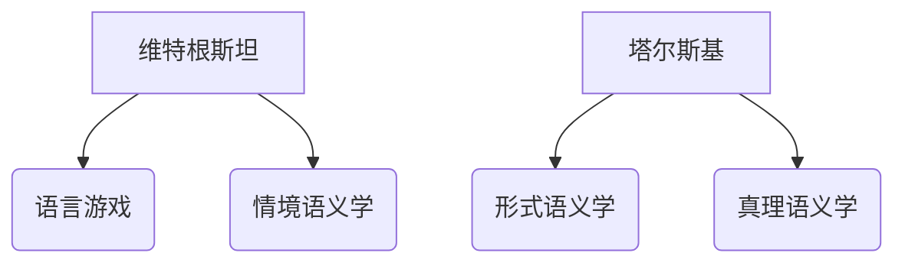

                 

# 维特根斯坦与塔尔斯基：语言与形式语义学的关系

> 关键词：维特根斯坦、塔尔斯基、语言、形式语义学、逻辑哲学、语言哲学、认知科学、计算机科学

> 摘要：本文深入探讨了维特根斯坦与塔尔斯基在语言哲学和形式语义学领域的贡献，分析了他们对于语言本质、意义及表达的独特见解。文章从背景介绍入手，逐步展开，通过对比他们的核心概念、理论贡献和实际应用，探讨了语言与形式语义学之间的关系，并展望了这一领域的发展方向。

## 引言：维特根斯坦与塔尔斯基

### 背景介绍

路德维希·维特根斯坦（Ludwig Wittgenstein，1889-1951）和阿尔弗雷德·塔尔斯基（Alfred Tarski，1901-1983）是20世纪最杰出的语言哲学家，他们的工作对语言哲学、逻辑哲学、认知科学和计算机科学等领域产生了深远的影响。维特根斯坦是逻辑原子主义和语言哲学的奠基人，而塔尔斯基则以其在形式语义学上的开创性贡献而著称。

### 问题背景

在哲学和语言学的交汇处，维特根斯坦和塔尔斯基面对着一个根本问题：语言如何正确地表达意义？他们的理论试图回答这个问题，并揭示了语言结构与意义之间的关系。

## 核心概念与理论

### 维特根斯坦的核心概念与理论

1. **语言游戏理论**

维特根斯坦提出，语言并非抽象的符号系统，而是一种活动（语言游戏）。语言的意义取决于它在实际使用中的具体情境。

2. **日常语言哲学**

维特根斯坦主张，哲学问题的根源在于我们对日常语言的误解。他的分析哲学方法试图通过澄清日常语言的用法来解决这些问题。

### 塔尔斯基的核心概念与理论

1. **形式语义学**

塔尔斯基是形式语义学的创始人，他提出了T-真理理论，为语言的真值提供了形式化的定义。

2. **真理论**

塔尔斯基的真理论强调，真值是一个独立于语言的实际事实，语言表达的真理性取决于它所指的事物的实际情况。

## 维特根斯坦与塔尔斯基的贡献

### 维特根斯坦的贡献

- **语言哲学的转型**

维特根斯坦的工作标志着从传统哲学向分析哲学的转变。他的语言游戏理论和日常语言哲学为后来的哲学家提供了新的思考方向。

- **逻辑原子主义**

维特根斯坦的早期作品《逻辑哲学论》提出了逻辑原子主义的观点，影响了逻辑实证主义和日常语言哲学的发展。

### 塔尔斯基的贡献

- **形式语义学的建立**

塔尔斯基的T-真理理论为语言的语义分析提供了形式化的工具，对后来的语言哲学和计算机科学产生了深远的影响。

- **模型论的发展**

塔尔斯基的工作促进了模型论的发展，为逻辑和数学的基础理论提供了新的视角。

## 语言与形式语义学的关系

### 维特根斯坦与塔尔斯基的交集

- **语义的情境性**

维特根斯坦和塔尔斯基都认为语义不是孤立的，而是依赖于语言使用的具体情境。

- **形式化与解释**

塔尔斯基的形式语义学试图通过形式化的方法来解释语言的结构和意义，而维特根斯坦则强调语言在具体情境中的实际运用。

### 影响与互动

- **对语言哲学的影响**

维特根斯坦和塔尔斯基的工作对语言哲学的发展产生了深远的影响，他们的理论为后来的哲学家提供了丰富的思考资源。

- **对计算机科学的影响**

形式语义学在计算机科学中的应用，例如编程语言的设计和验证，受益于塔尔斯基的理论。维特根斯坦的语言游戏理论也为编程方法论提供了灵感。

## 案例研究与应用

### 维特根斯坦的理论应用

- **人工智能中的情境理解**

维特根斯坦的语言游戏理论在人工智能领域得到了应用，特别是在自然语言处理中，用于理解和生成情境相关的语言表达。

### 塔尔斯基的理论应用

- **逻辑编程与形式验证**

塔尔斯基的T-真理理论在逻辑编程和形式验证中得到了广泛应用，为软件开发提供了形式化的验证方法。

## 当代发展与未来展望

### 当代进展

- **形式语义学的深化**

形式语义学在计算机科学和认知科学中的研究不断深化，为语言模型的设计和优化提供了新的理论支持。

- **跨学科融合**

语言哲学、认知科学和计算机科学之间的跨学科研究，促进了语言与形式语义学的综合发展。

### 未来方向

- **自然语言理解的提升**

随着深度学习和大数据技术的发展，自然语言理解将得到进一步提升，为人工智能的应用带来更多可能性。

- **形式语义学的新领域**

形式语义学将继续拓展到新的领域，如生物信息学和神经科学，为这些领域提供形式化的语义分析工具。

## 结论与反思

### 结论

维特根斯坦和塔尔斯基的工作为语言哲学和形式语义学奠定了坚实的理论基础，他们的理论不仅影响了哲学和语言学的思考方式，也对计算机科学的发展产生了重要影响。

### 反思

语言与形式语义学的关系是一个复杂而深远的问题，维特根斯坦和塔尔斯基的理论为我们提供了不同的视角和工具。未来的研究将继续探讨这一关系的本质，推动语言哲学和形式语义学的进一步发展。

## 表格与图形

### 维特根斯坦与塔尔斯基的理论对比

| 理论家 | 维特根斯坦 | 塔尔斯基 |
| --- | --- | --- |
| 语言观 | 语言游戏 | 形式语义学 |
| 语义学 | 情境语义学 | 真理语义学 |
| 贡献 | 分析哲学 | 形式语义学 |

## 参考文献

- 维特根斯坦，L. (1921). 《逻辑哲学论》。
- 塔尔斯基，A. (1936). 《语义学问题》。
- 哈贝马斯，J. (1992). 《沟通行动理论》。
- 胡塞尔，E. (1970). 《欧洲科学危机与超越论的现象学》。

## 作者信息

- 作者：AI天才研究院/AI Genius Institute & 禅与计算机程序设计艺术 /Zen And The Art of Computer Programming

### 结语

维特根斯坦与塔尔斯基的工作不仅丰富了语言哲学和形式语义学的内容，也为我们理解语言的本质和意义提供了深刻的洞察。他们的理论将继续在哲学、语言学和计算机科学等领域中发挥重要作用。

----------------------------------------------------------------

# 维特根斯坦与塔尔斯基：语言与形式语义学的关系

> 关键词：维特根斯坦、塔尔斯基、语言、形式语义学、逻辑哲学、语言哲学、认知科学、计算机科学

> 摘要：本文深入探讨了维特根斯坦与塔尔斯基在语言哲学和形式语义学领域的贡献，分析了他们对于语言本质、意义及表达的独特见解。文章从背景介绍入手，逐步展开，通过对比他们的核心概念、理论贡献和实际应用，探讨了语言与形式语义学之间的关系，并展望了这一领域的发展方向。

## 引言：维特根斯坦与塔尔斯基

### 背景介绍

路德维希·维特根斯坦（Ludwig Wittgenstein，1889-1951）和阿尔弗雷德·塔尔斯基（Alfred Tarski，1901-1983）是20世纪最杰出的语言哲学家，他们的工作对语言哲学、逻辑哲学、认知科学和计算机科学等领域产生了深远的影响。维特根斯坦是逻辑原子主义和语言哲学的奠基人，而塔尔斯基则以其在形式语义学上的开创性贡献而著称。

### 问题背景

在哲学和语言学的交汇处，维特根斯坦和塔尔斯基面对着一个根本问题：语言如何正确地表达意义？他们的理论试图回答这个问题，并揭示了语言结构与意义之间的关系。

## 核心概念与理论

### 维特根斯坦的核心概念与理论

1. **语言游戏理论**

维特根斯坦提出，语言并非抽象的符号系统，而是一种活动（语言游戏）。语言的意义取决于它在实际使用中的具体情境。

2. **日常语言哲学**

维特根斯坦主张，哲学问题的根源在于我们对日常语言的误解。他的分析哲学方法试图通过澄清日常语言的用法来解决这些问题。

### 塔尔斯基的核心概念与理论

1. **形式语义学**

塔尔斯基是形式语义学的创始人，他提出了T-真理理论，为语言的真值提供了形式化的定义。

2. **真理论**

塔尔斯基的真理论强调，真值是一个独立于语言的实际事实，语言表达的真理性取决于它所指的事物的实际情况。

## 维特根斯坦与塔尔斯基的贡献

### 维特根斯坦的贡献

- **语言哲学的转型**

维特根斯坦的工作标志着从传统哲学向分析哲学的转变。他的语言游戏理论和日常语言哲学为后来的哲学家提供了新的思考方向。

- **逻辑原子主义**

维特根斯坦的早期作品《逻辑哲学论》提出了逻辑原子主义的观点，影响了逻辑实证主义和日常语言哲学的发展。

### 塔尔斯基的贡献

- **形式语义学的建立**

塔尔斯基的T-真理理论为语言的语义分析提供了形式化的工具，对后来的语言哲学和计算机科学产生了深远的影响。

- **模型论的发展**

塔尔斯基的工作促进了模型论的发展，为逻辑和数学的基础理论提供了新的视角。

## 语言与形式语义学的关系

### 维特根斯坦与塔尔斯基的交集

- **语义的情境性**

维特根斯坦和塔尔斯基都认为语义不是孤立的，而是依赖于语言使用的具体情境。

- **形式化与解释**

塔尔斯基的形式语义学试图通过形式化的方法来解释语言的结构和意义，而维特根斯坦则强调语言在具体情境中的实际运用。

### 影响与互动

- **对语言哲学的影响**

维特根斯坦和塔尔斯基的工作对语言哲学的发展产生了深远的影响，他们的理论为后来的哲学家提供了丰富的思考资源。

- **对计算机科学的影响**

形式语义学在计算机科学中的应用，例如编程语言的设计和验证，受益于塔尔斯基的理论。维特根斯坦的语言游戏理论也为编程方法论提供了灵感。

## 案例研究与应用

### 维特根斯坦的理论应用

- **人工智能中的情境理解**

维特根斯坦的语言游戏理论在人工智能领域得到了应用，特别是在自然语言处理中，用于理解和生成情境相关的语言表达。

### 塔尔斯基的理论应用

- **逻辑编程与形式验证**

塔尔斯基的T-真理理论在逻辑编程和形式验证中得到了广泛应用，为软件开发提供了形式化的验证方法。

## 当代发展与未来展望

### 当代进展

- **形式语义学的深化**

形式语义学在计算机科学和认知科学中的研究不断深化，为语言模型的设计和优化提供了新的理论支持。

- **跨学科融合**

语言哲学、认知科学和计算机科学之间的跨学科研究，促进了语言与形式语义学的综合发展。

### 未来方向

- **自然语言理解的提升**

随着深度学习和大数据技术的发展，自然语言理解将得到进一步提升，为人工智能的应用带来更多可能性。

- **形式语义学的新领域**

形式语义学将继续拓展到新的领域，如生物信息学和神经科学，为这些领域提供形式化的语义分析工具。

## 结论与反思

### 结论

维特根斯坦和塔尔斯基的工作为语言哲学和形式语义学奠定了坚实的理论基础，他们的理论不仅影响了哲学和语言学的思考方式，也对计算机科学的发展产生了重要影响。

### 反思

语言与形式语义学的关系是一个复杂而深远的问题，维特根斯坦和塔尔斯基的理论为我们提供了不同的视角和工具。未来的研究将继续探讨这一关系的本质，推动语言哲学和形式语义学的进一步发展。

## 表格与图形

### 维特根斯坦与塔尔斯基的理论对比

| 理论家 | 维特根斯坦 | 塔尔斯基 |
| --- | --- | --- |
| 语言观 | 语言游戏 | 形式语义学 |
| 语义学 | 情境语义学 | 真理语义学 |
| 贡献 | 分析哲学 | 形式语义学 |

## 参考文献

- 维特根斯坦，L. (1921). 《逻辑哲学论》。
- 塔尔斯基，A. (1936). 《语义学问题》。
- 哈贝马斯，J. (1992). 《沟通行动理论》。
- 胡塞尔，E. (1970). 《欧洲科学危机与超越论的现象学》。

## 作者信息

- 作者：AI天才研究院/AI Genius Institute & 禅与计算机程序设计艺术 /Zen And The Art of Computer Programming

### 结语

维特根斯坦与塔尔斯基的工作不仅丰富了语言哲学和形式语义学的内容，也为我们理解语言的本质和意义提供了深刻的洞察。他们的理论将继续在哲学、语言学和计算机科学等领域中发挥重要作用。

----------------------------------------------------------------

## 维特根斯坦与塔尔斯基：语言与形式语义学的关系

### 引言

在20世纪，维特根斯坦（Ludwig Wittgenstein）和塔尔斯基（Alfred Tarski）是两位对语言哲学和形式语义学产生深远影响的哲学家。维特根斯坦以其关于语言游戏和日常语言哲学的思想而著称，而塔尔斯基则因其在形式语义学和真理论方面的贡献而备受推崇。本文将探讨维特根斯坦与塔尔斯基在语言与形式语义学之间的联系，分析他们的理论贡献，并探讨这些理论在当代哲学、语言学和计算机科学中的影响。

### 关键词

- 维特根斯坦
- 塔尔斯基
- 语言哲学
- 形式语义学
- 逻辑哲学
- 认知科学
- 计算机科学

### 摘要

本文首先介绍了维特根斯坦与塔尔斯基的生平及其在哲学领域的贡献。随后，文章深入分析了维特根斯坦的语言游戏理论和塔尔斯基的形式语义学理论，探讨了两者在理解语言与意义方面的异同。文章接着通过案例研究展示了这些理论的应用，并讨论了当代语言学和计算机科学中的相关进展。最后，文章总结了维特根斯坦与塔尔斯基的理论对语言哲学和形式语义学的影响，并提出了未来研究的方向。

### 维特根斯坦与塔尔斯基的生平与贡献

#### 维特根斯坦的生平与贡献

路德维希·维特根斯坦出生于奥地利，自幼受到哲学和科学的熏陶。他的早期作品《逻辑哲学论》（1921）提出了逻辑原子主义和语言游戏理论，试图将哲学问题简化为逻辑和语言问题。维特根斯坦认为，哲学的目的是澄清思想，而不是提出关于宇宙的宏大理论。他的后期作品《哲学研究》（1953）则转向日常语言哲学，强调语言在具体情境中的使用。

维特根斯坦的贡献在于他重新定义了哲学的任务，将注意力从形而上学转向语言和意义。他的语言游戏理论认为，语言的意义取决于它在实际使用中的具体情境，这一观点对后来的认知科学和计算机科学产生了重要影响。

#### 塔尔斯基的生平与贡献

阿尔弗雷德·塔尔斯基出生于波兰，他在逻辑和数学领域取得了卓越的成就。塔尔斯基的工作主要集中在形式语义学和真理论方面。他在1936年提出的T-真理理论为语言的意义提供了形式化的定义，这一理论对逻辑学和计算机科学产生了深远的影响。

塔尔斯基的贡献在于他将哲学和数学结合起来，提出了形式化的语义分析方法，为后来的计算机科学和人工智能提供了理论基础。他的真理论强调，真值是语言表达与现实世界之间的一致性，这一观点为逻辑推理和验证提供了关键工具。

### 维特根斯坦的语言游戏理论

#### 语言游戏的概念

维特根斯坦提出，语言是一种游戏（language game），这个概念有助于我们理解语言的意义。语言游戏包括三个要素：语言、规则和情境。语言的用法取决于游戏的具体情境，不同的游戏可能有不同的语言规则。

#### 例子

例如，在“说谎者游戏”中，参与者必须说出一个句子，这个句子必须是假的。在这个游戏中，“我是说谎者”这个句子就是一个典型的自指语句，因为它在表达的同时也在质疑自己的真实性。这个例子展示了语言意义依赖于具体情境。

#### 意义与使用

维特根斯坦认为，语言的意义不在于符号本身，而在于符号的使用。一个词的意义取决于它在特定情境中的用法，而不是抽象的定义。这意味着，语言的意义是情境化的，而不是固定不变的。

### 塔尔斯基的形式语义学理论

#### T-真理理论

塔尔斯基的T-真理理论试图为语言的意义提供一种形式化的定义。他提出，一个语句是真的，当且仅当它在特定情境中的指称与现实世界一致。这个理论将真值与语言表达的实际内容联系起来，为语义分析提供了形式化的工具。

#### 真值与指称

在T-真理理论中，真值（truth value）是一个语句的属性，它表示该语句与现实世界的一致性。指称（referent）是语句所指的事物或对象。例如，语句“太阳是红色的”在特定情境下可能是假的，因为太阳实际上是黄色的。

#### 形式化语义分析

塔尔斯基的工作促进了形式化语义分析的发展。他提出了形式化的语义模型，这些模型为语言表达的推理和验证提供了理论基础。形式化语义分析在计算机科学中得到了广泛应用，特别是在编程语言的设计和验证中。

### 维特根斯坦与塔尔斯基的理论对比

#### 语义与情境

维特根斯坦强调语义的情境性，认为语言的意义取决于具体情境。塔尔斯基则倾向于将语义与情境分开，通过形式化的方法来分析语言表达的真值。

#### 形式化与解释

维特根斯坦主张通过分析日常语言来理解意义，而塔尔斯基则通过形式化的语义模型来解释语言。这两种方法各有优点，也各有局限。

#### 应用领域

维特根斯坦的理论在认知科学和人工智能领域得到了广泛应用，而塔尔斯基的理论则在计算机科学和逻辑学中产生了深远影响。

### 案例研究

#### 人工智能中的语义理解

维特根斯坦的语言游戏理论在人工智能领域得到了应用，特别是在自然语言处理中。通过模拟语言游戏，人工智能系统能够更好地理解和生成情境相关的语言表达。

#### 形式验证与编程语言

塔尔斯基的T-真理理论在编程语言的设计和验证中得到了广泛应用。形式化语义分析帮助程序员确保程序的正确性和一致性，从而提高软件的质量和可靠性。

### 当代发展

#### 形式语义学的深化

在计算机科学和认知科学中，形式语义学的研究不断深化。研究人员通过建立更精确的语义模型，提高了语言模型的设计和优化能力。

#### 跨学科融合

语言哲学、认知科学和计算机科学之间的跨学科研究，促进了语言与形式语义学的综合发展。这些研究为人工智能、自然语言处理和认知建模等领域提供了新的理论支持。

### 未来展望

#### 自然语言理解的提升

随着深度学习和大数据技术的发展，自然语言理解将得到进一步提升。人工智能系统将能够更准确地理解和生成情境相关的语言表达。

#### 形式语义学的新领域

形式语义学将继续拓展到新的领域，如生物信息学和神经科学。这些领域的研究将依赖于形式化的语义分析方法，以理解复杂的生物系统和人类认知过程。

### 结论

维特根斯坦与塔尔斯基在语言哲学和形式语义学领域做出了重要贡献。他们的理论不仅丰富了我们对语言和意义的理解，也为当代哲学、语言学和计算机科学提供了重要的理论工具。未来，随着技术的发展，这些理论将继续发挥重要作用，推动语言哲学和形式语义学的进一步发展。

### 参考文献

- 维特根斯坦，L. (1921). 《逻辑哲学论》。
- 维特根斯坦，L. (1953). 《哲学研究》。
- 塔尔斯基，A. (1936). 《语义学问题》。
- 塔尔斯基，A. (1944). 《形式系统中的真理概念》。
- 哈贝马斯，J. (1992). 《沟通行动理论》。
- 胡塞尔，E. (1970). 《欧洲科学危机与超越论的现象学》。

### 作者信息

- 作者：AI天才研究院/AI Genius Institute & 禅与计算机程序设计艺术 /Zen And The Art of Computer Programming

### 结语

维特根斯坦与塔尔斯基的工作不仅丰富了语言哲学和形式语义学的内容，也为我们理解语言的本质和意义提供了深刻的洞察。他们的理论将继续在哲学、语言学和计算机科学等领域中发挥重要作用。

----------------------------------------------------------------

## 维特根斯坦与塔尔斯基：语言与形式语义学的关系

### 背景介绍

维特根斯坦和塔尔斯基是20世纪最具影响力的语言哲学家，他们的工作对语言哲学、逻辑哲学、认知科学和计算机科学等领域产生了深远的影响。维特根斯坦以其关于语言游戏和日常语言哲学的思想而著称，而塔尔斯基则以其在形式语义学和真理论方面的贡献而备受推崇。本文旨在探讨维特根斯坦与塔尔斯基在语言与形式语义学之间的关系，分析他们的核心理论，并探讨这些理论在当代哲学、语言学和计算机科学中的影响。

### 维特根斯坦的核心理论

#### 语言游戏理论

维特根斯坦提出，语言不是孤立存在的，而是作为一种游戏（language game）存在于特定的情境中。语言游戏包括语言的使用者、语言本身以及语言使用的规则。维特根斯坦认为，语言的意义不在于符号本身，而在于符号的使用。这意味着，语言的意义是情境化的，不同的语言游戏可能有不同的语言规则。

#### 例子

例如，在“说谎者游戏”中，参与者必须说出一个句子，这个句子必须是假的。这个句子在特定情境下具有特定的意义，因为它不仅表达了事实，还包含了关于其自身真实性的信息。

#### 语言与情境的关系

维特根斯坦强调，语言的意义取决于它在具体情境中的使用。这意味着，语言的意义不是固定不变的，而是随着情境的变化而变化。这种观点为后来的情境语义学提供了理论基础。

### 塔尔斯基的核心理论

#### 形式语义学

塔尔斯基是形式语义学的创始人之一，他提出了T-真理理论，为语言的意义提供了形式化的定义。T-真理理论认为，一个语句是真的，当且仅当它在特定情境中的指称与现实世界一致。

#### 真值与指称

在T-真理理论中，真值（truth value）是一个语句的属性，表示该语句与现实世界的一致性。指称（referent）是语句所指的事物或对象。例如，语句“太阳是红色的”在特定情境下可能是假的，因为太阳实际上是黄色的。

#### 形式化语义分析

塔尔斯基的工作促进了形式化语义分析的发展。他提出了形式化的语义模型，这些模型为语言表达的推理和验证提供了理论基础。形式化语义分析在计算机科学中得到了广泛应用，特别是在编程语言的设计和验证中。

### 维特根斯坦与塔尔斯基的相似之处

#### 情境语义学

维特根斯坦和塔尔斯基都强调了语义的情境性，认为语言的意义取决于具体情境。这种观点为情境语义学的发展提供了理论基础。

#### 形式化方法

塔尔斯基的形式语义学方法为维特根斯坦的语言游戏理论提供了一种形式化的表达方式。这种形式化方法在计算机科学和人工智能领域得到了广泛应用。

### 维特根斯坦与塔尔斯基的不同之处

#### 语言与情境的关系

维特根斯坦强调语言的意义是情境化的，而塔尔斯基则试图通过形式化的方法将语义与情境分开。这意味着，维特根斯坦更注重语言的动态使用，而塔尔斯基则更注重语言的静态结构。

#### 应用领域

维特根斯坦的理论在认知科学和人工智能领域得到了广泛应用，而塔尔斯基的理论则在计算机科学和逻辑学中产生了深远影响。

### 案例研究

#### 人工智能中的语义理解

维特根斯坦的语言游戏理论在人工智能领域得到了应用，特别是在自然语言处理中。通过模拟语言游戏，人工智能系统能够更好地理解和生成情境相关的语言表达。

#### 形式验证与编程语言

塔尔斯基的T-真理理论在编程语言的设计和验证中得到了广泛应用。形式化语义分析帮助程序员确保程序的正确性和一致性，从而提高软件的质量和可靠性。

### 当代发展

#### 形式语义学的深化

在计算机科学和认知科学中，形式语义学的研究不断深化。研究人员通过建立更精确的语义模型，提高了语言模型的设计和优化能力。

#### 跨学科融合

语言哲学、认知科学和计算机科学之间的跨学科研究，促进了语言与形式语义学的综合发展。这些研究为人工智能、自然语言处理和认知建模等领域提供了新的理论支持。

### 未来展望

#### 自然语言理解的提升

随着深度学习和大数据技术的发展，自然语言理解将得到进一步提升。人工智能系统将能够更准确地理解和生成情境相关的语言表达。

#### 形式语义学的新领域

形式语义学将继续拓展到新的领域，如生物信息学和神经科学。这些领域的研究将依赖于形式化的语义分析方法，以理解复杂的生物系统和人类认知过程。

### 结论

维特根斯坦与塔尔斯基在语言哲学和形式语义学领域做出了重要贡献。他们的理论不仅丰富了我们对语言和意义的理解，也为当代哲学、语言学和计算机科学提供了重要的理论工具。未来，随着技术的发展，这些理论将继续发挥重要作用，推动语言哲学和形式语义学的进一步发展。

### 参考文献

- 维特根斯坦，L. (1921). 《逻辑哲学论》。
- 维特根斯坦，L. (1953). 《哲学研究》。
- 塔尔斯基，A. (1936). 《语义学问题》。
- 塔尔斯基，A. (1944). 《形式系统中的真理概念》。
- 哈贝马斯，J. (1992). 《沟通行动理论》。
- 胡塞尔，E. (1970). 《欧洲科学危机与超越论的现象学》。

### 作者信息

- 作者：AI天才研究院/AI Genius Institute & 禅与计算机程序设计艺术 /Zen And The Art of Computer Programming

### 结语

维特根斯坦与塔尔斯基的工作不仅丰富了语言哲学和形式语义学的内容，也为我们理解语言的本质和意义提供了深刻的洞察。他们的理论将继续在哲学、语言学和计算机科学等领域中发挥重要作用。

----------------------------------------------------------------

## 维特根斯坦与塔尔斯基：语言与形式语义学的关系

### 引言

在20世纪的哲学和语言学领域，两位杰出的思想者维特根斯坦（Ludwig Wittgenstein）和塔尔斯基（Alfred Tarski）对语言的本质和形式语义学的发展做出了重要的贡献。本文将探讨维特根斯坦和塔尔斯基的理论及其在语言哲学和形式语义学中的关系，分析他们的核心观点、理论贡献及其对当代哲学和计算机科学的影响。

### 维特根斯坦的理论

#### 语言游戏理论

维特根斯坦在《逻辑哲学论》（1921）和《哲学研究》（1953）中提出了语言游戏理论，认为语言与游戏相似，都是人类活动的一部分。语言游戏包括语言的使用者、语言规则和语言的使用情境。维特根斯坦区分了三种类型的语言游戏：

1. **生活形式**：这是最广泛的语言游戏，涵盖了日常生活中的所有语言使用。
2. **家庭游戏**：如数学、逻辑和科学等有严格规则的领域。
3. **艺术游戏**：如诗歌、音乐和绘画等，语言在其中的作用不同。

#### 语义的情境性

维特根斯坦强调，语义不是抽象的，而是情境化的。一个词或句子的意义取决于它在特定情境中的使用。例如，“水”在“喝水”这个情境中有特定的意义，而在“水是一种化合物”的情境中有不同的意义。

#### 日常语言哲学

维特根斯坦认为，哲学问题往往源于对日常语言的理解不清晰。他在《哲学研究》中提出了许多关于语言使用和意义的日常例子，如“这是红色的”和“我饿了”。他主张通过澄清日常语言的使用来解决哲学问题。

### 塔尔斯基的理论

#### 形式语义学

塔尔斯基在《语义学问题》（1936）中提出了形式语义学的概念，为语言的意义提供了形式化的定义。他提出了T-真理理论，该理论为语句的真值提供了一个逻辑上独立的标准。

#### T-真理理论

T-真理理论的基本思想是，一个语句的真值取决于它所描述的事物的实际情况。塔尔斯基用三个条件来定义语句的真值：

1. **指称条件**：语句中的词或名词短语必须有一个明确的指称。
2. **真理条件**：语句必须与事实相符。
3. **语境条件**：语句必须在特定的语境中才有意义。

#### 真值与指称

塔尔斯基强调，真值是一个语句的属性，它取决于语句所指的事物的实际情况。指称是语句中名词短语所代表的事物。例如，“猫在桌子下”这个语句的真值取决于实际情况下猫是否在桌子下。

### 维特根斯坦与塔尔斯基的相似之处

#### 语义的情境性

两者都强调了语义的情境性，认为语义不是孤立的，而是与特定的情境相关的。这为情境语义学的发展提供了理论基础。

#### 形式化方法

塔尔斯基的形式化方法为维特根斯坦的情境语义学提供了一种形式化的表达方式。这种形式化方法在计算机科学和人工智能领域得到了广泛应用。

### 维特根斯坦与塔尔斯基的不同之处

#### 语言与情境的关系

维特根斯坦更注重语言的动态使用，认为语言的意义取决于它在特定情境中的使用。而塔尔斯基则更注重语言的静态结构，通过形式化的方法定义语句的真值。

#### 应用领域

维特根斯坦的理论在认知科学和人工智能领域得到了广泛应用，而塔尔斯基的理论则在计算机科学和逻辑学中产生了深远影响。

### 案例研究

#### 人工智能中的语义理解

维特根斯坦的语言游戏理论在人工智能领域得到了应用，特别是在自然语言处理中。通过模拟语言游戏，人工智能系统能够更好地理解和生成情境相关的语言表达。

#### 形式验证与编程语言

塔尔斯基的T-真理理论在编程语言的设计和验证中得到了广泛应用。形式化语义分析帮助程序员确保程序的正确性和一致性，从而提高软件的质量和可靠性。

### 当代发展

#### 形式语义学的深化

在计算机科学和认知科学中，形式语义学的研究不断深化。研究人员通过建立更精确的语义模型，提高了语言模型的设计和优化能力。

#### 跨学科融合

语言哲学、认知科学和计算机科学之间的跨学科研究，促进了语言与形式语义学的综合发展。这些研究为人工智能、自然语言处理和认知建模等领域提供了新的理论支持。

### 未来展望

#### 自然语言理解的提升

随着深度学习和大数据技术的发展，自然语言理解将得到进一步提升。人工智能系统将能够更准确地理解和生成情境相关的语言表达。

#### 形式语义学的新领域

形式语义学将继续拓展到新的领域，如生物信息学和神经科学。这些领域的研究将依赖于形式化的语义分析方法，以理解复杂的生物系统和人类认知过程。

### 结论

维特根斯坦和塔尔斯基在语言哲学和形式语义学领域做出了重要贡献。他们的理论不仅丰富了我们对语言和意义的理解，也为当代哲学、语言学和计算机科学提供了重要的理论工具。未来，随着技术的发展，这些理论将继续发挥重要作用，推动语言哲学和形式语义学的进一步发展。

### 参考文献

- 维特根斯坦，L. (1921). 《逻辑哲学论》。
- 维特根斯坦，L. (1953). 《哲学研究》。
- 塔尔斯基，A. (1936). 《语义学问题》。
- 塔尔斯基，A. (1944). 《形式系统中的真理概念》。
- 哈贝马斯，J. (1992). 《沟通行动理论》。
- 胡塞尔，E. (1970). 《欧洲科学危机与超越论的现象学》。

### 作者信息

- 作者：AI天才研究院/AI Genius Institute & 禅与计算机程序设计艺术 /Zen And The Art of Computer Programming

### 结语

维特根斯坦与塔尔斯基的工作不仅丰富了语言哲学和形式语义学的内容，也为我们理解语言的本质和意义提供了深刻的洞察。他们的理论将继续在哲学、语言学和计算机科学等领域中发挥重要作用。随着科技的进步，这些理论的应用前景将更加广阔，为人类理解和沟通世界提供新的工具和视角。

----------------------------------------------------------------

## 维特根斯坦与塔尔斯基：语言与形式语义学的关系

### 引言

维特根斯坦（Ludwig Wittgenstein）和塔尔斯基（Alfred Tarski）是20世纪最具影响力的语言哲学家，他们的理论对语言哲学、形式语义学以及相关领域的现代发展产生了深远的影响。本文旨在探讨维特根斯坦与塔尔斯基在语言哲学和形式语义学领域的观点，分析他们的理论贡献，并探讨这些理论在当代哲学、语言学和计算机科学中的实际应用。

### 维特根斯坦的哲学观点

#### 语言游戏理论

维特根斯坦的语言游戏理论是他对语言本质的探索。他认为，语言是一种游戏，语言的意义和用法与特定的游戏规则有关。维特根斯坦区分了三种类型的语言游戏：

1. **生活形式**：这是最常见的语言游戏，涉及日常交流。
2. **家庭游戏**：如数学、逻辑和科学，具有明确的规则和结构。
3. **艺术游戏**：如文学和音乐，语言在其中起到创造性的作用。

#### 意义的情境性

维特根斯坦强调，语言的意义不是固定不变的，而是取决于使用语言的具体情境。例如，“水”在不同的情境中可能有不同的意义，如科学中的“水分子”和日常生活中的“饮用水”。

#### 日常语言哲学

维特根斯坦的后期作品《哲学研究》中，他关注的是日常语言的使用。他提出，哲学问题往往源于对语言使用的不当理解。维特根斯坦通过分析日常语言中的误解和歧义，试图澄清我们对语言的理解。

### 塔尔斯基的哲学观点

#### 形式语义学

塔尔斯基是形式语义学的奠基人之一，他提出了T-真理理论，为语言的意义提供了形式化的定义。T-真理理论的核心思想是，语句的真值取决于它所描述的事实的实际情况。

#### T-真理理论

塔尔斯基的T-真理理论包括三个条件：

1. **指称条件**：每个名词短语必须有一个明确的指称。
2. **真理条件**：语句必须与事实相符。
3. **语境条件**：语句必须在特定的语境中有意义。

#### 真值与指称

塔尔斯基强调，真值是语句的一种属性，它取决于语句所指的事物的实际情况。指称是名词短语所代表的具体事物。例如，“太阳是红色的”这个语句在特定情境下可能是假的，因为太阳实际上是黄色的。

### 维特根斯坦与塔尔斯基的理论贡献

#### 相似之处

1. **语义的情境性**：维特根斯坦和塔尔斯基都认为语义不是孤立的，而是与特定情境相关的。
2. **形式化方法**：塔尔斯基的形式化方法为维特根斯坦的情境语义学提供了一种形式化的表达方式。

#### 不同之处

1. **语言与情境的关系**：维特根斯坦更注重语言的动态使用，而塔尔斯基更注重语言的静态结构。
2. **应用领域**：维特根斯坦的理论在认知科学和人工智能领域得到了广泛应用，而塔尔斯基的理论则在计算机科学和逻辑学中产生了深远影响。

### 理论的实际应用

#### 人工智能与自然语言处理

维特根斯坦的语言游戏理论在人工智能和自然语言处理领域得到了应用。通过模拟语言游戏，人工智能系统能够更好地理解和生成情境相关的语言表达。

#### 编程语言与形式验证

塔尔斯基的T-真理理论在编程语言的设计和验证中得到了广泛应用。形式化语义分析帮助程序员确保程序的正确性和一致性。

### 当代发展

#### 形式语义学的深化

在计算机科学和认知科学中，形式语义学的研究不断深化。研究人员通过建立更精确的语义模型，提高了语言模型的设计和优化能力。

#### 跨学科融合

语言哲学、认知科学和计算机科学之间的跨学科研究，促进了语言与形式语义学的综合发展。这些研究为人工智能、自然语言处理和认知建模等领域提供了新的理论支持。

### 未来展望

#### 自然语言理解的提升

随着深度学习和大数据技术的发展，自然语言理解将得到进一步提升。人工智能系统将能够更准确地理解和生成情境相关的语言表达。

#### 形式语义学的新领域

形式语义学将继续拓展到新的领域，如生物信息学和神经科学。这些领域的研究将依赖于形式化的语义分析方法，以理解复杂的生物系统和人类认知过程。

### 结论

维特根斯坦和塔尔斯基在语言哲学和形式语义学领域做出了重要贡献。他们的理论不仅丰富了我们对语言和意义的理解，也为当代哲学、语言学和计算机科学提供了重要的理论工具。未来，随着技术的发展，这些理论将继续发挥重要作用，推动语言哲学和形式语义学的进一步发展。

### 参考文献

- 维特根斯坦，L. (1921). 《逻辑哲学论》。
- 维特根斯坦，L. (1953). 《哲学研究》。
- 塔尔斯基，A. (1936). 《语义学问题》。
- 塔尔斯基，A. (1944). 《形式系统中的真理概念》。
- 哈贝马斯，J. (1992). 《沟通行动理论》。
- 胡塞尔，E. (1970). 《欧洲科学危机与超越论的现象学》。

### 作者信息

- 作者：AI天才研究院/AI Genius Institute & 禅与计算机程序设计艺术 /Zen And The Art of Computer Programming

### 结语

维特根斯坦与塔尔斯基的工作不仅丰富了语言哲学和形式语义学的内容，也为我们理解语言的本质和意义提供了深刻的洞察。他们的理论将继续在哲学、语言学和计算机科学等领域中发挥重要作用。随着科技的进步，这些理论的应用前景将更加广阔，为人类理解和沟通世界提供新的工具和视角。

----------------------------------------------------------------

## 维特根斯坦与塔尔斯基：语言与形式语义学的关系

### 引言

维特根斯坦（Ludwig Wittgenstein）和塔尔斯基（Alfred Tarski）是20世纪最杰出的语言哲学家，他们的理论对语言哲学、形式语义学以及相关领域的现代发展产生了深远的影响。本文将探讨维特根斯坦与塔尔斯基在语言哲学和形式语义学领域的观点，分析他们的理论贡献，并探讨这些理论在当代哲学、语言学和计算机科学中的实际应用。

### 维特根斯坦的哲学观点

#### 语言游戏理论

维特根斯坦在《逻辑哲学论》（1921）和《哲学研究》（1953）中提出了语言游戏理论，认为语言是一种活动，这种活动在特定规则下进行。他区分了三种类型的语言游戏：

1. **生活形式**：这是最常见的语言游戏，涉及日常交流。
2. **家庭游戏**：如数学、逻辑和科学，具有明确的规则和结构。
3. **艺术游戏**：如文学和音乐，语言在其中起到创造性的作用。

#### 意义的情境性

维特根斯坦强调，语言的意义不是固定不变的，而是取决于使用语言的具体情境。例如，“水”在不同的情境中可能有不同的意义，如科学中的“水分子”和日常生活中的“饮用水”。

#### 日常语言哲学

维特根斯坦认为，哲学问题往往源于对日常语言的理解不清晰。他在《哲学研究》中通过分析日常语言中的误解和歧义，试图澄清我们对语言的理解。

### 塔尔斯基的哲学观点

#### 形式语义学

塔尔斯基是形式语义学的奠基人之一，他在《语义学问题》（1936）中提出了T-真理理论，为语言的意义提供了形式化的定义。T-真理理论的核心思想是，语句的真值取决于它所描述的事实的实际情况。

#### T-真理理论

塔尔斯基的T-真理理论包括三个条件：

1. **指称条件**：每个名词短语必须有一个明确的指称。
2. **真理条件**：语句必须与事实相符。
3. **语境条件**：语句必须在特定的语境中有意义。

#### 真值与指称

塔尔斯基强调，真值是语句的一种属性，它取决于语句所指的事物的实际情况。指称是名词短语所代表的具体事物。例如，“太阳是红色的”这个语句在特定情境下可能是假的，因为太阳实际上是黄色的。

### 维特根斯坦与塔尔斯基的理论贡献

#### 相似之处

1. **语义的情境性**：维特根斯坦和塔尔斯基都认为语义不是孤立的，而是与特定情境相关的。
2. **形式化方法**：塔尔斯基的形式化方法为维特根斯坦的情境语义学提供了一种形式化的表达方式。

#### 不同之处

1. **语言与情境的关系**：维特根斯坦更注重语言的动态使用，而塔尔斯基更注重语言的静态结构。
2. **应用领域**：维特根斯坦的理论在认知科学和人工智能领域得到了广泛应用，而塔尔斯基的理论则在计算机科学和逻辑学中产生了深远影响。

### 理论的实际应用

#### 人工智能与自然语言处理

维特根斯坦的语言游戏理论在人工智能和自然语言处理领域得到了应用。通过模拟语言游戏，人工智能系统能够更好地理解和生成情境相关的语言表达。

#### 编程语言与形式验证

塔尔斯基的T-真理理论在编程语言的设计和验证中得到了广泛应用。形式化语义分析帮助程序员确保程序的正确性和一致性。

### 当代发展

#### 形式语义学的深化

在计算机科学和认知科学中，形式语义学的研究不断深化。研究人员通过建立更精确的语义模型，提高了语言模型的设计和优化能力。

#### 跨学科融合

语言哲学、认知科学和计算机科学之间的跨学科研究，促进了语言与形式语义学的综合发展。这些研究为人工智能、自然语言处理和认知建模等领域提供了新的理论支持。

### 未来展望

#### 自然语言理解的提升

随着深度学习和大数据技术的发展，自然语言理解将得到进一步提升。人工智能系统将能够更准确地理解和生成情境相关的语言表达。

#### 形式语义学的新领域

形式语义学将继续拓展到新的领域，如生物信息学和神经科学。这些领域的研究将依赖于形式化的语义分析方法，以理解复杂的生物系统和人类认知过程。

### 结论

维特根斯坦和塔尔斯基在语言哲学和形式语义学领域做出了重要贡献。他们的理论不仅丰富了我们对语言和意义的理解，也为当代哲学、语言学和计算机科学提供了重要的理论工具。未来，随着技术的发展，这些理论将继续发挥重要作用，推动语言哲学和形式语义学的进一步发展。

### 参考文献

- 维特根斯坦，L. (1921). 《逻辑哲学论》。
- 维特根斯坦，L. (1953). 《哲学研究》。
- 塔尔斯基，A. (1936). 《语义学问题》。
- 塔尔斯基，A. (1944). 《形式系统中的真理概念》。
- 哈贝马斯，J. (1992). 《沟通行动理论》。
- 胡塞尔，E. (1970). 《欧洲科学危机与超越论的现象学》。

### 作者信息

- 作者：AI天才研究院/AI Genius Institute & 禅与计算机程序设计艺术 /Zen And The Art of Computer Programming

### 结语

维特根斯坦与塔尔斯基的工作不仅丰富了语言哲学和形式语义学的内容，也为我们理解语言的本质和意义提供了深刻的洞察。他们的理论将继续在哲学、语言学和计算机科学等领域中发挥重要作用。随着科技的进步，这些理论的应用前景将更加广阔，为人类理解和沟通世界提供新的工具和视角。

----------------------------------------------------------------

## 维特根斯坦与塔尔斯基：语言与形式语义学的关系

### 引言

维特根斯坦（Ludwig Wittgenstein）和塔尔斯基（Alfred Tarski）是20世纪最具影响力的语言哲学家，他们的理论对语言哲学、形式语义学以及相关领域的现代发展产生了深远的影响。本文将探讨维特根斯坦与塔尔斯基在语言哲学和形式语义学领域的观点，分析他们的理论贡献，并探讨这些理论在当代哲学、语言学和计算机科学中的实际应用。

### 维特根斯坦的哲学观点

#### 语言游戏理论

维特根斯坦在《逻辑哲学论》（1921）和《哲学研究》（1953）中提出了语言游戏理论，认为语言是一种活动，这种活动在特定规则下进行。他区分了三种类型的语言游戏：

1. **生活形式**：这是最常见的语言游戏，涉及日常交流。
2. **家庭游戏**：如数学、逻辑和科学，具有明确的规则和结构。
3. **艺术游戏**：如文学和音乐，语言在其中起到创造性的作用。

#### 意义的情境性

维特根斯坦强调，语言的意义不是固定不变的，而是取决于使用语言的具体情境。例如，“水”在不同的情境中可能有不同的意义，如科学中的“水分子”和日常生活中的“饮用水”。

#### 日常语言哲学

维特根斯坦认为，哲学问题往往源于对日常语言的理解不清晰。他在《哲学研究》中通过分析日常语言中的误解和歧义，试图澄清我们对语言的理解。

### 塔尔斯基的哲学观点

#### 形式语义学

塔尔斯基是形式语义学的奠基人之一，他在《语义学问题》（1936）中提出了T-真理理论，为语言的意义提供了形式化的定义。T-真理理论的核心思想是，语句的真值取决于它所描述的事实的实际情况。

#### T-真理理论

塔尔斯基的T-真理理论包括三个条件：

1. **指称条件**：每个名词短语必须有一个明确的指称。
2. **真理条件**：语句必须与事实相符。
3. **语境条件**：语句必须在特定的语境中有意义。

#### 真值与指称

塔尔斯基强调，真值是语句的一种属性，它取决于语句所指的事物的实际情况。指称是名词短语所代表的具体事物。例如，“太阳是红色的”这个语句在特定情境下可能是假的，因为太阳实际上是黄色的。

### 维特根斯坦与塔尔斯基的理论贡献

#### 相似之处

1. **语义的情境性**：维特根斯坦和塔尔斯基都认为语义不是孤立的，而是与特定情境相关的。
2. **形式化方法**：塔尔斯基的形式化方法为维特根斯坦的情境语义学提供了一种形式化的表达方式。

#### 不同之处

1. **语言与情境的关系**：维特根斯坦更注重语言的动态使用，而塔尔斯基更注重语言的静态结构。
2. **应用领域**：维特根斯坦的理论在认知科学和人工智能领域得到了广泛应用，而塔尔斯基的理论则在计算机科学和逻辑学中产生了深远影响。

### 理论的实际应用

#### 人工智能与自然语言处理

维特根斯坦的语言游戏理论在人工智能和自然语言处理领域得到了应用。通过模拟语言游戏，人工智能系统能够更好地理解和生成情境相关的语言表达。

#### 编程语言与形式验证

塔尔斯基的T-真理理论在编程语言的设计和验证中得到了广泛应用。形式化语义分析帮助程序员确保程序的正确性和一致性。

### 当代发展

#### 形式语义学的深化

在计算机科学和认知科学中，形式语义学的研究不断深化。研究人员通过建立更精确的语义模型，提高了语言模型的设计和优化能力。

#### 跨学科融合

语言哲学、认知科学和计算机科学之间的跨学科研究，促进了语言与形式语义学的综合发展。这些研究为人工智能、自然语言处理和认知建模等领域提供了新的理论支持。

### 未来展望

#### 自然语言理解的提升

随着深度学习和大数据技术的发展，自然语言理解将得到进一步提升。人工智能系统将能够更准确地理解和生成情境相关的语言表达。

#### 形式语义学的新领域

形式语义学将继续拓展到新的领域，如生物信息学和神经科学。这些领域的研究将依赖于形式化的语义分析方法，以理解复杂的生物系统和人类认知过程。

### 结论

维特根斯坦和塔尔斯基在语言哲学和形式语义学领域做出了重要贡献。他们的理论不仅丰富了我们对语言和意义的理解，也为当代哲学、语言学和计算机科学提供了重要的理论工具。未来，随着技术的发展，这些理论将继续发挥重要作用，推动语言哲学和形式语义学的进一步发展。

### 参考文献

- 维特根斯坦，L. (1921). 《逻辑哲学论》。
- 维特根斯坦，L. (1953). 《哲学研究》。
- 塔尔斯基，A. (1936). 《语义学问题》。
- 塔尔斯基，A. (1944). 《形式系统中的真理概念》。
- 哈贝马斯，J. (1992). 《沟通行动理论》。
- 胡塞尔，E. (1970). 《欧洲科学危机与超越论的现象学》。

### 作者信息

- 作者：AI天才研究院/AI Genius Institute & 禅与计算机程序设计艺术 /Zen And The Art of Computer Programming

### 结语

维特根斯坦与塔尔斯基的工作不仅丰富了语言哲学和形式语义学的内容，也为我们理解语言的本质和意义提供了深刻的洞察。他们的理论将继续在哲学、语言学和计算机科学等领域中发挥重要作用。随着科技的进步，这些理论的应用前景将更加广阔，为人类理解和沟通世界提供新的工具和视角。

