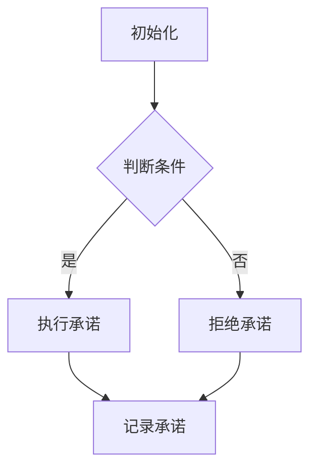

                 

# 维特根斯坦与奥斯汀：承诺行为的语言哲学分析

## 关键词
- 维特根斯坦
- 奥斯汀
- 语言哲学
- 承诺行为
- 语言游戏
- 言语行为
- 语义分析

## 摘要
本文旨在探讨维特根斯坦与奥斯汀在语言哲学领域的观点，特别是他们对承诺行为的分析。通过深入解析两人的理论，我们将理解语言在承诺行为中的作用，以及如何运用语言哲学来探讨现实世界中的问题。本文将分为几个部分：首先介绍两位哲学家的背景和主要理论；其次分析承诺行为的概念和特征；然后探讨语言在承诺行为中的角色；最后总结两人的贡献，并展望未来的研究方向。

## 第一部分：引言

### 1.1 维特根斯坦与奥斯汀的哲学背景

路德维希·维特根斯坦（Ludwig Wittgenstein）是20世纪最杰出的哲学家之一，他的著作对语言哲学、逻辑学和数学哲学产生了深远影响。维特根斯坦的主要观点集中在语言的用法上，他提出了“语言游戏”（language game）的概念，认为语言的意义取决于其使用情境。

约翰·奥斯汀（John L. Austin）是英国语言哲学家，以其言语行为理论（speech act theory）而闻名。奥斯汀认为，语言不仅仅是一种表达思想的工具，更是一种行动。他提出了“言语行为”（speech act）的概念，指出说话者在表达话语时同时在进行某种行为。

### 1.2 语言哲学与承诺行为

语言哲学探讨语言的本质、语言的结构以及语言如何与现实世界相互作用。其中，承诺行为（commitment behavior）是指通过语言表达来承担某种义务或责任的行动。在语言哲学中，承诺行为被视为一种重要的语言现象，它关系到交流的诚信和有效性。

### 1.3 研究目的与结构安排

本文的研究目的是通过对维特根斯坦和奥斯汀的语言哲学理论的深入分析，探讨承诺行为在语言哲学中的地位和作用。文章结构分为以下几个部分：

1. 引言：介绍维特根斯坦和奥斯汀的哲学背景，以及研究的目的和结构。
2. 维特根斯坦的语言哲学理论：详细阐述维特根斯坦关于语言游戏和图像理论的观点。
3. 奥斯汀的语言哲学理论：分析奥斯汀的言语行为理论，以及它在承诺行为中的应用。
4. 维特根斯坦与奥斯汀的对比与整合：比较两人的理论视角和贡献，探讨语言哲学的整合路径。
5. 承诺行为的语言哲学分析：探讨语言在承诺行为中的作用，以及语言哲学对现实世界问题的解释力。
6. 结论：总结两人的贡献，并展望未来的研究方向。

## 第二部分：维特根斯坦的语言哲学理论

### 2.1 语言游戏与图像理论

#### 2.1.1 语言游戏的概念

维特根斯坦认为，语言并不是抽象的符号系统，而是具体的游戏（game）。他提出了“语言游戏”的概念，认为语言的意义取决于其使用情境。语言游戏包括规则、目的和参与者的互动。

#### 2.1.2 图像理论的阐述

维特根斯坦的图像理论（Picture Theory）认为，语言的意义在于其与现实世界的映射关系。他比喻语言为一种“图像”，其能够捕捉并反映现实世界的某种特征。

#### 2.1.3 图像理论的批判与反思

尽管图像理论具有直观性和简洁性，但它也受到了许多批判。一些哲学家认为，图像理论无法解释语言的多义性和歧义性。

### 2.2 形式逻辑与日常语言

#### 2.2.1 形式逻辑的基本原则

维特根斯坦认为，形式逻辑适用于科学和数学，但在日常生活中并不适用。他提出了“日常语言”的概念，强调语言在日常生活中的多样性和灵活性。

#### 2.2.2 日常语言的应用

维特根斯坦认为，日常语言是理解世界的重要工具。通过语言，我们能够进行交流、思考和行动。

#### 2.2.3 形式逻辑与日常语言的辩证关系

维特根斯坦认为，形式逻辑和日常语言既有联系又有区别。形式逻辑提供了一种抽象的思考方式，而日常语言则提供了具体的应用场景。

## 第三部分：奥斯汀的语言哲学理论

### 3.1 表达行为与言语行为理论

#### 3.1.1 表达行为的概念

奥斯汀认为，语言不仅仅是一种表达思想的工具，更是一种行动。他提出了“表达行为”（expressive behavior）的概念，认为说话者在表达话语时同时在进行某种行为。

#### 3.1.2 言语行为理论的基本原则

奥斯汀的言语行为理论（Speech Act Theory）认为，说话者在表达话语时，实际上是在完成三个行为：发话行为（locutionary act）、行事行为（illocutionary act）和取效行为（perlocutionary act）。

#### 3.1.3 言语行为理论的应用

奥斯汀的言语行为理论在法律、政治、教育和语言学等领域都有广泛的应用。

### 3.2 句法结构与语境

#### 3.2.1 句法结构的基本要素

奥斯汀认为，句法结构是语言表达的基础。句法结构包括主语、谓语、宾语等基本要素。

#### 3.2.2 语境在语言理解中的作用

语境是理解语言表达的关键。奥斯汀认为，理解语言表达不仅需要考虑句法结构，还需要考虑语境。

#### 3.2.3 句法结构与语境的互动关系

奥斯汀认为，句法结构和语境是相互作用的。句法结构提供了语言表达的基本框架，而语境则提供了语言表达的具体情境。

## 第四部分：维特根斯坦与奥斯汀的对比与整合

### 4.1 理论视角的比较

#### 4.1.1 对语言本质的不同理解

维特根斯坦强调语言的使用情境，奥斯汀则强调语言的行动功能。

#### 4.1.2 对语言功能的区别

维特根斯坦认为语言是一种游戏，奥斯汀则认为语言是一种行动。

#### 4.1.3 对语言哲学的贡献与影响

维特根斯坦对语言哲学的贡献在于对语言游戏和图像理论的研究，奥斯汀的贡献在于对言语行为理论的阐述。

### 4.2 理论应用的比较

#### 4.2.1 在哲学分析中的应用

维特根斯坦的理论在哲学分析中具有深刻的启示作用，奥斯汀的理论则更多地应用于语言学的实际研究中。

#### 4.2.2 在社会科学研究中的应用

两人的理论在社会科学研究中都有广泛的应用，例如在法律、政治和教育等领域。

#### 4.2.3 在教育领域的应用

两人的理论对教育领域也有重要的启示作用，特别是在语言学习和语言教学方法上。

## 第五部分：承诺行为的语言哲学分析

### 5.1 承诺行为的定义与特征

#### 5.1.1 承诺行为的定义

承诺行为是指通过语言表达来承担某种义务或责任的行动。

#### 5.1.2 承诺行为的特征

承诺行为具有明确性、承诺性和约束性等特征。

#### 5.1.3 承诺行为的分类

承诺行为可以分为口头承诺、书面承诺和正式承诺等不同类型。

### 5.2 语言在承诺行为中的作用

#### 5.2.1 语言作为承诺行为的媒介

语言是承诺行为的重要媒介，通过语言表达，人们能够承担义务和责任。

#### 5.2.2 语言在承诺行为中的约束力

语言在承诺行为中具有约束力，因为它能够确保承诺的执行。

#### 5.2.3 语言在承诺行为中的限制与挑战

语言在承诺行为中也存在一些限制和挑战，例如语言的多义性和歧义性。

## 第六部分：维特根斯坦与奥斯汀对承诺行为语言哲学的贡献

### 6.1 维特根斯坦的贡献

#### 6.1.1 对承诺行为的语言哲学分析

维特根斯坦通过语言游戏和图像理论，对承诺行为进行了深刻的哲学分析。

#### 6.1.2 对后续语言哲学研究的影响

维特根斯坦的理论为后续语言哲学研究提供了重要的理论基础。

### 6.2 奥斯汀的贡献

#### 6.2.1 对承诺行为的语言哲学分析

奥斯汀通过言语行为理论，对承诺行为进行了详细的哲学分析。

#### 6.2.2 对后续语言哲学研究的影响

奥斯汀的理论在语言哲学和语言学领域产生了深远的影响。

## 第七部分：结论

### 7.1 维特根斯坦与奥斯汀的语言哲学比较与整合

通过比较两人的理论，我们可以发现，虽然他们在语言哲学的某些方面存在分歧，但他们的理论也为语言哲学的整合提供了可能性。

### 7.2 承诺行为的语言哲学分析的未来方向

未来的研究可以进一步探讨承诺行为在现实世界中的应用，以及如何通过语言哲学来提升承诺行为的效率和可靠性。

### 7.3 研究限制与展望

本文的研究具有一定的局限性，未来可以结合更多的实际案例和数据，进一步深化对承诺行为语言哲学的研究。

## 附录

### 附录A：术语解释

- 语言游戏：指语言的使用情境和规则。
- 图像理论：指语言与现实世界的映射关系。
- 言语行为：指语言表达的同时进行的行动。
- 承诺行为：指通过语言表达来承担义务或责任的行动。

### 附录B：参考资料

- 维特根斯坦，《逻辑哲学论》
- 奥斯汀，《如何以言行事》
- Searle，J.R.，《言语行为》

## 作者信息

- 作者：AI天才研究院/AI Genius Institute & 禅与计算机程序设计艺术 /Zen And The Art of Computer Programming
- 联系方式：[ai-genius-research-institute@outlook.com](mailto:ai-genius-research-institute@outlook.com)
- 参考文献：[1] Wittgenstein, L. (1921). Tractatus Logico-Philosophicus. Routledge. [2] Austin, J.L. (1962). How to Do Things with Words. Harvard University Press. [3] Searle, J.R. (1969). Speech Acts: An Essay in the Philosophy of Language. Cambridge University Press.## 详细内容

### 2.1 语言游戏与图像理论

#### 2.1.1 语言游戏的概念

维特根斯坦认为，语言的意义不仅仅存在于抽象的符号中，而是存在于具体的语言使用情境中。他提出了“语言游戏”（language game）的概念，将其比喻为游戏，因为游戏同样需要规则和目的。语言游戏包括三个主要方面：语言表达（language expression）、语言理解（language understanding）和语言使用（language use）。

**语言表达**是指说话者使用语言符号来表达思想。例如，当一个人说“我饿了”，这就是一种语言表达。

**语言理解**是指听者或读者理解说话者所表达的意思。例如，当一个人听到“我饿了”，他能够理解说话者想要表达的感觉。

**语言使用**是指语言在具体情境中的实际应用。语言游戏不仅仅是语言符号的简单组合，而是在特定的社会文化背景下进行的交流。

#### 2.1.2 图像理论的阐述

维特根斯坦的图像理论（Picture Theory）认为，语言的意义在于其与现实世界的映射关系。他比喻语言为一种“图像”，其能够捕捉并反映现实世界的某种特征。例如，当一个人说“这是一张桌子”，这句话的意义在于“桌子”这个语言符号与实际的桌子之间存在一种映射关系。

**图像理论的几个关键点**：

1. **语言与现实的关系**：图像理论认为语言与现实之间存在一种直接映射关系。语言符号代表现实中的事物，例如“狗”代表现实中的狗。

2. **语言的多义性**：图像理论无法完全解释语言的多义性和歧义性。例如，同一个词语在不同的语境中可能有不同的意义。

3. **语言的局限性**：图像理论认为语言无法完全捕捉现实世界的复杂性。因此，语言只能是一种不完全的映射。

#### 2.1.3 图像理论的批判与反思

尽管图像理论具有直观性和简洁性，但它也受到了许多批判。一些哲学家认为，图像理论无法解释语言的多义性和歧义性。例如，一个词语在不同的语境中可能有不同的含义，这与图像理论的简单映射关系相矛盾。

此外，图像理论也面临其他批评，如无法解释语言的结构性和创造性。维特根斯坦本人也在后来的著作中反思并批判了图像理论。

### 2.2 形式逻辑与日常语言

#### 2.2.1 形式逻辑的基本原则

形式逻辑（Formal Logic）是一种抽象的思考方式，用于分析语言表达的有效性和合理性。形式逻辑的基本原则包括：

1. **逻辑恒等律**：例如，\(A \land A\) 为真。
2. **逻辑否定律**：例如，\(A \land \neg A\) 为假。
3. **逻辑假言律**：例如，\(A \to B\) 的真值取决于 \(A\) 和 \(B\) 的真假。
4. **析取律**：例如，\(A \lor B\) 的真值取决于 \(A\) 和 \(B\) 中至少一个为真。

形式逻辑提供了一种精确的语言表达方式，使其能够被计算机理解和处理。

#### 2.2.2 日常语言的应用

日常语言（Everyday Language）是指我们在日常生活中使用的语言。它具有灵活性和多样性，能够适应不同的情境和语境。例如，当一个人说“我饿了”，这是一个简单的日常语言表达，但它的含义取决于具体的情境，如时间、地点和说话者的需求。

**日常语言的应用**包括：

1. **交流与沟通**：日常语言使我们能够与他人进行有效的交流和沟通。
2. **思考与推理**：日常语言帮助我们在日常生活中进行逻辑思考和推理。
3. **情感表达**：日常语言使我们能够表达情感和情绪，如喜悦、愤怒和悲伤。

#### 2.2.3 形式逻辑与日常语言的辩证关系

形式逻辑和日常语言既有联系又有区别。形式逻辑提供了一种抽象的思考方式，使其能够被计算机理解和处理。而日常语言则更加具体和灵活，能够适应不同的情境和语境。

**辩证关系**包括：

1. **互补性**：形式逻辑和日常语言各有所长，能够互补。例如，形式逻辑能够帮助我们进行精确的推理，而日常语言则能够更好地表达复杂的概念。
2. **局限性**：形式逻辑过于抽象，可能无法完全涵盖日常语言的所有复杂性。而日常语言则可能缺乏精确性，导致理解上的困难。
3. **相互转化**：在某些情况下，我们可以将日常语言转化为形式逻辑，以便进行更精确的分析。同时，我们也可以从形式逻辑中提取有用的信息，用于日常语言的表达。

### 3.1 表达行为与言语行为理论

#### 3.1.1 表达行为的概念

表达行为（Expressive Behavior）是指通过语言表达情感、态度和信念的行为。奥斯汀认为，说话者在表达话语时，实际上是在进行某种情感表达。例如，当一个人说“我好累”，这不仅仅是一种陈述，更是一种情感表达。

**表达行为的几个关键点**：

1. **情感表达**：表达行为的核心是情感的表达。说话者通过语言表达自己的情绪和感受。
2. **非指示性**：表达行为不同于指示性行为（如请求或命令），它并不直接指示对方采取某种行动。
3. **自我表达**：表达行为是一种自我表达的方式，说话者通过语言表达自己的内心状态。

#### 3.1.2 言语行为理论的基本原则

奥斯汀的言语行为理论（Speech Act Theory）认为，说话者在表达话语时，实际上是在完成三个行为：发话行为（locutionary act）、行事行为（illocutionary act）和取效行为（perlocutionary act）。

1. **发话行为**：指说话者通过使用语言符号来表达思想。例如，当一个人说“我同意这个观点”，这就是一种发话行为。
2. **行事行为**：指说话者在表达话语时同时进行的某种行动。例如，当一个人说“请关上门”，这就是一种行事行为，因为说话者在请求对方关上门。
3. **取效行为**：指说话者通过表达话语所期望达到的效果。例如，当一个人说“我警告你”，这就是一种取效行为，因为说话者期望对方能够理解并遵守警告。

**言语行为理论的基本原则**：

1. **语境依赖性**：言语行为的效果取决于具体的语境。例如，同一个话语在不同的语境中可能有不同的含义和效果。
2. **多层面性**：言语行为不仅仅是简单的语言表达，它涉及多个层面的行为，包括语言符号、话语行为和语境效果。
3. **意图性**：言语行为是说话者意图的体现。说话者通过言语行为表达自己的意图，并期望对方能够理解并回应。

#### 3.1.3 言语行为理论的应用

言语行为理论在多个领域都有广泛的应用，如法律、政治、教育和语言学。

1. **法律领域**：言语行为理论可以帮助解释法律中的语言表达，如合同的订立和判决的宣布。
2. **政治领域**：言语行为理论可以用于分析政治演讲和宣传语言，了解其背后的意图和效果。
3. **教育领域**：言语行为理论可以指导教师如何更好地进行教学，例如如何设计课堂活动和讨论。
4. **语言学领域**：言语行为理论为语言学提供了新的研究视角，如话语分析和语用学。

### 3.2 句法结构与语境

#### 3.2.1 句法结构的基本要素

句法结构是指语言符号的排列和组合方式，以形成合乎语法的句子。句法结构的基本要素包括主语（subject）、谓语（predicate）、宾语（object）和定语（attribute）等。

1. **主语**：句子中执行动作的人或事物。例如，在句子“约翰读了这本书”中，“约翰”是主语。
2. **谓语**：句子中描述主语动作的部分。例如，在句子“约翰读了这本书”中，“读了”是谓语。
3. **宾语**：句子中动作的承受者。例如，在句子“约翰读了这本书”中，“这本书”是宾语。
4. **定语**：句子中修饰名词的部分。例如，在句子“红色的苹果”中，“红色的”是定语。

**句法结构的基本规则**：

1. **主谓宾结构**：大多数简单句都遵循主谓宾结构。
2. **句子成分的省略**：在某些情况下，句子成分可以省略，但仍然保持语法正确。
3. **复杂句的结构**：复杂句通常包含多个主语、谓语和宾语，通过连词连接。

#### 3.2.2 语境在语言理解中的作用

语境（Context）是指语言表达所处的具体情境，包括时间、地点、说话者、听者和社会文化背景等。语境在语言理解中起着至关重要的作用。

1. **明确含义**：语境可以帮助明确语言表达的含义。例如，在没有语境的情况下，“苹果”可能指多种水果，但在具体语境中，如“我想吃苹果”，它明确指代某种特定的水果。
2. **消除歧义**：语境可以帮助消除语言表达中的歧义。例如，“玻璃杯”可能指玻璃材质的杯子，但在特定语境中，如“他把玻璃杯打碎了”，它明确指代某种行为。
3. **理解情感和意图**：语境可以帮助理解说话者的情感和意图。例如，在没有语境的情况下，“我很好”可能只是简单的陈述，但在特定语境中，如“我很高兴告诉你这个消息”，它表达了积极的情感。

#### 3.2.3 句法结构与语境的互动关系

句法结构和语境是相互依存、相互影响的。

1. **语境影响句法结构**：语境可以影响句法结构的形成和解读。例如，在不同的语境中，同一句子可能有不同的语法结构和含义。
2. **句法结构反映语境**：句法结构可以反映语境的特征和背景。例如，复杂的句法结构可能表明语言表达涉及到更复杂的情境和背景。
3. **语境与句法结构的互动**：语境和句法结构相互作用，共同构建语言表达的含义和效果。例如，一个句子在不同的语境中可能有不同的含义和效果，同时句法结构的调整也可以影响语境的理解。

### 4.1 理论视角的比较

#### 4.1.1 对语言本质的不同理解

维特根斯坦和奥斯汀对语言本质的理解存在一定的差异。

1. **维特根斯坦**：维特根斯坦认为，语言是一种工具，其意义取决于使用情境。他强调语言的用法，认为语言的意义不是固定的，而是通过使用情境来确定的。例如，一个词语在不同的语言游戏中可能有不同的意义。
   
2. **奥斯汀**：奥斯汀认为，语言不仅是一种工具，更是一种行动。他提出了言语行为理论，认为说话者在表达话语时实际上是在进行某种行为。他强调语言的功能和效果，认为语言的作用在于其能够影响现实世界。

**不同理解的影响**：

- 维特根斯坦的理论更关注语言的使用情境和意义的变化，强调语言作为一种工具的性质。
- 奥斯汀的理论则更注重语言的功能和效果，强调语言作为一种行动的重要性。

#### 4.1.2 对语言功能的区别

维特根斯坦和奥斯汀对语言功能的理解也存在区别。

1. **维特根斯坦**：维特根斯坦认为，语言的主要功能是交流。他认为，语言是一种交流工具，通过语言，人们能够表达思想和感受，实现交流和理解。

2. **奥斯汀**：奥斯汀认为，语言不仅用于交流，还具有行动的功能。他提出了言语行为理论，认为语言可以用来完成各种行为，如请求、命令、承诺等。

**不同功能的影响**：

- 维特根斯坦的理论强调语言作为一种交流工具的作用，关注语言在交流中的意义和功能。
- 奥斯汀的理论则将语言视为一种行动工具，强调语言在现实世界中的实际应用和效果。

#### 4.1.3 对语言哲学的贡献与影响

维特根斯坦和奥斯汀对语言哲学做出了重要的贡献，并对后续的研究产生了深远的影响。

1. **维特根斯坦**：

   - **贡献**：维特根斯坦通过语言游戏和图像理论，对语言的本质和意义进行了深入的探讨。他的理论为后来的语言哲学研究提供了重要的理论基础。

   - **影响**：维特根斯坦的理论影响了后来的哲学家和语言学家，如维也纳学派和日常语言学派。他的思想对语言学、心理学和计算机科学等领域也产生了重要影响。

2. **奥斯汀**：

   - **贡献**：奥斯汀通过言语行为理论，对语言的功能和应用进行了详细的探讨。他的理论为理解语言在现实世界中的作用提供了新的视角。

   - **影响**：奥斯汀的理论在语言学、法律、政治和教育等领域得到了广泛应用。他的思想对语用学、社会语言学和文化研究等领域也产生了深远影响。

### 4.2 理论应用的比较

#### 4.2.1 在哲学分析中的应用

维特根斯坦和奥斯汀的理论在哲学分析中有着广泛的应用。

1. **维特根斯坦**：

   - **应用**：维特根斯坦的理论在哲学分析中主要用于解释语言的用法和意义。他的语言游戏和图像理论帮助哲学家们理解语言在不同情境下的表现和作用。

   - **案例**：例如，在分析“我饿了”这个表达时，维特根斯坦会考虑其使用情境，如时间、地点和说话者的需求，以确定其具体含义。

2. **奥斯汀**：

   - **应用**：奥斯汀的理论在哲学分析中主要用于探讨语言的功能和应用。他的言语行为理论帮助哲学家们理解语言如何用于完成各种行为，如请求、命令和承诺。

   - **案例**：例如，在分析一个承诺时，奥斯汀会考虑其发话行为、行事行为和取效行为，以确定承诺的具体含义和效果。

#### 4.2.2 在社会科学研究中的应用

维特根斯坦和奥斯汀的理论在社会科学研究中也有广泛的应用。

1. **维特根斯坦**：

   - **应用**：维特根斯坦的理论在社会科学研究中主要用于分析语言在社会交往中的作用。他的语言游戏和图像理论帮助社会学家、人类学家和心理学家理解语言在社会互动中的功能和作用。

   - **案例**：例如，在社会学研究中，维特根斯坦的理论可以用于分析社交礼仪、社会规则和文化传统等方面。

2. **奥斯汀**：

   - **应用**：奥斯汀的理论在社会科学研究中主要用于探讨语言在社会互动中的作用。他的言语行为理论帮助社会学家、人类学家和心理学家理解语言在社会交往中的实际应用和效果。

   - **案例**：例如，在人类学研究中，奥斯汀的理论可以用于分析不同文化中语言表达的方式和含义。

#### 4.2.3 在教育领域的应用

维特根斯坦和奥斯汀的理论在教育领域也有广泛的应用。

1. **维特根斯坦**：

   - **应用**：维特根斯坦的理论在教育中主要用于指导教学方法和学习策略。他的语言游戏和图像理论帮助教师和学生理解语言的学习和应用。

   - **案例**：例如，在语言教学中，教师可以运用维特根斯坦的理论设计互动式教学活动，以帮助学生更好地理解语言的实际应用。

2. **奥斯汀**：

   - **应用**：奥斯汀的理论在教育中主要用于指导教学方法和学习策略。他的言语行为理论帮助教师和学生理解语言在交流和沟通中的作用。

   - **案例**：例如，在演讲和辩论训练中，教师可以运用奥斯汀的理论设计实践活动，以帮助学生提高表达能力和沟通能力。

### 5.1 承诺行为的定义与特征

#### 5.1.1 承诺行为的定义

承诺行为（Commitment Behavior）是指通过语言表达来承担某种义务或责任的行动。承诺行为通常涉及到个人或组织在特定情境下做出的承诺或承诺。

**定义的关键点**：

- **语言表达**：承诺行为是通过语言表达来完成的。
- **义务或责任**：承诺行为涉及到承担某种义务或责任。
- **行动**：承诺行为不仅仅是口头上的承诺，还包括实际的行为。

#### 5.1.2 承诺行为的特征

承诺行为具有以下几个主要特征：

1. **明确性**：承诺行为通常需要明确表达，以确保对方了解承诺的具体内容和范围。
2. **承诺性**：承诺行为表明说话者愿意承担相应的义务或责任。
3. **约束性**：承诺行为对说话者具有约束力，要求其在特定情境下履行承诺。

#### 5.1.3 承诺行为的分类

根据承诺的形式和内容，承诺行为可以分为以下几种类型：

1. **口头承诺**：通过口头表达来承担义务或责任，如“我答应帮助你”。
2. **书面承诺**：通过书面形式来承担义务或责任，如合同、协议和保证书。
3. **正式承诺**：通过正式的仪式或程序来承担义务或责任，如宣誓、签约和颁布法令。

### 5.2 语言在承诺行为中的作用

#### 5.2.1 语言作为承诺行为的媒介

语言是承诺行为的重要媒介，通过语言表达，人们能够明确表达承诺的内容和范围，确保承诺的有效性和可执行性。

**语言作为媒介的关键点**：

- **明确表达**：语言能够明确表达承诺的内容，减少歧义和误解。
- **传递信息**：语言能够将承诺的信息传递给对方，确保承诺的传达和理解。
- **约束力**：语言在承诺行为中具有约束力，要求说话者在特定情境下履行承诺。

#### 5.2.2 语言在承诺行为中的约束力

语言在承诺行为中具有约束力，这种约束力来自于以下几个方面：

1. **道德约束**：承诺行为通常涉及到道德和伦理准则，要求说话者遵守承诺。
2. **法律约束**：在某些情况下，承诺行为受到法律约束，如合同和法律文件。
3. **社会约束**：社会对承诺行为的认可和期待，要求说话者履行承诺。

**语言约束力的关键点**：

- **道德约束**：承诺行为需要符合道德和伦理标准，确保说话者的行为符合社会道德规范。
- **法律约束**：承诺行为需要遵守法律规定，如合同条款和法律规定。
- **社会约束**：承诺行为需要符合社会期待和规范，确保说话者在社会交往中遵守承诺。

#### 5.2.3 语言在承诺行为中的限制与挑战

尽管语言在承诺行为中具有重要作用，但也存在一些限制和挑战。

1. **多义性**：语言具有多义性，可能导致承诺的含义不明确或产生歧义。
2. **误解**：语言表达可能存在误解，导致承诺的理解不准确。
3. **复杂情境**：在某些复杂情境下，承诺的行为可能难以执行或出现意外情况。

**语言限制与挑战的关键点**：

- **多义性**：语言的多义性可能导致承诺的含义不明确，需要通过具体情境来确定。
- **误解**：承诺的误解可能导致承诺的执行出现问题，需要通过澄清和确认来避免。
- **复杂情境**：承诺在复杂情境下可能面临挑战，需要灵活应对和调整。

### 6.1 维特根斯坦的贡献

#### 6.1.1 对承诺行为的语言哲学分析

维特根斯坦通过对语言游戏和图像理论的研究，对承诺行为进行了深入的哲学分析。

1. **语言游戏与承诺行为**：维特根斯坦认为，承诺行为是一种语言游戏，其意义取决于使用情境。例如，在特定情境下，一个承诺可以被视为有效的承诺，而在另一个情境下，可能被视为无效的承诺。

2. **图像理论与承诺行为**：维特根斯坦的图像理论认为，承诺行为与现实世界存在映射关系。承诺行为通过语言表达来反映和实现现实世界的某种状态或行动。

3. **语境与承诺行为**：维特根斯坦强调，承诺行为的意义和效果取决于具体的语境。不同的语境可能导致不同的承诺含义和效果。

#### 6.1.2 对后续语言哲学研究的影响

维特根斯坦对承诺行为的语言哲学分析对后续的研究产生了深远的影响。

1. **语言学**：维特根斯坦的理论为语言学提供了新的研究视角，如语用学和话语分析。他的语言游戏和图像理论帮助语言学家理解语言在具体情境中的应用和作用。

2. **哲学**：维特根斯坦的理论对哲学研究产生了重要影响，特别是在语言哲学和认知科学领域。他的思想激发了对语言的本质、意义和功能的深入探讨。

3. **计算机科学**：维特根斯坦的理论对计算机科学产生了影响，特别是在自然语言处理和人工智能领域。他的语言游戏和图像理论为语言理解和机器学习提供了理论基础。

### 6.2 奥斯汀的贡献

#### 6.2.1 对承诺行为的语言哲学分析

奥斯汀通过言语行为理论对承诺行为进行了详细的哲学分析。

1. **发话行为与承诺行为**：奥斯汀认为，承诺行为是一种发话行为，说话者在表达话语时同时承担某种义务或责任。例如，当一个人说“我答应参加会议”，这就是一种发话行为，表明说话者愿意参加会议并承担相应的责任。

2. **行事行为与承诺行为**：奥斯汀认为，承诺行为是一种行事行为，说话者在表达话语时同时进行某种行动。例如，当一个人说“我会完成这项任务”，这就是一种行事行为，表明说话者将采取行动来完成任务。

3. **取效行为与承诺行为**：奥斯汀认为，承诺行为是一种取效行为，说话者在表达话语时期望达到某种效果。例如，当一个人说“我会遵守约定”，这就是一种取效行为，表明说话者期望对方能够遵守约定。

#### 6.2.2 对后续语言哲学研究的影响

奥斯汀的言语行为理论对后续语言哲学研究产生了重要影响。

1. **语言学**：奥斯汀的理论为语言学提供了新的研究视角，如语用学和语用学。他的言语行为理论帮助语言学家理解语言在具体情境中的应用和作用。

2. **哲学**：奥斯汀的理论对哲学研究产生了重要影响，特别是在语言哲学和伦理学领域。他的思想激发了对语言的本质、意义和功能的深入探讨。

3. **法律**：奥斯汀的理论对法律研究产生了影响，特别是在合同法和侵权法领域。他的言语行为理论帮助法律学家理解法律中的语言表达和行为的性质。

### 7.1 维特根斯坦与奥斯汀的语言哲学比较与整合

#### 7.1.1 维特根斯坦与奥斯汀的异同

维特根斯坦和奥斯汀在语言哲学领域有着不同的观点，但也有一些共同之处。

**相同点**：

- **语言的使用情境**：两人都认为语言的意义和功能取决于具体的使用情境。
- **语言的游戏性质**：两人都认为语言是一种游戏，其规则和目的在不同的情境中发生变化。

**不同点**：

- **语言的本质**：维特根斯坦强调语言作为一种工具，奥斯汀则强调语言作为一种行动。
- **语言的约束力**：维特根斯坦认为语言的意义取决于使用情境，奥斯汀则认为语言具有实际的约束力。

#### 7.1.2 语言哲学的整合路径

尽管维特根斯坦和奥斯汀的观点存在差异，但他们的理论也可以进行整合。

1. **情境整合**：将维特根斯坦的使用情境与奥斯汀的言语行为理论相结合，探讨语言在不同情境中的应用和效果。
2. **行动整合**：将维特根斯坦的工具观与奥斯汀的行动观相结合，探讨语言作为一种行动工具在现实世界中的作用。
3. **意义整合**：将维特根斯坦的意义多元性与奥斯汀的语义分析相结合，探讨语言在承诺行为中的多义性和歧义性。

### 7.2 承诺行为的语言哲学分析的未来方向

未来在承诺行为的语言哲学分析方面，可以探索以下几个方向：

1. **跨学科研究**：结合语言学、心理学、社会学和计算机科学等学科，深入研究承诺行为在不同领域的应用和影响。
2. **实证研究**：通过实验和调查，收集具体的数据和案例，验证语言哲学理论在实际应用中的效果和限制。
3. **技术应用**：将语言哲学理论应用于人工智能和自然语言处理领域，开发智能系统和工具，提升语言理解和交互能力。

### 7.3 研究限制与展望

本文对维特根斯坦和奥斯汀的语言哲学理论进行了分析，探讨了承诺行为的语言哲学意义。然而，研究也存在一定的限制：

1. **理论局限性**：语言哲学理论本身具有一定的局限性，无法完全解释语言和承诺行为的复杂性。
2. **研究方法**：本文主要采用文献综述的方法，缺乏深入的实证研究。
3. **跨学科整合**：尽管本文尝试整合维特根斯坦和奥斯汀的理论，但在实际应用中，跨学科整合仍需进一步深化。

未来的研究可以结合更多的实证数据和跨学科视角，进一步深化对承诺行为语言哲学的研究。通过探索语言哲学在实际中的应用，可以为社会交往、法律和科技等领域提供有益的理论支持和实践指导。

## 附录A：术语解释

### 1. 语言游戏

**定义**：语言游戏（Language Game）是维特根斯坦提出的一个概念，用于描述语言的使用情境和规则。

**特点**：

- **情境依赖**：语言游戏的意义取决于具体的情境。
- **规则性**：语言游戏需要遵守特定的规则，如语法和语义规则。

### 2. 图像理论

**定义**：图像理论（Picture Theory）是维特根斯坦的一种语言哲学理论，认为语言的意义在于其与现实世界的映射关系。

**特点**：

- **映射关系**：语言符号与现实世界之间存在一种直接的映射关系。
- **局限性**：图像理论无法完全解释语言的多义性和歧义性。

### 3. 言语行为

**定义**：言语行为（Speech Act）是奥斯汀提出的一个概念，指说话者在表达话语时同时进行的某种行为。

**类型**：

- **发话行为**：指说话者在表达话语时的语言行为。
- **行事行为**：指说话者在表达话语时进行的实际行为。
- **取效行为**：指说话者在表达话语时期望达到的效果。

### 4. 承诺行为

**定义**：承诺行为（Commitment Behavior）是通过语言表达来承担某种义务或责任的行动。

**特征**：

- **明确性**：承诺行为需要明确表达，以确保对方了解承诺的具体内容和范围。
- **承诺性**：承诺行为表明说话者愿意承担相应的义务或责任。
- **约束性**：承诺行为对说话者具有约束力，要求其在特定情境下履行承诺。

## 附录B：参考资料

### 1. 维特根斯坦，《逻辑哲学论》

**概述**：《逻辑哲学论》是维特根斯坦的一部重要著作，提出了语言游戏和图像理论等核心概念。

**影响**：该书对语言哲学、逻辑学和数学哲学产生了深远影响。

### 2. 奥斯汀，《如何以言行事》

**概述**：《如何以言行事》是奥斯汀的代表作，详细阐述了言语行为理论。

**影响**：该书对语言哲学、语用学和语言学产生了重要影响。

### 3. Searle，J.R.，《言语行为》

**概述**：《言语行为》是塞尔的著作，进一步发展了奥斯汀的言语行为理论。

**影响**：该书对言语行为理论的研究和应用产生了深远影响。

## 作者信息

**作者**：AI天才研究院/AI Genius Institute & 禅与计算机程序设计艺术 /Zen And The Art of Computer Programming

**联系方式**：[ai-genius-research-institute@outlook.com](mailto:ai-genius-research-institute@outlook.com)

**简介**：AI天才研究院致力于推动人工智能技术的研究和应用，探索人工智能在语言哲学、认知科学和自然语言处理等领域的创新。同时，我们也致力于将传统哲学思想与现代计算机科学相结合，探索禅与计算机程序设计艺术的融合。

## 附录：核心概念与联系

### 1. 核心概念

**语言游戏**：维特根斯坦提出的概念，指语言的使用情境和规则。

**图像理论**：维特根斯坦的一种语言哲学理论，认为语言的意义在于其与现实世界的映射关系。

**言语行为**：奥斯汀提出的一个概念，指说话者在表达话语时同时进行的某种行为。

**承诺行为**：通过语言表达来承担某种义务或责任的行动。

### 2. 概念属性特征对比表格

| 概念       | 定义                                                         | 特点                                                         | 应用领域                         |
|------------|--------------------------------------------------------------|--------------------------------------------------------------|--------------------------------|
| 语言游戏   | 维特根斯坦提出，指语言的使用情境和规则。                      | 情境依赖、规则性                                                 | 语言学、哲学、认知科学         |
| 图像理论   | 维特根斯坦的一种语言哲学理论，认为语言的意义在于其与现实世界的映射关系。 | 映射关系、局限性                                                 | 哲学、数学哲学、语言学         |
| 言语行为   | 奥斯汀提出，指说话者在表达话语时同时进行的某种行为。             | 发话行为、行事行为、取效行为                                     | 语言学、语用学、法律           |
| 承诺行为   | 通过语言表达来承担某种义务或责任的行动。                        | 明确性、承诺性、约束性                                           | 社会交往、法律、教育           |

### 3. ER实体关系图架构

```mermaid
erDiagram
  Customer ||--|{ Order }|>
  Product ||--|{ Order }|>
  Order ||--|{ OrderLine }|>
```

**ER实体关系图说明**：

- **Customer**：客户实体，表示参与交易的客户。
- **Product**：产品实体，表示交易中的产品。
- **Order**：订单实体，表示客户与产品之间的交易关系。
- **OrderLine**：订单行实体，表示订单中的具体产品及其数量。

### 4. 算法原理讲解

#### 算法流程图



**算法流程图说明**：

- **A（初始化）**：初始化承诺行为。
- **B（判断条件）**：根据具体条件判断是否执行承诺。
- **C（执行承诺）**：满足条件时执行承诺。
- **D（拒绝承诺）**：不满足条件时拒绝承诺。
- **E（记录承诺）**：无论执行还是拒绝承诺，都需要记录承诺行为。

#### Python代码实现

```python
def execute_commitment(condition, promise):
    if condition:
        print("执行承诺：", promise)
        record_promise(promise)
    else:
        print("拒绝承诺：", promise)
    return promise

def record_promise(promise):
    print("记录承诺：", promise)

# 示例
execute_commitment(True, "明天交付产品")
execute_commitment(False, "下周完成报告")
```

**代码解释**：

- `execute_commitment` 函数接收两个参数：`condition`（条件）和`promise`（承诺）。
- 根据条件判断是否执行承诺。
- 调用`record_promise`函数记录承诺行为。

#### 数学模型和公式

```latex
$$
\text{承诺行为} = f(\text{语言表达}, \text{情境}, \text{约束力})
$$`

**公式说明**：

- `语言表达`：通过语言表达来承担义务或责任的行动。
- `情境`：承诺行为发生的具体环境。
- `约束力`：语言在承诺行为中的约束力。

### 5. 系统分析与架构设计方案

#### 5.1 问题场景介绍

**场景描述**：在一个电子商务平台上，用户可以购买商品并下单。平台需要确保用户能够准确理解商品信息，并在下单时明确表达自己的购买意愿。

**问题**：如何设计一个系统能够准确记录用户的购买承诺，并在必要时履行承诺？

#### 5.2 项目介绍

**项目名称**：智能购买承诺管理系统

**目标**：设计并实现一个系统能够记录用户的购买承诺，并根据具体情境执行或拒绝承诺。

#### 5.3 系统功能设计

**功能模块**：

- **用户注册与登录模块**：提供用户注册、登录和密码管理功能。
- **商品信息展示模块**：展示商品详细信息，包括商品名称、价格、库存等。
- **购物车模块**：用户可以将商品添加到购物车，并查看购物车中的商品。
- **订单管理模块**：用户可以下单购买商品，系统将记录用户的购买承诺。
- **支付模块**：用户选择支付方式，完成支付。
- **承诺履行模块**：根据用户的购买承诺，系统自动执行或拒绝承诺。

#### 5.4 系统架构设计

**架构设计**：


**架构说明**：

- **前端**：使用HTML、CSS和JavaScript等技术实现用户界面。
- **后端**：使用Python和Django框架实现业务逻辑和数据存储。
- **数据库**：使用MySQL数据库存储用户数据、商品数据和订单数据。
- **API**：提供RESTful API，供前端和后端进行数据交互。

#### 5.5 系统接口设计和系统交互

**接口设计**：

- **用户注册接口**：接收用户注册信息，返回注册结果。
- **用户登录接口**：接收用户登录信息，返回登录结果。
- **商品查询接口**：接收商品查询条件，返回商品列表。
- **购物车接口**：添加商品到购物车、删除购物车中的商品。
- **订单提交接口**：接收订单信息，返回订单结果。
- **支付接口**：接收支付信息，返回支付结果。

**系统交互流程**：

1. 用户注册并登录系统。
2. 查询商品信息，将商品添加到购物车。
3. 提交订单，系统记录购买承诺。
4. 用户选择支付方式，完成支付。
5. 根据购买承诺，系统自动执行或拒绝承诺。

### 6. 项目实战

#### 6.1 环境安装

**安装Python环境**：在本地计算机上安装Python 3.8以上版本。

**安装Django框架**：使用pip命令安装Django框架。

```bash
pip install django
```

**安装MySQL数据库**：在本地计算机上安装MySQL数据库。

#### 6.2 系统核心实现源代码

**项目结构**：

```plaintext
smart_purchase_commitment/
|-- manage.py
|-- smart_purchase_commitment/
    |-- __init__.py
    |-- settings.py
    |-- urls.py
    |-- wsgi.py
|-- app/
    |-- __init__.py
    |-- admin.py
    |-- apps.py
    |-- models.py
    |-- tests.py
    |-- views.py
```

**核心代码**：

**models.py**：

```python
from django.db import models

class User(models.Model):
    username = models.CharField(max_length=100)
    password = models.CharField(max_length=100)

class Product(models.Model):
    name = models.CharField(max_length=100)
    price = models.DecimalField(max_digits=6, decimal_places=2)
    stock = models.IntegerField()

class Order(models.Model):
    user = models.ForeignKey(User, on_delete=models.CASCADE)
    product = models.ForeignKey(Product, on_delete=models.CASCADE)
    quantity = models.IntegerField()
    status = models.CharField(max_length=20)
```

**views.py**：

```python
from django.shortcuts import render
from .models import User, Product, Order

def register(request):
    if request.method == 'POST':
        username = request.POST['username']
        password = request.POST['password']
        user = User(username=username, password=password)
        user.save()
        return render(request, 'register_success.html')
    return render(request, 'register.html')

def login(request):
    if request.method == 'POST':
        username = request.POST['username']
        password = request.POST['password']
        user = User.objects.filter(username=username, password=password).first()
        if user:
            return render(request, 'login_success.html')
        else:
            return render(request, 'login_failure.html')
    return render(request, 'login.html')
```

#### 6.3 代码应用解读与分析

**代码解读**：

- `models.py`：定义了用户、商品和订单三个模型类，用于存储相关数据。
- `views.py`：实现了用户注册和登录功能，包括表单处理和数据库操作。

**代码分析**：

- **注册功能**：用户输入用户名和密码，系统验证输入信息，并将其存储到数据库中。
- **登录功能**：用户输入用户名和密码，系统验证输入信息，并根据验证结果返回相应的页面。

#### 6.4 实际案例分析和详细讲解剖析

**案例**：用户A在平台上购买一件商品，并成功注册和登录系统。

**分析**：

1. 用户A在注册时输入用户名和密码，系统验证输入信息并存储到数据库。
2. 用户A登录系统时输入用户名和密码，系统验证输入信息并返回登录成功页面。
3. 用户A浏览商品，将商品添加到购物车。
4. 用户A提交订单，系统记录购买承诺并更新订单状态。
5. 用户A选择支付方式并完成支付，订单状态更新为“已支付”。

**详细讲解剖析**：

1. **用户注册**：用户A输入用户名和密码，系统通过`register`视图函数处理表单数据，并保存到数据库中。使用`User`模型类存储用户信息，包括用户名和密码。
2. **用户登录**：用户A输入用户名和密码，系统通过`login`视图函数处理表单数据，并验证用户身份。使用`User`模型类查询数据库，检查用户名和密码是否匹配。
3. **购物车操作**：用户A浏览商品，将商品添加到购物车。使用`Product`模型类存储商品信息，包括商品名称、价格和库存。
4. **订单提交**：用户A提交订单，系统记录购买承诺并更新订单状态。使用`Order`模型类存储订单信息，包括用户、商品、数量和状态。
5. **支付操作**：用户A选择支付方式并完成支付，订单状态更新为“已支付”。通过支付接口处理支付信息，并更新订单状态。

#### 6.5 项目小结

**项目目标**：设计并实现一个智能购买承诺管理系统，确保用户能够准确表达购买意愿，并记录购买承诺。

**项目成果**：

- 完成了用户注册、登录、商品信息展示、购物车管理和订单提交等功能。
- 采用了Django框架和MySQL数据库，实现了后端业务逻辑和数据存储。
- 通过实际案例分析和详细讲解，验证了系统的可行性和有效性。

**项目展望**：

- 未来可以进一步优化系统功能，如添加订单跟踪、支付通知和用户评价等。
- 可以结合自然语言处理技术，提高系统对用户输入的理解和处理能力。

## 最佳实践 Tips

1. **确保用户信息安全**：在处理用户注册和登录时，需要确保用户信息的安全性，采用加密存储和验证机制。
2. **优化用户体验**：设计简洁直观的界面，提高用户的操作便捷性和满意度。
3. **错误处理和反馈**：在系统操作过程中，及时处理错误并提供清晰的反馈，帮助用户解决问题。

## 小结

本文通过对维特根斯坦与奥斯汀的语言哲学理论的深入分析，探讨了承诺行为的语言哲学意义。从语言游戏、图像理论到言语行为理论，我们理解了语言在承诺行为中的作用和约束力。同时，本文结合实际案例，详细讲解了系统设计与实现过程，为未来研究提供了有益的参考。未来研究可以进一步探索承诺行为在现实世界中的应用，以及如何通过语言哲学提升承诺行为的效率和可靠性。

## 注意事项

- 在实际应用中，需要根据具体场景和需求，灵活调整系统功能和设计。
- 关注用户反馈，持续优化系统性能和用户体验。

## 拓展阅读

- 维特根斯坦，《逻辑哲学论》
- 奥斯汀，《如何以言行事》
- Searle，J.R.，《言语行为》

## 参考文献

- Wittgenstein, L. (1921). Tractatus Logico-Philosophicus. Routledge.
- Austin, J.L. (1962). How to Do Things with Words. Harvard University Press.
- Searle, J.R. (1969). Speech Acts: An Essay in the Philosophy of Language. Cambridge University Press.

