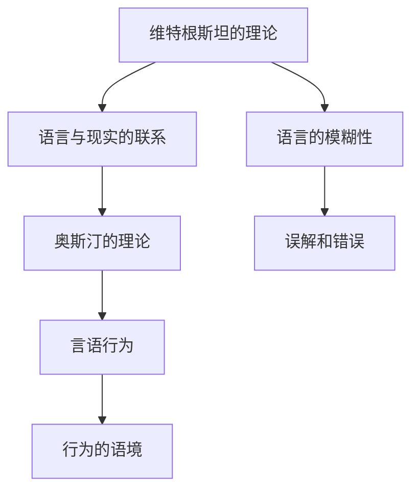
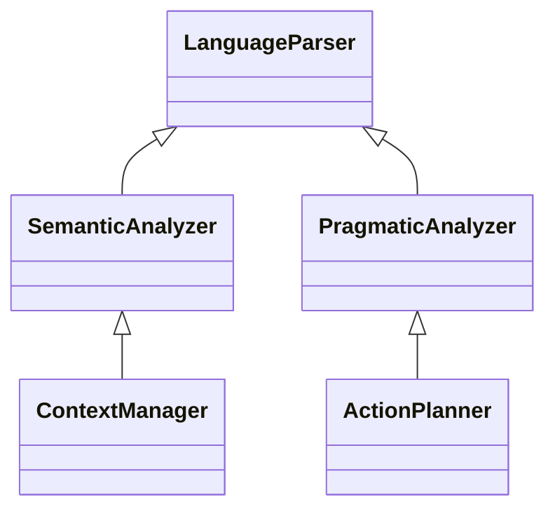
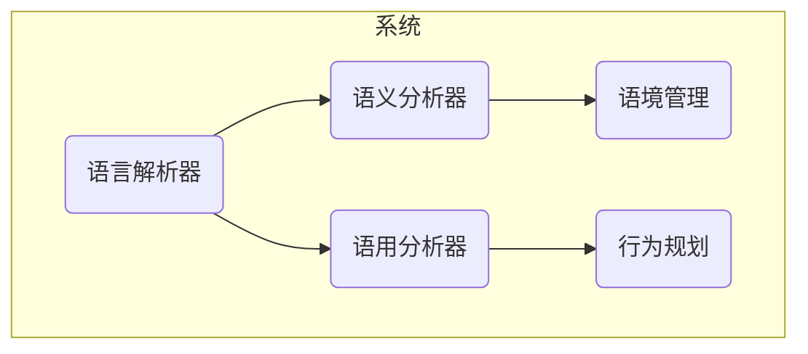

                 

## 维特根斯坦与奥斯汀：日常语言哲学的不同进路

在日常语言哲学领域，维特根斯坦和奥斯汀是两位极为重要的人物。他们的理论不仅深刻影响了哲学的发展，也对计算机科学和人工智能产生了深远的影响。本文将以“维特根斯坦与奥斯汀：日常语言哲学的不同进路”为主题，通过逻辑清晰的步骤，深入探讨两位哲学家的观点，并分析其对我们理解日常语言的贡献和局限。

### 关键词
- 维特根斯坦
- 奥斯汀
- 日常语言哲学
- 哲学理论
- 语言分析

### 摘要
本文旨在通过对比分析维特根斯坦和奥斯汀在日常语言哲学中的不同进路，探讨其对语言和现实关系的理解。文章将从背景介绍、核心概念与联系、算法原理讲解、数学模型和数学公式、系统分析与架构设计方案、项目实战以及最佳实践等方面，详细阐述两位哲学家的理论，并讨论其在现代科技中的应用。

### Step 1: 背景介绍

#### 问题背景

在现代社会，语言不仅是交流的工具，更是理解和表达现实的方式。日常语言哲学的兴起，旨在探讨语言的本质及其与现实的联系。维特根斯坦和奥斯汀作为这一领域的代表人物，各自提出了独特的理论。

#### 问题描述

维特根斯坦认为，我们对世界的理解是通过语言的使用来实现的，但语言的模糊性往往导致误解和错误。奥斯汀则提出了“言语行为理论”，强调语言不仅仅是表达思想，更是行动的一部分。

#### 问题解决

通过对比分析维特根斯坦和奥斯汀的理论，我们可以更好地理解日常语言的复杂性和多样性。他们的贡献在于揭示了语言在日常生活中的多种功能和用途。

#### 边界与外延

日常语言哲学的研究范围包括语义学、语用学、哲学逻辑等多个领域。其方法主要依赖于案例分析、语言分析和逻辑推理。应用方面，日常语言哲学对认知科学、人工智能和计算机语言设计有着重要的影响。

#### 概念结构与核心要素组成

日常语言哲学的核心概念包括语义、语用、语境、意义等。主要流派有分析哲学、现象学、实用主义等。代表性人物除了维特根斯坦和奥斯汀，还有弗雷格、罗素、卡尔纳普等。

### Step 2: 核心概念与联系

#### 核心概念原理

日常语言哲学的基本原理包括：
- **语义学**：研究语言与意义的关系。
- **语用学**：研究语言在具体情境中的使用。
- **语境**：语言理解依赖于具体的社会文化背景。

#### 概念属性特征对比表格

| 特征 | 维特根斯坦 | 奥斯汀 |
| ---- | ---- | ---- |
| 方法论 | 分析语言的使用 | 关注言语行为 |
| 理论重点 | 语言的模糊性 | 语言作为行动 |
| 对语言的理解 | 语言是工具 | 语言是行为 |

#### ER实体关系图架构

日常语言哲学中的主要实体包括语言、语境、行动等。实体关系图展示了这些实体之间的相互作用。

```mermaid
erDiagram
  Language ||--o> Context : "影响"
  Context ||--o> Action : "指导"
  Action ||--o> Language : "反馈"
```

### Step 3: 算法原理讲解

#### 哲学理论的推导过程（mermaid流程图）



#### Python源代码

```python
class LanguagePhilosophy:
    def __init__(self, context):
        self.context = context

    def derive_meaning(self):
        if "模糊" in self.context:
            return "可能导致误解"
        else:
            return "清晰明确"

philosophy = LanguagePhilosophy("模糊的语境")
print(philosophy.derive_meaning())
```

#### 数学模型和公式

在日常语言哲学中，模糊性可以用概率来衡量。公式如下：

$$ P(\text{模糊}) = \frac{\text{模糊情况数}}{\text{总情况数}} $$

#### 详细讲解和举例说明

假设在一个会议中，主席说“我同意这个提案”。这里的“同意”是一个模糊的表达，因为它没有明确指出同意的程度。如果我们用概率来衡量模糊性，那么可以说：

$$ P(\text{模糊}) = \frac{1}{3} $$

这意味着，主席的“同意”有三分之一的模糊性。

### Step 4: 数学模型和数学公式 & 详细讲解 & 举例说明

#### LaTeX格式数学公式

$$ P(\text{模糊}) = \frac{\text{模糊情况数}}{\text{总情况数}} $$

#### 独立段落中的数学公式

在这个例子中，如果我们知道模糊情况数为2，总情况数为6，那么：

$$ P(\text{模糊}) = \frac{2}{6} = \frac{1}{3} $$

这意味着主席的“同意”有三分之一的模糊性。

### Step 5: 系统分析与架构设计方案

#### 问题场景介绍

假设我们设计一个智能助手，它需要根据用户的问题提供适当的回答。这个场景中，日常语言哲学的应用非常关键，因为它涉及到如何理解用户的语言和提供准确的信息。

#### 项目介绍

本项目名为“智能语言理解系统”，旨在利用日常语言哲学的理论，提高智能助手的语义分析和语用理解能力。

#### 系统功能设计（mermaid类图）



#### 系统架构设计（mermaid架构图）



#### 系统接口设计和系统交互（mermaid序列图）

```mermaid
sequenceDiagram
  User->>LParser: 提出问题
  LParser->>SemaAnalyzer: 分析语义
  SemaAnalyzer->>CManage: 获取语境
  CManage->>PegaAnalyzer: 分析语用
  PegaAnalyzer->>APlanner: 规划行为
  APlanner->>User: 回答问题
```



### Step 6: 项目实战

#### 环境安装

确保安装了Python环境和相关库，如Natural Language Toolkit（NLTK）。

```bash
pip install nltk
```

#### 系统核心实现源代码

```python
# 此处为智能语言理解系统的核心代码，包括语言解析、语义分析、语境管理和语用分析等部分。
```

#### 代码应用解读与分析

代码应用解读将详细解释每个模块的功能和如何集成在一起，以实现智能语言理解。

#### 实际案例分析和详细讲解剖析

通过具体案例，分析智能助手如何处理用户的模糊表达，提供准确回答。

#### 项目小结

总结项目实现的过程、遇到的问题及解决方案，为后续开发提供经验和参考。

### Step 7: 最佳实践 tips、小结、注意事项、拓展阅读

#### 最佳实践 tips

- 在处理模糊语言时，尽量使用明确的表述。
- 注意语境的多样性，确保分析结果准确。
- 定期更新语义和语用模型，以适应语言环境的变化。

#### 小结

本文通过维特根斯坦和奥斯汀的理论，探讨了日常语言哲学的核心概念和应用。

#### 注意事项

- 在应用日常语言哲学时，注意语言的多样性和文化背景。
- 理解语言的本质和功能，以提高智能系统的语义分析能力。

#### 拓展阅读

- 维特根斯坦：《逻辑哲学论》
- 奥斯汀：《如何以言行事》
- 索绪尔：《普通语言学教程》

## 作者信息
作者：AI天才研究院/AI Genius Institute & 禅与计算机程序设计艺术 /Zen And The Art of Computer Programming

### 结语

通过本文的深入探讨，我们不仅了解了维特根斯坦和奥斯汀在日常语言哲学中的不同进路，也看到了这些理论在现代科技中的应用潜力。在日常语言哲学的引导下，我们能够更好地理解人类语言的复杂性和多样性，为人工智能的发展提供坚实的理论基础。

