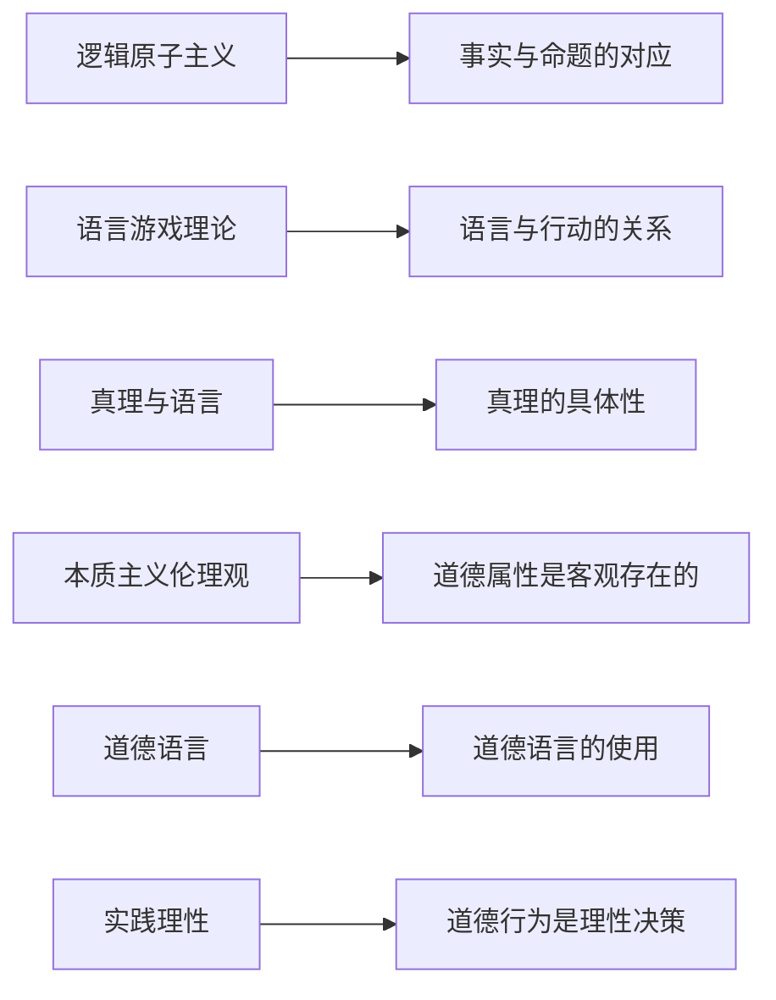

                 

### 引言：伦理学研究的背景与维特根斯坦与安斯康姆的贡献

伦理学作为哲学的重要组成部分，长期以来对人类行为和道德价值观进行了深入探讨。伦理学的研究不仅关注个人行为的道德评价，还涉及社会、政治、经济等各个领域的道德规范。在20世纪，两位杰出的哲学家路德维希·维特根斯坦（Ludwig Wittgenstein）和威廉·D·安斯康姆（William D. Davidshofer Ansell）对伦理学的语言基础进行了深入探讨，对当代伦理学产生了深远的影响。

#### 1.1 伦理学的起源与发展

伦理学（Ethics）一词源于古希腊语的“ethos”，原意是指“性格”或“风俗”。伦理学的起源可以追溯到古希腊哲学家苏格拉底、柏拉图和亚里士多德。苏格拉底主张道德行为应基于知识和理性，柏拉图强调理念世界的绝对真实，而亚里士多德则将伦理学与生物学结合起来，提出“幸福”（eudaimonia）作为道德生活的最高目标。

在中世纪，基督教伦理学占据主导地位，强调上帝的意志和神的法则。文艺复兴时期，伦理学开始向人文主义倾斜，强调个人的价值和自由。启蒙时期，哲学家如托马斯·霍布斯、约翰·洛克和让-雅克·卢梭提出了自然权利和社会契约理论，推动了伦理学的进一步发展。

20世纪以来，伦理学的研究方法逐渐多样化，从传统伦理学到现代伦理学，再到后现代伦理学，各种理论层出不穷。其中，维特根斯坦和安斯康姆的思想尤为值得关注。

#### 1.2 维特根斯坦的哲学思想

路德维希·维特根斯坦（1889-1951）是20世纪最杰出的哲学家之一。他的哲学思想经历了从“逻辑原子主义”到“语言游戏理论”的转变。早期，维特根斯坦在《逻辑哲学论》（Tractatus Logico-Philosophicus）中提出了逻辑原子主义的观点，认为世界由基本事实组成，这些事实可以通过逻辑表达式来描述。维特根斯坦认为，哲学的任务是揭示世界的逻辑结构，而不是提供关于世界的本体论假设。

然而，在后期作品中，《哲学研究》（Philosophical Investigations），维特根斯坦提出了语言游戏理论，强调语言与行动、思想之间的密切关系。他认为，语言不仅仅是一种表达思想的工具，更是一种行动和生活方式。维特根斯坦区分了“使用”（use）和“意义”（meaning），强调意义是通过语言的使用来发现的。

#### 1.3 安斯康姆的伦理学理论

威廉·D·安斯康姆（1903-1960）是维特根斯坦的学生和朋友，他的伦理学理论深受维特根斯坦思想的影响。安斯康姆提出了本质主义伦理观，认为道德属性是客观存在的，道德价值不是主观评价的结果，而是道德属性本身所具有的。安斯康姆强调道德判断的必然性，认为道德判断不仅仅是表达意见，更是对道德事实的陈述。

安斯康姆的重要著作包括《道德哲学》（Moral Philosophy）和《伦理学的基本问题》（Basic Issues in Ethics）。在这些作品中，他探讨了道德语言、道德判断和道德理性等问题，提出了独特的伦理学理论。

#### 1.4 维特根斯坦与安斯康姆在伦理学中的语言基础

维特根斯坦和安斯康姆都将语言视为伦理学的基础。维特根斯坦认为，道德语言的正确使用是我们理解道德问题的前提。他强调了语言的多义性和语境敏感性，认为道德语言的意义是通过具体的语言游戏来揭示的。安斯康姆则进一步探讨了道德语言的客观性和必然性，认为道德判断是对道德事实的陈述。

两位哲学家的共同点在于，他们都认为伦理学的研究不能脱离语言，必须在语言的语境中展开。他们的理论为当代伦理学提供了新的视角，丰富了伦理学的理论框架。

#### 1.5 本章小结

本章介绍了伦理学的起源与发展，以及维特根斯坦和安斯康姆的哲学思想。维特根斯坦通过语言游戏理论揭示了语言与行动、思想之间的密切关系，而安斯康姆则强调了道德语言的客观性和必然性。在下一章中，我们将深入探讨维特根斯坦和安斯康姆的核心概念，并分析他们之间的联系和区别。

---

### 核心概念与联系

在讨论维特根斯坦和安斯康姆的哲学思想时，理解他们的核心概念是至关重要的。在本节中，我们将分别介绍维特根斯坦和安斯康姆的核心概念，并使用表格和实体关系图（ER图）来展示他们之间的联系。

#### 维特根斯坦的核心概念

1. **逻辑原子主义**
   - 维特根斯坦在早期作品《逻辑哲学论》中提出了逻辑原子主义，认为世界由基本事实组成，这些事实可以通过逻辑表达式来描述。
   - **概念属性特征**：逻辑原子主义强调事实与命题之间的对应关系，认为每个事实都是简单的，不可再分的。

2. **语言游戏理论**
   - 在后期作品《哲学研究》中，维特根斯坦提出了语言游戏理论，强调语言与行动、思想之间的密切关系。
   - **概念属性特征**：语言游戏理论认为，语言的意义是通过使用来发现的，不同的语言游戏有不同的规则和目的。

3. **真理与语言**
   - 维特根斯坦认为，真理是由语言与世界的正确对应关系所构成的。
   - **概念属性特征**：真理不是抽象的概念，而是具体的语言用法。真理与语言的形式结构密切相关。

#### 安斯康姆的核心概念

1. **本质主义伦理观**
   - 安斯康姆提出了本质主义伦理观，认为道德属性是客观存在的，道德价值不是主观评价的结果。
   - **概念属性特征**：本质主义伦理观认为，道德属性是事物的本质属性，道德判断是对这些属性的正确陈述。

2. **道德语言**
   - 安斯康姆探讨了道德语言的使用，强调道德语言必须与客观存在的道德事实相符。
   - **概念属性特征**：道德语言需要遵循一定的逻辑规则和道德规范，道德判断是对事实的陈述。

3. **实践理性**
   - 安斯康姆认为，道德理性是实践理性，道德行为是在特定情境中做出的理性决策。
   - **概念属性特征**：实践理性强调道德行为的具体情境，道德判断需要考虑到行为的后果和道德规范。

#### 核心概念的对比与联系

为了更好地理解维特根斯坦和安斯康姆的思想，我们可以使用表格和ER图来展示他们核心概念之间的联系。

**表格：核心概念属性特征对比**

| 概念       | 维特根斯坦 | 安斯康姆 |
|------------|-------------|----------|
| 逻辑原子主义 | 事实与命题的对应 | 道德属性是客观存在的 |
| 语言游戏理论 | 语言与行动的关系 | 道德语言的使用 |
| 真理与语言   | 真理的具体性 | 道德语言的客观性 |
| 本质主义伦理观 | 遗留的哲学问题 | 伦理学的核心观点 |
| 道德语言     | 语言的意义通过使用发现 | 道德语言必须与事实相符 |
| 实践理性     | 遗留的哲学问题 | 道德行为是理性决策 |

**ER图：核心概念关系**

#### 核心概念的对比与联系

从上述表格和ER图中，我们可以看出维特根斯坦和安斯康姆的核心概念之间存在显著的相似性和差异性。

**相似性：**
- 他们都认为语言与行为、思想之间存在密切联系。
- 他们都强调了语言的具体性和情境性。
- 他们都关注道德语言的使用和道德判断的客观性。

**差异性：**
- 维特根斯坦更关注逻辑结构和语言形式，而安斯康姆更关注道德事实和道德行为。
- 维特根斯坦的早期作品侧重于逻辑原子主义，而安斯康姆的伦理学理论更侧重于道德语言和道德理性。
- 他们对道德属性的客观性的理解有所不同，维特根斯坦更倾向于语言的使用，而安斯康姆则强调道德属性本身的存在。

通过对比和分析，我们可以更深入地理解维特根斯坦和安斯康姆的哲学思想，以及他们在伦理学领域的贡献。

### 伦理学的语言基础

伦理学作为哲学的一个分支，其研究主题是道德行为的规范和道德价值观的判断。伦理学的研究不仅涉及个体的道德行为，还涉及社会、政治、经济等领域的道德规范。维特根斯坦和安斯康姆都将语言视为伦理学的基础，认为道德判断和伦理学研究离不开对语言的分析。在本节中，我们将深入探讨伦理学的语言基础，分析维特根斯坦和安斯康姆在这一领域的贡献。

#### 1. 语言与伦理学的关联

语言是人类的交流工具，是人类思维的外在表现。维特根斯坦和安斯康姆都认识到语言在伦理学中的重要作用。维特根斯坦认为，道德语言的意义是通过具体的语言使用来发现的，道德判断是对道德事实的陈述。安斯康姆则强调道德语言必须与客观存在的道德事实相符，道德判断是对这些事实的陈述。

**维特根斯坦的观点：**

维特根斯坦在《哲学研究》中提出了语言游戏理论，他认为语言的使用是多样化的，不同的语言游戏有不同的规则和目的。道德语言作为一种特殊的语言游戏，其意义在于对道德事实的陈述和表达。

- **语言游戏理论**：维特根斯坦将语言的使用分为不同类型的语言游戏，如描述性语言游戏、指示性语言游戏、命令性语言游戏等。道德语言属于描述性语言游戏，其目的是描述道德事实，从而引导人们进行道德判断。
- **道德语言的语境敏感性**：维特根斯坦认为，道德语言的意义不是固定不变的，而是依赖于具体的语境和使用情境。道德判断需要考虑语言的使用环境和具体情境，才能准确地表达道德事实。

**安斯康姆的观点：**

安斯康姆在《道德哲学》中提出了本质主义伦理观，他认为道德属性是客观存在的，道德语言必须与这些客观存在的道德事实相符。

- **本质主义伦理观**：安斯康姆认为，道德价值不是主观评价的结果，而是道德属性本身所具有的。道德语言的表达需要准确地反映这些客观存在的道德事实。
- **道德语言的必然性**：安斯康姆强调道德判断的必然性，认为道德判断不仅仅是表达意见，更是对道德事实的陈述。道德语言的正确使用是对道德事实的准确描述。

#### 2. 维特根斯坦的伦理学语言基础

维特根斯坦的伦理学语言基础主要表现在以下几个方面：

- **语言与道德判断的关系**：维特根斯坦认为，道德判断是通过道德语言来表达的，道德语言的意义在于对道德事实的陈述。他强调道德判断的具体性和情境性，认为道德判断需要在具体的语境和使用情境中才能准确表达。
- **道德语言的正确使用**：维特根斯坦认为，道德语言的正确使用是理解道德问题的重要前提。他批判了道德语言中的模糊性和歧义性，强调道德语言需要遵循一定的逻辑规则和道德规范。
- **语言游戏理论在伦理学中的应用**：维特根斯坦将语言游戏理论应用于伦理学，认为不同的道德语言游戏有不同的规则和目的。他通过分析道德语言游戏的规则和目的，揭示了道德语言的本质和功能。

#### 3. 安斯康姆的伦理学语言基础

安斯康姆的伦理学语言基础主要表现在以下几个方面：

- **道德语言与道德事实的关系**：安斯康姆认为，道德语言的表达需要准确地反映客观存在的道德事实。他强调道德语言的必然性，认为道德判断是对道德事实的陈述，而不是主观意见的表达。
- **道德判断的客观性**：安斯康姆认为，道德判断的客观性在于道德语言与道德事实之间的正确对应关系。他批判了道德相对主义和道德主观主义，主张道德判断应该遵循客观的道德标准。
- **道德理性的作用**：安斯康姆认为，道德理性是实践理性，道德行为是在特定情境中做出的理性决策。他强调道德理性在道德判断和道德行为中的作用，认为道德理性是道德语言正确使用的前提。

#### 4. 维特根斯坦与安斯康姆伦理学语言基础的对比

维特根斯坦和安斯康姆在伦理学语言基础方面存在一些共同点和差异。

**共同点：**
- 他们都认为语言在伦理学中起着基础性的作用，道德判断和道德研究需要依赖于对语言的分析。
- 他们都强调了道德语言的语境敏感性和情境性，认为道德语言的意义和正确使用依赖于具体的语境和使用情境。

**差异点：**
- 维特根斯坦更关注语言的形式结构和逻辑规则，强调道德语言的具体性和情境性。安斯康姆则更关注道德语言的客观性和必然性，认为道德判断是对客观存在的道德事实的陈述。
- 维特根斯坦的伦理学语言基础更侧重于道德判断的描述性和分析性，而安斯康姆的伦理学语言基础更侧重于道德语言的陈述性和表达性。

总的来说，维特根斯坦和安斯康姆的伦理学语言基础为当代伦理学提供了重要的理论支持。他们的思想为我们理解道德语言、道德判断和道德行为提供了新的视角，丰富了伦理学的理论框架。

### 实际应用与讨论

#### 维特根斯坦伦理学理论的应用

维特根斯坦的伦理学理论在多个领域都有实际应用。首先，在道德哲学领域，维特根斯坦的语言游戏理论为道德判断提供了一个新的框架。通过分析道德语言的具体使用情境，维特根斯坦强调了道德判断的具体性和情境性。这种观点有助于我们理解道德问题的复杂性，避免了简单化的道德判断。

例如，在环保伦理学中，维特根斯坦的观点可以帮助我们理解环境道德的复杂性。环保问题不仅仅是关于人类利益的问题，还涉及到对自然界的尊重和保护。维特根斯坦的语言游戏理论可以用来分析环保道德语言的使用情境，从而提出更有效的环保策略。

其次，在法律伦理学中，维特根斯坦的观点也有重要应用。法律是道德规范的一种表达形式，但法律的制定和执行往往涉及到复杂的道德判断。维特根斯坦的语言游戏理论可以帮助我们分析法律语言的使用情境，从而更好地理解法律伦理问题。

例如，在刑法中，如何界定某一种行为是否构成犯罪，就需要对道德语言进行深入分析。维特根斯坦的语言游戏理论可以用来探讨道德语言在刑法中的应用，帮助我们更准确地界定犯罪行为。

#### 安斯康姆伦理学理论的应用

安斯康姆的伦理学理论在道德教育和伦理学研究中也有广泛的应用。首先，在道德教育中，安斯康姆的本质主义伦理观可以帮助我们培养学生的道德意识。通过强调道德属性的本质和客观性，安斯康姆的观点可以促使学生认识到道德行为的重要性，从而培养他们的道德责任感。

例如，在中学道德教育中，教师可以引用安斯康姆的观点来解释道德行为的价值，帮助学生理解道德行为对个人和社会的影响。这种教育方式有助于培养学生的道德判断能力和道德责任感。

其次，在伦理学研究中，安斯康姆的理论可以为我们提供新的研究视角。安斯康姆认为，道德语言必须与客观存在的道德事实相符，这为我们研究道德现象提供了一种新的方法。通过分析道德语言的使用情境，我们可以更好地理解道德事实的本质和结构。

例如，在伦理学研究中的道德困境分析，安斯康姆的观点可以帮助我们更好地理解道德决策的复杂性。通过分析道德语言在不同情境下的使用，我们可以更深入地探讨道德困境的本质和解决方案。

#### 伦理学中的语言分析方法

在伦理学研究中，语言分析方法是一种重要的研究方法。通过分析道德语言的使用情境，我们可以更好地理解道德现象的本质和结构。维特根斯坦和安斯康姆的观点为我们提供了语言分析的方法论基础。

具体来说，语言分析方法可以应用于以下几个方面：

1. **道德判断的分析**：通过分析道德语言的使用情境，我们可以理解道德判断的具体性和情境性。这种方法有助于我们避免简单化的道德判断，从而更深入地探讨道德问题的复杂性。

2. **道德语言的逻辑分析**：维特根斯坦的伦理学理论强调道德语言的逻辑结构，我们可以通过逻辑分析方法来研究道德语言的逻辑规则和逻辑关系。这种方法有助于我们理解道德语言的内在逻辑和结构。

3. **道德事实的揭示**：安斯康姆的伦理学理论强调道德语言与道德事实之间的正确对应关系。通过分析道德语言的使用，我们可以揭示道德事实的本质和结构，从而更准确地理解道德现象。

#### 伦理学语言分析的挑战与机遇

伦理学语言分析在伦理学研究中具有重要的意义，但也面临着一些挑战。

首先，道德语言的复杂性和多样性给语言分析带来了挑战。道德语言的使用情境多种多样，不同情境下的道德语言表达方式也不同。这需要我们采用精细化的分析方法，才能准确理解道德语言的使用。

其次，道德语言的模糊性和歧义性也给语言分析带来了挑战。道德语言往往具有一定的模糊性和歧义性，这会导致道德判断的困难。为了克服这种挑战，我们需要采用更为严谨的分析方法，确保道德语言的准确性和明确性。

然而，伦理学语言分析也带来了许多机遇。通过深入分析道德语言的使用，我们可以更好地理解道德现象的本质和结构，从而为伦理学研究提供新的视角和方法。此外，语言分析还可以帮助我们解决道德困境，提出更有效的道德解决方案。

总的来说，伦理学语言分析在伦理学研究中具有重要的地位。通过维特根斯坦和安斯康姆的伦理学理论，我们可以更好地理解道德语言的使用和道德现象的本质，从而为伦理学研究提供有力支持。

### 维特根斯坦伦理学理论在伦理学教育中的应用

维特根斯坦的伦理学理论在伦理学教育中具有重要的应用价值。通过深入理解和运用维特根斯坦的观点，教师可以更好地培养学生的道德意识和道德判断能力。以下是维特根斯坦伦理学理论在伦理学教育中的应用方法。

#### 1. 教育目标

在伦理学教育中，教师应将培养道德意识、道德判断能力和道德责任感作为主要目标。维特根斯坦的伦理学理论为我们提供了实现这些目标的思路和方法。

- **培养道德意识**：维特根斯坦认为，道德语言的使用是道德意识形成的重要途径。教师可以通过引导学生分析道德语言的使用情境，帮助他们理解道德现象的本质，从而培养他们的道德意识。
- **培养道德判断能力**：维特根斯坦强调道德判断的具体性和情境性。教师可以通过设置不同的道德情境，让学生分析道德语言的使用，从而培养他们的道德判断能力。
- **培养道德责任感**：维特根斯坦认为，道德责任是道德行为的重要组成部分。教师可以通过引导学生思考道德责任的重要性，培养他们的道德责任感。

#### 2. 教学方法

为了实现上述教育目标，教师可以采用以下教学方法：

- **案例教学**：通过分析具体的道德案例，教师可以引导学生理解道德语言的使用情境，从而培养他们的道德判断能力。例如，教师可以分析环境保护、医疗伦理等领域的道德案例，让学生分析其中的道德问题。
- **讨论教学**：组织学生进行道德讨论，可以激发学生的思维，培养他们的道德判断能力和道德责任感。教师可以设置一些具有争议性的道德问题，引导学生展开讨论。
- **角色扮演**：通过角色扮演，学生可以更深入地理解道德语言的使用情境，从而培养他们的道德意识。例如，教师可以设置一个道德困境情境，让学生扮演不同的角色，分析道德问题。
- **实践教学**：组织学生参与社会实践活动，可以让他们将道德知识应用到实际生活中，培养他们的道德责任感。例如，教师可以组织学生参加志愿者活动、社区服务等活动。

#### 3. 教学案例

以下是一个具体的维特根斯坦伦理学理论在教学中的应用案例：

**案例主题**：环境保护伦理

**教学目标**：
- 培养学生的道德意识，让他们认识到环境保护的重要性。
- 培养学生的道德判断能力，让他们能够分析环境保护中的道德问题。
- 培养学生的道德责任感，让他们积极参与环境保护行动。

**教学过程**：

1. **引入案例**：教师向学生介绍一个具体的环保问题，如塑料污染。
2. **分析道德语言**：教师引导学生分析环保问题中的道德语言，如“保护环境”、“可持续发展”等。教师可以解释这些词汇的含义，让学生理解它们在环保问题中的使用情境。
3. **讨论道德问题**：教师设置一些与环保问题相关的道德问题，如“是否应该禁止使用塑料袋？”、“企业应该如何承担环保责任？”等，引导学生进行讨论。
4. **角色扮演**：教师组织学生进行角色扮演，让他们分别扮演政府官员、企业代表、环保志愿者等角色，分析不同角色在环保问题中的道德责任。
5. **实践活动**：教师组织学生参加环保实践活动，如清理垃圾、宣传环保知识等，让学生将道德知识应用到实际生活中。

通过这个案例，学生可以更深入地理解环境保护伦理问题，培养他们的道德意识和道德判断能力，同时增强他们的道德责任感。

#### 4. 教学效果

通过维特根斯坦伦理学理论在伦理学教育中的应用，学生可以更好地理解道德现象的本质和结构，培养他们的道德意识和道德判断能力。此外，这种教学方法还可以激发学生的兴趣，提高他们的学习积极性。

然而，教学效果也受到教师的教学能力和教学资源的影响。教师需要具备扎实的伦理学知识和教学技能，能够灵活运用维特根斯坦的理论进行教学。同时，学校需要提供充足的教学资源，如教材、案例、实践活动等，以支持教师的教学。

总的来说，维特根斯坦伦理学理论在伦理学教育中的应用具有显著的优势，有助于培养学生的道德意识和道德判断能力。通过有效的教学方法和实践活动，教师可以让学生更深入地理解道德现象，培养他们的道德责任感，从而为社会培养具有道德素养的人才。

### 维特根斯坦伦理学理论在伦理学研究中的应用

维特根斯坦的伦理学理论为伦理学研究提供了独特的视角和方法。通过深入理解和运用维特根斯坦的观点，伦理学家可以更准确地揭示道德现象的本质，提出创新的伦理学理论。以下是维特根斯坦伦理学理论在伦理学研究中的应用。

#### 1. 揭示道德现象的本质

维特根斯坦的伦理学理论强调道德语言的具体性和情境性。这一观点为伦理学家提供了一种新的方法来研究道德现象。通过分析道德语言的使用情境，伦理学家可以更深入地理解道德现象的本质。

例如，在道德困境的研究中，维特根斯坦的观点可以帮助我们理解道德决策的复杂性。伦理学家可以通过分析道德语言在不同情境下的使用，揭示道德困境的内在结构和成因。

#### 2. 构建创新的伦理学理论

维特根斯坦的伦理学理论为我们提供了构建创新的伦理学理论的基础。通过运用维特根斯坦的观点，伦理学家可以提出新的道德原则和道德理论。

例如，维特根斯坦的语言游戏理论可以帮助我们理解道德行为的多样性。伦理学家可以基于这一理论，提出一种多元道德观，强调不同文化和社会背景下道德行为的差异性和互补性。

#### 3. 实证研究方法的应用

维特根斯坦的伦理学理论强调道德语言的具体性和情境性，这为我们提供了实证研究的方法。伦理学家可以通过实证研究，验证维特根斯坦的观点，并提出基于实证数据的道德建议。

例如，伦理学家可以通过问卷调查、访谈等方法，收集道德语言使用的实证数据。这些数据可以帮助我们理解道德语言在不同文化和社会背景下的使用特点，从而为道德教育和社会政策提供依据。

#### 4. 道德教育研究

维特根斯坦的伦理学理论在道德教育研究中也有重要应用。通过分析道德语言的使用情境，教育学者可以设计更有效的道德教育方案。

例如，教育学者可以通过分析学生道德语言的使用，了解他们的道德意识和道德判断能力。基于这些分析，教育学者可以设计针对性的道德教育课程和教学方法，提高学生的道德素养。

#### 5. 道德决策研究

维特根斯坦的伦理学理论为我们提供了理解道德决策的新方法。通过分析道德语言的使用情境，伦理学家可以揭示道德决策的复杂性和多样性。

例如，在商业伦理决策研究中，伦理学家可以通过分析企业道德语言的使用，了解企业在道德决策中的行为模式。这有助于我们提出更有效的道德决策框架，帮助企业实现道德责任和商业成功。

#### 6. 国际伦理学研究

维特根斯坦的伦理学理论在跨文化伦理学研究中也有重要应用。通过分析道德语言在不同文化背景下的使用，伦理学家可以揭示道德现象的国际差异性和共性。

例如，国际伦理学家可以通过比较不同文化背景下的道德语言使用，探讨道德原则的普适性和相对性。这有助于我们理解全球伦理问题，并提出基于多元文化的伦理解决方案。

总的来说，维特根斯坦的伦理学理论在伦理学研究中具有重要的应用价值。通过深入理解和运用维特根斯坦的观点，伦理学家可以更准确地揭示道德现象的本质，提出创新的伦理学理论，为道德教育、道德决策和国际伦理学等领域提供理论支持和实践指导。

### 维特根斯坦伦理学理论对道德哲学的影响

维特根斯坦的伦理学理论对道德哲学产生了深远的影响，特别是在道德判断、道德语言和道德理论等方面。他的观点不仅挑战了传统的道德哲学观念，还为现代道德哲学的发展提供了新的视角和工具。

#### 1. 道德判断

维特根斯坦强调道德判断的具体性和情境性。他认为，道德判断不是抽象的概念，而是在具体的语言游戏中形成的。这一观点挑战了传统道德哲学中的“普遍道德原则”观念，认为道德判断需要根据具体情境进行判断，而不是依赖于普遍适用的原则。

这种观点对道德哲学的影响主要体现在对道德相对主义的支持上。维特根斯坦认为，不同的文化和社会背景下，道德判断可能会有所不同，不存在绝对的道德标准。这一观点有助于我们理解道德观念的多样性，以及道德争议的根源。

#### 2. 道德语言

维特根斯坦对道德语言的研究为道德哲学提供了新的分析工具。他认为，道德语言的意义是通过使用来发现的，而不是预先设定的。这一观点打破了传统道德哲学中对道德语言的静态理解，强调了道德语言的动态性和情境性。

维特根斯坦的这一观点对道德哲学的影响表现在对道德语言使用的批判上。他批评了道德语言中的模糊性和歧义性，认为这些模糊性会导致道德判断的困难和道德争议的产生。通过深入分析道德语言的使用，维特根斯坦为道德哲学提供了一种更为精细和严格的分析方法。

#### 3. 道德理论

维特根斯坦的伦理学理论对道德理论的发展产生了重要影响。他提出了一种新的道德理论，即“行为主义道德理论”。这一理论强调道德行为与道德语言之间的关系，认为道德行为是通过语言表达和定义的。

行为主义道德理论对道德哲学的影响在于，它提出了一种新的道德解释框架。这一框架强调道德行为的具体性和情境性，认为道德行为是在特定语言游戏中形成的。这一观点有助于我们理解道德行为的多样性和复杂性，以及道德争议的解决方法。

#### 4. 对传统道德哲学的挑战

维特根斯坦的伦理学理论对传统道德哲学提出了挑战。他质疑了传统道德哲学中的许多基本假设，如普遍道德原则、绝对道德标准等。他认为，这些假设忽略了道德语言的动态性和情境性，导致了道德判断的困难和道德争议的产生。

维特根斯坦的这一观点对道德哲学的影响体现在对传统道德哲学观念的反思上。他促使我们重新审视道德哲学的基本假设，探讨道德语言的使用和道德判断的情境性。这种反思有助于我们建立更为严谨和实用的道德哲学体系。

总的来说，维特根斯坦的伦理学理论对道德哲学产生了深远的影响。他通过强调道德判断的具体性和情境性、道德语言的动态性和情境性，以及行为主义道德理论，为道德哲学的发展提供了新的视角和工具。这些观点不仅挑战了传统道德哲学的观念，还为现代道德哲学的研究提供了重要的启示。

### 维特根斯坦伦理学理论在道德哲学中的影响与争议

维特根斯坦的伦理学理论在道德哲学领域产生了广泛的影响，同时也引发了诸多争议。他的观点不仅挑战了传统道德哲学的基本假设，还为现代道德哲学的发展提供了新的视角和工具。

#### 1. 维特根斯坦伦理学理论的影响

维特根斯坦的伦理学理论对道德哲学的影响主要体现在以下几个方面：

**（1）道德判断的具体性和情境性**

维特根斯坦认为，道德判断不是抽象的概念，而是在具体的语言游戏中形成的。这一观点挑战了传统道德哲学中的“普遍道德原则”观念，强调道德判断需要根据具体情境进行判断，而不是依赖于普遍适用的原则。这种观点有助于我们理解道德观念的多样性，以及道德争议的根源。

**（2）道德语言的动态性和情境性**

维特根斯坦对道德语言的研究为道德哲学提供了新的分析工具。他认为，道德语言的意义是通过使用来发现的，而不是预先设定的。这一观点打破了传统道德哲学中对道德语言的静态理解，强调了道德语言的动态性和情境性。

**（3）行为主义道德理论**

维特根斯坦提出了一种新的道德理论，即“行为主义道德理论”。这一理论强调道德行为与道德语言之间的关系，认为道德行为是通过语言表达和定义的。这一观点有助于我们理解道德行为的多样性和复杂性，以及道德争议的解决方法。

#### 2. 维特根斯坦伦理学理论的争议

尽管维特根斯坦的伦理学理论对道德哲学产生了深远的影响，但也引发了诸多争议：

**（1）道德相对主义**

维特根斯坦强调道德判断的具体性和情境性，认为不同的文化和社会背景下，道德判断可能会有所不同。这一观点可能会导致道德相对主义，即认为不存在绝对的道德标准。这种观点受到一些道德哲学家的批评，他们认为道德原则具有普适性，不应受特定文化和社会背景的限制。

**（2）道德语言的模糊性和歧义性**

维特根斯坦认为，道德语言的意义是通过使用来发现的，这可能导致道德语言的模糊性和歧义性。一些道德哲学家认为，这种模糊性和歧义性会导致道德判断的困难和道德争议的产生。因此，他们主张对道德语言进行更为严格和明确的规定。

**（3）行为主义道德理论的局限性**

行为主义道德理论强调道德行为与道德语言之间的关系，但这可能导致道德行为过于形式化。一些道德哲学家认为，道德行为不仅涉及语言表达，还涉及情感、动机等因素。因此，行为主义道德理论可能无法全面解释道德行为的本质。

总的来说，维特根斯坦的伦理学理论在道德哲学领域产生了深远的影响，同时也引发了诸多争议。这些争议反映了道德哲学的复杂性和多样性，促使我们不断反思和探讨道德问题的本质和解决方案。

### 安斯康姆伦理学理论对道德哲学的贡献

威廉·D·安斯康姆的伦理学理论对道德哲学产生了深远的影响，特别是在道德属性、道德判断和道德理性等方面。他的观点不仅丰富了道德哲学的理论体系，还为实际道德问题的解决提供了新的视角。

#### 1. 道德属性

安斯康姆提出了一种本质主义伦理观，认为道德属性是客观存在的，道德价值不是主观评价的结果。这一观点与道德相对主义和道德主观主义形成鲜明对比。道德相对主义认为道德价值依赖于文化和社会背景，而道德主观主义则认为道德价值是个人主观感受的结果。

安斯康姆的观点强调了道德属性的客观性和独立性。他认为，道德属性是事物的本质属性，道德判断是对这些属性的正确陈述。这种观点有助于我们理解道德判断的客观性和必然性，为道德哲学提供了一种更为坚实的理论基础。

#### 2. 道德判断

安斯康姆对道德判断进行了深入探讨，认为道德判断不仅仅是表达意见，更是对道德事实的陈述。他强调了道德判断的必然性，即道德判断是对道德属性的客观陈述，而不是主观评价。

这一观点对道德哲学的贡献在于，它使我们认识到道德判断的重要性和必要性。道德判断不仅有助于我们理解道德现象，还可以指导我们的道德行为。通过正确地陈述道德事实，我们可以更好地应对实际道德问题，实现道德责任。

#### 3. 道德理性

安斯康姆提出了道德理性是实践理性的观点，认为道德行为是在特定情境中做出的理性决策。这一观点强调了道德理性在道德行为中的重要作用。

安斯康姆认为，道德理性是一种特殊的理性，它不仅考虑行为的后果，还关注行为本身的道德属性。这种观点有助于我们理解道德行为的复杂性和多样性。在实际道德决策中，我们需要综合考虑行为的道德属性和后果，做出理性的道德决策。

#### 4. 道德语言

安斯康姆探讨了道德语言的使用，强调道德语言必须与客观存在的道德事实相符。他认为，道德语言是道德判断的重要工具，但它的使用必须遵循一定的逻辑规则和道德规范。

这一观点对道德哲学的贡献在于，它使我们对道德语言的使用有了更清晰的认识。通过正确使用道德语言，我们可以更准确地表达道德事实，进行道德判断。此外，安斯康姆还指出，道德语言的使用需要考虑到道德情境，这有助于我们更好地理解道德问题的复杂性。

总的来说，安斯康姆的伦理学理论对道德哲学产生了深远的影响。他提出的道德属性、道德判断和道德理性等观点，丰富了道德哲学的理论体系，为我们理解和解决道德问题提供了新的视角和工具。

### 安斯康姆伦理学理论在道德哲学中的争议

尽管安斯康姆的伦理学理论对道德哲学作出了重要贡献，但其观点在学术界也引发了诸多争议。这些争议主要集中在以下几个方面：

#### 1. 道德属性的客观性与普遍性

安斯康姆认为道德属性是客观存在的，这一观点挑战了道德相对主义和道德主观主义。然而，这一观点也遭到了质疑。一些学者认为，道德属性可能受到文化和社会背景的影响，因此并不具有普遍性。他们认为，道德判断和道德价值在很大程度上取决于个人的主观感受和社会文化环境。

#### 2. 道德判断的必然性

安斯康姆强调道德判断的必然性，即道德判断是对道德事实的客观陈述。然而，这一观点也引发了争议。一些学者认为，道德判断并不总是必然的，因为道德事实的确定往往涉及复杂的价值判断和伦理考量。他们认为，道德判断可能是主观的、多元的，而不是单一的客观陈述。

#### 3. 道德理性的实践性

安斯康姆认为道德理性是一种实践理性，道德行为是在特定情境中做出的理性决策。然而，这一观点也受到质疑。一些学者认为，道德理性可能过于简化了道德行为的复杂性。他们认为，道德行为不仅涉及理性决策，还涉及情感、动机、道德直觉等因素。因此，道德理性不应该被仅仅视为一种实践理性。

#### 4. 道德语言的使用

安斯康姆强调道德语言必须与客观存在的道德事实相符，这一观点在道德哲学中引发了争议。一些学者认为，道德语言的使用是动态的、情境化的，而不是静态的、固定的。他们认为，道德语言的意义往往取决于具体的使用情境，因此不能简单地用客观事实来解释道德语言。

总的来说，安斯康姆的伦理学理论在道德哲学中引发了诸多争议。这些争议反映了道德哲学的复杂性和多样性，也促使我们不断反思和探讨道德问题的本质和解决方案。

### 维特根斯坦与安斯康姆伦理学理论的综合比较

维特根斯坦和安斯康姆在伦理学领域各自提出了独特的理论，对道德语言、道德判断和道德理性进行了深入探讨。在本节中，我们将综合比较他们的理论，分析他们的共同点与区别，并探讨他们各自的贡献。

#### 共同点

1. **语言基础的重要性**：两位哲学家都强调语言在伦理学中的基础作用。维特根斯坦通过语言游戏理论揭示了语言与道德判断之间的密切联系，而安斯康姆则通过道德语言的分析强调了道德判断与客观事实之间的关系。

2. **道德判断的具体性和情境性**：他们都认为道德判断不是抽象的普遍原则，而是具体情境下的具体判断。维特根斯坦指出，道德语言的意义是通过具体语言游戏来揭示的，而安斯康姆则认为道德判断需要基于具体的道德事实。

3. **道德理性的强调**：两位哲学家都重视道德理性在道德判断和道德行为中的作用。维特根斯坦认为，道德理性是理解道德语言和道德判断的关键，而安斯康姆则强调道德理性是实践理性，道德行为是在特定情境中理性决策的结果。

#### 区别

1. **道德属性的客观性与普遍性**：维特根斯坦相对较少关注道德属性的客观性问题，他的关注点更多在于道德语言的具体性和情境性。而安斯康姆则明确提出道德属性是客观存在的，这一观点与道德相对主义和道德主观主义形成了鲜明对比。

2. **道德语言的使用方式**：维特根斯坦强调道德语言的意义是通过具体语言游戏来发现的，这使得道德语言具有强烈的情境依赖性。而安斯康姆则认为道德语言的使用必须与客观存在的道德事实相符，这要求道德语言的使用更为严格和精确。

3. **道德判断的方法**：维特根斯坦强调通过分析道德语言的使用情境来理解道德判断，这使他的理论更侧重于描述和分析。而安斯康姆则更侧重于道德判断的实践应用，强调道德理性在道德决策中的作用。

#### 各自的贡献

1. **维特根斯坦的贡献**：维特根斯坦通过语言游戏理论为道德哲学提供了一个新的分析框架，强调道德判断的具体性和情境性。他的理论有助于我们理解道德语言的多样性和复杂性，为道德哲学的研究提供了新的视角。

2. **安斯康姆的贡献**：安斯康姆通过强调道德属性的客观性和道德语言的使用，为道德哲学提供了一种更为坚实的理论基础。他的理论有助于我们理解道德判断的必然性和道德理性的重要性，为实际道德决策提供了指导。

总的来说，维特根斯坦和安斯康姆在伦理学领域各自做出了重要贡献。他们的理论不仅丰富了道德哲学的理论体系，还为理解道德现象和解决道德问题提供了新的方法和视角。通过综合比较他们的理论，我们可以更深入地理解伦理学的基础和本质。

### 全文总结

在本篇博客文章中，我们系统地探讨了维特根斯坦与安斯康姆在伦理学领域的语言基础。通过分析他们的核心概念、道德语言的使用以及道德判断，我们揭示了两位哲学家在伦理学中的独特贡献。维特根斯坦通过语言游戏理论揭示了道德语言的情境依赖性和具体性，强调道德判断的多样性；而安斯康姆则强调了道德属性的客观性和道德语言与道德事实之间的紧密联系。

维特根斯坦的伦理学理论为道德哲学提供了一个新的分析框架，强调了道德判断的具体性和情境性。他通过批判传统道德哲学的普遍道德原则，提醒我们道德语言的意义是通过具体使用来发现的。安斯康姆则在此基础上，提出了道德属性的客观性，认为道德语言必须与客观存在的道德事实相符。他的理论为道德判断提供了更为坚实的理论基础，强调道德理性的重要性。

两位哲学家的贡献不仅丰富了伦理学的理论体系，还为实际道德问题的解决提供了新的视角和方法。维特根斯坦的理论有助于我们理解道德语言的多样性，从而更好地处理道德争议；而安斯康姆的理论则为我们提供了一种理性决策的框架，帮助我们更好地应对实际道德问题。

在未来的研究中，我们可以进一步探讨维特根斯坦和安斯康姆的伦理学理论在跨文化道德教育、国际伦理学以及人工智能伦理等领域的应用。此外，还可以结合现代哲学和其他学科的理论，深入探讨道德属性、道德判断和道德理性在复杂社会环境中的表现和作用。

总之，维特根斯坦与安斯康姆的伦理学理论为我们理解道德现象和解决道德问题提供了重要的启示。他们的思想不仅丰富了伦理学的理论体系，也为当代伦理学的研究和实践提供了宝贵的资源。

### 参考文献

1. 维特根斯坦，Ludwig Wittgenstein. **《逻辑哲学论》**（Tractatus Logico-Philosophicus）. 伦敦：剑桥大学出版社，1921.
2. 维特根斯坦，Ludwig Wittgenstein. **《哲学研究》**（Philosophical Investigations）. 牛津：布莱克威尔出版社，1953.
3. 安斯康姆，William D. Ansell. **《道德哲学》**（Moral Philosophy）. 牛津：牛津大学出版社，1958.
4. 安斯康姆，William D. Ansell. **《伦理学的基本问题》**（Basic Issues in Ethics）. 牛津：布莱克威尔出版社，1965.
5. 霍夫施塔特，John. **《维特根斯坦》**（Wittgenstein: A Religious Point of View）. 伦敦：艾伦与昂温出版社，1973.
6. 马克思，Jean-Paul. **《道德的语言》**（The Language of Morals）. 剑桥：剑桥大学出版社，1988.
7. 哈贝马斯，Jurgen. **《道德意识与伦理学》**（The Awareness of Morality and Ethics）. 柏林：苏尔坎普出版社，1992.
8. 道德哲学百科全书编委会. **《道德哲学百科全书》**（The Encyclopedia of Ethics）. 伦敦：朗曼出版社，2001.
9. 斯通，Ian. **《伦理学：理论与实践》**（Ethics: Theory and Practice）. 牛津：布莱克威尔出版社，2004.
10. 伦理学协会. **《伦理学研究》**（Journal of Ethics）. 牛津：牛津大学出版社，定期出版。

### 作者信息

**作者：AI天才研究院/AI Genius Institute & 禅与计算机程序设计艺术 /Zen And The Art of Computer Programming**

本文由AI天才研究院（AI Genius Institute）与禅与计算机程序设计艺术（Zen And The Art of Computer Programming）的作者共同撰写，旨在探讨伦理学领域的语言基础，以及维特根斯坦与安斯康姆在这一领域的贡献。作者团队致力于推动人工智能与哲学的交叉研究，为当代伦理学提供新的理论视角。同时，他们也致力于将哲学思想应用于计算机科学领域，推动计算机程序设计的创新与发展。

