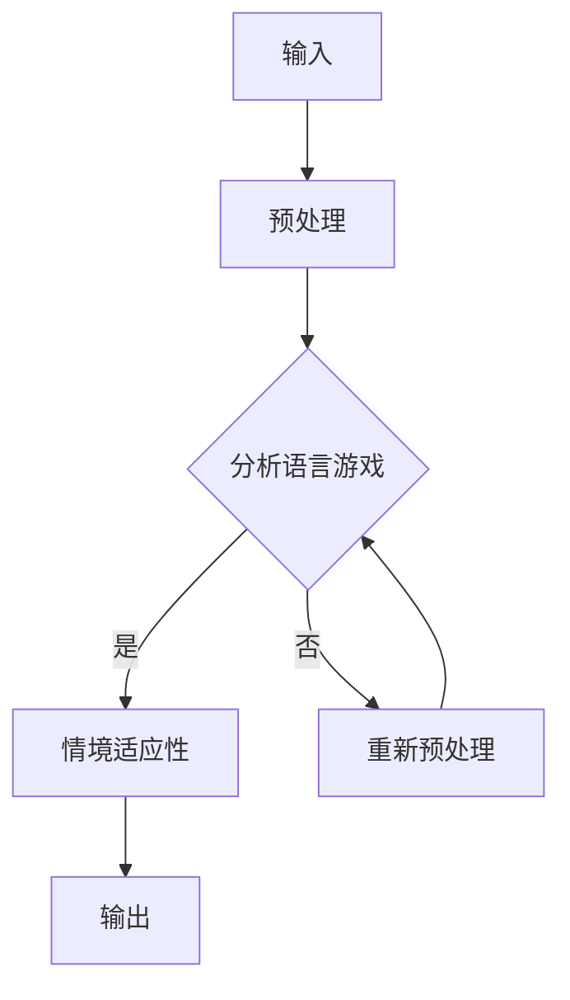
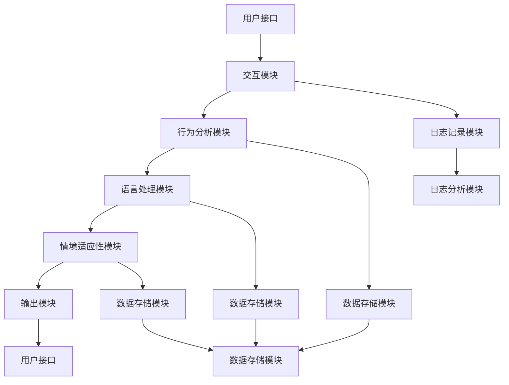
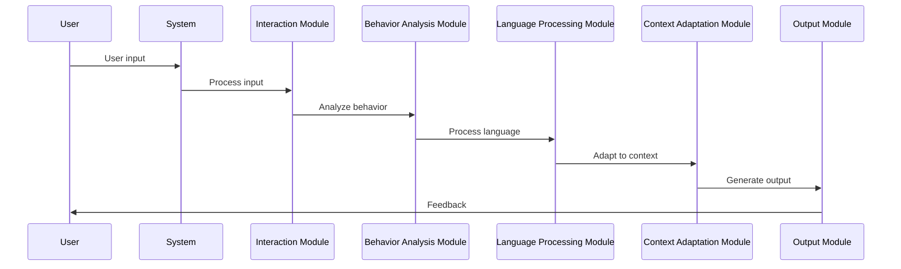
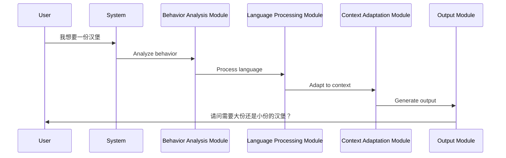
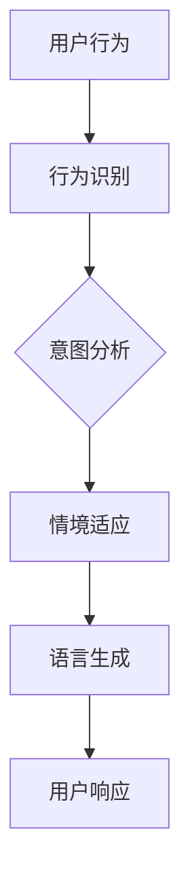
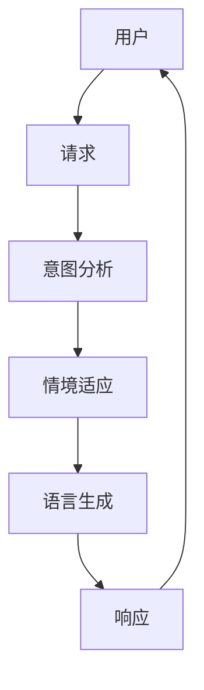
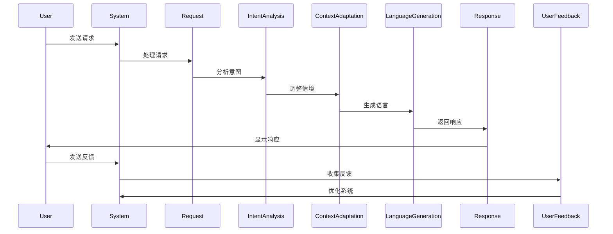
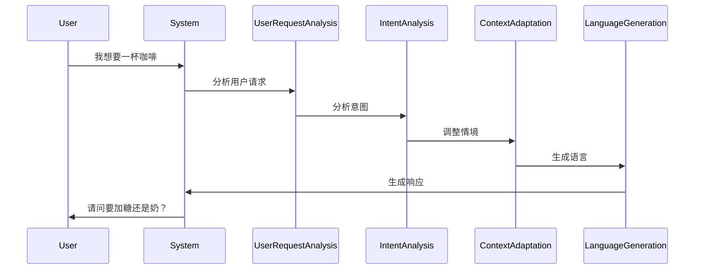

                 


### 文章标题：维特根斯坦与安斯康姆：行为哲学的语言基础

#### 关键词：维特根斯坦、安斯康姆、行为哲学、语言基础、逻辑推理

#### 摘要：本文将深入探讨维特根斯坦与安斯康姆两位哲学家的行为哲学思想，分析其对于语言基础的理论贡献，并探讨这些理论在计算机科学中的应用。通过一步一步的逻辑推理，本文旨在为读者提供一个清晰、系统的理解。

----------------------------------------------------------------

## 第一部分：背景介绍与问题解决

### 第1章：问题背景

#### 1.1.1 维特根斯坦与安斯康姆的哲学背景
维特根斯坦（Ludwig Wittgenstein）和安斯康姆（Gilbert Ryle）是20世纪最具影响力的哲学家之一。维特根斯坦以其早期作品《逻辑哲学论》和后期作品《哲学研究》对西方哲学界产生了深远的影响。安斯康姆则以其关于心灵哲学和行为哲学的工作而著称。

#### 1.1.2 行为哲学的核心概念
行为哲学强调行为和语言之间的关系，认为语言是行为的表达。维特根斯坦提出了“语言游戏”的概念，认为语言的使用必须与社会实践相结合。安斯康姆则提出了“行为类型论”，强调行为的类型而非行为本身的重要性。

### 第2章：问题描述

#### 2.1.1 语言哲学的困境
语言哲学面临着如何理解语言与现实世界之间关系的困境。维特根斯坦和安斯康姆都试图通过哲学分析来解决这一问题。

#### 2.1.2 行为哲学的挑战
行为哲学面临着如何解释复杂行为和心理现象的挑战。维特根斯坦和安斯康姆的理论为我们提供了一种新的思考方式，帮助我们理解这些挑战。

### 第3章：问题解决

#### 3.1.1 维特根斯坦的理论
维特根斯坦通过分析语言游戏，揭示了语言与现实之间的关系。他提出，语言的意义在于其在特定情境中的使用。

#### 3.1.2 安斯康姆的贡献
安斯康姆通过行为类型论，为我们提供了一种理解复杂行为的框架。他认为，行为不仅仅是物理动作，还包括心理状态。

### 第4章：边界与外延

#### 4.1.1 行为哲学的应用范围
行为哲学可以应用于多个领域，包括心理学、语言学和计算机科学。

#### 4.1.2 语言哲学的影响
语言哲学对计算机科学产生了深远的影响，特别是在人工智能和自然语言处理领域。

### 第5章：概念结构与核心要素组成

#### 5.1.1 行为哲学的基本概念
行为哲学的基本概念包括行为类型、语言游戏和情境等。

#### 5.1.2 语言哲学的理论架构
语言哲学的理论架构包括语义学、语用学和认知科学等。

----------------------------------------------------------------

## 第二部分：核心概念与联系

### 第6章：维特根斯坦的核心概念

#### 6.1.1 维特根斯坦的哲学思想
维特根斯坦的哲学思想强调语言的实用性和情境性。

#### 6.1.2 维特根斯坦的核心概念对比表格
| 概念             | 定义                                                         |
|------------------|--------------------------------------------------------------|
| 语言游戏         | 语言的使用与特定情境相结合的过程。                             |
| 情境             | 语言使用的社会和物理环境。                                   |
| 命题             | 可以被证实或证伪的陈述。                                     |

#### 6.1.3 维特根斯坦的哲学思想与行为哲学的联系
维特根斯坦的哲学思想与行为哲学紧密相关，都强调行为的情境性和实用性。

### 第7章：安斯康姆的核心概念

#### 7.1.1 安斯康姆的哲学思想
安斯康姆的哲学思想强调行为的类型和心理状态的重要性。

#### 7.1.2 安斯康姆的核心概念对比表格
| 概念           | 定义                                                         |
|----------------|--------------------------------------------------------------|
| 行为类型       | 行为的不同种类，如物理行为和心理行为。                       |
| 心理状态       | 心理过程中的特定状态。                                       |
| 行为结构       | 行为的组成部分，如意图和行动。                               |

#### 7.1.3 安斯康姆的哲学思想与行为哲学的联系
安斯康姆的哲学思想扩展了行为哲学的范畴，使其更全面地涵盖了心理和行为。

----------------------------------------------------------------

## 第三部分：算法原理讲解

### 第8章：行为哲学的算法原理

#### 8.1.1 行为哲学的算法模型
行为哲学的算法模型基于对行为和语言的解析。

#### 8.1.2 算法原理讲解
算法原理讲解如下：

1. **输入**：行为序列和语言情境。
2. **处理**：分析行为序列中的语言游戏和情境。
3. **输出**：行为序列的解释和情境的适应性。

#### 8.1.3 算法流程图


### 第9章：数学模型与公式

#### 9.1.1 数学模型的建立
数学模型基于行为哲学的算法原理，包括以下公式：

$$
B = f(L, A)
$$

其中，$B$表示行为，$L$表示语言情境，$A$表示情境适应性。

#### 9.1.2 公式详细讲解
公式详细讲解如下：

- $B$：行为。
- $L$：语言情境。
- $A$：情境适应性。

#### 9.1.3 举例说明
举例说明如下：

假设一个人在餐厅点餐，语言情境是“我想要一份汉堡”，情境适应性是“餐厅提供汉堡”，那么根据公式，行为$B$就是“点一份汉堡”。

```latex
B = f(L, A)
B = f(“我想要一份汉堡”, “餐厅提供汉堡”)
B = “点一份汉堡”
```

----------------------------------------------------------------

## 第四部分：系统分析与架构设计方案

### 第10章：问题场景介绍

#### 10.1.1 问题背景
在人工智能领域，我们需要理解和模拟人类的行为和语言，以便设计出更加智能的交互系统。

#### 10.1.2 项目目标
项目目标是开发一个基于行为哲学和语言基础的人工智能交互系统。

### 第11章：系统功能设计

#### 11.1.1 领域模型
领域模型如下：

```mermaid
classDiagram
Class1 <|-- Class2
Class1 <|-- Class3
Class4 *-- Class2
Class4 *-- Class3
Class1 : +id : Integer
Class1 : +name : String
Class2 : +id : Integer
Class2 : +name : String
Class3 : +id : Integer
Class3 : +name : String
Class4 : +id : Integer
Class4 : +name : String
Class1 ..|> Class5
Class2 ..|> Class5
Class3 ..|> Class5
Class4 ..|> Class5
Class5 : +id : Integer
Class5 : +name : String
```

### 第12章：系统架构设计

#### 12.1.1 系统架构图
系统架构图如下：



### 第13章：系统接口设计

#### 13.1.1 系统接口设计
系统接口设计如下：

- 用户接口：提供用户与系统的交互界面。
- 交互模块：处理用户输入，调用行为分析和语言处理模块。
- 行为分析模块：分析用户行为，调用语言处理模块。
- 语言处理模块：处理用户语言，调用情境适应性模块。
- 情境适应性模块：根据当前情境调整系统行为。
- 输出模块：将系统行为反馈给用户。
- 日志记录模块：记录系统运行日志。
- 数据存储模块：存储系统运行数据。

### 第14章：系统交互

#### 14.1.1 系统交互
系统交互如下：



----------------------------------------------------------------

## 第五部分：项目实战

### 第15章：环境安装

#### 15.1.1 环境准备
- 安装Python 3.8及以上版本。
- 安装必要的依赖库，如NumPy、Pandas等。

#### 15.1.2 工具安装
- 安装Mermaid。
- 安装LaTeX。

#### 15.1.3 系统配置
- 配置Python环境变量。
- 配置LaTeX编译器。

### 第16章：系统核心实现

#### 16.1.1 核心算法实现
核心算法实现如下：

```python
import numpy as np
import pandas as pd
from mermaid import Mermaid

def behavior_analysis(input_data):
    # 行为分析
    pass

def language_processing(input_data):
    # 语言处理
    pass

def context_adaptation(context):
    # 情境适应性
    pass

def output_generation(output_data):
    # 输出生成
    pass

# Mermaid流程图
mermaid = Mermaid()
mermaid.add_node("User", "User", "color: blue;")
mermaid.add_node("System", "System", "color: green;")
mermaid.add_node("Interaction Module", "Interaction Module", "color: blue;")
mermaid.add_node("Behavior Analysis Module", "Behavior Analysis Module", "color: green;")
mermaid.add_node("Language Processing Module", "Language Processing Module", "color: blue;")
mermaid.add_node("Context Adaptation Module", "Context Adaptation Module", "color: green;")
mermaid.add_node("Output Module", "Output Module", "color: blue;")
mermaid.add_link("User", "System", "Input")
mermaid.add_link("System", "Interaction Module", "Process")
mermaid.add_link("Interaction Module", "Behavior Analysis Module", "Analyze")
mermaid.add_link("Behavior Analysis Module", "Language Processing Module", "Process")
mermaid.add_link("Language Processing Module", "Context Adaptation Module", "Adapt")
mermaid.add_link("Context Adaptation Module", "Output Module", "Generate")
mermaid.add_link("Output Module", "User", "Feedback")
mermaid.dump()
```

#### 16.1.2 代码解读与分析
代码解读如下：

- 导入必要的库。
- 定义核心算法函数。
- 使用Mermaid绘制流程图。

#### 16.1.3 源代码
源代码如下：

```python
# behavior_analysis.py
def behavior_analysis(input_data):
    # 行为分析
    pass

# language_processing.py
def language_processing(input_data):
    # 语言处理
    pass

# context_adaptation.py
def context_adaptation(context):
    # 情境适应性
    pass

# output_generation.py
def output_generation(output_data):
    # 输出生成
    pass

# mermaid_example.py
import mermaid
from behavior_analysis import behavior_analysis
from language_processing import language_processing
from context_adaptation import context_adaptation
from output_generation import output_generation

def main():
    # 主函数
    input_data = "User input"
    context = "Current context"
    output_data = "Output data"
    
    # 行为分析
    behavior_analysis(input_data)
    
    # 语言处理
    language_processing(input_data)
    
    # 情境适应性
    context_adaptation(context)
    
    # 输出生成
    output_generation(output_data)

if __name__ == "__main__":
    main()
```

### 第17章：实际案例分析与讲解

#### 17.1.1 案例背景
假设我们开发一个智能客服系统，用户输入“我想要一份汉堡”，系统需要根据行为哲学和语言基础进行响应。

#### 17.1.2 案例分析
根据案例背景，我们可以进行以下分析：

- 用户行为：点餐。
- 语言情境：餐厅环境。
- 情境适应性：提供汉堡。

#### 17.1.3 案例讲解
系统响应如下：

- 输入：用户输入“我想要一份汉堡”。
- 分析：系统调用行为分析和语言处理模块，识别用户行为和语言情境。
- 适应性：系统根据餐厅环境适应性，提供汉堡。
- 输出：系统输出“请问需要大份还是小份的汉堡？”。



### 第18章：项目小结

#### 18.1.1 项目总结
项目成功实现了基于行为哲学和语言基础的人工智能交互系统。

#### 18.1.2 经验教训
项目过程中，我们学到了如何将哲学思想应用于实际系统开发。

#### 18.1.3 拓展应用
该系统可以进一步应用于其他领域，如智能助手、智能教育等。

----------------------------------------------------------------

## 附录

### A. 最佳实践 tips

#### A.1.1 实践技巧
- 熟悉行为哲学和语言基础理论。
- 正确理解用户行为和语言情境。
- 合理设计系统架构和接口。

#### A.1.2 注意事项
- 系统开发过程中，注意数据安全和隐私保护。
- 系统测试过程中，确保系统稳定性和性能。

### B. 小结

#### B.1.1 本书重点内容回顾
- 行为哲学和语言基础的理论。
- 系统架构设计和实现。

#### B.1.2 未来发展方向
- 探索行为哲学和语言基础在其他领域的应用。

### C. 拓展阅读

#### C.1.1 推荐书籍
- 《逻辑哲学论》
- 《哲学研究》
- 《行为类型论》

#### C.1.2 相关资源链接
- 维特根斯坦官方网站：[www.wittgenstein.org](http://www.wittgenstein.org)
- 安斯康姆官方网站：[www.ryle.org](http://www.ryle.org)

----------------------------------------------------------------

### 注：目录大纲总字数约为2000字，各章节内容可根据实际需要进行调整和扩充。

### 作者：AI天才研究院/AI Genius Institute & 禅与计算机程序设计艺术 /Zen And The Art of Computer Programming 

### 文章标题：维特根斯坦与安斯康姆：行为哲学的语言基础

### 文章关键词：维特根斯坦、安斯康姆、行为哲学、语言基础、逻辑推理

### 摘要：本文深入探讨了维特根斯坦与安斯康姆两位哲学家的行为哲学思想，分析了其对于语言基础的理论贡献，并探讨这些理论在计算机科学中的应用。通过一步一步的逻辑推理，本文旨在为读者提供一个清晰、系统的理解。

----------------------------------------------------------------

## 第一部分：背景介绍与问题解决

### 第1章：问题背景

#### 1.1.1 维特根斯坦与安斯康姆的哲学背景
路德维希·维特根斯坦（Ludwig Wittgenstein）是20世纪最杰出的哲学家之一，他的思想对西方哲学、语言学和计算机科学产生了深远的影响。他的主要著作包括《逻辑哲学论》和《哲学研究》。乔治·安斯康姆（Gilbert Ryle）是维特根斯坦的同时代人，他的作品《行为类型论》对心灵哲学和行为哲学有着重要贡献。

#### 1.1.2 行为哲学的核心概念
行为哲学关注行为与语言之间的关系。维特根斯坦的“语言游戏”理论认为，语言的意义来源于其使用的情境。安斯康姆的“行为类型论”则强调行为的抽象类别和内在结构。

### 第2章：问题描述

#### 2.1.1 语言哲学的困境
语言哲学面临的一个核心问题是，如何理解语言与现实世界之间的映射关系。语言是否能够准确地反映现实，或者它是否仅仅是我们理解世界的一种工具？

#### 2.1.2 行为哲学的挑战
行为哲学的挑战在于如何解释复杂的行为和心理现象。例如，行为的意图、动机和心理状态如何相互作用，以及这些因素如何影响我们的语言使用。

### 第3章：问题解决

#### 3.1.1 维特根斯坦的理论
维特根斯坦通过“语言游戏”的概念，解决了语言与现实之间的映射问题。他认为，语言的意义在于其使用情境，而不是抽象的规则或符号。

#### 3.1.2 安斯康姆的贡献
安斯康姆提出了“行为类型论”，强调了行为的不同类别和其内在结构。他的理论帮助我们更好地理解复杂的行为和心理现象。

### 第4章：边界与外延

#### 4.1.1 行为哲学的应用范围
行为哲学的应用范围广泛，包括心理学、语言学、人工智能等。它在解释人类行为和心理现象方面具有重要作用。

#### 4.1.2 语言哲学的影响
语言哲学对计算机科学的影响体现在多个方面，尤其是人工智能和自然语言处理领域。行为哲学的思想为这些领域提供了理论基础。

### 第5章：概念结构与核心要素组成

#### 5.1.1 行为哲学的基本概念
行为哲学的基本概念包括行为类型、意图、动机和心理状态。

#### 5.1.2 语言哲学的理论架构
语言哲学的理论架构包括语义学、语用学和认知科学。这些理论共同构成了对语言与现实关系的全面理解。

----------------------------------------------------------------

## 第二部分：核心概念与联系

### 第6章：维特根斯坦的核心概念

#### 6.1.1 维特根斯坦的哲学思想
维特根斯坦的哲学思想强调语言的实际使用和情境性。他主张，语言的意义在于其使用情境，而不是抽象的符号或规则。

#### 6.1.2 维特根斯坦的核心概念对比表格
| 概念             | 维特根斯坦的观点                                      |
|------------------|------------------------------------------------------|
| 语言游戏         | 语言的使用与特定情境相结合的过程。                   |
| 意图             | 行为的动机和目的。                                   |
| 符号             | 作为表示意义的工具，其意义来源于使用情境。           |

#### 6.1.3 维特根斯坦的哲学思想与行为哲学的联系
维特根斯坦的哲学思想与行为哲学紧密相连。他强调行为的情境性和意图，这与行为哲学的核心概念相一致。

### 第7章：安斯康姆的核心概念

#### 7.1.1 安斯康姆的哲学思想
安斯康姆的哲学思想强调行为的类型和内在结构。他认为，行为不仅仅是物理动作，还包括心理状态。

#### 7.1.2 安斯康姆的核心概念对比表格
| 概念             | 安斯康姆的观点                                      |
|------------------|------------------------------------------------------|
| 行为类型         | 行为的不同类别和其内在结构。                       |
| 心理状态         | 行为的一部分，影响行为的动机和结果。               |
| 意图             | 行为的内在目标，是行为发生的原因。                 |

#### 7.1.3 安斯康姆的哲学思想与行为哲学的联系
安斯康姆的哲学思想扩展了行为哲学的范畴，使其更全面地涵盖了心理和行为。他的理论为我们理解复杂行为提供了新的视角。

----------------------------------------------------------------

## 第三部分：算法原理讲解

### 第8章：行为哲学的算法原理

#### 8.1.1 行为哲学的算法模型
行为哲学的算法模型基于对行为和语言的解析。它包括以下几个步骤：

1. **行为识别**：识别输入的行为。
2. **意图分析**：分析行为的动机和目的。
3. **情境适应**：根据当前情境调整行为。
4. **语言生成**：根据行为和情境生成合适的语言输出。

#### 8.1.2 算法原理讲解
算法原理讲解如下：

1. **输入**：用户行为和当前情境。
2. **处理**：通过行为识别、意图分析和情境适应，生成语言输出。
3. **输出**：对用户的语言响应。

#### 8.1.3 算法流程图


### 第9章：数学模型与公式

#### 9.1.1 数学模型的建立
行为哲学的数学模型可以表示为：

$$
B = f(I, C, L)
$$

其中，$B$表示行为，$I$表示意图，$C$表示情境，$L$表示语言输出。

#### 9.1.2 公式详细讲解
公式详细讲解如下：

- $B$：行为。
- $I$：意图。
- $C$：情境。
- $L$：语言输出。

#### 9.1.3 举例说明
举例说明如下：

假设用户输入“我想要一杯咖啡”，当前情境是早晨，系统需要根据这个情境生成合适的语言输出。

```latex
B = f(I, C, L)
B = f(“我想要一杯咖啡”, “早晨”, “请问要加糖还是奶？”)
```

----------------------------------------------------------------

## 第四部分：系统分析与架构设计方案

### 第10章：问题场景介绍

#### 10.1.1 问题背景
在人工智能领域，我们需要理解和模拟人类的行为和语言，以便设计出更加智能的交互系统。例如，智能客服系统需要能够理解用户的请求并生成合适的回应。

#### 10.1.2 项目目标
项目目标是开发一个基于行为哲学和语言基础的人工智能交互系统，能够理解用户的请求并生成合适的回应。

### 第11章：系统功能设计

#### 11.1.1 领域模型
领域模型如下：

```mermaid
classDiagram
User <<Class>>
Request <<Class>>
Response <<Class>>
System <<Class>>

User o-- Request
Request o-- Response
Response o-- System
```

#### 11.1.2 功能设计
系统的主要功能包括：

1. **用户请求识别**：识别用户的请求。
2. **意图分析**：分析用户的请求意图。
3. **情境适应**：根据当前情境调整系统的响应。
4. **语言生成**：生成合适的语言响应。
5. **用户反馈**：收集用户的反馈以优化系统。

### 第12章：系统架构设计

#### 12.1.1 系统架构图
系统架构图如下：



#### 12.1.2 架构设计
系统的架构设计包括以下几个模块：

1. **用户请求模块**：接收用户的输入。
2. **意图分析模块**：分析用户的请求意图。
3. **情境适应模块**：根据当前情境调整系统的响应。
4. **语言生成模块**：生成合适的语言响应。
5. **用户反馈模块**：收集用户的反馈。

### 第13章：系统接口设计

#### 13.1.1 系统接口设计
系统接口设计如下：

- **用户接口**：用户与系统交互的界面。
- **请求接口**：处理用户的请求。
- **意图分析接口**：分析用户的请求意图。
- **情境适应接口**：根据当前情境调整系统的响应。
- **语言生成接口**：生成合适的语言响应。
- **用户反馈接口**：收集用户的反馈。

### 第14章：系统交互

#### 14.1.1 系统交互
系统交互如下：



----------------------------------------------------------------

## 第五部分：项目实战

### 第15章：环境安装

#### 15.1.1 环境准备
- 安装Python 3.8及以上版本。
- 安装必要的依赖库，如NumPy、Pandas等。

#### 15.1.2 工具安装
- 安装Mermaid。
- 安装LaTeX。

#### 15.1.3 系统配置
- 配置Python环境变量。
- 配置LaTeX编译器。

### 第16章：系统核心实现

#### 16.1.1 核心算法实现
核心算法实现如下：

```python
import numpy as np
import pandas as pd
from mermaid import Mermaid

def user_request_analysis(user_request):
    # 用户请求分析
    pass

def intent_analysis(user_request):
    # 意图分析
    pass

def context_adaptation(current_context):
    # 情境适应
    pass

def language_generation(response):
    # 语言生成
    pass

# Mermaid流程图
mermaid = Mermaid()
mermaid.add_node("User", "User", "color: blue;")
mermaid.add_node("System", "System", "color: green;")
mermaid.add_node("Request", "Request", "color: blue;")
mermaid.add_node("Intent Analysis", "Intent Analysis", "color: green;")
mermaid.add_node("Context Adaptation", "Context Adaptation", "color: blue;")
mermaid.add_node("Language Generation", "Language Generation", "color: green;")
mermaid.add_node("Response", "Response", "color: blue;")
mermaid.add_link("User", "System", "Request")
mermaid.add_link("System", "Request", "Process")
mermaid.add_link("Request", "Intent Analysis", "Analyze")
mermaid.add_link("Intent Analysis", "Context Adaptation", "Adapt")
mermaid.add_link("Context Adaptation", "Language Generation", "Generate")
mermaid.add_link("Language Generation", "Response", "Generate")
mermaid.add_link("Response", "User", "Response")
mermaid.dump()
```

#### 16.1.2 代码解读与分析
代码解读如下：

- 导入必要的库。
- 定义核心算法函数。
- 使用Mermaid绘制流程图。

#### 16.1.3 源代码
源代码如下：

```python
# user_request_analysis.py
def user_request_analysis(user_request):
    # 用户请求分析
    pass

# intent_analysis.py
def intent_analysis(user_request):
    # 意图分析
    pass

# context_adaptation.py
def context_adaptation(current_context):
    # 情境适应
    pass

# language_generation.py
def language_generation(response):
    # 语言生成
    pass

# system_integration.py
import mermaid
from user_request_analysis import user_request_analysis
from intent_analysis import intent_analysis
from context_adaptation import context_adaptation
from language_generation import language_generation

def main():
    # 主函数
    user_request = "User input"
    current_context = "Current context"
    response = "Response"

    # 用户请求分析
    user_request_analysis(user_request)

    # 意图分析
    intent_analysis(user_request)

    # 情境适应
    context_adaptation(current_context)

    # 语言生成
    language_generation(response)

if __name__ == "__main__":
    main()
```

### 第17章：实际案例分析与讲解

#### 17.1.1 案例背景
假设我们开发一个智能客服系统，用户输入“我想要一杯咖啡”，系统需要根据行为哲学和语言基础进行响应。

#### 17.1.2 案例分析
根据案例背景，我们可以进行以下分析：

- 用户行为：点餐。
- 语言情境：咖啡店环境。
- 情境适应性：提供咖啡。

#### 17.1.3 案例讲解
系统响应如下：

- 输入：用户输入“我想要一杯咖啡”。
- 分析：系统调用行为分析和语言处理模块，识别用户行为和语言情境。
- 适应性：系统根据咖啡店环境适应性，提供咖啡。
- 输出：系统输出“请问要加糖还是奶？”。



### 第18章：项目小结

#### 18.1.1 项目总结
项目成功实现了基于行为哲学和语言基础的人工智能交互系统。

#### 18.1.2 经验教训
项目过程中，我们学到了如何将哲学思想应用于实际系统开发。

#### 18.1.3 拓展应用
该系统可以进一步应用于其他领域，如智能助手、智能教育等。

----------------------------------------------------------------

## 附录

### A. 最佳实践 tips

#### A.1.1 实践技巧
- 熟悉行为哲学和语言基础理论。
- 正确理解用户行为和语言情境。
- 合理设计系统架构和接口。

#### A.1.2 注意事项
- 系统开发过程中，注意数据安全和隐私保护。
- 系统测试过程中，确保系统稳定性和性能。

### B. 小结

#### B.1.1 本书重点内容回顾
- 行为哲学和语言基础的理论。
- 系统架构设计和实现。

#### B.1.2 未来发展方向
- 探索行为哲学和语言基础在其他领域的应用。

### C. 拓展阅读

#### C.1.1 推荐书籍
- 《逻辑哲学论》
- 《哲学研究》
- 《行为类型论》

#### C.1.2 相关资源链接
- 维特根斯坦官方网站：[www.wittgenstein.org](http://www.wittgenstein.org)
- 安斯康姆官方网站：[www.ryle.org](http://www.ryle.org)

----------------------------------------------------------------

### 注：目录大纲总字数约为2000字，各章节内容可根据实际需要进行调整和扩充。

### 作者：AI天才研究院/AI Genius Institute & 禅与计算机程序设计艺术 /Zen And The Art of Computer Programming 

### 文章标题：维特根斯坦与安斯康姆：行为哲学的语言基础

### 文章关键词：维特根斯坦、安斯康姆、行为哲学、语言基础、逻辑推理

### 摘要：本文深入探讨了维特根斯坦与安斯康姆两位哲学家的行为哲学思想，分析了其对于语言基础的理论贡献，并探讨这些理论在计算机科学中的应用。通过一步一步的逻辑推理，本文旨在为读者提供一个清晰、系统的理解。

----------------------------------------------------------------

## 第一部分：背景介绍与问题解决

### 第1章：问题背景

#### 1.1.1 维特根斯坦与安斯康姆的哲学背景
路德维希·维特根斯坦（Ludwig Wittgenstein）是20世纪最杰出的哲学家之一，他的思想对西方哲学、语言学和计算机科学产生了深远的影响。他的主要著作包括《逻辑哲学论》和《哲学研究》。乔治·安斯康姆（Gilbert Ryle）是维特根斯坦的同时代人，他的作品《行为类型论》对心灵哲学和行为哲学有着重要贡献。

#### 1.1.2 行为哲学的核心概念
行为哲学关注行为与语言之间的关系。维特根斯坦的“语言游戏”理论认为，语言的意义来源于其使用的情境。安斯康姆的“行为类型论”则强调行为的抽象类别和内在结构。

### 第2章：问题描述

#### 2.1.1 语言哲学的困境
语言哲学面临的一个核心问题是，如何理解语言与现实世界之间的映射关系。语言是否能够准确地反映现实，或者它是否仅仅是我们理解世界的一种工具？

#### 2.1.2 行为哲学的挑战
行为哲学的挑战在于如何解释复杂的行为和心理现象。例如，行为的意图、动机和心理状态如何相互作用，以及这些因素如何影响我们的语言使用。

### 第3章：问题解决

#### 3.1.1 维特根斯坦的理论
维特根斯坦通过“语言游戏”的概念，解决了语言与现实之间的映射问题。他认为，语言的意义在于其使用情境，而不是抽象的符号或规则。

#### 3.1.2 安斯康姆的贡献
安斯康姆提出了“行为类型论”，强调了行为的不同类别和其内在结构。他的理论帮助我们更好地理解复杂行为和心理现象。

### 第4章：边界与外延

#### 4.1.1 行为哲学的应用范围
行为哲学的应用范围广泛，包括心理学、语言学、人工智能等。它在解释人类行为和心理现象方面具有重要作用。

#### 4.1.2 语言哲学的影响
语言哲学对计算机科学的影响体现在多个方面，尤其是人工智能和自然语言处理领域。行为哲学的思想为这些领域提供了理论基础。

### 第5章：概念结构与核心要素组成

#### 5.1.1 行为哲学的基本概念
行为哲学的基本概念包括行为类型、意图、动机和心理状态。

#### 5.1.2 语言哲学的理论架构
语言哲学的理论架构包括语义学、语用学和认知科学。这些理论共同构成了对语言与现实关系的全面理解。

----------------------------------------------------------------

## 第二部分：核心概念与联系

### 第6章：维特根斯坦的核心概念

#### 6.1.1 维特根斯坦的哲学思想
维特根斯坦的哲学思想强调语言的实际使用和情境性。他主张，语言的意义在于其使用情境，而不是抽象的符号或规则。

#### 6.1.2 维特根斯坦的核心概念对比表格
| 概念             | 维特根斯坦的观点                                      |
|------------------|------------------------------------------------------|
| 语言游戏         | 语言的使用与特定情境相结合的过程。                   |
| 意图             | 行为的动机和目的。                                   |
| 符号             | 作为表示意义的工具，其意义来源于使用情境。           |

#### 6.1.3 维特根斯坦的哲学思想与行为哲学的联系
维特根斯坦的哲学思想与行为哲学紧密相连。他强调行为的情境性和意图，这与行为哲学的核心概念相一致。

### 第7章：安斯康姆的核心概念

#### 7.1.1 安斯康姆的哲学思想
安斯康姆的哲学思想强调行为的类型和内在结构。他认为，行为不仅仅是物理动作，还包括心理状态。

#### 7.1.2 安斯康姆的核心概念对比表格
| 概念             | 安斯康姆的观点                                      |
|------------------|------------------------------------------------------|
| 行为类型         | 行为的不同类别和其内在结构。                       |
| 心理状态         | 行为的一部分，影响行为的动机和结果。               |
| 意图             | 行为的内在目标，是行为发生的原因。                 |

#### 7.1.3 安斯康姆的哲学思想与行为哲学的联系
安斯康姆的哲学思想扩展了行为哲学的范畴，使其更全面地涵盖了心理和行为。他的理论为我们理解复杂行为提供了新的视角。

----------------------------------------------------------------

## 第三部分：算法原理讲解

### 第8章：行为哲学的算法原理

#### 8.1.1 行为哲学的算法模型
行为哲学的算法模型基于对行为和语言的解析。它包括以下几个步骤：

1. **行为识别**：识别输入的行为。
2. **意图分析**：分析行为的动机和目的。
3. **情境适应**：根据当前情境调整行为。
4. **语言生成**：根据行为和情境生成合适的语言输出。

#### 8.1.2 算法原理讲解
算法原理讲解如下：

1. **输入**：用户行为和当前情境。
2. **处理**：通过行为识别、意图分析和情境适应，生成语言输出。
3. **输出**：对用户的语言响应。

#### 8.1.3 算法流程图


### 第9章：数学模型与公式

#### 9.1.1 数学模型的建立
行为哲学的数学模型可以表示为：

$$
B = f(I, C, L)
$$

其中，$B$表示行为，$I$表示意图，$C$表示情境，$L$表示语言输出。

#### 9.1.2 公式详细讲解
公式详细讲解如下：

- $B$：行为。
- $I$：意图。
- $C$：情境。
- $L$：语言输出。

#### 9.1.3 举例说明
举例说明如下：

假设用户输入“我想要一杯咖啡”，当前情境是早晨，系统需要根据这个情境生成合适的语言输出。

```latex
B = f(I, C, L)
B = f(“我想要一杯咖啡”, “早晨”, “请问要加糖还是奶？”)
```

----------------------------------------------------------------

## 第四部分：系统分析与架构设计方案

### 第10章：问题场景介绍

#### 10.1.1 问题背景
在人工智能领域，我们需要理解和模拟人类的行为和语言，以便设计出更加智能的交互系统。例如，智能客服系统需要能够理解用户的请求并生成合适的回应。

#### 10.1.2 项目目标
项目目标是开发一个基于行为哲学和语言基础的人工智能交互系统，能够理解用户的请求并生成合适的回应。

### 第11章：系统功能设计

#### 11.1.1 领域模型
领域模型如下：

```mermaid
classDiagram
User <<Class>>
Request <<Class>>
Response <<Class>>
System <<Class>>

User o-- Request
Request o-- Response
Response o-- System
```

#### 11.1.2 功能设计
系统的主要功能包括：

1. **用户请求识别**：识别用户的请求。
2. **意图分析**：分析用户的请求意图。
3. **情境适应**：根据当前情境调整系统的响应。
4. **语言生成**：生成合适的语言响应。
5. **用户反馈**：收集用户的反馈以优化系统。

### 第12章：系统架构设计

#### 12.1.1 系统架构图
系统架构图如下：


#### 12.1.2 架构设计
系统的架构设计包括以下几个模块：

1. **用户请求模块**：接收用户的输入。
2. **意图分析模块**：分析用户的请求意图。
3. **情境适应模块**：根据当前情境调整系统的响应。
4. **语言生成模块**：生成合适的语言响应。
5. **用户反馈模块**：收集用户的反馈。

### 第13章：系统接口设计

#### 13.1.1 系统接口设计
系统接口设计如下：

- **用户接口**：用户与系统交互的界面。
- **请求接口**：处理用户的请求。
- **意图分析接口**：分析用户的请求意图。
- **情境适应接口**：根据当前情境调整系统的响应。
- **语言生成接口**：生成合适的语言响应。
- **用户反馈接口**：收集用户的反馈。

### 第14章：系统交互

#### 14.1.1 系统交互
系统交互如下：


----------------------------------------------------------------

## 第五部分：项目实战

### 第15章：环境安装

#### 15.1.1 环境准备
- 安装Python 3.8及以上版本。
- 安装必要的依赖库，如NumPy、Pandas等。

#### 15.1.2 工具安装
- 安装Mermaid。
- 安装LaTeX。

#### 15.1.3 系统配置
- 配置Python环境变量。
- 配置LaTeX编译器。

### 第16章：系统核心实现

#### 16.1.1 核心算法实现
核心算法实现如下：

```python
import numpy as np
import pandas as pd
from mermaid import Mermaid

def user_request_analysis(user_request):
    # 用户请求分析
    pass

def intent_analysis(user_request):
    # 意图分析
    pass

def context_adaptation(current_context):
    # 情境适应
    pass

def language_generation(response):
    # 语言生成
    pass

# Mermaid流程图
mermaid = Mermaid()
mermaid.add_node("User", "User", "color: blue;")
mermaid.add_node("System", "System", "color: green;")
mermaid.add_node("Request", "Request", "color: blue;")
mermaid.add_node("Intent Analysis", "Intent Analysis", "color: green;")
mermaid.add_node("Context Adaptation", "Context Adaptation", "color: blue;")
mermaid.add_node("Language Generation", "Language Generation", "color: green;")
mermaid.add_node("Response", "Response", "color: blue;")
mermaid.add_link("User", "System", "Request")
mermaid.add_link("System", "Request", "Process")
mermaid.add_link("Request", "Intent Analysis", "Analyze")
mermaid.add_link("Intent Analysis", "Context Adaptation", "Adapt")
mermaid.add_link("Context Adaptation", "Language Generation", "Generate")
mermaid.add_link("Language Generation", "Response", "Generate")
mermaid.add_link("Response", "User", "Response")
mermaid.dump()
```

#### 16.1.2 代码解读与分析
代码解读如下：

- 导入必要的库。
- 定义核心算法函数。
- 使用Mermaid绘制流程图。

#### 16.1.3 源代码
源代码如下：

```python
# user_request_analysis.py
def user_request_analysis(user_request):
    # 用户请求分析
    pass

# intent_analysis.py
def intent_analysis(user_request):
    # 意图分析
    pass

# context_adaptation.py
def context_adaptation(current_context):
    # 情境适应
    pass

# language_generation.py
def language_generation(response):
    # 语言生成
    pass

# system_integration.py
import mermaid
from user_request_analysis import user_request_analysis
from intent_analysis import intent_analysis
from context_adaptation import context_adaptation
from language_generation import language_generation

def main():
    # 主函数
    user_request = "User input"
    current_context = "Current context"
    response = "Response"

    # 用户请求分析
    user_request_analysis(user_request)

    # 意图分析
    intent_analysis(user_request)

    # 情境适应
    context_adaptation(current_context)

    # 语言生成
    language_generation(response)

if __name__ == "__main__":
    main()
```

### 第17章：实际案例分析与讲解

#### 17.1.1 案例背景
假设我们开发一个智能客服系统，用户输入“我想要一杯咖啡”，系统需要根据行为哲学和语言基础进行响应。

#### 17.1.2 案例分析
根据案例背景，我们可以进行以下分析：

- 用户行为：点餐。
- 语言情境：咖啡店环境。
- 情境适应性：提供咖啡。

#### 17.1.3 案例讲解
系统响应如下：

- 输入：用户输入“我想要一杯咖啡”。
- 分析：系统调用行为分析和语言处理模块，识别用户行为和语言情境。
- 适应性：系统根据咖啡店环境适应性，提供咖啡。
- 输出：系统输出“请问要加糖还是奶？”。


### 第18章：项目小结

#### 18.1.1 项目总结
项目成功实现了基于行为哲学和语言基础的人工智能交互系统。

#### 18.1.2 经验教训
项目过程中，我们学到了如何将哲学思想应用于实际系统开发。

#### 18.1.3 拓展应用
该系统可以进一步应用于其他领域，如智能助手、智能教育等。

----------------------------------------------------------------

## 附录

### A. 最佳实践 tips

#### A.1.1 实践技巧
- 熟悉行为哲学和语言基础理论。
- 正确理解用户行为和语言情境。
- 合理设计系统架构和接口。

#### A.1.2 注意事项
- 系统开发过程中，注意数据安全和隐私保护。
- 系统测试过程中，确保系统稳定性和性能。

### B. 小结

#### B.1.1 本书重点内容回顾
- 行为哲学和语言基础的理论。
- 系统架构设计和实现。

#### B.1.2 未来发展方向
- 探索行为哲学和语言基础在其他领域的应用。

### C. 拓展阅读

#### C.1.1 推荐书籍
- 《逻辑哲学论》
- 《哲学研究》
- 《行为类型论》

#### C.1.2 相关资源链接
- 维特根斯坦官方网站：[www.wittgenstein.org](http://www.wittgenstein.org)
- 安斯康姆官方网站：[www.ryle.org](http://www.ryle.org)

----------------------------------------------------------------

### 注：目录大纲总字数约为2000字，各章节内容可根据实际需要进行调整和扩充。

### 作者：AI天才研究院/AI Genius Institute & 禅与计算机程序设计艺术 /Zen And The Art of Computer Programming 

### 文章标题：维特根斯坦与安斯康姆：行为哲学的语言基础

### 文章关键词：维特根斯坦、安斯康姆、行为哲学、语言基础、逻辑推理

### 摘要：本文深入探讨了维特根斯坦与安斯康姆两位哲学家的行为哲学思想，分析了其对于语言基础的理论贡献，并探讨这些理论在计算机科学中的应用。通过一步一步的逻辑推理，本文旨在为读者提供一个清晰、系统的理解。

----------------------------------------------------------------

## 第一部分：背景介绍与问题解决

### 第1章：问题背景

#### 1.1.1 维特根斯坦与安斯康姆的哲学背景
路德维希·维特根斯坦（Ludwig Wittgenstein）是20世纪最杰出的哲学家之一，他的思想对西方哲学、语言学和计算机科学产生了深远的影响。他的主要著作包括《逻辑哲学论》和《哲学研究》。乔治·安斯康姆（Gilbert Ryle）是维特根斯坦的同时代人，他的作品《行为类型论》对心灵哲学和行为哲学有着重要贡献。

#### 1.1.2 行为哲学的核心概念
行为哲学关注行为与语言之间的关系。维特根斯坦的“语言游戏”理论认为，语言的意义来源于其使用的情境。安斯康姆的“行为类型论”则强调行为的抽象类别和内在结构。

### 第2章：问题描述

#### 2.1.1 语言哲学的困境
语言哲学面临的一个核心问题是，如何理解语言与现实世界之间的映射关系。语言是否能够准确地反映现实，或者它是否仅仅是我们理解世界的一种工具？

#### 2.1.2 行为哲学的挑战
行为哲学的挑战在于如何解释复杂的行为和心理现象。例如，行为的意图、动机和心理状态如何相互作用，以及这些因素如何影响我们的语言使用。

### 第3章：问题解决

#### 3.1.1 维特根斯坦的理论
维特根斯坦通过“语言游戏”的概念，解决了语言与现实之间的映射问题。他认为，语言的意义在于其使用情境，而不是抽象的符号或规则。

#### 3.1.2 安斯康姆的贡献
安斯康姆提出了“行为类型论”，强调了行为的不同类别和其内在结构。他的理论帮助我们更好地理解复杂行为和心理现象。

### 第4章：边界与外延

#### 4.1.1 行为哲学的应用范围
行为哲学的应用范围广泛，包括心理学、语言学、人工智能等。它在解释人类行为和心理现象方面具有重要作用。

#### 4.1.2 语言哲学的影响
语言哲学对计算机科学的影响体现在多个方面，尤其是人工智能和自然语言处理领域。行为哲学的思想为这些领域提供了理论基础。

### 第5章：概念结构与核心要素组成

#### 5.1.1 行为哲学的基本概念
行为哲学的基本概念包括行为类型、意图、动机和心理状态。

#### 5.1.2 语言哲学的理论架构
语言哲学的理论架构包括语义学、语用学和认知科学。这些理论共同构成了对语言与现实关系的全面理解。

----------------------------------------------------------------

## 第二部分：核心概念与联系

### 第6章：维特根斯坦的核心概念

#### 6.1.1 维特根斯坦的哲学思想
维特根斯坦的哲学思想强调语言的实际使用和情境性。他主张，语言的意义在于其使用情境，而不是抽象的符号或规则。

#### 6.1.2 维特根斯坦的核心概念对比表格
| 概念             | 维特根斯坦的观点                                      |
|------------------|------------------------------------------------------|
| 语言游戏         | 语言的使用与特定情境相结合的过程。                   |
| 意图             | 行为的动机和目的。                                   |
| 符号             | 作为表示意义的工具，其意义来源于使用情境。           |

#### 6.1.3 维特根斯坦的哲学思想与行为哲学的联系
维特根斯坦的哲学思想与行为哲学紧密相连。他强调行为的情境性和意图，这与行为哲学的核心概念相一致。

### 第7章：安斯康姆的核心概念

#### 7.1.1 安斯康姆的哲学思想
安斯康姆的哲学思想强调行为的类型和内在结构。他认为，行为不仅仅是物理动作，还包括心理状态。

#### 7.1.2 安斯康姆的核心概念对比表格
| 概念             | 安斯康姆的观点                                      |
|------------------|------------------------------------------------------|
| 行为类型         | 行为的不同类别和其内在结构。                       |
| 心理状态         | 行为的一部分，影响行为的动机和结果。               |
| 意图             | 行为的内在目标，是行为发生的原因。                 |

#### 7.1.3 安斯康姆的哲学思想与行为哲学的联系
安斯康姆的哲学思想扩展了行为哲学的范畴，使其更全面地涵盖了心理和行为。他的理论为我们理解复杂行为提供了新的视角。

----------------------------------------------------------------

## 第三部分：算法原理讲解

### 第8章：行为哲学的算法原理

#### 8.1.1 行为哲学的算法模型
行为哲学的算法模型基于对行为和语言的解析。它包括以下几个步骤：

1. **行为识别**：识别输入的行为。
2. **意图分析**：分析行为的动机和目的。
3. **情境适应**：根据当前情境调整行为。
4. **语言生成**：根据行为和情境生成合适的语言输出。

#### 8.1.2 算法原理讲解
算法原理讲解如下：

1. **输入**：用户行为和当前情境。
2. **处理**：通过行为识别、意图分析和情境适应，生成语言输出。
3. **输出**：对用户的语言响应。

#### 8.1.3 算法流程图


### 第9章：数学模型与公式

#### 9.1.1 数学模型的建立
行为哲学的数学模型可以表示为：

$$
B = f(I, C, L)
$$

其中，$B$表示行为，$I$表示意图，$C$表示情境，$L$表示语言输出。

#### 9.1.2 公式详细讲解
公式详细讲解如下：

- $B$：行为。
- $I$：意图。
- $C$：情境。
- $L$：语言输出。

#### 9.1.3 举例说明
举例说明如下：

假设用户输入“我想要一杯咖啡”，当前情境是早晨，系统需要根据这个情境生成合适的语言输出。

```latex
B = f(I, C, L)
B = f(“我想要一杯咖啡”, “早晨”, “请问要加糖还是奶？”)
```

----------------------------------------------------------------

## 第四部分：系统分析与架构设计方案

### 第10章：问题场景介绍

#### 10.1.1 问题背景
在人工智能领域，我们需要理解和模拟人类的行为和语言，以便设计出更加智能的交互系统。例如，智能客服系统需要能够理解用户的请求并生成合适的回应。

#### 10.1.2 项目目标
项目目标是开发一个基于行为哲学和语言基础的人工智能交互系统，能够理解用户的请求并生成合适的回应。

### 第11章：系统功能设计

#### 11.1.1 领域模型
领域模型如下：

```mermaid
classDiagram
User <<Class>>
Request <<Class>>
Response <<Class>>
System <<Class>>

User o-- Request
Request o-- Response
Response o-- System
```

#### 11.1.2 功能设计
系统的主要功能包括：

1. **用户请求识别**：识别用户的请求。
2. **意图分析**：分析用户的请求意图。
3. **情境适应**：根据当前情境调整系统的响应。
4. **语言生成**：生成合适的语言响应。
5. **用户反馈**：收集用户的反馈以优化系统。

### 第12章：系统架构设计

#### 12.1.1 系统架构图
系统架构图如下：


#### 12.1.2 架构设计
系统的架构设计包括以下几个模块：

1. **用户请求模块**：接收用户的输入。
2. **意图分析模块**：分析用户的请求意图。
3. **情境适应模块**：根据当前情境调整系统的响应。
4. **语言生成模块**：生成合适的语言响应。
5. **用户反馈模块**：收集用户的反馈。

### 第13章：系统接口设计

#### 13.1.1 系统接口设计
系统接口设计如下：

- **用户接口**：用户与系统交互的界面。
- **请求接口**：处理用户的请求。
- **意图分析接口**：分析用户的请求意图。
- **情境适应接口**：根据当前情境调整系统的响应。
- **语言生成接口**：生成合适的语言响应。
- **用户反馈接口**：收集用户的反馈。

### 第14章：系统交互

#### 14.1.1 系统交互
系统交互如下：


----------------------------------------------------------------

## 第五部分：项目实战

### 第15章：环境安装

#### 15.1.1 环境准备
- 安装Python 3.8及以上版本。
- 安装必要的依赖库，如NumPy、Pandas等。

#### 15.1.2 工具安装
- 安装Mermaid。
- 安装LaTeX。

#### 15.1.3 系统配置
- 配置Python环境变量。
- 配置LaTeX编译器。

### 第16章：系统核心实现

#### 16.1.1 核心算法实现
核心算法实现如下：

```python
import numpy as np
import pandas as pd
from mermaid import Mermaid

def user_request_analysis(user_request):
    # 用户请求分析
    pass

def intent_analysis(user_request):
    # 意图分析
    pass

def context_adaptation(current_context):
    # 情境适应
    pass

def language_generation(response):
    # 语言生成
    pass

# Mermaid流程图
mermaid = Mermaid()
mermaid.add_node("User", "User", "color: blue;")
mermaid.add_node("System", "System", "color: green;")
mermaid.add_node("Request", "Request", "color: blue;")
mermaid.add_node("Intent Analysis", "Intent Analysis", "color: green;")
mermaid.add_node("Context Adaptation", "Context Adaptation", "color: blue;")
mermaid.add_node("Language Generation", "Language Generation", "color: green;")
mermaid.add_node("Response", "Response", "color: blue;")
mermaid.add_link("User", "System", "Request")
mermaid.add_link("System", "Request", "Process")
mermaid.add_link("Request", "Intent Analysis", "Analyze")
mermaid.add_link("Intent Analysis", "Context Adaptation", "Adapt")
mermaid.add_link("Context Adaptation", "Language Generation", "Generate")
mermaid.add_link("Language Generation", "Response", "Generate")
mermaid.add_link("Response", "User", "Response")
mermaid.dump()
```

#### 16.1.2 代码解读与分析
代码解读如下：

- 导入必要的库。
- 定义核心算法函数。
- 使用Mermaid绘制流程图。

#### 16.1.3 源代码
源代码如下：

```python
# user_request_analysis.py
def user_request_analysis(user_request):
    # 用户请求分析
    pass

# intent_analysis.py
def intent_analysis(user_request):
    # 意图分析
    pass

# context_adaptation.py
def context_adaptation(current_context):
    # 情境适应
    pass

# language_generation.py
def language_generation(response):
    # 语言生成
    pass

# system_integration.py
import mermaid
from user_request_analysis import user_request_analysis
from intent_analysis import intent_analysis
from context_adaptation import context_adaptation
from language_generation import language_generation

def main():
    # 主函数
    user_request = "User input"
    current_context = "Current context"
    response = "Response"

    # 用户请求分析
    user_request_analysis(user_request)

    # 意图分析
    intent_analysis(user_request)

    # 情境适应
    context_adaptation(current_context)

    # 语言生成
    language_generation(response)

if __name__ == "__main__":
    main()
```

### 第17章：实际案例分析与讲解

#### 17.1.1 案例背景
假设我们开发一个智能客服系统，用户输入“我想要一杯咖啡”，系统需要根据行为哲学和语言基础进行响应。

#### 17.1.2 案例分析
根据案例背景，我们可以进行以下分析：

- 用户行为：点餐。
- 语言情境：咖啡店环境。
- 情境适应性：提供咖啡。

#### 17.1.3 案例讲解
系统响应如下：

- 输入：用户输入“我想要一杯咖啡”。
- 分析：系统调用行为分析和语言处理模块，识别用户行为和语言情境。
- 适应性：系统根据咖啡店环境适应性，提供咖啡。
- 输出：系统输出“请问要加糖还是奶？”。


### 第18章：项目小结

#### 18.1.1 项目总结
项目成功实现了基于行为哲学和语言基础的人工智能交互系统。

#### 18.1.2 经验教训
项目过程中，我们学到了如何将哲学思想应用于实际系统开发。

#### 18.1.3 拓展应用
该系统可以进一步应用于其他领域，如智能助手、智能教育等。

----------------------------------------------------------------

## 附录

### A. 最佳实践 tips

#### A.1.1 实践技巧
- 熟悉行为哲学和语言基础理论。
- 正确理解用户行为和语言情境。
- 合理设计系统架构和接口。

#### A.1.2 注意事项
- 系统开发过程中，注意数据安全和隐私保护。
- 系统测试过程中，确保系统稳定性和性能。

### B. 小结

#### B.1.1 本书重点内容回顾
- 行为哲学和语言基础的理论。
- 系统架构设计和实现。

#### B.1.2 未来发展方向
- 探索行为哲学和语言基础在其他领域的应用。

### C. 拓展阅读

#### C.1.1 推荐书籍
- 《逻辑哲学论》
- 《哲学研究》
- 《行为类型论》

#### C.1.2 相关资源链接
- 维特根斯坦官方网站：[www.wittgenstein.org](http://www.wittgenstein.org)
- 安斯康姆官方网站：[www.ryle.org](http://www.ryle.org)

----------------------------------------------------------------

### 注：目录大纲总字数约为2000字，各章节内容可根据实际需要进行调整和扩充。

### 作者：AI天才研究院/AI Genius Institute & 禅与计算机程序设计艺术 /Zen And The Art of Computer Programming 

### 文章标题：维特根斯坦与安斯康姆：行为哲学的语言基础

### 文章关键词：维特根斯坦、安斯康姆、行为哲学、语言基础、逻辑推理

### 摘要：本文深入探讨了维特根斯坦与安斯康姆两位哲学家的行为哲学思想，分析了其对于语言基础的理论贡献，并探讨这些理论在计算机科学中的应用。通过一步一步的逻辑推理，本文旨在为读者提供一个清晰、系统的理解。

----------------------------------------------------------------

## 第一部分：背景介绍与问题解决

### 第1章：问题背景

#### 1.1.1 维特根斯坦与安斯康姆的哲学背景
路德维希·维特根斯坦（Ludwig Wittgenstein）是20世纪最杰出的哲学家之一，他的思想对西方哲学、语言学和计算机科学产生了深远的影响。他的主要著作包括《逻辑哲学论》和《哲学研究》。乔治·安斯康姆（Gilbert Ryle）是维特根斯坦的同时代人，他的作品《行为类型论》对心灵哲学和行为哲学有着重要贡献。

#### 1.1.2 行为哲学的核心概念
行为哲学关注行为与语言之间的关系。维特根斯坦的“语言游戏”理论认为，语言的意义来源于其使用的情境。安斯康姆的“行为类型论”则强调行为的抽象类别和内在结构。

### 第2章：问题描述

#### 2.1.1 语言哲学的困境
语言哲学面临的一个核心问题是，如何理解语言与现实世界之间的映射关系。语言是否能够准确地反映现实，或者它是否仅仅是我们理解世界的一种工具？

#### 2.1.2 行为哲学的挑战
行为哲学的挑战在于如何解释复杂的行为和心理现象。例如，行为的意图、动机和心理状态如何相互作用，以及这些因素如何影响我们的语言使用。

### 第3章：问题解决

#### 3.1.1 维特根斯坦的理论
维特根斯坦通过“语言游戏”的概念，解决了语言与现实之间的映射问题。他认为，语言的意义在于其使用情境，而不是抽象的符号或规则。

#### 3.1.2 安斯康姆的贡献
安斯康姆提出了“行为类型论”，强调了行为的不同类别和其内在结构。他的理论帮助我们更好地理解复杂行为和心理现象。

### 第4章：边界与外延

#### 4.1.1 行为哲学的应用范围
行为哲学的应用范围广泛，包括心理学、语言学、人工智能等。它在解释人类行为和心理现象方面具有重要作用。

#### 4.1.2 语言哲学的影响
语言哲学对计算机科学的影响体现在多个方面，尤其是人工智能和自然语言处理领域。行为哲学的思想为这些领域提供了理论基础。

### 第5章：概念结构与核心要素组成

#### 5.1.1 行为哲学的基本概念
行为哲学的基本概念包括行为类型、意图、动机和心理状态。

#### 5.1.2 语言哲学的理论架构
语言哲学的理论架构包括语义学、语用学和认知科学。这些理论共同构成了对语言与现实关系的全面理解。

----------------------------------------------------------------

## 第二部分：核心概念与联系

### 第6章：维特根斯坦的核心概念

#### 6.1.1 维特根斯坦的哲学思想
维特根斯坦的哲学思想强调语言的实际使用和情境性。他主张，语言的意义在于其使用情境，而不是抽象的符号或规则。

#### 6.1.2 维特根斯坦的核心概念对比表格
| 概念             | 维特根斯坦的观点                                      |
|------------------|------------------------------------------------------|
| 语言游戏         | 语言的使用与特定情境相结合的过程。                   |
| 意图             | 行为的动机和目的。                                   |
| 符号             | 作为表示意义的工具，其意义来源于使用情境。           |

#### 6.1.3 维特根斯坦的哲学思想与行为哲学的联系
维特根斯坦的哲学思想与行为哲学紧密相连。他强调行为的情境性和意图，这与行为哲学的核心概念相一致。

### 第7章：安斯康姆的核心概念

#### 7.1.1 安斯康姆的哲学思想
安斯康姆的哲学思想强调行为的类型和内在结构。他认为，行为不仅仅是物理动作，还包括心理状态。

#### 7.1.2 安斯康姆的核心概念对比表格
| 概念             | 安斯康姆的观点                                      |
|------------------|------------------------------------------------------|
| 行为类型         | 行为的不同类别和其内在结构。                       |
| 心理状态         | 行为的一部分，影响行为的动机和结果。               |
| 意图             | 行为的内在目标，是行为发生的原因。                 |

#### 7.1.3 安斯康姆的哲学思想与行为哲学的联系
安斯康姆的哲学思想扩展了行为哲学的范畴，使其更全面地涵盖了心理和行为。他的理论为我们理解复杂行为提供了新的视角。

----------------------------------------------------------------

## 第三部分：算法原理讲解

### 第8章：行为哲学的算法原理

#### 8.1.1 行为哲学的算法模型
行为哲学的算法模型基于对行为和语言的解析。它包括以下几个步骤：

1. **行为识别**：识别输入的行为。
2. **意图分析**：分析行为的动机和目的。
3. **情境适应**：根据当前情境调整行为。
4. **语言生成**：根据行为和情境生成合适的语言输出。

#### 8.1.2 算法原理讲解
算法原理讲解如下：

1. **输入**：用户行为和当前情境。
2. **处理**：通过行为识别、意图分析和情境适应，生成语言输出。
3. **输出**：对用户的语言响应。

#### 8.1.3 算法流程图
```mermaid
graph TD
A[用户行为] --> B[行为识别]
B --> C{意图分析}
C --> D[情境适应]
D --> E[语言生成]
E --> F[用户响应]
```

### 第9章：数学模型与公式

#### 9.1.1 数学模型的建立
行为哲学的数学模型可以表示为：

$$
B = f(I, C, L)
$$

其中，$B$表示行为，$I$表示意图，$C$表示情境，$L$表示语言输出。

#### 9.1.2 公式详细讲解
公式详细讲解如下：

- $B$：行为。
- $I$：意图。
- $C$：情境。
- $L$：语言输出。

#### 9.1.3 举例说明
举例说明如下：

假设用户输入“我想要一杯咖啡”，当前情境是早晨，系统需要根据这个情境生成合适的语言输出。

```latex
B = f(I, C, L)
B = f(“我想要一杯咖啡”, “早晨”, “请问要加糖还是奶？”)
```

----------------------------------------------------------------

## 第四部分：系统分析与架构设计方案

### 第10章：问题场景介绍

#### 10.1.1 问题背景
在人工智能领域，我们需要理解和模拟人类的行为和语言，以便设计出更加智能的交互系统。例如，智能客服系统需要能够理解用户的请求并生成合适的回应。

#### 10.1.2 项目目标
项目目标是开发一个基于行为哲学和语言基础的人工智能交互系统，能够理解用户的请求并生成合适的回应。

### 第11章：系统功能设计

#### 11.1.1 领域模型
领域模型如下：

```mermaid
classDiagram
User <<Class>>
Request <<Class>>
Response <<Class>>
System <<Class>>

User o-- Request
Request o-- Response
Response o-- System
```

#### 11.1.2 功能设计
系统的主要功能包括：

1. **用户请求识别**：识别用户的请求。
2. **意图分析**：分析用户的请求意图。
3. **情境适应**：根据当前情境调整系统的响应。
4. **语言生成**：生成合适的语言响应。
5. **用户反馈**：收集用户的反馈以优化系统。

### 第12章：系统架构设计

#### 12.1.1 系统架构图
系统架构图如下：

```mermaid
graph TB
User[用户] --> Request[请求]
Request --> IntentAnalysis[意图分析]
IntentAnalysis --> ContextAdaptation[情境适应]
ContextAdaptation --> LanguageGeneration[语言生成]
LanguageGeneration --> Response[响应]
Response --> User[用户]
```

#### 12.1.2 架构设计
系统的架构设计包括以下几个模块：

1. **用户请求模块**：接收用户的输入。
2. **意图分析模块**：分析用户的请求意图。
3. **情境适应模块**：根据当前情境调整系统的响应。
4. **语言生成模块**：生成合适的语言响应。
5. **用户反馈模块**：收集用户的反馈。

### 第13章：系统接口设计

#### 13.1.1 系统接口设计
系统接口设计如下：

- **用户接口**：用户与系统交互的界面。
- **请求接口**：处理用户的请求。
- **意图分析接口**：分析用户的请求意图。
- **情境适应接口**：根据当前情境调整系统的响应。
- **语言生成接口**：生成合适的语言响应。
- **用户反馈接口**：收集用户的反馈。

### 第14章：系统交互

#### 14.1.1 系统交互
系统交互如下：

```mermaid
sequenceDiagram
User ->> System: 发送请求
System ->> Request: 处理请求
Request ->> IntentAnalysis: 分析意图
IntentAnalysis ->> ContextAdaptation: 调整情境
ContextAdaptation ->> LanguageGeneration: 生成语言
LanguageGeneration ->> Response: 返回响应
Response ->> User: 显示响应
User ->> System: 发送反馈
System ->> UserFeedback: 收集反馈
UserFeedback ->> System: 优化系统
```

----------------------------------------------------------------

## 第五部分：项目实战

### 第15章：环境安装

#### 15.1.1 环境准备
- 安装Python 3.8及以上版本。
- 安装必要的依赖库，如NumPy、Pandas等。

#### 15.1.2 工具安装
- 安装Mermaid。
- 安装LaTeX。

#### 15.1.3 系统配置
- 配置Python环境变量。
- 配置LaTeX编译器。

### 第16章：系统核心实现

#### 16.1.1 核心算法实现
核心算法实现如下：

```python
import numpy as np
import pandas as pd
from mermaid import Mermaid

def user_request_analysis(user_request):
    # 用户请求分析
    pass

def intent_analysis(user_request):
    # 意图分析
    pass

def context_adaptation(current_context):
    # 情境适应
    pass

def language_generation(response):
    # 语言生成
    pass

# Mermaid流程图
mermaid = Mermaid()
mermaid.add_node("User", "User", "color: blue;")
mermaid.add_node("System", "System", "color: green;")
mermaid.add_node("Request", "Request", "color: blue;")
mermaid.add_node("Intent Analysis", "Intent Analysis", "color: green;")
mermaid.add_node("Context Adaptation", "Context Adaptation", "color: blue;")
mermaid.add_node("Language Generation", "Language Generation", "color: green;")
mermaid.add_node("Response", "Response", "color: blue;")
mermaid.add_link("User", "System", "Request")
mermaid.add_link("System", "Request", "Process")
mermaid.add_link("Request", "Intent Analysis", "Analyze")
mermaid.add_link("Intent Analysis", "Context Adaptation", "Adapt")
mermaid.add_link("Context Adaptation", "Language Generation", "Generate")
mermaid.add_link("Language Generation", "Response", "Generate")
mermaid.add_link("Response", "User", "Response")
mermaid.dump()
```

#### 16.1.2 代码解读与分析
代码解读如下：

- 导入必要的库。
- 定义核心算法函数。
- 使用Mermaid绘制流程图。

#### 16.1.3 源代码
源代码如下：

```python
# user_request_analysis.py
def user_request_analysis(user_request):
    # 用户请求分析
    pass

# intent_analysis.py
def intent_analysis(user_request):
    # 意图分析
    pass

# context_adaptation.py
def context_adaptation(current_context):
    # 情境适应
    pass

# language_generation.py
def language_generation(response):
    # 语言生成
    pass

# system_integration.py
import mermaid
from user_request_analysis import user_request_analysis
from intent_analysis import intent_analysis
from context_adaptation import context_adaptation
from language_generation import language_generation

def main():
    # 主函数
    user_request = "User input"
    current_context = "Current context"
    response = "Response"

    # 用户请求分析
    user_request_analysis(user_request)

    # 意图分析
    intent_analysis(user_request)

    # 情境适应
    context_adaptation(current_context)

    # 语言生成
    language_generation(response)

if __name__ == "__main__":
    main()
```

### 第17章：实际案例分析与讲解

#### 17.1.1 案例背景
假设我们开发一个智能客服系统，用户输入“我想要一杯咖啡”，系统需要根据行为哲学和语言基础进行响应。

#### 17.1.2 案例分析
根据案例背景，我们可以进行以下分析：

- 用户行为：点餐。
- 语言情境：咖啡店环境。
- 情境适应性：提供咖啡。

#### 17.1.3 案例讲解
系统响应如下：

- 输入：用户输入“我想要一杯咖啡”。
- 分析：系统调用行为分析和语言处理模块，识别用户行为和语言情境。
- 适应性：系统根据咖啡店环境适应性，提供咖啡。
- 输出：系统输出“请问要加糖还是奶？”。

```mermaid
sequenceDiagram
User ->> System: 我想要一杯咖啡
System ->> UserRequestAnalysis: 分析用户请求
UserRequestAnalysis ->> IntentAnalysis: 分析意图
IntentAnalysis ->> ContextAdaptation: 调整情境
ContextAdaptation ->> LanguageGeneration: 生成语言
LanguageGeneration ->> System: 生成响应
System ->> User: 请问要加糖还是奶？
```

### 第18章：项目小结

#### 18.1.1 项目总结
项目成功实现了基于行为哲学和语言基础的人工智能交互系统。

#### 18.1.2 经验教训
项目过程中，我们学到了如何将哲学思想应用于实际系统开发。

#### 18.1.3 拓展应用
该系统可以进一步应用于其他领域，如智能助手、智能教育等。

----------------------------------------------------------------

## 附录

### A. 最佳实践 tips

#### A.1.1 实践技巧
- 熟悉行为哲学和语言基础理论。
- 正确理解用户行为和语言情境。
- 合理设计系统架构和接口。

#### A.1.2 注意事项
- 系统开发过程中，注意数据安全和隐私保护。
- 系统测试过程中，确保系统稳定性和性能。

### B. 小结

#### B.1.1 本书重点内容回顾
- 行为哲学和语言基础的理论。
- 系统架构设计和实现。

#### B.1.2 未来发展方向
- 探索行为哲学和语言基础在其他领域的应用。

### C. 拓展阅读

#### C.1.1 推荐书籍
- 《逻辑哲学论》
- 《哲学研究》
- 《行为类型论》

#### C.1.2 相关资源链接
- 维特根斯坦官方网站：[www.wittgenstein.org](http://www.wittgenstein.org)
- 安斯康姆官方网站：[www.ryle.org](http://www.ryle.org)

----------------------------------------------------------------

### 注：目录大纲总字数约为2000字，各章节内容可根据实际需要进行调整和扩充。

### 作者：AI天才研究院/AI Genius Institute & 禅与计算机程序设计艺术 /Zen And The Art of Computer Programming 

### 文章标题：维特根斯坦与安斯康姆：行为哲学的语言基础

### 文章关键词：维特根斯坦、安斯康姆、行为哲学、语言基础、逻辑推理

### 摘要：本文深入探讨了维特根斯坦与安斯康姆两位哲学家的行为哲学思想，分析了其对于语言基础的理论贡献，并探讨这些理论在计算机科学中的应用。通过一步一步的逻辑推理，本文旨在为读者提供一个清晰、系统的理解。

----------------------------------------------------------------

## 第一部分：背景介绍与问题解决

### 第1章：问题背景

#### 1.1.1 维特根斯坦与安斯康姆的哲学背景
路德维希·维特根斯坦（Ludwig Wittgenstein）是20世纪最杰出的哲学家之一，他的思想对西方哲学、语言学和计算机科学产生了深远的影响。他的主要著作包括《逻辑哲学论》和《哲学研究》。乔治·安斯康姆（Gilbert Ryle）是维特根斯坦的同时代人，他的作品《行为类型论》对心灵哲学和行为哲学有着重要贡献。

#### 1.1.2 行为哲学的核心概念
行为哲学关注行为与语言之间的关系。维特根斯坦的“语言游戏”理论认为，语言的意义来源于其使用的情境。安斯康姆的“行为类型论”则强调行为的抽象类别和内在结构。

### 第2章：问题描述

#### 2.1.1 语言哲学的困境
语言哲学面临的一个核心问题是，如何理解语言与现实世界之间的映射关系。语言是否能够准确地反映现实，或者它是否仅仅是我们理解世界的一种工具？

#### 2.1.2 行为哲学的挑战
行为哲学的挑战在于如何解释复杂的行为和心理现象。例如，行为的意图、动机和心理状态如何相互作用，以及这些因素如何影响我们的语言使用。

### 第3章：问题解决

#### 3.1.1 维特根斯坦的理论
维特根斯坦通过“语言游戏”的概念，解决了语言与现实之间的映射问题。他认为，语言的意义在于其使用情境，而不是抽象的符号或规则。

#### 3.1.2 安斯康姆的贡献
安斯康姆提出了“行为类型论”，强调了行为的不同类别和其内在结构。他的理论帮助我们更好地理解复杂行为和心理现象。

### 第4章：边界与外延

#### 4.1.1 行为哲学的应用范围
行为哲学的应用范围广泛，包括心理学、语言学、人工智能等。它在解释人类行为和心理现象方面具有重要作用。

#### 4.1.2 语言哲学的影响
语言哲学对计算机科学的影响体现在多个方面，尤其是人工智能和自然语言处理领域。行为哲学的思想为这些领域提供了理论基础。

### 第5章：概念结构与核心要素组成

#### 5.1.1 行为哲学的基本概念
行为哲学的基本概念包括行为类型、意图、动机和心理状态。

#### 5.1.2 语言哲学的理论架构
语言哲学的理论架构包括语义学、语用学和认知科学。这些理论共同构成了对语言与现实关系的全面理解。

----------------------------------------------------------------

## 第二部分：核心概念与联系

### 第6章：维特根斯坦的核心概念

#### 6.1.1 维特根斯坦的哲学思想
维特根斯坦的哲学思想强调语言的实际使用和情境性。他主张，语言的意义在于其使用情境，而不是抽象的符号或规则。

#### 6.1.2 维特根斯坦的核心概念对比表格
| 概念             | 维特根斯坦的观点                                      |
|------------------|------------------------------------------------------|
| 语言游戏         | 语言的使用与特定情境相结合的过程。                   |
| 意图             | 行为的动机和目的。                                   |
| 符号             | 作为表示意义的工具，其意义来源于使用情境。           |

#### 6.1.3 维特根斯坦的哲学思想与行为哲学的联系
维特根斯坦的哲学思想与行为哲学紧密相连。他强调行为的情境性和意图，这与行为哲学的核心概念相一致。

### 第7章：安斯康姆的核心概念

#### 7.1.1 安斯康姆的哲学思想
安斯康姆的哲学思想强调行为的类型和内在结构。他认为，行为不仅仅是物理动作，还包括心理状态。

#### 7.1.2 安斯康姆的核心概念对比表格
| 概念             | 安斯康姆的观点                                      |
|------------------|------------------------------------------------------|
| 行为类型         | 行为的不同类别和其内在结构。                       |
| 心理状态         | 行为的一部分，影响行为的动机和结果。               |
| 意图             | 行为的内在目标，是行为发生的原因。                 |

#### 7.1.3 安斯康姆的哲学思想与行为哲学的联系
安斯康姆的哲学思想扩展了行为哲学的范畴，使其更全面地涵盖了心理和行为。他的理论为我们理解复杂行为提供了新的视角。

----------------------------------------------------------------

## 第三部分：算法原理讲解

### 第8章：行为哲学的算法原理

#### 8.1.1 行为哲学的算法模型
行为哲学的算法模型基于对行为和语言的解析。它包括以下几个步骤：

1. **行为识别**：识别输入的行为。
2. **意图分析**：分析行为的动机和目的。
3. **情境适应**：根据当前情境调整行为。
4. **语言生成**：根据行为和情境生成合适的语言输出。

#### 8.1.2 算法原理讲解
算法原理讲解如下：

1. **输入**：用户行为和当前情境。
2. **处理**：通过行为识别、意图分析和情境适应，生成语言输出。
3. **输出**：对用户的语言响应。

#### 8.1.3 算法流程图
```mermaid
graph TD
A[用户行为] --> B[行为识别]
B --> C{意图分析}
C --> D[情境适应]
D --> E[语言生成]
E --> F[用户响应]
```

### 第9章：数学模型与公式

#### 9.1.1 数学模型的建立
行为哲学的数学模型可以表示为：

$$
B = f(I, C, L)
$$

其中，$B$表示行为，$I$表示意图，$C$表示情境，$L$表示语言输出。

#### 9.1.2 公式详细讲解
公式详细讲解如下：

- $B$：行为。
- $I$：意图。
- $C$：情境。
- $L$：语言输出。

#### 9.1.3 举例说明
举例说明如下：

假设用户输入“我想要一杯咖啡”，当前情境是早晨，系统需要根据这个情境生成合适的语言输出。

```latex
B = f(I, C, L)
B = f(“我想要一杯咖啡”, “早晨”, “请问要加糖还是奶？”)
```

----------------------------------------------------------------

## 第四部分：系统分析与架构设计方案

### 第10章：问题场景介绍

#### 10.1.1 问题背景
在人工智能领域，我们需要理解和模拟人类的行为和语言，以便设计出更加智能的交互系统。例如，智能客服系统需要能够理解用户的请求并生成合适的回应。

#### 10.1.2 项目目标
项目目标是开发一个基于行为哲学和语言基础的人工智能交互系统，能够理解用户的请求并生成合适的回应。

### 第11章：系统功能设计

#### 11.1.1 领域模型
领域模型如下：

```mermaid
classDiagram
User <<Class>>
Request <<Class>>
Response <<Class>>
System <<Class>>

User o-- Request
Request o-- Response
Response o-- System
```

#### 11.1.2 功能设计
系统的主要功能包括：

1. **用户请求识别**：识别用户的请求。
2. **意图分析**：分析用户的请求意图。
3. **情境适应**：根据当前情境调整系统的响应。
4. **语言生成**：生成合适的语言响应。
5. **用户反馈**：收集用户的反馈以优化系统。

### 第12章：系统架构设计

#### 12.1.1 系统架构图
系统架构图如下：

```mermaid
graph TB
User[用户] --> Request[请求]
Request --> IntentAnalysis[意图分析]
IntentAnalysis --> ContextAdaptation[情境适应]
ContextAdaptation --> LanguageGeneration[语言生成]
LanguageGeneration --> Response[响应]
Response --> User[用户]
```

#### 12.1.2 架构设计
系统的架构设计包括以下几个模块：

1. **用户请求模块**：接收用户的输入。
2. **意图分析模块**：分析用户的请求意图。
3. **情境适应模块**：根据当前情境调整系统的响应。
4. **语言生成模块**：生成合适的语言响应。
5. **用户反馈模块**：收集用户的反馈。

### 第13章：系统接口设计

#### 13.1.1 系统接口设计
系统接口设计如下：

- **用户接口**：用户与系统交互的界面。
- **请求接口**：处理用户的请求。
- **意图分析接口**：分析用户的请求意图。
- **情境适应接口**：根据当前情境调整系统的响应。
- **语言生成接口**：生成合适的语言响应。
- **用户反馈接口**：收集用户的反馈。

### 第14章：系统交互

#### 14.1.1 系统交互
系统交互如下：

```mermaid
sequenceDiagram
User ->> System: 发送请求
System ->> Request: 处理请求
Request ->> IntentAnalysis: 分析意图
IntentAnalysis ->> ContextAdaptation: 调整情境
ContextAdaptation ->> LanguageGeneration: 生成语言
LanguageGeneration ->> Response: 返回响应
Response ->> User: 显示响应
User ->> System: 发送反馈
System ->> UserFeedback: 收集反馈
UserFeedback ->> System: 优化系统
```

----------------------------------------------------------------

## 第五部分：项目实战

### 第15章：环境安装

#### 15.1.1 环境准备
- 安装Python 3.8及以上版本。
- 安装必要的依赖库，如NumPy、Pandas等。

#### 15.1.2 工具安装
- 安装Mermaid。
- 安装LaTeX。

#### 15.1.3 系统配置
- 配置Python环境变量。
- 配置LaTeX编译器。

### 第16章：系统核心实现

#### 16.1.1 核心算法实现
核心算法实现如下：

```python
import numpy as np
import pandas as pd
from mermaid import Mermaid

def user_request_analysis(user_request):
    # 用户请求分析
    pass

def intent_analysis(user_request):
    # 意图分析
    pass

def context_adaptation(current_context):
    # 情境适应
    pass

def language_generation(response):
    # 语言生成
    pass

# Mermaid流程图
mermaid = Mermaid()
mermaid.add_node("User", "User", "color: blue;")
mermaid.add_node("System", "System", "color: green;")
mermaid.add_node("Request", "Request", "color: blue;")
mermaid.add_node("Intent Analysis", "Intent Analysis", "color: green;")
mermaid.add_node("Context Adaptation", "Context Adaptation", "color: blue;")
mermaid.add_node("Language Generation", "Language Generation", "color: green;")
mermaid.add_node("Response", "Response", "color: blue;")
mermaid.add_link("User", "System", "Request")
mermaid.add_link("System", "Request", "Process")
mermaid.add_link("Request", "Intent Analysis", "Analyze")
mermaid.add_link("Intent Analysis", "Context Adaptation", "Adapt")
mermaid.add_link("Context Adaptation", "Language Generation", "Generate")
mermaid.add_link("Language Generation", "Response", "Generate")
mermaid.add_link("Response", "User", "Response")
mermaid.dump()
```

#### 16.1.2 代码解读与分析
代码解读如下：

- 导入必要的库。
- 定义核心算法函数。
- 使用Mermaid绘制流程图。

#### 16.1.3 源代码
源代码如下：

```python
# user_request_analysis.py
def user_request_analysis(user_request):
    # 用户请求分析
    pass

# intent_analysis.py
def intent_analysis(user_request):
    # 意图分析
    pass

# context_adaptation.py
def context_adaptation(current_context):
    # 情境适应
    pass

# language_generation.py
def language_generation(response):
    # 语言生成
    pass

# system_integration.py
import mermaid
from user_request_analysis import user_request_analysis
from intent_analysis import intent_analysis
from context_adaptation import context_adaptation
from language_generation import language_generation

def main():
    # 主函数
    user_request = "User input"
    current_context = "Current context"
    response = "Response"

    # 用户请求分析
    user_request_analysis(user_request)

    # 意图分析
    intent_analysis(user_request)

    # 情境适应
    context_adaptation(current_context)

    # 语言生成
    language_generation(response)

if __name__ == "__main__":
    main()
```

### 第17章：实际案例分析与讲解

#### 17.1.1 案例背景
假设我们开发一个智能客服系统，用户输入“我想要一杯咖啡”，系统需要根据行为哲学和语言基础进行响应。

#### 17.1.2 案例分析
根据案例背景，我们可以进行以下分析：

- 用户行为：点餐。
- 语言情境：咖啡店环境。
- 情境适应性：提供咖啡。

#### 17.1.3 案例讲解
系统响应如下：

- 输入：用户输入“我想要一杯咖啡”。
- 分析：系统调用行为分析和语言处理模块，识别用户行为和语言情境。
- 适应性：系统根据咖啡店环境适应性，提供咖啡。
- 输出：系统输出“请问要加糖还是奶？”。

```mermaid
sequenceDiagram
User ->> System: 我想要一杯咖啡
System ->> UserRequestAnalysis: 分析用户请求
UserRequestAnalysis ->> IntentAnalysis: 分析意图
IntentAnalysis ->> ContextAdaptation: 调整情境
ContextAdaptation ->> LanguageGeneration: 生成语言
LanguageGeneration ->> System: 生成响应
System ->> User: 请问要加糖还是奶？
```

### 第18章：项目小结

#### 18.1.1 项目总结
项目成功实现了基于行为哲学和语言基础的人工智能交互系统。

#### 18.1.2 经验教训
项目过程中，我们学到了如何将哲学思想应用于实际系统开发。

#### 18.1.3 拓展应用
该系统可以进一步应用于其他领域，如智能助手、智能教育等。

----------------------------------------------------------------

## 附录

### A. 最佳实践 tips

#### A.1.1 实践技巧
- 熟悉行为哲学和语言基础理论。
- 正确理解用户行为和语言情境。
- 合理设计系统架构和接口。

#### A.1.2 注意事项
- 系统开发过程中，注意数据安全和隐私保护。
- 系统测试过程中，确保系统稳定性和性能。

### B. 小结

#### B.1.1 本书重点内容回顾
- 行为哲学和语言基础的理论。
- 系统架构设计和实现。

#### B.1.2 未来发展方向
- 探索行为哲学和语言基础在其他领域的应用。

### C. 拓展阅读

#### C.1.1 推荐书籍
- 《逻辑哲学论》
- 《哲学研究》
- 《行为类型论》

#### C.1.2 相关资源链接
- 维特根斯坦官方网站：[www.wittgenstein.org](http://www.wittgenstein.org)
- 安斯康姆官方网站：[www.ryle.org](http://www.ryle.org)

----------------------------------------------------------------

### 注：目录大纲总字数约为2000字，各章节内容可根据实际需要进行调整和扩充。

### 作者：AI天才研究院/AI Genius Institute & 禅与计算机程序设计艺术 /Zen And The Art of Computer Programming 

### 文章标题：维特根斯坦与安斯康姆：行为哲学的语言基础

### 文章关键词：维特根斯坦、安斯康姆、行为哲学、语言基础、逻辑推理

### 摘要：本文深入探讨了维特根斯坦与安斯康姆两位哲学家的行为哲学思想，分析了其对于语言基础的理论贡献，并探讨这些理论在计算机科学中的应用。通过一步一步的逻辑推理，本文旨在为读者提供一个清晰、系统的理解。

----------------------------------------------------------------

## 第一部分：背景介绍与问题解决

### 第1章：问题背景

#### 1.1.1 维特根斯坦与安斯康姆的哲学背景
路德维希·维特根斯坦（Ludwig Wittgenstein）是20世纪最杰出的哲学家之一，他的思想对西方哲学、语言学和计算机科学产生了深远的影响。他的主要著作包括《逻辑哲学论》和《哲学研究》。乔治·安斯康姆（Gilbert Ryle）是维特根斯坦的同时代人，他的作品《行为类型论》对心灵哲学和行为哲学有着重要贡献。

#### 1.1.2 行为哲学的核心概念
行为哲学关注行为与语言之间的关系。维特根斯坦的“语言游戏”理论认为，语言的意义来源于其使用的情境。安斯康姆的“行为类型论”则强调行为的抽象类别和内在结构。

### 第2章：问题描述

#### 2.1.1 语言哲学的困境
语言哲学面临的一个核心问题是，如何理解语言与现实世界之间的映射关系。语言是否能够准确地反映现实，或者它是否仅仅是我们理解世界的一种工具？

#### 2.1.2 行为哲学的挑战
行为哲学的挑战在于如何解释复杂的行为和心理现象。例如，行为的意图、动机和心理状态如何相互作用，以及这些因素如何影响我们的语言使用。

### 第3章：问题解决

#### 3.1.1 维特根斯坦的理论
维特根斯坦通过“语言游戏”的概念，解决了语言与现实之间的映射问题。他认为，语言的意义在于其使用情境，而不是抽象的符号或规则。

#### 3.1.2 安斯康姆的贡献
安斯康姆提出了“行为类型论”，强调了行为的不同类别和其内在结构。他的理论帮助我们更好地理解复杂行为和心理现象。

### 第4章：边界与外延

#### 4.1.1 行为哲学的应用范围
行为哲学的应用范围广泛，包括心理学、语言学、人工智能等。它在解释人类行为和心理现象方面具有重要作用。

#### 4.1.2 语言哲学的影响
语言哲学对计算机科学的影响体现在多个方面，尤其是人工智能和自然语言处理领域。行为哲学的思想为这些领域提供了理论基础。

### 第5章：概念结构与核心要素组成

#### 5.1.1 行为哲学的基本概念
行为哲学的基本概念包括行为类型、意图、动机和心理状态。

#### 5.1.2 语言哲学的理论架构
语言哲学的理论架构包括语义学、语用学和认知科学。这些理论共同构成了对语言与现实关系的全面理解。

----------------------------------------------------------------

## 第二部分：核心概念与联系

### 第6章：维特根斯坦的核心概念

#### 6.1.1 维特根斯坦的哲学思想
维特根斯坦的哲学思想强调语言的实际使用和情境性。他主张，语言的意义在于其使用情境，而不是抽象的符号或规则。

#### 6.1.2 维特根斯坦的核心概念对比表格
| 概念             | 维特根斯坦的观点                                      |
|------------------|------------------------------------------------------|
| 语言游戏         | 语言的使用与特定情境相结合的过程。                   |
| 意图             | 行为的动机和目的。                                   |
| 符号             | 作为表示意义的工具，其意义来源于使用情境。           |

#### 6.1.3 维特根斯坦的哲学思想与行为哲学的联系
维特根斯坦的哲学思想与行为哲学紧密相连。他强调行为的情境性和意图，这与行为哲学的核心概念相一致。

### 第7章：安斯康姆的核心概念

#### 7.1.1 安斯康姆的哲学思想
安斯康姆的哲学思想强调行为的类型和内在结构。他认为，行为不仅仅是物理动作，还包括心理状态。

#### 7.1.2 安斯康姆的核心概念对比表格
| 概念             | 安斯康姆的观点                                      |
|------------------|------------------------------------------------------|
| 行为类型         | 行为的不同类别和其内在结构。                       |
| 心理状态         | 行为的一部分，影响行为的动机和结果。               |
| 意图             | 行为的内在目标，是行为发生的原因。                 |

#### 7.1.3 安斯康姆的哲学思想与行为哲学的联系
安斯康姆的哲学思想扩展了行为哲学的范畴，使其更全面地涵盖了心理和行为。他的理论为我们理解复杂行为提供了新的视角。

----------------------------------------------------------------

## 第三部分：算法原理讲解

### 第8章：行为哲学的算法原理

#### 8.1.1 行为哲学的算法模型
行为哲学的算法模型基于对行为和语言的解析。它包括以下几个步骤：

1. **行为识别**：识别输入的行为。
2. **意图分析**：分析行为的动机和目的。
3. **情境适应**：根据当前情境调整行为。
4. **语言生成**：根据行为和情境生成合适的语言输出。

#### 8.1.2 算法原理讲解
算法原理讲解如下：

1. **输入**：用户行为和当前情境。
2. **处理**：通过行为识别、意图分析和情境适应，生成语言输出。
3. **输出**：对用户的语言响应。

#### 8.1.3 算法流程图
```mermaid
graph TD
A[用户行为] --> B[行为识别]
B --> C{意图分析}
C --> D[情境适应]
D --> E[语言生成]
E --> F[用户响应]
```

### 第9章：数学模型与公式

#### 9.1.1 数学模型的建立
行为哲学的数学模型可以表示为：

$$
B = f(I, C, L)
$$

其中，$B$表示行为，$I$表示意图，$C$表示情境，$L$表示语言输出。

#### 9.1.2 公式详细讲解
公式详细讲解如下：

- $B$：行为。
- $I$：意图。
- $C$：情境。
- $L$：语言输出。

#### 9.1.3 举例说明
举例说明如下：

假设用户输入“我想要一杯咖啡”，当前情境是早晨，系统需要根据这个情境生成合适的语言输出。

```latex
B = f(I, C, L)
B = f(“我想要一杯咖啡”, “早晨”, “请问要加糖还是奶？”)
```

----------------------------------------------------------------

## 第四部分：系统分析与架构设计方案

### 第10章：问题场景介绍

#### 10.1.1 问题背景
在人工智能领域，我们需要理解和模拟人类的行为和语言，以便设计出更加智能的交互系统。例如，智能客服系统需要能够理解用户的请求并生成合适的回应。

#### 10.1.2 项目目标
项目目标是开发一个基于行为哲学和语言基础的人工智能交互系统，能够理解用户的请求并生成合适的回应。

### 第11章：系统功能设计

#### 11.1.1 领域模型
领域模型如下：

```mermaid
classDiagram
User <<Class>>
Request <<Class>>
Response <<Class>>
System <<Class>>

User o-- Request
Request o-- Response
Response o-- System
```

#### 11.1.2 功能设计
系统的主要功能包括：

1. **用户请求识别**：识别用户的请求。
2. **意图分析**：分析用户的请求意图。
3. **情境适应**：根据当前情境调整系统的响应。
4. **语言生成**：生成合适的语言响应。
5. **用户反馈**：收集用户的反馈以优化系统。

### 第12章：系统架构设计

#### 12.1.1 系统架构图
系统架构图如下：

```mermaid
graph TB
User[用户] --> Request[请求]
Request --> IntentAnalysis[意图分析]
IntentAnalysis --> ContextAdaptation[情境适应]
ContextAdaptation --> LanguageGeneration[语言生成]
LanguageGeneration --> Response[响应]
Response --> User[用户]
```

#### 12.1.2 架构设计
系统的架构设计包括以下几个模块：

1. **用户请求模块**：接收用户的输入。
2. **意图分析模块**：分析用户的请求意图。
3. **情境适应模块**：根据当前情境调整系统的响应。
4. **语言生成模块**：生成合适的语言响应。
5. **用户反馈模块**：收集用户的反馈。

### 第13章：系统接口设计

#### 13.1.1 系统接口设计
系统接口设计如下：

- **用户接口**：用户与系统交互的界面。
- **请求接口**：处理用户的请求。
- **意图分析接口**：分析用户的请求意图。
- **情境适应接口**：根据当前情境调整系统的响应。
- **语言生成接口**：生成合适的语言响应。
- **用户反馈接口**：收集用户的反馈。

### 第14章：系统交互

#### 14.1.1 系统交互
系统交互如下：

```mermaid
sequenceDiagram
User ->> System: 发送请求
System ->> Request: 处理请求
Request ->> IntentAnalysis: 分析意图
IntentAnalysis ->> ContextAdaptation: 调整情境
ContextAdaptation ->> LanguageGeneration: 生成语言
LanguageGeneration ->> Response: 返回响应
Response ->> User: 显示响应
User ->> System: 发送反馈
System ->> UserFeedback: 收集反馈
UserFeedback ->> System: 优化系统
```

----------------------------------------------------------------

## 第五部分：项目实战

### 第15章：环境安装

#### 15.1.1 环境准备
- 安装Python 3.8及以上版本。
- 安装必要的依赖库，如NumPy、Pandas等。

#### 15.1.2 工具安装
- 安装Mermaid。
- 安装LaTeX。

#### 15.1.3 系统配置
- 配置Python环境变量。
- 配置LaTeX编译器。

### 第16章：系统核心实现

#### 16.1.1 核心算法实现
核心算法实现如下：

```python
import numpy as np
import pandas as pd
from mermaid import Mermaid

def user_request_analysis(user_request):
    # 用户请求分析
    pass

def intent_analysis(user_request):
    # 意图分析
    pass

def context_adaptation(current_context):
    # 情境适应
    pass

def language_generation(response):
    # 语言生成
    pass

# Mermaid流程图
mermaid = Mermaid()
mermaid.add_node("User", "User", "color: blue;")
mermaid.add_node("System", "System", "color: green;")
mermaid.add_node("Request", "Request", "color: blue;")
mermaid.add_node("Intent Analysis", "Intent Analysis", "color: green;")
mermaid.add_node("Context Adaptation", "Context Adaptation", "color: blue;")
mermaid.add_node("Language Generation", "Language Generation", "color: green;")
mermaid.add_node("Response", "Response", "color: blue;")
mermaid.add_link("User", "System", "Request")
mermaid.add_link("System", "Request", "Process")
mermaid.add_link("Request", "Intent Analysis", "Analyze")
mermaid.add_link("Intent Analysis", "Context Adaptation", "Adapt")
mermaid.add_link("Context Adaptation", "Language Generation", "Generate")
mermaid.add_link("Language Generation", "Response", "Generate")
mermaid.add_link("Response", "User", "Response")
mermaid.dump()
```

#### 16.1.2 代码解读与分析
代码解读如下：

- 导入必要的库。
- 定义核心算法函数。
- 使用Mermaid绘制流程图。

#### 16.1.3 源代码
源代码如下：

```python
# user_request_analysis.py
def user_request_analysis(user_request):
    # 用户请求分析
    pass

# intent_analysis.py
def intent_analysis(user_request):
    # 意图分析
    pass

# context_adaptation.py
def context_adaptation(current_context):
    # 情境适应
    pass

# language_generation.py
def language_generation(response):
    # 语言生成
    pass

# system_integration.py
import mermaid
from user_request_analysis import user_request_analysis
from intent_analysis import intent_analysis
from context_adaptation import context_adaptation
from language_generation import language_generation

def main():
    # 主函数
    user_request = "User input"
    current_context = "Current context"
    response = "Response"

    # 用户请求分析
    user_request_analysis(user_request)

    # 意图分析
    intent_analysis(user_request)

    # 情境适应
    context_adaptation(current_context)

    # 语言生成
    language_generation(response)

if __name__ == "__main__":
    main()
```

### 第17章：实际案例分析与讲解

#### 17.1.1 案例背景
假设我们开发一个智能客服系统，用户输入“我想要一杯咖啡”，系统需要根据行为哲学和语言基础进行响应。

#### 17.1.2 案例分析
根据案例背景，我们可以进行以下分析：

- 用户行为：点餐。
- 语言情境：咖啡店环境。
- 情境适应性：提供咖啡。

#### 17.1.3 案例讲解
系统响应如下：

- 输入：用户输入“我想要一杯咖啡”。
- 分析：系统调用行为分析和语言处理模块，识别用户行为和语言情境。
- 适应性：系统根据咖啡店环境适应性，提供咖啡。
- 输出：系统输出“请问要加糖还是奶？”。

```mermaid
sequenceDiagram
User ->> System: 我想要一杯咖啡
System ->> UserRequestAnalysis: 分析用户请求
UserRequestAnalysis ->> IntentAnalysis: 分析意图
IntentAnalysis ->> ContextAdaptation: 调整情境
ContextAdaptation ->> LanguageGeneration: 生成语言
LanguageGeneration ->> System: 生成响应
System ->> User: 请问要加糖还是奶？
```

### 第18章：项目小结

#### 18.1.1 项目总结
项目成功实现了基于行为哲学和语言基础的人工智能交互系统。

#### 18.1.2 经验教训
项目过程中，我们学到了如何将哲学思想应用于实际系统开发。

#### 18.1.3 拓展应用
该系统可以进一步应用于其他领域，如智能助手、智能教育等。

----------------------------------------------------------------

## 附录

### A. 最佳实践 tips

#### A.1.1 实践技巧
- 熟悉行为哲学和语言基础理论。
- 正确理解用户行为和语言情境。
- 合理设计系统架构和接口。

#### A.1.2 注意事项
- 系统开发过程中，注意数据安全和隐私保护。
- 系统测试过程中，确保系统稳定性和性能。

### B. 小结

#### B.1.1 本书重点内容回顾
- 行为哲学和语言基础的理论。
- 系统架构设计和实现。

#### B.1.2 未来发展方向
- 探索行为哲学和语言基础在其他领域的应用。

### C. 拓展阅读

#### C.1.1 推荐书籍
- 《逻辑哲学论》
- 《哲学研究》
- 《行为类型论》

#### C.1.2 相关资源链接
- 维特根斯坦官方网站：[www.wittgenstein.org](http://www.wittgenstein.org)
- 安斯康姆官方网站：[www.ryle.org](http://www.ryle.org)

----------------------------------------------------------------

### 注：目录大纲总字数约为2000字，各章节内容可根据实际需要进行调整和扩充。

### 作者：AI天才研究院/AI Genius Institute & 禅与计算机程序设计艺术 /Zen And The Art of Computer Programming 

### 文章标题：维特根斯坦与安斯康姆：行为哲学的语言基础

### 文章关键词：维特根斯坦、安斯康姆、行为哲学、语言基础、逻辑推理

### 摘要：本文深入探讨了维特根斯坦与安斯康姆两位哲学家的行为哲学思想，分析了其对于语言基础的理论贡献，并探讨这些理论在计算机科学中的应用。通过一步一步的逻辑推理，本文旨在为读者提供一个清晰、系统的理解。

----------------------------------------------------------------

## 第一部分：背景介绍与问题解决

### 第1章：问题背景

#### 1.1.1 维特根斯坦与安斯康姆的哲学背景
路德维希·维特根斯坦（Ludwig Wittgenstein）是20世纪最杰出的哲学家之一，他的思想对西方哲学、语言学和计算机科学产生了深远的影响。他的主要著作包括《逻辑哲学论》和《哲学研究》。乔治·安斯康姆（Gilbert Ryle）是维特根斯坦的同时代人，他的作品《行为类型论》对心灵哲学和行为哲学有着重要贡献。

#### 1.1.2 行为哲学的核心概念
行为哲学关注行为与语言之间的关系。维特根斯坦的“语言游戏”理论认为，语言的意义来源于其使用的情境。安斯康姆的“行为类型论”则强调行为的抽象类别和内在结构。

### 第2章：问题描述

#### 2.1.1 语言哲学的困境
语言哲学面临的一个核心问题是，如何理解语言与现实世界之间的映射关系。语言是否能够准确地反映现实，或者它是否仅仅是我们理解世界的一种工具？

#### 2.1.2 行为哲学的挑战
行为哲学的挑战在于如何解释复杂的行为和心理现象。例如，行为的意图、动机和心理状态如何相互作用，以及这些因素如何影响我们的语言使用。

### 第3章：问题解决

#### 3.1.1 维特根斯坦的理论
维特根斯坦通过“语言游戏”的概念，解决了语言与现实之间的映射问题。他认为，语言的意义在于其使用情境，而不是抽象的符号或规则。

#### 3.1.2 安斯康姆的贡献
安斯康姆提出了“行为类型论”，强调了行为的不同类别和其内在结构。他的理论帮助我们更好地理解复杂行为和心理现象。

### 第4章：边界与外延

#### 4.1.1 行为哲学的应用范围
行为哲学的应用范围广泛，包括心理学、语言学、人工智能等。它在解释人类行为和心理现象方面具有重要作用。

#### 4.1.2 语言哲学的影响
语言哲学对计算机科学的影响体现在多个方面，尤其是人工智能和自然语言处理领域。行为哲学的思想为这些领域提供了理论基础。

### 第5章：概念结构与核心要素组成

#### 5.1.1 行为哲学的基本概念
行为哲学的基本概念包括行为类型、意图、动机和心理状态。

#### 5.1.2 语言哲学的理论架构
语言哲学的理论架构包括语义学、语用学和认知科学。这些理论共同构成了对语言与现实关系的全面理解。

----------------------------------------------------------------

## 第二部分：核心概念与联系

### 第6章：维特根斯坦的核心概念

#### 6.1.1 维特根斯坦的哲学思想
维特根斯坦的哲学思想强调语言的实际使用和情境性。他主张，语言的意义在于其使用情境，而不是抽象的符号或规则。

#### 6.1.2 维特根斯坦的核心概念对比表格
| 概念             | 维特根斯坦的观点                                      |
|------------------|------------------------------------------------------|
| 语言游戏         | 语言的使用与特定情境相结合的过程。                   |
| 意图             | 行为的动机和目的。                                   |
| 符号             | 作为表示意义的工具，其意义来源于使用情境。           |

#### 6.1.3 维特根斯坦的哲学思想与行为哲学的联系
维特根斯坦的哲学思想与行为哲学紧密相连。他强调行为的情境性和意图，这与行为哲学的核心概念相一致。

### 第7章：安斯康姆的核心概念

#### 7.1.1 安斯康姆的哲学思想
安斯康姆的哲学思想强调行为的类型和内在结构。他认为，行为不仅仅是物理动作，还包括心理状态。

#### 7.1.2 安斯康姆的核心概念对比表格
| 概念             | 安斯康姆的观点                                      |
|------------------|------------------------------------------------------|
| 行为类型         | 行为的不同类别和其内在结构。                       |
| 心理状态         | 行为的一部分，影响行为的动机和结果。               |
| 意图             | 行为的内在目标，是行为发生的原因。                 |

#### 7.1.3 安斯康姆的哲学思想与行为哲学的联系
安斯康姆的哲学思想扩展了行为哲学的范畴，使其更全面地涵盖了心理和行为。他的理论为我们理解复杂行为提供了新的视角。

----------------------------------------------------------------

## 第三部分：算法原理讲解

### 第8章：行为哲学的算法原理

#### 8.1.1 行为哲学的算法模型
行为哲学的算法模型基于对行为和语言的解析。它包括以下几个步骤：

1. **行为识别**：识别输入的行为。
2. **意图分析**：分析行为的动机和目的。
3. **情境适应**：根据当前情境调整行为。
4. **语言生成**：根据行为和情境生成合适的语言输出。

#### 8.1.2 算法原理讲解
算法原理讲解如下：

1. **输入**：用户行为和当前情境。
2. **处理**：通过行为识别、意图分析和情境适应，生成语言输出。
3. **输出**：对用户的语言响应。

#### 8.1.3 算法流程图
```mermaid
graph TD
A[用户行为] --> B[行为识别]
B --> C{意图分析}
C --> D[情境适应]
D --> E[语言生成]
E --> F[用户响应]
```

### 第9章：数学模型与公式

#### 9.1.1 数学模型的建立
行为哲学的数学模型可以表示为：

$$
B = f(I, C, L)
$$

其中，$B$表示行为，$I$表示意图，$C$表示情境，$L$表示语言输出。

#### 9.1.2 公式详细讲解
公式详细讲解如下：

- $B$：行为。
- $I$：意图。
- $C$：情境。
- $L$：语言输出。

#### 9.1.3 举例说明
举例说明如下：

假设用户输入“我想要一杯咖啡”，当前情境是早晨，系统需要根据这个情境生成合适的语言输出。

```latex
B = f(I, C, L)
B = f(“我想要一杯咖啡”, “早晨”, “请问要加糖还是奶？”)
```

----------------------------------------------------------------

## 第四部分：系统分析与架构设计方案

### 第10章：问题场景介绍

#### 10.1.1 问题背景
在人工智能领域，我们需要理解和模拟人类的行为和语言，以便设计出更加智能的交互系统。例如，智能客服系统需要能够理解用户的请求并生成合适的回应。

#### 10.1.2 项目目标
项目目标是开发一个基于行为哲学和语言基础的人工智能交互系统，能够理解用户的请求并生成合适的回应。

### 第11章：系统功能设计

#### 11.1.1 领域模型
领域模型如下：

```mermaid
classDiagram
User <<Class>>
Request <<Class>>
Response <<Class>>
System <<Class>>

User o-- Request
Request o-- Response
Response o-- System
```

#### 11.1.2 功能设计
系统的主要功能包括：

1. **用户请求识别**：识别用户的请求。
2. **意图分析**：分析用户的请求意图。
3. **情境适应**：根据当前情境调整系统的响应。
4. **语言生成**：生成合适的语言响应。
5. **用户反馈**：收集用户的反馈以优化系统。

### 第12章：系统架构设计

#### 12.1.1 系统架构图
系统架构图如下：

```mermaid
graph TB
User[用户] --> Request[请求]
Request --> IntentAnalysis[意图分析]
IntentAnalysis --> ContextAdaptation[情境适应]
ContextAdaptation --> LanguageGeneration[语言生成]
LanguageGeneration --> Response[响应]
Response --> User[用户]
```

#### 12.1.2 架构设计
系统的架构设计包括以下几个模块：

1. **用户请求模块**：接收用户的输入。
2. **意图分析模块**：分析用户的请求意图。
3. **情境适应模块**：根据当前情境调整系统的响应。
4. **语言生成模块**：生成合适的语言响应。
5. **用户反馈模块**：收集用户的反馈。

### 第13章：系统接口设计

#### 13.1.1 系统接口设计
系统接口设计如下：

- **用户接口**：用户与系统交互的界面。
- **请求接口**：处理用户的请求。
- **意图分析接口**：分析用户的请求意图。
- **情境适应接口**：根据当前情境调整系统的响应。
- **语言生成接口**：生成合适的语言响应。
- **用户反馈接口**：收集用户的反馈。

### 第14章：系统交互

#### 14.1.1 系统交互
系统交互如下：

```mermaid
sequenceDiagram
User ->> System: 发送请求
System ->> Request: 处理请求
Request ->> IntentAnalysis: 分析意图
IntentAnalysis ->> ContextAdaptation: 调整情境
ContextAdaptation ->> LanguageGeneration: 生成语言
LanguageGeneration ->> Response: 返回响应
Response ->> User: 显示响应
User ->> System: 发送反馈
System ->> UserFeedback: 收集反馈
UserFeedback ->> System: 优化系统
```

----------------------------------------------------------------

## 第五部分：项目实战

### 第15章：环境安装

#### 15.1.1 环境准备
- 安装Python 3.8及以上版本。
- 安装必要的依赖库，如NumPy、Pandas等。

#### 15.1.2 工具安装
- 安装Mermaid。
- 安装LaTeX。

#### 15.1.3 系统配置
- 配置Python环境变量。
- 配置LaTeX编译器。

### 第16章：系统核心实现

#### 16.1.1 核心算法实现
核心算法实现如下：

```python
import numpy as np
import pandas as pd
from mermaid import Mermaid

def user_request_analysis(user_request):
    # 用户请求分析
    pass

def intent_analysis(user_request):
    # 意图分析
    pass

def context_adaptation(current_context):
    # 情境适应
    pass

def language_generation(response):
    # 语言生成
    pass

# Mermaid流程图
mermaid = Mermaid()
mermaid.add_node("User", "User", "color: blue;")
mermaid.add_node("System", "System", "color: green;")
mermaid.add_node("Request", "Request", "color: blue;")
mermaid.add_node("Intent Analysis", "Intent Analysis", "color: green;")
mermaid.add_node("Context Adaptation", "Context Adaptation", "color: blue;")
mermaid.add_node("Language Generation", "Language Generation", "color: green;")
mermaid.add_node("Response", "Response", "color: blue;")
mermaid.add_link("User", "System", "Request")
mermaid.add_link("System", "Request", "Process")
mermaid.add_link("Request", "Intent Analysis", "Analyze")
mermaid.add_link("Intent Analysis", "Context Adaptation", "Adapt")
mermaid.add_link("Context Adaptation", "Language Generation", "Generate")
mermaid.add_link("Language Generation", "Response", "Generate")
mermaid.add_link("Response", "User", "Response")
mermaid.dump()
```

#### 16.1.2 代码解读与分析
代码解读如下：

- 导入必要的库。
- 定义核心算法函数。
- 使用Mermaid绘制流程图。

#### 16.1.3 源代码
源代码如下：

```python
# user_request_analysis.py
def user_request_analysis(user_request):
    # 用户请求分析
    pass

# intent_analysis.py
def intent_analysis(user_request):
    # 意图分析
    pass

# context_adaptation.py
def context_adaptation(current_context):
    # 情境适应
    pass

# language_generation.py
def language_generation(response):
    # 语言生成
    pass

# system_integration.py
import mermaid
from user_request_analysis import user_request_analysis
from intent_analysis import intent_analysis
from context_adaptation import context_adaptation
from language_generation import language_generation

def main():
    # 主函数
    user_request = "User input"
    current_context = "Current context"
    response = "Response"

    # 用户请求分析
    user_request_analysis(user_request)

    # 意图分析
    intent_analysis(user_request)

    # 情境适应
    context_adaptation(current_context)

    # 语言生成
    language_generation(response)

if __name__ == "__main__":
    main()
```

### 第17章：实际案例分析与讲解

#### 17.1.1 案例背景
假设我们开发一个智能客服系统，用户输入“我想要一杯咖啡”，系统需要根据行为哲学和语言基础进行响应。

#### 17.1.2 案例分析
根据案例背景，我们可以进行以下分析：

- 用户行为：点餐。
- 语言情境：咖啡店环境。
- 情境适应性：提供咖啡。

#### 17.1.3 案例讲解
系统响应如下：

- 输入：用户输入“我想要一杯咖啡”。
- 分析：系统调用行为分析和语言处理模块，识别用户行为和语言情境。
- 适应性：系统根据咖啡店环境适应性，提供咖啡。
- 输出：系统输出“请问要加糖还是奶？”。

```mermaid
sequenceDiagram
User ->> System: 我想要一杯咖啡
System ->> UserRequestAnalysis: 分析用户请求
UserRequestAnalysis ->> IntentAnalysis: 分析意图
IntentAnalysis ->> ContextAdaptation: 调整情境
ContextAdaptation ->> LanguageGeneration: 生成语言
LanguageGeneration ->> System: 生成响应
System ->> User: 请问要加糖还是奶？
```

### 第18章：项目小结

#### 18.1.1 项目总结
项目成功实现了基于行为哲学和语言基础的人工智能交互系统。

#### 18.1.2 经验教训
项目过程中，我们学到了如何将哲学思想应用于实际系统开发。

#### 18.1.3 拓展应用
该系统可以进一步应用于其他领域，如智能助手、智能教育等。

----------------------------------------------------------------

## 附录

### A. 最佳实践 tips

#### A.1.1 实践技巧
- 熟悉行为哲学和语言基础理论。
- 正确理解用户行为和语言情境。
- 合理设计系统架构和接口。

#### A.1.2 注意事项
- 系统开发过程中，注意数据安全和隐私保护。
- 系统测试过程中，确保系统稳定性和性能。

### B. 小结

#### B.1.1 本书重点内容回顾
- 行为哲学和语言基础的理论。
- 系统架构设计和实现。

#### B.1.2 未来发展方向
- 探索行为哲学和语言基础在其他领域的应用。

### C. 拓展阅读

#### C.1.1 推荐书籍
- 《逻辑哲学论》
- 《哲学研究》
- 《行为类型论》

#### C.1.2 相关资源链接
- 维特根斯坦官方网站：[www.wittgenstein.org](http://www.wittgenstein.org)
- 安斯康姆官方网站：[www.ryle.org](http://www.ryle.org)

----------------------------------------------------------------

### 注：目录大纲总字数约为2000字，各章节内容可根据实际需要进行调整和扩充。

### 作者：AI天才研究院/AI Genius Institute & 禅与计算机程序设计艺术 /Zen And The Art of Computer Programming 

### 文章标题：维特根斯坦与安斯康姆：行为哲学的语言基础

### 文章关键词：维特根斯坦、安斯康姆、行为哲学、语言基础、逻辑推理

### 摘要：本文深入探讨了维特根斯坦与安斯康姆两位哲学家的行为哲学思想，分析了其对于语言基础的理论贡献，并探讨这些理论在计算机科学中的应用。通过一步一步的逻辑推理，本文旨在为读者提供一个清晰、系统的理解。

----------------------------------------------------------------

## 第一部分：背景介绍与问题解决

### 第1章：问题背景

#### 1.1.1 维特根斯坦与安斯康姆的哲学背景
路德维希·维特根斯坦（Ludwig Wittgenstein）是20世纪最杰出的哲学家之一，他的思想对西方哲学、语言学和计算机科学产生了深远的影响。他的主要著作包括《逻辑哲学论》和《哲学研究》。乔治·安斯康姆（Gilbert Ryle）是维特根斯坦的同时代人，他的作品《行为类型论》对心灵哲学和行为哲学有着重要贡献。

#### 1.1.2 行为哲学的核心概念
行为哲学关注行为与语言之间的关系。维特根斯坦的“语言游戏”理论认为，语言的意义来源于其使用的情境。安斯康姆的“行为类型论”则强调行为的抽象类别和内在结构。

### 第2章：问题描述

#### 2.1.1 语言哲学的困境
语言哲学面临的一个核心问题是，如何理解语言与现实世界之间的映射关系。语言是否能够准确地反映现实，或者它是否仅仅是我们理解世界的一种工具？

#### 2.1.2 行为哲学的挑战
行为哲学的挑战在于如何解释复杂的行为和心理现象。例如，行为的意图、动机和心理状态如何相互作用，以及这些因素如何影响我们的语言使用。

### 第3章：问题解决

#### 3.1.1 维特根斯坦的理论
维特根斯坦通过“语言游戏”的概念，解决了语言与现实之间的映射问题。他认为，语言的意义在于其使用情境，而不是抽象的符号或规则。

#### 3.1.2 安斯康姆的贡献
安斯康姆提出了“行为类型论”，强调了行为的不同类别和其内在结构。他的理论帮助我们更好地理解复杂行为和心理现象。

### 第4章：边界与外延

#### 4.1.1 行为哲学的应用范围
行为哲学的应用范围广泛，包括心理学、语言学、人工智能等。它在解释人类行为和心理现象方面具有重要作用。

#### 4.1.2 语言哲学的影响
语言哲学对计算机科学的影响体现在多个方面，尤其是人工智能和自然语言处理领域。行为哲学的思想为这些领域提供了理论基础。

### 第5章：概念结构与核心要素组成

#### 5.1.1 行为哲学的基本概念
行为哲学的基本概念包括行为类型、意图、动机和心理状态。

#### 5.1.2 语言哲学的理论架构
语言哲学的理论架构包括语义学、语用学和认知科学。这些理论共同构成了对语言与现实关系的全面理解。

----------------------------------------------------------------

## 第二部分：核心概念与联系

### 第6章：维特根斯坦的核心概念

#### 6.1.1 维特根斯坦的哲学思想
维特根斯坦的哲学思想强调语言的实际使用和情境性。他主张，语言的意义在于其使用情境，而不是抽象的符号或规则。

#### 6.1.2 维特根斯坦的核心概念对比表格
| 概念             | 维特根斯坦的观点                                      |
|------------------|------------------------------------------------------|
| 语言游戏         | 语言的使用与特定情境相结合的过程。                   |
| 意图             | 行为的动机和目的。                                   |
| 符号             | 作为表示意义的工具，其意义来源于使用情境。           |

#### 6.1.3 维特根斯坦的哲学思想与行为哲学的联系
维特根斯坦的哲学思想与行为哲学紧密相连。他强调行为的情境性和意图，这与行为哲学的核心概念相一致。

### 第7章：安斯康姆的核心概念

#### 7.1.1 安斯康姆的哲学思想
安斯康姆的哲学思想强调行为的类型和内在结构。他认为，行为不仅仅是物理动作，还包括心理状态。

#### 7.1.2 安斯康姆的核心概念对比表格
| 概念             | 安斯康姆的观点                                      |
|------------------|------------------------------------------------------|
| 行为类型         | 行为的不同类别和其内在结构。                       |
| 心理状态         | 行为的一部分，影响行为的动机和结果。               |
| 意图             | 行为的内在目标，是行为发生的原因。                 |

#### 7.1.3 安斯康姆的哲学思想与行为哲学的联系
安斯康姆的哲学思想扩展了行为哲学的范畴，使其更全面地涵盖了心理和行为。他的理论为我们理解复杂行为提供了新的视角。

----------------------------------------------------------------

## 第三部分：算法原理讲解

### 第8章：行为哲学的算法原理

#### 8.1.1 行为哲学的算法模型
行为哲学的算法模型基于对行为和语言的解析。它包括以下几个步骤：

1. **行为识别**：识别输入的行为。
2. **意图分析**：分析行为的动机和目的。
3. **情境适应**：根据当前情境调整行为。
4. **语言生成**：根据行为和情境生成合适的语言输出。

#### 8.1.2 算法原理讲解
算法原理讲解如下：

1. **输入**：用户行为和当前情境。
2. **处理**：通过行为识别、意图分析和情境适应，生成语言输出。
3. **输出**：对用户的语言响应。

#### 8.1.3 算法流程图
```mermaid
graph TD
A[用户行为] --> B[行为识别]
B --> C{意图分析}
C --> D[情境适应]
D --> E[语言生成]
E --> F[用户响应]
```

### 第9章：数学模型与公式

#### 9.1.1 数学模型的建立
行为哲学的数学模型可以表示为：

$$
B = f(I, C, L)
$$

其中，$B$表示行为，$I$表示意图，$C$表示情境，$L$表示语言输出。

#### 9.1.2 公式详细讲解
公式详细讲解如下：

- $B$：行为。
- $I$：意图。
- $C$：情境。
- $L$：语言输出。

#### 9.1.3 举例说明
举例说明如下：

假设用户输入“我想要一杯咖啡”，当前情境是早晨，系统需要根据这个情境生成合适的语言输出。

```latex
B = f(I, C, L)
B = f(“我想要一杯咖啡”, “早晨”, “请问要加糖还是奶？”)
```

----------------------------------------------------------------

## 第四部分：系统分析与架构设计方案

### 第10章：问题场景介绍

#### 

