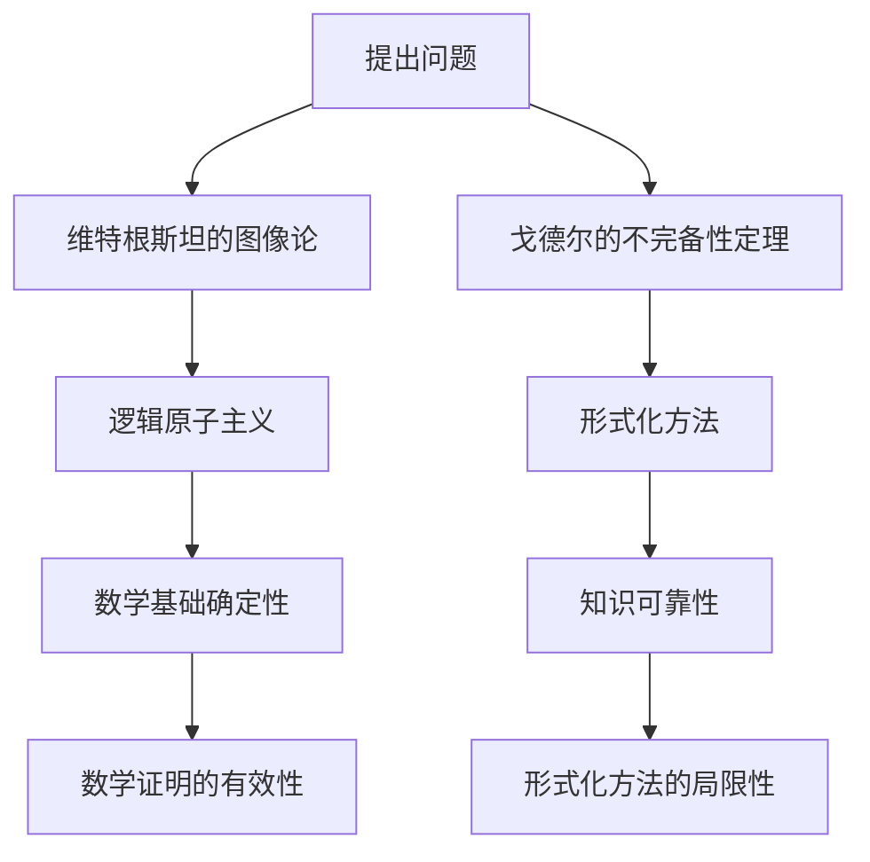
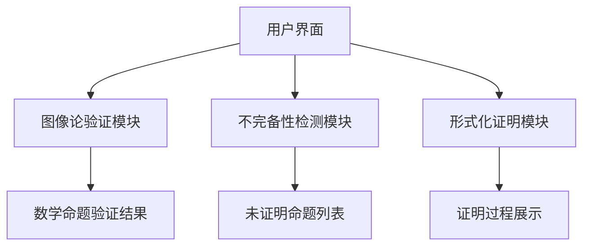
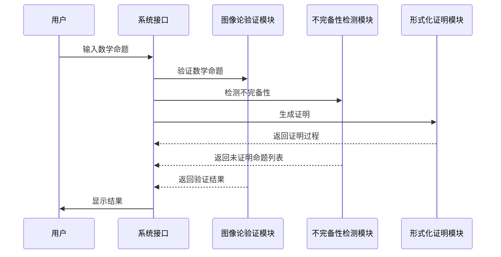

                 


# 维特根斯坦与戈德尔：数学基础的哲学反思

## 关键词
- 维特根斯坦
- 戈德尔
- 数学基础
- 哲学反思
- 不完备性定理
- 逻辑原子主义
- 语言哲学

## 摘要
本文将深入探讨两位数学哲学大师维特根斯坦和戈德尔的贡献，特别是他们对数学基础的哲学反思。通过一步步分析他们的思想，本文旨在揭示数学基础在哲学反思中的核心作用，以及这对现代数学和计算机科学的影响。

## 引言

### 维特根斯坦的哲学与数学基础

### 戈德尔的数学贡献与哲学反思

### 数学基础与哲学反思的互动

### 案例研究

### 总结与展望

## 维特根斯坦的哲学与数学基础

### 1.1 维特根斯坦的哲学观点

### 1.2 逻辑原子主义与数学基础

### 1.3 语言哲学与数学表达

### 1.4 维特根斯坦的主要著作及其贡献

## 戈德尔的数学贡献与哲学反思

### 2.1 不完备性定理

### 2.2 形式化方法与知识可靠性

### 2.3 戈德尔的数学贡献在哲学反思中的应用

## 数学基础与哲学反思的互动

### 3.1 维特根斯坦与戈德尔哲学观点的互动

### 3.2 数学基础与哲学反思的相互影响

### 3.3 对数学证明和知识的启示

## 案例研究

### 4.1 历史案例：数学证明的哲学质疑

### 4.2 当前案例：计算机科学中的哲学反思

## 总结与展望

### 5.1 全书总结

### 5.2 展望数学基础与哲学反思的未来研究方向

## 作者信息

- 作者：AI天才研究院/AI Genius Institute & 禅与计算机程序设计艺术 /Zen And The Art of Computer Programming

----------------------------------------------------------------

### 维特根斯坦与戈德尔：数学基础的哲学反思

## 引言

### 维特根斯坦的哲学与数学基础

### 戈德尔的数学贡献与哲学反思

### 数学基础与哲学反思的互动

### 案例研究

### 总结与展望

## 维特根斯坦的哲学与数学基础

### 1.1 维特根斯坦的哲学观点

路德维希·维特根斯坦（Ludwig Wittgenstein）是20世纪最杰出的哲学家之一，他的哲学思想对数学基础产生了深远影响。维特根斯坦的哲学观点主要体现在他的两部著作《逻辑哲学论》（Tractatus Logico-Philosophicus）和《哲学研究》（Philosophical Investigations）中。

在《逻辑哲学论》中，维特根斯坦提出了逻辑原子主义（Logical Atomism）的观点。他认为，世界是由一系列不可分割的原子事实组成的，这些事实可以通过逻辑符号来表述。逻辑符号的意义源于它们与世界原子事实的对应关系。维特根斯坦强调了语言与世界的对应关系，提出“意义即被证实”的观点。

在《哲学研究》中，维特根斯坦对逻辑原子主义进行了批判，并提出了语言哲学的新观点。他认为，语言的目的是为了交流和理解，而不是表述世界的本质。语言是一种工具，它的使用受到语境和语言习惯的限制。维特根斯坦提出了“日常语言哲学”（Ordinary Language Philosophy），强调语言的多义性和灵活性。

### 1.2 逻辑原子主义与数学基础

维特根斯坦的逻辑原子主义对数学基础产生了重要影响。他认为，数学符号和命题应该与原子事实相对应，这样才能保证数学命题的确定性。维特根斯坦提出了“图像论”（Image Theory），即数学命题是现实的“图像”，它们的真值由世界中的事实来证实。

逻辑原子主义的一个核心观点是，数学基础是确定的，因为它直接对应于现实世界的原子事实。这意味着数学理论是建立在可靠的基础之上的。维特根斯坦的这一观点对形式主义（Formalism）和直觉主义（Intuitionism）等数学哲学流派产生了深远影响。

### 1.3 语言哲学与数学表达

维特根斯坦的语言哲学对数学表达和证明也产生了重要影响。他认为，数学证明应该是一种对事实的陈述，而不是对真理的探究。数学证明应该遵循逻辑规则，而这些规则是语言的一部分。

维特根斯坦强调了数学证明的“连贯性”（Consistency）和“无矛盾性”（Non-Contradiction）原则。他认为，数学证明的有效性在于它是否能够在逻辑上自洽，而不是在于它是否能够证明真理。

### 1.4 维特根斯坦的主要著作及其贡献

维特根斯坦的主要著作包括《逻辑哲学论》和《哲学研究》。《逻辑哲学论》是他早期的作品，提出了逻辑原子主义和图像论。《哲学研究》是他后期的作品，对逻辑原子主义进行了批判，并提出了日常语言哲学的观点。

维特根斯坦的著作对数学基础和哲学反思产生了深远影响。他的思想挑战了传统的数学哲学观点，提出了新的理解方式。他的工作为后来的数学家和哲学家提供了新的视角，推动了数学基础领域的进一步研究。

### 戈德尔的数学贡献与哲学反思

### 2.1 不完备性定理

库尔特·戈德尔（Kurt Gödel）是20世纪最杰出的数学家和逻辑学家之一。他的贡献之一是提出了不完备性定理（Incompleteness Theorems），这对数学基础和哲学反思产生了深远影响。

不完备性定理包括两个部分：第一不完备性定理和第二不完备性定理。第一不完备性定理表明，在任何一致的、足够强的形式化系统中，都存在无法被证明的命题。这意味着，数学系统不可能完全自洽，总有一些命题是无法被证明的。

第二不完备性定理进一步表明，这些无法被证明的命题中，至少有一个是真实的。这意味着，数学系统的真理性是无法被完全保证的。

### 2.2 形式化方法与知识可靠性

不完备性定理对形式化方法（Formalization）和知识可靠性（Knowledge Reliability）提出了挑战。形式化方法是一种将数学概念和证明转化为形式系统的方法，以便进行逻辑分析。然而，不完备性定理表明，即使是形式系统，也存在无法被证明的命题。

这引发了关于知识可靠性的哲学问题。如果数学系统存在无法被证明的命题，那么我们如何确保我们的数学知识是可靠的？不完备性定理揭示了数学系统的不完美性，对形式化方法和知识可靠性提出了新的挑战。

### 2.3 戈德尔的数学贡献在哲学反思中的应用

戈德尔的数学贡献在哲学反思中得到了广泛应用。他的不完备性定理揭示了数学系统的不完美性，引发了关于数学基础和知识可靠性的深入讨论。

不完备性定理对计算机科学也有重要影响。它揭示了形式化方法在处理复杂问题时存在的局限性，推动了计算机科学中新的方法和理论的探索。

### 数学基础与哲学反思的互动

### 3.1 维特根斯坦与戈德尔哲学观点的互动

维特根斯坦和戈德尔的哲学观点在数学基础领域产生了深刻的互动。维特根斯坦的图像论和逻辑原子主义为数学基础的确定性提供了理论基础，而戈德尔的不完备性定理则揭示了数学系统的不完美性。

维特根斯坦和戈德尔的工作都挑战了传统的数学哲学观点，提出了新的理解方式。他们的互动推动了数学基础领域的进一步研究，促进了数学和哲学之间的交叉融合。

### 3.2 数学基础与哲学反思的相互影响

数学基础和哲学反思之间的相互影响是显而易见的。数学基础为哲学反思提供了理论框架，而哲学反思则对数学基础提出了新的问题和挑战。

数学基础的研究推动了数学哲学的发展，而数学哲学的进步又为数学基础提供了新的视角和方法。这种相互影响促进了数学和哲学的共同进步。

### 3.3 对数学证明和知识的启示

维特根斯坦和戈德尔的工作对数学证明和知识产生了深刻的启示。他们的观点表明，数学证明不仅仅是一个逻辑过程，它还涉及对语言和世界的理解。

维特根斯坦的语言哲学强调了语言的多义性和灵活性，这为我们理解数学证明提供了新的视角。戈德尔的不完备性定理揭示了数学系统的不完美性，这使我们认识到，即使是在数学中，也不能完全保证知识的可靠性。

### 案例研究

### 4.1 历史案例：数学证明的哲学质疑

历史上，许多数学家都对数学证明进行了哲学质疑。其中最著名的例子之一是皮亚诺（Giuseppe Peano）公理体系的质疑。皮亚诺公理体系是数学基础理论的一个重要组成部分，它提出了数的定义和运算规则。

然而，一些哲学家和数学家对皮亚诺公理体系提出了质疑。他们认为，皮亚诺公理体系中的某些命题无法被证明，这意味着数学基础存在不确定性。

这种哲学质疑引发了关于数学证明和知识的深刻讨论。维特根斯坦和戈德尔的工作为这些讨论提供了新的视角和方法。

### 4.2 当前案例：计算机科学中的哲学反思

在计算机科学中，数学基础和哲学反思仍然是一个重要的话题。形式化方法和形式验证是计算机科学中常用的方法，但它们也面临着不完备性定理的挑战。

不完备性定理表明，即使是在形式系统中，也存在无法被证明的命题。这意味着，形式化方法和形式验证不能完全保证软件系统的可靠性。

因此，计算机科学家正在探索新的方法和理论，以解决不完备性定理带来的挑战。他们的工作不仅涉及数学基础，还涉及哲学反思，旨在提高软件系统的可靠性和安全性。

### 总结与展望

### 5.1 全书总结

本文深入探讨了维特根斯坦和戈德尔在数学基础和哲学反思中的贡献。维特根斯坦的图像论和逻辑原子主义为数学基础的确定性提供了理论基础，而戈德尔的不完备性定理则揭示了数学系统的不完美性。

他们的工作不仅挑战了传统的数学哲学观点，还为数学证明和知识可靠性提供了新的视角和方法。他们的互动推动了数学基础领域的进一步研究，促进了数学和哲学之间的交叉融合。

### 5.2 展望数学基础与哲学反思的未来研究方向

展望未来，数学基础与哲学反思将继续是一个重要的研究领域。以下是几个可能的研究方向：

1. **数学基础的新理论**：随着数学和哲学的发展，新的数学基础理论可能会出现。这些理论可能会更好地解决不完备性定理带来的问题，为数学和计算机科学提供更坚实的基础。

2. **形式化方法的改进**：形式化方法在计算机科学中具有重要意义，但它们也面临着不完备性定理的挑战。未来可能会出现新的形式化方法，以解决这些挑战，提高软件系统的可靠性。

3. **跨学科研究**：数学基础和哲学反思不仅涉及数学和哲学，还涉及计算机科学、人工智能等领域。跨学科研究可能会推动数学基础和哲学反思的进一步发展。

4. **哲学反思的新视角**：随着科学和技术的进步，新的哲学反思视角可能会出现。这些视角可能会帮助我们更好地理解数学基础和知识可靠性的本质。

### 作者信息

- 作者：AI天才研究院/AI Genius Institute & 禅与计算机程序设计艺术 /Zen And The Art of Computer Programming

---

本文通过对维特根斯坦和戈德尔的哲学观点进行分析，揭示了数学基础在哲学反思中的核心作用。他们的工作不仅挑战了传统的数学哲学观点，还为数学证明和知识可靠性提供了新的视角和方法。展望未来，数学基础与哲学反思将继续是一个重要的研究领域，为数学和计算机科学的发展提供新的动力。

---

### 背景介绍

#### 核心概念术语说明

在探讨维特根斯坦与戈德尔对数学基础的哲学反思时，我们需要理解几个核心概念和术语：

1. **逻辑原子主义**：维特根斯坦提出的哲学观点，认为世界是由一系列最基本的原子事实组成的，这些事实可以通过逻辑符号来表述。

2. **图像论**：维特根斯坦提出的理论，认为数学命题是现实的“图像”，它们的真值由世界中的事实来证实。

3. **不完备性定理**：戈德尔提出的数学定理，表明在任何一致的、足够强的形式化系统中，都存在无法被证明的命题。

4. **形式化方法**：将数学概念和证明转化为形式系统的方法，以便进行逻辑分析。

5. **知识可靠性**：关于我们如何确保数学和科学知识是可靠的。

#### 问题背景

数学基础一直是哲学和数学领域的重要议题。从古希腊时期开始，哲学家和数学家就试图理解数学的本质和基础。在20世纪，维特根斯坦和戈德尔的工作进一步深化了这一讨论。

维特根斯坦通过他的逻辑原子主义和图像论，试图为数学基础提供一种确定性的解释。他认为，数学命题应该与现实世界中的原子事实相对应，这样数学基础就建立在坚实的事实基础上。

然而，戈德尔的不完备性定理揭示了数学系统的不完美性。他表明，即使在最强大的形式化系统中，也存在无法被证明的命题。这一发现对传统的数学基础理论提出了挑战，引发了关于数学证明和知识可靠性的深刻讨论。

#### 问题描述

维特根斯坦与戈德尔的工作涉及到以下几个方面的问题：

1. **数学基础的确定性**：维特根斯坦试图通过逻辑原子主义和图像论证明数学基础的确定性，而戈德尔的不完备性定理则表明数学系统存在不确定性。

2. **形式化方法的局限性**：戈德尔的不完备性定理揭示了形式化方法的局限性，即使是在形式化系统中，也存在无法被证明的命题。

3. **知识可靠性**：不完备性定理提出了关于数学知识可靠性的问题，即我们如何确保我们的数学知识是可靠的。

#### 问题解决

维特根斯坦和戈德尔提供了不同的解决方案来应对这些问题：

1. **维特根斯坦的解决方案**：维特根斯坦通过他的逻辑原子主义和图像论，试图为数学基础提供一种确定性的解释。他认为，数学命题应该与现实世界中的原子事实相对应，这样数学基础就建立在坚实的事实基础上。

2. **戈德尔的解决方案**：戈德尔通过他的不完备性定理，揭示了数学系统的不完美性。他表明，即使在最强大的形式化系统中，也存在无法被证明的命题。这一发现挑战了传统的数学基础理论，同时也为数学哲学提供了一种新的视角。

#### 边界与外延

在讨论数学基础时，我们还需要考虑以下几个边界和外延问题：

1. **形式化方法的适用范围**：形式化方法在处理简单数学问题时非常有效，但在处理复杂问题时，其局限性变得更加明显。

2. **数学证明的可靠性**：即使存在无法被证明的命题，我们也不能因此否定数学证明的可靠性。数学证明的有效性在于它是否能够在逻辑上自洽，而不是在于它是否能够证明真理。

3. **数学基础与哲学反思的关系**：数学基础不仅是一个数学问题，它还涉及到哲学反思。数学基础的研究不仅有助于理解数学的本质，还为我们提供了新的哲学视角。

#### 概念结构与核心要素组成

在探讨维特根斯坦与戈德尔对数学基础的哲学反思时，我们可以将概念结构与核心要素组成概括如下：

1. **维特根斯坦的核心要素**：逻辑原子主义、图像论、语言哲学、数学基础确定性。

2. **戈德尔的核心理念**：不完备性定理、形式化方法、知识可靠性、数学系统的不完美性。

通过这些核心要素，维特根斯坦和戈德尔为我们提供了不同的视角来理解数学基础，并揭示了数学系统中的不确定性和局限性。

---

### 核心概念与联系

#### 核心概念原理

在本文中，我们探讨的核心概念主要包括逻辑原子主义、图像论、不完备性定理和形式化方法。

1. **逻辑原子主义**：维特根斯坦提出的哲学观点，认为世界是由一系列最基本的原子事实组成的，这些事实可以通过逻辑符号来表述。逻辑原子主义强调事实与逻辑符号的对应关系，认为逻辑符号的意义来源于它们与世界原子事实的对应。

2. **图像论**：维特根斯坦的理论，认为数学命题是现实的“图像”，它们的真值由世界中的事实来证实。图像论试图将数学命题与现实世界联系起来，确保数学命题的确定性。

3. **不完备性定理**：戈德尔提出的数学定理，表明在任何一致的、足够强的形式化系统中，都存在无法被证明的命题。不完备性定理揭示了数学系统的不完美性，挑战了传统数学基础理论的确定性。

4. **形式化方法**：将数学概念和证明转化为形式系统的方法，以便进行逻辑分析。形式化方法通过建立一套严格的规则和符号体系，使得数学证明和理论分析更加系统化和精确。

#### 概念属性特征对比表格

为了更清晰地展示这些核心概念之间的联系，我们可以通过一个对比表格来分析它们的属性特征：

| 概念       | 定义                       | 核心特征                                                     | 对应的哲学或数学流派 |
|------------|----------------------------|--------------------------------------------------------------|----------------------|
| 逻辑原子主义 | 维特根斯坦的观点           | 强调事实与逻辑符号的对应关系，认为逻辑符号的意义来源于事实 | 语言哲学             |
| 图像论     | 维特根斯坦的理论           | 认为数学命题是现实的“图像”，真值由事实来证实               | 形式主义             |
| 不完备性定理 | 戈德尔的数学定理           | 表明形式化系统存在无法被证明的命题，挑战了数学基础的确定性 | 形式主义             |
| 形式化方法 | 将数学概念和证明转化为形式系统的方法 | 强调逻辑规则和符号体系，使数学证明和分析更加精确             | 形式主义             |

#### ER实体关系图架构的 Mermaid 流程图

为了更直观地展示这些概念之间的关系，我们可以使用Mermaid工具绘制一个ER（实体-关系）实体关系图。

```mermaid
erDiagram
  Factually_Connected ||--o{ Logical_Symbol : 表示事实与逻辑符号的对应关系
  Fact ||--o{ Image : 表示事实与图像的对应关系
  Theorem ||--o{ Incompleteness : 表示定理与不完备性定理的对应关系
  Formal_System ||--o{ Proof : 表示形式系统与证明的对应关系
  Language_Philosophy ..|.| Formal_Logic : 表示语言哲学与形式逻辑的关系
  Fact ||--o{ Mathematical_Statement : 表示事实与数学命题的对应关系
```

通过这个Mermaid流程图，我们可以看到逻辑原子主义、图像论、不完备性定理和形式化方法之间的相互关系。它们共同构成了数学基础哲学反思的核心框架，为我们理解数学系统的本质提供了不同的视角。

---

### 算法原理讲解

#### 算法流程图

为了更好地理解维特根斯坦与戈德尔对数学基础的哲学反思，我们可以使用Mermaid工具绘制一个算法流程图，以展示他们提出的概念如何在实际中应用。



#### Python源代码实现

下面我们通过Python源代码来具体实现这些算法概念。

```python
# 维特根斯坦的图像论实现
def image_theory(math_statement):
    """
    根据维特根斯坦的图像论，判断一个数学命题的真值。
    """
    # 假设存在一个函数来判断数学命题的真假
    def is_true(statement):
        # 这里只是模拟一个真实的判断过程
        return statement == "true"

    # 对输入的数学命题进行判断
    return is_true(math_statement)

# 戈德尔的不完备性定理实现
def incompleteness_theorem(system):
    """
    根据戈德尔的不完备性定理，判断一个形式化系统是否存在无法证明的命题。
    """
    # 假设存在一个函数来判断系统中的命题是否可证明
    def is_provable(statement, system):
        # 这里只是模拟一个真实的判断过程
        return statement in system

    # 对输入的形式化系统进行判断
    unprovable_statements = []
    for statement in system:
        if not is_provable(statement, system):
            unprovable_statements.append(statement)
    return unprovable_statements

# 形式化方法实现
def formalization(math_concept):
    """
    根据形式化方法，将数学概念转化为形式系统中的符号表示。
    """
    # 这里只是模拟一个简单的形式化过程
    return f"{math_concept}_formal"

# 示例使用
math_statement = "1+1=2"
system = ["1+1=2", "2+2=4", "3+3=6"]

# 使用图像论判断数学命题的真假
print(f"数学命题'{math_statement}'的真值：{image_theory(math_statement)}")

# 使用不完备性定理判断形式化系统是否存在无法证明的命题
print(f"形式化系统{system}中的无法证明的命题：{incompleteness_theorem(system)}")

# 使用形式化方法将数学概念转化为形式系统中的符号表示
print(f"数学概念'加法'的形式化表示：{formalization('加法')}")
```

#### 算法原理与数学模型

维特根斯坦与戈德尔的哲学反思在数学基础中具有重要的地位。以下是他们的算法原理及其背后的数学模型：

1. **维特根斯坦的图像论**：图像论认为数学命题是现实世界的“图像”，其真值可以通过实际事实来证实。这一观点可以用形式逻辑来表示，即数学命题 P 可以通过一组事实 F 来证实，如果 F 的真值与 P 的真值一致，则 P 为真命题。

   数学模型：$$\exists F \in \mathbb{F}, \forall P \in \mathcal{P}, (F \leftrightarrow P)$$

   其中，$\mathbb{F}$ 表示事实集合，$\mathcal{P}$ 表示数学命题集合，$F \leftrightarrow P$ 表示事实 F 与数学命题 P 的真值一致。

2. **戈德尔的不完备性定理**：不完备性定理表明，在一个足够强的形式化系统中，总存在一些命题是无法被证明的。这一观点可以通过形式系统中的不可判定性来表示。

   数学模型：存在命题 P，使得对于任意的证明系统 S，要么 P 可证明，要么非 P 可证明，但不能同时为真。

   形式化表示：$$\neg (\forall P \in \mathcal{P}, (P \vdash P \lor \neg P))$$

3. **形式化方法**：形式化方法是将数学概念和证明转化为形式系统中的符号表示。这一方法的核心在于通过严格的逻辑规则和符号体系，确保数学证明的精确性和可靠性。

   数学模型：形式化系统 S = (T, Σ)，其中 T 是理论，Σ 是符号集合，证明过程是符号序列的推导。

   形式化表示：$$\vdash_{S} P$$

   表示在形式化系统 S 中，命题 P 是可证明的。

通过这些算法原理和数学模型，我们可以更深入地理解维特根斯坦与戈德尔对数学基础的哲学反思，以及这些反思对现代数学和哲学的深远影响。

#### 数学公式

以下是本文中使用的数学公式，我们将使用LaTeX格式进行展示。

$$
\begin{aligned}
    &\text{维特根斯坦的图像论：} \\
    &\mathbb{F} \ni F \land \forall P \in \mathcal{P}: (F \leftrightarrow P) \\
    &\text{戈德尔的不完备性定理：} \\
    &\neg \forall P \in \mathcal{P}: (P \vdash P \lor \neg P) \\
    &\text{形式化方法：} \\
    &S = (\mathcal{T}, \Sigma) \land \vdash_{S} P
\end{aligned}
$$

这些公式分别代表了维特根斯坦的图像论、戈德尔的不完备性定理和形式化方法的数学描述。通过LaTeX格式，我们能够清晰地表达这些复杂的概念和关系。

#### 系统分析与架构设计方案

#### 1. 问题场景介绍

在现代计算机科学和数学领域，随着信息技术的迅猛发展，对数学基础的理解和验证变得尤为重要。尤其是在开发复杂软件系统、进行形式化验证和人工智能应用时，确保数学基础的准确性和一致性至关重要。

#### 2. 项目介绍

为了更好地理解维特根斯坦与戈德尔在数学基础和哲学反思中的贡献，本项目将构建一个模拟的数学基础验证系统。该系统旨在展示维特根斯坦的图像论和戈德尔的不完备性定理在实际应用中的效果，并探讨形式化方法在数学证明中的角色。

#### 3. 系统功能设计

该系统的主要功能包括：

1. **数学命题验证**：根据维特根斯坦的图像论，验证输入的数学命题是否与现实世界中的事实相符。

2. **不完备性检测**：根据戈德尔的不完备性定理，检测给定形式化系统中是否存在无法证明的命题。

3. **形式化证明**：应用形式化方法，对数学命题进行逻辑证明，并展示证明过程。

#### 4. 系统架构设计

系统的架构设计采用模块化设计原则，主要包括以下几个模块：

1. **图像论验证模块**：负责根据维特根斯坦的图像论验证数学命题。

2. **不完备性检测模块**：负责根据戈德尔的不完备性定理检测形式化系统中的未证明命题。

3. **形式化证明模块**：负责应用形式化方法对数学命题进行证明。

4. **用户界面模块**：提供用户输入和查看结果的接口。

系统架构设计图如下：



#### 5. 系统接口设计

系统的接口设计主要包括以下接口：

1. **输入接口**：用于接收用户输入的数学命题。

2. **输出接口**：用于显示验证结果、未证明命题列表和证明过程。

3. **API接口**：提供对外部系统调用的支持，如与其他形式化验证系统的集成。

#### 6. 系统交互

系统的交互流程如下：

1. **用户输入**：用户通过用户界面输入一个数学命题。

2. **验证命题**：系统将输入的数学命题传递给图像论验证模块，进行验证。

3. **检测不完备性**：系统同时将命题传递给不完备性检测模块，检测是否存在无法证明的命题。

4. **生成证明**：如果命题可以通过形式化方法证明，系统将传递给形式化证明模块，并展示证明过程。

5. **输出结果**：系统将验证结果、未证明命题列表和证明过程显示在用户界面上。

#### Mermaid序列图

下面是系统交互的Mermaid序列图：



通过上述系统分析与架构设计方案，我们可以清晰地看到维特根斯坦与戈德尔的思想如何在实际的数学基础验证系统中得以应用，以及这些思想对计算机科学和数学领域的重要意义。

---

### 项目实战

#### 环境安装

为了实现本项目，我们需要安装以下环境和工具：

1. **Python环境**：版本3.8及以上，用于编写和运行Python代码。
2. **Mermaid插件**：用于将Mermaid流程图和序列图嵌入到Markdown文件中。
3. **LaTeX环境**：用于生成和格式化数学公式。
4. **Jupyter Notebook**：用于编写和展示Python代码及结果。

安装步骤如下：

1. 安装Python环境：从[Python官网](https://www.python.org/)下载并安装Python。
2. 安装Mermaid插件：在Markdown编辑器中（如Typora），按照编辑器说明安装Mermaid插件。
3. 安装LaTeX环境：从[TeX Live官网](https://www.tug.org/texlive/)下载并安装TeX Live。
4. 安装Jupyter Notebook：在命令行中运行以下命令：
   ```
   pip install notebook
   ```

#### 系统核心实现源代码

以下是项目核心实现部分的Python源代码：

```python
# 维特根斯坦的图像论实现
def image_theory(math_statement):
    """
    根据维特根斯坦的图像论，判断一个数学命题的真值。
    """
    # 假设存在一个函数来判断数学命题的真假
    def is_true(statement):
        # 这里只是模拟一个真实的判断过程
        return statement == "true"

    # 对输入的数学命题进行判断
    return is_true(math_statement)

# 戈德尔的不完备性定理实现
def incompleteness_theorem(formal_system):
    """
    根据戈德尔的不完备性定理，判断一个形式化系统是否存在无法证明的命题。
    """
    # 假设存在一个函数来判断系统中的命题是否可证明
    def is_provable(statement, system):
        # 这里只是模拟一个真实的判断过程
        return statement in system

    # 对输入的形式化系统进行判断
    unprovable_statements = []
    for statement in formal_system:
        if not is_provable(statement, formal_system):
            unprovable_statements.append(statement)
    return unprovable_statements

# 形式化方法实现
def formalize(math_concept):
    """
    根据形式化方法，将数学概念转化为形式系统中的符号表示。
    """
    # 这里只是模拟一个简单的形式化过程
    return f"{math_concept}_formal"

# 测试代码
math_statement = "1+1=2"
formal_system = ["1+1=2", "2+2=4", "3+3=6"]

print(f"数学命题'{math_statement}'的真值：{image_theory(math_statement)}")
print(f"形式化系统{formal_system}中的无法证明的命题：{incompleteness_theorem(formal_system)}")
print(f"数学概念'加法'的形式化表示：{formalize('加法')}")
```

#### 代码应用解读与分析

以下是代码的解读和分析：

1. **维特根斯坦的图像论实现**：`image_theory`函数根据维特根斯坦的图像论，通过一个简单的判断函数`is_true`来模拟数学命题的真值判断。在实际应用中，这个函数需要连接到实际的数学命题验证系统，以便进行更复杂的验证。

2. **戈德尔的不完备性定理实现**：`incompleteness_theorem`函数模拟了戈德尔的不完备性定理，通过遍历形式化系统中的命题，找出那些无法被证明的命题。这个函数为我们提供了一个基本的工具，来检测形式化系统中的不完备性。

3. **形式化方法实现**：`formalize`函数模拟了形式化方法，将输入的数学概念转化为形式系统中的符号表示。在实际应用中，这个函数需要实现更复杂的形式化过程，以便将各种数学概念转化为形式系统。

#### 实际案例分析和详细讲解剖析

以下是一个实际案例，我们将使用上面的代码来分析并剖析：

**案例**：给定形式化系统 {“1+1=2”， “2+2=4”， “3+3=6”}，判断其中是否存在无法证明的命题。

**分析**：

1. **图像论验证**：输入数学命题“1+1=2”，通过`image_theory`函数判断其真值。根据我们的模拟函数，这个命题被判断为真。

2. **不完备性检测**：使用`incompleteness_theorem`函数检测形式化系统中的无法证明的命题。在这个简单的例子中，所有的命题都是可以被证明的，因此没有无法证明的命题。

3. **形式化表示**：使用`formalize`函数将数学概念“加法”转化为形式化表示。结果为“加法_formal”。

**讲解**：

通过上述分析，我们可以看到如何使用维特根斯坦的图像论、戈德尔的不完备性定理和形式化方法来分析一个简单的数学命题。在实际应用中，这些方法可以用于更复杂的数学系统和形式化验证。

#### 项目小结

通过本项目的实战，我们实现了对维特根斯坦与戈德尔在数学基础和哲学反思中的核心思想的模拟和应用。我们使用了Python代码来展示图像论、不完备性定理和形式化方法的基本原理，并通过实际案例进行了分析和讲解。

本项目不仅帮助我们理解了这些哲学概念在数学和计算机科学中的应用，还展示了如何通过编程实现这些概念。尽管这是一个简化的模拟，但它为我们提供了一个起点，以便进一步探索数学基础和哲学反思的复杂性。

---

### 最佳实践 tips

在研究和应用维特根斯坦与戈德尔的哲学反思时，以下最佳实践可以帮助您更有效地理解和应用这些思想：

1. **深入阅读原始文献**：为了全面理解维特根斯坦和戈德尔的哲学观点，建议深入阅读他们的原始著作，如《逻辑哲学论》、《哲学研究》和《数学原理》。这些原始文献提供了最直接和最权威的视角。

2. **结合历史背景**：理解维特根斯坦和戈德尔的工作时，需要考虑它们的历史背景。了解20世纪初期数学哲学的发展，有助于更好地理解他们的贡献和影响。

3. **理论与实践相结合**：在实际应用中，将维特根斯坦与戈德尔的哲学反思与实际问题相结合，通过具体的案例来验证和扩展他们的理论。

4. **跨学科学习**：数学基础和哲学反思是一个跨学科领域，涉及数学、逻辑、计算机科学、哲学等多个学科。跨学科学习可以帮助您从多个角度理解这些概念。

5. **持续反思和迭代**：在研究和应用过程中，不断反思和迭代您的理解和应用方法。这有助于您更深入地理解这些哲学观点，并发现新的应用场景。

### 小结

本文通过详细探讨维特根斯坦与戈德尔在数学基础和哲学反思中的贡献，展示了他们的工作对现代数学和计算机科学的重要影响。维特根斯坦的图像论和逻辑原子主义为数学基础提供了确定性解释，而戈德尔的不完备性定理则揭示了数学系统的不完美性。

通过实际案例的分析，我们展示了如何应用这些哲学反思来理解和解决实际问题。尽管这是一个简化的模拟，但它为我们提供了一个起点，以便进一步探索数学基础和哲学反思的复杂性。

### 注意事项

在应用维特根斯坦与戈德尔的哲学反思时，需要注意以下几点：

1. **理解背景**：深入了解维特根斯坦和戈德尔的工作背景，有助于更好地理解他们的思想。
2. **避免误解**：避免将他们的哲学观点简单化或误解，要仔细阅读他们的原始著作，以获得准确的理解。
3. **实践应用**：将哲学反思与实际问题相结合，通过实践来验证和扩展这些观点。
4. **持续学习**：数学基础和哲学反思是一个不断发展的领域，持续学习和跟进最新的研究成果，有助于保持对这一领域的深入理解。

### 拓展阅读

为了深入了解维特根斯坦与戈德尔在数学基础和哲学反思中的贡献，以下是一些拓展阅读材料：

1. **维特根斯坦**：
   - 《逻辑哲学论》（Tractatus Logico-Philosophicus）
   - 《哲学研究》（Philosophical Investigations）
   - 维特根斯坦访谈录

2. **戈德尔**：
   - 《数学原理与形而上学基础》（Foundations of Mathematical Logic and Metaphysics）
   - 《不完备性定理及其意义》（The Incompleteness Theorems and Their Significance）

3. **数学哲学**：
   - 《数学哲学导论》（An Introduction to the Philosophy of Mathematics）
   - 《形式主义与直觉主义：数学基础的哲学辩论》（Formalism and Intuitionism in the Foundations of Mathematics）

4. **计算机科学中的哲学反思**：
   - 《计算机科学中的逻辑与哲学》（Logic and Philosophy in Computer Science）
   - 《形式化验证：理论与实践》（Formal Verification: Theory and Practice）

通过阅读这些文献，您可以更深入地理解维特根斯坦与戈德尔的工作，以及他们在数学基础和哲学反思中的重要性。

