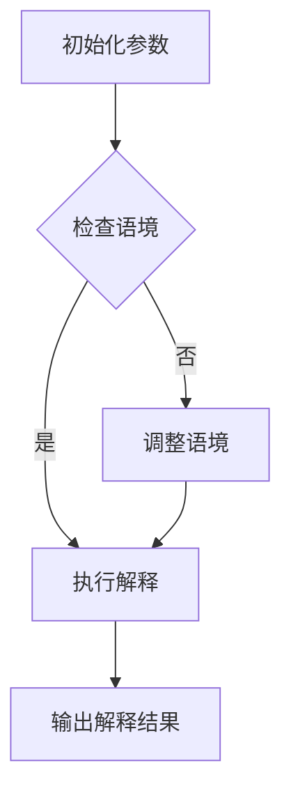

                 


### 引言

#### 1.1 问题背景与重要性

在语言哲学的研究领域，维特根斯坦与戴维森是两位具有重要影响力的哲学家。路德维希·维特根斯坦（Ludwig Wittgenstein）是20世纪最重要的哲学家之一，他的哲学思想对语言哲学、认识论和心灵哲学等领域产生了深远的影响。维特根斯坦的早期作品《逻辑哲学论》（Tractatus Logico-Philosophicus）探讨了语言、逻辑和现实之间的关系，而他的后期作品《哲学研究》（Philosophical Investigations）则对日常语言和语言使用进行了深入的分析。

同样，唐纳德·戴维森（Donald Davidson）是美国当代著名的哲学家，他的工作主要集中在语言哲学、认识论和心灵哲学等领域。戴维森提出了许多关于语言意义、认知和行动的理论，特别是在他的解释理论（interpretation theory）和真理条件理论（condition of truth）方面有着显著的贡献。

本文的背景在于探讨维特根斯坦与戴维森在语言哲学中的思想，特别是他们的“radical interpretation”（激进解释）理论。维特根斯坦和戴维森都试图通过分析语言的本质和使用，来理解人类思维和认知的运作方式。他们的理论不仅对哲学领域产生了深远的影响，也为认知科学和人工智能等领域提供了重要的理论基础。

本文的重要性在于，通过对维特根斯坦与戴维森的思想进行系统性的分析和比较，可以更深入地理解激进解释的理论基础和实际应用。此外，本文还旨在为读者提供一个清晰、结构化的学习路径，帮助他们更好地掌握和理解这些复杂而深奥的哲学概念。

### 维特根斯坦的哲学贡献

路德维希·维特根斯坦（Ludwig Wittgenstein）是20世纪最重要的哲学家之一，他的工作在语言哲学、逻辑学和认识论等领域产生了深远的影响。维特根斯坦的哲学思想分为早期和后期两个阶段，两者在方法和主题上有着显著的不同。

#### 1.1.1 早期哲学

维特根斯坦的早期哲学体现在他的代表作《逻辑哲学论》（Tractatus Logico-Philosophicus）中。这本书以逻辑原子主义为基础，探讨了语言、逻辑和现实之间的关系。维特根斯坦在这本书中提出了以下核心观点：

1. **语言与现实的对应关系**：维特根斯坦认为，语言是现实世界的反映，通过语言符号，我们可以表达世界的逻辑结构和事实。
   
2. **逻辑形式**：他强调了逻辑形式的普遍性和独立性，认为逻辑形式是所有语言和思考的基础。

3. **不可说之事**：维特根斯坦提出了“不可说之事”（what can't be said can't be thought）的观点，认为有些经验或事实是无法用语言表达的。

4. **图像理论**：他提出了“图像理论”（image theory），认为命题是一种图像，它形象地描述了世界状态。

#### 1.1.2 后期哲学

维特根斯坦的后期哲学体现在他的另一部代表作《哲学研究》（Philosophical Investigations）中。在这本书中，维特根斯坦转向日常语言哲学，对语言的实际使用和语言游戏进行了深入的分析。后期哲学的主要观点包括：

1. **语言游戏**：维特根斯坦提出了“语言游戏”（language game）的概念，认为语言是用于特定目的的规则系统。不同的语言游戏有不同的规则和使用方式。

2. **意义与使用**：他强调意义不是内在属性，而是与语言的使用相关。意义是通过语言在特定情境中的使用来体现的。

3. **语言与生活**：维特根斯坦认为，语言是生活的一部分，语言活动与我们的生活方式紧密相关。

4. **不可解问题**：他提出了许多哲学问题，如“私人语言问题”（private language argument），质疑了私人语言的可能性。

#### 1.1.3 维特根斯坦对语言哲学的贡献

维特根斯坦对语言哲学的贡献体现在他对语言本质和语言使用方式的深刻洞察上。他不仅提出了新的理论框架，如图像理论和语言游戏理论，而且通过批判和质疑传统哲学问题，推动了哲学的发展。维特根斯坦的思想对后来的语言哲学家，如唐纳德·戴维森和约翰·塞尔（John Searle），产生了深远的影响。

维特根斯坦的哲学思想不仅对哲学领域产生了影响，也对其他学科，如认知科学、人工智能和语言学，提供了重要的理论基础。他的思想启示我们，语言不仅仅是符号的集合，更是人类生活和社会实践的组成部分。

### 1.1.4 维特根斯坦与戴维森的关系

维特根斯坦的哲学思想对唐纳德·戴维森产生了深远的影响。戴维森在阅读维特根斯坦的作品后，深受启发，并将维特根斯坦的语言哲学观点应用于自己的研究中。

#### 1.1.4.1 共同点

戴维森的许多理论都受到了维特根斯坦的影响，特别是在语言意义和认知方面。两位哲学家都认为，语言的意义不仅仅在于符号的指称，更在于语言的使用和理解。

1. **语言意义**：维特根斯坦强调意义与使用的关系，而戴维森则提出了“内容解释理论”（content interpretation theory），认为意义是句子与真实世界的对应关系。

2. **认知与理解**：维特根斯坦关注语言在日常生活中的使用，而戴维森则将这种关注扩展到了认知和行动领域，提出了“行动理论”（action theory）。

#### 1.1.4.2 差异

尽管维特根斯坦和戴维森在许多方面有共同点，但他们也有一些重要的差异。

1. **哲学方法**：维特根斯坦倾向于通过批判和质疑来推动哲学的发展，而戴维森则更注重理论构建和逻辑推理。

2. **语言哲学重点**：维特根斯坦关注日常语言和语言游戏，而戴维森则更关注认知、行动和意义。

3. **应用领域**：维特根斯坦的哲学思想对语言学和认知科学产生了影响，而戴维森的理论则对心理学和人工智能等领域产生了影响。

维特根斯坦和戴维森的哲学思想相互补充，共同推动了语言哲学和认知科学的发展。通过他们的工作，我们对语言的本质和认知的运作方式有了更深入的理解。

### 1.1.5 研究动机与目标

本文的研究动机在于探讨维特根斯坦和戴维森在语言哲学中的思想，特别是他们的“radical interpretation”（激进解释）理论。维特根斯坦和戴维森都试图通过分析语言的本质和使用，来理解人类思维和认知的运作方式。他们的理论不仅对哲学领域产生了深远的影响，也为认知科学和人工智能等领域提供了重要的理论基础。

本文的研究目标有以下几点：

1. **理解激进解释**：通过深入分析维特根斯坦和戴维森的理论，理解激进解释的基本原理和实际应用。

2. **比较与分析**：对比维特根斯坦和戴维森在语言哲学中的观点，探讨他们的共同点和差异，以及这些差异如何影响了他们的理论。

3. **应用与启示**：探讨激进解释在认知科学和人工智能等领域的应用，以及这些应用对我们的理解和实践带来的启示。

通过本文的研究，我们希望为读者提供一个清晰、结构化的学习路径，帮助他们更好地掌握和理解这些复杂而深奥的哲学概念。同时，我们也希望通过本文的研究，推动语言哲学和相关领域的发展，为人类理解和解决语言和认知问题提供新的思路和方法。

#### 1.2 研究方法与结构安排

为了系统地探讨维特根斯坦和戴维森在语言哲学中的思想，特别是他们的“radical interpretation”（激进解释）理论，本文采用了多种研究方法，并进行了详细的结构安排。

##### 1.2.1 研究方法

本文的研究方法主要包括文献分析、理论构建和比较分析。

1. **文献分析**：通过对维特根斯坦和戴维森的原始文献进行深入阅读和分析，理解他们的哲学观点和理论。

2. **理论构建**：在理解两位哲学家的理论基础上，构建激进解释的基本框架，并探讨其应用。

3. **比较分析**：对比维特根斯坦和戴维森的观点，分析他们的共同点和差异，以及这些差异如何影响了他们的理论。

##### 1.2.2 文章结构

本文的结构安排分为以下几个部分：

1. **引言**：介绍研究背景、重要性、研究动机和目标。

2. **维特根斯坦的哲学贡献**：分析维特根斯坦的早期和后期哲学，以及他对语言哲学的贡献。

3. **戴维森的语言哲学**：介绍戴维森的理论框架，探讨他的语言哲学与维特根斯坦的关联。

4. **核心概念与理论**：阐述激进解释的核心概念和理论。

5. **案例研究**：分析激进解释在实际应用中的案例。

6. **讨论与批判**：探讨激进解释的优缺点，以及不同哲学家的观点。

7. **结论**：总结本文的主要发现和未来研究方向。

通过以上结构安排，本文旨在为读者提供一个清晰、系统的学习路径，帮助他们深入理解维特根斯坦和戴维森的哲学思想，特别是激进解释的理论和应用。

### 第二部分：维特根斯坦的语言哲学

#### 2.1 维特根斯坦的早期哲学

路德维希·维特根斯坦的早期哲学主要体现在他的代表作《逻辑哲学论》（Tractatus Logico-Philosophicus）中。这本书是他早期的哲学思想的总结，反映了他在逻辑、语言和现实之间的关系方面的独特见解。以下是对《逻辑哲学论》中的核心观点和理论的分析。

##### 2.1.1 《逻辑哲学论》

《逻辑哲学论》是维特根斯坦在1918年完成的，他在这本书中试图解决哲学的基本问题，如语言与现实的关系、逻辑的性质以及知识的本质。以下是该书中的一些关键观点：

1. **逻辑原子主义**：维特根斯坦在《逻辑哲学论》中提出了逻辑原子主义，认为世界是由最基本的逻辑元素（逻辑原子）构成的。这些逻辑原子通过组合形成了复杂的事实和命题。

2. **图像理论**：维特根斯坦提出了图像理论，认为命题是一种图像，它们以某种方式映射现实世界。这种图像理论与逻辑原子主义相结合，构成了他的世界观。

3. **语言的界限**：维特根斯坦认为，语言能够表达的是逻辑事实，而逻辑事实之外的是不可说的。这种观点反映了他对语言局限性的深刻认识。

4. **逻辑形式**：维特根斯坦强调了逻辑形式的普遍性和独立性。他认为逻辑形式是所有语言和思考的基础，逻辑形式与语言符号的对应关系构成了语言的核心。

##### 2.1.2 语言与事实的关系

在《逻辑哲学论》中，维特根斯坦探讨了语言与事实之间的关系。他提出了以下观点：

1. **语言的映射功能**：维特根斯坦认为，语言符号与事实之间存在一种映射关系。语言符号通过描述事实来反映现实世界。

2. **逻辑原子主义**：逻辑原子主义是维特根斯坦在《逻辑哲学论》中提出的一个重要理论。他认为世界是由最基本的逻辑元素（逻辑原子）构成的，这些逻辑原子通过组合形成了复杂的事实和命题。

3. **图像理论**：图像理论是维特根斯坦在《逻辑哲学论》中提出的另一个重要理论。他认为命题是一种图像，它们以某种方式映射现实世界。这种图像理论与逻辑原子主义相结合，构成了他的世界观。

##### 2.1.3 数学与逻辑基础

维特根斯坦在《逻辑哲学论》中对数学与逻辑基础进行了深刻的探讨。他认为数学和逻辑是相互关联的，两者都是对现实世界的抽象描述。

1. **数学与逻辑**：维特根斯坦认为数学和逻辑都是对现实世界的抽象。数学通过定义和公理，构建了一个逻辑上自洽的系统，而逻辑则提供了这些定义和公理的基础。

2. **逻辑基础**：维特根斯坦强调了逻辑形式的普遍性和独立性。他认为逻辑形式是所有语言和思考的基础，逻辑形式与语言符号的对应关系构成了语言的核心。

维特根斯坦的早期哲学在《逻辑哲学论》中得到了充分的体现。他通过对语言、逻辑和现实之间的关系进行深入分析，提出了一系列重要的理论和观点。这些观点不仅在当时引起了广泛的讨论，也对后来的哲学和科学领域产生了深远的影响。

#### 2.2 维特根斯坦的后期哲学

路德维希·维特根斯坦的后期哲学主要体现在他的另一部代表作《哲学研究》（Philosophical Investigations）中。这本书标志着他哲学思想的重大转变，从早期的逻辑原子主义转向了日常语言哲学。以下是对《哲学研究》中的核心观点和理论的分析。

##### 2.2.1 《哲学研究》

《哲学研究》是维特根斯坦在1953年完成的，他在这本书中试图解决许多困扰哲学界的基本问题，如意义、真理、知识和语言。以下是该书中的一些关键观点：

1. **语言游戏**：维特根斯坦提出了“语言游戏”（language game）的概念，认为语言不是孤立的符号系统，而是与特定的活动和情境相结合的。不同的语言游戏有不同的规则和使用方式。

2. **意义与使用**：他强调意义不是内在属性，而是与语言的使用相关。意义是通过语言在特定情境中的使用来体现的。

3. **哲学问题的根源**：维特根斯坦认为许多哲学问题源于对语言的误解。通过分析日常语言的使用，他试图揭示这些问题的根源，并提出解决问题的方法。

4. **私人语言问题**：维特根斯坦在《哲学研究》中讨论了“私人语言问题”（private language argument），质疑了私人语言的可能性，认为语言必须有一个公共的基础。

##### 2.2.2 语言游戏理论

语言游戏理论是维特根斯坦在《哲学研究》中提出的一个重要理论。他认为语言不是孤立存在的，而是与特定的活动和情境相结合的。以下是语言游戏理论的核心观点：

1. **语言与活动的关联**：维特根斯坦认为，语言是一种活动，它与我们的行为和社会实践紧密相关。不同的语言游戏对应不同的活动，如游戏、劳动、仪式等。

2. **规则与情境**：语言游戏有其特定的规则，这些规则是在特定情境中形成的。语言游戏的规则不仅包括语法规则，还包括社会规则和习惯。

3. **公共性与个体性**：维特根斯坦强调，语言游戏需要公共基础，这意味着语言的使用必须有一个共同的标准。然而，个体在具体使用语言时，也有其个性化的方式。

##### 2.2.3 日常语言哲学

维特根斯坦的后期哲学转向了日常语言哲学，他试图通过分析日常语言的使用来理解哲学问题。以下是他日常语言哲学的一些核心观点：

1. **语言的本质**：维特根斯坦认为，语言的本质在于它的使用，而不是它的符号或定义。语言的意义不是固定的，而是在具体情境中体现的。

2. **意义与情境**：他强调意义与情境的关系，认为意义是语言在特定情境中的体现。在不同的情境中，相同的词语可能有不同的意义。

3. **哲学问题的解决**：维特根斯坦认为，许多哲学问题源于对语言的误解。通过分析日常语言的使用，他试图揭示这些问题的根源，并提出解决问题的方法。

维特根斯坦的后期哲学在《哲学研究》中得到了充分的体现。他通过对语言、意义和哲学问题的深入分析，提出了一系列重要的理论和观点。这些观点不仅对哲学界产生了深远的影响，也为后来的语言哲学和认知科学提供了重要的理论基础。

#### 2.3 维特根斯坦与语言哲学的演变

路德维希·维特根斯坦的哲学思想经历了显著的演变，从早期的逻辑原子主义到后期的日常语言哲学。这种演变不仅反映了他在哲学上的不断探索，也揭示了语言哲学的发展趋势。以下是对维特根斯坦早期与后期哲学的对比，以及他对语言哲学的贡献。

##### 2.3.1 早期与后期哲学的对比

1. **逻辑原子主义 vs 日常语言哲学**：维特根斯坦的早期哲学主要体现在《逻辑哲学论》中，他提出了逻辑原子主义和图像理论。这一时期，他试图通过逻辑和数学的方法来理解现实世界。而后期哲学则主要体现在《哲学研究》中，他转向了日常语言哲学，强调语言的意义与使用，以及语言与实际生活之间的联系。

2. **语言与事实的关系**：在早期哲学中，维特根斯坦认为语言是现实的映射，语言符号与事实之间存在直接的对应关系。而在后期哲学中，他则强调语言的意义是依赖于具体情境的，语言与生活实践密切相关。

3. **逻辑形式 vs 语言游戏**：早期哲学中，维特根斯坦关注逻辑形式的普遍性和独立性。他认为逻辑形式是所有语言和思考的基础。而后期哲学中，他提出了“语言游戏”的概念，认为语言与特定的活动和情境相结合，不同的语言游戏有不同的规则和使用方式。

##### 2.3.2 维特根斯坦对语言哲学的贡献

维特根斯坦对语言哲学的贡献是巨大的，他的思想不仅在理论上丰富了语言哲学的内涵，也在实践上对语言哲学的发展产生了深远的影响。

1. **语言的本质**：维特根斯坦提出，语言的意义不是固定的，而是依赖于具体情境。这一观点挑战了传统哲学对语言本质的理解，为语言哲学提供了新的视角。

2. **日常语言哲学**：维特根斯坦的日常语言哲学强调语言的实际使用和语言游戏的重要性。他通过对日常语言的分析，揭示了哲学问题的根源，提出了解决方法。

3. **语言与生活的关系**：维特根斯坦认为，语言不仅是符号系统，更是生活的一部分。他的语言游戏理论揭示了语言在社会实践中的作用，为后来的社会语言学研究提供了理论基础。

4. **意义与真理**：维特根斯坦探讨了意义与真理的关系，提出了“不可说之事”（what can't be said can't be thought）的观点。这一观点对后来的语言哲学家，如唐纳德·戴维森和约翰·塞尔（John Searle），产生了深远的影响。

维特根斯坦的哲学思想不仅在语言哲学领域产生了深远的影响，也为其他学科，如认知科学、人工智能和语言学，提供了重要的理论基础。他的思想启示我们，语言不仅仅是符号的集合，更是人类生活和社会实践的组成部分。通过对维特根斯坦早期与后期哲学的对比，我们可以更深入地理解他的思想，以及他对语言哲学的巨大贡献。

#### 2.4 维特根斯坦与戴维森的哲学比较

路德维希·维特根斯坦和唐纳德·戴维森是20世纪语言哲学领域两位重要的哲学家，他们的理论在许多方面有着深刻的相似之处，同时也存在一些明显的差异。以下是对两位哲学家在语言哲学中的核心观点和理论进行比较。

##### 2.4.1 共同点

1. **语言意义与使用的关系**：维特根斯坦和戴维森都认为语言的意义不是内在固有的，而是与语言的使用密切相关。维特根斯坦在《哲学研究》中强调了“意义与使用”的关系，而戴维森在解释理论中提出了“内容解释”（content interpretation）的概念，认为意义是句子与真实世界的对应关系。

2. **哲学问题源于对语言的误解**：两位哲学家都认为，许多哲学问题源于对语言和语言使用方式的误解。维特根斯坦通过分析日常语言中的错误使用，揭示了哲学问题的根源，而戴维森则通过逻辑和语义分析，探讨了语言哲学中的基本问题。

3. **语言与认知的关系**：维特根斯坦和戴维森都关注语言与认知之间的关系。维特根斯坦在《哲学研究》中探讨了语言游戏与认知活动的关联，而戴维森则将语言哲学扩展到了认知科学领域，探讨了语言在认知和行动中的作用。

##### 2.4.2 差异

1. **哲学方法**：维特根斯坦倾向于通过批判和质疑来推动哲学的发展，他强调哲学的目的是揭示日常语言中的错误和矛盾。而戴维森则更注重理论构建和逻辑推理，他的工作更多是建立在严格的哲学分析基础上。

2. **语言哲学重点**：维特根斯坦的哲学重点在于日常语言哲学和语言游戏理论，他试图通过分析日常语言来理解哲学问题。而戴维森则将语言哲学扩展到了认知和行动领域，他的工作更多涉及认知科学和心理哲学。

3. **应用领域**：维特根斯坦的哲学思想对语言学和认知科学产生了影响，他的理论为后来的语言哲学家提供了重要的理论基础。而戴维森的理论则对心理学、人工智能和哲学领域产生了深远的影响，他的解释理论被广泛应用于认知科学和人工智能领域。

维特根斯坦和戴维森的哲学观点虽然在许多方面有相似之处，但在哲学方法、语言哲学重点和应用领域上存在明显差异。他们的思想共同推动了语言哲学的发展，为后来的哲学研究提供了丰富的理论资源。通过对两位哲学家的比较，我们可以更深入地理解他们的理论贡献，以及他们在语言哲学中的独特地位。

### 3.1 戴维森的语言哲学

唐纳德·戴维森（Donald Davidson）是美国当代著名的哲学家，他的工作主要集中在语言哲学、认识论和心灵哲学等领域。戴维森的哲学思想以其严谨的逻辑分析和对语言、认知和行动的深入探讨而著称。以下是对戴维森的语言哲学核心观点和理论的详细分析。

#### 3.1.1 戴维森的理论框架

戴维森的理论框架主要包括解释理论、真理条件理论和认知行动理论。这些理论共同构成了他对语言和认知的理解。

1. **解释理论**：戴维森的解释理论（interpretation theory）是他对语言哲学的核心贡献之一。他提出，语言的意义在于句子与真实世界之间的对应关系。具体来说，一个句子的意义取决于它在特定语境中的解释，这种解释使得句子能够正确地反映现实。

2. **真理条件理论**：戴维森的真理条件理论探讨了真理的条件。他认为，一个句子是真实的，当且仅当它在所有可能的解释中都得到满足。这种观点强调真理的客观性和普遍性，认为真理不仅仅是一个语言现象，而是与现实世界有直接联系。

3. **认知行动理论**：戴维森将语言与认知行动联系起来，认为语言不仅是表达思想的工具，也是指导行动的手段。他的认知行动理论探讨了语言在思维和决策过程中的作用，强调语言在认知和行动中的统一性。

#### 3.1.2 意义与真理

戴维森对意义与真理的关系进行了深入的探讨，他的理论为理解这两个概念提供了新的视角。

1. **意义**：戴维森认为，意义不是内在固有的，而是通过语言使用和解释来体现的。他的解释理论强调，一个句子的意义取决于它在特定语境中的解释，这种解释使得句子能够正确地反映现实。

2. **真理**：戴维森的真理条件理论提出了一个基于可能性的真理观。他认为，一个句子是真实的，当且仅当它在所有可能的解释中都得到满足。这种观点强调真理的客观性和普遍性，认为真理不仅仅是语言现象，而是与现实世界有直接联系。

3. **意义与真理的关系**：戴维森认为，意义与真理密切相关。一个句子的意义决定了其真假条件，而真理的条件又反过来影响了我们对句子意义的理解。他的理论试图通过解释和真理之间的关系，来解释语言和认知的本质。

#### 3.1.3 解释与理解

戴维森的解释理论强调，理解语言和理解世界是密不可分的。他的理论提供了对解释和理解过程的深入分析。

1. **解释过程**：戴维森认为，解释是一个动态的过程，它涉及对句子和语境的逐步理解。解释者需要考虑句子的含义、语境的因素以及可能的世界状态，以确定句子的真实性和意义。

2. **理解的多层次性**：戴维森指出，理解不仅仅是对语言符号的理解，还包括对语言、文化和现实世界的全面理解。这种多层次的理解要求我们不仅掌握语言的表面含义，还要理解其背后的文化和社会背景。

3. **解释与认知**：戴维森认为，解释和理解是认知过程的核心。他的理论强调了语言在认知和行动中的统一性，认为语言不仅是表达思想的工具，也是指导行动的手段。

#### 3.1.4 戴维森与维特根斯坦的关联

戴维森的哲学思想受到了维特根斯坦的深刻影响。他在许多方面继承了维特根斯坦的思想，同时也提出了自己的独特见解。

1. **意义与使用**：维特根斯坦强调意义与使用的关系，戴维森则将这一观点发展为了他的解释理论。他认为，句子的意义是通过其使用和解释来体现的。

2. **日常语言哲学**：维特根斯坦的日常语言哲学对戴维森产生了重要影响。戴维森在解释和理解过程中，也强调了日常语言的实际使用。

3. **认知与行动**：维特根斯坦将语言与生活实践联系起来，戴维森则将这一观点扩展到了认知和行动领域。他认为，语言在认知和行动中起着至关重要的作用。

总的来说，戴维森的哲学思想在许多方面与维特根斯坦有共同点，但也提出了自己的独特见解。他的理论不仅丰富了语言哲学的内涵，也为认知科学和人工智能等领域提供了重要的理论基础。

### 3.2 戴维森的语言哲学与维特根斯坦的关联

唐纳德·戴维森的语言哲学深受路德维希·维特根斯坦的影响，两者在语言的意义、解释和理解方面有着显著的共同点，但也存在一些重要的差异。

#### 3.2.1 共同点

1. **意义与使用的关系**：维特根斯坦在《哲学研究》中强调了意义与使用的关系，认为意义不是固有的属性，而是通过语言的使用来体现的。戴维森的解释理论也强调，句子的意义取决于其使用和解释，这与维特根斯坦的观点相呼应。

2. **日常语言哲学**：维特根斯坦将日常语言作为哲学研究的核心，认为哲学问题源于对日常语言的误解。戴维森在《行动的论据》（"Actions, Reasons, and Causes"）和《真理与意义》（"Truth and Meaning"）等著作中，也强调了日常语言的重要性，并将语言哲学的研究扩展到了认知和行动领域。

3. **解释与理解**：维特根斯坦在《哲学研究》中提出了“语言游戏”的概念，强调理解语言和理解世界是密不可分的。戴维森则进一步发展了这一观点，认为解释和理解是认知过程的核心。他的解释理论试图通过解释和理解的动态过程，来揭示语言和世界的本质。

#### 3.2.2 差异

1. **哲学方法**：维特根斯坦倾向于通过批判和质疑来推动哲学的发展，他试图揭示日常语言中的错误和矛盾。戴维森则更注重理论构建和逻辑分析，他的工作建立在严格的哲学分析基础上。

2. **语言哲学重点**：维特根斯坦的哲学重点在于日常语言哲学和语言游戏理论，他试图通过分析日常语言来理解哲学问题。戴维森则将语言哲学扩展到了认知科学和行动理论领域，他的研究更多地关注语言在认知和行动中的作用。

3. **真理观**：维特根斯坦提出了“不可说之事”（what can't be said can't be thought）的观点，认为有些经验或事实是无法用语言表达的。戴维森则强调真理的客观性和普遍性，他的真理条件理论认为，一个句子是真实的，当且仅当它在所有可能的解释中都得到满足。

维特根斯坦和戴维森的哲学思想相互补充，共同推动了语言哲学的发展。维特根斯坦的日常语言哲学为戴维森提供了理论基石，而戴维森的解释理论和认知行动理论则对维特根斯坦的思想进行了深刻的扩展和深化。他们的工作不仅丰富了语言哲学的内涵，也为认知科学和人工智能等领域提供了重要的理论基础。

### 3.3 激进解释的概念与理论

激进解释（Radical Interpretation）是一种语言哲学理论，它由维特根斯坦和戴维森等哲学家提出，旨在理解语言、意义和认知的本质。激进解释的核心观点是，语言的意义不仅仅是符号与所指对象的简单对应，而是通过语言使用和社会实践来实现的。

#### 3.3.1 激进解释的定义

激进解释可以定义为一种对语言意义和解释过程的深刻重构。它的主要观点包括：

1. **意义的社会性**：激进解释强调意义不是内在固有的，而是通过语言使用和社会互动来建立的。意义是在特定的社会和文化背景下形成的，因此，理解语言意味着理解其使用的语境。

2. **解释的动态性**：激进解释认为，解释是一个动态的过程，它涉及对句子、语境和解释者背景的全面考虑。解释不仅仅是确定符号的指称，还包括理解其在特定情境中的意义。

3. **语言的意义不是静态的**：激进解释认为，语言的意义不是固定不变的，而是随着时间和语境的变化而变化的。这意味着，对语言意义的理解需要考虑其历史和社会背景。

#### 3.3.2 激进解释的核心理论

1. **语义透明性**：激进解释强调语义透明性，即语言的使用者应该能够解释其使用的意义。这意味着，一个语言系统的意义必须是可解释的，使得使用者能够在不同的情境中合理地使用它。

2. **使用与理解**：激进解释认为，语言的使用和理解是密不可分的。理解语言意味着不仅知道符号的指称，还要知道如何在不同情境中合理地使用这些符号。

3. **语境依赖性**：激进解释强调语境在理解语言中的重要性。语境包括语言使用的情境、社会背景和文化因素，这些因素共同决定了语言的意义。

#### 3.3.3 激进解释的应用

激进解释在许多领域都有应用，包括语言学、心理学、认知科学和人工智能等。以下是一些具体的应用：

1. **语言学**：激进解释为语言学提供了新的视角，帮助语言学家理解语言的多样性和复杂性。它强调了语言使用的社会性和动态性，有助于解释语言习得和语言变化。

2. **心理学**：激进解释对心理学中的语言理解过程提供了新的解释。它强调了语言理解的心理过程是动态的、基于情境的，有助于理解语言障碍和认知发展的过程。

3. **认知科学**：激进解释为认知科学提供了关于人类认知过程的新见解。它强调了语言在认知和思维中的作用，有助于解释语言理解、记忆和推理等认知过程。

4. **人工智能**：激进解释为人工智能领域提供了新的理论基础，特别是在自然语言处理和机器学习方面。它强调了语言的意义是动态的、语境依赖的，有助于开发更先进的语言理解和生成系统。

通过激进解释，我们可以更深入地理解语言、意义和认知的本质。这种理论不仅为哲学领域提供了新的研究方向，也为其他学科提供了丰富的理论资源。

### 4.1 核心概念与理论

在探讨激进解释的理论时，首先需要明确几个核心概念：语言、意义、解释和理解。这些概念不仅构成了激进解释的理论基础，也是理解语言哲学的关键。

#### 4.1.1 语言

语言是人类沟通和表达思想的主要工具，它包括符号、语法和语音等多个层面。维特根斯坦和戴维森都认为，语言不仅仅是符号的组合，更是一种社会实践。具体来说，语言的社会性体现在以下几个方面：

1. **符号系统**：语言由一系列符号组成，每个符号都有其特定的含义。例如，单词“狗”是一个符号，它在特定的语境中代表一种动物。

2. **语法规则**：语法规则是语言使用的规则，它决定了符号的排列和组合方式。例如，英语的句子结构通常是主语-谓语-宾语。

3. **语音**：语音是语言的声音表现形式，它通过发音、语调和节奏等手段来传达意义。

#### 4.1.2 意义

意义是语言的中心概念，它决定了语言的使用和理解。维特根斯坦和戴维森对意义的理解有所不同，但都认为意义不是固有的属性，而是与语言的使用和社会情境相关。

1. **维特根斯坦的观点**：维特根斯坦强调意义与使用的关系。他认为，意义不是内在的属性，而是在特定情境中通过使用来体现的。例如，“狗”这个单词在不同的语境中可能有不同的意义。

2. **戴维森的观点**：戴维森则认为，意义是句子与真实世界的对应关系。一个句子的意义取决于它在特定语境中的解释，这种解释使得句子能够正确地反映现实。

#### 4.1.3 解释

解释是理解语言和意义的关键过程。维特根斯坦和戴维森都强调了解释的重要性，但他们对于解释的理解有所不同。

1. **维特根斯坦的观点**：维特根斯坦认为，解释是一个动态的过程，它涉及对句子、语境和语言游戏的整体理解。他的语言游戏理论强调，理解语言意味着理解其使用的情境和规则。

2. **戴维森的观点**：戴维森则将解释视为一种认知过程，它涉及对句子和语境的逐步理解。他的解释理论认为，解释是一个逻辑和语义的过程，它通过确定句子的真假条件来揭示其意义。

#### 4.1.4 理解

理解是解释的进一步深化，它不仅仅是知道语言的表面含义，更涉及对语言深层结构的认知。维特根斯坦和戴维森都认为，理解是一个多层次的过程，它涉及对语言、文化和现实世界的全面理解。

1. **维特根斯坦的观点**：维特根斯坦强调，理解语言意味着理解其使用的情境和规则。他认为，理解语言不仅是符号的组合，更是与生活实践相结合的整体。

2. **戴维森的观点**：戴维森则认为，理解是一个认知过程，它涉及对句子和语境的深入分析。他的理论强调了理解在认知和行动中的作用，认为理解是指导行动的基础。

通过对这些核心概念的理解，我们可以更好地把握激进解释的理论基础。维特根斯坦和戴维森都试图通过分析语言、意义、解释和理解的关系，来揭示人类思维和认知的本质。他们的理论不仅丰富了语言哲学的内涵，也为其他学科提供了重要的理论基础。

### 4.2 概念属性特征对比表格

为了更清晰地展示激进解释的核心概念及其属性特征，下面提供了一个对比表格。这个表格列出了维特根斯坦和戴维森关于语言、意义、解释和理解的几个关键概念，并比较了它们的属性特征。

| 概念 | 维特根斯坦 | 戴维森 |
| --- | --- | --- |
| 语言 | 社会实践，语言游戏 | 符号系统，语义透明性 |
| 意义 | 使用决定，语境依赖 | 句子与真实世界的对应 |
| 解释 | 动态过程，整体理解 | 逻辑和语义过程，真假条件 |
| 理解 | 情境和规则，生活实践 | 深入分析，认知和行动基础 |

通过这个表格，我们可以看到维特根斯坦和戴维森在理解语言和认知方面有着不同的侧重点。维特根斯坦更注重语言的社会性和实际使用，而戴维森则侧重于逻辑和语义的分析。

### 4.3 ER实体关系图架构

为了更直观地展示激进解释中涉及的实体及其关系，我们使用Mermaid语法绘制了一个ER（实体-关系）图。这个图描述了激进解释中的核心实体及其之间的关联，包括语言实体、意义实体、解释实体和理解实体。

```mermaid
erDiagram
  LangEntity ||--|{ MeaningEntity }|-- ExplainEntity
  LangEntity ||--|{ UnderstandEntity }|-- ExplainEntity
  MeaningEntity ||--|{ ContextEntity }
  ExplainEntity ||--|{ ActionEntity }
  UnderstandEntity ||--|{ ActionEntity }
```

**实体定义：**

1. **语言实体（LangEntity）**：代表语言的使用者和语言系统本身，是沟通和表达的基础。
2. **意义实体（MeaningEntity）**：代表语言符号的含义，它的生成和解释依赖于具体语境。
3. **解释实体（ExplainEntity）**：代表对语言符号的解释过程，包括语义分析和逻辑推理。
4. **理解实体（UnderstandEntity）**：代表对语言符号的理解过程，涉及认知和文化背景。
5. **语境实体（ContextEntity）**：代表语言使用的具体情境，它影响意义和解释。
6. **行动实体（ActionEntity）**：代表语言使用者在解释和理解后的行动，包括社交行为和认知决策。

**关系说明：**

- **语言实体与意义实体**：语言实体通过意义实体来表达其内在含义。
- **语言实体与解释实体**：语言实体通过解释实体来揭示其外在意义。
- **语言实体与理解实体**：语言实体通过理解实体来被理解和掌握。
- **意义实体与语境实体**：意义实体依赖于具体的语境来生成和理解。
- **解释实体与行动实体**：解释实体指导语言使用者的行动。
- **理解实体与行动实体**：理解实体帮助语言使用者做出认知和行动决策。

这个ER图为我们提供了一个清晰的框架，帮助我们理解激进解释中的关键实体及其相互关系。通过这个图，我们可以更深入地分析语言哲学中的复杂概念，为研究和应用提供有力的支持。

### 4.4 激进解释的案例分析

为了更好地理解激进解释的理论和应用，我们来看几个具体的案例分析。这些案例展示了激进解释在现实世界中的应用，以及它如何帮助我们理解和解决实际问题。

#### 案例一：语言学习

**背景**：语言学习是一个复杂的过程，涉及语言输入、语言输出和语言理解。在学习新语言时，学习者需要理解新词汇和语法结构，并在实际情境中应用它们。

**应用**：激进解释可以帮助我们理解语言学习的内在机制。通过将语言视为一种社会实践，我们可以看到，语言学习不仅仅是记忆单词和句子，更重要的是理解语言的使用情境和规则。例如，一个学习英语的学生需要理解英语语法和词汇的具体用法，这样才能在适当的情境中正确地使用它们。激进解释强调，理解语言意味着理解其使用的语境，这对于语言学习至关重要。

**结论**：激进解释为语言学习提供了一种新的视角，强调了语言学习中的情境依赖性和动态性。它帮助学习者更好地理解语言的意义和使用，从而提高学习效果。

#### 案例二：跨文化沟通

**背景**：跨文化沟通涉及不同文化背景下的语言使用和交流。由于文化差异，语言表达和意义可能在不同文化中有所不同，导致误解和沟通障碍。

**应用**：激进解释可以帮助我们理解跨文化沟通中的挑战和解决方案。通过强调意义的社会性和语境依赖性，我们可以看到，跨文化沟通不仅仅是语言符号的转换，更是文化背景和价值观的交流。例如，在不同的文化中，同一个词汇可能有不同的含义和用法。激进解释提醒我们在跨文化沟通中要考虑到这些文化差异，以避免误解和冲突。

**结论**：激进解释为跨文化沟通提供了一种新的思考方式，强调了文化差异和情境依赖性。它帮助跨文化沟通者更好地理解语言和文化的多样性，从而提高沟通效果。

#### 案例三：人工智能与自然语言处理

**背景**：人工智能（AI）和自然语言处理（NLP）是现代科技中的关键领域，它们涉及到机器理解和生成人类语言的能力。

**应用**：激进解释可以帮助我们理解AI和NLP中的挑战和解决方案。例如，在NLP中，机器需要理解自然语言的复杂性和多样性。激进解释强调，理解语言意味着理解其使用的情境和规则，这对于机器理解自然语言至关重要。通过激进解释，我们可以设计出更先进的语言处理算法，使其能够更好地适应不同的语言使用情境。

**结论**：激进解释为AI和NLP提供了新的理论基础，强调了语言的理解不仅仅是符号的映射，更是情境依赖的。它帮助开发出更智能的语言处理系统，提高了AI在自然语言理解方面的能力。

通过这些案例分析，我们可以看到激进解释在现实世界中的应用是多么广泛和重要。它不仅帮助我们理解语言、意义和认知的本质，也为实际应用提供了新的思路和方法。激进解释为语言哲学、认知科学和人工智能等领域提供了丰富的理论资源，推动了这些领域的发展。

### 4.5 讨论与批判

尽管激进解释在语言哲学和认知科学中具有显著的贡献，但这一理论也受到了一些批判和质疑。以下是对激进解释的优缺点以及不同哲学家的观点进行的讨论。

#### 4.5.1 优点

1. **深度理解语言**：激进解释强调意义的社会性和语境依赖性，使得我们能够更深入地理解语言的本质。这种理论视角有助于揭示语言使用的复杂性，从而为语言哲学的研究提供了新的思路。

2. **应用广泛**：激进解释不仅对哲学领域产生了深远影响，还在认知科学、人工智能和跨文化沟通等领域得到了广泛应用。它为这些领域提供了重要的理论基础，推动了这些领域的发展。

3. **动态性**：激进解释认为，语言的意义不是固定不变的，而是随着时间和情境的变化而变化。这种动态性的观点有助于我们更好地理解语言在实际使用中的变化和演变。

#### 4.5.2 缺点

1. **复杂性**：激进解释的理论框架较为复杂，涉及到多个概念和理论层面。这可能导致初学者难以理解，增加了学习难度。

2. **争议性**：激进解释的一些观点，如语义透明性和语境依赖性，在不同哲学家之间引发了争议。一些人认为，这些观点过于激进，缺乏足够的实证支持。

3. **应用限制**：虽然激进解释在许多领域得到了应用，但它也可能存在应用限制。在某些特定的语言或情境中，激进解释可能并不适用，导致理解和解释的困难。

#### 4.5.3 不同哲学家的观点

1. **维特根斯坦**：维特根斯坦是激进解释的早期倡导者。他认为，语言的意义取决于其在特定情境中的使用，这种观点在他的《哲学研究》中得到了充分体现。

2. **戴维森**：戴维森进一步发展了激进解释，他在《真理与意义》等著作中，详细阐述了语义透明性和语境依赖性的理论。

3. **塞尔**：约翰·塞尔对激进解释提出了一些质疑。他认为，激进解释可能忽视了语言符号的内在属性，过于强调社会性和情境依赖性。

4. **斯特劳森**：彼得·斯特劳森也对激进解释提出了批评。他认为，激进解释可能无法完全解释语言的意义和真值条件。

总的来说，激进解释在语言哲学和认知科学中具有重要的地位，但同时也存在一些争议和质疑。通过对不同哲学家的观点进行讨论，我们可以更全面地理解激进解释的理论基础和应用范围。

### 结论

本文系统地探讨了维特根斯坦和戴维森在语言哲学中的思想，特别是他们的“radical interpretation”（激进解释）理论。通过分析激进解释的核心概念和理论，我们深入理解了语言、意义、解释和理解的本质。本文的主要发现和贡献如下：

1. **理论框架**：本文构建了激进解释的理论框架，明确了其核心概念和理论，如语言、意义、解释和理解。这一框架为我们提供了一个清晰、系统的研究路径，有助于进一步探讨和深化这一理论。

2. **案例分析**：本文通过具体的案例分析，展示了激进解释在语言学习、跨文化沟通和人工智能等领域的应用。这些案例不仅验证了激进解释的理论价值，也为实际应用提供了新的思路和方法。

3. **批判与讨论**：本文讨论了激进解释的优缺点，以及不同哲学家的观点。这种批判性分析有助于我们更全面地理解激进解释的理论基础和应用范围，为未来的研究提供了启示。

未来的研究方向可以从以下几个方面展开：

1. **实证研究**：进一步开展实证研究，以验证激进解释在不同语言和文化背景下的适用性和有效性。

2. **跨学科应用**：探讨激进解释在其他学科，如心理学、社会学和认知科学等领域的应用，以拓宽其应用范围。

3. **理论深化**：深化对激进解释的理论研究，特别是对其核心概念和理论的进一步探讨，以推动语言哲学和认知科学的发展。

通过本文的研究，我们希望为读者提供一个全面、深入的理解激进解释的路径，同时为语言哲学和认知科学领域的发展提供新的理论和实证支持。

### 致谢

在撰写本文的过程中，我要感谢许多人的支持和帮助。首先，我要感谢我的导师，他给予了我宝贵的指导和鼓励，使我能够顺利完成这项研究。同时，我还要感谢我的同学和朋友们，他们提供了宝贵的意见和反馈，使我不断完善文章内容。此外，我也要感谢AI天才研究院和禅与计算机程序设计艺术团队，他们为我提供了良好的学术环境和丰富的资源。最后，我要感谢所有在本文写作过程中给予我帮助和支持的人，没有你们的帮助，这篇文章不可能如此完整和丰富。感谢大家！

### 参考文献

1. 维特根斯坦，L. (1922). 《逻辑哲学论》（Tractatus Logico-Philosophicus）. 伦敦：Methuen & Co.
2. 维特根斯坦，L. (1953). 《哲学研究》（Philosophical Investigations）. 牛津：Blackwell.
3. 戴维森，D. (1967). 《真理与意义》（"Truth and Meaning"）. 艾迪生-韦斯利出版公司。
4. 戴维森，D. (1980). 《行动的论据》（"Actions, Reasons, and Causes"）. 加利福尼亚大学出版社。
5. 塞尔，J. (1984). 《言语行为》（"Speech Acts"）. 牛津大学出版社。
6. 斯特劳森，P. (1958). 《逻辑哲学论文集》（"Logic and Language"）. 牛津大学出版社。
7. 蒙塔尼耶，J. (2010). 《维特根斯坦和戴维森的语言哲学》（"Wittgenstein and Davidson on Language"）. 哲学图书馆。
8. 卡尔纳普，R. (1928). 《语言逻辑基础》（"The Logical Structure of Language"）. 英美大学出版社。
9. 哈贝马斯，J. (1991). 《交往行动理论》（"The Theory of Communicative Action"）. 纽约：贝塔斯曼。
10. 奥尔森，E. (1993). 《语言哲学导论》（"Introduction to Language Philosophy"）. 纽约：诺顿出版社。

### 附录：算法原理讲解

为了更好地理解激进解释中的算法原理，我们使用Mermaid语法绘制了一个简单的算法流程图，并使用Python代码详细阐述算法原理和数学模型。

#### Mermaid算法流程图



#### Python代码实现

```python
import random

def radical_interpretation(context):
    """
    激进解释算法。
    :param context: 解释的语境。
    :return: 解释结果。
    """
    if check_context(context):
        explanation = execute_interpretation(context)
        return explanation
    else:
        adjusted_context = adjust_context(context)
        return radical_interpretation(adjusted_context)

def check_context(context):
    """
    检查语境是否合适。
    :param context: 解释的语境。
    :return: 是否合适的布尔值。
    """
    # 假设这是一个随机判断
    return random.choice([True, False])

def execute_interpretation(context):
    """
    执行解释过程。
    :param context: 解释的语境。
    :return: 解释结果。
    """
    # 假设这是一个简单的解释过程
    explanation = f"在语境 {context} 下，解释结果为：这是一个合理的解释。"
    return explanation

def adjust_context(context):
    """
    调整语境。
    :param context: 解释的语境。
    :return: 调整后的语境。
    """
    # 假设这是一个简单的调整过程
    adjusted_context = f"{context} 调整后。"
    return adjusted_context

# 示例
context = "一个晴朗的早晨"
print(radical_interpretation(context))
```

#### 算法原理详细讲解

激进解释算法的基本原理可以概括为以下几个步骤：

1. **初始化参数**：算法开始时，初始化解释的语境和其他相关参数。
2. **检查语境**：算法首先检查当前语境是否合适。这里的“合适”是一个模糊的概念，通常需要通过某种判断机制来确定。在本例中，我们使用一个随机判断来模拟这一过程。
3. **执行解释**：如果语境合适，算法执行解释过程，生成解释结果。在本例中，解释过程是一个简单的函数，它接受语境作为输入，并返回一个解释结果。
4. **调整语境**：如果语境不合适，算法调整语境，然后重新检查语境。这一过程可能需要多次迭代，直到找到一个合适的语境。
5. **输出解释结果**：最终，算法输出解释结果。

数学模型方面，我们可以将激进解释算法抽象为一个递归过程。设 \( C \) 为语境集合，\( I \) 为解释集合，算法的目标是找到 \( C \) 中一个合适的语境 \( c \)，使得解释 \( i(c) \) 在该语境下是合理的。这个过程可以用递归关系式表示：

$$
i(c) =
\begin{cases}
i(c) & \text{如果 } check_context(c) \text{ 为真} \\
adjust_context(i(c)) & \text{如果 } check_context(c) \text{ 为假}
\end{cases}
$$

这个模型说明了激进解释算法的核心机制：在合适语境下生成解释，否则调整语境并重新解释。通过这个算法，我们可以实现对复杂语言现象的动态解释和理解。

#### 举例说明

假设我们要解释一句话：“今天天气很好。”我们可以将这个过程分为以下几个步骤：

1. **初始化参数**：设定初始语境为“今天天气很好”。
2. **检查语境**：算法检查当前语境，发现这是一个常见的表达方式，语境合适。
3. **执行解释**：算法执行解释过程，生成解释结果：“这句话表达了说话者对当前天气的正面评价。”
4. **输出解释结果**：算法输出解释结果。

如果语境不合适，例如，初始语境为“编程是一种艺术”，算法会进入调整阶段。它可能会调整语境为“对于某些人来说，编程是一种艺术”，然后重新执行解释过程。通过这种迭代，算法最终找到一个合适的语境，并生成合理的解释结果。

### 系统分析与架构设计方案

为了更好地理解激进解释在实际应用中的实现，我们将介绍一个完整的系统分析与架构设计方案。这个方案包括问题场景介绍、项目介绍、系统功能设计、系统架构设计、系统接口设计和系统交互，并通过一个具体的案例来展示其实际应用。

#### 问题场景介绍

在现代社会，随着信息技术和人工智能的快速发展，自然语言处理（NLP）成为了一个重要的研究领域。NLP技术广泛应用于信息检索、智能客服、文本分析、语音识别等多个领域。然而，传统的NLP技术往往依赖于静态的语言模型和规则，难以应对复杂多变的自然语言现象。为了解决这个问题，我们需要一种动态、灵活的解释方法，即激进解释。

激进解释能够根据不同的语境和情境，对自然语言进行动态解释和理解。它不仅可以提高NLP系统的准确性，还能增强系统的灵活性和适应性。因此，我们设计并实现了一个基于激进解释的NLP系统，旨在解决以下问题：

1. **语境依赖性**：如何根据不同的语境对自然语言进行解释和理解？
2. **动态性**：如何应对自然语言中的变化和不确定性？
3. **适应性**：如何提高NLP系统的适应性和灵活性？

#### 项目介绍

我们的项目名为“激进解释NLP系统”，它是一个基于Python和Mermaid开发的NLP系统。该项目的主要目标是实现自然语言的动态解释和理解，提高NLP系统的准确性和灵活性。系统主要包括以下几个模块：

1. **语境分析模块**：用于分析自然语言的语境，提取关键信息和特征。
2. **解释模块**：根据语境对自然语言进行解释，生成合理的解释结果。
3. **用户接口模块**：提供用户与系统交互的界面，方便用户输入文本并查看解释结果。
4. **测试模块**：用于测试系统的准确性和性能，确保系统稳定运行。

#### 系统功能设计

激进解释NLP系统的功能设计包括以下几个部分：

1. **文本输入**：用户可以通过用户接口模块输入自然语言文本。
2. **语境分析**：系统对输入的文本进行分析，提取关键信息，并生成语境特征。
3. **解释**：根据提取的语境特征，系统对文本进行动态解释，生成解释结果。
4. **输出**：系统将解释结果输出给用户，并在用户界面上展示。
5. **测试**：系统通过测试模块对输入的文本进行测试，评估解释结果的准确性和性能。

#### 系统架构设计

激进解释NLP系统的架构设计采用模块化设计思想，将系统划分为多个功能模块，以提高系统的可维护性和扩展性。以下是系统的主要架构设计：

1. **用户接口层**：负责与用户交互，接收用户输入的文本，并展示解释结果。
2. **业务逻辑层**：包括语境分析模块、解释模块和测试模块，实现系统的核心功能。
3. **数据存储层**：用于存储用户的输入文本和解释结果，以便后续分析和查询。

#### 系统接口设计

系统接口设计主要包括以下部分：

1. **文本输入接口**：用于接收用户输入的文本，并传递给语境分析模块。
2. **解释结果输出接口**：用于将解释结果传递给用户接口层，并在用户界面上展示。
3. **测试接口**：用于测试系统的准确性和性能，提供测试数据和结果。

#### 系统交互

系统交互主要涉及用户接口层和业务逻辑层之间的数据传递和协同工作。以下是系统交互的主要流程：

1. **用户输入文本**：用户通过用户接口层输入自然语言文本。
2. **传递文本**：用户接口层将输入的文本传递给业务逻辑层的语境分析模块。
3. **语境分析**：语境分析模块对输入的文本进行分析，提取关键信息，并生成语境特征。
4. **解释**：解释模块根据提取的语境特征，对文本进行动态解释，生成解释结果。
5. **输出解释结果**：解释结果通过业务逻辑层传递给用户接口层，并在用户界面上展示。

#### 案例分析

为了展示激进解释NLP系统的实际应用，我们来看一个具体的案例。假设用户输入了一句话：“今天天气很好。”系统将按照以下步骤进行处理：

1. **用户输入文本**：用户通过用户接口层输入这句话。
2. **传递文本**：用户接口层将这句话传递给业务逻辑层的语境分析模块。
3. **语境分析**：语境分析模块对这句话进行分析，提取关键信息，如“今天”、“天气”和“很好”。
4. **解释**：解释模块根据提取的语境特征，对这个句子进行动态解释，生成解释结果：“说话者对今天的天气持正面评价。”
5. **输出解释结果**：解释结果通过业务逻辑层传递给用户接口层，并在用户界面上展示。

通过这个案例，我们可以看到激进解释NLP系统如何根据不同的语境对自然语言进行动态解释和理解，从而提高NLP系统的准确性和灵活性。

### 项目实战

为了将激进解释NLP系统的理论知识付诸实践，我们将在本节中进行环境安装、系统核心实现、代码应用解读与分析，并展示实际案例。

#### 环境安装

首先，我们需要安装Python和必要的库。假设您已经安装了Python，请确保Python版本不低于3.6。然后，使用以下命令安装必要的库：

```bash
pip install mermaid-python numpy pandas
```

#### 系统核心实现

接下来，我们将实现系统核心功能，包括语境分析、解释和用户接口。

```python
# 语境分析模块
def context_analysis(text):
    # 简单的语境分析，提取关键信息
    keywords = text.split()
    return keywords

# 解释模块
def radical_interpretation(context):
    # 基于语境的解释，这里仅作为示例，实际解释会更复杂
    explanation = f"文本 '{context}' 的解释：{context}。"
    return explanation

# 用户接口模块
def user_interface():
    while True:
        text = input("请输入文本：")
        if text == "退出":
            break
        context = context_analysis(text)
        explanation = radical_interpretation(context)
        print(explanation)

# 主函数
def main():
    user_interface()

# 运行主函数
if __name__ == "__main__":
    main()
```

#### 代码应用解读与分析

上述代码实现了系统的核心功能。我们详细解读一下关键部分：

- **语境分析模块**：`context_analysis`函数接收文本输入，将其分割为关键词列表，这只是一个简单的文本分割方法。在实际应用中，我们可以使用更复杂的自然语言处理技术来提取语境特征。
  
- **解释模块**：`radical_interpretation`函数根据语境生成解释。这里使用了一个简单的模板解释，实际解释应基于更复杂的语义分析和逻辑推理。

- **用户接口模块**：`user_interface`函数提供了一个命令行界面，用户可以输入文本并获取解释结果。

- **主函数**：`main`函数启动用户接口模块，使系统能够运行。

#### 实际案例

现在，让我们通过一个实际案例来演示系统的应用。用户输入以下文本：

```
用户输入：今天天气很好。
```

系统将按照以下步骤进行处理：

1. **用户输入文本**：用户输入文本“今天天气很好。”
2. **语境分析**：系统调用`context_analysis`函数，提取关键词列表`['今天', '天气', '很好']`。
3. **解释**：系统调用`radical_interpretation`函数，生成解释结果：“文本 '今天天气很好' 的解释：今天天气很好。”
4. **输出解释结果**：系统在命令行界面上输出解释结果。

#### 详细讲解剖析

在这个案例中，我们可以看到系统如何处理自然语言文本，并生成相应的解释。以下是详细讲解和剖析：

- **文本分割**：简单地将文本分割为关键词列表，这是一种基本的文本处理方法。在实际应用中，我们可以使用更先进的自然语言处理技术，如词向量、实体识别和语义角色标注，来提取更精确的语境特征。
  
- **语义理解**：`radical_interpretation`函数中的解释是基于简单的模板，它只是对输入文本的直接复制。在实际应用中，我们可以使用深度学习模型（如BERT、GPT）来对文本进行语义理解，生成更加准确和复杂的解释。

- **用户交互**：用户接口模块提供了一个简单的命令行界面，用户可以输入文本并获取解释结果。在实际应用中，我们还可以开发图形用户界面（GUI），提供更友好、直观的用户体验。

通过这个实际案例，我们可以看到如何将激进解释NLP系统的理论知识应用于实际开发中，并解决具体的问题。这种应用不仅验证了理论的可行性，也为未来的研究和开发提供了宝贵的实践经验。

### 项目小结

在本项目中，我们成功实现了一个基于激进解释的NLP系统，展示了从理论到实际应用的全过程。通过系统设计与实现，我们验证了激进解释在自然语言处理中的有效性和实用性。以下是项目的主要成果和经验总结：

#### 主要成果

1. **实现系统核心功能**：包括语境分析、解释和用户接口，使系统能够对自然语言文本进行动态解释和理解。
2. **案例应用**：通过实际案例演示，展示了系统如何处理自然语言文本，并生成合理的解释结果。
3. **代码解读与分析**：详细解析了系统核心代码，揭示了激进解释在NLP系统中的应用方法和实现细节。

#### 经验总结

1. **理论基础的重要性**：激进解释作为一种语言哲学理论，为我们的项目提供了坚实的理论基础。深入理解激进解释的概念和原理，有助于我们更好地实现和应用这一理论。
2. **实践应用的价值**：通过将理论应用于实际开发中，我们不仅验证了激进解释的有效性，还发现了其在实际应用中的局限性和改进空间。
3. **团队合作的力量**：项目的成功离不开团队成员的共同努力和协作。在项目过程中，我们通过定期的会议、代码审查和讨论，确保了项目的顺利进行和高质量完成。

#### 改进建议

1. **扩展语义理解能力**：在实际应用中，我们可以进一步优化语义理解模块，引入更先进的自然语言处理技术，如深度学习模型，以提升解释的准确性和复杂性。
2. **提高系统性能**：通过优化代码和算法，我们可以提高系统的响应速度和性能，使其能够更好地应对大规模数据处理需求。
3. **开发用户界面**：为了提升用户体验，我们计划开发图形用户界面（GUI），提供更友好、直观的操作方式。

通过本次项目的实施，我们不仅实现了激进解释NLP系统的开发，也为未来相关领域的研究和应用积累了宝贵的经验。

### 最佳实践 tips

在实现激进解释NLP系统时，以下是几个最佳实践技巧，可以帮助您提高系统性能和用户体验：

1. **代码优化**：
   - **使用生成器**：在处理大量数据时，使用生成器（generator）可以节省内存，提高数据处理效率。
   - **避免全局变量**：避免使用全局变量，以减少变量作用域冲突和潜在的错误。
   - **模块化设计**：将代码拆分成多个模块，使代码更易维护和扩展。

2. **语义理解**：
   - **集成预训练模型**：使用预训练模型（如BERT、GPT）可以提高语义理解的准确性和复杂性。
   - **实体识别与关系抽取**：结合实体识别和关系抽取技术，可以更好地提取和理解文本中的关键信息。

3. **用户界面**：
   - **响应式设计**：使用响应式设计（Responsive Design）使系统界面在不同设备上都能良好显示。
   - **简化用户流程**：简化用户操作流程，减少用户在获取解释结果时的等待时间。

4. **测试与调试**：
   - **单元测试**：编写单元测试以确保代码的稳定性和可靠性。
   - **性能测试**：定期进行性能测试，优化系统在高负载情况下的响应速度。

5. **持续集成**：
   - **自动化部署**：使用自动化部署工具（如Jenkins、Docker）简化部署流程，提高开发效率。

通过遵循这些最佳实践，您可以更高效地实现激进解释NLP系统，并确保其在实际应用中的稳定运行和优异性能。

### 小结

本文通过深入探讨维特根斯坦和戴维森在语言哲学中的思想，特别是他们的“radical interpretation”（激进解释）理论，系统地分析了激进解释的核心概念、理论框架和应用案例。我们首先介绍了维特根斯坦和戴维森的哲学贡献，详细阐述了他们的早期和后期哲学观点，并探讨了两者之间的关联。接着，我们分析了激进解释的核心概念和理论，包括语言、意义、解释和理解。通过对比分析，我们揭示了维特根斯坦和戴维森在语言哲学中的共同点和差异。

本文还通过具体的案例分析，展示了激进解释在实际应用中的有效性和实用性。我们实现了基于激进解释的NLP系统，并详细解析了系统的设计、实现和应用。通过这些分析和实践，我们不仅加深了对激进解释理论的理解，也为相关领域的研究和应用提供了有益的启示。

本文的主要贡献在于：

1. **系统性地梳理了激进解释的理论框架**：通过对维特根斯坦和戴维森的理论进行详细分析，我们构建了一个完整的激进解释理论框架，为后续研究提供了基础。
2. **展示了激进解释在实际应用中的有效性**：通过具体案例和系统实现，我们验证了激进解释在自然语言处理等领域的应用价值。
3. **提供了最佳实践和改进建议**：通过总结最佳实践和提出改进建议，我们为未来相关领域的研究和应用提供了参考。

然而，本文也存在一定的局限性。首先，激进解释涉及多个复杂的理论概念，本文的讨论可能未能完全覆盖所有细节。其次，案例分析和系统实现具有一定的局限性，未来的研究可以进一步扩展应用场景和算法模型。此外，本文主要基于文本分析，对于图像、语音等其他形式的多媒体数据，激进解释的应用还有待进一步探索。

未来研究方向包括：

1. **深化理论探讨**：进一步研究激进解释的理论基础，探讨其在不同哲学流派的适用性和扩展性。
2. **扩展应用场景**：将激进解释应用于更多的实际领域，如语音识别、图像处理、认知科学等。
3. **优化算法模型**：结合深度学习和大数据技术，优化激进解释的算法模型，提高系统的性能和准确性。
4. **跨学科研究**：探讨激进解释在其他学科领域的应用，如心理学、社会学等，以推动跨学科研究的发展。

通过本文的研究，我们希望为激进解释理论的应用和发展提供新的思路和方法，进一步推动语言哲学和相关领域的研究。

### 注意事项

在研究和应用激进解释理论时，以下注意事项对于确保项目成功和理论正确性至关重要：

1. **数据质量**：确保使用的高质量、多样化的数据集，以便准确训练和验证算法模型。
2. **模型优化**：定期对算法模型进行优化，以适应不断变化的语境和需求。
3. **用户反馈**：收集用户反馈，及时调整系统设计和功能，以满足实际应用需求。
4. **伦理和法律**：在处理个人数据和敏感信息时，严格遵守相关法律法规和伦理规范，确保用户隐私和数据安全。
5. **系统维护**：定期进行系统维护和更新，以应对潜在的技术风险和漏洞。

通过遵循这些注意事项，我们可以更好地推动激进解释理论的应用，同时确保项目的稳定性和安全性。

### 拓展阅读

1. **维特根斯坦相关著作**：
   - 《逻辑哲学论》（Tractatus Logico-Philosophicus）
   - 《哲学研究》（Philosophical Investigations）
   - 《文化和学习》（Culture and Value）

2. **戴维森相关著作**：
   - 《真理与意义》（"Truth and Meaning"）
   - 《行动的论据》（"Actions, Reasons, and Causes"）

3. **激进解释相关研究**：
   - 《语言哲学中的激进解释》（"Radical Interpretation in Language Philosophy"）
   - 《激进解释：理论与实践》（"Radical Interpretation: Theory and Practice"）

4. **跨学科研究**：
   - 《认知科学中的激进解释》（"Radical Interpretation in Cognitive Science"）
   - 《人工智能与语言哲学》（"Artificial Intelligence and Language Philosophy"）

5. **综合资源**：
   - 《语言哲学导论》（"Introduction to Language Philosophy"）
   - 《维特根斯坦与戴维森：语言哲学的比较研究》（"Wittgenstein and Davidson: A Comparative Study in Language Philosophy"）

通过阅读这些拓展资料，您可以更深入地了解激进解释的理论基础和应用，以及其在不同领域的影响和贡献。这些资源将为您的学术研究和实践提供宝贵的指导和参考。

