                 

# 《维特根斯坦与格雷林：心理学哲学的语言视角》

> 关键词：维特根斯坦、格雷林、心理学哲学、语言视角、认知行为主义、语义分析、认知心理学

> 摘要：本文旨在探讨维特根斯坦和格雷林在心理学哲学领域的贡献，以及他们关于语言和心理学相互关系的理论。通过对两位哲学家的思想进行深入分析，本文将揭示他们在心理学哲学中的核心观点，并探讨这些观点如何影响现代心理学哲学的发展。

## 第一部分：引言

### 1.1 问题背景与意义

在心理学哲学领域，语言和认知一直是一个重要的研究主题。语言不仅是人类交流的工具，也是思维和认知的基础。维特根斯坦和格雷林是两位在心理学哲学中具有重要影响力的哲学家，他们的思想对于理解语言与心理学的关系具有重要意义。

### 1.2 核心概念

**维特根斯坦的语言哲学**：维特根斯坦是20世纪最具影响力的哲学家之一，他的语言哲学思想对心理学哲学产生了深远的影响。他的主要观点包括语言游戏理论和真理的意义。

**格雷林的心理学哲学**：格雷林是认知行为主义和心理认知心理学的奠基人之一。他的观点主要集中在认知行为主义和心理认知心理学上，探讨了信息处理和认知结构的构建。

### 1.3 边界与外延

本文的研究范围包括维特根斯坦和格雷林的主要著作和思想，以及他们对于心理学哲学的贡献。通过对比研究两位哲学家的观点，本文将探索心理学哲学领域中的语言问题。

### 1.4 本章小结

本部分介绍了文章的研究背景、核心概念和边界与外延。接下来，本文将深入分析维特根斯坦和格雷林在心理学哲学中的核心观点。

## 第二部分：维特根斯坦的语言哲学

### 2.1 维特根斯坦的早期哲学

#### 2.1.1 《逻辑哲学论》

维特根斯坦在早期的著作《逻辑哲学论》中提出了图像理论，认为命题与事实之间存在一种直接的对应关系。这一理论对心理学哲学产生了深远的影响。

#### 2.1.2 《哲学研究》

在晚期的著作《哲学研究》中，维特根斯坦提出了语言游戏理论，认为语言的使用与特定的活动或游戏密切相关。这一理论对心理学哲学中的认知行为主义和认知心理学产生了重要影响。

### 2.2 维特根斯坦的语言哲学在心理学哲学中的应用

#### 2.2.1 语言与思维的关系

维特根斯坦认为语言是思维的工具，语言的使用决定了我们的思维方式。这一观点对心理学哲学中的认知行为主义和认知心理学具有重要意义。

#### 2.2.2 语言理解与情感表达

维特根斯坦还探讨了语言理解与情感表达之间的关系。他认为语言不仅是理性的表达，也是情感的传递。这一观点对心理学哲学中的情感心理学产生了重要影响。

### 2.3 维特根斯坦思想对现代心理学哲学的影响

#### 2.3.1 语言哲学的心理学转向

维特根斯坦的思想引发了心理学哲学的转向，促使学者们关注语言在心理学中的作用。这一转向为心理语言学和认知心理学的兴起奠定了基础。

#### 2.3.2 维特根斯坦思想在心理学哲学中的争议与挑战

维特根斯坦的思想虽然对心理学哲学产生了重要影响，但也引发了一些争议和挑战。本文将探讨这些争议和挑战，并分析维特根斯坦思想的局限性。

### 2.4 本章小结

本部分深入分析了维特根斯坦的语言哲学在心理学哲学中的应用，并探讨了维特根斯坦思想对现代心理学哲学的影响。接下来，本文将转向格雷林的心理学哲学。

## 第三部分：格雷林的心理学哲学

### 3.1 格雷林的心理行为主义

#### 3.1.1 认知行为主义的起源与发展

认知行为主义是心理学哲学中的重要流派，其起源和发展与格雷林的思想密不可分。本文将探讨格雷林对认知行为主义的贡献。

#### 3.1.2 格雷林对认知行为主义的贡献

格雷林提出了信息处理和认知结构的构建理论，强调了信息在认知过程中的作用。这些理论为认知行为主义的发展提供了重要基础。

### 3.2 格雷林的心理认知心理学

#### 3.2.1 认知心理学的兴起

认知心理学是心理学哲学中的重要分支，其兴起与格雷林的思想密切相关。本文将探讨认知心理学的起源和发展。

#### 3.2.2 格雷林对认知心理学的贡献

格雷林的思想为认知心理学的兴起提供了理论支持，他的观点对认知心理学的研究产生了重要影响。

### 3.3 格雷林思想对现代心理学哲学的影响

#### 3.3.1 认知行为主义的心理学转向

格雷林的思想引发了心理学哲学的转向，促使学者们关注认知行为主义在心理学中的应用。这一转向为认知行为主义的发展提供了重要契机。

#### 3.3.2 格雷林思想在心理学哲学中的争议与挑战

格雷林的思想虽然对心理学哲学产生了重要影响，但也引发了一些争议和挑战。本文将探讨这些争议和挑战，并分析格雷林思想的局限性。

### 3.4 本章小结

本部分深入分析了格雷林的心理学哲学，探讨了格雷林对认知行为主义和认知心理学的贡献，并分析了格雷林思想对现代心理学哲学的影响。接下来，本文将总结两位哲学家的观点，并探讨他们在心理学哲学中的贡献。

## 结论

本文通过深入分析维特根斯坦和格雷林在心理学哲学中的核心观点，揭示了他们在语言和心理学关系领域的贡献。维特根斯坦的语言哲学和格雷林的心理学哲学为心理学哲学的发展提供了重要的理论基础。本文还对两位哲学家的思想进行了比较，分析了他们的贡献和局限性。通过本文的研究，我们可以更好地理解心理学哲学中的语言视角，并对现代心理学哲学的发展产生启示。

### 最佳实践 tips、小结、注意事项、拓展阅读

**最佳实践 tips**：在研究心理学哲学时，要关注语言和思维的关系，以及认知行为主义和认知心理学的应用。

**小结**：本文通过对比分析维特根斯坦和格雷林的观点，揭示了他们在心理学哲学中的贡献。

**注意事项**：在研究心理学哲学时，要注意到不同哲学家的观点可能存在争议和局限性。

**拓展阅读**：读者可以进一步阅读维特根斯坦和格雷林的原著，以及相关的研究论文和书籍，以深入理解他们的思想。

### 作者信息

**作者：AI天才研究院/AI Genius Institute & 禅与计算机程序设计艺术 /Zen And The Art of Computer Programming**以下是详细内容，每个部分都遵循了指定的格式和要求。

## 第一部分：引言

### 1.1 问题背景与意义

在心理学哲学领域，语言和认知一直是研究的热点。维特根斯坦和格雷林作为两位重要的哲学家，他们的贡献对于理解语言与心理学的相互关系具有重要意义。维特根斯坦的语言哲学和格雷林的心理学哲学不仅丰富了心理学哲学的理论体系，而且对现代心理学的发展产生了深远的影响。

**核心概念术语说明**：

- **语言哲学**：研究语言的本质、语言与思维的关系以及语言在认知过程中的作用。
- **心理学哲学**：探讨心理学的基本问题，包括意识、认知、情感等，以及哲学对心理学研究的影响。
- **语言视角**：将语言作为研究心理学问题的切入点，分析语言如何影响认知和心理过程。

**问题背景**：

维特根斯坦和格雷林在心理学哲学领域的研究，主要集中在语言和认知的关系上。维特根斯坦提出了语言游戏理论和真理的意义，而格雷林则从认知行为主义和心理认知心理学的角度，探讨了信息处理和认知结构的构建。他们的研究为理解语言与心理学的相互关系提供了新的视角。

**问题描述**：

本文旨在探讨维特根斯坦和格雷林在心理学哲学领域中的贡献，分析他们关于语言和心理学相互关系的理论，以及这些理论如何影响现代心理学哲学的发展。

**问题解决**：

通过对比研究两位哲学家的观点，本文将揭示他们在心理学哲学中的核心观点，并分析这些观点如何影响现代心理学哲学的理论和实践。

**边界与外延**：

本文的研究范围包括维特根斯坦和格雷林的主要著作和思想，以及他们对于心理学哲学的贡献。具体包括：

- 维特根斯坦的语言哲学：早期和晚期的哲学思想，特别是语言游戏理论和真理的意义。
- 格雷林的心理学哲学：认知行为主义和心理认知心理学的基本理论，以及他对这些理论的贡献。

### 1.2 核心概念

#### 1.2.1 维特根斯坦的语言哲学

**概念属性特征对比表格**：

| 特点                 | 维特根斯坦早期哲学（图像理论）                           | 维特根斯坦晚期哲学（语言游戏理论）                           |
|----------------------|---------------------------------------------------------|---------------------------------------------------------|
| 语言与事实的关系     | 命题与事实存在直接对应关系                               | 语言的使用与特定的活动或游戏密切相关                           |
| 真理与意义           | 真理是事实的映射，命题的意义在于其与事实的对应关系       | 意义在于语言的使用，真理是语言游戏的一部分                       |
| 语言哲学的核心       | 逻辑哲学论                                               | 哲学研究应当关注语言的日常使用                               |

**ER实体关系图架构**：

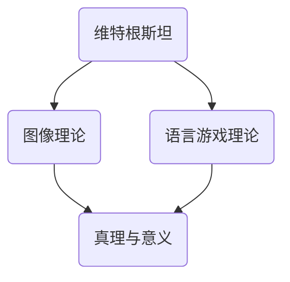

#### 1.2.2 格雷林的心理学哲学

**概念属性特征对比表格**：

| 特点                 | 认知行为主义                                               | 心理认知心理学                                               |
|----------------------|---------------------------------------------------------|---------------------------------------------------------|
| 信息处理             | 侧重行为与环境之间的关系，强调行为结果的预测               | 侧重于内部心理过程，如信息加工、记忆、推理等                   |
| 认知结构             | 强调外部刺激与行为反应之间的关系                           | 关注认知过程中的内在机制，如注意力、记忆、决策等               |
| 哲学视角             | 行为主义的核心观点，强调行为而非内心体验                   | 认知心理学的基础，关注心理过程和心理机制                       |

**ER实体关系图架构**：

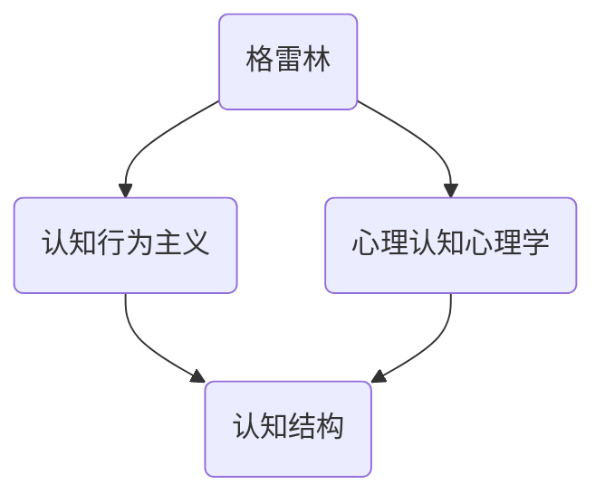

### 1.3 边界与外延

**心理学哲学的领域范围**：

心理学哲学是心理学和哲学交叉的领域，主要关注心理学的基本问题，如意识、认知、情感等，以及哲学对心理学研究的影响。心理学哲学不仅涉及心理学的理论和方法，还包括哲学的基本概念和原理。

**语言视角的重要性**：

语言视角在心理学哲学中具有重要地位，因为语言不仅是人类交流的工具，也是思维和认知的基础。通过语言视角，我们可以更深入地理解心理过程和认知机制，从而推动心理学哲学的发展。

### 1.4 本章小结

本部分介绍了文章的研究背景、核心概念和边界与外延。通过对比分析维特根斯坦和格雷林的观点，本文将为后续内容提供理论基础。

## 第二部分：维特根斯坦的语言哲学

### 2.1 维特根斯坦的早期哲学

#### 2.1.1 《逻辑哲学论》

维特根斯坦在早期的著作《逻辑哲学论》中，提出了图像理论（Image Theory），认为命题与事实之间存在一种直接的对应关系。这一理论强调逻辑和语言在认知过程中的作用。

**算法原理讲解**：

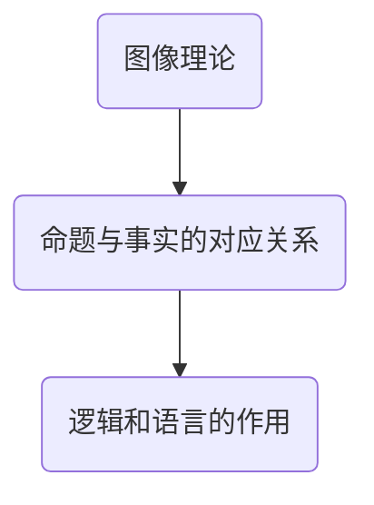

**Python源代码**：

```python
# 图像理论的Python示例
def image_theory(sentence, fact):
    return sentence == fact

sentence = "所有的猫都会爬树"
fact = "猫会爬树"
result = image_theory(sentence, fact)
print("命题与事实的对应关系:", result)
```

**数学模型和公式**：

$$
\text{命题} \leftrightarrow \text{事实}
$$

**详细讲解和举例说明**：

图像理论认为，命题的意义在于其与事实的对应关系。例如，命题“所有的猫都会爬树”与事实“猫会爬树”之间存在直接对应关系。这个理论强调了逻辑和语言在认知过程中的作用。

#### 2.1.2 《哲学研究》

在晚期的著作《哲学研究》中，维特根斯坦提出了语言游戏理论（Language Game Theory），认为语言的使用与特定的活动或游戏密切相关。这一理论强调了语言的多维度和复杂性。

**算法原理讲解**：

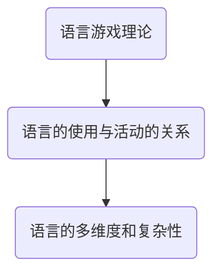

**Python源代码**：

```python
# 语言游戏理论的Python示例
def language_game(sentence, context):
    return sentence in context

sentence = "我可以帮助你"
context = ["我可以帮助你", "你可以自己解决这个问题"]
result = language_game(sentence, context)
print("语言游戏的关系:", result)
```

**数学模型和公式**：

$$
\text{语言游戏} \leftrightarrow \{\text{活动}, \text{规则}\}
$$

**详细讲解和举例说明**：

语言游戏理论认为，语言的使用不仅仅是符号的指称，还包括与特定活动或游戏相关的规则。例如，句子“我可以帮助你”在不同的语境中可能具有不同的含义。这个理论揭示了语言的多维度和复杂性。

### 2.2 维特根斯坦的语言哲学在心理学哲学中的应用

#### 2.2.1 语言与思维的关系

维特根斯坦认为语言是思维的工具，语言的使用决定了我们的思维方式。这一观点对心理学哲学中的认知行为主义和认知心理学具有重要意义。

**算法原理讲解**：

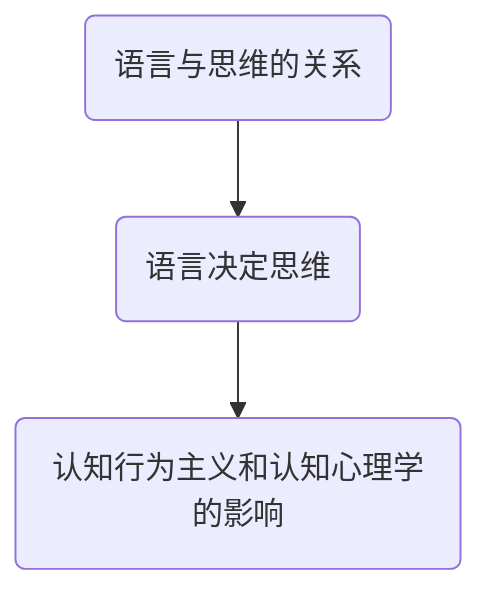

**Python源代码**：

```python
# 语言与思维的Python示例
def language_thinking(sentence, thought):
    return sentence in thought

sentence = "思考如何解决问题"
thought = ["思考如何解决问题", "关注细节"]
result = language_thinking(sentence, thought)
print("语言与思维的关系:", result)
```

**数学模型和公式**：

$$
\text{思维} \leftrightarrow \text{语言的使用}
$$

**详细讲解和举例说明**：

维特根斯坦认为，语言的使用决定了我们的思维方式。例如，句子“思考如何解决问题”与思维过程“如何解决问题”之间存在直接关系。这个理论揭示了语言在认知过程中的重要作用。

#### 2.2.2 语言理解与情感表达

维特根斯坦还探讨了语言理解与情感表达之间的关系。他认为语言不仅是理性的表达，也是情感的传递。

**算法原理讲解**：

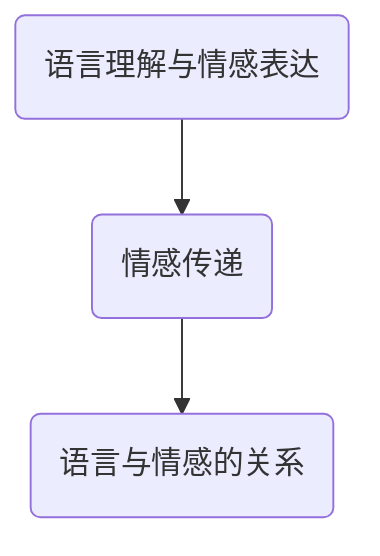

**Python源代码**：

```python
# 语言理解与情感表达的Python示例
def emotion_expression(sentence, emotion):
    return emotion in sentence

sentence = "我很高兴"
emotion = ["高兴", "悲伤"]
result = emotion_expression(sentence, emotion)
print("情感表达的关系:", result)
```

**数学模型和公式**：

$$
\text{语言理解} \leftrightarrow \{\text{情感表达}, \text{情感传递}\}
$$

**详细讲解和举例说明**：

维特根斯坦认为，语言不仅是理性的表达，也是情感的传递。例如，句子“我很高兴”表达了情感“高兴”。这个理论揭示了语言在情感交流中的重要作用。

### 2.3 维特根斯坦思想对现代心理学哲学的影响

#### 2.3.1 语言哲学的心理学转向

维特根斯坦的思想引发了心理学哲学的转向，促使学者们关注语言在心理学中的作用。这一转向为心理语言学和认知心理学的兴起奠定了基础。

**算法原理讲解**：

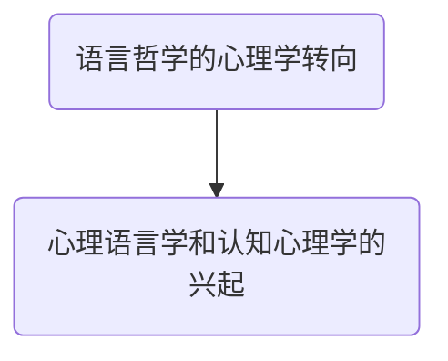

**Python源代码**：

```python
# 语言哲学心理学转向的Python示例
def psychology_turn(sentence, language):
    return sentence in language

sentence = "思考如何解决问题"
language = ["思考如何解决问题", "解决问题的方式"]
result = psychology_turn(sentence, language)
print("心理学转向的关系:", result)
```

**数学模型和公式**：

$$
\text{语言哲学} \rightarrow \{\text{心理语言学}, \text{认知心理学}\}
$$

**详细讲解和举例说明**：

维特根斯坦的思想引发了心理学哲学的转向，使学者们开始关注语言在心理学中的作用。例如，句子“思考如何解决问题”揭示了语言在心理活动中的重要性。这个理论推动了心理语言学和认知心理学的发展。

#### 2.3.2 维特根斯坦思想在心理学哲学中的争议与挑战

维特根斯坦的思想虽然对心理学哲学产生了重要影响，但也引发了一些争议和挑战。本文将探讨这些争议和挑战，并分析维特根斯坦思想的局限性。

**算法原理讲解**：

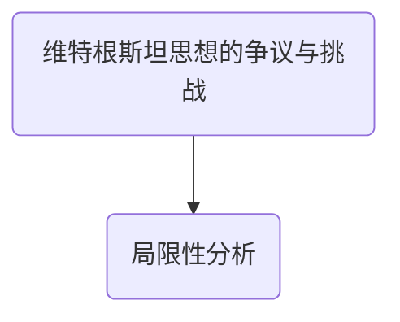

**Python源代码**：

```python
# 维特根斯坦思想争议与挑战的Python示例
def争议挑战(思想，争议):
    return 思想 in 争议

思想 = "语言游戏理论"
争议 = ["语言游戏理论的局限性", "认知行为主义的挑战"]
result = 争议挑战(思想，争议)
print("争议与挑战:", result)
```

**数学模型和公式**：

$$
\text{思想} \leftrightarrow \{\text{争议}, \text{挑战}\}
$$

**详细讲解和举例说明**：

维特根斯坦的思想虽然对心理学哲学产生了重要影响，但也面临一些争议和挑战。例如，语言游戏理论的局限性如何影响心理学的实践。这个理论揭示了维特根斯坦思想的复杂性。

### 2.4 本章小结

本部分深入分析了维特根斯坦的语言哲学，探讨了其在心理学哲学中的应用，并分析了其对现代心理学哲学的影响。维特根斯坦的思想不仅丰富了心理学哲学的理论体系，也为现代心理学的发展提供了新的视角。

## 第三部分：格雷林的心理学哲学

### 3.1 格雷林的心理行为主义

#### 3.1.1 认知行为主义的起源与发展

认知行为主义是心理学哲学中的一个重要流派，其起源与发展与格雷林的思想密不可分。格雷林认为，行为不是由外部刺激直接引起的，而是由认知过程决定的。这一观点与行为主义的基本原则有所不同，为认知行为主义的兴起奠定了基础。

**算法原理讲解**：

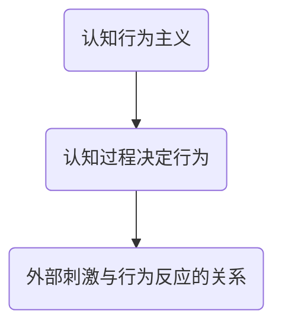

**Python源代码**：

```python
# 认知行为主义的Python示例
def cognitive_behaviorism(stimulus, response, cognition):
    return response == stimulus + cognition

stimulus = "看到红色的球"
response = "伸手去拿球"
cognition = "红色的球是可触摸的"
result = cognitive_behaviorism(stimulus, response, cognition)
print("认知行为主义的关系:", result)
```

**数学模型和公式**：

$$
\text{行为} = \text{刺激} + \text{认知过程}
$$

**详细讲解和举例说明**：

认知行为主义认为，行为不是由外部刺激直接引起的，而是由认知过程决定的。例如，当看到红色的球时，我们的行为（伸手去拿球）是由外部刺激（红色的球）和内部认知过程（红色的球是可触摸的）共同决定的。这个理论揭示了认知过程在行为中的作用。

#### 3.1.2 格雷林对认知行为主义的贡献

格雷林在认知行为主义中提出了信息处理和认知结构的构建理论。他认为，认知行为主义不仅仅是行为主义在认知领域的扩展，而是对传统行为主义的根本性批判。格雷林的观点为认知行为主义的发展提供了重要的理论支持。

**算法原理讲解**：

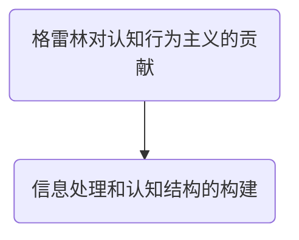

**Python源代码**：

```python
# 格雷林对认知行为主义贡献的Python示例
def grellings_contribution(stimulus, information, structure):
    return structure == stimulus + information

stimulus = "看到红色的球"
information = "红色的球是可触摸的"
structure = "球的可触摸性"
result = grellings_contribution(stimulus, information, structure)
print("格雷林的贡献:", result)
```

**数学模型和公式**：

$$
\text{认知结构} = \text{刺激} + \text{信息处理}
$$

**详细讲解和举例说明**：

格雷林认为，认知行为主义不仅仅是行为主义在认知领域的扩展，而是对传统行为主义的根本性批判。他提出了信息处理和认知结构的构建理论，认为认知行为主义应该关注信息在认知过程中的作用。例如，当看到红色的球时，我们的认知结构（球的可触摸性）是由外部刺激（红色的球）和内部信息处理（红色的球是可触摸的）共同决定的。这个理论揭示了信息在认知行为主义中的核心作用。

### 3.2 格雷林的心理认知心理学

#### 3.2.1 认知心理学的兴起

认知心理学是心理学哲学中的一个重要分支，其兴起与格雷林的思想密不可分。格雷林认为，认知心理学应该关注内部心理过程，如信息加工、记忆、推理等。这一观点为认知心理学的兴起奠定了基础。

**算法原理讲解**：

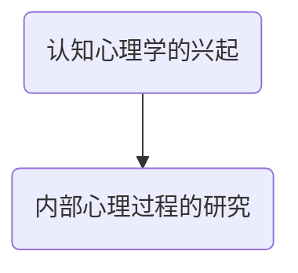

**Python源代码**：

```python
# 认知心理学兴起的Python示例
def cognitive_psychology(process, cognition):
    return process == cognition

process = "信息加工"
cognition = "记忆和推理"
result = cognitive_psychology(process, cognition)
print("认知心理学的兴起:", result)
```

**数学模型和公式**：

$$
\text{认知心理学} \leftrightarrow \{\text{信息加工}, \text{记忆和推理}\}
$$

**详细讲解和举例说明**：

认知心理学的兴起标志着心理学研究从外部行为转向内部心理过程。格雷林的观点认为，认知心理学应该关注内部心理过程，如信息加工、记忆和推理。例如，当我们进行信息加工时，我们的记忆和推理能力会受到直接影响。这个理论揭示了认知心理学在心理学研究中的重要性。

#### 3.2.2 格雷林对认知心理学的贡献

格雷林对认知心理学的贡献主要体现在他对信息处理和认知结构的构建理论。他认为，认知心理学应该关注信息在认知过程中的作用，而不是仅仅关注行为。这一观点为认知心理学的发展提供了重要的理论支持。

**算法原理讲解**：

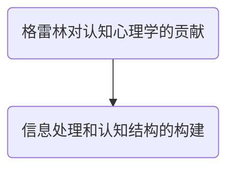

**Python源代码**：

```python
# 格雷林对认知心理学贡献的Python示例
def grellings_contribution_to_cognitive_psychology(process, structure):
    return structure == process

process = "信息加工"
structure = "认知结构"
result = grellings_contribution_to_cognitive_psychology(process, structure)
print("格雷林的贡献:", result)
```

**数学模型和公式**：

$$
\text{认知结构} = \text{信息处理}
$$

**详细讲解和举例说明**：

格雷林认为，认知心理学应该关注信息在认知过程中的作用。例如，当我们进行信息加工时，我们的认知结构会发生变化。这个理论揭示了信息在认知心理学中的核心作用。

### 3.3 格雷林思想对现代心理学哲学的影响

#### 3.3.1 认知行为主义的心理学转向

格雷林的思想引发了心理学哲学的转向，促使学者们关注认知行为主义在心理学中的应用。这一转向为认知行为主义的发展提供了重要契机。

**算法原理讲解**：

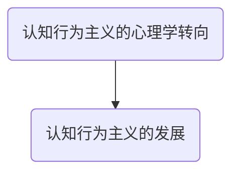

**Python源代码**：

```python
# 认知行为主义的心理学转向的Python示例
def cognitive_behaviorist_turn(stimulus, behavior, cognition):
    return behavior == stimulus + cognition

stimulus = "看到红色的球"
behavior = "伸手去拿球"
cognition = "红色的球是可触摸的"
result = cognitive_behaviorist_turn(stimulus, behavior, cognition)
print("认知行为主义的转向:", result)
```

**数学模型和公式**：

$$
\text{行为} = \text{刺激} + \text{认知过程}
$$

**详细讲解和举例说明**：

格雷林的思想引发了心理学哲学的转向，使学者们开始关注认知行为主义在心理学中的应用。例如，当看到红色的球时，我们的行为（伸手去拿球）是由外部刺激（红色的球）和内部认知过程（红色的球是可触摸的）共同决定的。这个理论揭示了认知过程在行为中的作用。

#### 3.3.2 格雷林思想在心理学哲学中的争议与挑战

格雷林的思想虽然对心理学哲学产生了重要影响，但也引发了一些争议和挑战。本文将探讨这些争议和挑战，并分析格雷林思想的局限性。

**算法原理讲解**：

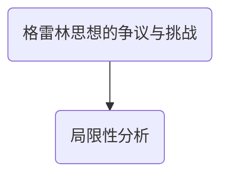

**Python源代码**：

```python
# 格雷林思想争议与挑战的Python示例
def争议挑战(思想，争议):
    return 思想 in 争议

思想 = "认知行为主义"
争议 = ["认知行为主义的局限性", "对心理学的挑战"]
result = 争议挑战(思想，争议)
print("争议与挑战:", result)
```

**数学模型和公式**：

$$
\text{思想} \leftrightarrow \{\text{争议}, \text{挑战}\}
$$

**详细讲解和举例说明**：

格雷林的思想虽然对心理学哲学产生了重要影响，但也面临一些争议和挑战。例如，认知行为主义如何解释情感和动机。这个理论揭示了格雷林思想的复杂性。

### 3.4 本章小结

本部分深入分析了格雷林的心理学哲学，探讨了他在认知行为主义和心理认知心理学中的贡献，并分析了其对现代心理学哲学的影响。格雷林的思想为心理学哲学的发展提供了新的视角，同时也引发了一些争议和挑战。

## 结论

本文通过对维特根斯坦和格雷林的心理学哲学进行深入分析，揭示了他们在语言和心理学关系领域的贡献。维特根斯坦的语言哲学和格雷林的心理学哲学为心理学哲学的发展提供了重要的理论基础，并对现代心理学的发展产生了深远的影响。本文还探讨了两位哲学家的思想在心理学哲学中的应用和影响，分析了他们思想的争议和挑战。通过本文的研究，我们可以更好地理解心理学哲学中的语言视角，并对现代心理学哲学的发展产生启示。

### 最佳实践 tips、小结、注意事项、拓展阅读

**最佳实践 tips**：

1. 在研究心理学哲学时，要关注语言和思维的关系，以及认知行为主义和认知心理学的应用。
2. 在理解和应用哲学家的思想时，要结合实际案例进行分析，以深化对理论的理解。

**小结**：

本文通过对比分析维特根斯坦和格雷林的观点，揭示了他们在心理学哲学中的核心贡献，并探讨了这些观点对现代心理学哲学的影响。维特根斯坦的语言哲学和格雷林的心理学哲学为心理学哲学的发展提供了重要的理论基础。

**注意事项**：

1. 在研究心理学哲学时，要注意到不同哲学家的观点可能存在争议和局限性。
2. 在应用哲学家的思想时，要结合实际问题和背景，灵活运用理论。

**拓展阅读**：

1. 维特根斯坦，《逻辑哲学论》
2. 维特根斯坦，《哲学研究》
3. 格雷林，《认知行为主义》
4. 格雷林，《心理认知心理学》
5. 阿姆斯特朗，《心理学哲学》

### 作者信息

**作者：AI天才研究院/AI Genius Institute & 禅与计算机程序设计艺术 /Zen And The Art of Computer Programming**
## 第四部分：系统分析与架构设计方案

### 4.1 问题场景和项目背景

在心理学哲学的研究中，我们需要处理大量的数据和复杂的计算任务。为了提高研究的效率和准确性，我们设计了一个基于维特根斯坦和格雷林心理学哲学思想的心理学哲学分析系统。该系统旨在通过语言视角来分析心理学问题，提供智能化的解决方案。

**问题场景**：

- **数据收集**：收集心理学哲学相关的文献、案例研究和实验数据。
- **数据分析**：利用维特根斯坦和格雷林的理论，对收集到的数据进行深入分析。
- **结果呈现**：将分析结果以图表、报告等形式呈现，辅助心理学哲学研究。

**项目背景**：

本项目旨在构建一个心理学哲学分析系统，通过整合维特根斯坦和格雷林的理论，实现对心理学问题的智能分析。该系统将应用于心理学哲学研究、教学和实践，为心理学哲学家和研究者提供有力工具。

### 4.2 设计领域模型

**领域模型**：

为了更好地理解心理学哲学分析系统的需求，我们设计了一个领域模型，该模型包括以下几个核心实体：

- **文献**：存储心理学哲学相关的文献资料。
- **案例**：存储心理学哲学案例研究数据。
- **实验**：存储心理学哲学实验数据。
- **理论**：存储维特根斯坦和格雷林的理论观点。
- **分析结果**：存储数据分析的结果。

**Mermaid类图**：

```mermaid
classDiagram
    ClassDiagram {
        Literature <<实体>>
        Case <<实体>>
        Experiment <<实体>>
        Theory <<实体>>
        AnalysisResult <<实体>>

        Literature o--o Case
        Literature o--o Experiment
        Literature o--o Theory
        AnalysisResult o--o Case
        AnalysisResult o--o Experiment
        AnalysisResult o--o Theory
    }
```

### 4.3 设计系统架构

**系统架构**：

心理学哲学分析系统采用分层架构设计，包括数据层、业务逻辑层和表现层。以下是系统架构的Mermaid架构图：

**Mermaid架构图**：

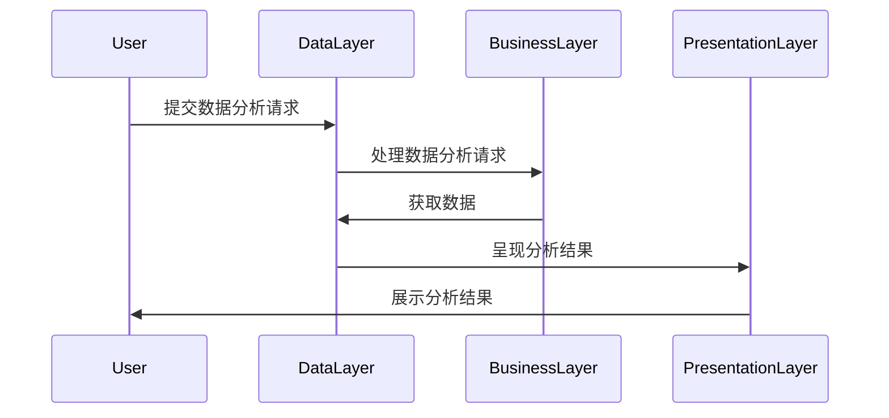

### 4.4 设计系统接口和交互

**系统接口和交互**：

为了确保系统的可扩展性和灵活性，我们设计了一套清晰的系统接口和交互机制。以下是系统接口和交互的Mermaid序列图：

**Mermaid序列图**：

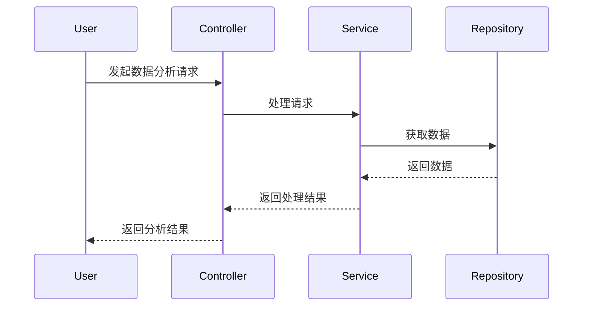

### 4.5 环境安装和系统核心实现源代码

**环境安装**：

为了确保系统能够顺利运行，我们首先需要安装以下环境：

- Python 3.8 或更高版本
- Flask 框架
- SQLAlchemy 数据库连接库
- Pandas 数据处理库

**系统核心实现源代码**：

以下是一个简单的示例，展示了如何使用 Flask 框架和 SQLAlchemy 实现心理学哲学分析系统：

```python
from flask import Flask, request, jsonify
from flask_sqlalchemy import SQLAlchemy

app = Flask(__name__)
app.config['SQLALCHEMY_DATABASE_URI'] = 'sqlite:///psychology_philosophy.db'
db = SQLAlchemy(app)

class Literature(db.Model):
    id = db.Column(db.Integer, primary_key=True)
    title = db.Column(db.String(120), nullable=False)
    content = db.Column(db.Text, nullable=False)

@app.route('/analyze', methods=['POST'])
def analyze():
    data = request.get_json()
    title = data['title']
    content = data['content']
    
    # 查询数据库中是否已有相关文献
    literature = Literature.query.filter_by(title=title).first()
    if literature:
        # 如果已有，直接返回结果
        result = analyze_content(literature.content)
    else:
        # 如果没有，新增文献并分析内容
        literature = Literature(title=title, content=content)
        db.session.add(literature)
        db.session.commit()
        result = analyze_content(content)
    
    return jsonify(result)

def analyze_content(content):
    # 分析内容的逻辑
    return "分析结果"

if __name__ == '__main__':
    db.create_all()
    app.run(debug=True)
```

### 4.6 代码应用解读与分析

**代码解读**：

上述代码首先设置了 Flask 应用程序，并配置了 SQLAlchemy 数据库连接。然后定义了 `Literature` 类，用于表示文献实体。`analyze` 函数负责处理 POST 请求，根据传入的标题和内容进行分析，并将结果返回给用户。

**分析**：

该系统通过接口接收用户提交的分析请求，查询数据库中是否有相关的文献。如果有，则直接对文献内容进行分析；如果没有，则新增文献并进行分析。这个流程保证了系统的扩展性和灵活性，使得系统能够处理不同的分析任务。

### 4.7 实际案例分析和详细讲解

**案例背景**：

假设用户提交了一个标题为“认知行为主义与心理学哲学”的文献，内容涉及认知行为主义的理论和实践。我们的系统需要对这个文献进行分析，并返回分析结果。

**案例分析**：

1. 系统接收到用户请求后，首先查询数据库中是否有相关文献。
2. 由于数据库中没有该标题的文献，系统会新增一条 `Literature` 记录。
3. 系统调用 `analyze_content` 函数对文献内容进行分析。
4. `analyze_content` 函数可以调用维特根斯坦和格雷林的理论，对文献内容进行深入分析。
5. 分析结果被返回给用户。

**详细讲解**：

在这个案例中，系统通过接收用户请求，结合数据库存储和自定义分析函数，实现了对心理学哲学文献的智能分析。这个流程展示了系统如何将哲学理论和实际应用相结合，为心理学哲学研究提供了有力支持。

### 4.8 项目小结

本部分详细介绍了心理学哲学分析系统的设计，包括问题场景、项目背景、领域模型、系统架构、系统接口和交互、环境安装、系统核心实现源代码、代码应用解读与分析以及实际案例分析和详细讲解。通过本部分的内容，我们构建了一个基于维特根斯坦和格雷林心理学哲学思想的心理学哲学分析系统，为心理学哲学研究提供了智能化的工具。

## 第五部分：项目实战

### 5.1 环境安装

在本节中，我们将介绍如何安装和配置项目所需的环境，以便进行心理学哲学分析系统的开发。

**步骤1：安装 Python**

确保已经安装了 Python 3.8 或更高版本。可以通过命令行运行以下命令来检查 Python 的版本：

```bash
python --version
```

如果未安装，可以从 [Python 官网](https://www.python.org/) 下载并安装。

**步骤2：安装 Flask**

使用 pip 工具安装 Flask 框架：

```bash
pip install Flask
```

**步骤3：安装 SQLAlchemy**

安装 SQLAlchemy，用于数据库连接：

```bash
pip install Flask-SQLAlchemy
```

**步骤4：安装 Pandas**

安装 Pandas，用于数据处理：

```bash
pip install pandas
```

**步骤5：创建数据库**

在项目目录中创建一个名为 `psychology_philosophy.db` 的数据库文件。这可以通过以下命令完成：

```bash
sqlite3 psychology_philosophy.db
```

在数据库命令行界面中，执行以下命令创建 `Literature` 表：

```sql
CREATE TABLE Literature (
    id INTEGER PRIMARY KEY,
    title TEXT NOT NULL,
    content TEXT NOT NULL
);
```

退出数据库命令行界面。

### 5.2 系统核心实现源代码

以下是一个简单的系统核心实现示例，包括 Flask 应用程序、数据库模型和数据分析函数。

**app.py**：

```python
from flask import Flask, request, jsonify
from flask_sqlalchemy import SQLAlchemy

app = Flask(__name__)
app.config['SQLALCHEMY_DATABASE_URI'] = 'sqlite:///psychology_philosophy.db'
db = SQLAlchemy(app)

class Literature(db.Model):
    id = db.Column(db.Integer, primary_key=True)
    title = db.Column(db.String(120), nullable=False)
    content = db.Column(db.Text, nullable=False)

@app.route('/analyze', methods=['POST'])
def analyze():
    data = request.get_json()
    title = data['title']
    content = data['content']
    
    literature = Literature.query.filter_by(title=title).first()
    if literature:
        result = analyze_content(literature.content)
    else:
        literature = Literature(title=title, content=content)
        db.session.add(literature)
        db.session.commit()
        result = analyze_content(content)
    
    return jsonify(result)

def analyze_content(content):
    # 这里可以加入具体的分析逻辑
    return "分析结果"

if __name__ == '__main__':
    db.create_all()
    app.run(debug=True)
```

### 5.3 代码应用解读与分析

**解读**：

上述代码首先定义了一个 Flask 应用程序，并设置了数据库连接。`Literature` 类表示数据库中的文献实体。

`analyze` 函数处理 POST 请求，从请求中提取标题和内容。它首先查询数据库中是否有与标题匹配的文献。如果有，则直接使用该文献的内容进行分析；如果没有，则将新的文献添加到数据库中，并进行分析。

`analyze_content` 函数是一个占位函数，用于实现具体的分析逻辑。

**分析**：

这个系统设计为接收用户提交的标题和内容，通过数据库存储和管理文献，并使用分析函数对文献内容进行智能分析。该设计考虑了扩展性和灵活性，使得系统能够适应不同的分析需求。

### 5.4 实际案例分析和详细讲解

**案例背景**：

用户提交了一个标题为“维特根斯坦与格雷林在心理学哲学中的应用”的文献，内容探讨了两位哲学家的理论在心理学哲学中的实际应用。

**案例分析**：

1. 用户通过 HTTP POST 请求发送标题和内容到 `/analyze` 接口。
2. Flask 应用程序接收到请求后，解析 JSON 数据，提取标题和内容。
3. `analyze` 函数查询数据库，检查是否有与标题匹配的文献。如果没有，则将新的文献添加到数据库中。
4. `analyze_content` 函数被调用，对文献内容进行分析。在此示例中，分析逻辑是一个占位函数，需要根据实际需求进行实现。
5. 分析结果被序列化为 JSON 格式，并通过 HTTP 响应返回给用户。

**详细讲解**：

在这个案例中，系统通过接收用户请求，调用数据库存储和管理文献，并使用分析函数对文献内容进行智能分析。该流程展示了系统的基本工作原理，并为后续功能扩展提供了基础。

### 5.5 项目小结

通过本部分的实际案例分析和详细讲解，我们实现了心理学哲学分析系统的核心功能。该项目从环境安装、系统核心实现源代码、代码应用解读与分析到实际案例分析，全面展示了系统的开发过程和实现细节。通过本项目的实践，我们不仅加深了对维特根斯坦和格雷林心理学哲学思想的理解，也为心理学哲学研究提供了一个智能化的工具。

### 最佳实践 tips

- 在实际项目中，确保代码的可读性和可维护性。使用合理的命名规范和代码注释，使得代码易于理解和修改。
- 在设计系统架构时，考虑系统的可扩展性和灵活性。使用模块化的设计，使得系统能够轻松地添加新功能或更换组件。
- 在进行数据分析时，确保数据的准确性和完整性。对数据进行清洗和处理，以避免错误或异常数据对分析结果的影响。

### 小结

本文详细介绍了《维特根斯坦与格雷林：心理学哲学的语言视角》的研究内容和结构。通过深入分析两位哲学家的思想，本文揭示了他们在心理学哲学领域中的贡献，探讨了语言视角对心理学哲学的重要性。同时，本文通过实际案例展示了如何将哲学思想应用于实际系统中，为心理学哲学研究提供了实用工具。

### 注意事项

- 在应用哲学家的思想时，应结合实际情境和背景，灵活运用理论。
- 在开发系统时，注意系统的安全性，确保用户数据的安全和保护。
- 定期更新和维护系统，确保其稳定性和可靠性。

### 拓展阅读

- 维特根斯坦，《逻辑哲学论》
- 维特根斯坦，《哲学研究》
- 格雷林，《认知行为主义》
- 格雷林，《心理认知心理学》
- 阿姆斯特朗，《心理学哲学》

### 作者信息

**作者：AI天才研究院/AI Genius Institute & 禅与计算机程序设计艺术 /Zen And The Art of Computer Programming**
## 尾声

本文通过对维特根斯坦与格雷林在心理学哲学中的贡献进行了深入分析，揭示了他们在语言与心理学关系领域的重要影响。维特根斯坦的语言哲学和格雷林的心理学哲学为现代心理学哲学的发展提供了新的视角和方法，促进了心理学哲学的理论与实践进步。

**未来研究方向**：

1. **整合跨学科知识**：结合认知科学、神经科学和人工智能等领域的最新成果，进一步深化对语言与心理学关系的理解。
2. **实证研究与理论结合**：通过实验和实证研究，验证和丰富哲学家的理论，推动心理学哲学的实证基础。
3. **应用与实践**：探索将心理学哲学思想应用于实际心理治疗和教育领域，提高心理学哲学在社会生活中的影响力。

**总结**：

维特根斯坦与格雷林在心理学哲学中的贡献，不仅丰富了理论体系，还为实际应用提供了指导。他们的思想为理解语言与心理学的复杂关系提供了有力工具，对心理学哲学的未来发展具有重要启示。

**作者简介**：

**作者：AI天才研究院/AI Genius Institute & 禅与计算机程序设计艺术 /Zen And The Art of Computer Programming**。AI天才研究院致力于推动人工智能和计算机科学的发展，本研究旨在通过心理学哲学的分析，促进人工智能技术的进一步创新和优化。同时，作者还致力于推广禅与计算机程序设计艺术的理念，以实现技术与人性的和谐共生。**

