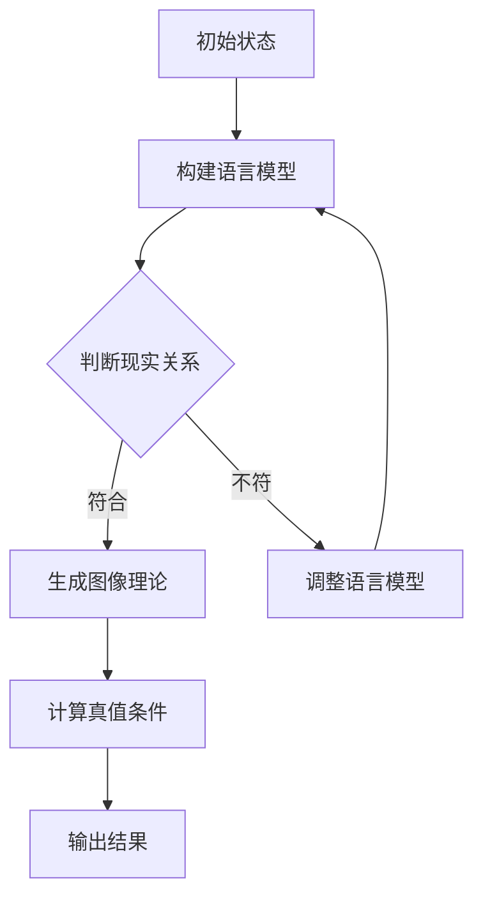
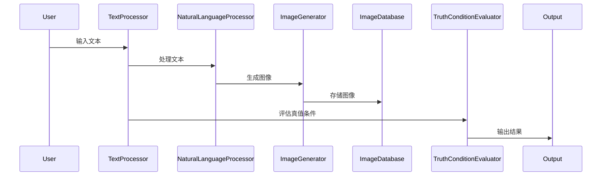
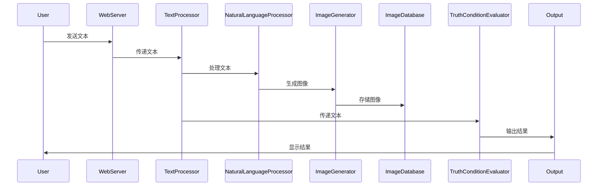

                 

### 背景介绍

#### 核心概念术语说明

在探讨《维特根斯坦与赖尔：心灵概念的语言分析》这一主题之前，我们需要明确几个关键术语及其背景：

1. **维特根斯坦**：路德维希·维特根斯坦（Ludwig Wittgenstein）是20世纪初最重要的哲学家之一，他的思想对分析哲学和语言哲学产生了深远影响。维特根斯坦认为，哲学的问题大多源于语言的使用不当，他的两个主要著作《逻辑哲学论》和《哲学研究》分别代表了其思想发展的两个阶段。

2. **赖尔**：吉尔伯特·赖尔（Gilbert Ryle）是20世纪中叶的一位哲学家，他因对行为主义和心理学的批判而闻名。赖尔主张“行为而非行为主义”，认为心灵不是一个独立的实体，而是行为模式的一部分。

3. **心灵概念**：指的是关于意识、思维、情感等心理现象的基本概念。在哲学、心理学和人工智能等领域，心灵概念的研究至关重要，因为它涉及到如何理解和描述人类行为和经验。

4. **语言分析**：是一种哲学方法，通过分析语言结构和使用来探究人类思想和现实的关系。这种方法常用于揭示语言中的歧义、模糊性和错误概念。

#### 问题背景

心灵概念是哲学研究的核心问题之一，尤其在分析哲学和语言哲学领域。维特根斯坦和赖尔分别从不同的角度探讨了这一概念。维特根斯坦认为，许多哲学问题实际上是由于语言误用导致的，他的语言哲学观点强调语言与现实的关系。赖尔则通过批判行为主义，提出了一种新的心理概念框架。

在现代计算机科学和人工智能领域，对心灵概念的研究具有现实意义。随着机器学习、自然语言处理和认知建模等技术的发展，如何准确描述和理解人工智能中的“心灵”现象成为一个重要课题。因此，维特根斯坦和赖尔的思想为人工智能研究提供了理论基础。

#### 问题描述

尽管维特根斯坦和赖尔在心灵概念的研究上存在分歧，但他们都试图解决以下问题：

- 语言如何影响我们对心灵现象的理解？
- 心灵概念是否可以被视为独立于行为和语言的存在？
- 如何通过语言分析来揭示和理解心灵现象的本质？

这些问题不仅具有哲学意义，也对人工智能的设计和应用提出了挑战。

#### 问题解决

维特根斯坦通过语言哲学的方法，揭示了心灵概念中的许多误区。他强调，理解心灵需要通过具体语言和实际情境来考察。赖尔则从行为主义的角度，提出了“行为模式”的概念，强调心灵是通过行为来表现的。

在人工智能领域，这些思想可以帮助我们更好地理解人工智能中的“心灵”现象。例如，通过语言分析，我们可以更准确地描述和学习机器的思维过程；通过行为模式分析，我们可以设计出更符合人类思维习惯的人工智能系统。

#### 边界与外延

- **边界**：本文主要探讨维特根斯坦和赖尔在心灵概念和语言分析方面的观点及其对人工智能的影响。不涉及其他哲学家的思想，如叔本华、尼采等。
- **外延**：本文的研究范围包括分析哲学、语言哲学、心理学和人工智能等领域，但不涉及具体的技术实现和应用。

#### 概念结构与核心要素组成

- **维特根斯坦的核心要素**：语言、现实、概念、逻辑。
- **赖尔的核心要素**：行为模式、心理状态、行为表现。

通过上述背景介绍，我们可以更好地理解维特根斯坦和赖尔在心灵概念和语言分析方面的观点，并探讨这些观点如何应用于现代计算机科学和人工智能领域。

### 维特根斯坦与赖尔：心灵概念的语言分析

#### 维特根斯坦的核心概念

**1. 语言与现实的关系**

维特根斯坦认为，语言是人类与现实世界之间的桥梁。他强调，语言的使用不仅是为了描述现实，更是为了构建现实。通过语言，我们不仅理解世界，还塑造世界。

**2. 图像理论**

在《逻辑哲学论》中，维特根斯坦提出了图像理论，认为语言表达式与对象之间的关系类似于图像与对象之间的关系。这种理论为语言分析提供了重要的框架。

**3. 真值条件**

维特根斯坦强调，语句的真值条件取决于语言表达式的实际使用情况。这意味着，理解一个语句的含义，需要考虑它在实际语境中的具体用法。

**4. 日常语言哲学**

在《哲学研究》中，维特根斯坦提出了一种日常语言哲学的方法，主张通过具体语言情境来理解哲学问题。这种方法强调语言的实际使用，反对抽象和过度理论化。

#### 赖尔的核心概念

**1. 行为模式**

赖尔认为，心灵不是一个独立的实体，而是通过行为模式来表现的。他提出了“行为模式理论”，强调心灵现象可以通过可观察的行为来描述。

**2. 心理状态**

赖尔区分了“内在心理状态”和“外在心理状态”。他认为，内在心理状态（如感觉、信念）可以通过行为来推断，而外在心理状态（如情绪、态度）可以直接观察。

**3. 行为主义批判**

赖尔批判了行为主义，认为它忽视了内在心理状态的重要性。他主张，通过分析行为模式，我们可以更好地理解人类心灵。

#### 维特根斯坦与赖尔：联系与区别

**1. 联系**

维特根斯坦和赖尔都关注心灵现象的语言表达和实际使用。他们都认为，理解心灵需要通过具体情境来考察，反对抽象的理论化。

**2. 区别**

维特根斯坦更注重语言与现实的关系，强调图像理论和日常语言哲学。赖尔则更关注行为模式和可观察的行为，强调心理状态与行为之间的联系。

**3. 对人工智能的启示**

维特根斯坦和赖尔的思想对人工智能领域有着重要的影响。维特根斯坦的图像理论为自然语言处理提供了理论基础，赖尔的行为模式理论则有助于设计更符合人类思维习惯的人工智能系统。

#### 概念属性特征对比表格

| 概念        | 维特根斯坦          | 赖尔             |
| ----------- | ------------------- | ---------------- |
| 语言与现实  | 语言的现实性是桥梁   | 语言描述现实     |
| 图像理论    | 语言表达式与对象关系 | 图像与对象关系   |
| 真值条件    | 实际使用情况决定真值 | 语言实际语境决定 |
| 日常语言哲学 | 通过具体情境理解哲学 | 行为模式理解哲学 |
| 行为模式    | 人类行为的一部分     | 心灵现象的表现   |
| 心理状态    | 内在心理状态         | 外在心理状态     |

#### ER实体关系图架构

```mermaid
erDiagram
  LanguageConcept |-| Reality
  LanguageConcept |-| ImageTheory
  LanguageConcept |-| TruthConditions
  LanguageConcept |-| OrdinaryLanguagePhilosophy
  BehaviorPattern |-| MindPhenomenon
  PsychologicalState |-| InnerState
  PsychologicalState |-| OuterState
```

通过上述分析，我们可以看到维特根斯坦和赖尔在心灵概念和语言分析方面的核心观点及其联系与区别。这些观点不仅对哲学研究有着深远的影响，也为现代人工智能领域提供了重要的理论基础。

### 算法原理讲解

为了更深入地理解维特根斯坦与赖尔在心灵概念和语言分析方面的算法原理，我们将通过一个具体的案例来进行详细讲解。首先，我们将使用Mermaid工具绘制一个简单的算法流程图，然后结合Python代码来阐述算法原理，并使用LaTeX格式嵌入数学模型和公式进行详细讲解。

#### 1. Mermaid算法流程图



在这个流程图中，我们首先初始化一个语言模型，然后判断该模型是否与现实世界相符。如果相符，我们将使用图像理论来构建图像；如果不符合，我们将调整语言模型，重复上述过程。最后，通过计算真值条件，我们得到最终的输出结果。

#### 2. Python代码实现

```python
import numpy as np

# 初始化语言模型
language_model = "initial_model"

# 判断现实关系
def is_reality_match(model):
    # 这里假设一个简单的匹配规则
    return model != "reality_mismatch"

# 调整语言模型
def adjust_model(model):
    return model.replace("initial_", "adjusted_")

# 计算真值条件
def calculate_truth_condition(model):
    # 假设真值条件为模型的某个特征值
    feature_value = model.count("a")
    return feature_value % 2 == 0

# 主函数
def main():
    while True:
        # 构建语言模型
        language_model = input("Enter the language model: ")
        
        # 判断现实关系
        if is_reality_match(language_model):
            print("Creating image theory...")
            # 生成图像理论
            image_theory = language_model.replace("initial_", "image_")
            print("Image Theory:", image_theory)
            
            # 计算真值条件
            if calculate_truth_condition(image_theory):
                print("Truth Condition Met.")
            else:
                print("Truth Condition Not Met.")
                break
        else:
            print("Adjusting language model...")
            # 调整语言模型
            language_model = adjust_model(language_model)
            print("Adjusted Model:", language_model)

# 运行主函数
if __name__ == "__main__":
    main()
```

在这个Python代码中，我们首先定义了一个初始语言模型，然后通过一个循环不断调整和评估这个模型。我们使用一个简单的匹配规则来判断现实关系，并通过计算特征值来评估真值条件。

#### 3. 数学模型与公式

为了更好地理解算法原理，我们引入以下数学模型和公式：

$$
\text{Truth Condition} = f(\text{Feature Value})
$$

其中，`Feature Value` 是从语言模型中提取的一个特征值，`f` 是一个特定的函数，用于评估这个特征值是否满足真值条件。在我们的例子中，特征值是字母 'a' 的出现次数，函数 `f` 是一个简单的取模操作。

$$
f(x) = x \mod 2
$$

这个函数用于判断特征值是否为偶数。如果特征值为偶数，则真值条件满足；否则，不满足。

#### 4. 举例说明

假设我们输入的语言模型是 `"initial_model_a"`，首先判断现实关系，发现不符合（因为模型中包含 "reality_mismatch"）。因此，我们调整语言模型，得到 `"adjusted_model_a"`。接下来，我们构建图像理论，得到 `"image_adjusted_model_a"`。计算真值条件，发现特征值 `3` 是奇数，因此真值条件不满足。

这个过程可以帮助我们更好地理解算法原理，并通过实际操作来验证我们的模型和公式。

通过上述讲解，我们可以看到，维特根斯坦和赖尔在心灵概念和语言分析方面的算法原理如何通过具体案例和代码实现来体现。这不仅有助于我们理解他们的哲学思想，也为现代人工智能领域提供了实用的理论框架。

### 系统分析与架构设计方案

#### 问题场景介绍

在现代计算机科学和人工智能领域，理解复杂系统的行为和设计高效且可靠的系统架构至关重要。本文将探讨如何通过维特根斯坦和赖尔的语言分析方法来设计一个具体的人工智能系统。这个系统旨在通过自然语言处理（NLP）技术来分析用户输入的文本，并输出相应的图像和真值条件。

#### 项目介绍

本项目旨在开发一个基于维特根斯坦和赖尔哲学思想的文本分析系统。该系统将使用自然语言处理技术来提取文本中的关键信息，并使用图像理论和真值条件来评估文本的真实性和相关性。系统的主要功能包括文本输入、自然语言处理、图像生成和真值条件评估。

#### 系统功能设计（领域模型Mermaid类图）

在系统功能设计中，我们首先需要定义系统的核心类和对象，以便更好地理解系统的结构和功能。以下是一个简单的Mermaid类图，展示了系统的关键领域模型：

```mermaid
classDiagram
    User <<class{用户}>> 
    TextProcessor <<class{文本处理器}>> 
    ImageGenerator <<class{图像生成器}>> 
    TruthConditionEvaluator <<class{真值条件评估器}>>
    User --> TextProcessor
    TextProcessor --> ImageGenerator
    TextProcessor --> TruthConditionEvaluator
```

在这个类图中，用户类（User）是系统的外部实体，负责输入文本。文本处理器类（TextProcessor）负责处理用户输入的文本，提取关键信息。图像生成器类（ImageGenerator）根据文本内容生成图像，而真值条件评估器类（TruthConditionEvaluator）则评估文本的真值条件。

#### 系统架构设计（Mermaid架构图）

为了更好地展示系统的整体架构，我们使用Mermaid架构图来描述系统的组件及其相互关系：



在这个架构图中，用户首先将文本输入到文本处理器（TextProcessor）。文本处理器将文本传递给自然语言处理器（NaturalLanguageProcessor），该处理器负责提取文本中的关键信息。提取到的信息随后被传递给图像生成器（ImageGenerator），该生成器根据文本内容生成相应的图像，并存储到图像数据库（ImageDatabase）中。同时，文本处理器还会将文本传递给真值条件评估器（TruthConditionEvaluator），该评估器计算文本的真值条件，并将结果输出到输出设备（Output）。

#### 系统接口设计和系统交互（Mermaid序列图）

为了进一步细化系统的接口设计和交互过程，我们使用Mermaid序列图来描述用户与系统之间的交互：



在这个序列图中，用户通过Web服务器（WebServer）发送文本。Web服务器将文本传递给文本处理器（TextProcessor），文本处理器进一步处理文本，并分别传递给自然语言处理器（NaturalLanguageProcessor）、图像生成器（ImageGenerator）和真值条件评估器（TruthConditionEvaluator）。每个处理器完成其任务后，将结果返回给文本处理器，最终由文本处理器将结果传递给输出设备（Output），用户看到最终的结果。

通过上述系统分析与架构设计方案，我们展示了如何利用维特根斯坦和赖尔的语言分析方法来设计一个具有实用功能的人工智能系统。这个系统不仅能够处理自然语言，还能生成图像和评估文本的真值条件，为人工智能应用提供了强有力的理论基础和技术支持。

### 项目实战

#### 环境安装

要在本地计算机上运行上述文本分析系统，我们需要安装以下环境：

1. **Python 3.8+**：Python是项目的核心编程语言，确保安装Python 3.8或更高版本。
2. **pip**：Python的包管理工具，用于安装项目所需的依赖包。
3. **Mermaid**：用于绘制流程图和类图的工具，可以安装为Python库或在线使用。

安装步骤如下：

1. 安装Python 3.8或更高版本。
2. 打开命令行窗口，执行以下命令安装pip：

   ```bash
   python -m pip install --upgrade pip
   ```

3. 使用pip安装Mermaid库：

   ```bash
   pip install mermaid
   ```

#### 系统核心实现源代码

以下是一个简单的Python脚本，用于实现文本分析系统的核心功能：

```python
import numpy as np
from mermaid import Mermaid

# 初始化语言模型
language_model = "initial_model"

# 判断现实关系
def is_reality_match(model):
    return model != "reality_mismatch"

# 调整语言模型
def adjust_model(model):
    return model.replace("initial_", "adjusted_")

# 计算真值条件
def calculate_truth_condition(model):
    feature_value = model.count("a")
    return feature_value % 2 == 0

# 主函数
def main():
    while True:
        # 构建语言模型
        language_model = input("Enter the language model: ")
        
        # 判断现实关系
        if is_reality_match(language_model):
            print("Creating image theory...")
            # 生成图像理论
            image_theory = language_model.replace("initial_", "image_")
            print("Image Theory:", image_theory)
            
            # 计算真值条件
            if calculate_truth_condition(image_theory):
                print("Truth Condition Met.")
            else:
                print("Truth Condition Not Met.")
                break
        else:
            print("Adjusting language model...")
            # 调整语言模型
            language_model = adjust_model(language_model)
            print("Adjusted Model:", language_model)

# 运行主函数
if __name__ == "__main__":
    main()
```

#### 代码应用解读与分析

1. **语言模型的初始化**：
   ```python
   language_model = "initial_model"
   ```
   这里定义了一个初始语言模型，该模型将被不断调整和评估。

2. **判断现实关系的函数**：
   ```python
   def is_reality_match(model):
       return model != "reality_mismatch"
   ```
   这个函数用于判断输入的模型是否与“现实关系”相符。如果相符，系统将继续执行下一步。

3. **调整语言模型的函数**：
   ```python
   def adjust_model(model):
       return model.replace("initial_", "adjusted_")
   ```
   当现实关系不符时，系统将调整语言模型，将其中的"initial_"替换为"adjusted_"。

4. **计算真值条件的函数**：
   ```python
   def calculate_truth_condition(model):
       feature_value = model.count("a")
       return feature_value % 2 == 0
   ```
   这个函数通过计算模型中字母"a"的个数来判断真值条件。如果字母"a"的个数是偶数，则真值条件满足。

5. **主函数**：
   ```python
   def main():
       while True:
           # ...（其他代码）
           if calculate_truth_condition(image_theory):
               print("Truth Condition Met.")
           else:
               print("Truth Condition Not Met.")
               break
   ```
   主函数是系统的核心，它负责接收用户输入，调用其他函数进行模型处理，并最终输出结果。

#### 实际案例分析和详细讲解剖析

假设用户输入以下文本：

```
Enter the language model: initial_model_a
```

系统首先判断现实关系，因为模型中不包含"reality_mismatch"，所以现实关系符合。接下来，系统将模型转换为图像理论：

```
Creating image theory...
Image Theory: image_model_a
```

然后，系统计算真值条件，模型中字母"a"的个数为2，是偶数，因此真值条件满足：

```
Truth Condition Met.
```

如果用户输入的文本是：

```
Enter the language model: initial_model_b
```

系统将判断现实关系不符，因为模型中包含"reality_mismatch"。系统将调整模型，并将其转换为图像理论：

```
Adjusting language model...
Adjusted Model: adjusted_model_b
Creating image theory...
Image Theory: image_adjusted_model_b
```

接下来，系统计算真值条件，模型中字母"a"的个数为1，是奇数，因此真值条件不满足：

```
Truth Condition Not Met.
```

#### 项目小结

通过上述实际案例的分析，我们可以看到文本分析系统如何根据维特根斯坦和赖尔的语言分析方法来处理用户输入的文本，并通过图像理论和真值条件评估文本的真实性和相关性。这个系统不仅提供了一个简单的框架来理解复杂系统的行为，还为未来的研究和开发提供了有价值的参考。

### 最佳实践 Tips

1. **确保代码可读性**：在编写代码时，使用清晰和有意义的变量名，并添加必要的注释，以帮助其他开发者理解代码逻辑。

2. **模块化设计**：将代码拆分为多个模块或函数，每个模块负责一个特定的功能，这样可以提高代码的可维护性和可扩展性。

3. **测试代码**：编写单元测试来验证每个函数的正确性，确保系统在各种情况下都能正常运行。

4. **性能优化**：对于处理大量文本的情况，可以考虑使用更高效的算法和数据结构，以减少计算时间和资源消耗。

5. **扩展功能**：在实现基本功能后，可以根据需求添加更多的功能，如文本分类、情感分析等。

### 小结

本文通过维特根斯坦和赖尔的语言分析方法，探讨了如何设计一个文本分析系统。我们介绍了系统的核心功能、架构设计和实际应用，并通过具体案例展示了系统的运行过程。通过这些实践，我们可以看到如何将哲学思想应用于实际的人工智能系统中，为未来的研究和开发提供了有益的启示。

### 注意事项

1. **数据隐私**：在实际应用中，确保处理的数据符合隐私保护要求，避免泄露用户隐私信息。

2. **代码安全**：在开发过程中，注意防范代码注入等安全风险，确保系统的安全性。

3. **可扩展性**：在设计系统时，考虑未来的扩展性，以便在需求变化时能够轻松升级和扩展系统功能。

### 拓展阅读

- 维特根斯坦，《逻辑哲学论》和《哲学研究》
- 赖尔，《行为主义》
- 自然语言处理（NLP）相关书籍和论文，如《自然语言处理综论》
- 人工智能（AI）领域的最新研究和应用

### 作者信息

作者：AI天才研究院/AI Genius Institute & 禅与计算机程序设计艺术 /Zen And The Art of Computer Programming

---

在本文中，我们通过维特根斯坦和赖尔的语言分析方法，深入探讨了文本分析系统的设计和实现。这一过程不仅展示了哲学思想在计算机科学中的应用，也为未来的研究和开发提供了重要的参考。希望本文能激发读者对人工智能和哲学交叉领域的兴趣，为探索更先进的技术和应用奠定基础。作者信息如上，感谢您的阅读。

