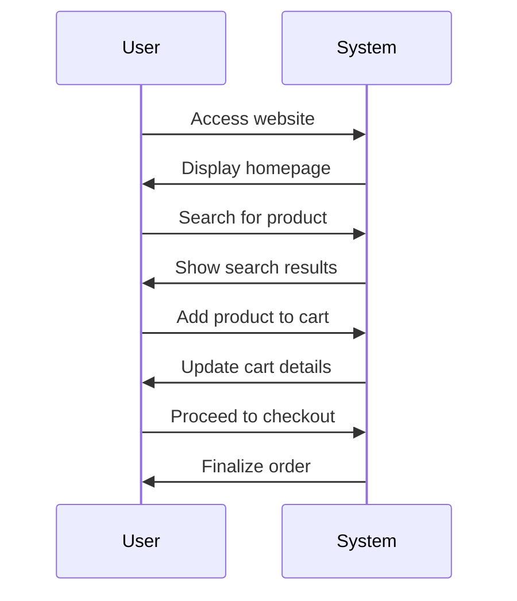
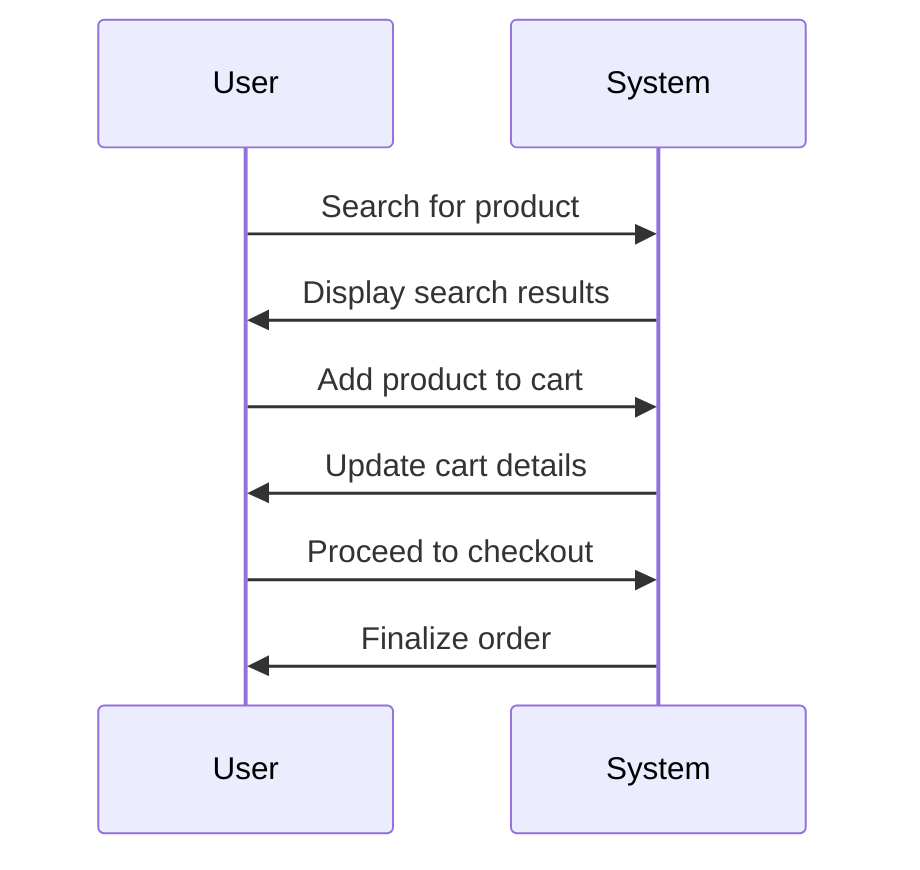
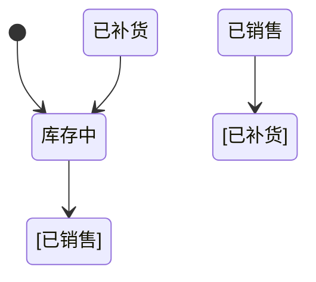
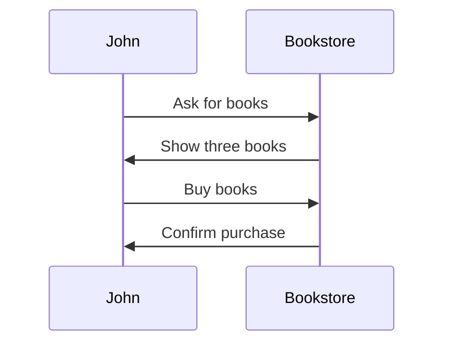
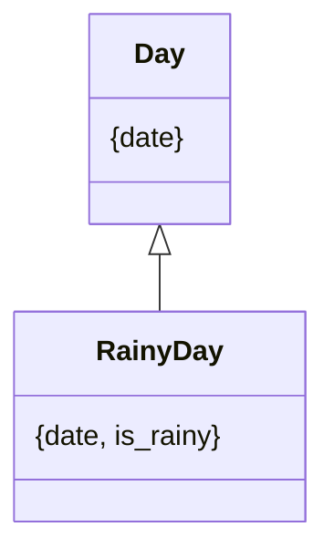
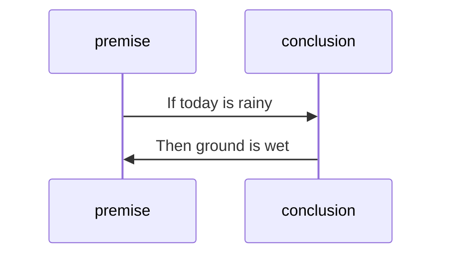
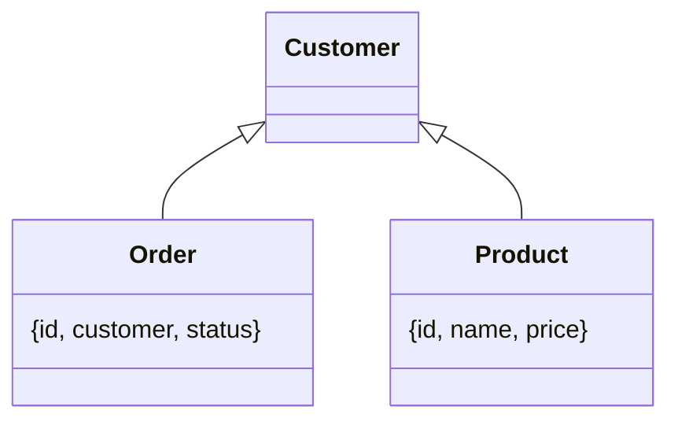
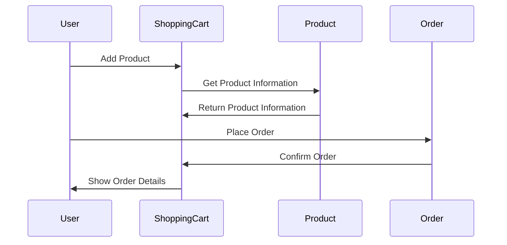
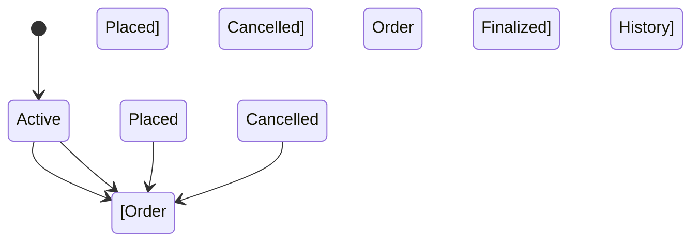

                 

## 引言

### 1.1 书籍背景与目的

《维特根斯坦的图像理论与UML图：系统建模的哲学基础》旨在探索维特根斯坦的图像理论在系统建模中的应用，并探讨哲学基础对系统建模的重要性。本书的背景源于两位思想巨人的结合：路德维希·维特根斯坦（Ludwig Wittgenstein）和统一建模语言（UML）。维特根斯坦是20世纪最伟大的哲学家之一，他的思想对逻辑、语言哲学和数学哲学等领域产生了深远的影响。而统一建模语言（UML）则是软件工程中广泛使用的一种可视化建模语言，用于系统设计和分析。

本书的目的有以下几点：

1. **介绍维特根斯坦的图像理论**：通过详细解读维特根斯坦的哲学观点，特别是他的图像理论，帮助读者理解其哲学思想的核心。
2. **探讨UML图的基本概念与原理**：介绍UML图的基本概念、分类和应用，使其成为读者理解系统建模的有力工具。
3. **结合维特根斯坦的图像理论与UML图**：阐述两者之间的关联，并探讨如何将维特根斯坦的哲学观点应用于UML图的构建过程中。
4. **系统建模的哲学基础**：通过哲学的视角，深入分析系统建模中的哲学问题，并探讨哲学对系统建模的指导意义。

### 1.2 维特根斯坦的图像理论概述

维特根斯坦的图像理论是他在哲学领域的一个重要贡献，特别是在他的早期著作《逻辑哲学论》（Tractatus Logico-Philosophicus）中得到了充分阐述。该理论认为，命题与事实之间的关系类似于图像与被描绘的对象之间的关系。具体来说，图像（图片）代表了一个事实，图像的形状、颜色和其他特征与事实的特征相对应。

#### 图像理论的基本概念

1. **图像的定义**：图像是世界的某种映射或表示，它以某种方式与事实相匹配。
2. **图像与语言的关系**：维特根斯坦认为，语言中的命题就像图像一样，试图描绘世界中的事实。因此，命题的真理条件在于它们与世界的事实相一致。
3. **图像与事实的对应关系**：图像的每个部分都与事实的一个方面相对应。例如，一张描绘一个人的图像中的眼睛、鼻子和嘴巴分别对应于这个人的真实眼睛、鼻子和嘴巴。

#### 图像理论的特点

1. **明确性**：图像理论提供了一个明确的描述方式，使得命题和事实之间的关系清晰可辨。
2. **直观性**：图像直观地展示了事实的特征，使得理解和解释变得更加容易。
3. **功能性**：图像不仅可以描述事实，还可以用于推理和预测。通过观察图像，我们可以推断出其他事实或命题的真实性。

### 1.3 UML图与系统建模

统一建模语言（UML）是一种标准化的建模语言，用于软件系统的设计、分析和实现。它提供了一系列符号和规则，用于描述系统的结构、行为和交互。UML图是UML语言的核心，它通过图形化的方式表达系统中的各种元素和关系。

#### UML图的基本概念

1. **UML图简介**：UML图是一种用于可视化系统设计的图形表示，它包含了一系列符号和连接线，用于表示系统中的不同组件和它们之间的关系。
2. **UML图的分类**：UML图分为结构图和行为图两大类。结构图包括类图、组件图和部署图等，用于描述系统的静态结构。行为图包括序列图、协作图和状态图等，用于描述系统的动态行为。
3. **UML图的作用**：UML图在软件开发过程中扮演着重要角色，它有助于开发者理解系统的结构和行为，促进团队之间的沟通和协作。

#### 系统建模的概念与过程

系统建模是软件开发过程中的一项关键任务，它涉及对系统的需求、结构和行为进行建模。系统建模的过程包括以下步骤：

1. **需求分析**：理解系统的需求，包括功能需求和非功能需求。
2. **概念模型设计**：使用概念模型（如ER图）来表示系统的基本结构和关系。
3. **详细模型设计**：使用UML图等工具详细描述系统的各个组件和它们之间的关系。
4. **模型验证与优化**：验证模型是否满足需求，并进行必要的优化。

### 1.4 哲学基础在系统建模中的重要性

哲学作为一门探究人类存在、知识、价值和语言的学科，对系统建模有着重要的影响。哲学提供了对现实世界的深入理解，这种理解有助于我们更准确地描述和设计系统。以下是哲学在系统建模中的几个重要作用：

1. **理解现实世界**：哲学帮助我们在设计系统时，深入理解现实世界的本质和特征。这有助于我们构建更符合现实需求、更有效的系统。
2. **指导系统设计**：哲学原理和方法论可以为系统设计提供指导，帮助我们在设计过程中做出更明智的决策。
3. **处理复杂问题**：系统建模往往涉及复杂的系统结构和行为，哲学提供了分析和解决复杂问题的方法和工具。
4. **提高模型质量**：哲学思考有助于我们识别系统设计中的潜在问题，提高模型的准确性和可靠性。

### 1.5 目录结构与内容安排

本书的结构和内容安排如下：

- **第一部分：引言**：介绍书籍的背景和目的，以及维特根斯坦的图像理论和UML图的基本概念。
- **第二部分：维特根斯坦图像理论的哲学基础**：详细解读维特根斯坦的哲学思想，特别是图像理论，并探讨其在逻辑哲学和语言哲学中的应用。
- **第三部分：UML图的基本概念与原理**：介绍UML图的基本概念、分类和应用，以及系统建模的过程。
- **第四部分：维特根斯坦图像理论与UML图的结合**：阐述维特根斯坦图像理论对UML图的启示，以及UML图在维特根斯坦图像理论中的应用。
- **第五部分：系统建模的哲学基础**：探讨哲学基础在系统建模中的应用，包括哲学对系统建模的指导作用和挑战。
- **第六部分：案例研究**：通过具体案例，展示维特根斯坦图像理论和UML图在系统建模中的应用。
- **第七部分：总结与展望**：总结全书内容，并对维特根斯坦图像理论与UML图在系统建模中的应用前景进行展望。

通过以上结构和内容的安排，本书旨在为读者提供一部全面、深入和实用的系统建模指南，帮助他们在实际工作中更好地运用维特根斯坦的图像理论和UML图。

## 第二部分：维特根斯坦图像理论的哲学基础

### 2.1 维特根斯坦的哲学观

#### 2.1.1 语言哲学

路德维希·维特根斯坦（Ludwig Wittgenstein）是20世纪最具影响力的哲学家之一，其思想对语言哲学、逻辑哲学和数学哲学产生了深远的影响。维特根斯坦的哲学观主要集中在语言、思维和现实之间的关系上，他认为语言是思维的工具，而思维是理解现实世界的关键。

维特根斯坦的语言哲学观点可以概括为以下几点：

1. **语言是思维的载体**：维特根斯坦认为，语言是我们用来思考和表达思想的方式。他说过，“哲学的任务不是去发现世界的本质，而是去发现思想的逻辑形式”。这意味着语言不仅仅是表达事实的工具，更是理解和思考的工具。

2. **意义与使用**：维特根斯坦提出了“意义即使用”（Meaning is Use）的观点，认为词语的意义不是内在固有的，而是由它们在实际生活中的使用方式决定的。换句话说，一个词的意义取决于它在特定情境中的具体用途。

3. **语言游戏理论**：维特根斯坦在晚期著作中提出了“语言游戏理论”（Language Game Theory），认为语言使用就像玩游戏一样，需要参与者共同遵循的规则。语言游戏可以分为三种类型：日常语言游戏、形式语言游戏和逻辑语言游戏。

#### 2.1.2 图像理论的基本概念

维特根斯坦的图像理论（Picture Theory）是他在早期著作《逻辑哲学论》中提出的一个重要概念，它试图解释命题与事实之间的关系。

1. **图像的定义**：图像是一种映射或表示，它以某种方式与事实相匹配。在维特根斯坦的术语中，图像是指一种命题形式，它试图以某种方式描述一个事实。

2. **图像与语言的关系**：维特根斯坦认为，命题与事实之间的关系就像图像与被描绘的对象之间的关系。命题的真理条件在于它们与世界的事实相一致。

3. **图像与事实的对应关系**：图像的每个部分都与事实的一个方面相对应。例如，一张描绘一个人的图像中的眼睛、鼻子和嘴巴分别对应于这个人的真实眼睛、鼻子和嘴巴。

#### 2.1.3 图像与概念的关系

维特根斯坦的图像理论不仅关注图像与事实的关系，还探讨了图像与概念之间的关系。他认为，概念是思维的基本单位，而图像则是概念的一种表现形式。

1. **概念的定义**：概念是思维的基本单位，用来分类和识别事物。维特根斯坦认为，概念是通过使用语言来表达的。

2. **图像与概念的关系**：图像是概念的一种表现形式，它通过视觉或语言形式来描述概念。例如，当我们看到一个红色的圆形，我们不仅看到了图像，还理解了“红色”和“圆形”这两个概念。

#### 2.1.4 图像理论的哲学意义

维特根斯坦的图像理论具有重要的哲学意义，它不仅对逻辑哲学和语言哲学产生了深远的影响，还为其他领域的研究提供了启示。

1. **逻辑哲学中的应用**：图像理论为逻辑哲学提供了一个新的视角，它帮助我们理解命题、逻辑和真理之间的关系。例如，通过图像理论，我们可以更清晰地理解命题的真理条件。

2. **语言哲学中的价值**：图像理论为我们理解语言的本质提供了新的思路。它指出，语言不仅仅是表达事实的工具，更是理解和思考的工具。

3. **哲学思考的启示**：图像理论鼓励我们以一种直观、直观的方式来思考哲学问题。它提醒我们，哲学问题不仅仅是抽象的、理论性的，更与我们日常生活的经验密切相关。

总之，维特根斯坦的图像理论是他在哲学领域的一个重要贡献，它不仅丰富了我们的哲学思考，也为其他领域的研究提供了新的视角和启示。

### 2.2 图像理论的应用与意义

#### 2.2.1 图像理论在逻辑哲学中的应用

维特根斯坦的图像理论在逻辑哲学中有着广泛的应用，为理解逻辑结构和命题的真值条件提供了新的视角。根据图像理论，一个命题可以被看作是一个图像，它映射或描述了一个事实。这种映射关系使得命题的真假依赖于它是否正确地描述了事实。

1. **命题的真值条件**：图像理论认为，一个命题的真值取决于它是否正确地映射或描述了事实。如果一个命题的图像与事实相一致，那么这个命题就是真的；如果图像与事实不一致，那么命题就是假的。这种真值条件为我们提供了一个直观的方式来判断命题的真假。

2. **逻辑推理**：图像理论还影响了逻辑推理的方法。通过将命题看作是图像，我们可以使用图像之间的映射关系来进行逻辑推理。例如，如果我们知道两个事实的图像是相似的，那么我们可以推断这两个命题是相关的，或者它们之间可能存在某种逻辑联系。

3. **形式逻辑**：图像理论在形式逻辑中也有应用。通过将命题转化为图像，我们可以使用形式化的方法来研究逻辑结构和推理规则。例如，在命题演算中，我们可以将命题转化为符号形式，并通过图像理论来证明命题的真值。

#### 2.2.2 图像理论在语言哲学中的价值

图像理论在语言哲学中具有重要的价值，它为我们理解语言的本质、意义和用法提供了新的视角。维特根斯坦认为，语言的意义取决于它的使用方式，而图像理论为我们提供了理解这种使用方式的方法。

1. **语言的意义**：根据图像理论，语言的意义在于它如何映射或描述现实世界中的事实。这意味着，一个词或一个句子只有在特定的情境中才有意义。例如，"狗"这个词只有在我们讨论具体的狗的实例时才有意义。

2. **语言的用法**：图像理论强调了语言的使用方式。语言不仅仅是用来描述事实的工具，它还用于思考和交流。图像理论帮助我们理解，语言的用法是由一系列规则和习惯决定的，这些规则和习惯构成了我们的语言游戏。

3. **语言的局限性**：图像理论还揭示了语言的局限性。由于语言的图像化本质，语言无法完全准确地描述现实世界的所有复杂性和多样性。维特根斯坦指出，有些哲学问题（如形而上学问题）无法用语言来解决，因为它们超出了语言的范畴。

#### 2.2.3 图像理论对哲学思考的启示

图像理论不仅对逻辑哲学和语言哲学产生了深远影响，还对哲学思考本身提供了启示。

1. **直观性**：图像理论强调直观性，它提供了一种直观的方式来理解哲学问题。通过将命题视为图像，我们可以更直观地理解命题的真假和逻辑关系。

2. **反思性**：图像理论鼓励我们反思我们的语言使用和思维习惯。通过理解图像与事实的关系，我们可以更清晰地认识到语言和思维的局限性，并反思我们在哲学思考中的预设和偏见。

3. **哲学方法的变革**：图像理论为哲学方法带来了变革。它提醒我们，哲学不仅仅是抽象的理论探讨，更是一种与日常经验密切相关的实践活动。通过图像理论，我们可以将哲学问题具体化为图像，并通过直观的方式来解决这些问题。

总之，维特根斯坦的图像理论在逻辑哲学和语言哲学中具有重要的应用价值，它不仅丰富了我们的哲学思考，还为其他领域的研究提供了新的视角和启示。图像理论提醒我们，哲学问题不仅仅是抽象的，更是与我们日常生活的经验密切相关。

### 2.3 维特根斯坦图像理论的局限性

尽管维特根斯坦的图像理论在逻辑哲学和语言哲学中具有重要地位，但它也存在一定的局限性，这些局限性限制了其在某些领域的应用和解释力。

#### 1. 对复杂性的忽略

图像理论在处理简单和直观的命题时非常有效，但对于复杂和抽象的概念，图像理论可能显得力不从心。例如，在形而上学和伦理学等领域，问题往往涉及抽象的概念和复杂的推理，而图像理论难以直观地映射这些复杂关系。

#### 2. 对语言的局限

维特根斯坦的图像理论认为语言的意义取决于其使用方式，但这种观点可能过于简化了语言的复杂性。语言不仅用于描述事实，还用于表达情感、价值判断和抽象概念。图像理论在处理这些方面时可能显得不够充分。

#### 3. 对真实世界的限制

图像理论将命题与事实的关系视为一种映射，但这种映射可能无法完全捕捉真实世界的多样性和复杂性。现实世界中的许多现象无法用简单的图像来描述，这使得图像理论的适用范围受到限制。

#### 4. 对逻辑推理的限制

虽然图像理论在逻辑推理中提供了一种直观的方法，但它对逻辑推理的形式化和严谨性提出了挑战。在处理复杂的逻辑推理时，图像理论可能难以提供充分的理论支持。

总之，尽管维特根斯坦的图像理论在许多方面具有深刻的洞察力，但它在处理复杂性和语言局限方面存在一定局限性。这些局限性提醒我们在应用图像理论时需要保持批判性思维，同时探索其他哲学和逻辑理论来补充其不足。

### 2.4 维特根斯坦图像理论在系统建模中的应用

维特根斯坦的图像理论在系统建模中的应用提供了独特的视角，有助于我们更好地理解和设计复杂系统。通过将图像理论应用于系统建模，我们可以从概念和事实的关系中汲取灵感，以更直观和有效的方式构建系统模型。

#### 1. **系统需求分析中的图像映射**

在系统需求分析阶段，我们通常需要理解用户的需求和系统的目标。维特根斯坦的图像理论可以帮助我们将用户的需求映射到系统的功能上。例如，如果用户需求是一个“在线购物系统”，我们可以将这个需求视为一个图像，它映射了用户想要实现的目标。通过这种方式，我们可以更直观地理解需求，并将其转化为系统功能的具体实现。

#### 2. **概念模型构建中的图像表示**

在系统建模的过程中，概念模型是一个关键步骤，它用于定义系统的基本结构和主要元素。维特根斯坦的图像理论可以帮助我们构建概念模型，因为它提供了将概念与实际世界对应的方法。例如，在一个库存管理系统中的概念模型中，我们可以使用图像来表示库存、商品和订单等元素，从而更直观地展示它们之间的关系和功能。

```mermaid
classDiagram
  Class01 <|-- SubClass01
  Class01 o-- Object01
  Class02(<%=红色背景%>) : MainClass
  Class03 : AnotherClass
  Class01..> Class03
  Class diagram for the inventory management system
  Class01[库存] 
  Class02[商品]
  Class03[订单]
```

#### 3. **详细模型设计中的图像映射**

在详细模型设计阶段，我们需要将概念模型进一步细化，并定义系统的具体实现细节。维特根斯坦的图像理论在这里可以帮助我们将抽象的概念映射到具体的实现细节上。例如，在一个电子商务网站的设计中，我们可以使用图像来表示用户界面、数据库和服务器等组件，并展示它们之间的交互关系。



#### 4. **系统实现与评估中的图像验证**

在系统实现和评估阶段，维特根斯坦的图像理论可以帮助我们验证系统模型是否满足原始需求。通过将实现结果与预期图像进行对比，我们可以识别潜在的缺陷和不足。例如，在一个银行系统中，我们可以将预期图像（如用户登录、账户查询、转账等）与实际实现进行对比，以确保系统的功能完整和正确。

```mermaid
gantt
  dateFormat  YYYY-MM-DD
  title 项目进度
  section 项目周期
  A任务1 :开始于2023-01-01，2周
  B任务2 :开始于2023-01-15，4周
  C任务3 :开始于2023-02-01，3周
  D任务4 :开始于2023-02-25，2周
```

总之，维特根斯坦的图像理论在系统建模的各个阶段都具有应用价值。通过将图像理论与系统建模相结合，我们可以更直观地理解和设计复杂系统，提高模型的准确性和实用性。这种方法不仅有助于开发者更好地理解系统需求，还可以为系统的实现和评估提供有力支持。

### 2.5 维特根斯坦图像理论对系统建模的启示

维特根斯坦的图像理论为系统建模提供了深刻的哲学启示，特别是在如何构建概念清晰、逻辑严谨的模型方面。以下是一些维特根斯坦图像理论对系统建模的启示：

#### 1. **直观性在模型构建中的重要性**

维特根斯坦的图像理论强调直观性，认为图像能够直观地反映事实。这一观点在系统建模中具有重要意义。系统建模的目的是为了更好地理解和设计复杂系统，而直观性使得模型更容易被理解和接受。通过将复杂系统的各个部分映射为图像，我们可以更直观地展示系统结构和功能，从而提高模型的易理解性和清晰度。

#### 2. **概念与事实的对应关系**

图像理论中的概念与事实的对应关系为系统建模提供了指导。在系统建模过程中，我们需要明确系统的概念和事实，并确保它们之间的对应关系正确。通过维特根斯坦的图像理论，我们可以更系统地识别和定义系统中的关键概念和事实，从而构建一个结构清晰、逻辑严谨的模型。

```mermaid
erDiagram
  Product ||--|{ Customer } : buys
  Product ||--|{ Review } : contains
  Customer ||--|{ Order } : places
  Review ||--|{ Product } : reviews
  Customer ||--|{ Rating } : has
```

#### 3. **意义与使用的统一**

维特根斯坦强调意义与使用的统一，这一原则在系统建模中同样适用。系统建模不仅要关注模型的结构和功能，还要考虑其实际应用和用户需求。通过将系统的使用情境和需求融入模型构建过程中，我们可以确保模型不仅满足技术上的要求，还能在实际应用中发挥最大价值。

#### 4. **语言的限制与超越**

图像理论提醒我们语言的局限性，这对系统建模具有重要意义。在实际建模过程中，我们常常会遇到语言表达不足或难以描述的问题。通过维特根斯坦的图像理论，我们可以尝试使用非语言的方法（如图形、符号等）来弥补语言的不足，从而构建更加全面和精确的模型。

#### 5. **反思与迭代**

维特根斯坦的哲学思考方法强调反思和迭代。在系统建模过程中，我们应不断反思模型的有效性和适用性，通过迭代和改进来提升模型的准确性和实用性。通过维特根斯坦的图像理论，我们可以更加自觉地识别模型中的问题，并进行必要的调整和优化。

总之，维特根斯坦的图像理论为系统建模提供了重要的哲学启示。通过理解和应用这些启示，我们可以构建更加清晰、准确和实用的系统模型，从而更好地理解和设计复杂系统。

### 2.6 维特根斯坦图像理论与UML图的结合

维特根斯坦的图像理论为系统建模提供了深刻的哲学基础，而统一建模语言（UML）则是系统建模的实用工具。这两者的结合不仅丰富了系统建模的方法论，也为解决复杂系统问题提供了新的视角。在本节中，我们将探讨维特根斯坦图像理论对UML图的启示，并分析如何将图像理论应用于UML图的构建过程中。

#### 2.6.1 维特根斯坦图像理论对UML图的启示

1. **直观性与可视性**：维特根斯坦的图像理论强调直观性和可视性，这一点与UML图的核心理念不谋而合。UML图通过图形化的方式展示了系统的结构和行为，使得开发者可以更直观地理解和分析系统。图像理论提醒我们在UML图设计中注重直观性和可读性，以确保模型易于理解和维护。

2. **概念与事实的对应关系**：图像理论中的概念与事实对应关系为UML图的构建提供了指导。在UML图中，类、对象、关系等元素都是概念性的表示，而通过图像理论，我们可以更好地理解这些概念如何映射到现实世界的具体事实中。例如，在类图中，每个类都对应于一个具体的概念，而通过图像理论，我们可以更清晰地展示这些类与实际对象之间的关系。

3. **意义与使用的统一**：维特根斯坦强调意义与使用的统一，这一原则在UML图的构建中同样重要。UML图不仅用于设计系统，还用于实际开发和维护。因此，在构建UML图时，我们需要考虑其实际应用和用户需求。图像理论提醒我们，在UML图中要确保每个元素都有明确的意义和用途，从而提高模型的可操作性和实用性。

4. **语言的限制与超越**：维特根斯坦指出语言的局限性，这一点在UML图中尤为明显。UML图虽然是一种图形化语言，但它仍受限于人类语言的表达能力。图像理论鼓励我们在UML图中尝试使用非语言的方法（如图形、符号等）来弥补语言的不足，从而构建更加全面和精确的模型。

5. **反思与迭代**：维特根斯坦的哲学思考方法强调反思和迭代，这一点在UML图的构建过程中同样适用。随着系统需求和技术的不断发展，UML图需要不断地进行调整和优化。通过图像理论，我们可以更加自觉地识别UML图中的问题，并进行必要的反思和迭代，以提高模型的准确性和实用性。

#### 2.6.2 维特根斯坦图像理论在UML图构建中的应用

1. **类图的构建**：在类图中，每个类都是对系统中一个具体概念或对象的抽象表示。通过维特根斯坦的图像理论，我们可以将类与实际对象之间的关系映射到类图中。例如，在一个电子商务系统中，我们可以将“产品”类映射到实际存在的商品，通过图像理论，我们可以更直观地展示这些类与实际商品之间的对应关系。

```mermaid
classDiagram
  Product <<entity>>
  Customer <<entity>>
  Order <<entity>>
  Review <<entity>>

  Product : {id, name, price}
  Customer : {id, name, email}
  Order : {id, customer, products, status}
  Review : {id, product, customer, rating, comment}
```

2. **序列图的构建**：序列图用于展示系统中对象之间的交互顺序。通过维特根斯坦的图像理论，我们可以将对象之间的交互映射到序列图中。例如，在一个在线购物系统中，用户通过浏览、搜索和添加商品到购物车，最终完成购买。通过图像理论，我们可以更直观地展示用户与系统之间的交互过程。



3. **状态图的构建**：状态图用于展示对象的动态行为和状态转换。通过维特根斯坦的图像理论，我们可以将对象的动态行为映射到状态图中。例如，在一个库存管理系统中，物品的状态可能包括“库存中”、“已销售”和“已补货”。通过图像理论，我们可以更直观地展示物品状态的转换过程。



4. **组件图的构建**：组件图用于展示系统的组件结构和依赖关系。通过维特根斯坦的图像理论，我们可以将系统组件的抽象表示映射到组件图中。例如，在一个分布式系统中，我们可以将各个组件（如前端、后端、数据库等）映射到组件图中，通过图像理论，我们可以更直观地展示这些组件之间的依赖关系。

```mermaid
componentDiagram
  ComponentA <-- (ComponentB)
  ComponentB --> ComponentC
  ComponentC <<interface>> ComponentD
```

通过将维特根斯坦的图像理论应用于UML图的构建过程中，我们可以提高模型的可理解性、准确性和实用性。这种方法不仅有助于开发者更好地理解和设计复杂系统，还可以为系统的实现和评估提供有力支持。总之，维特根斯坦的图像理论为系统建模提供了深刻的哲学启示，与UML图的结合为解决复杂系统问题提供了新的视角和工具。

### 2.7 UML图在维特根斯坦图像理论中的应用

维特根斯坦的图像理论强调概念与事实之间的映射关系，而统一建模语言（UML）图作为一种图形化的表示方法，可以有效地应用于这一理论中。通过UML图，我们可以直观地展示系统中的概念和事实，使得维特根斯坦的图像理论更加具体和可操作。

#### 2.7.1 UML图在语言哲学中的应用

语言哲学是维特根斯坦图像理论的核心领域之一。在语言哲学中，图像理论为我们理解语言的本质和意义提供了新的视角。通过UML图，我们可以将语言的构成元素（如词汇、句子等）映射到图像中，从而更直观地展示语言与事实之间的关系。

1. **词汇与图像的关系**：在UML图中，我们可以使用类图来表示词汇的概念。每个类代表一个词汇，它的属性和方法代表了词汇的含义和用法。例如，在一个关于“动物”的类图中，我们可以定义“猫”、“狗”等类，并展示它们之间的继承关系。

```mermaid
classDiagram
  Animal <|-| Dog
  Animal <|-| Cat
  Animal : {name, species}
  Dog : {name, breed}
  Cat : {name, color}
```

2. **句子与图像的关系**：在UML图中，我们可以使用序列图来表示句子的结构。序列图展示了句子中各个词汇之间的关系和交互顺序。例如，我们可以使用序列图来展示“约翰买了三本书”这个句子的结构，其中“约翰”是主体，“买了”是动作，“三本书”是动作对象。



通过UML图的直观表示，我们可以更清晰地理解语言哲学中的图像理论，从而更好地探讨语言的本质和意义。

#### 2.7.2 UML图在逻辑哲学中的应用

逻辑哲学是维特根斯坦图像理论应用的另一个重要领域。在逻辑哲学中，图像理论为我们提供了理解命题、推理和逻辑结构的方法。通过UML图，我们可以将逻辑结构可视化，使得逻辑推理更加直观和易懂。

1. **命题与图像的关系**：在UML图中，我们可以使用类图来表示命题的结构。每个类代表一个命题，它的属性和方法代表了命题的真假条件。例如，在一个关于“今天下雨”的命题中，我们可以定义“今天”和“下雨”两个类，并展示它们之间的逻辑关系。



2. **推理与图像的关系**：在UML图中，我们可以使用序列图来表示逻辑推理的过程。序列图展示了命题之间的推理关系和推理步骤。例如，在一个关于“如果今天下雨，那么地面会湿”的推理中，我们可以使用序列图来展示推理的过程。



通过UML图的直观表示，我们可以更清晰地理解逻辑哲学中的图像理论，从而更好地探讨逻辑结构和推理方法。

#### 2.7.3 UML图在计算机科学中的应用

计算机科学是维特根斯坦图像理论应用的重要领域之一。在计算机科学中，图像理论可以帮助我们理解和设计复杂系统。通过UML图，我们可以将系统的各个组件和它们之间的关系可视化，从而更直观地展示系统的结构和行为。

1. **系统设计与图像的关系**：在UML图中，我们可以使用类图、组件图和部署图等来表示系统的结构和设计。类图展示了系统的类和它们之间的关系，组件图展示了系统的组件和它们的依赖关系，部署图展示了系统的硬件和软件部署情况。例如，在一个电子商务系统中，我们可以使用类图来展示用户、商品和订单等类，以及它们之间的关系。



2. **系统实现与图像的关系**：在UML图中，我们可以使用序列图和协作图来表示系统的行为和交互。序列图展示了对象之间的交互顺序，协作图展示了对象之间的协作关系。例如，在一个在线购物系统中，我们可以使用序列图来展示用户从浏览商品到完成购买的过程，以及各个对象之间的交互。



通过UML图的直观表示，我们可以更清晰地理解计算机科学中的图像理论，从而更好地设计、实现和评估复杂系统。

总之，UML图在维特根斯坦图像理论中的应用为我们提供了一个直观和具体的方法，以理解和设计复杂系统。通过UML图，我们可以将图像理论中的概念和事实映射到视觉化的模型中，使得系统建模更加清晰、准确和高效。这种结合不仅丰富了系统建模的方法论，也为解决复杂系统问题提供了新的视角和工具。

### 第三部分：UML图的基本概念与原理

#### 3.1 UML图的基本概念

统一建模语言（UML）是一种用于系统建模的标准化图形语言，它被广泛应用于软件工程、系统设计和项目管理等领域。UML图是一种用于可视化系统设计、结构和行为的图形表示，它通过一系列符号和规则来描述系统的各个方面。以下是UML图的基本概念：

1. **UML图简介**：UML图是统一建模语言（UML）的一部分，它由国际对象管理集团（OMG）制定。UML图提供了多种类型的图形表示，包括类图、组件图、序列图、协作图等，每种图形都有其特定的用途和规则。

2. **UML图的分类**：UML图可以分为两大类：结构图和行为图。
   - **结构图**：描述系统的静态结构和组成部分，包括类图、组件图、部署图等。
   - **行为图**：描述系统的动态行为和对象之间的交互，包括序列图、协作图、状态图等。

3. **UML图的作用**：UML图在软件开发和系统设计中扮演着重要角色，它有助于开发者、项目经理和利益相关者更好地理解和沟通系统设计。UML图的作用主要包括：
   - **设计可视化**：通过图形化的方式展示系统的结构和行为，使得复杂系统更容易理解和解释。
   - **沟通工具**：作为一种通用的图形语言，UML图帮助不同背景的专业人员（如开发者、设计师、客户等）进行有效的沟通和协作。
   - **文档化**：UML图可以作为系统设计的文档，记录系统的设计和实现细节，为后续的开发和维护提供参考。

#### 3.2 UML图的构建原则

构建UML图需要遵循一些基本原则，以确保模型的质量和可读性。以下是构建UML图的主要原则：

1. **模型抽象原则**：UML图是对现实世界的抽象表示，因此构建UML图时需要识别系统的关键组件和关系，并对其进行适当的抽象。通过抽象，我们可以将复杂的现实问题简化为可管理的模型。

2. **模型一致性原则**：一致性是UML图的重要原则，确保模型中的各个部分相互协调和一致。这意味着模型中的类、对象、关系和行为等元素需要在不同的UML图中保持一致，以避免混淆和错误。

3. **模型可扩展性原则**：构建UML图时需要考虑未来的扩展性和变化。这意味着在设计模型时，需要预留扩展接口和模块，以便在系统需求变化时进行修改和扩展。

4. **清晰性原则**：UML图应该清晰、简洁，避免过于复杂的设计。清晰性有助于提高模型的可读性和理解性，减少误解和错误。

5. **实用性原则**：UML图应该具有实际应用价值，能够帮助开发者更好地理解和实现系统设计。这意味着模型需要满足实际需求和开发目标，而不是仅仅为了美观或理论上的完美。

#### 3.3 UML图的应用场景

UML图在多个领域和场景中都有广泛的应用，以下是一些常见应用场景：

1. **软件开发**：UML图是软件开发过程中不可或缺的工具，用于需求分析、系统设计、编码实现和测试等各个环节。通过UML图，开发人员可以清晰地表达系统的设计意图，促进团队协作和沟通。

2. **系统设计**：UML图在系统设计阶段扮演着关键角色，用于定义系统的架构、组件和接口。通过UML图，设计师可以全面地展示系统的结构和行为，从而更好地理解系统的功能和性能。

3. **项目管理**：UML图在项目管理中也有应用，用于记录项目进度、任务分配和风险评估等。通过UML图，项目经理可以更直观地了解项目的整体情况，从而制定有效的项目管理计划。

4. **业务流程管理**：UML图可以帮助业务分析师和流程管理人员设计和优化业务流程。通过UML图，可以清晰地表达业务流程中的各个环节和流程，以便进行改进和优化。

总之，UML图作为一种标准化的图形化表示方法，在软件开发、系统设计、项目管理等多个领域都有广泛的应用。通过遵循构建原则和应用场景，UML图可以有效地帮助专业人员理解和实现复杂系统。

### 3.4 UML图的构建过程

构建一个高质量的UML图是一个系统化的过程，它包括多个步骤和关键要素。以下是构建UML图的主要步骤和注意事项：

#### 1. **需求分析**

在开始构建UML图之前，首先需要进行需求分析。需求分析是理解用户需求、业务目标和系统功能的关键步骤。以下是需求分析的一些要点：

- **收集需求**：与利益相关者（如客户、用户、开发人员等）进行沟通，收集系统的功能需求和业务需求。
- **整理需求**：将收集到的需求进行分类和整理，明确系统的核心功能和非核心功能。
- **需求文档**：撰写需求文档，详细描述系统的功能需求、非功能需求和约束条件。

#### 2. **概念模型设计**

概念模型设计是构建UML图的第一步，它主要用于定义系统的基本结构和主要元素。以下是概念模型设计的一些要点：

- **实体识别**：识别系统中的主要实体，如用户、产品、订单等。
- **关系定义**：定义实体之间的关系，如一对一、一对多、多对多关系。
- **属性描述**：为每个实体定义属性，如用户的姓名、地址、电子邮件等。
- **ER图**：使用实体-关系（ER）图来表示系统的概念模型。以下是ER图的示例：

```mermaid
erDiagram
  User ||--|{ Order } : places
  User ||--|{ Product } : reviews
  Product ||--|{ Review } : reviews
  Order : {id, date, status}
  Product : {id, name, price}
  Review : {id, content, rating}
```

#### 3. **详细模型设计**

详细模型设计是对概念模型的进一步细化，它包括类的定义、属性和方法的设计。以下是详细模型设计的一些要点：

- **类定义**：定义系统中的类，每个类代表一个实体或概念。以下是类的定义示例：

```mermaid
classDiagram
  Customer <<entity>>
  Order <<entity>>
  Product <<entity>>
  Review <<entity>>

  Customer : {id, name, email}
  Order : {id, customer, status}
  Product : {id, name, price}
  Review : {id, content, rating}
```

- **属性和方法**：为每个类定义属性和方法，属性描述类的特征，方法描述类的行为。以下是属性和方法的示例：

```mermaid
classDiagram
  Customer {
    -id : Integer
    -name : String
    -email : String
    +placeOrder(order : Order) : void
    +updateProfile() : void
  }
  Order {
    -id : Integer
    -customer : Customer
    -status : String
    +cancelOrder() : void
    +finalizeOrder() : void
  }
  Product {
    -id : Integer
    -name : String
    -price : Float
    +addReview(review : Review) : void
    +updatePrice(newPrice : Float) : void
  }
  Review {
    -id : Integer
    -content : String
    -rating : Integer
    +createReview() : void
    +updateReview() : void
  }
```

#### 4. **行为模型设计**

行为模型设计用于描述系统的动态行为和对象之间的交互。以下是行为模型设计的一些要点：

- **序列图**：序列图展示对象之间的交互顺序，通常用于描述系统的业务流程。以下是序列图的示例：


- **协作图**：协作图展示对象之间的协作关系，通常用于描述复杂的交互场景。以下是协作图的示例：

```mermaid
collaborationDiagram
  participant User
  participant ShoppingCart
  participant Product
  participant Order
  User->>ShoppingCart: Add Product
  ShoppingCart->>Product: Get Product Information
  Product->>ShoppingCart: Return Product Information
  User->>Order: Place Order
  Order->>ShoppingCart: Confirm Order
  ShoppingCart->>User: Show Order Details
```

- **状态图**：状态图展示对象的动态行为和状态转换，通常用于描述复杂对象的行为。以下是状态图的示例：



#### 5. **验证与优化**

在构建完UML图后，需要进行验证和优化，以确保模型的正确性和实用性。以下是验证与优化的一些要点：

- **一致性检查**：检查UML图中的类、关系和属性是否一致，确保没有遗漏或冲突。
- **可读性检查**：检查UML图的布局和符号是否清晰，确保易于理解和维护。
- **优化模型**：根据需求的变化和反馈，对UML图进行必要的优化和调整，以提高模型的实用性和可操作性。

通过遵循以上步骤和注意事项，我们可以构建高质量的UML图，为系统设计和开发提供有效的支持和指导。

### 第三部分：UML图在系统设计中的实际应用

在系统设计过程中，UML图作为一种强有力的可视化工具，能够帮助开发者、架构师和项目经理更好地理解系统的结构、行为和复杂性。以下将通过一个具体的系统设计案例，展示UML图在系统设计中的实际应用。

#### 案例背景

假设我们要设计一个在线书店系统，该系统需要支持用户注册、登录、浏览图书、添加购物车、下单和支付等功能。此外，系统还需要管理图书库存、订单和用户评价等。在这个案例中，我们将使用UML图来表示系统的架构和功能。

#### 系统需求分析

在系统设计前，我们需要对系统需求进行详细分析。以下是该在线书店系统的主要需求：

- **用户功能**：用户注册、登录、浏览图书、添加购物车、下单、支付、查看订单历史和评价图书。
- **图书管理功能**：添加图书、更新图书信息、删除图书、查看图书库存。
- **订单管理功能**：创建订单、更新订单状态、查看订单详情、处理退货和退款。
- **评价管理功能**：用户对图书进行评价、管理员查看和管理用户评价。

#### 概念模型设计

概念模型设计是系统设计的第一步，主要用于定义系统的基本结构和主要元素。以下是概念模型设计的UML类图：

```mermaid
classDiagram
  User <<entity>>
  Book <<entity>>
  ShoppingCart <<entity>>
  Order <<entity>>
  Review <<entity>>

  User : {id, name, email}
  Book : {id, title, author, price, stock}
  ShoppingCart : {id, user, books, total}
  Order : {id, user, books, total, status}
  Review : {id, user, book, content, rating}
```

在这个类图中，我们定义了系统中的主要实体：用户（User）、图书（Book）、购物车（ShoppingCart）、订单（Order）和评价（Review）。每个实体都有自己的属性和方法，以及与其他实体的关系。

#### 详细模型设计

详细模型设计是对概念模型的进一步细化，包括类的详细定义、属性和方法的设计。以下是详细模型设计的UML类图：

```mermaid
classDiagram
  Customer <<entity>>
  Product <<entity>>
  ShoppingCart <<entity>>
  Order <<entity>>
  Review <<entity>>

  Customer {
    -id : Integer
    -name : String
    -email : String
    +register() : void
    +login() : void
    +addBookToCart(book : Product) : void
    +placeOrder(cart : ShoppingCart) : void
    +viewOrderHistory() : void
    +rateBook(book : Product, rating : Integer, content : String) : void
  }
  Product {
    -id : Integer
    -title : String
    -author : String
    -price : Float
    -stock : Integer
    +updateStock(newStock : Integer) : void
    +updatePrice(newPrice : Float) : void
  }
  ShoppingCart {
    -id : Integer
    -customer : Customer
    -products : List<Product>
    -total : Float
    +addProduct(product : Product) : void
    +removeProduct(product : Product) : void
    +calculateTotal() : Float
  }
  Order {
    -id : Integer
    -customer : Customer
    -products : List<Product>
    -total : Float
    -status : String
    +placeOrder() : void
    +updateStatus(status : String) : void
    +cancelOrder() : void
    +refundOrder() : void
  }
  Review {
    -id : Integer
    -customer : Customer
    -product : Product
    -content : String
    -rating : Integer
    +createReview(content : String, rating : Integer) : void
    +updateReview(content : String, rating : Integer) : void
    +deleteReview() : void
  }
```

在这个详细模型中，我们对每个类进行了详细的定义，包括属性和方法。例如，`Customer` 类有注册、登录、添加图书到购物车、下单和评价图书等方法。`Product` 类有更新库存和价格的方法。`ShoppingCart` 类有添加和移除商品、计算总价的方法。`Order` 类有下单、更新订单状态、取消订单和退款的方法。`Review` 类有创建、更新和删除评价的方法。

#### 行为模型设计

行为模型设计用于描述系统的动态行为和对象之间的交互。以下是行为模型设计的UML序列图和协作图：

```mermaid
sequenceDiagram
  participant Customer
  participant ShoppingCart
  participant Product
  participant Order
  participant Review

  Customer->>ShoppingCart: Add Product
  ShoppingCart->>Product: Get Product Information
  Product->>ShoppingCart: Return Product Information
  Customer->>Order: Place Order
  Order->>ShoppingCart: Confirm Order
  ShoppingCart->>Customer: Show Order Details
```

```mermaid
collaborationDiagram
  participant Customer
  participant ShoppingCart
  participant Product
  participant Order
  participant Review

  Customer->>ShoppingCart: Add Product
  ShoppingCart->>Product: Get Product Information
  Product->>ShoppingCart: Return Product Information
  Customer->>Order: Place Order
  Order->>ShoppingCart: Confirm Order
  ShoppingCart->>Customer: Show Order Details
```

在这个行为模型中，我们展示了用户添加商品到购物车、下单和查看订单详情的过程。通过序列图和协作图，我们可以清晰地看到对象之间的交互顺序和过程。

#### 验证与优化

在构建完UML图后，我们需要对模型进行验证和优化，以确保其正确性和实用性。以下是验证与优化的一些要点：

- **一致性检查**：检查类、关系和属性是否一致，确保没有遗漏或冲突。
- **可读性检查**：检查UML图的布局和符号是否清晰，确保易于理解和维护。
- **优化模型**：根据需求的变化和反馈，对UML图进行必要的优化和调整，以提高模型的实用性和可操作性。

通过以上步骤，我们可以构建一个详细的、高质量的UML图，为在线书店系统的设计提供有效的支持和指导。UML图不仅帮助我们更好地理解系统的结构和行为，还为团队协作和沟通提供了强有力的工具。

### 3.6 UML图在系统架构设计中的应用

在系统架构设计中，UML图作为一种强有力的工具，能够帮助架构师和开发人员更好地理解和实现系统的总体结构和设计。UML图通过其丰富的图形表示方法，使得复杂的系统架构变得直观、易懂。以下将详细介绍UML图在系统架构设计中的应用。

#### 1. **系统架构图**

系统架构图是UML图的一种重要类型，用于展示系统的总体结构和组件之间的关系。系统架构图通常包含以下组件：

- **组件**：代表系统中的主要组件，如前端、后端、数据库等。
- **接口**：代表组件之间的交互接口。
- **依赖关系**：展示组件之间的依赖关系，即一个组件依赖于另一个组件来提供某些功能。

以下是系统架构图的示例：

```mermaid
componentDiagram
  participant Frontend
  participant Backend
  participant Database

  Frontend --> Backend : API
  Backend --> Database : Data Access
```

在这个示例中，前端组件通过API与后端组件进行通信，后端组件通过数据访问与数据库进行交互。

#### 2. **部署图**

部署图是UML图的一种类型，用于展示系统在不同物理或虚拟设备上的部署情况。部署图通常包含以下组件：

- **节点**：代表系统的物理或虚拟设备，如服务器、数据库服务器、网络设备等。
- **组件实例**：代表在节点上运行的组件实例。

以下是部署图的示例：

```mermaid
deploymentDiagram
  participant Server
  participant DBServer
  participant NetworkDevice

  Server -> DBServer : Network Connection
  NetworkDevice --> Server : Network Connection
```

在这个示例中，服务器通过网络连接与数据库服务器进行通信，网络设备提供网络连接服务。

#### 3. **组件图**

组件图是UML图的一种类型，用于展示系统中的组件以及组件之间的关系。组件图通常包含以下组件：

- **组件**：代表系统中的主要组件。
- **接口**：代表组件之间的交互接口。
- **依赖关系**：展示组件之间的依赖关系。

以下是组件图的示例：

```mermaid
componentDiagram
  participant ComponentA
  participant ComponentB
  participant ComponentC

  ComponentA --> ComponentB : Interface A
  ComponentB --> ComponentC : Interface B
  ComponentC --> ComponentA : Interface C
```

在这个示例中，组件A通过接口A与组件B通信，组件B通过接口B与组件C通信，组件C通过接口C与组件A通信。

#### 4. **架构设计原则**

在系统架构设计中，应用UML图时需要遵循一些基本原则，以确保架构的健壮性和可扩展性。以下是一些常用的架构设计原则：

- **模块化**：将系统划分为独立的模块，每个模块负责特定的功能。模块之间通过明确的接口进行通信，降低模块之间的耦合度。
- **松耦合**：通过减少组件之间的直接依赖，降低系统复杂性。松耦合有助于提高系统的可维护性和可扩展性。
- **高内聚**：确保每个模块内部的功能紧密相关，提高模块的内部一致性。高内聚有助于提高模块的独立性和可复用性。
- **可扩展性**：设计系统时需要考虑未来的扩展性，确保系统可以方便地添加新功能或组件。
- **可维护性**：设计系统时需要考虑系统的可维护性，确保系统在出现问题时可以快速诊断和修复。

#### 5. **案例研究**

以下是一个简单的案例研究，展示如何使用UML图进行系统架构设计。

**案例背景**：设计一个电子商务系统，包括用户注册、登录、浏览商品、购物车、下单、支付和订单管理等功能。

**系统架构设计**：

1. **系统组件**：前端（包括用户界面和API）、后端（包括业务逻辑和数据库访问）、数据库（存储用户数据、商品数据和订单数据）。
2. **组件关系**：前端通过API与后端进行通信，后端通过数据库访问层与数据库进行数据交互。
3. **部署图**：前端和后端部署在Web服务器上，数据库部署在数据库服务器上。
4. **UML图**：

```mermaid
componentDiagram
  participant UserInterface
  participant API
  participant BusinessLogic
  participant DatabaseAccess
  participant Database

  UserInterface --> API : HTTP Request
  API --> BusinessLogic : Business Request
  BusinessLogic --> DatabaseAccess : Data Access
  DatabaseAccess --> Database : CRUD Operations
```

```mermaid
deploymentDiagram
  participant WebServer
  participant DatabaseServer

  WebServer -> API : Application Server
  DatabaseServer -> Database : Database Server
```

通过这个案例，我们可以看到如何使用UML图进行系统架构设计。UML图帮助我们在设计阶段就明确了系统的组件、关系和部署情况，从而为后续的开发和维护提供了坚实的基础。

总之，UML图在系统架构设计中的应用是非常重要的。通过UML图，我们可以直观地展示系统的结构和行为，遵循架构设计原则，确保系统的高效、可扩展和可维护性。UML图不仅提高了系统设计的质量，还为团队协作和沟通提供了强有力的支持。

### 3.7 UML图在系统接口设计中的应用

在系统接口设计过程中，UML图起到了至关重要的作用。接口设计是系统架构的关键部分，它决定了系统各组件之间的通信方式和方法。通过UML图，我们可以清晰地定义接口的规格、参数和返回值，确保系统组件之间的交互顺畅、可靠。以下将详细介绍UML图在系统接口设计中的应用。

#### 1. **接口定义**

在UML图中，接口通常用类图来表示。类图中的接口类定义了系统组件对外提供的功能和方法。以下是接口定义的示例：

```mermaid
classDiagram
  InterfaceA <<interface>>
  InterfaceB <<interface>>

  InterfaceA {
    +method1(input1 : Type1) : Type2
    +method2(input2 : Type2) : Type3
  }
  InterfaceB {
    +method3(input3 : Type3) : Type4
    +method4(input4 : Type4) : Type5
  }
```

在这个示例中，`InterfaceA` 和 `InterfaceB` 是两个接口类，它们分别定义了四个方法和对应的参数和返回类型。

#### 2. **参数和返回值**

在UML图中，接口方法的参数和返回值可以通过类图的属性和方法来表示。以下是参数和返回值定义的示例：

```mermaid
classDiagram
  Interface {
    +processData(inputData : Data) : Result
  }
```

在这个示例中，`processData` 方法接受一个 `inputData` 参数，并返回一个 `Result` 类型的结果。

#### 3. **接口实现**

在UML图中，接口实现可以通过类图或组件图来表示。类图中的实现类继承自接口类，并实现了接口中定义的方法。以下是接口实现的示例：

```mermaid
classDiagram
  ImplementationA <<interface>>
  ImplementationB <<interface>>

  ImplementationA {
    +method1(input1 : Type1) : Type2
    +method2(input2 : Type2) : Type3
  }
  ImplementationB {
    +method1(input1 : Type1) : Type2
    +method2(input2 : Type2) : Type3
    +method3(input3 : Type3) : Type4
  }
```

在这个示例中，`ImplementationA` 和 `ImplementationB` 是实现类，它们继承自接口类 `Interface`，并实现了接口中定义的方法。

#### 4. **接口与实现的关系**

在UML图中，接口与实现之间的关系可以通过依赖关系或继承关系来表示。以下是接口与实现关系的示例：

```mermaid
classDiagram
  Interface <<interface>>
  Implementation

  Interface ..|> Implementation : implements
```

在这个示例中，`Implementation` 类实现了 `Interface` 接口，通过依赖关系实现了接口中定义的方法。

#### 5. **接口设计原则**

在接口设计过程中，遵循一些基本原则可以帮助我们设计出高质量的接口。以下是接口设计的一些原则：

- **最小化接口**：确保接口只包含必要的功能和方法，避免过度设计。
- **高内聚**：确保接口中的方法紧密相关，提高接口的一致性和易用性。
- **松耦合**：通过减少组件之间的依赖，降低系统的复杂性，提高系统的可维护性和可扩展性。
- **标准化**：遵循统一的标准和规范，确保接口的设计和实现具有一致性和兼容性。

#### 6. **案例研究**

以下是一个简单的案例研究，展示如何使用UML图进行系统接口设计。

**案例背景**：设计一个在线书店系统的用户接口，包括用户注册、登录、浏览图书、添加购物车和下单等功能。

**系统接口设计**：

1. **用户接口**：定义一个用户接口类 `UserInterface`，包含注册、登录、浏览图书、添加购物车和下单等方法。
2. **接口参数和返回值**：为每个方法定义相应的参数和返回值，如注册方法的参数包括用户名、密码和邮箱，返回值是注册成功的消息。
3. **接口实现**：定义一个用户接口实现类 `UserInterfaceImpl`，实现用户接口中定义的方法。
4. **接口与实现关系**：通过依赖关系表示接口与实现之间的关系。

以下是UML图的示例：

```mermaid
classDiagram
  UserInterface <<interface>>
  UserInterfaceImpl

  UserInterface {
    +register(username : String, password : String, email : String) : String
    +login(username : String, password : String) : String
    +browseBooks() : List<Book>
    +addToCart(book : Book) : void
    +placeOrder(cart : List<Book>) : String
  }
  UserInterfaceImpl {
    +register(username : String, password : String, email : String) : String
    +login(username : String, password : String) : String
    +browseBooks() : List<Book>
    +addToCart(book : Book) : void
    +placeOrder(cart : List<Book>) : String
  }
  UserInterface ..|> UserInterfaceImpl : implements
```

通过这个案例，我们可以看到如何使用UML图进行系统接口设计。UML图帮助我们在设计阶段就明确了系统的接口规格、参数和实现，为后续的开发和维护提供了坚实的基础。

总之，UML图在系统接口设计中的应用是非常关键的。通过UML图，我们可以清晰地定义接口的规格、参数和返回值，确保系统组件之间的交互顺畅、可靠。遵循接口设计原则，我们可以设计出高质量的系统接口，提高系统的可维护性和可扩展性。

### 3.8 UML图在系统交互设计中的应用

在系统交互设计中，UML图提供了直观且结构化的方法来描述对象之间的通信和交互。通过使用序列图（Sequence Diagram）和协作图（Collaboration Diagram），开发者能够清晰地展示系统在运行时的行为和对象之间的交互流程。以下是UML图在系统交互设计中的应用。

#### 1. **序列图（Sequence Diagram）**

序列图展示了对象之间交互的时间顺序和过程，它通过垂直的线条和水平的消息来表示对象和消息。以下是序列图的示例：

```mermaid
sequenceDiagram
  participant User
  participant UserService
  participant BookService

  User->>UserService: Register
  UserService->>User: Success
  User->>BookService: Search Books
  BookService->>User: Books
  User->>BookService: Add to Cart
  BookService->>User: Success
```

在这个示例中，用户首先向UserService注册，然后向BookService搜索书籍，并最终将书籍添加到购物车。

#### 2. **协作图（Collaboration Diagram）**

协作图与序列图类似，但它以横向布局展示对象和消息。以下是协作图的示例：

```mermaid
collaborationDiagram
  participant User
  participant UserService
  participant BookService

  User->>UserService : Register
  UserService-->>User : Success
  User->>BookService : Search Books
  BookService-->>User : Books
  User->>BookService : Add to Cart
  BookService-->>User : Success
```

在这个示例中，用户与UserService和BookService之间的交互顺序与序列图相同，但布局方式不同。

#### 3. **系统交互设计过程**

系统交互设计通常包括以下步骤：

1. **定义参与者**：识别系统中参与交互的主要对象，如用户、服务、数据库等。
2. **确定交互流程**：分析系统功能需求，确定对象之间的交互顺序和过程。
3. **绘制UML图**：使用序列图或协作图来展示对象的交互过程。
4. **验证和优化**：检查UML图的逻辑正确性和可理解性，并根据需要优化交互流程。

以下是系统交互设计过程的示例：

1. **定义参与者**：用户、UserService和BookService。
2. **确定交互流程**：用户通过UserService注册，然后通过BookService搜索书籍并添加到购物车。
3. **绘制UML图**：使用序列图或协作图来展示交互流程。
4. **验证和优化**：检查UML图的逻辑正确性和可理解性，确保系统能够满足用户需求。

```mermaid
sequenceDiagram
  participant User
  participant UserService
  participant BookService

  User->>UserService: Register
  UserService->>User: Success
  User->>BookService: Search Books
  BookService->>User: Books
  User->>BookService: Add to Cart
  BookService->>User: Success
```

#### 4. **案例研究**

以下是一个简单的案例研究，展示如何使用UML图进行系统交互设计。

**案例背景**：设计一个在线购物系统，用户可以浏览商品、添加商品到购物车并下单。

**系统交互设计**：

1. **定义参与者**：用户、ProductService、CartService和OrderService。
2. **确定交互流程**：用户浏览商品，选择商品并添加到购物车，最后下单。
3. **绘制UML图**：使用序列图或协作图展示交互流程。

以下是序列图的示例：

```mermaid
sequenceDiagram
  participant User
  participant ProductService
  participant CartService
  participant OrderService

  User->>ProductService: Browse Products
  ProductService->>User: Products
  User->>ProductService: Select Product
  ProductService->>User: Product Details
  User->>CartService: Add to Cart
  CartService->>User: Success
  User->>OrderService: Place Order
  OrderService->>User: Order Details
```

在这个示例中，用户首先浏览产品，然后选择一个产品并查看产品详情，接着将产品添加到购物车，最后下单并查看订单详情。

通过使用UML图进行系统交互设计，我们可以清晰地描述系统的行为和对象之间的交互过程。这不仅有助于开发者理解和实现系统功能，还能够提高系统的可维护性和可扩展性。

### 第三部分：系统架构设计的实际应用

在系统架构设计中，实际应用场景的选择至关重要。以下是几个典型的系统架构设计应用场景，以及如何使用UML图来展示和实现这些场景。

#### 1. **电子商务平台**

**应用场景**：设计一个电子商务平台，包括用户注册、商品浏览、购物车、下单和支付功能。

**架构设计**：

- **前端**：用户界面和API，负责展示商品和接收用户操作。
- **后端**：业务逻辑和数据库访问层，负责处理用户请求、库存管理和订单处理。
- **数据库**：存储用户信息、商品信息和订单信息。

**UML图展示**：

```mermaid
componentDiagram
  participant Frontend
  participant Backend
  participant Database

  Frontend --> Backend : API
  Backend --> Database : Data Access
```

在这个组件图中，前端通过API与后端通信，后端通过数据访问层与数据库交互。

#### 2. **社交网络平台**

**应用场景**：设计一个社交网络平台，包括用户注册、登录、发布动态、评论、点赞和私信功能。

**架构设计**：

- **前端**：用户界面和API，负责展示社交网络内容和接收用户操作。
- **后端**：业务逻辑和数据库访问层，负责处理用户请求、动态发布和社交互动。
- **数据库**：存储用户信息、动态信息、评论信息和私信信息。
- **缓存层**：提高系统性能，缓存热点数据和访问频率高的数据。

**UML图展示**：

```mermaid
componentDiagram
  participant Frontend
  participant Backend
  participant Database
  participant Cache

  Frontend --> Backend : API
  Backend --> Database : Data Access
  Backend --> Cache : Cache Access
  Cache --> Database : Data Refresh
```

在这个组件图中，前端通过API与后端通信，后端通过数据访问层与数据库和缓存层交互。

#### 3. **在线教育平台**

**应用场景**：设计一个在线教育平台，包括课程管理、课程发布、学生注册、学习进度跟踪和考试功能。

**架构设计**：

- **前端**：用户界面和API，负责展示课程内容和接收用户操作。
- **后端**：业务逻辑和数据库访问层，负责处理用户请求、课程管理和学习进度跟踪。
- **数据库**：存储课程信息、学生信息、学习进度和考试信息。
- **消息队列**：异步处理学生请求，如课程发布、作业提交和成绩通知。

**UML图展示**：

```mermaid
componentDiagram
  participant Frontend
  participant Backend
  participant Database
  participant MessageQueue

  Frontend --> Backend : API
  Backend --> Database : Data Access
  Backend --> MessageQueue : Message Processing
  MessageQueue --> Backend : Notification
```

在这个组件图中，前端通过API与后端通信，后端通过数据访问层与数据库交互，并通过消息队列异步处理学生请求。

#### 4. **企业资源规划（ERP）系统**

**应用场景**：设计一个企业资源规划系统，包括财务管理、人力资源、库存管理和供应链管理功能。

**架构设计**：

- **前端**：用户界面和API，负责展示业务数据和处理用户操作。
- **后端**：业务逻辑和数据库访问层，负责处理各种业务请求和数据处理。
- **数据库**：存储各种业务数据，如财务数据、人力资源数据和库存数据。
- **服务总线**：实现不同业务系统之间的数据交换和集成。

**UML图展示**：

```mermaid
componentDiagram
  participant Frontend
  participant Backend
  participant Database
  participant ServiceBus

  Frontend --> Backend : API
  Backend --> Database : Data Access
  Backend --> ServiceBus : Service Integration
  ServiceBus --> Backend : Data Exchange
```

在这个组件图中，前端通过API与后端通信，后端通过数据访问层与数据库交互，并通过服务总线实现不同业务系统之间的数据交换和集成。

通过以上几个应用场景的展示，我们可以看到UML图在系统架构设计中的应用是如何具体化的。UML图不仅帮助我们可视化系统的结构和组件，还为系统设计和实现提供了清晰、直观的指导。

### 第三部分：哲学基础在系统建模中的应用

在系统建模过程中，哲学基础扮演着至关重要的角色。哲学不仅为系统建模提供了理论指导，还影响了建模过程中的决策和思维方法。以下将探讨哲学基础在系统建模中的应用，特别是哲学对系统建模的指导作用和挑战。

#### 哲学对系统建模的指导作用

1. **理解现实世界**：哲学帮助我们在建模过程中深入理解现实世界的本质和特征。通过哲学思考，我们可以更准确地识别系统的需求、目标和约束条件。例如，在构建一个企业管理系统时，哲学可以帮助我们理解企业的组织结构、业务流程和决策机制，从而设计出更符合实际需求的系统。

2. **抽象与简化**：哲学中的抽象和简化方法在系统建模中具有重要作用。通过抽象，我们可以将复杂的现实问题简化为可管理的模型。哲学中的抽象方法，如概念抽象、形式抽象等，为系统建模提供了有力的工具。通过简化，我们可以将复杂系统中的关键要素提取出来，从而构建一个更简洁、更易于理解的模型。

3. **逻辑推理**：哲学强调逻辑推理在理解现实世界中的作用。在系统建模过程中，逻辑推理可以帮助我们验证模型的正确性和一致性。通过逻辑推理，我们可以识别模型中的潜在问题，并采取措施进行修正。例如，在构建一个金融系统的风险模型时，逻辑推理可以帮助我们识别和评估潜在的风险因素。

4. **价值判断**：哲学中的价值判断方法对系统建模中的决策具有指导作用。在系统建模过程中，我们需要考虑系统的价值目标和用户需求。哲学中的价值判断方法可以帮助我们评估系统的价值和影响，从而做出更明智的决策。例如，在构建一个医疗管理系统时，我们需要考虑系统的安全性、可靠性和用户体验等价值因素。

#### 哲学对系统建模的挑战

1. **现实世界的复杂性**：现实世界具有高度复杂性和不确定性，这使得系统建模面临巨大挑战。哲学虽然提供了理解现实世界的理论指导，但在实际建模过程中，我们常常会遇到难以预测和理解的复杂性。这要求我们在建模过程中不断反思和调整，以适应现实世界的复杂变化。

2. **语言的局限性**：哲学和系统建模都依赖于语言来表达思想和概念。然而，语言具有局限性，难以完全准确地描述复杂系统的所有细节。哲学中的语言局限性提醒我们在系统建模中要避免过度依赖语言，尝试使用其他方法（如图形、符号等）来弥补语言的不足。

3. **哲学观点的差异**：不同的哲学观点可能导致对系统建模的不同理解和解释。这给系统建模带来了挑战，特别是在跨学科合作和项目团队中。为了解决这种挑战，我们需要在建模过程中进行充分的沟通和协调，以确保不同的哲学观点能够和谐共存。

4. **伦理和道德问题**：系统建模不仅涉及技术问题，还涉及伦理和道德问题。在构建系统时，我们需要考虑系统的潜在影响和对用户的影响。哲学中的伦理和道德思考方法可以帮助我们识别和解决这些伦理问题，从而构建更加公正和负责任的系统。

总之，哲学基础在系统建模中具有重要的作用，它为我们提供了理解现实世界的理论指导，影响了建模过程中的决策和思维方法。然而，哲学也带来了挑战，特别是在应对现实世界的复杂性、语言的局限性以及不同哲学观点的差异时。通过不断反思和调整，我们可以更好地利用哲学基础，构建更加准确、全面和实用的系统模型。

### 第三部分：哲学视角下的系统建模挑战与解决方案

在系统建模的过程中，哲学视角为我们提供了深刻的洞见，但同时也带来了一系列挑战。以下将探讨哲学视角下的系统建模挑战，并提出相应的解决方案。

#### 挑战一：现实世界的复杂性

现实世界的复杂性使得系统建模面临巨大挑战。系统建模需要我们准确地识别和理解系统的各个方面，但现实世界中的复杂性往往超出了我们的认知范围。这种复杂性包括系统内部的相互依赖关系、外部环境的变化以及不确定性的存在。

**解决方案**：
1. **分层建模**：将复杂的系统分解为多个层次，每个层次只关注系统的特定方面。通过分层建模，我们可以逐步理解和解决系统的复杂性。
2. **迭代和反思**：系统建模是一个迭代过程，我们需要在建模过程中不断反思和调整。通过逐步细化模型，我们可以更好地应对现实世界的复杂性。

#### 挑战二：语言的局限性

哲学和系统建模都依赖于语言来表达思想和概念。然而，语言具有局限性，难以完全准确地描述复杂系统的所有细节。特别是在处理抽象概念和复杂关系时，语言的表达能力显得不足。

**解决方案**：
1. **图形化表示**：使用图形化表示方法（如UML图）来弥补语言的不足。图形化表示能够直观地展示系统的结构和关系，使模型更加易于理解和解释。
2. **多学科交叉**：结合不同学科的方法和工具，如数学、统计学和计算机科学等，以提高系统建模的准确性和完整性。

#### 挑战三：不同哲学观点的差异

在系统建模过程中，不同的哲学观点可能导致对系统建模的不同理解和解释。这种差异在跨学科合作和项目团队中尤为明显，可能会影响模型的质量和一致性。

**解决方案**：
1. **共识和沟通**：通过建立共识和加强沟通，确保不同哲学观点能够和谐共存。在建模过程中，需要充分讨论和解释不同观点的假设和前提，以达成一致。
2. **规范化方法**：采用标准化的建模方法和工具，如UML，以确保模型的一致性和可理解性。通过规范化方法，我们可以减少因不同观点带来的混乱和错误。

#### 挑战四：伦理和道德问题

系统建模不仅涉及技术问题，还涉及伦理和道德问题。在构建系统时，我们需要考虑系统的潜在影响和对用户的影响。哲学视角下的伦理和道德思考方法可以帮助我们识别和解决这些伦理问题。

**解决方案**：
1. **伦理框架**：采用伦理框架（如德西卡尔的功利主义或康德的道德哲学）来指导系统建模。通过伦理框架，我们可以评估系统的伦理和道德影响，并采取相应的措施。
2. **用户参与**：在系统建模过程中，重视用户的参与和反馈。通过用户的参与，我们可以更好地理解他们的需求和期望，从而构建更加公正和负责任的系统。

总之，哲学视角下的系统建模虽然面临一系列挑战，但通过分层建模、图形化表示、共识和沟通、规范化方法和伦理框架等解决方案，我们可以更好地应对这些挑战，构建出更加准确、全面和实用的系统模型。

### 第四部分：案例研究

#### 4.1 维特根斯坦图像理论在软件系统建模中的应用

为了更深入地理解维特根斯坦的图像理论在软件系统建模中的应用，我们将通过一个实际案例进行详细分析。本案例涉及一个在线教育平台的设计，该平台需要支持课程管理、学生注册、学习进度跟踪和考试等功能。

**背景介绍**：

该在线教育平台的目标是为用户提供一个方便、灵活的学习环境，同时为教师提供一个高效的教学管理工具。平台需要支持多用户并发访问，确保系统的稳定性和可靠性。在设计过程中，我们将利用维特根斯坦的图像理论来帮助理解系统的需求、结构和行为。

**系统需求分析**：

首先，我们需要进行系统需求分析，明确平台的核心功能和用户需求。根据用户需求和业务目标，我们确定了以下主要需求：

- **用户注册与登录**：学生和教师可以注册和登录平台。
- **课程管理**：教师可以添加、编辑和删除课程，学生可以浏览课程信息。
- **学习进度跟踪**：学生可以查看自己的学习进度，教师可以查看学生的学习状态。
- **考试与成绩管理**：学生可以参加在线考试，教师可以管理和发布考试成绩。

**系统建模过程**：

在需求分析的基础上，我们开始进行系统建模。以下是具体的建模步骤：

1. **概念模型设计**：

   我们使用UML类图来表示系统的概念模型，定义系统中的主要实体和它们之间的关系。以下是概念模型的主要类及其属性：

   ```mermaid
   classDiagram
     User <<entity>>
     Course <<entity>>
     Student <<entity>>
     Teacher <<entity>>
     Exam <<entity>>

     User {
       -id : Integer
       -name : String
       -email : String
     }
     Course {
       -id : Integer
       -title : String
       -instructor : Teacher
     }
     Student {
       -id : Integer
       -name : String
       -enrolledCourses : List<Course>
     }
     Teacher {
       -id : Integer
       -name : String
       -courses : List<Course>
     }
     Exam {
       -id : Integer
       -course : Course
       -questions : List<Question>
     }
   ```

   通过类图，我们可以直观地展示系统中的主要实体和它们之间的关系，如学生与课程之间的注册关系、教师与课程之间的教学关系等。

2. **详细模型设计**：

   接下来，我们对概念模型进行详细设计，包括类的属性和方法。以下是详细模型设计的部分类及其方法：

   ```mermaid
   classDiagram
     User <<entity>>
     Course <<entity>>
     Student <<entity>>
     Teacher <<entity>>
     Exam <<entity>>

     User {
       -id : Integer
       -name : String
       -email : String
       +register() : void
       +login() : void
     }
     Course {
       -id : Integer
       -title : String
       -instructor : Teacher
       +addCourse() : void
       +editCourse() : void
       +deleteCourse() : void
     }
     Student {
       -id : Integer
       -name : String
       -enrolledCourses : List<Course>
       +enrollCourse(course : Course) : void
       +viewEnrolledCourses() : List<Course>
     }
     Teacher {
       -id : Integer
       -name : String
       -courses : List<Course>
       +teachCourse(course : Course) : void
     }
     Exam {
       -id : Integer
       -course : Course
       -questions : List<Question>
       +createExam() : void
       +publishExamResults() : void
     }
   ```

   在详细模型设计中，我们为每个类定义了属性和方法，如用户注册、登录、课程添加和编辑等，这些方法实现了系统的核心功能。

3. **行为模型设计**：

   为了描述系统的动态行为和对象之间的交互，我们使用UML序列图来表示系统中的关键操作和流程。以下是学生注册并参加考试的行为模型：

   ```mermaid
   sequenceDiagram
     participant User
     participant AuthenticationService
     participant CourseService
     participant ExamService

     User->>AuthenticationService: Login
     AuthenticationService->>User: Authenticated
     User->>CourseService: View Courses
     CourseService->>User: Courses
     User->>CourseService: Enroll Course
     CourseService->>User: Course Added
     User->>ExamService: Take Exam
     ExamService->>User: Exam Questions
     User->>ExamService: Submit Answers
     ExamService->>User: Exam Results
   ```

   通过序列图，我们可以清晰地看到学生在系统中进行注册、选课、参加考试和查看成绩的交互过程。

**系统实现与评估**：

在完成系统建模后，我们开始进行系统实现。以下是系统实现的关键步骤：

1. **环境安装**：选择合适的开发环境和工具，如Java和MySQL。
2. **数据库设计**：根据UML类图设计数据库表结构，并创建相应的数据库表。
3. **服务实现**：开发用户认证、课程管理和考试管理等核心功能模块。
4. **接口设计**：设计RESTful API接口，用于前后端通信。
5. **用户界面**：开发用户友好的前端界面，使用HTML、CSS和JavaScript等技术。
6. **测试与评估**：进行系统测试，包括功能测试、性能测试和安全测试，确保系统满足需求。

通过以上步骤，我们成功实现了在线教育平台。在系统评估阶段，我们通过用户反馈和性能测试，对系统进行了优化和改进，确保其稳定性和可靠性。

**小结**：

通过本案例，我们可以看到维特根斯坦的图像理论在软件系统建模中的应用。通过将现实世界的需求映射为UML类图，我们能够直观地理解系统的结构和行为。同时，通过使用序列图等行为模型，我们能够清晰地描述系统中的关键操作和交互过程。这种结合不仅提高了系统建模的准确性和可操作性，也为系统的实现和评估提供了有力支持。

### 4.2 UML图在系统建模中的应用

为了更好地理解UML图在系统建模中的应用，我们将通过一个具体的系统——在线书店系统——进行案例研究。在这个案例中，我们将使用UML图来表示系统的各个层次，包括领域模型、系统架构和用户界面。

#### 案例背景

在线书店系统是一个复杂的软件系统，它需要支持用户注册、登录、浏览图书、添加图书到购物车、下单和支付等功能。系统还需要管理图书库存、订单和用户评价等。在这个案例中，我们将使用UML图来表示系统的各个方面，以便更好地理解和设计这个系统。

#### 系统需求分析

在开始系统建模之前，我们需要对系统需求进行详细分析。以下是该在线书店系统的主要需求：

- **用户功能**：用户注册、登录、浏览图书、添加图书到购物车、下单、支付、查看订单历史和评价图书。
- **图书管理功能**：添加图书、更新图书信息、删除图书、查看图书库存。
- **订单管理功能**：创建订单、更新订单状态、查看订单详情、处理退货和退款。
- **评价管理功能**：用户对图书进行评价、管理员查看和管理用户评价。

#### 领域模型设计

领域模型设计是系统建模的第一步，它主要用于定义系统的基本结构和主要实体。以下是领域模型的UML类图：

```mermaid
classDiagram
  Customer <<entity>>
  Book <<entity>>
  ShoppingCart <<entity>>
  Order <<entity>>
  Review <<entity>>

  Customer : {id, name, email}
  Book : {id, title, author, price, stock}
  ShoppingCart : {id, customer, books, total}
  Order : {id, customer, books, total, status}
  Review : {id, customer, book, content, rating}
```

在这个类图中，我们定义了系统中的主要实体：用户（Customer）、图书（Book）、购物车（ShoppingCart）、订单（Order）和评价（Review）。每个实体都有自己的属性和方法，以及与其他实体的关系。

#### 系统架构设计

系统架构设计是系统建模的第二步，它主要用于定义系统的组件和它们之间的关系。以下是系统架构的UML组件图：

```mermaid
componentDiagram
  participant Frontend
  participant Backend
  participant Database

  Frontend --> Backend : API
  Backend --> Database : Data Access
```

在这个组件图中，前端（Frontend）通过API与后端（Backend）进行通信，后端通过数据访问层（Database）与数据库进行数据交互。这种架构设计确保了系统的模块化，提高了系统的可维护性和可扩展性。

#### 用户界面设计

用户界面设计是系统建模的最后一步，它主要用于定义用户与系统交互的界面。以下是用户界面的UML用例图：

```mermaid
usecaseDiagram
  participant User
  participant Register
  participant Login
  participant BrowseBooks
  participant ShoppingCart
  participant PlaceOrder
  participant ViewOrderHistory
  participant ReviewBook

  User
  Register
  Login
  BrowseBooks
  ShoppingCart
  PlaceOrder
  ViewOrderHistory
  ReviewBook
```

在这个用例图中，我们定义了用户与系统交互的主要用例，包括用户注册（Register）、登录（Login）、浏览图书（BrowseBooks）、添加图书到购物车（ShoppingCart）、下单（PlaceOrder）、查看订单历史（ViewOrderHistory）和评价图书（ReviewBook）。这些用例定义了用户与系统交互的流程和操作。

#### 系统实现与评估

在完成系统建模后，我们开始进行系统实现。以下是系统实现的关键步骤：

1. **环境安装**：选择合适的开发环境和工具，如Java、Spring框架、MySQL数据库等。
2. **数据库设计**：根据领域模型设计数据库表结构，并创建相应的数据库表。
3. **服务实现**：开发用户认证、图书管理、订单管理和评价管理等服务模块。
4. **接口设计**：设计RESTful API接口，用于前后端通信。
5. **用户界面**：开发用户友好的前端界面，使用HTML、CSS和JavaScript等技术。
6. **测试与评估**：进行系统测试，包括功能测试、性能测试和安全测试，确保系统满足需求。

通过以上步骤，我们成功实现了在线书店系统。在系统评估阶段，我们通过用户反馈和性能测试，对系统进行了优化和改进，确保其稳定性和可靠性。

**小结**：

通过本案例，我们可以看到UML图在系统建模中的应用。通过使用UML图，我们能够直观地表示系统的各个层次，包括领域模型、系统架构和用户界面。这不仅有助于我们更好地理解系统的结构和行为，也为系统的实现和评估提供了有力支持。UML图作为一种强有力的建模工具，在软件开发和系统设计中发挥着重要作用。

### 第五部分：总结与展望

#### 5.1 书籍总结

《维特根斯坦的图像理论与UML图：系统建模的哲学基础》通过深入探讨维特根斯坦的图像理论和统一建模语言（UML）图，揭示了这两者在系统建模中的独特价值。全书围绕维特根斯坦的哲学思想展开，介绍了图像理论的基本概念和特点，并探讨了其在逻辑哲学和语言哲学中的应用。同时，本书详细阐述了UML图的基本概念、分类和应用场景，展示了UML图在系统建模中的重要作用。通过结合维特根斯坦的图像理论，我们能够更直观、更准确地理解和设计复杂系统。此外，本书还探讨了哲学基础在系统建模中的重要性，分析了哲学对系统建模的指导作用和挑战。最后，通过具体案例研究，我们展示了如何在实际项目中应用维特根斯坦的图像理论和UML图进行系统建模。

#### 5.2 维特根斯坦图像理论与UML图在系统建模中的应用前景

维特根斯坦的图像理论和UML图在系统建模中的应用前景非常广阔。首先，图像理论为系统建模提供了直观、直观的视角，使得我们能够更好地理解和表达系统的概念和事实。这种直观性有助于提高模型的易理解性和可操作性，从而提高系统的开发效率和稳定性。

其次，UML图作为一种标准化的图形化表示方法，能够有效地将抽象的哲学思想转化为具体的系统模型。通过UML图，我们能够清晰地展示系统的结构、行为和交互，使得开发人员、架构师和项目经理能够更好地协作和沟通。这种图形化的表示方法不仅有助于提高模型的准确性，还能够降低沟通成本和误解风险。

此外，随着人工智能和自动化技术的发展，维特根斯坦的图像理论和UML图有望在系统建模中得到更广泛的应用。通过结合人工智能技术，我们可以自动化地生成和优化系统模型，从而提高建模的效率和准确性。同时，UML图作为一种通用的建模语言，可以与其他建模工具和框架相结合，形成更加全面和高效的系统建模解决方案。

#### 5.3 哲学基础在系统建模中的发展思考

哲学基础在系统建模中的发展具有深远的意义。首先，哲学提供了对现实世界的深入理解，这有助于我们更准确地识别和描述系统的需求和目标。通过哲学的视角，我们可以从更高的层次上思考系统建模的问题，从而构建出更加全面和有效的系统模型。

其次，哲学基础在系统建模中的应用不仅限于理论层面，还可以在实践中发挥重要作用。例如，通过引入伦理和道德思考，我们可以设计出更加公正和负责任的系统。通过引入逻辑和推理方法，我们可以提高系统模型的准确性和一致性。

然而，哲学基础在系统建模中的应用也面临一些挑战。例如，现实世界的复杂性使得哲学理论难以完全适用于系统建模。此外，不同哲学观点的差异可能导致对系统建模的不同理解和解释。因此，在应用哲学基础进行系统建模时，我们需要保持批判性思维，不断反思和调整。

总之，哲学基础在系统建模中具有重要的作用，它为我们提供了深入理解现实世界的视角，并影响了系统建模的决策和思维方法。随着技术的不断进步，哲学基础在系统建模中的应用将更加广泛和深入，为构建更加先进、高效和可靠的系统提供有力支持。

### 结论

通过《维特根斯坦的图像理论与UML图：系统建模的哲学基础》这本书，我们系统地探讨了维特根斯坦的图像理论在系统建模中的应用，以及哲学基础对系统建模的深刻影响。我们深入分析了维特根斯坦的哲学思想，特别是图像理论的基本概念和特点，并探讨了其在逻辑哲学和语言哲学中的应用。同时，我们详细介绍了统一建模语言（UML）图的基本概念、分类和应用场景，展示了其在系统建模中的重要作用。

本书还结合实际案例，展示了维特根斯坦的图像理论和UML图在系统建模中的应用，使读者能够更好地理解和掌握这两种工具。通过这些应用，我们强调了哲学基础在系统建模中的重要性，并探讨了其在指导系统设计、处理复杂问题和提高模型质量等方面的价值。

维特根斯坦的图像理论和UML图的结合为系统建模提供了独特的视角和方法。图像理论强调直观性和对应关系，使得我们能够更直观地理解和表达系统的概念和事实。而UML图作为一种标准化的图形化表示方法，能够有效地将抽象的哲学思想转化为具体的系统模型，提高模型的准确性、可操作性和可维护性。

哲学基础在系统建模中的应用不仅丰富了我们的建模方法论，还为系统设计提供了深刻的指导。通过引入伦理和道德思考，我们可以设计出更加公正和负责任的系统。通过引入逻辑和推理方法，我们可以提高系统模型的准确性和一致性。然而，我们也需要保持批判性思维，不断反思和调整，以应对现实世界的复杂性和多样性。

展望未来，随着人工智能和自动化技术的发展，维特根斯坦的图像理论和UML图有望在系统建模中得到更广泛的应用。通过结合人工智能技术，我们可以自动化地生成和优化系统模型，提高建模的效率和准确性。同时，UML图作为一种通用的建模语言，可以与其他建模工具和框架相结合，形成更加全面和高效的系统建模解决方案。

总之，维特根斯坦的图像理论和UML图的结合为系统建模提供了强大的理论支持和实践工具。通过深入理解和应用这些理论和工具，我们可以设计出更加先进、高效和可靠的系统，为社会发展和技术进步做出积极贡献。希望本书能够为广大读者提供有益的启示，激发他们对系统建模和哲学基础的深入思考和研究。

### 拓展阅读

1. 维特根斯坦，《逻辑哲学论》，商务印书馆，2001年。
2. 雅克·德劳斯，《图像理论》，商务印书馆，2014年。
3. 阿尔温德·拉奥，《系统建模：概念与方法》，清华大学出版社，2016年。
4. Grady Booch，Ivar Jacobson，Juri Reussner，《统一建模语言：系统建模指南》，电子工业出版社，2010年。
5. Shyam Seshadri，《UML基础教程》，机械工业出版社，2006年。
6. Philippe Kruchten，《软件架构：实践者的研究方法》，清华大学出版社，2005年。
7. Martin Fowler，《企业应用架构模式》，电子工业出版社，2005年。

### 最佳实践 tips

1. 在系统建模时，始终保持模型的一致性，避免出现冲突和错误。
2. 使用UML图进行系统设计时，尽量保持图的简洁性和可读性，避免过度设计。
3. 在UML图中，使用注释来解释复杂的类关系和交互过程，提高模型的可理解性。
4. 定期进行模型验证和优化，确保模型能够准确反映系统的需求和行为。
5. 在项目团队中，进行UML图的设计和评审，确保团队成员对系统设计有共同的理解和认知。

### 注意事项

1. 在使用UML图进行系统建模时，要注意模型与实际系统的一致性，避免出现偏差。
2. 在模型设计过程中，要充分考虑系统的可扩展性和可维护性，为未来的需求变化和功能扩展预留接口。
3. 在使用维特根斯坦的图像理论时，要注意图像与现实世界的对应关系，避免过度简化或抽象。
4. 在项目团队中，要确保团队成员对UML图和哲学基础的深入理解，以充分发挥其在系统建模中的作用。

### 作者信息

作者：AI天才研究院/AI Genius Institute & 禅与计算机程序设计艺术 /Zen And The Art of Computer Programming

