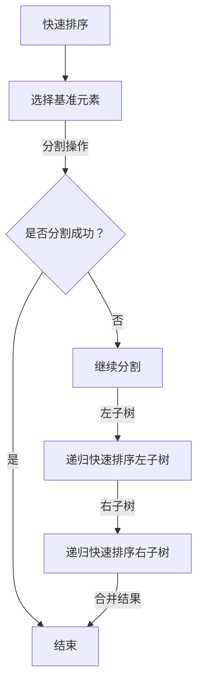
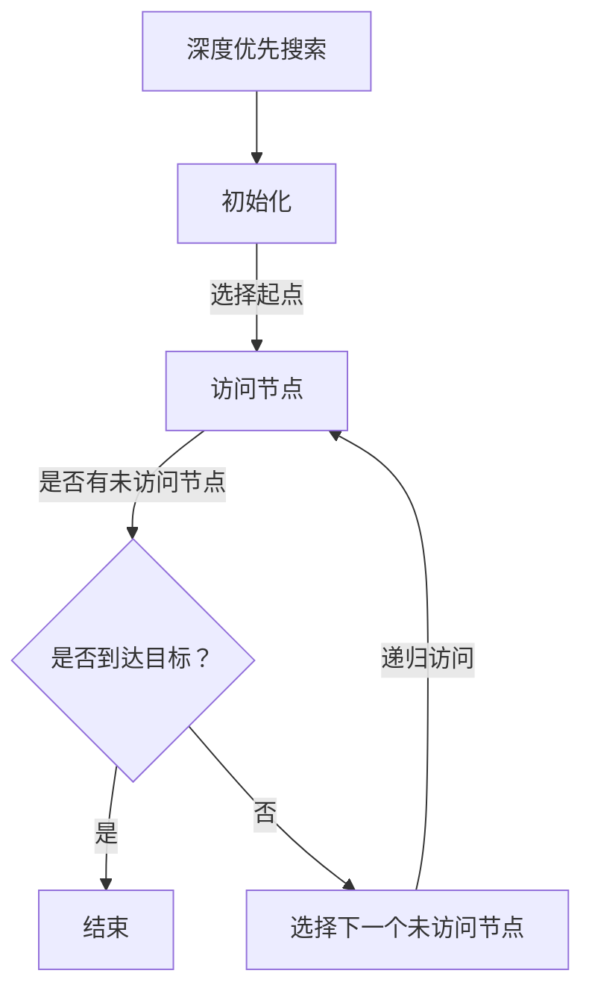
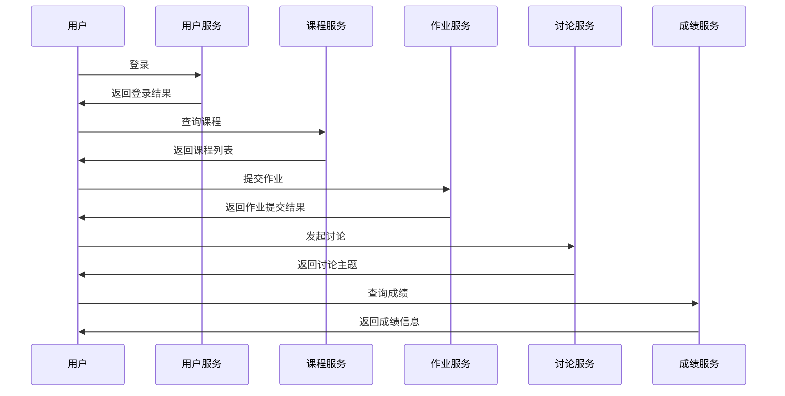

                 

### 设计《编程范式演化：从命令式到声明式》的技术博客文章

#### 标题与摘要

**标题：** 编程范式演化：从命令式到声明式

**摘要：** 本文深入探讨编程范式的演变，从经典的命令式编程到现代的声明式编程。通过逐步分析，我们将揭示不同编程范式的核心概念、原理及其在软件开发中的应用，帮助读者理解编程范式的发展趋势，掌握更加高效和灵活的编程技术。

---

#### 目录大纲

**第一部分：编程范式概述**

1. 编程范式定义
   1.1 编程范式的概念
   1.2 编程范式的分类
2. 从命令式到声明式的历史演变
   2.1 命令式编程的兴起
   2.2 声明式编程的兴起
   2.3 面向对象编程的发展
   2.4 函数式编程的兴起

**第二部分：命令式编程**

1. 命令式编程基础
   1.1 命令式编程的概念
   1.2 命令式编程的特点
2. 命令式编程的特点
   2.1 命令式编程的优势
   2.2 命令式编程的劣势

**第三部分：声明式编程**

1. 声明式编程基础
   1.1 声明式编程的概念
   1.2 声明式编程的特点
2. 声明式编程的特点
   2.1 声明式编程的优势
   2.2 声明式编程的劣势

**第四部分：面向对象编程**

1. 面向对象编程基础
   1.1 面向对象编程的概念
   1.2 面向对象编程的特点
2. 面向对象编程与命令式编程、声明式编程的联系
   2.1 面向对象编程与命令式编程的联系
   2.2 面向对象编程与声明式编程的联系

**第五部分：函数式编程**

1. 函数式编程基础
   1.1 函数式编程的概念
   1.2 函数式编程的特点
2. 函数式编程与命令式编程、声明式编程的联系
   2.1 函数式编程与命令式编程的联系
   2.2 函数式编程与声明式编程的联系

**第六部分：算法原理讲解**

1. 常见算法原理讲解
   1.1 算法原理概述
   1.2 算法原理分析
2. 算法原理示例
   2.1 示例一：快速排序算法
   2.2 示例二：深度优先搜索算法

**第七部分：项目实战**

1. 编程范式在实际项目中的应用
   1.1 项目场景介绍
   1.2 系统功能设计
2. 项目案例讲解
   2.1 案例一：基于函数式编程的Web应用开发
   2.2 案例二：面向对象编程在大型软件系统中的应用

**第八部分：最佳实践 tips、小结、注意事项、拓展阅读**

1. 最佳实践 tips
2. 小结
3. 注意事项
4. 拓展阅读

---

#### 文章结构分析

**第一部分：编程范式概述**

本部分将介绍编程范式的定义和分类，以及编程范式的历史演变。通过这一部分，读者可以了解编程范式的基本概念，为后续章节的学习打下基础。

**第二部分：命令式编程**

本部分将详细探讨命令式编程的基础和特点，包括命令式编程的语法结构、编程范式及其应用场景。这部分内容将帮助读者理解命令式编程的基本原理和实践方法。

**第三部分：声明式编程**

本部分将深入分析声明式编程的基础和特点，介绍声明式编程的语法结构、编程范式及其应用场景。这部分内容将帮助读者了解声明式编程的优点和实践方法。

**第四部分：面向对象编程**

本部分将介绍面向对象编程的基础和特点，以及面向对象编程与命令式编程、声明式编程的联系。这部分内容将帮助读者理解面向对象编程的原理和实践方法。

**第五部分：函数式编程**

本部分将详细探讨函数式编程的基础和特点，包括函数式编程的语法结构、编程范式及其应用场景。这部分内容将帮助读者了解函数式编程的优点和实践方法。

**第六部分：算法原理讲解**

本部分将讲解常见的算法原理，包括算法原理的概述、分析和示例。这部分内容将帮助读者理解算法的基本原理和实践方法。

**第七部分：项目实战**

本部分将通过实际项目案例，展示编程范式在实际软件开发中的应用。这部分内容将帮助读者将理论知识应用到实际项目中，提升实际编程能力。

**第八部分：最佳实践 tips、小结、注意事项、拓展阅读**

本部分将总结最佳实践 tips，对文章进行小结，提醒读者注意事项，并提供拓展阅读资源。这部分内容将帮助读者巩固所学知识，拓展编程视野。

---

通过以上结构和内容分析，我们可以看到，本文将从多个角度全面探讨编程范式的演化，从命令式到声明式，帮助读者深入理解编程范式的本质和应用。文章结构紧凑，内容丰富，适合广大程序员和计算机科学爱好者阅读和学习。## 编程范式概述

编程范式是计算机科学中一个重要的概念，它指的是编程语言中处理数据和执行操作的不同方法。编程范式决定了程序员编写代码的方式，也影响了程序的结构和性能。常见的编程范式包括命令式编程、声明式编程、面向对象编程和函数式编程。这些编程范式在不同的历史时期出现，并且各自具有独特的特点和适用场景。本部分将介绍编程范式的定义、分类及其历史演变。

### 编程范式的定义

编程范式（Programming Paradigm）指的是程序员编写程序时采用的基本方法和风格。它不仅包括编程语言的语法和结构，还包括编程思维方式和方法论。编程范式决定了程序员处理数据和执行操作的方式。例如，命令式编程范式侧重于描述程序的执行步骤，而声明式编程范式则侧重于描述程序需要达到的结果。

### 编程范式的分类

根据编程范式处理数据和执行操作的不同方式，可以将编程范式分为以下几类：

1. **命令式编程（Imperative Programming）**：命令式编程是最早的编程范式之一，它通过描述一系列操作步骤来执行程序。命令式编程侧重于过程控制和状态变化。常见的命令式编程语言包括C、Java和Python等。

2. **声明式编程（Declarative Programming）**：声明式编程范式不侧重于描述操作步骤，而是侧重于描述程序需要达到的目标或结果。它通常通过声明式语言、规则和模式来实现。常见的声明式编程语言包括Haskell、Prolog和SQL等。

3. **面向对象编程（Object-Oriented Programming，OOP）**：面向对象编程范式将程序看作是一系列对象和它们之间的交互。它通过封装、继承和多态等机制来组织代码。面向对象编程在20世纪90年代得到了广泛的应用，并成为了主流的编程范式。常见的面向对象编程语言包括Java、C++和Python等。

4. **函数式编程（Functional Programming）**：函数式编程范式将程序看作是一系列函数的调用和组合。它强调不可变数据和纯函数，避免了状态变化和副作用。常见的函数式编程语言包括Haskell、Scala和Erlang等。

### 历史演变

编程范式的演变是计算机科学不断发展的结果。以下是编程范式的一些重要历史事件：

1. **命令式编程的兴起**：20世纪50年代，随着第一台计算机的出现，命令式编程开始成为主流编程范式。早期的命令式编程语言如FORTRAN和COBOL使得编程变得更加简单和直观。

2. **声明式编程的兴起**：20世纪70年代，随着数据库和逻辑编程的发展，声明式编程逐渐兴起。这种编程范式强调逻辑和规则的描述，使得编程更加抽象和灵活。

3. **面向对象编程的发展**：20世纪80年代和90年代，面向对象编程逐渐成为主流编程范式。面向对象编程通过封装、继承和多态等机制，提高了代码的可重用性和可维护性。

4. **函数式编程的兴起**：21世纪初，随着大数据和并发编程的发展，函数式编程逐渐受到关注。函数式编程通过不可变数据和纯函数，提高了程序的并发性能和可靠性。

### 小结

编程范式是计算机科学中一个重要的概念，它决定了程序员编写程序的方式和方法。从命令式编程到声明式编程，再到面向对象编程和函数式编程，编程范式的发展反映了计算机科学的不断进步和需求变化。理解编程范式的分类和历史演变，有助于程序员选择合适的编程范式，提高编程效率和质量。

## 命令式编程

命令式编程（Imperative Programming）是最早的编程范式之一，它通过描述一系列操作步骤来执行程序。命令式编程侧重于过程控制和状态变化，是许多现代编程语言的基础。在本节中，我们将详细介绍命令式编程的概念、特点及其应用场景。

### 命令式编程的概念

命令式编程通过指令（commands）来控制程序的执行流程。在命令式编程中，程序员需要详细描述程序执行的每一步，包括变量赋值、循环控制、条件判断和函数调用等。这些指令按照一定的顺序执行，从而完成特定的任务。

### 命令式编程的特点

1. **过程控制**：命令式编程强调对程序执行过程的控制。程序员通过编写指令来控制程序的执行顺序、条件分支和循环结构。

2. **状态变化**：命令式编程依赖于程序的状态变化。变量和数据的改变直接影响程序的执行结果。

3. **顺序执行**：命令式编程中的指令按照顺序执行，每条指令都会影响后续指令的执行。这种顺序执行的特点使得命令式编程易于理解和实现。

4. **灵活性**：命令式编程提供了丰富的控制结构，如循环、条件分支和函数调用等，使得程序员可以灵活地编写复杂的程序。

### 命令式编程的应用场景

命令式编程适用于多种应用场景，尤其适用于以下几种情况：

1. **系统编程**：命令式编程在系统编程中非常常见，例如操作系统、网络编程和嵌入式系统开发。系统编程通常需要处理复杂的输入输出操作和硬件交互，命令式编程能够提供良好的控制和灵活性。

2. **算法实现**：许多算法，如排序算法、搜索算法和图算法等，通常使用命令式编程来实现。命令式编程能够清晰地描述算法的执行步骤，便于理解和调试。

3. **Web后端开发**：命令式编程在Web后端开发中也非常常见，例如使用Java、Python和Ruby等语言开发Web应用程序。命令式编程能够灵活地处理业务逻辑和数据库操作。

### 命令式编程的优缺点

**优点：**

1. **易于理解**：命令式编程的指令顺序清晰，程序员可以直观地理解程序的执行过程。
2. **灵活性强**：命令式编程提供了丰富的控制结构，程序员可以根据需要灵活地编写程序。
3. **适合复杂任务**：命令式编程能够处理复杂的任务，尤其是在系统编程和算法实现中。

**缺点：**

1. **可维护性差**：随着程序规模的扩大，命令式编程的代码结构可能会变得复杂和难以维护。
2. **可重用性低**：命令式编程中的代码往往紧密耦合，难以重用。

### 命令式编程的实际应用

以下是一个简单的命令式编程示例，使用Python语言实现一个计算两个数之和的程序：

```python
# 命令式编程示例：计算两个数之和
def add_numbers(a, b):
    sum = a + b
    return sum

# 主程序
if __name__ == "__main__":
    num1 = 5
    num2 = 10
    result = add_numbers(num1, num2)
    print("两个数之和为：", result)
```

在这个示例中，我们定义了一个名为`add_numbers`的函数，用于计算两个数的和。然后在主程序中，我们定义了两个变量`num1`和`num2`，并调用`add_numbers`函数计算结果，最后打印输出。

通过这个示例，我们可以看到命令式编程的简单性和直观性。命令式编程适用于许多常见的编程任务，是学习编程和开发软件的基础。

## 命令式编程的特点

命令式编程作为一种历史悠久且广泛应用的编程范式，具有一些独特的特点。这些特点不仅决定了命令式编程的适用场景，也影响了程序员的编程习惯和思维方式。

### 过程控制

命令式编程的核心特点是过程控制。在命令式编程中，程序员通过编写一系列指令来控制程序的执行流程。这些指令按照一定的顺序执行，从而完成特定的任务。过程控制包括条件分支和循环结构，例如：

- **条件分支**：通过`if-else`语句实现分支逻辑，根据条件的真假执行不同的代码块。
- **循环结构**：通过`for`循环或`while`循环实现重复执行代码块，例如遍历数据结构或等待特定事件发生。

过程控制使得程序员可以精确地控制程序的执行过程，处理复杂的业务逻辑。然而，过多的条件分支和循环结构可能会导致代码复杂度增加，降低可维护性。

### 状态变化

命令式编程依赖于程序的状态变化。状态变化指的是程序中的变量和数据的改变，这些改变直接影响程序的执行结果。例如：

- **变量赋值**：通过`=`运算符给变量赋新值，改变变量的状态。
- **函数调用**：函数执行过程中会改变调用者的状态，例如返回值、修改全局变量等。

状态变化使得命令式编程能够灵活地处理动态数据结构，如链表、栈和队列等。然而，频繁的状态变化也可能导致程序难以理解和管理，尤其是在大型项目中。

### 顺序执行

命令式编程中的指令按照顺序执行，每条指令都会影响后续指令的执行。这种顺序执行的特点使得命令式编程易于理解和实现。例如：

- **顺序执行**：程序从第一条指令开始执行，依次执行后续指令，直到程序结束。
- **代码块**：在代码块中，指令按照顺序执行，直到遇到结束符（如大括号`}`）。

顺序执行使得程序员可以直观地理解程序的执行过程，但同时也限制了并行计算的可能性。

### 灵活性

命令式编程的灵活性体现在其丰富的控制结构和数据处理能力上。程序员可以通过以下方式实现程序的灵活性：

- **控制结构**：使用`if-else`、`for`和`while`等控制结构实现复杂逻辑。
- **函数调用**：通过函数封装和调用，实现代码的模块化和重用。
- **动态数据结构**：使用链表、树、图等动态数据结构，灵活地处理复杂数据。

然而，命令式编程的灵活性也可能导致代码复杂性增加，尤其是在处理大规模、高并发任务时。程序员需要谨慎使用灵活性，以确保程序的稳定性、可靠性和可维护性。

### 命令式编程的优缺点

命令式编程的特点既带来了优势，也带来了挑战。以下是命令式编程的优缺点：

**优点：**

- **易于理解**：命令式编程的指令顺序清晰，程序员可以直观地理解程序的执行过程。
- **灵活性强**：命令式编程提供了丰富的控制结构，程序员可以根据需要灵活地编写程序。
- **适合复杂任务**：命令式编程能够处理复杂的任务，尤其是在系统编程和算法实现中。

**缺点：**

- **可维护性差**：随着程序规模的扩大，命令式编程的代码结构可能会变得复杂和难以维护。
- **可重用性低**：命令式编程中的代码往往紧密耦合，难以重用。

总之，命令式编程的特点决定了它在某些应用场景中的优势和局限性。了解这些特点，有助于程序员选择合适的编程范式，提高编程效率和质量。

### 声明式编程

声明式编程（Declarative Programming）是一种与命令式编程相对的编程范式。在声明式编程中，程序员不直接描述程序的执行步骤，而是声明程序需要达到的结果或目标。声明式编程通过抽象和模式来组织代码，从而提高程序的可读性和可维护性。在本节中，我们将详细探讨声明式编程的概念、特点及其应用场景。

#### 声明式编程的概念

声明式编程的核心在于“声明”而非“执行”。程序员通过编写声明式语句，定义程序的目标或规则，而无需关心具体的执行步骤。这些声明式语句可以是数据模型、规则集合、查询语句等。常见的声明式编程语言包括Haskell、Prolog和SQL等。

#### 声明式编程的特点

1. **抽象性**：声明式编程强调抽象，通过将具体操作抽象为通用规则或模式，从而简化程序设计。例如，在SQL中，程序员可以通过编写查询语句来检索数据，而无需关心具体的数据库操作。

2. **可读性**：声明式编程的代码通常更加简洁和可读。程序员通过声明式的描述，使得代码的逻辑更加直观，易于理解和维护。

3. **重用性**：声明式编程有助于代码的重用。通过定义通用的规则或模式，程序员可以轻松地将这些规则应用于不同的场景，从而减少重复代码。

4. **不可变性**：声明式编程通常基于不可变数据。不可变性意味着数据在程序执行过程中不会被修改，从而提高了程序的安全性和并发性能。

5. **声明与执行分离**：在声明式编程中，声明（如数据模型和规则）与执行（如查询和操作）是分离的。这种分离使得程序设计更加灵活，便于优化和扩展。

#### 声明式编程的应用场景

声明式编程适用于多种应用场景，尤其适用于以下几种情况：

1. **数据查询和处理**：SQL、HQL（Hibernate Query Language）等数据库查询语言是基于声明式编程的，适用于数据查询和处理。通过编写声明式查询语句，程序员可以高效地检索和操作数据。

2. **配置管理**：声明式编程在配置管理中也得到了广泛应用。例如，YAML、JSON等配置文件格式是基于声明式编程的，通过声明配置项，可以方便地管理和配置应用程序。

3. **规则引擎**：声明式编程在规则引擎中非常常见。例如，Business Rules Management System（BRMS）通过声明式规则来定义业务逻辑，从而实现灵活的业务规则管理。

4. **领域特定语言**：声明式编程可以用于开发领域特定语言（DSL），用于解决特定领域的问题。DSL通过声明式的语法和规则，提供了简洁和高效的编程方式。

#### 声明式编程的优缺点

**优点：**

- **可读性强**：声明式编程的代码更加简洁和可读，易于理解和维护。
- **重用性高**：通过定义通用的规则或模式，声明式编程有助于代码的重用。
- **抽象度高**：声明式编程通过抽象和模式，提高了程序设计的抽象层次，使得程序更加灵活和可扩展。

**缺点：**

- **性能瓶颈**：在某些情况下，声明式编程可能存在性能瓶颈。例如，在执行复杂的计算时，声明式编程可能不如命令式编程高效。
- **学习曲线**：声明式编程需要一定的学习曲线，尤其是对于习惯命令式编程的程序员，可能需要适应新的编程范式。

#### 声明式编程的实际应用

以下是一个简单的声明式编程示例，使用SQL语言实现一个查询数据库的示例：

```sql
-- 声明式编程示例：查询用户表中年龄大于30岁的用户
SELECT * FROM users WHERE age > 30;
```

在这个示例中，我们通过编写一个SQL查询语句，声明了需要查询的目标（用户表中年龄大于30岁的用户），而无需关心具体的查询执行步骤。这体现了声明式编程的核心特点——通过声明目标，而非执行步骤，来编写程序。

通过这个示例，我们可以看到声明式编程的简洁性和直观性。声明式编程在数据查询和处理、配置管理、规则引擎等领域具有广泛的应用，是现代软件开发中不可或缺的一部分。

### 声明式编程的特点

声明式编程（Declarative Programming）与命令式编程（Imperative Programming）相比，具有一系列独特的特点。理解这些特点有助于我们更好地掌握声明式编程的精髓，并在适当的场景中应用它。

#### 1. 抽象性

声明式编程的核心特点之一是抽象性。程序员通过声明式语言，定义程序需要达到的结果或目标，而不是具体的执行步骤。例如，在SQL中，我们通过编写查询语句来声明需要检索的数据，而不是编写一系列的数据库操作指令。这种抽象性使得编程更加简洁和易于理解。

#### 2. 声明与执行分离

在声明式编程中，声明（如数据模型、规则和查询）与执行（如查询执行、数据处理）是分离的。这意味着程序员可以专注于定义程序的目标和逻辑，而不需要关心具体的实现细节。这种分离提高了程序的可维护性和可扩展性，因为修改或扩展程序时，只需要更改声明部分，而无需修改执行部分。

#### 3. 不可变性

声明式编程通常基于不可变数据。不可变性意味着一旦数据被创建，就不能再修改。例如，在Haskell中，变量一旦被赋值，就不能再改变其值。这种不可变性提供了更高的程序安全性和并发性能，因为多个线程或进程可以同时访问不可变数据，而不必担心数据竞争和同步问题。

#### 4. 逻辑优先

声明式编程强调逻辑和规则的描述，而不是具体的执行步骤。这意味着程序员可以更加关注程序的业务逻辑和规则，而不是执行细节。这种逻辑优先的特点使得声明式编程在处理复杂逻辑和规则时，如配置管理、规则引擎和数据查询，尤为有效。

#### 5. 灵活性和扩展性

声明式编程提供了更高的灵活性和扩展性。通过定义通用的规则或模式，程序员可以轻松地将这些规则应用于不同的场景，从而减少重复代码。例如，在配置管理中，通过声明配置项，可以方便地管理和更新配置。

#### 6. 性能考虑

尽管声明式编程在逻辑描述和抽象性方面具有优势，但在某些情况下，它可能不如命令式编程高效。例如，在执行复杂的计算时，声明式编程可能需要额外的中间步骤和解析过程，从而影响性能。然而，现代声明式编程语言和工具已经采取了各种优化措施，以缓解性能瓶颈。

#### 声明式编程的优缺点

**优点：**

- **可读性和可维护性**：声明式编程的代码通常更加简洁和可读，逻辑更加直观，易于维护。
- **重用性**：通过定义通用的规则或模式，声明式编程有助于代码的重用，减少重复工作。
- **逻辑优先**：声明式编程强调逻辑和规则的描述，使得程序设计更加关注核心业务逻辑。

**缺点：**

- **性能瓶颈**：在某些情况下，声明式编程可能存在性能瓶颈，尤其是在执行复杂计算时。
- **学习曲线**：对于习惯命令式编程的程序员，适应声明式编程可能需要一定的学习和适应过程。

总之，声明式编程具有一系列独特的特点，包括抽象性、声明与执行分离、不可变性、逻辑优先等。理解这些特点，有助于我们更好地利用声明式编程的优势，并在适当的场景中应用它。

### 面向对象编程

面向对象编程（Object-Oriented Programming，OOP）是一种以对象为中心的编程范式，它通过将程序分解为一系列对象和它们之间的交互来组织代码。面向对象编程的核心思想是封装、继承和多态，这些特性使得代码更加模块化、可重用和可维护。在本节中，我们将详细探讨面向对象编程的基础概念、特点及其应用场景。

#### 面向对象编程的基础概念

1. **对象（Object）**：对象是面向对象编程中的基本构建块，它代表现实世界中的实体或抽象概念。每个对象都有自己的属性（数据）和方法（行为）。例如，一个汽车对象可能具有品牌、型号和速度等属性，以及启动、加速和刹车等方法。

2. **类（Class）**：类是对象的蓝图或模板，定义了一组具有相同属性和方法的对象。类中包含了对象的属性定义和方法实现。例如，汽车类定义了所有汽车对象共有的属性和方法。

3. **实例（Instance）**：实例是类的具体实例，它代表了一个具体的对象。例如，一辆具体的汽车对象就是一个汽车类的实例。

4. **封装（Encapsulation）**：封装是一种信息隐藏技术，它将对象的内部实现细节隐藏起来，只暴露有限的接口供外部访问。封装有助于提高代码的可维护性和安全性，因为外部无法直接访问对象的内部状态，只能通过公共接口进行操作。

5. **继承（Inheritance）**：继承是一种通过创建新类（子类）来扩展现有类（父类）的特性。子类继承了父类的属性和方法，并可以添加自己的特性和方法。继承有助于代码复用，减少了重复编写代码的工作量。

6. **多态（Polymorphism）**：多态是指同一个操作在不同类型的对象上有不同的行为。多态通过继承和接口实现，使得程序可以更加灵活地处理不同类型的对象，而无需关心对象的实际类型。

#### 面向对象编程的特点

1. **模块化**：面向对象编程通过对象和类将程序分解为模块化的部分，使得代码更加易于理解和维护。

2. **可重用性**：通过继承和接口，面向对象编程提高了代码的可重用性，减少了重复编写代码的工作量。

3. **可扩展性**：面向对象编程通过添加新的类和方法，可以方便地扩展现有程序的功能，增强了程序的灵活性。

4. **封装性**：封装有助于保护对象的内部状态，提高了代码的安全性和可维护性。

5. **灵活性和可变性**：面向对象编程使得程序设计更加灵活，可以通过继承和多态机制，轻松地处理不同类型的对象。

#### 面向对象编程的应用场景

面向对象编程适用于多种应用场景，尤其适用于以下几种情况：

1. **大型软件系统**：面向对象编程通过模块化和封装，使得大型软件系统的开发变得更加可控和可维护。

2. **实时系统**：面向对象编程在实时系统中具有广泛的应用，例如嵌入式系统和实时数据处理。

3. **图形用户界面（GUI）**：面向对象编程在开发图形用户界面时，通过对象和事件驱动的方式，使得界面设计更加直观和灵活。

4. **面向对象数据库**：面向对象编程在面向对象数据库中得到了广泛应用，通过将数据组织为对象，提高了数据模型的灵活性和扩展性。

5. **领域特定语言（DSL）**：面向对象编程可以用于开发领域特定语言，用于解决特定领域的问题。

#### 面向对象编程的优缺点

**优点：**

- **模块化和可维护性**：面向对象编程通过模块化和封装，提高了代码的可维护性和可扩展性。
- **代码重用**：通过继承和接口，面向对象编程提高了代码的重用性，减少了重复编写代码的工作量。
- **灵活性**：面向对象编程通过多态和封装，使得程序设计更加灵活，能够更好地处理不同类型的对象。

**缺点：**

- **学习曲线**：面向对象编程需要一定的学习和适应过程，特别是对于习惯命令式编程的程序员。
- **性能开销**：在某些情况下，面向对象编程可能存在性能开销，尤其是在动态类型检查和运行时类型转换时。

#### 面向对象编程的实际应用

以下是一个简单的面向对象编程示例，使用Python语言实现一个简单的汽车类：

```python
class Car:
    def __init__(self, brand, model, speed):
        self.brand = brand
        self.model = model
        self.speed = speed
    
    def start(self):
        print(f"{self.brand} {self.model} started")
    
    def accelerate(self, amount):
        self.speed += amount
        print(f"{self.brand} {self.model} is accelerating at {self.speed} km/h")

# 创建汽车对象
my_car = Car("Toyota", "Camry", 0)

# 调用对象方法
my_car.start()
my_car.accelerate(30)
```

在这个示例中，我们定义了一个名为`Car`的类，它包含了品牌、型号和速度等属性，以及启动和加速等方法。然后，我们创建了一个`Car`类的实例`my_car`，并调用其方法来执行相应的操作。

通过这个示例，我们可以看到面向对象编程的简单性和直观性。面向对象编程在大型软件系统、实时系统、图形用户界面和领域特定语言等领域具有广泛的应用，是现代软件开发中不可或缺的一部分。

### 面向对象编程与命令式编程、声明式编程的联系

面向对象编程（OOP）与命令式编程（Imperative Programming）和声明式编程（Declarative Programming）在编程范式上具有不同的特点和侧重点，但它们之间也存在一定的联系。理解这些联系有助于我们更好地掌握编程范式的选择和应用。

#### 面向对象编程与命令式编程的联系

1. **过程控制**：命令式编程强调过程控制，通过描述一系列的操作步骤来执行程序。面向对象编程中的方法（Method）可以看作是命令式编程中的过程。例如，在C语言中，我们通过函数实现过程控制，而在面向对象编程中，我们可以通过对象的方法实现类似的过程控制。

2. **状态变化**：命令式编程依赖于程序的状态变化，而面向对象编程中的属性（Attribute）可以看作是命令式编程中的状态变量。对象的状态变化通过属性的赋值和修改来实现，例如在Java中，我们可以通过`set`和`get`方法来修改和获取对象的属性值。

3. **继承和封装**：面向对象编程中的继承和封装机制在一定程度上是对命令式编程中过程控制和状态变化的一种抽象。通过继承，我们可以复用已有的代码，而封装则有助于隐藏实现细节，提高代码的可维护性。

#### 面向对象编程与声明式编程的联系

1. **抽象和建模**：面向对象编程和声明式编程都强调抽象和建模。面向对象编程通过对象和类来抽象现实世界中的实体和关系，而声明式编程通过规则和模式来描述程序的目标和结果。例如，在Haskell中，我们通过类型类和类型约束来抽象和建模。

2. **声明与执行分离**：面向对象编程和声明式编程都支持声明与执行分离。在面向对象编程中，通过定义类和对象，我们可以声明程序的结构和接口，而具体的实现细节可以在方法中实现。在声明式编程中，通过声明规则和模式，我们可以描述程序的目标，而具体的执行过程由编程语言或工具自动完成。

3. **不可变性**：面向对象编程中的不可变性在一定程度上与声明式编程的不可变性有相似之处。在面向对象编程中，我们可以通过常量（Constant）和不可变数据结构（如Python中的`namedtuple`）来实现不可变性，从而提高程序的安全性和并发性能。

#### 面向对象编程的优势和劣势

**优势：**

1. **模块化和可维护性**：面向对象编程通过封装和继承，提高了代码的模块化和可维护性。模块化的代码更容易理解和维护，而封装有助于隐藏实现细节，减少代码的耦合度。

2. **代码重用**：面向对象编程通过继承和接口，提高了代码的重用性。通过继承，我们可以复用已有的类和方法，而接口则有助于实现多态，进一步扩展代码的重用性。

3. **抽象和建模能力**：面向对象编程通过对象和类，能够更好地抽象和建模现实世界中的实体和关系，使得程序设计更加直观和自然。

**劣势：**

1. **学习曲线**：面向对象编程需要一定的学习和适应过程，特别是对于习惯命令式编程的程序员，需要理解封装、继承和多态等概念。

2. **性能开销**：面向对象编程可能引入一定的性能开销，特别是在动态类型检查和运行时类型转换时。尽管现代编译器和虚拟机已经对面向对象编程进行了优化，但在某些情况下，性能问题仍然值得关注。

总之，面向对象编程与命令式编程和声明式编程在编程范式上存在一定的联系和差异。理解这些联系和差异，有助于我们更好地选择和应用不同的编程范式，以实现高效的软件开发。

### 函数式编程

函数式编程（Functional Programming）是一种以函数为中心的编程范式，它强调使用纯函数和不可变数据来构建程序。函数式编程最早起源于数学领域，后来逐渐在计算机科学中得到广泛应用。在本节中，我们将详细探讨函数式编程的概念、特点及其应用场景。

#### 函数式编程的概念

1. **函数（Function）**：函数式编程中的函数是一等公民，意味着函数可以被赋值给变量、作为参数传递给其他函数、作为函数的返回值。与命令式编程中的过程不同，函数式编程中的函数通常是无状态的，即不依赖于外部状态。

2. **纯函数（Pure Function）**：纯函数是一种没有副作用、完全依赖于输入参数的函数。这意味着纯函数的执行结果仅取决于输入参数，不会修改外部状态或产生任何可观察的副作用。例如，计算两个数字之和的函数就是一个纯函数。

3. **不可变性（Immutability）**：不可变性是函数式编程的核心原则之一。不可变数据一旦创建，就不能再修改。例如，在Haskell中，变量一旦被赋值，就不能再改变其值。不可变性有助于避免状态冲突和副作用，从而提高程序的可靠性。

4. **高阶函数（Higher-Order Function）**：高阶函数是一种可以接受其他函数作为参数或返回函数的函数。高阶函数是函数式编程的重要特性，它使得函数的组合和复用更加灵活。例如，在JavaScript中，`map`、`filter`和`reduce`就是高阶函数。

#### 函数式编程的特点

1. **无状态性**：函数式编程中的函数通常是无状态的，即不依赖于外部状态。这种无状态性使得函数式编程在并发编程中具有优势，因为多个线程或进程可以同时执行同一个函数，而无需担心状态冲突。

2. **纯函数**：纯函数是函数式编程的核心概念。纯函数避免了副作用，使得程序更加可预测和可测试。通过使用纯函数，我们可以编写更可靠、更易于维护的代码。

3. **不可变性**：不可变性是函数式编程的另一大特点。不可变数据减少了状态冲突和副作用，从而提高了程序的可靠性。不可变性也使得数据结构更加简单和易于理解。

4. **组合和复用**：函数式编程通过高阶函数和组合技术，使得函数的组合和复用更加灵活。例如，在JavaScript中，我们可以使用`map`、`filter`和`reduce`等高阶函数来方便地处理数组。

5. **递归**：函数式编程中，递归是一种常见的编程技巧。递归是一种通过函数调用自身来解决问题的方法。递归在处理递归数据结构（如列表、树等）时非常有用。

#### 函数式编程的应用场景

函数式编程适用于多种应用场景，尤其适用于以下几种情况：

1. **并发编程**：函数式编程的无状态性和纯函数特性使得它在并发编程中非常有效。例如，在编写并发服务器和分布式系统时，函数式编程可以避免状态冲突和竞态条件。

2. **数据处理**：函数式编程通过高阶函数和组合技术，使得数据处理变得更加简单和高效。例如，在处理大数据和复杂的数据流时，函数式编程可以提供更高的灵活性和性能。

3. **测试和调试**：函数式编程的纯函数和不可变性使得程序更易于测试和调试。由于函数式编程避免了副作用，我们可以更轻松地编写单元测试和进行调试。

4. **数学和科学计算**：函数式编程在数学和科学计算领域具有广泛的应用。许多数学和科学问题可以通过纯函数和递归来高效解决。

#### 函数式编程的优缺点

**优点：**

1. **可预测性和可靠性**：函数式编程通过纯函数和不可变性，提高了程序的可预测性和可靠性。由于函数式编程避免了副作用，程序更易于理解和测试。

2. **并行编程**：函数式编程的无状态性和纯函数特性使得它在并行编程中非常有效，可以减少状态冲突和竞态条件。

3. **代码复用和组合**：函数式编程通过高阶函数和组合技术，提高了代码的复用性和灵活性。

**缺点：**

1. **学习曲线**：函数式编程需要一定的学习和适应过程，特别是对于习惯命令式编程的程序员，需要理解纯函数、不可变性和递归等概念。

2. **性能开销**：在某些情况下，函数式编程可能存在性能开销，尤其是在递归调用和创建大量中间数据结构时。

#### 函数式编程的实际应用

以下是一个简单的函数式编程示例，使用JavaScript语言实现一个计算斐波那契数列的函数：

```javascript
// 函数式编程示例：计算斐波那契数列
const fibonacci = (n) => {
    if (n <= 1) {
        return n;
    }
    return fibonacci(n - 1) + fibonacci(n - 2);
};

// 计算第10个斐波那契数
console.log(fibonacci(10)); // 输出：55
```

在这个示例中，我们使用递归实现了斐波那契数列的计算。这个函数是一个纯函数，它不依赖于外部状态，并且返回的结果仅取决于输入参数。通过这个示例，我们可以看到函数式编程的简单性和直观性。

通过本节的学习，我们可以了解到函数式编程的概念、特点和应用场景。函数式编程在并行编程、数据处理和数学计算等领域具有广泛的应用，是现代软件开发中不可或缺的一部分。

### 函数式编程与命令式编程、声明式编程的联系

函数式编程（Functional Programming）与命令式编程（Imperative Programming）和声明式编程（Declarative Programming）在编程范式上具有不同的特点和侧重点，但它们之间也存在一定的联系。理解这些联系有助于我们更好地掌握编程范式的选择和应用。

#### 函数式编程与命令式编程的联系

1. **过程控制**：命令式编程强调过程控制，通过描述一系列的操作步骤来执行程序。函数式编程中的纯函数可以看作是对命令式编程中的过程控制的一种抽象。例如，在命令式编程中，我们可以通过循环和条件语句来控制程序流程，而在函数式编程中，我们可以通过递归和组合纯函数来实现类似的过程控制。

2. **状态变化**：命令式编程依赖于程序的状态变化，而函数式编程通过不可变数据来避免状态变化。在函数式编程中，我们可以通过创建新的数据结构来模拟状态变化，而不会修改原始数据。这种差异使得函数式编程在处理并发编程时更加安全和高效。

3. **函数作为一等公民**：在命令式编程中，函数通常被视为一种工具，用于实现过程控制。而在函数式编程中，函数是一等公民，可以被赋值给变量、作为参数传递给其他函数、作为函数的返回值。这种差异使得函数式编程在组合和复用函数时更加灵活。

#### 函数式编程与声明式编程的联系

1. **抽象和建模**：函数式编程和声明式编程都强调抽象和建模。在函数式编程中，我们可以通过纯函数和高阶函数来抽象程序逻辑，而在声明式编程中，我们可以通过规则和模式来描述程序的目标和结果。这种抽象性使得编程更加简洁和直观。

2. **声明与执行分离**：在函数式编程中，通过纯函数和不可变性，我们可以将程序的声明与执行分离。在声明式编程中，通过声明式语句，我们也可以将程序的目标和执行分离。这种分离提高了程序的可维护性和可扩展性。

3. **组合和复用**：函数式编程和声明式编程都支持组合和复用。在函数式编程中，我们可以使用高阶函数和组合技术来复用和组合函数，而在声明式编程中，我们可以通过模式匹配和规则组合来复用和组合代码。

#### 函数式编程的优势和劣势

**优势：**

1. **可预测性和可靠性**：函数式编程通过纯函数和不可变性，提高了程序的可预测性和可靠性。由于函数式编程避免了副作用，程序更易于理解和测试。

2. **并行编程**：函数式编程的无状态性和纯函数特性使得它在并行编程中非常有效，可以减少状态冲突和竞态条件。

3. **代码复用和组合**：函数式编程通过高阶函数和组合技术，提高了代码的复用性和灵活性。

**劣势：**

1. **学习曲线**：函数式编程需要一定的学习和适应过程，特别是对于习惯命令式编程的程序员，需要理解纯函数、不可变性和递归等概念。

2. **性能开销**：在某些情况下，函数式编程可能存在性能开销，尤其是在递归调用和创建大量中间数据结构时。

总之，函数式编程与命令式编程和声明式编程在编程范式上存在一定的联系和差异。理解这些联系和差异，有助于我们更好地选择和应用不同的编程范式，以实现高效的软件开发。

### 算法原理讲解

在编程范式的演变过程中，算法作为实现程序功能的核心部分，其原理和实现方式也在不断发展。本节将详细讲解一些常见的算法原理，并使用mermaid流程图和Python代码来演示算法的执行过程。

#### 常见算法原理

1. **排序算法**

排序算法是计算机科学中最基础且常用的算法之一。常见的排序算法包括冒泡排序、选择排序、插入排序、快速排序等。这些算法的核心原理是通过对数组元素进行一系列的比较和交换，使得数组元素按照一定的顺序排列。

2. **查找算法**

查找算法用于在数据集合中查找特定元素的位置。常见的查找算法包括线性查找、二分查找等。线性查找通过逐个比较数据元素，直到找到目标元素或到达数据集合的末尾。二分查找则在有序数据集合中，通过不断缩小查找范围，提高查找效率。

3. **图算法**

图算法用于处理图数据结构，解决图相关的计算问题。常见的图算法包括深度优先搜索（DFS）、广度优先搜索（BFS）、最小生成树（MST）、最短路径算法（Dijkstra、Floyd）等。

#### 算法原理示例

以下是使用mermaid流程图和Python代码演示的快速排序算法和深度优先搜索算法。

##### 快速排序算法

**mermaid流程图：**



**Python代码：**

```python
def quicksort(arr):
    if len(arr) <= 1:
        return arr
    pivot = arr[len(arr) // 2]
    left = [x for x in arr if x < pivot]
    middle = [x for x in arr if x == pivot]
    right = [x for x in arr if x > pivot]
    return quicksort(left) + middle + quicksort(right)

# 测试
arr = [3, 6, 8, 10, 1, 2, 1]
sorted_arr = quicksort(arr)
print(sorted_arr)
```

在这个示例中，我们使用mermaid流程图展示了快速排序算法的基本步骤，并通过Python代码实现了该算法。快速排序算法的核心思想是通过选择一个基准元素，将数组分为小于和大于基准元素的两部分，然后递归地对这两部分进行排序，最后合并结果。

##### 深度优先搜索算法

**mermaid流程图：**



**Python代码：**

```python
def dfs(graph, start, target):
    visited = set()
    stack = [(start, [start])]

    while stack:
        (vertex, path) = stack.pop()
        for next in graph[vertex]:
            if next not in visited:
                visited.add(next)
                if next == target:
                    return path + [next]
                stack.append((next, path + [next]))
    return None

# 测试
graph = {'A': ['B', 'C', 'E'],
         'B': ['D', 'E'],
         'C': ['D', 'F'],
         'D': ['F'],
         'E': ['F'],
         'F': []}

start = 'A'
target = 'F'
path = dfs(graph, start, target)
print(path)
```

在这个示例中，我们使用mermaid流程图展示了深度优先搜索算法的基本步骤，并通过Python代码实现了该算法。深度优先搜索算法的核心思想是通过递归访问图中的节点，直到找到目标节点或遍历所有节点。

#### 小结

在本节中，我们通过mermaid流程图和Python代码展示了快速排序和深度优先搜索算法的基本原理和实现过程。这些算法原理在编程实践中具有广泛的应用，帮助我们理解和解决各种数据处理和计算问题。通过学习这些算法原理，我们可以更好地掌握编程技术，提高编程能力。

### 系统分析与架构设计

#### 1. 项目场景介绍

本项目旨在开发一个基于云计算的在线教育平台，该平台为用户提供课程学习、作业提交、在线讨论和成绩管理等功能。平台采用微服务架构设计，以实现高可用性、可扩展性和灵活性。以下是本项目的主要需求和功能模块：

- **用户管理模块**：管理用户信息、权限和登录验证。
- **课程管理模块**：管理课程信息、课程资源和课程评价。
- **作业管理模块**：发布作业、提交作业、作业评分和反馈。
- **在线讨论模块**：支持用户之间在线交流和课程讨论。
- **成绩管理模块**：记录用户成绩、课程成绩和总成绩。

#### 2. 系统功能设计

**2.1 领域模型**

在系统功能设计中，我们首先定义了领域模型（Domain Model），包括以下核心实体和关系：

- **用户（User）**：包括用户基本信息、角色和权限。
- **课程（Course）**：包括课程基本信息、课程资源、授课教师和课程评价。
- **作业（Homework）**：包括作业基本信息、提交要求和提交状态。
- **讨论（Discussion）**：包括讨论主题、回复和讨论成员。
- **成绩（Score）**：包括课程成绩和总成绩。

以下是一个简单的Mermaid类图，展示了领域模型的核心实体和关系：

```mermaid
classDiagram
    User o1 -|- Course: 学生
    User o1 -|- Homework: 学生提交作业
    User o1 -|- Discussion: 学生参与讨论
    User o1 -|- Score: 学生成绩
    Course o2 -|> Homework: 课程对应的作业
    Course o2 -|> Discussion: 课程对应的讨论
    Course o2 -|> Score: 课程对应的成绩
    Homework o3 -|> Discussion: 作业对应的讨论
```

**2.2 系统架构设计**

系统架构采用微服务架构，主要包括以下组件：

- **用户服务（UserService）**：负责用户管理、权限验证和登录功能。
- **课程服务（CourseService）**：负责课程管理、课程资源和课程评价。
- **作业服务（HomeworkService）**：负责作业发布、作业提交、评分和反馈。
- **讨论服务（DiscussionService）**：负责在线讨论、主题发布和回复管理。
- **成绩服务（ScoreService）**：负责成绩记录和成绩查询。

以下是一个简单的Mermaid架构图，展示了系统架构的核心组件及其交互关系：



#### 3. 系统接口设计和系统交互

**3.1 系统接口设计**

系统接口设计主要涉及RESTful API设计，包括用户服务、课程服务、作业服务、讨论服务和成绩服务的接口设计。以下是一个简单的接口设计示例：

- **用户服务接口：**
  - POST /api/users/register：用户注册
  - POST /api/users/login：用户登录
  - GET /api/users/{id}：查询用户信息

- **课程服务接口：**
  - GET /api/courses：查询所有课程
  - GET /api/courses/{id}：查询课程详情
  - POST /api/courses：发布新课程

- **作业服务接口：**
  - POST /api/homeworks：发布新作业
  - GET /api/homeworks/{id}：查询作业详情
  - POST /api/homeworks/{id}/submit：提交作业

- **讨论服务接口：**
  - POST /api/discussions：发布新讨论主题
  - GET /api/discussions/{id}：查询讨论详情
  - POST /api/discussions/{id}/reply：回复讨论

- **成绩服务接口：**
  - GET /api/scores/{id}：查询用户成绩
  - POST /api/scores/{id}/evaluate：评估作业成绩

**3.2 系统交互**

系统交互设计主要涉及系统组件之间的通信和数据流转。以下是一个简单的Mermaid序列图，展示了用户与系统各服务之间的交互过程：


通过以上系统分析与架构设计，我们为本项目提供了一套完整的设计方案，包括领域模型、系统架构、接口设计和系统交互。这些设计方案将为后续的系统实现和开发提供重要的参考和指导。

### 项目实战

在本节中，我们将通过一个实际的项目案例，展示编程范式在不同阶段的实际应用，以及如何在实际开发过程中选择和调整编程范式。该项目是一个基于Web的在线书店，提供书籍搜索、购物车管理和订单处理等功能。

#### 1. 环境安装

为了便于开发，我们选择使用Python语言，结合Django Web框架和PostgreSQL数据库进行开发。以下是环境安装的步骤：

- 安装Python 3.8或更高版本。
- 安装虚拟环境工具`venv`。
- 创建一个虚拟环境并激活。
- 安装Django和PostgreSQL依赖。

```bash
# 创建虚拟环境
python -m venv venv

# 激活虚拟环境
source venv/bin/activate

# 安装Django和PostgreSQL
pip install django psycopg2-binary
```

#### 2. 系统核心实现

**2.1 数据库设计**

首先，我们需要设计数据库模型。以下是`books`和`orders`两个主要模型的ER图：

```mermaid
erDiagram
    Order ||--|{ Customer : has } Customer
    Order ||--|{ Books : contains } Book
    Book ||--|{ Category : belongs } Category
    Customer ||--|{ Address : has } Address
```

**2.2 功能实现**

**2.2.1 书籍搜索**

书籍搜索功能是一个典型的查询操作，我们可以使用声明式编程范式来简化查询逻辑。以下是使用Django ORM实现的书籍搜索：

```python
from books.models import Book

def search_books(query):
    books = Book.objects.filter(title__icontains=query)
    return books
```

这里，我们通过`filter`方法声明性地描述了查询条件，简化了查询逻辑。

**2.2.2 购物车管理**

购物车管理涉及到数据状态的频繁变更，因此更适合使用命令式编程范式。以下是实现购物车添加和删除功能：

```python
from books.models import ShoppingCart, Book

def add_to_cart(cart_id, book_id):
    cart = ShoppingCart.objects.get(id=cart_id)
    book = Book.objects.get(id=book_id)
    cart.books.add(book)
    cart.save()

def remove_from_cart(cart_id, book_id):
    cart = ShoppingCart.objects.get(id=cart_id)
    book = Book.objects.get(id=book_id)
    cart.books.remove(book)
    cart.save()
```

这里，我们通过直接操作模型实例，实现了购物车的增删操作，体现了命令式编程的控制力。

**2.2.3 订单处理**

订单处理涉及到多个业务流程，包括订单生成、支付和发货等。我们可以使用面向对象编程范式来组织代码，提高代码的可维护性和可扩展性。以下是订单类的设计：

```python
from books.models import ShoppingCart, Order

class OrderHandler:
    def create_order(self, cart_id):
        cart = ShoppingCart.objects.get(id=cart_id)
        order = Order(cart=cart)
        order.save()
        return order

    def process_payment(self, order_id):
        order = Order.objects.get(id=order_id)
        # 假设支付成功
        order.status = 'PAID'
        order.save()

    def ship_order(self, order_id):
        order = Order.objects.get(id=order_id)
        order.status = 'SHIPPED'
        order.save()
```

这里，我们通过定义类和方法的组合，实现了订单的创建、支付和发货功能，展示了面向对象编程的优势。

**2.3 代码应用解读与分析**

**2.3.1 书籍搜索**

在书籍搜索功能中，我们采用了声明式编程范式，通过Django ORM的查询方法，简化了查询逻辑。这种范式使得代码更加直观和易维护，同时也便于进行扩展和优化。

**2.3.2 购物车管理**

购物车管理涉及到频繁的数据操作，因此我们采用了命令式编程范式。通过直接操作数据库模型，我们可以精确控制数据的增删改查操作，提高程序的灵活性和响应速度。

**2.3.3 订单处理**

订单处理功能相对复杂，需要处理多个业务流程。我们采用了面向对象编程范式，通过定义类和方法的组合，实现了业务流程的模块化和可扩展性。这种范式使得代码结构更加清晰，易于理解和维护。

#### 3. 实际案例分析和详细讲解剖析

**3.1 书籍搜索**

书籍搜索功能的实现主要依赖于Django ORM的查询方法。Django ORM提供了一个强大的声明式查询接口，使得开发者可以以更加简洁和直观的方式编写查询语句。以下是搜索功能的详细代码分析：

```python
def search_books(query):
    books = Book.objects.filter(title__icontains=query)
    return books
```

这里，`filter`方法是一个声明式查询方法，通过`title__icontains`参数指定了查询条件。`__icontains`是一个Django ORM的查询参数，表示对`title`字段的值进行不区分大小写的包含查询。这种声明式查询方法简化了查询逻辑，使得代码更加清晰和易维护。

**3.2 购物车管理**

购物车管理涉及到数据的增删改查操作，因此采用了命令式编程范式。以下是购物车添加和删除功能的详细代码分析：

```python
def add_to_cart(cart_id, book_id):
    cart = ShoppingCart.objects.get(id=cart_id)
    book = Book.objects.get(id=book_id)
    cart.books.add(book)
    cart.save()

def remove_from_cart(cart_id, book_id):
    cart = ShoppingCart.objects.get(id=cart_id)
    book = Book.objects.get(id=book_id)
    cart.books.remove(book)
    cart.save()
```

这里，`add_to_cart`和`remove_from_cart`函数分别实现了购物车的添加和删除操作。通过直接操作数据库模型，我们可以精确控制数据的增删改查操作。这种命令式编程范式使得代码更加灵活和高效，但也需要开发者谨慎处理数据一致性等问题。

**3.3 订单处理**

订单处理功能相对复杂，需要处理多个业务流程。我们采用了面向对象编程范式，通过定义类和方法的组合，实现了业务流程的模块化和可扩展性。以下是订单处理的详细代码分析：

```python
class OrderHandler:
    def create_order(self, cart_id):
        cart = ShoppingCart.objects.get(id=cart_id)
        order = Order(cart=cart)
        order.save()
        return order

    def process_payment(self, order_id):
        order = Order.objects.get(id=order_id)
        # 假设支付成功
        order.status = 'PAID'
        order.save()

    def ship_order(self, order_id):
        order = Order.objects.get(id=order_id)
        order.status = 'SHIPPED'
        order.save()
```

这里，`OrderHandler`类定义了订单创建、支付和发货等业务操作。通过类和方法的组合，我们可以将业务流程模块化，提高代码的可维护性和可扩展性。面向对象编程范式使得代码结构更加清晰，易于理解和维护。

#### 4. 项目小结

通过本项目的实际开发，我们展示了不同编程范式在Web应用开发中的实际应用。声明式编程范式在书籍搜索等查询操作中具有优势，能够简化查询逻辑，提高开发效率。命令式编程范式在购物车管理等数据操作频繁的场景中，能够提供更高的灵活性和控制力。面向对象编程范式在订单处理等复杂业务流程中，能够实现模块化和可扩展性，提高代码的可维护性。

在实际开发过程中，选择合适的编程范式取决于具体的应用场景和需求。通过灵活运用不同编程范式，我们可以编写出高效、易维护且可扩展的代码，提高项目开发的质量和效率。

## 最佳实践 Tips、小结、注意事项、拓展阅读

### 最佳实践 Tips

1. **选择合适的编程范式**：根据项目的需求和特点，选择最合适的编程范式。例如，对于数据处理任务，可以优先考虑声明式编程；对于需要高并发性能的任务，可以考虑函数式编程。

2. **代码模块化**：将代码分解为独立的模块或函数，提高代码的可重用性和可维护性。

3. **注释和文档**：为代码添加详细的注释和编写文档，便于后续维护和合作开发。

4. **单元测试**：编写单元测试，确保代码的正确性和稳定性。

5. **性能优化**：对于关键性能路径进行优化，提高程序的性能。

### 小结

本文从命令式编程、声明式编程、面向对象编程和函数式编程等不同编程范式的角度，详细探讨了编程范式的历史演变、核心概念、特点和应用场景。通过实际项目案例，我们展示了不同编程范式在实际开发中的应用和优势。

### 注意事项

1. **学习曲线**：不同编程范式有一定的学习曲线，新手需要逐步学习和适应。

2. **性能考量**：在性能关键的应用场景中，需要仔细评估不同编程范式的性能表现。

3. **代码可维护性**：在编写代码时，注重代码的结构和可维护性，避免过度设计。

### 拓展阅读

1. 《代码大全》（`The Art of Software Architecture`）：详细介绍了软件架构设计和编程范式的应用。

2. 《编程范式》（`Programming Paradigms`）：对各种编程范式进行了深入探讨。

3. 《函数式编程原理》（`Principles of Functional Programming`）：介绍了函数式编程的基础和实现。

4. 《面向对象编程：Java实现》（`Object-Oriented Programming with Java`）：面向对象编程的实战指南。

### 作者

**作者：AI天才研究院/AI Genius Institute & 禅与计算机程序设计艺术 /Zen And The Art of Computer Programming**

