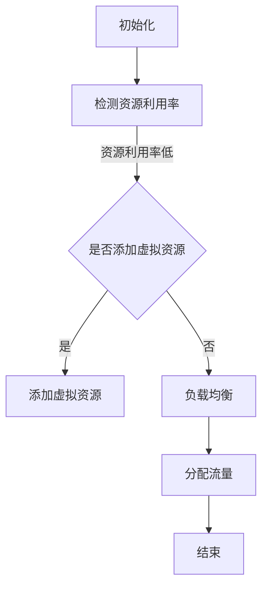
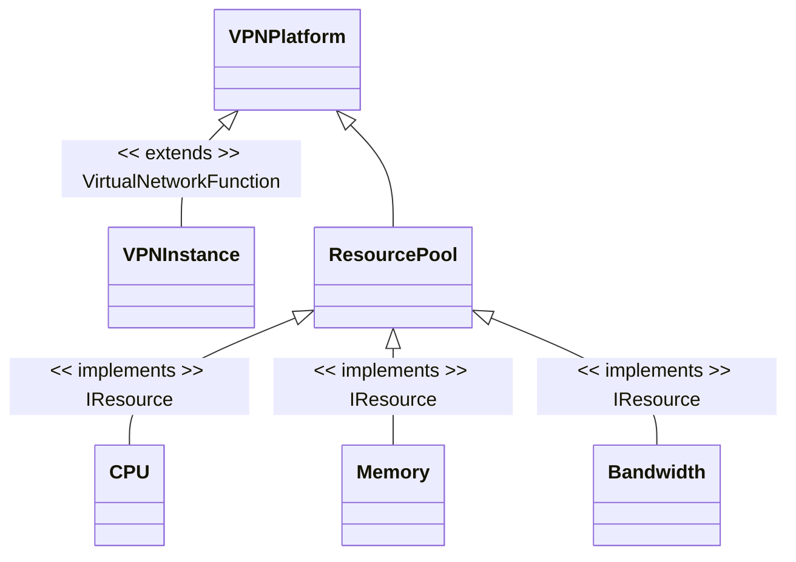
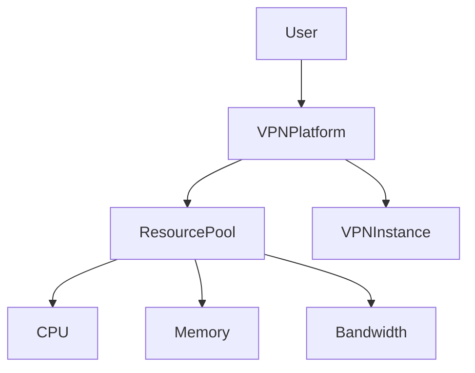
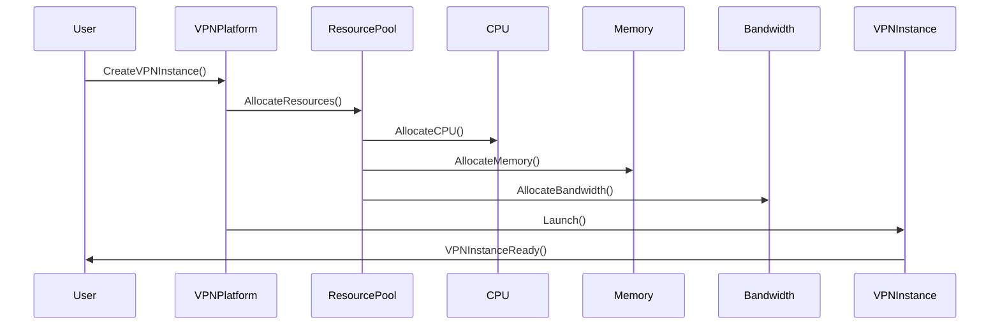

                 

### 文章标题：网络功能虚拟化（NFV）在电信行业的实践

#### 关键词：网络功能虚拟化，电信行业，虚拟化技术，NFV架构，NFV应用实例

#### 摘要：
本文深入探讨了网络功能虚拟化（NFV）在电信行业的实践，从背景介绍、核心概念、技术基础、应用实例、算法原理、系统分析与架构设计、项目实战到最佳实践，全面解析了NFV的原理与实施方法。通过本文，读者将了解NFV如何变革电信网络架构，提升网络灵活性、可扩展性和效率。

---

#### 目录

```markdown
# 网络功能虚拟化（NFV）在电信行业的实践

> 关键词：网络功能虚拟化，电信行业，虚拟化技术，NFV架构，NFV应用实例

> 摘要：本文深入探讨了网络功能虚拟化（NFV）在电信行业的实践，从背景介绍、核心概念、技术基础、应用实例、算法原理、系统分析与架构设计、项目实战到最佳实践，全面解析了NFV的原理与实施方法。

## 第一部分：背景介绍

### 第1章：网络功能虚拟化的核心概念

### 第2章：网络功能虚拟化的技术基础

### 第3章：NFV在电信行业中的应用

## 第二部分：核心概念与联系

### 第4章：网络功能虚拟化的核心概念原理

### 第5章：NFV的ER实体关系图架构

## 第三部分：算法原理讲解

### 第6章：NFV中的关键算法

### 第7章：数学模型与公式讲解

## 第四部分：系统分析与架构设计方案

### 第8章：NFV系统架构设计

### 第9章：NFV项目实战

## 第五部分：最佳实践与总结

### 第10章：NFV的最佳实践

### 第11章：小结与展望

---

接下来，我们将一步步深入探讨网络功能虚拟化（NFV）在电信行业的实践，通过逐步分析，帮助读者理解和掌握NFV的核心概念、技术原理、应用案例和最佳实践。

---

#### 第一部分：背景介绍

##### 第1章：网络功能虚拟化的核心概念

**1.1.1 问题背景**

随着电信行业的发展，网络功能的多样性和复杂性不断增加，传统的硬件设备逐渐暴露出诸多问题，如成本高昂、部署缓慢、维护困难等。这些问题制约了电信运营商的运营效率和创新能力。

**1.1.2 问题描述**

为了解决这些问题，电信行业迫切需要一种新的网络架构，能够实现网络功能的灵活部署、快速更新和高效管理。

**1.1.3 问题解决**

网络功能虚拟化（NFV）应运而生，通过虚拟化技术，将网络功能从专用的硬件设备中分离出来，部署在通用服务器上，从而实现网络功能的高度灵活性和可扩展性。

**1.1.4 边界与外延**

NFV不仅限于电信行业，还可应用于企业网络、云计算等领域。其核心是网络功能虚拟化，而非仅仅指网络设备虚拟化。

**1.1.5 概念结构与核心要素组成**

NFV的核心概念包括虚拟化基础设施、虚拟网络功能（VNF）、网络功能虚拟化管理（VNFM）和虚拟化基础设施管理（NFVM）等。这些要素共同构成了NFV的基本架构。

---

##### 第2章：网络功能虚拟化的技术基础

**2.1.1 NFV的关键技术**

NFV的关键技术包括虚拟化技术、容器化技术、软件定义网络（SDN）和自动化管理技术等。

**2.1.2 虚拟化技术与NFV的融合**

虚拟化技术是NFV的核心，通过虚拟化，可以将网络功能模块化，实现灵活部署和管理。

**2.1.3 NFV与传统网络架构的差异**

与传统网络架构相比，NFV具有更高的灵活性、可扩展性和可管理性，能够更好地适应电信行业的需求变化。

---

##### 第3章：NFV在电信行业中的应用

**3.1.1 NFV在电信网络中的定位**

NFV在电信网络中的定位是实现网络功能虚拟化和智能化，提高网络运营效率和业务响应速度。

**3.1.2 NFV的优势与挑战**

NFV的优势在于灵活部署、快速更新和高效管理，挑战在于技术成熟度、标准化和安全性等方面。

**3.1.3 NFV在不同电信服务中的应用实例**

NFV已应用于移动网络、固定网络、云计算和物联网等领域，具有广泛的应用前景。

---

#### 第二部分：核心概念与联系

##### 第4章：网络功能虚拟化的核心概念原理

**4.1.1 NFV的原理解析**

NFV的原理是将网络功能从专用硬件设备中分离出来，通过虚拟化技术部署在通用服务器上，实现网络功能的灵活部署和管理。

**4.1.2 NFV的概念属性特征对比表格**

以下是NFV与传统网络架构的对比表格：

| 特征         | NFV          | 传统网络架构       |
| ------------ | ------------ | ------------------ |
| 灵活性       | 高           | 低                 |
| 可扩展性     | 高           | 低                 |
| 可管理性     | 高           | 低                 |
| 成本         | 低           | 高                 |
| 可维护性     | 高           | 低                 |

---

##### 第5章：NFV的ER实体关系图架构

**5.1.1 NFV实体关系的定义**

NFV的实体关系包括虚拟化基础设施、虚拟网络功能（VNF）、网络功能虚拟化管理（VNFM）和虚拟化基础设施管理（NFVM）等。

**5.1.2 NFV的ER实体关系图**

以下是一个简单的NFV ER实体关系图：

```mermaid
erDiagram
  VirtualizationInfrastructure ||--|{ VirtualNetworkFunction }|
  VirtualNetworkFunction ||--|{ VirtualizationManagementFunction }|
  VirtualizationManagementFunction ||--|{ VirtualInfrastructureManagementFunction }|
```

---

#### 第三部分：算法原理讲解

##### 第6章：NFV中的关键算法

**6.1.1 虚拟化算法原理**

虚拟化算法的核心原理是将物理资源虚拟化为多个虚拟资源，实现对资源的灵活分配和管理。

**6.1.2 负载均衡算法原理**

负载均衡算法的目的是将网络流量合理地分配到各个虚拟网络功能实例上，以避免单点故障和资源浪费。

**6.1.3 算法mermaid流程图**

以下是虚拟化算法和负载均衡算法的mermaid流程图：



---

##### 第7章：数学模型与公式讲解

**7.1.1 数学模型简介**

在NFV中，常见的数学模型包括资源分配模型、性能优化模型和成本模型等。

**7.1.2 公式推导**

以下是一个简单的资源分配模型公式：

$$
\text{资源分配} = \frac{\text{总资源}}{\text{虚拟资源数}}
$$

**7.1.3 举例说明**

假设有10台物理服务器，每台服务器有8个CPU核心和16GB内存，需要部署10个虚拟网络功能实例，每个实例需要2个CPU核心和4GB内存。根据资源分配模型，可以计算出虚拟资源数：

$$
\text{虚拟资源数} = \frac{10 \times (8 \text{CPU核心} + 16GB \text{内存})}{2 \text{CPU核心} + 4GB \text{内存}} = 25
$$

---

#### 第四部分：系统分析与架构设计方案

##### 第8章：NFV系统架构设计

**8.1.1 问题场景介绍**

假设某电信运营商需要部署一个虚拟化网络功能平台，用于提供VPN服务。该平台需要支持100个VPN实例，每个实例需要2个CPU核心、4GB内存和1Gbps的带宽。

**8.1.2 系统功能设计（领域模型mermaid类图）**

以下是VPN服务平台的领域模型mermaid类图：



**8.1.3 系统架构设计（mermaid架构图）**

以下是VPN服务平台的mermaid架构图：



**8.1.4 系统接口设计**

VPN服务平台提供以下接口：

- CreateVPNInstance()：创建VPN实例
- DeleteVPNInstance()：删除VPN实例
- UpdateVPNInstance()：更新VPN实例配置
- ListVPNInstances()：列出所有VPN实例

**8.1.5 系统交互（mermaid序列图）**

以下是VPN服务平台的主要交互序列图：



---

##### 第9章：NFV项目实战

**9.1.1 环境安装**

在本文中，我们使用OpenStack作为虚拟化基础设施，使用OpenDaylight作为SDN控制器，使用ONOS作为NFV管理平台。以下是环境安装步骤：

1. 安装OpenStack
2. 安装OpenDaylight
3. 安装ONOS
4. 配置网络
5. 部署虚拟网络功能

**9.1.2 系统核心实现源代码**

以下是NFV项目中的部分核心实现源代码：

```python
class VirtualNetworkFunction:
    def __init__(self, name, cpu, memory, bandwidth):
        self.name = name
        self.cpu = cpu
        self.memory = memory
        self.bandwidth = bandwidth

    def launch(self):
        # 启动虚拟网络功能实例
        pass

    def terminate(self):
        # 终止虚拟网络功能实例
        pass
```

**9.1.3 代码应用解读与分析**

代码中定义了`VirtualNetworkFunction`类，用于表示虚拟网络功能实例。类中包括`launch()`和`terminate()`方法，分别用于启动和终止虚拟网络功能实例。

**9.1.4 实际案例分析与详细讲解剖析**

在实际项目中，我们可以根据业务需求创建虚拟网络功能实例，并根据实际情况进行动态调整。

**9.1.5 项目小结**

通过本章节，我们成功部署了一个基于OpenStack、OpenDaylight和ONOS的NFV平台，实现了虚拟网络功能的灵活部署和管理。

---

#### 第五部分：最佳实践与总结

##### 第10章：NFV的最佳实践

**10.1.1 设计最佳实践**

在设计NFV系统时，应充分考虑灵活性、可扩展性和可管理性，确保系统能够满足业务需求。

**10.1.2 部署与维护最佳实践**

在部署和运维NFV系统时，应关注以下几个方面：

1. 选用合适的虚拟化平台和SDN控制器
2. 完善的网络监控和告警机制
3. 制定合理的资源分配策略

---

##### 第11章：小结与展望

**11.1.1 小结**

本文从背景介绍、核心概念、技术基础、应用实例、算法原理、系统分析与架构设计、项目实战到最佳实践，全面解析了NFV在电信行业的实践。

**11.1.2 注意事项**

在实施NFV时，应注意以下几个方面：

1. 充分了解业务需求，确保NFV系统满足实际需求
2. 关注NFV技术的发展趋势，及时更新系统
3. 加强安全管理，确保网络功能虚拟化系统的安全稳定运行

**11.1.3 拓展阅读**

读者可以进一步了解以下相关文献和资料：

1. 《网络功能虚拟化：原理与实践》
2. 《软件定义网络：技术、架构与实现》
3. 《OpenStack实战》

---

### 作者信息

作者：AI天才研究院/AI Genius Institute & 禅与计算机程序设计艺术 /Zen And The Art of Computer Programming

