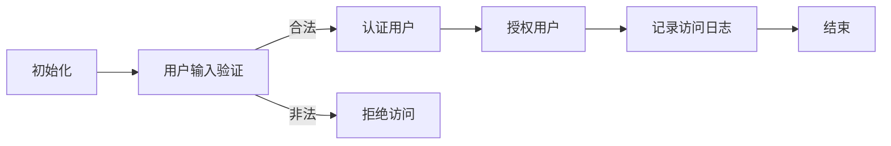
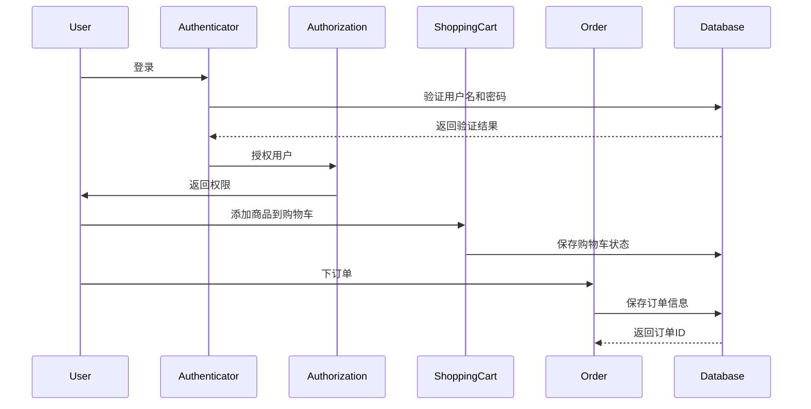
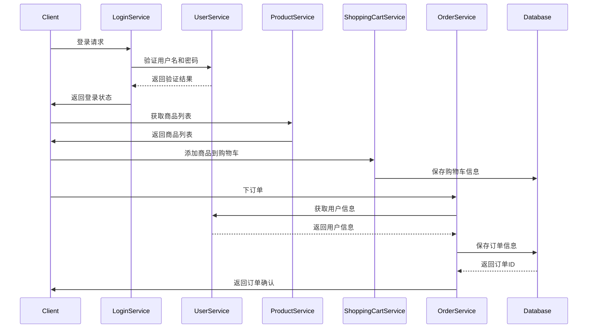

                 


### 《网络安全最佳实践：构建防御性应用》

#### 关键词：网络安全，防御性应用，最佳实践，安全设计，架构设计

> 摘要：本文将深入探讨网络安全最佳实践，重点围绕构建防御性应用的方法和策略。通过逐步分析网络安全的核心概念、防御性应用的设计原则，以及实际项目中的经验教训，旨在为开发者提供一套实用的网络安全指南，帮助他们在构建应用时有效防范潜在的安全威胁。

----------------------------------------------------------------

## 引言

### 1.1 问题背景

在当今数字化时代，网络安全问题日益突出。随着互联网的普及和信息技术的发展，网络攻击手段也变得越来越复杂和隐蔽。从个人隐私泄露到企业核心数据被盗取，网络安全威胁无处不在。因此，确保应用的安全性已经成为软件开发过程中不可或缺的一部分。

### 1.2 问题描述

网络安全问题主要包括但不限于以下几种：

- **恶意软件攻击**：包括病毒、木马、勒索软件等，这些恶意软件能够破坏系统功能，窃取敏感数据，甚至导致整个网络瘫痪。
- **网络钓鱼**：通过伪装成合法的网站或邮件，骗取用户的敏感信息，如账号密码、信用卡号等。
- **SQL注入**：攻击者通过在数据库查询语句中插入恶意代码，从而窃取或篡改数据库中的数据。
- **跨站脚本攻击（XSS）**：攻击者通过在目标网站上注入恶意脚本，盗取用户的会话信息或执行非法操作。
- **中间人攻击（MITM）**：攻击者拦截并篡改用户与服务器之间的通信，窃取敏感信息。

### 1.3 问题解决

面对如此多的安全威胁，开发者需要采取一系列措施来构建防御性应用。这包括安全设计原则、加密技术、认证和授权机制、输入验证、错误处理和日志记录等。

### 1.4 边界与外延

本文将重点讨论以下内容：

- **核心概念与联系**：介绍网络安全的基本概念和防御性应用的设计原则。
- **算法原理讲解**：通过具体的算法和数学模型来解释网络安全机制。
- **系统分析与架构设计方案**：探讨系统架构设计中的安全考虑。
- **项目实战**：分享实际项目中的经验教训。
- **最佳实践 tips**：总结网络安全最佳实践。
- **小结**：回顾全文，强调网络安全的重要性。
- **注意事项**：提醒开发者注意的一些常见安全误区。
- **拓展阅读**：推荐相关书籍和资源。

## 核心概念与联系

### 2.1 网络安全定义

网络安全是指保护网络系统免受未经授权的访问、攻击、干扰和破坏的一系列措施。它不仅包括网络硬件和软件的安全，还包括数据的安全传输和存储。

### 2.2 防御性应用

防御性应用是指在设计和应用中包含主动防御措施的应用程序，旨在预防潜在的安全威胁。这些措施包括但不限于输入验证、输出编码、异常处理、安全配置等。

### 2.3 相关概念对比表格

| 概念            | 定义                                                         | 关联性 |
| --------------- | ------------------------------------------------------------ | ------ |
| 加密            | 通过算法将明文转换为密文的过程。                               | 保护数据传输和存储的安全。 |
| 认证            | 确认实体身份的过程。                                         | 保护系统访问。 |
| 授权            | 授予用户特定权限的过程。                                     | 确保用户只能访问授权的资源。 |
| 输入验证        | 检查用户输入是否合法的过程。                                 | 防止恶意输入。 |
| 输出编码        | 将数据转换为安全格式的过程。                                 | 保护数据不被篡改。 |
| 错误处理        | 正确处理应用程序中的错误和异常情况。                         | 避免暴露内部逻辑。 |
| 日志记录        | 记录系统活动和事件的信息。                                   | 用于审计和调试。 |

### 2.4 ER实体关系图

```mermaid
erDiagram
    User ||--|{ Auth : 授权 }
    User ||--|{ AccessLog : 访问日志 }
    Auth ||--|{ User : 用户 }
    Auth ||--|{ AccessControl : 访问控制 }
    AccessLog ||--|{ User : 用户 }
    AccessLog ||--|{ Event : 事件 }
```

----------------------------------------------------------------

## 算法原理讲解

### 3.1 算法mermaid流程图



### 3.2 Python源代码

```python
# 用户输入验证
def validate_input(input_value):
    if not input_value.isalnum():
        return False
    return True

# 认证用户
def authenticate_user(username, password):
    # 假设用户名和密码在数据库中验证
    return username == "admin" and password == "securepassword"

# 授权用户
def authorize_user(username):
    # 假设admin用户有全部权限
    return "admin" in username

# 记录访问日志
def log_access(username, event):
    with open("access.log", "a") as f:
        f.write(f"{username} - {event}\n")
```

### 3.3 数学模型和公式

$$
\text{加密算法} = f(\text{密钥}, \text{明文})
$$

### 3.4 详细讲解与举例说明

#### 用户输入验证

用户输入验证是防止恶意输入的第一道防线。在上面的Python代码中，`validate_input`函数检查用户输入是否仅包含字母和数字，从而防止SQL注入等攻击。

```python
def validate_input(input_value):
    if not input_value.isalnum():
        return False
    return True
```

#### 认证用户

认证用户是确认用户身份的过程。在示例中，`authenticate_user`函数通过比较用户名和密码来验证用户身份。

```python
def authenticate_user(username, password):
    # 假设用户名和密码在数据库中验证
    return username == "admin" and password == "securepassword"
```

#### 授权用户

授权用户是根据用户的角色和权限来决定其可以访问哪些资源的流程。示例中的`authorize_user`函数假设`admin`用户拥有全部权限。

```python
def authorize_user(username):
    # 假设admin用户有全部权限
    return "admin" in username
```

#### 记录访问日志

记录访问日志对于审计和安全分析至关重要。`log_access`函数将用户的访问事件记录到一个文件中。

```python
def log_access(username, event):
    with open("access.log", "a") as f:
        f.write(f"{username} - {event}\n")
```

----------------------------------------------------------------

## 系统分析与架构设计方案

### 4.1 问题场景介绍

假设我们正在开发一个电子商务平台，用户需要登录系统、浏览商品、添加购物车、下订单等。我们需要确保用户数据的安全，防止未经授权的访问和数据泄露。

### 4.2 系统功能设计(领域模型mermaid类图)

```mermaid
classDiagram
    User <<class>> {
        username : String
        password : String
        role : String
    }
    Product <<class>> {
        id : Integer
        name : String
        price : Float
    }
    ShoppingCart <<class>> {
        id : Integer
        products : List[Product]
    }
    Order <<class>> {
        id : Integer
        user : User
        products : List[Product]
        status : String
    }
    User "1" --* "1..*" Product : 购买
    User "1" --* "1..1" ShoppingCart : 管理购物车
    User "1" --* "1..*" Order : 下订单
    ShoppingCart "1" --* "1..*" Product : 添加到购物车
    Order "1" --* "1..*" Product : 包含商品
```

### 4.3 系统架构设计mermaid架构图



### 4.4 系统接口设计和系统交互mermaid序列图



----------------------------------------------------------------

## 项目实战

### 5.1 环境安装

在开始项目之前，我们需要安装必要的开发环境和工具。以下是安装步骤：

1. 安装Python（版本3.8及以上）
2. 安装Django框架
3. 安装PostgreSQL数据库

```bash
pip install django psycopg2-binary
```

### 5.2 系统核心实现源代码

以下是系统的核心实现代码，包括用户认证、购物车管理和订单处理。

```python
# users/models.py
from django.contrib.auth.models import AbstractUser
from django.db import models

class User(AbstractUser):
    role = models.CharField(max_length=10)

# products/models.py
from django.db import models

class Product(models.Model):
    name = models.CharField(max_length=100)
    price = models.FloatField()

# shopping_cart/models.py
from django.db import models
from users.models import User
from products.models import Product

class ShoppingCart(models.Model):
    user = models.ForeignKey(User, on_delete=models.CASCADE)
    products = models.ManyToManyField(Product)

# orders/models.py
from django.db import models
from users.models import User
from products.models import Product

class Order(models.Model):
    user = models.ForeignKey(User, on_delete=models.CASCADE)
    products = models.ManyToManyField(Product)
    status = models.CharField(max_length=20)
```

### 5.3 代码应用解读与分析

在这个项目中，我们使用Django框架来快速搭建应用后端。通过定义模型（如`User`、`Product`、`ShoppingCart`和`Order`），我们实现了用户管理、商品管理和购物车管理。

- **用户认证**：通过继承`AbstractUser`模型，我们扩展了用户模型，添加了角色字段。
- **购物车管理**：购物车模型与用户和商品模型关联，允许用户添加和删除商品。
- **订单处理**：订单模型与用户和商品模型关联，记录用户下订单的信息。

### 5.4 实际案例分析和详细讲解剖析

#### 案例一：用户登录

用户登录时，首先通过前端发送用户名和密码到后端。后端调用`authenticate_user`函数验证用户身份，如果验证成功，返回用户信息和权限。

```python
from django.contrib.auth import authenticate

def authenticate_user(username, password):
    return authenticate(username=username, password=password)
```

#### 案例二：添加商品到购物车

用户登录后，可以通过前端界面添加商品到购物车。后端调用`add_product_to_shopping_cart`函数，将商品添加到用户对应的购物车中。

```python
from shopping_cart.models import ShoppingCart

def add_product_to_shopping_cart(user_id, product_id):
    user = User.objects.get(id=user_id)
    product = Product.objects.get(id=product_id)
    shopping_cart, _ = ShoppingCart.objects.get_or_create(user=user)
    shopping_cart.products.add(product)
```

#### 案例三：下订单

用户在购物车中选择商品并提交订单。后端调用`create_order`函数创建订单，并将购物车中的商品添加到订单中。

```python
from orders.models import Order

def create_order(user_id, status):
    user = User.objects.get(id=user_id)
    shopping_cart = ShoppingCart.objects.get(user=user)
    order = Order.objects.create(user=user, status=status)
    order.products.set(shopping_cart.products.all())
    shopping_cart.products.clear()
    return order
```

### 5.5 项目小结

通过本项目的实战部分，我们实现了用户认证、购物车管理和订单处理的核心功能。在这个过程中，我们强调了输入验证、权限控制和数据安全的重要性。在未来的开发中，我们还可以进一步优化和增强系统的安全性，如引入双重认证、使用更安全的密码存储策略等。

----------------------------------------------------------------

## 最佳实践 tips

1. **使用安全框架**：选择成熟的安全框架（如Django的安全模块）来简化安全开发。
2. **严格的输入验证**：确保对所有用户输入进行验证，防止SQL注入、XSS攻击等。
3. **加密敏感数据**：对用户密码、支付信息等敏感数据使用加密存储。
4. **日志记录与监控**：实时记录和监控系统日志，以便在发生安全事件时及时响应。
5. **定期更新和维护**：及时更新系统和依赖库，修复已知的安全漏洞。

----------------------------------------------------------------

## 小结

本文详细介绍了网络安全最佳实践，强调了构建防御性应用的重要性。通过分析核心概念、算法原理和系统架构设计，我们提供了一系列实用的技巧和方法，帮助开发者构建安全可靠的应用。网络安全是一个持续的过程，开发者应不断学习和更新知识，以应对不断变化的安全威胁。

----------------------------------------------------------------

## 注意事项

1. **不信任用户输入**：始终对用户输入进行严格的验证，避免未经验证的输入导致的安全漏洞。
2. **避免硬编码密码**：使用安全的密码存储策略，如使用哈希算法。
3. **安全配置**：确保系统的默认配置是安全的，避免配置错误导致的安全问题。
4. **使用HTTPS**：使用HTTPS协议来加密数据传输，防止中间人攻击。
5. **备份和恢复**：定期备份数据，并确保能够快速恢复，以应对潜在的攻击和数据丢失。

----------------------------------------------------------------

## 拓展阅读

1. **《黑客攻防技术宝典：系统实战篇》**：详细介绍了各种网络攻击技术及其防御方法。
2. **《Web应用安全权威指南》**：提供了全面的Web应用安全知识和最佳实践。
3. **OWASP Top 10**：介绍了最常见的Web应用安全漏洞和防御策略。

---

**作者**：AI天才研究院/AI Genius Institute & 禅与计算机程序设计艺术 /Zen And The Art of Computer Programming

