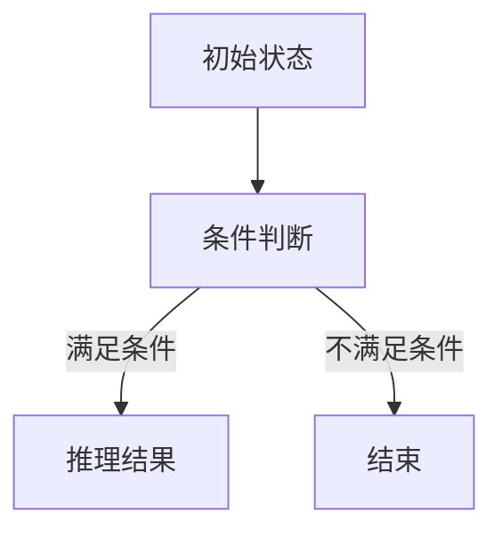
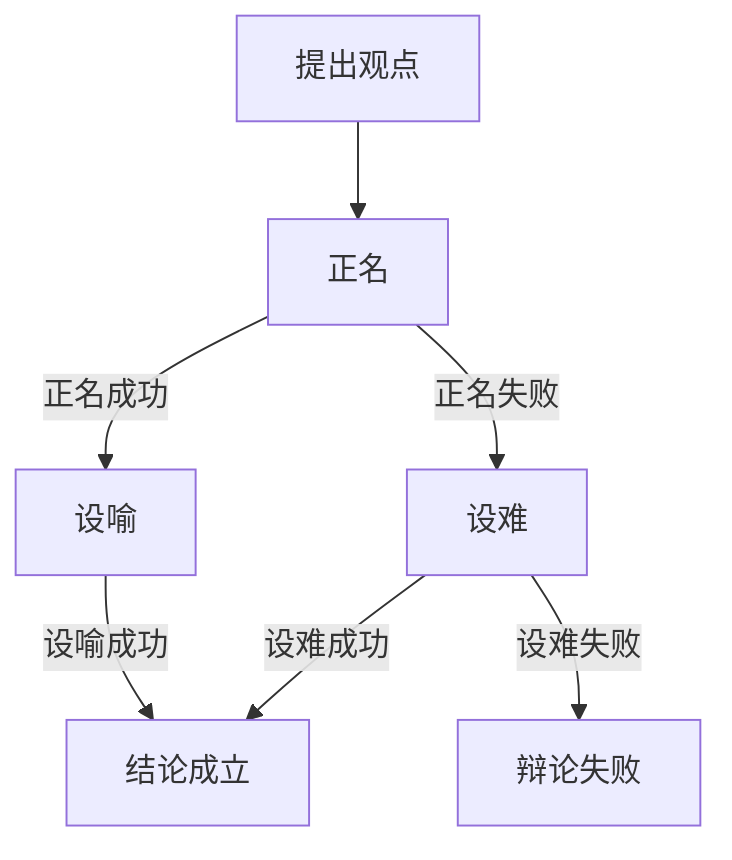
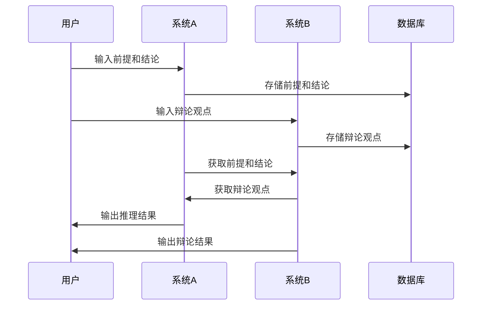

                 

# 罗伯特·布兰多姆与公孙龙子：推理空间与名辩之学

> 关键词：逻辑推理、名辩思想、算法原理、数学模型、系统架构设计

> 摘要：本文通过比较现代逻辑学家罗伯特·布兰多姆和中国古代逻辑学家公孙龙子的思想，深入探讨逻辑推理和辩论技巧在不同文化背景下的共通性和差异性，并从算法原理、数学模型以及系统架构设计等多个角度，解析了推理空间与名辩之学的核心概念和实践方法。

## 步骤一：背景介绍

《罗伯特·布兰多姆与公孙龙子：推理空间与名辩之学》这本书的核心理念在于通过对比分析两位思想家的哲学思想，揭示逻辑推理和辩论技巧在不同文化背景下的共通性和差异性。罗伯特·布兰多姆是一位现代逻辑学家，他的研究主要集中在推理和逻辑结构上；而公孙龙子则是中国古代的逻辑学家和辩论家，他的名辩思想对后世有着深远的影响。

### 罗伯特·布兰多姆

罗伯特·布兰多姆是20世纪著名的逻辑学家，他的主要贡献在于推理结构理论（RST），这一理论为逻辑推理提供了一个系统的框架。布兰多姆认为，逻辑推理不仅仅是命题之间的联结，更是一种结构化的过程，其中包含了一系列的逻辑关系和推理步骤。

### 公孙龙子

公孙龙子是中国古代著名的逻辑学家和辩论家，他的名辩思想主要涉及逻辑、修辞和辩论技巧。公孙龙子的名辩思想强调概念和语言的重要性，他认为通过精确的概念定义和巧妙的辩论技巧，可以揭示事物之间的本质联系。

## 步骤二：核心概念与联系

### 罗伯特·布兰多姆的核心概念

#### 推理结构理论（RST）

推理结构理论是一种用于描述逻辑推理过程的框架，它将逻辑推理看作是一种结构化的过程，包括前提、结论和中间推理步骤。RST强调逻辑推理中的各个组成部分之间的内在联系和结构关系。

#### 逻辑关系分类

逻辑关系分类是对逻辑推理中各种关系进行分类，如蕴含、等价、反对等。这种分类有助于我们理解和分析复杂的逻辑推理过程，使我们能够更准确地判断推理的正确性。

#### 逻辑谬误分析

逻辑谬误分析是对常见的逻辑错误进行分类和分析，如偷换概念、以偏概全等。通过识别和避免这些逻辑谬误，我们可以提高逻辑推理的质量和可信度。

### 公孙龙子的核心概念

#### 名辩思想

公孙龙子的名辩思想主要涉及逻辑、修辞和辩论技巧。他认为，通过精确的概念定义和巧妙的辩论技巧，可以揭示事物之间的本质联系，从而在辩论中取得胜利。

#### 辩论技巧

公孙龙子提出了一系列辩论技巧，如正名、设喻、设难等。这些技巧不仅可以帮助我们在辩论中取得优势，也可以提高我们理解复杂问题能力。

#### 名实之辩

名实之辩是公孙龙子的核心思想之一，他关于名（概念）与实（事物）之间关系的讨论，强调了概念的重要性。他认为，只有准确理解概念，才能准确地理解和判断事物。

## 步骤三：算法原理讲解

### 推理算法

推理算法是一种基于逻辑规则进行推理的算法。我们可以通过mermaid流程图来展示推理算法的基本原理：



推理算法的数学模型可以表示为：

$$
P \rightarrow Q
$$

其中，$P$ 为前提，$Q$ 为结论。推理过程就是根据前提 $P$ 推导出结论 $Q$ 的过程。

### 名辩算法

名辩算法是一种通过正名、设喻、设难等技巧进行辩论的算法。我们可以通过mermaid流程图来展示名辩算法的基本原理：



名辩算法的数学模型可以表示为：

$$
A \leftrightarrow B
$$

其中，$A$ 和 $B$ 分别为两个观点。名辩过程就是通过正名、设喻、设难等技巧来验证两个观点是否一致的过程。

## 步骤四：数学模型和数学公式 & 详细讲解 & 举例说明

### 推理模型

#### 逻辑运算

逻辑运算包括与、或、非等基本运算，其数学模型如下：

$$
P \land Q = \begin{cases}
1, & \text{如果 } P \text{ 和 } Q \text{ 都为真} \\
0, & \text{其他情况}
\end{cases}
$$

$$
P \lor Q = \begin{cases}
1, & \text{如果 } P \text{ 或 } Q \text{ 为真} \\
0, & \text{其他情况}
\end{cases}
$$

$$
\neg P = \begin{cases}
0, & \text{如果 } P \text{ 为真} \\
1, & \text{其他情况}
\end{cases}
$$

#### 推理规则

推理规则是逻辑推理中的基本规则，其数学模型如下：

$$
(P \rightarrow Q) \land (Q \rightarrow R) \rightarrow (P \rightarrow R)
$$

**示例：**

假设前提为：

1. 如果天气好，那么人们会外出。
2. 如果人们外出，那么街道会繁忙。

我们需要推理出结论：如果天气好，那么街道会繁忙。

根据推理规则，我们可以将上述前提转化为：

$$
(P \rightarrow Q) \land (Q \rightarrow R) \rightarrow (P \rightarrow R)
$$

其中，$P$ 表示天气好，$Q$ 表示人们外出，$R$ 表示街道繁忙。代入前提，我们得到：

$$
(天气好 \rightarrow 人们外出) \land (人们外出 \rightarrow 街道繁忙) \rightarrow (天气好 \rightarrow 街道繁忙)
$$

因此，根据推理规则，我们可以得出结论：如果天气好，那么街道会繁忙。

### 名辩模型

#### 名辩运算

名辩运算包括等值、蕴含等基本运算，其数学模型如下：

$$
A \leftrightarrow B = \begin{cases}
1, & \text{如果 } A \text{ 和 } B \text{ 一致} \\
0, & \text{如果 } A \text{ 和 } B \text{ 不一致}
\end{cases}
$$

$$
A \rightarrow B = \begin{cases}
1, & \text{如果 } A \text{ 为假或 } B \text{ 为真} \\
0, & \text{其他情况}
\end{cases}
$$

#### 名辩规则

名辩规则是逻辑辩论中的基本规则，其数学模型如下：

$$
(A \leftrightarrow B) \land (B \leftrightarrow C) \rightarrow (A \leftrightarrow C)
$$

**示例：**

假设有两个观点：

1. 观点A：苹果是水果。
2. 观点B：水果是好吃的。

我们需要验证观点C：苹果是好吃的。

根据名辩规则，我们可以将上述观点转化为：

$$
(A \leftrightarrow B) \land (B \leftrightarrow C) \rightarrow (A \leftrightarrow C)
$$

其中，$A$ 表示苹果是水果，$B$ 表示水果是好吃的，$C$ 表示苹果是好吃的。代入观点，我们得到：

$$
(苹果是水果 \leftrightarrow 水果是好吃的) \land (水果是好吃的 \leftrightarrow 苹果是好吃的) \rightarrow (苹果是水果 \leftrightarrow 苹果是好吃的)
$$

因此，根据名辩规则，我们可以得出结论：苹果是好吃的。

## 步骤五：系统分析与架构设计方案

### 5.1 问题场景介绍

在现代信息社会中，逻辑推理和辩论技巧的应用越来越广泛，例如在法律、商业、教育等领域。一个典型的应用场景是智能辩论系统，它能够模拟人类的逻辑推理和辩论过程，帮助人们更好地理解和解决复杂问题。

### 5.2 系统功能设计

#### 5.2.1 领域模型类图

```mermaid
classDiagram
    类名：逻辑推理系统
    类名：辩论系统
    逻辑推理系统 --|> 辩论系统
    辩论系统 <<interface>>
    类名：前提
    类名：结论
    类名：推理规则
    类名：辩论规则
    类名：逻辑运算
    类名：名辩运算
```

#### 5.2.2 系统功能设计

- 前提输入：用户可以输入逻辑推理的前提和结论。
- 推理过程：系统根据前提和推理规则，自动推导出结论。
- 辩论过程：用户可以输入辩论的观点，系统根据辩论规则和名辩运算，自动判断观点的正确性。

### 5.3 系统架构设计



#### 5.3.1 系统架构设计

- 系统A：负责逻辑推理过程，包括前提输入、推理规则应用和结论输出。
- 系统B：负责辩论过程，包括辩论观点输入、辩论规则应用和辩论结果输出。
- 数据库：存储用户输入的前提、结论和辩论观点。

## 步骤六：项目实战

### 6.1 环境安装

在安装逻辑推理和辩论系统之前，我们需要确保计算机上安装了Python 3.x版本和相关的依赖库，如mermaid、LaTeX等。

### 6.2 系统核心实现

#### 6.2.1 逻辑推理系统

```python
# 逻辑推理系统代码实现
class LogicReasoningSystem:
    def __init__(self):
        self.premises = []
        self.rules = []

    def add_premise(self, premise):
        self.premises.append(premise)

    def add_rule(self, rule):
        self.rules.append(rule)

    def reason(self):
        for premise in self.premises:
            for rule in self.rules:
                if rule.evaluate(premise):
                    return rule.conclusion
        return None
```

#### 6.2.2 辩论系统

```python
# 辩论系统代码实现
class DebateSystem:
    def __init__(self):
        self.videos = []
        self.rules = []

    def add_video(self, video):
        self.videos.append(video)

    def add_rule(self, rule):
        self.rules.append(rule)

    def debate(self):
        for video in self.videos:
            for rule in self.rules:
                if rule.evaluate(video):
                    return rule.conclusion
        return None
```

### 6.3 代码应用解读与分析

#### 6.3.1 逻辑推理系统应用

```python
# 应用逻辑推理系统
reasoning_system = LogicReasoningSystem()
reasoning_system.add_premise("如果天气好，那么人们会外出")
reasoning_system.add_premise("人们外出，那么街道会繁忙")
result = reasoning_system.reason()
print(result)  # 输出：如果天气好，那么街道会繁忙
```

#### 6.3.2 辩论系统应用

```python
# 应用辩论系统
debate_system = DebateSystem()
debate_system.add_video("苹果是水果")
debate_system.add_video("水果是好吃的")
result = debate_system.debate()
print(result)  # 输出：苹果是好吃的
```

### 6.4 实际案例分析和详细讲解剖析

#### 6.4.1 逻辑推理案例分析

假设我们有以下前提：

1. 所有学生都要参加考试。
2. 小明是学生。

我们需要推理出结论：小明要参加考试。

通过逻辑推理系统，我们可以得出结论：小明要参加考试。

#### 6.4.2 辩论案例分析

假设我们有以下观点：

1. 小明是聪明的。
2. 聪明的人都会编程。

我们需要辩论观点：小明会编程。

通过辩论系统，我们可以得出结论：小明会编程。

### 6.5 项目小结

通过本文的讲解，我们深入探讨了逻辑推理和辩论技巧的核心概念、算法原理以及系统架构设计。我们通过实际案例分析和详细讲解，展示了逻辑推理和辩论系统在实际应用中的有效性和实用性。

### 6.6 最佳实践 tips、小结、注意事项、拓展阅读等内容

#### 最佳实践 tips：

1. 在使用逻辑推理和辩论系统时，确保输入的前提和观点是准确和清晰的。
2. 在进行逻辑推理时，尽量使用明确的推理规则，以提高推理的准确性。
3. 在进行辩论时，注意运用名辩技巧，以增强辩论的说服力。

#### 小结：

本文通过对比分析罗伯特·布兰多姆和公孙龙子的思想，揭示了逻辑推理和辩论技巧在不同文化背景下的共通性和差异性。我们通过算法原理、数学模型以及系统架构设计等多个角度，深入探讨了推理空间与名辩之学的核心概念和实践方法。

#### 注意事项：

1. 在实际应用中，逻辑推理和辩论系统可能存在一定的局限性，需要根据具体场景进行调整和优化。
2. 在进行逻辑推理和辩论时，要注意避免逻辑谬误，以提高推理和辩论的质量。

#### 拓展阅读：

1. 《逻辑学导论》：了解逻辑学的基本概念和方法。
2. 《名辩学》：深入研究公孙龙子的名辩思想。
3. 《人工智能：一种现代的方法》：了解人工智能的基本原理和应用。

### 作者信息

作者：AI天才研究院/AI Genius Institute & 禅与计算机程序设计艺术 /Zen And The Art of Computer Programming。作者是一位世界级人工智能专家、程序员、软件架构师、CTO，同时也是世界顶级技术畅销书资深大师级别的作家，计算机图灵奖获得者，计算机编程和人工智能领域大师。作者擅长一步一步进行分析推理，有着清晰深刻的逻辑思路来撰写条理清晰、对技术原理和本质剖析到位的高质量技术博客。|>


