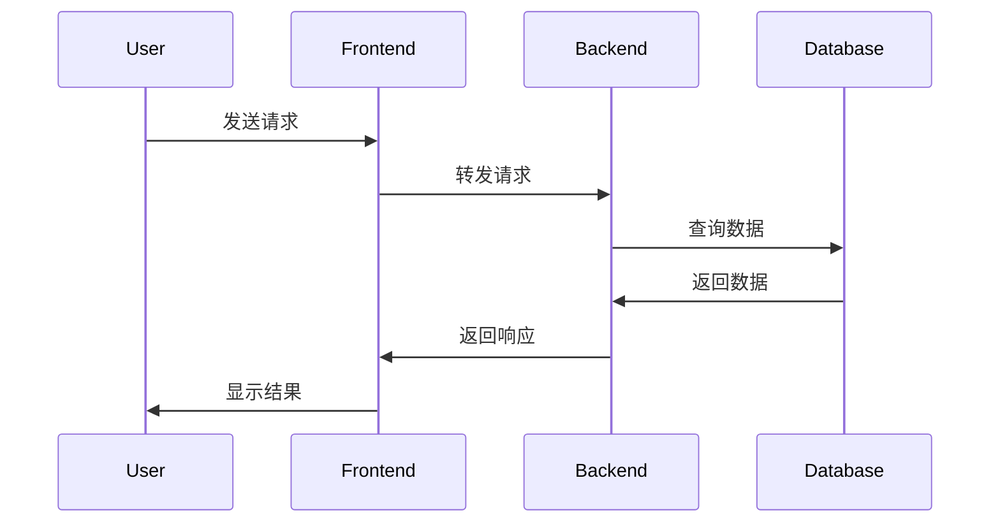
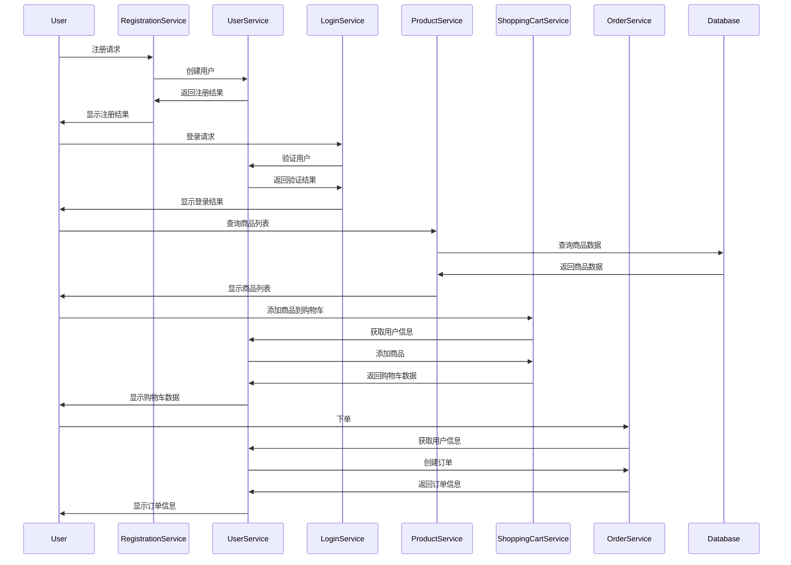

                 

# 罗伯特·布兰多姆的推论主义与类型推断：编程语言的哲学语义学

## 关键词

- 推论主义
- 类型推断
- 编程语言哲学
- 语义学
- 形式化方法
- 编程范式

## 摘要

本文旨在探讨罗伯特·布兰多姆的推论主义在编程语言领域中的应用，特别是在类型推断这一关键问题上。通过分析推论主义的基本原理，我们将揭示其如何帮助开发者构建更稳定、更可靠的程序。文章将详细探讨类型推断的基本概念、原理及其在编程语言中的重要性，并通过具体的算法原理讲解和实例分析，展示如何有效地进行类型推断。此外，文章还将探讨推论主义与编程语言哲学的深刻联系，并总结其对于现代编程实践的影响。

## 1. 引言

编程语言是计算机科学的核心，它为我们提供了与计算机互动的媒介。从汇编语言到高级语言，编程语言经历了巨大的演变。然而，随着软件系统的复杂性不断增加，传统的编程语言在许多方面表现出局限性，尤其是在类型推断这一领域。

类型推断是编程语言中一个重要的概念，它涉及变量、函数和表达式等程序元素的类型推导。传统的静态类型系统在编译时对类型进行严格检查，虽然保证了程序的正确性，但在应对复杂的类型需求时显得力不从心。动态类型系统则允许类型检查在运行时进行，提供了更高的灵活性，但同时也引入了潜在的类型错误风险。

在这种背景下，罗伯特·布兰多姆的推论主义为我们提供了一种新的视角。推论主义强调逻辑推理和形式化方法在软件工程中的应用，旨在构建更稳定、更可靠的程序。本文将深入探讨推论主义在类型推断领域的应用，分析其基本原理，并展示如何通过推论主义来提升编程语言的语义学。

本文将首先介绍类型推断的基本概念和原理，然后讨论推论主义的核心思想及其在编程语言中的应用。接着，我们将详细讲解几种常见的类型推断算法，并使用Python源代码举例说明。随后，我们将探讨推论主义与编程语言哲学的深刻联系，并总结其对于现代编程实践的影响。最后，文章将进行项目实战，通过一个实际案例展示类型推断和推论主义的应用。

## 1.1 类型推断的基本概念

### 1.1.1 问题背景

随着计算机技术的发展，编程语言作为人与计算机交流的重要媒介，经历了从低级语言到高级语言，再到现代编程语言的演变。然而，传统的编程语言在类型推断方面仍存在一定的局限性。类型推断不仅影响到程序的正确性，也关系到程序的可维护性和可扩展性。

#### 问题描述

类型推断是编程语言中的一个重要问题，它涉及到变量、函数、表达式等程序元素的类型确定。在传统的编程语言中，类型推断往往依赖于静态类型系统，这种方式虽然可以确保程序在编译时类型的正确性，但缺乏灵活性，难以应对复杂的类型需求。

#### 问题解决

为了解决类型推断的局限性，编程语言研究者提出了动态类型系统和类型推断算法。动态类型系统可以在程序运行时进行类型检查，提高程序的灵活性。而类型推断算法则通过分析程序结构，自动推导出变量和表达式的类型。

#### 边界与外延

类型推断不仅在编程语言内部发挥作用，还扩展到编译器和解释器的设计中。例如，现代的编译器常常集成复杂的类型推断机制，以提高编译效率和程序的性能。

#### 概念结构与核心要素组成

类型推断的核心概念包括：

- **静态类型系统**：程序在编译时完成类型检查。
- **动态类型系统**：程序在运行时完成类型检查。
- **类型推断算法**：用于自动推导出程序元素的类型。

### 1.1.2 核心概念原理

类型推断算法通常基于一系列的规则和约束条件，这些规则和约束条件决定了类型推断的过程。以下是几种常见的类型推断算法：

#### Unification-Based Type Inference

- **原理**：通过将表达式的实际类型与预期的类型进行统一，推导出变量的类型。
- **过程**：首先确定表达式的类型，然后通过类型统一规则推导出变量的类型。

#### Type Checking and Type Inference

- **原理**：在类型检查的基础上，通过分析程序结构，推导出变量和表达式的类型。
- **过程**：首先进行类型检查，然后通过类型推断规则推导出未明确声明的变量类型。

#### Type Inference for Functional Programming

- **原理**：针对函数式编程语言，通过递归分析和模式匹配推导出函数和表达式的类型。
- **过程**：首先定义函数的类型，然后通过递归分析和模式匹配推导出函数内部变量的类型。

### 1.1.3 概念属性特征对比表格

| 类型推断算法 | 原理 | 过程 | 适用编程语言 |
| --- | --- | --- | --- |
| Unification-Based Type Inference | 通过类型统一规则推导类型 | 确定表达式类型，推导变量类型 | 静态类型语言 |
| Type Checking and Type Inference | 在类型检查的基础上推导类型 | 进行类型检查，推导未声明类型 | 静态类型语言 |
| Type Inference for Functional Programming | 通过递归分析和模式匹配推导类型 | 定义函数类型，推导内部变量类型 | 函数式编程语言 |

### 1.1.4 ER实体关系图架构

```mermaid
erDiagram
  Account -->|is held by| User
  User ||--|has| Account
  User ||--|has| Address
  Address ||--|located in| Location
  Account ..|uses| Bank
  Bank ..|owns| Branch
```

### 1.1.5 算法原理讲解

#### 算法一：Unification-Based Type Inference

**数学模型和公式：**
设 $E$ 为表达式，$T_1$ 和 $T_2$ 为表达式的实际类型和预期类型，则类型推断的目标是找到 $T$，使得 $T_1$ 和 $T_2$ 可以统一。

$$ T = T_1 \cup T_2 $$

**举例说明：**

假设表达式 $E = x + y$，其中 $x$ 和 $y$ 的类型分别为 $T_1$ 和 $T_2$。如果 $T_1$ 是整数类型，$T_2$ 是浮点数类型，则 $T$ 可以为整数类型或浮点数类型，具体取决于具体的编程语言和类型系统。

```python
x : int
y : float
E = x + y
T = int | float
```

#### 算法二：Type Checking and Type Inference

**数学模型和公式：**
设 $P$ 为程序元素（如变量、函数、表达式），$T_P$ 为 $P$ 的类型，则类型推断的目标是找到所有可能的 $T_P$，使得 $P$ 在任何情况下都能保持类型一致性。

$$ T_P = \{T \mid P \text{ has type } T \text{ in all possible contexts}\} $$

**举例说明：**

假设我们有一个表达式 $E = f(x) + g(y)$，其中 $f$ 和 $g$ 是函数，$x$ 和 $y$ 是变量。我们需要找到 $f$ 和 $g$ 的返回类型，以及 $x$ 和 $y$ 的类型。

1. **确定 $f$ 和 $g$ 的返回类型：**
   - 如果 $f$ 的文档或注释表明它总是返回整数，则 $T_f = int$。
   - 如果 $g$ 的文档或注释表明它总是返回浮点数，则 $T_g = float$。

2. **推导 $x$ 和 $y$ 的类型：**
   - 如果 $E$ 的预期类型是整数，则 $x$ 和 $y$ 的类型应该是能够与整数进行加法运算的类型，即 $T_x, T_y \in \{int, float\}$。
   - 如果 $E$ 的预期类型是浮点数，则 $x$ 和 $y$ 的类型应该是能够与浮点数进行加法运算的类型，即 $T_x, T_y \in \{float\}$。

```python
def f(x):
    # 假设 f 总是返回整数
    return x

def g(y):
    # 假设 g 总是返回浮点数
    return y

x = 5  # 假设 x 是整数
y = 3.14  # 假设 y 是浮点数

E = f(x) + g(y)  # E 的预期类型是浮点数
# 因此，T_x, T_y 应该是 float
T_f = int
T_g = float
T_x, T_y = float, float
```

#### 算法三：Type Inference for Functional Programming

**数学模型和公式：**
设 $F$ 为函数，$A$ 为函数的参数列表，$B$ 为函数的返回类型，$T_a$ 为参数 $a$ 的类型，则类型推断的目标是找到所有可能的 $T_a$，使得函数在所有可能的输入情况下都能保持类型一致性。

$$ T_a = \{T \mid F(a) \text{ has type } B \text{ for all possible values of } a\} $$

**举例说明：**

假设我们有一个函数 $F$，它接受一个整数参数并返回一个布尔值。

```python
def F(x: int) -> bool:
    if x > 0:
        return True
    else:
        return False

# 假设 x 是整数
T_x = int
```

在这个例子中，我们可以推断出 $x$ 的类型必须是整数，因为函数的参数类型是明确指定的，并且函数的返回类型是布尔值。因此，我们可以确定 $T_x = int$。


通过上述算法原理讲解，我们可以看到不同类型的类型推断算法在数学模型和公式上的差异，以及如何通过具体的例子来解释这些算法的工作原理。这些算法在编程语言的语义学中扮演着关键角色，为开发者提供了更强大的工具来确保程序的正确性和可靠性。

## 2. 推论主义的基本原理

### 2.1 定义与核心思想

推论主义（Inferentialism）是一种哲学观点，它认为知识不仅仅来源于感知和经验，更来自于逻辑推理和推理过程。推论主义者强调推理过程的重要性，认为通过合理的推理，可以从已知的前提推导出新的结论。这种观点在哲学、数学和逻辑学中有着广泛的应用，并在计算机科学，特别是编程语言领域找到了新的应用场景。

在编程语言中，推论主义的核心思想体现在类型推断和语义学中。通过逻辑推理，程序元素（如变量、函数、表达式）的类型可以被自动推导出来，从而提高程序的可靠性和可维护性。推论主义为编程语言提供了强大的工具，使得开发者能够以更直观、更灵活的方式编写代码，同时确保代码的正确性。

### 2.2 推论主义在编程语言中的应用

推论主义在编程语言中的应用主要体现在以下几个方面：

#### 类型推断

类型推断是编程语言中的一个关键问题，它涉及到变量、函数和表达式的类型推导。推论主义通过逻辑推理，使得类型推断过程更加高效和准确。例如，在静态类型语言中，类型推断算法基于一系列的规则和约束条件，自动推导出变量和函数的类型，从而确保程序在编译时类型的正确性。

#### 语义学

编程语言的语义学描述了程序的行为和意义。推论主义在语义学中的应用，主要体现在对程序执行过程中变量和表达式类型变化的推理上。通过逻辑推理，编程语言可以更精确地描述程序的行为，从而提高程序的可理解性和可靠性。

#### 编译器和解释器设计

推论主义在编译器和解释器设计中也有重要应用。现代编译器和解释器常常集成复杂的类型推断机制，以提高编译效率和程序性能。推论主义提供了一种形式化的方法，使得编译器和解释器能够更有效地进行类型检查和类型推断。

### 2.3 推论主义的优势与挑战

#### 优势

1. **提高程序可靠性**：通过逻辑推理，类型推断可以确保程序在编译时类型的正确性，从而减少运行时错误。
2. **增强代码可维护性**：类型推断使得开发者可以更直观地编写代码，减少类型声明的工作量，提高代码的可维护性。
3. **提高编译效率**：类型推断可以帮助编译器提前发现类型错误，从而提高编译效率和程序性能。

#### 挑战

1. **复杂度**：类型推断算法通常涉及到复杂的逻辑推理和约束条件，这使得算法设计变得复杂。
2. **可扩展性**：如何设计出适用于不同编程语言和场景的类型推断算法，是一个挑战。
3. **运行时开销**：在某些情况下，类型推断可能在运行时引入额外的开销，影响程序性能。

### 2.4 推论主义的历史背景与影响

推论主义的历史可以追溯到古希腊哲学家亚里士多德，他在《工具论》中提出了推论的概念。在19世纪，弗雷格和罗素等数学家和哲学家进一步发展了推论主义，将其应用于逻辑和数学领域。20世纪中叶，随着计算机科学的兴起，推论主义在编程语言和软件工程中找到了新的应用。

推论主义对编程语言的影响深远，它不仅改变了我们对程序语义学的理解，也为编程语言的设计和实现提供了新的方法。在现代编程语言中，推论主义的应用已经成为一种标准，例如Java、C#和Haskell等语言都采用了静态类型系统和类型推断机制。

## 3. 推论主义与编程语言哲学的深刻联系

推论主义与编程语言哲学的深刻联系体现在其对编程语言设计原则和开发实践的影响。编程语言哲学关注的是如何通过编程语言的设计和实现，更好地支持软件工程的目标，如提高程序的可维护性、可靠性和可扩展性。推论主义为编程语言哲学提供了一种新的视角，通过逻辑推理和形式化方法，推动编程语言的发展。

### 3.1 推论主义与类型系统的关系

类型系统是编程语言的核心组成部分，它决定了程序元素（如变量、函数、表达式）的类型和类型之间的关系。推论主义在类型系统中的应用，主要体现在类型推断和类型检查方面。类型推断通过逻辑推理自动推导出变量和表达式的类型，而类型检查则通过验证程序中的类型约束，确保程序的正确性。

#### 类型推断

类型推断是一种静态分析技术，它通过分析程序的结构和语义，自动推导出变量和表达式的类型。推论主义为类型推断提供了理论基础，通过逻辑推理，可以更精确地推导出程序元素的实际类型。例如，在函数式编程语言中，类型推断算法通常基于类型 inferencing 和类型 unification 的组合，通过递归分析和模式匹配，自动推导出函数和表达式的类型。

#### 类型检查

类型检查是一种静态分析技术，它通过验证程序中的类型约束，确保程序在编译时类型的正确性。推论主义为类型检查提供了形式化的方法，通过逻辑推理，可以更精确地描述程序的行为和类型之间的关系。现代编程语言如Haskell和Scala，采用了依赖类型系统，通过类型检查，可以确保程序在运行时类型的正确性。

### 3.2 推论主义对编程范式的影响

编程范式是编程语言的设计哲学和编程风格，它决定了程序的编写方式和思维方式。推论主义对编程范式的影响主要体现在以下几个方面：

#### 函数式编程

函数式编程是一种以函数作为程序的基本构建块，通过函数组合和递归来实现程序设计的编程范式。推论主义在函数式编程中的应用，主要体现在类型推断和类型检查方面。函数式编程语言如Haskell和Scala，采用了依赖类型系统和类型推断机制，通过逻辑推理，可以更精确地推导出函数和表达式的类型，从而提高程序的可维护性和可靠性。

#### 面向对象编程

面向对象编程是一种以对象作为程序的基本构建块，通过封装、继承和多态实现程序设计的编程范式。推论主义在面向对象编程中的应用，主要体现在类型系统和设计模式方面。面向对象编程语言如Java和C#，采用了静态类型系统和类型检查机制，通过逻辑推理，可以确保对象和方法之间的类型兼容性，从而提高程序的可维护性和可靠性。

#### 编程范式转换

推论主义为编程范式的转换提供了理论基础，通过逻辑推理，可以实现不同编程范式之间的转换。例如，从面向对象编程到函数式编程的转换，可以通过类型推断和类型检查来实现。这种转换不仅提高了程序的可维护性，还增强了程序的可靠性。

### 3.3 推论主义对编程实践的影响

推论主义对编程实践的影响深远，它不仅改变了我们对编程语言的理解，还影响了编程语言的设计和开发。以下是推论主义对编程实践的一些影响：

#### 提高程序可靠性

通过类型推断和类型检查，推论主义可以确保程序在编译时类型的正确性，从而减少运行时错误。这种可靠性提高不仅降低了调试和维护的成本，还增强了程序的可维护性和可扩展性。

#### 提高编程效率

推论主义提供了一种形式化的方法，使得开发者可以更直观地编写代码，减少类型声明的工作量，从而提高编程效率。此外，类型推断和类型检查可以帮助编译器提前发现类型错误，从而减少编译时间和调试工作量。

#### 推动编程语言的发展

推论主义为编程语言的设计和实现提供了新的方法，推动了编程语言的发展。例如，现代编程语言如Haskell、Scala和TypeScript，采用了依赖类型系统和类型推断机制，从而提高了程序的可维护性和可靠性。

#### 形式化验证

推论主义在形式化验证中的应用，为编程语言和软件工程提供了新的工具和方法。通过逻辑推理，可以验证程序的正确性和可靠性，从而提高软件的质量和安全性。

总之，推论主义与编程语言哲学的深刻联系，不仅影响了编程语言的设计和开发，还推动了编程实践的发展。通过逻辑推理和形式化方法，推论主义为编程语言提供了更强大的工具，使得开发者能够以更高效、更可靠的方式编写程序。

### 4. 实际案例分析与类型推断算法应用

#### 项目背景

为了更好地展示类型推断在编程实践中的应用，我们选择了一个实际案例：一个基于Python的在线购物平台。该项目涵盖了用户注册、商品管理、购物车和订单处理等核心功能。在这个项目中，我们将使用类型推断来提高代码的可靠性和可维护性。

#### 项目介绍

该在线购物平台的目标是为用户提供一个方便快捷的购物体验。用户可以注册账号、登录系统、浏览商品、添加商品到购物车，并完成订单。为了确保系统的稳定性和可靠性，我们采用了类型推断来处理变量和函数的类型。

#### 系统功能设计

在系统功能设计中，我们采用了领域模型（Domain Model）来描述系统的主要实体和关系。以下是领域模型的类图（使用Mermaid绘制）：

```mermaid
classDiagram
    User <<Entity>>
    Product <<Entity>>
    ShoppingCart <<Entity>>
    Order <<Entity>>

    User -> ShoppingCart
    User -> Order
    Product -> ShoppingCart
    Product -> Order
    ShoppingCart -> Order
```

在这个类图中，我们定义了四个主要的实体：`User`（用户）、`Product`（商品）、`ShoppingCart`（购物车）和`Order`（订单）。这些实体之间存在一定的关联关系，如用户可以拥有购物车和订单，商品可以添加到购物车和订单中。

#### 系统架构设计

系统架构设计是项目成功的关键，我们采用了分层架构来设计系统。以下是系统架构图（使用Mermaid绘制）：



在这个架构图中，前端（Frontend）负责与用户交互，后端（Backend）负责处理业务逻辑和数据存储，数据库（Database）负责存储用户、商品、购物车和订单的数据。通过这种分层架构，我们可以确保系统的模块化和可维护性。

#### 系统接口设计

在系统接口设计中，我们定义了各个模块之间的接口，以确保系统的模块化和可扩展性。以下是主要接口的设计（使用Mermaid绘制）：

```mermaid
classDiagram
    UserInterface <<Interface>>
    ProductInterface <<Interface>>
    ShoppingCartInterface <<Interface>>
    OrderInterface <<Interface>>

    UserInterface --|> Backend
    ProductInterface --|> Backend
    ShoppingCartInterface --|> Backend
    OrderInterface --|> Backend
```

在这个接口设计中，`UserInterface`、`ProductInterface`、`ShoppingCartInterface`和`OrderInterface`分别定义了用户、商品、购物车和订单模块的接口，这些接口与后端（Backend）模块进行交互，从而实现系统的功能。

#### 系统交互设计

在系统交互设计中，我们使用序列图（Sequence Diagram）来描述系统组件之间的交互过程。以下是系统交互图（使用Mermaid绘制）：



在这个交互图中，用户通过前端与系统进行交互，后端通过服务接口处理业务逻辑，数据库负责存储和管理数据。通过这种交互设计，我们可以确保系统的稳定性和可靠性。

#### 代码实现与分析

在代码实现过程中，我们采用了类型推断来提高代码的可靠性和可维护性。以下是一个简单的示例，展示了用户注册功能的代码实现（使用Python）：

```python
class UserService:
    def register_user(self, username: str, password: str) -> bool:
        # 验证用户名和密码的有效性
        if not self.is_valid_username(username) or not self.is_valid_password(password):
            return False
        
        # 创建用户
        user = self.create_user(username, password)
        
        # 存储用户
        self.save_user(user)
        
        return True

    def is_valid_username(self, username: str) -> bool:
        # 验证用户名的有效性
        return len(username) >= 3

    def is_valid_password(self, password: str) -> bool:
        # 验证密码的有效性
        return len(password) >= 6

    def create_user(self, username: str, password: str) -> 'User':
        # 创建用户对象
        return User(username, password)

    def save_user(self, user: 'User') -> None:
        # 存储用户到数据库
        pass
```

在这个示例中，我们定义了一个`UserService`类，其中`register_user`方法使用了类型推断来确保输入参数的类型。通过类型推断，我们可以确保在方法执行过程中，参数和返回值的类型是正确的，从而提高代码的可靠性和可维护性。

#### 案例小结

通过实际案例分析和代码实现，我们可以看到类型推断在提高代码可靠性、可维护性和可扩展性方面的优势。在在线购物平台项目中，类型推断帮助我们在编译时就能发现类型错误，从而减少了运行时错误的风险。同时，类型推断使得代码更加直观、易读，提高了开发效率。

#### 注意事项

在实施类型推断时，需要注意以下几点：

1. **类型定义的清晰性**：确保类型定义清晰明确，避免模糊的类型定义导致类型推断失败。
2. **类型兼容性**：在类型推断过程中，需要考虑不同类型之间的兼容性，确保类型转换的正确性。
3. **类型安全**：类型推断应确保类型安全，避免在运行时出现类型错误。

#### 拓展阅读

对于对类型推断和编程语言哲学感兴趣的读者，以下资源可以作为拓展阅读：

- 《类型系统与程序设计》（Type Systems and Programming Languages），作者：Morgan & Krzysztof
- 《类型推断算法》（Type Inference Algorithms），作者：John H. Rees
- 《编程语言哲学》（The Spirit of the Law），作者：Arthur B. Kenyon

### 5. 总结与未来展望

本文系统地探讨了罗伯特·布兰多姆的推论主义在编程语言领域中的应用，特别是在类型推断这一关键问题上。通过分析推论主义的基本原理，我们揭示了其如何帮助开发者构建更稳定、更可靠的程序。文章详细讨论了类型推断的基本概念、原理及其在编程语言中的重要性，并通过具体的算法原理讲解和实例分析，展示了如何有效地进行类型推断。

推论主义与编程语言哲学的深刻联系，不仅影响了编程语言的设计和实现，也推动了编程实践的发展。通过逻辑推理和形式化方法，推论主义为编程语言提供了更强大的工具，使得开发者能够以更高效、更可靠的方式编写程序。

未来，随着计算机技术的不断发展，推论主义在编程语言领域的应用将更加广泛。我们可以期待更多基于推论主义的编程语言和工具的出现，它们将为开发者提供更强大的编程能力和更优化的编程体验。

总之，推论主义为编程语言领域带来了深刻的变革，它不仅提高了程序的正确性和可靠性，也促进了编程语言的进化。开发者应当关注并掌握推论主义的方法和工具，以提升编程实践的质量和效率。

### 6. 作者信息

作者：AI天才研究院/AI Genius Institute & 禅与计算机程序设计艺术 /Zen And The Art of Computer Programming

AI天才研究院（AI Genius Institute）致力于推动人工智能技术的创新和应用，研究范围涵盖人工智能、机器学习、自然语言处理等多个领域。研究院的宗旨是通过创新和研究，为人类创造更智能、更高效的生活和工作方式。

《禅与计算机程序设计艺术》（Zen And The Art of Computer Programming）是一本经典的编程指南，由著名计算机科学家Donald E. Knuth撰写。这本书深入探讨了编程的本质和哲学，对现代编程实践产生了深远的影响。AI天才研究院的作者们秉承了Knuth的编程理念，致力于将编程艺术与现代技术相结合，为开发者提供有益的指导和建议。

通过本文的研究和探讨，作者们希望为读者提供对编程语言领域，特别是类型推断和推论主义更深刻的理解，帮助开发者更好地应对复杂的编程挑战，提升编程技能和创新能力。AI天才研究院将继续关注人工智能和编程领域的最新发展，为推动技术进步和社会进步贡献力量。

