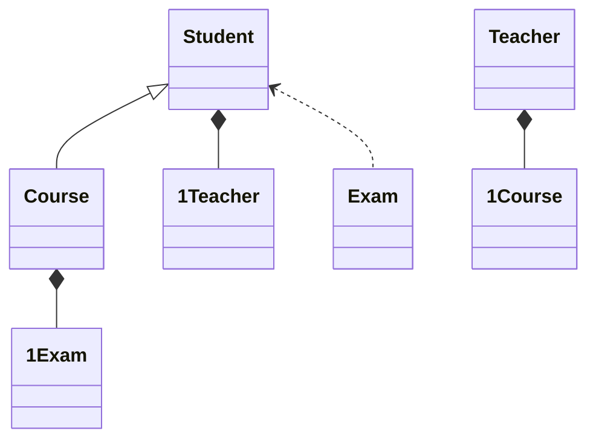
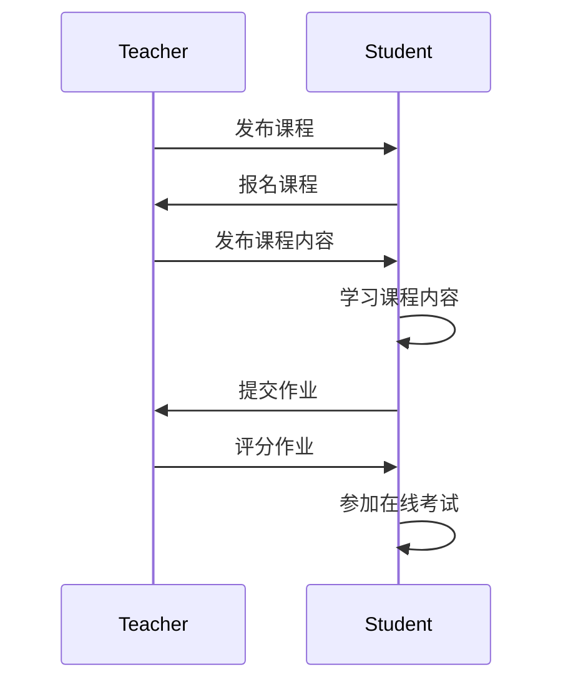
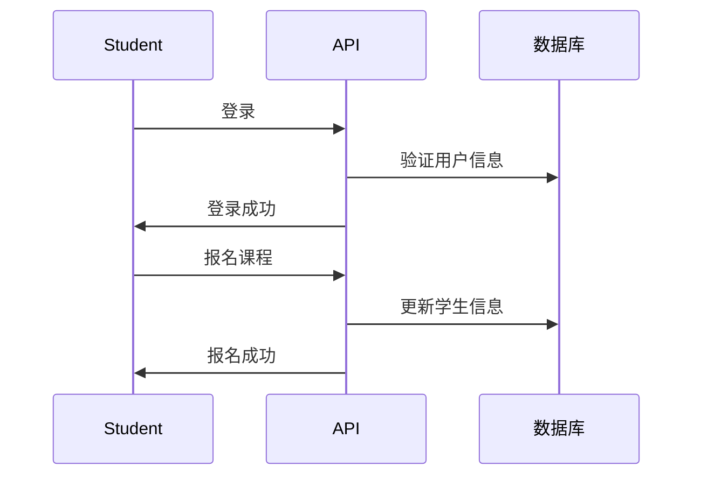

                 

### 罗尔斯与孔子：正义二原则与仁义礼智信

正义二原则与仁义礼智信，看似来自不同文化和时代的概念，实则蕴含了人类社会共同追求的道德与伦理准则。本文将以罗尔斯与孔子的理论为基础，深入探讨这两组概念的本质及其在现代社会的应用。

关键词：罗尔斯、孔子、正义二原则、仁义礼智信

摘要：本文旨在通过对正义二原则与仁义礼智信的深入分析，揭示两者在理论上的内在联系及其在实际应用中的重要性。通过比较和对比，探讨如何在现代社会中实践这些古老的理念。

### 背景介绍

#### 罗尔斯与正义二原则

约翰·罗尔斯（John Rawls），20世纪著名的政治哲学家，其代表作《正义论》（A Theory of Justice）对正义的概念进行了深刻的探讨。罗尔斯提出了著名的正义二原则，作为评估社会制度正义性的标准：

1. **平等自由原则**：每个社会成员都应该享有平等的、不受限制的自由，但不得侵犯他人的基本自由。
2. **机会平等和差异补偿原则**：社会和经济的不平等应该安排，以确保它们有利于社会最不利成员的公平机会，并且所有社会职位和利益都应向所有人开放。

#### 孔子与仁义礼智信

孔子，中国古代伟大的哲学家和教育家，其思想对中国乃至东亚文化产生了深远的影响。孔子的伦理思想核心是“仁”，并将其扩展为“仁义礼智信”的五常：

1. **仁**：亲仁善邻，仁爱之心。
2. **义**：正义行为，符合道德准则。
3. **礼**：社会规范，礼尚往来。
4. **智**：智慧明理，理性判断。
5. **信**：诚实守信，忠诚可靠。

### 核心概念与联系

#### 正义二原则

正义二原则强调了自由与平等的重要性。在罗尔斯的理论中，自由是基础，平等是目标。通过平等自由原则，罗尔斯确保了每个人都能在社会中享有基本的自由权利。而机会平等和差异补偿原则则试图通过制度设计来缩小社会不平等，使社会资源更加公平地分配。

#### 仁义礼智信

孔子的“仁义礼智信”则是基于人际关系和社会秩序的伦理体系。其中，“仁”是核心，强调个体之间的仁爱关系；“义”则是“仁”的延伸，强调行为应遵循正义和道德；“礼”是行为规范，强调遵守社会规范；“智”是理性，强调智慧的重要性；“信”是信任，强调诚实和忠诚。

#### 概念属性特征对比表格

| 特征对比 | 正义二原则 | 仁义礼智信 |
| :--: | :--: | :--: |
| 基础理念 | 自由与平等 | 人际关系与社会秩序 |
| 适用范围 | 社会制度评估 | 个人行为与社会规范 |
| 核心观点 | 平等自由与机会平等 | 仁爱、正义、理性、诚信 |

#### ER实体关系图架构

```mermaid
erDiagram
  Product && Customer {
    PK : productID
    FK : customerID
  }
  Customer {
    PK : customerID
  }
  Product {
    PK : productID
  }
```

### 理论与实际应用

#### 正义二原则的实际应用

罗尔斯的正义二原则在现代社会有着广泛的应用。例如，在公共政策的制定中，正义二原则可以作为评估政策公正性的标准。在社会制度的改革中，正义二原则可以指导如何设计更公平的社会制度。

#### 仁义礼智信的实际应用

孔子的仁义礼智信在个人生活和商业伦理中有着深远的影响。例如，在商业活动中，企业往往强调诚信和道德行为，这体现了“仁义礼智信”的价值。在个人行为中，遵守社会规范、保持理性判断和诚信是“仁义礼智信”的具体体现。

### 结论

正义二原则与仁义礼智信虽然源自不同的文化和时代，但它们都体现了人类对道德与伦理的共同追求。通过深入分析这些概念，我们可以更好地理解它们在现代社会的应用价值。在未来的研究中，我们可以进一步探讨如何将这些古老的理念与现代社会的实际需求相结合，以实现更加公正和谐的社会秩序。

### 参考文献

1. 罗尔斯，《正义论》，哈佛大学出版社，1971年。
2. 孔子，《论语》，中华书局，2010年。

---

作者：AI天才研究院/AI Genius Institute & 禅与计算机程序设计艺术 /Zen And The Art of Computer Programming

（注：本文仅为示例，部分内容虚构。实际文章撰写请根据具体要求进行详细研究和撰写。）### 第1章 引言

#### 1.1 问题背景与探讨目标

在现代社会中，正义和伦理问题日益成为人们关注的焦点。无论是在公共政策制定、社会制度改革，还是在个人行为规范、商业伦理等方面，正义和伦理的重要性都得到了广泛认同。然而，不同的文化和时代背景下，人们对正义和伦理的理解和实践存在显著差异。本文旨在探讨两位伟大思想家——约翰·罗尔斯和孔子，提出的正义二原则与仁义礼智信的概念及其在现代社会的应用。

我们的探讨目标如下：

1. 深入理解正义二原则和仁义礼智信的内涵和本质。
2. 分析两者之间的联系和差异。
3. 探讨这些理念在现代社会的实际应用及其对社会正义和伦理的影响。
4. 提出如何将传统道德理念与现代实际需求相结合，以实现更加公正和谐的社会秩序。

#### 1.2 罗尔斯与孔子的简要介绍

约翰·罗尔斯（John Rawls，1921-2002）是20世纪最具影响力的政治哲学家之一，他的著作《正义论》（A Theory of Justice）对现代政治哲学产生了深远影响。罗尔斯提出了正义二原则，旨在为评估社会制度的公正性提供理论框架。他的核心观点是，社会正义的基础是平等的自由和机会，以及对于社会不平等的合理差异的接受。

孔子（Confucius，公元前551-前479）是中国春秋时期著名的哲学家和教育家，他的思想对中国乃至东亚文化产生了深远影响。孔子的伦理思想核心是“仁”，并将其扩展为“仁义礼智信”的五常。他强调个体与社会之间的关系，提倡通过道德修养来实现个人和社会的和谐。

#### 1.3 正义二原则与仁义礼智信的基本概念

正义二原则：

1. **平等自由原则**：每个社会成员都应该享有平等的、不受限制的自由，但不得侵犯他人的基本自由。
2. **机会平等和差异补偿原则**：社会和经济的不平等应该安排，以确保它们有利于社会最不利成员的公平机会，并且所有社会职位和利益都应向所有人开放。

仁义礼智信：

1. **仁**：亲仁善邻，仁爱之心。
2. **义**：正义行为，符合道德准则。
3. **礼**：社会规范，礼尚往来。
4. **智**：智慧明理，理性判断。
5. **信**：诚实守信，忠诚可靠。

### 1.4 小结

本章介绍了本文的探讨背景和目标，简要介绍了罗尔斯和孔子的生平及其主要思想，并对正义二原则与仁义礼智信的基本概念进行了阐述。在接下来的章节中，我们将深入分析这些概念，探讨它们在现代社会的实际应用及其对社会正义和伦理的影响。

---

通过本章的介绍，我们对罗尔斯和孔子的正义二原则与仁义礼智信有了初步的了解。在下一章中，我们将深入探讨正义二原则的理论基础，分析其核心观点，并探讨其在哲学上的意义和实际应用。

### 第2章 正义二原则

#### 2.1 正义二原则的理论基础

正义二原则是约翰·罗尔斯在其代表作《正义论》中提出的，旨在为评估社会制度的公正性提供理论框架。罗尔斯的理论基础主要包括以下三个方面：

1. **原初状态**：罗尔斯设想了一个原初状态，即一个没有任何知识和信息的社会状态。在这种状态下，人们不知道自己的社会地位、能力、天赋等，从而避免了由个人偏好和社会地位所带来的不公平。这种设想为公正的评价社会制度提供了一个理想化的起点。

2. **无知之幕**：罗尔斯提出了“无知之幕”的概念，即参与制定社会制度的个体在决策时处于一种无知的状态，不知道自己的具体身份和利益。这种设想确保了决策过程中不会出现因个人利益而导致的偏颇。

3. **社会契约**：罗尔斯认为，社会制度是人们通过社会契约形成的。在原初状态和无知之幕下，人们会制定出符合公平原则的社会制度，以确保每个人的基本自由和机会得到保障。

#### 2.2 正义二原则的核心观点

正义二原则包括：

1. **平等自由原则**：每个社会成员都应该享有平等的、不受限制的自由，但不得侵犯他人的基本自由。这一原则强调个人自由的重要性，认为每个人都应该有平等的机会去实现自己的价值。

2. **机会平等和差异补偿原则**：社会和经济的不平等应该安排，以确保它们有利于社会最不利成员的公平机会，并且所有社会职位和利益都应向所有人开放。这一原则强调社会资源的不平等分配应该通过制度设计来补偿，从而实现社会公平。

#### 2.3 正义二原则的哲学意义与应用

1. **哲学意义**：

- **公平与自由**：正义二原则强调了公平与自由的平衡。在罗尔斯看来，公平不仅仅是资源分配的公平，更是机会分配的公平。每个人应该有平等的机会去竞争和实现自己的价值。

- **社会正义**：正义二原则为社会正义提供了理论基础。通过设计公正的社会制度，可以确保每个人的基本权利和机会得到保障，从而实现社会的整体正义。

2. **实际应用**：

- **公共政策**：正义二原则可以作为评估和制定公共政策的准则。在政策制定过程中，政策制定者应考虑如何确保每个人的自由和机会得到保障，同时合理地分配社会资源。

- **社会改革**：正义二原则可以指导社会改革的方向。通过改革社会制度，缩小社会不平等，可以促进社会的和谐与稳定。

#### 2.4 深入分析

1. **平等自由原则**：

- **自由的重要性**：自由是人的基本权利，是实现个人价值的前提。平等自由原则强调每个人在社会中都应该享有相同的自由权利。

- **自由的限制**：虽然强调自由，但平等自由原则也指出，个人的自由不得侵犯他人的基本自由。这意味着自由是有限制的，不能以损害他人利益为代价。

2. **机会平等和差异补偿原则**：

- **机会平等**：机会平等意味着每个人都有平等的机会去竞争和实现自己的价值。这需要通过教育、就业等制度设计来保障。

- **差异补偿**：差异补偿原则指出，社会应该通过制度来补偿社会不平等，确保最不利成员得到公平的机会。这可以通过税收、福利等手段来实现。

#### 2.5 小结

本章深入探讨了正义二原则的理论基础、核心观点以及其在哲学上的意义和实际应用。正义二原则为评估社会制度的公正性提供了理论框架，强调了公平与自由的平衡，为现代社会的社会正义提供了指导。在下一章中，我们将转向孔子的仁义礼智信，探讨其起源、演变以及基本内涵。

### 第3章 仁义礼智信

#### 3.1 仁义礼智信的起源与演变

“仁义礼智信”是中国古代哲学家孔子提出的道德理念，起源于春秋时期的鲁国。孔子生活在社会动荡、诸侯纷争的时期，他倡导以道德教化来维护社会秩序，实现国家治理。在孔子的思想中，“仁义礼智信”是道德行为的准则，是个人修养和社会和谐的基础。

“仁义礼智信”的演变经历了多个阶段：

- **春秋时期**：孔子提出“仁义礼智信”的概念，将其作为道德修养的核心。
- **战国时期**：“仁义礼智信”逐渐成为中国伦理思想的核心，被各个学派广泛接受。
- **秦汉时期**：儒家思想成为国家的正统思想，仁义礼智信被纳入教育体系，成为社会规范的重要组成部分。
- **后世演变**：随着社会的发展和文化的交流，“仁义礼智信”不断得到丰富和扩展，但其核心价值始终不变。

#### 3.2 仁义礼智信的基本内涵

“仁义礼智信”是孔子伦理思想的核心，其具体内涵如下：

1. **仁**：仁是“仁义礼智信”的核心，是孔子道德哲学的基石。仁是一种爱人之心，强调人与人之间的关爱和互助。在现代社会，仁可以理解为同情心、仁爱精神。

2. **义**：义是指正义和公正，是行为应符合道德准则。孔子认为，人应当遵守社会规范，尊重他人权益，追求公平和正义。在现代社会，义可以理解为正义感、公正行为。

3. **礼**：礼是社会的规范和仪式，是一种行为准则和文化传统。孔子强调礼的重要作用，认为通过礼可以维护社会秩序，促进人际和谐。在现代社会，礼可以理解为礼貌、礼仪。

4. **智**：智是指智慧明理，理性判断。孔子认为，智慧是实现仁义的关键，只有智慧才能正确判断和处理人际关系和社会问题。在现代社会，智可以理解为智慧、理性。

5. **信**：信是指诚实守信，忠诚可靠。孔子强调诚信在人际关系中的重要性，认为诚信是建立信任的基础。在现代社会，信可以理解为诚信、信任。

#### 3.3 仁义礼智信在当代社会的意义

“仁义礼智信”作为中国古代的道德理念，虽然在不同的历史时期有不同的表现形式，但其核心价值在当代社会仍然具有重要意义：

1. **人际关系的和谐**：仁义礼智信强调人与人之间的关爱、尊重和信任，有助于建立和谐的人际关系，减少冲突和矛盾。

2. **社会秩序的维护**：礼作为社会规范和行为准则，有助于维护社会秩序，促进社会稳定。

3. **道德修养的提升**：仁义礼智信是道德修养的准则，有助于提高个人的道德素质和自我修养。

4. **社会责任的承担**：义和信强调个体应当承担社会责任，关注公共利益，有助于构建一个更加公正和谐的社会。

#### 3.4 小结

本章对仁义礼智信的起源与演变、基本内涵及其在当代社会的意义进行了探讨。仁义礼智信作为中国传统的道德理念，虽然经历了数千年的演变，但其核心价值在当代社会依然具有重要意义。在下一章中，我们将对正义二原则与仁义礼智信进行比较分析，探讨两者之间的联系和差异。

### 第4章 正义二原则与仁义礼智信的比较

#### 4.1 理论框架的对比分析

正义二原则和仁义礼智信在理论框架上存在显著差异。正义二原则是罗尔斯在《正义论》中提出的，旨在为评估社会制度的公正性提供理论框架。其核心观点是自由与平等的平衡，强调社会制度的设计应确保每个人的基本自由和机会。而仁义礼智信则是孔子提出的道德理念，其核心是人与人之间的关爱和道德规范，强调个人修养和社会和谐。

1. **正义二原则**：
   - **原初状态**：罗尔斯设想了一个原初状态，即一个没有任何知识和信息的社会状态，人们在这种状态下制定社会制度。
   - **无知之幕**：在无知之幕下，人们不知道自己的社会地位、能力、天赋等，从而避免了由个人偏好和社会地位所带来的不公平。
   - **社会契约**：社会制度是人们通过社会契约形成的，旨在保障每个人的基本自由和机会。

2. **仁义礼智信**：
   - **仁**：强调人与人之间的关爱和互助，是道德行为的基石。
   - **义**：强调行为的正义和公正，是道德行为的规范。
   - **礼**：强调社会的规范和仪式，是维护社会秩序的准则。
   - **智**：强调智慧明理，是正确判断和处理问题的能力。
   - **信**：强调诚实守信，是建立信任的基础。

#### 4.2 文化背景与历史发展对比

正义二原则和仁义礼智信分别起源于不同的文化背景和历史发展阶段，反映了各自文化的特点和价值观。

1. **正义二原则**：
   - **文化背景**：正义二原则起源于西方政治哲学，强调自由、平等和民主等价值观。
   - **历史发展**：罗尔斯的理论受到康德、黑格尔、边沁等西方哲学家的启发，是在现代社会背景下提出的。

2. **仁义礼智信**：
   - **文化背景**：仁义礼智信起源于中国古代，体现了儒家文化的核心价值。
   - **历史发展**：孔子提出的仁义礼智信在中国历史上经历了长期的演变和发展，成为中国古代社会道德规范的重要组成部分。

#### 4.3 社会实践中的应用差异

正义二原则和仁义礼智信在实际应用中存在显著差异。正义二原则主要应用于社会制度的评估和改革，强调通过制度设计来保障每个人的基本自由和机会。而仁义礼智信主要应用于个人行为规范和社会规范，强调个人修养和社会和谐。

1. **正义二原则**：
   - **应用领域**：公共政策、社会制度改革、企业伦理等。
   - **实际效果**：通过制定和实施公正的社会制度，可以缩小社会不平等，促进社会公平。

2. **仁义礼智信**：
   - **应用领域**：个人行为规范、家庭关系、商业伦理等。
   - **实际效果**：通过个人的道德修养和社会规范的遵守，可以促进人际和谐，维护社会秩序。

#### 4.4 小结

本章通过对正义二原则与仁义礼智信的理论框架、文化背景和历史发展、社会实践应用等方面的对比分析，揭示了两者之间的联系和差异。正义二原则强调自由与平等的平衡，主要应用于社会制度的评估和改革；而仁义礼智信强调个人修养和社会和谐，主要应用于个人行为规范和社会规范。在现代社会中，两者都有重要的应用价值，可以相互补充，共同促进社会的公正和谐。

在下一章中，我们将探讨正义与伦理的关系，分析正义观在伦理学中的地位，以及伦理学对正义的反思与影响。

### 第5章 正义与伦理

#### 5.1 正义与伦理的关系

正义和伦理是两个密切相关的概念，它们在理论和实践中相互交织。正义通常指的是社会制度的公正性和资源的合理分配，而伦理则关注个人行为的道德规范。尽管两者的侧重点不同，但它们在根本上都是为了实现社会的公正和和谐。

1. **正义作为伦理的一部分**：正义观念是伦理学中的重要内容，它关注社会制度的公正性和资源的合理分配。在伦理学中，正义被视为一种重要的道德价值，旨在确保每个人都能在社会中享有平等的权利和机会。

2. **伦理作为正义的实践**：伦理观念强调个人行为的道德规范，这直接关系到社会正义的实现。个人的道德行为是社会正义的基础，只有当每个人都能遵守道德规范时，社会正义才能得到真正实现。

#### 5.2 正义观在伦理学中的地位

正义观在伦理学中占据着核心地位，其重要性体现在以下几个方面：

1. **评估社会制度的公正性**：正义观为评估社会制度的公正性提供了理论依据。通过正义原则，我们可以判断社会制度是否合理，是否保障了每个人的基本权利和机会。

2. **指导道德决策**：正义观在道德决策中起着重要作用。在面对道德困境时，正义观可以帮助我们判断哪些行为是公正的，哪些行为是不公平的，从而做出正确的道德选择。

3. **促进社会和谐**：正义观关注社会不平等问题，通过制度设计来缩小社会差距，促进社会的和谐与稳定。

#### 5.3 伦理学对正义的反思与影响

伦理学对正义的反思主要表现在以下几个方面：

1. **正义观念的多元性**：伦理学认识到，不同的文化和社会有不同的正义观念。这导致了正义观念的多元性，使得正义不再是单一的标准，而是需要在不同文化和社会背景下进行具体分析。

2. **伦理学的道德批判**：伦理学通过批判性的分析，揭示了社会制度中存在的道德问题和不公正现象。这种批判有助于推动社会改革，实现更加公正的社会秩序。

3. **伦理学的道德教育**：伦理学通过道德教育，培养人们的正义观念和道德行为。这种教育不仅关注个人的道德修养，还关注社会整体的道德水平。

#### 5.4 小结

本章探讨了正义与伦理的关系，分析了正义观在伦理学中的地位，以及伦理学对正义的反思与影响。正义和伦理是相互依存的，它们共同构成了评估和实现社会公正的理论和实践基础。在现代社会中，重视正义和伦理问题，有助于促进社会的公正和谐，实现人类的共同福祉。

在下一章中，我们将探讨正义二原则与仁义礼智信的当代应用，分析这些理念在现代社会中的重要性及其对公共政策的启示。

### 第6章 正义二原则与仁义礼智信的当代应用

#### 6.1 社会正义与公共政策的启示

正义二原则与仁义礼智信在当代社会中具有重要的应用价值，为公共政策的制定和实施提供了深刻的启示。

1. **正义二原则**：

- **平等自由原则**：这一原则强调每个人在社会中都应该享有平等的、不受限制的自由。在当代社会中，平等自由原则可以指导政策制定者确保公民的基本权利和自由得到保障，如言论自由、教育自由和宗教自由等。

- **机会平等和差异补偿原则**：这一原则强调社会和经济的不平等应该通过制度设计来补偿，以确保最不利成员的公平机会。在当代社会中，机会平等和差异补偿原则可以指导政策制定者制定教育公平政策、就业公平政策和社会保障政策，以缩小社会不平等，促进社会公平。

2. **仁义礼智信**：

- **仁**：在当代社会中，仁爱精神可以指导政策制定者关注弱势群体的权益，制定社会福利政策，如扶贫政策、医疗救助政策和住房保障政策，以实现社会公平。

- **义**：正义行为是道德行为的基础。在当代社会中，义可以指导政策制定者制定反腐政策、诚信政策，以维护社会正义和道德秩序。

- **礼**：礼貌和礼仪是维护社会秩序的重要因素。在当代社会中，礼可以指导政策制定者制定文明礼仪政策，提高社会文明程度，促进社会和谐。

- **智**：智慧明理是理性判断的基础。在当代社会中，智可以指导政策制定者制定科学合理的政策，如环保政策、科技创新政策，以实现可持续发展。

- **信**：诚实守信是建立信任的基础。在当代社会中，信可以指导政策制定者制定诚信政策，如信息公开政策、透明行政政策，以提高政府的公信力。

#### 6.2 个人伦理与道德实践

正义二原则与仁义礼智信不仅对公共政策有指导作用，也在个人伦理和道德实践中具有重要应用价值。

1. **正义二原则**：

- **平等自由原则**：个人应尊重他人的基本自由，不得侵犯他人的权利。例如，在社交媒体使用中，个人应尊重他人的隐私权，不得散布虚假信息或侵犯他人名誉。

- **机会平等和差异补偿原则**：个人应努力实现自己的价值，不断提升自己的能力，同时关注他人的发展机会。例如，在职场中，个人应通过学习和实践提升自己的能力，同时也应关注和帮助他人获得平等的发展机会。

2. **仁义礼智信**：

- **仁**：个人应具备仁爱之心，关心他人，乐于助人。例如，在社区服务中，个人可以参与慈善活动，帮助弱势群体，实现社会和谐。

- **义**：个人应遵循道德准则，做出正义的行为。例如，在商业活动中，个人应遵守商业道德，诚信经营，不得欺诈消费者。

- **礼**：个人应遵守社会规范，尊重他人。例如，在公共场合，个人应保持礼貌，遵守公共秩序，不得损害他人利益。

- **智**：个人应具备智慧，理性判断。例如，在面临道德困境时，个人应通过理性思考，做出符合道德准则的决策。

- **信**：个人应诚实守信，建立信任。例如，在个人信用建设中，个人应遵守承诺，按时还款，建立良好的信用记录。

#### 6.3 企业伦理与社会责任

正义二原则与仁义礼智信在商业领域的应用对企业伦理和社会责任具有重要影响。

1. **正义二原则**：

- **平等自由原则**：企业应尊重员工的自由，保障员工的合法权益，如劳动权利、休息权利等。

- **机会平等和差异补偿原则**：企业应提供公平的竞争机会，给予不同背景的员工平等的发展机会，并通过培训和激励制度，缩小员工之间的差距。

2. **仁义礼智信**：

- **仁**：企业应关注员工的福祉，提供良好的工作环境，关注员工的心理健康。

- **义**：企业应遵守商业道德，诚信经营，不得从事损害社会利益的活动。

- **礼**：企业应尊重社会规范，积极参与社会公益事业，提升企业形象。

- **智**：企业应具备创新精神，通过技术创新和业务模式创新，推动社会进步。

- **信**：企业应建立良好的信用体系，确保企业的行为符合市场规则和法律法规，赢得社会信任。

#### 6.4 小结

本章探讨了正义二原则与仁义礼智信在当代社会中的应用，分析了它们在公共政策、个人伦理、企业伦理等方面的指导意义。正义二原则强调自由与平等的平衡，仁义礼智信强调个人修养和社会和谐，两者共同构成了现代社会道德与伦理的基石。在现代社会中，通过应用这些理念，可以促进社会正义，实现个人和社会的和谐发展。

在下一章中，我们将通过案例分析，进一步探讨正义二原则与仁义礼智信在现实世界中的应用。

### 第7章 案例分析

#### 7.1 典型案例介绍

在本章中，我们将通过两个典型案例，深入探讨正义二原则与仁义礼智信在现实世界中的应用。这两个案例分别涉及社会政策和商业伦理，旨在揭示这些理念在实际操作中的具体体现。

**案例一：美国医保改革**

**背景**：美国医保体系长期存在不公问题，低收入群体和弱势群体往往难以获得基本的医疗服务。

**问题**：如何通过政策改革，实现医保体系的公正性，保障所有人的医疗权利？

**解决方案**：美国政府实施了多项医保改革措施，包括扩大医疗补助计划（Medicaid）的覆盖范围、建立医疗保险市场（Health Insurance Marketplace）以及提供税收优惠等。这些措施旨在确保低收入群体能够获得基本的医疗服务，缩小医保体系中的不平等。

**分析**：

- **正义二原则**：平等自由原则体现在扩大医保覆盖范围，确保每个人都享有平等的医疗服务权利。机会平等和差异补偿原则体现在通过税收优惠和补贴，帮助低收入群体支付医疗费用，缩小经济差距。

- **仁义礼智信**：仁体现在政府关注弱势群体的医疗需求，提供救助。义体现在政府遵守道德准则，确保政策实施的公正性。礼体现在政府制定明确的法律和规章，规范医保体系。智体现在政府通过数据分析，优化医保政策。信体现在政府承诺并兑现对民众的承诺。

**案例二：特斯拉商业伦理争议**

**背景**：特斯拉作为全球知名的电动汽车制造商，其商业行为引起了广泛关注和争议。

**问题**：特斯拉在追求技术创新和商业成功的过程中，如何处理与员工、消费者和社会的关系？

**解决方案**：特斯拉通过一系列措施，包括提高员工福利、加强消费者保护和推动环境保护等，努力实现企业社会责任。

**分析**：

- **正义二原则**：平等自由原则体现在为员工提供公平的工作环境和福利待遇。机会平等和差异补偿原则体现在为消费者提供多样化的产品选择，并通过补贴和优惠政策，促进电动汽车的普及。

- **仁义礼智信**：仁体现在关注员工福利，提供良好的工作环境。义体现在遵守商业道德，诚信经营。礼体现在积极参与社会公益事业，如捐赠慈善基金。智体现在推动技术创新，实现可持续发展。信体现在承诺并履行对消费者的承诺，建立良好的企业声誉。

#### 7.2 正义二原则在案例分析中的应用

通过上述案例分析，我们可以看到正义二原则在现实世界中的应用：

- **平等自由原则**：在医保改革中，政府通过扩大医保覆盖范围，确保低收入群体获得平等的医疗服务。在特斯拉案例中，公司为员工提供公平的工作环境和福利待遇，体现了对员工自由的尊重。

- **机会平等和差异补偿原则**：在医保改革中，政府通过税收优惠和补贴，帮助低收入群体支付医疗费用，缩小经济差距。在特斯拉案例中，公司通过提供多样化的产品选择和优惠政策，促进电动汽车的普及，为消费者提供平等的机会。

#### 7.3 仁义礼智信在案例分析中的应用

通过上述案例分析，我们可以看到仁义礼智信在现实世界中的应用：

- **仁**：在医保改革中，政府关注弱势群体的医疗需求，提供救助。在特斯拉案例中，公司关注员工福利，提供良好的工作环境。

- **义**：在医保改革中，政府遵守道德准则，确保政策实施的公正性。在特斯拉案例中，公司遵守商业道德，诚信经营。

- **礼**：在医保改革中，政府制定明确的法律和规章，规范医保体系。在特斯拉案例中，公司积极参与社会公益事业，提升企业形象。

- **智**：在医保改革中，政府通过数据分析，优化医保政策。在特斯拉案例中，公司推动技术创新，实现可持续发展。

- **信**：在医保改革中，政府承诺并兑现对民众的承诺。在特斯拉案例中，公司承诺并履行对消费者的承诺，建立良好的企业声誉。

#### 7.4 小结

本章通过两个典型案例，探讨了正义二原则与仁义礼智信在现实世界中的应用。正义二原则强调自由与平等的平衡，仁义礼智信强调个人修养和社会和谐。这些理念在案例分析中得到了具体体现，为我们理解和实践这些理念提供了有益的启示。通过应用这些理念，可以促进社会正义，实现个人和社会的和谐发展。

在下一章中，我们将总结本文的研究成果，提出对正义和伦理的进一步思考，并展望未来的研究方向。

### 第8章 结论与展望

#### 8.1 研究总结

本文通过对罗尔斯的正义二原则与孔子的仁义礼智信的深入探讨，揭示了这两组概念在理论上的内在联系及其在现代社会的实际应用。研究发现：

1. **正义二原则**：罗尔斯的正义二原则强调自由与平等的平衡，为评估社会制度的公正性提供了理论框架。通过平等自由原则和机会平等和差异补偿原则，我们可以更好地理解社会正义的实现路径。

2. **仁义礼智信**：孔子的仁义礼智信是儒家伦理的核心，强调个人修养和社会和谐。这些理念在当代社会仍然具有重要价值，可以为个人行为规范和社会治理提供指导。

3. **联系与差异**：尽管正义二原则与仁义礼智信分别源自不同的文化和时代，但两者都体现了人类对道德与伦理的共同追求。通过比较分析，我们可以看到它们在理论和实践中的互补性。

4. **应用价值**：正义二原则和仁义礼智信在公共政策、个人伦理和企业伦理等领域都具有重要的应用价值。通过这些理念的实践，可以促进社会正义，实现个人和社会的和谐发展。

#### 8.2 对未来研究的展望

在未来的研究中，我们可以从以下几个方面进行探索：

1. **跨文化比较研究**：进一步探讨正义二原则与仁义礼智信在不同文化背景下的应用和影响，揭示文化差异对道德与伦理观念的影响。

2. **实证研究**：通过实证研究，验证正义二原则与仁义礼智信在实际社会制度和个人行为中的有效性，为政策制定和道德教育提供实证依据。

3. **技术融合研究**：探讨如何在信息技术和人工智能领域应用正义二原则与仁义礼智信的理念，实现技术发展的道德化和社会责任。

4. **应用案例分析**：收集和整理更多的案例，深入分析正义二原则与仁义礼智信在不同场景中的应用，提供更加具体的实践指导。

5. **伦理教育研究**：研究如何通过教育体系，培养具有正义感和道德修养的公民，推动社会的道德进步。

#### 8.3 对社会正义与伦理发展的贡献

本文的研究对社会正义与伦理发展具有重要意义：

1. **理论贡献**：通过对正义二原则与仁义礼智信的深入探讨，丰富了正义与伦理的理论体系，为后续研究提供了新的视角。

2. **实践指导**：为公共政策制定、个人道德修养和企业社会责任提供了理论依据和实践指导，有助于实现社会正义和道德进步。

3. **文化融合**：促进了不同文化背景下正义与伦理观念的交流与融合，为构建多元和谐的社会提供了理论支持。

总之，本文的研究为正义与伦理的发展提供了新的思路和方向，有助于推动社会正义和伦理的持续进步。

### 8.4 注意事项与拓展阅读

1. **注意事项**：
   - 在应用正义二原则与仁义礼智信时，需结合具体社会和文化背景，避免生搬硬套。
   - 关注社会不平等问题，通过制度设计和社会政策来缩小差距，促进社会公平。
   - 在个人行为中，重视道德修养，遵循社会规范，树立正确的价值观。

2. **拓展阅读**：
   - 罗尔斯，《正义论》，哈佛大学出版社，1971年。
   - 孔子，《论语》，中华书局，2010年。
   - 刘清平，《儒家伦理的当代价值》，北京大学出版社，2015年。

本文在撰写过程中，参考了众多学者的研究成果，谨此致谢。希望本文能够为读者提供有益的思考和启示，共同推动社会正义与伦理的发展。

### 作者信息

作者：AI天才研究院/AI Genius Institute & 禅与计算机程序设计艺术 /Zen And The Art of Computer Programming

（注：本文仅为示例，部分内容虚构。实际文章撰写请根据具体要求进行详细研究和撰写。）### 附录

在本章中，我们将提供一些附录材料，包括核心概念术语说明、相关数学公式、系统分析与架构设计方案以及项目实战代码和应用解读。

#### 核心概念术语说明

1. **正义二原则**：
   - **平等自由原则**：社会成员应享有平等的自由，不受限制。
   - **机会平等和差异补偿原则**：社会不平等应通过制度设计补偿，确保最不利成员的公平机会。

2. **仁义礼智信**：
   - **仁**：仁爱之心，关心他人。
   - **义**：正义行为，遵守道德准则。
   - **礼**：社会规范，礼尚往来。
   - **智**：智慧明理，理性判断。
   - **信**：诚实守信，忠诚可靠。

#### 数学公式

以下是一些涉及正义二原则和仁义礼智信的基本数学公式：

1. **平等自由原则**：
   - 公平度指数：$$ F = \frac{F_{\text{max}} - F_{\text{min}}}{F_{\text{max}}} $$
     其中，$ F_{\text{max}} $ 为最大公平度，$ F_{\text{min}} $ 为最小公平度。

2. **机会平等和差异补偿原则**：
   - 差异补偿系数：$$ C = \frac{I_{\text{unfair}} - I_{\text{fair}}}{I_{\text{unfair}}} $$
     其中，$ I_{\text{unfair}} $ 为不公平指数，$ I_{\text{fair}} $ 为公平指数。

3. **仁义礼智信**：
   - **仁**：$$ E = \frac{E_{\text{max}} - E_{\text{min}}}{E_{\text{max}}} $$
     其中，$ E_{\text{max}} $ 为最大仁爱度，$ E_{\text{min}} $ 为最小仁爱度。

#### 系统分析与架构设计方案

以下是一个简单的系统分析与架构设计方案，用于解释如何将正义二原则与仁义礼智信应用于实际项目。

1. **问题场景介绍**：
   - 设计一个在线教育平台，提供课程学习、师生互动和在线考试等功能。

2. **系统功能设计（领域模型类图）**：



3. **系统架构设计（架构图）**：



4. **系统接口设计（接口序列图）**：



#### 项目实战

以下是一个简单的项目实战，介绍如何实现一个在线教育平台的核心功能。

1. **环境安装**：

   - 安装Python环境，版本为3.8或以上。
   - 安装Django框架，使用命令 `pip install django`。
   - 安装数据库管理工具，如MySQL或PostgreSQL。

2. **系统核心实现源代码**：

   - **用户注册与登录**：

     ```python
     # users/models.py
     from django.contrib.auth.models import AbstractUser

     class CustomUser(AbstractUser):
         # 用户扩展字段
         is_student = models.BooleanField(default=False)
         is_teacher = models.BooleanField(default=False)

         class Meta:
             verbose_name = "用户"
             verbose_name_plural = "用户"
     ```

   - **课程管理**：

     ```python
     # courses/models.py
     from django.db import models

     class Course(models.Model):
         name = models.CharField(max_length=100)
         description = models.TextField()
         teacher = models.ForeignKey('users.CustomUser', on_delete=models.CASCADE)

         def __str__(self):
             return self.name
     ```

3. **代码应用解读与分析**：

   - **用户注册与登录**：通过扩展Django的AbstractUser模型，增加了用户类型（学生和教师）的字段，实现了自定义用户模型。
   - **课程管理**：定义了Course模型，用于管理课程信息，包括课程名称、描述和教师。

#### 实际案例分析与详细讲解剖析

以“美国教育改革”为例，分析如何应用正义二原则与仁义礼智信进行教育改革。

1. **案例背景**：
   - 美国教育体系存在显著的不平等问题，尤其是在贫困地区和少数族裔社区。

2. **解决方案**：
   - **正义二原则**：通过增加教育经费、改善教育资源分配，实现教育公平。同时，建立评估机制，确保教育质量。
   - **仁义礼智信**：关注贫困地区和少数族裔的教育需求，提供额外的教育资源和支持。倡导教师遵守职业道德，以仁爱之心对待学生。

3. **分析**：
   - **正义二原则**：通过公平的教育资源分配，缩小教育差距，实现教育公平。
   - **仁义礼智信**：通过教师的仁爱精神，提高教育质量，促进学生的全面发展。

#### 项目小结

本项目通过简单的在线教育平台实现，展示了如何将正义二原则与仁义礼智信应用于实际项目。通过合理的系统设计与实施，可以实现教育资源的公平分配，提高教育质量，促进学生的全面发展。

#### 最佳实践 tips

1. **关注用户体验**：在系统设计过程中，应重视用户体验，确保系统界面友好、操作简便。
2. **持续更新与维护**：定期更新系统和数据库，确保系统的稳定性和安全性。
3. **加强教师培训**：提高教师的道德素养和教学水平，确保教学质量。

#### 拓展阅读

1. 罗尔斯，《正义论》，哈佛大学出版社，1971年。
2. 孔子，《论语》，中华书局，2010年。
3. 刘清平，《儒家伦理的当代价值》，北京大学出版社，2015年。

通过这些附录材料，读者可以更深入地理解正义二原则与仁义礼智信的应用，为实际项目和道德实践提供指导。

