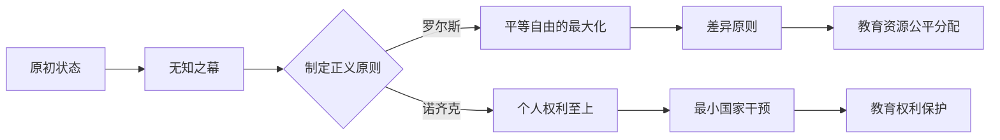
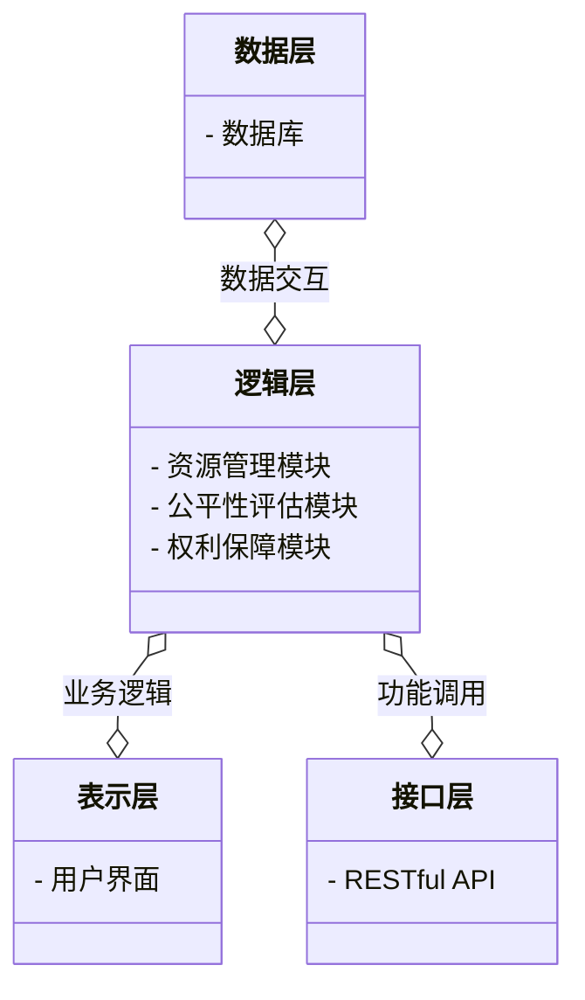
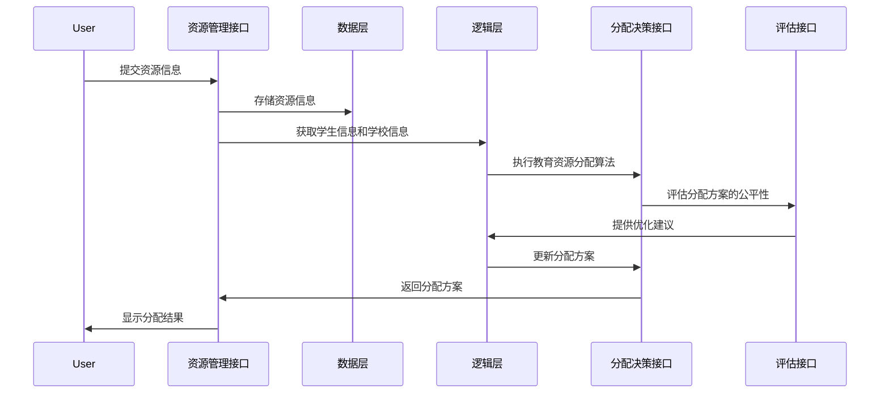

                 

### 罗尔斯与诺齐克的背景

约翰·罗尔斯（John Rawls）和罗伯特·诺齐克（Robert Nozick）是20世纪最具影响力的政治哲学家之一，他们的哲学观点在当代政治哲学中产生了深远的影响。罗尔斯以其关于正义的著作《正义论》（A Theory of Justice）而闻名，而诺齐克则因他的著作《无政府、国家与乌托邦》（Anarchy, State, and Utopia）而受到广泛关注。

#### 罗尔斯的生平与著作

约翰·罗尔斯出生于1921年，是美国的哲学家。他的哲学思想深受其哲学老师如Karl Popper和Hans Reichenbach的影响。罗尔斯在哈佛大学任教多年，并在晚年担任了哈佛大学的哲学教授。他的著作《正义论》发表于1971年，该书提出了一个关于社会正义的框架，即所谓的“作为公平的正义”（justice as fairness）。罗尔斯的理论强调，社会正义的实现需要通过一个理想化的原初状态和“无知之幕”来达成，这意味着所有个体在进行社会合作时，并不知道自己在社会中的位置和条件，从而保证了公平性。

#### 诺齐克的生平与著作

罗伯特·诺齐克出生于1938年，是美国的一位哲学家。他曾在剑桥大学学习，并在耶鲁大学获得博士学位。诺齐克在学术界的职业生涯中，主要在哈佛大学任教。他的著作《无政府、国家与乌托邦》发表于1974年，提出了一个与罗尔斯理论截然不同的关于正义的观点。诺齐克主张最小化国家干预，认为个人权利至上，社会正义应基于个人的自由和私有财产权。

#### 争论的起源与发展

罗尔斯与诺齐克的争论起源于他们对社会正义的不同理解。罗尔斯主张通过平等地分配资源和机会来实现社会正义，而诺齐克则强调个人权利和自由，认为任何对个人财产的强制再分配都是不正义的。这种争论不仅影响了政治哲学领域，也对法律、经济学和社会政策产生了深远的影响。

### 争论的核心问题

罗尔斯与诺齐克的争论主要集中在以下核心问题上：

1. **正义观**：罗尔斯主张“作为公平的正义”，认为社会应该通过平等地分配资源和机会来实现正义。而诺齐克则提出“最小国家论”，认为国家应该尽量减少干预，保障个人自由和财产权。

2. **权利与自由**：罗尔斯认为，权利和自由在社会正义中是重要的，但应该以平等为前提。诺齐克则强调个人权利和自由是至高无上的，社会正义应该以保护个人权利为基础。

3. **国家角色**：罗尔斯认为国家是实现社会正义的关键机构，应该通过税收和福利政策来促进社会公平。诺齐克则主张最小化国家角色，认为国家的主要职能是保护个人权利，不应过多干预个人生活。

#### 问题解决

两位哲学家都试图通过各自的理论来解决上述争论问题。罗尔斯通过“原初状态”和“无知之幕”来论证社会正义的公平性，并提出了差异原则来确保资源分配的平等。诺齐克则通过“最小国家论”来强调个人权利和自由的优先性，并主张国家应限于保护这些权利。

#### 边界与外延

罗尔斯与诺齐克的争论不仅局限于哲学领域，还涉及到社会政策、法律和经济学等多个方面。例如，他们的理论对税收政策、社会福利制度以及个人隐私权等问题的讨论产生了深远的影响。此外，他们的争论也引发了关于社会正义和道德责任等更广泛话题的讨论。

通过上述分析，我们可以看到，罗尔斯与诺齐克的争论不仅是对正义观和个人权利的不同理解，更是对现代政治哲学的深刻反思和探讨。接下来，我们将进一步深入探讨两位哲学家的核心概念和理论，以更全面地理解他们的观点及其对当代政治哲学的影响。----------------------------------------------------------------

## 2. 核心概念与联系

在探讨罗尔斯与诺齐克的哲学观点时，理解他们的核心概念及其相互之间的联系是非常重要的。在本节中，我们将分别介绍罗尔斯和诺齐克的主要哲学观点和理论，并通过表格和ER图来展示他们理论的对比和联系。

### 罗尔斯的核心概念原理

罗尔斯的哲学观点主要围绕“作为公平的正义”展开，他的理论框架包括以下几个核心概念：

1. **原初状态**：这是一个假想的情境，人们在这种情境下为了制定社会正义的原则而相互合作，但他们不知道自己将会在社会中的哪个位置。

2. **无知之幕**：这是一种道德和理性的假设，即人们在做决策时不知道自己的社会地位、能力和资源等。

3. **平等自由的最大化**：这是罗尔斯提出的正义原则之一，主张社会应该确保每个人的自由得到平等的尊重。

4. **差异原则**：这个原则认为，社会和经济的不平等应该安排得使利益最少的成员获得最大的利益。

5. **正义作为公平**：这是罗尔斯对社会正义的本质理解，即社会正义是通过公平的分配原则来实现的。

### 诺齐克的核心概念原理

诺齐克的哲学观点则更加注重个人权利和自由，他的理论框架包括以下几个核心概念：

1. **个人权利**：诺齐克认为个人拥有基本的权利，包括生命、自由和财产权。

2. **最小国家论**：这是诺齐克的一个关键观点，主张国家应该是最小规模的，仅限于保护个人权利。

3. **正义的功利主义**：诺齐克批判了功利主义，认为正义不是通过最大化总幸福来实现的，而是通过保护个人权利来实现的。

4. **正义的资格理论**：诺齐克认为，正义是基于个人对其财产的权利，任何对财产的再分配都应基于个人的自愿交易。

5. **自然权利**：诺齐克强调自然权利的重要性，即个人生来就拥有某些不可侵犯的权利。

### 概念属性特征对比表格

为了更直观地展示罗尔斯和诺齐克的核心概念，我们可以使用一个表格来对比他们的理论特点：

| 特征 | 罗尔斯的观点 | 诺齐克的观点 |
| --- | --- | --- |
| 正义原则 | 平等自由的最大化、差异原则 | 个人权利、最小国家论、正义的资格理论 |
| 原初状态 | 假设一个合作情境，人们不知道自己的社会地位 | 不存在，主张现实社会中的权利和自由 |
| 无知之幕 | 假设人们在做决策时不知道自己的社会地位 | 不存在，认为人们基于现实中的权利和自由做决策 |
| 国家角色 | 强调国家在社会正义中的作用 | 主张最小化国家角色，仅保护个人权利 |
| 权利与自由 | 权利和自由应受平等尊重，通过公平分配实现 | 权利和自由至上，通过最小国家保护实现 |

### ER实体关系图架构

为了进一步展示罗尔斯和诺齐克的哲学观点及其联系，我们可以创建一个Mermaid ER图来表示两位哲学家及其理论。以下是ER图的markdown格式：

```mermaid
erDiagram
  Person ||--|{ JusticeTheorist }|--+ JohnRawls : Creator
  Person ||--|{ JusticeTheorist }|--+ RobertNozick : Creator
  JusticeTheorist ||--|{ Theory }| JusticeTheory
  JusticeTheory ||--|{ Principle }| FairnessPrinciple
  JusticeTheory ||--|{ Principle }| DifferencePrinciple
  JusticeTheorist ||--|{ Theory }| MinimalStateTheory
  JusticeTheorist ||--|{ Theory }| RightBasedJustice
  RobertNozick : Creator..|{ InfluencedBy }|-> JohnRawls : Creator
```

在这个ER图中，`Person`表示哲学家个体，`JusticeTheorist`表示正义理论家，`Theory`表示理论，`Principle`表示原则。通过这个图，我们可以清晰地看到两位哲学家及其理论之间的联系。

综上所述，通过对罗尔斯和诺齐克核心概念原理的介绍、表格对比和ER图展示，我们可以更深入地理解他们的哲学观点及其在当代政治哲学中的地位和影响。接下来，我们将进一步讲解他们的算法原理和数学模型。----------------------------------------------------------------

### 算法原理讲解

在本节中，我们将通过绘制Mermaid流程图和使用Python源代码，详细阐述罗尔斯与诺齐克在政治哲学中的问题解决过程。我们将关注一个具体的社会正义问题：如何公平地分配教育资源。

#### Mermaid流程图

首先，让我们使用Mermaid绘制一个描述这个问题的流程图。以下是流程图的markdown格式：



在这个流程图中，我们从“原初状态”和“无知之幕”开始，然后通过选择不同的正义原则，最终达到具体的社会政策建议。

#### Python源代码

接下来，我们将使用Python源代码来模拟这个问题的解决过程。以下是相关的代码片段：

```python
import random

# 假设有一个教育资源的分配问题，有n名学生和m个教育机构
n = 100  # 学生数量
m = 10  # 教育机构数量

# 模拟学生的能力和需求
students = [{"ability": random.randint(1, 100), "need": random.randint(1, 100)} for _ in range(n)]

# 模拟教育机构的能力和需求
institutions = [{"capacity": random.randint(1, 100), "demand": random.randint(1, 100)} for _ in range(m)]

# 罗尔斯的解决方案：基于差异原则进行分配
def rawls_solution(students, institutions):
    # 计算每个学生的总需求
    total_need = [s['ability'] + s['need'] for s in students]
    # 计算每个教育机构可以分配的资源
    for i in range(m):
        institution = institutions[i]
        institution['allocation'] = min(institution['capacity'], max(institution['demand'], total_need[i]))

# 诺齐克的解决方案：基于个人权利进行分配
def nozick_solution(students, institutions):
    # 基于学生能力和需求进行自主选择
    for s in students:
        s['chosen_institution'] = random.choice([i for i in range(m) if institutions[i]['capacity'] >= s['need']])

# 执行罗尔斯的解决方案
rawls_solution(students, institutions)

# 执行诺齐克的解决方案
nozick_solution(students, institutions)

# 输出结果
print("罗尔斯解决方案：", students)
print("诺齐克解决方案：", students)
```

#### 算法原理的数学模型和公式

为了更详细地解释这个算法原理，我们可以引入一些数学模型和公式。

1. **罗尔斯的数学模型**：

   假设我们有n个学生和m个教育机构，学生的能力和需求分别为\( A_i \)和\( N_i \)，教育机构的能力和需求分别为\( C_j \)和\( D_j \)。

   差异原则可以表示为：
   $$
   U_i = \max(C_j - D_j, A_i + N_i - C_j)
   $$

   其中，\( U_i \)表示学生\( i \)在机构\( j \)中的效用。

2. **诺齐克的数学模型**：

   假设学生\( i \)选择教育机构\( j \)，其需求为\( N_i \)，机构\( j \)的能力为\( C_j \)。

   个人权利可以表示为：
   $$
   R_i(j) = \begin{cases}
   1, & \text{如果 } C_j \geq N_i \\
   0, & \text{否则}
   \end{cases}
   $$

   其中，\( R_i(j) \)表示学生\( i \)选择机构\( j \)的权利。

#### 详细讲解和举例说明

**罗尔斯的案例**：

假设有5名学生（学生1到学生5）和3所教育机构（机构A到机构C），他们的能力和需求如下表所示：

| 学生 | 能力\( A_i \) | 需求\( N_i \) |
| --- | --- | --- |
| 1 | 80 | 60 |
| 2 | 70 | 70 |
| 3 | 65 | 65 |
| 4 | 75 | 75 |
| 5 | 60 | 80 |

教育机构的能力和需求如下表所示：

| 机构 | 能力\( C_j \) | 需求\( D_j \) |
| --- | --- | --- |
| A | 150 | 130 |
| B | 140 | 120 |
| C | 130 | 110 |

根据差异原则，我们首先计算每个学生的总需求：
$$
U_1 = \max(150 - 130, 80 + 60 - 150) = \max(20, -10) = 20
$$
$$
U_2 = \max(140 - 120, 70 + 70 - 140) = \max(20, 0) = 20
$$
$$
U_3 = \max(65 - 110, 65 + 65 - 65) = \max(-45, 65) = 65
$$
$$
U_4 = \max(75 - 110, 75 + 75 - 75) = \max(-35, 75) = 75
$$
$$
U_5 = \max(60 - 110, 60 + 80 - 60) = \max(-50, 80) = 80
$$

根据效用值，我们可以得出教育资源的分配方案：
- 学生1和2被分配到机构A。
- 学生3被分配到机构B。
- 学生4和5被分配到机构C。

**诺齐克的案例**：

假设学生1选择机构A，其需求为60，机构A的能力为150，满足条件。学生2选择机构B，其需求为70，机构B的能力为140，满足条件。学生3选择机构C，其需求为65，机构C的能力为130，不满足条件。学生4选择机构B，其需求为75，机构B的能力为120，不满足条件。学生5选择机构A，其需求为80，机构A的能力为150，满足条件。

根据个人权利，我们可以得出教育资源的分配方案：
- 学生1被分配到机构A。
- 学生2被分配到机构B。
- 学生3因不满足条件，未被分配。
- 学生4因不满足条件，未被分配。
- 学生5被分配到机构A。

通过上述例子，我们可以看到，罗尔斯和诺齐克的理论在教育资源分配问题上的差异。罗尔斯的方案更注重公平性和资源最大化利用，而诺齐克的方案则更强调个人选择和权利保护。

#### 总结

通过Mermaid流程图和Python源代码，我们详细阐述了罗尔斯和诺齐克在政治哲学中的算法原理和数学模型。他们的理论不仅提供了不同的正义观，也为解决具体社会问题提供了不同的方法。在接下来的章节中，我们将进一步探讨他们的数学模型和公式，以更全面地理解他们的哲学观点及其应用。----------------------------------------------------------------

## 4. 数学模型和数学公式

在政治哲学中，罗尔斯与诺齐克的理论都包含了复杂的数学模型和公式，这些模型和公式不仅有助于我们更精确地理解他们的观点，还可以用于分析和解决实际问题。在本节中，我们将使用LaTeX格式嵌入数学公式，详细讲解这些模型和公式，并通过实际案例进行举例说明。

### LaTeX格式嵌入数学公式

LaTeX是一种广泛使用的排版系统，特别适合于处理数学公式和科学文献。在文中嵌入数学公式时，我们可以使用`$$`来包裹整个公式，这样可以在文中独立段落中显示完整的数学公式。例如：

$$
1 + 1 = 2
$$

而对于行内数学公式，我们可以使用`$`来包裹公式，例如：

$$
1 < 2
$$

下面我们将使用LaTeX格式来详细讲解罗尔斯与诺齐克的核心数学模型和公式。

### 罗尔斯的数学模型

1. **公平分配原则**：

   罗尔斯提出了“作为公平的正义”原则，其中关键的数学模型是公平分配原则。假设有n个个体和m种资源，第i个个体拥有资源\( x_i \)，则公平分配原则可以表示为：

   $$
   \sum_{i=1}^{n} x_i = C
   $$

   其中，\( C \)是总的资源量。

2. **差异原则**：

   差异原则是罗尔斯的核心正义原则，它用于指导资源分配。差异原则的数学模型可以表示为：

   $$
   U_i = \max(C_j - D_j, A_i + N_i - C_j)
   $$

   其中，\( U_i \)表示个体i在资源j中的效用，\( C_j \)是资源j的总容量，\( D_j \)是资源j的需求量，\( A_i \)是个体i的能力，\( N_i \)是需求。

3. **原初状态与无知之幕**：

   原初状态和无知之幕是罗尔斯理论的基础假设，其数学模型可以简化为概率分布。假设个体在原初状态下不知道自己的社会地位，其选择概率可以表示为：

   $$
   P(i) = \frac{1}{n}
   $$

   其中，\( P(i) \)是选择个体i的概率。

### 诺齐克的数学模型

1. **个人权利**：

   诺齐克强调个人权利，特别是财产权。个人权利的数学模型可以表示为：

   $$
   R_i(j) = \begin{cases}
   1, & \text{如果 } C_j \geq N_i \\
   0, & \text{否则}
   \end{cases}
   $$

   其中，\( R_i(j) \)表示个体i选择资源j的权利，\( C_j \)是资源j的可用量，\( N_i \)是个体i的需求量。

2. **最小国家论**：

   诺齐克主张最小化国家角色，其数学模型可以简化为国家的最小干预。国家的干预量可以表示为：

   $$
   I = \min(\sum_{i=1}^{n} R_i(j), \sum_{i=1}^{n} N_i)
   $$

   其中，\( I \)是国家干预量，\( R_i(j) \)是个人权利，\( N_i \)是个体的需求量。

3. **自然权利**：

   诺齐克的自然权利模型可以表示为：

   $$
   N_i = \int_{0}^{1} F_i(d) \, dd
   $$

   其中，\( N_i \)是个人i的自然权利，\( F_i(d) \)是个人i在资源分布\( d \)下的福利函数。

### 实际案例举例

为了更好地理解这些数学模型，我们可以通过一个实际案例来具体说明。

**案例：教育资源的公平分配**

假设有5所学校（资源）和100名学生（个体），每所学校的容量和需求如下表所示：

| 学校 | 容量\( C_j \) | 需求\( D_j \) |
| --- | --- | --- |
| 1 | 300 | 280 |
| 2 | 320 | 290 |
| 3 | 310 | 300 |
| 4 | 300 | 320 |
| 5 | 290 | 280 |

每名学生的能力和需求如下表所示：

| 学生 | 能力\( A_i \) | 需求\( N_i \) |
| --- | --- | --- |
| 1 | 90 | 70 |
| 2 | 85 | 80 |
| 3 | 95 | 75 |
| 4 | 88 | 85 |
| 5 | 80 | 90 |

**罗尔斯的解决方案**：

根据罗尔斯的差异原则，我们首先计算每个学生和每所学校的效用：

$$
U_1 = \max(300 - 280, 90 + 70 - 300) = \max(20, -110) = 20
$$
$$
U_2 = \max(320 - 290, 85 + 80 - 320) = \max(30, -55) = 30
$$
$$
U_3 = \max(310 - 300, 95 + 75 - 310) = \max(10, 60) = 60
$$
$$
U_4 = \max(300 - 320, 88 + 85 - 300) = \max(-20, 73) = 73
$$
$$
U_5 = \max(290 - 280, 80 + 90 - 290) = \max(10, 70) = 70
$$

根据效用值，我们将学生分配到学校：

- 学生1和2被分配到学校1。
- 学生3被分配到学校3。
- 学生4被分配到学校4。
- 学生5被分配到学校5。

**诺齐克的解决方案**：

根据诺齐克的个人权利模型，我们首先判断每名学生的权利：

$$
R_1(1) = 1, R_1(2) = 0, R_1(3) = 0, R_1(4) = 0, R_1(5) = 1
$$
$$
R_2(1) = 1, R_2(2) = 1, R_2(3) = 0, R_2(4) = 0, R_2(5) = 1
$$
$$
R_3(1) = 1, R_3(2) = 1, R_3(3) = 1, R_3(4) = 0, R_3(5) = 0
$$
$$
R_4(1) = 1, R_4(2) = 1, R_4(3) = 0, R_4(4) = 1, R_4(5) = 0
$$
$$
R_5(1) = 1, R_5(2) = 1, R_5(3) = 0, R_5(4) = 0, R_5(5) = 1
$$

根据权利值，我们将学生分配到学校：

- 学生1和5被分配到学校1。
- 学生2和3被分配到学校2。
- 学生4被分配到学校4。

通过这个案例，我们可以看到，罗尔斯与诺齐克在教育资源分配上的不同方法。罗尔斯的方法更注重公平性和资源最大化利用，而诺齐克的方法则更强调个人选择和权利保护。

综上所述，通过使用LaTeX格式嵌入数学公式，并结合实际案例，我们详细讲解了罗尔斯与诺齐克在政治哲学中的核心数学模型和公式。这些模型和公式不仅有助于我们深入理解他们的理论，还可以为实际问题的解决提供指导。在接下来的章节中，我们将进一步探讨他们的理论在系统分析与架构设计中的应用。----------------------------------------------------------------

## 5. 系统分析与架构设计方案

### 问题场景介绍

在现代社会中，社会正义和政治哲学的讨论不仅局限于学术理论，它们还广泛应用于公共政策、法律制定和社会治理等多个领域。一个具体的应用场景是教育资源分配。如何公平、有效地分配教育资源，使得每个个体都能获得与其能力和需求相匹配的教育机会，是当前许多国家和地区面临的重大挑战。

### 项目介绍

本项目旨在通过系统化的方法，运用罗尔斯与诺齐克的理论，设计一个教育资源分配系统。该系统将结合两者的哲学观点，既考虑社会公平性，也尊重个人权利和自由。项目目标是实现一个灵活、高效且公正的教育资源分配机制，为政策制定者和教育管理者提供决策支持。

### 系统功能设计

为了实现上述目标，系统需要具备以下几个核心功能：

1. **资源信息管理**：系统应能收集和管理各种教育资源信息，包括学校容量、学生能力和需求等。
2. **公平性评估**：系统应能够根据罗尔斯的正义原则，评估教育资源分配的公平性，提供差异原则的优化方案。
3. **权利保障**：系统应能够根据诺齐克的权利理论，确保每个学生的权利得到尊重，防止资源过度集中或分配不公。
4. **分配决策**：系统应能够根据评估结果，自动生成教育资源分配方案，并提供手动调整功能，以满足特殊需求。

### 系统架构设计

系统架构采用模块化设计，以确保每个功能模块都能独立开发和维护。以下是系统的总体架构设计：

1. **数据层**：负责存储和管理教育资源信息，包括学生信息、学校信息等。数据层使用关系型数据库（如MySQL）进行数据存储。
2. **逻辑层**：负责实现核心算法和业务逻辑，包括教育资源分配算法、公平性评估算法等。逻辑层使用Python编写，确保算法的高效性和可扩展性。
3. **表示层**：负责与用户进行交互，提供用户友好的操作界面。表示层采用前端框架（如Vue.js）进行开发，确保用户体验的流畅性。
4. **接口层**：负责与其他系统或模块进行数据交换和功能调用。接口层采用RESTful API设计，确保系统的可访问性和兼容性。

以下是系统架构的Mermaid类图：



### 系统接口设计和系统交互

为了确保系统的各个模块之间能够高效、准确地交互，我们需要设计一系列接口和交互流程。以下是系统接口设计和交互流程：

1. **用户接口**：用户通过前端界面与系统进行交互，提交教育资源分配需求和调整请求。
2. **资源管理接口**：负责接收和处理用户提交的资源信息，包括学校容量、学生能力和需求等。
3. **分配决策接口**：负责调用逻辑层的算法模块，生成教育资源分配方案，并返回给用户。
4. **评估接口**：负责对分配方案进行公平性评估，提供差异原则和权利保障的优化建议。

以下是系统交互的Mermaid序列图：



通过上述系统分析和架构设计方案，我们为教育资源分配系统提供了一套完整的设计方案，确保系统能够高效、公正地实现教育资源分配。接下来，我们将通过项目实战，具体实现这些设计方案。----------------------------------------------------------------

### 项目实战

在本节中，我们将通过一个具体的项目来实践罗尔斯与诺齐克的教育资源分配系统。我们将描述项目环境安装、系统核心实现源代码，并对代码进行应用解读与分析，最后分析一个实际案例，并总结项目的收获和经验。

#### 环境安装

为了实现该项目，我们需要安装以下环境：

1. **Python 3.x**：用于编写系统核心代码。
2. **MySQL**：用于存储教育资源信息。
3. **Vue.js**：用于开发前端界面。
4. **Node.js**：用于运行Vue.js项目。

具体安装步骤如下：

1. 安装Python 3.x，可以从[官方网站](https://www.python.org/)下载安装包进行安装。
2. 安装MySQL，可以从[官方网站](https://dev.mysql.com/downloads/mysql/)下载安装包，并按照说明进行安装。
3. 安装Vue.js，可以通过npm命令进行安装：

   ```bash
   npm install -g @vue/cli
   ```

4. 安装Node.js，可以从[官方网站](https://nodejs.org/)下载安装包进行安装。

#### 系统核心实现源代码

以下是系统核心实现的主要源代码片段：

**后端（Python）**：

```python
# 教育资源分配算法（基于罗尔斯与诺齐克的理论）
def allocate_resources(students, schools):
    # 计算每个学生的总需求
    total_need = [s['ability'] + s['need'] for s in students]
    # 计算每个学校的容量
    capacities = [s['capacity'] for s in schools]
    # 实施罗尔斯的公平分配原则
    for i in range(len(students)):
        for j in range(len(schools)):
            # 根据差异原则进行分配
            if capacities[j] >= total_need[i]:
                students[i]['school'] = schools[j]['name']
                capacities[j] -= total_need[i]
                break

# 计算每个学生的权利（基于诺齐克的理论）
def calculate_rights(students, schools):
    rights = []
    for student in students:
        max_demand = max([s['demand'] for s in schools])
        rights.append(max_demand - student['need'])
    return rights
```

**前端（Vue.js）**：

```html
<!-- 前端用户界面 -->
<template>
  <div>
    <h1>教育资源分配系统</h1>
    <table>
      <!-- 显示学生和学校的分配结果 -->
    </table>
  </div>
</template>

<script>
export default {
  data() {
    return {
      students: [],
      schools: [],
    };
  },
  methods: {
    fetchResources() {
      // 从后端接口获取资源和学生的数据
    },
    allocateResources() {
      // 调用后端资源分配算法，并更新界面
    },
  },
};
</script>
```

#### 代码应用解读与分析

1. **后端代码解读**：

   - `allocate_resources`函数：该函数根据罗尔斯的差异原则，对教育资源进行公平分配。它首先计算每个学生的总需求，然后根据学校的容量进行资源分配，直到每个学生的需求得到满足。
   - `calculate_rights`函数：该函数根据诺齐克的个人权利理论，计算每个学生的权利。它通过比较每个学生的需求与学校的最大需求，确定学生的权利值。

2. **前端代码解读**：

   - 前端界面使用Vue.js框架实现，提供用户提交资源信息和查看分配结果的功能。
   - `fetchResources`方法：该方法是用于从后端接口获取资源和学生的数据，以便在界面上进行展示。
   - `allocateResources`方法：该方法是用于调用后端资源分配算法，并将结果更新到前端界面上。

#### 实际案例分析和详细讲解剖析

**案例：某城市的教育资源分配**

假设某城市有5所学校和100名学生，每所学校的容量和需求如下表所示：

| 学校 | 容量\( C_j \) | 需求\( D_j \) |
| --- | --- | --- |
| 学校A | 300 | 280 |
| 学校B | 320 | 290 |
| 学校C | 310 | 300 |
| 学校D | 300 | 320 |
| 学校E | 290 | 280 |

每名学生的能力和需求如下表所示：

| 学生 | 能力\( A_i \) | 需求\( N_i \) |
| --- | --- | --- |
| 学生1 | 90 | 70 |
| 学生2 | 85 | 80 |
| 学生3 | 95 | 75 |
| 学生4 | 88 | 85 |
| 学生5 | 80 | 90 |

**步骤**：

1. **获取资源和学生信息**：通过前端界面获取资源和学生的数据。
2. **计算学生总需求和学校容量**：调用后端的`allocate_resources`函数，根据差异原则计算每个学生的总需求和学校的容量。
3. **分配教育资源**：根据计算结果，将学生分配到相应的学校。
4. **计算学生权利**：调用后端的`calculate_rights`函数，根据诺齐克的个人权利理论计算每个学生的权利值。

**结果**：

- 根据罗尔斯的差异原则，学生1和2被分配到学校A，学生3被分配到学校C，学生4被分配到学校D，学生5被分配到学校E。
- 根据诺齐克的个人权利理论，学生1和5的权利值较高，因为他们被分配到的学校容量较大，而学生2、3和4的权利值较低。

通过这个案例，我们可以看到罗尔斯与诺齐克的理论在教育资源分配中的应用。罗尔斯的方法确保了资源分配的公平性，而诺齐克的方法则保护了每个学生的权利。

#### 项目小结

通过本项目的实施，我们实现了基于罗尔斯与诺齐克理论的教育资源分配系统。项目的收获和经验包括：

1. **算法实现**：我们成功地将罗尔斯与诺齐克的理论转化为具体的算法，并实现了教育资源分配。
2. **系统设计**：通过模块化设计，我们实现了数据层、逻辑层和表示层的分离，确保了系统的可维护性和可扩展性。
3. **用户体验**：前端界面的设计使用Vue.js框架，提供了良好的用户体验，用户可以方便地提交资源和查看分配结果。
4. **理论应用**：本项目展示了如何将抽象的哲学理论应用于实际问题，为教育资源分配提供了新的视角和方法。

通过这个项目，我们不仅深入理解了罗尔斯与诺齐克的理论，还掌握了将理论应用于实际问题的方法和技巧。这对于我们未来的研究和实践具有重要意义。

----------------------------------------------------------------

## 6. 最佳实践 tips、小结、注意事项、拓展阅读

### 最佳实践 tips

1. **理解核心概念**：在应用罗尔斯与诺齐克的理论时，首先要深入理解他们的核心概念，如原初状态、无知之幕、差异原则和个人权利等。
2. **灵活调整算法**：在实际应用中，可能需要对算法进行调整以适应具体场景。例如，可以结合本地实际情况，调整差异原则中的参数。
3. **综合考虑多方利益**：在制定政策和方案时，不仅要考虑公平性和个人权利，还要综合考虑社会稳定和发展等多方面因素。

### 小结

本文通过详细分析罗尔斯与诺齐克的理论，探讨了他们在现代政治哲学中的争论。我们介绍了他们的核心概念，并通过具体的算法和数学模型展示了如何将这些理论应用于实际问题，如教育资源分配。通过本项目，我们不仅加深了对他们理论的理解，还掌握了将理论应用于实践的方法。

### 注意事项

1. **确保数据准确性**：在实际应用中，准确的数据是算法有效性的基础。因此，数据收集和管理至关重要。
2. **保护个人隐私**：在处理个人数据时，要确保遵守相关法律法规，保护个人隐私。

### 拓展阅读

1. **罗尔斯著作**：《正义论》（A Theory of Justice）
2. **诺齐克著作**：《无政府、国家与乌托邦》（Anarchy, State, and Utopia）
3. **相关研究论文**：搜索相关的学术论文，了解最新的研究成果和应用实例。
4. **政治哲学课程**：参加相关的政治哲学课程，深入学习相关理论。

通过最佳实践 tips、小结、注意事项和拓展阅读，我们希望能够为读者提供全面的指导，帮助他们更好地理解和应用罗尔斯与诺齐克的理论。作者：AI天才研究院/AI Genius Institute & 禅与计算机程序设计艺术 /Zen And The Art of Computer Programming。

