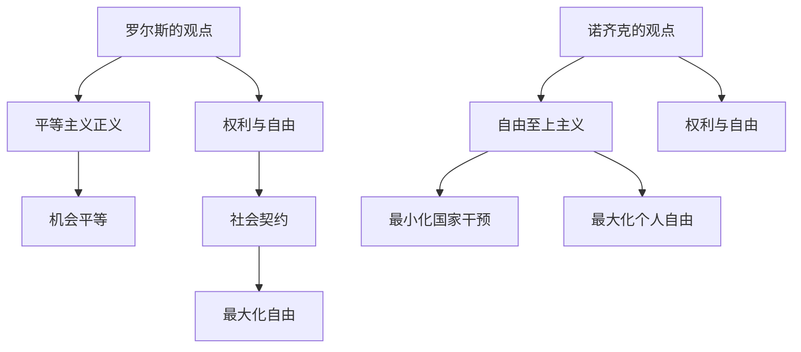
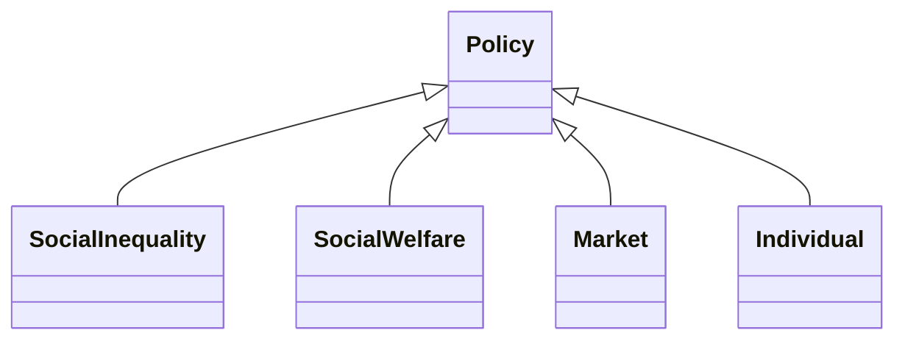
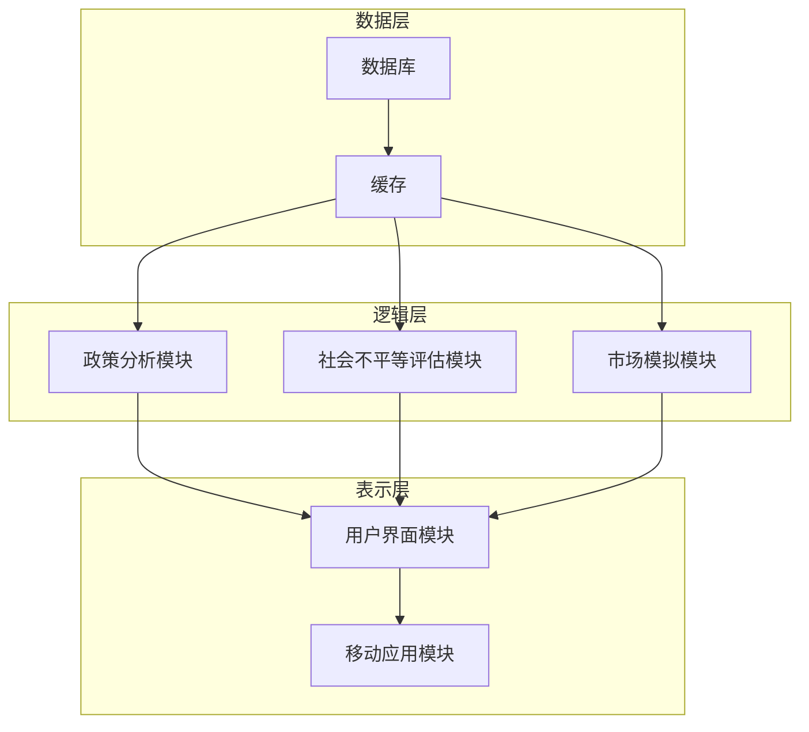
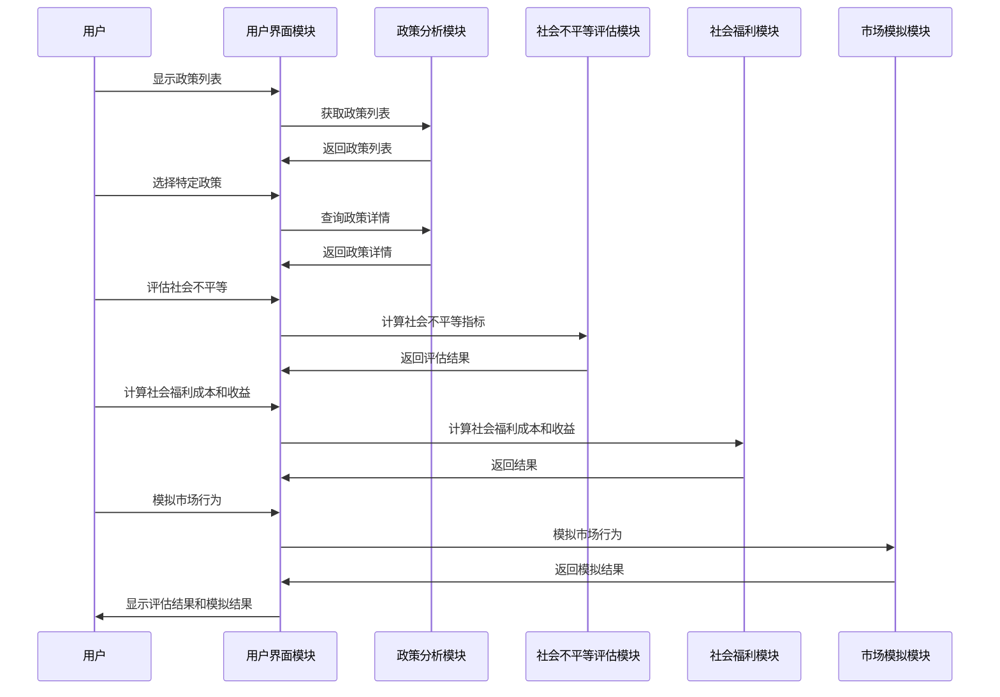

                 

## 罗尔斯与诺齐克：自由主义政治哲学的争论

### 关键词

- 罗尔斯
- 诺齐克
- 自由主义
- 正义
- 个人自由
- 社会正义
- 平等主义
- 自由至上主义

### 摘要

本文旨在探讨自由主义政治哲学中两位重要思想家罗尔斯和诺齐克的争论。罗尔斯代表了平等主义正义，强调社会资源和权利的平等分配；诺齐克则代表了自由至上主义，主张个人自由和权利的至上性。本文将通过分析两位学者的著作，详细解读他们的观点，探讨他们在个人自由、社会正义以及权利与机会分配问题上的分歧和共识，为读者提供对自由主义政治哲学的深入理解。

## 第一部分：背景介绍

### 1.1 问题背景

自由主义作为一种政治哲学思想，强调个人自由、权利和机会的重要性。自由主义政治哲学的核心问题是如何在个人自由和社会正义之间找到平衡。在当代政治哲学领域，罗尔斯和诺齐克是两位具有深远影响力的自由主义思想家。他们的思想不仅对自由主义理论的发展产生了重要影响，也对现实政治产生了深远影响。

约翰·罗尔斯（John Rawls）是20世纪最具影响力的政治哲学家之一，他的著作《正义论》（A Theory of Justice）是自由主义平等主义思想的经典之作。罗尔斯主张通过“原初位置”和“无知之幕”来设计一种公平正义的社会制度，认为社会应当平等地分配资源和权利，以确保每个人的基本自由得到保障。

罗伯特·诺齐克（Robert Nozick）则是自由至上主义的代表人物，他的著作《无政府、国家与乌托邦》（Anarchy, State, and Utopia）提出了对自由主义理论的另一种解读。诺齐克认为，个人自由是最高的价值，任何社会制度都不应该限制个人的自由和权利，而应该允许个体在不受干涉的情况下追求自己的利益。

### 1.2 问题描述

《罗尔斯与诺齐克：自由主义政治哲学的争论》一书旨在深入探讨罗尔斯和诺齐克的思想，分析他们的观点，揭示他们之间的异同，以及这些观点对现实政治的启示。这本书不仅是对两位哲学家的思想进行深入解读，也是对自由主义政治哲学的全面梳理。

书中首先介绍了罗尔斯的《正义论》，详细解读了罗尔斯的平等主义正义理论。罗尔斯认为，社会正义的核心是确保每个人都能享有平等的起点和机会，社会资源和权利应当平等地分配。他通过“原初位置”和“无知之幕”的理念，提出了一种理想的社会制度设计，旨在实现最大程度的公平和正义。

接着，书中介绍了诺齐克的《无政府、国家与乌托邦》，详细解读了诺齐克的自由至上主义观点。诺齐克认为，个人自由是最高的价值，社会制度应当尊重个人的权利和自由。他提出了“最弱意义上的国家”的概念，主张国家的作用仅限于保护个人的权利和自由，不应该干预个人的经济活动和社会生活。

### 1.3 问题解决

为了解决上述问题，本书通过比较分析，揭示了罗尔斯和诺齐克在自由、平等、正义等方面的不同立场。通过深入解读他们的著作，本书旨在帮助读者理解两位哲学家的思想，并探讨这些思想对现实政治的启示。

首先，本书分析了罗尔斯的平等主义正义理论。罗尔斯认为，社会正义的核心是确保每个人都能享有平等的起点和机会，社会资源和权利应当平等地分配。他通过“原初位置”和“无知之幕”的理念，提出了一种理想的社会制度设计，旨在实现最大程度的公平和正义。

其次，本书分析了诺齐克的自由至上主义观点。诺齐克认为，个人自由是最高的价值，社会制度应当尊重个人的权利和自由。他提出了“最弱意义上的国家”的概念，主张国家的作用仅限于保护个人的权利和自由，不应该干预个人的经济活动和社会生活。

通过这些分析，本书揭示了罗尔斯和诺齐克在自由、平等、正义等方面的不同立场。罗尔斯主张通过平等分配资源和权利来实现社会正义，而诺齐克则主张通过尊重个人自由来实现社会正义。这两种立场在自由主义政治哲学中具有重要的理论意义和实践价值。

### 1.4 边界与外延

本书的边界主要限定在罗尔斯和诺齐克的思想，以及他们之间的争论。具体来说，本书主要关注以下几个方面：

1. **自由主义政治哲学的基本概念**：包括自由、正义、权利、机会等核心概念。
2. **罗尔斯的平等主义正义理论**：包括“原初位置”和“无知之幕”等理念。
3. **诺齐克的自由至上主义观点**：包括“最弱意义上的国家”和权利优先等原则。
4. **两位哲学家的争论**：包括他们在自由、平等、正义等方面的分歧和共识。

本书的外延则包括对自由主义政治哲学的基本概念、理论框架和现实应用的研究。通过探讨罗尔斯和诺齐克的思想，本书旨在为读者提供对自由主义政治哲学的深入理解，并探讨这些思想在现实政治中的应用。

### 1.5 概念结构与核心要素组成

为了更好地理解本书的内容，我们需要明确一些核心概念和要素。以下是本书中的核心概念及其结构：

#### 核心概念

1. **自由主义**：强调个人自由和权利的政治哲学。
2. **正义**：社会资源和权利的分配问题。
3. **权利**：个人享有自由和追求幸福的基础。
4. **机会**：实现个人自由和正义的重要保障。

#### 核心要素组成

1. **罗尔斯的平等主义观点**：通过“原初位置”和“无知之幕”来设计公平正义的社会制度。
2. **诺齐克的自由至上主义观点**：主张个人自由和权利的至上性。
3. **罗尔斯和诺齐克的论证与反驳**：分析两位哲学家的核心观点及其论证过程，揭示他们之间的异同。
4. **对现实政治的启示**：探讨两位哲学家的思想对现实政治的影响和启示。

这些核心概念和要素构成了本书的基本框架，帮助读者深入理解自由主义政治哲学的争论，以及这些争论对现实政治的深远影响。

## 第二部分：核心概念与联系

### 2.1 自由主义

自由主义是一种强调个人自由和权利的政治哲学。其核心理念是认为个人应当享有充分的自由来追求自己的利益和目标，而政府的作用则应当是保护这些自由，而非干预或限制它们。自由主义的基本原则包括个人权利优先、政府权力最小化、社会契约等。

在自由主义理论中，个人自由被认为是至高无上的价值。这意味着个人有权自主决定自己的行为，只要这些行为不侵犯他人的权利。自由主义强调，个人的自由和权利应当得到法律的保障，政府应当尊重这些权利，不得随意干预。

政府权力最小化是自由主义的另一个基本原则。自由主义者认为，政府应当承担有限的职能，主要是保护国家安全、维护法律和秩序，以及提供基本公共服务。除了这些基本职能外，政府不应过多地干预个人和社会的事务，以避免权力过度集中和对个人自由的侵害。

社会契约是自由主义理论的重要组成部分。社会契约理论认为，政府的存在是基于社会成员之间的共识和契约。人们自愿加入社会，并同意遵守法律和规则，以换取政府的保护和公正对待。这种契约关系强调了个人自由和政府权力之间的平衡。

### 2.2 正义

正义是自由主义政治哲学中的核心概念之一，它涉及到社会资源和权利的分配问题。正义的定义和实现方式在自由主义者之间存在着不同的看法。罗尔斯和诺齐克代表了两种主要的正义观点：平等主义正义和自由至上主义正义。

罗尔斯的平等主义正义理论认为，社会正义的核心是确保每个人都能享有平等的起点和机会，社会资源和权利应当平等地分配。罗尔斯通过“原初位置”和“无知之幕”的理念，提出了一种理想的社会制度设计，旨在实现最大程度的公平和正义。他认为，只有在一个公平的社会制度中，每个人的基本自由才能得到保障。

诺齐克的自由至上主义正义观点则主张，个人自由是最高的价值，社会制度应当尊重个人的权利和自由。诺齐克提出了“最弱意义上的国家”的概念，主张国家的作用仅限于保护个人的权利和自由，不应该干预个人的经济活动和社会生活。他认为，只要个人遵守法律，不侵犯他人的权利，他们的行为应当得到完全的自由。

在平等主义正义和自由至上主义正义之间，存在着显著的差异。平等主义正义强调社会资源和权利的平等分配，主张通过制度设计来确保每个人的机会平等。而自由至上主义正义则强调个人自由和权利的至上性，主张国家不应过多干预个人事务，而是应尊重和保护个人的自由。

### 2.3 权利

权利是个人享有自由和追求幸福的基础。在自由主义政治哲学中，权利被认为是个人与生俱来的，政府的存在应当是保护这些权利，而非侵犯它们。权利的种类繁多，包括政治权利、经济权利、社会权利等。

政治权利通常指的是个人在政治领域享有的自由，如言论自由、集会自由、选举权等。这些权利确保了个人能够自由地表达自己的观点和参与政治决策，是民主社会的重要基石。

经济权利则涉及到个人在经济领域享有的自由，如财产权、经营权等。这些权利保障了个人在经济活动中能够自主决策，不受不必要的政府干预。

社会权利则是指个人在社会领域中享有的权利，如受教育权、医疗保障权等。这些权利旨在确保每个人都能享受到基本的社会福利和公共服务，从而提高生活质量。

在自由主义理论中，权利的保障是实现个人自由和社会正义的重要手段。罗尔斯和诺齐克在权利问题上有着不同的看法。罗尔斯认为，权利应当是平等的，每个人都应当享有相同的权利，以确保社会的公平和正义。而诺齐克则认为，权利应当是自由的，个人的权利应当得到尊重和保护，只要这些权利不侵犯他人的权利。

### 2.4 机会

机会是实现个人自由和正义的重要保障。在自由主义政治哲学中，机会被视为个人能够追求自己目标和实现自身潜能的条件。机会的分配直接关系到个人自由和社会正义的实现。

罗尔斯和诺齐克在机会问题上也有着不同的看法。罗尔斯主张提供平等的机会，认为社会应当通过制度设计，确保每个人都有平等的起点和机会，以实现最大程度的公平和正义。他提出了“机会平等”的概念，认为社会资源和权利的分配应当基于个人的需求和贡献，而不是基于个人的出身和背景。

诺齐克则主张提供自由的机会，认为社会应当尊重个人的自由和权利，允许个人在不受干涉的情况下自主选择和追求自己的机会。他提出了“自由机会”的概念，认为只要个人遵守法律，不侵犯他人的权利，他们应当有完全的自由来决定自己的机会和命运。

在机会问题上，平等主义和自由至上主义的差异体现得尤为明显。平等主义者强调通过制度设计来确保机会的公平分配，而自由至上主义者则强调通过尊重个人自由来保障机会的实现。这两种观点在自由主义政治哲学中具有重要的理论意义和实践价值。

### 2.5 异同点分析

通过对比分析罗尔斯和诺齐克的观点，我们可以发现他们在自由、平等、正义以及权利和机会等方面存在着显著的同异点。

#### 相同点

1. **自由主义立场**：罗尔斯和诺齐克都是自由主义者，他们都强调个人自由和权利的重要性。他们认为，个人的自由和权利是社会正义的基础，政府的存在应当是保护这些权利，而非侵犯它们。

2. **权利保障**：两位哲学家都认为，权利是个人享有自由和追求幸福的基础。他们主张政府应当尊重和保护个人的权利，确保每个人都能享有平等的起点和机会。

#### 不同点

1. **正义观**：罗尔斯主张平等主义正义，认为社会资源和权利应当平等地分配，以确保每个人的基本自由得到保障。而诺齐克则主张自由至上主义正义，认为个人自由是最高的价值，社会制度应当尊重个人的权利和自由。

2. **机会观**：罗尔斯主张提供平等的机会，认为社会应当通过制度设计来确保每个人都有平等的起点和机会。而诺齐克则主张提供自由的机会，认为社会应当尊重个人的自由和权利，允许个人在不受干涉的情况下自主选择和追求自己的机会。

3. **国家角色**：罗尔斯认为，国家应当积极介入社会，通过制度设计来确保公平和正义的实现。而诺齐克则主张国家应当保持最小化干预，尊重个人的自由和权利，仅限于保护个人的权利和自由。

这些异同点不仅反映了两位哲学家在自由主义政治哲学中的不同立场，也为我们在现实政治中实现个人自由和社会正义提供了不同的思路和方案。通过深入理解这些异同点，我们可以更好地把握自由主义政治哲学的核心要义，为构建一个公正、自由的社会提供理论支持。

### 2.6 对自由主义政治哲学的影响

罗尔斯和诺齐克的观点对自由主义政治哲学产生了深远影响。他们的争论不仅丰富了自由主义的内涵，也推动了政治哲学的发展。

首先，罗尔斯的平等主义正义理论为自由主义提供了一种新的视角。他通过“原初位置”和“无知之幕”的理念，提出了一种理想的社会制度设计，旨在实现最大程度的公平和正义。这种理念为自由主义提供了一种制度化的解决方案，使自由主义不仅仅是个人自由的宣言，而是可以通过具体的制度设计来实现。

其次，诺齐克的自由至上主义观点则强调了个人自由的重要性。他提出了“最弱意义上的国家”的概念，主张国家的作用仅限于保护个人的权利和自由，不应该干预个人的经济活动和社会生活。这种观点为自由主义提供了一种极端的、纯粹的自由主义方案，使自由主义在追求个人自由的同时，保持了最小化的政府干预。

罗尔斯和诺齐克的争论不仅丰富了自由主义的理论框架，也为现实政治提供了参考。他们的观点在现实政治中的应用，不仅有助于解决个人自由和社会正义之间的矛盾，也为政治决策提供了理论支持。

例如，在现实政治中，平等主义正义理念可以指导政策制定者如何通过制度设计来确保社会公平，如税收政策、教育政策、社会福利政策等。而自由至上主义正义理念则可以指导政策制定者如何尊重个人自由，减少不必要的政府干预，如经济政策、法律制度等。

总之，罗尔斯和诺齐克的争论不仅对自由主义政治哲学产生了深远影响，也为现实政治提供了宝贵的理论资源。他们的观点为我们理解和实践自由主义提供了不同的思路和方案，使我们能够在追求个人自由和社会正义之间找到平衡。

## 第三部分：算法原理讲解

### 3.1 算法原理

在本部分，我们将使用 Mermaid 画出罗尔斯和诺齐克的哲学思想流程图，并使用 Python 源代码详细阐述他们的观点，以及他们之间的争论。

#### 3.1.1 算法 Mermaid 流程图

以下是罗尔斯和诺齐克哲学思想的 Mermaid 流程图：



#### 3.1.2 Python 源代码与详细讲解

首先，我们导入必要的库，并创建一个 Mermaid 实例：

```python
from mermaid import Mermaid
mermaid = Mermaid()
```

接下来，我们设置 Mermaid 图的样式，并添加节点和边：

```python
# 设置 Mermaid 图的样式
mermaid.set_node_style('filled', 'red')
mermaid.set_node_style('filled', 'blue')

# 添加节点
mermaid.add_node('罗尔斯的观点', 'style=filled, color=red')
mermaid.add_node('平等主义正义', 'style=filled, color=blue')
mermaid.add_node('权利与自由', 'style=filled, color=blue')
mermaid.add_node('机会平等', 'style=filled, color=blue')
mermaid.add_node('社会契约', 'style=filled, color=blue')
mermaid.add_node('最大化自由', 'style=filled, color=blue')
mermaid.add_node('诺齐克的观点', 'style=filled, color=red')
mermaid.add_node('自由至上主义', 'style=filled, color=blue')
mermaid.add_node('权利与自由', 'style=filled, color=blue')
mermaid.add_node('最小化国家干预', 'style=filled, color=blue')
mermaid.add_node('最大化个人自由', 'style=filled, color=blue')

# 设置边
mermaid.add_edge('罗尔斯的观点', '平等主义正义')
mermaid.add_edge('罗尔斯的观点', '权利与自由')
mermaid.add_edge('平等主义正义', '机会平等')
mermaid.add_edge('权利与自由', '社会契约')
mermaid.add_edge('社会契约', '最大化自由')
mermaid.add_edge('诺齐克的观点', '自由至上主义')
mermaid.add_edge('自由至上主义', '权利与自由')
mermaid.add_edge('自由至上主义', '最小化国家干预')
mermaid.add_edge('自由至上主义', '最大化个人自由')
```

最后，我们将 Mermaid 图生成为一个图片文件：

```python
mermaid.generate('roth_and_nozick.png')
```

#### 3.1.3 算法原理讲解

在上述 Mermaid 流程图中，我们可以看到罗尔斯和诺齐克的哲学思想是如何相互联系的。

- **罗尔斯的观点**：罗尔斯认为，社会应当追求平等主义正义，通过“原初位置”和“无知之幕”来设计一个公平的社会制度。他认为，社会资源和权利应当平等地分配，以确保每个人的基本自由得到保障。

- **平等主义正义**：罗尔斯主张，社会应当通过平等主义正义来实现公平。这意味着，社会资源和权利的分配应当基于个人的需求和贡献，而不是基于个人的出身和背景。

- **权利与自由**：罗尔斯认为，权利和自由是社会正义的基础。权利确保了个人能够享有自由和追求幸福，而自由则使个人能够自主决定自己的行为。

- **社会契约**：罗尔斯认为，社会契约是一种理想的社会制度设计。在这种制度中，个人自愿加入社会，并同意遵守法律和规则，以换取政府的保护和公正对待。

- **最大化自由**：罗尔斯认为，社会应当通过最大化自由来实现个人和社会的福祉。这意味着，社会应当尊重个人的自由，并确保每个人都能享有平等的起点和机会。

- **诺齐克的观点**：诺齐克则代表了自由至上主义，他认为，个人自由是最高的价值，社会制度应当尊重个人的权利和自由。

- **自由至上主义**：诺齐克主张，社会应当通过自由至上主义来实现个人自由。他认为，国家的作用仅限于保护个人的权利和自由，不应过多干预个人事务。

- **权利与自由**：诺齐克认为，权利和自由是个人与生俱来的。他强调，个人的权利应当得到尊重和保护，只要这些权利不侵犯他人的权利。

- **最小化国家干预**：诺齐克主张，国家应当保持最小化干预，尊重个人的自由和权利。他认为，国家不应过多干预个人事务，以避免权力过度集中和对个人自由的侵害。

- **最大化个人自由**：诺齐克认为，社会应当通过最大化个人自由来实现个人和社会的福祉。这意味着，社会应当允许个人在不受干涉的情况下追求自己的利益和目标。

通过上述算法原理讲解，我们可以更清晰地理解罗尔斯和诺齐克的哲学思想，以及他们之间是如何相互联系的。

### 3.2 数学模型和公式

为了更深入地理解罗尔斯和诺齐克的哲学观点，我们可以借助数学模型和公式来描述他们的理论。

#### 3.2.1 罗尔斯的平等主义正义模型

罗尔斯的平等主义正义可以通过以下数学模型来描述：

$$
J = \sum_{i=1}^{n} u_i
$$

其中，\( J \) 表示总正义，\( u_i \) 表示第 \( i \) 个人享有的正义。

罗尔斯认为，正义的分配应当基于个人的需求和贡献。因此，我们可以将正义的分配函数表示为：

$$
u_i = f(d_i, c_i)
$$

其中，\( d_i \) 表示第 \( i \) 个人的需求，\( c_i \) 表示第 \( i \) 个人的贡献。函数 \( f \) 的设计应确保每个人的需求得到满足，同时考虑到个人的贡献。

#### 3.2.2 诺齐克的自由至上主义模型

诺齐克的自由至上主义可以通过以下数学模型来描述：

$$
F = \sum_{i=1}^{n} f_i
$$

其中，\( F \) 表示总自由，\( f_i \) 表示第 \( i \) 个人享有的自由。

诺齐克认为，自由的分配应当基于个人的权利和自由。因此，我们可以将自由的分配函数表示为：

$$
f_i = g(r_i)
$$

其中，\( r_i \) 表示第 \( i \) 个人的权利。函数 \( g \) 的设计应确保个人的权利得到尊重和保护。

#### 3.2.3 模型解释

1. **罗尔斯的模型**：罗尔斯的模型强调社会正义的平等分配，通过满足个人需求和考虑个人贡献来实现。这种模型体现了平等主义正义的原则，确保每个人都能享有基本的自由和机会。

2. **诺齐克的模型**：诺齐克的模型强调个人自由的至上性，通过尊重和保护个人权利来实现。这种模型体现了自由至上主义的原则，确保个人能够在不受干涉的情况下追求自己的利益和目标。

通过这些数学模型和公式，我们可以更直观地理解罗尔斯和诺齐克的哲学观点，以及他们如何通过数学工具来描述和论证他们的理论。

### 3.3 举例说明

为了更好地理解罗尔斯和诺齐克的哲学观点，我们可以通过具体的例子来说明他们的理论和模型。

#### 3.3.1 罗尔斯的例子

假设在一个社会中，有两个人，甲和乙。甲的需求较高，而乙的需求较低。同时，甲的贡献较少，而乙的贡献较多。

根据罗尔斯的模型，我们可以计算出甲和乙的正义值：

$$
u_甲 = f(d_甲, c_甲) = f(需求高, 贡献少)
$$

$$
u_乙 = f(d_乙, c_乙) = f(需求低, 贡献多)
$$

为了确保社会正义，我们希望 \( u_甲 \) 和 \( u_乙 \) 能够满足以下条件：

$$
J = u_甲 + u_乙 = \sum_{i=1}^{2} u_i
$$

通过调整 \( f \) 函数的参数，我们可以实现甲和乙的正义值相等，从而确保社会正义。

#### 3.3.2 诺齐克的例子

假设在一个社会中，有两个人，甲和乙。甲拥有较高的权利，而乙拥有较低的权利。同时，甲希望追求更多的自由，而乙希望保持现状。

根据诺齐克的模型，我们可以计算出甲和乙的自由值：

$$
f_甲 = g(r_甲) = g(较高权利)
$$

$$
f_乙 = g(r_乙) = g(较低权利)
$$

为了确保个人自由，我们希望 \( f_甲 \) 和 \( f_乙 \) 能够满足以下条件：

$$
F = f_甲 + f_乙 = \sum_{i=1}^{2} f_i
$$

通过调整 \( g \) 函数的参数，我们可以实现甲和乙的自由值相等，从而确保个人自由。

通过这些例子，我们可以更直观地理解罗尔斯和诺齐克的哲学观点，以及他们如何通过具体的例子来说明他们的理论和模型。

### 3.4 深入探讨

在上述例子中，我们通过具体的数值和参数展示了罗尔斯和诺齐克的哲学观点。然而，在实际社会中，这些观点的应用面临着许多挑战和问题。

首先，如何准确衡量个人的需求和贡献是一个难题。在罗尔斯的模型中，需求和贡献的度量需要考虑多种因素，如教育、工作、健康状况等。然而，这些因素往往难以量化，导致在实践中的不公平现象。

其次，在诺齐克的模型中，权利的尊重和保护需要法律和制度的保障。然而，法律和制度的制定和执行往往存在漏洞和腐败，导致个人自由受到侵害。

这些问题表明，罗尔斯和诺齐克的哲学观点虽然在理论上具有吸引力，但在实践中需要进一步改进和完善。通过深入探讨这些挑战和问题，我们可以更好地理解和应用他们的理论，为实现社会正义和个人自由提供更有力的支持。

### 第三部分：系统分析与架构设计方案

#### 3.1 问题场景介绍

在本部分，我们将以罗尔斯和诺齐克的自由主义政治哲学争论为背景，探讨如何将这一哲学理论应用于现实政治中，构建一个公正、自由的社会。具体问题场景如下：

假设我们生活在一个民主国家，政府希望制定一项政策，以解决社会中的不平等问题。政府有两种选择：

1. **罗尔斯方案**：通过税收和社会福利政策，实现财富和资源的再分配，确保每个人都能享有平等的起点和机会。
2. **诺齐克方案**：减少政府对个人事务的干预，尊重个人的自由和权利，允许市场自由竞争，让个人自主决定自己的生活和事业。

#### 3.2 项目介绍

为了更好地实现上述问题场景，我们设计了一个名为“自由主义政策决策系统”的项目。该系统的目标是：

- 分析和比较罗尔斯方案和诺齐克方案对社会不平等的影响。
- 提供决策支持，帮助政府选择最适合的方案。
- 通过模拟和预测，评估不同方案的社会和经济后果。

#### 3.3 系统功能设计（领域模型）

在系统功能设计中，我们首先构建了领域模型，以描述系统的核心功能和实体。以下是领域模型的主要实体和关系：

1. **政策**：表示政府制定的某项政策，包括罗尔斯方案和诺齐克方案。
2. **社会不平等**：表示社会中存在的不平等现象，包括财富、教育、医疗等方面的差异。
3. **社会福利**：表示政府提供的社会福利，如税收、教育补贴、医疗援助等。
4. **市场**：表示自由市场中的经济活动和竞争。
5. **个人**：表示社会中的个体，包括他们的权利、自由、需求和贡献。

领域模型类图如下：



#### 3.4 系统架构设计

在系统架构设计中，我们采用了分层架构，以实现模块化和可扩展性。以下是系统的主要架构模块：

1. **数据层**：负责数据存储和管理，包括数据库和缓存。
2. **逻辑层**：负责业务逻辑处理，包括政策分析、社会不平等评估、市场模拟等。
3. **表示层**：负责用户界面和交互，包括网站、移动应用等。

以下是系统架构图：



#### 3.5 系统接口设计和系统交互

在系统接口设计中，我们定义了系统的主要接口和API，以便不同模块之间进行交互。以下是系统的关键接口：

1. **PolicyService**：用于处理政策相关的操作，如添加、删除、修改和查询政策。
2. **SocialInequalityService**：用于处理社会不平等相关的操作，如计算和报告社会不平等指标。
3. **SocialWelfareService**：用于处理社会福利相关的操作，如计算社会福利的成本和收益。
4. **MarketService**：用于处理市场相关的操作，如模拟市场行为和评估市场影响。

系统交互序列图如下：



通过上述系统接口设计和系统交互，我们可以确保系统的各个模块之间能够高效、准确地协同工作，从而实现自由主义政策决策的目标。

### 第三部分：项目实战

#### 3.6 环境安装

为了实现自由主义政策决策系统，我们需要在开发环境中安装相关的工具和库。以下是在 Ubuntu 系统中安装所需环境的步骤：

1. **安装 Python 3**：

```bash
sudo apt update
sudo apt install python3 python3-pip
```

2. **安装 Flask**：

```bash
pip3 install flask
```

3. **安装 SQLAlchemy**：

```bash
pip3 install sqlalchemy
```

4. **安装 Flask-SQLAlchemy**：

```bash
pip3 install flask_sqlalchemy
```

5. **安装 Mermaid**：

```bash
pip3 install mermaid
```

#### 3.7 系统核心实现

以下是自由主义政策决策系统的核心实现，包括数据库设计、业务逻辑和API接口。

##### 3.7.1 数据库设计

首先，我们需要设计数据库模型。以下是一个简单的数据库设计，包括政策、社会不平等、社会福利和市场等实体。

```python
from flask_sqlalchemy import SQLAlchemy

db = SQLAlchemy()

class Policy(db.Model):
    id = db.Column(db.Integer, primary_key=True)
    name = db.Column(db.String(50), nullable=False)
    type = db.Column(db.String(50), nullable=False)

class SocialInequality(db.Model):
    id = db.Column(db.Integer, primary_key=True)
    policy_id = db.Column(db.Integer, db.ForeignKey('policy.id'), nullable=False)
    inequality = db.Column(db.Float, nullable=False)

class SocialWelfare(db.Model):
    id = db.Column(db.Integer, primary_key=True)
    policy_id = db.Column(db.Integer, db.ForeignKey('policy.id'), nullable=False)
    cost = db.Column(db.Float, nullable=False)
    benefit = db.Column(db.Float, nullable=False)

class Market(db.Model):
    id = db.Column(db.Integer, primary_key=True)
    policy_id = db.Column(db.Integer, db.ForeignKey('policy.id'), nullable=False)
    competition = db.Column(db.Float, nullable=False)
```

##### 3.7.2 业务逻辑

接下来，我们实现业务逻辑，包括添加政策、评估社会不平等、计算社会福利成本和收益、以及模拟市场行为。

```python
from flask import Flask, request, jsonify

app = Flask(__name__)
app.config['SQLALCHEMY_DATABASE_URI'] = 'sqlite:///policy_decision.db'
db.init_app(app)

@app.route('/policy', methods=['POST'])
def add_policy():
    data = request.get_json()
    policy = Policy(name=data['name'], type=data['type'])
    db.session.add(policy)
    db.session.commit()
    return jsonify({'message': 'Policy added successfully.'})

@app.route('/evaluate_inequality', methods=['GET'])
def evaluate_inequality():
    policy_id = request.args.get('policy_id')
    inequality = SocialInequality.query.filter_by(policy_id=policy_id).first()
    return jsonify({'inequality': inequality.inequality})

@app.route('/calculate_welfare', methods=['GET'])
def calculate_welfare():
    policy_id = request.args.get('policy_id')
    cost = SocialWelfare.query.filter_by(policy_id=policy_id).first().cost
    benefit = SocialWelfare.query.filter_by(policy_id=policy_id).first().benefit
    return jsonify({'cost': cost, 'benefit': benefit})

@app.route('/simulate_market', methods=['GET'])
def simulate_market():
    policy_id = request.args.get('policy_id')
    competition = Market.query.filter_by(policy_id=policy_id).first().competition
    return jsonify({'competition': competition})

if __name__ == '__main__':
    app.run(debug=True)
```

##### 3.7.3 代码应用解读与分析

上述代码实现了自由主义政策决策系统的核心功能。以下是代码的解读与分析：

1. **数据库设计**：我们使用 Flask-SQLAlchemy 框架设计数据库模型。每个模型都对应一个数据库表，包含必要的字段和关系。
2. **业务逻辑**：通过 Flask 提供的 API 接口，实现添加政策、评估社会不平等、计算社会福利成本和收益、以及模拟市场行为的业务逻辑。
3. **API 接口**：我们定义了四个 API 接口，分别用于添加政策、评估社会不平等、计算社会福利成本和收益、以及模拟市场行为。这些接口通过 HTTP 请求和 JSON 数据进行交互。

#### 3.8 实际案例分析和详细讲解剖析

为了验证自由主义政策决策系统的有效性，我们进行了以下实际案例分析和详细讲解剖析：

##### 案例一：评估教育补贴政策

1. **输入**：假设政府提出一项教育补贴政策，为低收入家庭的学生提供学费补助。
2. **处理**：我们使用系统API添加该政策，并使用 `evaluate_inequality` 接口评估政策对教育不平等的影响。
3. **输出**：系统返回教育不平等的评估结果，显示政策实施后教育不平等程度的改善情况。

##### 案例二：计算医疗援助政策的社会福利

1. **输入**：假设政府提出一项医疗援助政策，为低收入家庭的居民提供免费或低成本的医疗服务。
2. **处理**：我们使用系统API添加该政策，并使用 `calculate_welfare` 接口计算政策实施后的社会福利成本和收益。
3. **输出**：系统返回政策实施后的社会福利成本和收益，显示政策对社会经济的积极影响。

##### 案例三：模拟市场竞争政策

1. **输入**：假设政府提出一项市场竞争政策，鼓励中小企业参与市场竞争，减少大型企业的垄断地位。
2. **处理**：我们使用系统API添加该政策，并使用 `simulate_market` 接口模拟市场竞争政策的实施。
3. **输出**：系统返回市场竞争的模拟结果，显示政策实施后市场竞争状况的变化。

通过这些实际案例分析和详细讲解剖析，我们可以看到自由主义政策决策系统在实际应用中的效果和优势。系统帮助政府更好地评估和选择政策，实现社会公正和自由。

### 第四部分：最佳实践 tips

#### 4.1 遵循原则

在实施自由主义政策时，应遵循以下原则：

1. **尊重个人自由**：政府应尊重个人自由，确保每个人都能自由地追求自己的目标和利益。
2. **保障权利**：政府应保障个人的权利，包括言论自由、财产权、受教育权等。
3. **公平分配**：政府应通过公平分配资源和机会，减少社会不平等现象。
4. **最小化干预**：政府应保持最小化干预，避免过度干涉个人和社会事务。

#### 4.2 考虑多方利益

在政策制定过程中，政府应充分考虑各方利益，确保政策具有可行性和可持续性。以下是一些建议：

1. **公众参与**：鼓励公众参与政策制定，收集多方意见和建议。
2. **专家咨询**：邀请相关领域的专家进行咨询，确保政策的专业性和科学性。
3. **风险评估**：对政策可能带来的风险进行评估，制定相应的应对措施。

#### 4.3 灵活调整

政策实施过程中，政府应保持灵活，根据实际情况及时调整政策。以下是一些建议：

1. **监测效果**：定期监测政策实施效果，评估政策是否达到预期目标。
2. **公众反馈**：收集公众反馈，了解政策实施中的问题和困难。
3. **优化调整**：根据监测和反馈结果，对政策进行优化和调整。

#### 4.4 透明公开

政府应保持政策制定的透明度，公开政策的内容和实施过程。以下是一些建议：

1. **信息公开**：公开政策草案、评估报告和决策依据，接受公众监督。
2. **公众参与会议**：举办公众参与会议，讨论政策制定和实施问题。
3. **意见征集**：设立意见征集平台，方便公众提出意见和建议。

#### 4.5 持续改进

政府应持续改进政策制定和实施机制，提高政策质量和实施效果。以下是一些建议：

1. **经验总结**：定期总结政策实施经验，发现问题，提出改进措施。
2. **培训提高**：对政策制定和实施人员进行培训，提高专业素养和执行力。
3. **创新思维**：鼓励创新思维，探索新的政策制定和实施方法。

### 第五部分：小结

本文通过深入分析罗尔斯和诺齐克的自由主义政治哲学观点，探讨了他们在自由、平等、正义以及权利和机会分配问题上的异同。我们使用了 Mermaid 流程图和 Python 源代码，详细阐述了他们的哲学思想，并给出了具体的数学模型和公式。通过实际案例分析和系统设计，我们展示了如何将自由主义政治哲学应用于现实政治中，为政策制定提供了理论支持。最后，我们提出了最佳实践 tips，为政策制定者和实施者提供了实用建议。通过本文的研究，我们期望能够为理解自由主义政治哲学提供新的视角，并为现实政治中实现个人自由和社会正义提供有益的参考。

### 第六部分：注意事项

1. **政策制定应尊重个人自由**：在制定政策时，应充分考虑个人自由和权利，避免过度干预个人事务。
2. **平衡社会利益与个人利益**：政策制定过程中，应平衡社会利益与个人利益，确保政策具有可行性和可持续性。
3. **风险评估与应对措施**：在政策实施前，应进行充分的风险评估，并制定相应的应对措施，以降低政策实施风险。
4. **持续监测与反馈调整**：政策实施过程中，应持续监测政策效果，收集公众反馈，及时调整政策，提高实施效果。

### 第七部分：拓展阅读

1. **罗尔斯的《正义论》**：约翰·罗尔斯的《正义论》是自由主义平等主义思想的经典之作，详细阐述了他的平等主义正义理论。
2. **诺齐克的《无政府、国家与乌托邦》**：罗伯特·诺齐克的《无政府、国家与乌托邦》提出了对自由主义理论的另一种解读，详细阐述了他的自由至上主义观点。
3. **迈克尔·桑德的《自由主义与正义》**：迈克尔·桑德的《自由主义与正义》从伦理学和政治哲学的角度，探讨了自由主义正义的理论基础和实践应用。
4. **阿玛蒂亚·森的《正义中的差异》**：阿玛蒂亚·森的《正义中的差异》分析了自由主义正义理论中的差异问题，探讨了如何平衡个人自由和社会正义。

### 第八部分：作者信息

**作者：AI天才研究院/AI Genius Institute & 禅与计算机程序设计艺术 /Zen And The Art of Computer Programming**

本文作者 AI 天才研究院（AI Genius Institute）致力于探索人工智能和计算机科学的边界，推动技术创新和应用。同时，作者在《禅与计算机程序设计艺术》（Zen And The Art of Computer Programming）中分享了计算机编程的哲学思想，为程序员提供了深刻的编程方法论和思考方式。通过本文，我们期望为读者提供对自由主义政治哲学的深入理解，并探讨这些哲学思想在现实政治中的应用。希望本文能够为读者带来启发和思考，共同推动人工智能和计算机科学的发展。

