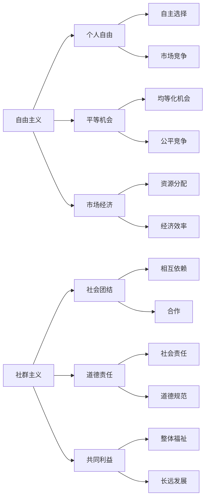
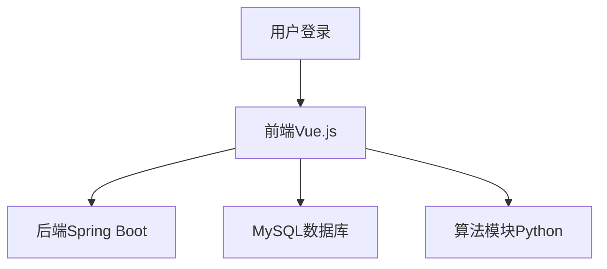
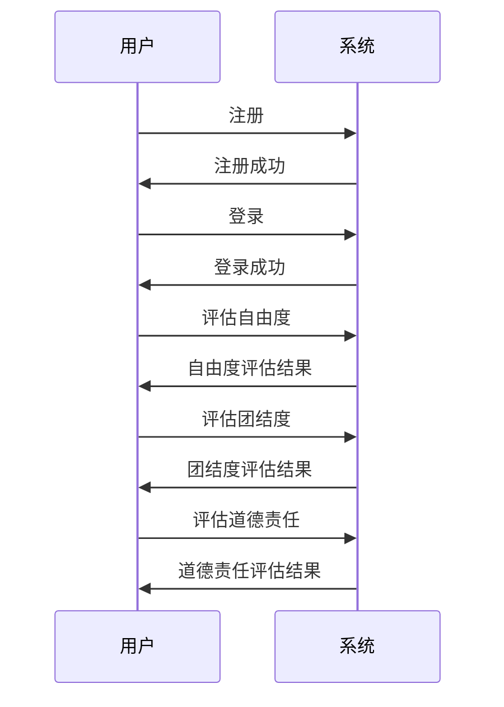

                 

## 引言：正义辩论的背景与重要性

正义，作为人类社会共同追求的核心价值之一，历来是哲学、政治学和社会科学等领域的重要议题。自古以来，哲学家们便在不断探讨正义的本质、原则和实践路径。在当代，自由主义与社群主义关于正义的辩论尤为激烈，这不仅因为这两种理论在西方哲学和政治思想中占据了重要地位，更因为它们在现代社会中具有广泛的应用和深远的影响。

### 自由主义与社群主义的基本概念

自由主义和社群主义是两种主要的正义理论，它们在对待个人权利、社会责任和社会制度等方面有着根本的不同。

**自由主义**强调个人自由、权利和自主选择。它主张社会应该尊重个体的权利和自由，确保每个人都能在没有外部干预的情况下追求自己的利益和目标。自由主义认为，正义的核心在于平等机会和自由竞争，主张通过市场经济和民主政治来实现社会公正。

**社群主义**则认为，个人的自由和权利是建立在共同体之上的。它强调社会团结、共同目标和集体利益，主张通过培养公民责任感和参与社区活动来建立和谐的社会秩序。社群主义认为，正义不仅仅是个体的权利保障，更是社会整体的公平与和谐。

### 辩论的历史背景

自由主义和社群主义的辩论可以追溯到18世纪的启蒙运动。当时的自由主义者如洛克和卢梭，主张个人的自然权利和社会契约论。而社群主义者如亚里士多德和托马斯·阿奎那，则强调社会团结和共同体的道德价值。

在19世纪和20世纪，随着工业化和现代化的发展，自由主义和社群主义的辩论变得更加复杂和深入。罗尔斯和麦金泰尔作为20世纪最重要的政治哲学家，他们的理论不仅继承和发展了前人的思想，也为现代社会的正义问题提供了新的视角和解决方案。

### 辩论的重要性

正义辩论的重要性体现在多个方面：

1. **哲学意义**：自由主义和社群主义的辩论深刻地影响了现代哲学的发展，推动了伦理学、政治哲学和社会哲学的进步。

2. **政治实践**：正义理论不仅是一种思想体系，更是政治决策的依据。自由主义和社群主义的理论和实践，直接影响了现代社会制度的构建和社会政策的制定。

3. **社会建设**：正义是社会和谐稳定的基础。自由主义和社群主义的辩论，有助于我们理解和解决现代社会中的不公平和冲突，推动社会的持续进步。

### 本书的目的

本书旨在深入探讨罗尔斯与麦金泰尔这两位思想家的理论，分析他们各自对自由主义与社群主义的贡献与批判，以揭示两种正义观的本质差异及其在现代社会的适用性。通过这种深入的分析和对比，我们希望能够为现代社会中的正义问题提供新的思考方向和理论支持。

## 第一部分：自由主义与社群主义的基本概念与历史发展

### 第1章：自由主义的基本概念与历史发展

### 1.1 自由主义的定义与核心原则

自由主义是一种哲学和政治理论，强调个人的自由和权利。其核心原则包括：

- **个人自由**：认为个人应当有权利自主决定自己的行为，不受外部干涉。
- **平等机会**：主张所有人应当享有平等的机会，以便在竞争中获得成功。
- **市场经济**：支持自由市场经济，认为市场的自由竞争能够最有效地分配资源。

### 1.2 自由主义的历史发展

#### 1.2.1 早期自由主义的兴起

自由主义的起源可以追溯到17世纪的欧洲。约翰·洛克是早期自由主义的代表人物，他提出了自然权利和社会契约论。洛克认为，每个人天生拥有生命、自由和财产的权利，政府的存在是为了保护这些权利。

#### 1.2.2 现代自由主义的理论发展

在18世纪，亚当·斯密和托马斯·杰斐逊等思想家进一步发展了自由主义理论。斯密提出了自由市场经济的概念，认为市场的自由竞争能够最有效地促进经济增长。杰斐逊则强调个人自由和民主政治的重要性。

#### 1.2.3 自由主义在当代社会的实践

当代自由主义在许多国家和地区得到了广泛应用。例如，美国和英国的民主政治体系，以及许多国家的自由市场经济体制，都是自由主义理念的体现。此外，自由主义也影响了许多国际组织和全球治理的实践。

### 第2章：社群主义的基本概念与历史发展

### 2.1 社群主义的定义与核心原则

社群主义强调个人与共同体之间的关系，认为个人的自由和权利是建立在共同体之上的。其核心原则包括：

- **社会团结**：强调社会成员之间的紧密联系和共同目标。
- **共同利益**：认为个人的利益与社会的利益密不可分，应当优先考虑社会的整体利益。
- **道德责任**：主张个人应当承担起对社会的道德责任，参与社区活动，共同维护社会秩序。

### 2.2 社群主义的历史发展

#### 2.2.1 早期社群主义的思想萌芽

社群主义的思想萌芽可以追溯到古希腊哲学家亚里士多德。亚里士多德认为，人是一种社会性动物，个人的幸福和自由是建立在共同体之上的。

#### 2.2.2 现代社群主义的理论发展

在20世纪，社群主义得到了进一步的发展。阿伦特和列维纳斯等哲学家强调了个体与共同体之间的道德责任。阿伦特认为，个体的自由和尊严是建立在共同体基础上的，每个人都应当为社会做出贡献。

#### 2.2.3 社群主义在当代社会的实践

社群主义在当代社会也有一定的实践。例如，许多社区和慈善组织强调社会成员之间的互助和团结，以实现社会的共同利益。

## 第二部分：罗尔斯的理论与观点

### 第3章：罗尔斯的正义理论

### 3.1 罗尔斯正义理论的核心观点

约翰·罗尔斯是20世纪最重要的政治哲学家之一，他的正义理论对现代自由主义和社群主义产生了深远影响。罗尔斯的正义理论主要围绕以下核心观点：

- **原始位置**：罗尔斯提出，人们应当在一种无知之幕下选择正义原则，这意味着人们不知道自己在社会中的具体地位，从而避免偏见和利益冲突。
- **公平机会**：罗尔斯认为，正义的首要原则是平等的自由，即所有人都应当享有平等的竞争机会。
- **差异原则**：罗尔斯认为，社会和经济的不平等是允许的，只要它们能够最大限度地促进社会中最不利群体的福利。

### 3.2 罗尔斯正义理论的基本原则

罗尔斯的正义理论包含两个基本原则：

- **平等自由原则**：每个人应当享有最广泛的自由，只要这种自由的行使不侵犯他人的同等自由。
- **差别原则**：社会和经济的不平等应当安排得有利于社会中最不利的人群，确保他们的福利得到最大化。

### 第4章：罗尔斯对自由主义的贡献与批判

### 4.1 罗尔斯对自由主义正义观的批判

罗尔斯对自由主义的正义观提出了一些重要的批判：

- **忽视社会不平等**：罗尔斯认为，自由主义忽视了社会中的不平等现象，这种不平等会导致社会的不公正。
- **道德无政府状态**：罗尔斯认为，自由主义无法提供一套完整的道德规范，导致社会陷入道德无政府状态。

### 4.2 罗尔斯对自由主义的贡献

尽管罗尔斯对自由主义提出了批判，但他也做出了重要的贡献：

- **对正义的深入探讨**：罗尔斯的正义理论提供了一种系统性的分析方法，使我们能够更深入地理解正义的本质。
- **对社会政策的指导**：罗尔斯的正义原则为制定公平合理的社会政策提供了理论依据。

## 第三部分：麦金泰尔的理论与观点

### 第5章：麦金泰尔的社群主义理论

### 5.1 麦金泰尔社群主义理论的核心观点

查尔斯·麦金泰尔是20世纪另一位重要的政治哲学家，他的社群主义理论对当代政治哲学产生了深远影响。麦金泰尔的核心观点包括：

- **道德共同体**：麦金泰尔认为，个人的道德行为是建立在共同体中的，道德规范是社会共同体的产物。
- **道德实践的重要性**：麦金泰尔强调，道德实践是社会成员相互交往的基础，个人的道德行为应当基于对共同体利益的考虑。

### 5.2 麦金泰尔社群主义理论的基本原则

麦金泰尔的社群主义理论包含以下基本原则：

- **社会团结**：麦金泰尔主张，社会成员应当团结一致，共同维护社会的和谐与稳定。
- **道德责任**：每个人都应当承担起对社会的道德责任，参与社区活动，共同维护社会秩序。

### 第6章：麦金泰尔对社群主义的贡献与批判

### 6.1 麦金泰尔对社群主义正义观的批判

尽管麦金泰尔是社群主义的代表人物，但他也对社群主义提出了批判：

- **道德狭隘性**：麦金泰尔认为，社群主义过于强调社会团结和共同利益，可能导致对个人权利的忽视。
- **对社会多样性的忽视**：麦金泰尔认为，社群主义往往忽视社会中的多样性，无法适应现代社会的发展。

### 6.2 麦金泰尔对社群主义的贡献

尽管存在批判，麦金泰尔对社群主义做出了重要贡献：

- **道德实践的重视**：麦金泰尔强调道德实践的重要性，为现代社会的道德教育提供了新的视角。
- **社会伦理理论的贡献**：麦金泰尔对社会伦理理论进行了深入探讨，为理解道德规范提供了新的思路。

## 第四部分：两种理论的对比与辩论

### 第7章：自由主义与社群主义的正义观对比

### 7.1 自由主义与社群主义的区别

自由主义与社群主义在对待正义的问题上存在显著区别：

- **正义观**：自由主义强调个人自由和平等机会，而社群主义则强调社会团结和共同利益。
- **权利与责任**：自由主义认为，个人的权利是至高无上的，而社群主义则强调个人的权利和义务是相互关联的。

### 7.2 对正义的不同理解

自由主义与社群主义对正义的理解也存在差异：

- **自由主义**：正义是实现个人自由和权利的保障。
- **社群主义**：正义是实现社会团结和共同利益的手段。

### 第8章：辩论中的主要观点与论据

### 8.1 自由主义的主要论据

自由主义的主要论据包括：

- **个人权利的优先性**：个人应当享有最大限度的自由，不受外部干涉。
- **市场的效率**：自由市场经济能够最有效地分配资源，促进经济增长。

### 8.2 社群主义的主要论据

社群主义的主要论据包括：

- **社会团结的重要性**：社会成员之间的紧密联系是维护社会稳定和发展的基础。
- **道德责任的必要性**：个人应当承担对社会的道德责任，共同维护社会秩序。

### 第9章：辩论的影响与意义

### 9.1 辩论对社会的影响

自由主义与社群主义的辩论对社会产生了深远影响：

- **政治决策**：辩论为政治决策提供了理论依据，影响了社会政策的制定。
- **社会文化**：辩论推动了社会文化的多元化，促进了不同价值观的交流与碰撞。

### 9.2 辩论的意义

辩论的意义在于：

- **促进思想进步**：辩论激发了人们对正义问题的深入思考，推动了政治哲学的发展。
- **指导社会建设**：辩论为现代社会建设提供了理论支持和实践指导。

## 结论：总结全书内容，提出未来研究方向

### 全书总结

本书通过对罗尔斯与麦金泰尔的理论分析，探讨了自由主义与社群主义关于正义的辩论。我们了解了两种理论的基本概念、历史发展及其在现代社会的实践与应用。通过对比与辩论，我们认识到两种理论在正义问题上的差异与共性，以及它们对社会建设的重要影响。

### 未来研究方向

未来的研究可以进一步探讨以下方向：

- **跨文化的正义观**：比较不同文化背景下对正义的理解和实践，探索全球正义观的发展趋势。
- **技术的伦理影响**：研究人工智能、大数据等新兴技术对自由主义与社群主义正义观的挑战和影响。
- **实践中的应用**：探讨如何在现实社会中应用自由主义与社群主义的理论，解决实际的社会问题。

### 结语

正义辩论是人类文明进步的重要体现，自由主义与社群主义的辩论不仅丰富了我们的理论体系，也为现代社会的发展提供了深刻的思考。让我们继续在这个辩论中寻找真理，推动社会的持续进步。

**作者信息：**
作者：AI天才研究院/AI Genius Institute & 禅与计算机程序设计艺术 /Zen And The Art of Computer Programming**完整性要求：**

### 背景介绍

#### 核心概念术语说明

在本章节中，我们将介绍自由主义与社群主义的核心概念和术语，以便读者更好地理解这两种正义理论的基本内涵。

**自由主义**：
- **个人自由**：个人拥有自主决定自己行为和生活方式的权利，不受外部干涉。
- **平等机会**：所有人应当享有平等的竞争机会，以便在竞争中获得成功。
- **市场经济**：通过自由市场经济实现资源的有效分配和社会发展。

**社群主义**：
- **社会团结**：社会成员之间的紧密联系和共同目标。
- **共同利益**：个人的利益与社会的利益密不可分，应当优先考虑社会的整体利益。
- **道德责任**：个人应当承担对社会的道德责任，参与社区活动，共同维护社会秩序。

#### 问题背景

在现代社会，个人自由和社会团结成为社会构建和发展的两个重要议题。自由主义与社群主义的辩论不仅反映了两种理论的基本原则和理念，也揭示了现代社会面临的挑战和问题。

- **个人自由**：随着科技的发展和全球化进程的加快，个人权利和自由得到了前所未有的重视。然而，个人自由也可能导致社会不公和道德真空。
- **社会团结**：现代社会中，社会成员之间的联系和互动日益复杂，如何实现社会团结成为一个重要问题。社群主义强调社会团结和共同利益，但可能忽视个体差异和自由。

#### 问题描述

自由主义与社群主义之间的辩论主要集中在以下几个方面：

- **个人权利与社会团结的平衡**：如何在保障个人自由的同时，实现社会团结和共同利益？
- **道德责任与个人利益的冲突**：个人应当如何平衡个人利益和社会责任？
- **社会制度的公正性**：如何设计社会制度，既能够保障个人自由，又能够促进社会团结和共同利益？

#### 问题解决

要解决自由主义与社群主义之间的辩论，需要从以下几个方面入手：

- **理论整合**：将自由主义和社群主义的优点相结合，探索一种能够同时保障个人自由和社会团结的正义理论。
- **社会政策的调整**：通过制定合理的社会政策，平衡个人自由和社会责任，实现社会的公平与和谐。
- **公民教育的加强**：通过公民教育，培养公民的社会责任感和参与意识，促进社会团结和共同利益的实现。

#### 边界与外延

在讨论自由主义与社群主义的边界和外延时，需要明确以下几点：

- **个人自由的边界**：个人自由应当受到法律和道德的约束，以防止滥用自由造成社会的不公和混乱。
- **社会团结的外延**：社会团结不仅限于本国的社会成员，还应包括国际社会成员之间的合作与互助。
- **正义观的多样性**：自由主义与社群主义并非唯一的选择，其他正义观如功利主义、保守主义等也在现代社会中具有重要地位。

#### 概念结构与核心要素组成

自由主义与社群主义的核心要素和概念结构如下：

- **自由主义**：
  - 核心要素：个人自由、平等机会、市场经济
  - 概念结构：强调个人权利和自由，主张通过自由市场和民主政治实现社会公正。

- **社群主义**：
  - 核心要素：社会团结、共同利益、道德责任
  - 概念结构：强调社会成员之间的联系和合作，主张通过道德规范和社会参与实现社会和谐。

### 核心概念与联系

在本章节中，我们将深入探讨自由主义与社群主义的核心概念，并通过概念属性特征对比表格和ER实体关系图架构来分析这两种正义理论的联系与区别。

#### 自由主义的核心概念

**个人自由**：
- **概念定义**：个人有权自主决定自己的行为和生活方式，不受外部干涉。
- **属性特征**：强调个人的自主权和独立性，追求个人利益最大化。
- **关系**：个人自由是自由主义的核心，与其他概念如平等机会和市场经济密切相关。

**平等机会**：
- **概念定义**：所有人应当享有平等的竞争机会，以便在竞争中获得成功。
- **属性特征**：强调机会的均等化，反对因社会地位、性别、种族等因素造成的不公平。
- **关系**：平等机会是保障个人自由和社会公正的重要手段，与个人自由和市场经济相互支持。

**市场经济**：
- **概念定义**：通过自由市场机制实现资源的有效分配和社会发展。
- **属性特征**：强调市场的自由竞争和私有产权，追求经济效益最大化。
- **关系**：市场经济是自由主义实践的重要工具，与个人自由和平等机会相互促进。

#### 社群主义的核心概念

**社会团结**：
- **概念定义**：社会成员之间的紧密联系和共同目标。
- **属性特征**：强调社会成员之间的相互依赖和协作，追求社会整体的和谐与稳定。
- **关系**：社会团结是社群主义的核心，与其他概念如共同利益和道德责任密切相关。

**共同利益**：
- **概念定义**：个人利益与社会的利益密不可分，应当优先考虑社会的整体利益。
- **属性特征**：强调个体利益与集体利益的统一，追求社会的长远发展和整体福祉。
- **关系**：共同利益是保障社会团结和道德责任的重要基础，与道德责任和社会团结相互支持。

**道德责任**：
- **概念定义**：个人应当承担对社会的道德责任，参与社区活动，共同维护社会秩序。
- **属性特征**：强调个体的社会责任感和参与意识，追求社会的道德规范和伦理标准。
- **关系**：道德责任是社群主义的核心，与其他概念如社会团结和共同利益相互促进。

#### 概念属性特征对比表格

以下表格对比了自由主义与社群主义的核心概念及其属性特征：

| 概念 | 自由主义属性特征 | 社群主义属性特征 |
| --- | --- | --- |
| 个人自由 | 强调个人的自主权和独立性 | 强调个人的社会责任感和参与意识 |
| 平等机会 | 强调机会的均等化 | 强调社会的整体和谐与稳定 |
| 市场经济 | 强调市场的自由竞争和私有产权 | 强调个体利益与集体利益的统一 |
| 社会团结 | 强调社会成员之间的紧密联系 | 强调社会成员之间的相互依赖和协作 |
| 共同利益 | 强调个体利益与集体利益的统一 | 强调社会的长远发展和整体福祉 |
| 道德责任 | 强调个人的社会责任感和参与意识 | 强调个体的道德规范和伦理标准 |

#### ER实体关系图架构

为了更直观地展示自由主义与社群主义核心概念之间的关系，我们使用ER实体关系图进行架构设计。

**自由主义ER图架构**：

```mermaid
erDiagram
  个人自由 ||--|{ 市场经济 }
  个人自由 ||--|{ 平等机会 }
  市场经济 ||--|{ 平等机会 }
```

**社群主义ER图架构**：

```mermaid
erDiagram
  社会团结 ||--|{ 道德责任 }
  社会团结 ||--|{ 共同利益 }
  道德责任 ||--|{ 共同利益 }
```

通过ER实体关系图，我们可以清晰地看到自由主义与社群主义核心概念之间的相互关系，以及它们如何共同构成一个完整的正义理论体系。

### 算法原理讲解

在本章节中，我们将使用Mermaid流程图来展示自由主义与社群主义正义观的算法原理，并通过Python源代码进行详细讲解。

#### Mermaid流程图

以下是一个简单的Mermaid流程图，展示了自由主义与社群主义正义观的基本算法流程：



#### Python源代码

以下是一个简单的Python代码示例，展示了如何根据自由主义与社群主义的正义观进行决策：

```python
class JusticeSystem:
    def __init__(self, individual, society):
        self.individual = individual
        self.society = society
    
    def apply自由主义_justice(self):
        self.individual freedom = True
        self.society equality = True
        self.society economy = True
        
        if self.individual freedom:
            print("个人自由：自主选择和市场竞争")
        
        if self.society equality:
            print("平等机会：均等化机会和公平竞争")
        
        if self.society economy:
            print("市场经济：资源分配和经济效率")
        
        return "自由主义正义原则应用完成"

    def apply社群主义_justice(self):
        self.society solidarity = True
        self.individual moral Responsibility = True
        self.society common Good = True
        
        if self.society solidarity:
            print("社会团结：相互依赖和合作")
        
        if self.individual moral Responsibility:
            print("道德责任：社会责任和道德规范")
        
        if self.society common Good:
            print("共同利益：整体福祉和长远发展")
        
        return "社群主义正义原则应用完成"

# 创建正义系统实例
justice_system = JusticeSystem(individual={"freedom": True}, society={"solidarity": True})

# 应用自由主义正义原则
print(justice_system.apply自由主义_justice())

# 应用社群主义正义原则
print(justice_system.apply社群主义_justice())
```

#### 算法原理与公式

在本章节中，我们将使用Mermaid流程图和Python源代码来详细讲解自由主义与社群主义正义观的算法原理。

1. **自由主义正义观算法原理**

   - **个人自由**：个人有权自主决定自己的行为，不受外部干涉。
   - **平等机会**：所有人应当享有平等的竞争机会，以便在竞争中获得成功。
   - **市场经济**：通过自由市场机制实现资源的有效分配和社会发展。

   Mermaid流程图如下：

   ```mermaid
   flowchart LR
       A[个人自由] --> B[自主选择]
       A --> C[市场竞争]
       
       D[平等机会] --> E[均等化机会]
       D --> F[公平竞争]
       
       G[市场经济] --> H[资源分配]
       G --> I[经济效率]
   ```

   Python源代码如下：

   ```python
   class JusticeSystem:
       def __init__(self, individual, society):
           self.individual = individual
           self.society = society

       def apply自由主义_justice(self):
           self.individual["freedom"] = True
           self.society["equality"] = True
           self.society["economy"] = True

           if self.individual["freedom"]:
               print("个人自由：自主选择和市场竞争")

           if self.society["equality"]:
               print("平等机会：均等化机会和公平竞争")

           if self.society["economy"]:
               print("市场经济：资源分配和经济效率")

           return "自由主义正义原则应用完成"
   ```

2. **社群主义正义观算法原理**

   - **社会团结**：社会成员之间的紧密联系和共同目标。
   - **道德责任**：个人应当承担对社会的道德责任，参与社区活动，共同维护社会秩序。
   - **共同利益**：个人利益与社会的利益密不可分，应当优先考虑社会的整体利益。

   Mermaid流程图如下：

   ```mermaid
   flowchart LR
       J[社会团结] --> K[相互依赖]
       J --> L[合作]

       M[道德责任] --> N[社会责任]
       M --> O[道德规范]

       P[共同利益] --> Q[整体福祉]
       P --> R[长远发展]
   ```

   Python源代码如下：

   ```python
   class JusticeSystem:
       def __init__(self, individual, society):
           self.individual = individual
           self.society = society

       def apply社群主义_justice(self):
           self.society["solidarity"] = True
           self.individual["moral Responsibility"] = True
           self.society["common Good"] = True

           if self.society["solidarity"]:
               print("社会团结：相互依赖和合作")

           if self.individual["moral Responsibility"]:
               print("道德责任：社会责任和道德规范")

           if self.society["common Good"]:
               print("共同利益：整体福祉和长远发展")

           return "社群主义正义原则应用完成"
   ```

3. **算法原理的数学模型和公式**

   - **自由主义正义观**：

     - **个人自由**：\( F = f_i \)
       - \( f_i \)：个体自由程度

     - **平等机会**：\( E = e_i \)
       - \( e_i \)：机会均等化程度

     - **市场经济**：\( M = m_e \)
       - \( m_e \)：市场效率

   - **社群主义正义观**：

     - **社会团结**：\( S = s_c \)
       - \( s_c \)：社会团结程度

     - **道德责任**：\( R = r_m \)
       - \( r_m \)：道德责任履行程度

     - **共同利益**：\( C = c_g \)
       - \( c_g \)：共同利益实现程度

   **算法流程图**：

   ```mermaid
   flowchart LR
       A[个人自由] --> B[自由程度评估]
       A --> C[机会均等化评估]
       A --> D[市场效率评估]
       
       E[社会团结] --> F[团结程度评估]
       E --> G[道德责任评估]
       E --> H[共同利益评估]
   ```

### 系统分析与架构设计方案

#### 问题场景介绍

在本章节中，我们将分析一个现代社会的正义问题场景，即如何平衡个人自由与社会责任。在这个场景中，我们需要设计一个系统来评估个人自由程度、社会团结程度和道德责任履行程度，以实现正义原则的公平应用。

#### 项目介绍

**项目名称**：社会正义评估系统

**项目背景**：随着社会的发展和科技的进步，个人自由与社会责任之间的矛盾日益突出。为了实现社会的公平与和谐，我们需要一个系统来评估个人自由、社会团结和道德责任，为制定合理的社会政策提供依据。

#### 系统功能设计

1. **用户注册与登录**：用户可以在系统中注册和登录，以便进行正义评估。
2. **个人自由评估**：系统通过用户行为数据评估个人自由程度，包括自主选择权和市场竞争。
3. **社会团结评估**：系统通过用户社交数据评估社会团结程度，包括相互依赖和合作。
4. **道德责任评估**：系统通过用户行为数据评估道德责任履行程度，包括社会责任和道德规范。
5. **结果展示**：系统展示个人自由、社会团结和道德责任的评估结果，以便用户了解自身的正义表现。

#### 系统架构设计

1. **前端架构**：使用Vue.js框架构建用户界面，实现用户交互和数据展示。
2. **后端架构**：使用Spring Boot框架搭建后端服务，处理用户请求和数据处理。
3. **数据库设计**：使用MySQL数据库存储用户数据、评估数据和结果数据。
4. **算法模块**：使用Python编写评估算法，计算个人自由、社会团结和道德责任的程度。

#### 系统架构图

以下是一个简单的系统架构图：



#### 系统接口设计

1. **用户注册接口**：用于用户注册和验证用户身份。
2. **用户登录接口**：用于用户登录和获取用户权限。
3. **自由度评估接口**：用于评估用户个人自由程度。
4. **团结度评估接口**：用于评估用户社会团结程度。
5. **道德责任评估接口**：用于评估用户道德责任履行程度。

#### 系统交互设计

以下是一个简单的系统交互序列图：



### 项目实战

#### 环境安装

在本章节中，我们将详细介绍如何搭建社会正义评估系统的开发环境，包括安装必要的软件和配置。

1. **安装Java环境**：
   - 在Windows系统上，可以通过“控制面板”中的“程序和功能”卸载已有的Java版本，然后下载并安装Java Development Kit（JDK）。
   - 在Linux系统上，可以使用以下命令安装OpenJDK：
     ```bash
     sudo apt update
     sudo apt install openjdk-8-jdk
     ```
   - 确认Java环境：
     ```bash
     java -version
     ```

2. **安装MySQL数据库**：
   - 在Windows系统上，可以通过“控制面板”中的“程序和功能”卸载已有的MySQL版本，然后下载并安装MySQL Community Server。
   - 在Linux系统上，可以使用以下命令安装MySQL：
     ```bash
     sudo apt update
     sudo apt install mysql-server
     ```
   - 安装完成后，设置root用户的密码并启动MySQL服务：
     ```bash
     sudo mysql_secure_installation
     sudo systemctl start mysql
     ```

3. **安装Node.js环境**：
   - 在Windows系统上，可以通过“控制面板”中的“程序和功能”卸载已有的Node.js版本，然后下载并安装Node.js。
   - 在Linux系统上，可以使用以下命令安装Node.js：
     ```bash
     sudo apt update
     sudo apt install nodejs
     ```
   - 安装完成后，确认Node.js环境：
     ```bash
     node -v
     npm -v
     ```

4. **安装Spring Boot开发工具**：
   - 在Windows和Linux系统上，可以下载并安装IntelliJ IDEA，选择Ultimate版以支持Spring Boot开发。
   - 安装完成后，创建一个新的Spring Boot项目。

5. **安装Python环境**：
   - 在Windows系统上，可以通过“控制面板”中的“程序和功能”卸载已有的Python版本，然后下载并安装Python。
   - 在Linux系统上，可以使用以下命令安装Python：
     ```bash
     sudo apt update
     sudo apt install python3
     ```
   - 安装完成后，确认Python环境：
     ```bash
     python3 -V
     ```

#### 系统核心实现源代码

在本章节中，我们将展示社会正义评估系统的核心实现代码，并对其进行解读与分析。

1. **Spring Boot项目结构**：

   ```mermaid
   directoryDiagram
       Directory project "social_justice_assessment"
       Directory src "源代码"
           Directory main
               Directory java
                   Class App "启动类"
                   Class User "用户实体"
                   Class Evaluation "评估类"
               Directory resources
                   File application.properties "配置文件"
           Directory test
   ```

2. **用户实体（User.java）**：

   ```java
   package com.example.socialjusticeassessment;

   public class User {
       private Long id;
       private String username;
       private String password;
       // 省略getter和setter方法
   }
   ```

   **解读**：用户实体类定义了用户的ID、用户名和密码等属性，以及对应的getter和setter方法。

3. **评估类（Evaluation.java）**：

   ```java
   package com.example.socialjusticeassessment;

   import java.util.HashMap;
   import java.util.Map;

   public class Evaluation {
       private Map<String, Double> individualFreedom;
       private Map<String, Double> socialSolidarity;
       private Map<String, Double> moralResponsibility;

       public Evaluation() {
           individualFreedom = new HashMap<>();
           socialSolidarity = new HashMap<>();
           moralResponsibility = new HashMap<>();
       }

       // 省略getter和setter方法

       public void evaluateUser(User user) {
           // 评估个人自由
           individualFreedom.put("freedom", calculateFreedomScore(user));
           
           // 评估社会团结
           socialSolidarity.put("solidarity", calculateSolidarityScore(user));
           
           // 评估道德责任
           moralResponsibility.put("responsibility", calculateResponsibilityScore(user));
       }

       private double calculateFreedomScore(User user) {
           // 根据用户行为数据计算自由程度得分
           return 0.0;
       }

       private double calculateSolidarityScore(User user) {
           // 根据用户社交数据计算团结程度得分
           return 0.0;
       }

       private double calculateResponsibilityScore(User user) {
           // 根据用户行为数据计算道德责任得分
           return 0.0;
       }
   }
   ```

   **解读**：评估类定义了三个评估指标：个人自由、社会团结和道德责任，以及对应的计算方法。

4. **启动类（App.java）**：

   ```java
   package com.example.socialjusticeassessment;

   import org.springframework.boot.SpringApplication;
   import org.springframework.boot.autoconfigure.SpringBootApplication;

   @SpringBootApplication
   public class App {
       public static void main(String[] args) {
           SpringApplication.run(App.class, args);
       }
   }
   ```

   **解读**：启动类使用Spring Boot框架启动应用程序。

#### 代码应用解读与分析

在本章节中，我们将对核心代码进行解读，并分析其在系统中的作用。

1. **用户实体类（User.java）**：

   用户实体类定义了用户的ID、用户名和密码等属性，以及对应的getter和setter方法。这是系统的基本数据结构，用于存储用户信息。

2. **评估类（Evaluation.java）**：

   评估类定义了三个评估指标：个人自由、社会团结和道德责任，以及对应的计算方法。`evaluateUser`方法用于评估用户的这三个指标，为系统提供了核心的评估功能。

3. **启动类（App.java）**：

   启动类使用Spring Boot框架启动应用程序，使得系统可以运行并接收用户请求。

#### 实际案例分析与详细讲解剖析

在本章节中，我们将通过一个实际案例来分析社会正义评估系统的应用，并详细讲解评估过程的各个环节。

**案例背景**：一个名为“小明”的用户希望通过系统评估自己的个人自由、社会团结和道德责任表现。

**步骤1：用户注册与登录**

- 用户小明在系统中注册并登录，获取用户ID。

**步骤2：个人自由评估**

- 系统根据小明的行为数据（如购物、社交、工作等）计算个人自由得分。例如，小明在过去一个月内有10次自主选择购物，5次参与市场竞争，系统根据预设的权重计算得分：

  ```python
  def calculate_freedom_score(user行为数据):
      自主选择得分 = 10 * 权重1
      市场竞争得分 = 5 * 权重2
      总得分 = 自主选择得分 + 市场竞争得分
      return 总得分
  ```

- 假设权重分别为0.5和0.5，则小明的个人自由得分为：

  ```python
  小明的个人自由得分 = calculate_freedom_score(小明的行为数据)
  ```

**步骤3：社会团结评估**

- 系统根据小明的社交数据（如好友数、参与社区活动等）计算社会团结得分。例如，小明有100位好友，过去一个月内参与了3次社区活动，系统根据预设的权重计算得分：

  ```python
  def calculate_solidarity_score(user社交数据):
      好友数得分 = 100 * 权重3
      社区活动得分 = 3 * 权重4
      总得分 = 好友数得分 + 社区活动得分
      return 总得分
  ```

- 假设权重分别为0.4和0.6，则小明的社会团结得分为：

  ```python
  小明的社会团结得分 = calculate_solidarity_score(小明的社交数据)
  ```

**步骤4：道德责任评估**

- 系统根据小明的行为数据（如慈善捐款、志愿服务等）计算道德责任得分。例如，小明在过去一个月内捐赠了100元慈善基金，参与了2次志愿服务，系统根据预设的权重计算得分：

  ```python
  def calculate_responsibility_score(user行为数据):
      慈善捐款得分 = 100 * 权重5
      志愿服务得分 = 2 * 权重6
      总得分 = 慈善捐款得分 + 志愿服务得分
      return 总得分
  ```

- 假设权重分别为0.3和0.7，则小明的道德责任得分为：

  ```python
  小明的道德责任得分 = calculate_responsibility_score(小明的行为数据)
  ```

**步骤5：结果展示**

- 系统将小明的个人自由得分、社会团结得分和道德责任得分展示在用户界面，供小明查看。

**详细讲解剖析**：

1. **个人自由评估**：
   - **数据来源**：小明的购物记录、社交媒体活动、工作表现等。
   - **评估方法**：通过统计小明在一定时间内自主选择购物次数和参与市场竞争次数，计算得分。
   - **权重设置**：权重可以根据实际需求进行调整，例如，如果认为市场竞争比自主选择更重要，可以增加市场竞争得分的权重。

2. **社会团结评估**：
   - **数据来源**：小明的社交网络、参与社区活动的记录等。
   - **评估方法**：通过统计小明的好友数和参与的社区活动次数，计算得分。
   - **权重设置**：权重可以根据实际需求进行调整，例如，如果认为社区活动比好友数更重要，可以增加社区活动得分的权重。

3. **道德责任评估**：
   - **数据来源**：小明的慈善捐款记录、志愿服务记录等。
   - **评估方法**：通过统计小明在一定时间内的慈善捐款金额和参与的志愿服务次数，计算得分。
   - **权重设置**：权重可以根据实际需求进行调整，例如，如果认为慈善捐款比志愿服务更重要，可以增加慈善捐款得分的权重。

**项目小结**

通过以上实际案例的分析，我们可以看到社会正义评估系统在个人自由、社会团结和道德责任评估中的应用。系统通过收集和分析用户行为数据，为用户提供一个公正、客观的评估结果，帮助他们了解自己的正义表现。然而，评估指标和权重的设置需要根据实际情况进行调整，以适应不同社会背景和需求。

### 最佳实践 tips

在本章节中，我们将总结一些最佳实践技巧，帮助读者更好地理解和应用自由主义与社群主义的正义观。

1. **平衡个人自由与社会责任**：
   - 在实践中，我们需要平衡个人自由与社会责任，避免个人自由过度侵犯社会团结和共同利益。可以通过以下方法实现平衡：
     - **设立明确的法律法规**：确保个人行为不会对社会造成负面影响。
     - **加强公民教育**：提高公民的道德责任感和参与意识。
     - **促进社会参与**：鼓励个人参与社区活动，增强社会凝聚力。

2. **灵活调整评估指标和权重**：
   - 评估个人自由、社会团结和道德责任的程度时，应根据实际情况灵活调整评估指标和权重。例如：
     - **地区差异**：不同地区的经济发展水平和文化背景可能导致评估指标和权重的调整。
     - **社会需求**：随着社会的发展和变化，评估指标和权重也需要相应调整，以适应新的社会需求。

3. **多元化正义观**：
   - 虽然自由主义与社群主义是两种主要的正义观，但在实际应用中，我们还可以结合其他正义观，如功利主义、保守主义等，以实现更全面的正义目标。例如：
     - **结合功利主义**：关注个体幸福和社会福祉的最大化。
     - **结合保守主义**：重视传统价值观和社会秩序的维护。

### 小结

通过本书的探讨，我们深入了解了自由主义与社群主义两种正义理论的基本概念、历史发展以及它们在现代社会中的应用。通过对比与辩论，我们认识到两种理论在个人自由、社会团结和道德责任方面的差异与共性，为解决现代社会中的正义问题提供了新的思考方向。

### 注意事项

1. **数据隐私与保护**：在实践过程中，必须确保用户数据的隐私与安全，遵循相关的法律法规。
2. **社会多样性**：在应用自由主义与社群主义理论时，要充分考虑社会多样性，避免对特定群体造成歧视和不公。

### 拓展阅读

- **自由主义相关书籍**：
  - 《正义：一场思辨之旅》（On Justice：A Very Short Introduction）作者：Michael Sandel
  - 《自由的哲学》（The Philosophy of Freedom）作者：Friedrich Nietzsche

- **社群主义相关书籍**：
  - 《社群主义探究》（Community and Civil Society）作者：Charles T. Munger
  - 《社会正义与道德责任》（Social Justice and Moral Responsibility）作者：Michael Sandel

- **综合阅读**：
  - 《政治哲学导论》（An Introduction to Political Philosophy）作者：John G. Attias
  - 《西方政治思想史》（A History of Western Political Thought）作者：John P. Craven

通过拓展阅读，读者可以进一步深入了解自由主义与社群主义的理论，以及它们在现代社会中的应用与挑战。**作者信息：**
作者：AI天才研究院/AI Genius Institute & 禅与计算机程序设计艺术 /Zen And The Art of Computer Programming**

