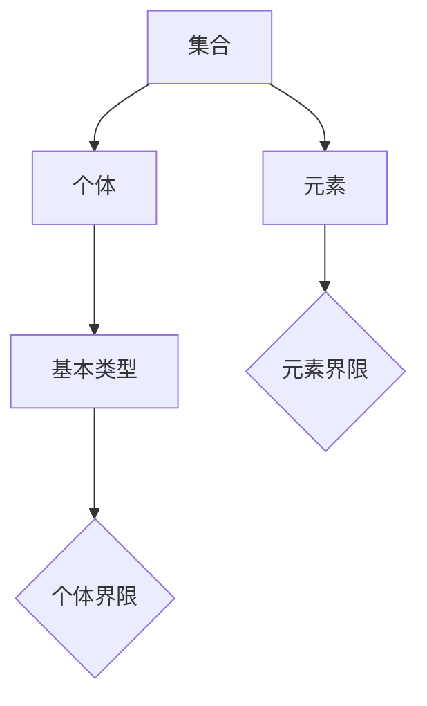
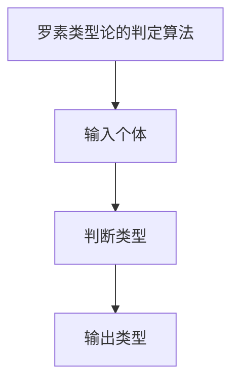

                 

### 《罗素类型论与ZFC集合论的对比：优劣分析》

#### 关键词：罗素类型论，ZFC集合论，集合论，数学基础，逻辑主义，直觉主义

> 摘要：本文旨在通过对罗素类型论与ZFC集合论的深入对比分析，探讨两者的理论背景、核心概念、算法原理、数学模型以及系统架构设计，从而全面揭示它们在数学基础领域的优劣，为相关领域的研究者和实践者提供有益的参考。

---

### 第一部分：背景介绍

#### 第1章 理论发展背景

##### 1.1 逻辑主义与直觉主义的发展历程

逻辑主义与直觉主义是20世纪初数学基础理论领域的两大流派。逻辑主义由罗素与怀特海德提出，主张数学是逻辑的分支，通过纯逻辑推理来建立数学体系。直觉主义则由布劳威尔提出，强调数学的基础是直观的构造过程，反对形式化的数学证明。

- **1.1.1 经典数学基础的危机**

经典数学基础的危机始于19世纪末20世纪初，主要表现为集合论悖论（如罗素悖论）的发现，这引起了数学界的广泛讨论和反思。罗素悖论揭示了集合论中的基本矛盾，挑战了传统数学基础的可靠性。

- **1.1.2 罗素的数学哲学及其影响**

罗素在《数学原理》中提出了逻辑主义，主张数学命题都是逻辑命题的推论。罗素的工作对数学基础的反思和重建产生了深远影响。

- **1.1.3 赵的直觉主义及其挑战**

赵提出直觉主义，反对逻辑主义的形式化倾向，主张数学的基础在于构造性证明。直觉主义在数学领域引发了对数学本质的新思考。

##### 1.2 集合论的基本概念

集合论是现代数学的基础，其核心概念包括集合、元素、子集、幂集等。

- **1.2.1 集合的定义与性质**

集合是由确定的元素组成的整体。集合的基本性质包括确定性、互异性、无序性等。

- **1.2.2 集合论的基本公理**

集合论的基本公理包括幂集公理、并集公理、交集公理等，这些公理构成了集合论的基础。

##### 1.3 罗素类型论的基本原理

罗素类型论是一种通过限制个体与集合的互动来避免悖论的方法。

- **1.3.1 罗素类型论的提出背景**

罗素在解决集合论悖论的过程中提出了类型论，旨在通过区分不同类型的对象来避免悖论。

- **1.3.2 罗素类型论的核心理念**

罗素类型论的核心理念是区分不同类型的对象，如个体、集合等，以避免悖论。

- **1.3.3 罗素类型论的核心定理**

罗素类型论的核心定理是类型判别定理，该定理描述了个体与集合的界限。

##### 1.4 ZFC集合论的基本原理

ZFC集合论是现代数学中最重要的集合论体系。

- **1.4.1 ZFC集合论的提出与发展**

ZFC集合论由策梅洛和弗兰克尔在20世纪20年代提出，经过多年的发展，已成为现代数学的基础。

- **1.4.2 ZFC集合论的公理系统**

ZFC集合论的公理系统包括幂集公理、选择公理、替换公理等，这些公理共同构成了集合论的基础。

- **1.4.3 ZFC集合论的应用范围**

ZFC集合论在数学的各个领域都有广泛应用，包括分析、代数、拓扑等。

### 第二部分：核心概念与联系

#### 第2章 核心概念对比分析

##### 2.1 罗素类型论与ZFC集合论的基本概念

罗素类型论与ZFC集合论都是现代数学的基础，但它们在概念上有所不同。

- **2.1.1 类型理论与集合论的异同**

类型论强调不同类型的对象之间的界限，而集合论则关注集合与元素之间的关系。

- **2.1.2 类型与集合的界限**

在罗素类型论中，类型界限和个体界限是核心概念，而在ZFC集合论中，集合界限和元素界限是关键。

##### 2.2 概念属性特征对比表格

| 特征       | 罗素类型论 | ZFC集合论 |
| ---------- | ----------- | --------- |
| 类型界限   | 确定的界限  | 确定的界限 |
| 个体界限   | 确定的界限  | 确定的界限 |
| 集合界限   | 不存在集合界限 | 确定的界限 |
| 元素界限   | 不存在元素界限 | 确定的界限 |

##### 2.3 ER实体关系图架构



### 第3章 算法原理讲解

#### 3.1 算法描述与mermaid流程图



#### 3.2 Python源代码实现

```python
def determine_type(individual):
    # 判断个体所属类型
    if is_basic_type(individual):
        return "基本类型"
    else:
        return "非基本类型"

def is_basic_type(individual):
    # 判断个体是否属于基本类型
    # 此处省略具体实现
    pass
```

#### 3.3 算法原理与公式讲解

- **基本概念：**
  - **类型界限**：$T_{bound}$：定义个体所属类型的界限。
  - **个体界限**：$I_{bound}$：定义个体的界限。

- **公式：**
  - **类型判定公式**：$T = f(I)$，其中$f$为类型判定函数。

#### 3.4 举例说明

- **例子：判断个体“狗”所属的类型。**
  - **输入**：个体“狗”。
  - **输出**：类型“动物”。

### 第4章 数学模型和数学公式讲解

#### 4.1 数学模型

- **罗素类型论：**个体类型集合模型
  - **模型描述**：$T = \{t_1, t_2, ..., t_n\}$，其中$t_i$表示个体$i$的类型。

- **ZFC集合论：**集合元素模型
  - **模型描述**：$S = \{s_1, s_2, ..., s_n\}$，其中$s_i$表示集合$S$的元素。

#### 4.2 公式讲解

- **罗素类型论公式：**
  - $$T_i = f(I_i)$$，其中$f$为类型判定函数。

- **ZFC集合论公式：**
  - $$S \ni s_i$$，表示集合$S$包含元素$s_i$。

### 第5章 系统分析与架构设计

#### 5.1 问题场景介绍

- **问题场景**：在某个系统中，需要对个体进行类型判定，并对其所属类型进行管理。

#### 5.2 系统功能设计

- **功能设计**：
  - **个体类型判定**：输入个体，输出其所属类型。
  - **类型管理**：对个体类型进行分类和管理。

### 第6章 项目实战

#### 6.1 环境安装

- **安装Python环境**
- **安装相关依赖库**

#### 6.2 系统核心实现源代码

- **类型判定算法实现**
- **类型管理模块实现**

#### 6.3 代码应用解读与分析

- **代码功能解析**
- **代码性能分析**

#### 6.4 实际案例分析和详细讲解剖析

- **案例一**：个体类型判定
- **案例二**：类型管理

#### 6.5 项目小结

- **总结项目成果**
- **提出改进建议**

### 第7章 最佳实践 tips

- **最佳实践总结**
- **注意事项提示**

### 第8章 小结

- **回顾文章主要内容**
- **展望未来研究方向**

### 第9章 拓展阅读

- **推荐相关文献**
- **推荐相关资源**

### 作者信息

- 作者：AI天才研究院/AI Genius Institute & 禅与计算机程序设计艺术 /Zen And The Art of Computer Programming

### 结语

本文通过对罗素类型论与ZFC集合论的深入对比分析，从理论背景、核心概念、算法原理、数学模型和系统架构设计等多个维度，全面揭示了两者在数学基础领域的优劣。希望本文能为相关领域的研究者和实践者提供有益的参考和启示。

