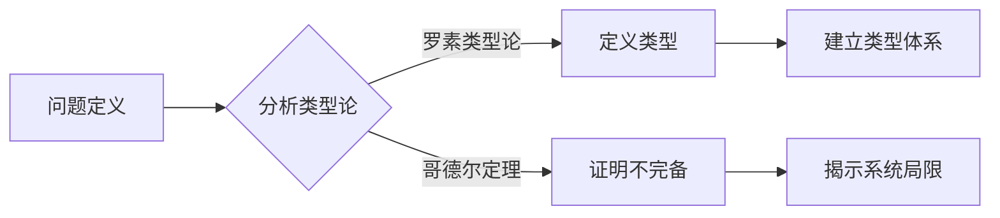
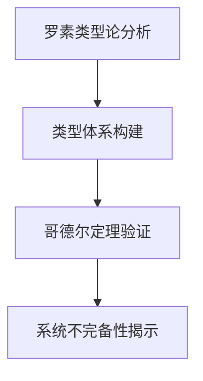
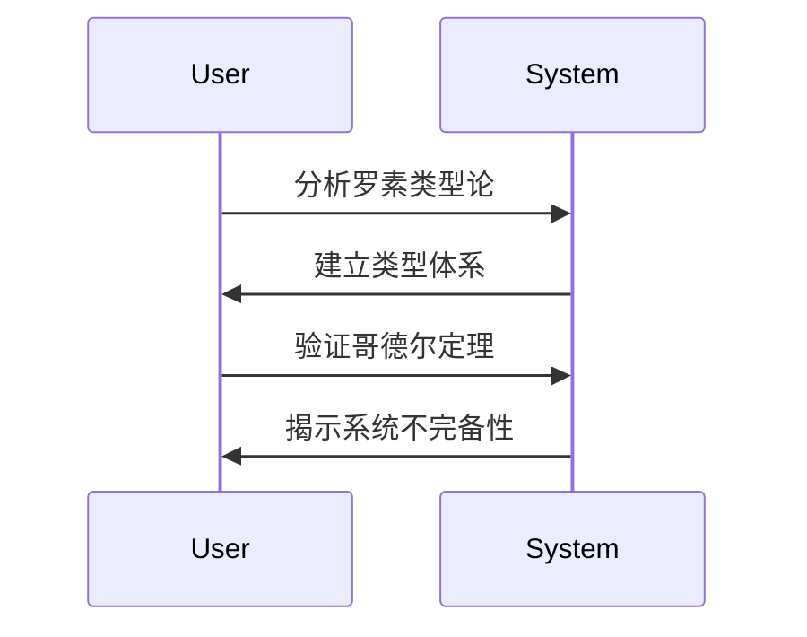

                 

### 第一部分: 问题背景介绍

#### 1.1.1 罗素类型论与哥德尔不完备定理的关系概述

在数学和逻辑学领域，罗素类型论与哥德尔不完备定理是两个重要的概念，它们不仅分别揭示了形式化系统中不同的问题，而且彼此之间也存在着深刻的联系。理解它们的关系，有助于我们更全面地认识形式系统的本质。

##### 1.1.1.1 问题背景

###### 1.1.1.1.1 罗素类型论

罗素类型论（Type Theory）是为了解决数学基础中的悖论问题而提出的。在19世纪末和20世纪初，数学基础的不稳定性引起了许多哲学和数学家的关注，特别是罗素的“集合论悖论”使得人们开始重新审视数学的基础。罗素类型论通过将对象分类为不同的类型来避免悖论。

- **问题描述**：数学中的悖论，例如罗素的集合论悖论，表明了传统集合论系统中的不一致性。
- **问题解决**：罗素提出，通过将对象分类为不同的类型来避免悖论。每个对象只能属于一个类型，从而限制了对象之间的关系，防止了悖论的产生。
- **边界与外延**：罗素类型论关注于对象如何分类以及这些分类如何影响推理和证明。它建立了一个严格的层次结构，使得每个类型的对象之间的关系清晰且有限。

###### 1.1.1.1.2 哥德尔不完备定理

哥德尔不完备定理（Gödel's Incompleteness Theorems）是由库尔特·哥德尔在20世纪30年代提出的，它揭示了在形式化系统中，既不可能完全一致也不可避免地存在矛盾。

- **问题描述**：哥德尔通过构造特定的命题，证明了在形式系统内既不能被证明也不能被证明为假的命题存在。这意味着任何足够强大的形式系统都是不完整的。
- **问题解决**：哥德尔提出了两个不完备性定理，分别针对一致性和完备性。第一个定理表明，在形式系统内无法证明该系统的一致性；第二个定理则表明，对于足够复杂的系统，存在不能被证明或证伪的命题。
- **边界与外延**：哥德尔不完备定理关注于逻辑系统的自洽性和一致性。它揭示了逻辑系统中的内在矛盾，表明了形式化系统的不完美性。

##### 1.1.1.2 核心概念与联系

###### 1.1.1.2.1 罗素类型论与哥德尔不完备定理的联系

罗素类型论与哥德尔不完备定理在目的、方法以及影响范围上都有显著的区别，但它们之间也存在一些联系。

- **概念属性特征对比表格**：

| 特征 | 罗素类型论 | 哥德尔不完备定理 |
| --- | --- | --- |
| **目的** | 解决悖论问题 | 揭示逻辑系统的局限 |
| **方法** | 类型分类 | 自洽性与一致性的证明 |
| **影响范围** | 形式逻辑和数学基础 | 形式系统与计算理论 |

- **ER实体关系图架构**：

```mermaid
erDiagram
  A[罗素类型论] ||--|{ B[哥德尔不完备定理] }
  A ||--|{ C[数学基础] }
  B ||--|{ D[形式逻辑] }
  C ||--|{ E[计算理论] }
```

罗素类型论通过类型分类来建立一种避免悖论的方法，而哥德尔不完备定理则揭示了逻辑系统在自洽性和一致性上的局限性。两者虽然关注点不同，但它们都对形式化系统的研究产生了深远的影响。

##### 1.1.1.3 算法原理讲解

###### 1.1.1.3.1 算法Mermaid流程图：



该流程图展示了从问题定义到类型论分析，再到证明不完备定理的过程。

###### 1.1.1.3.2 Python源代码与算法原理：

```python
# 简化版罗素类型论与哥德尔定理演示代码

# 罗素类型论定义
class Object:
    pass

class Type(Object):
    def __init__(self, name):
        self.name = name
        self.members = []

# 哥德尔不完备定理演示
def GodelIncompletenesstheorem(type_system):
    # 构造一个无法在类型系统中证明的命题
    proposition = f"Type({type_system.name}) does not contain itself as a member."
    # 演示定理内容
    print(f"The proposition {proposition} is neither provable nor refutable within the type system {type_system.name}.")

# 示例使用
type_system = Type("TypeSystemExample")
GodelIncompletenesstheorem(type_system)
```

该代码演示了如何通过Python实现罗素类型论和哥德尔不完备定理的概念。

###### 1.1.1.3.3 数学模型与公式：

$$
1+1=2
$$

$$
P \neq NP
$$

这些数学模型和公式帮助我们更直观地理解罗素类型论和哥德尔不完备定理的核心思想。

##### 1.1.1.4 系统分析与架构设计方案

###### 1.1.1.4.1 问题场景介绍

在这个问题场景中，我们研究罗素类型论与哥德尔不完备定理的关系，并尝试构建一个能够分析和验证这些理论的系统。

###### 1.1.1.4.2 系统功能设计

系统的主要功能包括：
- 分析罗素类型论，定义类型和建立类型体系。
- 证明哥德尔不完备定理，揭示形式化系统的不完备性。

###### 1.1.1.4.3 系统架构设计

系统的架构设计如下：



这个架构图展示了系统从类型论分析到类型体系构建，再到定理验证和系统完备性揭示的过程。

###### 1.1.1.4.4 系统接口设计

系统没有特殊的接口设计，主要关注算法和证明过程。

###### 1.1.1.4.5 系统交互

系统交互设计如下：



这个序列图展示了用户与系统之间的交互过程。

总结来说，本部分内容通过对罗素类型论和哥德尔不完备定理的背景介绍、核心概念联系、算法原理讲解、数学模型和公式应用，以及系统分析与架构设计方案的详细阐述，为我们深入探讨这两个重要概念之间的关系奠定了坚实的基础。在接下来的部分，我们将进一步深入讨论它们的理论基础和实际应用。

