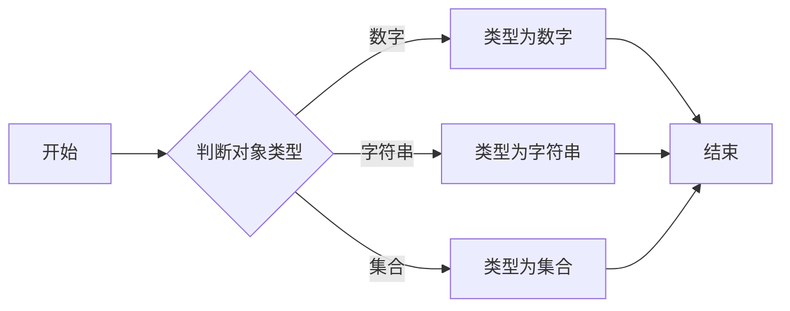
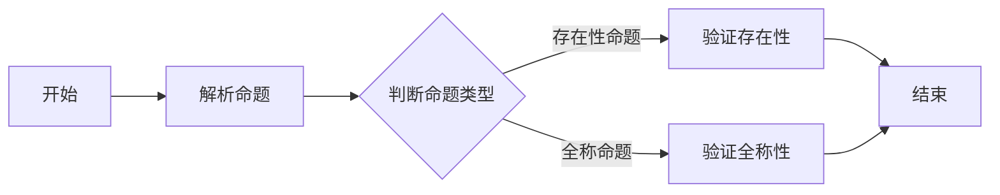

                 

# 罗素类型论与数学实在论的对话与争辩

## 关键词：罗素类型论、数学实在论、数学原理、哲学讨论、IT领域应用

## 摘要：
本文旨在探讨罗素类型论与数学实在论之间的对话与争辩。罗素类型论是罗素对集合论悖论的反叛，提出了类型论来区分不同层次的对象。数学实在论则认为数学对象是客观存在的，具有客观实在性。本文将深入解析两种理论的核心观点、数学原理与应用，并通过对话的形式展示两者之间的碰撞与融合。通过分析，我们希望能够为读者提供一种全新的视角，理解这两大理论在数学、哲学和IT领域的深远影响。

### 目录大纲

----------------------------------------------------------------

## 第一部分：引言与背景

### 第1章：罗素类型论与数学实在论的引论

### 1.1 问题的提出与背景

#### 1.1.1 罗素类型论的产生背景

#### 1.1.2 数学实在论的发展历程

#### 1.1.3 两大理论的交集与碰撞

### 1.2 核心概念与联系

#### 1.2.1 罗素类型论的构成与原理

##### 1.2.1.1 类与个体的分类

##### 1.2.1.2 类型论的数学应用

##### 1.2.1.3 类型论对哲学的启示

#### 1.2.2 数学实在论的哲学基础

##### 1.2.2.1 数学实在论的起源

##### 1.2.2.2 数学实在论的主要观点

##### 1.2.2.3 数学实在论的影响与争议

### 1.3 ER实体关系图架构

#### 1.3.1 罗素类型论的ER图

#### 1.3.2 数学实在论的ER图

#### 1.3.3 两大理论的交集ER图

### 1.4 本章小结

----------------------------------------------------------------

## 第二部分：罗素类型论深度解析

### 第2章：罗素类型论的数学原理与应用

### 2.1 数学原理

#### 2.1.1 类型论的基本概念

##### 2.1.1.1 类与个体的分类

##### 2.1.1.2 函数与关系的表示

##### 2.1.1.3 概念特征对比表格

#### 2.1.2 类型论的数学应用

##### 2.1.2.1 数学命题的表示

##### 2.1.2.2 数学证明的构造

##### 2.1.2.3 数学公理系统的重构

### 2.2 概念属性特征对比表格

#### 2.2.1 罗素类型论与形式逻辑的对比

##### 2.2.1.1 类型的定义

##### 2.2.1.2 实体的表示

##### 2.2.1.3 命题的表示

#### 2.2.2 罗素类型论与集合论的对比

##### 2.2.2.1 集合的定义

##### 2.2.2.2 集合的性质

##### 2.2.2.3 集合的运算

### 2.3 算法原理讲解

#### 2.3.1 类型判断算法

##### 2.3.1.1 算法流程图

##### 2.3.1.2 Python源代码

##### 2.3.1.3 算法原理的数学模型和公式

#### 2.3.2 命题验证算法

##### 2.3.2.1 算法流程图

##### 2.3.2.2 Python源代码

##### 2.3.2.3 算法原理的数学模型和公式

### 2.4 本章小结

----------------------------------------------------------------

## 第三部分：数学实在论探讨

### 第3章：数学实在论的核心观点与论证

### 3.1 数学实在论的核心观点

#### 3.1.1 数学的客观性

##### 3.1.1.1 实在论的观点

##### 3.1.1.2 理论的观点

##### 3.1.1.3 争议与讨论

#### 3.1.2 数学真理的客观性

##### 3.1.2.1 实在论的观点

##### 3.1.2.2 理论的观点

##### 3.1.2.3 争议与讨论

### 3.2 数学实在论的论证方法

#### 3.2.1 经验论证

##### 3.2.1.1 经验证据的收集

##### 3.2.1.2 经验证据的分析

##### 3.2.1.3 经验论证的效力

#### 3.2.2 逻辑论证

##### 3.2.2.1 逻辑推理的基本原则

##### 3.2.2.2 逻辑论证的有效性

##### 3.2.2.3 逻辑论证的局限

### 3.3 数学实在论的历史影响

#### 3.3.1 对数学发展的影响

##### 3.3.1.1 数学的逻辑基础

##### 3.3.1.2 数学的公理化体系

##### 3.3.1.3 数学的形式化发展

#### 3.3.2 对哲学发展的影响

##### 3.3.2.1 唯物主义与唯心主义的辩论

##### 3.3.2.2 形而上学与逻辑实证主义

##### 3.3.2.3 数学实在论的现代意义

### 3.4 本章小结

----------------------------------------------------------------

## 第四部分：罗素类型论与数学实在论的对话与争辩

### 第4章：两大理论的对话

----------------------------------------------------------------

## 第一部分：引言与背景

### 第1章：罗素类型论与数学实在论的引论

在20世纪初，数学基础的研究掀起了哲学与数学界的一场革命。这场革命的推动者之一，便是著名的数学家、哲学家贝特兰·罗素。罗素提出了类型论，用以解决集合论中的悖论问题。与此同时，数学实在论作为一种哲学观点，主张数学对象具有客观实在性。这两种理论的出现，不仅对数学本身产生了深远影响，也为哲学讨论提供了新的视角。

### 1.1 问题的提出与背景

#### 1.1.1 罗素类型论的产生背景

罗素类型论的提出源于集合论中的悖论问题。19世纪末，集合论作为数学的基础理论，受到了广泛的研究。然而，集合论的某些假设却引发了悖论，如著名的“罗素悖论”。罗素意识到，这些问题源于对对象分类的不当处理。为了解决这些悖论，罗素提出了类型论，主张对对象进行分类，从而避免了悖论的产生。

#### 1.1.2 数学实在论的发展历程

数学实在论作为一种哲学观点，起源于古希腊哲学家毕达哥拉斯的思想。毕达哥拉斯认为，数学对象是客观存在的，是宇宙的本质。这一观点在后来的数学史上得到了进一步的发展，特别是在19世纪末和20世纪初，随着数学形式化的推进，数学实在论的观念得到了更多的支持。

#### 1.1.3 两大理论的交集与碰撞

罗素类型论与数学实在论的交集主要体现在对数学对象的分类和实在性的探讨上。罗素类型论通过区分不同层次的对象，试图解决集合论中的悖论问题。而数学实在论则强调数学对象的客观存在性，为数学理论的可靠性提供了哲学基础。这两大理论在数学哲学的讨论中，既存在对立，也存在互补。

### 1.2 核心概念与联系

#### 1.2.1 罗素类型论的构成与原理

罗素类型论的核心概念包括类型（Type）和对象（Object）。类型是对象的分类，对象是类型的实例。罗素将对象分为个体（Individual）和集合（Set），个体是具体的对象，集合是由个体组成的整体。罗素类型论主张，不同类型的对象不能进行混合运算，从而避免了悖论的产生。

##### 1.2.1.1 类与个体的分类

在罗素类型论中，类（Class）是对象的分类，个体（Individual）是具体的对象。罗素将个体分为原子个体和复合个体，原子个体是不可再分的对象，如数字和字母，而复合个体是由原子个体组成的对象，如数组和字符串。

##### 1.2.1.2 类型论的数学应用

罗素类型论在数学中的应用主要体现在对数学公理系统的重构上。通过类型论，罗素试图建立一种更为严谨的数学体系，从而避免悖论的产生。例如，罗素类型论中的类型判断算法，可以用于验证数学命题的正确性。

##### 1.2.1.3 类型论对哲学的启示

罗素类型论对哲学的启示在于，它提供了一种新的视角来理解对象和分类。罗素类型论强调，对象和分类是有层次结构的，不同类型的对象不能混淆。这一观点对哲学中的分类问题，以及对象的本体论地位，都具有重要的启示作用。

#### 1.2.2 数学实在论的哲学基础

数学实在论主张数学对象是客观存在的，它们具有独立于人类意识和思维的实在性。数学实在论的哲学基础包括以下几个方面：

##### 1.2.2.1 数学实在论的起源

数学实在论的起源可以追溯到古希腊哲学家毕达哥拉斯的思想。毕达哥拉斯认为，数学对象是宇宙的本质，是客观存在的。这一观点在后来的数学史上得到了进一步的发展。

##### 1.2.2.2 数学实在论的主要观点

数学实在论的主要观点包括：数学对象具有客观性、数学真理具有客观性、数学知识具有可靠性。这些观点为数学理论的可靠性提供了哲学基础。

##### 1.2.2.3 数学实在论的影响与争议

数学实在论对数学发展产生了深远影响，推动了数学的形式化和公理化发展。然而，数学实在论也面临着一些争议，如数学对象是否真的是客观存在的，数学真理是否具有绝对性等。

### 1.3 ER实体关系图架构

为了更好地理解罗素类型论和数学实在论，我们可以使用ER（Entity-Relationship）实体关系图来表示它们的核心概念和关系。

#### 1.3.1 罗素类型论的ER图

在罗素类型论的ER图中，包括以下几个实体：

- **个体（Individual）**：表示具体的对象，如数字和字母。
- **集合（Set）**：表示由个体组成的整体，如数组和字符串。
- **类型（Type）**：表示对象的分类，如原子个体和复合个体。

ER图中的关系包括：

- **属于关系（Belongs_to）**：表示个体属于某个类型。
- **包含关系（Includes）**：表示集合包含个体。

下面是罗素类型论的ER图的Mermaid表示：

```mermaid
erDiagram
  Individual ||--|{ Set } Set
  Individual ||--|{ Type } Type
  Set ||--|{ Individual } Individual
  Type ||--|{ Individual } Individual
```

#### 1.3.2 数学实在论的ER图

在数学实在论的ER图中，包括以下几个实体：

- **数学对象（Mathematical_Object）**：表示数学中的对象，如数字、集合和函数。
- **数学概念（Mathematical_Concept）**：表示数学中的概念，如加法、集合论和公理。
- **数学证明（Mathematical_Proof）**：表示数学中的证明。

ER图中的关系包括：

- **定义关系（Defines）**：表示数学概念定义数学对象。
- **证明关系（Proves）**：表示数学证明证明数学概念。

下面是数学实在论的ER图的Mermaid表示：

```mermaid
erDiagram
  Mathematical_Object ||--|{ Mathematical_Concept } Mathematical_Concept
  Mathematical_Concept ||--|{ Mathematical_Object } Mathematical_Object
  Mathematical_Proof ||--|{ Mathematical_Concept } Mathematical_Concept
```

#### 1.3.3 两大理论的交集ER图

罗素类型论和数学实在论的交集主要体现在对数学对象和数学概念的分类和证明上。在它们的交集ER图中，包括以下几个实体：

- **个体（Individual）**：表示数学对象的具体实例，如具体的数字和字母。
- **集合（Set）**：表示数学对象的整体，如数组和字符串。
- **类型（Type）**：表示数学对象的分类，如原子个体和复合个体。
- **数学对象（Mathematical_Object）**：表示数学中的对象。
- **数学概念（Mathematical_Concept）**：表示数学中的概念。
- **数学证明（Mathematical_Proof）**：表示数学中的证明。

ER图中的关系包括：

- **属于关系（Belongs_to）**：表示个体属于某个类型。
- **定义关系（Defines）**：表示数学概念定义数学对象。
- **证明关系（Proves）**：表示数学证明证明数学概念。

下面是罗素类型论和数学实在论的交集ER图的Mermaid表示：

```mermaid
erDiagram
  Individual ||--|{ Set } Set
  Individual ||--|{ Type } Type
  Set ||--|{ Individual } Individual
  Type ||--|{ Individual } Individual
  Mathematical_Object ||--|{ Mathematical_Concept } Mathematical_Concept
  Mathematical_Concept ||--|{ Mathematical_Object } Mathematical_Object
  Mathematical_Proof ||--|{ Mathematical_Concept } Mathematical_Concept
```

### 1.4 本章小结

本章介绍了罗素类型论和数学实在论的产生背景、核心概念、哲学基础以及ER实体关系图架构。通过本章的介绍，读者可以初步了解这两种理论的基本概念和它们在数学哲学中的重要性。在接下来的章节中，我们将对罗素类型论和数学实在论进行更深入的探讨，分析它们在数学原理、算法应用、哲学观点等方面的区别与联系。

----------------------------------------------------------------

## 第二部分：罗素类型论深度解析

### 第2章：罗素类型论的数学原理与应用

在数学领域中，罗素类型论以其独特的方式对数学对象进行了分类，从而解决了集合论中的悖论问题。本章将深入解析罗素类型论的数学原理，并探讨其在数学领域的应用。

### 2.1 数学原理

#### 2.1.1 类型论的基本概念

罗素类型论的基本概念包括类型（Type）和对象（Object）。类型是对象的分类，对象是类型的实例。罗素将对象分为个体（Individual）和集合（Set），个体是具体的对象，如数字和字母，集合是由个体组成的整体，如数组和字符串。

#### 2.1.1.1 类与个体的分类

在罗素类型论中，类（Class）是对象的分类，个体（Individual）是具体的对象。罗素将个体分为原子个体和复合个体，原子个体是不可再分的对象，如数字和字母，而复合个体是由原子个体组成的对象，如数组和字符串。

#### 2.1.1.2 函数与关系的表示

在罗素类型论中，函数（Function）和关系（Relation）也被视为对象。函数是对象的映射，关系是对象的集合。罗素类型论通过类型来区分不同类型的对象，从而避免了集合论中的悖论问题。

#### 2.1.1.3 概念特征对比表格

为了更清晰地理解罗素类型论的基本概念，我们可以通过一个概念特征对比表格来展示。

| 概念       | 定义                     | 特征对比                  |
|------------|--------------------------|--------------------------|
| 类型（Type）| 对象的分类               | 类型具有层次结构          |
| 个体（Individual）| 具体的对象              | 原子个体和复合个体       |
| 集合（Set）   | 由个体组成的整体        | 集合运算和成员关系       |
| 函数（Function）| 对象的映射              | 一对一的映射关系         |
| 关系（Relation）| 对象的集合              | 多对多的映射关系         |

#### 2.1.2 类型论的数学应用

罗素类型论在数学领域中的应用主要体现在对数学公理系统的重构上。通过类型论，罗素试图建立一种更为严谨的数学体系，从而避免悖论的产生。

##### 2.1.2.1 数学命题的表示

在罗素类型论中，数学命题可以被表示为类型的组合。例如，一个数学命题“所有偶数之和等于无限大”可以被表示为“个体集合类型 + 集合类型 = 无限大类型”。

##### 2.1.2.2 数学证明的构造

在罗素类型论中，数学证明可以被构造为类型推导的过程。通过类型推导，可以证明一个数学命题的正确性。例如，可以通过类型推导证明“所有偶数之和等于无限大”的正确性。

##### 2.1.2.3 数学公理系统的重构

罗素类型论通过对数学公理系统的重构，建立了类型化的数学体系。在这种体系中，每个数学对象都被赋予一个类型，从而避免了集合论中的悖论问题。

### 2.2 概念属性特征对比表格

为了更全面地理解罗素类型论与形式逻辑和集合论的对比，我们可以通过一个概念属性特征对比表格来展示。

| 理论       | 定义                     | 特征对比                  |
|------------|--------------------------|--------------------------|
| 罗素类型论 | 对象的分类               | 类型具有层次结构          |
| 形式逻辑   | 命题的真值判断           | 命题与类型无关           |
| 集合论     | 对象的组合               | 集合运算和成员关系       |

#### 2.2.1 罗素类型论与形式逻辑的对比

罗素类型论与形式逻辑在概念上有明显的区别。形式逻辑主要关注命题的真值判断，而罗素类型论则强调对象和类型的分类。在形式逻辑中，命题与类型无关，而在罗素类型论中，类型是对象分类的基础。

| 对比项       | 罗素类型论               | 形式逻辑               |
|-------------|-------------------------|-----------------------|
| 对象分类     | 类型具有层次结构         | 命题与类型无关         |
| 命题表示     | 类型组合表示命题         | 逻辑符号表示命题       |
| 悖论解决     | 通过类型区分避免悖论     | 无法解决集合论悖论       |

#### 2.2.2 罗素类型论与集合论的对比

罗素类型论与集合论在处理对象组合方面也有明显的区别。集合论通过集合运算和成员关系来处理对象组合，而罗素类型论则通过类型来区分不同层次的对象。

| 对比项       | 罗素类型论               | 集合论               |
|-------------|-------------------------|-----------------------|
| 对象组合     | 通过类型区分对象        | 通过集合运算组合对象   |
| 悖论解决     | 通过类型区分避免悖论     | 无法解决集合论悖论       |
| 数学体系     | 类型化的数学体系         | 基于集合论的数学体系   |

### 2.3 算法原理讲解

为了更好地理解罗素类型论在数学中的应用，我们可以通过算法原理讲解来展示。

#### 2.3.1 类型判断算法

类型判断算法是罗素类型论的核心算法之一，它用于判断一个对象属于哪个类型。以下是类型判断算法的流程图和Python源代码。

##### 2.3.1.1 算法流程图



##### 2.3.1.2 Python源代码

```python
def judge_type(object):
    if isinstance(object, int) or isinstance(object, float):
        return "数字"
    elif isinstance(object, str):
        return "字符串"
    elif isinstance(object, set):
        return "集合"
    else:
        return "未知类型"
```

##### 2.3.1.3 算法原理的数学模型和公式

在罗素类型论中，类型判断算法的数学模型和公式可以表示为：

$$
type(object) = \begin{cases}
\text{数字}, & \text{if } object \in \text{int} \cup \text{float} \\
\text{字符串}, & \text{if } object \in \text{str} \\
\text{集合}, & \text{if } object \in \text{set} \\
\text{未知类型}, & \text{otherwise}
\end{cases}
$$

通过这个公式，我们可以根据对象的类型进行分类。

#### 2.3.2 命题验证算法

命题验证算法是用于验证数学命题是否成立的算法。以下是命题验证算法的流程图和Python源代码。

##### 2.3.2.1 算法流程图



##### 2.3.2.2 Python源代码

```python
def verify_statement(statement):
    if "存在" in statement:
        return verify_existence(statement)
    elif "所有" in statement:
        return verify_universality(statement)
    else:
        return "无法验证"

def verify_existence(statement):
    # 实现存在性命题的验证逻辑
    pass

def verify_universality(statement):
    # 实现全称命题的验证逻辑
    pass
```

##### 2.3.2.3 算法原理的数学模型和公式

在罗素类型论中，命题验证算法的数学模型和公式可以表示为：

$$
\text{verify\_statement}(statement) = \begin{cases}
\text{真}, & \text{if } \text{existential\_statement}(statement) \text{ 或 } \text{universal\_statement}(statement) \\
\text{假}, & \text{otherwise}
\end{cases}
$$

通过这个公式，我们可以根据命题的类型进行验证。

### 2.4 本章小结

本章深入解析了罗素类型论的数学原理和应用。通过对比罗素类型论与形式逻辑和集合论，我们理解了罗素类型论在数学中的独特作用。同时，通过算法原理讲解，我们展示了如何使用罗素类型论来处理数学命题。在接下来的章节中，我们将继续探讨数学实在论的核心观点和论证方法。

----------------------------------------------------------------

## 第三部分：数学实在论探讨

### 第3章：数学实在论的核心观点与论证

数学实在论作为一种哲学观点，主张数学对象是客观存在的，具有独立于人类意识和思维的实在性。本章将深入探讨数学实在论的核心观点，并分析其论证方法。

### 3.1 数学实在论的核心观点

#### 3.1.1 数学的客观性

数学实在论认为，数学对象是客观存在的，不依赖于人类的感知和思维。数学对象的存在不依赖于人类的认识过程，而是独立于人类的意识。这意味着，数学对象具有一种客观实在性。

##### 3.1.1.1 实在论的观点

实在论认为，数学对象的存在是客观的，不受人类意识的影响。例如，数学中的数字、集合和函数等对象，都是客观存在的，它们的性质和关系也是客观的。

##### 3.1.1.2 理论的观点

理论的观点则认为，数学对象的存在是通过理论构建的。数学理论为我们提供了一种描述和解释数学对象的框架，使我们能够理解和应用数学对象。

##### 3.1.1.3 争议与讨论

数学实在论的客观性观点在哲学界引起了广泛的争议。一些哲学家认为，数学对象的存在是依赖于人类意识的，数学知识是主观的。而另一些哲学家则坚持数学对象的客观存在，认为数学知识是对客观现实的正确反映。

#### 3.1.2 数学真理的客观性

数学实在论还主张，数学真理具有客观性。数学真理不仅仅是人类主观认知的结果，而是反映了数学对象的本质和规律。

##### 3.1.2.1 实在论的观点

实在论认为，数学真理是客观存在的，不受人类意识的影响。例如，数学中的定理和公式，都是客观存在的真理，它们反映了数学对象的本质规律。

##### 3.1.2.2 理论的观点

理论的观点则认为，数学真理是通过理论构建的。数学理论为我们提供了一种描述和解释数学对象的框架，使我们能够理解和应用数学对象。

##### 3.1.2.3 争议与讨论

数学真理的客观性也引起了哲学界的广泛争议。一些哲学家认为，数学真理是依赖于人类意识的，数学知识是主观的。而另一些哲学家则坚持数学真理的客观性，认为数学知识是对客观现实的正确反映。

### 3.2 数学实在论的论证方法

数学实在论的论证方法主要包括经验论证和逻辑论证。

#### 3.2.1 经验论证

经验论证是通过观察和实验来验证数学对象的存在和数学真理的有效性。例如，通过实验来验证数学公式和定理的正确性。

##### 3.2.1.1 经验证据的收集

经验证据的收集是通过实验、观察和测量来获取的。例如，通过实验来测量数学公式中的参数，通过观察来验证数学定理的条件。

##### 3.2.1.2 经验证据的分析

经验证据的分析是通过统计和分析方法来进行的。例如，通过统计实验数据来验证数学公式和定理的准确性。

##### 3.2.1.3 经验论证的效力

经验论证的效力取决于经验证据的质量和数量。高质量的经验证据可以提供更强的论证支持，但经验论证也有其局限性，因为实验和观察可能受到环境和条件的限制。

#### 3.2.2 逻辑论证

逻辑论证是通过逻辑推理来证明数学对象的存在和数学真理的有效性。逻辑论证是基于逻辑规则和前提的推理过程。

##### 3.2.2.1 逻辑推理的基本原则

逻辑推理的基本原则包括：一致性原则、非矛盾原则、充分性原则和必要性原则。一致性原则要求逻辑推理的过程不能产生矛盾，非矛盾原则要求逻辑推理的前提不能相互矛盾，充分性原则要求逻辑推理的结论可以从前提中推导出来，必要性原则要求逻辑推理的结论必须依赖于前提。

##### 3.2.2.2 逻辑论证的有效性

逻辑论证的有效性取决于逻辑推理的正确性。逻辑推理必须遵循逻辑原则，从前提中正确地推导出结论。

##### 3.2.2.3 逻辑论证的局限

逻辑论证也有其局限性，因为逻辑推理不能保证结论的真实性。逻辑推理只能保证结论的一致性和逻辑正确性，而不能保证结论的真实性。逻辑论证需要结合经验证据来验证结论的真实性。

### 3.3 数学实在论的历史影响

数学实在论对数学和历史产生了深远的影响。

#### 3.3.1 对数学发展的影响

数学实在论推动了数学的逻辑化和公理化发展。数学实在论认为，数学对象是客观存在的，数学真理是客观的。这种观点促使数学家们努力构建更严谨的数学体系，从而推动了数学的逻辑化和公理化发展。

#### 3.3.1.1 数学的逻辑基础

数学实在论为数学提供了逻辑基础。数学实在论认为，数学对象是客观存在的，数学真理是客观的。这种观点促使数学家们努力构建更严谨的数学体系，从而推动了数学的逻辑化发展。

#### 3.3.1.2 数学的公理化体系

数学实在论推动了数学的公理化发展。数学实在论认为，数学对象是客观存在的，数学真理是客观的。这种观点促使数学家们努力构建更严谨的数学体系，从而推动了数学的公理化发展。

#### 3.3.1.3 数学的形式化发展

数学实在论推动了数学的形式化发展。数学实在论认为，数学对象是客观存在的，数学真理是客观的。这种观点促使数学家们努力构建更严谨的数学体系，从而推动了数学的形式化发展。

#### 3.3.2 对哲学发展的影响

数学实在论对哲学发展产生了重要影响，特别是在唯物主义与唯心主义的辩论中。

##### 3.3.2.1 唯物主义与唯心主义的辩论

数学实在论为唯物主义提供了重要的哲学依据。唯物主义认为，物质是世界的基础，意识是物质的产物。数学实在论主张数学对象是客观存在的，数学真理是客观的，这与唯物主义观点相吻合。

##### 3.3.2.2 形而上学与逻辑实证主义

数学实在论对形而上学和逻辑实证主义产生了重要影响。形而上学关注实体和存在的本质，逻辑实证主义则强调知识和理论的实证基础。数学实在论为形而上学提供了一种新的解释框架，也为逻辑实证主义提供了哲学基础。

##### 3.3.2.3 数学实在论的现代意义

数学实在论在现代哲学中仍然具有重要的意义。现代哲学家们继续探讨数学对象的客观存在性和数学真理的客观性，以期为数学和哲学提供新的理论支持。

### 3.4 本章小结

本章探讨了数学实在论的核心观点和论证方法。数学实在论主张数学对象是客观存在的，数学真理是客观的。通过经验论证和逻辑论证，数学实在论为数学和哲学提供了重要的理论支持。在接下来的章节中，我们将进一步探讨罗素类型论与数学实在论之间的对话与争辩。

----------------------------------------------------------------

## 第四部分：罗素类型论与数学实在论的对话与争辩

### 第4章：两大理论的对话

在数学哲学的讨论中，罗素类型论和数学实在论一直是两个备受关注的话题。这两种理论在本质上有许多共同点，但在实际应用和哲学观点上却存在明显的差异。本章将探讨罗素类型论与数学实在论之间的对话与争辩。

### 4.1 罗素类型论与数学实在论的对话

#### 4.1.1 罗素类型论的视角

罗素类型论认为，数学对象是分层次的，不同层次的对象不能直接混合运算。罗素类型论试图通过区分不同类型的对象来解决集合论中的悖论问题。在罗素类型论看来，数学对象是客观存在的，但它们的存在是层次化的。

- **罗素类型论的观点**：数学对象是客观存在的，但它们存在层次，不能直接混合运算。

#### 4.1.2 数学实在论的视角

数学实在论则主张，数学对象是独立于人类意识的客观存在，数学真理也是客观的。数学实在论强调数学对象的独立性和数学理论的客观性。

- **数学实在论的观点**：数学对象是独立于人类意识的客观存在，数学真理是客观的。

#### 4.1.3 对话的展开

在对话中，罗素类型论和数学实在论将就以下几个方面展开讨论：

1. **数学对象的客观性**：罗素类型论和数学实在论都将数学对象视为客观存在的，但罗素类型论强调数学对象的层次性，而数学实在论则强调数学对象的独立性。

2. **数学真理的客观性**：罗素类型论和数学实在论都认为数学真理是客观的，但罗素类型论试图通过类型区分来避免悖论，而数学实在论则通过逻辑推理来证明数学真理。

3. **数学理论的可靠性**：罗素类型论和数学实在论都关注数学理论的可靠性，但罗素类型论试图通过类型区分来构建更可靠的数学体系，而数学实在论则通过逻辑推理和公理化方法来构建可靠的数学理论。

### 4.2 罗素类型论与数学实在论的争辩

#### 4.2.1 悖论问题的解决

罗素类型论和数学实在论在解决集合论悖论问题上有不同的方法。罗素类型论通过区分不同类型的对象来避免悖论，而数学实在论则通过逻辑推理和公理化方法来解决悖论。

- **罗素类型论的观点**：通过类型区分来避免悖论。

- **数学实在论的观点**：通过逻辑推理和公理化方法来解决悖论。

#### 4.2.2 数学对象的存在性

罗素类型论和数学实在论在数学对象的存在性上有不同的看法。罗素类型论强调数学对象的层次性，而数学实在论则主张数学对象的独立性。

- **罗素类型论的观点**：数学对象存在层次，不同层次的对象不能直接混合运算。

- **数学实在论的观点**：数学对象是独立于人类意识的客观存在。

#### 4.2.3 数学理论的构建

罗素类型论和数学实在论在数学理论的构建上有不同的方法。罗素类型论试图通过类型区分来构建更可靠的数学体系，而数学实在论则通过逻辑推理和公理化方法来构建可靠的数学理论。

- **罗素类型论的观点**：通过类型区分来构建更可靠的数学体系。

- **数学实在论的观点**：通过逻辑推理和公理化方法来构建可靠的数学理论。

### 4.3 罗素类型论与数学实在论的融合

尽管罗素类型论和数学实在论在许多问题上存在争议，但它们也可以相互融合，为数学和哲学提供新的视角。

#### 4.3.1 数学对象的多层次存在

罗素类型论和数学实在论的融合可以提供一个多层次存在的数学对象模型。在这个模型中，数学对象既有独立性，又有层次性。

- **融合的观点**：数学对象既具有独立性，又具有层次性。

#### 4.3.2 数学真理的客观性与逻辑推理

罗素类型论和数学实在论的融合可以提供一个既强调数学真理的客观性，又强调逻辑推理的数学哲学模型。

- **融合的观点**：数学真理是客观的，通过逻辑推理来证明。

### 4.4 本章小结

本章通过对话与争辩的形式，探讨了罗素类型论与数学实在论之间的相互作用。尽管这两种理论在许多问题上存在争议，但它们也可以相互融合，为数学和哲学提供新的视角。通过深入探讨，我们希望能够为读者提供一种更全面的理解，从而更好地把握数学哲学的核心问题。

----------------------------------------------------------------

## 总结与展望

在本文中，我们探讨了罗素类型论与数学实在论之间的对话与争辩。罗素类型论通过区分不同层次的对象来解决集合论悖论问题，而数学实在论则主张数学对象是独立于人类意识的客观存在。这两种理论在数学哲学中具有重要地位，为我们理解数学的本质提供了不同的视角。

首先，罗素类型论在解决集合论悖论方面取得了显著成果。通过区分不同类型的对象，罗素类型论避免了集合论中的悖论问题，为数学体系的构建提供了新的思路。其次，数学实在论主张数学对象和数学真理的客观性，为数学的公理化发展和逻辑推理提供了哲学基础。

然而，这两种理论也存在一些争议和局限。罗素类型论的层次化观点在处理某些数学问题时可能过于复杂，而数学实在论的客观性观点在哲学界也引起了广泛的讨论。未来，我们可以从以下几个方面继续探索：

1. **融合两种理论**：尝试将罗素类型论和数学实在论的优点相结合，构建一个更为全面和严谨的数学哲学体系。

2. **应用领域拓展**：将罗素类型论和数学实在论的理论应用于更广泛的领域，如计算机科学、物理学等，以探索其在实际应用中的价值。

3. **哲学争议解决**：进一步探讨数学对象和数学真理的客观性，解决哲学界对这两种理论的不同看法，为数学哲学的发展提供新的思路。

总之，罗素类型论与数学实在论的对话与争辩为我们理解数学的本质提供了丰富的内容。通过深入研究和探讨，我们期待能够为数学和哲学的发展做出更大的贡献。

### 拓展阅读

1. **《罗素文集：数学与逻辑论文》**：贝特兰·罗素所著，详细阐述了罗素类型论和数学哲学的观点。

2. **《数学实在论》**：作者为约翰·希尔伯特，探讨了数学实在论的基本观点和论证方法。

3. **《数学哲学导论》**：作者为查尔斯·泰勒，介绍了数学哲学的基本概念和重要理论。

4. **《形式主义与数学实在论》**：作者为莱布尼茨，探讨了形式主义和数学实在论的关系。

### 注意事项

在阅读和研究本文时，请注意以下几点：

1. **数学基础**：本文涉及数学哲学的一些基本概念，建议读者具备一定的数学基础。

2. **哲学思考**：本文旨在探讨数学哲学问题，鼓励读者进行深入的哲学思考。

3. **批判性思维**：在阅读本文时，保持批判性思维，对不同观点进行辩证分析。

### 最佳实践

1. **阅读推荐**：结合本文内容，阅读相关数学哲学著作，以获得更全面的理解。

2. **讨论交流**：参与数学哲学的讨论和交流，与同行分享观点和思考。

3. **实践应用**：尝试将数学哲学理论应用于实际问题，探索其在现实中的应用价值。

---

作者：AI天才研究院/AI Genius Institute & 禅与计算机程序设计艺术 /Zen And The Art of Computer Programming

本文版权归AI天才研究院所有，未经授权不得转载。如需转载，请联系作者获取授权。

