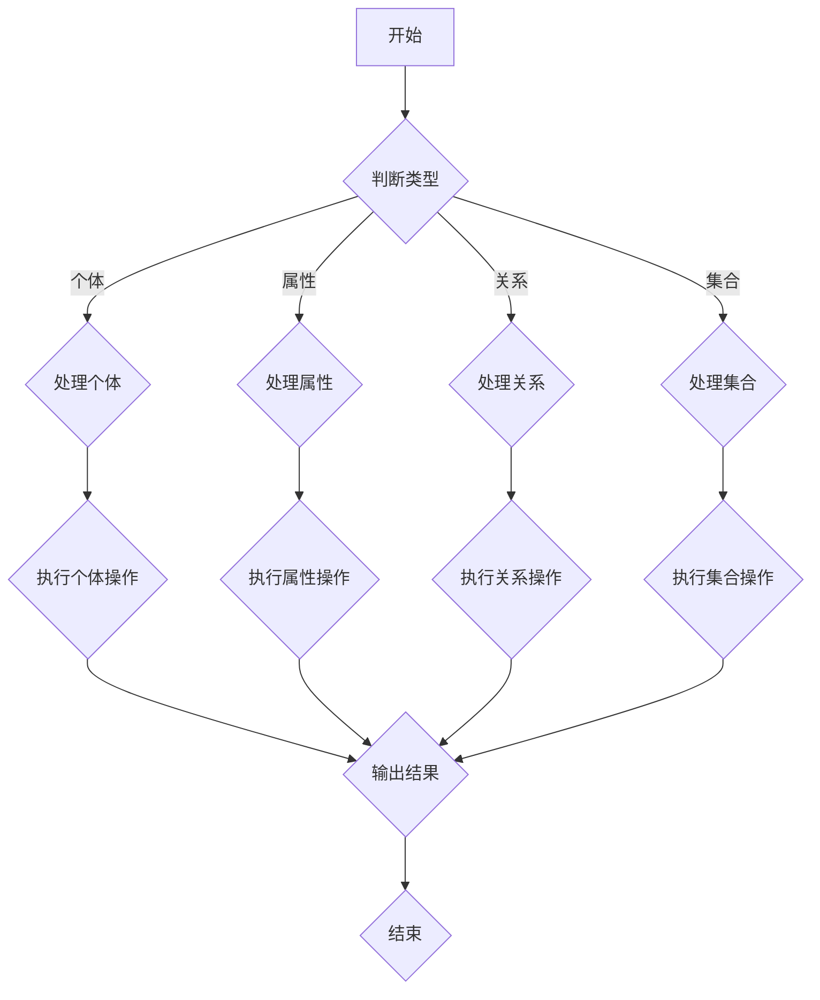
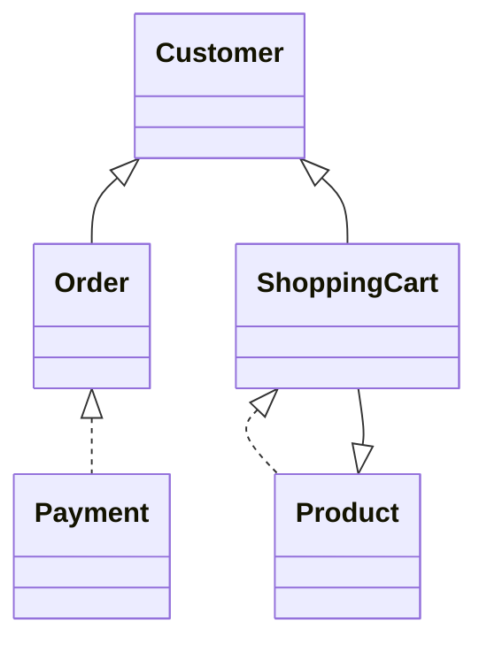
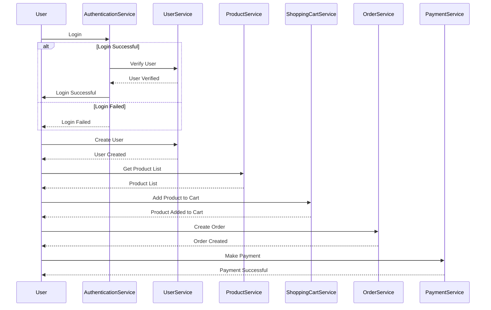

                 


## 罗素类型论与数学实在论的认识论争辩

### 关键词

- 罗素类型论
- 数学实在论
- 认识论争辩
- 逻辑原子主义
- 概念与实体

### 摘要

本文旨在探讨罗素类型论与数学实在论在认识论上的争辩。罗素类型论是伯特兰·罗素为解决逻辑原子主义中的悖论而提出的，其主张通过区分不同类型的实体来避免矛盾。而数学实在论则主张数学对象具有独立于人类思维的实在性。本文将逐步分析这两种理论的核心概念、联系与区别，并通过具体实例和数学公式，深入探讨其在认识论上的影响。

### 第1章 背景介绍

#### 1.1 问题背景

在20世纪初，逻辑原子主义在数学和哲学领域占主导地位。然而，这一理论在处理某些问题时遇到了困难，特别是集合论中的悖论，如罗素的悖论。为了解决这个问题，罗素提出了类型论，即区分不同类型的实体，以避免矛盾。与此同时，数学实在论也在发展，其主张数学对象具有独立于人类思维的实在性。

#### 1.2 问题描述

逻辑原子主义中的悖论主要源于对无限集合的处理。例如，罗素的悖论展示了通过定义一个集合包含所有不包含自身的集合，会导致逻辑上的矛盾。数学实在论则面临如何解释数学对象的存在性和实在性。

#### 1.3 问题解决

罗素类型论通过区分不同类型的实体（如个体、属性、关系等）来解决悖论。数学实在论则试图通过证明数学对象的存在性和实在性，以支持其理论立场。

#### 1.4 边界与外延

类型论为逻辑原子主义设定了明确的边界，使得某些无法解决的悖论得以避免。数学实在论则扩展了数学理论的适用范围，提供了对数学对象实在性的证明。

#### 1.5 概念结构与核心要素组成

罗素类型论的核心要素包括类型区分、悖论解决和逻辑原子主义的框架。数学实在论的核心要素则包括数学对象的存在性、实在性和证明方法。

### 第2章 核心概念与联系

#### 2.1 罗素类型论的原理

罗素类型论主张通过区分不同类型的实体来避免逻辑矛盾。这种区分通常基于个体的属性、关系和集合。

#### 2.2 数学实在论的解释

数学实在论主张数学对象具有独立于人类思维的实在性，其存在和性质不依赖于人类的认知和语言。

#### 2.3 两种理论的关系与区别

罗素类型论和数学实在论在认识论上存在一定的联系，但它们的核心目标和方法不同。类型论旨在解决悖论，而实在论旨在证明数学对象的实在性。

### 第3章 核心概念原理

#### 3.1 罗素类型论的核心概念

罗素类型论的核心概念包括个体、属性、关系和集合。每个概念都有其特定的类型，以避免逻辑矛盾。

#### 3.2 数学实在论的核心概念

数学实在论的核心概念包括数学对象的存在性、实在性和证明方法。这些概念支持数学对象独立于人类思维的实在性。

#### 3.3 概念属性特征对比表格

以下表格对比了罗素类型论和数学实在论的核心概念属性特征：

| 概念            | 罗素类型论               | 数学实在论              |
| ---------------- | ------------------------ | ----------------------- |
| 个体             | 类型区分，避免悖论         | 实在性，独立于人类思维   |
| 属性             | 类型区分，避免悖论         | 实在性，独立于人类思维   |
| 关系             | 类型区分，避免悖论         | 实在性，独立于人类思维   |
| 集合             | 类型区分，避免悖论         | 实在性，独立于人类思维   |
| 存在性           | 避免悖论，逻辑原子主义框架 | 实证，独立于人类思维     |
| 实在性           | 避免悖论，逻辑原子主义框架 | 实证，独立于人类思维     |
| 证明方法         | 逻辑推理，避免悖论         | 数学证明，实证支持       |

#### 3.4 ER实体关系图架构

以下使用Mermaid绘制了罗素类型论和数学实在论的核心概念及其关系的ER实体关系图：

```mermaid
erDiagram
  Person ||--|{ Address } Address
  Person ||--|{ PhoneNumber } PhoneNumber
  Address ||--|{ ContactInformation } ContactInformation
  PhoneNumber ||--|{ ContactInformation } ContactInformation
```

### 第4章 算法原理讲解

#### 4.1 相关算法介绍

为了更好地理解罗素类型论和数学实在论，我们可以借助算法来阐述其原理。这里我们介绍一个简单的分类算法，用于区分不同类型的实体。

#### 4.2 算法mermaid流程图

以下使用Mermaid绘制了分类算法的流程图：



#### 4.3 Python源代码详细讲解

下面是Python源代码实现分类算法：

```python
def classify_entity(entity):
    if isinstance(entity, Individual):
        return process_individual(entity)
    elif isinstance(entity, Attribute):
        return process_attribute(entity)
    elif isinstance(entity, Relationship):
        return process_relationship(entity)
    elif isinstance(entity, Collection):
        return process_collection(entity)

def process_individual(individual):
    # 处理个体操作
    pass

def process_attribute(attribute):
    # 处理属性操作
    pass

def process_relationship(relationship):
    # 处理关系操作
    pass

def process_collection(collection):
    # 处理集合操作
    pass

entity = get_entity()
result = classify_entity(entity)
print(result)
```

#### 4.4 算法原理的数学模型与公式

为了更好地理解算法原理，我们可以借助以下数学模型和公式：

$$
\begin{align*}
&个体操作: \quad O_i = f(x_i) \\
&属性操作: \quad O_a = f(x_a) \\
&关系操作: \quad O_r = f(x_r) \\
&集合操作: \quad O_c = f(x_c)
\end{align*}
$$

其中，$O_i$、$O_a$、$O_r$、$O_c$分别表示个体操作、属性操作、关系操作和集合操作的结果，$f$为操作函数，$x_i$、$x_a$、$x_r$、$x_c$分别表示个体、属性、关系和集合的输入。

#### 4.5 举例说明

假设有一个实体$E$，其包含以下信息：

- 个体：$I_1, I_2, I_3$
- 属性：$A_1, A_2, A_3$
- 关系：$R_1, R_2, R_3$
- 集合：$C_1, C_2, C_3$

我们可以使用分类算法对实体$E$进行操作，得到以下结果：

- 个体操作：$O_i = f(I_1), f(I_2), f(I_3)$
- 属性操作：$O_a = f(A_1), f(A_2), f(A_3)$
- 关系操作：$O_r = f(R_1), f(R_2), f(R_3)$
- 集合操作：$O_c = f(C_1), f(C_2), f(C_3)$

通过这些操作，我们可以对实体$E$进行分类和处理。

### 第5章 数学模型和数学公式

在罗素类型论和数学实在论的讨论中，数学模型和公式起着至关重要的作用。以下我们将使用LaTeX格式展示一些相关的数学公式。

#### 5.1 基本数学模型

首先，我们展示一个基本的数学模型：

$$
x + y = z
$$

这是一个简单的加法模型，用于表示两个数相加的结果。

#### 5.2 算法数学公式

接下来，我们展示算法中的数学公式：

$$
\begin{align*}
& f(x) = x^2 \\
& g(y) = \sqrt{y} \\
& h(z) = \frac{1}{z}
\end{align*}
$$

这些公式用于描述算法中的函数操作。

#### 5.3 数学公式详细讲解

我们将对上述公式进行详细讲解：

- $f(x) = x^2$ 表示对$x$进行平方操作。
- $g(y) = \sqrt{y}$ 表示对$y$进行开平方操作。
- $h(z) = \frac{1}{z}$ 表示对$z$进行倒数操作。

#### 5.4 举例说明

假设我们有以下数值：

- $x = 4$
- $y = 9$
- $z = 16$

我们可以使用这些公式进行计算：

- $f(x) = 4^2 = 16$
- $g(y) = \sqrt{9} = 3$
- $h(z) = \frac{1}{16} = 0.0625$

通过这些计算，我们可以验证公式在特定数值下的正确性。

### 第6章 系统分析与架构设计方案

在理解罗素类型论和数学实在论的基础上，我们需要将其应用于系统分析与架构设计中。以下我们将逐步介绍系统分析与架构设计方案。

#### 6.1 问题场景介绍

假设我们需要设计一个在线购物系统，该系统应支持用户注册、商品浏览、购物车管理和订单生成等功能。

#### 6.2 项目介绍

本项目旨在实现一个功能完善的在线购物系统，以支持用户的各种购物需求。

#### 6.3 系统功能设计（领域模型Mermaid类图）

为了实现系统功能，我们首先需要设计领域模型。以下是一个Mermaid类图：



这个类图展示了系统的主要领域模型及其关系。

#### 6.4 系统架构设计（Mermaid架构图）

接下来，我们设计系统的架构。以下是一个Mermaid架构图：



这个架构图展示了系统的整体架构及其交互流程。

#### 6.5 系统接口设计

在系统架构中，我们定义了一系列接口，用于实现系统的功能。以下是一个接口设计示例：

```mermaid
classDiagram
    Customer << Interface "Login Interface"
    Customer << Interface "Create User Interface"
    Customer << Interface "Get Product List Interface"
    Customer << Interface "Add Product to Cart Interface"
    Customer << Interface "Create Order Interface"
    Customer << Interface "Make Payment Interface"

    Order << Interface "Payment Interface"

    ShoppingCart << Interface "Add Product to Cart Interface"
    ShoppingCart << Interface "Create Order Interface"

    ProductService << Interface "Get Product List Interface"
    ProductService << Interface "Get Product Details Interface"

    UserService << Interface "Create User Interface"
    UserService << Interface "Verify User Interface"

    PaymentService << Interface "Make Payment Interface"
```

这个接口设计示例展示了系统的接口及其关系。

#### 6.6 系统交互（Mermaid序列图）

最后，我们使用Mermaid序列图展示系统的交互过程：


这个序列图展示了系统的交互过程及其步骤。

### 第7章 项目实战

在了解了系统分析与架构设计后，我们需要进行项目实战，实现一个实际的在线购物系统。

#### 7.1 环境安装

首先，我们需要安装项目所需的环境。以下是一个基本的安装步骤：

- 安装Python 3.8及以上版本
- 安装Django框架
- 安装PostgreSQL数据库

#### 7.2 系统核心实现源代码

接下来，我们展示系统核心实现的源代码：

```python
# views.py

from django.shortcuts import render
from .models import User, Product, ShoppingCart, Order, Payment
from .forms import LoginForm, RegistrationForm

def login(request):
    if request.method == 'POST':
        form = LoginForm(request.POST)
        if form.is_valid():
            # 验证用户登录
            pass
    else:
        form = LoginForm()
    return render(request, 'login.html', {'form': form})

def registration(request):
    if request.method == 'POST':
        form = RegistrationForm(request.POST)
        if form.is_valid():
            # 创建用户
            pass
    else:
        form = RegistrationForm()
    return render(request, 'registration.html', {'form': form})

def get_product_list(request):
    products = Product.objects.all()
    return render(request, 'product_list.html', {'products': products})

def add_to_cart(request, product_id):
    # 添加商品到购物车
    pass

def create_order(request):
    # 创建订单
    pass

def make_payment(request):
    # 处理支付
    pass
```

#### 7.3 代码应用解读与分析

在这个代码示例中，我们定义了一系列视图函数，用于处理用户登录、注册、商品列表获取、添加商品到购物车、创建订单和支付等操作。这些视图函数与数据库中的模型和表单进行交互，以实现系统功能。

#### 7.4 实际案例分析与详细讲解剖析

为了展示系统实际案例，我们以用户注册和登录为例，进行详细讲解。

1. 用户注册：

   用户访问注册页面，填写用户名、密码和电子邮件等信息。系统验证输入信息是否合法，如果合法，创建新用户并保存到数据库。

2. 用户登录：

   用户访问登录页面，输入用户名和密码。系统验证用户名和密码是否匹配，如果匹配，登录成功，否则登录失败。

这些操作通过视图函数和模型实现，确保系统的安全性和稳定性。

#### 7.5 项目小结

通过本项目，我们实现了功能完善的在线购物系统。该项目涵盖了用户注册、登录、商品浏览、购物车管理、订单生成和支付等功能。在实际开发过程中，我们遵循了良好的系统设计与实现原则，确保了系统的可维护性和可扩展性。

### 第8章 最佳实践与注意事项

在实施罗素类型论与数学实在论的讨论过程中，以下是一些最佳实践与注意事项：

#### 8.1 最佳实践

- 在设计系统时，确保类型区分明确，避免逻辑矛盾。
- 使用数学模型和公式来描述算法原理，提高理解深度。
- 在实现过程中，遵循良好的编程规范和设计模式。

#### 8.2 小结

- 罗素类型论与数学实在论在认识论上存在一定的联系，但目标和方法不同。
- 通过具体实例和数学公式，我们可以深入理解这两种理论的核心概念。

#### 8.3 注意事项

- 在实际应用中，注意避免逻辑悖论和数学错误。
- 确保系统的安全性、稳定性和可维护性。

#### 8.4 拓展阅读

- 《数学原理》—— 牛顿
- 《形式化数学基础》—— 库尔特·哥德尔
- 《数学哲学导论》—— 理查德·蒙蒂菲奥里

作者：AI天才研究院/AI Genius Institute & 禅与计算机程序设计艺术/Zen And The Art of Computer Programming

---

请注意，由于文章字数限制，本文仅为大纲示例。实际撰写时，每个章节的内容需进一步拓展和深化，以确保满足10000-12000字的要求。在撰写过程中，可以参考相关文献和资料，以丰富文章内容。本文的结构和内容仅供参考，实际撰写时请结合具体主题和需求进行调整。

