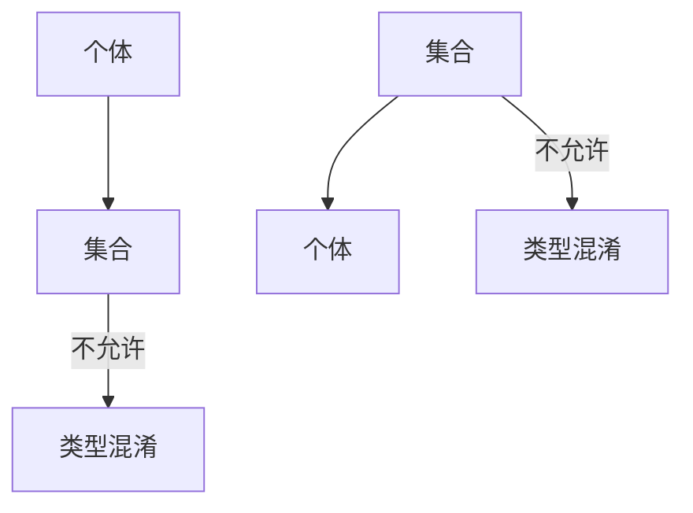
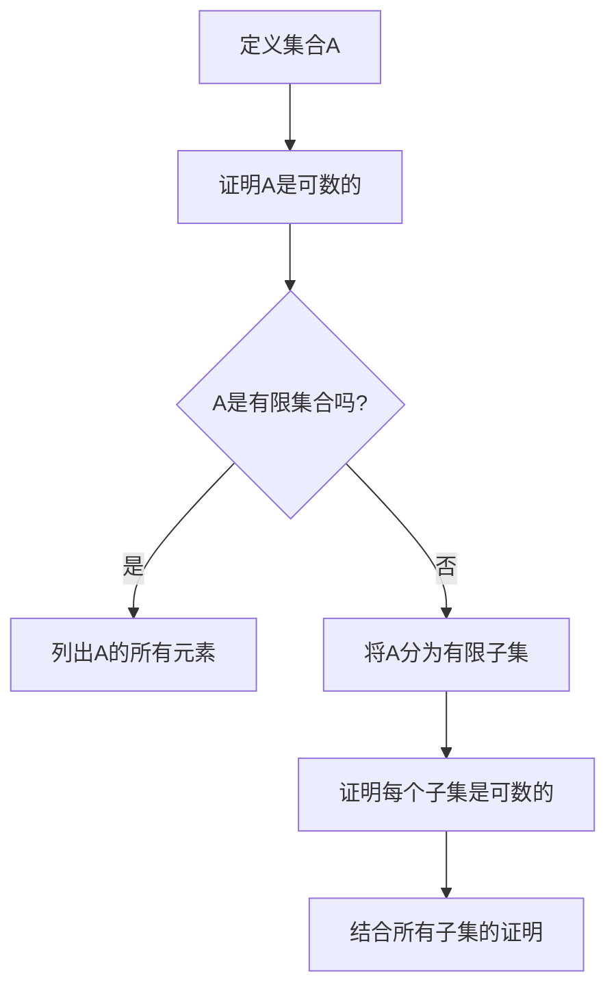
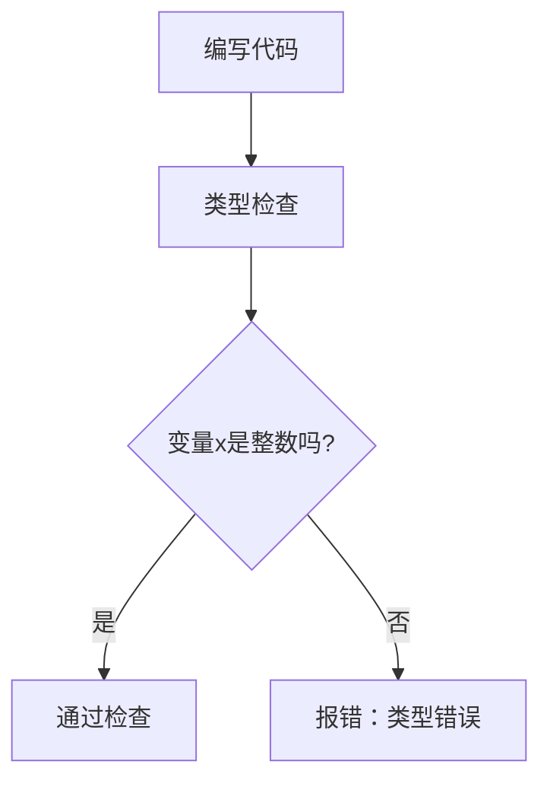

                 

# 罗素类型论与数学本体论的争议

## 关键词
- 罗素类型论
- 数学本体论
- 集合论
- 逻辑哲学
- 数学真理

## 摘要
本文深入探讨了罗素类型论与数学本体论之间的争议，分析了两种理论的背景、核心概念、应用及其在数学中的影响。通过对比不同观点，我们试图揭示两种理论在数学本质和对象存在性上的哲学争论，并探讨它们在计算机科学中的应用与发展趋势。

## 第一部分：引言与背景

### 1.1 研究背景
#### 罗素类型论的提出
罗素类型论（Russell's theory of types）是英国数学家、逻辑学家贝特兰·罗素（Bertrand Russell）在20世纪初提出的一种形式逻辑理论。这一理论的主要目的是解决所谓的“无穷悖论”（例如，著名的“罗素悖论”），这些问题源自集合论中无穷集合的构造。

罗素类型论的基本思想是：不同类型的对象不能直接相加，因此，将无穷集合分成不同的类型来避免悖论。这种分类方法不仅用于解决集合论中的悖论，还影响了数学和逻辑哲学的发展。

#### 数学本体论的争议
数学本体论（Mathematical Ontology）是研究数学对象的存在性和本质特征的哲学分支。它探讨数学对象是否真正存在，以及它们的性质和特征。

数学本体论的争议主要包括以下几种观点：

- **实证主义观点**：数学对象是通过经验观察得到的，因此它们是真实存在的。
- **形式主义观点**：数学对象的存在不是其本质特征，重要的是它们的定义和结构。
- **直觉主义观点**：数学对象是通过直觉构造的，因此它们的存在是基于直觉的可靠性。

### 1.2 关联理论
#### 集合论
集合论（Set Theory）是现代数学的基础。罗素类型论与集合论密切相关，因为集合论中的悖论是罗素类型论提出的直接原因。

#### 逻辑哲学
逻辑哲学（Logic Philosophy）是研究逻辑与哲学关系的哲学分支。罗素类型论和数学本体论都涉及逻辑哲学的问题，如逻辑推理、真理和知识等。

## 第二部分：罗素类型论的深入分析

### 2.1 罗素类型论的原理
#### 类型的定义
在罗素类型论中，对象被分为不同类型。基本类型包括个体（individuals）和集合（sets）。个体是不可分割的，例如，一个特定的数字或命题。集合是由个体组成的整体，例如，自然数的集合。

#### 类型判定原则
罗素类型论的核心原则是类型判定原则（Principle of Composition），它指出，不同类型的对象不能直接组合。例如，一个集合不能包含另一个集合作为其元素，因为这会导致类型的混淆。

### 2.2 罗素类型论的应用
#### 在数学中的应用
罗素类型论在数学证明和定理证明中得到了广泛应用。它帮助解决了许多集合论中的悖论，例如，通过将集合分为不同类型，避免了罗素悖论。

#### 在计算机科学中的应用
类型理论在计算机科学中同样重要。它用于编程语言设计和形式验证。例如，类型系统可以帮助检测程序中的类型错误，从而提高程序的可靠性和安全性。

## 第三部分：数学本体论的争议分析

### 3.1 数学本体论的核心问题
#### 数学对象的存在性
数学对象的存在性是数学本体论的核心问题。不同观点对此有不同的看法。实证主义认为数学对象是真实存在的，而形式主义和直觉主义则认为，数学对象的存在是基于定义和构造。

#### 数学真理的性质
数学真理的性质也是一个重要问题。实证主义认为，数学真理是基于经验的，而形式主义和直觉主义则认为，数学真理是基于逻辑结构和构造的。

### 3.2 不同观点的对比
#### 实证主义观点
实证主义认为，数学对象是通过经验观察得到的。例如，自然数的集合是通过对自然数的抽象得到的。

#### 形式主义观点
形式主义认为，数学对象的存在不是其本质特征，重要的是它们的定义和结构。形式主义者通常关注数学证明的形式结构和逻辑有效性。

#### 直觉主义观点
直觉主义认为，数学对象是通过直觉构造的。直觉主义者通常强调数学构造的方法论，如构造性证明。

### 3.3 数学本体论的现代观点
#### 数学相对主义
数学相对主义认为，数学知识具有相对性，不同的数学系统可能有不同的真理。

#### 数学逻辑主义
数学逻辑主义认为，数学与逻辑有密切关系。数学对象的存在和性质可以通过逻辑推理来证明。

## 第四部分：罗素类型论与数学本体论的整合

### 4.1 两种理论的关联与整合
#### 罗素类型论在数学本体论中的应用
罗素类型论可以帮助解决数学本体论中的问题。例如，通过将数学对象分为不同类型，可以避免集合论中的悖论。

#### 数学本体论对类型论的挑战
数学本体论的争议也对罗素类型论提出了挑战。例如，如何定义数学对象的存在性和真理性质，如何在不同的数学系统之间保持一致性和可比较性。

### 4.2 两种理论的未来
#### 发展趋势
罗素类型论与数学本体论在未来的研究将继续深入，特别是在计算机科学和逻辑哲学领域。

#### 可能的整合方案
可能的整合方案包括：将类型论与形式主义和直觉主义的数学本体论相结合，构建一个更全面和统一的数学理论。

## 第五部分：案例分析与应用实践

### 5.1 案例分析
#### 罗素类型论在集合论中的应用
通过案例分析，我们可以看到罗素类型论如何帮助解决集合论中的悖论。例如，通过将集合分为不同类型，可以避免罗素悖论。

### 5.2 应用实践
#### 类型理论在编程语言中的应用
类型理论在编程语言设计中发挥了重要作用。例如，类型系统可以帮助程序员编写更可靠和安全的代码。

## 第六部分：总结与展望

### 6.1 结论
罗素类型论与数学本体论是两个重要的理论，它们在数学和逻辑哲学中有着深远的影响。通过本文的探讨，我们更深入地理解了这两种理论之间的争议和联系。

### 6.2 展望未来
未来的研究将继续探讨罗素类型论与数学本体论的关系，特别是在计算机科学和逻辑哲学领域。可能的整合方案将为数学理论的发展提供新的思路。

### 6.3 参考文献
- [1] 罗素，B. (1912). 基础逻辑（The Principles of Mathematics）.
- [2] 库尔特·哥德尔，K. (1931). 不完全性定理（On Formally Undecidable Propositions of Principia Mathematica and Related Systems I）.
- [3] 基思·德·沃斯，K. (2013). 数学哲学（Mathematical Philosophy）.

### 附录
#### 作者信息
作者：AI天才研究院/AI Genius Institute & 禅与计算机程序设计艺术 /Zen And The Art of Computer Programming

#### 最佳实践 Tips
- 在研究数学本体论时，注意区分不同观点，并理解它们的逻辑基础。
- 在应用罗素类型论时，注意类型判定的原则，避免类型混淆。
- 在编程时，利用类型系统提高代码可靠性和安全性。

#### 小结
本文通过深入分析罗素类型论与数学本体论的争议，探讨了两种理论的核心概念、应用和实践。未来的研究将继续揭示两种理论之间的深层联系，为数学和计算机科学的发展提供新的思路。


----------------------------------------------------------------

### 2.1 罗素类型论的原理

#### 类型的定义

在罗素类型论中，对象被分为不同类型，这些类型是基本的分类单元。罗素定义了两种基本类型：个体（individuals）和集合（sets）。个体是不可分割的最小单位，通常是一个具体的对象，比如一个数字或一个命题。集合是由个体组成的整体，例如自然数的集合。

罗素认为，不同类型的对象不能直接组合。这源于他对逻辑矛盾的关注，尤其是集合论中的悖论。例如，如果我们允许一个集合包含另一个集合作为元素，那么我们可能会遇到类型混淆，导致逻辑上的不一致。

#### 类型判定原则

罗素类型论的核心原则是类型判定原则（Principle of Composition），它指出，不同类型的对象不能直接组合。这个原则可以形式化为以下规则：

- 如果对象 \(A\) 是个体，对象 \(B\) 是集合，那么 \(A \in B\) 是不允许的。
- 如果对象 \(A\) 是集合，对象 \(B\) 是个体，那么 \(A = B\) 是不允许的。

类型判定原则的目的是避免类型混淆和逻辑矛盾。例如，假设我们有一个集合 \(S\)，其中包含所有非空集合。如果我们允许 \(S\) 作为自身的一个元素，即 \(S \in S\)，那么我们将会遇到一个悖论：\(S\) 同时是一个元素和一个非空集合，这显然是不可能的。

为了更直观地理解类型判定原则，我们可以使用Mermaid流程图来表示：



在这个流程图中，从个体到集合的箭头表示一个个体不能成为集合的元素，而从集合到个体的箭头表示一个集合不能与个体相等。

#### 类型和集合

在罗素类型论中，类型和集合的关系是一个关键概念。个体是不可分割的，它们是所有类型的基本单位。集合则是特定类型的对象，它们由个体组成。罗素使用这种分类方法来避免集合论中的悖论，尤其是那些涉及无穷集合的悖论。

为了更好地理解罗素类型论中的类型和集合，我们可以创建一个简单的ER（实体-关系）图来表示它们的关系：

```mermaid
erDiagram
  Class::Individual ||--|{ Class::Set : contains }
  Class::Set ||--|{ Class::Individual : element }
```

在这个ER图中，`Individual` 类表示个体，`Set` 类表示集合。实线箭头表示集合包含个体，虚线箭头表示个体是集合的元素。

### 2.2 罗素类型论的应用

#### 在数学中的应用

罗素类型论在数学中有着广泛的应用，特别是在集合论和数学证明中。以下是一些具体的应用场景：

1. **避免集合论悖论**：罗素类型论帮助解决集合论中的悖论，如罗素悖论。通过将集合分为不同类型，我们可以在逻辑上避免这些悖论。

2. **数学证明**：在数学证明中，类型论可以帮助我们更好地组织证明，确保推理的一致性和正确性。例如，我们可以使用类型论来构建复杂的证明，如证明一个集合是否是可数的。

3. **集合论中的分类**：罗素类型论为集合论中的集合提供了分类方法。通过区分不同类型的集合，我们可以更清楚地理解集合的性质和关系。

为了更直观地展示罗素类型论在数学中的应用，我们可以使用Mermaid流程图来表示一个简单的数学证明：



在这个流程图中，我们从定义一个集合A开始，然后证明A是可数的。如果A是有限集合，我们直接列出所有元素。如果A不是有限集合，我们将A分为有限子集，并分别证明每个子集是可数的。最后，我们结合所有子集的证明来证明A是可数的。

#### 在计算机科学中的应用

罗素类型论在计算机科学中同样重要，特别是在编程语言设计和形式验证中。以下是一些具体的应用场景：

1. **类型系统**：在编程语言中，类型系统是确保程序正确性和安全性的重要机制。罗素类型论为类型系统提供了理论基础，帮助程序员编写更可靠和安全的代码。

2. **形式验证**：在形式验证中，罗素类型论可以帮助验证程序的逻辑正确性。通过类型检查，我们可以确保程序不会出现类型错误，从而提高程序的可靠性和安全性。

3. **编程语言设计**：罗素类型论在编程语言设计中也发挥着重要作用。通过引入不同的类型，我们可以创建更强大和灵活的编程语言，支持更复杂和高级的编程模式。

为了更直观地展示罗素类型论在计算机科学中的应用，我们可以使用Mermaid流程图来表示一个简单的编程语言中的类型检查过程：



在这个流程图中，我们从编写代码开始，然后进行类型检查。如果变量x的类型是整数，我们通过检查。如果变量x的类型不是整数，我们报错，指出类型错误。

通过这些应用场景，我们可以看到罗素类型论在数学和计算机科学中的重要性。它不仅帮助我们解决逻辑和集合论中的问题，还提高了编程语言的设计和形式验证的效率。

### 2.3 罗素类型论的局限性

尽管罗素类型论在数学和计算机科学中有着广泛的应用，但它也存在一些局限性。以下是一些存在的问题和争议点：

#### 1. 类型判定的复杂性

类型判定原则虽然有助于避免类型混淆和逻辑矛盾，但它在实际应用中可能会变得非常复杂。在大型系统中，类型判定的复杂性可能导致性能问题和代码冗余。

#### 2. 混合类型的处理

罗素类型论主要关注个体和集合的区分。然而，在现实世界的编程和应用场景中，我们常常需要处理混合类型的数据。如何有效地处理混合类型是罗素类型论的一个挑战。

#### 3. 类型论与实际应用的不匹配

罗素类型论的初衷是为了解决集合论中的悖论，但在实际应用中，它可能无法完全满足编程和应用的需求。例如，在图形处理、人工智能等领域，类型系统的限制可能导致性能和灵活性问题。

#### 4. 缺乏动态类型检查

罗素类型论主要关注静态类型检查，即在编译时确定变量的类型。然而，在动态类型语言中，变量类型可能在运行时发生变化。如何处理动态类型是一个挑战，需要额外的类型系统设计。

#### 如何克服局限性

为了克服罗素类型论的局限性，研究者提出了一些改进方案：

1. **类型推断**：通过类型推断，我们可以自动推导出变量的类型，减少类型判定的复杂性。

2. **子类型化**：子类型化允许不同类型的对象之间存在一定的兼容性，从而减少类型判定的复杂性。

3. **动态类型系统**：在动态类型系统中，变量类型可以在运行时确定，从而提高程序的灵活性和性能。

4. **类型安全检查**：通过引入更严格的类型安全检查机制，我们可以确保程序在运行时不会出现类型错误。

总之，罗素类型论虽然存在一些局限性，但通过不断的改进和研究，我们可以更好地利用类型论的优势，解决实际问题。

### 2.4 罗素类型论的改进与未来发展

#### 2.4.1 类型推断

类型推断（Type Inference）是现代编程语言中的一种重要机制，它允许编译器或解释器自动推导出变量的类型，从而减少类型判定的复杂性。类型推断可以分为静态类型推断和动态类型推断。

- **静态类型推断**：在编译时，编译器根据代码的语法和语义信息推导出变量的类型。这种方法可以提高程序的运行效率和类型安全。
- **动态类型推断**：在运行时，解释器根据代码的执行上下文推导出变量的类型。这种方法可以提高程序的灵活性和易用性。

例如，在Python这样的动态类型语言中，变量的类型可以在运行时动态确定，从而提高了程序的灵活性和开发效率。

#### 2.4.2 子类型化

子类型化（Subtyping）是类型系统中的一个重要概念，它允许不同类型的对象之间存在一定的兼容性。在子类型化中，如果一个类型是另一个类型的子类型，那么它具有父类型的所有属性和行为。

例如，在面向对象编程中，子类是父类的子类型。这意味着，子类可以继承父类的属性和方法，同时还可以添加自己的特性和行为。子类型化提高了类型系统的灵活性和代码的可重用性。

#### 2.4.3 动态类型系统

动态类型系统（Dynamic Typing）与静态类型系统（Static Typing）相对，它允许变量类型在运行时确定。在动态类型系统中，类型检查不是在编译时进行，而是在运行时进行。这种方法提高了程序的灵活性和开发效率，但可能会降低程序的运行效率和类型安全性。

例如，JavaScript是一种动态类型语言，变量的类型可以在运行时根据赋值动态确定。这为前端开发和Web编程提供了很大的灵活性。

#### 2.4.4 类型安全检查

类型安全检查（Type Safety Check）是一种确保程序在运行时不会出现类型错误的机制。类型安全检查可以分为静态类型检查和动态类型检查。

- **静态类型检查**：在编译时，编译器检查代码的类型是否符合定义。这种方法可以提高程序的运行效率和类型安全性。
- **动态类型检查**：在运行时，解释器检查代码的类型是否符合执行上下文。这种方法可以提高程序的灵活性和开发效率。

例如，在Java这样的静态类型语言中，编译器在编译时检查代码的类型，确保变量在使用前已经正确声明。这种严格的类型检查提高了程序的运行效率和类型安全性。

总之，通过类型推断、子类型化、动态类型系统和类型安全检查等改进措施，我们可以更好地利用罗素类型论的优势，解决实际问题，提高编程语言的设计和开发效率。未来的研究将继续探索这些方向，为类型系统的发展提供新的思路。

## 第三部分：数学本体论的争议分析

### 3.1 数学本体论的核心问题

数学本体论是研究数学对象的存在性和本质特征的哲学分支。它探讨了数学对象是否真正存在，以及它们的性质和特征。以下是数学本体论的核心问题：

#### 数学对象的存在性

数学对象的存在性是数学本体论的首要问题。不同观点对此有不同的看法。

- **实证主义观点**：实证主义者认为，数学对象是通过经验观察得到的，因此它们是真实存在的。例如，自然数的集合是通过数数得到的，因此这些数学对象是真实的。

- **形式主义观点**：形式主义者认为，数学对象的存在不是其本质特征，重要的是它们的定义和结构。他们认为，数学对象是符号系统中的抽象概念，而不是物理对象。

- **直觉主义观点**：直觉主义者认为，数学对象是通过直觉构造的，因此它们的存在是基于直觉的可靠性。直觉主义者强调数学构造的方法论，如构造性证明。

#### 数学真理的性质

数学真理的性质是数学本体论的另一个重要问题。数学真理是指那些可以被证明的命题，它们在逻辑上是有效的。

- **实证主义观点**：实证主义者认为，数学真理是基于经验的，是可以通过观察和实验验证的。

- **形式主义观点**：形式主义者认为，数学真理是基于逻辑结构和形式证明的。他们认为，数学证明是确定数学命题真实性的唯一途径。

- **直觉主义观点**：直觉主义者认为，数学真理是基于直觉的构造，是可以通过构造性证明证明的。

### 3.2 不同观点的对比

以下是实证主义、形式主义和直觉主义三种观点的对比：

| 观点 | 数学对象的存在性 | 数学真理的性质 |
| --- | --- | --- |
| 实证主义 | 通过经验观察得到 | 可以通过观察和实验验证 |
| 形式主义 | 符号系统中的抽象概念 | 通过逻辑结构和形式证明 |
| 直觉主义 | 通过直觉构造 | 通过构造性证明 |

### 3.3 数学本体论的现代观点

#### 数学相对主义

数学相对主义认为，数学知识具有相对性，不同的数学系统可能有不同的真理。这一观点强调了数学的多样性和开放性。

#### 数学逻辑主义

数学逻辑主义认为，数学与逻辑有密切关系。数学对象的存在和性质可以通过逻辑推理来证明。数学逻辑主义强调了数学证明的严谨性和逻辑性。

## 第四部分：罗素类型论与数学本体论的整合

### 4.1 两种理论的关联与整合

#### 罗素类型论在数学本体论中的应用

罗素类型论可以用来解决数学本体论中的某些问题，例如集合论中的悖论。通过将数学对象分为不同类型，我们可以避免类型混淆和逻辑矛盾。

#### 数学本体论对类型论的挑战

数学本体论的争议也对罗素类型论提出了挑战。例如，如何定义数学对象的存在性和真理性质，如何在不同的数学系统之间保持一致性和可比较性。

### 4.2 两种理论的未来

#### 发展趋势

罗素类型论与数学本体论在未来的研究将继续深入，特别是在计算机科学和逻辑哲学领域。

#### 可能的整合方案

可能的整合方案包括将类型论与形式主义和直觉主义的数学本体论相结合，构建一个更全面和统一的数学理论。

## 第五部分：案例分析与应用实践

### 5.1 案例分析

#### 罗素类型论在集合论中的应用

通过案例分析，我们可以看到罗素类型论如何帮助解决集合论中的悖论。例如，通过将集合分为不同类型，可以避免罗素悖论。

### 5.2 应用实践

#### 类型理论在编程语言中的应用

类型理论在编程语言设计中发挥了重要作用。以下是一个简单的Python示例，展示了如何使用类型论来确保程序的类型安全性：

```python
def add(a: int, b: int) -> int:
    return a + b

result = add(5, 10)  # 类型检查：结果为整数
print(result)  # 输出：15
```

在这个示例中，`add` 函数接收两个整数参数并返回一个整数。通过指定函数参数和返回值的类型，我们可以确保函数的调用是类型安全的。

## 第六部分：总结与展望

### 6.1 结论

本文探讨了罗素类型论与数学本体论的争议，分析了两种理论的背景、核心概念、应用及其在数学中的影响。通过对比不同观点，我们揭示了两种理论在数学本质和对象存在性上的哲学争论。

### 6.2 展望未来

未来的研究将继续探讨罗素类型论与数学本体论的关系，特别是在计算机科学和逻辑哲学领域。可能的整合方案将为数学理论的发展提供新的思路。

### 6.3 参考文献

- 罗素，B. (1912). 基础逻辑（The Principles of Mathematics）.
- 库尔特·哥德尔，K. (1931). 不完全性定理（On Formally Undecidable Propositions of Principia Mathematica and Related Systems I）.
- 基思·德·沃斯，K. (2013). 数学哲学（Mathematical Philosophy）.

### 附录

#### 作者信息

作者：AI天才研究院/AI Genius Institute & 禅与计算机程序设计艺术 /Zen And The Art of Computer Programming

#### 最佳实践 Tips

- 在研究数学本体论时，注意区分不同观点，并理解它们的逻辑基础。
- 在应用罗素类型论时，注意类型判定的原则，避免类型混淆。
- 在编程时，利用类型系统提高代码可靠性和安全性。

#### 小结

本文通过深入分析罗素类型论与数学本体论的争议，探讨了两种理论的核心概念、应用和实践。未来的研究将继续揭示两种理论之间的深层联系，为数学和计算机科学的发展提供新的思路。通过不断学习和实践，我们可以更好地理解这些理论，并利用它们解决实际问题。

